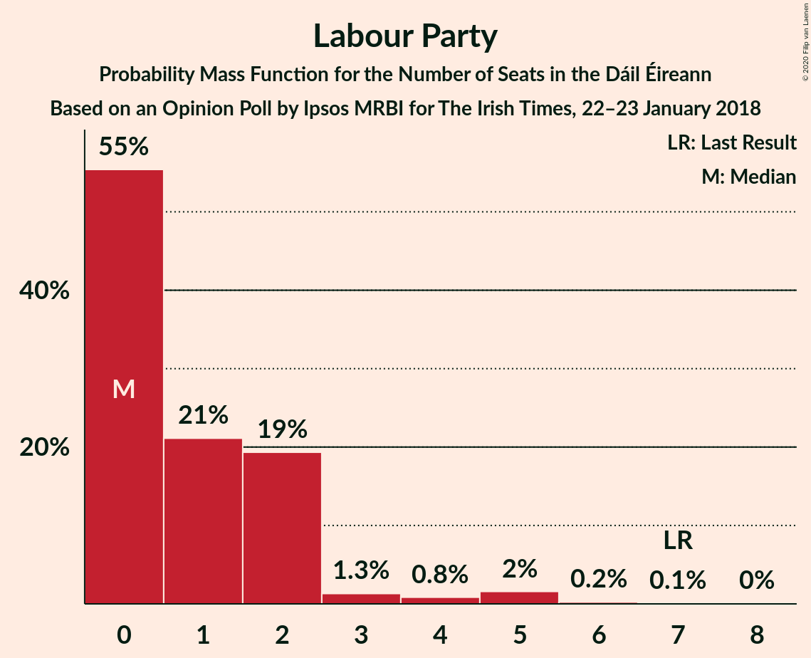
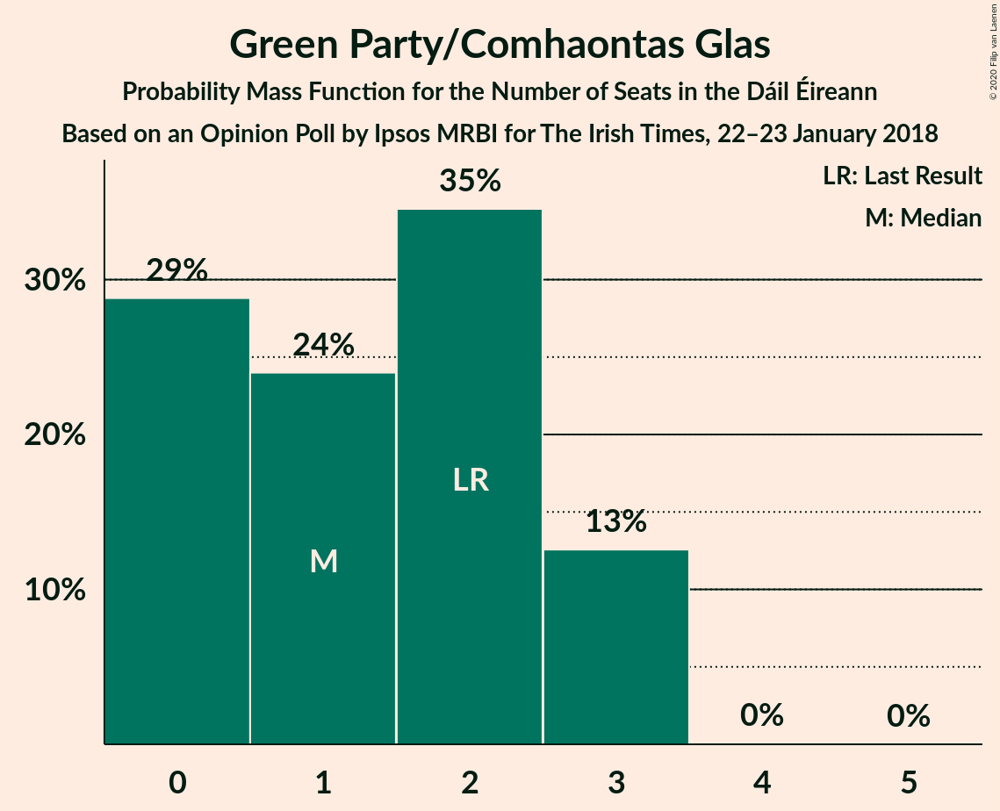
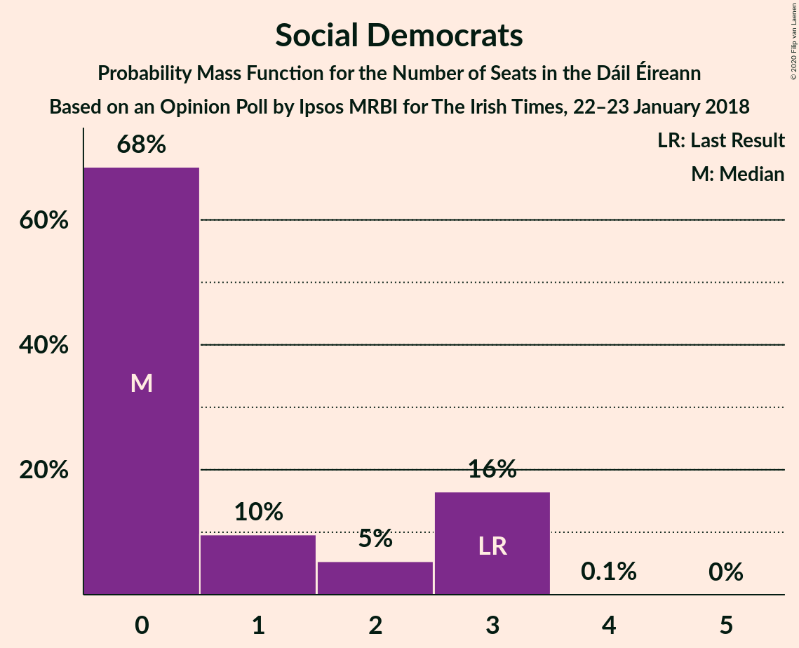
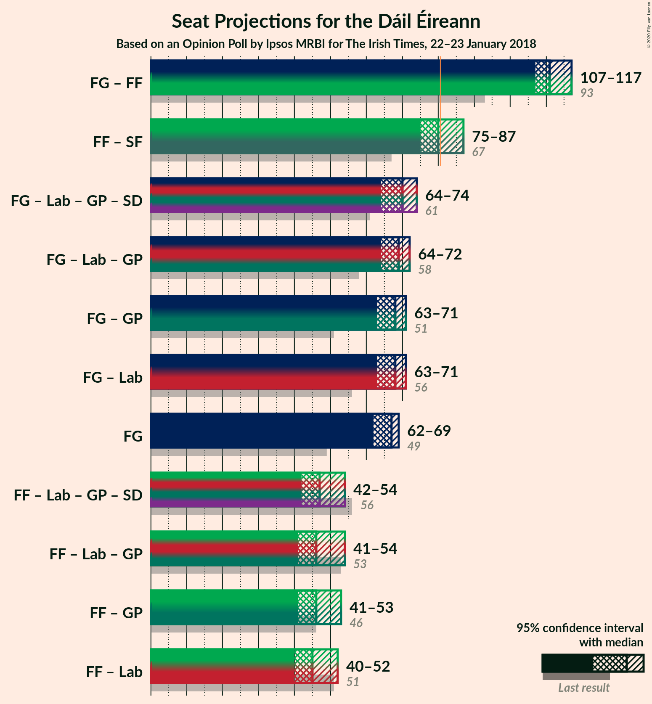

# Opinion Poll by Ipsos MRBI for The Irish Times, 22–23 January 2018

<a href="#voting-intentions">Voting Intentions</a> | <a href="#seats">Seats</a> | <a href="#coalitions">Coalitions</a> | <a href="#technical-information">Technical Information</a>

## Voting Intentions

### Confidence Intervals

| Party | Last Result | Poll Result | 80% Confidence Interval | 90% Confidence Interval | 95% Confidence Interval | 99% Confidence Interval |
|:-----:|:-----------:|:-----------:|:-----------------------:|:-----------------------:|:-----------------------:|:-----------------------:|
| Fine Gael | 25.5% | 34.0% | 32.3–35.8% |31.8–36.3% |31.4–36.7% |30.6–37.6% |
| Fianna Fáil | 24.3% | 25.0% | 23.4–26.7% |23.0–27.1% |22.6–27.5% |21.9–28.3% |
| Sinn Féin | 13.8% | 19.0% | 17.6–20.5% |17.2–21.0% |16.9–21.3% |16.2–22.1% |
| Independent | 15.9% | 9.3% | 8.3–10.5% |8.0–10.8% |7.8–11.1% |7.4–11.7% |
| Labour Party | 6.6% | 4.0% | 3.4–4.8% |3.2–5.1% |3.0–5.3% |2.7–5.7% |
| Green Party/Comhaontas Glas | 2.7% | 3.0% | 2.5–3.7% |2.3–3.9% |2.2–4.1% |1.9–4.5% |
| Solidarity–People Before Profit | 3.9% | 2.0% | 1.6–2.6% |1.4–2.8% |1.3–3.0% |1.2–3.3% |
| Independents 4 Change | 1.5% | 1.2% | 0.9–1.7% |0.8–1.8% |0.7–2.0% |0.6–2.2% |
| Social Democrats | 3.0% | 1.0% | 0.7–1.5% |0.6–1.6% |0.6–1.8% |0.5–2.0% |

*Note:* The poll result column reflects the actual value used in the calculations. Published results may vary slightly, and in addition be rounded to fewer digits.

## Seats

### Confidence Intervals

| Party | Last Result | Median | 80% Confidence Interval | 90% Confidence Interval | 95% Confidence Interval | 99% Confidence Interval |
|:-----:|:-----------:|:------:|:-----------------------:|:-----------------------:|:-----------------------:|:-----------------------:|
| <a href="#fine-gael">Fine Gael</a> | 49 | 67 | 65–68 |63–69 |62–69 |61–70 |
| <a href="#fianna-fáil">Fianna Fáil</a> | 44 | 45 | 41–49 |40–50 |39–51 |38–53 |
| <a href="#sinn-féin">Sinn Féin</a> | 23 | 36 | 33–39 |33–39 |32–39 |31–40 |
| <a href="#independent">Independent</a> | 19 | 6 | 4–8 |4–8 |4–8 |3–10 |
| <a href="#labour-party">Labour Party</a> | 7 | 0 | 0–2 |0–2 |0–4 |0–5 |
| <a href="#green-party/comhaontas-glas">Green Party/Comhaontas Glas</a> | 2 | 1 | 0–3 |0–3 |0–3 |0–3 |
| <a href="#solidarity–people-before-profit">Solidarity–People Before Profit</a> | 6 | 1 | 0–3 |0–4 |0–4 |0–4 |
| <a href="#independents-4-change">Independents 4 Change</a> | 4 | 3 | 0–4 |0–4 |0–5 |0–5 |
| <a href="#social-democrats">Social Democrats</a> | 3 | 0 | 0–3 |0–3 |0–3 |0–3 |

### Fine Gael

*For a full overview of the results for this party, see the [Fine Gael](party-finegael.html) page.*

| Number of Seats | Probability | Accumulated | Special Marks |
|:---------------:|:-----------:|:-----------:|:-------------:|
| 49 | 0% | 100% | Last Result |
| 50 | 0% | 100% |  |
| 51 | 0% | 100% |  |
| 52 | 0% | 100% |  |
| 53 | 0% | 100% |  |
| 54 | 0% | 100% |  |
| 55 | 0% | 100% |  |
| 56 | 0% | 100% |  |
| 57 | 0% | 100% |  |
| 58 | 0.1% | 100% |  |
| 59 | 0.1% | 99.9% |  |
| 60 | 0.3% | 99.8% |  |
| 61 | 1.5% | 99.5% |  |
| 62 | 2% | 98% |  |
| 63 | 2% | 96% |  |
| 64 | 4% | 94% |  |
| 65 | 7% | 91% |  |
| 66 | 16% | 83% |  |
| 67 | 39% | 68% | Median |
| 68 | 23% | 29% |  |
| 69 | 3% | 6% |  |
| 70 | 2% | 2% |  |
| 71 | 0.3% | 0.3% |  |
| 72 | 0% | 0% |  |

### Fianna Fáil

*For a full overview of the results for this party, see the [Fianna Fáil](party-fiannafáil.html) page.*

| Number of Seats | Probability | Accumulated | Special Marks |
|:---------------:|:-----------:|:-----------:|:-------------:|
| 37 | 0.2% | 100% |  |
| 38 | 0.5% | 99.8% |  |
| 39 | 2% | 99.3% |  |
| 40 | 3% | 97% |  |
| 41 | 12% | 94% |  |
| 42 | 12% | 82% |  |
| 43 | 8% | 70% |  |
| 44 | 12% | 63% | Last Result |
| 45 | 24% | 51% | Median |
| 46 | 7% | 26% |  |
| 47 | 5% | 20% |  |
| 48 | 4% | 14% |  |
| 49 | 3% | 10% |  |
| 50 | 2% | 7% |  |
| 51 | 3% | 5% |  |
| 52 | 1.0% | 2% |  |
| 53 | 0.8% | 1.1% |  |
| 54 | 0.3% | 0.3% |  |
| 55 | 0% | 0% |  |

### Sinn Féin

*For a full overview of the results for this party, see the [Sinn Féin](party-sinnféin.html) page.*

| Number of Seats | Probability | Accumulated | Special Marks |
|:---------------:|:-----------:|:-----------:|:-------------:|
| 23 | 0% | 100% | Last Result |
| 24 | 0% | 100% |  |
| 25 | 0% | 100% |  |
| 26 | 0% | 100% |  |
| 27 | 0% | 100% |  |
| 28 | 0% | 100% |  |
| 29 | 0% | 100% |  |
| 30 | 0.1% | 100% |  |
| 31 | 1.3% | 99.8% |  |
| 32 | 2% | 98.6% |  |
| 33 | 9% | 96% |  |
| 34 | 12% | 87% |  |
| 35 | 23% | 75% |  |
| 36 | 11% | 51% | Median |
| 37 | 13% | 41% |  |
| 38 | 9% | 27% |  |
| 39 | 17% | 19% |  |
| 40 | 2% | 2% |  |
| 41 | 0.4% | 0.4% |  |
| 42 | 0% | 0.1% |  |
| 43 | 0% | 0% |  |

### Independent

*For a full overview of the results for this party, see the [Independent](party-independent.html) page.*

| Number of Seats | Probability | Accumulated | Special Marks |
|:---------------:|:-----------:|:-----------:|:-------------:|
| 3 | 2% | 100% |  |
| 4 | 27% | 98% |  |
| 5 | 17% | 71% |  |
| 6 | 24% | 54% | Median |
| 7 | 20% | 30% |  |
| 8 | 8% | 10% |  |
| 9 | 2% | 2% |  |
| 10 | 0.3% | 0.7% |  |
| 11 | 0.3% | 0.4% |  |
| 12 | 0.1% | 0.1% |  |
| 13 | 0% | 0% |  |
| 14 | 0% | 0% |  |
| 15 | 0% | 0% |  |
| 16 | 0% | 0% |  |
| 17 | 0% | 0% |  |
| 18 | 0% | 0% |  |
| 19 | 0% | 0% | Last Result |

### Labour Party

*For a full overview of the results for this party, see the [Labour Party](party-labourparty.html) page.*

| Number of Seats | Probability | Accumulated | Special Marks |
|:---------------:|:-----------:|:-----------:|:-------------:|
| 0 | 55% | 100% | Median |
| 1 | 21% | 45% |  |
| 2 | 19% | 23% |  |
| 3 | 1.3% | 4% |  |
| 4 | 0.8% | 3% |  |
| 5 | 2% | 2% |  |
| 6 | 0.2% | 0.4% |  |
| 7 | 0.1% | 0.2% | Last Result |
| 8 | 0% | 0% |  |

### Green Party/Comhaontas Glas

*For a full overview of the results for this party, see the [Green Party/Comhaontas Glas](party-greenpartycomhaontasglas.html) page.*

| Number of Seats | Probability | Accumulated | Special Marks |
|:---------------:|:-----------:|:-----------:|:-------------:|
| 0 | 29% | 100% |  |
| 1 | 24% | 71% | Median |
| 2 | 35% | 47% | Last Result |
| 3 | 13% | 13% |  |
| 4 | 0% | 0.1% |  |
| 5 | 0% | 0% |  |

### Solidarity–People Before Profit

*For a full overview of the results for this party, see the [Solidarity–People Before Profit](party-solidarity–peoplebeforeprofit.html) page.*

| Number of Seats | Probability | Accumulated | Special Marks |
|:---------------:|:-----------:|:-----------:|:-------------:|
| 0 | 29% | 100% |  |
| 1 | 40% | 71% | Median |
| 2 | 3% | 31% |  |
| 3 | 21% | 28% |  |
| 4 | 7% | 7% |  |
| 5 | 0% | 0% |  |
| 6 | 0% | 0% | Last Result |

### Independents 4 Change

*For a full overview of the results for this party, see the [Independents 4 Change](party-independents4change.html) page.*

| Number of Seats | Probability | Accumulated | Special Marks |
|:---------------:|:-----------:|:-----------:|:-------------:|
| 0 | 24% | 100% |  |
| 1 | 14% | 76% |  |
| 2 | 8% | 61% |  |
| 3 | 6% | 54% | Median |
| 4 | 44% | 47% | Last Result |
| 5 | 3% | 3% |  |
| 6 | 0% | 0% |  |

### Social Democrats

*For a full overview of the results for this party, see the [Social Democrats](party-socialdemocrats.html) page.*

| Number of Seats | Probability | Accumulated | Special Marks |
|:---------------:|:-----------:|:-----------:|:-------------:|
| 0 | 68% | 100% | Median |
| 1 | 10% | 32% |  |
| 2 | 5% | 22% |  |
| 3 | 16% | 17% | Last Result |
| 4 | 0.1% | 0.1% |  |
| 5 | 0% | 0% |  |

## Coalitions

### Confidence Intervals

| Coalition | Last Result | Median | Majority? | 80% Confidence Interval | 90% Confidence Interval | 95% Confidence Interval | 99% Confidence Interval |
|:---------:|:-----------:|:------:|:---------:|:-----------------------:|:-----------------------:|:-----------------------:|:-----------------------:|
| Fine Gael – Fianna Fáil | 93 | 111 | 100% | 108–114 | 107–116 | 107–117 | 105–119 |
| Fianna Fáil – Sinn Féin | 67 | 80 | 44% | 77–84 | 76–86 | 75–87 | 74–90 |
| Fine Gael – Labour Party – Green Party/Comhaontas Glas – Social Democrats | 61 | 70 | 0% | 67–72 | 66–73 | 64–74 | 63–76 |
| Fine Gael – Labour Party – Green Party/Comhaontas Glas | 58 | 69 | 0% | 66–71 | 65–71 | 64–72 | 62–74 |
| Fine Gael – Green Party/Comhaontas Glas | 51 | 68 | 0% | 65–70 | 64–71 | 63–71 | 61–72 |
| Fine Gael – Labour Party | 56 | 68 | 0% | 66–69 | 64–70 | 63–71 | 62–72 |
| Fine Gael | 49 | 67 | 0% | 65–68 | 63–69 | 62–69 | 61–70 |
| Fianna Fáil – Labour Party – Green Party/Comhaontas Glas – Social Democrats | 56 | 47 | 0% | 43–52 | 43–54 | 42–54 | 40–57 |
| Fianna Fáil – Labour Party – Green Party/Comhaontas Glas | 53 | 46 | 0% | 42–51 | 42–53 | 41–54 | 40–55 |
| Fianna Fáil – Green Party/Comhaontas Glas | 46 | 46 | 0% | 42–50 | 41–51 | 41–53 | 39–54 |
| Fianna Fáil – Labour Party | 51 | 45 | 0% | 41–50 | 41–51 | 40–52 | 38–55 |

### Fine Gael – Fianna Fáil

| Number of Seats | Probability | Accumulated | Special Marks |
|:---------------:|:-----------:|:-----------:|:-------------:|
| 93 | 0% | 100% | Last Result |
| 94 | 0% | 100% |  |
| 95 | 0% | 100% |  |
| 96 | 0% | 100% |  |
| 97 | 0% | 100% |  |
| 98 | 0% | 100% |  |
| 99 | 0% | 100% |  |
| 100 | 0% | 100% |  |
| 101 | 0% | 100% |  |
| 102 | 0% | 100% |  |
| 103 | 0.1% | 100% |  |
| 104 | 0.2% | 99.9% |  |
| 105 | 0.6% | 99.7% |  |
| 106 | 1.3% | 99.1% |  |
| 107 | 5% | 98% |  |
| 108 | 7% | 93% |  |
| 109 | 14% | 86% |  |
| 110 | 11% | 71% |  |
| 111 | 15% | 61% |  |
| 112 | 25% | 45% | Median |
| 113 | 6% | 20% |  |
| 114 | 6% | 15% |  |
| 115 | 3% | 9% |  |
| 116 | 3% | 6% |  |
| 117 | 1.4% | 3% |  |
| 118 | 0.9% | 1.5% |  |
| 119 | 0.4% | 0.6% |  |
| 120 | 0.1% | 0.2% |  |
| 121 | 0% | 0% |  |

### Fianna Fáil – Sinn Féin

| Number of Seats | Probability | Accumulated | Special Marks |
|:---------------:|:-----------:|:-----------:|:-------------:|
| 67 | 0% | 100% | Last Result |
| 68 | 0% | 100% |  |
| 69 | 0% | 100% |  |
| 70 | 0% | 100% |  |
| 71 | 0% | 100% |  |
| 72 | 0% | 100% |  |
| 73 | 0.1% | 100% |  |
| 74 | 0.8% | 99.8% |  |
| 75 | 2% | 99.1% |  |
| 76 | 5% | 97% |  |
| 77 | 9% | 92% |  |
| 78 | 11% | 83% |  |
| 79 | 17% | 71% |  |
| 80 | 10% | 54% |  |
| 81 | 9% | 44% | Median, Majority |
| 82 | 10% | 35% |  |
| 83 | 8% | 25% |  |
| 84 | 9% | 17% |  |
| 85 | 3% | 9% |  |
| 86 | 2% | 5% |  |
| 87 | 2% | 3% |  |
| 88 | 0.4% | 1.3% |  |
| 89 | 0.3% | 0.9% |  |
| 90 | 0.2% | 0.6% |  |
| 91 | 0.4% | 0.4% |  |
| 92 | 0% | 0% |  |

### Fine Gael – Labour Party – Green Party/Comhaontas Glas – Social Democrats

| Number of Seats | Probability | Accumulated | Special Marks |
|:---------------:|:-----------:|:-----------:|:-------------:|
| 60 | 0% | 100% |  |
| 61 | 0.1% | 99.9% | Last Result |
| 62 | 0.2% | 99.9% |  |
| 63 | 0.8% | 99.6% |  |
| 64 | 2% | 98.9% |  |
| 65 | 2% | 97% |  |
| 66 | 4% | 96% |  |
| 67 | 11% | 92% |  |
| 68 | 14% | 81% | Median |
| 69 | 12% | 67% |  |
| 70 | 24% | 55% |  |
| 71 | 15% | 30% |  |
| 72 | 7% | 16% |  |
| 73 | 5% | 9% |  |
| 74 | 2% | 4% |  |
| 75 | 1.1% | 2% |  |
| 76 | 0.4% | 0.6% |  |
| 77 | 0.2% | 0.2% |  |
| 78 | 0% | 0% |  |

### Fine Gael – Labour Party – Green Party/Comhaontas Glas

| Number of Seats | Probability | Accumulated | Special Marks |
|:---------------:|:-----------:|:-----------:|:-------------:|
| 58 | 0% | 100% | Last Result |
| 59 | 0% | 100% |  |
| 60 | 0.1% | 100% |  |
| 61 | 0.2% | 99.9% |  |
| 62 | 0.4% | 99.7% |  |
| 63 | 0.9% | 99.4% |  |
| 64 | 3% | 98% |  |
| 65 | 3% | 96% |  |
| 66 | 4% | 93% |  |
| 67 | 15% | 89% |  |
| 68 | 16% | 74% | Median |
| 69 | 15% | 58% |  |
| 70 | 25% | 43% |  |
| 71 | 13% | 18% |  |
| 72 | 3% | 5% |  |
| 73 | 1.2% | 2% |  |
| 74 | 0.5% | 0.7% |  |
| 75 | 0.2% | 0.3% |  |
| 76 | 0% | 0% |  |

### Fine Gael – Green Party/Comhaontas Glas

| Number of Seats | Probability | Accumulated | Special Marks |
|:---------------:|:-----------:|:-----------:|:-------------:|
| 51 | 0% | 100% | Last Result |
| 52 | 0% | 100% |  |
| 53 | 0% | 100% |  |
| 54 | 0% | 100% |  |
| 55 | 0% | 100% |  |
| 56 | 0% | 100% |  |
| 57 | 0% | 100% |  |
| 58 | 0% | 100% |  |
| 59 | 0% | 100% |  |
| 60 | 0.2% | 99.9% |  |
| 61 | 0.7% | 99.7% |  |
| 62 | 1.3% | 99.0% |  |
| 63 | 2% | 98% |  |
| 64 | 2% | 96% |  |
| 65 | 5% | 94% |  |
| 66 | 6% | 89% |  |
| 67 | 18% | 83% |  |
| 68 | 21% | 66% | Median |
| 69 | 24% | 45% |  |
| 70 | 15% | 20% |  |
| 71 | 3% | 5% |  |
| 72 | 2% | 2% |  |
| 73 | 0.4% | 0.4% |  |
| 74 | 0% | 0% |  |

### Fine Gael – Labour Party

| Number of Seats | Probability | Accumulated | Special Marks |
|:---------------:|:-----------:|:-----------:|:-------------:|
| 56 | 0% | 100% | Last Result |
| 57 | 0% | 100% |  |
| 58 | 0% | 100% |  |
| 59 | 0% | 100% |  |
| 60 | 0.1% | 99.9% |  |
| 61 | 0.2% | 99.8% |  |
| 62 | 1.0% | 99.6% |  |
| 63 | 2% | 98.6% |  |
| 64 | 3% | 96% |  |
| 65 | 3% | 93% |  |
| 66 | 6% | 90% |  |
| 67 | 29% | 84% | Median |
| 68 | 36% | 55% |  |
| 69 | 13% | 19% |  |
| 70 | 3% | 6% |  |
| 71 | 2% | 3% |  |
| 72 | 0.5% | 0.7% |  |
| 73 | 0.2% | 0.2% |  |
| 74 | 0% | 0% |  |

### Fine Gael

| Number of Seats | Probability | Accumulated | Special Marks |
|:---------------:|:-----------:|:-----------:|:-------------:|
| 49 | 0% | 100% | Last Result |
| 50 | 0% | 100% |  |
| 51 | 0% | 100% |  |
| 52 | 0% | 100% |  |
| 53 | 0% | 100% |  |
| 54 | 0% | 100% |  |
| 55 | 0% | 100% |  |
| 56 | 0% | 100% |  |
| 57 | 0% | 100% |  |
| 58 | 0.1% | 100% |  |
| 59 | 0.1% | 99.9% |  |
| 60 | 0.3% | 99.8% |  |
| 61 | 1.5% | 99.5% |  |
| 62 | 2% | 98% |  |
| 63 | 2% | 96% |  |
| 64 | 4% | 94% |  |
| 65 | 7% | 91% |  |
| 66 | 16% | 83% |  |
| 67 | 39% | 68% | Median |
| 68 | 23% | 29% |  |
| 69 | 3% | 6% |  |
| 70 | 2% | 2% |  |
| 71 | 0.3% | 0.3% |  |
| 72 | 0% | 0% |  |

### Fianna Fáil – Labour Party – Green Party/Comhaontas Glas – Social Democrats

| Number of Seats | Probability | Accumulated | Special Marks |
|:---------------:|:-----------:|:-----------:|:-------------:|
| 39 | 0.2% | 100% |  |
| 40 | 0.7% | 99.7% |  |
| 41 | 1.3% | 99.0% |  |
| 42 | 2% | 98% |  |
| 43 | 10% | 95% |  |
| 44 | 9% | 86% |  |
| 45 | 11% | 77% |  |
| 46 | 11% | 66% | Median |
| 47 | 9% | 55% |  |
| 48 | 12% | 46% |  |
| 49 | 9% | 34% |  |
| 50 | 10% | 25% |  |
| 51 | 4% | 14% |  |
| 52 | 3% | 10% |  |
| 53 | 3% | 8% |  |
| 54 | 3% | 5% |  |
| 55 | 1.1% | 2% |  |
| 56 | 0.7% | 1.2% | Last Result |
| 57 | 0.4% | 0.5% |  |
| 58 | 0.1% | 0.1% |  |
| 59 | 0% | 0% |  |

### Fianna Fáil – Labour Party – Green Party/Comhaontas Glas

| Number of Seats | Probability | Accumulated | Special Marks |
|:---------------:|:-----------:|:-----------:|:-------------:|
| 38 | 0.2% | 100% |  |
| 39 | 0.3% | 99.8% |  |
| 40 | 1.2% | 99.5% |  |
| 41 | 3% | 98% |  |
| 42 | 6% | 96% |  |
| 43 | 11% | 90% |  |
| 44 | 9% | 79% |  |
| 45 | 11% | 71% |  |
| 46 | 14% | 59% | Median |
| 47 | 8% | 45% |  |
| 48 | 12% | 37% |  |
| 49 | 5% | 25% |  |
| 50 | 8% | 20% |  |
| 51 | 4% | 12% |  |
| 52 | 2% | 8% |  |
| 53 | 3% | 6% | Last Result |
| 54 | 1.2% | 3% |  |
| 55 | 0.8% | 1.3% |  |
| 56 | 0.4% | 0.5% |  |
| 57 | 0.1% | 0.1% |  |
| 58 | 0% | 0% |  |

### Fianna Fáil – Green Party/Comhaontas Glas

| Number of Seats | Probability | Accumulated | Special Marks |
|:---------------:|:-----------:|:-----------:|:-------------:|
| 38 | 0.2% | 100% |  |
| 39 | 0.4% | 99.8% |  |
| 40 | 2% | 99.4% |  |
| 41 | 3% | 98% |  |
| 42 | 10% | 94% |  |
| 43 | 10% | 84% |  |
| 44 | 11% | 74% |  |
| 45 | 11% | 63% |  |
| 46 | 16% | 52% | Last Result, Median |
| 47 | 11% | 37% |  |
| 48 | 9% | 25% |  |
| 49 | 5% | 16% |  |
| 50 | 3% | 11% |  |
| 51 | 3% | 8% |  |
| 52 | 2% | 5% |  |
| 53 | 2% | 3% |  |
| 54 | 1.0% | 1.2% |  |
| 55 | 0.2% | 0.2% |  |
| 56 | 0% | 0% |  |

### Fianna Fáil – Labour Party

| Number of Seats | Probability | Accumulated | Special Marks |
|:---------------:|:-----------:|:-----------:|:-------------:|
| 37 | 0.1% | 100% |  |
| 38 | 0.4% | 99.8% |  |
| 39 | 2% | 99.4% |  |
| 40 | 2% | 98% |  |
| 41 | 7% | 96% |  |
| 42 | 11% | 88% |  |
| 43 | 8% | 78% |  |
| 44 | 11% | 70% |  |
| 45 | 17% | 59% | Median |
| 46 | 13% | 42% |  |
| 47 | 10% | 30% |  |
| 48 | 6% | 20% |  |
| 49 | 3% | 14% |  |
| 50 | 4% | 11% |  |
| 51 | 3% | 7% | Last Result |
| 52 | 2% | 4% |  |
| 53 | 1.0% | 2% |  |
| 54 | 0.5% | 1.2% |  |
| 55 | 0.6% | 0.7% |  |
| 56 | 0.1% | 0.1% |  |
| 57 | 0% | 0% |  |

## Technical Information

### Opinion Poll

+ **Polling firm:** Ipsos MRBI
+ **Commissioner(s):** The Irish Times
+ **Fieldwork period:** 22–23 January 2018

### Calculations

+ **Sample size:** 1200
+ **Simulations done:** 1,048,576
+ **Error estimate:** 1.31%

