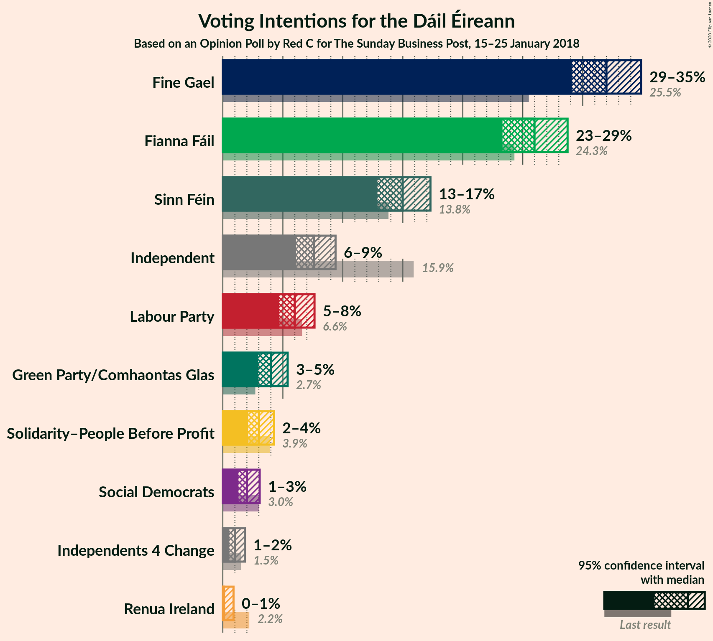
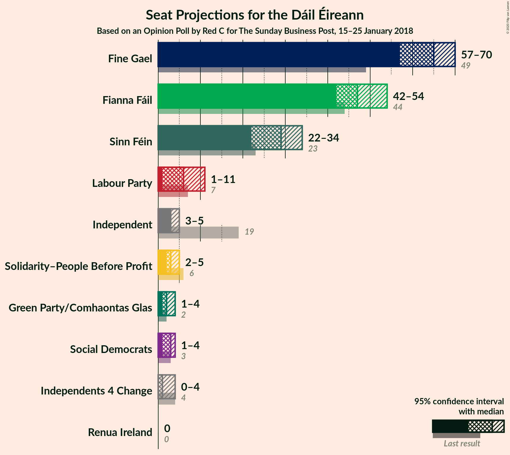
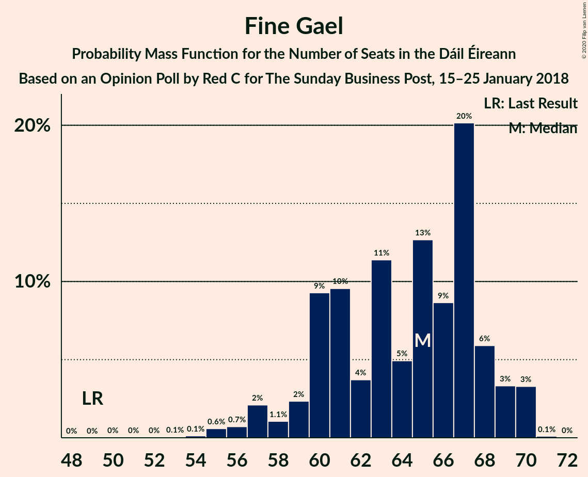
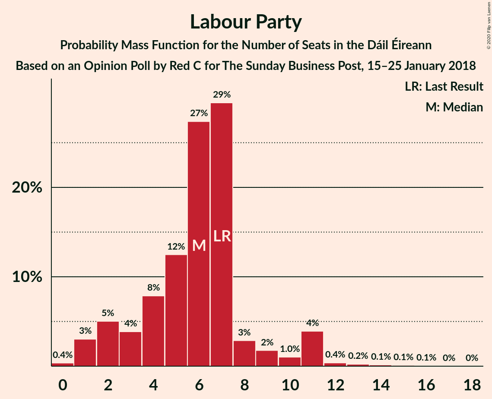
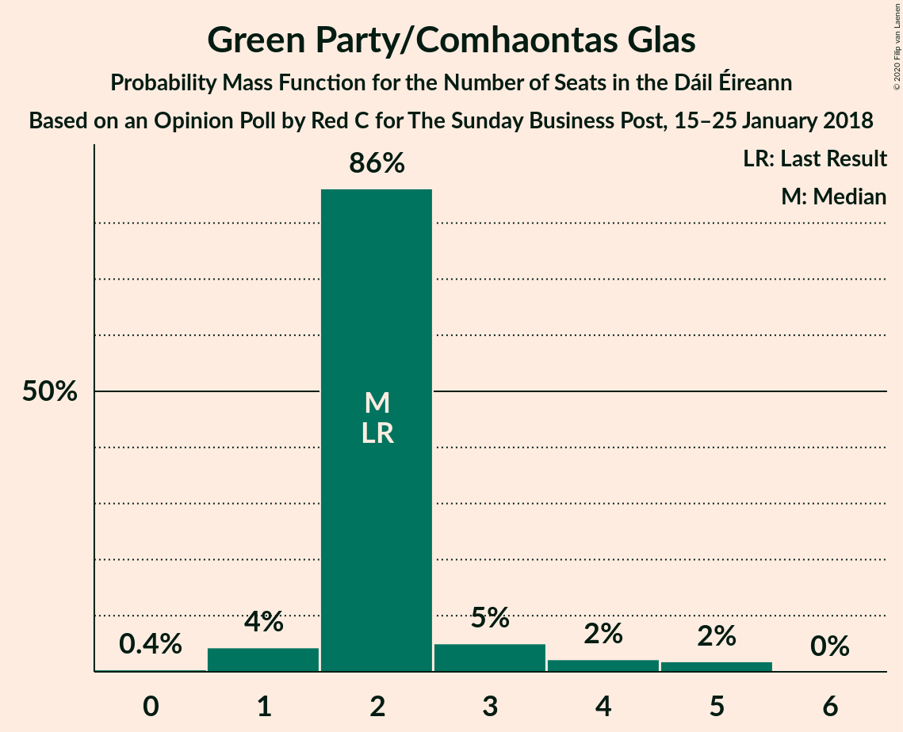
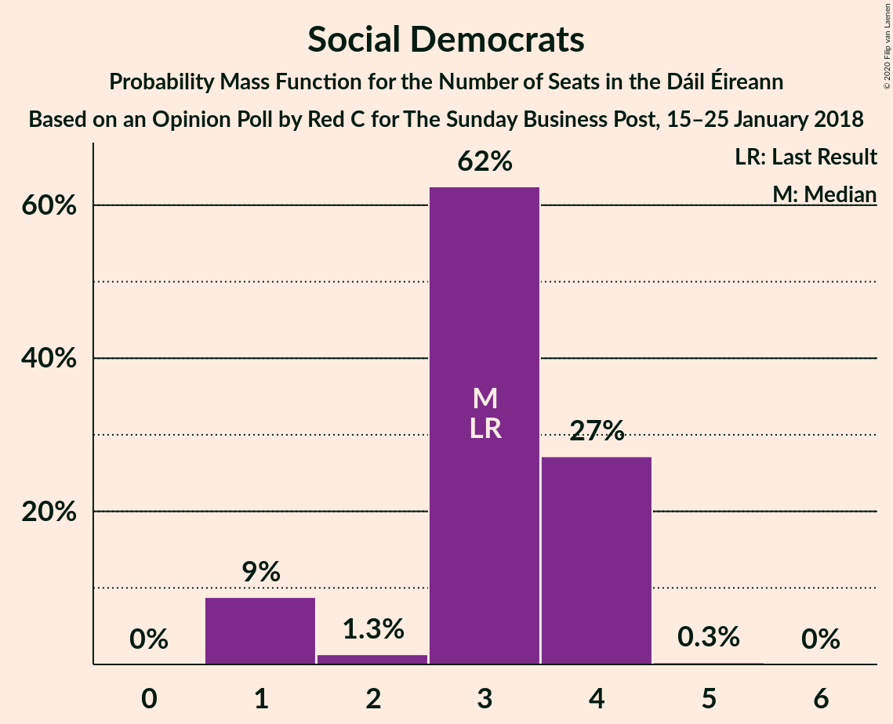

# Opinion Poll by Red C for The Sunday Business Post, 15–25 January 2018

<a href="#voting-intentions">Voting Intentions</a> | <a href="#seats">Seats</a> | <a href="#coalitions">Coalitions</a> | <a href="#technical-information">Technical Information</a>

## Voting Intentions

### Confidence Intervals

| Party | Last Result | Poll Result | 80% Confidence Interval | 90% Confidence Interval | 95% Confidence Interval | 99% Confidence Interval |
|:-----:|:-----------:|:-----------:|:-----------------------:|:-----------------------:|:-----------------------:|:-----------------------:|
| Fine Gael | 25.5% | 31.9% | 30.1–33.8% |29.5–34.4% |29.1–34.9% |28.2–35.8% |
| Fianna Fáil | 24.3% | 25.9% | 24.2–27.8% |23.7–28.3% |23.3–28.7% |22.5–29.6% |
| Sinn Féin | 13.8% | 15.0% | 13.6–16.5% |13.2–16.9% |12.9–17.3% |12.3–18.1% |
| Independent | 15.9% | 7.6% | 6.6–8.8% |6.3–9.1% |6.1–9.4% |5.7–10.0% |
| Labour Party | 6.6% | 6.0% | 5.1–7.1% |4.9–7.4% |4.7–7.6% |4.3–8.2% |
| Green Party/Comhaontas Glas | 2.7% | 4.0% | 3.3–4.9% |3.1–5.2% |2.9–5.4% |2.6–5.9% |
| Solidarity–People Before Profit | 3.9% | 3.0% | 2.4–3.8% |2.2–4.0% |2.1–4.3% |1.8–4.7% |
| Social Democrats | 3.0% | 2.0% | 1.5–2.7% |1.4–2.9% |1.3–3.1% |1.1–3.4% |
| Independents 4 Change | 1.5% | 1.0% | 0.7–1.5% |0.6–1.7% |0.5–1.8% |0.4–2.1% |
| Renua Ireland | 2.2% | 0.3% | 0.2–0.7% |0.1–0.8% |0.1–0.9% |0.1–1.1% |

*Note:* The poll result column reflects the actual value used in the calculations. Published results may vary slightly, and in addition be rounded to fewer digits.

## Seats

### Confidence Intervals

| Party | Last Result | Median | 80% Confidence Interval | 90% Confidence Interval | 95% Confidence Interval | 99% Confidence Interval |
|:-----:|:-----------:|:------:|:-----------------------:|:-----------------------:|:-----------------------:|:-----------------------:|
| <a href="#fine-gael">Fine Gael</a> | 49 | 66 | 60–69 |59–70 |58–70 |55–70 |
| <a href="#fianna-fáil">Fianna Fáil</a> | 44 | 46 | 44–53 |43–53 |43–55 |41–56 |
| <a href="#sinn-féin">Sinn Féin</a> | 23 | 29 | 26–32 |23–33 |22–33 |19–35 |
| <a href="#independent">Independent</a> | 19 | 3 | 3 |3–4 |3–4 |3–6 |
| <a href="#labour-party">Labour Party</a> | 7 | 6 | 3–7 |1–9 |1–12 |0–13 |
| <a href="#green-party/comhaontas-glas">Green Party/Comhaontas Glas</a> | 2 | 2 | 1–3 |1–4 |1–5 |0–5 |
| <a href="#solidarity–people-before-profit">Solidarity–People Before Profit</a> | 6 | 3 | 3–4 |2–6 |2–7 |1–7 |
| <a href="#social-democrats">Social Democrats</a> | 3 | 3 | 3–4 |2–4 |1–4 |1–4 |
| <a href="#independents-4-change">Independents 4 Change</a> | 4 | 2 | 0–3 |0–4 |0–4 |0–5 |
| <a href="#renua-ireland">Renua Ireland</a> | 0 | 0 | 0 |0 |0 |0 |

### Fine Gael

*For a full overview of the results for this party, see the [Fine Gael](party-finegael.html) page.*

| Number of Seats | Probability | Accumulated | Special Marks |
|:---------------:|:-----------:|:-----------:|:-------------:|
| 49 | 0% | 100% | Last Result |
| 50 | 0% | 100% |  |
| 51 | 0% | 100% |  |
| 52 | 0.1% | 100% |  |
| 53 | 0.1% | 99.9% |  |
| 54 | 0% | 99.8% |  |
| 55 | 0.4% | 99.7% |  |
| 56 | 0.5% | 99.4% |  |
| 57 | 0.7% | 98.8% |  |
| 58 | 1.3% | 98% |  |
| 59 | 2% | 97% |  |
| 60 | 7% | 94% |  |
| 61 | 3% | 87% |  |
| 62 | 4% | 84% |  |
| 63 | 20% | 80% |  |
| 64 | 7% | 60% |  |
| 65 | 3% | 54% |  |
| 66 | 4% | 51% | Median |
| 67 | 27% | 47% |  |
| 68 | 2% | 20% |  |
| 69 | 9% | 18% |  |
| 70 | 9% | 10% |  |
| 71 | 0.4% | 0.4% |  |
| 72 | 0% | 0% |  |

### Fianna Fáil

*For a full overview of the results for this party, see the [Fianna Fáil](party-fiannafáil.html) page.*

| Number of Seats | Probability | Accumulated | Special Marks |
|:---------------:|:-----------:|:-----------:|:-------------:|
| 40 | 0.2% | 100% |  |
| 41 | 0.4% | 99.8% |  |
| 42 | 1.0% | 99.4% |  |
| 43 | 6% | 98% |  |
| 44 | 2% | 92% | Last Result |
| 45 | 27% | 90% |  |
| 46 | 20% | 62% | Median |
| 47 | 12% | 42% |  |
| 48 | 3% | 30% |  |
| 49 | 5% | 26% |  |
| 50 | 2% | 22% |  |
| 51 | 4% | 19% |  |
| 52 | 3% | 15% |  |
| 53 | 8% | 12% |  |
| 54 | 0.5% | 4% |  |
| 55 | 3% | 3% |  |
| 56 | 0.4% | 0.6% |  |
| 57 | 0.1% | 0.2% |  |
| 58 | 0% | 0.1% |  |
| 59 | 0.1% | 0.1% |  |
| 60 | 0% | 0% |  |

### Sinn Féin

*For a full overview of the results for this party, see the [Sinn Féin](party-sinnféin.html) page.*

| Number of Seats | Probability | Accumulated | Special Marks |
|:---------------:|:-----------:|:-----------:|:-------------:|
| 17 | 0% | 100% |  |
| 18 | 0% | 99.9% |  |
| 19 | 0.4% | 99.9% |  |
| 20 | 0.3% | 99.5% |  |
| 21 | 0.8% | 99.2% |  |
| 22 | 2% | 98% |  |
| 23 | 2% | 97% | Last Result |
| 24 | 1.4% | 95% |  |
| 25 | 3% | 93% |  |
| 26 | 20% | 91% |  |
| 27 | 11% | 71% |  |
| 28 | 4% | 60% |  |
| 29 | 10% | 56% | Median |
| 30 | 13% | 46% |  |
| 31 | 6% | 33% |  |
| 32 | 20% | 27% |  |
| 33 | 5% | 7% |  |
| 34 | 0.7% | 1.3% |  |
| 35 | 0.6% | 0.6% |  |
| 36 | 0% | 0% |  |

### Independent

*For a full overview of the results for this party, see the [Independent](party-independent.html) page.*

| Number of Seats | Probability | Accumulated | Special Marks |
|:---------------:|:-----------:|:-----------:|:-------------:|
| 2 | 0.1% | 100% |  |
| 3 | 92% | 99.9% | Median |
| 4 | 7% | 8% |  |
| 5 | 0.2% | 1.1% |  |
| 6 | 0.6% | 0.9% |  |
| 7 | 0.1% | 0.3% |  |
| 8 | 0.1% | 0.2% |  |
| 9 | 0% | 0.1% |  |
| 10 | 0% | 0% |  |
| 11 | 0% | 0% |  |
| 12 | 0% | 0% |  |
| 13 | 0% | 0% |  |
| 14 | 0% | 0% |  |
| 15 | 0% | 0% |  |
| 16 | 0% | 0% |  |
| 17 | 0% | 0% |  |
| 18 | 0% | 0% |  |
| 19 | 0% | 0% | Last Result |

### Labour Party

*For a full overview of the results for this party, see the [Labour Party](party-labourparty.html) page.*

| Number of Seats | Probability | Accumulated | Special Marks |
|:---------------:|:-----------:|:-----------:|:-------------:|
| 0 | 2% | 100% |  |
| 1 | 4% | 98% |  |
| 2 | 3% | 95% |  |
| 3 | 3% | 92% |  |
| 4 | 11% | 89% |  |
| 5 | 15% | 78% |  |
| 6 | 22% | 63% | Median |
| 7 | 31% | 41% | Last Result |
| 8 | 3% | 10% |  |
| 9 | 3% | 7% |  |
| 10 | 0.7% | 4% |  |
| 11 | 1.1% | 4% |  |
| 12 | 2% | 3% |  |
| 13 | 0.4% | 0.8% |  |
| 14 | 0.1% | 0.5% |  |
| 15 | 0.2% | 0.3% |  |
| 16 | 0.1% | 0.1% |  |
| 17 | 0% | 0% |  |

### Green Party/Comhaontas Glas

*For a full overview of the results for this party, see the [Green Party/Comhaontas Glas](party-greenpartycomhaontasglas.html) page.*

| Number of Seats | Probability | Accumulated | Special Marks |
|:---------------:|:-----------:|:-----------:|:-------------:|
| 0 | 0.8% | 100% |  |
| 1 | 10% | 99.2% |  |
| 2 | 78% | 90% | Last Result, Median |
| 3 | 6% | 12% |  |
| 4 | 2% | 6% |  |
| 5 | 5% | 5% |  |
| 6 | 0% | 0% |  |

### Solidarity–People Before Profit

*For a full overview of the results for this party, see the [Solidarity–People Before Profit](party-solidarity–peoplebeforeprofit.html) page.*

| Number of Seats | Probability | Accumulated | Special Marks |
|:---------------:|:-----------:|:-----------:|:-------------:|
| 0 | 0.4% | 100% |  |
| 1 | 2% | 99.6% |  |
| 2 | 5% | 98% |  |
| 3 | 71% | 93% | Median |
| 4 | 14% | 22% |  |
| 5 | 2% | 8% |  |
| 6 | 3% | 5% | Last Result |
| 7 | 3% | 3% |  |
| 8 | 0% | 0.1% |  |
| 9 | 0.1% | 0.1% |  |
| 10 | 0% | 0% |  |

### Social Democrats

*For a full overview of the results for this party, see the [Social Democrats](party-socialdemocrats.html) page.*

| Number of Seats | Probability | Accumulated | Special Marks |
|:---------------:|:-----------:|:-----------:|:-------------:|
| 1 | 3% | 100% |  |
| 2 | 3% | 97% |  |
| 3 | 56% | 94% | Last Result, Median |
| 4 | 38% | 38% |  |
| 5 | 0% | 0% |  |

### Independents 4 Change

*For a full overview of the results for this party, see the [Independents 4 Change](party-independents4change.html) page.*

| Number of Seats | Probability | Accumulated | Special Marks |
|:---------------:|:-----------:|:-----------:|:-------------:|
| 0 | 24% | 100% |  |
| 1 | 25% | 76% |  |
| 2 | 40% | 51% | Median |
| 3 | 2% | 11% |  |
| 4 | 8% | 9% | Last Result |
| 5 | 0.9% | 0.9% |  |
| 6 | 0% | 0% |  |

### Renua Ireland

*For a full overview of the results for this party, see the [Renua Ireland](party-renuaireland.html) page.*

| Number of Seats | Probability | Accumulated | Special Marks |
|:---------------:|:-----------:|:-----------:|:-------------:|
| 0 | 100% | 100% | Last Result, Median |

## Coalitions

### Confidence Intervals

| Coalition | Last Result | Median | Majority? | 80% Confidence Interval | 90% Confidence Interval | 95% Confidence Interval | 99% Confidence Interval |
|:---------:|:-----------:|:------:|:---------:|:-----------------------:|:-----------------------:|:-----------------------:|:-----------------------:|
| Fine Gael – Fianna Fáil | 93 | 113 | 100% | 108–116 | 107–117 | 106–119 | 103–120 |
| Fianna Fáil – Sinn Féin | 67 | 75 | 12% | 72–82 | 72–82 | 71–83 | 69–85 |
| Fine Gael – Labour Party – Green Party/Comhaontas Glas – Social Democrats | 61 | 76 | 12% | 70–81 | 69–81 | 69–82 | 66–85 |
| Fine Gael – Labour Party – Green Party/Comhaontas Glas | 58 | 73 | 1.5% | 67–78 | 66–78 | 66–79 | 63–82 |
| Fine Gael – Labour Party | 56 | 71 | 0.1% | 65–76 | 65–76 | 64–77 | 61–80 |
| Fine Gael – Green Party/Comhaontas Glas | 51 | 68 | 0% | 61–72 | 61–72 | 60–72 | 57–73 |
| Fine Gael | 49 | 66 | 0% | 60–69 | 59–70 | 58–70 | 55–70 |
| Fianna Fáil – Labour Party – Green Party/Comhaontas Glas – Social Democrats | 56 | 58 | 0% | 56–63 | 53–65 | 52–66 | 50–67 |
| Fianna Fáil – Labour Party – Green Party/Comhaontas Glas | 53 | 54 | 0% | 52–60 | 50–63 | 49–63 | 46–64 |
| Fianna Fáil – Labour Party | 51 | 52 | 0% | 49–58 | 48–60 | 47–61 | 44–62 |
| Fianna Fáil – Green Party/Comhaontas Glas | 46 | 48 | 0% | 47–54 | 46–55 | 45–57 | 43–58 |

### Fine Gael – Fianna Fáil

| Number of Seats | Probability | Accumulated | Special Marks |
|:---------------:|:-----------:|:-----------:|:-------------:|
| 93 | 0% | 100% | Last Result |
| 94 | 0% | 100% |  |
| 95 | 0% | 100% |  |
| 96 | 0% | 100% |  |
| 97 | 0% | 100% |  |
| 98 | 0% | 100% |  |
| 99 | 0% | 100% |  |
| 100 | 0% | 99.9% |  |
| 101 | 0% | 99.9% |  |
| 102 | 0.4% | 99.9% |  |
| 103 | 0.3% | 99.5% |  |
| 104 | 0.5% | 99.2% |  |
| 105 | 0.2% | 98.7% |  |
| 106 | 2% | 98.5% |  |
| 107 | 5% | 97% |  |
| 108 | 17% | 92% |  |
| 109 | 3% | 75% |  |
| 110 | 5% | 71% |  |
| 111 | 2% | 66% |  |
| 112 | 9% | 64% | Median |
| 113 | 12% | 55% |  |
| 114 | 17% | 43% |  |
| 115 | 12% | 26% |  |
| 116 | 9% | 14% |  |
| 117 | 1.1% | 6% |  |
| 118 | 2% | 5% |  |
| 119 | 2% | 3% |  |
| 120 | 0.8% | 1.3% |  |
| 121 | 0.4% | 0.5% |  |
| 122 | 0.1% | 0.1% |  |
| 123 | 0% | 0% |  |

### Fianna Fáil – Sinn Féin

| Number of Seats | Probability | Accumulated | Special Marks |
|:---------------:|:-----------:|:-----------:|:-------------:|
| 65 | 0.2% | 100% |  |
| 66 | 0.1% | 99.8% |  |
| 67 | 0% | 99.7% | Last Result |
| 68 | 0.1% | 99.7% |  |
| 69 | 1.4% | 99.6% |  |
| 70 | 0.4% | 98% |  |
| 71 | 0.4% | 98% |  |
| 72 | 19% | 97% |  |
| 73 | 2% | 78% |  |
| 74 | 15% | 76% |  |
| 75 | 14% | 61% | Median |
| 76 | 3% | 47% |  |
| 77 | 18% | 44% |  |
| 78 | 6% | 27% |  |
| 79 | 6% | 20% |  |
| 80 | 2% | 14% |  |
| 81 | 1.3% | 12% | Majority |
| 82 | 7% | 11% |  |
| 83 | 3% | 4% |  |
| 84 | 0.3% | 0.9% |  |
| 85 | 0.3% | 0.6% |  |
| 86 | 0.1% | 0.2% |  |
| 87 | 0.1% | 0.1% |  |
| 88 | 0% | 0% |  |

### Fine Gael – Labour Party – Green Party/Comhaontas Glas – Social Democrats

| Number of Seats | Probability | Accumulated | Special Marks |
|:---------------:|:-----------:|:-----------:|:-------------:|
| 61 | 0% | 100% | Last Result |
| 62 | 0% | 100% |  |
| 63 | 0% | 100% |  |
| 64 | 0.2% | 99.9% |  |
| 65 | 0.1% | 99.8% |  |
| 66 | 0.2% | 99.6% |  |
| 67 | 0.5% | 99.5% |  |
| 68 | 0.4% | 98.9% |  |
| 69 | 8% | 98.5% |  |
| 70 | 1.3% | 90% |  |
| 71 | 5% | 89% |  |
| 72 | 2% | 84% |  |
| 73 | 5% | 82% |  |
| 74 | 5% | 77% |  |
| 75 | 19% | 72% |  |
| 76 | 5% | 53% |  |
| 77 | 3% | 49% | Median |
| 78 | 0.9% | 45% |  |
| 79 | 20% | 44% |  |
| 80 | 13% | 24% |  |
| 81 | 8% | 12% | Majority |
| 82 | 2% | 3% |  |
| 83 | 0.1% | 2% |  |
| 84 | 0.7% | 1.5% |  |
| 85 | 0.7% | 0.8% |  |
| 86 | 0% | 0.1% |  |
| 87 | 0% | 0% |  |

### Fine Gael – Labour Party – Green Party/Comhaontas Glas

| Number of Seats | Probability | Accumulated | Special Marks |
|:---------------:|:-----------:|:-----------:|:-------------:|
| 58 | 0% | 100% | Last Result |
| 59 | 0% | 100% |  |
| 60 | 0.1% | 100% |  |
| 61 | 0.1% | 99.8% |  |
| 62 | 0.1% | 99.7% |  |
| 63 | 0.3% | 99.6% |  |
| 64 | 0.4% | 99.4% |  |
| 65 | 0.5% | 99.0% |  |
| 66 | 7% | 98% |  |
| 67 | 4% | 92% |  |
| 68 | 3% | 88% |  |
| 69 | 3% | 84% |  |
| 70 | 4% | 81% |  |
| 71 | 20% | 77% |  |
| 72 | 3% | 56% |  |
| 73 | 6% | 53% |  |
| 74 | 1.5% | 47% | Median |
| 75 | 2% | 45% |  |
| 76 | 27% | 43% |  |
| 77 | 4% | 16% |  |
| 78 | 8% | 11% |  |
| 79 | 2% | 3% |  |
| 80 | 0.2% | 2% |  |
| 81 | 0.7% | 1.5% | Majority |
| 82 | 0.7% | 0.8% |  |
| 83 | 0% | 0% |  |

### Fine Gael – Labour Party

| Number of Seats | Probability | Accumulated | Special Marks |
|:---------------:|:-----------:|:-----------:|:-------------:|
| 56 | 0% | 100% | Last Result |
| 57 | 0.1% | 100% |  |
| 58 | 0.1% | 99.9% |  |
| 59 | 0% | 99.8% |  |
| 60 | 0.1% | 99.8% |  |
| 61 | 0.4% | 99.7% |  |
| 62 | 0.7% | 99.3% |  |
| 63 | 0.6% | 98.6% |  |
| 64 | 2% | 98% |  |
| 65 | 8% | 96% |  |
| 66 | 4% | 88% |  |
| 67 | 4% | 84% |  |
| 68 | 4% | 80% |  |
| 69 | 21% | 76% |  |
| 70 | 2% | 54% |  |
| 71 | 4% | 52% |  |
| 72 | 7% | 48% | Median |
| 73 | 2% | 41% |  |
| 74 | 28% | 39% |  |
| 75 | 0.5% | 12% |  |
| 76 | 8% | 11% |  |
| 77 | 2% | 3% |  |
| 78 | 0.3% | 2% |  |
| 79 | 0.5% | 1.3% |  |
| 80 | 0.7% | 0.8% |  |
| 81 | 0% | 0.1% | Majority |
| 82 | 0% | 0% |  |

### Fine Gael – Green Party/Comhaontas Glas

| Number of Seats | Probability | Accumulated | Special Marks |
|:---------------:|:-----------:|:-----------:|:-------------:|
| 51 | 0% | 100% | Last Result |
| 52 | 0% | 100% |  |
| 53 | 0% | 100% |  |
| 54 | 0.1% | 100% |  |
| 55 | 0.1% | 99.9% |  |
| 56 | 0.1% | 99.8% |  |
| 57 | 0.4% | 99.7% |  |
| 58 | 0.4% | 99.3% |  |
| 59 | 0.6% | 98.9% |  |
| 60 | 2% | 98% |  |
| 61 | 7% | 96% |  |
| 62 | 2% | 90% |  |
| 63 | 3% | 88% |  |
| 64 | 3% | 85% |  |
| 65 | 19% | 82% |  |
| 66 | 9% | 63% |  |
| 67 | 4% | 54% |  |
| 68 | 5% | 50% | Median |
| 69 | 22% | 46% |  |
| 70 | 2% | 24% |  |
| 71 | 8% | 22% |  |
| 72 | 13% | 14% |  |
| 73 | 0.5% | 0.7% |  |
| 74 | 0.1% | 0.1% |  |
| 75 | 0% | 0% |  |

### Fine Gael

| Number of Seats | Probability | Accumulated | Special Marks |
|:---------------:|:-----------:|:-----------:|:-------------:|
| 49 | 0% | 100% | Last Result |
| 50 | 0% | 100% |  |
| 51 | 0% | 100% |  |
| 52 | 0.1% | 100% |  |
| 53 | 0.1% | 99.9% |  |
| 54 | 0% | 99.8% |  |
| 55 | 0.4% | 99.7% |  |
| 56 | 0.5% | 99.4% |  |
| 57 | 0.7% | 98.8% |  |
| 58 | 1.3% | 98% |  |
| 59 | 2% | 97% |  |
| 60 | 7% | 94% |  |
| 61 | 3% | 87% |  |
| 62 | 4% | 84% |  |
| 63 | 20% | 80% |  |
| 64 | 7% | 60% |  |
| 65 | 3% | 54% |  |
| 66 | 4% | 51% | Median |
| 67 | 27% | 47% |  |
| 68 | 2% | 20% |  |
| 69 | 9% | 18% |  |
| 70 | 9% | 10% |  |
| 71 | 0.4% | 0.4% |  |
| 72 | 0% | 0% |  |

### Fianna Fáil – Labour Party – Green Party/Comhaontas Glas – Social Democrats

| Number of Seats | Probability | Accumulated | Special Marks |
|:---------------:|:-----------:|:-----------:|:-------------:|
| 50 | 0.5% | 100% |  |
| 51 | 0.9% | 99.4% |  |
| 52 | 2% | 98.5% |  |
| 53 | 2% | 97% |  |
| 54 | 0.3% | 94% |  |
| 55 | 1.2% | 94% |  |
| 56 | 17% | 93% | Last Result |
| 57 | 25% | 75% | Median |
| 58 | 11% | 50% |  |
| 59 | 14% | 40% |  |
| 60 | 2% | 26% |  |
| 61 | 4% | 25% |  |
| 62 | 10% | 21% |  |
| 63 | 1.0% | 10% |  |
| 64 | 2% | 9% |  |
| 65 | 4% | 7% |  |
| 66 | 2% | 3% |  |
| 67 | 0.2% | 0.6% |  |
| 68 | 0.1% | 0.4% |  |
| 69 | 0.1% | 0.3% |  |
| 70 | 0% | 0.2% |  |
| 71 | 0% | 0.2% |  |
| 72 | 0.1% | 0.1% |  |
| 73 | 0% | 0% |  |

### Fianna Fáil – Labour Party – Green Party/Comhaontas Glas

| Number of Seats | Probability | Accumulated | Special Marks |
|:---------------:|:-----------:|:-----------:|:-------------:|
| 46 | 0.5% | 100% |  |
| 47 | 0.9% | 99.5% |  |
| 48 | 0.2% | 98.6% |  |
| 49 | 2% | 98% |  |
| 50 | 2% | 96% |  |
| 51 | 0.3% | 94% |  |
| 52 | 12% | 94% |  |
| 53 | 23% | 82% | Last Result |
| 54 | 10% | 59% | Median |
| 55 | 9% | 49% |  |
| 56 | 15% | 40% |  |
| 57 | 3% | 26% |  |
| 58 | 3% | 22% |  |
| 59 | 8% | 19% |  |
| 60 | 1.2% | 11% |  |
| 61 | 3% | 10% |  |
| 62 | 1.1% | 7% |  |
| 63 | 5% | 5% |  |
| 64 | 0.2% | 0.7% |  |
| 65 | 0.1% | 0.5% |  |
| 66 | 0.2% | 0.4% |  |
| 67 | 0.1% | 0.2% |  |
| 68 | 0% | 0.1% |  |
| 69 | 0.1% | 0.1% |  |
| 70 | 0% | 0.1% |  |
| 71 | 0% | 0% |  |

### Fianna Fáil – Labour Party

| Number of Seats | Probability | Accumulated | Special Marks |
|:---------------:|:-----------:|:-----------:|:-------------:|
| 44 | 0.5% | 100% |  |
| 45 | 0.9% | 99.5% |  |
| 46 | 0.8% | 98.6% |  |
| 47 | 2% | 98% |  |
| 48 | 5% | 96% |  |
| 49 | 0.4% | 90% |  |
| 50 | 10% | 90% |  |
| 51 | 21% | 80% | Last Result |
| 52 | 10% | 59% | Median |
| 53 | 9% | 49% |  |
| 54 | 15% | 40% |  |
| 55 | 2% | 25% |  |
| 56 | 3% | 22% |  |
| 57 | 3% | 19% |  |
| 58 | 8% | 16% |  |
| 59 | 2% | 8% |  |
| 60 | 2% | 6% |  |
| 61 | 3% | 4% |  |
| 62 | 0.2% | 0.6% |  |
| 63 | 0.1% | 0.4% |  |
| 64 | 0.1% | 0.3% |  |
| 65 | 0% | 0.2% |  |
| 66 | 0.1% | 0.2% |  |
| 67 | 0.1% | 0.1% |  |
| 68 | 0% | 0% |  |

### Fianna Fáil – Green Party/Comhaontas Glas

| Number of Seats | Probability | Accumulated | Special Marks |
|:---------------:|:-----------:|:-----------:|:-------------:|
| 41 | 0% | 100% |  |
| 42 | 0.1% | 99.9% |  |
| 43 | 0.3% | 99.8% |  |
| 44 | 0.7% | 99.5% |  |
| 45 | 2% | 98.8% |  |
| 46 | 2% | 96% | Last Result |
| 47 | 29% | 94% |  |
| 48 | 22% | 65% | Median |
| 49 | 13% | 42% |  |
| 50 | 4% | 30% |  |
| 51 | 5% | 26% |  |
| 52 | 2% | 21% |  |
| 53 | 3% | 20% |  |
| 54 | 9% | 17% |  |
| 55 | 4% | 8% |  |
| 56 | 0.4% | 4% |  |
| 57 | 1.5% | 4% |  |
| 58 | 2% | 2% |  |
| 59 | 0.3% | 0.4% |  |
| 60 | 0.1% | 0.1% |  |
| 61 | 0.1% | 0.1% |  |
| 62 | 0% | 0% |  |

## Technical Information

### Opinion Poll

+ **Polling firm:** Red C
+ **Commissioner(s):** The Sunday Business Post
+ **Fieldwork period:** 15–25 January 2018

### Calculations

+ **Sample size:** 1003
+ **Simulations done:** 131,072
+ **Error estimate:** 2.68%

