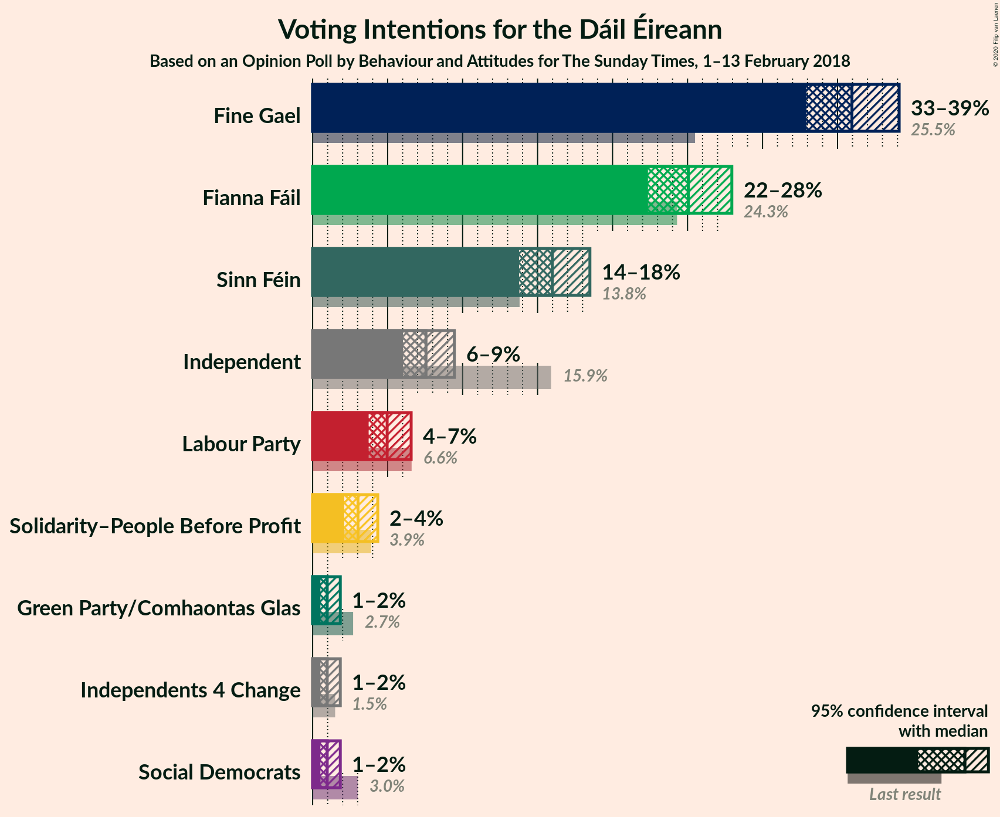
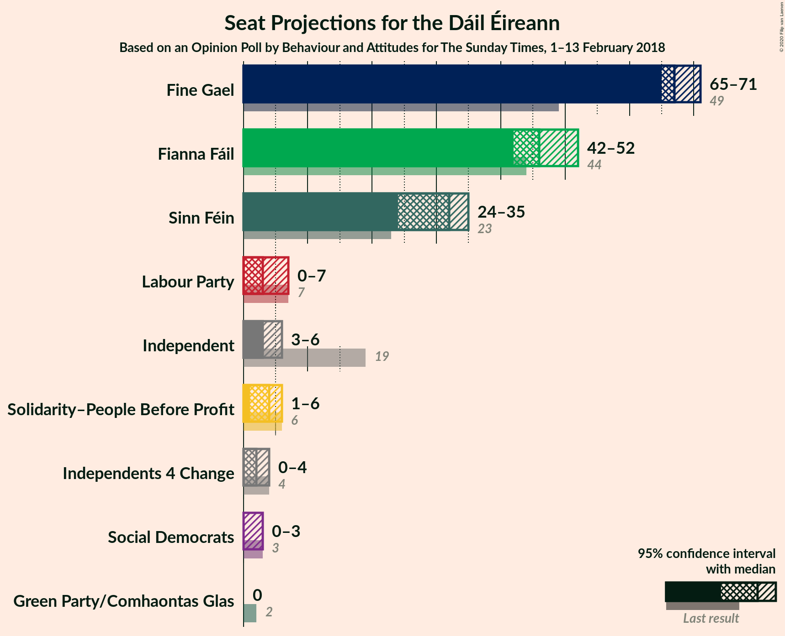
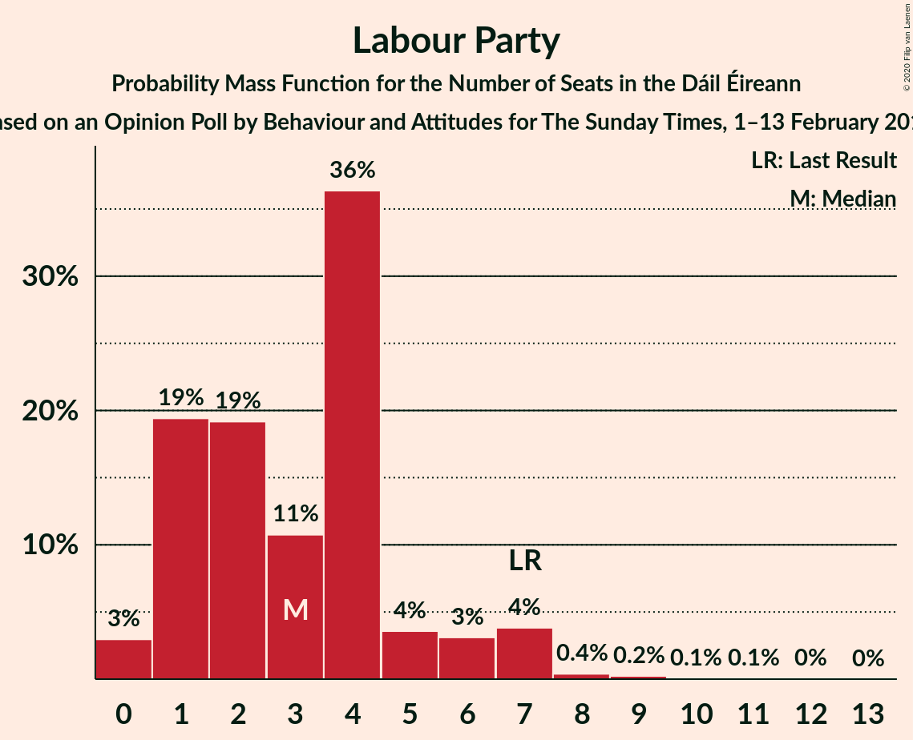

# Opinion Poll by Behaviour and Attitudes for The Sunday Times, 1–13 February 2018

<a href="#voting-intentions">Voting Intentions</a> | <a href="#seats">Seats</a> | <a href="#coalitions">Coalitions</a> | <a href="#technical-information">Technical Information</a>

## Voting Intentions

### Confidence Intervals

| Party | Last Result | Poll Result | 80% Confidence Interval | 90% Confidence Interval | 95% Confidence Interval | 99% Confidence Interval |
|:-----:|:-----------:|:-----------:|:-----------------------:|:-----------------------:|:-----------------------:|:-----------------------:|
| Fine Gael | 25.5% | 36.0% | 34.0–38.0% |33.4–38.6% |32.9–39.1% |32.0–40.1% |
| Fianna Fáil | 24.3% | 25.1% | 23.3–26.9% |22.8–27.5% |22.4–28.0% |21.5–28.9% |
| Sinn Féin | 13.8% | 16.0% | 14.5–17.6% |14.1–18.1% |13.8–18.5% |13.1–19.3% |
| Independent | 15.9% | 7.6% | 6.6–8.8% |6.3–9.1% |6.0–9.4% |5.6–10.1% |
| Labour Party | 6.6% | 5.0% | 4.2–6.0% |3.9–6.3% |3.7–6.6% |3.4–7.1% |
| Solidarity–People Before Profit | 3.9% | 3.0% | 2.4–3.9% |2.2–4.1% |2.1–4.3% |1.8–4.8% |
| Social Democrats | 3.0% | 1.0% | 0.7–1.5% |0.6–1.7% |0.5–1.8% |0.4–2.1% |
| Green Party/Comhaontas Glas | 2.7% | 1.0% | 0.7–1.5% |0.6–1.7% |0.5–1.8% |0.4–2.1% |
| Independents 4 Change | 1.5% | 1.0% | 0.7–1.5% |0.6–1.7% |0.5–1.8% |0.4–2.1% |

*Note:* The poll result column reflects the actual value used in the calculations. Published results may vary slightly, and in addition be rounded to fewer digits.

## Seats

### Confidence Intervals

| Party | Last Result | Median | 80% Confidence Interval | 90% Confidence Interval | 95% Confidence Interval | 99% Confidence Interval |
|:-----:|:-----------:|:------:|:-----------------------:|:-----------------------:|:-----------------------:|:-----------------------:|
| <a href="#fine-gael">Fine Gael</a> | 49 | 67 | 66–69 |66–70 |66–71 |61–72 |
| <a href="#fianna-fáil">Fianna Fáil</a> | 44 | 46 | 45–52 |43–52 |42–52 |40–53 |
| <a href="#sinn-féin">Sinn Féin</a> | 23 | 32 | 25–33 |25–34 |25–34 |22–38 |
| <a href="#independent">Independent</a> | 19 | 3 | 3–4 |3–6 |3–6 |3–7 |
| <a href="#labour-party">Labour Party</a> | 7 | 4 | 1–4 |1–5 |1–5 |0–8 |
| <a href="#solidarity–people-before-profit">Solidarity–People Before Profit</a> | 6 | 4 | 3–4 |3–4 |1–5 |1–6 |
| <a href="#social-democrats">Social Democrats</a> | 3 | 0 | 0–1 |0–3 |0–3 |0–3 |
| <a href="#green-party/comhaontas-glas">Green Party/Comhaontas Glas</a> | 2 | 0 | 0 |0 |0 |0 |
| <a href="#independents-4-change">Independents 4 Change</a> | 4 | 2 | 1–4 |0–4 |0–4 |0–4 |

### Fine Gael

*For a full overview of the results for this party, see the [Fine Gael](party-finegael.html) page.*

| Number of Seats | Probability | Accumulated | Special Marks |
|:---------------:|:-----------:|:-----------:|:-------------:|
| 49 | 0% | 100% | Last Result |
| 50 | 0% | 100% |  |
| 51 | 0% | 100% |  |
| 52 | 0% | 100% |  |
| 53 | 0% | 100% |  |
| 54 | 0% | 100% |  |
| 55 | 0% | 100% |  |
| 56 | 0% | 100% |  |
| 57 | 0% | 100% |  |
| 58 | 0% | 100% |  |
| 59 | 0% | 100% |  |
| 60 | 0% | 100% |  |
| 61 | 0.6% | 100% |  |
| 62 | 0% | 99.4% |  |
| 63 | 0.4% | 99.4% |  |
| 64 | 0.3% | 98.9% |  |
| 65 | 1.0% | 98.6% |  |
| 66 | 14% | 98% |  |
| 67 | 71% | 84% | Median |
| 68 | 2% | 13% |  |
| 69 | 5% | 11% |  |
| 70 | 2% | 7% |  |
| 71 | 2% | 4% |  |
| 72 | 2% | 2% |  |
| 73 | 0% | 0.1% |  |
| 74 | 0% | 0% |  |

### Fianna Fáil

*For a full overview of the results for this party, see the [Fianna Fáil](party-fiannafáil.html) page.*

| Number of Seats | Probability | Accumulated | Special Marks |
|:---------------:|:-----------:|:-----------:|:-------------:|
| 38 | 0.1% | 100% |  |
| 39 | 0.1% | 99.8% |  |
| 40 | 0.4% | 99.8% |  |
| 41 | 1.4% | 99.3% |  |
| 42 | 1.3% | 98% |  |
| 43 | 2% | 97% |  |
| 44 | 0.7% | 95% | Last Result |
| 45 | 7% | 94% |  |
| 46 | 44% | 87% | Median |
| 47 | 2% | 43% |  |
| 48 | 3% | 41% |  |
| 49 | 7% | 38% |  |
| 50 | 19% | 31% |  |
| 51 | 2% | 12% |  |
| 52 | 9% | 11% |  |
| 53 | 0.9% | 1.4% |  |
| 54 | 0.3% | 0.5% |  |
| 55 | 0.1% | 0.2% |  |
| 56 | 0.2% | 0.2% |  |
| 57 | 0% | 0% |  |

### Sinn Féin

*For a full overview of the results for this party, see the [Sinn Féin](party-sinnféin.html) page.*

| Number of Seats | Probability | Accumulated | Special Marks |
|:---------------:|:-----------:|:-----------:|:-------------:|
| 21 | 0.2% | 100% |  |
| 22 | 0.3% | 99.8% |  |
| 23 | 1.2% | 99.5% | Last Result |
| 24 | 0.3% | 98% |  |
| 25 | 9% | 98% |  |
| 26 | 0.4% | 89% |  |
| 27 | 1.3% | 88% |  |
| 28 | 0.3% | 87% |  |
| 29 | 6% | 87% |  |
| 30 | 8% | 81% |  |
| 31 | 14% | 73% |  |
| 32 | 20% | 59% | Median |
| 33 | 32% | 38% |  |
| 34 | 4% | 6% |  |
| 35 | 0.8% | 2% |  |
| 36 | 0.3% | 1.5% |  |
| 37 | 0.1% | 1.2% |  |
| 38 | 1.1% | 1.1% |  |
| 39 | 0% | 0% |  |

### Independent

*For a full overview of the results for this party, see the [Independent](party-independent.html) page.*

| Number of Seats | Probability | Accumulated | Special Marks |
|:---------------:|:-----------:|:-----------:|:-------------:|
| 2 | 0.2% | 100% |  |
| 3 | 68% | 99.8% | Median |
| 4 | 23% | 31% |  |
| 5 | 0.6% | 9% |  |
| 6 | 6% | 8% |  |
| 7 | 2% | 2% |  |
| 8 | 0.3% | 0.3% |  |
| 9 | 0% | 0% |  |
| 10 | 0% | 0% |  |
| 11 | 0% | 0% |  |
| 12 | 0% | 0% |  |
| 13 | 0% | 0% |  |
| 14 | 0% | 0% |  |
| 15 | 0% | 0% |  |
| 16 | 0% | 0% |  |
| 17 | 0% | 0% |  |
| 18 | 0% | 0% |  |
| 19 | 0% | 0% | Last Result |

### Labour Party

*For a full overview of the results for this party, see the [Labour Party](party-labourparty.html) page.*

| Number of Seats | Probability | Accumulated | Special Marks |
|:---------------:|:-----------:|:-----------:|:-------------:|
| 0 | 2% | 100% |  |
| 1 | 19% | 98% |  |
| 2 | 13% | 79% |  |
| 3 | 8% | 66% |  |
| 4 | 51% | 57% | Median |
| 5 | 4% | 6% |  |
| 6 | 0.2% | 2% |  |
| 7 | 1.4% | 2% | Last Result |
| 8 | 0.2% | 0.6% |  |
| 9 | 0.2% | 0.4% |  |
| 10 | 0.1% | 0.2% |  |
| 11 | 0% | 0.1% |  |
| 12 | 0% | 0% |  |

### Solidarity–People Before Profit

*For a full overview of the results for this party, see the [Solidarity–People Before Profit](party-solidarity–peoplebeforeprofit.html) page.*

| Number of Seats | Probability | Accumulated | Special Marks |
|:---------------:|:-----------:|:-----------:|:-------------:|
| 0 | 0.1% | 100% |  |
| 1 | 4% | 99.9% |  |
| 2 | 0.8% | 96% |  |
| 3 | 32% | 95% |  |
| 4 | 59% | 63% | Median |
| 5 | 3% | 4% |  |
| 6 | 1.5% | 2% | Last Result |
| 7 | 0.1% | 0.2% |  |
| 8 | 0% | 0% |  |

### Social Democrats

*For a full overview of the results for this party, see the [Social Democrats](party-socialdemocrats.html) page.*

| Number of Seats | Probability | Accumulated | Special Marks |
|:---------------:|:-----------:|:-----------:|:-------------:|
| 0 | 85% | 100% | Median |
| 1 | 8% | 15% |  |
| 2 | 1.2% | 7% |  |
| 3 | 6% | 6% | Last Result |
| 4 | 0.3% | 0.3% |  |
| 5 | 0% | 0% |  |

### Green Party/Comhaontas Glas

*For a full overview of the results for this party, see the [Green Party/Comhaontas Glas](party-greenpartycomhaontasglas.html) page.*

| Number of Seats | Probability | Accumulated | Special Marks |
|:---------------:|:-----------:|:-----------:|:-------------:|
| 0 | 99.9% | 100% | Median |
| 1 | 0% | 0.1% |  |
| 2 | 0.1% | 0.1% | Last Result |
| 3 | 0% | 0% |  |

### Independents 4 Change

*For a full overview of the results for this party, see the [Independents 4 Change](party-independents4change.html) page.*

| Number of Seats | Probability | Accumulated | Special Marks |
|:---------------:|:-----------:|:-----------:|:-------------:|
| 0 | 9% | 100% |  |
| 1 | 2% | 91% |  |
| 2 | 49% | 89% | Median |
| 3 | 2% | 40% |  |
| 4 | 38% | 39% | Last Result |
| 5 | 0.4% | 0.4% |  |
| 6 | 0% | 0% |  |

## Coalitions

### Confidence Intervals

| Coalition | Last Result | Median | Majority? | 80% Confidence Interval | 90% Confidence Interval | 95% Confidence Interval | 99% Confidence Interval |
|:---------:|:-----------:|:------:|:---------:|:-----------------------:|:-----------------------:|:-----------------------:|:-----------------------:|
| Fine Gael – Fianna Fáil | 93 | 113 | 100% | 112–119 | 112–119 | 110–121 | 108–123 |
| Fianna Fáil – Sinn Féin | 67 | 79 | 23% | 75–81 | 75–82 | 74–83 | 70–85 |
| Fine Gael – Labour Party – Green Party/Comhaontas Glas – Social Democrats | 61 | 71 | 0.1% | 68–73 | 68–73 | 68–76 | 67–79 |
| Fine Gael – Labour Party – Green Party/Comhaontas Glas | 58 | 71 | 0% | 68–72 | 68–73 | 68–74 | 66–77 |
| Fine Gael – Labour Party | 56 | 71 | 0% | 68–72 | 68–73 | 68–74 | 66–77 |
| Fine Gael | 49 | 67 | 0% | 66–69 | 66–70 | 66–71 | 61–72 |
| Fine Gael – Green Party/Comhaontas Glas | 51 | 67 | 0% | 66–69 | 66–70 | 66–71 | 61–72 |
| Fianna Fáil – Labour Party – Green Party/Comhaontas Glas – Social Democrats | 56 | 50 | 0% | 48–56 | 47–56 | 47–57 | 43–59 |
| Fianna Fáil – Labour Party – Green Party/Comhaontas Glas | 53 | 50 | 0% | 48–56 | 45–56 | 44–56 | 43–58 |
| Fianna Fáil – Labour Party | 51 | 50 | 0% | 48–56 | 45–56 | 44–56 | 43–58 |
| Fianna Fáil – Green Party/Comhaontas Glas | 46 | 46 | 0% | 45–52 | 43–52 | 42–52 | 40–53 |

### Fine Gael – Fianna Fáil

| Number of Seats | Probability | Accumulated | Special Marks |
|:---------------:|:-----------:|:-----------:|:-------------:|
| 93 | 0% | 100% | Last Result |
| 94 | 0% | 100% |  |
| 95 | 0% | 100% |  |
| 96 | 0% | 100% |  |
| 97 | 0% | 100% |  |
| 98 | 0% | 100% |  |
| 99 | 0% | 100% |  |
| 100 | 0% | 100% |  |
| 101 | 0% | 100% |  |
| 102 | 0% | 100% |  |
| 103 | 0% | 100% |  |
| 104 | 0% | 100% |  |
| 105 | 0% | 100% |  |
| 106 | 0% | 100% |  |
| 107 | 0.1% | 99.9% |  |
| 108 | 0.8% | 99.8% |  |
| 109 | 0.4% | 99.1% |  |
| 110 | 1.5% | 98.7% |  |
| 111 | 1.2% | 97% |  |
| 112 | 9% | 96% |  |
| 113 | 44% | 87% | Median |
| 114 | 0.4% | 43% |  |
| 115 | 7% | 43% |  |
| 116 | 8% | 36% |  |
| 117 | 14% | 28% |  |
| 118 | 2% | 14% |  |
| 119 | 9% | 12% |  |
| 120 | 0.1% | 3% |  |
| 121 | 2% | 3% |  |
| 122 | 0.4% | 0.9% |  |
| 123 | 0.3% | 0.5% |  |
| 124 | 0.1% | 0.2% |  |
| 125 | 0% | 0.1% |  |
| 126 | 0% | 0% |  |

### Fianna Fáil – Sinn Féin

| Number of Seats | Probability | Accumulated | Special Marks |
|:---------------:|:-----------:|:-----------:|:-------------:|
| 67 | 0% | 100% | Last Result |
| 68 | 0.1% | 100% |  |
| 69 | 0.1% | 99.9% |  |
| 70 | 0.3% | 99.8% |  |
| 71 | 0.2% | 99.5% |  |
| 72 | 0.4% | 99.2% |  |
| 73 | 1.1% | 98.9% |  |
| 74 | 2% | 98% |  |
| 75 | 8% | 96% |  |
| 76 | 2% | 89% |  |
| 77 | 11% | 86% |  |
| 78 | 21% | 76% | Median |
| 79 | 30% | 54% |  |
| 80 | 1.3% | 24% |  |
| 81 | 14% | 23% | Majority |
| 82 | 6% | 9% |  |
| 83 | 2% | 3% |  |
| 84 | 0% | 1.1% |  |
| 85 | 0.9% | 1.0% |  |
| 86 | 0.1% | 0.2% |  |
| 87 | 0% | 0% |  |

### Fine Gael – Labour Party – Green Party/Comhaontas Glas – Social Democrats

| Number of Seats | Probability | Accumulated | Special Marks |
|:---------------:|:-----------:|:-----------:|:-------------:|
| 61 | 0% | 100% | Last Result |
| 62 | 0% | 100% |  |
| 63 | 0% | 100% |  |
| 64 | 0.1% | 100% |  |
| 65 | 0% | 99.9% |  |
| 66 | 0.1% | 99.9% |  |
| 67 | 0.5% | 99.8% |  |
| 68 | 23% | 99.3% |  |
| 69 | 3% | 76% |  |
| 70 | 7% | 73% |  |
| 71 | 51% | 66% | Median |
| 72 | 3% | 15% |  |
| 73 | 7% | 12% |  |
| 74 | 0.9% | 5% |  |
| 75 | 0.4% | 4% |  |
| 76 | 2% | 3% |  |
| 77 | 0.3% | 1.1% |  |
| 78 | 0.3% | 0.8% |  |
| 79 | 0.2% | 0.5% |  |
| 80 | 0.3% | 0.4% |  |
| 81 | 0% | 0.1% | Majority |
| 82 | 0% | 0% |  |

### Fine Gael – Labour Party – Green Party/Comhaontas Glas

| Number of Seats | Probability | Accumulated | Special Marks |
|:---------------:|:-----------:|:-----------:|:-------------:|
| 58 | 0% | 100% | Last Result |
| 59 | 0% | 100% |  |
| 60 | 0% | 100% |  |
| 61 | 0% | 100% |  |
| 62 | 0% | 100% |  |
| 63 | 0% | 99.9% |  |
| 64 | 0.1% | 99.9% |  |
| 65 | 0% | 99.9% |  |
| 66 | 0.5% | 99.8% |  |
| 67 | 1.5% | 99.3% |  |
| 68 | 25% | 98% |  |
| 69 | 2% | 72% |  |
| 70 | 8% | 70% |  |
| 71 | 51% | 62% | Median |
| 72 | 3% | 11% |  |
| 73 | 4% | 8% |  |
| 74 | 1.4% | 4% |  |
| 75 | 1.4% | 2% |  |
| 76 | 0.2% | 0.7% |  |
| 77 | 0.2% | 0.5% |  |
| 78 | 0.1% | 0.3% |  |
| 79 | 0.1% | 0.2% |  |
| 80 | 0.1% | 0.1% |  |
| 81 | 0% | 0% | Majority |

### Fine Gael – Labour Party

| Number of Seats | Probability | Accumulated | Special Marks |
|:---------------:|:-----------:|:-----------:|:-------------:|
| 56 | 0% | 100% | Last Result |
| 57 | 0% | 100% |  |
| 58 | 0% | 100% |  |
| 59 | 0% | 100% |  |
| 60 | 0% | 100% |  |
| 61 | 0% | 100% |  |
| 62 | 0% | 100% |  |
| 63 | 0% | 99.9% |  |
| 64 | 0.1% | 99.9% |  |
| 65 | 0% | 99.9% |  |
| 66 | 0.5% | 99.8% |  |
| 67 | 1.5% | 99.3% |  |
| 68 | 25% | 98% |  |
| 69 | 2% | 72% |  |
| 70 | 8% | 70% |  |
| 71 | 51% | 62% | Median |
| 72 | 3% | 11% |  |
| 73 | 4% | 7% |  |
| 74 | 1.3% | 3% |  |
| 75 | 1.4% | 2% |  |
| 76 | 0.2% | 0.7% |  |
| 77 | 0.2% | 0.5% |  |
| 78 | 0.1% | 0.3% |  |
| 79 | 0.1% | 0.2% |  |
| 80 | 0.1% | 0.1% |  |
| 81 | 0% | 0% | Majority |

### Fine Gael

| Number of Seats | Probability | Accumulated | Special Marks |
|:---------------:|:-----------:|:-----------:|:-------------:|
| 49 | 0% | 100% | Last Result |
| 50 | 0% | 100% |  |
| 51 | 0% | 100% |  |
| 52 | 0% | 100% |  |
| 53 | 0% | 100% |  |
| 54 | 0% | 100% |  |
| 55 | 0% | 100% |  |
| 56 | 0% | 100% |  |
| 57 | 0% | 100% |  |
| 58 | 0% | 100% |  |
| 59 | 0% | 100% |  |
| 60 | 0% | 100% |  |
| 61 | 0.6% | 100% |  |
| 62 | 0% | 99.4% |  |
| 63 | 0.4% | 99.4% |  |
| 64 | 0.3% | 98.9% |  |
| 65 | 1.0% | 98.6% |  |
| 66 | 14% | 98% |  |
| 67 | 71% | 84% | Median |
| 68 | 2% | 13% |  |
| 69 | 5% | 11% |  |
| 70 | 2% | 7% |  |
| 71 | 2% | 4% |  |
| 72 | 2% | 2% |  |
| 73 | 0% | 0.1% |  |
| 74 | 0% | 0% |  |

### Fine Gael – Green Party/Comhaontas Glas

| Number of Seats | Probability | Accumulated | Special Marks |
|:---------------:|:-----------:|:-----------:|:-------------:|
| 51 | 0% | 100% | Last Result |
| 52 | 0% | 100% |  |
| 53 | 0% | 100% |  |
| 54 | 0% | 100% |  |
| 55 | 0% | 100% |  |
| 56 | 0% | 100% |  |
| 57 | 0% | 100% |  |
| 58 | 0% | 100% |  |
| 59 | 0% | 100% |  |
| 60 | 0% | 100% |  |
| 61 | 0.6% | 100% |  |
| 62 | 0% | 99.4% |  |
| 63 | 0.4% | 99.4% |  |
| 64 | 0.3% | 98.9% |  |
| 65 | 1.0% | 98.6% |  |
| 66 | 14% | 98% |  |
| 67 | 71% | 84% | Median |
| 68 | 2% | 13% |  |
| 69 | 5% | 11% |  |
| 70 | 2% | 7% |  |
| 71 | 2% | 4% |  |
| 72 | 2% | 2% |  |
| 73 | 0% | 0.1% |  |
| 74 | 0% | 0% |  |

### Fianna Fáil – Labour Party – Green Party/Comhaontas Glas – Social Democrats

| Number of Seats | Probability | Accumulated | Special Marks |
|:---------------:|:-----------:|:-----------:|:-------------:|
| 42 | 0.1% | 100% |  |
| 43 | 0.5% | 99.9% |  |
| 44 | 0.1% | 99.3% |  |
| 45 | 1.2% | 99.2% |  |
| 46 | 0.3% | 98% |  |
| 47 | 5% | 98% |  |
| 48 | 5% | 93% |  |
| 49 | 0.5% | 87% |  |
| 50 | 43% | 87% | Median |
| 51 | 22% | 44% |  |
| 52 | 6% | 22% |  |
| 53 | 1.4% | 16% |  |
| 54 | 1.2% | 15% |  |
| 55 | 1.5% | 14% |  |
| 56 | 9% | 12% | Last Result |
| 57 | 1.4% | 3% |  |
| 58 | 0.8% | 2% |  |
| 59 | 0.6% | 0.9% |  |
| 60 | 0.1% | 0.3% |  |
| 61 | 0.1% | 0.1% |  |
| 62 | 0% | 0% |  |

### Fianna Fáil – Labour Party – Green Party/Comhaontas Glas

| Number of Seats | Probability | Accumulated | Special Marks |
|:---------------:|:-----------:|:-----------:|:-------------:|
| 40 | 0.1% | 100% |  |
| 41 | 0.1% | 99.8% |  |
| 42 | 0.1% | 99.8% |  |
| 43 | 0.5% | 99.7% |  |
| 44 | 2% | 99.2% |  |
| 45 | 2% | 97% |  |
| 46 | 0.7% | 95% |  |
| 47 | 2% | 94% |  |
| 48 | 7% | 92% |  |
| 49 | 1.2% | 86% |  |
| 50 | 45% | 84% | Median |
| 51 | 19% | 39% |  |
| 52 | 6% | 21% |  |
| 53 | 0.5% | 15% | Last Result |
| 54 | 2% | 14% |  |
| 55 | 0.4% | 12% |  |
| 56 | 10% | 11% |  |
| 57 | 0.6% | 2% |  |
| 58 | 0.7% | 1.0% |  |
| 59 | 0.2% | 0.3% |  |
| 60 | 0.1% | 0.1% |  |
| 61 | 0% | 0% |  |

### Fianna Fáil – Labour Party

| Number of Seats | Probability | Accumulated | Special Marks |
|:---------------:|:-----------:|:-----------:|:-------------:|
| 40 | 0.1% | 100% |  |
| 41 | 0.1% | 99.8% |  |
| 42 | 0.1% | 99.8% |  |
| 43 | 0.5% | 99.7% |  |
| 44 | 2% | 99.2% |  |
| 45 | 2% | 97% |  |
| 46 | 0.7% | 95% |  |
| 47 | 2% | 94% |  |
| 48 | 7% | 92% |  |
| 49 | 1.3% | 86% |  |
| 50 | 45% | 84% | Median |
| 51 | 19% | 39% | Last Result |
| 52 | 6% | 21% |  |
| 53 | 0.5% | 15% |  |
| 54 | 2% | 14% |  |
| 55 | 0.4% | 12% |  |
| 56 | 10% | 11% |  |
| 57 | 0.6% | 2% |  |
| 58 | 0.7% | 1.0% |  |
| 59 | 0.2% | 0.3% |  |
| 60 | 0.1% | 0.1% |  |
| 61 | 0% | 0% |  |

### Fianna Fáil – Green Party/Comhaontas Glas

| Number of Seats | Probability | Accumulated | Special Marks |
|:---------------:|:-----------:|:-----------:|:-------------:|
| 38 | 0.1% | 100% |  |
| 39 | 0.1% | 99.8% |  |
| 40 | 0.4% | 99.8% |  |
| 41 | 1.4% | 99.3% |  |
| 42 | 1.3% | 98% |  |
| 43 | 2% | 97% |  |
| 44 | 0.7% | 95% |  |
| 45 | 7% | 94% |  |
| 46 | 44% | 87% | Last Result, Median |
| 47 | 2% | 43% |  |
| 48 | 3% | 41% |  |
| 49 | 7% | 38% |  |
| 50 | 19% | 31% |  |
| 51 | 2% | 12% |  |
| 52 | 9% | 11% |  |
| 53 | 0.9% | 1.4% |  |
| 54 | 0.3% | 0.5% |  |
| 55 | 0.1% | 0.2% |  |
| 56 | 0.2% | 0.2% |  |
| 57 | 0% | 0% |  |

## Technical Information

### Opinion Poll

+ **Polling firm:** Behaviour and Attitudes
+ **Commissioner(s):** The Sunday Times
+ **Fieldwork period:** 1–13 February 2018

### Calculations

+ **Sample size:** 926
+ **Simulations done:** 65,536
+ **Error estimate:** 1.60%

