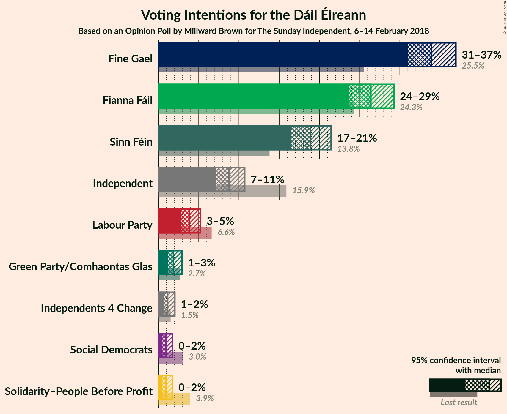
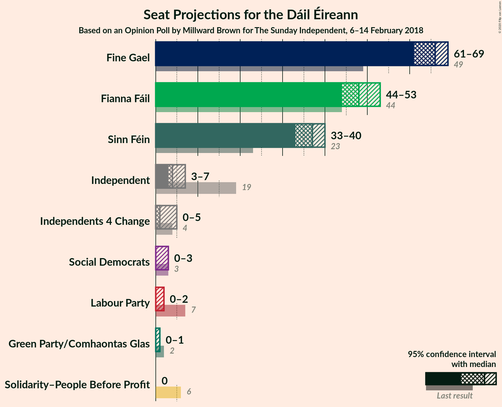
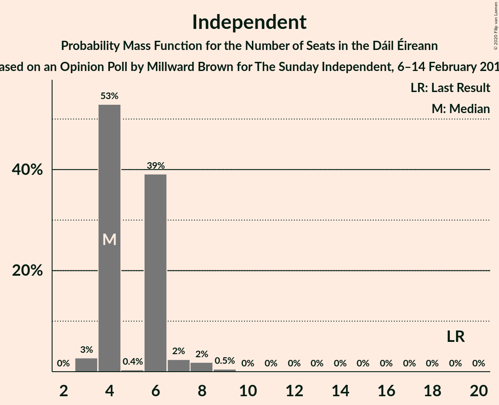
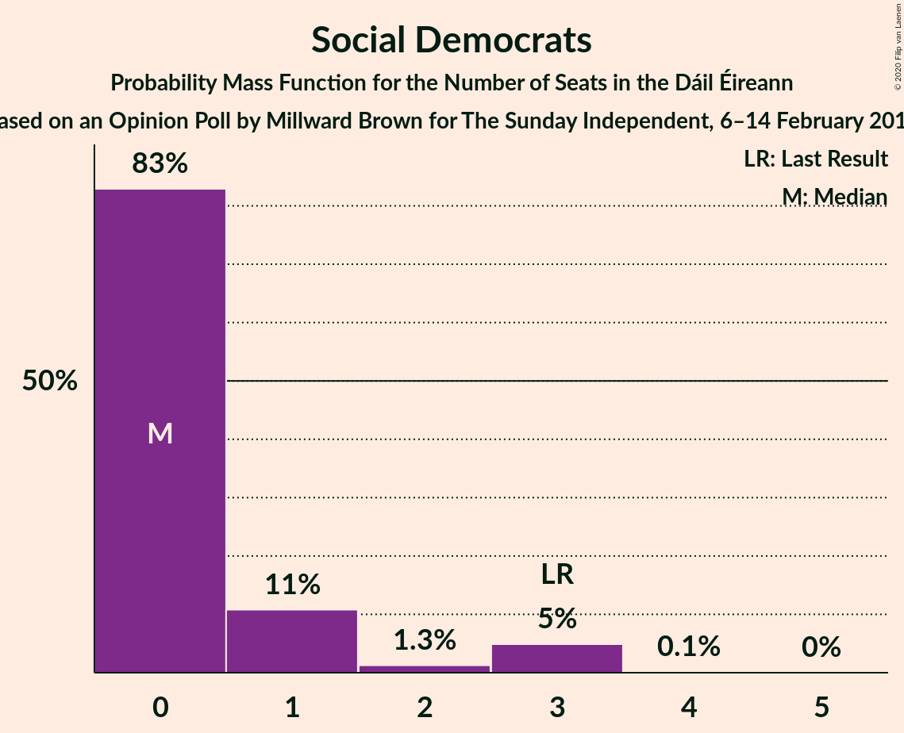
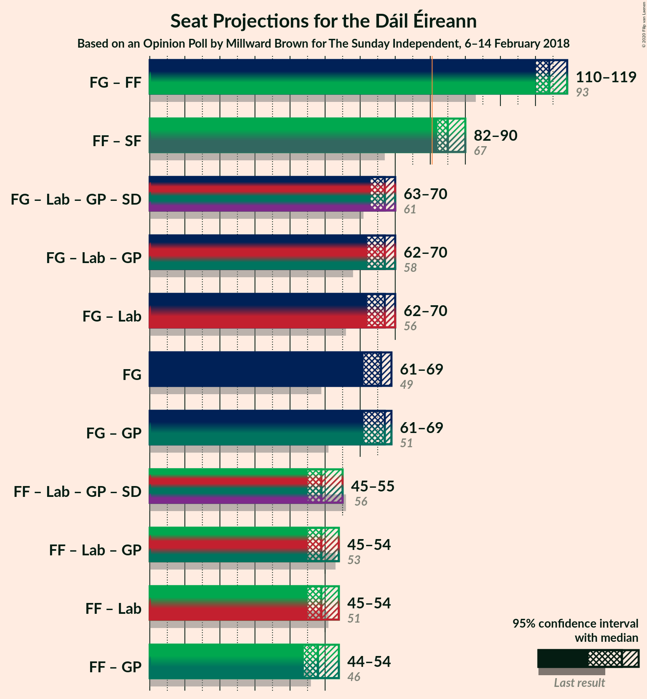
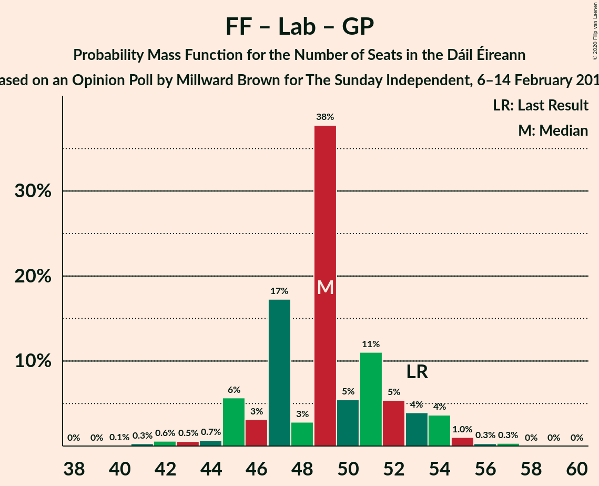

# Opinion Poll by Millward Brown for The Sunday Independent, 6–14 February 2018

<a href="#voting-intentions">Voting Intentions</a> | <a href="#seats">Seats</a> | <a href="#coalitions">Coalitions</a> | <a href="#technical-information">Technical Information</a>

## Voting Intentions

### Confidence Intervals

| Party | Last Result | Poll Result | 80% Confidence Interval | 90% Confidence Interval | 95% Confidence Interval | 99% Confidence Interval |
|:-----:|:-----------:|:-----------:|:-----------------------:|:-----------------------:|:-----------------------:|:-----------------------:|
| Fine Gael | 25.5% | 33.9% | 32.0–35.9% |31.5–36.5% |31.0–37.0% |30.1–37.9% |
| Fianna Fáil | 24.3% | 26.4% | 24.6–28.3% |24.1–28.8% |23.7–29.3% |22.9–30.2% |
| Sinn Féin | 13.8% | 18.9% | 17.3–20.6% |16.9–21.0% |16.5–21.5% |15.8–22.3% |
| Independent | 15.9% | 8.8% | 7.7–10.0% |7.4–10.4% |7.1–10.7% |6.7–11.4% |
| Labour Party | 6.6% | 3.8% | 3.1–4.7% |2.9–5.0% |2.8–5.2% |2.5–5.7% |
| Green Party/Comhaontas Glas | 2.7% | 1.9% | 1.4–2.5% |1.3–2.7% |1.2–2.9% |1.0–3.3% |
| Independents 4 Change | 1.5% | 1.1% | 0.8–1.7% |0.7–1.9% |0.6–2.0% |0.5–2.3% |
| Solidarity–People Before Profit | 3.9% | 0.9% | 0.6–1.5% |0.5–1.6% |0.5–1.8% |0.4–2.1% |
| Social Democrats | 3.0% | 0.9% | 0.6–1.5% |0.5–1.6% |0.5–1.8% |0.4–2.1% |

*Note:* The poll result column reflects the actual value used in the calculations. Published results may vary slightly, and in addition be rounded to fewer digits.

## Seats

### Confidence Intervals

| Party | Last Result | Median | 80% Confidence Interval | 90% Confidence Interval | 95% Confidence Interval | 99% Confidence Interval |
|:-----:|:-----------:|:------:|:-----------------------:|:-----------------------:|:-----------------------:|:-----------------------:|
| <a href="#fine-gael">Fine Gael</a> | 49 | 66 | 63–67 |61–68 |61–69 |60–70 |
| <a href="#fianna-fáil">Fianna Fáil</a> | 44 | 48 | 46–52 |45–53 |44–53 |41–55 |
| <a href="#sinn-féin">Sinn Féin</a> | 23 | 37 | 35–39 |34–39 |33–40 |32–42 |
| <a href="#independent">Independent</a> | 19 | 4 | 4–6 |4–6 |3–7 |3–9 |
| <a href="#labour-party">Labour Party</a> | 7 | 0 | 0–1 |0–2 |0–2 |0–5 |
| <a href="#green-party/comhaontas-glas">Green Party/Comhaontas Glas</a> | 2 | 0 | 0 |0 |0–1 |0–1 |
| <a href="#independents-4-change">Independents 4 Change</a> | 4 | 1 | 0–4 |0–5 |0–5 |0–5 |
| <a href="#solidarity–people-before-profit">Solidarity–People Before Profit</a> | 6 | 0 | 0 |0 |0 |0–1 |
| <a href="#social-democrats">Social Democrats</a> | 3 | 0 | 0–1 |0–3 |0–3 |0–3 |

### Fine Gael

*For a full overview of the results for this party, see the [Fine Gael](party-finegael.html) page.*

| Number of Seats | Probability | Accumulated | Special Marks |
|:---------------:|:-----------:|:-----------:|:-------------:|
| 49 | 0% | 100% | Last Result |
| 50 | 0% | 100% |  |
| 51 | 0% | 100% |  |
| 52 | 0% | 100% |  |
| 53 | 0% | 100% |  |
| 54 | 0% | 100% |  |
| 55 | 0% | 100% |  |
| 56 | 0% | 100% |  |
| 57 | 0% | 100% |  |
| 58 | 0% | 99.9% |  |
| 59 | 0.1% | 99.9% |  |
| 60 | 0.5% | 99.8% |  |
| 61 | 4% | 99.4% |  |
| 62 | 2% | 95% |  |
| 63 | 5% | 93% |  |
| 64 | 3% | 89% |  |
| 65 | 10% | 85% |  |
| 66 | 26% | 76% | Median |
| 67 | 41% | 50% |  |
| 68 | 6% | 9% |  |
| 69 | 2% | 3% |  |
| 70 | 1.0% | 1.1% |  |
| 71 | 0.1% | 0.1% |  |
| 72 | 0% | 0% |  |

### Fianna Fáil

*For a full overview of the results for this party, see the [Fianna Fáil](party-fiannafáil.html) page.*

| Number of Seats | Probability | Accumulated | Special Marks |
|:---------------:|:-----------:|:-----------:|:-------------:|
| 39 | 0.1% | 100% |  |
| 40 | 0.1% | 99.9% |  |
| 41 | 0.6% | 99.8% |  |
| 42 | 0.5% | 99.2% |  |
| 43 | 0.4% | 98.6% |  |
| 44 | 1.0% | 98% | Last Result |
| 45 | 6% | 97% |  |
| 46 | 15% | 92% |  |
| 47 | 6% | 77% |  |
| 48 | 22% | 70% | Median |
| 49 | 24% | 48% |  |
| 50 | 10% | 24% |  |
| 51 | 2% | 14% |  |
| 52 | 7% | 12% |  |
| 53 | 3% | 6% |  |
| 54 | 1.4% | 2% |  |
| 55 | 0.9% | 1.1% |  |
| 56 | 0.2% | 0.2% |  |
| 57 | 0.1% | 0.1% |  |
| 58 | 0% | 0% |  |

### Sinn Féin

*For a full overview of the results for this party, see the [Sinn Féin](party-sinnféin.html) page.*

| Number of Seats | Probability | Accumulated | Special Marks |
|:---------------:|:-----------:|:-----------:|:-------------:|
| 23 | 0% | 100% | Last Result |
| 24 | 0% | 100% |  |
| 25 | 0% | 100% |  |
| 26 | 0% | 100% |  |
| 27 | 0% | 100% |  |
| 28 | 0.1% | 99.9% |  |
| 29 | 0% | 99.9% |  |
| 30 | 0.2% | 99.8% |  |
| 31 | 0.1% | 99.7% |  |
| 32 | 0.8% | 99.6% |  |
| 33 | 2% | 98.7% |  |
| 34 | 6% | 97% |  |
| 35 | 23% | 91% |  |
| 36 | 7% | 68% |  |
| 37 | 31% | 61% | Median |
| 38 | 19% | 30% |  |
| 39 | 6% | 10% |  |
| 40 | 3% | 5% |  |
| 41 | 0.7% | 1.3% |  |
| 42 | 0.5% | 0.6% |  |
| 43 | 0% | 0.1% |  |
| 44 | 0% | 0.1% |  |
| 45 | 0% | 0% |  |

### Independent

*For a full overview of the results for this party, see the [Independent](party-independent.html) page.*

| Number of Seats | Probability | Accumulated | Special Marks |
|:---------------:|:-----------:|:-----------:|:-------------:|
| 3 | 3% | 100% |  |
| 4 | 53% | 97% | Median |
| 5 | 0.4% | 44% |  |
| 6 | 39% | 44% |  |
| 7 | 2% | 5% |  |
| 8 | 2% | 2% |  |
| 9 | 0.5% | 0.6% |  |
| 10 | 0% | 0.1% |  |
| 11 | 0% | 0.1% |  |
| 12 | 0% | 0% |  |
| 13 | 0% | 0% |  |
| 14 | 0% | 0% |  |
| 15 | 0% | 0% |  |
| 16 | 0% | 0% |  |
| 17 | 0% | 0% |  |
| 18 | 0% | 0% |  |
| 19 | 0% | 0% | Last Result |

### Labour Party

*For a full overview of the results for this party, see the [Labour Party](party-labourparty.html) page.*

| Number of Seats | Probability | Accumulated | Special Marks |
|:---------------:|:-----------:|:-----------:|:-------------:|
| 0 | 54% | 100% | Median |
| 1 | 36% | 46% |  |
| 2 | 7% | 10% |  |
| 3 | 0.3% | 2% |  |
| 4 | 1.0% | 2% |  |
| 5 | 0.9% | 1.0% |  |
| 6 | 0% | 0.1% |  |
| 7 | 0.1% | 0.1% | Last Result |
| 8 | 0% | 0% |  |

### Green Party/Comhaontas Glas

*For a full overview of the results for this party, see the [Green Party/Comhaontas Glas](party-greenpartycomhaontasglas.html) page.*

| Number of Seats | Probability | Accumulated | Special Marks |
|:---------------:|:-----------:|:-----------:|:-------------:|
| 0 | 97% | 100% | Median |
| 1 | 3% | 3% |  |
| 2 | 0.2% | 0.3% | Last Result |
| 3 | 0.1% | 0.1% |  |
| 4 | 0% | 0% |  |

### Independents 4 Change

*For a full overview of the results for this party, see the [Independents 4 Change](party-independents4change.html) page.*

| Number of Seats | Probability | Accumulated | Special Marks |
|:---------------:|:-----------:|:-----------:|:-------------:|
| 0 | 17% | 100% |  |
| 1 | 34% | 83% | Median |
| 2 | 1.1% | 48% |  |
| 3 | 3% | 47% |  |
| 4 | 39% | 44% | Last Result |
| 5 | 5% | 5% |  |
| 6 | 0% | 0% |  |

### Solidarity–People Before Profit

*For a full overview of the results for this party, see the [Solidarity–People Before Profit](party-solidarity–peoplebeforeprofit.html) page.*

| Number of Seats | Probability | Accumulated | Special Marks |
|:---------------:|:-----------:|:-----------:|:-------------:|
| 0 | 99.1% | 100% | Median |
| 1 | 0.7% | 0.9% |  |
| 2 | 0% | 0.2% |  |
| 3 | 0.1% | 0.2% |  |
| 4 | 0% | 0% |  |
| 5 | 0% | 0% |  |
| 6 | 0% | 0% | Last Result |

### Social Democrats

*For a full overview of the results for this party, see the [Social Democrats](party-socialdemocrats.html) page.*

| Number of Seats | Probability | Accumulated | Special Marks |
|:---------------:|:-----------:|:-----------:|:-------------:|
| 0 | 83% | 100% | Median |
| 1 | 11% | 17% |  |
| 2 | 1.3% | 6% |  |
| 3 | 5% | 5% | Last Result |
| 4 | 0.1% | 0.1% |  |
| 5 | 0% | 0% |  |

## Coalitions

### Confidence Intervals

| Coalition | Last Result | Median | Majority? | 80% Confidence Interval | 90% Confidence Interval | 95% Confidence Interval | 99% Confidence Interval |
|:---------:|:-----------:|:------:|:---------:|:-----------------------:|:-----------------------:|:-----------------------:|:-----------------------:|
| Fine Gael – Fianna Fáil | 93 | 114 | 100% | 111–117 | 110–117 | 110–119 | 109–121 |
| Fianna Fáil – Sinn Féin | 67 | 85 | 98% | 83–88 | 83–89 | 82–90 | 79–91 |
| Fine Gael – Labour Party – Green Party/Comhaontas Glas – Social Democrats | 61 | 67 | 0% | 64–68 | 63–69 | 63–70 | 62–72 |
| Fine Gael – Labour Party – Green Party/Comhaontas Glas | 58 | 67 | 0% | 64–68 | 63–69 | 62–70 | 61–71 |
| Fine Gael – Labour Party | 56 | 67 | 0% | 64–68 | 63–69 | 62–70 | 61–71 |
| Fine Gael | 49 | 66 | 0% | 63–67 | 61–68 | 61–69 | 60–70 |
| Fine Gael – Green Party/Comhaontas Glas | 51 | 67 | 0% | 63–67 | 61–68 | 61–69 | 60–70 |
| Fianna Fáil – Labour Party – Green Party/Comhaontas Glas – Social Democrats | 56 | 49 | 0% | 47–54 | 45–55 | 45–55 | 42–57 |
| Fianna Fáil – Labour Party – Green Party/Comhaontas Glas | 53 | 49 | 0% | 46–52 | 45–54 | 45–54 | 42–56 |
| Fianna Fáil – Labour Party | 51 | 49 | 0% | 46–52 | 45–54 | 45–54 | 42–56 |
| Fianna Fáil – Green Party/Comhaontas Glas | 46 | 48 | 0% | 46–52 | 45–53 | 44–54 | 41–55 |

### Fine Gael – Fianna Fáil

| Number of Seats | Probability | Accumulated | Special Marks |
|:---------------:|:-----------:|:-----------:|:-------------:|
| 93 | 0% | 100% | Last Result |
| 94 | 0% | 100% |  |
| 95 | 0% | 100% |  |
| 96 | 0% | 100% |  |
| 97 | 0% | 100% |  |
| 98 | 0% | 100% |  |
| 99 | 0% | 100% |  |
| 100 | 0% | 100% |  |
| 101 | 0% | 100% |  |
| 102 | 0% | 100% |  |
| 103 | 0% | 100% |  |
| 104 | 0% | 100% |  |
| 105 | 0% | 100% |  |
| 106 | 0.1% | 100% |  |
| 107 | 0.1% | 99.9% |  |
| 108 | 0.2% | 99.7% |  |
| 109 | 0.8% | 99.5% |  |
| 110 | 9% | 98.8% |  |
| 111 | 1.1% | 90% |  |
| 112 | 6% | 89% |  |
| 113 | 14% | 83% |  |
| 114 | 26% | 69% | Median |
| 115 | 2% | 43% |  |
| 116 | 25% | 41% |  |
| 117 | 12% | 16% |  |
| 118 | 1.2% | 4% |  |
| 119 | 1.5% | 3% |  |
| 120 | 0.1% | 1.1% |  |
| 121 | 0.6% | 1.0% |  |
| 122 | 0.3% | 0.4% |  |
| 123 | 0% | 0.1% |  |
| 124 | 0.1% | 0.1% |  |
| 125 | 0% | 0% |  |

### Fianna Fáil – Sinn Féin

| Number of Seats | Probability | Accumulated | Special Marks |
|:---------------:|:-----------:|:-----------:|:-------------:|
| 67 | 0% | 100% | Last Result |
| 68 | 0% | 100% |  |
| 69 | 0% | 100% |  |
| 70 | 0% | 100% |  |
| 71 | 0% | 100% |  |
| 72 | 0% | 100% |  |
| 73 | 0% | 100% |  |
| 74 | 0% | 100% |  |
| 75 | 0% | 100% |  |
| 76 | 0.1% | 100% |  |
| 77 | 0% | 99.9% |  |
| 78 | 0.3% | 99.9% |  |
| 79 | 0.7% | 99.6% |  |
| 80 | 0.4% | 98.9% |  |
| 81 | 0.9% | 98% | Majority |
| 82 | 2% | 98% |  |
| 83 | 9% | 96% |  |
| 84 | 36% | 87% |  |
| 85 | 27% | 51% | Median |
| 86 | 5% | 24% |  |
| 87 | 5% | 19% |  |
| 88 | 6% | 14% |  |
| 89 | 4% | 9% |  |
| 90 | 4% | 5% |  |
| 91 | 1.0% | 1.4% |  |
| 92 | 0.3% | 0.4% |  |
| 93 | 0% | 0.1% |  |
| 94 | 0.1% | 0.1% |  |
| 95 | 0% | 0% |  |

### Fine Gael – Labour Party – Green Party/Comhaontas Glas – Social Democrats

| Number of Seats | Probability | Accumulated | Special Marks |
|:---------------:|:-----------:|:-----------:|:-------------:|
| 59 | 0% | 100% |  |
| 60 | 0% | 99.9% |  |
| 61 | 0.2% | 99.9% | Last Result |
| 62 | 2% | 99.7% |  |
| 63 | 4% | 98% |  |
| 64 | 3% | 93% |  |
| 65 | 5% | 90% |  |
| 66 | 8% | 85% | Median |
| 67 | 44% | 77% |  |
| 68 | 23% | 33% |  |
| 69 | 4% | 9% |  |
| 70 | 3% | 5% |  |
| 71 | 2% | 2% |  |
| 72 | 0.2% | 0.5% |  |
| 73 | 0.2% | 0.4% |  |
| 74 | 0.1% | 0.1% |  |
| 75 | 0% | 0.1% |  |
| 76 | 0% | 0% |  |

### Fine Gael – Labour Party – Green Party/Comhaontas Glas

| Number of Seats | Probability | Accumulated | Special Marks |
|:---------------:|:-----------:|:-----------:|:-------------:|
| 58 | 0% | 100% | Last Result |
| 59 | 0.1% | 100% |  |
| 60 | 0.2% | 99.9% |  |
| 61 | 0.3% | 99.7% |  |
| 62 | 2% | 99.4% |  |
| 63 | 7% | 97% |  |
| 64 | 2% | 90% |  |
| 65 | 9% | 88% |  |
| 66 | 5% | 79% | Median |
| 67 | 47% | 73% |  |
| 68 | 19% | 26% |  |
| 69 | 4% | 7% |  |
| 70 | 2% | 3% |  |
| 71 | 1.2% | 1.4% |  |
| 72 | 0.1% | 0.2% |  |
| 73 | 0% | 0.1% |  |
| 74 | 0% | 0% |  |

### Fine Gael – Labour Party

| Number of Seats | Probability | Accumulated | Special Marks |
|:---------------:|:-----------:|:-----------:|:-------------:|
| 56 | 0% | 100% | Last Result |
| 57 | 0% | 100% |  |
| 58 | 0% | 100% |  |
| 59 | 0.1% | 100% |  |
| 60 | 0.2% | 99.9% |  |
| 61 | 0.3% | 99.7% |  |
| 62 | 2% | 99.4% |  |
| 63 | 7% | 97% |  |
| 64 | 2% | 90% |  |
| 65 | 9% | 88% |  |
| 66 | 8% | 78% | Median |
| 67 | 45% | 71% |  |
| 68 | 19% | 26% |  |
| 69 | 4% | 7% |  |
| 70 | 2% | 3% |  |
| 71 | 1.2% | 1.3% |  |
| 72 | 0% | 0.1% |  |
| 73 | 0% | 0.1% |  |
| 74 | 0% | 0% |  |

### Fine Gael

| Number of Seats | Probability | Accumulated | Special Marks |
|:---------------:|:-----------:|:-----------:|:-------------:|
| 49 | 0% | 100% | Last Result |
| 50 | 0% | 100% |  |
| 51 | 0% | 100% |  |
| 52 | 0% | 100% |  |
| 53 | 0% | 100% |  |
| 54 | 0% | 100% |  |
| 55 | 0% | 100% |  |
| 56 | 0% | 100% |  |
| 57 | 0% | 100% |  |
| 58 | 0% | 99.9% |  |
| 59 | 0.1% | 99.9% |  |
| 60 | 0.5% | 99.8% |  |
| 61 | 4% | 99.4% |  |
| 62 | 2% | 95% |  |
| 63 | 5% | 93% |  |
| 64 | 3% | 89% |  |
| 65 | 10% | 85% |  |
| 66 | 26% | 76% | Median |
| 67 | 41% | 50% |  |
| 68 | 6% | 9% |  |
| 69 | 2% | 3% |  |
| 70 | 1.0% | 1.1% |  |
| 71 | 0.1% | 0.1% |  |
| 72 | 0% | 0% |  |

### Fine Gael – Green Party/Comhaontas Glas

| Number of Seats | Probability | Accumulated | Special Marks |
|:---------------:|:-----------:|:-----------:|:-------------:|
| 51 | 0% | 100% | Last Result |
| 52 | 0% | 100% |  |
| 53 | 0% | 100% |  |
| 54 | 0% | 100% |  |
| 55 | 0% | 100% |  |
| 56 | 0% | 100% |  |
| 57 | 0% | 100% |  |
| 58 | 0% | 99.9% |  |
| 59 | 0.1% | 99.9% |  |
| 60 | 0.5% | 99.8% |  |
| 61 | 4% | 99.4% |  |
| 62 | 2% | 95% |  |
| 63 | 5% | 93% |  |
| 64 | 3% | 89% |  |
| 65 | 10% | 85% |  |
| 66 | 23% | 76% | Median |
| 67 | 44% | 52% |  |
| 68 | 6% | 9% |  |
| 69 | 1.3% | 3% |  |
| 70 | 1.3% | 2% |  |
| 71 | 0.1% | 0.2% |  |
| 72 | 0% | 0.1% |  |
| 73 | 0% | 0% |  |

### Fianna Fáil – Labour Party – Green Party/Comhaontas Glas – Social Democrats

| Number of Seats | Probability | Accumulated | Special Marks |
|:---------------:|:-----------:|:-----------:|:-------------:|
| 40 | 0.1% | 100% |  |
| 41 | 0.2% | 99.9% |  |
| 42 | 0.6% | 99.7% |  |
| 43 | 0.4% | 99.1% |  |
| 44 | 0.8% | 98.7% |  |
| 45 | 6% | 98% |  |
| 46 | 0.7% | 92% |  |
| 47 | 19% | 92% |  |
| 48 | 2% | 73% | Median |
| 49 | 38% | 72% |  |
| 50 | 6% | 33% |  |
| 51 | 11% | 27% |  |
| 52 | 1.1% | 16% |  |
| 53 | 5% | 15% |  |
| 54 | 5% | 10% |  |
| 55 | 3% | 5% |  |
| 56 | 2% | 2% | Last Result |
| 57 | 0.4% | 0.6% |  |
| 58 | 0.1% | 0.2% |  |
| 59 | 0% | 0.1% |  |
| 60 | 0% | 0.1% |  |
| 61 | 0% | 0% |  |

### Fianna Fáil – Labour Party – Green Party/Comhaontas Glas

| Number of Seats | Probability | Accumulated | Special Marks |
|:---------------:|:-----------:|:-----------:|:-------------:|
| 40 | 0.1% | 100% |  |
| 41 | 0.3% | 99.9% |  |
| 42 | 0.6% | 99.6% |  |
| 43 | 0.5% | 99.0% |  |
| 44 | 0.7% | 98% |  |
| 45 | 6% | 98% |  |
| 46 | 3% | 92% |  |
| 47 | 17% | 89% |  |
| 48 | 3% | 72% | Median |
| 49 | 38% | 69% |  |
| 50 | 5% | 31% |  |
| 51 | 11% | 26% |  |
| 52 | 5% | 15% |  |
| 53 | 4% | 9% | Last Result |
| 54 | 4% | 5% |  |
| 55 | 1.0% | 2% |  |
| 56 | 0.3% | 0.7% |  |
| 57 | 0.3% | 0.4% |  |
| 58 | 0% | 0.1% |  |
| 59 | 0% | 0% |  |

### Fianna Fáil – Labour Party

| Number of Seats | Probability | Accumulated | Special Marks |
|:---------------:|:-----------:|:-----------:|:-------------:|
| 40 | 0.1% | 100% |  |
| 41 | 0.3% | 99.9% |  |
| 42 | 0.6% | 99.6% |  |
| 43 | 0.6% | 99.0% |  |
| 44 | 0.8% | 98% |  |
| 45 | 6% | 98% |  |
| 46 | 3% | 92% |  |
| 47 | 17% | 89% |  |
| 48 | 3% | 72% | Median |
| 49 | 38% | 69% |  |
| 50 | 8% | 31% |  |
| 51 | 9% | 23% | Last Result |
| 52 | 5% | 15% |  |
| 53 | 4% | 9% |  |
| 54 | 3% | 5% |  |
| 55 | 1.0% | 2% |  |
| 56 | 0.3% | 0.7% |  |
| 57 | 0.3% | 0.4% |  |
| 58 | 0% | 0.1% |  |
| 59 | 0% | 0% |  |

### Fianna Fáil – Green Party/Comhaontas Glas

| Number of Seats | Probability | Accumulated | Special Marks |
|:---------------:|:-----------:|:-----------:|:-------------:|
| 39 | 0.1% | 100% |  |
| 40 | 0.1% | 99.9% |  |
| 41 | 0.6% | 99.8% |  |
| 42 | 0.5% | 99.2% |  |
| 43 | 0.4% | 98.6% |  |
| 44 | 0.9% | 98% |  |
| 45 | 6% | 97% |  |
| 46 | 15% | 92% | Last Result |
| 47 | 7% | 77% |  |
| 48 | 22% | 70% | Median |
| 49 | 24% | 48% |  |
| 50 | 8% | 24% |  |
| 51 | 4% | 16% |  |
| 52 | 7% | 12% |  |
| 53 | 3% | 6% |  |
| 54 | 2% | 3% |  |
| 55 | 0.9% | 1.1% |  |
| 56 | 0.1% | 0.2% |  |
| 57 | 0.1% | 0.1% |  |
| 58 | 0% | 0% |  |

## Technical Information

### Opinion Poll

+ **Polling firm:** Millward Brown
+ **Commissioner(s):** The Sunday Independent
+ **Fieldwork period:** 6–14 February 2018

### Calculations

+ **Sample size:** 970
+ **Simulations done:** 131,072
+ **Error estimate:** 1.66%

