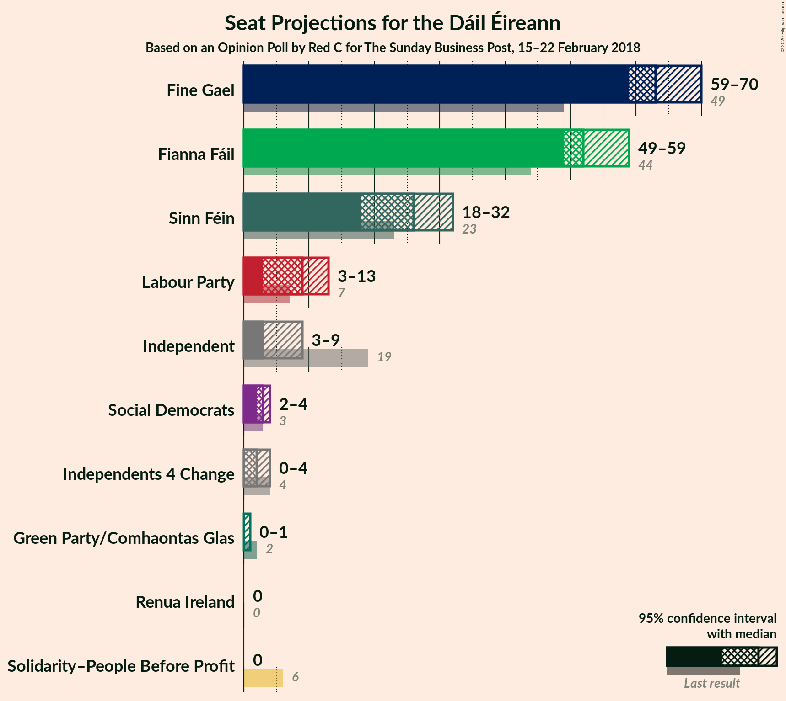
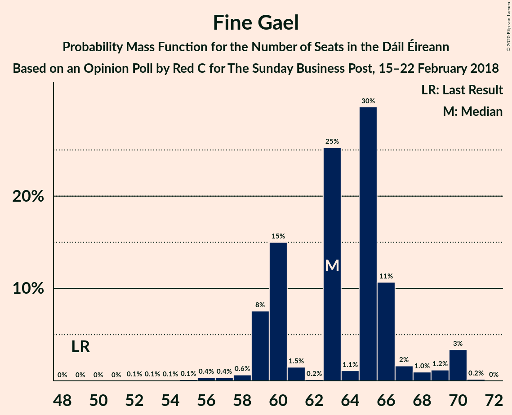
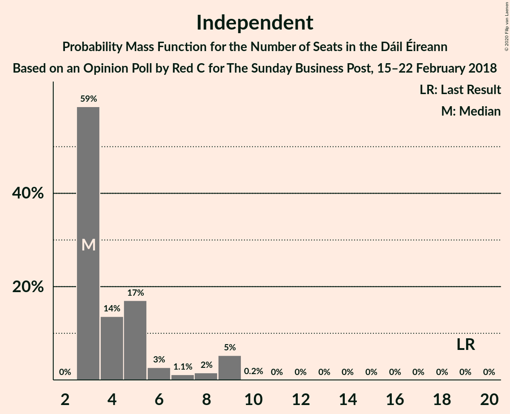
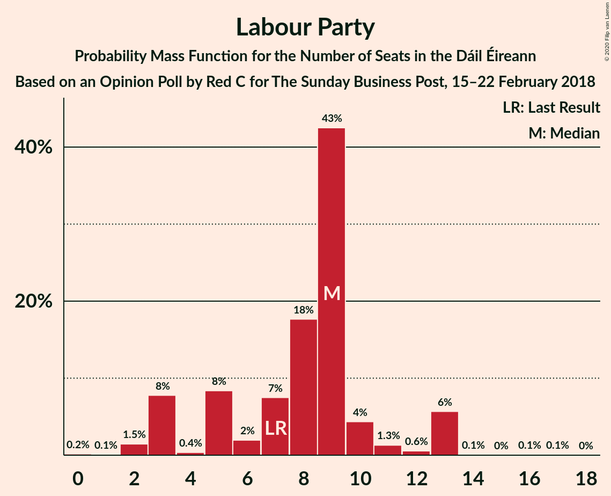
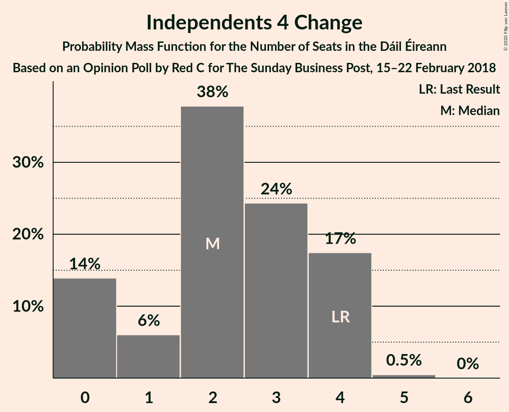
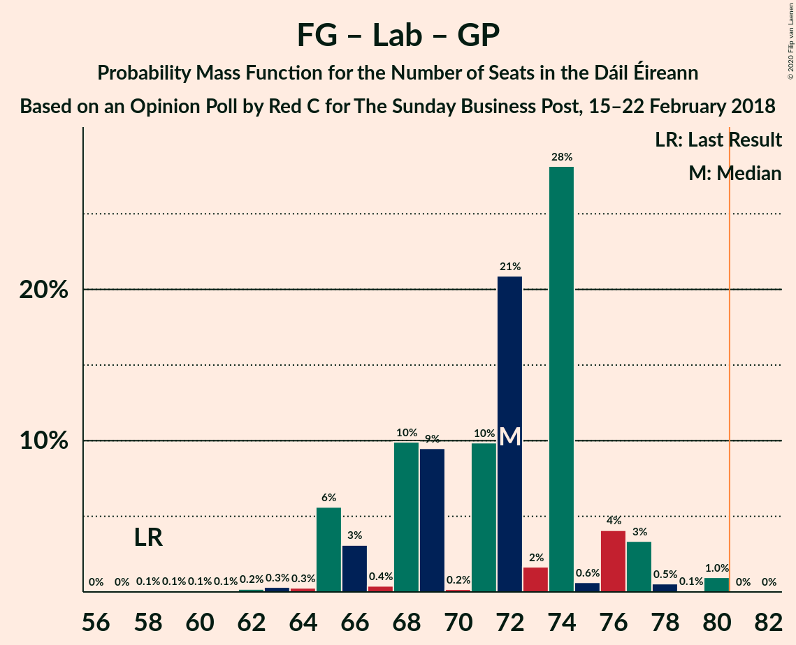
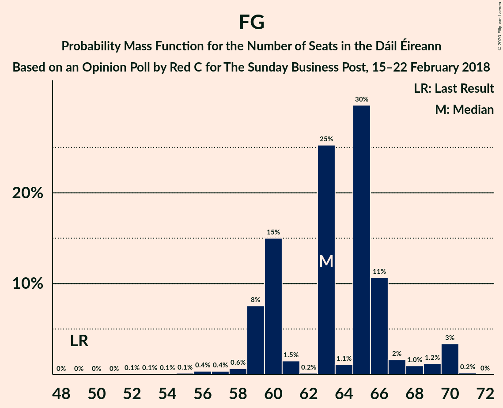
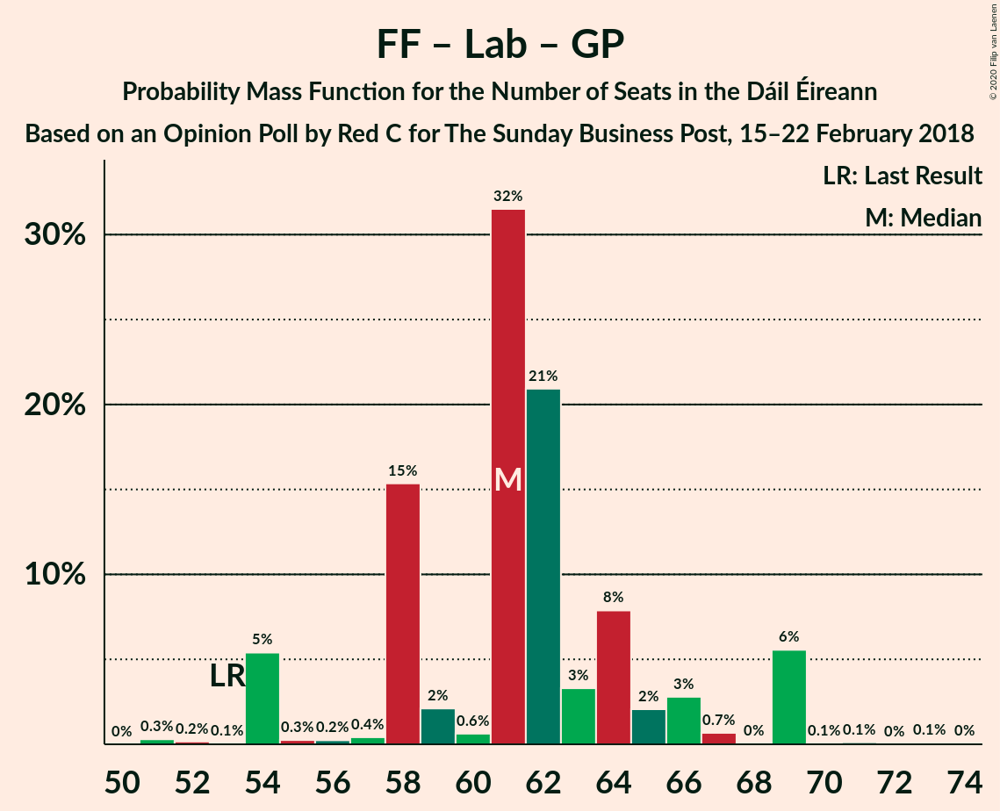

# Opinion Poll by Red C for The Sunday Business Post, 15–22 February 2018

<a href="#voting-intentions">Voting Intentions</a> | <a href="#seats">Seats</a> | <a href="#coalitions">Coalitions</a> | <a href="#technical-information">Technical Information</a>

## Voting Intentions

### Confidence Intervals

| Party | Last Result | Poll Result | 80% Confidence Interval | 90% Confidence Interval | 95% Confidence Interval | 99% Confidence Interval |
|:-----:|:-----------:|:-----------:|:-----------------------:|:-----------------------:|:-----------------------:|:-----------------------:|
| Fine Gael | 25.5% | 32.2% | 30.1–33.9% |29.6–34.5% |29.2–35.0% |28.3–35.9% |
| Fianna Fáil | 24.3% | 29.2% | 27.2–30.9% |26.7–31.4% |26.3–31.9% |25.4–32.8% |
| Sinn Féin | 13.8% | 14.1% | 12.7–15.5% |12.3–15.9% |12.0–16.3% |11.4–17.0% |
| Independent | 15.9% | 8.6% | 7.5–9.7% |7.2–10.1% |6.9–10.4% |6.4–11.0% |
| Labour Party | 6.6% | 6.0% | 5.1–7.1% |4.9–7.4% |4.7–7.7% |4.3–8.2% |
| Social Democrats | 3.0% | 2.0% | 1.5–2.7% |1.4–2.9% |1.3–3.1% |1.1–3.4% |
| Green Party/Comhaontas Glas | 2.7% | 2.0% | 1.5–2.7% |1.4–2.9% |1.3–3.1% |1.1–3.4% |
| Independents 4 Change | 1.5% | 1.1% | 0.8–1.7% |0.7–1.8% |0.6–2.0% |0.5–2.3% |
| Solidarity–People Before Profit | 3.9% | 1.0% | 0.7–1.5% |0.6–1.7% |0.5–1.8% |0.4–2.1% |
| Renua Ireland | 2.2% | 0.3% | 0.7–1.5% |0.6–1.7% |0.5–1.8% |0.4–2.1% |

*Note:* The poll result column reflects the actual value used in the calculations. Published results may vary slightly, and in addition be rounded to fewer digits.

## Seats

### Confidence Intervals

| Party | Last Result | Median | 80% Confidence Interval | 90% Confidence Interval | 95% Confidence Interval | 99% Confidence Interval |
|:-----:|:-----------:|:------:|:-----------------------:|:-----------------------:|:-----------------------:|:-----------------------:|
| <a href="#fine-gael">Fine Gael</a> | 49 | 63 | 60–66 |59–68 |59–70 |56–70 |
| <a href="#fianna-fáil">Fianna Fáil</a> | 44 | 52 | 49–57 |49–59 |49–59 |48–59 |
| <a href="#sinn-féin">Sinn Féin</a> | 23 | 26 | 21–32 |18–32 |18–32 |17–33 |
| <a href="#independent">Independent</a> | 19 | 3 | 3–6 |3–9 |3–9 |3–9 |
| <a href="#labour-party">Labour Party</a> | 7 | 9 | 5–10 |3–13 |3–13 |2–13 |
| <a href="#social-democrats">Social Democrats</a> | 3 | 3 | 2–3 |2–4 |2–4 |1–4 |
| <a href="#green-party/comhaontas-glas">Green Party/Comhaontas Glas</a> | 2 | 0 | 0 |0–1 |0–1 |0–2 |
| <a href="#independents-4-change">Independents 4 Change</a> | 4 | 2 | 0–4 |0–4 |0–4 |0–4 |
| <a href="#solidarity–people-before-profit">Solidarity–People Before Profit</a> | 6 | 0 | 0 |0 |0 |0–3 |
| <a href="#renua-ireland">Renua Ireland</a> | 0 | 0 | 0 |0 |0 |0–1 |

### Fine Gael

*For a full overview of the results for this party, see the [Fine Gael](party-finegael.html) page.*

| Number of Seats | Probability | Accumulated | Special Marks |
|:---------------:|:-----------:|:-----------:|:-------------:|
| 49 | 0% | 100% | Last Result |
| 50 | 0% | 100% |  |
| 51 | 0% | 100% |  |
| 52 | 0.1% | 100% |  |
| 53 | 0.1% | 99.9% |  |
| 54 | 0.1% | 99.9% |  |
| 55 | 0.1% | 99.8% |  |
| 56 | 0.4% | 99.6% |  |
| 57 | 0.4% | 99.3% |  |
| 58 | 0.6% | 98.9% |  |
| 59 | 8% | 98% |  |
| 60 | 15% | 91% |  |
| 61 | 1.5% | 76% |  |
| 62 | 0.2% | 74% |  |
| 63 | 25% | 74% | Median |
| 64 | 1.1% | 49% |  |
| 65 | 30% | 48% |  |
| 66 | 11% | 18% |  |
| 67 | 2% | 7% |  |
| 68 | 1.0% | 6% |  |
| 69 | 1.2% | 5% |  |
| 70 | 3% | 4% |  |
| 71 | 0.2% | 0.2% |  |
| 72 | 0% | 0% |  |

### Fianna Fáil

*For a full overview of the results for this party, see the [Fianna Fáil](party-fiannafáil.html) page.*

| Number of Seats | Probability | Accumulated | Special Marks |
|:---------------:|:-----------:|:-----------:|:-------------:|
| 44 | 0.1% | 100% | Last Result |
| 45 | 0.1% | 99.9% |  |
| 46 | 0.2% | 99.8% |  |
| 47 | 0% | 99.6% |  |
| 48 | 0.4% | 99.6% |  |
| 49 | 15% | 99.2% |  |
| 50 | 0.4% | 84% |  |
| 51 | 7% | 84% |  |
| 52 | 27% | 77% | Median |
| 53 | 3% | 50% |  |
| 54 | 20% | 47% |  |
| 55 | 5% | 27% |  |
| 56 | 10% | 22% |  |
| 57 | 4% | 12% |  |
| 58 | 0.5% | 8% |  |
| 59 | 7% | 7% |  |
| 60 | 0.4% | 0.4% |  |
| 61 | 0% | 0% |  |

### Sinn Féin

*For a full overview of the results for this party, see the [Sinn Féin](party-sinnféin.html) page.*

| Number of Seats | Probability | Accumulated | Special Marks |
|:---------------:|:-----------:|:-----------:|:-------------:|
| 16 | 0.4% | 100% |  |
| 17 | 1.4% | 99.6% |  |
| 18 | 4% | 98% |  |
| 19 | 1.0% | 95% |  |
| 20 | 1.0% | 94% |  |
| 21 | 4% | 93% |  |
| 22 | 0.4% | 89% |  |
| 23 | 8% | 89% | Last Result |
| 24 | 6% | 81% |  |
| 25 | 2% | 75% |  |
| 26 | 37% | 73% | Median |
| 27 | 6% | 36% |  |
| 28 | 15% | 30% |  |
| 29 | 2% | 15% |  |
| 30 | 0.9% | 13% |  |
| 31 | 0.3% | 12% |  |
| 32 | 10% | 11% |  |
| 33 | 0.9% | 1.4% |  |
| 34 | 0.1% | 0.4% |  |
| 35 | 0.3% | 0.4% |  |
| 36 | 0% | 0.1% |  |
| 37 | 0.1% | 0.1% |  |
| 38 | 0% | 0% |  |

### Independent

*For a full overview of the results for this party, see the [Independent](party-independent.html) page.*

| Number of Seats | Probability | Accumulated | Special Marks |
|:---------------:|:-----------:|:-----------:|:-------------:|
| 3 | 59% | 100% | Median |
| 4 | 14% | 41% |  |
| 5 | 17% | 28% |  |
| 6 | 3% | 11% |  |
| 7 | 1.1% | 8% |  |
| 8 | 2% | 7% |  |
| 9 | 5% | 5% |  |
| 10 | 0.2% | 0.2% |  |
| 11 | 0% | 0% |  |
| 12 | 0% | 0% |  |
| 13 | 0% | 0% |  |
| 14 | 0% | 0% |  |
| 15 | 0% | 0% |  |
| 16 | 0% | 0% |  |
| 17 | 0% | 0% |  |
| 18 | 0% | 0% |  |
| 19 | 0% | 0% | Last Result |

### Labour Party

*For a full overview of the results for this party, see the [Labour Party](party-labourparty.html) page.*

| Number of Seats | Probability | Accumulated | Special Marks |
|:---------------:|:-----------:|:-----------:|:-------------:|
| 0 | 0.2% | 100% |  |
| 1 | 0.1% | 99.8% |  |
| 2 | 1.5% | 99.8% |  |
| 3 | 8% | 98% |  |
| 4 | 0.4% | 91% |  |
| 5 | 8% | 90% |  |
| 6 | 2% | 82% |  |
| 7 | 7% | 80% | Last Result |
| 8 | 18% | 72% |  |
| 9 | 43% | 55% | Median |
| 10 | 4% | 12% |  |
| 11 | 1.3% | 8% |  |
| 12 | 0.6% | 7% |  |
| 13 | 6% | 6% |  |
| 14 | 0.1% | 0.3% |  |
| 15 | 0% | 0.2% |  |
| 16 | 0.1% | 0.2% |  |
| 17 | 0.1% | 0.1% |  |
| 18 | 0% | 0% |  |

### Social Democrats

*For a full overview of the results for this party, see the [Social Democrats](party-socialdemocrats.html) page.*

| Number of Seats | Probability | Accumulated | Special Marks |
|:---------------:|:-----------:|:-----------:|:-------------:|
| 1 | 2% | 100% |  |
| 2 | 9% | 98% |  |
| 3 | 83% | 89% | Last Result, Median |
| 4 | 6% | 6% |  |
| 5 | 0% | 0% |  |

### Green Party/Comhaontas Glas

*For a full overview of the results for this party, see the [Green Party/Comhaontas Glas](party-greenpartycomhaontasglas.html) page.*

| Number of Seats | Probability | Accumulated | Special Marks |
|:---------------:|:-----------:|:-----------:|:-------------:|
| 0 | 92% | 100% | Median |
| 1 | 7% | 8% |  |
| 2 | 1.2% | 1.3% | Last Result |
| 3 | 0% | 0% |  |

### Independents 4 Change

*For a full overview of the results for this party, see the [Independents 4 Change](party-independents4change.html) page.*

| Number of Seats | Probability | Accumulated | Special Marks |
|:---------------:|:-----------:|:-----------:|:-------------:|
| 0 | 14% | 100% |  |
| 1 | 6% | 86% |  |
| 2 | 38% | 80% | Median |
| 3 | 24% | 42% |  |
| 4 | 17% | 18% | Last Result |
| 5 | 0.5% | 0.5% |  |
| 6 | 0% | 0% |  |

### Solidarity–People Before Profit

*For a full overview of the results for this party, see the [Solidarity–People Before Profit](party-solidarity–peoplebeforeprofit.html) page.*

| Number of Seats | Probability | Accumulated | Special Marks |
|:---------------:|:-----------:|:-----------:|:-------------:|
| 0 | 98.7% | 100% | Median |
| 1 | 0.4% | 1.3% |  |
| 2 | 0.3% | 0.9% |  |
| 3 | 0.6% | 0.6% |  |
| 4 | 0% | 0% |  |
| 5 | 0% | 0% |  |
| 6 | 0% | 0% | Last Result |

### Renua Ireland

*For a full overview of the results for this party, see the [Renua Ireland](party-renuaireland.html) page.*

| Number of Seats | Probability | Accumulated | Special Marks |
|:---------------:|:-----------:|:-----------:|:-------------:|
| 0 | 99.3% | 100% | Last Result, Median |
| 1 | 0.7% | 0.7% |  |
| 2 | 0% | 0% |  |

## Coalitions

### Confidence Intervals

| Coalition | Last Result | Median | Majority? | 80% Confidence Interval | 90% Confidence Interval | 95% Confidence Interval | 99% Confidence Interval |
|:---------:|:-----------:|:------:|:---------:|:-----------------------:|:-----------------------:|:-----------------------:|:-----------------------:|
| Fine Gael – Fianna Fáil | 93 | 117 | 100% | 112–122 | 112–123 | 112–125 | 110–125 |
| Fianna Fáil – Sinn Féin | 67 | 78 | 25% | 75–86 | 74–86 | 73–86 | 70–89 |
| Fine Gael – Labour Party – Green Party/Comhaontas Glas – Social Democrats | 61 | 75 | 2% | 70–77 | 68–80 | 68–80 | 66–83 |
| Fine Gael – Labour Party – Green Party/Comhaontas Glas | 58 | 72 | 0% | 67–74 | 65–76 | 65–77 | 63–80 |
| Fine Gael – Labour Party | 56 | 72 | 0% | 67–74 | 65–76 | 65–77 | 62–80 |
| Fianna Fáil – Labour Party – Green Party/Comhaontas Glas – Social Democrats | 56 | 64 | 0% | 61–68 | 57–72 | 57–72 | 56–72 |
| Fine Gael | 49 | 63 | 0% | 60–66 | 59–68 | 59–70 | 56–70 |
| Fine Gael – Green Party/Comhaontas Glas | 51 | 64 | 0% | 60–66 | 59–68 | 59–70 | 56–71 |
| Fianna Fáil – Labour Party – Green Party/Comhaontas Glas | 53 | 61 | 0% | 58–65 | 54–69 | 54–69 | 53–69 |
| Fianna Fáil – Labour Party | 51 | 61 | 0% | 58–64 | 54–69 | 54–69 | 52–69 |
| Fianna Fáil – Green Party/Comhaontas Glas | 46 | 53 | 0% | 49–58 | 49–59 | 49–59 | 48–60 |

### Fine Gael – Fianna Fáil

| Number of Seats | Probability | Accumulated | Special Marks |
|:---------------:|:-----------:|:-----------:|:-------------:|
| 93 | 0% | 100% | Last Result |
| 94 | 0% | 100% |  |
| 95 | 0% | 100% |  |
| 96 | 0% | 100% |  |
| 97 | 0% | 100% |  |
| 98 | 0% | 100% |  |
| 99 | 0% | 100% |  |
| 100 | 0% | 100% |  |
| 101 | 0% | 100% |  |
| 102 | 0% | 100% |  |
| 103 | 0% | 100% |  |
| 104 | 0% | 100% |  |
| 105 | 0% | 100% |  |
| 106 | 0.1% | 100% |  |
| 107 | 0% | 99.9% |  |
| 108 | 0.3% | 99.9% |  |
| 109 | 0.1% | 99.6% |  |
| 110 | 0.3% | 99.5% |  |
| 111 | 0.1% | 99.2% |  |
| 112 | 15% | 99.1% |  |
| 113 | 1.5% | 84% |  |
| 114 | 11% | 83% |  |
| 115 | 7% | 71% | Median |
| 116 | 0.5% | 64% |  |
| 117 | 41% | 64% |  |
| 118 | 0.7% | 23% |  |
| 119 | 6% | 22% |  |
| 120 | 3% | 16% |  |
| 121 | 0.9% | 14% |  |
| 122 | 8% | 13% |  |
| 123 | 2% | 5% |  |
| 124 | 0.1% | 4% |  |
| 125 | 4% | 4% |  |
| 126 | 0% | 0% |  |

### Fianna Fáil – Sinn Féin

| Number of Seats | Probability | Accumulated | Special Marks |
|:---------------:|:-----------:|:-----------:|:-------------:|
| 67 | 0% | 100% | Last Result |
| 68 | 0.1% | 100% |  |
| 69 | 0% | 99.9% |  |
| 70 | 0.6% | 99.9% |  |
| 71 | 1.1% | 99.3% |  |
| 72 | 0.6% | 98% |  |
| 73 | 0.3% | 98% |  |
| 74 | 5% | 97% |  |
| 75 | 7% | 92% |  |
| 76 | 4% | 86% |  |
| 77 | 15% | 82% |  |
| 78 | 28% | 67% | Median |
| 79 | 6% | 39% |  |
| 80 | 8% | 33% |  |
| 81 | 0.3% | 25% | Majority |
| 82 | 3% | 25% |  |
| 83 | 4% | 22% |  |
| 84 | 0.1% | 18% |  |
| 85 | 0.5% | 18% |  |
| 86 | 15% | 17% |  |
| 87 | 0.8% | 2% |  |
| 88 | 0.3% | 1.4% |  |
| 89 | 0.9% | 1.1% |  |
| 90 | 0.1% | 0.2% |  |
| 91 | 0% | 0.1% |  |
| 92 | 0.1% | 0.1% |  |
| 93 | 0% | 0% |  |

### Fine Gael – Labour Party – Green Party/Comhaontas Glas – Social Democrats

| Number of Seats | Probability | Accumulated | Special Marks |
|:---------------:|:-----------:|:-----------:|:-------------:|
| 61 | 0.1% | 100% | Last Result |
| 62 | 0.1% | 99.9% |  |
| 63 | 0.1% | 99.9% |  |
| 64 | 0.1% | 99.8% |  |
| 65 | 0.2% | 99.7% |  |
| 66 | 0.2% | 99.5% |  |
| 67 | 0.2% | 99.4% |  |
| 68 | 7% | 99.1% |  |
| 69 | 2% | 93% |  |
| 70 | 3% | 91% |  |
| 71 | 10% | 88% |  |
| 72 | 7% | 78% |  |
| 73 | 8% | 71% |  |
| 74 | 2% | 63% |  |
| 75 | 21% | 60% | Median |
| 76 | 0.5% | 40% |  |
| 77 | 30% | 39% |  |
| 78 | 0.4% | 10% |  |
| 79 | 4% | 9% |  |
| 80 | 4% | 6% |  |
| 81 | 0.5% | 2% | Majority |
| 82 | 0.3% | 1.1% |  |
| 83 | 0.8% | 0.8% |  |
| 84 | 0% | 0% |  |

### Fine Gael – Labour Party – Green Party/Comhaontas Glas

| Number of Seats | Probability | Accumulated | Special Marks |
|:---------------:|:-----------:|:-----------:|:-------------:|
| 58 | 0.1% | 100% | Last Result |
| 59 | 0.1% | 99.9% |  |
| 60 | 0.1% | 99.8% |  |
| 61 | 0.1% | 99.8% |  |
| 62 | 0.2% | 99.7% |  |
| 63 | 0.3% | 99.5% |  |
| 64 | 0.3% | 99.2% |  |
| 65 | 6% | 99.0% |  |
| 66 | 3% | 93% |  |
| 67 | 0.4% | 90% |  |
| 68 | 10% | 90% |  |
| 69 | 9% | 80% |  |
| 70 | 0.2% | 70% |  |
| 71 | 10% | 70% |  |
| 72 | 21% | 60% | Median |
| 73 | 2% | 40% |  |
| 74 | 28% | 38% |  |
| 75 | 0.6% | 10% |  |
| 76 | 4% | 9% |  |
| 77 | 3% | 5% |  |
| 78 | 0.5% | 2% |  |
| 79 | 0.1% | 1.1% |  |
| 80 | 1.0% | 1.0% |  |
| 81 | 0% | 0% | Majority |

### Fine Gael – Labour Party

| Number of Seats | Probability | Accumulated | Special Marks |
|:---------------:|:-----------:|:-----------:|:-------------:|
| 56 | 0% | 100% | Last Result |
| 57 | 0% | 100% |  |
| 58 | 0.1% | 100% |  |
| 59 | 0% | 99.9% |  |
| 60 | 0.1% | 99.8% |  |
| 61 | 0.1% | 99.8% |  |
| 62 | 0.3% | 99.7% |  |
| 63 | 0.4% | 99.4% |  |
| 64 | 0.1% | 99.0% |  |
| 65 | 7% | 98.9% |  |
| 66 | 2% | 92% |  |
| 67 | 0.3% | 90% |  |
| 68 | 14% | 90% |  |
| 69 | 6% | 76% |  |
| 70 | 0.8% | 70% |  |
| 71 | 9% | 69% |  |
| 72 | 22% | 60% | Median |
| 73 | 2% | 38% |  |
| 74 | 27% | 37% |  |
| 75 | 0.7% | 10% |  |
| 76 | 4% | 9% |  |
| 77 | 3% | 5% |  |
| 78 | 0.4% | 1.5% |  |
| 79 | 0.2% | 1.0% |  |
| 80 | 0.9% | 0.9% |  |
| 81 | 0% | 0% | Majority |

### Fianna Fáil – Labour Party – Green Party/Comhaontas Glas – Social Democrats

| Number of Seats | Probability | Accumulated | Special Marks |
|:---------------:|:-----------:|:-----------:|:-------------:|
| 54 | 0.2% | 100% |  |
| 55 | 0.3% | 99.8% |  |
| 56 | 0.1% | 99.5% | Last Result |
| 57 | 5% | 99.5% |  |
| 58 | 0.2% | 94% |  |
| 59 | 0.2% | 94% |  |
| 60 | 0.4% | 94% |  |
| 61 | 16% | 93% |  |
| 62 | 4% | 78% |  |
| 63 | 0.6% | 74% |  |
| 64 | 37% | 74% | Median |
| 65 | 14% | 36% |  |
| 66 | 3% | 22% |  |
| 67 | 7% | 20% |  |
| 68 | 3% | 13% |  |
| 69 | 4% | 10% |  |
| 70 | 0.3% | 6% |  |
| 71 | 0% | 6% |  |
| 72 | 5% | 6% |  |
| 73 | 0.2% | 0.4% |  |
| 74 | 0.1% | 0.2% |  |
| 75 | 0% | 0.1% |  |
| 76 | 0.1% | 0.1% |  |
| 77 | 0% | 0% |  |

### Fine Gael

| Number of Seats | Probability | Accumulated | Special Marks |
|:---------------:|:-----------:|:-----------:|:-------------:|
| 49 | 0% | 100% | Last Result |
| 50 | 0% | 100% |  |
| 51 | 0% | 100% |  |
| 52 | 0.1% | 100% |  |
| 53 | 0.1% | 99.9% |  |
| 54 | 0.1% | 99.9% |  |
| 55 | 0.1% | 99.8% |  |
| 56 | 0.4% | 99.6% |  |
| 57 | 0.4% | 99.3% |  |
| 58 | 0.6% | 98.9% |  |
| 59 | 8% | 98% |  |
| 60 | 15% | 91% |  |
| 61 | 1.5% | 76% |  |
| 62 | 0.2% | 74% |  |
| 63 | 25% | 74% | Median |
| 64 | 1.1% | 49% |  |
| 65 | 30% | 48% |  |
| 66 | 11% | 18% |  |
| 67 | 2% | 7% |  |
| 68 | 1.0% | 6% |  |
| 69 | 1.2% | 5% |  |
| 70 | 3% | 4% |  |
| 71 | 0.2% | 0.2% |  |
| 72 | 0% | 0% |  |

### Fine Gael – Green Party/Comhaontas Glas

| Number of Seats | Probability | Accumulated | Special Marks |
|:---------------:|:-----------:|:-----------:|:-------------:|
| 51 | 0% | 100% | Last Result |
| 52 | 0.1% | 100% |  |
| 53 | 0.1% | 99.9% |  |
| 54 | 0% | 99.9% |  |
| 55 | 0.2% | 99.8% |  |
| 56 | 0.2% | 99.7% |  |
| 57 | 0.5% | 99.5% |  |
| 58 | 0.5% | 98.9% |  |
| 59 | 8% | 98% |  |
| 60 | 15% | 91% |  |
| 61 | 1.2% | 76% |  |
| 62 | 0.4% | 74% |  |
| 63 | 23% | 74% | Median |
| 64 | 4% | 52% |  |
| 65 | 27% | 48% |  |
| 66 | 12% | 21% |  |
| 67 | 2% | 8% |  |
| 68 | 2% | 7% |  |
| 69 | 1.1% | 5% |  |
| 70 | 3% | 4% |  |
| 71 | 0.4% | 0.5% |  |
| 72 | 0.2% | 0.2% |  |
| 73 | 0% | 0% |  |

### Fianna Fáil – Labour Party – Green Party/Comhaontas Glas

| Number of Seats | Probability | Accumulated | Special Marks |
|:---------------:|:-----------:|:-----------:|:-------------:|
| 51 | 0.3% | 100% |  |
| 52 | 0.2% | 99.7% |  |
| 53 | 0.1% | 99.5% | Last Result |
| 54 | 5% | 99.5% |  |
| 55 | 0.3% | 94% |  |
| 56 | 0.2% | 94% |  |
| 57 | 0.4% | 94% |  |
| 58 | 15% | 93% |  |
| 59 | 2% | 78% |  |
| 60 | 0.6% | 76% |  |
| 61 | 32% | 75% | Median |
| 62 | 21% | 44% |  |
| 63 | 3% | 23% |  |
| 64 | 8% | 19% |  |
| 65 | 2% | 11% |  |
| 66 | 3% | 9% |  |
| 67 | 0.7% | 7% |  |
| 68 | 0% | 6% |  |
| 69 | 6% | 6% |  |
| 70 | 0.1% | 0.3% |  |
| 71 | 0.1% | 0.2% |  |
| 72 | 0% | 0.1% |  |
| 73 | 0.1% | 0.1% |  |
| 74 | 0% | 0% |  |

### Fianna Fáil – Labour Party

| Number of Seats | Probability | Accumulated | Special Marks |
|:---------------:|:-----------:|:-----------:|:-------------:|
| 50 | 0% | 100% |  |
| 51 | 0.3% | 99.9% | Last Result |
| 52 | 0.1% | 99.6% |  |
| 53 | 0.1% | 99.5% |  |
| 54 | 5% | 99.4% |  |
| 55 | 0.3% | 94% |  |
| 56 | 0.5% | 94% |  |
| 57 | 1.4% | 93% |  |
| 58 | 15% | 92% |  |
| 59 | 1.3% | 76% |  |
| 60 | 3% | 75% |  |
| 61 | 29% | 72% | Median |
| 62 | 22% | 44% |  |
| 63 | 3% | 22% |  |
| 64 | 9% | 19% |  |
| 65 | 0.5% | 10% |  |
| 66 | 3% | 9% |  |
| 67 | 0.7% | 7% |  |
| 68 | 0% | 6% |  |
| 69 | 6% | 6% |  |
| 70 | 0% | 0.2% |  |
| 71 | 0.1% | 0.2% |  |
| 72 | 0% | 0.1% |  |
| 73 | 0.1% | 0.1% |  |
| 74 | 0% | 0% |  |

### Fianna Fáil – Green Party/Comhaontas Glas

| Number of Seats | Probability | Accumulated | Special Marks |
|:---------------:|:-----------:|:-----------:|:-------------:|
| 44 | 0.1% | 100% |  |
| 45 | 0.1% | 99.9% |  |
| 46 | 0.1% | 99.8% | Last Result |
| 47 | 0% | 99.7% |  |
| 48 | 0.4% | 99.6% |  |
| 49 | 15% | 99.2% |  |
| 50 | 0.2% | 84% |  |
| 51 | 6% | 84% |  |
| 52 | 27% | 78% | Median |
| 53 | 4% | 51% |  |
| 54 | 19% | 47% |  |
| 55 | 4% | 28% |  |
| 56 | 11% | 23% |  |
| 57 | 2% | 12% |  |
| 58 | 3% | 11% |  |
| 59 | 6% | 7% |  |
| 60 | 2% | 2% |  |
| 61 | 0.1% | 0.1% |  |
| 62 | 0% | 0% |  |

## Technical Information

### Opinion Poll

+ **Polling firm:** Red C
+ **Commissioner(s):** The Sunday Business Post
+ **Fieldwork period:** 15–22 February 2018

### Calculations

+ **Sample size:** 993
+ **Simulations done:** 131,072
+ **Error estimate:** 1.10%

