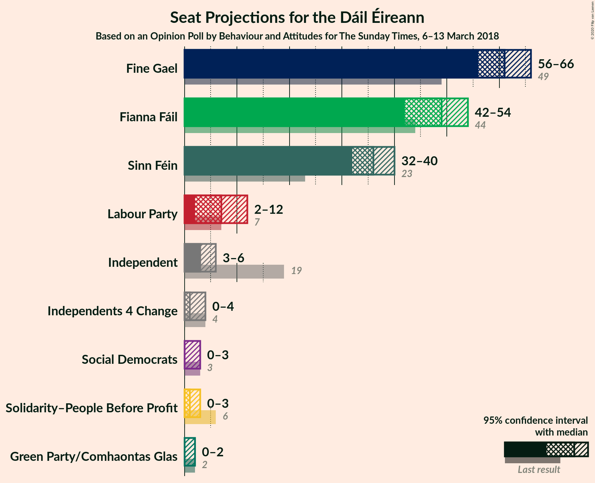
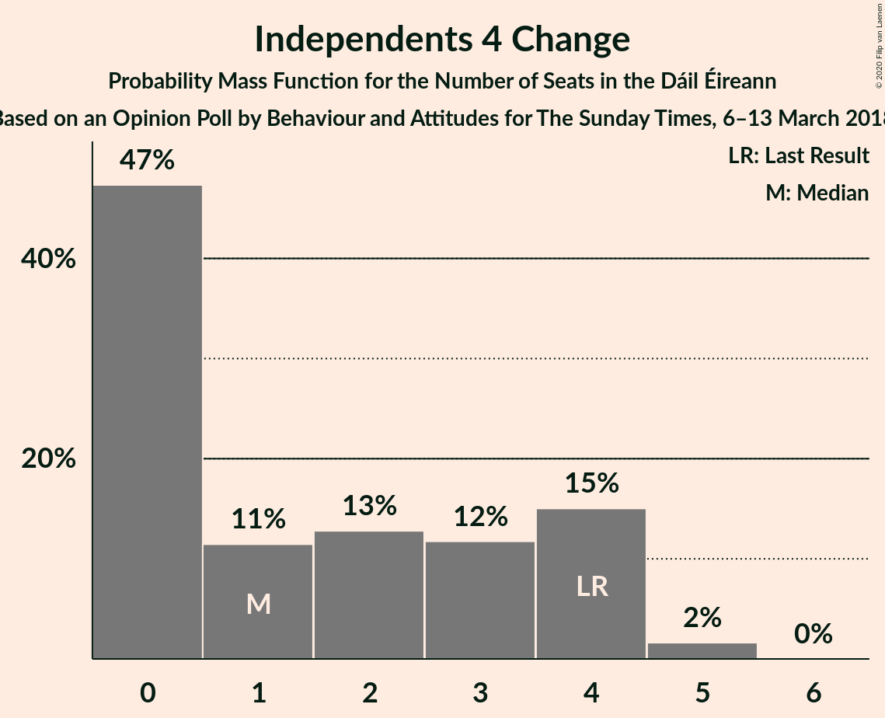
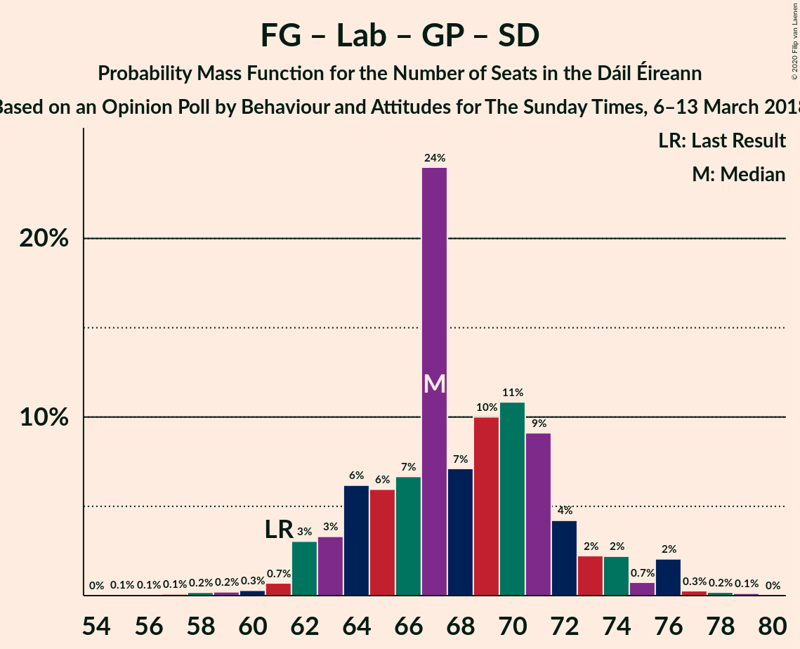

# Opinion Poll by Behaviour and Attitudes for The Sunday Times, 6–13 March 2018

<a href="#voting-intentions">Voting Intentions</a> | <a href="#seats">Seats</a> | <a href="#coalitions">Coalitions</a> | <a href="#technical-information">Technical Information</a>

## Voting Intentions

### Confidence Intervals

| Party | Last Result | Poll Result | 80% Confidence Interval | 90% Confidence Interval | 95% Confidence Interval | 99% Confidence Interval |
|:-----:|:-----------:|:-----------:|:-----------------------:|:-----------------------:|:-----------------------:|:-----------------------:|
| Fine Gael | 25.5% | 31.3% | 29.4–33.4% |28.9–33.9% |28.4–34.4% |27.5–35.4% |
| Fianna Fáil | 24.3% | 26.4% | 24.6–28.4% |24.1–28.9% |23.7–29.4% |22.8–30.4% |
| Sinn Féin | 13.8% | 18.7% | 17.1–20.4% |16.6–20.9% |16.2–21.4% |15.5–22.2% |
| Independent | 15.9% | 8.3% | 7.3–9.6% |7.0–10.0% |6.7–10.3% |6.2–11.0% |
| Labour Party | 6.6% | 5.9% | 5.0–7.0% |4.7–7.3% |4.5–7.6% |4.1–8.2% |
| Solidarity–People Before Profit | 3.9% | 2.0% | 1.5–2.7% |1.4–3.0% |1.3–3.1% |1.1–3.5% |
| Green Party/Comhaontas Glas | 2.7% | 2.0% | 1.5–2.7% |1.4–3.0% |1.3–3.1% |1.1–3.5% |
| Social Democrats | 3.0% | 1.0% | 0.7–1.6% |0.6–1.7% |0.5–1.9% |0.4–2.2% |
| Independents 4 Change | 1.5% | 1.0% | 0.7–1.6% |0.6–1.7% |0.5–1.9% |0.4–2.2% |

*Note:* The poll result column reflects the actual value used in the calculations. Published results may vary slightly, and in addition be rounded to fewer digits.

## Seats

### Confidence Intervals

| Party | Last Result | Median | 80% Confidence Interval | 90% Confidence Interval | 95% Confidence Interval | 99% Confidence Interval |
|:-----:|:-----------:|:------:|:-----------------------:|:-----------------------:|:-----------------------:|:-----------------------:|
| <a href="#fine-gael">Fine Gael</a> | 49 | 61 | 56–65 |56–66 |56–67 |53–68 |
| <a href="#fianna-fáil">Fianna Fáil</a> | 44 | 49 | 44–52 |43–54 |43–55 |40–56 |
| <a href="#sinn-féin">Sinn Féin</a> | 23 | 36 | 33–39 |33–41 |32–41 |30–41 |
| <a href="#independent">Independent</a> | 19 | 3 | 3–6 |3–6 |3–6 |3–8 |
| <a href="#labour-party">Labour Party</a> | 7 | 6 | 2–9 |2–11 |2–13 |1–13 |
| <a href="#solidarity–people-before-profit">Solidarity–People Before Profit</a> | 6 | 1 | 0–3 |0–3 |0–3 |0–4 |
| <a href="#green-party/comhaontas-glas">Green Party/Comhaontas Glas</a> | 2 | 0 | 0 |0–1 |0–2 |0–2 |
| <a href="#social-democrats">Social Democrats</a> | 3 | 0 | 0–3 |0–3 |0–3 |0–3 |
| <a href="#independents-4-change">Independents 4 Change</a> | 4 | 2 | 0–4 |0–4 |0–4 |0–5 |

### Fine Gael

*For a full overview of the results for this party, see the [Fine Gael](party-finegael.html) page.*

| Number of Seats | Probability | Accumulated | Special Marks |
|:---------------:|:-----------:|:-----------:|:-------------:|
| 48 | 0% | 100% |  |
| 49 | 0% | 99.9% | Last Result |
| 50 | 0% | 99.9% |  |
| 51 | 0.1% | 99.9% |  |
| 52 | 0.2% | 99.7% |  |
| 53 | 0.3% | 99.5% |  |
| 54 | 0.5% | 99.2% |  |
| 55 | 0.3% | 98.8% |  |
| 56 | 10% | 98% |  |
| 57 | 4% | 88% |  |
| 58 | 17% | 84% |  |
| 59 | 7% | 66% |  |
| 60 | 8% | 59% |  |
| 61 | 18% | 52% | Median |
| 62 | 3% | 34% |  |
| 63 | 10% | 31% |  |
| 64 | 11% | 22% |  |
| 65 | 3% | 10% |  |
| 66 | 3% | 7% |  |
| 67 | 3% | 4% |  |
| 68 | 1.0% | 1.1% |  |
| 69 | 0.1% | 0.2% |  |
| 70 | 0% | 0% |  |

### Fianna Fáil

*For a full overview of the results for this party, see the [Fianna Fáil](party-fiannafáil.html) page.*

| Number of Seats | Probability | Accumulated | Special Marks |
|:---------------:|:-----------:|:-----------:|:-------------:|
| 38 | 0.1% | 100% |  |
| 39 | 0.1% | 99.9% |  |
| 40 | 0.5% | 99.8% |  |
| 41 | 0.7% | 99.3% |  |
| 42 | 0.4% | 98.5% |  |
| 43 | 5% | 98% |  |
| 44 | 4% | 93% | Last Result |
| 45 | 3% | 89% |  |
| 46 | 3% | 86% |  |
| 47 | 10% | 83% |  |
| 48 | 3% | 72% |  |
| 49 | 20% | 69% | Median |
| 50 | 11% | 50% |  |
| 51 | 23% | 39% |  |
| 52 | 8% | 16% |  |
| 53 | 1.5% | 8% |  |
| 54 | 3% | 7% |  |
| 55 | 3% | 4% |  |
| 56 | 0.5% | 0.7% |  |
| 57 | 0.1% | 0.2% |  |
| 58 | 0% | 0.1% |  |
| 59 | 0% | 0% |  |

### Sinn Féin

*For a full overview of the results for this party, see the [Sinn Féin](party-sinnféin.html) page.*

| Number of Seats | Probability | Accumulated | Special Marks |
|:---------------:|:-----------:|:-----------:|:-------------:|
| 23 | 0% | 100% | Last Result |
| 24 | 0% | 100% |  |
| 25 | 0% | 100% |  |
| 26 | 0.1% | 100% |  |
| 27 | 0% | 99.9% |  |
| 28 | 0.1% | 99.9% |  |
| 29 | 0.3% | 99.8% |  |
| 30 | 0.1% | 99.5% |  |
| 31 | 0.5% | 99.4% |  |
| 32 | 2% | 98.9% |  |
| 33 | 13% | 97% |  |
| 34 | 13% | 84% |  |
| 35 | 19% | 71% |  |
| 36 | 19% | 52% | Median |
| 37 | 15% | 33% |  |
| 38 | 7% | 19% |  |
| 39 | 2% | 12% |  |
| 40 | 2% | 10% |  |
| 41 | 8% | 8% |  |
| 42 | 0.2% | 0.4% |  |
| 43 | 0.1% | 0.2% |  |
| 44 | 0% | 0% |  |

### Independent

*For a full overview of the results for this party, see the [Independent](party-independent.html) page.*

| Number of Seats | Probability | Accumulated | Special Marks |
|:---------------:|:-----------:|:-----------:|:-------------:|
| 2 | 0.1% | 100% |  |
| 3 | 53% | 99.9% | Median |
| 4 | 9% | 46% |  |
| 5 | 25% | 38% |  |
| 6 | 11% | 13% |  |
| 7 | 1.0% | 2% |  |
| 8 | 0.3% | 0.6% |  |
| 9 | 0.3% | 0.3% |  |
| 10 | 0% | 0.1% |  |
| 11 | 0% | 0% |  |
| 12 | 0% | 0% |  |
| 13 | 0% | 0% |  |
| 14 | 0% | 0% |  |
| 15 | 0% | 0% |  |
| 16 | 0% | 0% |  |
| 17 | 0% | 0% |  |
| 18 | 0% | 0% |  |
| 19 | 0% | 0% | Last Result |

### Labour Party

*For a full overview of the results for this party, see the [Labour Party](party-labourparty.html) page.*

| Number of Seats | Probability | Accumulated | Special Marks |
|:---------------:|:-----------:|:-----------:|:-------------:|
| 0 | 0.3% | 100% |  |
| 1 | 1.3% | 99.7% |  |
| 2 | 16% | 98% |  |
| 3 | 15% | 82% |  |
| 4 | 6% | 67% |  |
| 5 | 7% | 61% |  |
| 6 | 12% | 54% | Median |
| 7 | 17% | 43% | Last Result |
| 8 | 8% | 26% |  |
| 9 | 12% | 18% |  |
| 10 | 0.4% | 6% |  |
| 11 | 0.2% | 5% |  |
| 12 | 0.1% | 5% |  |
| 13 | 4% | 5% |  |
| 14 | 0.1% | 0.4% |  |
| 15 | 0.1% | 0.3% |  |
| 16 | 0.1% | 0.2% |  |
| 17 | 0% | 0.1% |  |
| 18 | 0% | 0% |  |

### Solidarity–People Before Profit

*For a full overview of the results for this party, see the [Solidarity–People Before Profit](party-solidarity–peoplebeforeprofit.html) page.*

| Number of Seats | Probability | Accumulated | Special Marks |
|:---------------:|:-----------:|:-----------:|:-------------:|
| 0 | 38% | 100% |  |
| 1 | 20% | 62% | Median |
| 2 | 5% | 41% |  |
| 3 | 35% | 36% |  |
| 4 | 0.9% | 0.9% |  |
| 5 | 0% | 0% |  |
| 6 | 0% | 0% | Last Result |

### Green Party/Comhaontas Glas

*For a full overview of the results for this party, see the [Green Party/Comhaontas Glas](party-greenpartycomhaontasglas.html) page.*

| Number of Seats | Probability | Accumulated | Special Marks |
|:---------------:|:-----------:|:-----------:|:-------------:|
| 0 | 93% | 100% | Median |
| 1 | 4% | 7% |  |
| 2 | 3% | 3% | Last Result |
| 3 | 0.1% | 0.1% |  |
| 4 | 0% | 0% |  |

### Social Democrats

*For a full overview of the results for this party, see the [Social Democrats](party-socialdemocrats.html) page.*

| Number of Seats | Probability | Accumulated | Special Marks |
|:---------------:|:-----------:|:-----------:|:-------------:|
| 0 | 79% | 100% | Median |
| 1 | 4% | 21% |  |
| 2 | 0.1% | 17% |  |
| 3 | 16% | 17% | Last Result |
| 4 | 0.5% | 0.5% |  |
| 5 | 0% | 0% |  |

### Independents 4 Change

*For a full overview of the results for this party, see the [Independents 4 Change](party-independents4change.html) page.*

| Number of Seats | Probability | Accumulated | Special Marks |
|:---------------:|:-----------:|:-----------:|:-------------:|
| 0 | 43% | 100% |  |
| 1 | 3% | 57% |  |
| 2 | 11% | 54% | Median |
| 3 | 3% | 42% |  |
| 4 | 39% | 40% | Last Result |
| 5 | 0.8% | 0.8% |  |
| 6 | 0% | 0% |  |

## Coalitions

### Confidence Intervals

| Coalition | Last Result | Median | Majority? | 80% Confidence Interval | 90% Confidence Interval | 95% Confidence Interval | 99% Confidence Interval |
|:---------:|:-----------:|:------:|:---------:|:-----------------------:|:-----------------------:|:-----------------------:|:-----------------------:|
| Fine Gael – Fianna Fáil | 93 | 109 | 100% | 105–113 | 104–116 | 104–117 | 100–117 |
| Fianna Fáil – Sinn Féin | 67 | 85 | 84% | 80–90 | 78–90 | 78–92 | 76–93 |
| Fine Gael – Labour Party – Green Party/Comhaontas Glas | 58 | 66 | 0% | 63–72 | 62–74 | 61–74 | 58–76 |
| Fine Gael – Labour Party – Green Party/Comhaontas Glas – Social Democrats | 61 | 67 | 0% | 63–73 | 63–74 | 61–74 | 58–78 |
| Fine Gael – Labour Party | 56 | 66 | 0% | 63–72 | 62–74 | 61–74 | 58–74 |
| Fine Gael – Green Party/Comhaontas Glas | 51 | 61 | 0% | 56–65 | 56–67 | 56–68 | 53–68 |
| Fine Gael | 49 | 61 | 0% | 56–65 | 56–66 | 56–67 | 53–68 |
| Fianna Fáil – Labour Party – Green Party/Comhaontas Glas – Social Democrats | 56 | 56 | 0% | 50–60 | 50–61 | 49–63 | 45–65 |
| Fianna Fáil – Labour Party – Green Party/Comhaontas Glas | 53 | 56 | 0% | 50–60 | 50–60 | 49–60 | 45–63 |
| Fianna Fáil – Labour Party | 51 | 56 | 0% | 50–60 | 49–60 | 49–60 | 44–62 |
| Fianna Fáil – Green Party/Comhaontas Glas | 46 | 50 | 0% | 45–52 | 43–55 | 43–55 | 40–56 |

### Fine Gael – Fianna Fáil

| Number of Seats | Probability | Accumulated | Special Marks |
|:---------------:|:-----------:|:-----------:|:-------------:|
| 93 | 0% | 100% | Last Result |
| 94 | 0% | 100% |  |
| 95 | 0% | 100% |  |
| 96 | 0% | 100% |  |
| 97 | 0% | 100% |  |
| 98 | 0% | 99.9% |  |
| 99 | 0.1% | 99.9% |  |
| 100 | 0.7% | 99.9% |  |
| 101 | 0.1% | 99.2% |  |
| 102 | 0.5% | 99.1% |  |
| 103 | 0.2% | 98.6% |  |
| 104 | 5% | 98% |  |
| 105 | 9% | 94% |  |
| 106 | 1.5% | 84% |  |
| 107 | 3% | 83% |  |
| 108 | 5% | 80% |  |
| 109 | 25% | 75% |  |
| 110 | 13% | 50% | Median |
| 111 | 11% | 37% |  |
| 112 | 10% | 25% |  |
| 113 | 6% | 16% |  |
| 114 | 0.9% | 10% |  |
| 115 | 0.6% | 9% |  |
| 116 | 6% | 8% |  |
| 117 | 3% | 3% |  |
| 118 | 0.1% | 0.2% |  |
| 119 | 0% | 0.1% |  |
| 120 | 0% | 0.1% |  |
| 121 | 0% | 0% |  |

### Fianna Fáil – Sinn Féin

| Number of Seats | Probability | Accumulated | Special Marks |
|:---------------:|:-----------:|:-----------:|:-------------:|
| 67 | 0% | 100% | Last Result |
| 68 | 0% | 100% |  |
| 69 | 0% | 100% |  |
| 70 | 0% | 100% |  |
| 71 | 0% | 100% |  |
| 72 | 0% | 100% |  |
| 73 | 0% | 100% |  |
| 74 | 0.1% | 100% |  |
| 75 | 0.2% | 99.9% |  |
| 76 | 0.3% | 99.7% |  |
| 77 | 1.0% | 99.4% |  |
| 78 | 5% | 98% |  |
| 79 | 2% | 93% |  |
| 80 | 7% | 91% |  |
| 81 | 4% | 84% | Majority |
| 82 | 8% | 80% |  |
| 83 | 4% | 72% |  |
| 84 | 10% | 68% |  |
| 85 | 13% | 58% | Median |
| 86 | 2% | 45% |  |
| 87 | 17% | 43% |  |
| 88 | 9% | 26% |  |
| 89 | 5% | 17% |  |
| 90 | 7% | 12% |  |
| 91 | 0.5% | 4% |  |
| 92 | 2% | 4% |  |
| 93 | 2% | 2% |  |
| 94 | 0.2% | 0.3% |  |
| 95 | 0.1% | 0.1% |  |
| 96 | 0% | 0.1% |  |
| 97 | 0% | 0.1% |  |
| 98 | 0% | 0% |  |

### Fine Gael – Labour Party – Green Party/Comhaontas Glas

| Number of Seats | Probability | Accumulated | Special Marks |
|:---------------:|:-----------:|:-----------:|:-------------:|
| 54 | 0% | 100% |  |
| 55 | 0% | 99.9% |  |
| 56 | 0% | 99.9% |  |
| 57 | 0.1% | 99.9% |  |
| 58 | 0.5% | 99.8% | Last Result |
| 59 | 0.7% | 99.3% |  |
| 60 | 0.3% | 98.6% |  |
| 61 | 2% | 98% |  |
| 62 | 2% | 96% |  |
| 63 | 18% | 94% |  |
| 64 | 11% | 77% |  |
| 65 | 4% | 65% |  |
| 66 | 17% | 62% |  |
| 67 | 23% | 45% | Median |
| 68 | 3% | 22% |  |
| 69 | 3% | 19% |  |
| 70 | 2% | 16% |  |
| 71 | 1.5% | 14% |  |
| 72 | 3% | 13% |  |
| 73 | 4% | 10% |  |
| 74 | 5% | 6% |  |
| 75 | 0.2% | 0.9% |  |
| 76 | 0.6% | 0.7% |  |
| 77 | 0.1% | 0.1% |  |
| 78 | 0% | 0% |  |

### Fine Gael – Labour Party – Green Party/Comhaontas Glas – Social Democrats

| Number of Seats | Probability | Accumulated | Special Marks |
|:---------------:|:-----------:|:-----------:|:-------------:|
| 55 | 0% | 100% |  |
| 56 | 0% | 99.9% |  |
| 57 | 0.1% | 99.9% |  |
| 58 | 0.4% | 99.8% |  |
| 59 | 0.1% | 99.4% |  |
| 60 | 0.7% | 99.3% |  |
| 61 | 1.4% | 98.7% | Last Result |
| 62 | 2% | 97% |  |
| 63 | 16% | 95% |  |
| 64 | 11% | 80% |  |
| 65 | 0.9% | 68% |  |
| 66 | 16% | 67% |  |
| 67 | 20% | 51% | Median |
| 68 | 6% | 31% |  |
| 69 | 4% | 25% |  |
| 70 | 3% | 21% |  |
| 71 | 3% | 18% |  |
| 72 | 4% | 14% |  |
| 73 | 4% | 11% |  |
| 74 | 5% | 7% |  |
| 75 | 0.2% | 2% |  |
| 76 | 0.3% | 2% |  |
| 77 | 1.1% | 2% |  |
| 78 | 0.1% | 0.5% |  |
| 79 | 0.4% | 0.5% |  |
| 80 | 0.1% | 0.1% |  |
| 81 | 0% | 0% | Majority |

### Fine Gael – Labour Party

| Number of Seats | Probability | Accumulated | Special Marks |
|:---------------:|:-----------:|:-----------:|:-------------:|
| 54 | 0% | 100% |  |
| 55 | 0.1% | 99.9% |  |
| 56 | 0% | 99.9% | Last Result |
| 57 | 0.1% | 99.8% |  |
| 58 | 0.5% | 99.8% |  |
| 59 | 0.7% | 99.3% |  |
| 60 | 0.3% | 98.6% |  |
| 61 | 2% | 98% |  |
| 62 | 2% | 96% |  |
| 63 | 17% | 94% |  |
| 64 | 11% | 76% |  |
| 65 | 4% | 65% |  |
| 66 | 18% | 61% |  |
| 67 | 21% | 43% | Median |
| 68 | 3% | 21% |  |
| 69 | 3% | 18% |  |
| 70 | 1.4% | 15% |  |
| 71 | 3% | 14% |  |
| 72 | 3% | 11% |  |
| 73 | 2% | 8% |  |
| 74 | 6% | 6% |  |
| 75 | 0.2% | 0.4% |  |
| 76 | 0.1% | 0.2% |  |
| 77 | 0.1% | 0.1% |  |
| 78 | 0% | 0% |  |

### Fine Gael – Green Party/Comhaontas Glas

| Number of Seats | Probability | Accumulated | Special Marks |
|:---------------:|:-----------:|:-----------:|:-------------:|
| 49 | 0.1% | 100% |  |
| 50 | 0% | 99.9% |  |
| 51 | 0.1% | 99.9% | Last Result |
| 52 | 0.2% | 99.7% |  |
| 53 | 0.2% | 99.5% |  |
| 54 | 0.4% | 99.3% |  |
| 55 | 0.3% | 98.9% |  |
| 56 | 11% | 98.6% |  |
| 57 | 4% | 88% |  |
| 58 | 17% | 84% |  |
| 59 | 7% | 66% |  |
| 60 | 8% | 59% |  |
| 61 | 18% | 52% | Median |
| 62 | 2% | 34% |  |
| 63 | 8% | 32% |  |
| 64 | 14% | 24% |  |
| 65 | 3% | 11% |  |
| 66 | 0.9% | 8% |  |
| 67 | 3% | 7% |  |
| 68 | 3% | 4% |  |
| 69 | 0.3% | 0.3% |  |
| 70 | 0% | 0% |  |

### Fine Gael

| Number of Seats | Probability | Accumulated | Special Marks |
|:---------------:|:-----------:|:-----------:|:-------------:|
| 48 | 0% | 100% |  |
| 49 | 0% | 99.9% | Last Result |
| 50 | 0% | 99.9% |  |
| 51 | 0.1% | 99.9% |  |
| 52 | 0.2% | 99.7% |  |
| 53 | 0.3% | 99.5% |  |
| 54 | 0.5% | 99.2% |  |
| 55 | 0.3% | 98.8% |  |
| 56 | 10% | 98% |  |
| 57 | 4% | 88% |  |
| 58 | 17% | 84% |  |
| 59 | 7% | 66% |  |
| 60 | 8% | 59% |  |
| 61 | 18% | 52% | Median |
| 62 | 3% | 34% |  |
| 63 | 10% | 31% |  |
| 64 | 11% | 22% |  |
| 65 | 3% | 10% |  |
| 66 | 3% | 7% |  |
| 67 | 3% | 4% |  |
| 68 | 1.0% | 1.1% |  |
| 69 | 0.1% | 0.2% |  |
| 70 | 0% | 0% |  |

### Fianna Fáil – Labour Party – Green Party/Comhaontas Glas – Social Democrats

| Number of Seats | Probability | Accumulated | Special Marks |
|:---------------:|:-----------:|:-----------:|:-------------:|
| 43 | 0.1% | 100% |  |
| 44 | 0% | 99.8% |  |
| 45 | 0.9% | 99.8% |  |
| 46 | 0.2% | 98.9% |  |
| 47 | 0.2% | 98.7% |  |
| 48 | 0.6% | 98% |  |
| 49 | 0.7% | 98% |  |
| 50 | 9% | 97% |  |
| 51 | 3% | 89% |  |
| 52 | 13% | 86% |  |
| 53 | 2% | 73% |  |
| 54 | 8% | 71% |  |
| 55 | 4% | 62% | Median |
| 56 | 17% | 58% | Last Result |
| 57 | 12% | 41% |  |
| 58 | 12% | 30% |  |
| 59 | 2% | 17% |  |
| 60 | 9% | 16% |  |
| 61 | 3% | 7% |  |
| 62 | 1.1% | 4% |  |
| 63 | 2% | 3% |  |
| 64 | 0.2% | 0.7% |  |
| 65 | 0.1% | 0.5% |  |
| 66 | 0.3% | 0.4% |  |
| 67 | 0.1% | 0.1% |  |
| 68 | 0% | 0% |  |

### Fianna Fáil – Labour Party – Green Party/Comhaontas Glas

| Number of Seats | Probability | Accumulated | Special Marks |
|:---------------:|:-----------:|:-----------:|:-------------:|
| 42 | 0.1% | 100% |  |
| 43 | 0.1% | 99.9% |  |
| 44 | 0.1% | 99.8% |  |
| 45 | 1.1% | 99.7% |  |
| 46 | 0.2% | 98.6% |  |
| 47 | 0.3% | 98% |  |
| 48 | 0.4% | 98% |  |
| 49 | 1.0% | 98% |  |
| 50 | 9% | 97% |  |
| 51 | 4% | 88% |  |
| 52 | 14% | 84% |  |
| 53 | 3% | 70% | Last Result |
| 54 | 8% | 67% |  |
| 55 | 8% | 59% | Median |
| 56 | 18% | 51% |  |
| 57 | 13% | 33% |  |
| 58 | 6% | 21% |  |
| 59 | 1.5% | 15% |  |
| 60 | 11% | 13% |  |
| 61 | 1.5% | 2% |  |
| 62 | 0.3% | 0.9% |  |
| 63 | 0.3% | 0.6% |  |
| 64 | 0.1% | 0.3% |  |
| 65 | 0.1% | 0.1% |  |
| 66 | 0% | 0.1% |  |
| 67 | 0% | 0% |  |

### Fianna Fáil – Labour Party

| Number of Seats | Probability | Accumulated | Special Marks |
|:---------------:|:-----------:|:-----------:|:-------------:|
| 42 | 0.1% | 100% |  |
| 43 | 0.1% | 99.9% |  |
| 44 | 0.3% | 99.8% |  |
| 45 | 1.1% | 99.4% |  |
| 46 | 0.1% | 98% |  |
| 47 | 0.3% | 98% |  |
| 48 | 0.3% | 98% |  |
| 49 | 3% | 98% |  |
| 50 | 9% | 94% |  |
| 51 | 2% | 86% | Last Result |
| 52 | 14% | 84% |  |
| 53 | 3% | 70% |  |
| 54 | 8% | 67% |  |
| 55 | 7% | 58% | Median |
| 56 | 18% | 51% |  |
| 57 | 15% | 33% |  |
| 58 | 4% | 18% |  |
| 59 | 1.4% | 14% |  |
| 60 | 11% | 13% |  |
| 61 | 1.4% | 2% |  |
| 62 | 0.3% | 0.8% |  |
| 63 | 0.3% | 0.5% |  |
| 64 | 0.1% | 0.2% |  |
| 65 | 0.1% | 0.1% |  |
| 66 | 0% | 0.1% |  |
| 67 | 0% | 0% |  |

### Fianna Fáil – Green Party/Comhaontas Glas

| Number of Seats | Probability | Accumulated | Special Marks |
|:---------------:|:-----------:|:-----------:|:-------------:|
| 38 | 0.1% | 100% |  |
| 39 | 0.1% | 99.9% |  |
| 40 | 0.5% | 99.8% |  |
| 41 | 0.1% | 99.3% |  |
| 42 | 0.4% | 99.2% |  |
| 43 | 5% | 98.8% |  |
| 44 | 3% | 93% |  |
| 45 | 3% | 91% |  |
| 46 | 5% | 88% | Last Result |
| 47 | 11% | 83% |  |
| 48 | 3% | 73% |  |
| 49 | 20% | 70% | Median |
| 50 | 11% | 50% |  |
| 51 | 22% | 39% |  |
| 52 | 9% | 17% |  |
| 53 | 1.4% | 8% |  |
| 54 | 0.7% | 7% |  |
| 55 | 5% | 6% |  |
| 56 | 0.6% | 0.7% |  |
| 57 | 0.1% | 0.2% |  |
| 58 | 0% | 0.1% |  |
| 59 | 0% | 0% |  |

## Technical Information

### Opinion Poll

+ **Polling firm:** Behaviour and Attitudes
+ **Commissioner(s):** The Sunday Times
+ **Fieldwork period:** 6–13 March 2018

### Calculations

+ **Sample size:** 900
+ **Simulations done:** 131,072
+ **Error estimate:** 3.52%

