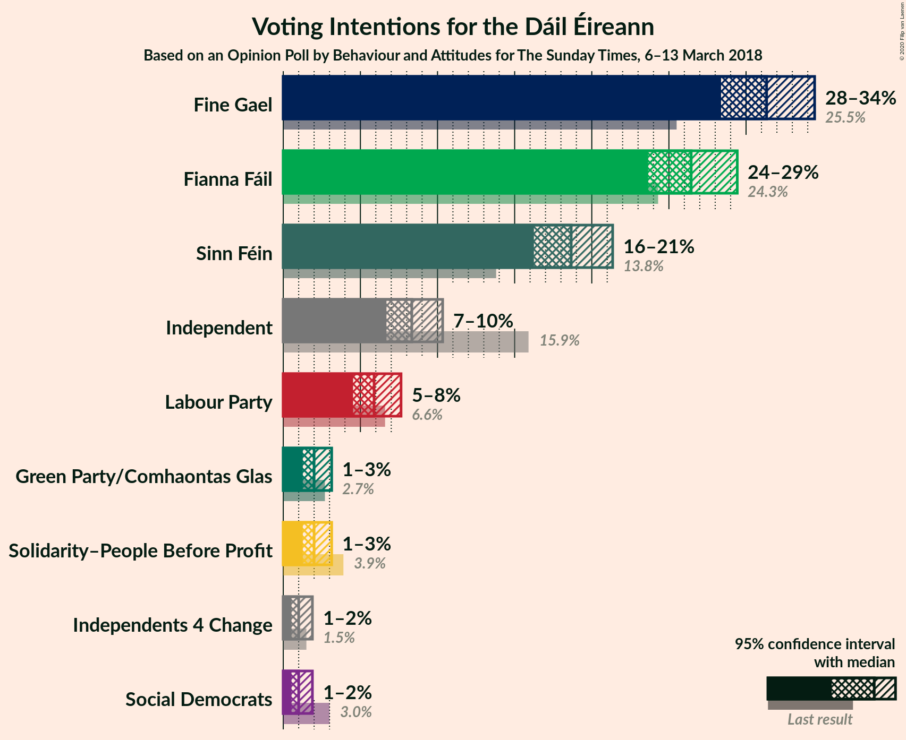
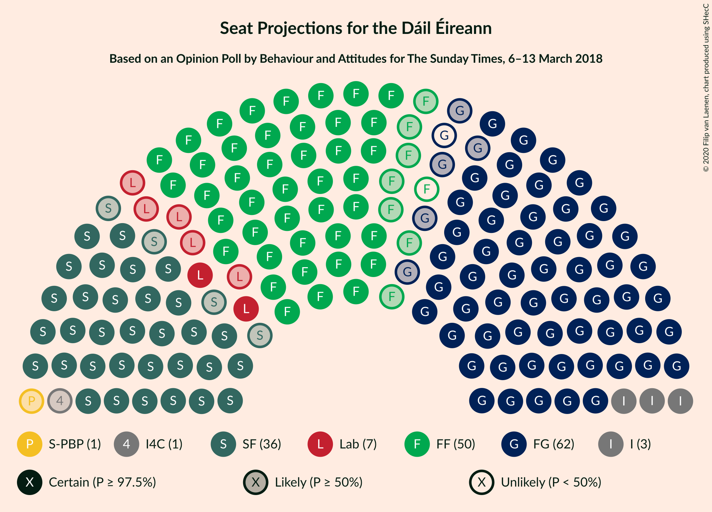
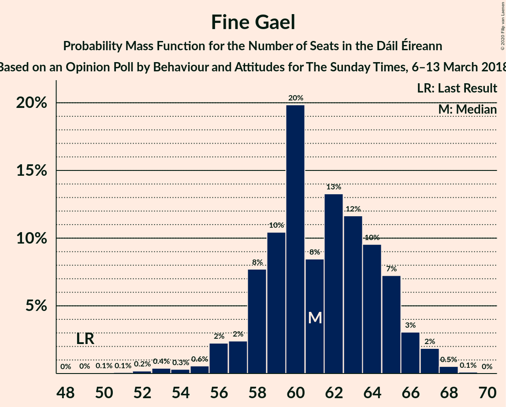
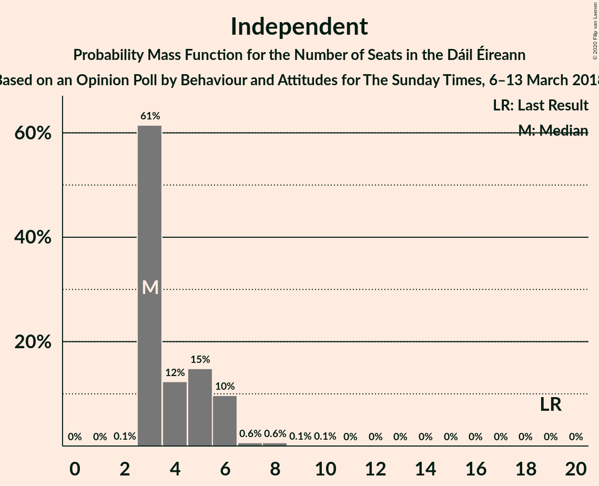
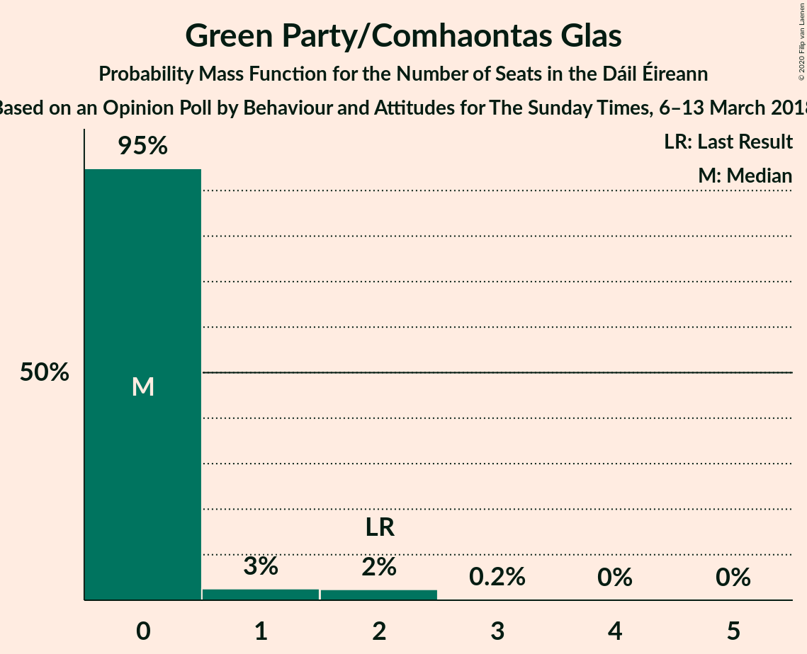
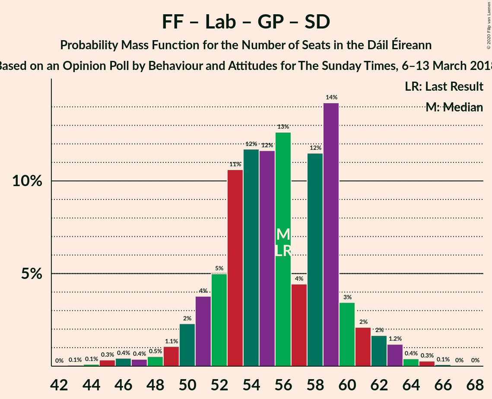

# Opinion Poll by Behaviour and Attitudes for The Sunday Times, 6–13 March 2018

<a href="#voting-intentions">Voting Intentions</a> | <a href="#seats">Seats</a> | <a href="#coalitions">Coalitions</a> | <a href="#technical-information">Technical Information</a>

## Voting Intentions

### Confidence Intervals

| Party | Last Result | Poll Result | 80% Confidence Interval | 90% Confidence Interval | 95% Confidence Interval | 99% Confidence Interval |
|:-----:|:-----------:|:-----------:|:-----------------------:|:-----------------------:|:-----------------------:|:-----------------------:|
| Fine Gael | 25.5% | 31.3% | 29.4–33.4% |28.9–33.9% |28.4–34.4% |27.5–35.4% |
| Fianna Fáil | 24.3% | 26.4% | 24.6–28.4% |24.1–28.9% |23.7–29.4% |22.8–30.4% |
| Sinn Féin | 13.8% | 18.7% | 17.1–20.4% |16.6–20.9% |16.2–21.4% |15.5–22.2% |
| Independent | 15.9% | 8.3% | 7.3–9.6% |7.0–10.0% |6.7–10.3% |6.2–11.0% |
| Labour Party | 6.6% | 5.9% | 5.0–7.0% |4.7–7.3% |4.5–7.6% |4.1–8.2% |
| Solidarity–People Before Profit | 3.9% | 2.0% | 1.5–2.7% |1.4–3.0% |1.3–3.1% |1.1–3.5% |
| Green Party/Comhaontas Glas | 2.7% | 2.0% | 1.5–2.7% |1.4–3.0% |1.3–3.1% |1.1–3.5% |
| Social Democrats | 3.0% | 1.0% | 0.7–1.6% |0.6–1.7% |0.5–1.9% |0.4–2.2% |
| Independents 4 Change | 1.5% | 1.0% | 0.7–1.6% |0.6–1.7% |0.5–1.9% |0.4–2.2% |

*Note:* The poll result column reflects the actual value used in the calculations. Published results may vary slightly, and in addition be rounded to fewer digits.

## Seats

### Confidence Intervals

| Party | Last Result | Median | 80% Confidence Interval | 90% Confidence Interval | 95% Confidence Interval | 99% Confidence Interval |
|:-----:|:-----------:|:------:|:-----------------------:|:-----------------------:|:-----------------------:|:-----------------------:|
| <a href="#fine-gael">Fine Gael</a> | 49 | 61 | 58–65 |57–66 |56–66 |53–68 |
| <a href="#fianna-fáil">Fianna Fáil</a> | 44 | 49 | 45–52 |44–53 |42–54 |40–56 |
| <a href="#sinn-féin">Sinn Féin</a> | 23 | 36 | 33–38 |33–40 |32–40 |29–42 |
| <a href="#independent">Independent</a> | 19 | 3 | 3–6 |3–6 |3–6 |3–8 |
| <a href="#labour-party">Labour Party</a> | 7 | 7 | 2–8 |2–9 |2–12 |1–14 |
| <a href="#solidarity–people-before-profit">Solidarity–People Before Profit</a> | 6 | 1 | 0–3 |0–3 |0–3 |0–4 |
| <a href="#green-party/comhaontas-glas">Green Party/Comhaontas Glas</a> | 2 | 0 | 0 |0–1 |0–2 |0–2 |
| <a href="#social-democrats">Social Democrats</a> | 3 | 0 | 0–3 |0–3 |0–3 |0–3 |
| <a href="#independents-4-change">Independents 4 Change</a> | 4 | 1 | 0–4 |0–4 |0–4 |0–5 |

### Fine Gael

*For a full overview of the results for this party, see the [Fine Gael](party-finegael.html) page.*

| Number of Seats | Probability | Accumulated | Special Marks |
|:---------------:|:-----------:|:-----------:|:-------------:|
| 49 | 0% | 100% | Last Result |
| 50 | 0.1% | 100% |  |
| 51 | 0.1% | 99.9% |  |
| 52 | 0.2% | 99.8% |  |
| 53 | 0.4% | 99.6% |  |
| 54 | 0.3% | 99.2% |  |
| 55 | 0.6% | 98.9% |  |
| 56 | 2% | 98% |  |
| 57 | 2% | 96% |  |
| 58 | 8% | 94% |  |
| 59 | 10% | 86% |  |
| 60 | 20% | 76% |  |
| 61 | 8% | 56% | Median |
| 62 | 13% | 47% |  |
| 63 | 12% | 34% |  |
| 64 | 10% | 22% |  |
| 65 | 7% | 13% |  |
| 66 | 3% | 6% |  |
| 67 | 2% | 2% |  |
| 68 | 0.5% | 0.6% |  |
| 69 | 0.1% | 0.1% |  |
| 70 | 0% | 0% |  |

### Fianna Fáil

*For a full overview of the results for this party, see the [Fianna Fáil](party-fiannafáil.html) page.*

| Number of Seats | Probability | Accumulated | Special Marks |
|:---------------:|:-----------:|:-----------:|:-------------:|
| 39 | 0.1% | 100% |  |
| 40 | 0.7% | 99.9% |  |
| 41 | 0.9% | 99.1% |  |
| 42 | 2% | 98% |  |
| 43 | 1.5% | 97% |  |
| 44 | 3% | 95% | Last Result |
| 45 | 4% | 92% |  |
| 46 | 10% | 88% |  |
| 47 | 10% | 79% |  |
| 48 | 7% | 69% |  |
| 49 | 12% | 61% | Median |
| 50 | 14% | 50% |  |
| 51 | 10% | 35% |  |
| 52 | 18% | 25% |  |
| 53 | 3% | 7% |  |
| 54 | 2% | 4% |  |
| 55 | 1.0% | 2% |  |
| 56 | 0.9% | 1.3% |  |
| 57 | 0.4% | 0.4% |  |
| 58 | 0% | 0.1% |  |
| 59 | 0% | 0% |  |

### Sinn Féin

*For a full overview of the results for this party, see the [Sinn Féin](party-sinnféin.html) page.*

| Number of Seats | Probability | Accumulated | Special Marks |
|:---------------:|:-----------:|:-----------:|:-------------:|
| 23 | 0% | 100% | Last Result |
| 24 | 0% | 100% |  |
| 25 | 0% | 100% |  |
| 26 | 0.2% | 99.9% |  |
| 27 | 0% | 99.8% |  |
| 28 | 0.1% | 99.7% |  |
| 29 | 0.3% | 99.7% |  |
| 30 | 0.3% | 99.4% |  |
| 31 | 0.5% | 99.1% |  |
| 32 | 2% | 98.6% |  |
| 33 | 10% | 97% |  |
| 34 | 10% | 87% |  |
| 35 | 18% | 77% |  |
| 36 | 27% | 59% | Median |
| 37 | 21% | 33% |  |
| 38 | 4% | 11% |  |
| 39 | 2% | 7% |  |
| 40 | 3% | 6% |  |
| 41 | 2% | 2% |  |
| 42 | 0.5% | 0.7% |  |
| 43 | 0.2% | 0.3% |  |
| 44 | 0.1% | 0.1% |  |
| 45 | 0% | 0% |  |

### Independent

*For a full overview of the results for this party, see the [Independent](party-independent.html) page.*

| Number of Seats | Probability | Accumulated | Special Marks |
|:---------------:|:-----------:|:-----------:|:-------------:|
| 2 | 0.1% | 100% |  |
| 3 | 61% | 99.8% | Median |
| 4 | 12% | 38% |  |
| 5 | 15% | 26% |  |
| 6 | 10% | 11% |  |
| 7 | 0.6% | 2% |  |
| 8 | 0.6% | 0.9% |  |
| 9 | 0.1% | 0.3% |  |
| 10 | 0.1% | 0.1% |  |
| 11 | 0% | 0% |  |
| 12 | 0% | 0% |  |
| 13 | 0% | 0% |  |
| 14 | 0% | 0% |  |
| 15 | 0% | 0% |  |
| 16 | 0% | 0% |  |
| 17 | 0% | 0% |  |
| 18 | 0% | 0% |  |
| 19 | 0% | 0% | Last Result |

### Labour Party

*For a full overview of the results for this party, see the [Labour Party](party-labourparty.html) page.*

| Number of Seats | Probability | Accumulated | Special Marks |
|:---------------:|:-----------:|:-----------:|:-------------:|
| 0 | 0.5% | 100% |  |
| 1 | 1.0% | 99.5% |  |
| 2 | 10% | 98.5% |  |
| 3 | 7% | 88% |  |
| 4 | 9% | 81% |  |
| 5 | 5% | 73% |  |
| 6 | 14% | 68% |  |
| 7 | 26% | 54% | Last Result, Median |
| 8 | 18% | 28% |  |
| 9 | 6% | 10% |  |
| 10 | 0.6% | 4% |  |
| 11 | 0.5% | 4% |  |
| 12 | 2% | 3% |  |
| 13 | 0.7% | 1.3% |  |
| 14 | 0.2% | 0.6% |  |
| 15 | 0.2% | 0.4% |  |
| 16 | 0.1% | 0.2% |  |
| 17 | 0.1% | 0.1% |  |
| 18 | 0% | 0.1% |  |
| 19 | 0% | 0% |  |

### Solidarity–People Before Profit

*For a full overview of the results for this party, see the [Solidarity–People Before Profit](party-solidarity–peoplebeforeprofit.html) page.*

| Number of Seats | Probability | Accumulated | Special Marks |
|:---------------:|:-----------:|:-----------:|:-------------:|
| 0 | 42% | 100% |  |
| 1 | 24% | 58% | Median |
| 2 | 8% | 34% |  |
| 3 | 25% | 26% |  |
| 4 | 1.4% | 1.4% |  |
| 5 | 0% | 0.1% |  |
| 6 | 0% | 0% | Last Result |

### Green Party/Comhaontas Glas

*For a full overview of the results for this party, see the [Green Party/Comhaontas Glas](party-greenpartycomhaontasglas.html) page.*

| Number of Seats | Probability | Accumulated | Special Marks |
|:---------------:|:-----------:|:-----------:|:-------------:|
| 0 | 95% | 100% | Median |
| 1 | 3% | 5% |  |
| 2 | 2% | 3% | Last Result |
| 3 | 0.2% | 0.2% |  |
| 4 | 0% | 0% |  |

### Social Democrats

*For a full overview of the results for this party, see the [Social Democrats](party-socialdemocrats.html) page.*

| Number of Seats | Probability | Accumulated | Special Marks |
|:---------------:|:-----------:|:-----------:|:-------------:|
| 0 | 80% | 100% | Median |
| 1 | 5% | 20% |  |
| 2 | 0.1% | 15% |  |
| 3 | 15% | 15% | Last Result |
| 4 | 0.2% | 0.2% |  |
| 5 | 0% | 0% |  |

### Independents 4 Change

*For a full overview of the results for this party, see the [Independents 4 Change](party-independents4change.html) page.*

| Number of Seats | Probability | Accumulated | Special Marks |
|:---------------:|:-----------:|:-----------:|:-------------:|
| 0 | 47% | 100% |  |
| 1 | 11% | 53% | Median |
| 2 | 13% | 41% |  |
| 3 | 12% | 28% |  |
| 4 | 15% | 17% | Last Result |
| 5 | 2% | 2% |  |
| 6 | 0% | 0% |  |

## Coalitions

### Confidence Intervals

| Coalition | Last Result | Median | Majority? | 80% Confidence Interval | 90% Confidence Interval | 95% Confidence Interval | 99% Confidence Interval |
|:---------:|:-----------:|:------:|:---------:|:-----------------------:|:-----------------------:|:-----------------------:|:-----------------------:|
| Fine Gael – Fianna Fáil | 93 | 111 | 100% | 106–114 | 105–115 | 104–116 | 102–118 |
| Fianna Fáil – Sinn Féin | 67 | 85 | 87% | 80–89 | 79–90 | 78–92 | 76–94 |
| Fine Gael – Labour Party – Green Party/Comhaontas Glas – Social Democrats | 61 | 67 | 0% | 64–72 | 63–74 | 62–76 | 59–77 |
| Fine Gael – Labour Party – Green Party/Comhaontas Glas | 58 | 67 | 0% | 63–72 | 62–73 | 62–74 | 58–76 |
| Fine Gael – Labour Party | 56 | 67 | 0% | 63–71 | 62–73 | 62–74 | 58–76 |
| Fine Gael – Green Party/Comhaontas Glas | 51 | 61 | 0% | 58–65 | 57–66 | 56–67 | 53–69 |
| Fine Gael | 49 | 61 | 0% | 58–65 | 57–66 | 56–66 | 53–68 |
| Fianna Fáil – Labour Party – Green Party/Comhaontas Glas – Social Democrats | 56 | 56 | 0% | 52–59 | 50–61 | 49–62 | 45–64 |
| Fianna Fáil – Labour Party – Green Party/Comhaontas Glas | 53 | 55 | 0% | 51–59 | 50–60 | 49–61 | 45–63 |
| Fianna Fáil – Labour Party | 51 | 55 | 0% | 51–59 | 50–60 | 48–61 | 45–63 |
| Fianna Fáil – Green Party/Comhaontas Glas | 46 | 50 | 0% | 45–52 | 44–53 | 42–55 | 41–56 |

### Fine Gael – Fianna Fáil

| Number of Seats | Probability | Accumulated | Special Marks |
|:---------------:|:-----------:|:-----------:|:-------------:|
| 93 | 0% | 100% | Last Result |
| 94 | 0% | 100% |  |
| 95 | 0% | 100% |  |
| 96 | 0% | 100% |  |
| 97 | 0% | 100% |  |
| 98 | 0% | 100% |  |
| 99 | 0.1% | 99.9% |  |
| 100 | 0.2% | 99.9% |  |
| 101 | 0.1% | 99.7% |  |
| 102 | 0.3% | 99.6% |  |
| 103 | 0.9% | 99.2% |  |
| 104 | 1.1% | 98% |  |
| 105 | 3% | 97% |  |
| 106 | 5% | 94% |  |
| 107 | 5% | 90% |  |
| 108 | 8% | 84% |  |
| 109 | 12% | 76% |  |
| 110 | 13% | 64% | Median |
| 111 | 14% | 51% |  |
| 112 | 19% | 36% |  |
| 113 | 5% | 17% |  |
| 114 | 3% | 12% |  |
| 115 | 6% | 9% |  |
| 116 | 2% | 3% |  |
| 117 | 0.8% | 1.4% |  |
| 118 | 0.4% | 0.6% |  |
| 119 | 0.2% | 0.2% |  |
| 120 | 0% | 0% |  |

### Fianna Fáil – Sinn Féin

| Number of Seats | Probability | Accumulated | Special Marks |
|:---------------:|:-----------:|:-----------:|:-------------:|
| 67 | 0% | 100% | Last Result |
| 68 | 0% | 100% |  |
| 69 | 0% | 100% |  |
| 70 | 0% | 100% |  |
| 71 | 0% | 100% |  |
| 72 | 0% | 100% |  |
| 73 | 0% | 100% |  |
| 74 | 0.1% | 100% |  |
| 75 | 0.3% | 99.9% |  |
| 76 | 0.3% | 99.6% |  |
| 77 | 0.9% | 99.3% |  |
| 78 | 2% | 98% |  |
| 79 | 3% | 96% |  |
| 80 | 7% | 93% |  |
| 81 | 8% | 87% | Majority |
| 82 | 7% | 78% |  |
| 83 | 8% | 71% |  |
| 84 | 7% | 63% |  |
| 85 | 6% | 56% | Median |
| 86 | 15% | 50% |  |
| 87 | 10% | 35% |  |
| 88 | 11% | 25% |  |
| 89 | 6% | 14% |  |
| 90 | 5% | 8% |  |
| 91 | 0.6% | 3% |  |
| 92 | 1.3% | 3% |  |
| 93 | 0.6% | 1.3% |  |
| 94 | 0.3% | 0.7% |  |
| 95 | 0.2% | 0.4% |  |
| 96 | 0.1% | 0.2% |  |
| 97 | 0% | 0.1% |  |
| 98 | 0.1% | 0.1% |  |
| 99 | 0% | 0% |  |

### Fine Gael – Labour Party – Green Party/Comhaontas Glas – Social Democrats

| Number of Seats | Probability | Accumulated | Special Marks |
|:---------------:|:-----------:|:-----------:|:-------------:|
| 55 | 0.1% | 100% |  |
| 56 | 0.1% | 99.9% |  |
| 57 | 0.1% | 99.9% |  |
| 58 | 0.2% | 99.8% |  |
| 59 | 0.2% | 99.6% |  |
| 60 | 0.3% | 99.4% |  |
| 61 | 0.7% | 99.1% | Last Result |
| 62 | 3% | 98% |  |
| 63 | 3% | 95% |  |
| 64 | 6% | 92% |  |
| 65 | 6% | 86% |  |
| 66 | 7% | 80% |  |
| 67 | 24% | 73% |  |
| 68 | 7% | 49% | Median |
| 69 | 10% | 42% |  |
| 70 | 11% | 32% |  |
| 71 | 9% | 21% |  |
| 72 | 4% | 12% |  |
| 73 | 2% | 8% |  |
| 74 | 2% | 6% |  |
| 75 | 0.7% | 3% |  |
| 76 | 2% | 3% |  |
| 77 | 0.3% | 0.6% |  |
| 78 | 0.2% | 0.4% |  |
| 79 | 0.1% | 0.2% |  |
| 80 | 0% | 0% |  |

### Fine Gael – Labour Party – Green Party/Comhaontas Glas

| Number of Seats | Probability | Accumulated | Special Marks |
|:---------------:|:-----------:|:-----------:|:-------------:|
| 55 | 0.1% | 100% |  |
| 56 | 0.1% | 99.9% |  |
| 57 | 0.1% | 99.8% |  |
| 58 | 0.3% | 99.7% | Last Result |
| 59 | 0.4% | 99.4% |  |
| 60 | 0.3% | 99.0% |  |
| 61 | 1.0% | 98.6% |  |
| 62 | 4% | 98% |  |
| 63 | 5% | 94% |  |
| 64 | 6% | 89% |  |
| 65 | 7% | 83% |  |
| 66 | 8% | 75% |  |
| 67 | 24% | 67% |  |
| 68 | 9% | 43% | Median |
| 69 | 7% | 35% |  |
| 70 | 10% | 28% |  |
| 71 | 8% | 18% |  |
| 72 | 4% | 10% |  |
| 73 | 3% | 6% |  |
| 74 | 1.3% | 3% |  |
| 75 | 0.4% | 2% |  |
| 76 | 1.3% | 2% |  |
| 77 | 0.1% | 0.3% |  |
| 78 | 0.1% | 0.2% |  |
| 79 | 0% | 0% |  |

### Fine Gael – Labour Party

| Number of Seats | Probability | Accumulated | Special Marks |
|:---------------:|:-----------:|:-----------:|:-------------:|
| 55 | 0.1% | 100% |  |
| 56 | 0.1% | 99.9% | Last Result |
| 57 | 0.1% | 99.8% |  |
| 58 | 0.4% | 99.7% |  |
| 59 | 0.4% | 99.4% |  |
| 60 | 0.3% | 98.9% |  |
| 61 | 1.0% | 98.6% |  |
| 62 | 4% | 98% |  |
| 63 | 5% | 94% |  |
| 64 | 6% | 89% |  |
| 65 | 8% | 83% |  |
| 66 | 9% | 75% |  |
| 67 | 24% | 67% |  |
| 68 | 9% | 42% | Median |
| 69 | 7% | 34% |  |
| 70 | 10% | 27% |  |
| 71 | 8% | 17% |  |
| 72 | 4% | 9% |  |
| 73 | 3% | 5% |  |
| 74 | 0.9% | 3% |  |
| 75 | 0.2% | 2% |  |
| 76 | 1.2% | 1.4% |  |
| 77 | 0.1% | 0.2% |  |
| 78 | 0.1% | 0.1% |  |
| 79 | 0% | 0% |  |

### Fine Gael – Green Party/Comhaontas Glas

| Number of Seats | Probability | Accumulated | Special Marks |
|:---------------:|:-----------:|:-----------:|:-------------:|
| 50 | 0% | 100% |  |
| 51 | 0.1% | 99.9% | Last Result |
| 52 | 0.2% | 99.9% |  |
| 53 | 0.4% | 99.7% |  |
| 54 | 0.2% | 99.3% |  |
| 55 | 0.6% | 99.0% |  |
| 56 | 2% | 98% |  |
| 57 | 2% | 96% |  |
| 58 | 8% | 94% |  |
| 59 | 10% | 86% |  |
| 60 | 19% | 76% |  |
| 61 | 8% | 57% | Median |
| 62 | 14% | 48% |  |
| 63 | 12% | 35% |  |
| 64 | 10% | 23% |  |
| 65 | 7% | 13% |  |
| 66 | 3% | 6% |  |
| 67 | 2% | 4% |  |
| 68 | 1.1% | 2% |  |
| 69 | 0.6% | 0.6% |  |
| 70 | 0% | 0% |  |

### Fine Gael

| Number of Seats | Probability | Accumulated | Special Marks |
|:---------------:|:-----------:|:-----------:|:-------------:|
| 49 | 0% | 100% | Last Result |
| 50 | 0.1% | 100% |  |
| 51 | 0.1% | 99.9% |  |
| 52 | 0.2% | 99.8% |  |
| 53 | 0.4% | 99.6% |  |
| 54 | 0.3% | 99.2% |  |
| 55 | 0.6% | 98.9% |  |
| 56 | 2% | 98% |  |
| 57 | 2% | 96% |  |
| 58 | 8% | 94% |  |
| 59 | 10% | 86% |  |
| 60 | 20% | 76% |  |
| 61 | 8% | 56% | Median |
| 62 | 13% | 47% |  |
| 63 | 12% | 34% |  |
| 64 | 10% | 22% |  |
| 65 | 7% | 13% |  |
| 66 | 3% | 6% |  |
| 67 | 2% | 2% |  |
| 68 | 0.5% | 0.6% |  |
| 69 | 0.1% | 0.1% |  |
| 70 | 0% | 0% |  |

### Fianna Fáil – Labour Party – Green Party/Comhaontas Glas – Social Democrats

| Number of Seats | Probability | Accumulated | Special Marks |
|:---------------:|:-----------:|:-----------:|:-------------:|
| 43 | 0.1% | 100% |  |
| 44 | 0.1% | 99.9% |  |
| 45 | 0.3% | 99.8% |  |
| 46 | 0.4% | 99.5% |  |
| 47 | 0.4% | 99.0% |  |
| 48 | 0.5% | 98.7% |  |
| 49 | 1.1% | 98% |  |
| 50 | 2% | 97% |  |
| 51 | 4% | 95% |  |
| 52 | 5% | 91% |  |
| 53 | 11% | 86% |  |
| 54 | 12% | 75% |  |
| 55 | 12% | 64% |  |
| 56 | 13% | 52% | Last Result, Median |
| 57 | 4% | 39% |  |
| 58 | 12% | 35% |  |
| 59 | 14% | 23% |  |
| 60 | 3% | 9% |  |
| 61 | 2% | 6% |  |
| 62 | 2% | 4% |  |
| 63 | 1.2% | 2% |  |
| 64 | 0.4% | 0.9% |  |
| 65 | 0.3% | 0.5% |  |
| 66 | 0.1% | 0.2% |  |
| 67 | 0% | 0.1% |  |
| 68 | 0% | 0% |  |

### Fianna Fáil – Labour Party – Green Party/Comhaontas Glas

| Number of Seats | Probability | Accumulated | Special Marks |
|:---------------:|:-----------:|:-----------:|:-------------:|
| 43 | 0.1% | 100% |  |
| 44 | 0.1% | 99.9% |  |
| 45 | 0.5% | 99.8% |  |
| 46 | 0.5% | 99.3% |  |
| 47 | 0.5% | 98.8% |  |
| 48 | 0.5% | 98% |  |
| 49 | 2% | 98% |  |
| 50 | 4% | 96% |  |
| 51 | 5% | 93% |  |
| 52 | 5% | 87% |  |
| 53 | 11% | 83% | Last Result |
| 54 | 13% | 72% |  |
| 55 | 11% | 58% |  |
| 56 | 14% | 47% | Median |
| 57 | 4% | 33% |  |
| 58 | 10% | 29% |  |
| 59 | 13% | 19% |  |
| 60 | 4% | 7% |  |
| 61 | 1.4% | 3% |  |
| 62 | 0.9% | 2% |  |
| 63 | 0.5% | 0.8% |  |
| 64 | 0.1% | 0.3% |  |
| 65 | 0.1% | 0.2% |  |
| 66 | 0% | 0.1% |  |
| 67 | 0% | 0.1% |  |
| 68 | 0% | 0% |  |

### Fianna Fáil – Labour Party

| Number of Seats | Probability | Accumulated | Special Marks |
|:---------------:|:-----------:|:-----------:|:-------------:|
| 42 | 0.1% | 100% |  |
| 43 | 0.1% | 99.9% |  |
| 44 | 0.2% | 99.8% |  |
| 45 | 0.7% | 99.6% |  |
| 46 | 0.5% | 98.9% |  |
| 47 | 0.3% | 98% |  |
| 48 | 0.6% | 98% |  |
| 49 | 2% | 97% |  |
| 50 | 4% | 96% |  |
| 51 | 5% | 92% | Last Result |
| 52 | 5% | 87% |  |
| 53 | 11% | 82% |  |
| 54 | 14% | 71% |  |
| 55 | 11% | 58% |  |
| 56 | 14% | 46% | Median |
| 57 | 4% | 33% |  |
| 58 | 10% | 29% |  |
| 59 | 12% | 19% |  |
| 60 | 3% | 6% |  |
| 61 | 1.4% | 3% |  |
| 62 | 0.8% | 1.4% |  |
| 63 | 0.3% | 0.6% |  |
| 64 | 0.1% | 0.3% |  |
| 65 | 0.1% | 0.2% |  |
| 66 | 0% | 0.1% |  |
| 67 | 0% | 0.1% |  |
| 68 | 0% | 0% |  |

### Fianna Fáil – Green Party/Comhaontas Glas

| Number of Seats | Probability | Accumulated | Special Marks |
|:---------------:|:-----------:|:-----------:|:-------------:|
| 39 | 0.1% | 100% |  |
| 40 | 0.3% | 99.9% |  |
| 41 | 0.7% | 99.6% |  |
| 42 | 2% | 98.9% |  |
| 43 | 2% | 97% |  |
| 44 | 3% | 96% |  |
| 45 | 4% | 93% |  |
| 46 | 10% | 89% | Last Result |
| 47 | 9% | 79% |  |
| 48 | 8% | 69% |  |
| 49 | 11% | 62% | Median |
| 50 | 14% | 50% |  |
| 51 | 10% | 36% |  |
| 52 | 18% | 26% |  |
| 53 | 3% | 8% |  |
| 54 | 2% | 4% |  |
| 55 | 1.3% | 3% |  |
| 56 | 0.9% | 1.4% |  |
| 57 | 0.3% | 0.5% |  |
| 58 | 0% | 0.1% |  |
| 59 | 0% | 0.1% |  |
| 60 | 0% | 0% |  |

## Technical Information

### Opinion Poll

+ **Polling firm:** Behaviour and Attitudes
+ **Commissioner(s):** The Sunday Times
+ **Fieldwork period:** 6–13 March 2018

### Calculations

+ **Sample size:** 900
+ **Simulations done:** 1,048,575
+ **Error estimate:** 3.08%

