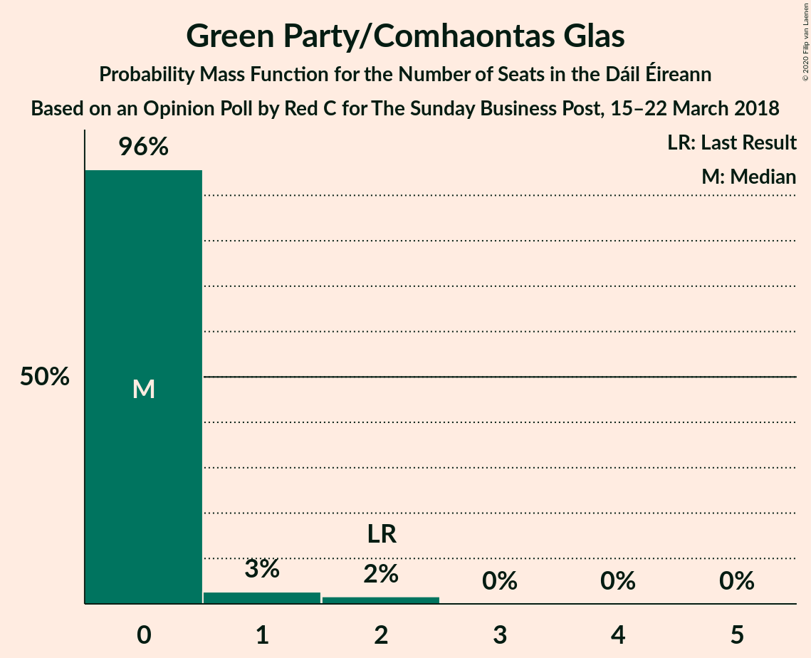
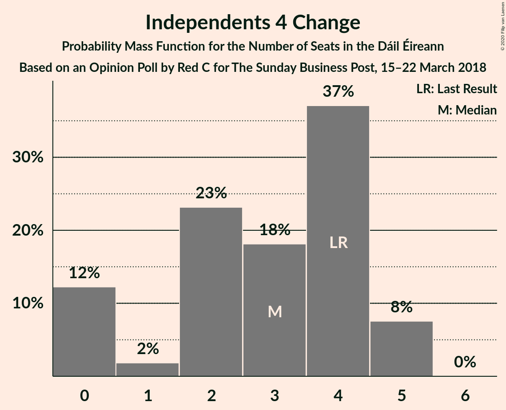
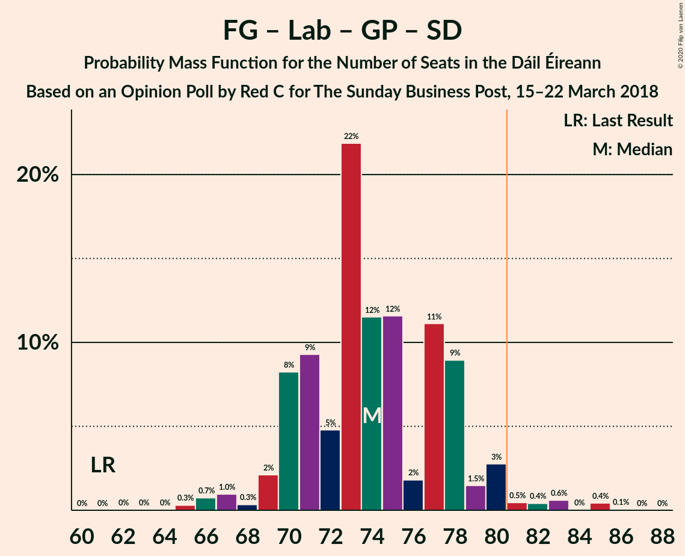
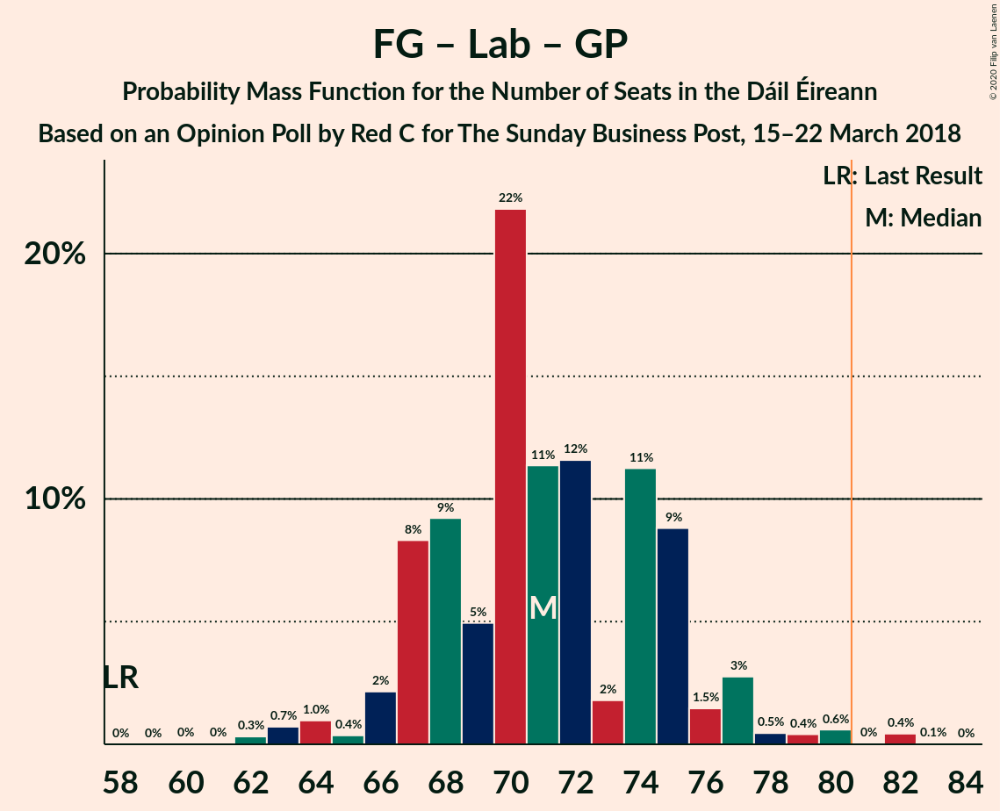
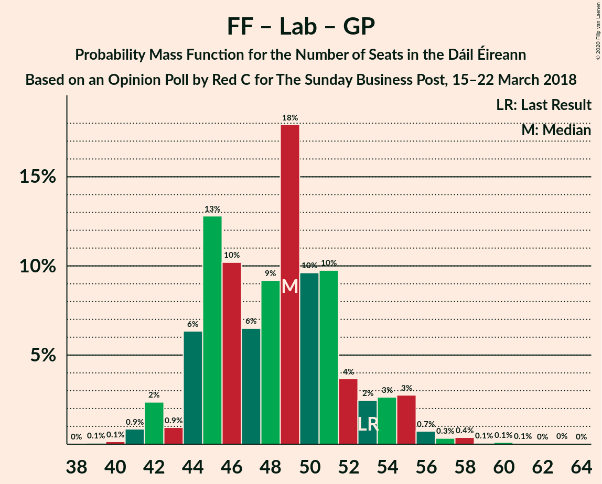

# Opinion Poll by Red C for The Sunday Business Post, 15–22 March 2018

<a href="#voting-intentions">Voting Intentions</a> | <a href="#seats">Seats</a> | <a href="#coalitions">Coalitions</a> | <a href="#technical-information">Technical Information</a>

## Voting Intentions

### Confidence Intervals

| Party | Last Result | Poll Result | 80% Confidence Interval | 90% Confidence Interval | 95% Confidence Interval | 99% Confidence Interval |
|:-----:|:-----------:|:-----------:|:-----------------------:|:-----------------------:|:-----------------------:|:-----------------------:|
| Fine Gael | 25.5% | 33.0% | 31.1–34.9% |30.6–35.5% |30.1–36.0% |29.3–36.9% |
| Fianna Fáil | 24.3% | 24.0% | 22.3–25.8% |21.9–26.3% |21.4–26.7% |20.7–27.6% |
| Sinn Féin | 13.8% | 16.0% | 14.6–17.6% |14.2–18.0% |13.9–18.4% |13.2–19.2% |
| Independent | 15.9% | 10.1% | 9.0–11.4% |8.6–11.8% |8.4–12.1% |7.9–12.8% |
| Labour Party | 6.6% | 6.0% | 5.1–7.1% |4.9–7.4% |4.7–7.7% |4.3–8.2% |
| Solidarity–People Before Profit | 3.9% | 2.0% | 1.5–2.7% |1.4–2.9% |1.3–3.1% |1.1–3.4% |
| Social Democrats | 3.0% | 2.0% | 1.5–2.7% |1.4–2.9% |1.3–3.1% |1.1–3.4% |
| Green Party/Comhaontas Glas | 2.7% | 2.0% | 1.5–2.7% |1.4–2.9% |1.3–3.1% |1.1–3.4% |
| Renua Ireland | 2.2% | 2.0% | 1.5–2.7% |1.4–2.9% |1.3–3.1% |1.1–3.4% |
| Independents 4 Change | 1.5% | 1.3% | 0.9–1.9% |0.8–2.1% |0.8–2.2% |0.6–2.5% |

*Note:* The poll result column reflects the actual value used in the calculations. Published results may vary slightly, and in addition be rounded to fewer digits.

## Seats

### Confidence Intervals

| Party | Last Result | Median | 80% Confidence Interval | 90% Confidence Interval | 95% Confidence Interval | 99% Confidence Interval |
|:-----:|:-----------:|:------:|:-----------------------:|:-----------------------:|:-----------------------:|:-----------------------:|
| <a href="#fine-gael">Fine Gael</a> | 49 | 66 | 61–68 |60–69 |60–70 |58–71 |
| <a href="#fianna-fáil">Fianna Fáil</a> | 44 | 42 | 40–46 |39–47 |39–48 |38–51 |
| <a href="#sinn-féin">Sinn Féin</a> | 23 | 32 | 27–34 |26–35 |24–36 |21–37 |
| <a href="#independent">Independent</a> | 19 | 6 | 5–10 |4–12 |3–12 |3–14 |
| <a href="#labour-party">Labour Party</a> | 7 | 6 | 3–8 |2–10 |2–11 |1–14 |
| <a href="#solidarity–people-before-profit">Solidarity–People Before Profit</a> | 6 | 3 | 0–3 |0–3 |0–3 |0–3 |
| <a href="#social-democrats">Social Democrats</a> | 3 | 3 | 3 |3 |3 |3–4 |
| <a href="#green-party/comhaontas-glas">Green Party/Comhaontas Glas</a> | 2 | 0 | 0 |0 |0–1 |0–2 |
| <a href="#renua-ireland">Renua Ireland</a> | 0 | 0 | 0–2 |0–2 |0–2 |0–3 |
| <a href="#independents-4-change">Independents 4 Change</a> | 4 | 3 | 0–4 |0–5 |0–5 |0–5 |

### Fine Gael

*For a full overview of the results for this party, see the [Fine Gael](party-finegael.html) page.*

| Number of Seats | Probability | Accumulated | Special Marks |
|:---------------:|:-----------:|:-----------:|:-------------:|
| 49 | 0% | 100% | Last Result |
| 50 | 0% | 100% |  |
| 51 | 0% | 100% |  |
| 52 | 0% | 100% |  |
| 53 | 0% | 100% |  |
| 54 | 0% | 100% |  |
| 55 | 0% | 100% |  |
| 56 | 0.1% | 99.9% |  |
| 57 | 0.1% | 99.9% |  |
| 58 | 0.4% | 99.8% |  |
| 59 | 1.5% | 99.3% |  |
| 60 | 3% | 98% |  |
| 61 | 8% | 95% |  |
| 62 | 1.0% | 87% |  |
| 63 | 5% | 86% |  |
| 64 | 9% | 81% |  |
| 65 | 21% | 72% |  |
| 66 | 13% | 51% | Median |
| 67 | 16% | 37% |  |
| 68 | 15% | 21% |  |
| 69 | 2% | 7% |  |
| 70 | 3% | 4% |  |
| 71 | 0.9% | 1.0% |  |
| 72 | 0.1% | 0.1% |  |
| 73 | 0% | 0% |  |

### Fianna Fáil

*For a full overview of the results for this party, see the [Fianna Fáil](party-fiannafáil.html) page.*

| Number of Seats | Probability | Accumulated | Special Marks |
|:---------------:|:-----------:|:-----------:|:-------------:|
| 36 | 0.1% | 100% |  |
| 37 | 0.4% | 99.9% |  |
| 38 | 1.2% | 99.5% |  |
| 39 | 5% | 98% |  |
| 40 | 11% | 93% |  |
| 41 | 18% | 82% |  |
| 42 | 17% | 64% | Median |
| 43 | 13% | 48% |  |
| 44 | 15% | 34% | Last Result |
| 45 | 9% | 20% |  |
| 46 | 4% | 10% |  |
| 47 | 3% | 6% |  |
| 48 | 2% | 3% |  |
| 49 | 0.4% | 1.4% |  |
| 50 | 0.3% | 1.0% |  |
| 51 | 0.3% | 0.7% |  |
| 52 | 0.3% | 0.4% |  |
| 53 | 0.1% | 0.1% |  |
| 54 | 0% | 0% |  |

### Sinn Féin

*For a full overview of the results for this party, see the [Sinn Féin](party-sinnféin.html) page.*

| Number of Seats | Probability | Accumulated | Special Marks |
|:---------------:|:-----------:|:-----------:|:-------------:|
| 19 | 0.1% | 100% |  |
| 20 | 0.2% | 99.9% |  |
| 21 | 0.3% | 99.8% |  |
| 22 | 0.1% | 99.5% |  |
| 23 | 0.7% | 99.3% | Last Result |
| 24 | 1.5% | 98.6% |  |
| 25 | 0.7% | 97% |  |
| 26 | 3% | 96% |  |
| 27 | 6% | 94% |  |
| 28 | 7% | 88% |  |
| 29 | 13% | 81% |  |
| 30 | 2% | 68% |  |
| 31 | 15% | 66% |  |
| 32 | 13% | 51% | Median |
| 33 | 13% | 39% |  |
| 34 | 19% | 26% |  |
| 35 | 3% | 6% |  |
| 36 | 3% | 4% |  |
| 37 | 0.5% | 0.6% |  |
| 38 | 0.1% | 0.1% |  |
| 39 | 0% | 0% |  |

### Independent

*For a full overview of the results for this party, see the [Independent](party-independent.html) page.*

| Number of Seats | Probability | Accumulated | Special Marks |
|:---------------:|:-----------:|:-----------:|:-------------:|
| 3 | 4% | 100% |  |
| 4 | 3% | 96% |  |
| 5 | 25% | 93% |  |
| 6 | 24% | 68% | Median |
| 7 | 21% | 44% |  |
| 8 | 8% | 23% |  |
| 9 | 2% | 15% |  |
| 10 | 4% | 13% |  |
| 11 | 1.3% | 9% |  |
| 12 | 6% | 8% |  |
| 13 | 1.2% | 2% |  |
| 14 | 0.4% | 0.5% |  |
| 15 | 0% | 0.1% |  |
| 16 | 0.1% | 0.1% |  |
| 17 | 0% | 0% |  |
| 18 | 0% | 0% |  |
| 19 | 0% | 0% | Last Result |

### Labour Party

*For a full overview of the results for this party, see the [Labour Party](party-labourparty.html) page.*

| Number of Seats | Probability | Accumulated | Special Marks |
|:---------------:|:-----------:|:-----------:|:-------------:|
| 0 | 0.2% | 100% |  |
| 1 | 1.1% | 99.8% |  |
| 2 | 7% | 98.6% |  |
| 3 | 5% | 91% |  |
| 4 | 23% | 86% |  |
| 5 | 12% | 63% |  |
| 6 | 19% | 51% | Median |
| 7 | 16% | 32% | Last Result |
| 8 | 8% | 16% |  |
| 9 | 3% | 8% |  |
| 10 | 1.0% | 5% |  |
| 11 | 2% | 4% |  |
| 12 | 0.6% | 2% |  |
| 13 | 0.8% | 2% |  |
| 14 | 0.5% | 0.8% |  |
| 15 | 0.1% | 0.3% |  |
| 16 | 0.1% | 0.2% |  |
| 17 | 0.1% | 0.1% |  |
| 18 | 0% | 0% |  |

### Solidarity–People Before Profit

*For a full overview of the results for this party, see the [Solidarity–People Before Profit](party-solidarity–peoplebeforeprofit.html) page.*

| Number of Seats | Probability | Accumulated | Special Marks |
|:---------------:|:-----------:|:-----------:|:-------------:|
| 0 | 22% | 100% |  |
| 1 | 3% | 78% |  |
| 2 | 15% | 76% |  |
| 3 | 60% | 61% | Median |
| 4 | 0.5% | 0.5% |  |
| 5 | 0% | 0% |  |
| 6 | 0% | 0% | Last Result |

### Social Democrats

*For a full overview of the results for this party, see the [Social Democrats](party-socialdemocrats.html) page.*

| Number of Seats | Probability | Accumulated | Special Marks |
|:---------------:|:-----------:|:-----------:|:-------------:|
| 2 | 0% | 100% |  |
| 3 | 98.8% | 99.9% | Last Result, Median |
| 4 | 1.1% | 1.2% |  |
| 5 | 0% | 0% |  |

### Green Party/Comhaontas Glas

*For a full overview of the results for this party, see the [Green Party/Comhaontas Glas](party-greenpartycomhaontasglas.html) page.*

| Number of Seats | Probability | Accumulated | Special Marks |
|:---------------:|:-----------:|:-----------:|:-------------:|
| 0 | 96% | 100% | Median |
| 1 | 3% | 4% |  |
| 2 | 2% | 2% | Last Result |
| 3 | 0% | 0% |  |

### Renua Ireland

*For a full overview of the results for this party, see the [Renua Ireland](party-renuaireland.html) page.*

| Number of Seats | Probability | Accumulated | Special Marks |
|:---------------:|:-----------:|:-----------:|:-------------:|
| 0 | 77% | 100% | Last Result, Median |
| 1 | 3% | 23% |  |
| 2 | 18% | 19% |  |
| 3 | 0.9% | 0.9% |  |
| 4 | 0% | 0% |  |

### Independents 4 Change

*For a full overview of the results for this party, see the [Independents 4 Change](party-independents4change.html) page.*

| Number of Seats | Probability | Accumulated | Special Marks |
|:---------------:|:-----------:|:-----------:|:-------------:|
| 0 | 12% | 100% |  |
| 1 | 2% | 88% |  |
| 2 | 23% | 86% |  |
| 3 | 18% | 63% | Median |
| 4 | 37% | 45% | Last Result |
| 5 | 8% | 8% |  |
| 6 | 0% | 0% |  |

## Coalitions

### Confidence Intervals

| Coalition | Last Result | Median | Majority? | 80% Confidence Interval | 90% Confidence Interval | 95% Confidence Interval | 99% Confidence Interval |
|:---------:|:-----------:|:------:|:---------:|:-----------------------:|:-----------------------:|:-----------------------:|:-----------------------:|
| Fine Gael – Fianna Fáil | 93 | 108 | 100% | 104–111 | 104–113 | 102–114 | 100–116 |
| Fine Gael – Labour Party – Green Party/Comhaontas Glas – Social Democrats | 61 | 74 | 2% | 70–78 | 70–79 | 69–80 | 66–85 |
| Fianna Fáil – Sinn Féin | 67 | 73 | 2% | 70–78 | 68–79 | 67–80 | 65–83 |
| Fine Gael – Labour Party – Green Party/Comhaontas Glas | 58 | 71 | 0.5% | 67–75 | 67–76 | 66–77 | 63–82 |
| Fine Gael – Labour Party | 56 | 70 | 0.5% | 67–75 | 67–76 | 65–77 | 63–81 |
| Fine Gael | 49 | 66 | 0% | 61–68 | 60–69 | 60–70 | 58–71 |
| Fine Gael – Green Party/Comhaontas Glas | 51 | 66 | 0% | 61–68 | 60–69 | 60–70 | 58–71 |
| Fianna Fáil – Labour Party – Green Party/Comhaontas Glas – Social Democrats | 56 | 52 | 0% | 47–55 | 47–57 | 45–58 | 44–61 |
| Fianna Fáil – Labour Party – Green Party/Comhaontas Glas | 53 | 49 | 0% | 44–52 | 44–54 | 42–55 | 41–58 |
| Fianna Fáil – Labour Party | 51 | 49 | 0% | 44–52 | 44–54 | 42–55 | 41–58 |
| Fianna Fáil – Green Party/Comhaontas Glas | 46 | 42 | 0% | 40–46 | 39–47 | 39–48 | 38–51 |

### Fine Gael – Fianna Fáil

| Number of Seats | Probability | Accumulated | Special Marks |
|:---------------:|:-----------:|:-----------:|:-------------:|
| 93 | 0% | 100% | Last Result |
| 94 | 0% | 100% |  |
| 95 | 0% | 100% |  |
| 96 | 0% | 100% |  |
| 97 | 0% | 99.9% |  |
| 98 | 0% | 99.9% |  |
| 99 | 0.1% | 99.9% |  |
| 100 | 0.5% | 99.8% |  |
| 101 | 0.7% | 99.3% |  |
| 102 | 1.4% | 98.6% |  |
| 103 | 2% | 97% |  |
| 104 | 5% | 95% |  |
| 105 | 7% | 90% |  |
| 106 | 12% | 83% |  |
| 107 | 6% | 71% |  |
| 108 | 25% | 65% | Median |
| 109 | 18% | 40% |  |
| 110 | 6% | 22% |  |
| 111 | 7% | 16% |  |
| 112 | 4% | 9% |  |
| 113 | 2% | 5% |  |
| 114 | 0.9% | 3% |  |
| 115 | 0.5% | 2% |  |
| 116 | 1.2% | 1.4% |  |
| 117 | 0.1% | 0.2% |  |
| 118 | 0% | 0.1% |  |
| 119 | 0% | 0.1% |  |
| 120 | 0.1% | 0.1% |  |
| 121 | 0% | 0% |  |

### Fine Gael – Labour Party – Green Party/Comhaontas Glas – Social Democrats

| Number of Seats | Probability | Accumulated | Special Marks |
|:---------------:|:-----------:|:-----------:|:-------------:|
| 61 | 0% | 100% | Last Result |
| 62 | 0% | 100% |  |
| 63 | 0% | 100% |  |
| 64 | 0% | 99.9% |  |
| 65 | 0.3% | 99.9% |  |
| 66 | 0.7% | 99.6% |  |
| 67 | 1.0% | 98.8% |  |
| 68 | 0.3% | 98% |  |
| 69 | 2% | 98% |  |
| 70 | 8% | 95% |  |
| 71 | 9% | 87% |  |
| 72 | 5% | 78% |  |
| 73 | 22% | 73% |  |
| 74 | 12% | 51% |  |
| 75 | 12% | 40% | Median |
| 76 | 2% | 28% |  |
| 77 | 11% | 26% |  |
| 78 | 9% | 15% |  |
| 79 | 1.5% | 6% |  |
| 80 | 3% | 5% |  |
| 81 | 0.5% | 2% | Majority |
| 82 | 0.4% | 2% |  |
| 83 | 0.6% | 1.1% |  |
| 84 | 0% | 0.5% |  |
| 85 | 0.4% | 0.5% |  |
| 86 | 0.1% | 0.1% |  |
| 87 | 0% | 0% |  |

### Fianna Fáil – Sinn Féin

| Number of Seats | Probability | Accumulated | Special Marks |
|:---------------:|:-----------:|:-----------:|:-------------:|
| 62 | 0% | 100% |  |
| 63 | 0.1% | 99.9% |  |
| 64 | 0.2% | 99.8% |  |
| 65 | 1.1% | 99.6% |  |
| 66 | 0.5% | 98.6% |  |
| 67 | 2% | 98% | Last Result |
| 68 | 5% | 97% |  |
| 69 | 2% | 92% |  |
| 70 | 3% | 90% |  |
| 71 | 13% | 87% |  |
| 72 | 4% | 73% |  |
| 73 | 21% | 70% |  |
| 74 | 3% | 48% | Median |
| 75 | 16% | 45% |  |
| 76 | 4% | 30% |  |
| 77 | 16% | 26% |  |
| 78 | 5% | 10% |  |
| 79 | 2% | 5% |  |
| 80 | 2% | 4% |  |
| 81 | 0.5% | 2% | Majority |
| 82 | 0.6% | 1.1% |  |
| 83 | 0.1% | 0.6% |  |
| 84 | 0.3% | 0.4% |  |
| 85 | 0% | 0.1% |  |
| 86 | 0.1% | 0.1% |  |
| 87 | 0% | 0% |  |

### Fine Gael – Labour Party – Green Party/Comhaontas Glas

| Number of Seats | Probability | Accumulated | Special Marks |
|:---------------:|:-----------:|:-----------:|:-------------:|
| 58 | 0% | 100% | Last Result |
| 59 | 0% | 100% |  |
| 60 | 0% | 100% |  |
| 61 | 0% | 99.9% |  |
| 62 | 0.3% | 99.9% |  |
| 63 | 0.7% | 99.6% |  |
| 64 | 1.0% | 98.9% |  |
| 65 | 0.4% | 98% |  |
| 66 | 2% | 98% |  |
| 67 | 8% | 95% |  |
| 68 | 9% | 87% |  |
| 69 | 5% | 78% |  |
| 70 | 22% | 73% |  |
| 71 | 11% | 51% |  |
| 72 | 12% | 40% | Median |
| 73 | 2% | 28% |  |
| 74 | 11% | 26% |  |
| 75 | 9% | 15% |  |
| 76 | 1.5% | 6% |  |
| 77 | 3% | 5% |  |
| 78 | 0.5% | 2% |  |
| 79 | 0.4% | 2% |  |
| 80 | 0.6% | 1.1% |  |
| 81 | 0% | 0.5% | Majority |
| 82 | 0.4% | 0.5% |  |
| 83 | 0.1% | 0.1% |  |
| 84 | 0% | 0% |  |

### Fine Gael – Labour Party

| Number of Seats | Probability | Accumulated | Special Marks |
|:---------------:|:-----------:|:-----------:|:-------------:|
| 56 | 0% | 100% | Last Result |
| 57 | 0% | 100% |  |
| 58 | 0% | 100% |  |
| 59 | 0% | 100% |  |
| 60 | 0% | 100% |  |
| 61 | 0% | 99.9% |  |
| 62 | 0.3% | 99.9% |  |
| 63 | 0.7% | 99.5% |  |
| 64 | 1.0% | 98.8% |  |
| 65 | 0.5% | 98% |  |
| 66 | 2% | 97% |  |
| 67 | 8% | 95% |  |
| 68 | 9% | 87% |  |
| 69 | 5% | 78% |  |
| 70 | 23% | 72% |  |
| 71 | 11% | 50% |  |
| 72 | 12% | 39% | Median |
| 73 | 2% | 28% |  |
| 74 | 11% | 26% |  |
| 75 | 9% | 15% |  |
| 76 | 2% | 6% |  |
| 77 | 2% | 4% |  |
| 78 | 0.3% | 2% |  |
| 79 | 0.4% | 1.5% |  |
| 80 | 0.6% | 1.1% |  |
| 81 | 0.1% | 0.5% | Majority |
| 82 | 0.4% | 0.5% |  |
| 83 | 0% | 0% |  |

### Fine Gael

| Number of Seats | Probability | Accumulated | Special Marks |
|:---------------:|:-----------:|:-----------:|:-------------:|
| 49 | 0% | 100% | Last Result |
| 50 | 0% | 100% |  |
| 51 | 0% | 100% |  |
| 52 | 0% | 100% |  |
| 53 | 0% | 100% |  |
| 54 | 0% | 100% |  |
| 55 | 0% | 100% |  |
| 56 | 0.1% | 99.9% |  |
| 57 | 0.1% | 99.9% |  |
| 58 | 0.4% | 99.8% |  |
| 59 | 1.5% | 99.3% |  |
| 60 | 3% | 98% |  |
| 61 | 8% | 95% |  |
| 62 | 1.0% | 87% |  |
| 63 | 5% | 86% |  |
| 64 | 9% | 81% |  |
| 65 | 21% | 72% |  |
| 66 | 13% | 51% | Median |
| 67 | 16% | 37% |  |
| 68 | 15% | 21% |  |
| 69 | 2% | 7% |  |
| 70 | 3% | 4% |  |
| 71 | 0.9% | 1.0% |  |
| 72 | 0.1% | 0.1% |  |
| 73 | 0% | 0% |  |

### Fine Gael – Green Party/Comhaontas Glas

| Number of Seats | Probability | Accumulated | Special Marks |
|:---------------:|:-----------:|:-----------:|:-------------:|
| 51 | 0% | 100% | Last Result |
| 52 | 0% | 100% |  |
| 53 | 0% | 100% |  |
| 54 | 0% | 100% |  |
| 55 | 0% | 100% |  |
| 56 | 0.1% | 99.9% |  |
| 57 | 0.1% | 99.9% |  |
| 58 | 0.4% | 99.8% |  |
| 59 | 1.5% | 99.4% |  |
| 60 | 3% | 98% |  |
| 61 | 8% | 95% |  |
| 62 | 1.1% | 87% |  |
| 63 | 4% | 86% |  |
| 64 | 9% | 81% |  |
| 65 | 21% | 72% |  |
| 66 | 13% | 51% | Median |
| 67 | 16% | 38% |  |
| 68 | 14% | 22% |  |
| 69 | 3% | 8% |  |
| 70 | 4% | 5% |  |
| 71 | 1.1% | 1.3% |  |
| 72 | 0.2% | 0.2% |  |
| 73 | 0% | 0% |  |

### Fianna Fáil – Labour Party – Green Party/Comhaontas Glas – Social Democrats

| Number of Seats | Probability | Accumulated | Special Marks |
|:---------------:|:-----------:|:-----------:|:-------------:|
| 42 | 0.1% | 100% |  |
| 43 | 0.2% | 99.9% |  |
| 44 | 0.8% | 99.8% |  |
| 45 | 2% | 98.9% |  |
| 46 | 1.0% | 97% |  |
| 47 | 6% | 96% |  |
| 48 | 13% | 89% |  |
| 49 | 10% | 77% |  |
| 50 | 7% | 66% |  |
| 51 | 9% | 60% | Median |
| 52 | 18% | 51% |  |
| 53 | 10% | 33% |  |
| 54 | 10% | 23% |  |
| 55 | 4% | 13% |  |
| 56 | 2% | 10% | Last Result |
| 57 | 3% | 7% |  |
| 58 | 3% | 5% |  |
| 59 | 0.7% | 2% |  |
| 60 | 0.3% | 1.0% |  |
| 61 | 0.4% | 0.7% |  |
| 62 | 0.1% | 0.3% |  |
| 63 | 0.1% | 0.2% |  |
| 64 | 0.1% | 0.1% |  |
| 65 | 0% | 0.1% |  |
| 66 | 0% | 0.1% |  |
| 67 | 0% | 0% |  |

### Fianna Fáil – Labour Party – Green Party/Comhaontas Glas

| Number of Seats | Probability | Accumulated | Special Marks |
|:---------------:|:-----------:|:-----------:|:-------------:|
| 39 | 0.1% | 100% |  |
| 40 | 0.1% | 99.9% |  |
| 41 | 0.9% | 99.8% |  |
| 42 | 2% | 98.9% |  |
| 43 | 0.9% | 97% |  |
| 44 | 6% | 96% |  |
| 45 | 13% | 89% |  |
| 46 | 10% | 76% |  |
| 47 | 6% | 66% |  |
| 48 | 9% | 60% | Median |
| 49 | 18% | 51% |  |
| 50 | 10% | 33% |  |
| 51 | 10% | 23% |  |
| 52 | 4% | 13% |  |
| 53 | 2% | 10% | Last Result |
| 54 | 3% | 7% |  |
| 55 | 3% | 5% |  |
| 56 | 0.7% | 2% |  |
| 57 | 0.3% | 1.0% |  |
| 58 | 0.4% | 0.7% |  |
| 59 | 0.1% | 0.3% |  |
| 60 | 0.1% | 0.2% |  |
| 61 | 0.1% | 0.1% |  |
| 62 | 0% | 0.1% |  |
| 63 | 0% | 0.1% |  |
| 64 | 0% | 0% |  |

### Fianna Fáil – Labour Party

| Number of Seats | Probability | Accumulated | Special Marks |
|:---------------:|:-----------:|:-----------:|:-------------:|
| 39 | 0.1% | 100% |  |
| 40 | 0.2% | 99.9% |  |
| 41 | 0.8% | 99.7% |  |
| 42 | 2% | 98.9% |  |
| 43 | 1.0% | 97% |  |
| 44 | 7% | 96% |  |
| 45 | 13% | 89% |  |
| 46 | 10% | 76% |  |
| 47 | 6% | 66% |  |
| 48 | 9% | 60% | Median |
| 49 | 18% | 50% |  |
| 50 | 10% | 32% |  |
| 51 | 10% | 23% | Last Result |
| 52 | 3% | 12% |  |
| 53 | 2% | 9% |  |
| 54 | 3% | 7% |  |
| 55 | 3% | 4% |  |
| 56 | 0.4% | 1.4% |  |
| 57 | 0.3% | 1.0% |  |
| 58 | 0.4% | 0.7% |  |
| 59 | 0.1% | 0.3% |  |
| 60 | 0.1% | 0.2% |  |
| 61 | 0.1% | 0.1% |  |
| 62 | 0% | 0.1% |  |
| 63 | 0% | 0.1% |  |
| 64 | 0% | 0% |  |

### Fianna Fáil – Green Party/Comhaontas Glas

| Number of Seats | Probability | Accumulated | Special Marks |
|:---------------:|:-----------:|:-----------:|:-------------:|
| 36 | 0.1% | 100% |  |
| 37 | 0.4% | 99.9% |  |
| 38 | 1.1% | 99.5% |  |
| 39 | 5% | 98% |  |
| 40 | 11% | 94% |  |
| 41 | 18% | 83% |  |
| 42 | 16% | 65% | Median |
| 43 | 14% | 49% |  |
| 44 | 14% | 35% |  |
| 45 | 11% | 21% |  |
| 46 | 4% | 10% | Last Result |
| 47 | 2% | 6% |  |
| 48 | 2% | 3% |  |
| 49 | 0.4% | 1.5% |  |
| 50 | 0.3% | 1.0% |  |
| 51 | 0.3% | 0.7% |  |
| 52 | 0.3% | 0.4% |  |
| 53 | 0.1% | 0.1% |  |
| 54 | 0% | 0% |  |

## Technical Information

### Opinion Poll

+ **Polling firm:** Red C
+ **Commissioner(s):** The Sunday Business Post
+ **Fieldwork period:** 15–22 March 2018

### Calculations

+ **Sample size:** 1000
+ **Simulations done:** 1,048,576
+ **Error estimate:** 2.53%

