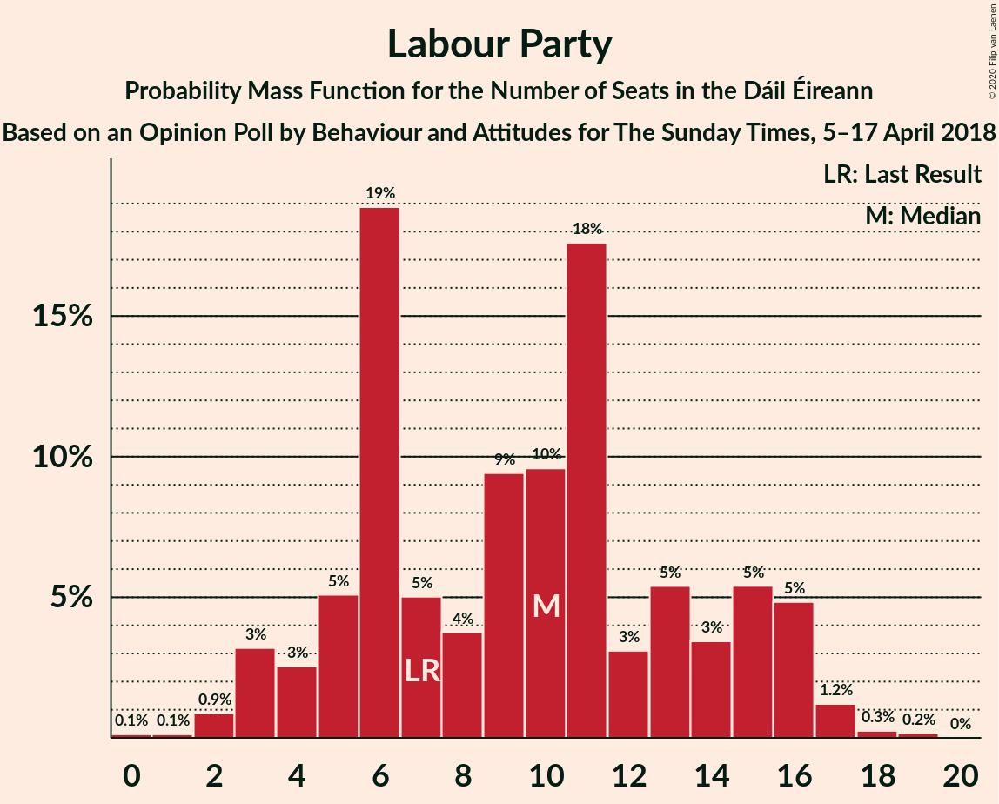
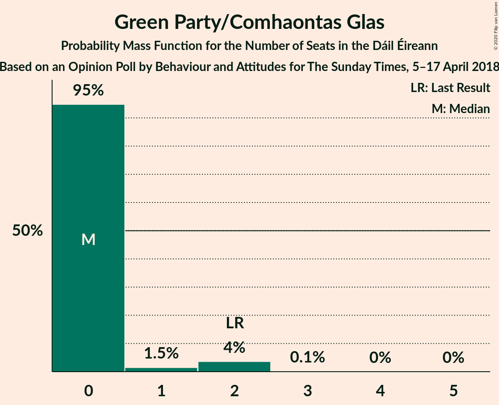
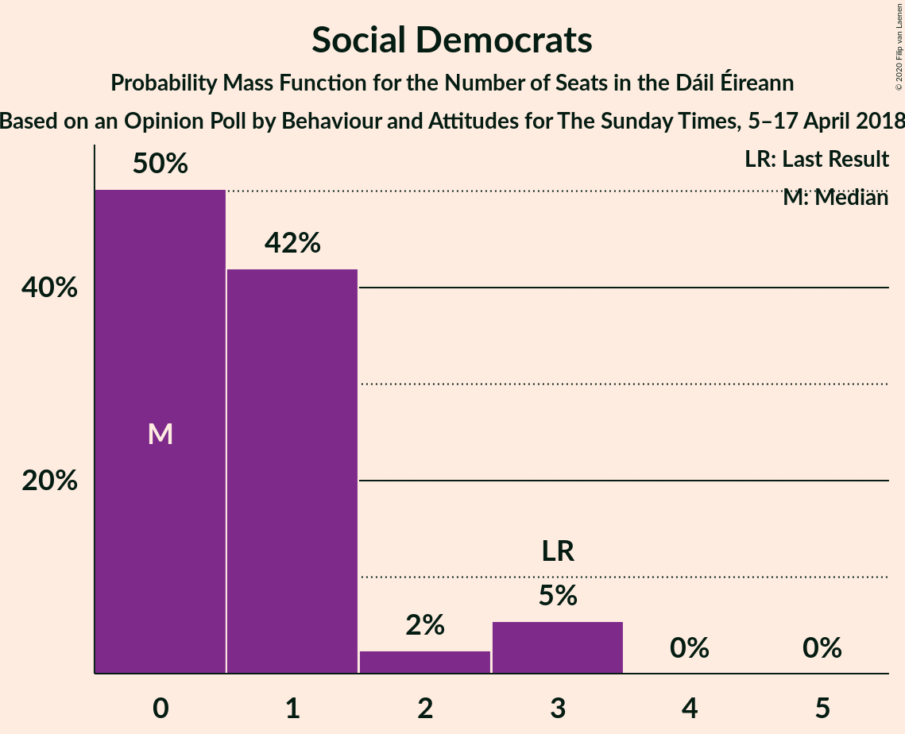
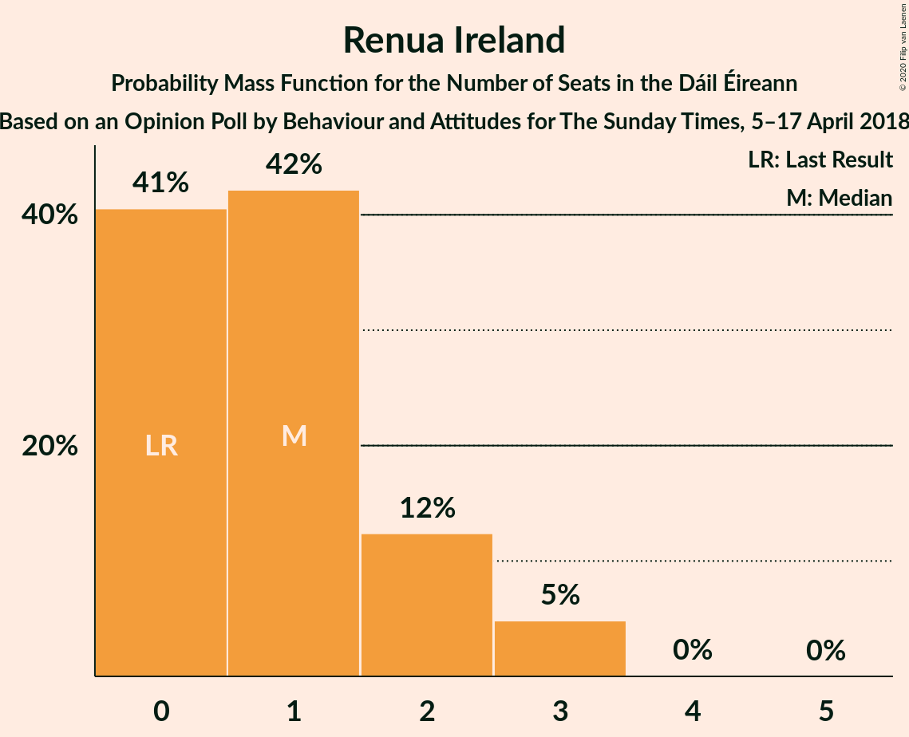
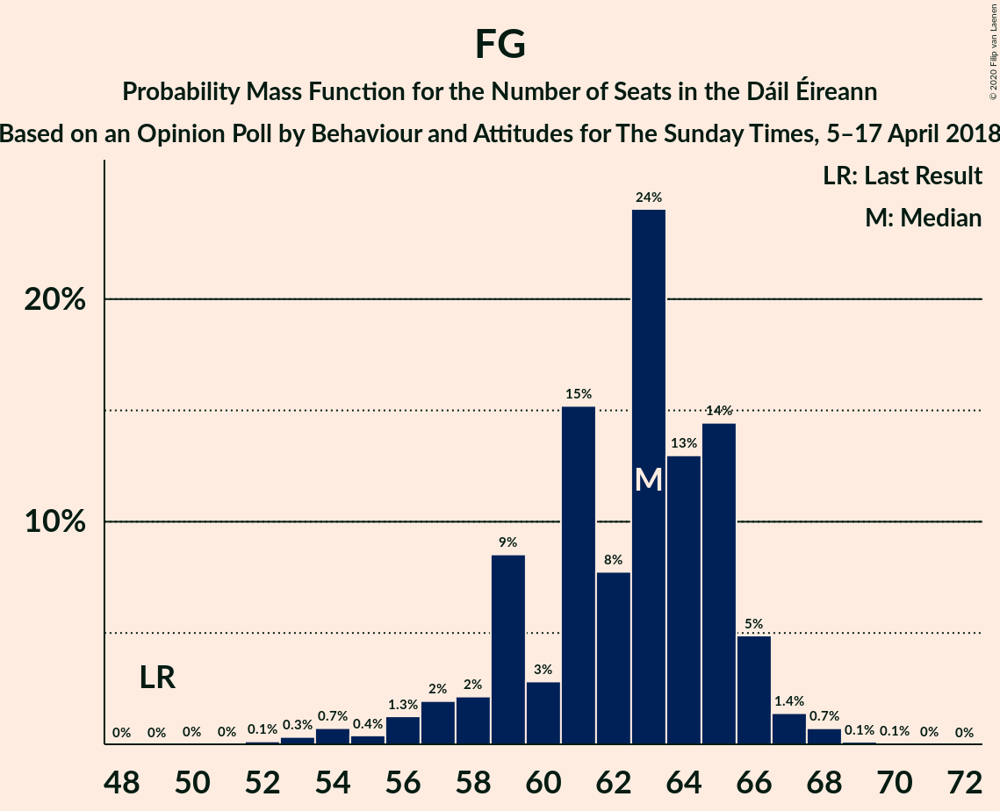

# Opinion Poll by Behaviour and Attitudes for The Sunday Times, 5–17 April 2018

<a href="#voting-intentions">Voting Intentions</a> | <a href="#seats">Seats</a> | <a href="#coalitions">Coalitions</a> | <a href="#technical-information">Technical Information</a>

## Voting Intentions

### Confidence Intervals

| Party | Last Result | Poll Result | 80% Confidence Interval | 90% Confidence Interval | 95% Confidence Interval | 99% Confidence Interval |
|:-----:|:-----------:|:-----------:|:-----------------------:|:-----------------------:|:-----------------------:|:-----------------------:|
| Fine Gael | 25.5% | 32.3% | 30.4–34.3% |29.9–34.9% |29.4–35.4% |28.5–36.4% |
| Fianna Fáil | 24.3% | 24.5% | 22.7–26.3% |22.2–26.9% |21.8–27.3% |21.0–28.3% |
| Sinn Féin | 13.8% | 20.6% | 18.9–22.4% |18.5–22.9% |18.1–23.3% |17.3–24.2% |
| Independent | 15.9% | 8.3% | 7.2–9.6% |6.9–9.9% |6.7–10.3% |6.2–10.9% |
| Labour Party | 6.6% | 5.9% | 5.0–7.0% |4.8–7.4% |4.6–7.7% |4.2–8.2% |
| Green Party/Comhaontas Glas | 2.7% | 1.9% | 1.5–2.7% |1.3–2.9% |1.2–3.0% |1.0–3.4% |
| Independents 4 Change | 1.5% | 1.1% | 0.7–1.7% |0.7–1.8% |0.6–2.0% |0.5–2.3% |
| Solidarity–People Before Profit | 3.9% | 1.0% | 0.7–1.5% |0.6–1.7% |0.5–1.8% |0.4–2.1% |
| Social Democrats | 3.0% | 1.0% | 0.7–1.5% |0.6–1.7% |0.5–1.8% |0.4–2.1% |
| Renua Ireland | 2.2% | 1.0% | 0.7–1.5% |0.6–1.7% |0.5–1.8% |0.4–2.1% |

*Note:* The poll result column reflects the actual value used in the calculations. Published results may vary slightly, and in addition be rounded to fewer digits.

## Seats

### Confidence Intervals

| Party | Last Result | Median | 80% Confidence Interval | 90% Confidence Interval | 95% Confidence Interval | 99% Confidence Interval |
|:-----:|:-----------:|:------:|:-----------------------:|:-----------------------:|:-----------------------:|:-----------------------:|
| <a href="#fine-gael">Fine Gael</a> | 49 | 65 | 60–66 |59–67 |58–67 |55–68 |
| <a href="#fianna-fáil">Fianna Fáil</a> | 44 | 44 | 41–48 |40–51 |40–52 |39–53 |
| <a href="#sinn-féin">Sinn Féin</a> | 23 | 38 | 36–42 |36–42 |36–43 |34–44 |
| <a href="#independent">Independent</a> | 19 | 4 | 3–6 |3–6 |3–6 |3–8 |
| <a href="#labour-party">Labour Party</a> | 7 | 6 | 2–10 |2–10 |2–12 |1–16 |
| <a href="#green-party/comhaontas-glas">Green Party/Comhaontas Glas</a> | 2 | 0 | 0 |0–1 |0–2 |0–2 |
| <a href="#independents-4-change">Independents 4 Change</a> | 4 | 1 | 0–4 |0–4 |0–4 |0–5 |
| <a href="#solidarity–people-before-profit">Solidarity–People Before Profit</a> | 6 | 0 | 0 |0 |0 |0 |
| <a href="#social-democrats">Social Democrats</a> | 3 | 1 | 0–2 |0–3 |0–3 |0–3 |
| <a href="#renua-ireland">Renua Ireland</a> | 0 | 0 | 0 |0–1 |0–1 |0–1 |

### Fine Gael

*For a full overview of the results for this party, see the [Fine Gael](party-finegael.html) page.*

| Number of Seats | Probability | Accumulated | Special Marks |
|:---------------:|:-----------:|:-----------:|:-------------:|
| 49 | 0% | 100% | Last Result |
| 50 | 0% | 100% |  |
| 51 | 0% | 100% |  |
| 52 | 0% | 100% |  |
| 53 | 0% | 100% |  |
| 54 | 0.2% | 100% |  |
| 55 | 0.6% | 99.8% |  |
| 56 | 0.7% | 99.2% |  |
| 57 | 0.6% | 98% |  |
| 58 | 0.5% | 98% |  |
| 59 | 4% | 97% |  |
| 60 | 9% | 93% |  |
| 61 | 1.3% | 84% |  |
| 62 | 2% | 83% |  |
| 63 | 6% | 81% |  |
| 64 | 9% | 74% |  |
| 65 | 33% | 66% | Median |
| 66 | 22% | 32% |  |
| 67 | 8% | 10% |  |
| 68 | 2% | 2% |  |
| 69 | 0% | 0% |  |

### Fianna Fáil

*For a full overview of the results for this party, see the [Fianna Fáil](party-fiannafáil.html) page.*

| Number of Seats | Probability | Accumulated | Special Marks |
|:---------------:|:-----------:|:-----------:|:-------------:|
| 38 | 0.2% | 100% |  |
| 39 | 0.9% | 99.8% |  |
| 40 | 7% | 98.9% |  |
| 41 | 16% | 92% |  |
| 42 | 8% | 77% |  |
| 43 | 7% | 69% |  |
| 44 | 15% | 62% | Last Result, Median |
| 45 | 9% | 47% |  |
| 46 | 18% | 38% |  |
| 47 | 5% | 19% |  |
| 48 | 6% | 14% |  |
| 49 | 0.3% | 8% |  |
| 50 | 2% | 7% |  |
| 51 | 3% | 6% |  |
| 52 | 2% | 3% |  |
| 53 | 0.4% | 0.5% |  |
| 54 | 0.1% | 0.1% |  |
| 55 | 0% | 0% |  |

### Sinn Féin

*For a full overview of the results for this party, see the [Sinn Féin](party-sinnféin.html) page.*

| Number of Seats | Probability | Accumulated | Special Marks |
|:---------------:|:-----------:|:-----------:|:-------------:|
| 23 | 0% | 100% | Last Result |
| 24 | 0% | 100% |  |
| 25 | 0% | 100% |  |
| 26 | 0% | 100% |  |
| 27 | 0% | 100% |  |
| 28 | 0% | 100% |  |
| 29 | 0% | 100% |  |
| 30 | 0% | 100% |  |
| 31 | 0% | 100% |  |
| 32 | 0% | 100% |  |
| 33 | 0% | 100% |  |
| 34 | 1.2% | 99.9% |  |
| 35 | 0.8% | 98.7% |  |
| 36 | 9% | 98% |  |
| 37 | 12% | 89% |  |
| 38 | 31% | 78% | Median |
| 39 | 6% | 46% |  |
| 40 | 18% | 40% |  |
| 41 | 10% | 22% |  |
| 42 | 7% | 12% |  |
| 43 | 3% | 4% |  |
| 44 | 1.1% | 2% |  |
| 45 | 0.3% | 0.4% |  |
| 46 | 0.1% | 0.1% |  |
| 47 | 0% | 0% |  |

### Independent

*For a full overview of the results for this party, see the [Independent](party-independent.html) page.*

| Number of Seats | Probability | Accumulated | Special Marks |
|:---------------:|:-----------:|:-----------:|:-------------:|
| 2 | 0.2% | 100% |  |
| 3 | 41% | 99.8% |  |
| 4 | 19% | 59% | Median |
| 5 | 29% | 40% |  |
| 6 | 10% | 11% |  |
| 7 | 0.4% | 1.2% |  |
| 8 | 0.4% | 0.8% |  |
| 9 | 0% | 0.4% |  |
| 10 | 0.4% | 0.4% |  |
| 11 | 0% | 0% |  |
| 12 | 0% | 0% |  |
| 13 | 0% | 0% |  |
| 14 | 0% | 0% |  |
| 15 | 0% | 0% |  |
| 16 | 0% | 0% |  |
| 17 | 0% | 0% |  |
| 18 | 0% | 0% |  |
| 19 | 0% | 0% | Last Result |

### Labour Party

*For a full overview of the results for this party, see the [Labour Party](party-labourparty.html) page.*

| Number of Seats | Probability | Accumulated | Special Marks |
|:---------------:|:-----------:|:-----------:|:-------------:|
| 0 | 0.3% | 100% |  |
| 1 | 1.2% | 99.7% |  |
| 2 | 19% | 98% |  |
| 3 | 11% | 80% |  |
| 4 | 15% | 69% |  |
| 5 | 2% | 54% |  |
| 6 | 4% | 52% | Median |
| 7 | 9% | 48% | Last Result |
| 8 | 24% | 40% |  |
| 9 | 6% | 16% |  |
| 10 | 7% | 10% |  |
| 11 | 0.1% | 3% |  |
| 12 | 0.3% | 3% |  |
| 13 | 0.8% | 2% |  |
| 14 | 1.1% | 2% |  |
| 15 | 0% | 0.6% |  |
| 16 | 0.5% | 0.6% |  |
| 17 | 0% | 0.1% |  |
| 18 | 0% | 0% |  |

### Green Party/Comhaontas Glas

*For a full overview of the results for this party, see the [Green Party/Comhaontas Glas](party-greenpartycomhaontasglas.html) page.*

| Number of Seats | Probability | Accumulated | Special Marks |
|:---------------:|:-----------:|:-----------:|:-------------:|
| 0 | 90% | 100% | Median |
| 1 | 7% | 10% |  |
| 2 | 3% | 3% | Last Result |
| 3 | 0.1% | 0.1% |  |
| 4 | 0% | 0% |  |

### Independents 4 Change

*For a full overview of the results for this party, see the [Independents 4 Change](party-independents4change.html) page.*

| Number of Seats | Probability | Accumulated | Special Marks |
|:---------------:|:-----------:|:-----------:|:-------------:|
| 0 | 47% | 100% |  |
| 1 | 21% | 53% | Median |
| 2 | 4% | 32% |  |
| 3 | 10% | 29% |  |
| 4 | 17% | 19% | Last Result |
| 5 | 2% | 2% |  |
| 6 | 0% | 0% |  |

### Solidarity–People Before Profit

*For a full overview of the results for this party, see the [Solidarity–People Before Profit](party-solidarity–peoplebeforeprofit.html) page.*

| Number of Seats | Probability | Accumulated | Special Marks |
|:---------------:|:-----------:|:-----------:|:-------------:|
| 0 | 99.7% | 100% | Median |
| 1 | 0.2% | 0.3% |  |
| 2 | 0% | 0% |  |
| 3 | 0% | 0% |  |
| 4 | 0% | 0% |  |
| 5 | 0% | 0% |  |
| 6 | 0% | 0% | Last Result |

### Social Democrats

*For a full overview of the results for this party, see the [Social Democrats](party-socialdemocrats.html) page.*

| Number of Seats | Probability | Accumulated | Special Marks |
|:---------------:|:-----------:|:-----------:|:-------------:|
| 0 | 17% | 100% |  |
| 1 | 65% | 83% | Median |
| 2 | 10% | 18% |  |
| 3 | 7% | 7% | Last Result |
| 4 | 0.1% | 0.1% |  |
| 5 | 0% | 0% |  |

### Renua Ireland

*For a full overview of the results for this party, see the [Renua Ireland](party-renuaireland.html) page.*

| Number of Seats | Probability | Accumulated | Special Marks |
|:---------------:|:-----------:|:-----------:|:-------------:|
| 0 | 94% | 100% | Last Result, Median |
| 1 | 6% | 6% |  |
| 2 | 0.1% | 0.1% |  |
| 3 | 0% | 0% |  |

## Coalitions

### Confidence Intervals

| Coalition | Last Result | Median | Majority? | 80% Confidence Interval | 90% Confidence Interval | 95% Confidence Interval | 99% Confidence Interval |
|:---------:|:-----------:|:------:|:---------:|:-----------------------:|:-----------------------:|:-----------------------:|:-----------------------:|
| Fine Gael – Fianna Fáil | 93 | 109 | 100% | 106–112 | 104–112 | 102–113 | 99–118 |
| Fianna Fáil – Sinn Féin | 67 | 83 | 79% | 80–86 | 79–91 | 78–92 | 77–94 |
| Fine Gael – Labour Party – Green Party/Comhaontas Glas – Social Democrats | 61 | 70 | 0% | 67–76 | 64–76 | 63–77 | 62–78 |
| Fine Gael – Labour Party – Green Party/Comhaontas Glas | 58 | 70 | 0% | 67–74 | 63–75 | 62–75 | 61–78 |
| Fine Gael – Labour Party | 56 | 70 | 0% | 67–74 | 63–75 | 62–75 | 61–78 |
| Fine Gael – Green Party/Comhaontas Glas | 51 | 65 | 0% | 60–66 | 59–68 | 58–68 | 55–68 |
| Fine Gael | 49 | 65 | 0% | 60–66 | 59–67 | 58–67 | 55–68 |
| Fianna Fáil – Labour Party – Green Party/Comhaontas Glas – Social Democrats | 56 | 52 | 0% | 46–56 | 45–56 | 45–57 | 43–59 |
| Fianna Fáil – Labour Party – Green Party/Comhaontas Glas | 53 | 51 | 0% | 45–55 | 44–55 | 44–57 | 43–58 |
| Fianna Fáil – Labour Party | 51 | 50 | 0% | 45–55 | 44–55 | 44–56 | 43–58 |
| Fianna Fáil – Green Party/Comhaontas Glas | 46 | 44 | 0% | 41–48 | 40–51 | 40–52 | 39–53 |

### Fine Gael – Fianna Fáil

| Number of Seats | Probability | Accumulated | Special Marks |
|:---------------:|:-----------:|:-----------:|:-------------:|
| 93 | 0% | 100% | Last Result |
| 94 | 0% | 100% |  |
| 95 | 0.1% | 100% |  |
| 96 | 0% | 99.9% |  |
| 97 | 0% | 99.9% |  |
| 98 | 0.1% | 99.9% |  |
| 99 | 2% | 99.8% |  |
| 100 | 0.1% | 98% |  |
| 101 | 0.2% | 98% |  |
| 102 | 0.3% | 98% |  |
| 103 | 1.1% | 97% |  |
| 104 | 2% | 96% |  |
| 105 | 2% | 94% |  |
| 106 | 22% | 92% |  |
| 107 | 3% | 70% |  |
| 108 | 14% | 67% |  |
| 109 | 19% | 54% | Median |
| 110 | 7% | 35% |  |
| 111 | 5% | 27% |  |
| 112 | 19% | 22% |  |
| 113 | 0.9% | 3% |  |
| 114 | 0.5% | 2% |  |
| 115 | 0.1% | 1.2% |  |
| 116 | 0.1% | 1.2% |  |
| 117 | 0% | 1.1% |  |
| 118 | 1.1% | 1.1% |  |
| 119 | 0% | 0% |  |

### Fianna Fáil – Sinn Féin

| Number of Seats | Probability | Accumulated | Special Marks |
|:---------------:|:-----------:|:-----------:|:-------------:|
| 67 | 0% | 100% | Last Result |
| 68 | 0% | 100% |  |
| 69 | 0% | 100% |  |
| 70 | 0% | 100% |  |
| 71 | 0% | 100% |  |
| 72 | 0% | 100% |  |
| 73 | 0% | 100% |  |
| 74 | 0% | 100% |  |
| 75 | 0% | 100% |  |
| 76 | 0.2% | 100% |  |
| 77 | 2% | 99.8% |  |
| 78 | 2% | 98% |  |
| 79 | 6% | 96% |  |
| 80 | 12% | 90% |  |
| 81 | 2% | 79% | Majority |
| 82 | 23% | 77% | Median |
| 83 | 18% | 53% |  |
| 84 | 5% | 35% |  |
| 85 | 2% | 30% |  |
| 86 | 18% | 28% |  |
| 87 | 2% | 10% |  |
| 88 | 1.4% | 8% |  |
| 89 | 1.1% | 7% |  |
| 90 | 0.1% | 6% |  |
| 91 | 1.2% | 6% |  |
| 92 | 2% | 5% |  |
| 93 | 2% | 2% |  |
| 94 | 0.7% | 0.7% |  |
| 95 | 0% | 0% |  |

### Fine Gael – Labour Party – Green Party/Comhaontas Glas – Social Democrats

| Number of Seats | Probability | Accumulated | Special Marks |
|:---------------:|:-----------:|:-----------:|:-------------:|
| 59 | 0% | 100% |  |
| 60 | 0% | 99.9% |  |
| 61 | 0.1% | 99.9% | Last Result |
| 62 | 1.1% | 99.8% |  |
| 63 | 2% | 98.8% |  |
| 64 | 3% | 97% |  |
| 65 | 0.9% | 94% |  |
| 66 | 0.6% | 93% |  |
| 67 | 6% | 92% |  |
| 68 | 3% | 86% |  |
| 69 | 22% | 83% |  |
| 70 | 12% | 61% |  |
| 71 | 4% | 49% |  |
| 72 | 3% | 45% | Median |
| 73 | 6% | 42% |  |
| 74 | 19% | 36% |  |
| 75 | 1.0% | 18% |  |
| 76 | 14% | 17% |  |
| 77 | 2% | 3% |  |
| 78 | 0.9% | 1.0% |  |
| 79 | 0.1% | 0.1% |  |
| 80 | 0% | 0% |  |

### Fine Gael – Labour Party – Green Party/Comhaontas Glas

| Number of Seats | Probability | Accumulated | Special Marks |
|:---------------:|:-----------:|:-----------:|:-------------:|
| 58 | 0% | 100% | Last Result |
| 59 | 0% | 100% |  |
| 60 | 0.1% | 99.9% |  |
| 61 | 1.1% | 99.8% |  |
| 62 | 2% | 98.7% |  |
| 63 | 2% | 97% |  |
| 64 | 2% | 94% |  |
| 65 | 1.5% | 93% |  |
| 66 | 1.1% | 91% |  |
| 67 | 6% | 90% |  |
| 68 | 23% | 84% |  |
| 69 | 10% | 61% |  |
| 70 | 5% | 52% |  |
| 71 | 4% | 46% | Median |
| 72 | 7% | 43% |  |
| 73 | 21% | 35% |  |
| 74 | 8% | 15% |  |
| 75 | 5% | 6% |  |
| 76 | 0.2% | 1.3% |  |
| 77 | 0.2% | 1.1% |  |
| 78 | 0.9% | 0.9% |  |
| 79 | 0% | 0% |  |

### Fine Gael – Labour Party

| Number of Seats | Probability | Accumulated | Special Marks |
|:---------------:|:-----------:|:-----------:|:-------------:|
| 56 | 0% | 100% | Last Result |
| 57 | 0% | 100% |  |
| 58 | 0% | 100% |  |
| 59 | 0% | 99.9% |  |
| 60 | 0.1% | 99.9% |  |
| 61 | 1.1% | 99.8% |  |
| 62 | 2% | 98.7% |  |
| 63 | 2% | 97% |  |
| 64 | 2% | 94% |  |
| 65 | 1.0% | 92% |  |
| 66 | 1.1% | 91% |  |
| 67 | 7% | 90% |  |
| 68 | 23% | 83% |  |
| 69 | 9% | 60% |  |
| 70 | 5% | 51% |  |
| 71 | 10% | 46% | Median |
| 72 | 3% | 36% |  |
| 73 | 20% | 33% |  |
| 74 | 7% | 13% |  |
| 75 | 5% | 6% |  |
| 76 | 0.2% | 1.3% |  |
| 77 | 0.2% | 1.1% |  |
| 78 | 0.9% | 0.9% |  |
| 79 | 0% | 0% |  |

### Fine Gael – Green Party/Comhaontas Glas

| Number of Seats | Probability | Accumulated | Special Marks |
|:---------------:|:-----------:|:-----------:|:-------------:|
| 51 | 0% | 100% | Last Result |
| 52 | 0% | 100% |  |
| 53 | 0% | 100% |  |
| 54 | 0.1% | 100% |  |
| 55 | 0.6% | 99.8% |  |
| 56 | 0.7% | 99.2% |  |
| 57 | 0.6% | 98.5% |  |
| 58 | 0.5% | 98% |  |
| 59 | 3% | 97% |  |
| 60 | 9% | 94% |  |
| 61 | 2% | 85% |  |
| 62 | 2% | 83% |  |
| 63 | 5% | 81% |  |
| 64 | 9% | 76% |  |
| 65 | 34% | 68% | Median |
| 66 | 24% | 33% |  |
| 67 | 3% | 10% |  |
| 68 | 7% | 7% |  |
| 69 | 0% | 0.1% |  |
| 70 | 0% | 0.1% |  |
| 71 | 0% | 0% |  |

### Fine Gael

| Number of Seats | Probability | Accumulated | Special Marks |
|:---------------:|:-----------:|:-----------:|:-------------:|
| 49 | 0% | 100% | Last Result |
| 50 | 0% | 100% |  |
| 51 | 0% | 100% |  |
| 52 | 0% | 100% |  |
| 53 | 0% | 100% |  |
| 54 | 0.2% | 100% |  |
| 55 | 0.6% | 99.8% |  |
| 56 | 0.7% | 99.2% |  |
| 57 | 0.6% | 98% |  |
| 58 | 0.5% | 98% |  |
| 59 | 4% | 97% |  |
| 60 | 9% | 93% |  |
| 61 | 1.3% | 84% |  |
| 62 | 2% | 83% |  |
| 63 | 6% | 81% |  |
| 64 | 9% | 74% |  |
| 65 | 33% | 66% | Median |
| 66 | 22% | 32% |  |
| 67 | 8% | 10% |  |
| 68 | 2% | 2% |  |
| 69 | 0% | 0% |  |

### Fianna Fáil – Labour Party – Green Party/Comhaontas Glas – Social Democrats

| Number of Seats | Probability | Accumulated | Special Marks |
|:---------------:|:-----------:|:-----------:|:-------------:|
| 43 | 0.5% | 100% |  |
| 44 | 0.1% | 99.5% |  |
| 45 | 9% | 99.4% |  |
| 46 | 1.1% | 91% |  |
| 47 | 5% | 90% |  |
| 48 | 0.6% | 85% |  |
| 49 | 20% | 84% |  |
| 50 | 10% | 64% |  |
| 51 | 1.2% | 54% | Median |
| 52 | 5% | 53% |  |
| 53 | 18% | 48% |  |
| 54 | 9% | 30% |  |
| 55 | 9% | 21% |  |
| 56 | 8% | 12% | Last Result |
| 57 | 2% | 4% |  |
| 58 | 1.1% | 2% |  |
| 59 | 0.6% | 1.0% |  |
| 60 | 0.1% | 0.4% |  |
| 61 | 0.3% | 0.4% |  |
| 62 | 0% | 0.1% |  |
| 63 | 0% | 0.1% |  |
| 64 | 0% | 0% |  |

### Fianna Fáil – Labour Party – Green Party/Comhaontas Glas

| Number of Seats | Probability | Accumulated | Special Marks |
|:---------------:|:-----------:|:-----------:|:-------------:|
| 42 | 0.2% | 100% |  |
| 43 | 0.8% | 99.8% |  |
| 44 | 6% | 99.0% |  |
| 45 | 3% | 93% |  |
| 46 | 6% | 90% |  |
| 47 | 1.3% | 84% |  |
| 48 | 17% | 83% |  |
| 49 | 13% | 66% |  |
| 50 | 2% | 52% | Median |
| 51 | 3% | 50% |  |
| 52 | 23% | 47% |  |
| 53 | 5% | 24% | Last Result |
| 54 | 3% | 19% |  |
| 55 | 11% | 15% |  |
| 56 | 2% | 5% |  |
| 57 | 2% | 3% |  |
| 58 | 0.8% | 1.2% |  |
| 59 | 0% | 0.4% |  |
| 60 | 0.3% | 0.3% |  |
| 61 | 0% | 0.1% |  |
| 62 | 0% | 0.1% |  |
| 63 | 0% | 0% |  |

### Fianna Fáil – Labour Party

| Number of Seats | Probability | Accumulated | Special Marks |
|:---------------:|:-----------:|:-----------:|:-------------:|
| 42 | 0.2% | 100% |  |
| 43 | 0.8% | 99.7% |  |
| 44 | 6% | 98.9% |  |
| 45 | 8% | 93% |  |
| 46 | 1.4% | 85% |  |
| 47 | 1.4% | 84% |  |
| 48 | 17% | 82% |  |
| 49 | 15% | 66% |  |
| 50 | 0.9% | 51% | Median |
| 51 | 5% | 50% | Last Result |
| 52 | 23% | 45% |  |
| 53 | 3% | 22% |  |
| 54 | 4% | 19% |  |
| 55 | 11% | 15% |  |
| 56 | 2% | 4% |  |
| 57 | 2% | 2% |  |
| 58 | 0.3% | 0.6% |  |
| 59 | 0% | 0.4% |  |
| 60 | 0.3% | 0.3% |  |
| 61 | 0% | 0.1% |  |
| 62 | 0% | 0% |  |

### Fianna Fáil – Green Party/Comhaontas Glas

| Number of Seats | Probability | Accumulated | Special Marks |
|:---------------:|:-----------:|:-----------:|:-------------:|
| 38 | 0.2% | 100% |  |
| 39 | 0.8% | 99.8% |  |
| 40 | 6% | 99.0% |  |
| 41 | 10% | 93% |  |
| 42 | 14% | 82% |  |
| 43 | 5% | 69% |  |
| 44 | 15% | 64% | Median |
| 45 | 11% | 49% |  |
| 46 | 18% | 38% | Last Result |
| 47 | 5% | 20% |  |
| 48 | 6% | 14% |  |
| 49 | 0.3% | 8% |  |
| 50 | 2% | 8% |  |
| 51 | 3% | 6% |  |
| 52 | 2% | 3% |  |
| 53 | 0.4% | 0.6% |  |
| 54 | 0% | 0.1% |  |
| 55 | 0.1% | 0.1% |  |
| 56 | 0% | 0% |  |

## Technical Information

### Opinion Poll

+ **Polling firm:** Behaviour and Attitudes
+ **Commissioner(s):** The Sunday Times
+ **Fieldwork period:** 5–17 April 2018

### Calculations

+ **Sample size:** 928
+ **Simulations done:** 131,072
+ **Error estimate:** 1.87%

