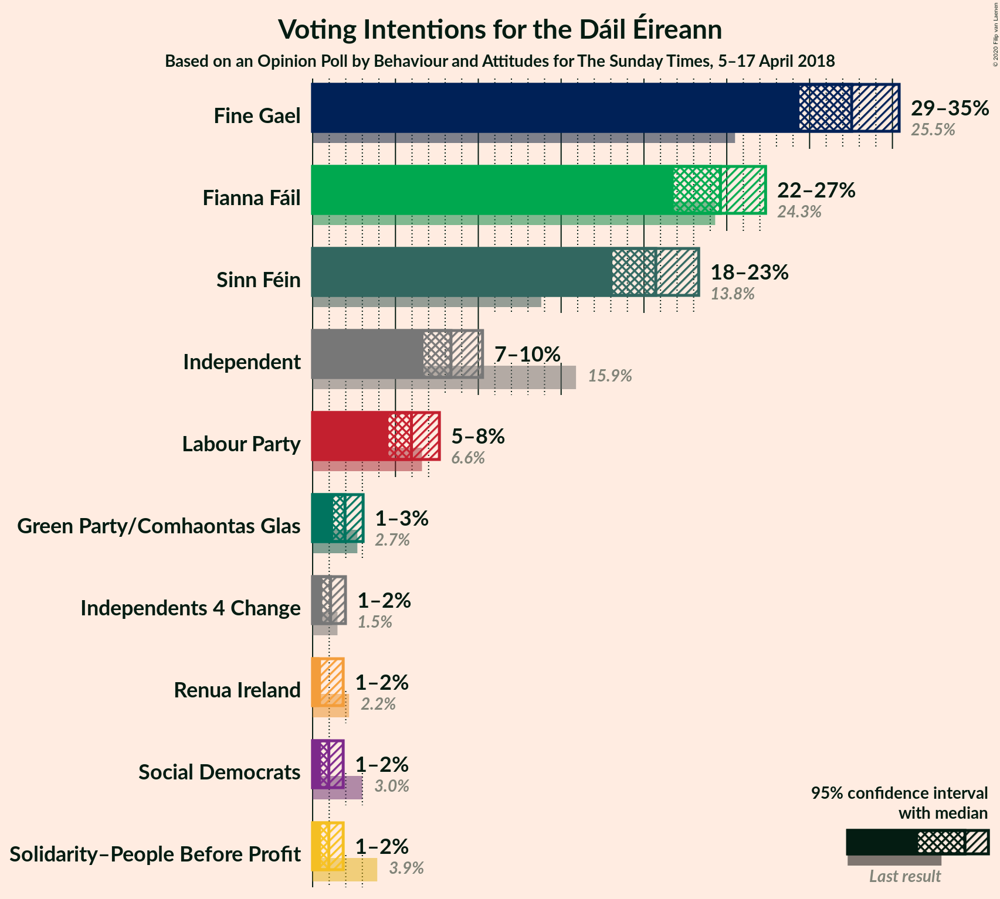
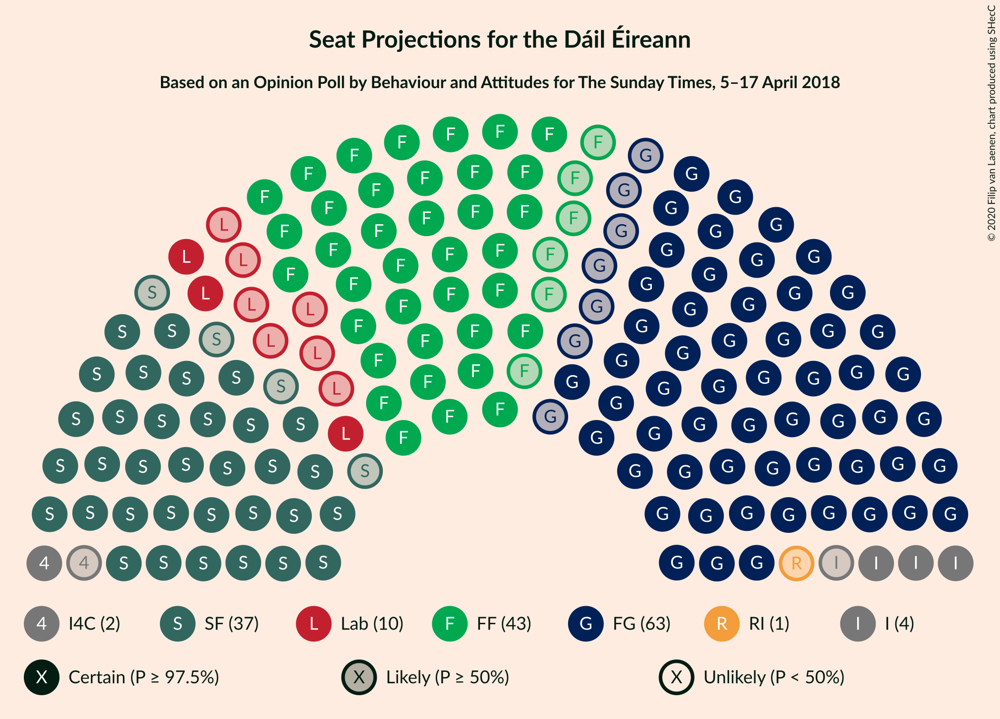
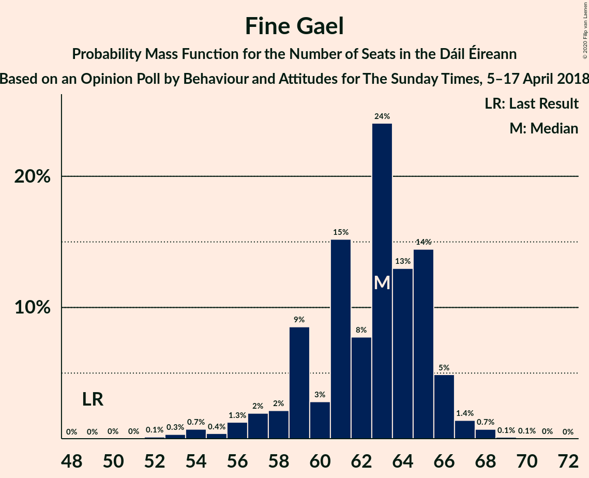
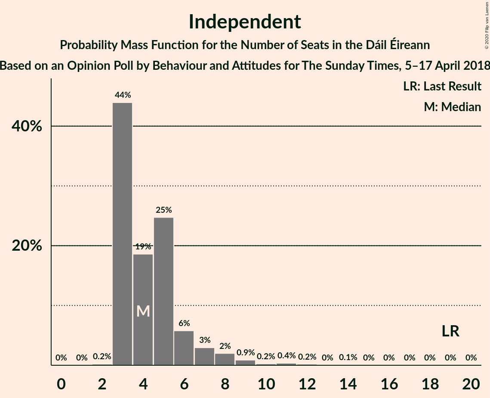
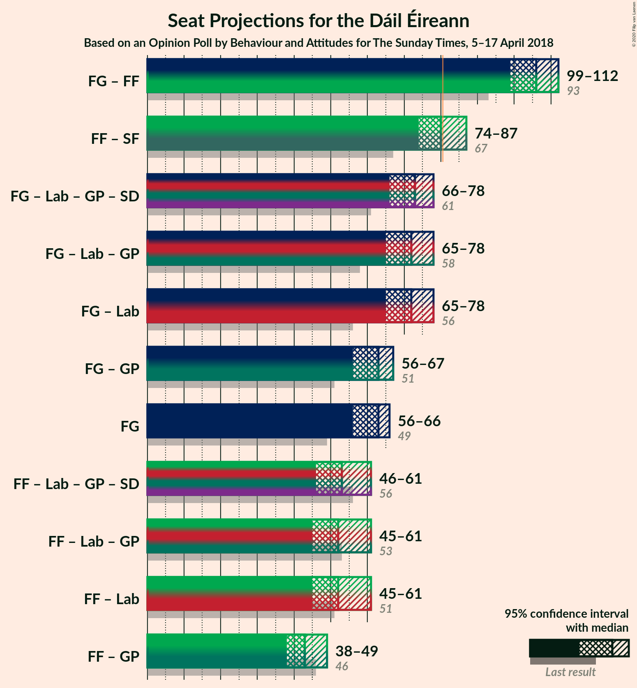
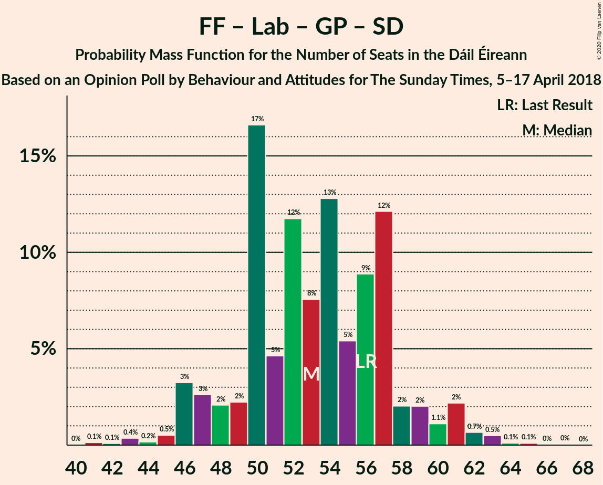

# Opinion Poll by Behaviour and Attitudes for The Sunday Times, 5–17 April 2018

<a href="#voting-intentions">Voting Intentions</a> | <a href="#seats">Seats</a> | <a href="#coalitions">Coalitions</a> | <a href="#technical-information">Technical Information</a>

## Voting Intentions

### Confidence Intervals

| Party | Last Result | Poll Result | 80% Confidence Interval | 90% Confidence Interval | 95% Confidence Interval | 99% Confidence Interval |
|:-----:|:-----------:|:-----------:|:-----------------------:|:-----------------------:|:-----------------------:|:-----------------------:|
| Fine Gael | 25.5% | 32.3% | 30.4–34.3% |29.9–34.9% |29.4–35.4% |28.5–36.4% |
| Fianna Fáil | 24.3% | 24.5% | 22.7–26.3% |22.2–26.9% |21.8–27.3% |21.0–28.3% |
| Sinn Féin | 13.8% | 20.6% | 18.9–22.4% |18.5–22.9% |18.1–23.3% |17.3–24.2% |
| Independent | 15.9% | 8.3% | 7.2–9.6% |6.9–9.9% |6.7–10.3% |6.2–10.9% |
| Labour Party | 6.6% | 5.9% | 5.0–7.0% |4.8–7.4% |4.6–7.7% |4.2–8.2% |
| Green Party/Comhaontas Glas | 2.7% | 1.9% | 1.5–2.7% |1.3–2.9% |1.2–3.0% |1.0–3.4% |
| Independents 4 Change | 1.5% | 1.1% | 0.7–1.7% |0.7–1.8% |0.6–2.0% |0.5–2.3% |
| Solidarity–People Before Profit | 3.9% | 1.0% | 0.7–1.5% |0.6–1.7% |0.5–1.8% |0.4–2.1% |
| Social Democrats | 3.0% | 1.0% | 0.7–1.5% |0.6–1.7% |0.5–1.8% |0.4–2.1% |
| Renua Ireland | 2.2% | 1.0% | 0.7–1.5% |0.6–1.7% |0.5–1.8% |0.4–2.1% |

*Note:* The poll result column reflects the actual value used in the calculations. Published results may vary slightly, and in addition be rounded to fewer digits.

## Seats

### Confidence Intervals

| Party | Last Result | Median | 80% Confidence Interval | 90% Confidence Interval | 95% Confidence Interval | 99% Confidence Interval |
|:-----:|:-----------:|:------:|:-----------------------:|:-----------------------:|:-----------------------:|:-----------------------:|
| <a href="#fine-gael">Fine Gael</a> | 49 | 63 | 59–65 |58–66 |56–66 |53–68 |
| <a href="#fianna-fáil">Fianna Fáil</a> | 44 | 43 | 39–47 |38–48 |37–49 |35–51 |
| <a href="#sinn-féin">Sinn Féin</a> | 23 | 37 | 36–40 |35–40 |33–40 |32–41 |
| <a href="#independent">Independent</a> | 19 | 4 | 3–6 |3–7 |3–8 |3–11 |
| <a href="#labour-party">Labour Party</a> | 7 | 10 | 5–15 |4–16 |3–16 |2–17 |
| <a href="#green-party/comhaontas-glas">Green Party/Comhaontas Glas</a> | 2 | 0 | 0 |0–1 |0–2 |0–2 |
| <a href="#independents-4-change">Independents 4 Change</a> | 4 | 2 | 1–3 |1–3 |1–3 |0–3 |
| <a href="#solidarity–people-before-profit">Solidarity–People Before Profit</a> | 6 | 0 | 0–1 |0–1 |0–1 |0–1 |
| <a href="#social-democrats">Social Democrats</a> | 3 | 0 | 0–1 |0–3 |0–3 |0–3 |
| <a href="#renua-ireland">Renua Ireland</a> | 0 | 1 | 0–2 |0–2 |0–3 |0–3 |

### Fine Gael

*For a full overview of the results for this party, see the [Fine Gael](party-finegael.html) page.*

| Number of Seats | Probability | Accumulated | Special Marks |
|:---------------:|:-----------:|:-----------:|:-------------:|
| 49 | 0% | 100% | Last Result |
| 50 | 0% | 100% |  |
| 51 | 0% | 100% |  |
| 52 | 0.1% | 99.9% |  |
| 53 | 0.3% | 99.8% |  |
| 54 | 0.7% | 99.5% |  |
| 55 | 0.4% | 98.8% |  |
| 56 | 1.3% | 98% |  |
| 57 | 2% | 97% |  |
| 58 | 2% | 95% |  |
| 59 | 9% | 93% |  |
| 60 | 3% | 84% |  |
| 61 | 15% | 82% |  |
| 62 | 8% | 66% |  |
| 63 | 24% | 59% | Median |
| 64 | 13% | 35% |  |
| 65 | 14% | 22% |  |
| 66 | 5% | 7% |  |
| 67 | 1.4% | 2% |  |
| 68 | 0.7% | 0.9% |  |
| 69 | 0.1% | 0.2% |  |
| 70 | 0.1% | 0.1% |  |
| 71 | 0% | 0% |  |

### Fianna Fáil

*For a full overview of the results for this party, see the [Fianna Fáil](party-fiannafáil.html) page.*

| Number of Seats | Probability | Accumulated | Special Marks |
|:---------------:|:-----------:|:-----------:|:-------------:|
| 33 | 0.1% | 100% |  |
| 34 | 0.1% | 99.9% |  |
| 35 | 0.4% | 99.8% |  |
| 36 | 0.9% | 99.4% |  |
| 37 | 1.1% | 98.6% |  |
| 38 | 5% | 97% |  |
| 39 | 7% | 93% |  |
| 40 | 5% | 86% |  |
| 41 | 12% | 81% |  |
| 42 | 8% | 68% |  |
| 43 | 14% | 60% | Median |
| 44 | 18% | 46% | Last Result |
| 45 | 9% | 28% |  |
| 46 | 5% | 19% |  |
| 47 | 7% | 14% |  |
| 48 | 2% | 7% |  |
| 49 | 2% | 4% |  |
| 50 | 2% | 2% |  |
| 51 | 0.4% | 0.7% |  |
| 52 | 0.2% | 0.3% |  |
| 53 | 0.1% | 0.1% |  |
| 54 | 0% | 0% |  |

### Sinn Féin

*For a full overview of the results for this party, see the [Sinn Féin](party-sinnféin.html) page.*

| Number of Seats | Probability | Accumulated | Special Marks |
|:---------------:|:-----------:|:-----------:|:-------------:|
| 23 | 0% | 100% | Last Result |
| 24 | 0% | 100% |  |
| 25 | 0% | 100% |  |
| 26 | 0% | 100% |  |
| 27 | 0% | 100% |  |
| 28 | 0% | 100% |  |
| 29 | 0% | 100% |  |
| 30 | 0% | 100% |  |
| 31 | 0.2% | 100% |  |
| 32 | 1.1% | 99.8% |  |
| 33 | 2% | 98.7% |  |
| 34 | 0.8% | 97% |  |
| 35 | 2% | 96% |  |
| 36 | 34% | 94% |  |
| 37 | 18% | 60% | Median |
| 38 | 18% | 42% |  |
| 39 | 9% | 24% |  |
| 40 | 14% | 15% |  |
| 41 | 0.6% | 0.8% |  |
| 42 | 0.2% | 0.2% |  |
| 43 | 0% | 0% |  |

### Independent

*For a full overview of the results for this party, see the [Independent](party-independent.html) page.*

| Number of Seats | Probability | Accumulated | Special Marks |
|:---------------:|:-----------:|:-----------:|:-------------:|
| 2 | 0.2% | 100% |  |
| 3 | 44% | 99.8% |  |
| 4 | 19% | 56% | Median |
| 5 | 25% | 37% |  |
| 6 | 6% | 12% |  |
| 7 | 3% | 7% |  |
| 8 | 2% | 4% |  |
| 9 | 0.9% | 2% |  |
| 10 | 0.2% | 0.9% |  |
| 11 | 0.4% | 0.6% |  |
| 12 | 0.2% | 0.3% |  |
| 13 | 0% | 0.1% |  |
| 14 | 0.1% | 0.1% |  |
| 15 | 0% | 0% |  |
| 16 | 0% | 0% |  |
| 17 | 0% | 0% |  |
| 18 | 0% | 0% |  |
| 19 | 0% | 0% | Last Result |

### Labour Party

*For a full overview of the results for this party, see the [Labour Party](party-labourparty.html) page.*

| Number of Seats | Probability | Accumulated | Special Marks |
|:---------------:|:-----------:|:-----------:|:-------------:|
| 0 | 0.1% | 100% |  |
| 1 | 0.1% | 99.9% |  |
| 2 | 0.9% | 99.7% |  |
| 3 | 3% | 98.9% |  |
| 4 | 3% | 96% |  |
| 5 | 5% | 93% |  |
| 6 | 19% | 88% |  |
| 7 | 5% | 69% | Last Result |
| 8 | 4% | 64% |  |
| 9 | 9% | 60% |  |
| 10 | 10% | 51% | Median |
| 11 | 18% | 41% |  |
| 12 | 3% | 24% |  |
| 13 | 5% | 21% |  |
| 14 | 3% | 15% |  |
| 15 | 5% | 12% |  |
| 16 | 5% | 6% |  |
| 17 | 1.2% | 2% |  |
| 18 | 0.3% | 0.4% |  |
| 19 | 0.2% | 0.2% |  |
| 20 | 0% | 0% |  |

### Green Party/Comhaontas Glas

*For a full overview of the results for this party, see the [Green Party/Comhaontas Glas](party-greenpartycomhaontasglas.html) page.*

| Number of Seats | Probability | Accumulated | Special Marks |
|:---------------:|:-----------:|:-----------:|:-------------:|
| 0 | 95% | 100% | Median |
| 1 | 1.5% | 5% |  |
| 2 | 4% | 4% | Last Result |
| 3 | 0.1% | 0.1% |  |
| 4 | 0% | 0% |  |

### Independents 4 Change

*For a full overview of the results for this party, see the [Independents 4 Change](party-independents4change.html) page.*

| Number of Seats | Probability | Accumulated | Special Marks |
|:---------------:|:-----------:|:-----------:|:-------------:|
| 0 | 0.7% | 100% |  |
| 1 | 9% | 99.3% |  |
| 2 | 78% | 90% | Median |
| 3 | 12% | 12% |  |
| 4 | 0% | 0% | Last Result |

### Solidarity–People Before Profit

*For a full overview of the results for this party, see the [Solidarity–People Before Profit](party-solidarity–peoplebeforeprofit.html) page.*

| Number of Seats | Probability | Accumulated | Special Marks |
|:---------------:|:-----------:|:-----------:|:-------------:|
| 0 | 89% | 100% | Median |
| 1 | 11% | 11% |  |
| 2 | 0.1% | 0.1% |  |
| 3 | 0% | 0% |  |
| 4 | 0% | 0% |  |
| 5 | 0% | 0% |  |
| 6 | 0% | 0% | Last Result |

### Social Democrats

*For a full overview of the results for this party, see the [Social Democrats](party-socialdemocrats.html) page.*

| Number of Seats | Probability | Accumulated | Special Marks |
|:---------------:|:-----------:|:-----------:|:-------------:|
| 0 | 50% | 100% | Median |
| 1 | 42% | 50% |  |
| 2 | 2% | 8% |  |
| 3 | 5% | 5% | Last Result |
| 4 | 0% | 0% |  |

### Renua Ireland

*For a full overview of the results for this party, see the [Renua Ireland](party-renuaireland.html) page.*

| Number of Seats | Probability | Accumulated | Special Marks |
|:---------------:|:-----------:|:-----------:|:-------------:|
| 0 | 41% | 100% | Last Result |
| 1 | 42% | 59% | Median |
| 2 | 12% | 17% |  |
| 3 | 5% | 5% |  |
| 4 | 0% | 0.1% |  |
| 5 | 0% | 0% |  |

## Coalitions

### Confidence Intervals

| Coalition | Last Result | Median | Majority? | 80% Confidence Interval | 90% Confidence Interval | 95% Confidence Interval | 99% Confidence Interval |
|:---------:|:-----------:|:------:|:---------:|:-----------------------:|:-----------------------:|:-----------------------:|:-----------------------:|
| Fine Gael – Fianna Fáil | 93 | 106 | 100% | 101–109 | 100–110 | 99–112 | 97–115 |
| Fianna Fáil – Sinn Féin | 67 | 80 | 46% | 77–84 | 76–86 | 74–87 | 73–89 |
| Fine Gael – Labour Party – Green Party/Comhaontas Glas – Social Democrats | 61 | 73 | 0.2% | 69–77 | 68–78 | 66–78 | 63–80 |
| Fine Gael – Labour Party – Green Party/Comhaontas Glas | 58 | 72 | 0.1% | 68–76 | 67–77 | 65–78 | 62–79 |
| Fine Gael – Labour Party | 56 | 72 | 0.1% | 68–76 | 67–77 | 65–78 | 62–79 |
| Fine Gael – Green Party/Comhaontas Glas | 51 | 63 | 0% | 59–65 | 58–66 | 56–67 | 54–68 |
| Fine Gael | 49 | 63 | 0% | 59–65 | 58–66 | 56–66 | 53–68 |
| Fianna Fáil – Labour Party – Green Party/Comhaontas Glas – Social Democrats | 56 | 53 | 0% | 49–57 | 47–59 | 46–61 | 43–63 |
| Fianna Fáil – Labour Party – Green Party/Comhaontas Glas | 53 | 52 | 0% | 48–56 | 46–58 | 45–61 | 43–62 |
| Fianna Fáil – Labour Party | 51 | 52 | 0% | 48–56 | 46–58 | 45–61 | 43–62 |
| Fianna Fáil – Green Party/Comhaontas Glas | 46 | 43 | 0% | 39–47 | 38–48 | 38–49 | 35–51 |

### Fine Gael – Fianna Fáil

| Number of Seats | Probability | Accumulated | Special Marks |
|:---------------:|:-----------:|:-----------:|:-------------:|
| 93 | 0% | 100% | Last Result |
| 94 | 0.1% | 100% |  |
| 95 | 0.1% | 99.9% |  |
| 96 | 0.1% | 99.8% |  |
| 97 | 0.5% | 99.7% |  |
| 98 | 1.0% | 99.2% |  |
| 99 | 1.3% | 98% |  |
| 100 | 3% | 97% |  |
| 101 | 4% | 93% |  |
| 102 | 13% | 90% |  |
| 103 | 5% | 77% |  |
| 104 | 9% | 72% |  |
| 105 | 9% | 63% |  |
| 106 | 19% | 54% | Median |
| 107 | 9% | 35% |  |
| 108 | 6% | 27% |  |
| 109 | 12% | 21% |  |
| 110 | 4% | 9% |  |
| 111 | 0.7% | 4% |  |
| 112 | 2% | 4% |  |
| 113 | 0.5% | 1.3% |  |
| 114 | 0.2% | 0.8% |  |
| 115 | 0.5% | 0.6% |  |
| 116 | 0.1% | 0.1% |  |
| 117 | 0% | 0% |  |

### Fianna Fáil – Sinn Féin

| Number of Seats | Probability | Accumulated | Special Marks |
|:---------------:|:-----------:|:-----------:|:-------------:|
| 67 | 0% | 100% | Last Result |
| 68 | 0% | 100% |  |
| 69 | 0% | 100% |  |
| 70 | 0% | 100% |  |
| 71 | 0.1% | 99.9% |  |
| 72 | 0.3% | 99.8% |  |
| 73 | 1.0% | 99.6% |  |
| 74 | 1.2% | 98.5% |  |
| 75 | 2% | 97% |  |
| 76 | 4% | 96% |  |
| 77 | 13% | 91% |  |
| 78 | 10% | 79% |  |
| 79 | 14% | 69% |  |
| 80 | 9% | 55% | Median |
| 81 | 9% | 46% | Majority |
| 82 | 12% | 38% |  |
| 83 | 7% | 26% |  |
| 84 | 10% | 19% |  |
| 85 | 4% | 9% |  |
| 86 | 2% | 5% |  |
| 87 | 0.9% | 3% |  |
| 88 | 0.7% | 2% |  |
| 89 | 1.0% | 1.3% |  |
| 90 | 0.1% | 0.2% |  |
| 91 | 0.1% | 0.1% |  |
| 92 | 0% | 0% |  |

### Fine Gael – Labour Party – Green Party/Comhaontas Glas – Social Democrats

| Number of Seats | Probability | Accumulated | Special Marks |
|:---------------:|:-----------:|:-----------:|:-------------:|
| 60 | 0.1% | 100% |  |
| 61 | 0.2% | 99.9% | Last Result |
| 62 | 0.1% | 99.7% |  |
| 63 | 0.3% | 99.6% |  |
| 64 | 0.9% | 99.3% |  |
| 65 | 0.7% | 98% |  |
| 66 | 0.9% | 98% |  |
| 67 | 2% | 97% |  |
| 68 | 4% | 95% |  |
| 69 | 14% | 92% |  |
| 70 | 6% | 78% |  |
| 71 | 14% | 72% |  |
| 72 | 5% | 57% |  |
| 73 | 9% | 52% | Median |
| 74 | 15% | 43% |  |
| 75 | 7% | 28% |  |
| 76 | 7% | 21% |  |
| 77 | 8% | 14% |  |
| 78 | 5% | 7% |  |
| 79 | 1.0% | 2% |  |
| 80 | 0.6% | 0.8% |  |
| 81 | 0.1% | 0.2% | Majority |
| 82 | 0% | 0% |  |

### Fine Gael – Labour Party – Green Party/Comhaontas Glas

| Number of Seats | Probability | Accumulated | Special Marks |
|:---------------:|:-----------:|:-----------:|:-------------:|
| 58 | 0% | 100% | Last Result |
| 59 | 0% | 100% |  |
| 60 | 0.3% | 100% |  |
| 61 | 0.1% | 99.7% |  |
| 62 | 0.6% | 99.6% |  |
| 63 | 0.3% | 99.1% |  |
| 64 | 0.8% | 98.8% |  |
| 65 | 1.0% | 98% |  |
| 66 | 1.3% | 97% |  |
| 67 | 3% | 96% |  |
| 68 | 8% | 92% |  |
| 69 | 11% | 84% |  |
| 70 | 8% | 73% |  |
| 71 | 11% | 65% |  |
| 72 | 5% | 54% |  |
| 73 | 12% | 49% | Median |
| 74 | 15% | 37% |  |
| 75 | 7% | 22% |  |
| 76 | 8% | 15% |  |
| 77 | 3% | 7% |  |
| 78 | 3% | 4% |  |
| 79 | 0.5% | 0.7% |  |
| 80 | 0.1% | 0.2% |  |
| 81 | 0% | 0.1% | Majority |
| 82 | 0% | 0% |  |

### Fine Gael – Labour Party

| Number of Seats | Probability | Accumulated | Special Marks |
|:---------------:|:-----------:|:-----------:|:-------------:|
| 56 | 0% | 100% | Last Result |
| 57 | 0% | 100% |  |
| 58 | 0% | 100% |  |
| 59 | 0% | 100% |  |
| 60 | 0.3% | 100% |  |
| 61 | 0.1% | 99.7% |  |
| 62 | 0.6% | 99.6% |  |
| 63 | 0.4% | 99.1% |  |
| 64 | 0.9% | 98.7% |  |
| 65 | 1.0% | 98% |  |
| 66 | 1.3% | 97% |  |
| 67 | 3% | 96% |  |
| 68 | 9% | 92% |  |
| 69 | 10% | 84% |  |
| 70 | 8% | 73% |  |
| 71 | 11% | 65% |  |
| 72 | 5% | 54% |  |
| 73 | 12% | 49% | Median |
| 74 | 17% | 36% |  |
| 75 | 7% | 20% |  |
| 76 | 6% | 13% |  |
| 77 | 3% | 6% |  |
| 78 | 3% | 3% |  |
| 79 | 0.5% | 0.6% |  |
| 80 | 0.1% | 0.1% |  |
| 81 | 0% | 0.1% | Majority |
| 82 | 0% | 0% |  |

### Fine Gael – Green Party/Comhaontas Glas

| Number of Seats | Probability | Accumulated | Special Marks |
|:---------------:|:-----------:|:-----------:|:-------------:|
| 51 | 0% | 100% | Last Result |
| 52 | 0.1% | 99.9% |  |
| 53 | 0.3% | 99.8% |  |
| 54 | 0.7% | 99.5% |  |
| 55 | 0.4% | 98.8% |  |
| 56 | 1.1% | 98% |  |
| 57 | 2% | 97% |  |
| 58 | 2% | 95% |  |
| 59 | 9% | 93% |  |
| 60 | 3% | 85% |  |
| 61 | 15% | 82% |  |
| 62 | 7% | 67% |  |
| 63 | 23% | 59% | Median |
| 64 | 13% | 37% |  |
| 65 | 16% | 24% |  |
| 66 | 6% | 8% |  |
| 67 | 2% | 3% |  |
| 68 | 0.8% | 1.1% |  |
| 69 | 0.1% | 0.3% |  |
| 70 | 0.1% | 0.1% |  |
| 71 | 0% | 0% |  |

### Fine Gael

| Number of Seats | Probability | Accumulated | Special Marks |
|:---------------:|:-----------:|:-----------:|:-------------:|
| 49 | 0% | 100% | Last Result |
| 50 | 0% | 100% |  |
| 51 | 0% | 100% |  |
| 52 | 0.1% | 99.9% |  |
| 53 | 0.3% | 99.8% |  |
| 54 | 0.7% | 99.5% |  |
| 55 | 0.4% | 98.8% |  |
| 56 | 1.3% | 98% |  |
| 57 | 2% | 97% |  |
| 58 | 2% | 95% |  |
| 59 | 9% | 93% |  |
| 60 | 3% | 84% |  |
| 61 | 15% | 82% |  |
| 62 | 8% | 66% |  |
| 63 | 24% | 59% | Median |
| 64 | 13% | 35% |  |
| 65 | 14% | 22% |  |
| 66 | 5% | 7% |  |
| 67 | 1.4% | 2% |  |
| 68 | 0.7% | 0.9% |  |
| 69 | 0.1% | 0.2% |  |
| 70 | 0.1% | 0.1% |  |
| 71 | 0% | 0% |  |

### Fianna Fáil – Labour Party – Green Party/Comhaontas Glas – Social Democrats

| Number of Seats | Probability | Accumulated | Special Marks |
|:---------------:|:-----------:|:-----------:|:-------------:|
| 41 | 0.1% | 100% |  |
| 42 | 0.1% | 99.8% |  |
| 43 | 0.4% | 99.7% |  |
| 44 | 0.2% | 99.4% |  |
| 45 | 0.5% | 99.2% |  |
| 46 | 3% | 98.7% |  |
| 47 | 3% | 95% |  |
| 48 | 2% | 93% |  |
| 49 | 2% | 91% |  |
| 50 | 17% | 89% |  |
| 51 | 5% | 72% |  |
| 52 | 12% | 67% |  |
| 53 | 8% | 56% | Median |
| 54 | 13% | 48% |  |
| 55 | 5% | 35% |  |
| 56 | 9% | 30% | Last Result |
| 57 | 12% | 21% |  |
| 58 | 2% | 9% |  |
| 59 | 2% | 7% |  |
| 60 | 1.1% | 5% |  |
| 61 | 2% | 4% |  |
| 62 | 0.7% | 1.4% |  |
| 63 | 0.5% | 0.8% |  |
| 64 | 0.1% | 0.3% |  |
| 65 | 0.1% | 0.2% |  |
| 66 | 0% | 0.1% |  |
| 67 | 0% | 0% |  |

### Fianna Fáil – Labour Party – Green Party/Comhaontas Glas

| Number of Seats | Probability | Accumulated | Special Marks |
|:---------------:|:-----------:|:-----------:|:-------------:|
| 40 | 0.1% | 100% |  |
| 41 | 0.2% | 99.9% |  |
| 42 | 0.2% | 99.7% |  |
| 43 | 0.3% | 99.5% |  |
| 44 | 0.5% | 99.3% |  |
| 45 | 3% | 98.8% |  |
| 46 | 2% | 96% |  |
| 47 | 3% | 94% |  |
| 48 | 2% | 91% |  |
| 49 | 4% | 88% |  |
| 50 | 17% | 84% |  |
| 51 | 6% | 67% |  |
| 52 | 12% | 61% |  |
| 53 | 4% | 49% | Last Result, Median |
| 54 | 14% | 45% |  |
| 55 | 8% | 32% |  |
| 56 | 14% | 24% |  |
| 57 | 3% | 10% |  |
| 58 | 2% | 7% |  |
| 59 | 1.3% | 5% |  |
| 60 | 0.7% | 4% |  |
| 61 | 2% | 3% |  |
| 62 | 0.3% | 0.7% |  |
| 63 | 0.2% | 0.4% |  |
| 64 | 0.1% | 0.2% |  |
| 65 | 0% | 0.1% |  |
| 66 | 0% | 0.1% |  |
| 67 | 0% | 0% |  |

### Fianna Fáil – Labour Party

| Number of Seats | Probability | Accumulated | Special Marks |
|:---------------:|:-----------:|:-----------:|:-------------:|
| 40 | 0.1% | 100% |  |
| 41 | 0.2% | 99.9% |  |
| 42 | 0.2% | 99.7% |  |
| 43 | 0.3% | 99.5% |  |
| 44 | 0.5% | 99.2% |  |
| 45 | 3% | 98.7% |  |
| 46 | 2% | 96% |  |
| 47 | 3% | 93% |  |
| 48 | 2% | 90% |  |
| 49 | 5% | 88% |  |
| 50 | 18% | 84% |  |
| 51 | 6% | 66% | Last Result |
| 52 | 12% | 59% |  |
| 53 | 3% | 48% | Median |
| 54 | 14% | 45% |  |
| 55 | 8% | 30% |  |
| 56 | 13% | 23% |  |
| 57 | 3% | 10% |  |
| 58 | 2% | 7% |  |
| 59 | 1.4% | 5% |  |
| 60 | 0.7% | 3% |  |
| 61 | 2% | 3% |  |
| 62 | 0.3% | 0.7% |  |
| 63 | 0.2% | 0.4% |  |
| 64 | 0.1% | 0.2% |  |
| 65 | 0% | 0.1% |  |
| 66 | 0% | 0% |  |

### Fianna Fáil – Green Party/Comhaontas Glas

| Number of Seats | Probability | Accumulated | Special Marks |
|:---------------:|:-----------:|:-----------:|:-------------:|
| 33 | 0.1% | 100% |  |
| 34 | 0.1% | 99.9% |  |
| 35 | 0.4% | 99.8% |  |
| 36 | 0.8% | 99.5% |  |
| 37 | 1.1% | 98.6% |  |
| 38 | 5% | 98% |  |
| 39 | 6% | 93% |  |
| 40 | 5% | 87% |  |
| 41 | 13% | 82% |  |
| 42 | 9% | 70% |  |
| 43 | 13% | 60% | Median |
| 44 | 18% | 48% |  |
| 45 | 10% | 30% |  |
| 46 | 5% | 20% | Last Result |
| 47 | 8% | 15% |  |
| 48 | 2% | 7% |  |
| 49 | 2% | 5% |  |
| 50 | 2% | 2% |  |
| 51 | 0.5% | 0.8% |  |
| 52 | 0.2% | 0.3% |  |
| 53 | 0.1% | 0.1% |  |
| 54 | 0% | 0% |  |

## Technical Information

### Opinion Poll

+ **Polling firm:** Behaviour and Attitudes
+ **Commissioner(s):** The Sunday Times
+ **Fieldwork period:** 5–17 April 2018

### Calculations

+ **Sample size:** 928
+ **Simulations done:** 1,048,576
+ **Error estimate:** 0.64%

