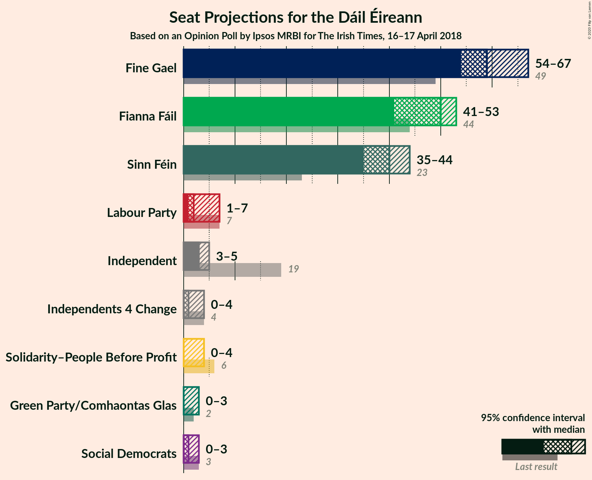
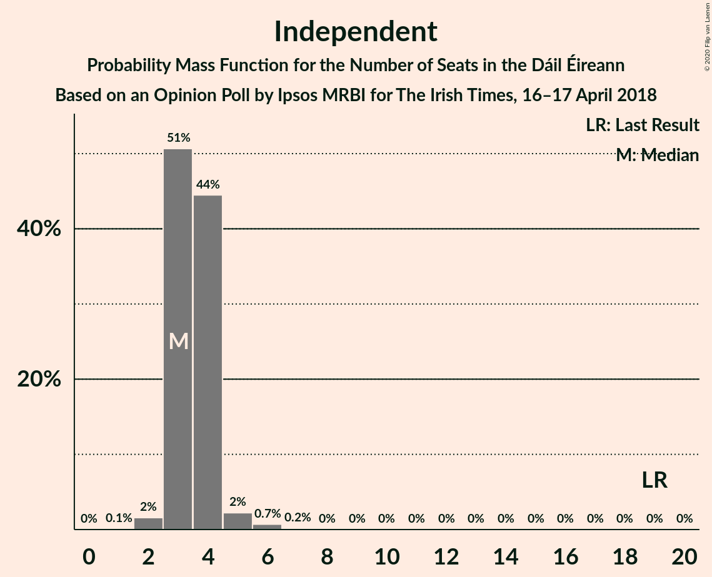
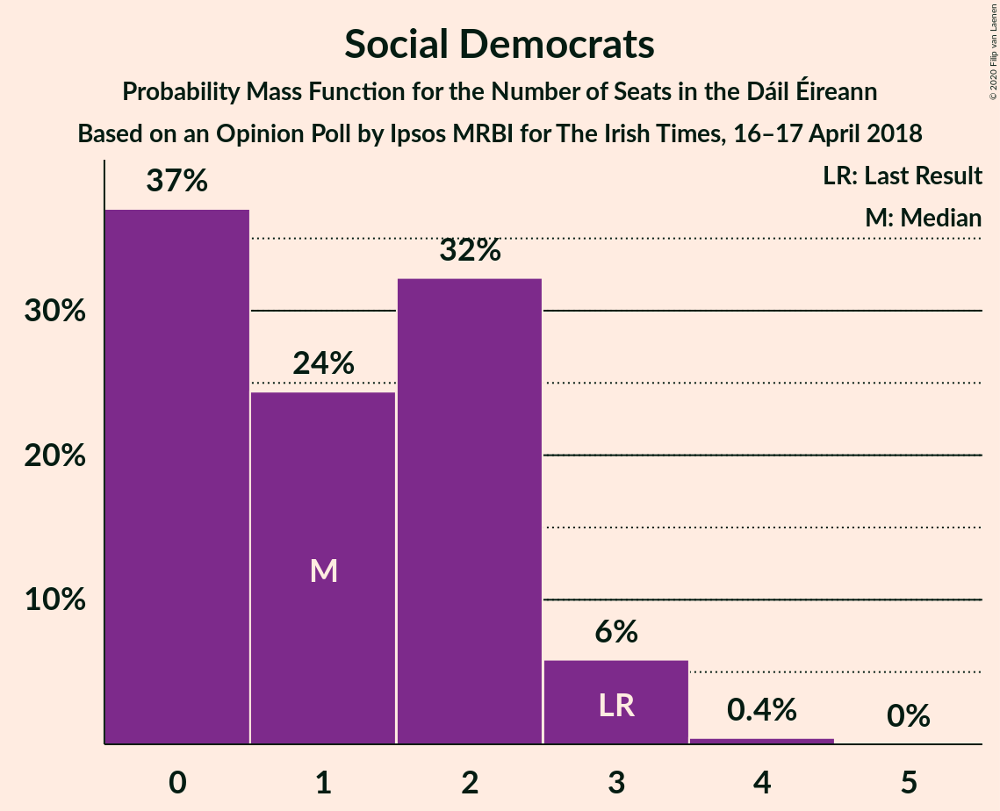
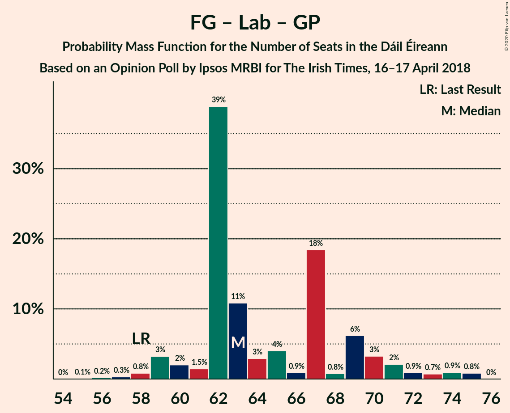

# Opinion Poll by Ipsos MRBI for The Irish Times, 16–17 April 2018

<a href="#voting-intentions">Voting Intentions</a> | <a href="#seats">Seats</a> | <a href="#coalitions">Coalitions</a> | <a href="#technical-information">Technical Information</a>

## Voting Intentions

### Confidence Intervals

| Party | Last Result | Poll Result | 80% Confidence Interval | 90% Confidence Interval | 95% Confidence Interval | 99% Confidence Interval |
|:-----:|:-----------:|:-----------:|:-----------------------:|:-----------------------:|:-----------------------:|:-----------------------:|
| Fine Gael | 25.5% | 31.0% | 29.3–32.8% |28.9–33.3% |28.4–33.7% |27.6–34.5% |
| Fianna Fáil | 24.3% | 26.0% | 24.4–27.7% |24.0–28.2% |23.6–28.6% |22.8–29.4% |
| Sinn Féin | 13.8% | 22.0% | 20.5–23.6% |20.1–24.1% |19.7–24.4% |19.1–25.2% |
| Independent | 15.9% | 7.6% | 6.7–8.7% |6.4–9.0% |6.2–9.2% |5.8–9.8% |
| Labour Party | 6.6% | 5.0% | 4.3–5.9% |4.1–6.2% |3.9–6.4% |3.6–6.8% |
| Green Party/Comhaontas Glas | 2.7% | 3.0% | 2.5–3.7% |2.3–3.9% |2.2–4.1% |1.9–4.5% |
| Solidarity–People Before Profit | 3.9% | 2.0% | 1.6–2.6% |1.4–2.8% |1.3–3.0% |1.2–3.3% |
| Social Democrats | 3.0% | 1.0% | 0.7–1.5% |0.6–1.6% |0.6–1.8% |0.5–2.0% |
| Independents 4 Change | 1.5% | 0.9% | 0.6–1.4% |0.6–1.5% |0.5–1.6% |0.4–1.9% |

*Note:* The poll result column reflects the actual value used in the calculations. Published results may vary slightly, and in addition be rounded to fewer digits.

## Seats

### Confidence Intervals

| Party | Last Result | Median | 80% Confidence Interval | 90% Confidence Interval | 95% Confidence Interval | 99% Confidence Interval |
|:-----:|:-----------:|:------:|:-----------------------:|:-----------------------:|:-----------------------:|:-----------------------:|
| <a href="#fine-gael">Fine Gael</a> | 49 | 59 | 57–65 |54–66 |54–67 |53–67 |
| <a href="#fianna-fáil">Fianna Fáil</a> | 44 | 50 | 44–53 |42–53 |41–53 |41–54 |
| <a href="#sinn-féin">Sinn Féin</a> | 23 | 40 | 36–42 |35–44 |35–44 |35–45 |
| <a href="#independent">Independent</a> | 19 | 3 | 3–4 |3–4 |3–5 |2–6 |
| <a href="#labour-party">Labour Party</a> | 7 | 2 | 2–7 |2–7 |1–7 |0–8 |
| <a href="#green-party/comhaontas-glas">Green Party/Comhaontas Glas</a> | 2 | 0 | 0–2 |0–2 |0–3 |0–3 |
| <a href="#solidarity–people-before-profit">Solidarity–People Before Profit</a> | 6 | 0 | 0–3 |0–3 |0–4 |0–4 |
| <a href="#social-democrats">Social Democrats</a> | 3 | 1 | 0–2 |0–3 |0–3 |0–3 |
| <a href="#independents-4-change">Independents 4 Change</a> | 4 | 1 | 0–4 |0–4 |0–4 |0–5 |

### Fine Gael

*For a full overview of the results for this party, see the [Fine Gael](party-finegael.html) page.*

| Number of Seats | Probability | Accumulated | Special Marks |
|:---------------:|:-----------:|:-----------:|:-------------:|
| 49 | 0.1% | 100% | Last Result |
| 50 | 0% | 99.9% |  |
| 51 | 0.1% | 99.9% |  |
| 52 | 0.1% | 99.8% |  |
| 53 | 0.4% | 99.7% |  |
| 54 | 5% | 99.4% |  |
| 55 | 1.0% | 95% |  |
| 56 | 2% | 94% |  |
| 57 | 6% | 91% |  |
| 58 | 11% | 85% |  |
| 59 | 28% | 75% | Median |
| 60 | 4% | 47% |  |
| 61 | 9% | 43% |  |
| 62 | 4% | 34% |  |
| 63 | 15% | 30% |  |
| 64 | 0.3% | 15% |  |
| 65 | 5% | 14% |  |
| 66 | 6% | 9% |  |
| 67 | 3% | 3% |  |
| 68 | 0.3% | 0.4% |  |
| 69 | 0% | 0% |  |

### Fianna Fáil

*For a full overview of the results for this party, see the [Fianna Fáil](party-fiannafáil.html) page.*

| Number of Seats | Probability | Accumulated | Special Marks |
|:---------------:|:-----------:|:-----------:|:-------------:|
| 39 | 0% | 100% |  |
| 40 | 0.3% | 99.9% |  |
| 41 | 3% | 99.6% |  |
| 42 | 3% | 97% |  |
| 43 | 2% | 94% |  |
| 44 | 6% | 92% | Last Result |
| 45 | 4% | 86% |  |
| 46 | 16% | 82% |  |
| 47 | 1.2% | 67% |  |
| 48 | 12% | 66% |  |
| 49 | 2% | 53% |  |
| 50 | 3% | 51% | Median |
| 51 | 29% | 48% |  |
| 52 | 8% | 18% |  |
| 53 | 9% | 10% |  |
| 54 | 0.8% | 1.3% |  |
| 55 | 0.2% | 0.4% |  |
| 56 | 0.2% | 0.3% |  |
| 57 | 0% | 0.1% |  |
| 58 | 0.1% | 0.1% |  |
| 59 | 0% | 0% |  |

### Sinn Féin

*For a full overview of the results for this party, see the [Sinn Féin](party-sinnféin.html) page.*

| Number of Seats | Probability | Accumulated | Special Marks |
|:---------------:|:-----------:|:-----------:|:-------------:|
| 23 | 0% | 100% | Last Result |
| 24 | 0% | 100% |  |
| 25 | 0% | 100% |  |
| 26 | 0% | 100% |  |
| 27 | 0% | 100% |  |
| 28 | 0% | 100% |  |
| 29 | 0% | 100% |  |
| 30 | 0% | 100% |  |
| 31 | 0% | 100% |  |
| 32 | 0% | 100% |  |
| 33 | 0% | 100% |  |
| 34 | 0.3% | 100% |  |
| 35 | 8% | 99.7% |  |
| 36 | 3% | 92% |  |
| 37 | 4% | 89% |  |
| 38 | 19% | 85% |  |
| 39 | 6% | 66% |  |
| 40 | 16% | 59% | Median |
| 41 | 4% | 43% |  |
| 42 | 31% | 40% |  |
| 43 | 2% | 9% |  |
| 44 | 5% | 7% |  |
| 45 | 1.1% | 1.3% |  |
| 46 | 0.1% | 0.2% |  |
| 47 | 0% | 0% |  |

### Independent

*For a full overview of the results for this party, see the [Independent](party-independent.html) page.*

| Number of Seats | Probability | Accumulated | Special Marks |
|:---------------:|:-----------:|:-----------:|:-------------:|
| 1 | 0.1% | 100% |  |
| 2 | 2% | 99.9% |  |
| 3 | 51% | 98% | Median |
| 4 | 44% | 48% |  |
| 5 | 2% | 3% |  |
| 6 | 0.7% | 0.9% |  |
| 7 | 0.2% | 0.2% |  |
| 8 | 0% | 0% |  |
| 9 | 0% | 0% |  |
| 10 | 0% | 0% |  |
| 11 | 0% | 0% |  |
| 12 | 0% | 0% |  |
| 13 | 0% | 0% |  |
| 14 | 0% | 0% |  |
| 15 | 0% | 0% |  |
| 16 | 0% | 0% |  |
| 17 | 0% | 0% |  |
| 18 | 0% | 0% |  |
| 19 | 0% | 0% | Last Result |

### Labour Party

*For a full overview of the results for this party, see the [Labour Party](party-labourparty.html) page.*

| Number of Seats | Probability | Accumulated | Special Marks |
|:---------------:|:-----------:|:-----------:|:-------------:|
| 0 | 1.0% | 100% |  |
| 1 | 3% | 99.0% |  |
| 2 | 47% | 96% | Median |
| 3 | 32% | 50% |  |
| 4 | 0.6% | 18% |  |
| 5 | 0.8% | 17% |  |
| 6 | 3% | 16% |  |
| 7 | 12% | 13% | Last Result |
| 8 | 0.7% | 0.9% |  |
| 9 | 0.2% | 0.2% |  |
| 10 | 0% | 0% |  |

### Green Party/Comhaontas Glas

*For a full overview of the results for this party, see the [Green Party/Comhaontas Glas](party-greenpartycomhaontasglas.html) page.*

| Number of Seats | Probability | Accumulated | Special Marks |
|:---------------:|:-----------:|:-----------:|:-------------:|
| 0 | 51% | 100% | Median |
| 1 | 10% | 49% |  |
| 2 | 36% | 39% | Last Result |
| 3 | 3% | 3% |  |
| 4 | 0% | 0.1% |  |
| 5 | 0.1% | 0.1% |  |
| 6 | 0% | 0% |  |

### Solidarity–People Before Profit

*For a full overview of the results for this party, see the [Solidarity–People Before Profit](party-solidarity–peoplebeforeprofit.html) page.*

| Number of Seats | Probability | Accumulated | Special Marks |
|:---------------:|:-----------:|:-----------:|:-------------:|
| 0 | 59% | 100% | Median |
| 1 | 19% | 41% |  |
| 2 | 9% | 22% |  |
| 3 | 9% | 13% |  |
| 4 | 4% | 4% |  |
| 5 | 0% | 0% |  |
| 6 | 0% | 0% | Last Result |

### Social Democrats

*For a full overview of the results for this party, see the [Social Democrats](party-socialdemocrats.html) page.*

| Number of Seats | Probability | Accumulated | Special Marks |
|:---------------:|:-----------:|:-----------:|:-------------:|
| 0 | 37% | 100% |  |
| 1 | 24% | 63% | Median |
| 2 | 32% | 39% |  |
| 3 | 6% | 6% | Last Result |
| 4 | 0.4% | 0.4% |  |
| 5 | 0% | 0% |  |

### Independents 4 Change

*For a full overview of the results for this party, see the [Independents 4 Change](party-independents4change.html) page.*

| Number of Seats | Probability | Accumulated | Special Marks |
|:---------------:|:-----------:|:-----------:|:-------------:|
| 0 | 50% | 100% |  |
| 1 | 17% | 50% | Median |
| 2 | 3% | 33% |  |
| 3 | 10% | 31% |  |
| 4 | 20% | 21% | Last Result |
| 5 | 0.8% | 0.8% |  |
| 6 | 0% | 0% |  |

## Coalitions

### Confidence Intervals

| Coalition | Last Result | Median | Majority? | 80% Confidence Interval | 90% Confidence Interval | 95% Confidence Interval | 99% Confidence Interval |
|:---------:|:-----------:|:------:|:---------:|:-----------------------:|:-----------------------:|:-----------------------:|:-----------------------:|
| Fine Gael – Fianna Fáil | 93 | 109 | 100% | 106–113 | 104–114 | 103–114 | 101–115 |
| Fianna Fáil – Sinn Féin | 67 | 88 | 97% | 84–93 | 82–94 | 80–95 | 79–96 |
| Fine Gael – Labour Party – Green Party/Comhaontas Glas – Social Democrats | 61 | 64 | 0% | 63–70 | 60–72 | 59–73 | 58–75 |
| Fine Gael – Labour Party – Green Party/Comhaontas Glas | 58 | 63 | 0% | 62–69 | 60–71 | 59–72 | 57–75 |
| Fine Gael – Labour Party | 56 | 62 | 0% | 60–68 | 59–69 | 58–72 | 56–73 |
| Fine Gael – Green Party/Comhaontas Glas | 51 | 60 | 0% | 57–67 | 56–67 | 55–68 | 54–69 |
| Fine Gael | 49 | 59 | 0% | 57–65 | 54–66 | 54–67 | 53–67 |
| Fianna Fáil – Labour Party – Green Party/Comhaontas Glas – Social Democrats | 56 | 55 | 0% | 49–58 | 47–60 | 46–61 | 44–62 |
| Fianna Fáil – Labour Party – Green Party/Comhaontas Glas | 53 | 54 | 0% | 47–56 | 47–59 | 45–60 | 44–60 |
| Fianna Fáil – Labour Party | 51 | 53 | 0% | 46–55 | 46–57 | 44–59 | 43–59 |
| Fianna Fáil – Green Party/Comhaontas Glas | 46 | 50 | 0% | 45–53 | 43–53 | 43–54 | 42–55 |

### Fine Gael – Fianna Fáil

| Number of Seats | Probability | Accumulated | Special Marks |
|:---------------:|:-----------:|:-----------:|:-------------:|
| 93 | 0% | 100% | Last Result |
| 94 | 0% | 100% |  |
| 95 | 0% | 100% |  |
| 96 | 0% | 100% |  |
| 97 | 0% | 100% |  |
| 98 | 0% | 100% |  |
| 99 | 0% | 100% |  |
| 100 | 0.1% | 99.9% |  |
| 101 | 0.4% | 99.8% |  |
| 102 | 2% | 99.4% |  |
| 103 | 1.1% | 98% |  |
| 104 | 2% | 97% |  |
| 105 | 2% | 94% |  |
| 106 | 15% | 93% |  |
| 107 | 4% | 78% |  |
| 108 | 9% | 74% |  |
| 109 | 17% | 65% | Median |
| 110 | 31% | 48% |  |
| 111 | 4% | 17% |  |
| 112 | 2% | 13% |  |
| 113 | 0.9% | 11% |  |
| 114 | 7% | 10% |  |
| 115 | 2% | 2% |  |
| 116 | 0% | 0% |  |

### Fianna Fáil – Sinn Féin

| Number of Seats | Probability | Accumulated | Special Marks |
|:---------------:|:-----------:|:-----------:|:-------------:|
| 67 | 0% | 100% | Last Result |
| 68 | 0% | 100% |  |
| 69 | 0% | 100% |  |
| 70 | 0% | 100% |  |
| 71 | 0% | 100% |  |
| 72 | 0% | 100% |  |
| 73 | 0% | 100% |  |
| 74 | 0% | 100% |  |
| 75 | 0% | 100% |  |
| 76 | 0% | 100% |  |
| 77 | 0% | 100% |  |
| 78 | 0.3% | 99.9% |  |
| 79 | 0.7% | 99.6% |  |
| 80 | 2% | 99.0% |  |
| 81 | 1.3% | 97% | Majority |
| 82 | 2% | 96% |  |
| 83 | 0.9% | 94% |  |
| 84 | 19% | 93% |  |
| 85 | 3% | 74% |  |
| 86 | 5% | 71% |  |
| 87 | 2% | 66% |  |
| 88 | 19% | 64% |  |
| 89 | 5% | 45% |  |
| 90 | 3% | 40% | Median |
| 91 | 2% | 36% |  |
| 92 | 1.0% | 34% |  |
| 93 | 26% | 33% |  |
| 94 | 4% | 7% |  |
| 95 | 3% | 3% |  |
| 96 | 0.2% | 0.6% |  |
| 97 | 0.2% | 0.4% |  |
| 98 | 0.1% | 0.2% |  |
| 99 | 0.1% | 0.1% |  |
| 100 | 0% | 0% |  |

### Fine Gael – Labour Party – Green Party/Comhaontas Glas – Social Democrats

| Number of Seats | Probability | Accumulated | Special Marks |
|:---------------:|:-----------:|:-----------:|:-------------:|
| 55 | 0.1% | 100% |  |
| 56 | 0.1% | 99.9% |  |
| 57 | 0.3% | 99.8% |  |
| 58 | 0.3% | 99.5% |  |
| 59 | 3% | 99.2% |  |
| 60 | 1.2% | 96% |  |
| 61 | 0.8% | 95% | Last Result |
| 62 | 2% | 94% | Median |
| 63 | 16% | 92% |  |
| 64 | 34% | 76% |  |
| 65 | 4% | 42% |  |
| 66 | 2% | 38% |  |
| 67 | 18% | 37% |  |
| 68 | 0.8% | 19% |  |
| 69 | 3% | 18% |  |
| 70 | 6% | 15% |  |
| 71 | 4% | 10% |  |
| 72 | 2% | 5% |  |
| 73 | 0.6% | 3% |  |
| 74 | 0.9% | 2% |  |
| 75 | 1.1% | 2% |  |
| 76 | 0.3% | 0.5% |  |
| 77 | 0.2% | 0.2% |  |
| 78 | 0% | 0% |  |

### Fine Gael – Labour Party – Green Party/Comhaontas Glas

| Number of Seats | Probability | Accumulated | Special Marks |
|:---------------:|:-----------:|:-----------:|:-------------:|
| 55 | 0.1% | 100% |  |
| 56 | 0.2% | 99.9% |  |
| 57 | 0.3% | 99.7% |  |
| 58 | 0.8% | 99.4% | Last Result |
| 59 | 3% | 98.5% |  |
| 60 | 2% | 95% |  |
| 61 | 1.5% | 93% | Median |
| 62 | 39% | 92% |  |
| 63 | 11% | 53% |  |
| 64 | 3% | 42% |  |
| 65 | 4% | 39% |  |
| 66 | 0.9% | 35% |  |
| 67 | 18% | 34% |  |
| 68 | 0.8% | 16% |  |
| 69 | 6% | 15% |  |
| 70 | 3% | 9% |  |
| 71 | 2% | 5% |  |
| 72 | 0.9% | 3% |  |
| 73 | 0.7% | 2% |  |
| 74 | 0.9% | 2% |  |
| 75 | 0.8% | 0.8% |  |
| 76 | 0% | 0% |  |

### Fine Gael – Labour Party

| Number of Seats | Probability | Accumulated | Special Marks |
|:---------------:|:-----------:|:-----------:|:-------------:|
| 54 | 0.2% | 100% |  |
| 55 | 0.3% | 99.8% |  |
| 56 | 0.5% | 99.5% | Last Result |
| 57 | 0.3% | 99.1% |  |
| 58 | 2% | 98.8% |  |
| 59 | 3% | 97% |  |
| 60 | 10% | 93% |  |
| 61 | 6% | 84% | Median |
| 62 | 28% | 77% |  |
| 63 | 11% | 49% |  |
| 64 | 4% | 39% |  |
| 65 | 15% | 35% |  |
| 66 | 0.8% | 20% |  |
| 67 | 5% | 19% |  |
| 68 | 7% | 14% |  |
| 69 | 3% | 8% |  |
| 70 | 2% | 5% |  |
| 71 | 0.4% | 3% |  |
| 72 | 2% | 3% |  |
| 73 | 0.8% | 0.8% |  |
| 74 | 0% | 0.1% |  |
| 75 | 0.1% | 0.1% |  |
| 76 | 0% | 0% |  |

### Fine Gael – Green Party/Comhaontas Glas

| Number of Seats | Probability | Accumulated | Special Marks |
|:---------------:|:-----------:|:-----------:|:-------------:|
| 51 | 0.1% | 100% | Last Result |
| 52 | 0.1% | 99.9% |  |
| 53 | 0.1% | 99.9% |  |
| 54 | 0.2% | 99.7% |  |
| 55 | 4% | 99.5% |  |
| 56 | 2% | 96% |  |
| 57 | 4% | 94% |  |
| 58 | 2% | 89% |  |
| 59 | 29% | 87% | Median |
| 60 | 12% | 58% |  |
| 61 | 10% | 46% |  |
| 62 | 4% | 35% |  |
| 63 | 2% | 32% |  |
| 64 | 1.4% | 30% |  |
| 65 | 16% | 28% |  |
| 66 | 1.3% | 12% |  |
| 67 | 6% | 11% |  |
| 68 | 3% | 5% |  |
| 69 | 2% | 2% |  |
| 70 | 0.2% | 0.3% |  |
| 71 | 0.1% | 0.1% |  |
| 72 | 0% | 0% |  |

### Fine Gael

| Number of Seats | Probability | Accumulated | Special Marks |
|:---------------:|:-----------:|:-----------:|:-------------:|
| 49 | 0.1% | 100% | Last Result |
| 50 | 0% | 99.9% |  |
| 51 | 0.1% | 99.9% |  |
| 52 | 0.1% | 99.8% |  |
| 53 | 0.4% | 99.7% |  |
| 54 | 5% | 99.4% |  |
| 55 | 1.0% | 95% |  |
| 56 | 2% | 94% |  |
| 57 | 6% | 91% |  |
| 58 | 11% | 85% |  |
| 59 | 28% | 75% | Median |
| 60 | 4% | 47% |  |
| 61 | 9% | 43% |  |
| 62 | 4% | 34% |  |
| 63 | 15% | 30% |  |
| 64 | 0.3% | 15% |  |
| 65 | 5% | 14% |  |
| 66 | 6% | 9% |  |
| 67 | 3% | 3% |  |
| 68 | 0.3% | 0.4% |  |
| 69 | 0% | 0% |  |

### Fianna Fáil – Labour Party – Green Party/Comhaontas Glas – Social Democrats

| Number of Seats | Probability | Accumulated | Special Marks |
|:---------------:|:-----------:|:-----------:|:-------------:|
| 43 | 0.1% | 100% |  |
| 44 | 0.8% | 99.9% |  |
| 45 | 1.4% | 99.1% |  |
| 46 | 1.4% | 98% |  |
| 47 | 2% | 96% |  |
| 48 | 1.0% | 94% |  |
| 49 | 5% | 93% |  |
| 50 | 14% | 88% |  |
| 51 | 1.3% | 73% |  |
| 52 | 3% | 72% |  |
| 53 | 15% | 69% | Median |
| 54 | 2% | 54% |  |
| 55 | 5% | 52% |  |
| 56 | 33% | 47% | Last Result |
| 57 | 4% | 14% |  |
| 58 | 4% | 10% |  |
| 59 | 1.1% | 6% |  |
| 60 | 0.7% | 5% |  |
| 61 | 4% | 5% |  |
| 62 | 0.6% | 0.7% |  |
| 63 | 0.1% | 0.1% |  |
| 64 | 0% | 0.1% |  |
| 65 | 0% | 0% |  |

### Fianna Fáil – Labour Party – Green Party/Comhaontas Glas

| Number of Seats | Probability | Accumulated | Special Marks |
|:---------------:|:-----------:|:-----------:|:-------------:|
| 42 | 0.1% | 100% |  |
| 43 | 0.1% | 99.9% |  |
| 44 | 0.8% | 99.8% |  |
| 45 | 2% | 99.0% |  |
| 46 | 2% | 97% |  |
| 47 | 5% | 95% |  |
| 48 | 2% | 90% |  |
| 49 | 2% | 88% |  |
| 50 | 15% | 87% |  |
| 51 | 2% | 72% |  |
| 52 | 12% | 70% | Median |
| 53 | 7% | 58% | Last Result |
| 54 | 26% | 51% |  |
| 55 | 15% | 25% |  |
| 56 | 3% | 11% |  |
| 57 | 2% | 7% |  |
| 58 | 0.5% | 6% |  |
| 59 | 0.8% | 5% |  |
| 60 | 4% | 4% |  |
| 61 | 0.2% | 0.3% |  |
| 62 | 0.1% | 0.1% |  |
| 63 | 0% | 0% |  |

### Fianna Fáil – Labour Party

| Number of Seats | Probability | Accumulated | Special Marks |
|:---------------:|:-----------:|:-----------:|:-------------:|
| 40 | 0.1% | 100% |  |
| 41 | 0% | 99.9% |  |
| 42 | 0.1% | 99.9% |  |
| 43 | 2% | 99.8% |  |
| 44 | 1.2% | 98% |  |
| 45 | 2% | 97% |  |
| 46 | 6% | 95% |  |
| 47 | 2% | 90% |  |
| 48 | 15% | 88% |  |
| 49 | 2% | 73% |  |
| 50 | 10% | 71% |  |
| 51 | 3% | 61% | Last Result |
| 52 | 4% | 58% | Median |
| 53 | 7% | 55% |  |
| 54 | 27% | 48% |  |
| 55 | 13% | 21% |  |
| 56 | 2% | 7% |  |
| 57 | 0.9% | 5% |  |
| 58 | 0.5% | 5% |  |
| 59 | 4% | 4% |  |
| 60 | 0.2% | 0.3% |  |
| 61 | 0.1% | 0.1% |  |
| 62 | 0% | 0% |  |

### Fianna Fáil – Green Party/Comhaontas Glas

| Number of Seats | Probability | Accumulated | Special Marks |
|:---------------:|:-----------:|:-----------:|:-------------:|
| 40 | 0.1% | 100% |  |
| 41 | 0.2% | 99.9% |  |
| 42 | 1.0% | 99.7% |  |
| 43 | 4% | 98.7% |  |
| 44 | 4% | 95% |  |
| 45 | 5% | 91% |  |
| 46 | 2% | 86% | Last Result |
| 47 | 3% | 84% |  |
| 48 | 17% | 81% |  |
| 49 | 2% | 64% |  |
| 50 | 12% | 62% | Median |
| 51 | 28% | 50% |  |
| 52 | 4% | 22% |  |
| 53 | 15% | 18% |  |
| 54 | 1.1% | 3% |  |
| 55 | 2% | 2% |  |
| 56 | 0.1% | 0.4% |  |
| 57 | 0.1% | 0.3% |  |
| 58 | 0.1% | 0.2% |  |
| 59 | 0.1% | 0.1% |  |
| 60 | 0% | 0% |  |

## Technical Information

### Opinion Poll

+ **Polling firm:** Ipsos MRBI
+ **Commissioner(s):** The Irish Times
+ **Fieldwork period:** 16–17 April 2018

### Calculations

+ **Sample size:** 1200
+ **Simulations done:** 131,072
+ **Error estimate:** 1.57%

