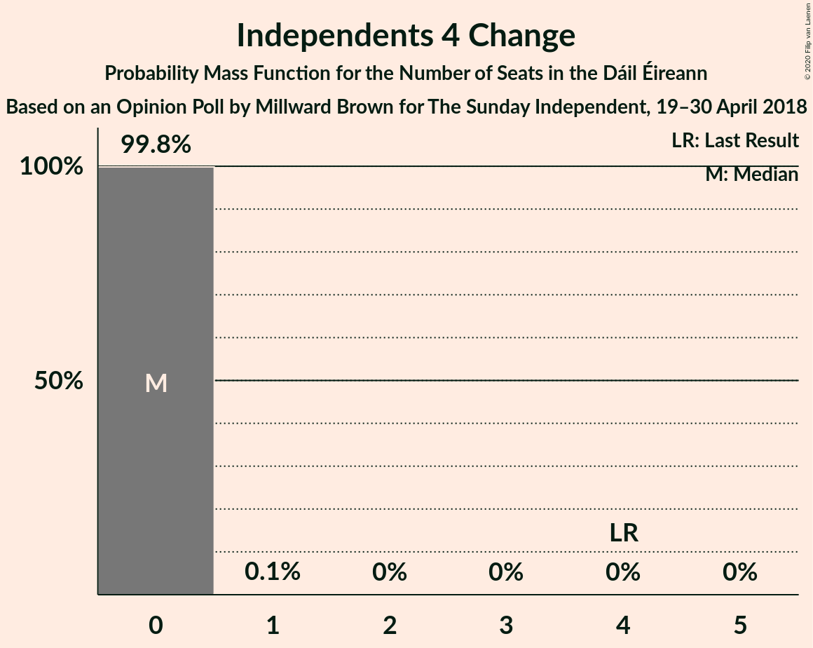
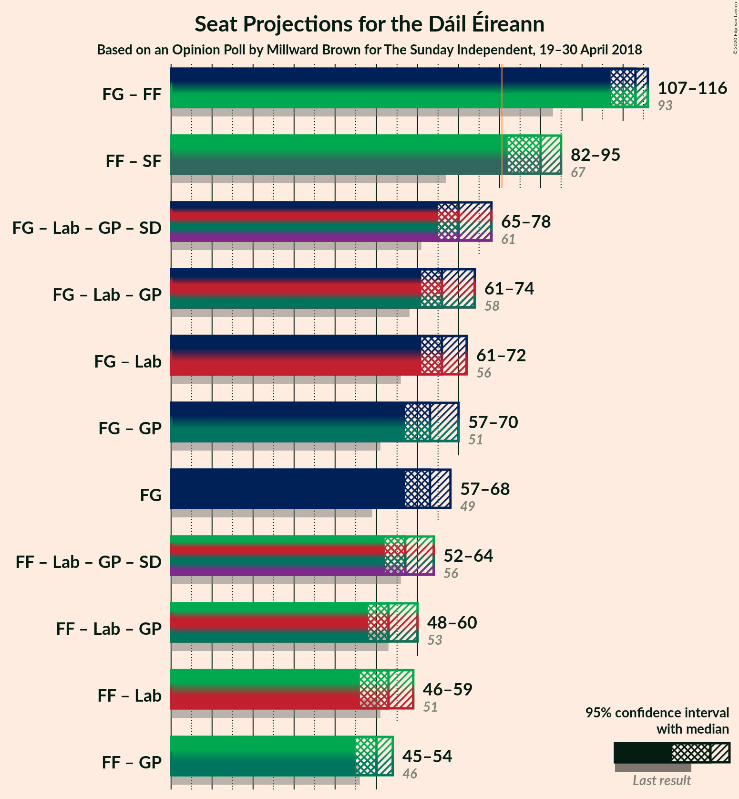
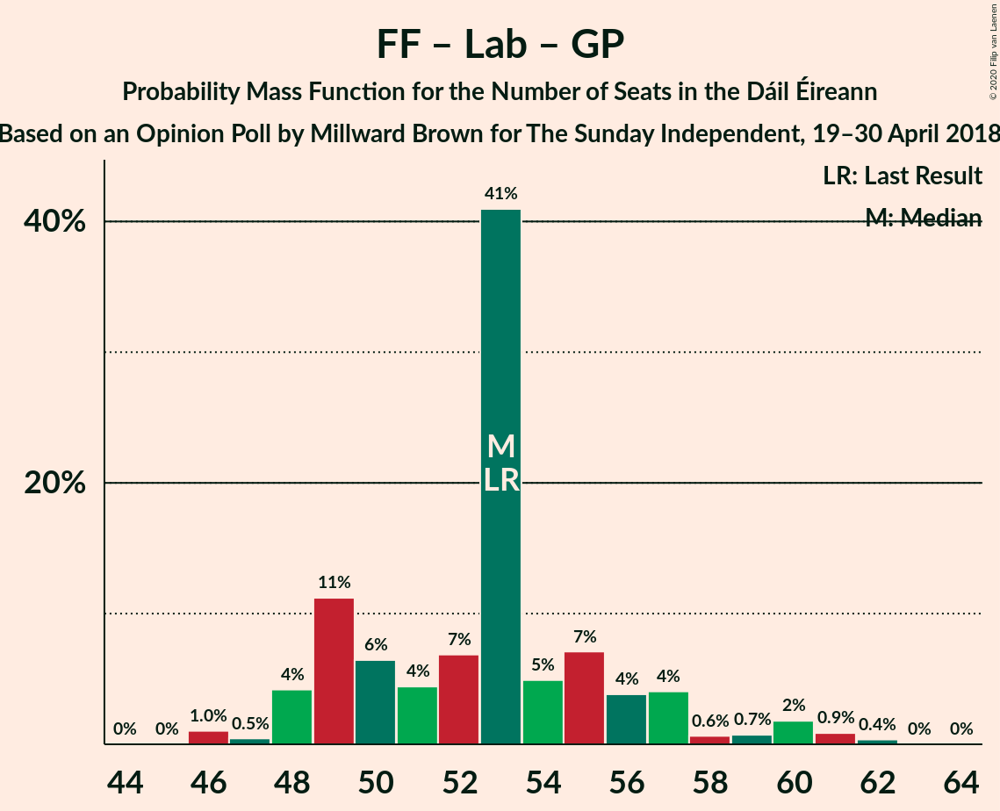

# Opinion Poll by Millward Brown for The Sunday Independent, 19–30 April 2018

<a href="#voting-intentions">Voting Intentions</a> | <a href="#seats">Seats</a> | <a href="#coalitions">Coalitions</a> | <a href="#technical-information">Technical Information</a>

## Voting Intentions

### Confidence Intervals

| Party | Last Result | Poll Result | 80% Confidence Interval | 90% Confidence Interval | 95% Confidence Interval | 99% Confidence Interval |
|:-----:|:-----------:|:-----------:|:-----------------------:|:-----------------------:|:-----------------------:|:-----------------------:|
| Fine Gael | 25.5% | 34.3% | 32.4–36.3% |31.9–36.8% |31.4–37.3% |30.5–38.2% |
| Fianna Fáil | 24.3% | 27.3% | 25.6–29.2% |25.1–29.7% |24.6–30.2% |23.8–31.1% |
| Sinn Féin | 13.8% | 22.2% | 20.6–24.0% |20.1–24.5% |19.8–24.9% |19.0–25.8% |
| Labour Party | 6.6% | 5.1% | 4.3–6.1% |4.1–6.4% |3.9–6.6% |3.5–7.1% |
| Green Party/Comhaontas Glas | 2.7% | 3.0% | 2.4–3.8% |2.2–4.0% |2.1–4.3% |1.8–4.7% |
| Independent | 15.9% | 1.7% | 1.3–2.3% |1.2–2.5% |1.1–2.7% |0.9–3.0% |
| Solidarity–People Before Profit | 3.9% | 1.0% | 0.7–1.5% |0.6–1.7% |0.5–1.8% |0.4–2.1% |
| Independents 4 Change | 1.5% | 0.2% | 0.1–0.5% |0.1–0.6% |0.1–0.7% |0.0–0.9% |

*Note:* The poll result column reflects the actual value used in the calculations. Published results may vary slightly, and in addition be rounded to fewer digits.

## Seats

### Confidence Intervals

| Party | Last Result | Median | 80% Confidence Interval | 90% Confidence Interval | 95% Confidence Interval | 99% Confidence Interval |
|:-----:|:-----------:|:------:|:-----------------------:|:-----------------------:|:-----------------------:|:-----------------------:|
| <a href="#fine-gael">Fine Gael</a> | 49 | 63 | 60–66 |58–68 |57–68 |55–69 |
| <a href="#fianna-fáil">Fianna Fáil</a> | 44 | 50 | 45–52 |44–53 |43–54 |43–55 |
| <a href="#sinn-féin">Sinn Féin</a> | 23 | 40 | 38–42 |38–45 |37–45 |36–46 |
| <a href="#labour-party">Labour Party</a> | 7 | 3 | 3–6 |1–7 |0–7 |0–9 |
| <a href="#green-party/comhaontas-glas">Green Party/Comhaontas Glas</a> | 2 | 0 | 0–2 |0–3 |0–3 |0–3 |
| <a href="#independent">Independent</a> | 19 | 0 | 0 |0 |0 |0 |
| <a href="#solidarity–people-before-profit">Solidarity–People Before Profit</a> | 6 | 0 | 0 |0 |0 |0–1 |
| <a href="#independents-4-change">Independents 4 Change</a> | 4 | 0 | 0 |0 |0 |0 |

### Fine Gael

*For a full overview of the results for this party, see the [Fine Gael](party-finegael.html) page.*

| Number of Seats | Probability | Accumulated | Special Marks |
|:---------------:|:-----------:|:-----------:|:-------------:|
| 49 | 0% | 100% | Last Result |
| 50 | 0% | 100% |  |
| 51 | 0% | 100% |  |
| 52 | 0% | 100% |  |
| 53 | 0% | 100% |  |
| 54 | 0.2% | 100% |  |
| 55 | 0.4% | 99.8% |  |
| 56 | 0.7% | 99.4% |  |
| 57 | 3% | 98.7% |  |
| 58 | 2% | 96% |  |
| 59 | 3% | 94% |  |
| 60 | 3% | 90% |  |
| 61 | 10% | 87% |  |
| 62 | 2% | 77% |  |
| 63 | 40% | 75% | Median |
| 64 | 5% | 35% |  |
| 65 | 3% | 30% |  |
| 66 | 18% | 26% |  |
| 67 | 3% | 9% |  |
| 68 | 4% | 5% |  |
| 69 | 1.4% | 1.5% |  |
| 70 | 0% | 0% |  |

### Fianna Fáil

*For a full overview of the results for this party, see the [Fianna Fáil](party-fiannafáil.html) page.*

| Number of Seats | Probability | Accumulated | Special Marks |
|:---------------:|:-----------:|:-----------:|:-------------:|
| 41 | 0.1% | 100% |  |
| 42 | 0.4% | 99.9% |  |
| 43 | 3% | 99.6% |  |
| 44 | 2% | 97% | Last Result |
| 45 | 11% | 95% |  |
| 46 | 12% | 84% |  |
| 47 | 8% | 72% |  |
| 48 | 6% | 64% |  |
| 49 | 2% | 58% |  |
| 50 | 39% | 56% | Median |
| 51 | 3% | 17% |  |
| 52 | 4% | 14% |  |
| 53 | 7% | 10% |  |
| 54 | 2% | 3% |  |
| 55 | 0.9% | 1.3% |  |
| 56 | 0.3% | 0.3% |  |
| 57 | 0% | 0.1% |  |
| 58 | 0% | 0% |  |

### Sinn Féin

*For a full overview of the results for this party, see the [Sinn Féin](party-sinnféin.html) page.*

| Number of Seats | Probability | Accumulated | Special Marks |
|:---------------:|:-----------:|:-----------:|:-------------:|
| 23 | 0% | 100% | Last Result |
| 24 | 0% | 100% |  |
| 25 | 0% | 100% |  |
| 26 | 0% | 100% |  |
| 27 | 0% | 100% |  |
| 28 | 0% | 100% |  |
| 29 | 0% | 100% |  |
| 30 | 0% | 100% |  |
| 31 | 0% | 100% |  |
| 32 | 0% | 100% |  |
| 33 | 0% | 100% |  |
| 34 | 0% | 100% |  |
| 35 | 0% | 100% |  |
| 36 | 1.3% | 100% |  |
| 37 | 3% | 98.7% |  |
| 38 | 15% | 96% |  |
| 39 | 8% | 81% |  |
| 40 | 47% | 73% | Median |
| 41 | 12% | 26% |  |
| 42 | 6% | 13% |  |
| 43 | 1.2% | 8% |  |
| 44 | 1.4% | 7% |  |
| 45 | 3% | 5% |  |
| 46 | 2% | 2% |  |
| 47 | 0% | 0% |  |

### Labour Party

*For a full overview of the results for this party, see the [Labour Party](party-labourparty.html) page.*

| Number of Seats | Probability | Accumulated | Special Marks |
|:---------------:|:-----------:|:-----------:|:-------------:|
| 0 | 4% | 100% |  |
| 1 | 4% | 96% |  |
| 2 | 0% | 91% |  |
| 3 | 66% | 91% | Median |
| 4 | 11% | 25% |  |
| 5 | 1.5% | 14% |  |
| 6 | 5% | 12% |  |
| 7 | 6% | 7% | Last Result |
| 8 | 1.2% | 2% |  |
| 9 | 0.5% | 0.6% |  |
| 10 | 0.1% | 0.1% |  |
| 11 | 0% | 0% |  |

### Green Party/Comhaontas Glas

*For a full overview of the results for this party, see the [Green Party/Comhaontas Glas](party-greenpartycomhaontasglas.html) page.*

| Number of Seats | Probability | Accumulated | Special Marks |
|:---------------:|:-----------:|:-----------:|:-------------:|
| 0 | 72% | 100% | Median |
| 1 | 5% | 28% |  |
| 2 | 15% | 23% | Last Result |
| 3 | 7% | 7% |  |
| 4 | 0.1% | 0.1% |  |
| 5 | 0% | 0% |  |

### Independent

*For a full overview of the results for this party, see the [Independent](party-independent.html) page.*

| Number of Seats | Probability | Accumulated | Special Marks |
|:---------------:|:-----------:|:-----------:|:-------------:|
| 0 | 100% | 100% | Median |
| 1 | 0% | 0% |  |
| 2 | 0% | 0% |  |
| 3 | 0% | 0% |  |
| 4 | 0% | 0% |  |
| 5 | 0% | 0% |  |
| 6 | 0% | 0% |  |
| 7 | 0% | 0% |  |
| 8 | 0% | 0% |  |
| 9 | 0% | 0% |  |
| 10 | 0% | 0% |  |
| 11 | 0% | 0% |  |
| 12 | 0% | 0% |  |
| 13 | 0% | 0% |  |
| 14 | 0% | 0% |  |
| 15 | 0% | 0% |  |
| 16 | 0% | 0% |  |
| 17 | 0% | 0% |  |
| 18 | 0% | 0% |  |
| 19 | 0% | 0% | Last Result |

### Solidarity–People Before Profit

*For a full overview of the results for this party, see the [Solidarity–People Before Profit](party-solidarity–peoplebeforeprofit.html) page.*

| Number of Seats | Probability | Accumulated | Special Marks |
|:---------------:|:-----------:|:-----------:|:-------------:|
| 0 | 99.5% | 100% | Median |
| 1 | 0.5% | 0.5% |  |
| 2 | 0% | 0% |  |
| 3 | 0% | 0% |  |
| 4 | 0% | 0% |  |
| 5 | 0% | 0% |  |
| 6 | 0% | 0% | Last Result |

### Independents 4 Change

*For a full overview of the results for this party, see the [Independents 4 Change](party-independents4change.html) page.*

| Number of Seats | Probability | Accumulated | Special Marks |
|:---------------:|:-----------:|:-----------:|:-------------:|
| 0 | 99.8% | 100% | Median |
| 1 | 0.1% | 0.2% |  |
| 2 | 0% | 0% |  |
| 3 | 0% | 0% |  |
| 4 | 0% | 0% | Last Result |

## Coalitions

### Confidence Intervals

| Coalition | Last Result | Median | Majority? | 80% Confidence Interval | 90% Confidence Interval | 95% Confidence Interval | 99% Confidence Interval |
|:---------:|:-----------:|:------:|:---------:|:-----------------------:|:-----------------------:|:-----------------------:|:-----------------------:|
| Fine Gael – Fianna Fáil | 93 | 113 | 100% | 108–114 | 108–115 | 107–116 | 106–119 |
| Fianna Fáil – Sinn Féin | 67 | 90 | 99.8% | 83–92 | 83–94 | 82–95 | 81–96 |
| Fine Gael – Labour Party – Green Party/Comhaontas Glas | 58 | 66 | 0% | 64–73 | 62–73 | 61–74 | 60–75 |
| Fine Gael – Labour Party | 56 | 66 | 0% | 63–70 | 62–71 | 61–72 | 60–73 |
| Fine Gael – Green Party/Comhaontas Glas | 51 | 63 | 0% | 61–69 | 59–69 | 57–70 | 56–71 |
| Fine Gael | 49 | 63 | 0% | 60–66 | 58–68 | 57–68 | 55–69 |
| Fianna Fáil – Labour Party – Green Party/Comhaontas Glas | 53 | 53 | 0% | 49–56 | 48–57 | 48–60 | 46–61 |
| Fianna Fáil – Labour Party | 51 | 53 | 0% | 49–56 | 47–57 | 46–59 | 45–61 |
| Fianna Fáil – Green Party/Comhaontas Glas | 46 | 50 | 0% | 46–53 | 45–53 | 45–54 | 44–57 |

### Fine Gael – Fianna Fáil

| Number of Seats | Probability | Accumulated | Special Marks |
|:---------------:|:-----------:|:-----------:|:-------------:|
| 93 | 0% | 100% | Last Result |
| 94 | 0% | 100% |  |
| 95 | 0% | 100% |  |
| 96 | 0% | 100% |  |
| 97 | 0% | 100% |  |
| 98 | 0% | 100% |  |
| 99 | 0% | 100% |  |
| 100 | 0% | 100% |  |
| 101 | 0% | 100% |  |
| 102 | 0% | 100% |  |
| 103 | 0% | 100% |  |
| 104 | 0.1% | 100% |  |
| 105 | 0.1% | 99.8% |  |
| 106 | 1.2% | 99.7% |  |
| 107 | 3% | 98.5% |  |
| 108 | 7% | 95% |  |
| 109 | 5% | 89% |  |
| 110 | 3% | 83% |  |
| 111 | 14% | 80% |  |
| 112 | 10% | 66% |  |
| 113 | 43% | 56% | Median |
| 114 | 7% | 13% |  |
| 115 | 2% | 6% |  |
| 116 | 3% | 4% |  |
| 117 | 0.4% | 1.2% |  |
| 118 | 0.3% | 0.8% |  |
| 119 | 0.5% | 0.5% |  |
| 120 | 0% | 0% |  |

### Fianna Fáil – Sinn Féin

| Number of Seats | Probability | Accumulated | Special Marks |
|:---------------:|:-----------:|:-----------:|:-------------:|
| 67 | 0% | 100% | Last Result |
| 68 | 0% | 100% |  |
| 69 | 0% | 100% |  |
| 70 | 0% | 100% |  |
| 71 | 0% | 100% |  |
| 72 | 0% | 100% |  |
| 73 | 0% | 100% |  |
| 74 | 0% | 100% |  |
| 75 | 0% | 100% |  |
| 76 | 0% | 100% |  |
| 77 | 0% | 100% |  |
| 78 | 0% | 100% |  |
| 79 | 0% | 100% |  |
| 80 | 0.1% | 100% |  |
| 81 | 0.8% | 99.8% | Majority |
| 82 | 2% | 99.1% |  |
| 83 | 7% | 97% |  |
| 84 | 2% | 89% |  |
| 85 | 2% | 88% |  |
| 86 | 3% | 85% |  |
| 87 | 14% | 82% |  |
| 88 | 5% | 68% |  |
| 89 | 7% | 63% |  |
| 90 | 37% | 56% | Median |
| 91 | 6% | 19% |  |
| 92 | 6% | 13% |  |
| 93 | 2% | 7% |  |
| 94 | 3% | 6% |  |
| 95 | 1.1% | 3% |  |
| 96 | 2% | 2% |  |
| 97 | 0% | 0% |  |

### Fine Gael – Labour Party – Green Party/Comhaontas Glas

| Number of Seats | Probability | Accumulated | Special Marks |
|:---------------:|:-----------:|:-----------:|:-------------:|
| 58 | 0% | 100% | Last Result |
| 59 | 0% | 100% |  |
| 60 | 2% | 100% |  |
| 61 | 1.1% | 98% |  |
| 62 | 3% | 97% |  |
| 63 | 2% | 94% |  |
| 64 | 6% | 93% |  |
| 65 | 6% | 87% |  |
| 66 | 37% | 81% | Median |
| 67 | 7% | 44% |  |
| 68 | 5% | 37% |  |
| 69 | 14% | 32% |  |
| 70 | 3% | 18% |  |
| 71 | 2% | 14% |  |
| 72 | 2% | 12% |  |
| 73 | 7% | 11% |  |
| 74 | 3% | 3% |  |
| 75 | 0.8% | 0.9% |  |
| 76 | 0.1% | 0.2% |  |
| 77 | 0% | 0.1% |  |
| 78 | 0% | 0% |  |

### Fine Gael – Labour Party

| Number of Seats | Probability | Accumulated | Special Marks |
|:---------------:|:-----------:|:-----------:|:-------------:|
| 56 | 0% | 100% | Last Result |
| 57 | 0% | 100% |  |
| 58 | 0.1% | 100% |  |
| 59 | 0.4% | 99.9% |  |
| 60 | 2% | 99.5% |  |
| 61 | 2% | 98% |  |
| 62 | 3% | 95% |  |
| 63 | 3% | 93% |  |
| 64 | 5% | 89% |  |
| 65 | 7% | 85% |  |
| 66 | 39% | 78% | Median |
| 67 | 6% | 39% |  |
| 68 | 3% | 33% |  |
| 69 | 15% | 29% |  |
| 70 | 7% | 14% |  |
| 71 | 3% | 6% |  |
| 72 | 2% | 4% |  |
| 73 | 0.8% | 1.1% |  |
| 74 | 0.2% | 0.3% |  |
| 75 | 0.1% | 0.1% |  |
| 76 | 0% | 0% |  |

### Fine Gael – Green Party/Comhaontas Glas

| Number of Seats | Probability | Accumulated | Special Marks |
|:---------------:|:-----------:|:-----------:|:-------------:|
| 51 | 0% | 100% | Last Result |
| 52 | 0% | 100% |  |
| 53 | 0% | 100% |  |
| 54 | 0.1% | 100% |  |
| 55 | 0.3% | 99.9% |  |
| 56 | 0.3% | 99.6% |  |
| 57 | 2% | 99.3% |  |
| 58 | 2% | 97% |  |
| 59 | 4% | 95% |  |
| 60 | 0.8% | 92% |  |
| 61 | 12% | 91% |  |
| 62 | 2% | 79% |  |
| 63 | 38% | 78% | Median |
| 64 | 3% | 39% |  |
| 65 | 5% | 36% |  |
| 66 | 15% | 31% |  |
| 67 | 3% | 16% |  |
| 68 | 3% | 13% |  |
| 69 | 7% | 11% |  |
| 70 | 3% | 4% |  |
| 71 | 0.4% | 0.6% |  |
| 72 | 0.2% | 0.2% |  |
| 73 | 0% | 0% |  |

### Fine Gael

| Number of Seats | Probability | Accumulated | Special Marks |
|:---------------:|:-----------:|:-----------:|:-------------:|
| 49 | 0% | 100% | Last Result |
| 50 | 0% | 100% |  |
| 51 | 0% | 100% |  |
| 52 | 0% | 100% |  |
| 53 | 0% | 100% |  |
| 54 | 0.2% | 100% |  |
| 55 | 0.4% | 99.8% |  |
| 56 | 0.7% | 99.4% |  |
| 57 | 3% | 98.7% |  |
| 58 | 2% | 96% |  |
| 59 | 3% | 94% |  |
| 60 | 3% | 90% |  |
| 61 | 10% | 87% |  |
| 62 | 2% | 77% |  |
| 63 | 40% | 75% | Median |
| 64 | 5% | 35% |  |
| 65 | 3% | 30% |  |
| 66 | 18% | 26% |  |
| 67 | 3% | 9% |  |
| 68 | 4% | 5% |  |
| 69 | 1.4% | 1.5% |  |
| 70 | 0% | 0% |  |

### Fianna Fáil – Labour Party – Green Party/Comhaontas Glas

| Number of Seats | Probability | Accumulated | Special Marks |
|:---------------:|:-----------:|:-----------:|:-------------:|
| 46 | 1.0% | 100% |  |
| 47 | 0.5% | 98.9% |  |
| 48 | 4% | 98% |  |
| 49 | 11% | 94% |  |
| 50 | 6% | 83% |  |
| 51 | 4% | 77% |  |
| 52 | 7% | 72% |  |
| 53 | 41% | 65% | Last Result, Median |
| 54 | 5% | 24% |  |
| 55 | 7% | 19% |  |
| 56 | 4% | 12% |  |
| 57 | 4% | 9% |  |
| 58 | 0.6% | 4% |  |
| 59 | 0.7% | 4% |  |
| 60 | 2% | 3% |  |
| 61 | 0.9% | 1.3% |  |
| 62 | 0.4% | 0.4% |  |
| 63 | 0% | 0.1% |  |
| 64 | 0% | 0% |  |

### Fianna Fáil – Labour Party

| Number of Seats | Probability | Accumulated | Special Marks |
|:---------------:|:-----------:|:-----------:|:-------------:|
| 45 | 0.5% | 100% |  |
| 46 | 3% | 99.5% |  |
| 47 | 2% | 96% |  |
| 48 | 4% | 94% |  |
| 49 | 15% | 90% |  |
| 50 | 6% | 75% |  |
| 51 | 5% | 69% | Last Result |
| 52 | 4% | 64% |  |
| 53 | 40% | 60% | Median |
| 54 | 5% | 20% |  |
| 55 | 4% | 15% |  |
| 56 | 3% | 11% |  |
| 57 | 4% | 7% |  |
| 58 | 0.4% | 3% |  |
| 59 | 1.0% | 3% |  |
| 60 | 1.3% | 2% |  |
| 61 | 0.5% | 0.5% |  |
| 62 | 0% | 0.1% |  |
| 63 | 0% | 0% |  |

### Fianna Fáil – Green Party/Comhaontas Glas

| Number of Seats | Probability | Accumulated | Special Marks |
|:---------------:|:-----------:|:-----------:|:-------------:|
| 42 | 0% | 100% |  |
| 43 | 0.2% | 99.9% |  |
| 44 | 0.5% | 99.7% |  |
| 45 | 4% | 99.2% |  |
| 46 | 11% | 95% | Last Result |
| 47 | 12% | 84% |  |
| 48 | 11% | 72% |  |
| 49 | 3% | 61% |  |
| 50 | 39% | 59% | Median |
| 51 | 1.4% | 19% |  |
| 52 | 7% | 18% |  |
| 53 | 7% | 11% |  |
| 54 | 2% | 4% |  |
| 55 | 0.6% | 2% |  |
| 56 | 0.5% | 2% |  |
| 57 | 1.1% | 1.1% |  |
| 58 | 0% | 0.1% |  |
| 59 | 0% | 0% |  |

## Technical Information

### Opinion Poll

+ **Polling firm:** Millward Brown
+ **Commissioner(s):** The Sunday Independent
+ **Fieldwork period:** 19–30 April 2018

### Calculations

+ **Sample size:** 1003
+ **Simulations done:** 131,072
+ **Error estimate:** 1.22%

