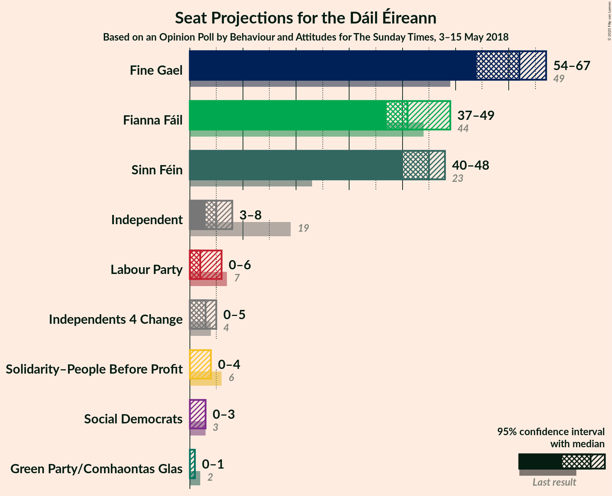
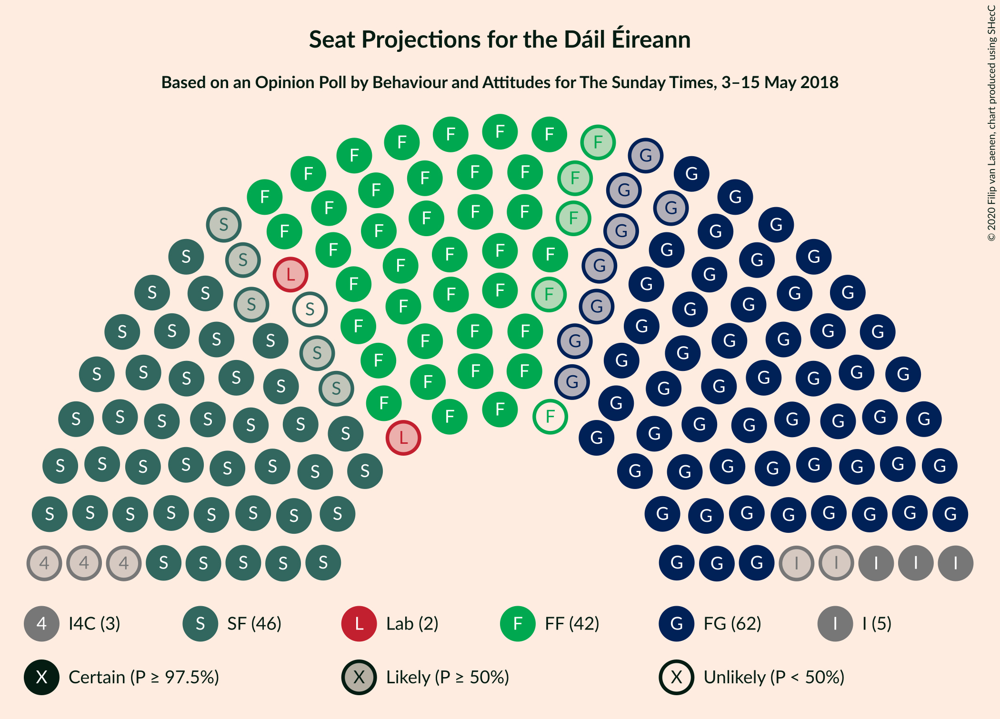
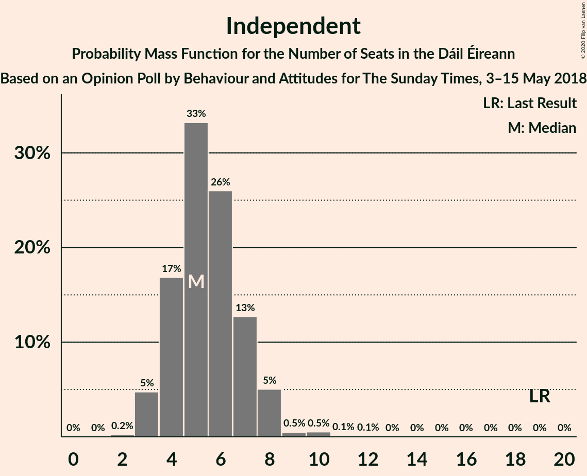
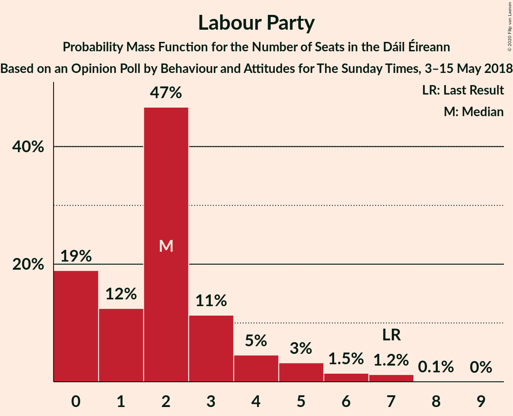
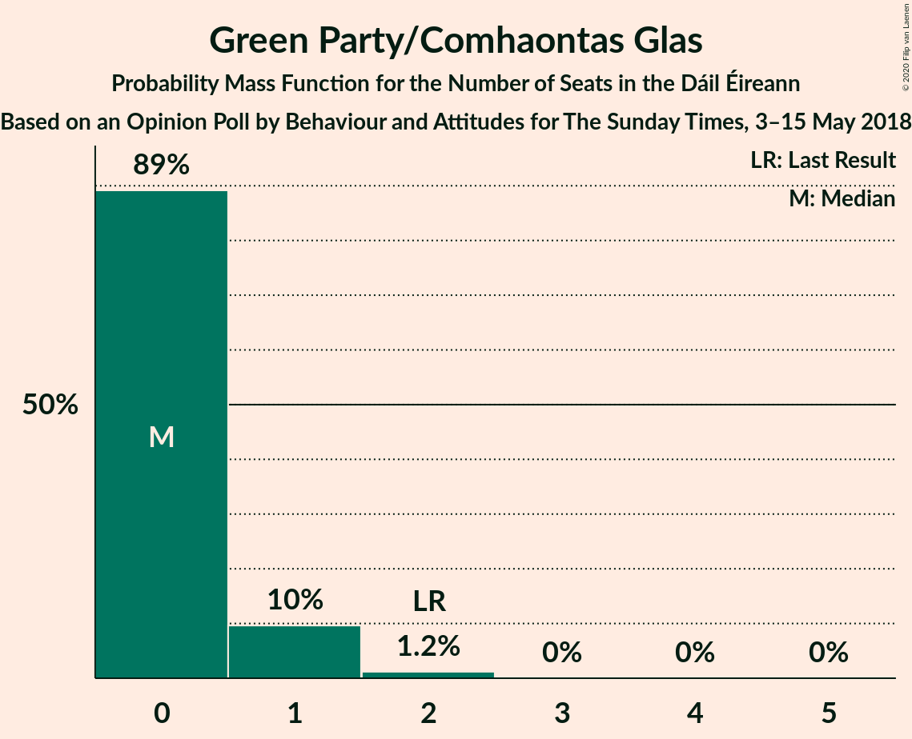
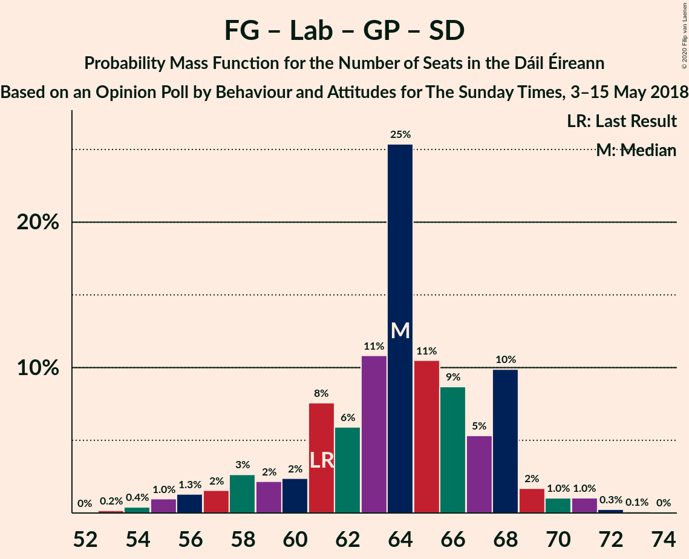

# Opinion Poll by Behaviour and Attitudes for The Sunday Times, 3–15 May 2018

<a href="#voting-intentions">Voting Intentions</a> | <a href="#seats">Seats</a> | <a href="#coalitions">Coalitions</a> | <a href="#technical-information">Technical Information</a>

## Voting Intentions

### Confidence Intervals

| Party | Last Result | Poll Result | 80% Confidence Interval | 90% Confidence Interval | 95% Confidence Interval | 99% Confidence Interval |
|:-----:|:-----------:|:-----------:|:-----------------------:|:-----------------------:|:-----------------------:|:-----------------------:|
| Fine Gael | 25.5% | 30.3% | 28.4–32.3% |27.9–32.8% |27.4–33.3% |26.5–34.3% |
| Sinn Féin | 13.8% | 24.3% | 22.5–26.2% |22.1–26.7% |21.6–27.1% |20.8–28.0% |
| Fianna Fáil | 24.3% | 23.2% | 21.5–25.1% |21.0–25.6% |20.6–26.0% |19.8–26.9% |
| Independent | 15.9% | 8.6% | 7.5–9.8% |7.2–10.2% |6.9–10.5% |6.4–11.2% |
| Labour Party | 6.6% | 4.1% | 3.3–5.0% |3.1–5.3% |3.0–5.5% |2.7–6.0% |
| Solidarity–People Before Profit | 3.9% | 2.0% | 1.6–2.8% |1.4–3.0% |1.3–3.2% |1.1–3.6% |
| Green Party/Comhaontas Glas | 2.7% | 2.0% | 1.6–2.8% |1.4–3.0% |1.3–3.2% |1.1–3.6% |
| Independents 4 Change | 1.5% | 1.1% | 0.7–1.6% |0.7–1.8% |0.6–2.0% |0.5–2.3% |
| Social Democrats | 3.0% | 1.0% | 0.7–1.5% |0.6–1.7% |0.5–1.8% |0.4–2.1% |

*Note:* The poll result column reflects the actual value used in the calculations. Published results may vary slightly, and in addition be rounded to fewer digits.

## Seats

### Confidence Intervals

| Party | Last Result | Median | 80% Confidence Interval | 90% Confidence Interval | 95% Confidence Interval | 99% Confidence Interval |
|:-----:|:-----------:|:------:|:-----------------------:|:-----------------------:|:-----------------------:|:-----------------------:|
| <a href="#fine-gael">Fine Gael</a> | 49 | 62 | 56–67 |54–67 |53–67 |52–68 |
| <a href="#sinn-féin">Sinn Féin</a> | 23 | 44 | 41–46 |40–47 |39–48 |38–49 |
| <a href="#fianna-fáil">Fianna Fáil</a> | 44 | 44 | 38–48 |38–49 |37–49 |36–51 |
| <a href="#independent">Independent</a> | 19 | 5 | 4–7 |3–8 |3–9 |3–10 |
| <a href="#labour-party">Labour Party</a> | 7 | 1 | 0–4 |0–5 |0–6 |0–7 |
| <a href="#solidarity–people-before-profit">Solidarity–People Before Profit</a> | 6 | 0 | 0–3 |0–3 |0–4 |0–4 |
| <a href="#green-party/comhaontas-glas">Green Party/Comhaontas Glas</a> | 2 | 0 | 0–1 |0–1 |0–1 |0–2 |
| <a href="#independents-4-change">Independents 4 Change</a> | 4 | 2 | 0–4 |0–5 |0–5 |0–5 |
| <a href="#social-democrats">Social Democrats</a> | 3 | 0 | 0–3 |0–3 |0–3 |0–4 |

### Fine Gael

*For a full overview of the results for this party, see the [Fine Gael](party-finegael.html) page.*

| Number of Seats | Probability | Accumulated | Special Marks |
|:---------------:|:-----------:|:-----------:|:-------------:|
| 49 | 0% | 100% | Last Result |
| 50 | 0.1% | 99.9% |  |
| 51 | 0.1% | 99.8% |  |
| 52 | 0.3% | 99.7% |  |
| 53 | 4% | 99.5% |  |
| 54 | 1.1% | 96% |  |
| 55 | 2% | 95% |  |
| 56 | 6% | 93% |  |
| 57 | 1.5% | 87% |  |
| 58 | 2% | 86% |  |
| 59 | 20% | 83% |  |
| 60 | 2% | 63% |  |
| 61 | 8% | 60% |  |
| 62 | 16% | 52% | Median |
| 63 | 6% | 36% |  |
| 64 | 6% | 30% |  |
| 65 | 1.3% | 24% |  |
| 66 | 4% | 23% |  |
| 67 | 19% | 19% |  |
| 68 | 0.6% | 0.8% |  |
| 69 | 0.2% | 0.2% |  |
| 70 | 0% | 0% |  |

### Sinn Féin

*For a full overview of the results for this party, see the [Sinn Féin](party-sinnféin.html) page.*

| Number of Seats | Probability | Accumulated | Special Marks |
|:---------------:|:-----------:|:-----------:|:-------------:|
| 23 | 0% | 100% | Last Result |
| 24 | 0% | 100% |  |
| 25 | 0% | 100% |  |
| 26 | 0% | 100% |  |
| 27 | 0% | 100% |  |
| 28 | 0% | 100% |  |
| 29 | 0% | 100% |  |
| 30 | 0% | 100% |  |
| 31 | 0% | 100% |  |
| 32 | 0% | 100% |  |
| 33 | 0% | 100% |  |
| 34 | 0% | 100% |  |
| 35 | 0% | 100% |  |
| 36 | 0% | 100% |  |
| 37 | 0.3% | 99.9% |  |
| 38 | 0.4% | 99.7% |  |
| 39 | 2% | 99.2% |  |
| 40 | 3% | 97% |  |
| 41 | 4% | 94% |  |
| 42 | 17% | 90% |  |
| 43 | 11% | 73% |  |
| 44 | 22% | 62% | Median |
| 45 | 17% | 40% |  |
| 46 | 14% | 23% |  |
| 47 | 5% | 9% |  |
| 48 | 4% | 4% |  |
| 49 | 0.6% | 0.6% |  |
| 50 | 0% | 0% |  |

### Fianna Fáil

*For a full overview of the results for this party, see the [Fianna Fáil](party-fiannafáil.html) page.*

| Number of Seats | Probability | Accumulated | Special Marks |
|:---------------:|:-----------:|:-----------:|:-------------:|
| 35 | 0.1% | 100% |  |
| 36 | 2% | 99.9% |  |
| 37 | 2% | 98% |  |
| 38 | 10% | 96% |  |
| 39 | 7% | 86% |  |
| 40 | 8% | 79% |  |
| 41 | 6% | 71% |  |
| 42 | 3% | 65% |  |
| 43 | 3% | 62% |  |
| 44 | 19% | 59% | Last Result, Median |
| 45 | 17% | 39% |  |
| 46 | 8% | 22% |  |
| 47 | 1.2% | 15% |  |
| 48 | 4% | 13% |  |
| 49 | 8% | 10% |  |
| 50 | 0.3% | 1.2% |  |
| 51 | 0.5% | 0.9% |  |
| 52 | 0.3% | 0.4% |  |
| 53 | 0% | 0.1% |  |
| 54 | 0% | 0.1% |  |
| 55 | 0% | 0.1% |  |
| 56 | 0% | 0% |  |

### Independent

*For a full overview of the results for this party, see the [Independent](party-independent.html) page.*

| Number of Seats | Probability | Accumulated | Special Marks |
|:---------------:|:-----------:|:-----------:|:-------------:|
| 2 | 0.1% | 100% |  |
| 3 | 7% | 99.9% |  |
| 4 | 41% | 93% |  |
| 5 | 23% | 52% | Median |
| 6 | 9% | 29% |  |
| 7 | 13% | 21% |  |
| 8 | 4% | 8% |  |
| 9 | 3% | 4% |  |
| 10 | 1.5% | 2% |  |
| 11 | 0.1% | 0.1% |  |
| 12 | 0% | 0% |  |
| 13 | 0% | 0% |  |
| 14 | 0% | 0% |  |
| 15 | 0% | 0% |  |
| 16 | 0% | 0% |  |
| 17 | 0% | 0% |  |
| 18 | 0% | 0% |  |
| 19 | 0% | 0% | Last Result |

### Labour Party

*For a full overview of the results for this party, see the [Labour Party](party-labourparty.html) page.*

| Number of Seats | Probability | Accumulated | Special Marks |
|:---------------:|:-----------:|:-----------:|:-------------:|
| 0 | 25% | 100% |  |
| 1 | 28% | 75% | Median |
| 2 | 25% | 47% |  |
| 3 | 10% | 23% |  |
| 4 | 7% | 13% |  |
| 5 | 1.0% | 5% |  |
| 6 | 4% | 4% |  |
| 7 | 0.4% | 0.5% | Last Result |
| 8 | 0.1% | 0.1% |  |
| 9 | 0% | 0.1% |  |
| 10 | 0.1% | 0.1% |  |
| 11 | 0% | 0% |  |

### Solidarity–People Before Profit

*For a full overview of the results for this party, see the [Solidarity–People Before Profit](party-solidarity–peoplebeforeprofit.html) page.*

| Number of Seats | Probability | Accumulated | Special Marks |
|:---------------:|:-----------:|:-----------:|:-------------:|
| 0 | 65% | 100% | Median |
| 1 | 15% | 35% |  |
| 2 | 9% | 19% |  |
| 3 | 6% | 10% |  |
| 4 | 4% | 4% |  |
| 5 | 0% | 0.1% |  |
| 6 | 0% | 0% | Last Result |

### Green Party/Comhaontas Glas

*For a full overview of the results for this party, see the [Green Party/Comhaontas Glas](party-greenpartycomhaontasglas.html) page.*

| Number of Seats | Probability | Accumulated | Special Marks |
|:---------------:|:-----------:|:-----------:|:-------------:|
| 0 | 88% | 100% | Median |
| 1 | 10% | 12% |  |
| 2 | 2% | 2% | Last Result |
| 3 | 0% | 0% |  |

### Independents 4 Change

*For a full overview of the results for this party, see the [Independents 4 Change](party-independents4change.html) page.*

| Number of Seats | Probability | Accumulated | Special Marks |
|:---------------:|:-----------:|:-----------:|:-------------:|
| 0 | 18% | 100% |  |
| 1 | 26% | 82% |  |
| 2 | 15% | 57% | Median |
| 3 | 11% | 42% |  |
| 4 | 21% | 31% | Last Result |
| 5 | 10% | 10% |  |
| 6 | 0% | 0% |  |

### Social Democrats

*For a full overview of the results for this party, see the [Social Democrats](party-socialdemocrats.html) page.*

| Number of Seats | Probability | Accumulated | Special Marks |
|:---------------:|:-----------:|:-----------:|:-------------:|
| 0 | 70% | 100% | Median |
| 1 | 10% | 30% |  |
| 2 | 10% | 20% |  |
| 3 | 9% | 10% | Last Result |
| 4 | 1.1% | 1.1% |  |
| 5 | 0% | 0% |  |

## Coalitions

### Confidence Intervals

| Coalition | Last Result | Median | Majority? | 80% Confidence Interval | 90% Confidence Interval | 95% Confidence Interval | 99% Confidence Interval |
|:---------:|:-----------:|:------:|:---------:|:-----------------------:|:-----------------------:|:-----------------------:|:-----------------------:|
| Fine Gael – Fianna Fáil | 93 | 104 | 100% | 99–111 | 99–111 | 98–111 | 95–112 |
| Sinn Féin – Fianna Fáil | 67 | 86 | 97% | 82–92 | 81–93 | 80–94 | 77–95 |
| Fine Gael – Labour Party – Green Party/Comhaontas Glas – Social Democrats | 61 | 64 | 0% | 59–68 | 58–68 | 57–71 | 54–71 |
| Fine Gael – Labour Party – Green Party/Comhaontas Glas | 58 | 63 | 0% | 58–68 | 57–68 | 57–68 | 54–70 |
| Fine Gael – Labour Party | 56 | 63 | 0% | 58–68 | 57–68 | 57–68 | 54–70 |
| Fine Gael | 49 | 62 | 0% | 56–67 | 54–67 | 53–67 | 52–68 |
| Fine Gael – Green Party/Comhaontas Glas | 51 | 62 | 0% | 56–67 | 54–67 | 53–67 | 53–69 |
| Fianna Fáil – Labour Party – Green Party/Comhaontas Glas – Social Democrats | 56 | 45 | 0% | 40–51 | 39–52 | 38–52 | 38–55 |
| Fianna Fáil – Labour Party – Green Party/Comhaontas Glas | 53 | 45 | 0% | 40–49 | 39–50 | 38–51 | 38–55 |
| Fianna Fáil – Labour Party | 51 | 45 | 0% | 40–49 | 38–50 | 38–51 | 38–55 |
| Fianna Fáil – Green Party/Comhaontas Glas | 46 | 44 | 0% | 38–48 | 38–49 | 37–49 | 36–51 |

### Fine Gael – Fianna Fáil

| Number of Seats | Probability | Accumulated | Special Marks |
|:---------------:|:-----------:|:-----------:|:-------------:|
| 91 | 0% | 100% |  |
| 92 | 0% | 99.9% |  |
| 93 | 0% | 99.9% | Last Result |
| 94 | 0.2% | 99.9% |  |
| 95 | 0.2% | 99.7% |  |
| 96 | 1.0% | 99.5% |  |
| 97 | 0.7% | 98.5% |  |
| 98 | 1.4% | 98% |  |
| 99 | 9% | 96% |  |
| 100 | 6% | 88% |  |
| 101 | 9% | 82% |  |
| 102 | 12% | 73% |  |
| 103 | 7% | 61% |  |
| 104 | 13% | 54% |  |
| 105 | 1.3% | 41% |  |
| 106 | 2% | 40% | Median |
| 107 | 4% | 37% |  |
| 108 | 8% | 33% |  |
| 109 | 5% | 25% |  |
| 110 | 2% | 20% |  |
| 111 | 18% | 18% |  |
| 112 | 0.2% | 0.6% |  |
| 113 | 0.3% | 0.5% |  |
| 114 | 0.1% | 0.2% |  |
| 115 | 0% | 0.1% |  |
| 116 | 0% | 0% |  |

### Sinn Féin – Fianna Fáil

| Number of Seats | Probability | Accumulated | Special Marks |
|:---------------:|:-----------:|:-----------:|:-------------:|
| 67 | 0% | 100% | Last Result |
| 68 | 0% | 100% |  |
| 69 | 0% | 100% |  |
| 70 | 0% | 100% |  |
| 71 | 0% | 100% |  |
| 72 | 0% | 100% |  |
| 73 | 0% | 100% |  |
| 74 | 0% | 100% |  |
| 75 | 0% | 100% |  |
| 76 | 0.2% | 100% |  |
| 77 | 0.5% | 99.8% |  |
| 78 | 0.3% | 99.3% |  |
| 79 | 1.1% | 99.1% |  |
| 80 | 0.7% | 98% |  |
| 81 | 3% | 97% | Majority |
| 82 | 9% | 95% |  |
| 83 | 4% | 86% |  |
| 84 | 12% | 81% |  |
| 85 | 6% | 70% |  |
| 86 | 17% | 63% |  |
| 87 | 3% | 46% |  |
| 88 | 3% | 44% | Median |
| 89 | 9% | 40% |  |
| 90 | 8% | 31% |  |
| 91 | 1.3% | 22% |  |
| 92 | 12% | 21% |  |
| 93 | 4% | 9% |  |
| 94 | 3% | 5% |  |
| 95 | 2% | 2% |  |
| 96 | 0.1% | 0.3% |  |
| 97 | 0.1% | 0.2% |  |
| 98 | 0% | 0.1% |  |
| 99 | 0% | 0.1% |  |
| 100 | 0% | 0% |  |

### Fine Gael – Labour Party – Green Party/Comhaontas Glas – Social Democrats

| Number of Seats | Probability | Accumulated | Special Marks |
|:---------------:|:-----------:|:-----------:|:-------------:|
| 51 | 0% | 100% |  |
| 52 | 0% | 99.9% |  |
| 53 | 0.1% | 99.9% |  |
| 54 | 0.4% | 99.8% |  |
| 55 | 0.3% | 99.4% |  |
| 56 | 0.6% | 99.1% |  |
| 57 | 4% | 98.6% |  |
| 58 | 5% | 95% |  |
| 59 | 0.7% | 90% |  |
| 60 | 0.8% | 90% |  |
| 61 | 18% | 89% | Last Result |
| 62 | 10% | 70% |  |
| 63 | 6% | 60% | Median |
| 64 | 7% | 54% |  |
| 65 | 10% | 46% |  |
| 66 | 8% | 36% |  |
| 67 | 3% | 28% |  |
| 68 | 20% | 25% |  |
| 69 | 1.0% | 5% |  |
| 70 | 0.2% | 4% |  |
| 71 | 3% | 3% |  |
| 72 | 0.2% | 0.3% |  |
| 73 | 0.1% | 0.1% |  |
| 74 | 0% | 0% |  |

### Fine Gael – Labour Party – Green Party/Comhaontas Glas

| Number of Seats | Probability | Accumulated | Special Marks |
|:---------------:|:-----------:|:-----------:|:-------------:|
| 51 | 0% | 100% |  |
| 52 | 0.1% | 99.9% |  |
| 53 | 0.1% | 99.8% |  |
| 54 | 0.5% | 99.7% |  |
| 55 | 0.2% | 99.2% |  |
| 56 | 0.8% | 99.0% |  |
| 57 | 4% | 98% |  |
| 58 | 5% | 95% | Last Result |
| 59 | 8% | 90% |  |
| 60 | 5% | 82% |  |
| 61 | 12% | 77% |  |
| 62 | 11% | 65% |  |
| 63 | 4% | 54% | Median |
| 64 | 8% | 49% |  |
| 65 | 10% | 41% |  |
| 66 | 5% | 31% |  |
| 67 | 3% | 25% |  |
| 68 | 20% | 22% |  |
| 69 | 0.9% | 2% |  |
| 70 | 0.6% | 1.0% |  |
| 71 | 0.4% | 0.4% |  |
| 72 | 0% | 0% |  |

### Fine Gael – Labour Party

| Number of Seats | Probability | Accumulated | Special Marks |
|:---------------:|:-----------:|:-----------:|:-------------:|
| 51 | 0% | 100% |  |
| 52 | 0.1% | 99.9% |  |
| 53 | 0.2% | 99.8% |  |
| 54 | 0.5% | 99.7% |  |
| 55 | 0.2% | 99.2% |  |
| 56 | 0.8% | 98.9% | Last Result |
| 57 | 4% | 98% |  |
| 58 | 4% | 94% |  |
| 59 | 8% | 89% |  |
| 60 | 5% | 82% |  |
| 61 | 13% | 76% |  |
| 62 | 10% | 64% |  |
| 63 | 5% | 53% | Median |
| 64 | 10% | 48% |  |
| 65 | 10% | 38% |  |
| 66 | 3% | 28% |  |
| 67 | 3% | 25% |  |
| 68 | 21% | 22% |  |
| 69 | 0.8% | 1.4% |  |
| 70 | 0.4% | 0.6% |  |
| 71 | 0.2% | 0.2% |  |
| 72 | 0% | 0% |  |

### Fine Gael

| Number of Seats | Probability | Accumulated | Special Marks |
|:---------------:|:-----------:|:-----------:|:-------------:|
| 49 | 0% | 100% | Last Result |
| 50 | 0.1% | 99.9% |  |
| 51 | 0.1% | 99.8% |  |
| 52 | 0.3% | 99.7% |  |
| 53 | 4% | 99.5% |  |
| 54 | 1.1% | 96% |  |
| 55 | 2% | 95% |  |
| 56 | 6% | 93% |  |
| 57 | 1.5% | 87% |  |
| 58 | 2% | 86% |  |
| 59 | 20% | 83% |  |
| 60 | 2% | 63% |  |
| 61 | 8% | 60% |  |
| 62 | 16% | 52% | Median |
| 63 | 6% | 36% |  |
| 64 | 6% | 30% |  |
| 65 | 1.3% | 24% |  |
| 66 | 4% | 23% |  |
| 67 | 19% | 19% |  |
| 68 | 0.6% | 0.8% |  |
| 69 | 0.2% | 0.2% |  |
| 70 | 0% | 0% |  |

### Fine Gael – Green Party/Comhaontas Glas

| Number of Seats | Probability | Accumulated | Special Marks |
|:---------------:|:-----------:|:-----------:|:-------------:|
| 50 | 0.1% | 100% |  |
| 51 | 0.1% | 99.8% | Last Result |
| 52 | 0.3% | 99.8% |  |
| 53 | 3% | 99.5% |  |
| 54 | 2% | 97% |  |
| 55 | 1.5% | 95% |  |
| 56 | 6% | 93% |  |
| 57 | 1.3% | 87% |  |
| 58 | 2% | 86% |  |
| 59 | 21% | 84% |  |
| 60 | 2% | 63% |  |
| 61 | 7% | 61% |  |
| 62 | 13% | 54% | Median |
| 63 | 11% | 41% |  |
| 64 | 6% | 31% |  |
| 65 | 2% | 25% |  |
| 66 | 3% | 23% |  |
| 67 | 19% | 20% |  |
| 68 | 0.4% | 1.2% |  |
| 69 | 0.3% | 0.8% |  |
| 70 | 0.4% | 0.4% |  |
| 71 | 0% | 0% |  |

### Fianna Fáil – Labour Party – Green Party/Comhaontas Glas – Social Democrats

| Number of Seats | Probability | Accumulated | Special Marks |
|:---------------:|:-----------:|:-----------:|:-------------:|
| 37 | 0% | 100% |  |
| 38 | 2% | 99.9% |  |
| 39 | 3% | 97% |  |
| 40 | 6% | 95% |  |
| 41 | 6% | 89% |  |
| 42 | 4% | 83% |  |
| 43 | 8% | 79% |  |
| 44 | 7% | 71% |  |
| 45 | 21% | 64% | Median |
| 46 | 1.1% | 43% |  |
| 47 | 12% | 42% |  |
| 48 | 6% | 29% |  |
| 49 | 3% | 24% |  |
| 50 | 4% | 21% |  |
| 51 | 11% | 17% |  |
| 52 | 4% | 6% |  |
| 53 | 0.9% | 2% |  |
| 54 | 0.1% | 0.8% |  |
| 55 | 0.4% | 0.6% |  |
| 56 | 0.2% | 0.2% | Last Result |
| 57 | 0% | 0.1% |  |
| 58 | 0% | 0% |  |

### Fianna Fáil – Labour Party – Green Party/Comhaontas Glas

| Number of Seats | Probability | Accumulated | Special Marks |
|:---------------:|:-----------:|:-----------:|:-------------:|
| 36 | 0.1% | 100% |  |
| 37 | 0.3% | 99.9% |  |
| 38 | 5% | 99.7% |  |
| 39 | 0.7% | 95% |  |
| 40 | 7% | 94% |  |
| 41 | 9% | 87% |  |
| 42 | 2% | 78% |  |
| 43 | 8% | 76% |  |
| 44 | 8% | 68% |  |
| 45 | 21% | 60% | Median |
| 46 | 0.9% | 39% |  |
| 47 | 11% | 38% |  |
| 48 | 5% | 26% |  |
| 49 | 12% | 21% |  |
| 50 | 5% | 10% |  |
| 51 | 4% | 5% |  |
| 52 | 0.1% | 1.2% |  |
| 53 | 0.4% | 1.0% | Last Result |
| 54 | 0.1% | 0.7% |  |
| 55 | 0.5% | 0.6% |  |
| 56 | 0.1% | 0.1% |  |
| 57 | 0% | 0% |  |

### Fianna Fáil – Labour Party

| Number of Seats | Probability | Accumulated | Special Marks |
|:---------------:|:-----------:|:-----------:|:-------------:|
| 35 | 0% | 100% |  |
| 36 | 0% | 99.9% |  |
| 37 | 0.3% | 99.9% |  |
| 38 | 5% | 99.6% |  |
| 39 | 1.5% | 95% |  |
| 40 | 9% | 93% |  |
| 41 | 7% | 84% |  |
| 42 | 5% | 77% |  |
| 43 | 5% | 72% |  |
| 44 | 8% | 67% |  |
| 45 | 21% | 59% | Median |
| 46 | 0.9% | 38% |  |
| 47 | 12% | 37% |  |
| 48 | 5% | 25% |  |
| 49 | 12% | 21% |  |
| 50 | 5% | 9% |  |
| 51 | 3% | 4% | Last Result |
| 52 | 0.2% | 1.1% |  |
| 53 | 0.4% | 1.0% |  |
| 54 | 0.1% | 0.6% |  |
| 55 | 0.4% | 0.5% |  |
| 56 | 0.1% | 0.1% |  |
| 57 | 0% | 0% |  |

### Fianna Fáil – Green Party/Comhaontas Glas

| Number of Seats | Probability | Accumulated | Special Marks |
|:---------------:|:-----------:|:-----------:|:-------------:|
| 35 | 0.1% | 100% |  |
| 36 | 2% | 99.9% |  |
| 37 | 1.4% | 98% |  |
| 38 | 7% | 96% |  |
| 39 | 7% | 89% |  |
| 40 | 11% | 83% |  |
| 41 | 6% | 72% |  |
| 42 | 2% | 65% |  |
| 43 | 3% | 63% |  |
| 44 | 20% | 60% | Median |
| 45 | 17% | 40% |  |
| 46 | 7% | 23% | Last Result |
| 47 | 1.4% | 16% |  |
| 48 | 5% | 14% |  |
| 49 | 8% | 10% |  |
| 50 | 0.5% | 1.4% |  |
| 51 | 0.4% | 0.9% |  |
| 52 | 0.2% | 0.4% |  |
| 53 | 0.1% | 0.2% |  |
| 54 | 0% | 0.1% |  |
| 55 | 0% | 0.1% |  |
| 56 | 0% | 0% |  |

## Technical Information

### Opinion Poll

+ **Polling firm:** Behaviour and Attitudes
+ **Commissioner(s):** The Sunday Times
+ **Fieldwork period:** 3–15 May 2018

### Calculations

+ **Sample size:** 935
+ **Simulations done:** 131,072
+ **Error estimate:** 2.48%

