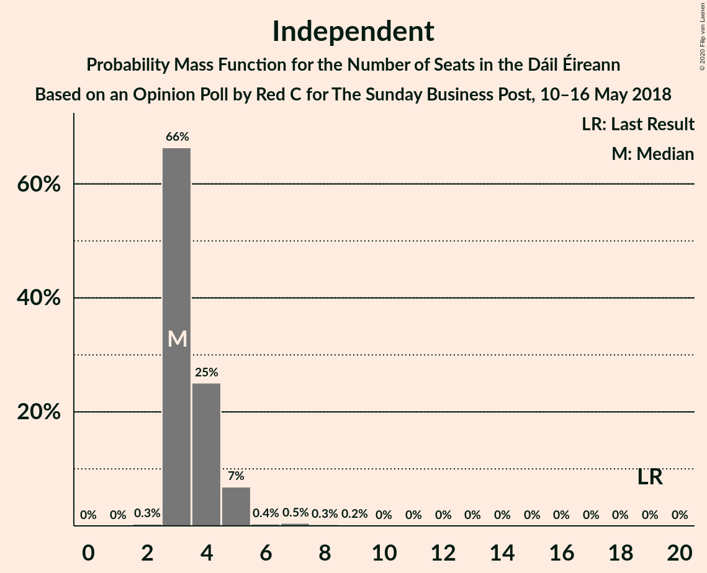
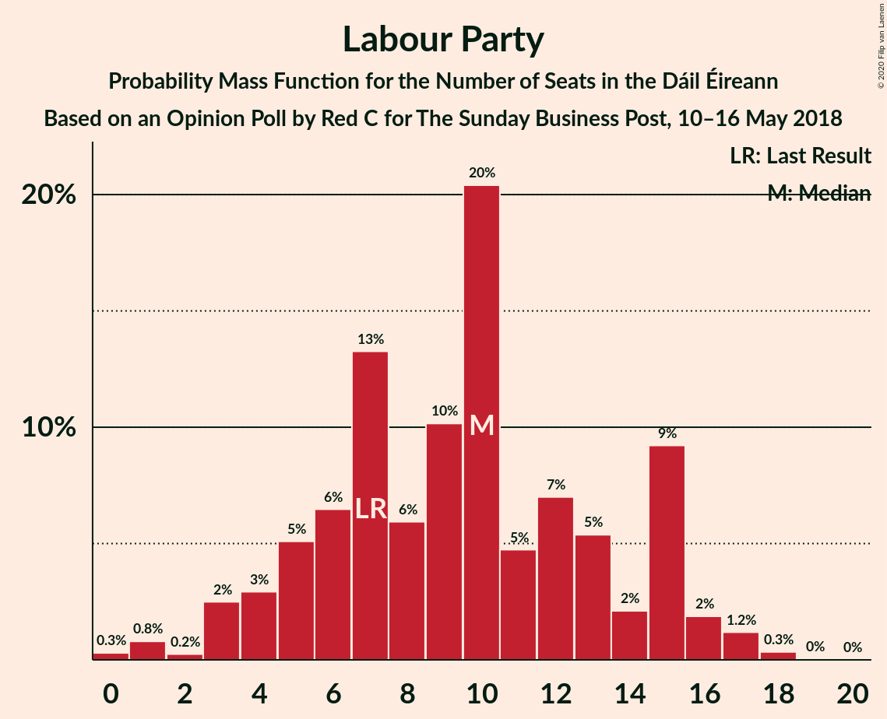
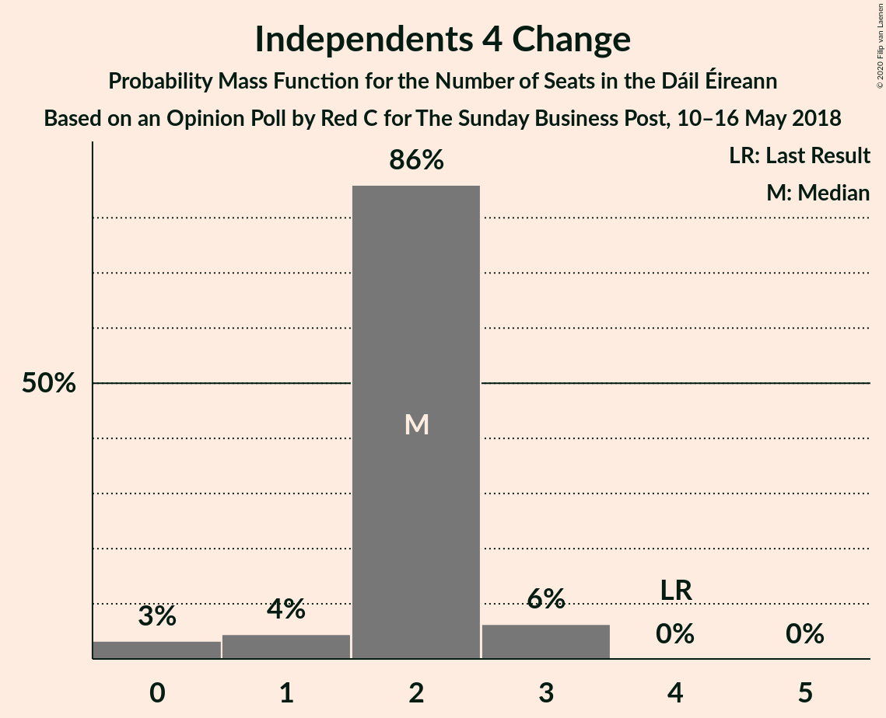
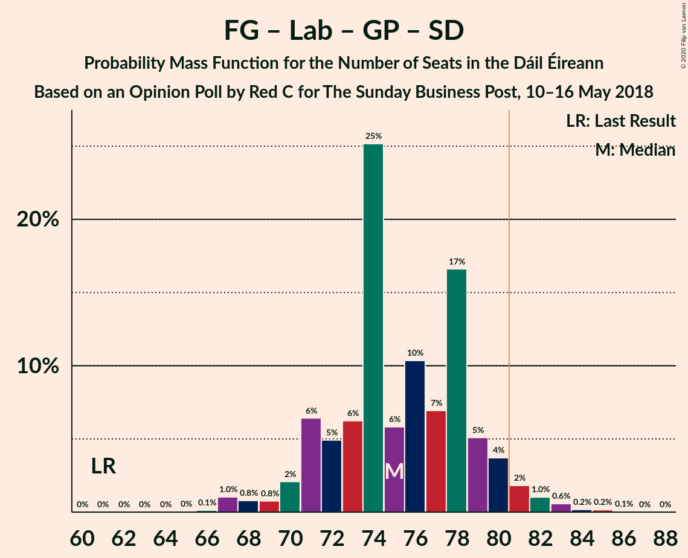

# Opinion Poll by Red C for The Sunday Business Post, 10–16 May 2018

<a href="#voting-intentions">Voting Intentions</a> | <a href="#seats">Seats</a> | <a href="#coalitions">Coalitions</a> | <a href="#technical-information">Technical Information</a>

## Voting Intentions

### Confidence Intervals

| Party | Last Result | Poll Result | 80% Confidence Interval | 90% Confidence Interval | 95% Confidence Interval | 99% Confidence Interval |
|:-----:|:-----------:|:-----------:|:-----------------------:|:-----------------------:|:-----------------------:|:-----------------------:|
| Fine Gael | 25.5% | 33.9% | 32.0–35.9% |31.5–36.4% |31.0–36.9% |30.1–37.8% |
| Fianna Fáil | 24.3% | 24.9% | 23.2–26.7% |22.7–27.2% |22.3–27.7% |21.5–28.6% |
| Sinn Féin | 13.8% | 16.0% | 14.6–17.6% |14.2–18.0% |13.9–18.4% |13.2–19.2% |
| Independent | 15.9% | 7.6% | 6.6–8.8% |6.3–9.1% |6.1–9.4% |5.7–10.0% |
| Labour Party | 6.6% | 6.0% | 5.1–7.1% |4.9–7.4% |4.7–7.7% |4.3–8.2% |
| Solidarity–People Before Profit | 3.9% | 3.0% | 2.4–3.8% |2.2–4.1% |2.1–4.3% |1.9–4.7% |
| Green Party/Comhaontas Glas | 2.7% | 2.0% | 1.5–2.7% |1.4–2.9% |1.3–3.1% |1.1–3.4% |
| Social Democrats | 3.0% | 1.0% | 0.7–1.5% |0.6–1.7% |0.5–1.8% |0.4–2.1% |
| Independents 4 Change | 1.5% | 1.0% | 0.7–1.5% |0.6–1.7% |0.5–1.8% |0.4–2.1% |
| Renua Ireland | 2.2% | 0.1% | 0.1–0.5% |0.1–0.6% |0.1–0.7% |0.0–0.9% |

*Note:* The poll result column reflects the actual value used in the calculations. Published results may vary slightly, and in addition be rounded to fewer digits.

## Seats

### Confidence Intervals

| Party | Last Result | Median | 80% Confidence Interval | 90% Confidence Interval | 95% Confidence Interval | 99% Confidence Interval |
|:-----:|:-----------:|:------:|:-----------------------:|:-----------------------:|:-----------------------:|:-----------------------:|
| <a href="#fine-gael">Fine Gael</a> | 49 | 65 | 62–68 |61–70 |60–71 |58–71 |
| <a href="#fianna-fáil">Fianna Fáil</a> | 44 | 46 | 42–49 |41–51 |40–52 |38–53 |
| <a href="#sinn-féin">Sinn Féin</a> | 23 | 32 | 26–33 |25–34 |24–35 |22–36 |
| <a href="#independent">Independent</a> | 19 | 3 | 3–4 |3–5 |3–5 |3–8 |
| <a href="#labour-party">Labour Party</a> | 7 | 10 | 5–15 |4–15 |3–16 |1–17 |
| <a href="#solidarity–people-before-profit">Solidarity–People Before Profit</a> | 6 | 3 | 2–3 |1–3 |1–4 |1–6 |
| <a href="#green-party/comhaontas-glas">Green Party/Comhaontas Glas</a> | 2 | 0 | 0–1 |0–2 |0–2 |0–2 |
| <a href="#social-democrats">Social Democrats</a> | 3 | 1 | 0–1 |0–3 |0–3 |0–3 |
| <a href="#independents-4-change">Independents 4 Change</a> | 4 | 2 | 2 |1–3 |0–3 |0–3 |
| <a href="#renua-ireland">Renua Ireland</a> | 0 | 0 | 0 |0 |0 |0–1 |

### Fine Gael

*For a full overview of the results for this party, see the [Fine Gael](party-finegael.html) page.*

| Number of Seats | Probability | Accumulated | Special Marks |
|:---------------:|:-----------:|:-----------:|:-------------:|
| 49 | 0% | 100% | Last Result |
| 50 | 0% | 100% |  |
| 51 | 0% | 100% |  |
| 52 | 0% | 100% |  |
| 53 | 0% | 100% |  |
| 54 | 0% | 100% |  |
| 55 | 0% | 100% |  |
| 56 | 0% | 100% |  |
| 57 | 0.1% | 100% |  |
| 58 | 0.6% | 99.9% |  |
| 59 | 0.9% | 99.3% |  |
| 60 | 2% | 98% |  |
| 61 | 3% | 97% |  |
| 62 | 7% | 94% |  |
| 63 | 26% | 86% |  |
| 64 | 10% | 60% |  |
| 65 | 14% | 50% | Median |
| 66 | 13% | 36% |  |
| 67 | 9% | 23% |  |
| 68 | 5% | 15% |  |
| 69 | 1.0% | 9% |  |
| 70 | 4% | 8% |  |
| 71 | 5% | 5% |  |
| 72 | 0.1% | 0.1% |  |
| 73 | 0% | 0% |  |

### Fianna Fáil

*For a full overview of the results for this party, see the [Fianna Fáil](party-fiannafáil.html) page.*

| Number of Seats | Probability | Accumulated | Special Marks |
|:---------------:|:-----------:|:-----------:|:-------------:|
| 36 | 0.1% | 100% |  |
| 37 | 0.2% | 99.8% |  |
| 38 | 0.7% | 99.6% |  |
| 39 | 0.9% | 98.9% |  |
| 40 | 2% | 98% |  |
| 41 | 4% | 96% |  |
| 42 | 8% | 92% |  |
| 43 | 6% | 84% |  |
| 44 | 6% | 78% | Last Result |
| 45 | 8% | 72% |  |
| 46 | 29% | 65% | Median |
| 47 | 13% | 35% |  |
| 48 | 8% | 22% |  |
| 49 | 6% | 15% |  |
| 50 | 2% | 9% |  |
| 51 | 3% | 6% |  |
| 52 | 3% | 3% |  |
| 53 | 0.2% | 0.5% |  |
| 54 | 0.3% | 0.3% |  |
| 55 | 0% | 0% |  |

### Sinn Féin

*For a full overview of the results for this party, see the [Sinn Féin](party-sinnféin.html) page.*

| Number of Seats | Probability | Accumulated | Special Marks |
|:---------------:|:-----------:|:-----------:|:-------------:|
| 20 | 0.1% | 100% |  |
| 21 | 0.3% | 99.8% |  |
| 22 | 0.6% | 99.6% |  |
| 23 | 0.6% | 99.0% | Last Result |
| 24 | 3% | 98% |  |
| 25 | 1.4% | 95% |  |
| 26 | 5% | 94% |  |
| 27 | 4% | 89% |  |
| 28 | 0.9% | 85% |  |
| 29 | 3% | 84% |  |
| 30 | 13% | 81% |  |
| 31 | 16% | 68% |  |
| 32 | 34% | 52% | Median |
| 33 | 10% | 18% |  |
| 34 | 3% | 8% |  |
| 35 | 3% | 4% |  |
| 36 | 0.8% | 1.1% |  |
| 37 | 0.2% | 0.3% |  |
| 38 | 0.1% | 0.1% |  |
| 39 | 0% | 0% |  |

### Independent

*For a full overview of the results for this party, see the [Independent](party-independent.html) page.*

| Number of Seats | Probability | Accumulated | Special Marks |
|:---------------:|:-----------:|:-----------:|:-------------:|
| 2 | 0.3% | 100% |  |
| 3 | 66% | 99.7% | Median |
| 4 | 25% | 33% |  |
| 5 | 7% | 8% |  |
| 6 | 0.4% | 1.4% |  |
| 7 | 0.5% | 1.0% |  |
| 8 | 0.3% | 0.5% |  |
| 9 | 0.2% | 0.3% |  |
| 10 | 0% | 0% |  |
| 11 | 0% | 0% |  |
| 12 | 0% | 0% |  |
| 13 | 0% | 0% |  |
| 14 | 0% | 0% |  |
| 15 | 0% | 0% |  |
| 16 | 0% | 0% |  |
| 17 | 0% | 0% |  |
| 18 | 0% | 0% |  |
| 19 | 0% | 0% | Last Result |

### Labour Party

*For a full overview of the results for this party, see the [Labour Party](party-labourparty.html) page.*

| Number of Seats | Probability | Accumulated | Special Marks |
|:---------------:|:-----------:|:-----------:|:-------------:|
| 0 | 0.3% | 100% |  |
| 1 | 0.8% | 99.7% |  |
| 2 | 0.2% | 98.9% |  |
| 3 | 2% | 98.7% |  |
| 4 | 3% | 96% |  |
| 5 | 5% | 93% |  |
| 6 | 6% | 88% |  |
| 7 | 13% | 82% | Last Result |
| 8 | 6% | 68% |  |
| 9 | 10% | 62% |  |
| 10 | 20% | 52% | Median |
| 11 | 5% | 32% |  |
| 12 | 7% | 27% |  |
| 13 | 5% | 20% |  |
| 14 | 2% | 15% |  |
| 15 | 9% | 13% |  |
| 16 | 2% | 3% |  |
| 17 | 1.2% | 2% |  |
| 18 | 0.3% | 0.4% |  |
| 19 | 0% | 0.1% |  |
| 20 | 0% | 0% |  |

### Solidarity–People Before Profit

*For a full overview of the results for this party, see the [Solidarity–People Before Profit](party-solidarity–peoplebeforeprofit.html) page.*

| Number of Seats | Probability | Accumulated | Special Marks |
|:---------------:|:-----------:|:-----------:|:-------------:|
| 0 | 0.3% | 100% |  |
| 1 | 9% | 99.7% |  |
| 2 | 13% | 91% |  |
| 3 | 73% | 78% | Median |
| 4 | 3% | 5% |  |
| 5 | 0.5% | 2% |  |
| 6 | 0.8% | 1.1% | Last Result |
| 7 | 0.3% | 0.4% |  |
| 8 | 0% | 0.1% |  |
| 9 | 0% | 0% |  |

### Green Party/Comhaontas Glas

*For a full overview of the results for this party, see the [Green Party/Comhaontas Glas](party-greenpartycomhaontasglas.html) page.*

| Number of Seats | Probability | Accumulated | Special Marks |
|:---------------:|:-----------:|:-----------:|:-------------:|
| 0 | 86% | 100% | Median |
| 1 | 7% | 14% |  |
| 2 | 7% | 7% | Last Result |
| 3 | 0% | 0% |  |

### Social Democrats

*For a full overview of the results for this party, see the [Social Democrats](party-socialdemocrats.html) page.*

| Number of Seats | Probability | Accumulated | Special Marks |
|:---------------:|:-----------:|:-----------:|:-------------:|
| 0 | 37% | 100% |  |
| 1 | 56% | 63% | Median |
| 2 | 1.5% | 7% |  |
| 3 | 6% | 6% | Last Result |
| 4 | 0% | 0% |  |

### Independents 4 Change

*For a full overview of the results for this party, see the [Independents 4 Change](party-independents4change.html) page.*

| Number of Seats | Probability | Accumulated | Special Marks |
|:---------------:|:-----------:|:-----------:|:-------------:|
| 0 | 3% | 100% |  |
| 1 | 4% | 97% |  |
| 2 | 86% | 92% | Median |
| 3 | 6% | 6% |  |
| 4 | 0% | 0% | Last Result |

### Renua Ireland

*For a full overview of the results for this party, see the [Renua Ireland](party-renuaireland.html) page.*

| Number of Seats | Probability | Accumulated | Special Marks |
|:---------------:|:-----------:|:-----------:|:-------------:|
| 0 | 99.4% | 100% | Last Result, Median |
| 1 | 0.6% | 0.6% |  |
| 2 | 0% | 0% |  |

## Coalitions

### Confidence Intervals

| Coalition | Last Result | Median | Majority? | 80% Confidence Interval | 90% Confidence Interval | 95% Confidence Interval | 99% Confidence Interval |
|:---------:|:-----------:|:------:|:---------:|:-----------------------:|:-----------------------:|:-----------------------:|:-----------------------:|
| Fine Gael – Fianna Fáil | 93 | 110 | 100% | 104–116 | 104–118 | 103–120 | 101–122 |
| Fianna Fáil – Sinn Féin | 67 | 77 | 7% | 73–80 | 72–81 | 71–82 | 68–84 |
| Fine Gael – Labour Party – Green Party/Comhaontas Glas – Social Democrats | 61 | 75 | 4% | 71–79 | 71–80 | 69–81 | 67–83 |
| Fine Gael – Labour Party – Green Party/Comhaontas Glas | 58 | 74 | 2% | 71–78 | 70–79 | 68–80 | 67–83 |
| Fine Gael – Labour Party | 56 | 73 | 2% | 70–78 | 69–79 | 68–80 | 66–83 |
| Fine Gael | 49 | 65 | 0% | 62–68 | 61–70 | 60–71 | 58–71 |
| Fine Gael – Green Party/Comhaontas Glas | 51 | 65 | 0% | 62–69 | 61–71 | 60–71 | 58–72 |
| Fianna Fáil – Labour Party – Green Party/Comhaontas Glas – Social Democrats | 56 | 57 | 0% | 52–60 | 50–61 | 50–62 | 48–66 |
| Fianna Fáil – Labour Party – Green Party/Comhaontas Glas | 53 | 56 | 0% | 51–59 | 50–61 | 49–61 | 47–65 |
| Fianna Fáil – Labour Party | 51 | 56 | 0% | 51–59 | 50–61 | 49–61 | 46–65 |
| Fianna Fáil – Green Party/Comhaontas Glas | 46 | 46 | 0% | 42–50 | 41–51 | 40–52 | 38–54 |

### Fine Gael – Fianna Fáil

| Number of Seats | Probability | Accumulated | Special Marks |
|:---------------:|:-----------:|:-----------:|:-------------:|
| 93 | 0% | 100% | Last Result |
| 94 | 0% | 100% |  |
| 95 | 0% | 100% |  |
| 96 | 0% | 100% |  |
| 97 | 0% | 100% |  |
| 98 | 0% | 100% |  |
| 99 | 0% | 100% |  |
| 100 | 0.2% | 99.9% |  |
| 101 | 0.7% | 99.7% |  |
| 102 | 1.3% | 99.0% |  |
| 103 | 1.1% | 98% |  |
| 104 | 7% | 97% |  |
| 105 | 2% | 90% |  |
| 106 | 6% | 88% |  |
| 107 | 3% | 82% |  |
| 108 | 5% | 79% |  |
| 109 | 20% | 75% |  |
| 110 | 10% | 54% |  |
| 111 | 6% | 44% | Median |
| 112 | 7% | 38% |  |
| 113 | 8% | 31% |  |
| 114 | 3% | 24% |  |
| 115 | 7% | 21% |  |
| 116 | 4% | 13% |  |
| 117 | 3% | 10% |  |
| 118 | 4% | 7% |  |
| 119 | 0.4% | 3% |  |
| 120 | 2% | 3% |  |
| 121 | 0.1% | 0.7% |  |
| 122 | 0.5% | 0.6% |  |
| 123 | 0% | 0% |  |

### Fianna Fáil – Sinn Féin

| Number of Seats | Probability | Accumulated | Special Marks |
|:---------------:|:-----------:|:-----------:|:-------------:|
| 65 | 0.1% | 100% |  |
| 66 | 0.1% | 99.9% |  |
| 67 | 0.1% | 99.8% | Last Result |
| 68 | 0.3% | 99.8% |  |
| 69 | 0.2% | 99.5% |  |
| 70 | 1.2% | 99.3% |  |
| 71 | 1.4% | 98% |  |
| 72 | 4% | 97% |  |
| 73 | 11% | 93% |  |
| 74 | 10% | 82% |  |
| 75 | 7% | 72% |  |
| 76 | 9% | 65% |  |
| 77 | 8% | 56% |  |
| 78 | 28% | 48% | Median |
| 79 | 9% | 19% |  |
| 80 | 4% | 11% |  |
| 81 | 4% | 7% | Majority |
| 82 | 0.7% | 3% |  |
| 83 | 1.0% | 2% |  |
| 84 | 1.0% | 1.0% |  |
| 85 | 0% | 0.1% |  |
| 86 | 0.1% | 0.1% |  |
| 87 | 0% | 0% |  |

### Fine Gael – Labour Party – Green Party/Comhaontas Glas – Social Democrats

| Number of Seats | Probability | Accumulated | Special Marks |
|:---------------:|:-----------:|:-----------:|:-------------:|
| 61 | 0% | 100% | Last Result |
| 62 | 0% | 100% |  |
| 63 | 0% | 100% |  |
| 64 | 0% | 100% |  |
| 65 | 0% | 100% |  |
| 66 | 0.1% | 100% |  |
| 67 | 1.0% | 99.8% |  |
| 68 | 0.8% | 98.8% |  |
| 69 | 0.8% | 98% |  |
| 70 | 2% | 97% |  |
| 71 | 6% | 95% |  |
| 72 | 5% | 89% |  |
| 73 | 6% | 84% |  |
| 74 | 25% | 78% |  |
| 75 | 6% | 52% |  |
| 76 | 10% | 47% | Median |
| 77 | 7% | 36% |  |
| 78 | 17% | 29% |  |
| 79 | 5% | 13% |  |
| 80 | 4% | 8% |  |
| 81 | 2% | 4% | Majority |
| 82 | 1.0% | 2% |  |
| 83 | 0.6% | 1.0% |  |
| 84 | 0.2% | 0.5% |  |
| 85 | 0.2% | 0.3% |  |
| 86 | 0.1% | 0.1% |  |
| 87 | 0% | 0.1% |  |
| 88 | 0% | 0% |  |

### Fine Gael – Labour Party – Green Party/Comhaontas Glas

| Number of Seats | Probability | Accumulated | Special Marks |
|:---------------:|:-----------:|:-----------:|:-------------:|
| 58 | 0% | 100% | Last Result |
| 59 | 0% | 100% |  |
| 60 | 0% | 100% |  |
| 61 | 0% | 100% |  |
| 62 | 0% | 100% |  |
| 63 | 0% | 100% |  |
| 64 | 0% | 100% |  |
| 65 | 0.1% | 100% |  |
| 66 | 0.3% | 99.8% |  |
| 67 | 1.2% | 99.6% |  |
| 68 | 1.0% | 98% |  |
| 69 | 2% | 97% |  |
| 70 | 5% | 95% |  |
| 71 | 4% | 90% |  |
| 72 | 5% | 86% |  |
| 73 | 28% | 81% |  |
| 74 | 3% | 53% |  |
| 75 | 10% | 50% | Median |
| 76 | 9% | 39% |  |
| 77 | 12% | 30% |  |
| 78 | 10% | 18% |  |
| 79 | 3% | 8% |  |
| 80 | 3% | 5% |  |
| 81 | 1.1% | 2% | Majority |
| 82 | 0.5% | 1.1% |  |
| 83 | 0.3% | 0.6% |  |
| 84 | 0.1% | 0.3% |  |
| 85 | 0.1% | 0.2% |  |
| 86 | 0% | 0.1% |  |
| 87 | 0% | 0% |  |

### Fine Gael – Labour Party

| Number of Seats | Probability | Accumulated | Special Marks |
|:---------------:|:-----------:|:-----------:|:-------------:|
| 56 | 0% | 100% | Last Result |
| 57 | 0% | 100% |  |
| 58 | 0% | 100% |  |
| 59 | 0% | 100% |  |
| 60 | 0% | 100% |  |
| 61 | 0% | 100% |  |
| 62 | 0% | 100% |  |
| 63 | 0% | 100% |  |
| 64 | 0% | 100% |  |
| 65 | 0.1% | 100% |  |
| 66 | 0.4% | 99.8% |  |
| 67 | 1.4% | 99.5% |  |
| 68 | 1.0% | 98% |  |
| 69 | 3% | 97% |  |
| 70 | 5% | 94% |  |
| 71 | 4% | 89% |  |
| 72 | 6% | 85% |  |
| 73 | 30% | 78% |  |
| 74 | 3% | 49% |  |
| 75 | 9% | 45% | Median |
| 76 | 8% | 37% |  |
| 77 | 12% | 29% |  |
| 78 | 10% | 17% |  |
| 79 | 3% | 7% |  |
| 80 | 1.5% | 4% |  |
| 81 | 1.1% | 2% | Majority |
| 82 | 0.4% | 1.0% |  |
| 83 | 0.3% | 0.6% |  |
| 84 | 0.1% | 0.3% |  |
| 85 | 0.1% | 0.2% |  |
| 86 | 0% | 0.1% |  |
| 87 | 0% | 0% |  |

### Fine Gael

| Number of Seats | Probability | Accumulated | Special Marks |
|:---------------:|:-----------:|:-----------:|:-------------:|
| 49 | 0% | 100% | Last Result |
| 50 | 0% | 100% |  |
| 51 | 0% | 100% |  |
| 52 | 0% | 100% |  |
| 53 | 0% | 100% |  |
| 54 | 0% | 100% |  |
| 55 | 0% | 100% |  |
| 56 | 0% | 100% |  |
| 57 | 0.1% | 100% |  |
| 58 | 0.6% | 99.9% |  |
| 59 | 0.9% | 99.3% |  |
| 60 | 2% | 98% |  |
| 61 | 3% | 97% |  |
| 62 | 7% | 94% |  |
| 63 | 26% | 86% |  |
| 64 | 10% | 60% |  |
| 65 | 14% | 50% | Median |
| 66 | 13% | 36% |  |
| 67 | 9% | 23% |  |
| 68 | 5% | 15% |  |
| 69 | 1.0% | 9% |  |
| 70 | 4% | 8% |  |
| 71 | 5% | 5% |  |
| 72 | 0.1% | 0.1% |  |
| 73 | 0% | 0% |  |

### Fine Gael – Green Party/Comhaontas Glas

| Number of Seats | Probability | Accumulated | Special Marks |
|:---------------:|:-----------:|:-----------:|:-------------:|
| 51 | 0% | 100% | Last Result |
| 52 | 0% | 100% |  |
| 53 | 0% | 100% |  |
| 54 | 0% | 100% |  |
| 55 | 0% | 100% |  |
| 56 | 0% | 100% |  |
| 57 | 0.1% | 100% |  |
| 58 | 0.6% | 99.9% |  |
| 59 | 0.9% | 99.3% |  |
| 60 | 2% | 98% |  |
| 61 | 3% | 97% |  |
| 62 | 7% | 94% |  |
| 63 | 26% | 87% |  |
| 64 | 7% | 61% |  |
| 65 | 14% | 54% | Median |
| 66 | 11% | 40% |  |
| 67 | 11% | 29% |  |
| 68 | 8% | 18% |  |
| 69 | 1.4% | 10% |  |
| 70 | 3% | 9% |  |
| 71 | 5% | 6% |  |
| 72 | 1.0% | 1.2% |  |
| 73 | 0.1% | 0.1% |  |
| 74 | 0% | 0% |  |

### Fianna Fáil – Labour Party – Green Party/Comhaontas Glas – Social Democrats

| Number of Seats | Probability | Accumulated | Special Marks |
|:---------------:|:-----------:|:-----------:|:-------------:|
| 45 | 0% | 100% |  |
| 46 | 0.2% | 99.9% |  |
| 47 | 0.2% | 99.7% |  |
| 48 | 0.3% | 99.6% |  |
| 49 | 1.1% | 99.2% |  |
| 50 | 3% | 98% |  |
| 51 | 3% | 95% |  |
| 52 | 3% | 92% |  |
| 53 | 5% | 89% |  |
| 54 | 14% | 85% |  |
| 55 | 4% | 71% |  |
| 56 | 13% | 67% | Last Result |
| 57 | 27% | 54% | Median |
| 58 | 11% | 27% |  |
| 59 | 3% | 16% |  |
| 60 | 6% | 14% |  |
| 61 | 4% | 8% |  |
| 62 | 1.1% | 3% |  |
| 63 | 0.4% | 2% |  |
| 64 | 0.9% | 2% |  |
| 65 | 0.4% | 1.1% |  |
| 66 | 0.3% | 0.7% |  |
| 67 | 0.3% | 0.4% |  |
| 68 | 0% | 0.1% |  |
| 69 | 0% | 0% |  |

### Fianna Fáil – Labour Party – Green Party/Comhaontas Glas

| Number of Seats | Probability | Accumulated | Special Marks |
|:---------------:|:-----------:|:-----------:|:-------------:|
| 44 | 0.1% | 100% |  |
| 45 | 0% | 99.9% |  |
| 46 | 0.3% | 99.8% |  |
| 47 | 0.3% | 99.5% |  |
| 48 | 0.5% | 99.3% |  |
| 49 | 3% | 98.8% |  |
| 50 | 2% | 96% |  |
| 51 | 5% | 94% |  |
| 52 | 3% | 89% |  |
| 53 | 11% | 86% | Last Result |
| 54 | 11% | 76% |  |
| 55 | 5% | 64% |  |
| 56 | 29% | 59% | Median |
| 57 | 11% | 30% |  |
| 58 | 5% | 19% |  |
| 59 | 6% | 14% |  |
| 60 | 1.5% | 8% |  |
| 61 | 4% | 7% |  |
| 62 | 0.3% | 2% |  |
| 63 | 1.0% | 2% |  |
| 64 | 0.4% | 1.1% |  |
| 65 | 0.4% | 0.8% |  |
| 66 | 0.3% | 0.4% |  |
| 67 | 0% | 0.1% |  |
| 68 | 0% | 0% |  |

### Fianna Fáil – Labour Party

| Number of Seats | Probability | Accumulated | Special Marks |
|:---------------:|:-----------:|:-----------:|:-------------:|
| 44 | 0.1% | 100% |  |
| 45 | 0% | 99.9% |  |
| 46 | 0.4% | 99.8% |  |
| 47 | 0.3% | 99.5% |  |
| 48 | 1.0% | 99.1% |  |
| 49 | 3% | 98% |  |
| 50 | 2% | 95% |  |
| 51 | 5% | 93% | Last Result |
| 52 | 6% | 89% |  |
| 53 | 10% | 83% |  |
| 54 | 10% | 72% |  |
| 55 | 6% | 62% |  |
| 56 | 28% | 56% | Median |
| 57 | 9% | 27% |  |
| 58 | 5% | 18% |  |
| 59 | 6% | 14% |  |
| 60 | 2% | 8% |  |
| 61 | 3% | 6% |  |
| 62 | 0.2% | 2% |  |
| 63 | 1.0% | 2% |  |
| 64 | 0.3% | 1.1% |  |
| 65 | 0.4% | 0.7% |  |
| 66 | 0.3% | 0.4% |  |
| 67 | 0% | 0.1% |  |
| 68 | 0% | 0% |  |

### Fianna Fáil – Green Party/Comhaontas Glas

| Number of Seats | Probability | Accumulated | Special Marks |
|:---------------:|:-----------:|:-----------:|:-------------:|
| 36 | 0.1% | 100% |  |
| 37 | 0.2% | 99.9% |  |
| 38 | 0.5% | 99.7% |  |
| 39 | 1.1% | 99.2% |  |
| 40 | 2% | 98% |  |
| 41 | 4% | 97% |  |
| 42 | 8% | 93% |  |
| 43 | 5% | 84% |  |
| 44 | 6% | 79% |  |
| 45 | 6% | 73% |  |
| 46 | 25% | 67% | Last Result, Median |
| 47 | 17% | 42% |  |
| 48 | 9% | 25% |  |
| 49 | 6% | 16% |  |
| 50 | 3% | 10% |  |
| 51 | 2% | 7% |  |
| 52 | 4% | 5% |  |
| 53 | 0.4% | 1.0% |  |
| 54 | 0.5% | 0.6% |  |
| 55 | 0% | 0.1% |  |
| 56 | 0% | 0% |  |

## Technical Information

### Opinion Poll

+ **Polling firm:** Red C
+ **Commissioner(s):** The Sunday Business Post
+ **Fieldwork period:** 10–16 May 2018

### Calculations

+ **Sample size:** 999
+ **Simulations done:** 1,048,575
+ **Error estimate:** 4.47%

