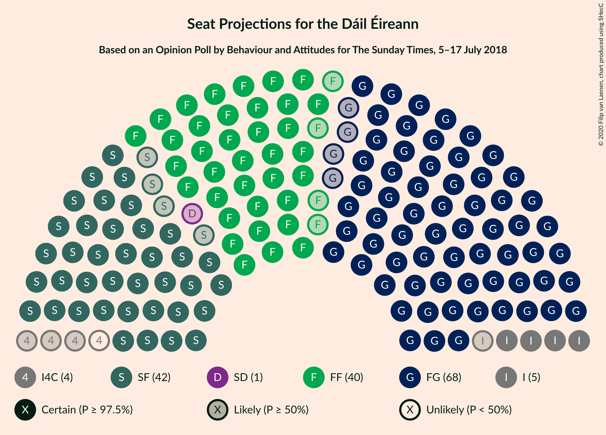
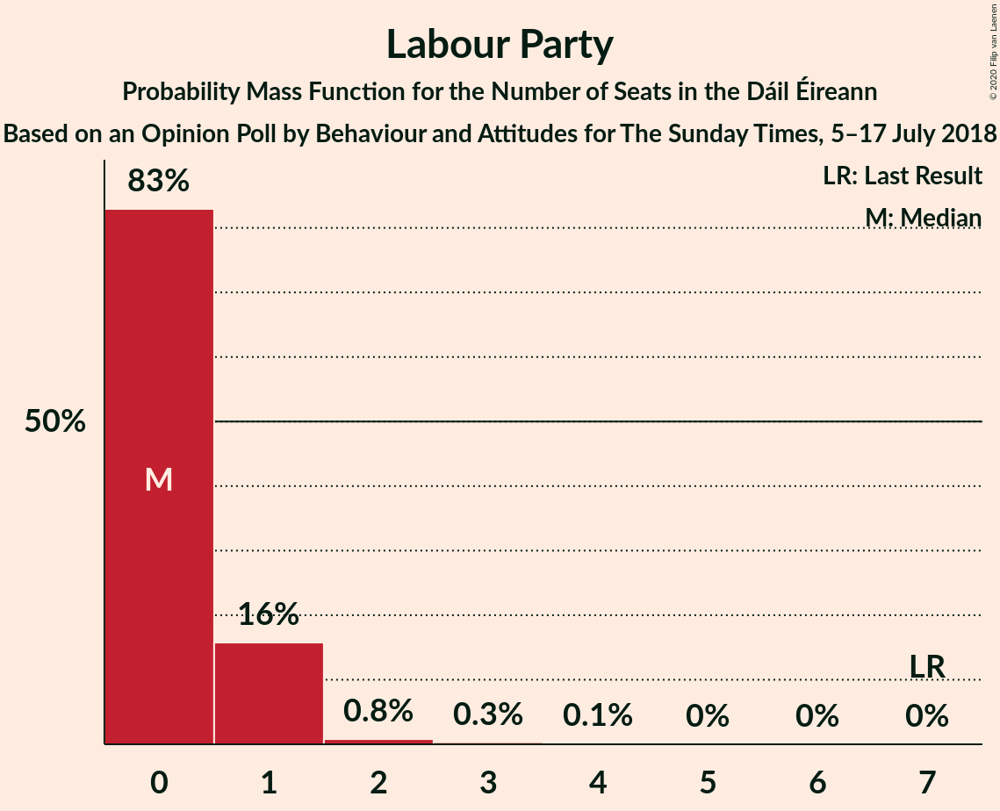
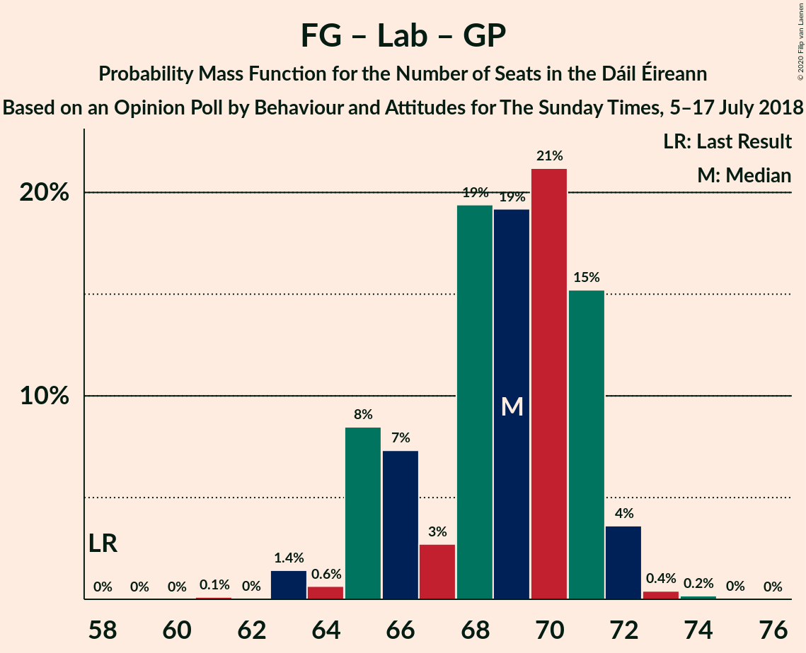
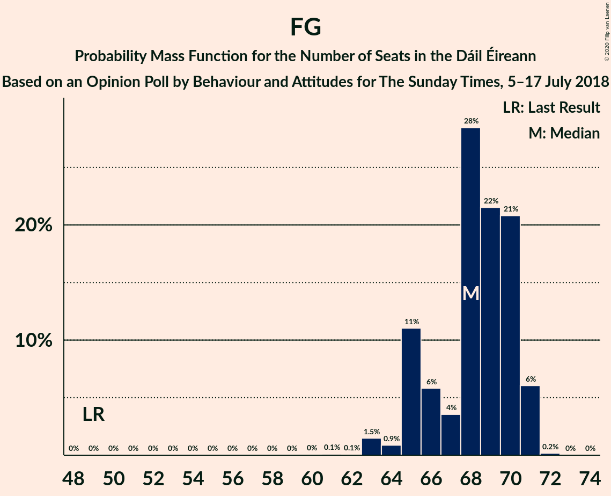

# Opinion Poll by Behaviour and Attitudes for The Sunday Times, 5–17 July 2018

<a href="#voting-intentions">Voting Intentions</a> | <a href="#seats">Seats</a> | <a href="#coalitions">Coalitions</a> | <a href="#technical-information">Technical Information</a>

## Voting Intentions

### Confidence Intervals

| Party | Last Result | Poll Result | 80% Confidence Interval | 90% Confidence Interval | 95% Confidence Interval | 99% Confidence Interval |
|:-----:|:-----------:|:-----------:|:-----------------------:|:-----------------------:|:-----------------------:|:-----------------------:|
| Fine Gael | 25.5% | 34.6% | 32.6–36.6% |32.1–37.2% |31.6–37.7% |30.7–38.7% |
| Sinn Féin | 13.8% | 22.3% | 20.7–24.2% |20.2–24.7% |19.8–25.1% |19.0–26.0% |
| Fianna Fáil | 24.3% | 21.4% | 19.7–23.2% |19.3–23.7% |18.9–24.1% |18.1–25.0% |
| Independent | 15.9% | 8.6% | 7.5–9.9% |7.2–10.3% |7.0–10.6% |6.5–11.2% |
| Labour Party | 6.6% | 3.0% | 2.4–3.9% |2.2–4.1% |2.1–4.3% |1.8–4.8% |
| Green Party/Comhaontas Glas | 2.7% | 2.0% | 1.6–2.8% |1.4–3.0% |1.3–3.2% |1.1–3.6% |
| Independents 4 Change | 1.5% | 1.1% | 0.7–1.7% |0.7–1.8% |0.6–2.0% |0.5–2.3% |
| Solidarity–People Before Profit | 3.9% | 1.0% | 0.7–1.5% |0.6–1.7% |0.5–1.8% |0.4–2.1% |
| Social Democrats | 3.0% | 1.0% | 0.7–1.5% |0.6–1.7% |0.5–1.8% |0.4–2.1% |
| Renua Ireland | 2.2% | 0.2% | 0.1–0.6% |0.1–0.7% |0.1–0.8% |0.0–1.0% |

*Note:* The poll result column reflects the actual value used in the calculations. Published results may vary slightly, and in addition be rounded to fewer digits.

## Seats

### Confidence Intervals

| Party | Last Result | Median | 80% Confidence Interval | 90% Confidence Interval | 95% Confidence Interval | 99% Confidence Interval |
|:-----:|:-----------:|:------:|:-----------------------:|:-----------------------:|:-----------------------:|:-----------------------:|
| <a href="#fine-gael">Fine Gael</a> | 49 | 68 | 65–70 |65–70 |65–71 |63–71 |
| <a href="#sinn-féin">Sinn Féin</a> | 23 | 42 | 39–46 |39–46 |38–46 |38–46 |
| <a href="#fianna-fáil">Fianna Fáil</a> | 44 | 41 | 37–45 |37–45 |36–45 |35–46 |
| <a href="#independent">Independent</a> | 19 | 6 | 4–7 |4–8 |4–10 |3–10 |
| <a href="#labour-party">Labour Party</a> | 7 | 0 | 0–1 |0–1 |0–2 |0–3 |
| <a href="#green-party/comhaontas-glas">Green Party/Comhaontas Glas</a> | 2 | 0 | 0–1 |0–1 |0–1 |0–2 |
| <a href="#independents-4-change">Independents 4 Change</a> | 4 | 2 | 0–4 |0–4 |0–5 |0–5 |
| <a href="#solidarity–people-before-profit">Solidarity–People Before Profit</a> | 6 | 0 | 0 |0 |0 |0–1 |
| <a href="#social-democrats">Social Democrats</a> | 3 | 1 | 0–2 |0–3 |0–3 |0–3 |
| <a href="#renua-ireland">Renua Ireland</a> | 0 | 0 | 0 |0 |0 |0 |

### Fine Gael

*For a full overview of the results for this party, see the [Fine Gael](party-finegael.html) page.*

| Number of Seats | Probability | Accumulated | Special Marks |
|:---------------:|:-----------:|:-----------:|:-------------:|
| 49 | 0% | 100% | Last Result |
| 50 | 0% | 100% |  |
| 51 | 0% | 100% |  |
| 52 | 0% | 100% |  |
| 53 | 0% | 100% |  |
| 54 | 0% | 100% |  |
| 55 | 0% | 100% |  |
| 56 | 0% | 100% |  |
| 57 | 0% | 100% |  |
| 58 | 0% | 100% |  |
| 59 | 0% | 100% |  |
| 60 | 0.4% | 100% |  |
| 61 | 0% | 99.6% |  |
| 62 | 0% | 99.5% |  |
| 63 | 0.1% | 99.5% |  |
| 64 | 1.2% | 99.4% |  |
| 65 | 22% | 98% |  |
| 66 | 3% | 77% |  |
| 67 | 4% | 74% |  |
| 68 | 29% | 69% | Median |
| 69 | 24% | 40% |  |
| 70 | 12% | 17% |  |
| 71 | 4% | 4% |  |
| 72 | 0.1% | 0.1% |  |
| 73 | 0% | 0% |  |

### Sinn Féin

*For a full overview of the results for this party, see the [Sinn Féin](party-sinnféin.html) page.*

| Number of Seats | Probability | Accumulated | Special Marks |
|:---------------:|:-----------:|:-----------:|:-------------:|
| 23 | 0% | 100% | Last Result |
| 24 | 0% | 100% |  |
| 25 | 0% | 100% |  |
| 26 | 0% | 100% |  |
| 27 | 0% | 100% |  |
| 28 | 0% | 100% |  |
| 29 | 0% | 100% |  |
| 30 | 0% | 100% |  |
| 31 | 0% | 100% |  |
| 32 | 0% | 100% |  |
| 33 | 0% | 100% |  |
| 34 | 0% | 100% |  |
| 35 | 0% | 100% |  |
| 36 | 0% | 100% |  |
| 37 | 0.4% | 100% |  |
| 38 | 3% | 99.6% |  |
| 39 | 9% | 97% |  |
| 40 | 24% | 88% |  |
| 41 | 10% | 64% |  |
| 42 | 13% | 54% | Median |
| 43 | 13% | 41% |  |
| 44 | 4% | 28% |  |
| 45 | 0.9% | 24% |  |
| 46 | 23% | 23% |  |
| 47 | 0% | 0% |  |

### Fianna Fáil

*For a full overview of the results for this party, see the [Fianna Fáil](party-fiannafáil.html) page.*

| Number of Seats | Probability | Accumulated | Special Marks |
|:---------------:|:-----------:|:-----------:|:-------------:|
| 33 | 0.1% | 100% |  |
| 34 | 0.1% | 99.9% |  |
| 35 | 0.5% | 99.9% |  |
| 36 | 3% | 99.3% |  |
| 37 | 12% | 97% |  |
| 38 | 14% | 85% |  |
| 39 | 5% | 71% |  |
| 40 | 3% | 66% |  |
| 41 | 25% | 63% | Median |
| 42 | 8% | 38% |  |
| 43 | 5% | 30% |  |
| 44 | 9% | 24% | Last Result |
| 45 | 15% | 15% |  |
| 46 | 0.6% | 0.7% |  |
| 47 | 0% | 0.1% |  |
| 48 | 0% | 0.1% |  |
| 49 | 0% | 0.1% |  |
| 50 | 0% | 0% |  |

### Independent

*For a full overview of the results for this party, see the [Independent](party-independent.html) page.*

| Number of Seats | Probability | Accumulated | Special Marks |
|:---------------:|:-----------:|:-----------:|:-------------:|
| 3 | 0.5% | 100% |  |
| 4 | 25% | 99.4% |  |
| 5 | 19% | 75% |  |
| 6 | 41% | 55% | Median |
| 7 | 5% | 14% |  |
| 8 | 4% | 9% |  |
| 9 | 0.3% | 5% |  |
| 10 | 4% | 4% |  |
| 11 | 0.3% | 0.3% |  |
| 12 | 0% | 0% |  |
| 13 | 0% | 0% |  |
| 14 | 0% | 0% |  |
| 15 | 0% | 0% |  |
| 16 | 0% | 0% |  |
| 17 | 0% | 0% |  |
| 18 | 0% | 0% |  |
| 19 | 0% | 0% | Last Result |

### Labour Party

*For a full overview of the results for this party, see the [Labour Party](party-labourparty.html) page.*

| Number of Seats | Probability | Accumulated | Special Marks |
|:---------------:|:-----------:|:-----------:|:-------------:|
| 0 | 67% | 100% | Median |
| 1 | 30% | 33% |  |
| 2 | 1.4% | 3% |  |
| 3 | 2% | 2% |  |
| 4 | 0.1% | 0.2% |  |
| 5 | 0% | 0% |  |
| 6 | 0% | 0% |  |
| 7 | 0% | 0% | Last Result |

### Green Party/Comhaontas Glas

*For a full overview of the results for this party, see the [Green Party/Comhaontas Glas](party-greenpartycomhaontasglas.html) page.*

| Number of Seats | Probability | Accumulated | Special Marks |
|:---------------:|:-----------:|:-----------:|:-------------:|
| 0 | 80% | 100% | Median |
| 1 | 18% | 20% |  |
| 2 | 2% | 2% | Last Result |
| 3 | 0.2% | 0.2% |  |
| 4 | 0% | 0% |  |

### Independents 4 Change

*For a full overview of the results for this party, see the [Independents 4 Change](party-independents4change.html) page.*

| Number of Seats | Probability | Accumulated | Special Marks |
|:---------------:|:-----------:|:-----------:|:-------------:|
| 0 | 42% | 100% |  |
| 1 | 8% | 58% |  |
| 2 | 7% | 50% | Median |
| 3 | 6% | 43% |  |
| 4 | 34% | 37% | Last Result |
| 5 | 3% | 3% |  |
| 6 | 0% | 0% |  |

### Solidarity–People Before Profit

*For a full overview of the results for this party, see the [Solidarity–People Before Profit](party-solidarity–peoplebeforeprofit.html) page.*

| Number of Seats | Probability | Accumulated | Special Marks |
|:---------------:|:-----------:|:-----------:|:-------------:|
| 0 | 98.9% | 100% | Median |
| 1 | 0.9% | 1.1% |  |
| 2 | 0.2% | 0.2% |  |
| 3 | 0% | 0% |  |
| 4 | 0% | 0% |  |
| 5 | 0% | 0% |  |
| 6 | 0% | 0% | Last Result |

### Social Democrats

*For a full overview of the results for this party, see the [Social Democrats](party-socialdemocrats.html) page.*

| Number of Seats | Probability | Accumulated | Special Marks |
|:---------------:|:-----------:|:-----------:|:-------------:|
| 0 | 20% | 100% |  |
| 1 | 68% | 80% | Median |
| 2 | 7% | 13% |  |
| 3 | 6% | 6% | Last Result |
| 4 | 0.3% | 0.3% |  |
| 5 | 0% | 0% |  |

### Renua Ireland

*For a full overview of the results for this party, see the [Renua Ireland](party-renuaireland.html) page.*

| Number of Seats | Probability | Accumulated | Special Marks |
|:---------------:|:-----------:|:-----------:|:-------------:|
| 0 | 100% | 100% | Last Result, Median |

## Coalitions

### Confidence Intervals

| Coalition | Last Result | Median | Majority? | 80% Confidence Interval | 90% Confidence Interval | 95% Confidence Interval | 99% Confidence Interval |
|:---------:|:-----------:|:------:|:---------:|:-----------------------:|:-----------------------:|:-----------------------:|:-----------------------:|
| Fine Gael – Fianna Fáil | 93 | 108 | 100% | 106–113 | 104–114 | 103–114 | 103–114 |
| Sinn Féin – Fianna Fáil | 67 | 83 | 73% | 79–87 | 78–87 | 77–87 | 76–89 |
| Fine Gael – Labour Party – Green Party/Comhaontas Glas – Social Democrats | 61 | 69 | 0% | 67–71 | 67–73 | 67–74 | 65–74 |
| Fine Gael – Labour Party – Green Party/Comhaontas Glas | 58 | 69 | 0% | 66–71 | 66–71 | 66–72 | 64–73 |
| Fine Gael – Labour Party | 56 | 68 | 0% | 66–70 | 66–71 | 66–71 | 63–72 |
| Fine Gael | 49 | 68 | 0% | 65–70 | 65–70 | 65–71 | 63–71 |
| Fine Gael – Green Party/Comhaontas Glas | 51 | 68 | 0% | 65–70 | 65–71 | 65–71 | 63–72 |
| Fianna Fáil – Labour Party – Green Party/Comhaontas Glas – Social Democrats | 56 | 43 | 0% | 38–45 | 38–46 | 38–46 | 37–49 |
| Fianna Fáil – Green Party/Comhaontas Glas | 46 | 41 | 0% | 37–45 | 37–45 | 37–45 | 36–46 |
| Fianna Fáil – Labour Party – Green Party/Comhaontas Glas | 53 | 42 | 0% | 38–45 | 37–45 | 37–45 | 36–46 |
| Fianna Fáil – Labour Party | 51 | 42 | 0% | 37–45 | 37–45 | 36–45 | 35–46 |

### Fine Gael – Fianna Fáil

| Number of Seats | Probability | Accumulated | Special Marks |
|:---------------:|:-----------:|:-----------:|:-------------:|
| 93 | 0% | 100% | Last Result |
| 94 | 0% | 100% |  |
| 95 | 0% | 100% |  |
| 96 | 0% | 100% |  |
| 97 | 0% | 100% |  |
| 98 | 0% | 100% |  |
| 99 | 0% | 100% |  |
| 100 | 0% | 100% |  |
| 101 | 0.2% | 100% |  |
| 102 | 0.1% | 99.8% |  |
| 103 | 4% | 99.7% |  |
| 104 | 0.9% | 96% |  |
| 105 | 3% | 95% |  |
| 106 | 27% | 91% |  |
| 107 | 13% | 64% |  |
| 108 | 6% | 51% |  |
| 109 | 4% | 45% | Median |
| 110 | 9% | 41% |  |
| 111 | 6% | 32% |  |
| 112 | 11% | 26% |  |
| 113 | 6% | 15% |  |
| 114 | 9% | 9% |  |
| 115 | 0% | 0.1% |  |
| 116 | 0% | 0% |  |

### Sinn Féin – Fianna Fáil

| Number of Seats | Probability | Accumulated | Special Marks |
|:---------------:|:-----------:|:-----------:|:-------------:|
| 67 | 0% | 100% | Last Result |
| 68 | 0% | 100% |  |
| 69 | 0% | 100% |  |
| 70 | 0% | 100% |  |
| 71 | 0% | 100% |  |
| 72 | 0% | 100% |  |
| 73 | 0% | 100% |  |
| 74 | 0% | 100% |  |
| 75 | 0.3% | 100% |  |
| 76 | 2% | 99.7% |  |
| 77 | 1.0% | 98% |  |
| 78 | 6% | 97% |  |
| 79 | 5% | 91% |  |
| 80 | 13% | 86% |  |
| 81 | 7% | 73% | Majority |
| 82 | 5% | 67% |  |
| 83 | 21% | 61% | Median |
| 84 | 3% | 41% |  |
| 85 | 10% | 38% |  |
| 86 | 3% | 28% |  |
| 87 | 24% | 25% |  |
| 88 | 0.4% | 1.0% |  |
| 89 | 0.1% | 0.6% |  |
| 90 | 0.4% | 0.5% |  |
| 91 | 0% | 0.1% |  |
| 92 | 0% | 0% |  |

### Fine Gael – Labour Party – Green Party/Comhaontas Glas – Social Democrats

| Number of Seats | Probability | Accumulated | Special Marks |
|:---------------:|:-----------:|:-----------:|:-------------:|
| 61 | 0% | 100% | Last Result |
| 62 | 0% | 100% |  |
| 63 | 0% | 100% |  |
| 64 | 0.4% | 99.9% |  |
| 65 | 0.2% | 99.5% |  |
| 66 | 0.5% | 99.4% |  |
| 67 | 22% | 98.9% |  |
| 68 | 3% | 77% |  |
| 69 | 33% | 74% | Median |
| 70 | 14% | 41% |  |
| 71 | 18% | 27% |  |
| 72 | 4% | 9% |  |
| 73 | 1.2% | 5% |  |
| 74 | 4% | 4% |  |
| 75 | 0.1% | 0.2% |  |
| 76 | 0% | 0.1% |  |
| 77 | 0.1% | 0.1% |  |
| 78 | 0% | 0% |  |

### Fine Gael – Labour Party – Green Party/Comhaontas Glas

| Number of Seats | Probability | Accumulated | Special Marks |
|:---------------:|:-----------:|:-----------:|:-------------:|
| 58 | 0% | 100% | Last Result |
| 59 | 0% | 100% |  |
| 60 | 0% | 100% |  |
| 61 | 0.4% | 100% |  |
| 62 | 0% | 99.5% |  |
| 63 | 0% | 99.5% |  |
| 64 | 0.1% | 99.5% |  |
| 65 | 1.1% | 99.4% |  |
| 66 | 20% | 98% |  |
| 67 | 7% | 78% |  |
| 68 | 20% | 71% | Median |
| 69 | 26% | 52% |  |
| 70 | 14% | 25% |  |
| 71 | 9% | 11% |  |
| 72 | 1.5% | 3% |  |
| 73 | 1.0% | 1.1% |  |
| 74 | 0.1% | 0.1% |  |
| 75 | 0% | 0% |  |

### Fine Gael – Labour Party

| Number of Seats | Probability | Accumulated | Special Marks |
|:---------------:|:-----------:|:-----------:|:-------------:|
| 56 | 0% | 100% | Last Result |
| 57 | 0% | 100% |  |
| 58 | 0% | 100% |  |
| 59 | 0% | 100% |  |
| 60 | 0.4% | 100% |  |
| 61 | 0% | 99.6% |  |
| 62 | 0% | 99.5% |  |
| 63 | 0% | 99.5% |  |
| 64 | 0.2% | 99.5% |  |
| 65 | 1.2% | 99.3% |  |
| 66 | 24% | 98% |  |
| 67 | 3% | 74% |  |
| 68 | 27% | 71% | Median |
| 69 | 24% | 44% |  |
| 70 | 12% | 21% |  |
| 71 | 8% | 8% |  |
| 72 | 0.7% | 0.7% |  |
| 73 | 0% | 0% |  |

### Fine Gael

| Number of Seats | Probability | Accumulated | Special Marks |
|:---------------:|:-----------:|:-----------:|:-------------:|
| 49 | 0% | 100% | Last Result |
| 50 | 0% | 100% |  |
| 51 | 0% | 100% |  |
| 52 | 0% | 100% |  |
| 53 | 0% | 100% |  |
| 54 | 0% | 100% |  |
| 55 | 0% | 100% |  |
| 56 | 0% | 100% |  |
| 57 | 0% | 100% |  |
| 58 | 0% | 100% |  |
| 59 | 0% | 100% |  |
| 60 | 0.4% | 100% |  |
| 61 | 0% | 99.6% |  |
| 62 | 0% | 99.5% |  |
| 63 | 0.1% | 99.5% |  |
| 64 | 1.2% | 99.4% |  |
| 65 | 22% | 98% |  |
| 66 | 3% | 77% |  |
| 67 | 4% | 74% |  |
| 68 | 29% | 69% | Median |
| 69 | 24% | 40% |  |
| 70 | 12% | 17% |  |
| 71 | 4% | 4% |  |
| 72 | 0.1% | 0.1% |  |
| 73 | 0% | 0% |  |

### Fine Gael – Green Party/Comhaontas Glas

| Number of Seats | Probability | Accumulated | Special Marks |
|:---------------:|:-----------:|:-----------:|:-------------:|
| 51 | 0% | 100% | Last Result |
| 52 | 0% | 100% |  |
| 53 | 0% | 100% |  |
| 54 | 0% | 100% |  |
| 55 | 0% | 100% |  |
| 56 | 0% | 100% |  |
| 57 | 0% | 100% |  |
| 58 | 0% | 100% |  |
| 59 | 0% | 100% |  |
| 60 | 0% | 100% |  |
| 61 | 0.4% | 100% |  |
| 62 | 0% | 99.5% |  |
| 63 | 0.1% | 99.5% |  |
| 64 | 1.1% | 99.5% |  |
| 65 | 20% | 98% |  |
| 66 | 2% | 78% |  |
| 67 | 5% | 76% |  |
| 68 | 23% | 71% | Median |
| 69 | 26% | 48% |  |
| 70 | 15% | 21% |  |
| 71 | 4% | 6% |  |
| 72 | 2% | 2% |  |
| 73 | 0.1% | 0.2% |  |
| 74 | 0.1% | 0.1% |  |
| 75 | 0% | 0% |  |

### Fianna Fáil – Labour Party – Green Party/Comhaontas Glas – Social Democrats

| Number of Seats | Probability | Accumulated | Special Marks |
|:---------------:|:-----------:|:-----------:|:-------------:|
| 34 | 0.1% | 100% |  |
| 35 | 0% | 99.9% |  |
| 36 | 0.2% | 99.9% |  |
| 37 | 0.9% | 99.7% |  |
| 38 | 10% | 98.8% |  |
| 39 | 7% | 89% |  |
| 40 | 11% | 82% |  |
| 41 | 3% | 70% |  |
| 42 | 2% | 67% | Median |
| 43 | 28% | 65% |  |
| 44 | 7% | 37% |  |
| 45 | 22% | 30% |  |
| 46 | 7% | 8% |  |
| 47 | 0.1% | 1.3% |  |
| 48 | 0.1% | 1.2% |  |
| 49 | 0.9% | 1.0% |  |
| 50 | 0% | 0.1% |  |
| 51 | 0% | 0.1% |  |
| 52 | 0% | 0% |  |
| 53 | 0% | 0% |  |
| 54 | 0% | 0% |  |
| 55 | 0% | 0% |  |
| 56 | 0% | 0% | Last Result |

### Fianna Fáil – Green Party/Comhaontas Glas

| Number of Seats | Probability | Accumulated | Special Marks |
|:---------------:|:-----------:|:-----------:|:-------------:|
| 34 | 0.1% | 100% |  |
| 35 | 0% | 99.9% |  |
| 36 | 0.8% | 99.9% |  |
| 37 | 9% | 99.1% |  |
| 38 | 11% | 90% |  |
| 39 | 11% | 79% |  |
| 40 | 3% | 68% |  |
| 41 | 26% | 65% | Median |
| 42 | 9% | 39% |  |
| 43 | 5% | 30% |  |
| 44 | 9% | 25% |  |
| 45 | 15% | 16% |  |
| 46 | 1.0% | 1.1% | Last Result |
| 47 | 0% | 0.1% |  |
| 48 | 0% | 0.1% |  |
| 49 | 0% | 0.1% |  |
| 50 | 0% | 0% |  |

### Fianna Fáil – Labour Party – Green Party/Comhaontas Glas

| Number of Seats | Probability | Accumulated | Special Marks |
|:---------------:|:-----------:|:-----------:|:-------------:|
| 34 | 0.1% | 100% |  |
| 35 | 0% | 99.9% |  |
| 36 | 0.8% | 99.9% |  |
| 37 | 8% | 99.1% |  |
| 38 | 11% | 91% |  |
| 39 | 10% | 80% |  |
| 40 | 4% | 70% |  |
| 41 | 1.2% | 65% | Median |
| 42 | 30% | 64% |  |
| 43 | 7% | 34% |  |
| 44 | 12% | 28% |  |
| 45 | 15% | 16% |  |
| 46 | 1.0% | 1.3% |  |
| 47 | 0.2% | 0.3% |  |
| 48 | 0% | 0.1% |  |
| 49 | 0% | 0.1% |  |
| 50 | 0% | 0.1% |  |
| 51 | 0% | 0% |  |
| 52 | 0% | 0% |  |
| 53 | 0% | 0% | Last Result |

### Fianna Fáil – Labour Party

| Number of Seats | Probability | Accumulated | Special Marks |
|:---------------:|:-----------:|:-----------:|:-------------:|
| 33 | 0.1% | 100% |  |
| 34 | 0.1% | 99.9% |  |
| 35 | 0.5% | 99.9% |  |
| 36 | 2% | 99.4% |  |
| 37 | 11% | 97% |  |
| 38 | 13% | 86% |  |
| 39 | 6% | 73% |  |
| 40 | 2% | 67% |  |
| 41 | 1.3% | 65% | Median |
| 42 | 30% | 64% |  |
| 43 | 8% | 34% |  |
| 44 | 10% | 26% |  |
| 45 | 15% | 16% |  |
| 46 | 0.6% | 0.7% |  |
| 47 | 0% | 0.1% |  |
| 48 | 0% | 0.1% |  |
| 49 | 0% | 0.1% |  |
| 50 | 0% | 0.1% |  |
| 51 | 0% | 0% | Last Result |

## Technical Information

### Opinion Poll

+ **Polling firm:** Behaviour and Attitudes
+ **Commissioner(s):** The Sunday Times
+ **Fieldwork period:** 5–17 July 2018

### Calculations

+ **Sample size:** 931
+ **Simulations done:** 131,072
+ **Error estimate:** 4.71%

