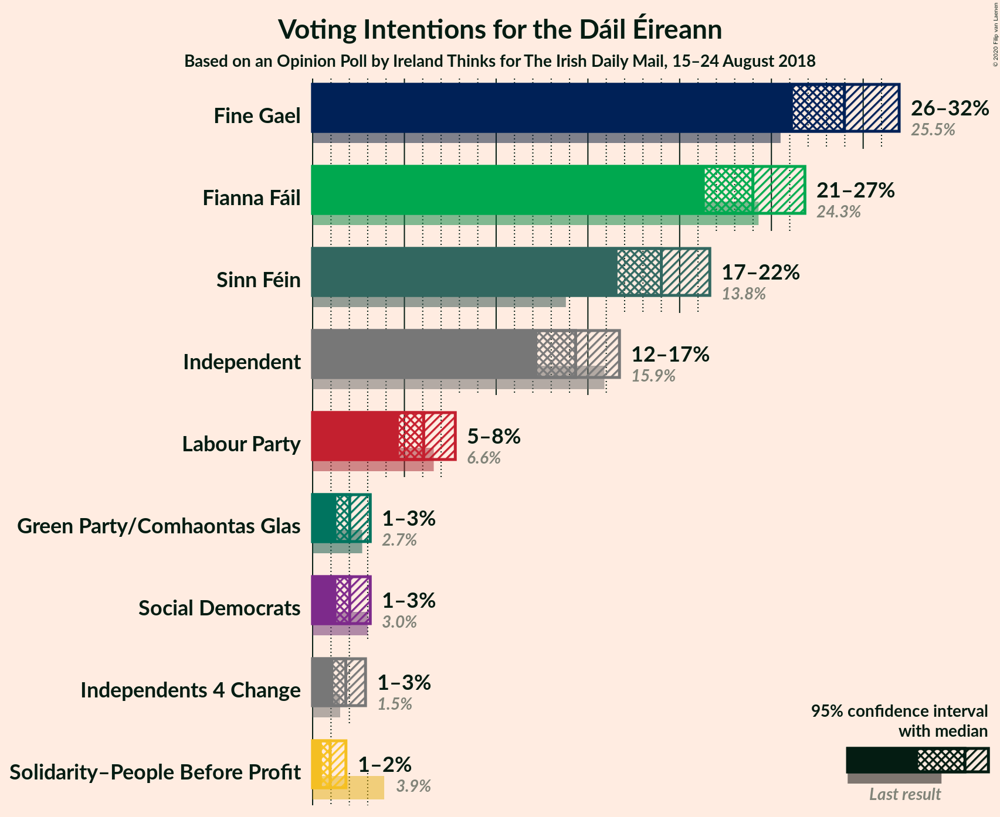
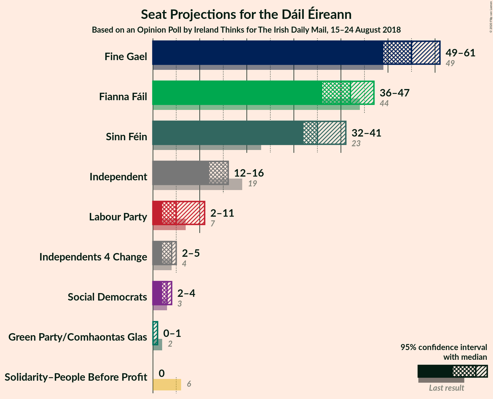
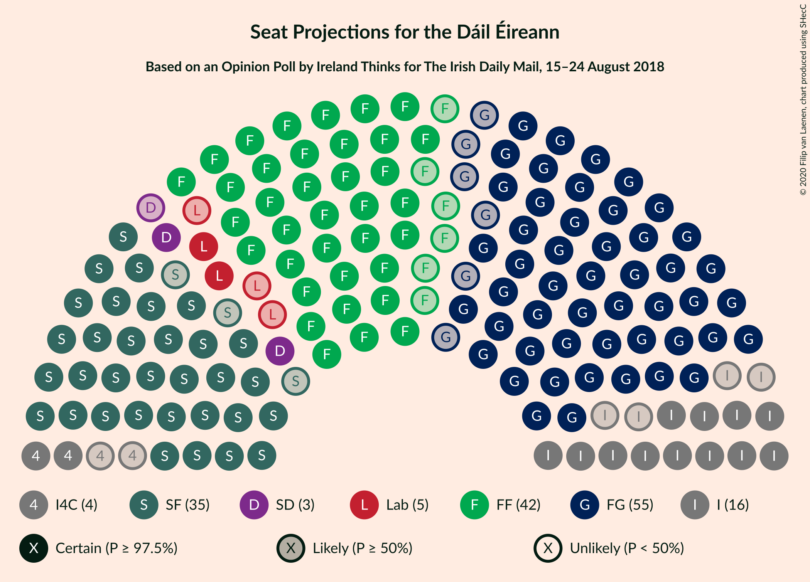
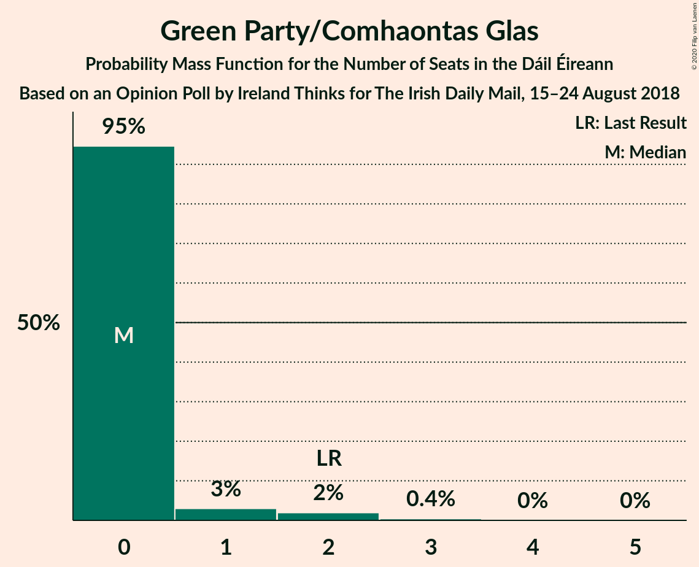
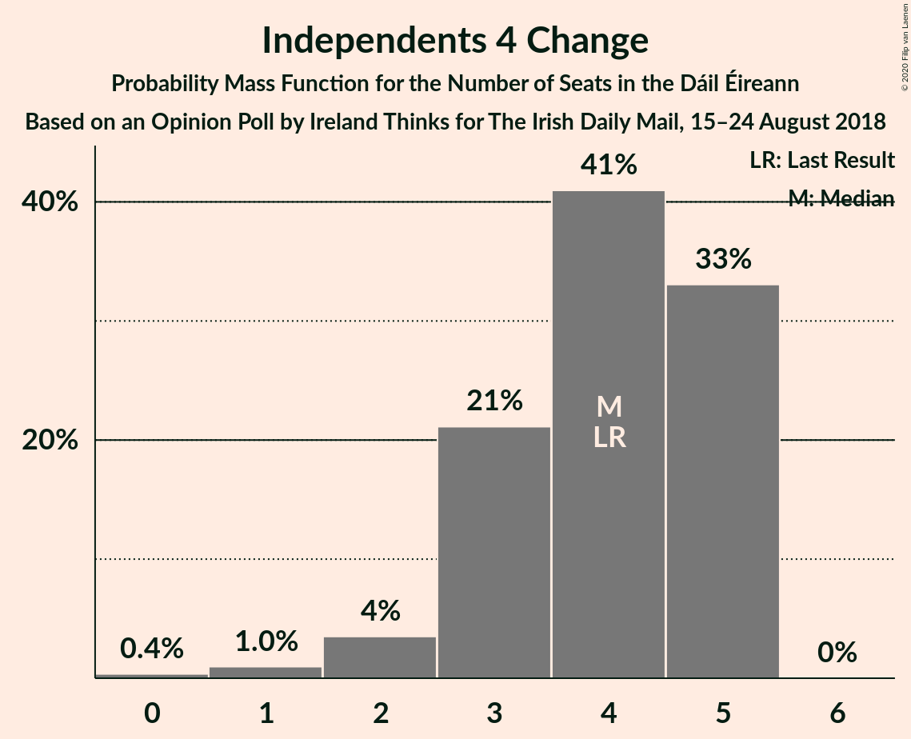
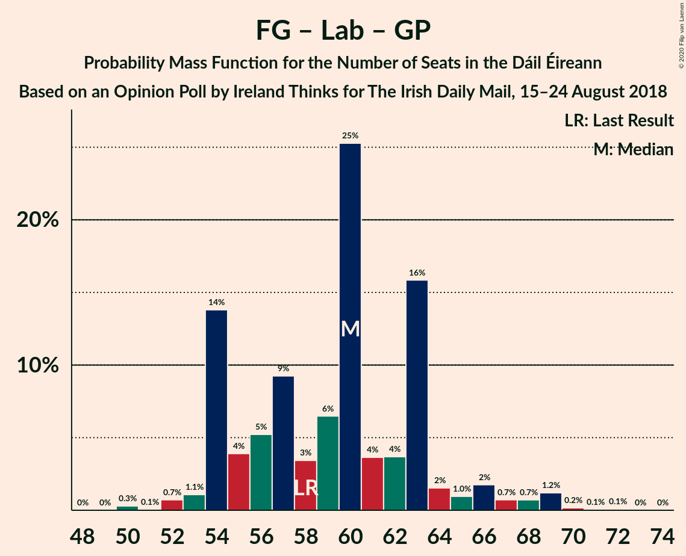
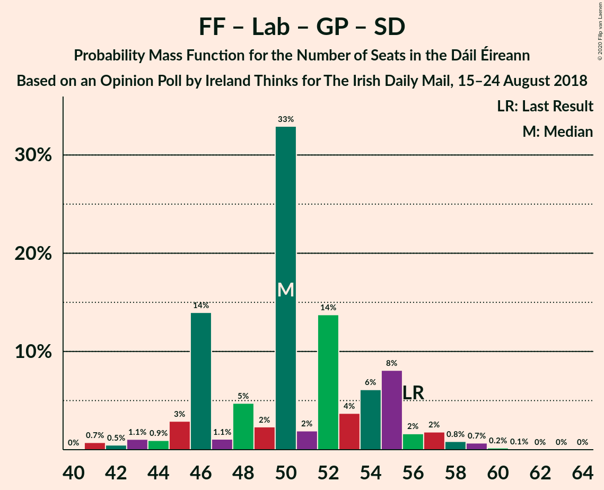

# Opinion Poll by Ireland Thinks for The Irish Daily Mail, 15–24 August 2018

<a href="#voting-intentions">Voting Intentions</a> | <a href="#seats">Seats</a> | <a href="#coalitions">Coalitions</a> | <a href="#technical-information">Technical Information</a>

## Voting Intentions

### Confidence Intervals

| Party | Last Result | Poll Result | 80% Confidence Interval | 90% Confidence Interval | 95% Confidence Interval | 99% Confidence Interval |
|:-----:|:-----------:|:-----------:|:-----------------------:|:-----------------------:|:-----------------------:|:-----------------------:|
| Fine Gael | 25.5% | 29.0% | 27.1–30.9% |26.6–31.5% |26.2–32.0% |25.3–32.9% |
| Fianna Fáil | 24.3% | 24.0% | 22.3–25.8% |21.8–26.4% |21.4–26.8% |20.6–27.7% |
| Sinn Féin | 13.8% | 19.0% | 17.4–20.7% |17.0–21.2% |16.6–21.6% |15.9–22.5% |
| Independent | 15.9% | 14.3% | 13.0–15.9% |12.6–16.3% |12.2–16.7% |11.6–17.5% |
| Labour Party | 6.6% | 6.1% | 5.2–7.2% |4.9–7.5% |4.7–7.8% |4.3–8.3% |
| Social Democrats | 3.0% | 2.0% | 1.5–2.7% |1.4–3.0% |1.3–3.1% |1.1–3.5% |
| Green Party/Comhaontas Glas | 2.7% | 2.0% | 1.5–2.7% |1.4–3.0% |1.3–3.1% |1.1–3.5% |
| Independents 4 Change | 1.5% | 1.8% | 1.4–2.5% |1.2–2.7% |1.1–2.9% |0.9–3.2% |
| Solidarity–People Before Profit | 3.9% | 1.0% | 0.7–1.5% |0.6–1.7% |0.5–1.8% |0.4–2.1% |

*Note:* The poll result column reflects the actual value used in the calculations. Published results may vary slightly, and in addition be rounded to fewer digits.

## Seats

### Confidence Intervals

| Party | Last Result | Median | 80% Confidence Interval | 90% Confidence Interval | 95% Confidence Interval | 99% Confidence Interval |
|:-----:|:-----------:|:------:|:-----------------------:|:-----------------------:|:-----------------------:|:-----------------------:|
| <a href="#fine-gael">Fine Gael</a> | 49 | 55 | 51–59 |50–59 |49–61 |45–63 |
| <a href="#fianna-fáil">Fianna Fáil</a> | 44 | 42 | 39–46 |37–47 |36–47 |35–48 |
| <a href="#sinn-féin">Sinn Féin</a> | 23 | 35 | 34–38 |32–40 |32–41 |30–41 |
| <a href="#independent">Independent</a> | 19 | 16 | 15–16 |13–16 |12–16 |7–17 |
| <a href="#labour-party">Labour Party</a> | 7 | 5 | 3–8 |3–9 |2–11 |1–14 |
| <a href="#social-democrats">Social Democrats</a> | 3 | 3 | 3 |3–4 |2–4 |0–4 |
| <a href="#green-party/comhaontas-glas">Green Party/Comhaontas Glas</a> | 2 | 0 | 0 |0–1 |0–1 |0–2 |
| <a href="#independents-4-change">Independents 4 Change</a> | 4 | 4 | 3–5 |3–5 |2–5 |1–5 |
| <a href="#solidarity–people-before-profit">Solidarity–People Before Profit</a> | 6 | 0 | 0 |0 |0 |0–1 |

### Fine Gael

*For a full overview of the results for this party, see the [Fine Gael](party-finegael.html) page.*

| Number of Seats | Probability | Accumulated | Special Marks |
|:---------------:|:-----------:|:-----------:|:-------------:|
| 44 | 0.3% | 100% |  |
| 45 | 0.5% | 99.7% |  |
| 46 | 0.4% | 99.1% |  |
| 47 | 0.2% | 98.7% |  |
| 48 | 0.3% | 98.5% |  |
| 49 | 0.9% | 98% | Last Result |
| 50 | 7% | 97% |  |
| 51 | 18% | 91% |  |
| 52 | 2% | 73% |  |
| 53 | 14% | 71% |  |
| 54 | 1.3% | 56% |  |
| 55 | 27% | 55% | Median |
| 56 | 5% | 28% |  |
| 57 | 1.5% | 23% |  |
| 58 | 4% | 22% |  |
| 59 | 14% | 17% |  |
| 60 | 0.3% | 3% |  |
| 61 | 0.7% | 3% |  |
| 62 | 0.4% | 2% |  |
| 63 | 1.2% | 2% |  |
| 64 | 0% | 0.4% |  |
| 65 | 0.3% | 0.3% |  |
| 66 | 0.1% | 0.1% |  |
| 67 | 0% | 0% |  |

### Fianna Fáil

*For a full overview of the results for this party, see the [Fianna Fáil](party-fiannafáil.html) page.*

| Number of Seats | Probability | Accumulated | Special Marks |
|:---------------:|:-----------:|:-----------:|:-------------:|
| 34 | 0.1% | 100% |  |
| 35 | 0.4% | 99.9% |  |
| 36 | 3% | 99.5% |  |
| 37 | 3% | 97% |  |
| 38 | 0.6% | 94% |  |
| 39 | 15% | 93% |  |
| 40 | 1.4% | 78% |  |
| 41 | 5% | 77% |  |
| 42 | 24% | 71% | Median |
| 43 | 6% | 48% |  |
| 44 | 17% | 42% | Last Result |
| 45 | 12% | 25% |  |
| 46 | 5% | 14% |  |
| 47 | 8% | 9% |  |
| 48 | 0.6% | 0.9% |  |
| 49 | 0.1% | 0.3% |  |
| 50 | 0% | 0.1% |  |
| 51 | 0.1% | 0.1% |  |
| 52 | 0% | 0% |  |

### Sinn Féin

*For a full overview of the results for this party, see the [Sinn Féin](party-sinnféin.html) page.*

| Number of Seats | Probability | Accumulated | Special Marks |
|:---------------:|:-----------:|:-----------:|:-------------:|
| 23 | 0% | 100% | Last Result |
| 24 | 0% | 100% |  |
| 25 | 0% | 100% |  |
| 26 | 0% | 100% |  |
| 27 | 0.1% | 100% |  |
| 28 | 0% | 99.9% |  |
| 29 | 0.1% | 99.9% |  |
| 30 | 0.8% | 99.8% |  |
| 31 | 0.3% | 99.0% |  |
| 32 | 5% | 98.7% |  |
| 33 | 3% | 94% |  |
| 34 | 20% | 91% |  |
| 35 | 31% | 71% | Median |
| 36 | 17% | 40% |  |
| 37 | 4% | 23% |  |
| 38 | 12% | 19% |  |
| 39 | 1.4% | 8% |  |
| 40 | 2% | 6% |  |
| 41 | 4% | 4% |  |
| 42 | 0.3% | 0.3% |  |
| 43 | 0.1% | 0.1% |  |
| 44 | 0% | 0% |  |

### Independent

*For a full overview of the results for this party, see the [Independent](party-independent.html) page.*

| Number of Seats | Probability | Accumulated | Special Marks |
|:---------------:|:-----------:|:-----------:|:-------------:|
| 6 | 0.1% | 100% |  |
| 7 | 1.1% | 99.9% |  |
| 8 | 0.1% | 98.8% |  |
| 9 | 0.5% | 98.6% |  |
| 10 | 0.2% | 98% |  |
| 11 | 0.3% | 98% |  |
| 12 | 0.3% | 98% |  |
| 13 | 4% | 97% |  |
| 14 | 4% | 94% |  |
| 15 | 4% | 90% |  |
| 16 | 85% | 86% | Median |
| 17 | 0.8% | 1.0% |  |
| 18 | 0% | 0.3% |  |
| 19 | 0.2% | 0.2% | Last Result |
| 20 | 0% | 0% |  |

### Labour Party

*For a full overview of the results for this party, see the [Labour Party](party-labourparty.html) page.*

| Number of Seats | Probability | Accumulated | Special Marks |
|:---------------:|:-----------:|:-----------:|:-------------:|
| 1 | 0.5% | 100% |  |
| 2 | 2% | 99.4% |  |
| 3 | 22% | 97% |  |
| 4 | 24% | 75% |  |
| 5 | 35% | 51% | Median |
| 6 | 2% | 16% |  |
| 7 | 3% | 14% | Last Result |
| 8 | 5% | 10% |  |
| 9 | 0.9% | 5% |  |
| 10 | 1.0% | 4% |  |
| 11 | 2% | 3% |  |
| 12 | 0.2% | 1.2% |  |
| 13 | 0.2% | 1.0% |  |
| 14 | 0.7% | 0.8% |  |
| 15 | 0.1% | 0.1% |  |
| 16 | 0% | 0% |  |

### Social Democrats

*For a full overview of the results for this party, see the [Social Democrats](party-socialdemocrats.html) page.*

| Number of Seats | Probability | Accumulated | Special Marks |
|:---------------:|:-----------:|:-----------:|:-------------:|
| 0 | 1.3% | 100% |  |
| 1 | 0.3% | 98.7% |  |
| 2 | 1.1% | 98% |  |
| 3 | 92% | 97% | Last Result, Median |
| 4 | 6% | 6% |  |
| 5 | 0% | 0% |  |

### Green Party/Comhaontas Glas

*For a full overview of the results for this party, see the [Green Party/Comhaontas Glas](party-greenpartycomhaontasglas.html) page.*

| Number of Seats | Probability | Accumulated | Special Marks |
|:---------------:|:-----------:|:-----------:|:-------------:|
| 0 | 95% | 100% | Median |
| 1 | 3% | 5% |  |
| 2 | 2% | 2% | Last Result |
| 3 | 0.4% | 0.4% |  |
| 4 | 0% | 0% |  |

### Independents 4 Change

*For a full overview of the results for this party, see the [Independents 4 Change](party-independents4change.html) page.*

| Number of Seats | Probability | Accumulated | Special Marks |
|:---------------:|:-----------:|:-----------:|:-------------:|
| 0 | 0.4% | 100% |  |
| 1 | 1.0% | 99.6% |  |
| 2 | 4% | 98.7% |  |
| 3 | 21% | 95% |  |
| 4 | 41% | 74% | Last Result, Median |
| 5 | 33% | 33% |  |
| 6 | 0% | 0% |  |

### Solidarity–People Before Profit

*For a full overview of the results for this party, see the [Solidarity–People Before Profit](party-solidarity–peoplebeforeprofit.html) page.*

| Number of Seats | Probability | Accumulated | Special Marks |
|:---------------:|:-----------:|:-----------:|:-------------:|
| 0 | 98.9% | 100% | Median |
| 1 | 0.9% | 1.1% |  |
| 2 | 0.2% | 0.2% |  |
| 3 | 0% | 0% |  |
| 4 | 0% | 0% |  |
| 5 | 0% | 0% |  |
| 6 | 0% | 0% | Last Result |

## Coalitions

### Confidence Intervals

| Coalition | Last Result | Median | Majority? | 80% Confidence Interval | 90% Confidence Interval | 95% Confidence Interval | 99% Confidence Interval |
|:---------:|:-----------:|:------:|:---------:|:-----------------------:|:-----------------------:|:-----------------------:|:-----------------------:|
| Fine Gael – Fianna Fáil | 93 | 97 | 100% | 94–99 | 92–102 | 91–102 | 88–105 |
| Fianna Fáil – Sinn Féin | 67 | 77 | 28% | 75–82 | 72–83 | 72–84 | 69–86 |
| Fine Gael – Labour Party – Green Party/Comhaontas Glas – Social Democrats | 61 | 63 | 0% | 57–66 | 57–68 | 57–70 | 55–72 |
| Fine Gael – Labour Party – Green Party/Comhaontas Glas | 58 | 60 | 0% | 54–63 | 54–65 | 54–67 | 52–69 |
| Fine Gael – Labour Party | 56 | 60 | 0% | 54–63 | 54–65 | 54–67 | 52–69 |
| Fine Gael – Green Party/Comhaontas Glas | 51 | 55 | 0% | 51–59 | 50–59 | 50–61 | 45–63 |
| Fine Gael | 49 | 55 | 0% | 51–59 | 50–59 | 49–61 | 45–63 |
| Fianna Fáil – Labour Party – Green Party/Comhaontas Glas – Social Democrats | 56 | 50 | 0% | 46–55 | 45–56 | 44–57 | 41–59 |
| Fianna Fáil – Labour Party – Green Party/Comhaontas Glas | 53 | 47 | 0% | 43–52 | 42–53 | 40–54 | 39–56 |
| Fianna Fáil – Labour Party | 51 | 47 | 0% | 43–52 | 42–52 | 40–53 | 39–56 |
| Fianna Fáil – Green Party/Comhaontas Glas | 46 | 42 | 0% | 39–46 | 37–47 | 37–47 | 36–49 |

### Fine Gael – Fianna Fáil

| Number of Seats | Probability | Accumulated | Special Marks |
|:---------------:|:-----------:|:-----------:|:-------------:|
| 84 | 0.1% | 100% |  |
| 85 | 0.1% | 99.9% |  |
| 86 | 0% | 99.8% |  |
| 87 | 0% | 99.8% |  |
| 88 | 0.3% | 99.7% |  |
| 89 | 1.1% | 99.4% |  |
| 90 | 0.3% | 98% |  |
| 91 | 0.9% | 98% |  |
| 92 | 5% | 97% |  |
| 93 | 0.9% | 92% | Last Result |
| 94 | 3% | 91% |  |
| 95 | 15% | 89% |  |
| 96 | 6% | 73% |  |
| 97 | 25% | 67% | Median |
| 98 | 29% | 43% |  |
| 99 | 5% | 14% |  |
| 100 | 2% | 9% |  |
| 101 | 0.4% | 6% |  |
| 102 | 5% | 6% |  |
| 103 | 0.2% | 1.1% |  |
| 104 | 0.1% | 0.8% |  |
| 105 | 0.4% | 0.7% |  |
| 106 | 0.1% | 0.3% |  |
| 107 | 0.1% | 0.1% |  |
| 108 | 0% | 0% |  |

### Fianna Fáil – Sinn Féin

| Number of Seats | Probability | Accumulated | Special Marks |
|:---------------:|:-----------:|:-----------:|:-------------:|
| 67 | 0% | 100% | Last Result |
| 68 | 0.1% | 100% |  |
| 69 | 0.5% | 99.9% |  |
| 70 | 0.3% | 99.4% |  |
| 71 | 0.6% | 99.1% |  |
| 72 | 4% | 98.6% |  |
| 73 | 2% | 95% |  |
| 74 | 1.0% | 93% |  |
| 75 | 14% | 92% |  |
| 76 | 6% | 78% |  |
| 77 | 25% | 72% | Median |
| 78 | 8% | 48% |  |
| 79 | 10% | 39% |  |
| 80 | 0.9% | 29% |  |
| 81 | 8% | 28% | Majority |
| 82 | 14% | 20% |  |
| 83 | 3% | 6% |  |
| 84 | 1.3% | 3% |  |
| 85 | 0.8% | 1.4% |  |
| 86 | 0.2% | 0.6% |  |
| 87 | 0.1% | 0.4% |  |
| 88 | 0.2% | 0.3% |  |
| 89 | 0% | 0% |  |

### Fine Gael – Labour Party – Green Party/Comhaontas Glas – Social Democrats

| Number of Seats | Probability | Accumulated | Special Marks |
|:---------------:|:-----------:|:-----------:|:-------------:|
| 52 | 0% | 100% |  |
| 53 | 0.3% | 99.9% |  |
| 54 | 0.1% | 99.7% |  |
| 55 | 0.7% | 99.6% |  |
| 56 | 1.1% | 98.9% |  |
| 57 | 11% | 98% |  |
| 58 | 7% | 87% |  |
| 59 | 5% | 80% |  |
| 60 | 9% | 75% |  |
| 61 | 3% | 66% | Last Result |
| 62 | 7% | 62% |  |
| 63 | 26% | 55% | Median |
| 64 | 3% | 29% |  |
| 65 | 3% | 26% |  |
| 66 | 16% | 23% |  |
| 67 | 1.3% | 7% |  |
| 68 | 1.1% | 6% |  |
| 69 | 2% | 5% |  |
| 70 | 0.9% | 3% |  |
| 71 | 0.6% | 2% |  |
| 72 | 1.2% | 2% |  |
| 73 | 0.2% | 0.3% |  |
| 74 | 0.1% | 0.2% |  |
| 75 | 0.1% | 0.1% |  |
| 76 | 0% | 0% |  |

### Fine Gael – Labour Party – Green Party/Comhaontas Glas

| Number of Seats | Probability | Accumulated | Special Marks |
|:---------------:|:-----------:|:-----------:|:-------------:|
| 49 | 0% | 100% |  |
| 50 | 0.3% | 99.9% |  |
| 51 | 0.1% | 99.7% |  |
| 52 | 0.7% | 99.6% |  |
| 53 | 1.1% | 98.9% |  |
| 54 | 14% | 98% |  |
| 55 | 4% | 84% |  |
| 56 | 5% | 80% |  |
| 57 | 9% | 75% |  |
| 58 | 3% | 66% | Last Result |
| 59 | 6% | 62% |  |
| 60 | 25% | 56% | Median |
| 61 | 4% | 30% |  |
| 62 | 4% | 27% |  |
| 63 | 16% | 23% |  |
| 64 | 2% | 7% |  |
| 65 | 1.0% | 6% |  |
| 66 | 2% | 5% |  |
| 67 | 0.7% | 3% |  |
| 68 | 0.7% | 2% |  |
| 69 | 1.2% | 2% |  |
| 70 | 0.2% | 0.3% |  |
| 71 | 0.1% | 0.2% |  |
| 72 | 0.1% | 0.1% |  |
| 73 | 0% | 0% |  |

### Fine Gael – Labour Party

| Number of Seats | Probability | Accumulated | Special Marks |
|:---------------:|:-----------:|:-----------:|:-------------:|
| 49 | 0.1% | 100% |  |
| 50 | 0.3% | 99.9% |  |
| 51 | 0.1% | 99.6% |  |
| 52 | 0.9% | 99.5% |  |
| 53 | 1.1% | 98.6% |  |
| 54 | 14% | 98% |  |
| 55 | 4% | 83% |  |
| 56 | 5% | 80% | Last Result |
| 57 | 9% | 75% |  |
| 58 | 6% | 65% |  |
| 59 | 6% | 60% |  |
| 60 | 24% | 54% | Median |
| 61 | 4% | 30% |  |
| 62 | 3% | 27% |  |
| 63 | 16% | 23% |  |
| 64 | 1.1% | 7% |  |
| 65 | 1.1% | 6% |  |
| 66 | 2% | 5% |  |
| 67 | 0.6% | 3% |  |
| 68 | 0.7% | 2% |  |
| 69 | 1.2% | 1.5% |  |
| 70 | 0.2% | 0.3% |  |
| 71 | 0.1% | 0.1% |  |
| 72 | 0.1% | 0.1% |  |
| 73 | 0% | 0% |  |

### Fine Gael – Green Party/Comhaontas Glas

| Number of Seats | Probability | Accumulated | Special Marks |
|:---------------:|:-----------:|:-----------:|:-------------:|
| 44 | 0.3% | 100% |  |
| 45 | 0.5% | 99.7% |  |
| 46 | 0% | 99.1% |  |
| 47 | 0.5% | 99.1% |  |
| 48 | 0.2% | 98.6% |  |
| 49 | 0.8% | 98% |  |
| 50 | 5% | 98% |  |
| 51 | 18% | 93% | Last Result |
| 52 | 4% | 74% |  |
| 53 | 14% | 71% |  |
| 54 | 1.3% | 57% |  |
| 55 | 26% | 55% | Median |
| 56 | 5% | 29% |  |
| 57 | 2% | 23% |  |
| 58 | 4% | 22% |  |
| 59 | 15% | 18% |  |
| 60 | 0.3% | 3% |  |
| 61 | 0.5% | 3% |  |
| 62 | 0.6% | 2% |  |
| 63 | 1.2% | 2% |  |
| 64 | 0% | 0.4% |  |
| 65 | 0.3% | 0.4% |  |
| 66 | 0.1% | 0.1% |  |
| 67 | 0% | 0% |  |

### Fine Gael

| Number of Seats | Probability | Accumulated | Special Marks |
|:---------------:|:-----------:|:-----------:|:-------------:|
| 44 | 0.3% | 100% |  |
| 45 | 0.5% | 99.7% |  |
| 46 | 0.4% | 99.1% |  |
| 47 | 0.2% | 98.7% |  |
| 48 | 0.3% | 98.5% |  |
| 49 | 0.9% | 98% | Last Result |
| 50 | 7% | 97% |  |
| 51 | 18% | 91% |  |
| 52 | 2% | 73% |  |
| 53 | 14% | 71% |  |
| 54 | 1.3% | 56% |  |
| 55 | 27% | 55% | Median |
| 56 | 5% | 28% |  |
| 57 | 1.5% | 23% |  |
| 58 | 4% | 22% |  |
| 59 | 14% | 17% |  |
| 60 | 0.3% | 3% |  |
| 61 | 0.7% | 3% |  |
| 62 | 0.4% | 2% |  |
| 63 | 1.2% | 2% |  |
| 64 | 0% | 0.4% |  |
| 65 | 0.3% | 0.3% |  |
| 66 | 0.1% | 0.1% |  |
| 67 | 0% | 0% |  |

### Fianna Fáil – Labour Party – Green Party/Comhaontas Glas – Social Democrats

| Number of Seats | Probability | Accumulated | Special Marks |
|:---------------:|:-----------:|:-----------:|:-------------:|
| 41 | 0.7% | 100% |  |
| 42 | 0.5% | 99.3% |  |
| 43 | 1.1% | 98.8% |  |
| 44 | 0.9% | 98% |  |
| 45 | 3% | 97% |  |
| 46 | 14% | 94% |  |
| 47 | 1.1% | 80% |  |
| 48 | 5% | 79% |  |
| 49 | 2% | 74% |  |
| 50 | 33% | 72% | Median |
| 51 | 2% | 39% |  |
| 52 | 14% | 37% |  |
| 53 | 4% | 23% |  |
| 54 | 6% | 19% |  |
| 55 | 8% | 13% |  |
| 56 | 2% | 5% | Last Result |
| 57 | 2% | 4% |  |
| 58 | 0.8% | 2% |  |
| 59 | 0.7% | 1.0% |  |
| 60 | 0.2% | 0.3% |  |
| 61 | 0.1% | 0.1% |  |
| 62 | 0% | 0.1% |  |
| 63 | 0% | 0% |  |

### Fianna Fáil – Labour Party – Green Party/Comhaontas Glas

| Number of Seats | Probability | Accumulated | Special Marks |
|:---------------:|:-----------:|:-----------:|:-------------:|
| 38 | 0.1% | 100% |  |
| 39 | 1.2% | 99.9% |  |
| 40 | 1.3% | 98.7% |  |
| 41 | 0.6% | 97% |  |
| 42 | 3% | 97% |  |
| 43 | 14% | 94% |  |
| 44 | 4% | 80% |  |
| 45 | 2% | 76% |  |
| 46 | 2% | 74% |  |
| 47 | 33% | 72% | Median |
| 48 | 1.1% | 39% |  |
| 49 | 14% | 38% |  |
| 50 | 5% | 24% |  |
| 51 | 6% | 20% |  |
| 52 | 8% | 13% |  |
| 53 | 2% | 5% | Last Result |
| 54 | 2% | 4% |  |
| 55 | 0.8% | 2% |  |
| 56 | 0.5% | 1.0% |  |
| 57 | 0.4% | 0.5% |  |
| 58 | 0.1% | 0.1% |  |
| 59 | 0% | 0.1% |  |
| 60 | 0% | 0.1% |  |
| 61 | 0% | 0% |  |

### Fianna Fáil – Labour Party

| Number of Seats | Probability | Accumulated | Special Marks |
|:---------------:|:-----------:|:-----------:|:-------------:|
| 38 | 0.2% | 100% |  |
| 39 | 2% | 99.7% |  |
| 40 | 0.8% | 98% |  |
| 41 | 0.6% | 97% |  |
| 42 | 3% | 97% |  |
| 43 | 14% | 94% |  |
| 44 | 5% | 80% |  |
| 45 | 1.1% | 75% |  |
| 46 | 2% | 74% |  |
| 47 | 33% | 72% | Median |
| 48 | 1.0% | 38% |  |
| 49 | 14% | 37% |  |
| 50 | 5% | 24% |  |
| 51 | 6% | 19% | Last Result |
| 52 | 9% | 13% |  |
| 53 | 2% | 4% |  |
| 54 | 0.5% | 2% |  |
| 55 | 0.6% | 2% |  |
| 56 | 0.8% | 1.0% |  |
| 57 | 0.1% | 0.2% |  |
| 58 | 0.1% | 0.1% |  |
| 59 | 0% | 0.1% |  |
| 60 | 0% | 0% |  |

### Fianna Fáil – Green Party/Comhaontas Glas

| Number of Seats | Probability | Accumulated | Special Marks |
|:---------------:|:-----------:|:-----------:|:-------------:|
| 34 | 0.1% | 100% |  |
| 35 | 0.3% | 99.9% |  |
| 36 | 2% | 99.5% |  |
| 37 | 3% | 98% |  |
| 38 | 0.7% | 94% |  |
| 39 | 15% | 93% |  |
| 40 | 2% | 78% |  |
| 41 | 5% | 77% |  |
| 42 | 24% | 72% | Median |
| 43 | 6% | 48% |  |
| 44 | 15% | 42% |  |
| 45 | 11% | 27% |  |
| 46 | 6% | 16% | Last Result |
| 47 | 8% | 9% |  |
| 48 | 1.0% | 2% |  |
| 49 | 0.4% | 0.6% |  |
| 50 | 0.1% | 0.2% |  |
| 51 | 0.1% | 0.1% |  |
| 52 | 0% | 0% |  |

## Technical Information

### Opinion Poll

+ **Polling firm:** Ireland Thinks
+ **Commissioner(s):** The Irish Daily Mail
+ **Fieldwork period:** 15–24 August 2018

### Calculations

+ **Sample size:** 942
+ **Simulations done:** 131,072
+ **Error estimate:** 1.40%

