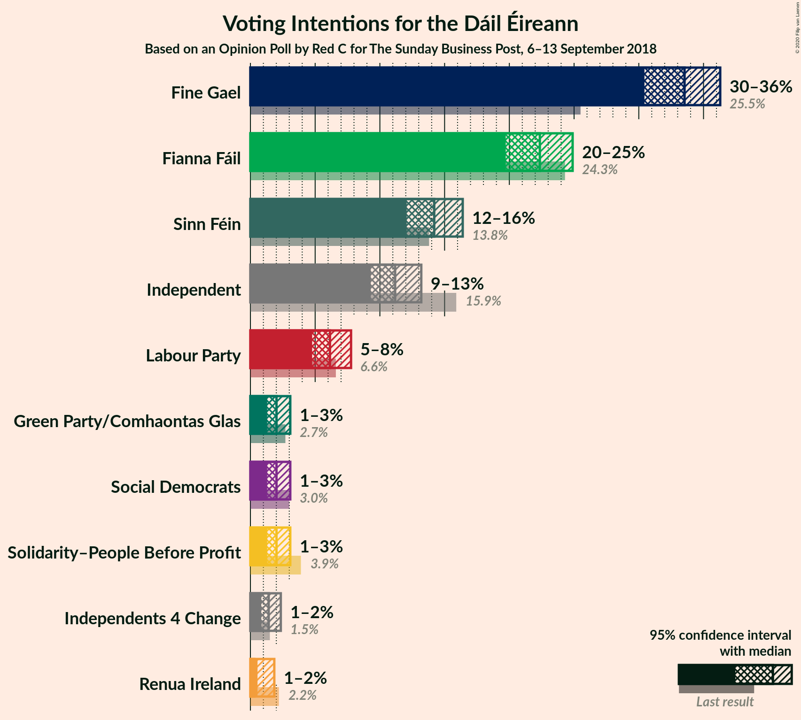
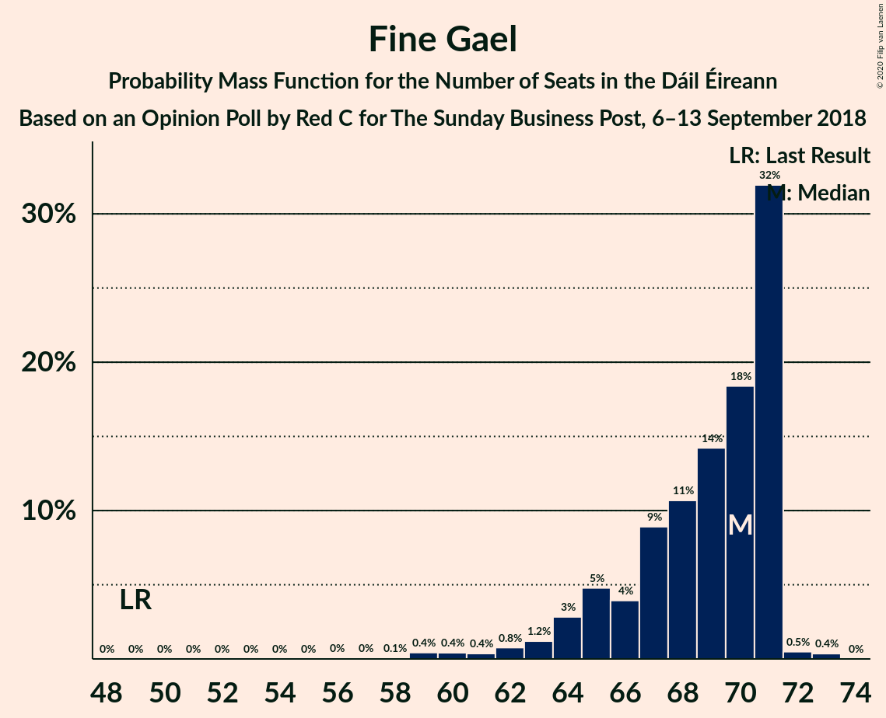
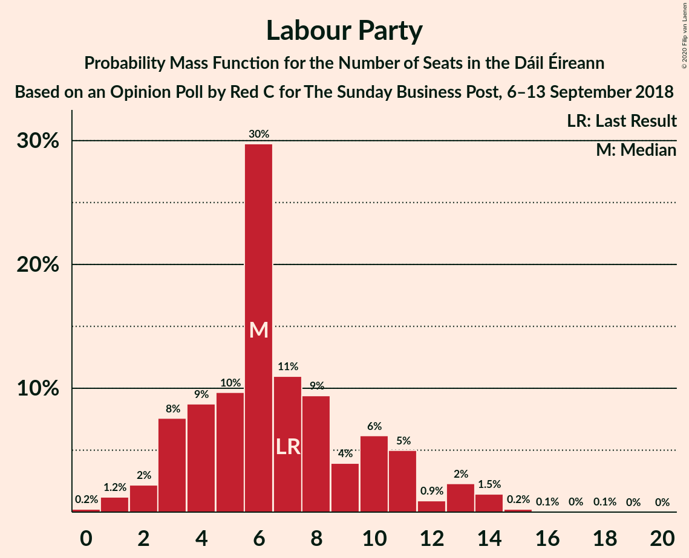
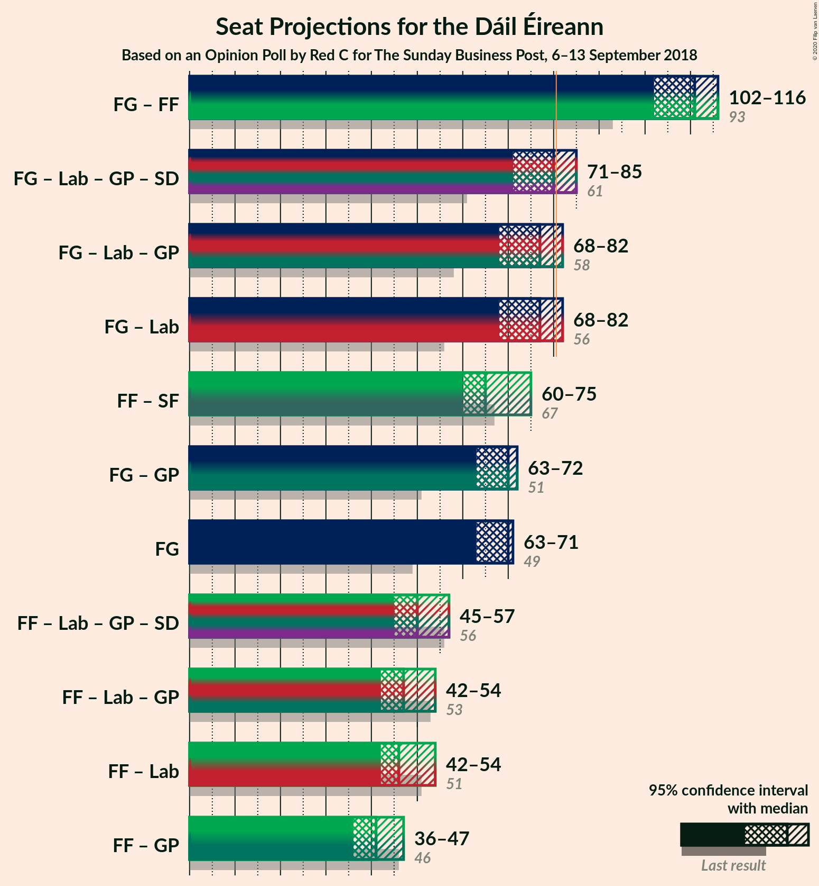
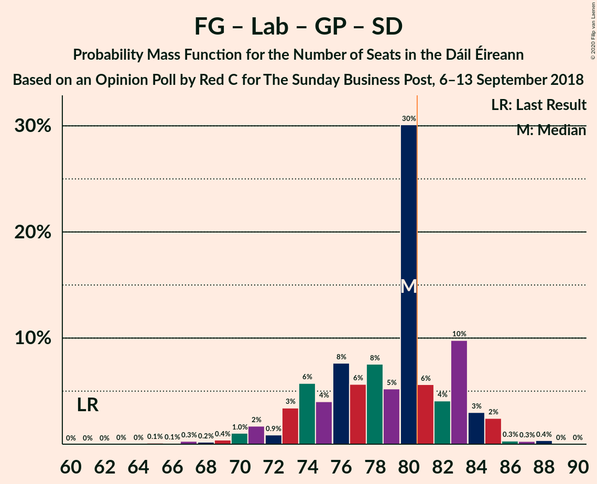

# Opinion Poll by Red C for The Sunday Business Post, 6–13 September 2018

<a href="#voting-intentions">Voting Intentions</a> | <a href="#seats">Seats</a> | <a href="#coalitions">Coalitions</a> | <a href="#technical-information">Technical Information</a>

## Voting Intentions

### Confidence Intervals

| Party | Last Result | Poll Result | 80% Confidence Interval | 90% Confidence Interval | 95% Confidence Interval | 99% Confidence Interval |
|:-----:|:-----------:|:-----------:|:-----------------------:|:-----------------------:|:-----------------------:|:-----------------------:|
| Fine Gael | 25.5% | 33.3% | 31.4–35.3% |30.9–35.8% |30.4–36.3% |29.6–37.2% |
| Fianna Fáil | 24.3% | 22.2% | 20.6–24.0% |20.1–24.4% |19.7–24.9% |19.0–25.7% |
| Sinn Féin | 13.8% | 14.1% | 12.8–15.6% |12.4–16.0% |12.1–16.4% |11.5–17.1% |
| Independent | 15.9% | 11.1% | 9.9–12.5% |9.6–12.9% |9.3–13.2% |8.7–13.9% |
| Labour Party | 6.6% | 6.1% | 5.2–7.2% |5.0–7.5% |4.8–7.8% |4.4–8.3% |
| Solidarity–People Before Profit | 3.9% | 2.0% | 1.5–2.7% |1.4–2.9% |1.3–3.1% |1.1–3.4% |
| Social Democrats | 3.0% | 2.0% | 1.5–2.7% |1.4–2.9% |1.3–3.1% |1.1–3.4% |
| Green Party/Comhaontas Glas | 2.7% | 2.0% | 1.5–2.7% |1.4–2.9% |1.3–3.1% |1.1–3.4% |
| Independents 4 Change | 1.5% | 1.4% | 1.0–2.0% |0.9–2.2% |0.8–2.3% |0.7–2.7% |
| Renua Ireland | 2.2% | 1.0% | 0.7–1.5% |0.6–1.7% |0.5–1.8% |0.4–2.1% |

*Note:* The poll result column reflects the actual value used in the calculations. Published results may vary slightly, and in addition be rounded to fewer digits.

## Seats

### Confidence Intervals

| Party | Last Result | Median | 80% Confidence Interval | 90% Confidence Interval | 95% Confidence Interval | 99% Confidence Interval |
|:-----:|:-----------:|:------:|:-----------------------:|:-----------------------:|:-----------------------:|:-----------------------:|
| <a href="#fine-gael">Fine Gael</a> | 49 | 70 | 65–71 |64–71 |63–71 |59–72 |
| <a href="#fianna-fáil">Fianna Fáil</a> | 44 | 40 | 38–44 |37–45 |36–46 |35–49 |
| <a href="#sinn-féin">Sinn Féin</a> | 23 | 25 | 21–31 |19–32 |19–33 |18–34 |
| <a href="#independent">Independent</a> | 19 | 12 | 7–13 |6–14 |5–14 |5–15 |
| <a href="#labour-party">Labour Party</a> | 7 | 6 | 3–11 |3–12 |2–13 |1–14 |
| <a href="#solidarity–people-before-profit">Solidarity–People Before Profit</a> | 6 | 1 | 0–3 |0–3 |0–3 |0–4 |
| <a href="#social-democrats">Social Democrats</a> | 3 | 3 | 3 |3–4 |3–4 |1–4 |
| <a href="#green-party/comhaontas-glas">Green Party/Comhaontas Glas</a> | 2 | 0 | 0–1 |0–1 |0–1 |0–1 |
| <a href="#independents-4-change">Independents 4 Change</a> | 4 | 2 | 2–4 |1–5 |0–5 |0–5 |
| <a href="#renua-ireland">Renua Ireland</a> | 0 | 0 | 0 |0 |0 |0–1 |

### Fine Gael

*For a full overview of the results for this party, see the [Fine Gael](party-finegael.html) page.*

| Number of Seats | Probability | Accumulated | Special Marks |
|:---------------:|:-----------:|:-----------:|:-------------:|
| 49 | 0% | 100% | Last Result |
| 50 | 0% | 100% |  |
| 51 | 0% | 100% |  |
| 52 | 0% | 100% |  |
| 53 | 0% | 100% |  |
| 54 | 0% | 100% |  |
| 55 | 0% | 100% |  |
| 56 | 0% | 100% |  |
| 57 | 0% | 99.9% |  |
| 58 | 0.1% | 99.9% |  |
| 59 | 0.4% | 99.8% |  |
| 60 | 0.4% | 99.3% |  |
| 61 | 0.4% | 98.9% |  |
| 62 | 0.8% | 98.6% |  |
| 63 | 1.2% | 98% |  |
| 64 | 3% | 97% |  |
| 65 | 5% | 94% |  |
| 66 | 4% | 89% |  |
| 67 | 9% | 85% |  |
| 68 | 11% | 76% |  |
| 69 | 14% | 65% |  |
| 70 | 18% | 51% | Median |
| 71 | 32% | 33% |  |
| 72 | 0.5% | 0.9% |  |
| 73 | 0.4% | 0.4% |  |
| 74 | 0% | 0% |  |

### Fianna Fáil

*For a full overview of the results for this party, see the [Fianna Fáil](party-fiannafáil.html) page.*

| Number of Seats | Probability | Accumulated | Special Marks |
|:---------------:|:-----------:|:-----------:|:-------------:|
| 33 | 0.1% | 100% |  |
| 34 | 0.2% | 99.9% |  |
| 35 | 0.9% | 99.7% |  |
| 36 | 2% | 98.8% |  |
| 37 | 2% | 96% |  |
| 38 | 8% | 95% |  |
| 39 | 8% | 87% |  |
| 40 | 30% | 79% | Median |
| 41 | 13% | 49% |  |
| 42 | 13% | 35% |  |
| 43 | 6% | 23% |  |
| 44 | 9% | 17% | Last Result |
| 45 | 4% | 8% |  |
| 46 | 2% | 4% |  |
| 47 | 1.3% | 2% |  |
| 48 | 0.4% | 0.9% |  |
| 49 | 0.2% | 0.5% |  |
| 50 | 0.1% | 0.3% |  |
| 51 | 0.2% | 0.2% |  |
| 52 | 0% | 0% |  |

### Sinn Féin

*For a full overview of the results for this party, see the [Sinn Féin](party-sinnféin.html) page.*

| Number of Seats | Probability | Accumulated | Special Marks |
|:---------------:|:-----------:|:-----------:|:-------------:|
| 17 | 0.3% | 100% |  |
| 18 | 0.3% | 99.6% |  |
| 19 | 6% | 99.4% |  |
| 20 | 2% | 93% |  |
| 21 | 9% | 91% |  |
| 22 | 8% | 82% |  |
| 23 | 6% | 74% | Last Result |
| 24 | 7% | 68% |  |
| 25 | 23% | 61% | Median |
| 26 | 3% | 39% |  |
| 27 | 4% | 36% |  |
| 28 | 10% | 32% |  |
| 29 | 8% | 22% |  |
| 30 | 3% | 14% |  |
| 31 | 3% | 10% |  |
| 32 | 4% | 8% |  |
| 33 | 2% | 4% |  |
| 34 | 2% | 2% |  |
| 35 | 0.3% | 0.4% |  |
| 36 | 0.1% | 0.1% |  |
| 37 | 0% | 0% |  |

### Independent

*For a full overview of the results for this party, see the [Independent](party-independent.html) page.*

| Number of Seats | Probability | Accumulated | Special Marks |
|:---------------:|:-----------:|:-----------:|:-------------:|
| 4 | 0.3% | 100% |  |
| 5 | 2% | 99.7% |  |
| 6 | 3% | 97% |  |
| 7 | 9% | 95% |  |
| 8 | 7% | 86% |  |
| 9 | 11% | 79% |  |
| 10 | 10% | 69% |  |
| 11 | 6% | 59% |  |
| 12 | 16% | 52% | Median |
| 13 | 31% | 36% |  |
| 14 | 4% | 5% |  |
| 15 | 0.5% | 0.8% |  |
| 16 | 0.4% | 0.4% |  |
| 17 | 0% | 0% |  |
| 18 | 0% | 0% |  |
| 19 | 0% | 0% | Last Result |

### Labour Party

*For a full overview of the results for this party, see the [Labour Party](party-labourparty.html) page.*

| Number of Seats | Probability | Accumulated | Special Marks |
|:---------------:|:-----------:|:-----------:|:-------------:|
| 0 | 0.2% | 100% |  |
| 1 | 1.2% | 99.8% |  |
| 2 | 2% | 98.5% |  |
| 3 | 8% | 96% |  |
| 4 | 9% | 89% |  |
| 5 | 10% | 80% |  |
| 6 | 30% | 70% | Median |
| 7 | 11% | 41% | Last Result |
| 8 | 9% | 30% |  |
| 9 | 4% | 20% |  |
| 10 | 6% | 16% |  |
| 11 | 5% | 10% |  |
| 12 | 0.9% | 5% |  |
| 13 | 2% | 4% |  |
| 14 | 1.5% | 2% |  |
| 15 | 0.2% | 0.4% |  |
| 16 | 0.1% | 0.2% |  |
| 17 | 0% | 0.1% |  |
| 18 | 0.1% | 0.1% |  |
| 19 | 0% | 0% |  |

### Solidarity–People Before Profit

*For a full overview of the results for this party, see the [Solidarity–People Before Profit](party-solidarity–peoplebeforeprofit.html) page.*

| Number of Seats | Probability | Accumulated | Special Marks |
|:---------------:|:-----------:|:-----------:|:-------------:|
| 0 | 44% | 100% |  |
| 1 | 13% | 56% | Median |
| 2 | 12% | 43% |  |
| 3 | 29% | 31% |  |
| 4 | 2% | 2% |  |
| 5 | 0% | 0% |  |
| 6 | 0% | 0% | Last Result |

### Social Democrats

*For a full overview of the results for this party, see the [Social Democrats](party-socialdemocrats.html) page.*

| Number of Seats | Probability | Accumulated | Special Marks |
|:---------------:|:-----------:|:-----------:|:-------------:|
| 1 | 1.3% | 100% |  |
| 2 | 0.2% | 98.6% |  |
| 3 | 92% | 98% | Last Result, Median |
| 4 | 6% | 6% |  |
| 5 | 0.1% | 0.1% |  |
| 6 | 0% | 0% |  |

### Green Party/Comhaontas Glas

*For a full overview of the results for this party, see the [Green Party/Comhaontas Glas](party-greenpartycomhaontasglas.html) page.*

| Number of Seats | Probability | Accumulated | Special Marks |
|:---------------:|:-----------:|:-----------:|:-------------:|
| 0 | 70% | 100% | Median |
| 1 | 30% | 30% |  |
| 2 | 0.3% | 0.4% | Last Result |
| 3 | 0.1% | 0.1% |  |
| 4 | 0% | 0% |  |

### Independents 4 Change

*For a full overview of the results for this party, see the [Independents 4 Change](party-independents4change.html) page.*

| Number of Seats | Probability | Accumulated | Special Marks |
|:---------------:|:-----------:|:-----------:|:-------------:|
| 0 | 3% | 100% |  |
| 1 | 5% | 97% |  |
| 2 | 47% | 91% | Median |
| 3 | 10% | 44% |  |
| 4 | 25% | 34% | Last Result |
| 5 | 10% | 10% |  |
| 6 | 0% | 0% |  |

### Renua Ireland

*For a full overview of the results for this party, see the [Renua Ireland](party-renuaireland.html) page.*

| Number of Seats | Probability | Accumulated | Special Marks |
|:---------------:|:-----------:|:-----------:|:-------------:|
| 0 | 98.9% | 100% | Last Result, Median |
| 1 | 0.7% | 1.1% |  |
| 2 | 0.4% | 0.4% |  |
| 3 | 0% | 0% |  |

## Coalitions

### Confidence Intervals

| Coalition | Last Result | Median | Majority? | 80% Confidence Interval | 90% Confidence Interval | 95% Confidence Interval | 99% Confidence Interval |
|:---------:|:-----------:|:------:|:---------:|:-----------------------:|:-----------------------:|:-----------------------:|:-----------------------:|
| Fine Gael – Fianna Fáil | 93 | 111 | 100% | 105–114 | 103–115 | 102–116 | 100–118 |
| Fine Gael – Labour Party – Green Party/Comhaontas Glas – Social Democrats | 61 | 80 | 26% | 74–83 | 73–84 | 71–85 | 68–87 |
| Fine Gael – Labour Party – Green Party/Comhaontas Glas | 58 | 77 | 6% | 71–80 | 70–81 | 68–82 | 65–84 |
| Fine Gael – Labour Party | 56 | 77 | 5% | 71–80 | 69–80 | 68–82 | 64–84 |
| Fianna Fáil – Sinn Féin | 67 | 65 | 0.1% | 62–71 | 61–73 | 60–75 | 58–77 |
| Fine Gael – Green Party/Comhaontas Glas | 51 | 70 | 0% | 66–71 | 64–72 | 63–72 | 59–72 |
| Fine Gael | 49 | 70 | 0% | 65–71 | 64–71 | 63–71 | 59–72 |
| Fianna Fáil – Labour Party – Green Party/Comhaontas Glas – Social Democrats | 56 | 50 | 0% | 47–55 | 46–56 | 45–57 | 43–61 |
| Fianna Fáil – Labour Party – Green Party/Comhaontas Glas | 53 | 47 | 0% | 44–52 | 43–53 | 42–54 | 40–58 |
| Fianna Fáil – Labour Party | 51 | 46 | 0% | 44–52 | 43–53 | 42–54 | 39–58 |
| Fianna Fáil – Green Party/Comhaontas Glas | 46 | 41 | 0% | 39–44 | 38–46 | 36–47 | 35–49 |

### Fine Gael – Fianna Fáil

| Number of Seats | Probability | Accumulated | Special Marks |
|:---------------:|:-----------:|:-----------:|:-------------:|
| 93 | 0% | 100% | Last Result |
| 94 | 0% | 100% |  |
| 95 | 0% | 100% |  |
| 96 | 0% | 100% |  |
| 97 | 0.1% | 99.9% |  |
| 98 | 0.1% | 99.9% |  |
| 99 | 0.1% | 99.8% |  |
| 100 | 0.6% | 99.6% |  |
| 101 | 1.4% | 99.0% |  |
| 102 | 2% | 98% |  |
| 103 | 3% | 96% |  |
| 104 | 2% | 93% |  |
| 105 | 4% | 92% |  |
| 106 | 3% | 88% |  |
| 107 | 10% | 85% |  |
| 108 | 7% | 75% |  |
| 109 | 7% | 68% |  |
| 110 | 4% | 61% | Median |
| 111 | 30% | 57% |  |
| 112 | 10% | 27% |  |
| 113 | 6% | 17% |  |
| 114 | 2% | 11% |  |
| 115 | 5% | 8% |  |
| 116 | 3% | 4% |  |
| 117 | 0.3% | 0.9% |  |
| 118 | 0.4% | 0.5% |  |
| 119 | 0.1% | 0.2% |  |
| 120 | 0.1% | 0.1% |  |
| 121 | 0% | 0% |  |

### Fine Gael – Labour Party – Green Party/Comhaontas Glas – Social Democrats

| Number of Seats | Probability | Accumulated | Special Marks |
|:---------------:|:-----------:|:-----------:|:-------------:|
| 61 | 0% | 100% | Last Result |
| 62 | 0% | 100% |  |
| 63 | 0% | 100% |  |
| 64 | 0% | 100% |  |
| 65 | 0.1% | 100% |  |
| 66 | 0.1% | 99.9% |  |
| 67 | 0.3% | 99.8% |  |
| 68 | 0.2% | 99.5% |  |
| 69 | 0.4% | 99.3% |  |
| 70 | 1.0% | 98.9% |  |
| 71 | 2% | 98% |  |
| 72 | 0.9% | 96% |  |
| 73 | 3% | 95% |  |
| 74 | 6% | 92% |  |
| 75 | 4% | 86% |  |
| 76 | 8% | 82% |  |
| 77 | 6% | 74% |  |
| 78 | 8% | 69% |  |
| 79 | 5% | 61% | Median |
| 80 | 30% | 56% |  |
| 81 | 6% | 26% | Majority |
| 82 | 4% | 20% |  |
| 83 | 10% | 16% |  |
| 84 | 3% | 6% |  |
| 85 | 2% | 3% |  |
| 86 | 0.3% | 1.0% |  |
| 87 | 0.3% | 0.7% |  |
| 88 | 0.4% | 0.4% |  |
| 89 | 0% | 0.1% |  |
| 90 | 0% | 0% |  |

### Fine Gael – Labour Party – Green Party/Comhaontas Glas

| Number of Seats | Probability | Accumulated | Special Marks |
|:---------------:|:-----------:|:-----------:|:-------------:|
| 58 | 0% | 100% | Last Result |
| 59 | 0% | 100% |  |
| 60 | 0% | 100% |  |
| 61 | 0% | 100% |  |
| 62 | 0.1% | 100% |  |
| 63 | 0.1% | 99.9% |  |
| 64 | 0.3% | 99.8% |  |
| 65 | 0.2% | 99.5% |  |
| 66 | 0.4% | 99.3% |  |
| 67 | 1.2% | 98.9% |  |
| 68 | 2% | 98% |  |
| 69 | 0.9% | 96% |  |
| 70 | 3% | 95% |  |
| 71 | 6% | 92% |  |
| 72 | 3% | 86% |  |
| 73 | 8% | 82% |  |
| 74 | 7% | 74% |  |
| 75 | 7% | 68% |  |
| 76 | 5% | 61% | Median |
| 77 | 29% | 56% |  |
| 78 | 6% | 26% |  |
| 79 | 4% | 20% |  |
| 80 | 9% | 16% |  |
| 81 | 3% | 6% | Majority |
| 82 | 2% | 3% |  |
| 83 | 0.3% | 1.0% |  |
| 84 | 0.2% | 0.7% |  |
| 85 | 0.4% | 0.5% |  |
| 86 | 0% | 0.1% |  |
| 87 | 0% | 0% |  |

### Fine Gael – Labour Party

| Number of Seats | Probability | Accumulated | Special Marks |
|:---------------:|:-----------:|:-----------:|:-------------:|
| 56 | 0% | 100% | Last Result |
| 57 | 0% | 100% |  |
| 58 | 0% | 100% |  |
| 59 | 0% | 100% |  |
| 60 | 0% | 100% |  |
| 61 | 0% | 100% |  |
| 62 | 0.1% | 100% |  |
| 63 | 0.1% | 99.9% |  |
| 64 | 0.3% | 99.8% |  |
| 65 | 0.2% | 99.5% |  |
| 66 | 0.5% | 99.3% |  |
| 67 | 1.2% | 98.8% |  |
| 68 | 2% | 98% |  |
| 69 | 2% | 96% |  |
| 70 | 4% | 94% |  |
| 71 | 6% | 90% |  |
| 72 | 7% | 85% |  |
| 73 | 7% | 77% |  |
| 74 | 6% | 70% |  |
| 75 | 6% | 65% |  |
| 76 | 6% | 58% | Median |
| 77 | 30% | 53% |  |
| 78 | 4% | 22% |  |
| 79 | 3% | 18% |  |
| 80 | 10% | 15% |  |
| 81 | 2% | 5% | Majority |
| 82 | 2% | 3% |  |
| 83 | 0.3% | 0.9% |  |
| 84 | 0.5% | 0.7% |  |
| 85 | 0.1% | 0.2% |  |
| 86 | 0% | 0.1% |  |
| 87 | 0% | 0% |  |

### Fianna Fáil – Sinn Féin

| Number of Seats | Probability | Accumulated | Special Marks |
|:---------------:|:-----------:|:-----------:|:-------------:|
| 57 | 0% | 100% |  |
| 58 | 0.5% | 99.9% |  |
| 59 | 1.0% | 99.4% |  |
| 60 | 3% | 98% |  |
| 61 | 5% | 96% |  |
| 62 | 6% | 90% |  |
| 63 | 6% | 84% |  |
| 64 | 5% | 78% |  |
| 65 | 24% | 73% | Median |
| 66 | 7% | 49% |  |
| 67 | 8% | 42% | Last Result |
| 68 | 9% | 34% |  |
| 69 | 6% | 26% |  |
| 70 | 5% | 19% |  |
| 71 | 6% | 14% |  |
| 72 | 2% | 8% |  |
| 73 | 2% | 6% |  |
| 74 | 1.4% | 5% |  |
| 75 | 0.8% | 3% |  |
| 76 | 1.4% | 2% |  |
| 77 | 0.7% | 1.1% |  |
| 78 | 0.1% | 0.3% |  |
| 79 | 0% | 0.2% |  |
| 80 | 0.1% | 0.2% |  |
| 81 | 0% | 0.1% | Majority |
| 82 | 0% | 0% |  |

### Fine Gael – Green Party/Comhaontas Glas

| Number of Seats | Probability | Accumulated | Special Marks |
|:---------------:|:-----------:|:-----------:|:-------------:|
| 51 | 0% | 100% | Last Result |
| 52 | 0% | 100% |  |
| 53 | 0% | 100% |  |
| 54 | 0% | 100% |  |
| 55 | 0% | 100% |  |
| 56 | 0% | 100% |  |
| 57 | 0% | 99.9% |  |
| 58 | 0.1% | 99.9% |  |
| 59 | 0.4% | 99.8% |  |
| 60 | 0.4% | 99.4% |  |
| 61 | 0.4% | 99.0% |  |
| 62 | 0.8% | 98.6% |  |
| 63 | 0.9% | 98% |  |
| 64 | 2% | 97% |  |
| 65 | 4% | 95% |  |
| 66 | 3% | 90% |  |
| 67 | 8% | 87% |  |
| 68 | 8% | 79% |  |
| 69 | 13% | 71% |  |
| 70 | 21% | 59% | Median |
| 71 | 32% | 37% |  |
| 72 | 5% | 6% |  |
| 73 | 0.4% | 0.5% |  |
| 74 | 0% | 0% |  |

### Fine Gael

| Number of Seats | Probability | Accumulated | Special Marks |
|:---------------:|:-----------:|:-----------:|:-------------:|
| 49 | 0% | 100% | Last Result |
| 50 | 0% | 100% |  |
| 51 | 0% | 100% |  |
| 52 | 0% | 100% |  |
| 53 | 0% | 100% |  |
| 54 | 0% | 100% |  |
| 55 | 0% | 100% |  |
| 56 | 0% | 100% |  |
| 57 | 0% | 99.9% |  |
| 58 | 0.1% | 99.9% |  |
| 59 | 0.4% | 99.8% |  |
| 60 | 0.4% | 99.3% |  |
| 61 | 0.4% | 98.9% |  |
| 62 | 0.8% | 98.6% |  |
| 63 | 1.2% | 98% |  |
| 64 | 3% | 97% |  |
| 65 | 5% | 94% |  |
| 66 | 4% | 89% |  |
| 67 | 9% | 85% |  |
| 68 | 11% | 76% |  |
| 69 | 14% | 65% |  |
| 70 | 18% | 51% | Median |
| 71 | 32% | 33% |  |
| 72 | 0.5% | 0.9% |  |
| 73 | 0.4% | 0.4% |  |
| 74 | 0% | 0% |  |

### Fianna Fáil – Labour Party – Green Party/Comhaontas Glas – Social Democrats

| Number of Seats | Probability | Accumulated | Special Marks |
|:---------------:|:-----------:|:-----------:|:-------------:|
| 42 | 0.3% | 100% |  |
| 43 | 0.2% | 99.6% |  |
| 44 | 0.5% | 99.4% |  |
| 45 | 2% | 98.9% |  |
| 46 | 3% | 97% |  |
| 47 | 5% | 94% |  |
| 48 | 6% | 89% |  |
| 49 | 32% | 83% | Median |
| 50 | 5% | 52% |  |
| 51 | 8% | 46% |  |
| 52 | 8% | 38% |  |
| 53 | 5% | 31% |  |
| 54 | 6% | 26% |  |
| 55 | 11% | 20% |  |
| 56 | 6% | 9% | Last Result |
| 57 | 2% | 3% |  |
| 58 | 0.6% | 2% |  |
| 59 | 0.3% | 1.1% |  |
| 60 | 0.3% | 0.8% |  |
| 61 | 0.3% | 0.5% |  |
| 62 | 0.1% | 0.2% |  |
| 63 | 0% | 0.1% |  |
| 64 | 0% | 0% |  |

### Fianna Fáil – Labour Party – Green Party/Comhaontas Glas

| Number of Seats | Probability | Accumulated | Special Marks |
|:---------------:|:-----------:|:-----------:|:-------------:|
| 38 | 0% | 100% |  |
| 39 | 0.3% | 99.9% |  |
| 40 | 0.2% | 99.6% |  |
| 41 | 0.5% | 99.4% |  |
| 42 | 2% | 98.9% |  |
| 43 | 4% | 97% |  |
| 44 | 6% | 94% |  |
| 45 | 6% | 88% |  |
| 46 | 31% | 82% | Median |
| 47 | 6% | 51% |  |
| 48 | 7% | 45% |  |
| 49 | 7% | 38% |  |
| 50 | 5% | 31% |  |
| 51 | 6% | 26% |  |
| 52 | 11% | 20% |  |
| 53 | 6% | 9% | Last Result |
| 54 | 2% | 3% |  |
| 55 | 0.6% | 2% |  |
| 56 | 0.3% | 1.1% |  |
| 57 | 0.3% | 0.8% |  |
| 58 | 0.3% | 0.5% |  |
| 59 | 0.1% | 0.2% |  |
| 60 | 0% | 0.1% |  |
| 61 | 0% | 0% |  |

### Fianna Fáil – Labour Party

| Number of Seats | Probability | Accumulated | Special Marks |
|:---------------:|:-----------:|:-----------:|:-------------:|
| 38 | 0% | 100% |  |
| 39 | 0.4% | 99.9% |  |
| 40 | 0.2% | 99.5% |  |
| 41 | 0.9% | 99.3% |  |
| 42 | 2% | 98% |  |
| 43 | 5% | 96% |  |
| 44 | 5% | 92% |  |
| 45 | 10% | 87% |  |
| 46 | 28% | 77% | Median |
| 47 | 8% | 48% |  |
| 48 | 5% | 41% |  |
| 49 | 6% | 36% |  |
| 50 | 7% | 30% |  |
| 51 | 6% | 24% | Last Result |
| 52 | 11% | 17% |  |
| 53 | 3% | 6% |  |
| 54 | 1.0% | 3% |  |
| 55 | 0.5% | 1.5% |  |
| 56 | 0.2% | 1.0% |  |
| 57 | 0.3% | 0.8% |  |
| 58 | 0.3% | 0.5% |  |
| 59 | 0.1% | 0.2% |  |
| 60 | 0% | 0.1% |  |
| 61 | 0% | 0% |  |

### Fianna Fáil – Green Party/Comhaontas Glas

| Number of Seats | Probability | Accumulated | Special Marks |
|:---------------:|:-----------:|:-----------:|:-------------:|
| 33 | 0.1% | 100% |  |
| 34 | 0.2% | 99.9% |  |
| 35 | 0.9% | 99.7% |  |
| 36 | 1.5% | 98.8% |  |
| 37 | 2% | 97% |  |
| 38 | 5% | 96% |  |
| 39 | 10% | 91% |  |
| 40 | 31% | 81% | Median |
| 41 | 8% | 50% |  |
| 42 | 16% | 43% |  |
| 43 | 8% | 27% |  |
| 44 | 9% | 19% |  |
| 45 | 4% | 10% |  |
| 46 | 3% | 6% | Last Result |
| 47 | 2% | 4% |  |
| 48 | 0.4% | 1.1% |  |
| 49 | 0.3% | 0.7% |  |
| 50 | 0.2% | 0.4% |  |
| 51 | 0.1% | 0.2% |  |
| 52 | 0.1% | 0.1% |  |
| 53 | 0% | 0% |  |

## Technical Information

### Opinion Poll

+ **Polling firm:** Red C
+ **Commissioner(s):** The Sunday Business Post
+ **Fieldwork period:** 6–13 September 2018

### Calculations

+ **Sample size:** 1000
+ **Simulations done:** 1,048,576
+ **Error estimate:** 1.37%

