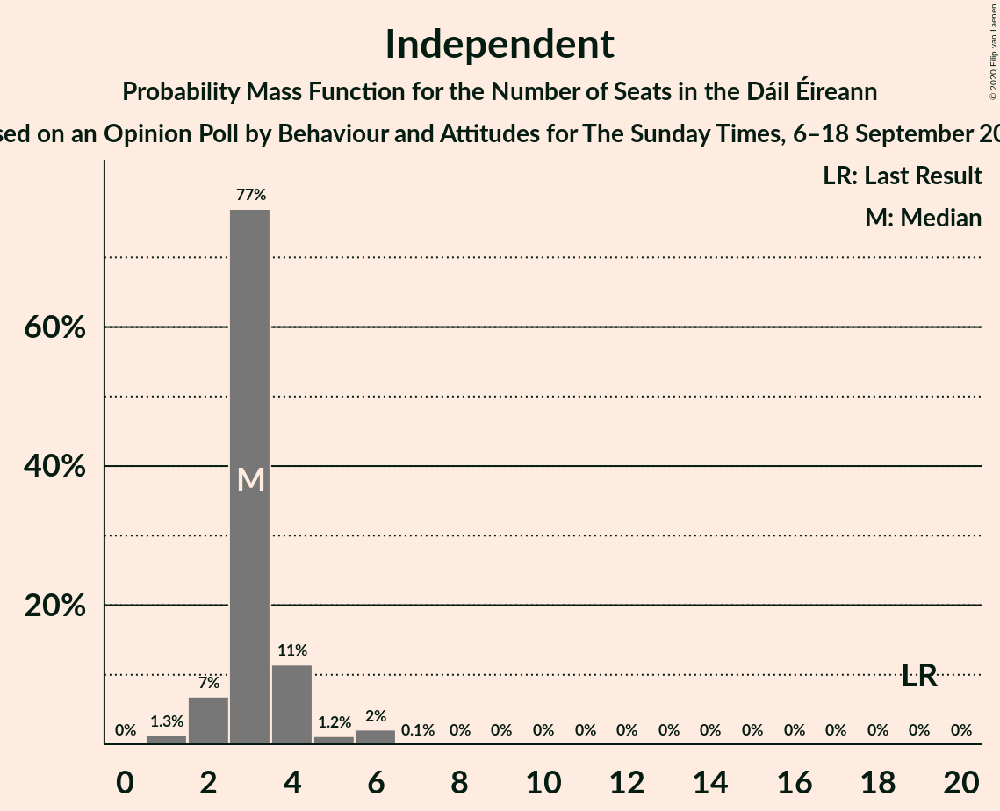
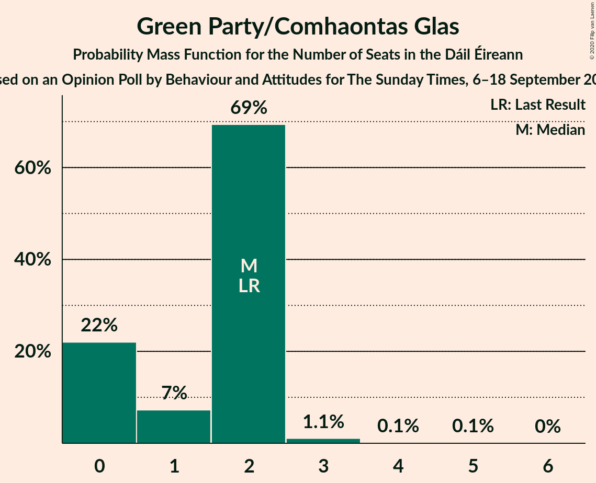
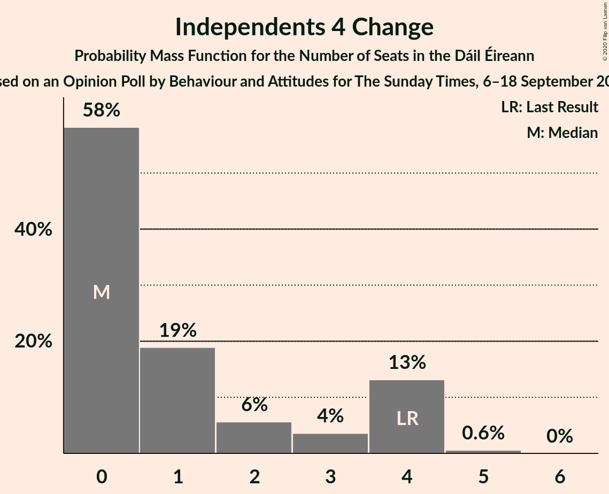
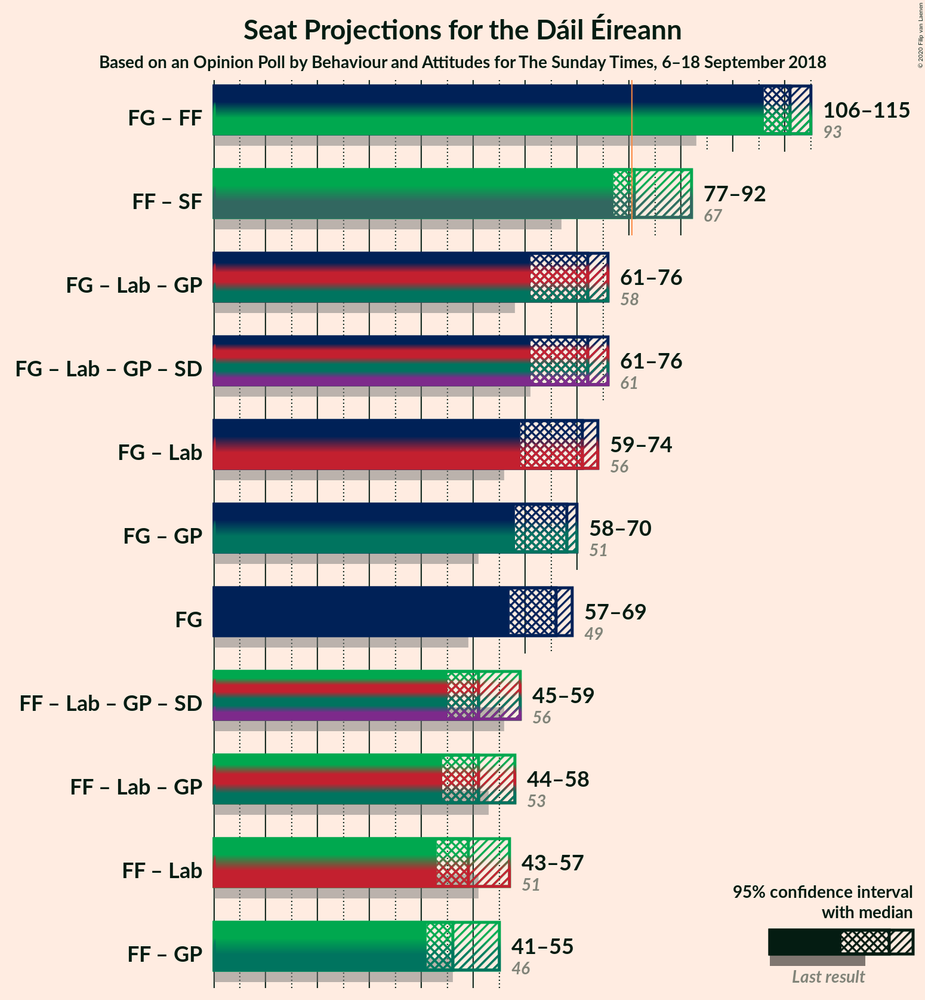
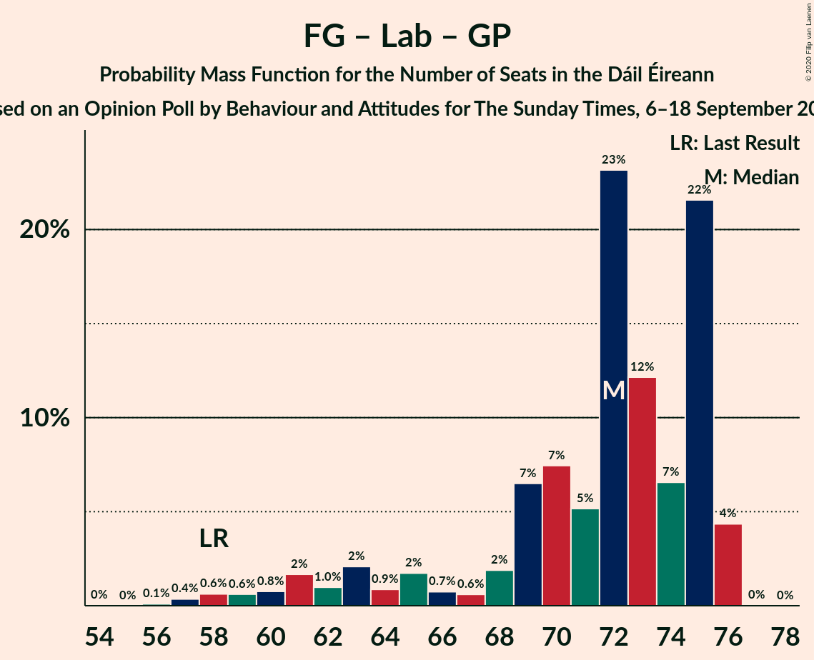
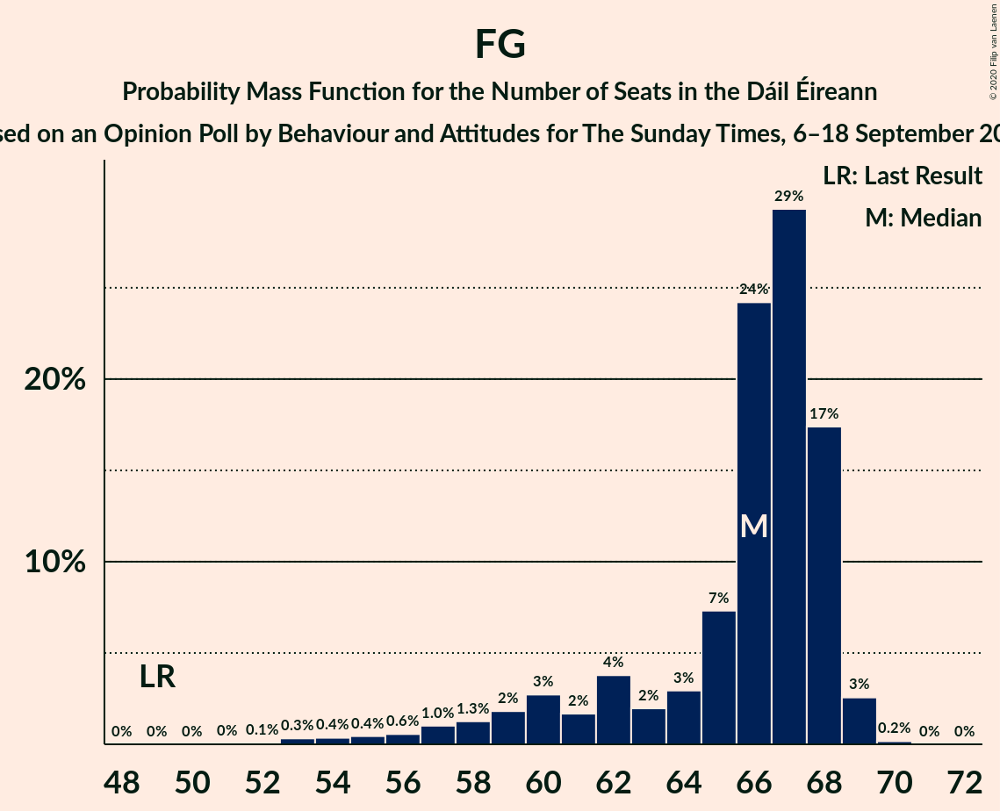
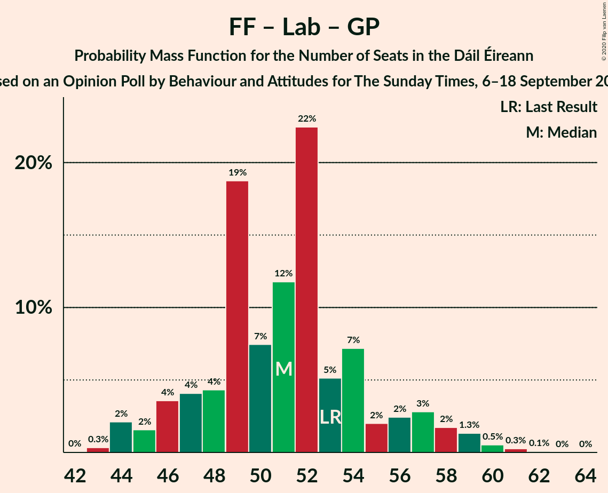

# Opinion Poll by Behaviour and Attitudes for The Sunday Times, 6–18 September 2018

<a href="#voting-intentions">Voting Intentions</a> | <a href="#seats">Seats</a> | <a href="#coalitions">Coalitions</a> | <a href="#technical-information">Technical Information</a>

## Voting Intentions

### Confidence Intervals

| Party | Last Result | Poll Result | 80% Confidence Interval | 90% Confidence Interval | 95% Confidence Interval | 99% Confidence Interval |
|:-----:|:-----------:|:-----------:|:-----------------------:|:-----------------------:|:-----------------------:|:-----------------------:|
| Fine Gael | 25.5% | 31.8% | 29.9–33.8% |29.4–34.4% |28.9–34.9% |28.0–35.8% |
| Fianna Fáil | 24.3% | 24.9% | 23.2–26.8% |22.6–27.3% |22.2–27.8% |21.4–28.7% |
| Sinn Féin | 13.8% | 19.9% | 18.3–21.6% |17.8–22.1% |17.5–22.6% |16.7–23.4% |
| Independent | 15.9% | 6.7% | 5.8–7.9% |5.5–8.2% |5.3–8.5% |4.8–9.1% |
| Labour Party | 6.6% | 5.0% | 4.2–6.0% |4.0–6.3% |3.8–6.6% |3.4–7.1% |
| Solidarity–People Before Profit | 3.9% | 3.0% | 2.4–3.8% |2.2–4.1% |2.1–4.3% |1.8–4.7% |
| Green Party/Comhaontas Glas | 2.7% | 3.0% | 2.4–3.8% |2.2–4.1% |2.1–4.3% |1.8–4.7% |
| Independents 4 Change | 1.5% | 0.9% | 0.6–1.4% |0.5–1.5% |0.4–1.7% |0.3–2.0% |
| Social Democrats | 3.0% | 0.2% | 0.1–0.6% |0.1–0.7% |0.1–0.8% |0.0–1.0% |
| Renua Ireland | 2.2% | 0.2% | 0.1–0.6% |0.1–0.7% |0.1–0.8% |0.0–1.0% |

*Note:* The poll result column reflects the actual value used in the calculations. Published results may vary slightly, and in addition be rounded to fewer digits.

## Seats

### Confidence Intervals

| Party | Last Result | Median | 80% Confidence Interval | 90% Confidence Interval | 95% Confidence Interval | 99% Confidence Interval |
|:-----:|:-----------:|:------:|:-----------------------:|:-----------------------:|:-----------------------:|:-----------------------:|
| <a href="#fine-gael">Fine Gael</a> | 49 | 65 | 61–68 |59–68 |56–69 |52–70 |
| <a href="#fianna-fáil">Fianna Fáil</a> | 44 | 44 | 43–52 |43–54 |42–54 |40–55 |
| <a href="#sinn-féin">Sinn Féin</a> | 23 | 37 | 35–38 |34–40 |32–43 |32–43 |
| <a href="#independent">Independent</a> | 19 | 3 | 2–4 |2–5 |2–5 |1–6 |
| <a href="#labour-party">Labour Party</a> | 7 | 3 | 1–6 |1–7 |1–7 |0–8 |
| <a href="#solidarity–people-before-profit">Solidarity–People Before Profit</a> | 6 | 4 | 1–6 |1–6 |1–6 |1–9 |
| <a href="#green-party/comhaontas-glas">Green Party/Comhaontas Glas</a> | 2 | 2 | 0–2 |0–2 |0–2 |0–3 |
| <a href="#independents-4-change">Independents 4 Change</a> | 4 | 0 | 0–4 |0–4 |0–4 |0–4 |
| <a href="#social-democrats">Social Democrats</a> | 3 | 0 | 0–1 |0–1 |0–1 |0–1 |
| <a href="#renua-ireland">Renua Ireland</a> | 0 | 0 | 0 |0 |0 |0 |

### Fine Gael

*For a full overview of the results for this party, see the [Fine Gael](party-finegael.html) page.*

| Number of Seats | Probability | Accumulated | Special Marks |
|:---------------:|:-----------:|:-----------:|:-------------:|
| 49 | 0% | 100% | Last Result |
| 50 | 0% | 100% |  |
| 51 | 0% | 100% |  |
| 52 | 0.5% | 99.9% |  |
| 53 | 0.1% | 99.4% |  |
| 54 | 2% | 99.3% |  |
| 55 | 0.1% | 98% |  |
| 56 | 0.4% | 98% |  |
| 57 | 0.6% | 97% |  |
| 58 | 0.9% | 97% |  |
| 59 | 5% | 96% |  |
| 60 | 0.3% | 91% |  |
| 61 | 2% | 91% |  |
| 62 | 24% | 89% |  |
| 63 | 7% | 65% |  |
| 64 | 1.3% | 58% |  |
| 65 | 8% | 57% | Median |
| 66 | 17% | 48% |  |
| 67 | 20% | 31% |  |
| 68 | 8% | 11% |  |
| 69 | 2% | 3% |  |
| 70 | 0.7% | 0.9% |  |
| 71 | 0.2% | 0.2% |  |
| 72 | 0% | 0% |  |

### Fianna Fáil

*For a full overview of the results for this party, see the [Fianna Fáil](party-fiannafáil.html) page.*

| Number of Seats | Probability | Accumulated | Special Marks |
|:---------------:|:-----------:|:-----------:|:-------------:|
| 40 | 0.6% | 100% |  |
| 41 | 0.6% | 99.3% |  |
| 42 | 4% | 98.7% |  |
| 43 | 17% | 95% |  |
| 44 | 30% | 78% | Last Result, Median |
| 45 | 2% | 48% |  |
| 46 | 3% | 46% |  |
| 47 | 1.3% | 43% |  |
| 48 | 2% | 42% |  |
| 49 | 1.0% | 40% |  |
| 50 | 24% | 39% |  |
| 51 | 2% | 16% |  |
| 52 | 8% | 14% |  |
| 53 | 0.9% | 6% |  |
| 54 | 3% | 5% |  |
| 55 | 1.5% | 2% |  |
| 56 | 0.2% | 0.3% |  |
| 57 | 0% | 0% |  |

### Sinn Féin

*For a full overview of the results for this party, see the [Sinn Féin](party-sinnféin.html) page.*

| Number of Seats | Probability | Accumulated | Special Marks |
|:---------------:|:-----------:|:-----------:|:-------------:|
| 23 | 0% | 100% | Last Result |
| 24 | 0% | 100% |  |
| 25 | 0% | 100% |  |
| 26 | 0% | 100% |  |
| 27 | 0% | 100% |  |
| 28 | 0% | 100% |  |
| 29 | 0% | 100% |  |
| 30 | 0.2% | 100% |  |
| 31 | 0% | 99.8% |  |
| 32 | 3% | 99.8% |  |
| 33 | 2% | 97% |  |
| 34 | 3% | 95% |  |
| 35 | 25% | 92% |  |
| 36 | 13% | 67% |  |
| 37 | 27% | 54% | Median |
| 38 | 19% | 27% |  |
| 39 | 0.3% | 7% |  |
| 40 | 3% | 7% |  |
| 41 | 1.0% | 4% |  |
| 42 | 0.7% | 3% |  |
| 43 | 2% | 3% |  |
| 44 | 0.3% | 0.4% |  |
| 45 | 0.1% | 0.1% |  |
| 46 | 0% | 0% |  |

### Independent

*For a full overview of the results for this party, see the [Independent](party-independent.html) page.*

| Number of Seats | Probability | Accumulated | Special Marks |
|:---------------:|:-----------:|:-----------:|:-------------:|
| 1 | 2% | 100% |  |
| 2 | 9% | 98% |  |
| 3 | 49% | 88% | Median |
| 4 | 33% | 39% |  |
| 5 | 4% | 7% |  |
| 6 | 2% | 2% |  |
| 7 | 0% | 0% |  |
| 8 | 0% | 0% |  |
| 9 | 0% | 0% |  |
| 10 | 0% | 0% |  |
| 11 | 0% | 0% |  |
| 12 | 0% | 0% |  |
| 13 | 0% | 0% |  |
| 14 | 0% | 0% |  |
| 15 | 0% | 0% |  |
| 16 | 0% | 0% |  |
| 17 | 0% | 0% |  |
| 18 | 0% | 0% |  |
| 19 | 0% | 0% | Last Result |

### Labour Party

*For a full overview of the results for this party, see the [Labour Party](party-labourparty.html) page.*

| Number of Seats | Probability | Accumulated | Special Marks |
|:---------------:|:-----------:|:-----------:|:-------------:|
| 0 | 2% | 100% |  |
| 1 | 38% | 98% |  |
| 2 | 2% | 60% |  |
| 3 | 33% | 58% | Median |
| 4 | 5% | 25% |  |
| 5 | 8% | 19% |  |
| 6 | 5% | 12% |  |
| 7 | 6% | 7% | Last Result |
| 8 | 0.5% | 0.7% |  |
| 9 | 0.1% | 0.2% |  |
| 10 | 0% | 0.1% |  |
| 11 | 0% | 0.1% |  |
| 12 | 0% | 0% |  |

### Solidarity–People Before Profit

*For a full overview of the results for this party, see the [Solidarity–People Before Profit](party-solidarity–peoplebeforeprofit.html) page.*

| Number of Seats | Probability | Accumulated | Special Marks |
|:---------------:|:-----------:|:-----------:|:-------------:|
| 0 | 0.3% | 100% |  |
| 1 | 10% | 99.7% |  |
| 2 | 21% | 90% |  |
| 3 | 11% | 68% |  |
| 4 | 46% | 57% | Median |
| 5 | 1.0% | 12% |  |
| 6 | 8% | 11% | Last Result |
| 7 | 1.0% | 2% |  |
| 8 | 0.9% | 1.5% |  |
| 9 | 0.6% | 0.6% |  |
| 10 | 0% | 0% |  |

### Green Party/Comhaontas Glas

*For a full overview of the results for this party, see the [Green Party/Comhaontas Glas](party-greenpartycomhaontasglas.html) page.*

| Number of Seats | Probability | Accumulated | Special Marks |
|:---------------:|:-----------:|:-----------:|:-------------:|
| 0 | 22% | 100% |  |
| 1 | 0.7% | 78% |  |
| 2 | 75% | 77% | Last Result, Median |
| 3 | 2% | 2% |  |
| 4 | 0.1% | 0.1% |  |
| 5 | 0% | 0% |  |

### Independents 4 Change

*For a full overview of the results for this party, see the [Independents 4 Change](party-independents4change.html) page.*

| Number of Seats | Probability | Accumulated | Special Marks |
|:---------------:|:-----------:|:-----------:|:-------------:|
| 0 | 61% | 100% | Median |
| 1 | 9% | 39% |  |
| 2 | 5% | 30% |  |
| 3 | 2% | 25% |  |
| 4 | 22% | 23% | Last Result |
| 5 | 0.5% | 0.5% |  |
| 6 | 0% | 0% |  |

### Social Democrats

*For a full overview of the results for this party, see the [Social Democrats](party-socialdemocrats.html) page.*

| Number of Seats | Probability | Accumulated | Special Marks |
|:---------------:|:-----------:|:-----------:|:-------------:|
| 0 | 84% | 100% | Median |
| 1 | 16% | 16% |  |
| 2 | 0% | 0.1% |  |
| 3 | 0% | 0% | Last Result |

### Renua Ireland

*For a full overview of the results for this party, see the [Renua Ireland](party-renuaireland.html) page.*

| Number of Seats | Probability | Accumulated | Special Marks |
|:---------------:|:-----------:|:-----------:|:-------------:|
| 0 | 100% | 100% | Last Result, Median |

## Coalitions

### Confidence Intervals

| Coalition | Last Result | Median | Majority? | 80% Confidence Interval | 90% Confidence Interval | 95% Confidence Interval | 99% Confidence Interval |
|:---------:|:-----------:|:------:|:---------:|:-----------------------:|:-----------------------:|:-----------------------:|:-----------------------:|
| Fine Gael – Fianna Fáil | 93 | 111 | 100% | 108–114 | 108–115 | 106–115 | 104–116 |
| Fianna Fáil – Sinn Féin | 67 | 82 | 58% | 78–90 | 78–91 | 78–93 | 77–95 |
| Fine Gael – Labour Party – Green Party/Comhaontas Glas | 58 | 70 | 0% | 64–75 | 63–75 | 61–75 | 58–76 |
| Fine Gael – Labour Party – Green Party/Comhaontas Glas – Social Democrats | 61 | 70 | 0% | 64–75 | 63–75 | 61–75 | 58–76 |
| Fine Gael – Labour Party | 56 | 68 | 0% | 63–73 | 62–73 | 58–73 | 58–74 |
| Fine Gael – Green Party/Comhaontas Glas | 51 | 67 | 0% | 61–69 | 59–70 | 57–70 | 52–72 |
| Fine Gael | 49 | 65 | 0% | 61–68 | 59–68 | 56–69 | 52–70 |
| Fianna Fáil – Labour Party – Green Party/Comhaontas Glas | 53 | 52 | 0% | 48–54 | 47–59 | 45–59 | 44–60 |
| Fianna Fáil – Labour Party – Green Party/Comhaontas Glas – Social Democrats | 56 | 52 | 0% | 48–54 | 48–59 | 45–59 | 45–60 |
| Fianna Fáil – Labour Party | 51 | 50 | 0% | 46–53 | 45–57 | 45–57 | 42–60 |
| Fianna Fáil – Green Party/Comhaontas Glas | 46 | 46 | 0% | 44–52 | 43–55 | 42–56 | 42–56 |

### Fine Gael – Fianna Fáil

| Number of Seats | Probability | Accumulated | Special Marks |
|:---------------:|:-----------:|:-----------:|:-------------:|
| 93 | 0% | 100% | Last Result |
| 94 | 0% | 100% |  |
| 95 | 0% | 100% |  |
| 96 | 0% | 100% |  |
| 97 | 0% | 100% |  |
| 98 | 0% | 100% |  |
| 99 | 0% | 100% |  |
| 100 | 0% | 100% |  |
| 101 | 0% | 100% |  |
| 102 | 0.1% | 99.9% |  |
| 103 | 0.3% | 99.9% |  |
| 104 | 0.2% | 99.6% |  |
| 105 | 0.7% | 99.4% |  |
| 106 | 3% | 98.7% |  |
| 107 | 0.6% | 96% |  |
| 108 | 9% | 95% |  |
| 109 | 10% | 86% | Median |
| 110 | 7% | 76% |  |
| 111 | 20% | 68% |  |
| 112 | 34% | 48% |  |
| 113 | 4% | 14% |  |
| 114 | 3% | 10% |  |
| 115 | 7% | 8% |  |
| 116 | 0.3% | 0.6% |  |
| 117 | 0% | 0.3% |  |
| 118 | 0.2% | 0.3% |  |
| 119 | 0% | 0% |  |

### Fianna Fáil – Sinn Féin

| Number of Seats | Probability | Accumulated | Special Marks |
|:---------------:|:-----------:|:-----------:|:-------------:|
| 67 | 0% | 100% | Last Result |
| 68 | 0% | 100% |  |
| 69 | 0% | 100% |  |
| 70 | 0% | 100% |  |
| 71 | 0% | 100% |  |
| 72 | 0% | 100% |  |
| 73 | 0% | 100% |  |
| 74 | 0% | 100% |  |
| 75 | 0% | 100% |  |
| 76 | 0.2% | 100% |  |
| 77 | 2% | 99.8% |  |
| 78 | 9% | 98% |  |
| 79 | 28% | 89% |  |
| 80 | 3% | 62% |  |
| 81 | 8% | 58% | Median, Majority |
| 82 | 7% | 51% |  |
| 83 | 1.2% | 44% |  |
| 84 | 1.4% | 43% |  |
| 85 | 0.3% | 41% |  |
| 86 | 1.3% | 41% |  |
| 87 | 24% | 39% |  |
| 88 | 1.0% | 16% |  |
| 89 | 0.7% | 15% |  |
| 90 | 7% | 14% |  |
| 91 | 3% | 7% |  |
| 92 | 2% | 4% |  |
| 93 | 0.4% | 3% |  |
| 94 | 0.5% | 2% |  |
| 95 | 2% | 2% |  |
| 96 | 0.1% | 0.2% |  |
| 97 | 0% | 0.1% |  |
| 98 | 0.1% | 0.1% |  |
| 99 | 0% | 0% |  |

### Fine Gael – Labour Party – Green Party/Comhaontas Glas

| Number of Seats | Probability | Accumulated | Special Marks |
|:---------------:|:-----------:|:-----------:|:-------------:|
| 57 | 0% | 100% |  |
| 58 | 0.6% | 99.9% | Last Result |
| 59 | 0.9% | 99.4% |  |
| 60 | 0.5% | 98% |  |
| 61 | 2% | 98% |  |
| 62 | 0.8% | 96% |  |
| 63 | 2% | 95% |  |
| 64 | 9% | 93% |  |
| 65 | 25% | 84% |  |
| 66 | 2% | 60% |  |
| 67 | 0.5% | 57% |  |
| 68 | 0.5% | 57% |  |
| 69 | 5% | 56% |  |
| 70 | 9% | 51% | Median |
| 71 | 2% | 42% |  |
| 72 | 24% | 39% |  |
| 73 | 4% | 16% |  |
| 74 | 0.9% | 11% |  |
| 75 | 10% | 11% |  |
| 76 | 0.8% | 0.8% |  |
| 77 | 0% | 0% |  |

### Fine Gael – Labour Party – Green Party/Comhaontas Glas – Social Democrats

| Number of Seats | Probability | Accumulated | Special Marks |
|:---------------:|:-----------:|:-----------:|:-------------:|
| 57 | 0% | 100% |  |
| 58 | 0.6% | 99.9% |  |
| 59 | 0.9% | 99.4% |  |
| 60 | 0.5% | 98% |  |
| 61 | 2% | 98% | Last Result |
| 62 | 0.8% | 96% |  |
| 63 | 2% | 95% |  |
| 64 | 9% | 93% |  |
| 65 | 24% | 84% |  |
| 66 | 1.4% | 60% |  |
| 67 | 2% | 59% |  |
| 68 | 0.2% | 57% |  |
| 69 | 0.7% | 57% |  |
| 70 | 6% | 56% | Median |
| 71 | 10% | 50% |  |
| 72 | 24% | 39% |  |
| 73 | 4% | 16% |  |
| 74 | 0.9% | 11% |  |
| 75 | 9% | 11% |  |
| 76 | 1.2% | 1.2% |  |
| 77 | 0% | 0.1% |  |
| 78 | 0% | 0% |  |

### Fine Gael – Labour Party

| Number of Seats | Probability | Accumulated | Special Marks |
|:---------------:|:-----------:|:-----------:|:-------------:|
| 56 | 0.1% | 100% | Last Result |
| 57 | 0% | 99.9% |  |
| 58 | 2% | 99.8% |  |
| 59 | 1.1% | 97% |  |
| 60 | 0.4% | 96% |  |
| 61 | 0.3% | 96% |  |
| 62 | 3% | 96% |  |
| 63 | 26% | 92% |  |
| 64 | 7% | 67% |  |
| 65 | 0.9% | 60% |  |
| 66 | 2% | 59% |  |
| 67 | 5% | 57% |  |
| 68 | 8% | 51% | Median |
| 69 | 0.6% | 43% |  |
| 70 | 22% | 42% |  |
| 71 | 3% | 20% |  |
| 72 | 4% | 17% |  |
| 73 | 12% | 13% |  |
| 74 | 0.8% | 0.9% |  |
| 75 | 0.1% | 0.1% |  |
| 76 | 0% | 0% |  |

### Fine Gael – Green Party/Comhaontas Glas

| Number of Seats | Probability | Accumulated | Special Marks |
|:---------------:|:-----------:|:-----------:|:-------------:|
| 51 | 0% | 100% | Last Result |
| 52 | 0.5% | 100% |  |
| 53 | 0.1% | 99.5% |  |
| 54 | 0% | 99.4% |  |
| 55 | 0.1% | 99.3% |  |
| 56 | 0.4% | 99.3% |  |
| 57 | 2% | 98.9% |  |
| 58 | 0.6% | 97% |  |
| 59 | 2% | 97% |  |
| 60 | 0.8% | 95% |  |
| 61 | 4% | 94% |  |
| 62 | 0.9% | 90% |  |
| 63 | 7% | 89% |  |
| 64 | 24% | 82% |  |
| 65 | 0.3% | 57% |  |
| 66 | 5% | 57% |  |
| 67 | 8% | 52% | Median |
| 68 | 18% | 44% |  |
| 69 | 21% | 26% |  |
| 70 | 4% | 5% |  |
| 71 | 0.6% | 1.5% |  |
| 72 | 0.7% | 0.9% |  |
| 73 | 0.2% | 0.2% |  |
| 74 | 0% | 0% |  |

### Fine Gael

| Number of Seats | Probability | Accumulated | Special Marks |
|:---------------:|:-----------:|:-----------:|:-------------:|
| 49 | 0% | 100% | Last Result |
| 50 | 0% | 100% |  |
| 51 | 0% | 100% |  |
| 52 | 0.5% | 99.9% |  |
| 53 | 0.1% | 99.4% |  |
| 54 | 2% | 99.3% |  |
| 55 | 0.1% | 98% |  |
| 56 | 0.4% | 98% |  |
| 57 | 0.6% | 97% |  |
| 58 | 0.9% | 97% |  |
| 59 | 5% | 96% |  |
| 60 | 0.3% | 91% |  |
| 61 | 2% | 91% |  |
| 62 | 24% | 89% |  |
| 63 | 7% | 65% |  |
| 64 | 1.3% | 58% |  |
| 65 | 8% | 57% | Median |
| 66 | 17% | 48% |  |
| 67 | 20% | 31% |  |
| 68 | 8% | 11% |  |
| 69 | 2% | 3% |  |
| 70 | 0.7% | 0.9% |  |
| 71 | 0.2% | 0.2% |  |
| 72 | 0% | 0% |  |

### Fianna Fáil – Labour Party – Green Party/Comhaontas Glas

| Number of Seats | Probability | Accumulated | Special Marks |
|:---------------:|:-----------:|:-----------:|:-------------:|
| 43 | 0.1% | 100% |  |
| 44 | 0.5% | 99.8% |  |
| 45 | 4% | 99.4% |  |
| 46 | 0.2% | 96% |  |
| 47 | 5% | 95% |  |
| 48 | 10% | 90% |  |
| 49 | 25% | 80% | Median |
| 50 | 2% | 55% |  |
| 51 | 3% | 53% |  |
| 52 | 10% | 50% |  |
| 53 | 30% | 40% | Last Result |
| 54 | 0.5% | 10% |  |
| 55 | 0.7% | 10% |  |
| 56 | 1.3% | 9% |  |
| 57 | 1.3% | 8% |  |
| 58 | 0.1% | 6% |  |
| 59 | 5% | 6% |  |
| 60 | 0.5% | 0.8% |  |
| 61 | 0.2% | 0.3% |  |
| 62 | 0% | 0.1% |  |
| 63 | 0% | 0% |  |

### Fianna Fáil – Labour Party – Green Party/Comhaontas Glas – Social Democrats

| Number of Seats | Probability | Accumulated | Special Marks |
|:---------------:|:-----------:|:-----------:|:-------------:|
| 43 | 0.1% | 100% |  |
| 44 | 0.1% | 99.8% |  |
| 45 | 4% | 99.8% |  |
| 46 | 0.2% | 96% |  |
| 47 | 0.2% | 95% |  |
| 48 | 7% | 95% |  |
| 49 | 33% | 88% | Median |
| 50 | 1.3% | 55% |  |
| 51 | 4% | 54% |  |
| 52 | 10% | 50% |  |
| 53 | 30% | 40% |  |
| 54 | 0.4% | 10% |  |
| 55 | 0.9% | 10% |  |
| 56 | 0.3% | 9% | Last Result |
| 57 | 2% | 9% |  |
| 58 | 0.1% | 6% |  |
| 59 | 5% | 6% |  |
| 60 | 0.5% | 0.9% |  |
| 61 | 0.2% | 0.3% |  |
| 62 | 0% | 0.1% |  |
| 63 | 0% | 0% |  |

### Fianna Fáil – Labour Party

| Number of Seats | Probability | Accumulated | Special Marks |
|:---------------:|:-----------:|:-----------:|:-------------:|
| 41 | 0% | 100% |  |
| 42 | 0.5% | 99.9% |  |
| 43 | 0.7% | 99.4% |  |
| 44 | 0.3% | 98.7% |  |
| 45 | 8% | 98% |  |
| 46 | 9% | 90% |  |
| 47 | 19% | 81% | Median |
| 48 | 3% | 62% |  |
| 49 | 9% | 59% |  |
| 50 | 9% | 50% |  |
| 51 | 23% | 42% | Last Result |
| 52 | 2% | 18% |  |
| 53 | 8% | 17% |  |
| 54 | 0.4% | 9% |  |
| 55 | 0.9% | 9% |  |
| 56 | 3% | 8% |  |
| 57 | 3% | 5% |  |
| 58 | 0.1% | 2% |  |
| 59 | 1.2% | 2% |  |
| 60 | 0.7% | 0.7% |  |
| 61 | 0% | 0% |  |

### Fianna Fáil – Green Party/Comhaontas Glas

| Number of Seats | Probability | Accumulated | Special Marks |
|:---------------:|:-----------:|:-----------:|:-------------:|
| 41 | 0.2% | 100% |  |
| 42 | 2% | 99.8% |  |
| 43 | 4% | 97% |  |
| 44 | 6% | 94% |  |
| 45 | 15% | 88% |  |
| 46 | 26% | 73% | Last Result, Median |
| 47 | 1.4% | 47% |  |
| 48 | 4% | 46% |  |
| 49 | 2% | 42% |  |
| 50 | 0.4% | 40% |  |
| 51 | 2% | 39% |  |
| 52 | 30% | 38% |  |
| 53 | 0.2% | 8% |  |
| 54 | 0.8% | 8% |  |
| 55 | 4% | 7% |  |
| 56 | 3% | 3% |  |
| 57 | 0.2% | 0.3% |  |
| 58 | 0% | 0% |  |

## Technical Information

### Opinion Poll

+ **Polling firm:** Behaviour and Attitudes
+ **Commissioner(s):** The Sunday Times
+ **Fieldwork period:** 6–18 September 2018

### Calculations

+ **Sample size:** 940
+ **Simulations done:** 65,536
+ **Error estimate:** 1.57%

