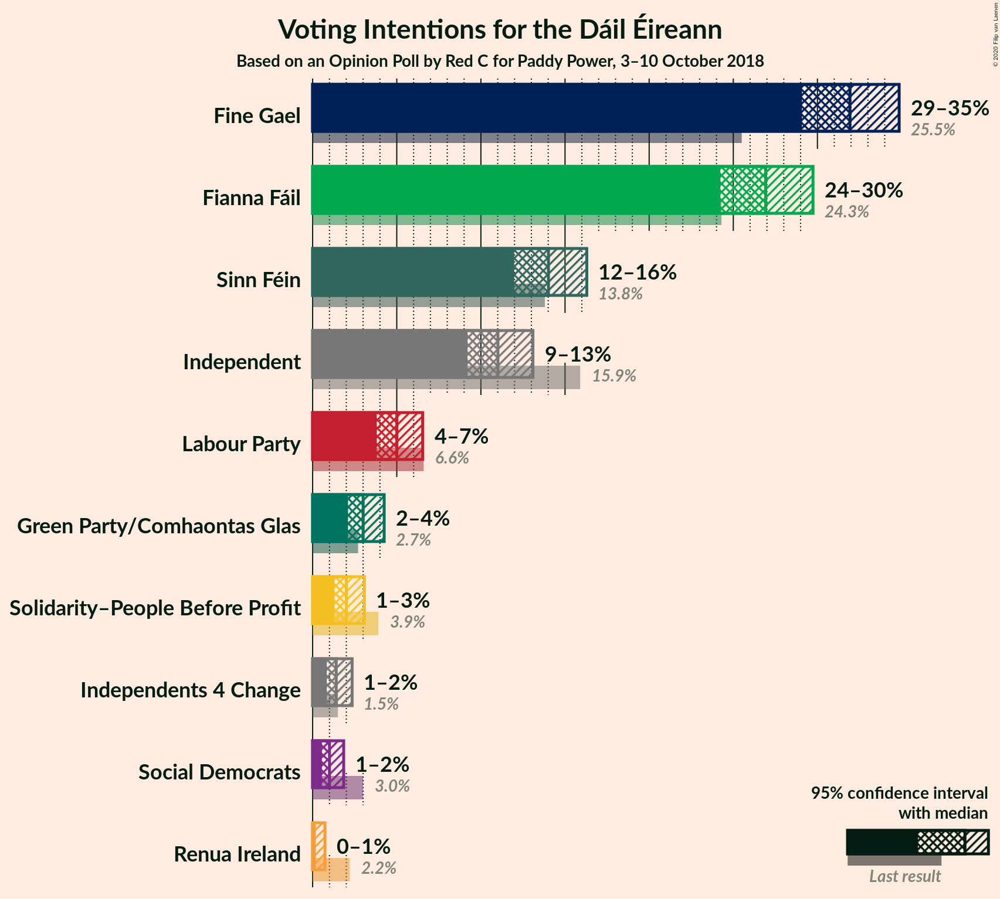
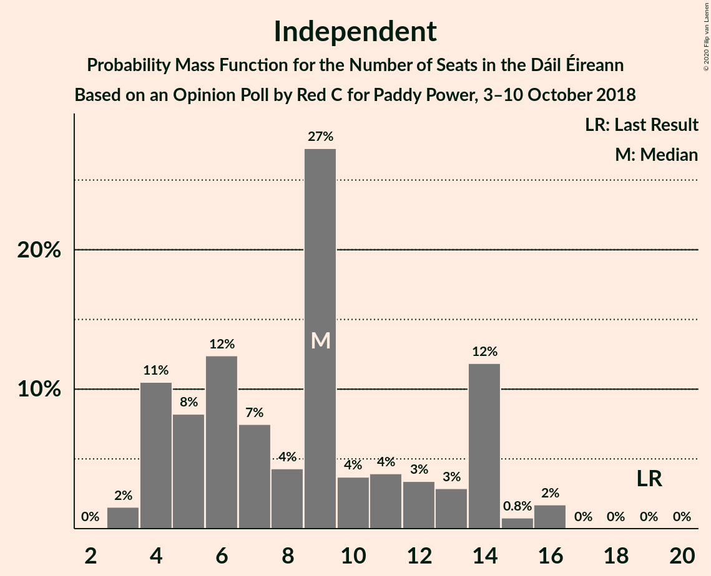
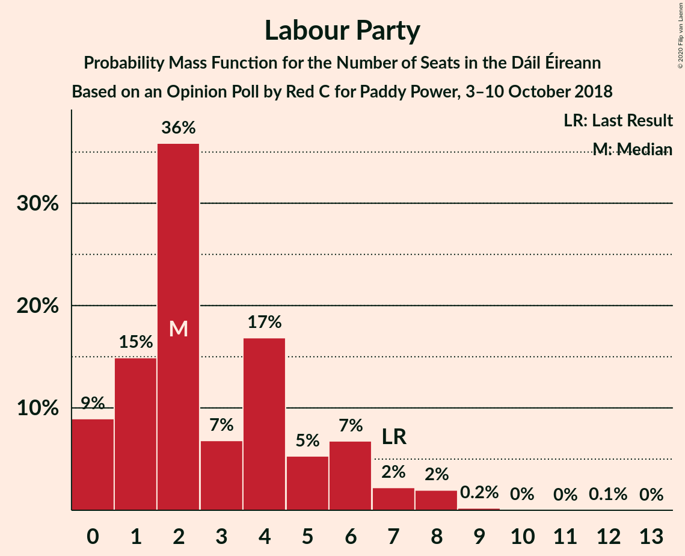
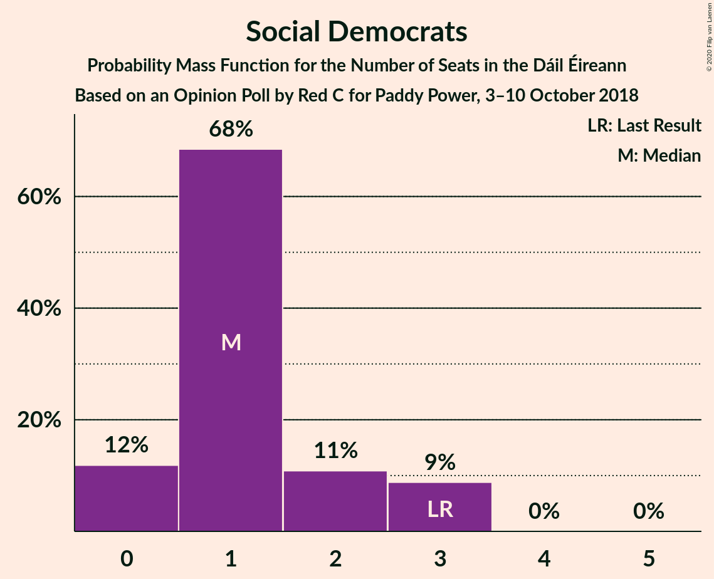
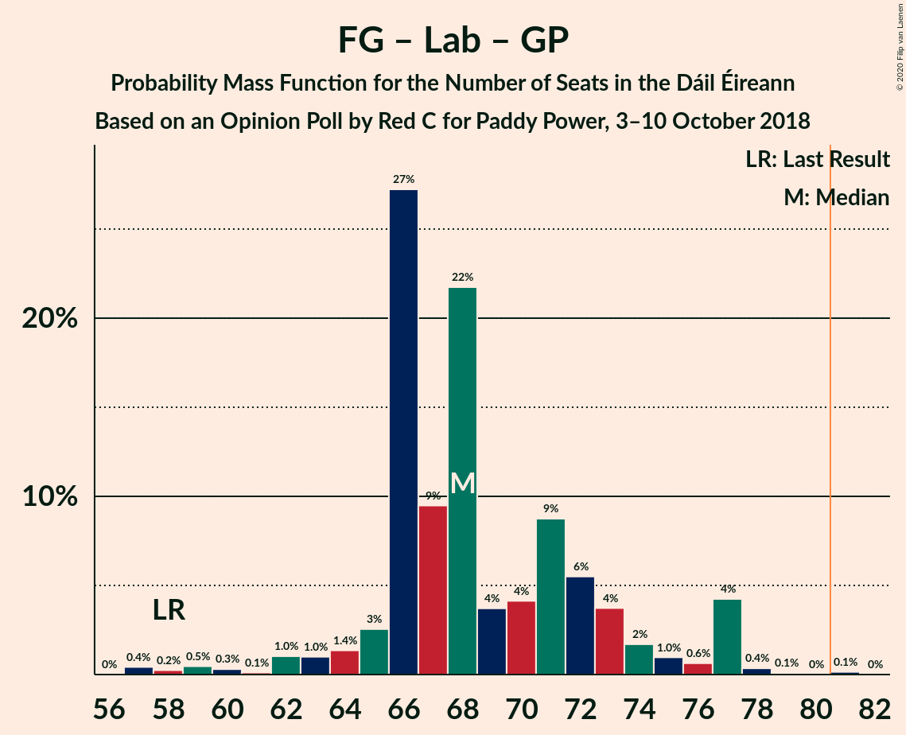
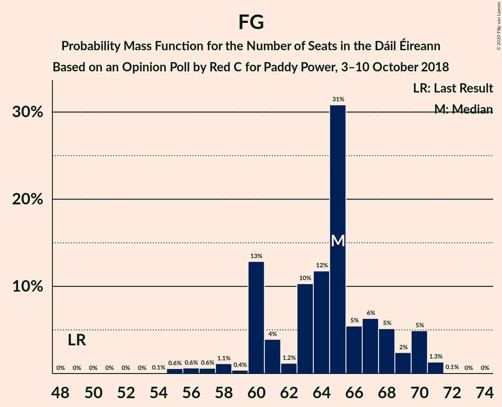
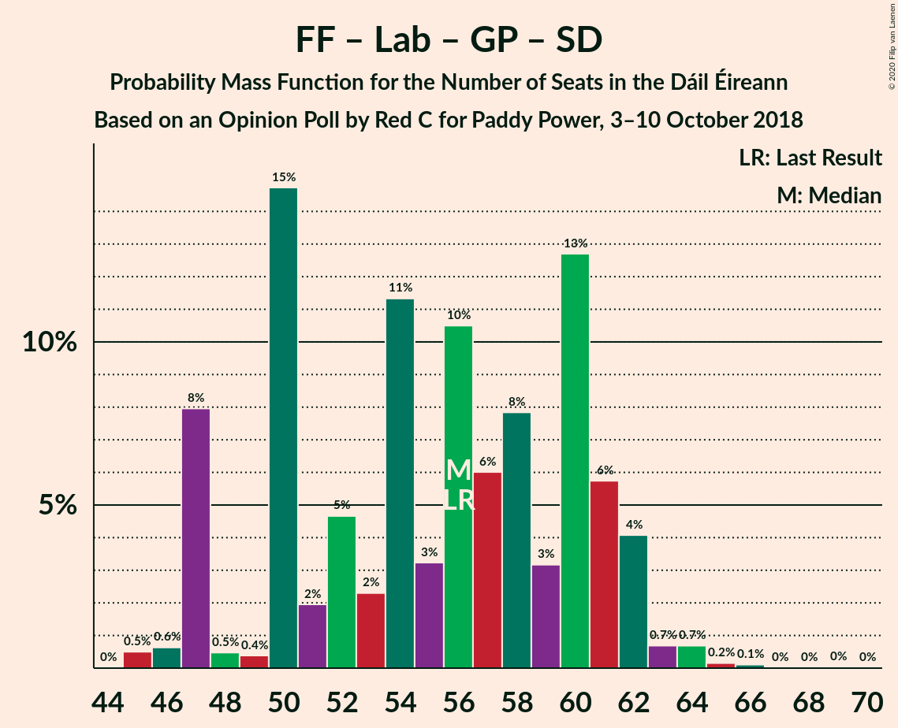
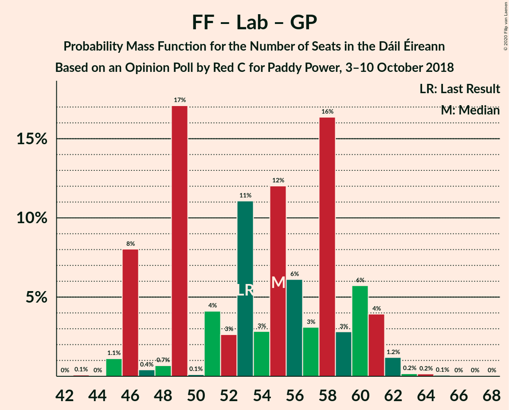

# Opinion Poll by Red C for Paddy Power, 3–10 October 2018

<a href="#voting-intentions">Voting Intentions</a> | <a href="#seats">Seats</a> | <a href="#coalitions">Coalitions</a> | <a href="#technical-information">Technical Information</a>

## Voting Intentions

### Confidence Intervals

| Party | Last Result | Poll Result | 80% Confidence Interval | 90% Confidence Interval | 95% Confidence Interval | 99% Confidence Interval |
|:-----:|:-----------:|:-----------:|:-----------------------:|:-----------------------:|:-----------------------:|:-----------------------:|
| Fine Gael | 25.5% | 31.9% | 30.1–33.8% |29.5–34.4% |29.1–34.9% |28.2–35.8% |
| Fianna Fáil | 24.3% | 26.9% | 25.1–28.8% |24.7–29.3% |24.2–29.7% |23.4–30.7% |
| Sinn Féin | 13.8% | 14.0% | 12.7–15.5% |12.3–15.9% |12.0–16.3% |11.4–17.0% |
| Independent | 15.9% | 11.0% | 9.8–12.4% |9.5–12.8% |9.2–13.1% |8.7–13.8% |
| Labour Party | 6.6% | 5.0% | 4.2–6.0% |4.0–6.3% |3.8–6.5% |3.5–7.1% |
| Green Party/Comhaontas Glas | 2.7% | 3.0% | 2.4–3.8% |2.2–4.1% |2.1–4.3% |1.9–4.7% |
| Solidarity–People Before Profit | 3.9% | 2.0% | 1.5–2.7% |1.4–2.9% |1.3–3.1% |1.1–3.4% |
| Independents 4 Change | 1.5% | 1.4% | 1.0–2.0% |0.9–2.2% |0.8–2.3% |0.7–2.7% |
| Social Democrats | 3.0% | 1.0% | 0.7–1.5% |0.6–1.7% |0.5–1.8% |0.4–2.1% |
| Renua Ireland | 2.2% | 0.1% | 0.1–0.5% |0.1–0.6% |0.1–0.7% |0.0–0.9% |

*Note:* The poll result column reflects the actual value used in the calculations. Published results may vary slightly, and in addition be rounded to fewer digits.

## Seats

### Confidence Intervals

| Party | Last Result | Median | 80% Confidence Interval | 90% Confidence Interval | 95% Confidence Interval | 99% Confidence Interval |
|:-----:|:-----------:|:------:|:-----------------------:|:-----------------------:|:-----------------------:|:-----------------------:|
| <a href="#fine-gael">Fine Gael</a> | 49 | 65 | 60–68 |60–70 |58–70 |55–71 |
| <a href="#fianna-fáil">Fianna Fáil</a> | 44 | 51 | 44–54 |43–55 |43–56 |42–58 |
| <a href="#sinn-féin">Sinn Féin</a> | 23 | 27 | 21–30 |20–31 |19–32 |18–33 |
| <a href="#independent">Independent</a> | 19 | 9 | 4–14 |4–14 |4–14 |3–16 |
| <a href="#labour-party">Labour Party</a> | 7 | 2 | 1–6 |0–6 |0–7 |0–8 |
| <a href="#green-party/comhaontas-glas">Green Party/Comhaontas Glas</a> | 2 | 1 | 1–2 |0–3 |0–3 |0–3 |
| <a href="#solidarity–people-before-profit">Solidarity–People Before Profit</a> | 6 | 2 | 0–4 |0–4 |0–4 |0–4 |
| <a href="#independents-4-change">Independents 4 Change</a> | 4 | 4 | 2–5 |2–5 |0–5 |0–5 |
| <a href="#social-democrats">Social Democrats</a> | 3 | 1 | 0–2 |0–3 |0–3 |0–3 |
| <a href="#renua-ireland">Renua Ireland</a> | 0 | 0 | 0 |0 |0 |0 |

### Fine Gael

*For a full overview of the results for this party, see the [Fine Gael](party-finegael.html) page.*

| Number of Seats | Probability | Accumulated | Special Marks |
|:---------------:|:-----------:|:-----------:|:-------------:|
| 49 | 0% | 100% | Last Result |
| 50 | 0% | 100% |  |
| 51 | 0% | 100% |  |
| 52 | 0% | 100% |  |
| 53 | 0% | 100% |  |
| 54 | 0.1% | 99.9% |  |
| 55 | 0.6% | 99.9% |  |
| 56 | 0.6% | 99.3% |  |
| 57 | 0.6% | 98.7% |  |
| 58 | 1.1% | 98% |  |
| 59 | 0.4% | 97% |  |
| 60 | 13% | 97% |  |
| 61 | 4% | 84% |  |
| 62 | 1.2% | 80% |  |
| 63 | 10% | 79% |  |
| 64 | 12% | 68% |  |
| 65 | 31% | 57% | Median |
| 66 | 5% | 26% |  |
| 67 | 6% | 20% |  |
| 68 | 5% | 14% |  |
| 69 | 2% | 9% |  |
| 70 | 5% | 6% |  |
| 71 | 1.3% | 1.4% |  |
| 72 | 0.1% | 0.1% |  |
| 73 | 0% | 0% |  |

### Fianna Fáil

*For a full overview of the results for this party, see the [Fianna Fáil](party-fiannafáil.html) page.*

| Number of Seats | Probability | Accumulated | Special Marks |
|:---------------:|:-----------:|:-----------:|:-------------:|
| 40 | 0.1% | 100% |  |
| 41 | 0.1% | 99.9% |  |
| 42 | 1.0% | 99.8% |  |
| 43 | 8% | 98.8% |  |
| 44 | 4% | 90% | Last Result |
| 45 | 2% | 87% |  |
| 46 | 16% | 85% |  |
| 47 | 4% | 69% |  |
| 48 | 3% | 65% |  |
| 49 | 2% | 62% |  |
| 50 | 5% | 60% |  |
| 51 | 15% | 56% | Median |
| 52 | 11% | 41% |  |
| 53 | 6% | 30% |  |
| 54 | 16% | 24% |  |
| 55 | 2% | 7% |  |
| 56 | 3% | 5% |  |
| 57 | 1.3% | 2% |  |
| 58 | 0.6% | 0.8% |  |
| 59 | 0.2% | 0.2% |  |
| 60 | 0% | 0.1% |  |
| 61 | 0% | 0% |  |

### Sinn Féin

*For a full overview of the results for this party, see the [Sinn Féin](party-sinnféin.html) page.*

| Number of Seats | Probability | Accumulated | Special Marks |
|:---------------:|:-----------:|:-----------:|:-------------:|
| 17 | 0.4% | 100% |  |
| 18 | 2% | 99.6% |  |
| 19 | 2% | 98% |  |
| 20 | 1.4% | 95% |  |
| 21 | 5% | 94% |  |
| 22 | 3% | 89% |  |
| 23 | 6% | 86% | Last Result |
| 24 | 15% | 80% |  |
| 25 | 7% | 65% |  |
| 26 | 2% | 58% |  |
| 27 | 12% | 56% | Median |
| 28 | 8% | 44% |  |
| 29 | 15% | 37% |  |
| 30 | 13% | 21% |  |
| 31 | 4% | 8% |  |
| 32 | 3% | 5% |  |
| 33 | 2% | 2% |  |
| 34 | 0.1% | 0.2% |  |
| 35 | 0.1% | 0.1% |  |
| 36 | 0% | 0% |  |

### Independent

*For a full overview of the results for this party, see the [Independent](party-independent.html) page.*

| Number of Seats | Probability | Accumulated | Special Marks |
|:---------------:|:-----------:|:-----------:|:-------------:|
| 3 | 2% | 100% |  |
| 4 | 11% | 98% |  |
| 5 | 8% | 88% |  |
| 6 | 12% | 80% |  |
| 7 | 7% | 67% |  |
| 8 | 4% | 60% |  |
| 9 | 27% | 56% | Median |
| 10 | 4% | 28% |  |
| 11 | 4% | 25% |  |
| 12 | 3% | 21% |  |
| 13 | 3% | 17% |  |
| 14 | 12% | 14% |  |
| 15 | 0.8% | 2% |  |
| 16 | 2% | 2% |  |
| 17 | 0% | 0% |  |
| 18 | 0% | 0% |  |
| 19 | 0% | 0% | Last Result |

### Labour Party

*For a full overview of the results for this party, see the [Labour Party](party-labourparty.html) page.*

| Number of Seats | Probability | Accumulated | Special Marks |
|:---------------:|:-----------:|:-----------:|:-------------:|
| 0 | 9% | 100% |  |
| 1 | 15% | 91% |  |
| 2 | 36% | 76% | Median |
| 3 | 7% | 40% |  |
| 4 | 17% | 33% |  |
| 5 | 5% | 17% |  |
| 6 | 7% | 11% |  |
| 7 | 2% | 5% | Last Result |
| 8 | 2% | 2% |  |
| 9 | 0.2% | 0.4% |  |
| 10 | 0% | 0.2% |  |
| 11 | 0% | 0.1% |  |
| 12 | 0.1% | 0.1% |  |
| 13 | 0% | 0% |  |

### Green Party/Comhaontas Glas

*For a full overview of the results for this party, see the [Green Party/Comhaontas Glas](party-greenpartycomhaontasglas.html) page.*

| Number of Seats | Probability | Accumulated | Special Marks |
|:---------------:|:-----------:|:-----------:|:-------------:|
| 0 | 6% | 100% |  |
| 1 | 60% | 94% | Median |
| 2 | 27% | 34% | Last Result |
| 3 | 6% | 6% |  |
| 4 | 0.1% | 0.1% |  |
| 5 | 0% | 0% |  |

### Solidarity–People Before Profit

*For a full overview of the results for this party, see the [Solidarity–People Before Profit](party-solidarity–peoplebeforeprofit.html) page.*

| Number of Seats | Probability | Accumulated | Special Marks |
|:---------------:|:-----------:|:-----------:|:-------------:|
| 0 | 19% | 100% |  |
| 1 | 23% | 81% |  |
| 2 | 27% | 58% | Median |
| 3 | 17% | 31% |  |
| 4 | 14% | 14% |  |
| 5 | 0% | 0.1% |  |
| 6 | 0% | 0% | Last Result |

### Independents 4 Change

*For a full overview of the results for this party, see the [Independents 4 Change](party-independents4change.html) page.*

| Number of Seats | Probability | Accumulated | Special Marks |
|:---------------:|:-----------:|:-----------:|:-------------:|
| 0 | 4% | 100% |  |
| 1 | 1.2% | 96% |  |
| 2 | 16% | 95% |  |
| 3 | 11% | 79% |  |
| 4 | 28% | 68% | Last Result, Median |
| 5 | 40% | 40% |  |
| 6 | 0% | 0% |  |

### Social Democrats

*For a full overview of the results for this party, see the [Social Democrats](party-socialdemocrats.html) page.*

| Number of Seats | Probability | Accumulated | Special Marks |
|:---------------:|:-----------:|:-----------:|:-------------:|
| 0 | 12% | 100% |  |
| 1 | 68% | 88% | Median |
| 2 | 11% | 20% |  |
| 3 | 9% | 9% | Last Result |
| 4 | 0% | 0% |  |

### Renua Ireland

*For a full overview of the results for this party, see the [Renua Ireland](party-renuaireland.html) page.*

| Number of Seats | Probability | Accumulated | Special Marks |
|:---------------:|:-----------:|:-----------:|:-------------:|
| 0 | 100% | 100% | Last Result, Median |

## Coalitions

### Confidence Intervals

| Coalition | Last Result | Median | Majority? | 80% Confidence Interval | 90% Confidence Interval | 95% Confidence Interval | 99% Confidence Interval |
|:---------:|:-----------:|:------:|:---------:|:-----------------------:|:-----------------------:|:-----------------------:|:-----------------------:|
| Fine Gael – Fianna Fáil | 93 | 114 | 100% | 108–120 | 108–123 | 108–123 | 106–126 |
| Fianna Fáil – Sinn Féin | 67 | 76 | 16% | 72–82 | 70–83 | 68–83 | 67–84 |
| Fine Gael – Labour Party – Green Party/Comhaontas Glas – Social Democrats | 61 | 69 | 0.5% | 67–75 | 66–78 | 64–78 | 60–81 |
| Fine Gael – Labour Party – Green Party/Comhaontas Glas | 58 | 68 | 0.2% | 66–73 | 65–76 | 62–77 | 58–78 |
| Fine Gael – Labour Party | 56 | 67 | 0% | 64–71 | 63–75 | 62–75 | 57–76 |
| Fine Gael – Green Party/Comhaontas Glas | 51 | 66 | 0% | 62–70 | 61–72 | 59–72 | 56–72 |
| Fine Gael | 49 | 65 | 0% | 60–68 | 60–70 | 58–70 | 55–71 |
| Fianna Fáil – Labour Party – Green Party/Comhaontas Glas – Social Democrats | 56 | 56 | 0% | 50–61 | 47–62 | 47–62 | 45–64 |
| Fianna Fáil – Labour Party – Green Party/Comhaontas Glas | 53 | 55 | 0% | 48–60 | 46–61 | 46–61 | 45–63 |
| Fianna Fáil – Labour Party | 51 | 53 | 0% | 46–58 | 45–59 | 45–60 | 44–61 |
| Fianna Fáil – Green Party/Comhaontas Glas | 46 | 52 | 0% | 45–56 | 44–57 | 44–58 | 43–59 |

### Fine Gael – Fianna Fáil

| Number of Seats | Probability | Accumulated | Special Marks |
|:---------------:|:-----------:|:-----------:|:-------------:|
| 93 | 0% | 100% | Last Result |
| 94 | 0% | 100% |  |
| 95 | 0% | 100% |  |
| 96 | 0% | 100% |  |
| 97 | 0% | 100% |  |
| 98 | 0% | 100% |  |
| 99 | 0% | 100% |  |
| 100 | 0% | 100% |  |
| 101 | 0% | 100% |  |
| 102 | 0% | 100% |  |
| 103 | 0% | 99.9% |  |
| 104 | 0.1% | 99.9% |  |
| 105 | 0.2% | 99.8% |  |
| 106 | 0.2% | 99.6% |  |
| 107 | 0.9% | 99.4% |  |
| 108 | 11% | 98.5% |  |
| 109 | 1.5% | 88% |  |
| 110 | 2% | 86% |  |
| 111 | 16% | 84% |  |
| 112 | 13% | 68% |  |
| 113 | 2% | 55% |  |
| 114 | 6% | 53% |  |
| 115 | 17% | 47% |  |
| 116 | 1.3% | 30% | Median |
| 117 | 9% | 29% |  |
| 118 | 2% | 20% |  |
| 119 | 8% | 18% |  |
| 120 | 1.2% | 10% |  |
| 121 | 1.0% | 9% |  |
| 122 | 1.0% | 8% |  |
| 123 | 5% | 7% |  |
| 124 | 0.3% | 1.5% |  |
| 125 | 0.5% | 1.2% |  |
| 126 | 0.5% | 0.6% |  |
| 127 | 0.1% | 0.1% |  |
| 128 | 0% | 0% |  |

### Fianna Fáil – Sinn Féin

| Number of Seats | Probability | Accumulated | Special Marks |
|:---------------:|:-----------:|:-----------:|:-------------:|
| 64 | 0.3% | 100% |  |
| 65 | 0% | 99.7% |  |
| 66 | 0.1% | 99.7% |  |
| 67 | 2% | 99.5% | Last Result |
| 68 | 2% | 98% |  |
| 69 | 0.3% | 96% |  |
| 70 | 0.9% | 95% |  |
| 71 | 4% | 94% |  |
| 72 | 11% | 90% |  |
| 73 | 2% | 80% |  |
| 74 | 10% | 78% |  |
| 75 | 14% | 68% |  |
| 76 | 14% | 54% |  |
| 77 | 4% | 41% |  |
| 78 | 4% | 37% | Median |
| 79 | 15% | 33% |  |
| 80 | 2% | 19% |  |
| 81 | 2% | 16% | Majority |
| 82 | 8% | 14% |  |
| 83 | 5% | 6% |  |
| 84 | 0.4% | 0.7% |  |
| 85 | 0% | 0.3% |  |
| 86 | 0.2% | 0.3% |  |
| 87 | 0% | 0.1% |  |
| 88 | 0% | 0.1% |  |
| 89 | 0% | 0.1% |  |
| 90 | 0% | 0% |  |

### Fine Gael – Labour Party – Green Party/Comhaontas Glas – Social Democrats

| Number of Seats | Probability | Accumulated | Special Marks |
|:---------------:|:-----------:|:-----------:|:-------------:|
| 59 | 0.1% | 100% |  |
| 60 | 0.6% | 99.9% |  |
| 61 | 0.3% | 99.3% | Last Result |
| 62 | 0.7% | 99.0% |  |
| 63 | 0.5% | 98% |  |
| 64 | 1.2% | 98% |  |
| 65 | 1.4% | 97% |  |
| 66 | 2% | 95% |  |
| 67 | 24% | 93% |  |
| 68 | 12% | 69% |  |
| 69 | 23% | 57% | Median |
| 70 | 3% | 34% |  |
| 71 | 6% | 31% |  |
| 72 | 8% | 25% |  |
| 73 | 3% | 18% |  |
| 74 | 4% | 15% |  |
| 75 | 4% | 11% |  |
| 76 | 1.0% | 7% |  |
| 77 | 0.2% | 6% |  |
| 78 | 4% | 5% |  |
| 79 | 0.6% | 1.2% |  |
| 80 | 0.1% | 0.6% |  |
| 81 | 0.4% | 0.5% | Majority |
| 82 | 0.1% | 0.1% |  |
| 83 | 0% | 0% |  |

### Fine Gael – Labour Party – Green Party/Comhaontas Glas

| Number of Seats | Probability | Accumulated | Special Marks |
|:---------------:|:-----------:|:-----------:|:-------------:|
| 57 | 0.4% | 100% |  |
| 58 | 0.2% | 99.5% | Last Result |
| 59 | 0.5% | 99.3% |  |
| 60 | 0.3% | 98.8% |  |
| 61 | 0.1% | 98.5% |  |
| 62 | 1.0% | 98% |  |
| 63 | 1.0% | 97% |  |
| 64 | 1.4% | 96% |  |
| 65 | 3% | 95% |  |
| 66 | 27% | 92% |  |
| 67 | 9% | 65% |  |
| 68 | 22% | 56% | Median |
| 69 | 4% | 34% |  |
| 70 | 4% | 30% |  |
| 71 | 9% | 26% |  |
| 72 | 6% | 17% |  |
| 73 | 4% | 12% |  |
| 74 | 2% | 8% |  |
| 75 | 1.0% | 6% |  |
| 76 | 0.6% | 6% |  |
| 77 | 4% | 5% |  |
| 78 | 0.4% | 0.6% |  |
| 79 | 0.1% | 0.3% |  |
| 80 | 0% | 0.2% |  |
| 81 | 0.1% | 0.2% | Majority |
| 82 | 0% | 0% |  |

### Fine Gael – Labour Party

| Number of Seats | Probability | Accumulated | Special Marks |
|:---------------:|:-----------:|:-----------:|:-------------:|
| 56 | 0.4% | 100% | Last Result |
| 57 | 0.1% | 99.5% |  |
| 58 | 0.6% | 99.4% |  |
| 59 | 0.3% | 98.8% |  |
| 60 | 0.2% | 98.5% |  |
| 61 | 0.8% | 98% |  |
| 62 | 0.7% | 98% |  |
| 63 | 2% | 97% |  |
| 64 | 10% | 95% |  |
| 65 | 25% | 84% |  |
| 66 | 4% | 60% |  |
| 67 | 24% | 55% | Median |
| 68 | 3% | 32% |  |
| 69 | 6% | 29% |  |
| 70 | 10% | 23% |  |
| 71 | 5% | 13% |  |
| 72 | 2% | 8% |  |
| 73 | 0.6% | 7% |  |
| 74 | 0.6% | 6% |  |
| 75 | 4% | 6% |  |
| 76 | 2% | 2% |  |
| 77 | 0.1% | 0.3% |  |
| 78 | 0% | 0.2% |  |
| 79 | 0.1% | 0.2% |  |
| 80 | 0% | 0% |  |

### Fine Gael – Green Party/Comhaontas Glas

| Number of Seats | Probability | Accumulated | Special Marks |
|:---------------:|:-----------:|:-----------:|:-------------:|
| 51 | 0% | 100% | Last Result |
| 52 | 0% | 100% |  |
| 53 | 0% | 100% |  |
| 54 | 0% | 100% |  |
| 55 | 0.2% | 99.9% |  |
| 56 | 0.4% | 99.8% |  |
| 57 | 0.6% | 99.3% |  |
| 58 | 1.1% | 98.7% |  |
| 59 | 0.5% | 98% |  |
| 60 | 0.5% | 97% |  |
| 61 | 5% | 97% |  |
| 62 | 11% | 91% |  |
| 63 | 2% | 80% |  |
| 64 | 2% | 79% |  |
| 65 | 20% | 77% |  |
| 66 | 27% | 57% | Median |
| 67 | 7% | 30% |  |
| 68 | 9% | 23% |  |
| 69 | 2% | 14% |  |
| 70 | 4% | 12% |  |
| 71 | 1.4% | 8% |  |
| 72 | 6% | 6% |  |
| 73 | 0.2% | 0.3% |  |
| 74 | 0.1% | 0.1% |  |
| 75 | 0% | 0% |  |

### Fine Gael

| Number of Seats | Probability | Accumulated | Special Marks |
|:---------------:|:-----------:|:-----------:|:-------------:|
| 49 | 0% | 100% | Last Result |
| 50 | 0% | 100% |  |
| 51 | 0% | 100% |  |
| 52 | 0% | 100% |  |
| 53 | 0% | 100% |  |
| 54 | 0.1% | 99.9% |  |
| 55 | 0.6% | 99.9% |  |
| 56 | 0.6% | 99.3% |  |
| 57 | 0.6% | 98.7% |  |
| 58 | 1.1% | 98% |  |
| 59 | 0.4% | 97% |  |
| 60 | 13% | 97% |  |
| 61 | 4% | 84% |  |
| 62 | 1.2% | 80% |  |
| 63 | 10% | 79% |  |
| 64 | 12% | 68% |  |
| 65 | 31% | 57% | Median |
| 66 | 5% | 26% |  |
| 67 | 6% | 20% |  |
| 68 | 5% | 14% |  |
| 69 | 2% | 9% |  |
| 70 | 5% | 6% |  |
| 71 | 1.3% | 1.4% |  |
| 72 | 0.1% | 0.1% |  |
| 73 | 0% | 0% |  |

### Fianna Fáil – Labour Party – Green Party/Comhaontas Glas – Social Democrats

| Number of Seats | Probability | Accumulated | Special Marks |
|:---------------:|:-----------:|:-----------:|:-------------:|
| 45 | 0.5% | 100% |  |
| 46 | 0.6% | 99.5% |  |
| 47 | 8% | 98.8% |  |
| 48 | 0.5% | 91% |  |
| 49 | 0.4% | 90% |  |
| 50 | 15% | 90% |  |
| 51 | 2% | 75% |  |
| 52 | 5% | 73% |  |
| 53 | 2% | 69% |  |
| 54 | 11% | 66% |  |
| 55 | 3% | 55% | Median |
| 56 | 10% | 52% | Last Result |
| 57 | 6% | 41% |  |
| 58 | 8% | 35% |  |
| 59 | 3% | 27% |  |
| 60 | 13% | 24% |  |
| 61 | 6% | 12% |  |
| 62 | 4% | 6% |  |
| 63 | 0.7% | 2% |  |
| 64 | 0.7% | 1.0% |  |
| 65 | 0.2% | 0.4% |  |
| 66 | 0.1% | 0.2% |  |
| 67 | 0% | 0.1% |  |
| 68 | 0% | 0.1% |  |
| 69 | 0% | 0.1% |  |
| 70 | 0% | 0% |  |

### Fianna Fáil – Labour Party – Green Party/Comhaontas Glas

| Number of Seats | Probability | Accumulated | Special Marks |
|:---------------:|:-----------:|:-----------:|:-------------:|
| 43 | 0.1% | 100% |  |
| 44 | 0% | 99.9% |  |
| 45 | 1.1% | 99.9% |  |
| 46 | 8% | 98.7% |  |
| 47 | 0.4% | 91% |  |
| 48 | 0.7% | 90% |  |
| 49 | 17% | 90% |  |
| 50 | 0.1% | 73% |  |
| 51 | 4% | 72% |  |
| 52 | 3% | 68% |  |
| 53 | 11% | 66% | Last Result |
| 54 | 3% | 55% | Median |
| 55 | 12% | 52% |  |
| 56 | 6% | 40% |  |
| 57 | 3% | 34% |  |
| 58 | 16% | 31% |  |
| 59 | 3% | 14% |  |
| 60 | 6% | 11% |  |
| 61 | 4% | 6% |  |
| 62 | 1.2% | 2% |  |
| 63 | 0.2% | 0.5% |  |
| 64 | 0.2% | 0.3% |  |
| 65 | 0.1% | 0.2% |  |
| 66 | 0% | 0.1% |  |
| 67 | 0% | 0.1% |  |
| 68 | 0% | 0% |  |

### Fianna Fáil – Labour Party

| Number of Seats | Probability | Accumulated | Special Marks |
|:---------------:|:-----------:|:-----------:|:-------------:|
| 42 | 0.1% | 100% |  |
| 43 | 0.1% | 99.9% |  |
| 44 | 1.2% | 99.8% |  |
| 45 | 8% | 98.7% |  |
| 46 | 3% | 91% |  |
| 47 | 0.7% | 88% |  |
| 48 | 13% | 87% |  |
| 49 | 4% | 74% |  |
| 50 | 3% | 70% |  |
| 51 | 1.0% | 67% | Last Result |
| 52 | 14% | 66% |  |
| 53 | 3% | 53% | Median |
| 54 | 12% | 49% |  |
| 55 | 4% | 38% |  |
| 56 | 18% | 34% |  |
| 57 | 3% | 16% |  |
| 58 | 5% | 13% |  |
| 59 | 3% | 8% |  |
| 60 | 4% | 5% |  |
| 61 | 0.8% | 1.2% |  |
| 62 | 0.1% | 0.4% |  |
| 63 | 0.1% | 0.3% |  |
| 64 | 0.1% | 0.2% |  |
| 65 | 0.1% | 0.1% |  |
| 66 | 0.1% | 0.1% |  |
| 67 | 0% | 0% |  |

### Fianna Fáil – Green Party/Comhaontas Glas

| Number of Seats | Probability | Accumulated | Special Marks |
|:---------------:|:-----------:|:-----------:|:-------------:|
| 41 | 0.1% | 100% |  |
| 42 | 0.1% | 99.9% |  |
| 43 | 0.9% | 99.8% |  |
| 44 | 9% | 98.9% |  |
| 45 | 1.2% | 90% |  |
| 46 | 0.4% | 89% | Last Result |
| 47 | 21% | 89% |  |
| 48 | 2% | 68% |  |
| 49 | 4% | 67% |  |
| 50 | 1.0% | 62% |  |
| 51 | 3% | 61% |  |
| 52 | 15% | 58% | Median |
| 53 | 4% | 43% |  |
| 54 | 11% | 38% |  |
| 55 | 14% | 27% |  |
| 56 | 7% | 13% |  |
| 57 | 3% | 6% |  |
| 58 | 1.5% | 3% |  |
| 59 | 1.1% | 1.3% |  |
| 60 | 0.1% | 0.2% |  |
| 61 | 0% | 0.1% |  |
| 62 | 0.1% | 0.1% |  |
| 63 | 0% | 0% |  |

## Technical Information

### Opinion Poll

+ **Polling firm:** Red C
+ **Commissioner(s):** Paddy Power
+ **Fieldwork period:** 3–10 October 2018

### Calculations

+ **Sample size:** 999
+ **Simulations done:** 262,144
+ **Error estimate:** 1.33%

