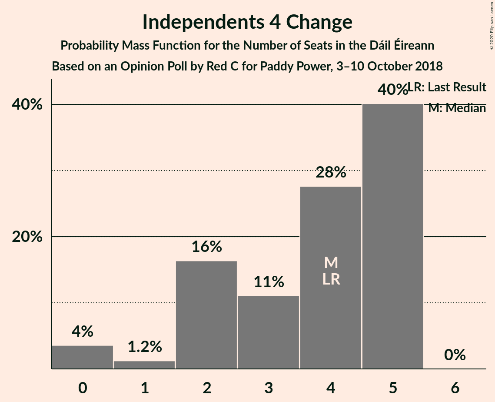
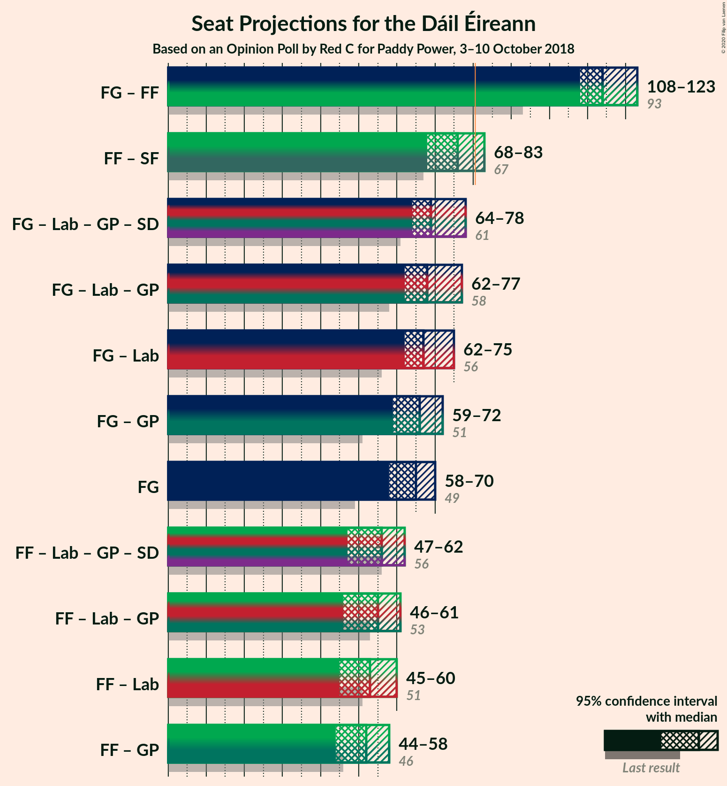
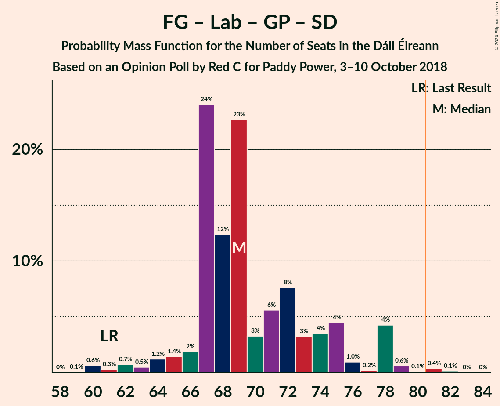

# Opinion Poll by Red C for Paddy Power, 3–10 October 2018

<a href="#voting-intentions">Voting Intentions</a> | <a href="#seats">Seats</a> | <a href="#coalitions">Coalitions</a> | <a href="#technical-information">Technical Information</a>

## Voting Intentions

### Confidence Intervals

| Party | Last Result | Poll Result | 80% Confidence Interval | 90% Confidence Interval | 95% Confidence Interval | 99% Confidence Interval |
|:-----:|:-----------:|:-----------:|:-----------------------:|:-----------------------:|:-----------------------:|:-----------------------:|
| Fine Gael | 25.5% | 31.9% | 30.1–33.8% |29.5–34.4% |29.1–34.9% |28.2–35.8% |
| Fianna Fáil | 24.3% | 26.9% | 25.1–28.8% |24.7–29.3% |24.2–29.7% |23.4–30.7% |
| Sinn Féin | 13.8% | 14.0% | 12.7–15.5% |12.3–15.9% |12.0–16.3% |11.4–17.0% |
| Independent | 15.9% | 11.0% | 9.8–12.4% |9.5–12.8% |9.2–13.1% |8.7–13.8% |
| Labour Party | 6.6% | 5.0% | 4.2–6.0% |4.0–6.3% |3.8–6.5% |3.5–7.1% |
| Green Party/Comhaontas Glas | 2.7% | 3.0% | 2.4–3.8% |2.2–4.1% |2.1–4.3% |1.9–4.7% |
| Solidarity–People Before Profit | 3.9% | 2.0% | 1.5–2.7% |1.4–2.9% |1.3–3.1% |1.1–3.4% |
| Independents 4 Change | 1.5% | 1.4% | 1.0–2.0% |0.9–2.2% |0.8–2.3% |0.7–2.7% |
| Social Democrats | 3.0% | 1.0% | 0.7–1.5% |0.6–1.7% |0.5–1.8% |0.4–2.1% |
| Renua Ireland | 2.2% | 0.2% | 0.1–0.5% |0.1–0.6% |0.1–0.7% |0.0–0.9% |

*Note:* The poll result column reflects the actual value used in the calculations. Published results may vary slightly, and in addition be rounded to fewer digits.

## Seats

### Confidence Intervals

| Party | Last Result | Median | 80% Confidence Interval | 90% Confidence Interval | 95% Confidence Interval | 99% Confidence Interval |
|:-----:|:-----------:|:------:|:-----------------------:|:-----------------------:|:-----------------------:|:-----------------------:|
| <a href="#fine-gael">Fine Gael</a> | 49 | 64 | 60–68 |60–69 |58–70 |56–71 |
| <a href="#fianna-fáil">Fianna Fáil</a> | 44 | 51 | 43–54 |43–56 |43–56 |42–57 |
| <a href="#sinn-féin">Sinn Féin</a> | 23 | 27 | 23–31 |20–32 |19–33 |18–33 |
| <a href="#independent">Independent</a> | 19 | 8 | 5–14 |5–14 |4–16 |3–16 |
| <a href="#labour-party">Labour Party</a> | 7 | 2 | 1–5 |1–7 |0–8 |0–8 |
| <a href="#green-party/comhaontas-glas">Green Party/Comhaontas Glas</a> | 2 | 1 | 1–2 |0–3 |0–3 |0–3 |
| <a href="#solidarity–people-before-profit">Solidarity–People Before Profit</a> | 6 | 2 | 0–4 |0–4 |0–4 |0–4 |
| <a href="#independents-4-change">Independents 4 Change</a> | 4 | 4 | 2–5 |1–5 |0–5 |0–5 |
| <a href="#social-democrats">Social Democrats</a> | 3 | 1 | 0–2 |0–3 |0–3 |0–3 |
| <a href="#renua-ireland">Renua Ireland</a> | 0 | 0 | 0 |0 |0 |0 |

### Fine Gael

*For a full overview of the results for this party, see the [Fine Gael](party-finegael.html) page.*

| Number of Seats | Probability | Accumulated | Special Marks |
|:---------------:|:-----------:|:-----------:|:-------------:|
| 49 | 0% | 100% | Last Result |
| 50 | 0% | 100% |  |
| 51 | 0% | 100% |  |
| 52 | 0% | 100% |  |
| 53 | 0% | 100% |  |
| 54 | 0% | 99.9% |  |
| 55 | 0% | 99.9% |  |
| 56 | 1.0% | 99.9% |  |
| 57 | 0.6% | 98.8% |  |
| 58 | 2% | 98% |  |
| 59 | 0.5% | 97% |  |
| 60 | 15% | 96% |  |
| 61 | 4% | 81% |  |
| 62 | 1.3% | 77% |  |
| 63 | 15% | 76% |  |
| 64 | 19% | 61% | Median |
| 65 | 22% | 42% |  |
| 66 | 2% | 20% |  |
| 67 | 4% | 18% |  |
| 68 | 7% | 14% |  |
| 69 | 3% | 7% |  |
| 70 | 2% | 4% |  |
| 71 | 1.4% | 2% |  |
| 72 | 0.1% | 0.1% |  |
| 73 | 0% | 0% |  |

### Fianna Fáil

*For a full overview of the results for this party, see the [Fianna Fáil](party-fiannafáil.html) page.*

| Number of Seats | Probability | Accumulated | Special Marks |
|:---------------:|:-----------:|:-----------:|:-------------:|
| 41 | 0.1% | 100% |  |
| 42 | 1.0% | 99.9% |  |
| 43 | 14% | 98.9% |  |
| 44 | 0.7% | 85% | Last Result |
| 45 | 3% | 85% |  |
| 46 | 4% | 81% |  |
| 47 | 5% | 78% |  |
| 48 | 4% | 73% |  |
| 49 | 2% | 69% |  |
| 50 | 5% | 67% |  |
| 51 | 20% | 62% | Median |
| 52 | 18% | 41% |  |
| 53 | 4% | 23% |  |
| 54 | 11% | 19% |  |
| 55 | 2% | 8% |  |
| 56 | 4% | 6% |  |
| 57 | 2% | 2% |  |
| 58 | 0.2% | 0.5% |  |
| 59 | 0.2% | 0.2% |  |
| 60 | 0% | 0% |  |

### Sinn Féin

*For a full overview of the results for this party, see the [Sinn Féin](party-sinnféin.html) page.*

| Number of Seats | Probability | Accumulated | Special Marks |
|:---------------:|:-----------:|:-----------:|:-------------:|
| 17 | 0.4% | 100% |  |
| 18 | 2% | 99.6% |  |
| 19 | 3% | 98% |  |
| 20 | 1.0% | 95% |  |
| 21 | 3% | 94% |  |
| 22 | 0.7% | 91% |  |
| 23 | 4% | 90% | Last Result |
| 24 | 25% | 86% |  |
| 25 | 5% | 61% |  |
| 26 | 0.6% | 56% |  |
| 27 | 16% | 56% | Median |
| 28 | 2% | 40% |  |
| 29 | 25% | 37% |  |
| 30 | 0.9% | 12% |  |
| 31 | 5% | 11% |  |
| 32 | 3% | 6% |  |
| 33 | 2% | 3% |  |
| 34 | 0% | 0.1% |  |
| 35 | 0% | 0.1% |  |
| 36 | 0% | 0% |  |

### Independent

*For a full overview of the results for this party, see the [Independent](party-independent.html) page.*

| Number of Seats | Probability | Accumulated | Special Marks |
|:---------------:|:-----------:|:-----------:|:-------------:|
| 3 | 0.8% | 100% |  |
| 4 | 2% | 99.2% |  |
| 5 | 13% | 97% |  |
| 6 | 20% | 84% |  |
| 7 | 11% | 65% |  |
| 8 | 6% | 54% | Median |
| 9 | 21% | 48% |  |
| 10 | 2% | 27% |  |
| 11 | 4% | 25% |  |
| 12 | 1.0% | 21% |  |
| 13 | 3% | 20% |  |
| 14 | 14% | 17% |  |
| 15 | 0.2% | 3% |  |
| 16 | 3% | 3% |  |
| 17 | 0% | 0% |  |
| 18 | 0% | 0% |  |
| 19 | 0% | 0% | Last Result |

### Labour Party

*For a full overview of the results for this party, see the [Labour Party](party-labourparty.html) page.*

| Number of Seats | Probability | Accumulated | Special Marks |
|:---------------:|:-----------:|:-----------:|:-------------:|
| 0 | 3% | 100% |  |
| 1 | 19% | 97% |  |
| 2 | 36% | 78% | Median |
| 3 | 9% | 43% |  |
| 4 | 23% | 34% |  |
| 5 | 2% | 11% |  |
| 6 | 3% | 8% |  |
| 7 | 2% | 5% | Last Result |
| 8 | 3% | 3% |  |
| 9 | 0.1% | 0.2% |  |
| 10 | 0% | 0.1% |  |
| 11 | 0% | 0% |  |

### Green Party/Comhaontas Glas

*For a full overview of the results for this party, see the [Green Party/Comhaontas Glas](party-greenpartycomhaontasglas.html) page.*

| Number of Seats | Probability | Accumulated | Special Marks |
|:---------------:|:-----------:|:-----------:|:-------------:|
| 0 | 9% | 100% |  |
| 1 | 52% | 91% | Median |
| 2 | 33% | 38% | Last Result |
| 3 | 6% | 6% |  |
| 4 | 0% | 0.1% |  |
| 5 | 0% | 0% |  |

### Solidarity–People Before Profit

*For a full overview of the results for this party, see the [Solidarity–People Before Profit](party-solidarity–peoplebeforeprofit.html) page.*

| Number of Seats | Probability | Accumulated | Special Marks |
|:---------------:|:-----------:|:-----------:|:-------------:|
| 0 | 17% | 100% |  |
| 1 | 18% | 83% |  |
| 2 | 35% | 65% | Median |
| 3 | 11% | 30% |  |
| 4 | 19% | 19% |  |
| 5 | 0% | 0.1% |  |
| 6 | 0% | 0% | Last Result |

### Independents 4 Change

*For a full overview of the results for this party, see the [Independents 4 Change](party-independents4change.html) page.*

| Number of Seats | Probability | Accumulated | Special Marks |
|:---------------:|:-----------:|:-----------:|:-------------:|
| 0 | 5% | 100% |  |
| 1 | 0.4% | 95% |  |
| 2 | 11% | 95% |  |
| 3 | 16% | 84% |  |
| 4 | 27% | 68% | Last Result, Median |
| 5 | 41% | 41% |  |
| 6 | 0% | 0% |  |

### Social Democrats

*For a full overview of the results for this party, see the [Social Democrats](party-socialdemocrats.html) page.*

| Number of Seats | Probability | Accumulated | Special Marks |
|:---------------:|:-----------:|:-----------:|:-------------:|
| 0 | 13% | 100% |  |
| 1 | 63% | 87% | Median |
| 2 | 17% | 24% |  |
| 3 | 7% | 7% | Last Result |
| 4 | 0% | 0% |  |

### Renua Ireland

*For a full overview of the results for this party, see the [Renua Ireland](party-renuaireland.html) page.*

| Number of Seats | Probability | Accumulated | Special Marks |
|:---------------:|:-----------:|:-----------:|:-------------:|
| 0 | 100% | 100% | Last Result, Median |

## Coalitions

### Confidence Intervals

| Coalition | Last Result | Median | Majority? | 80% Confidence Interval | 90% Confidence Interval | 95% Confidence Interval | 99% Confidence Interval |
|:---------:|:-----------:|:------:|:---------:|:-----------------------:|:-----------------------:|:-----------------------:|:-----------------------:|
| Fine Gael – Fianna Fáil | 93 | 115 | 100% | 108–119 | 108–123 | 108–123 | 107–125 |
| Fianna Fáil – Sinn Féin | 67 | 75 | 15% | 72–82 | 71–83 | 68–83 | 67–83 |
| Fine Gael – Labour Party – Green Party/Comhaontas Glas – Social Democrats | 61 | 68 | 0.1% | 67–74 | 66–75 | 64–78 | 62–79 |
| Fine Gael – Labour Party – Green Party/Comhaontas Glas | 58 | 67 | 0.1% | 66–73 | 65–74 | 62–76 | 59–77 |
| Fine Gael – Labour Party | 56 | 65 | 0% | 64–71 | 64–72 | 61–75 | 58–76 |
| Fine Gael – Green Party/Comhaontas Glas | 51 | 65 | 0% | 62–68 | 61–71 | 58–72 | 57–72 |
| Fine Gael | 49 | 64 | 0% | 60–68 | 60–69 | 58–70 | 56–71 |
| Fianna Fáil – Labour Party – Green Party/Comhaontas Glas – Social Democrats | 56 | 56 | 0% | 47–60 | 47–61 | 47–61 | 46–63 |
| Fianna Fáil – Labour Party – Green Party/Comhaontas Glas | 53 | 55 | 0% | 46–58 | 46–60 | 46–60 | 45–62 |
| Fianna Fáil – Labour Party | 51 | 54 | 0% | 45–57 | 45–59 | 45–59 | 44–61 |
| Fianna Fáil – Green Party/Comhaontas Glas | 46 | 52 | 0% | 44–56 | 44–57 | 44–58 | 43–59 |

### Fine Gael – Fianna Fáil

| Number of Seats | Probability | Accumulated | Special Marks |
|:---------------:|:-----------:|:-----------:|:-------------:|
| 93 | 0% | 100% | Last Result |
| 94 | 0% | 100% |  |
| 95 | 0% | 100% |  |
| 96 | 0% | 100% |  |
| 97 | 0% | 100% |  |
| 98 | 0% | 100% |  |
| 99 | 0% | 100% |  |
| 100 | 0% | 100% |  |
| 101 | 0% | 100% |  |
| 102 | 0% | 100% |  |
| 103 | 0% | 99.9% |  |
| 104 | 0.1% | 99.9% |  |
| 105 | 0.1% | 99.8% |  |
| 106 | 0.1% | 99.7% |  |
| 107 | 1.3% | 99.7% |  |
| 108 | 18% | 98% |  |
| 109 | 2% | 81% |  |
| 110 | 0.7% | 79% |  |
| 111 | 3% | 78% |  |
| 112 | 16% | 75% |  |
| 113 | 0.9% | 59% |  |
| 114 | 4% | 59% |  |
| 115 | 29% | 54% | Median |
| 116 | 0.7% | 25% |  |
| 117 | 11% | 25% |  |
| 118 | 3% | 14% |  |
| 119 | 3% | 11% |  |
| 120 | 0.5% | 8% |  |
| 121 | 1.0% | 8% |  |
| 122 | 1.3% | 7% |  |
| 123 | 4% | 5% |  |
| 124 | 0.3% | 1.5% |  |
| 125 | 0.9% | 1.2% |  |
| 126 | 0% | 0.2% |  |
| 127 | 0.2% | 0.2% |  |
| 128 | 0% | 0% |  |

### Fianna Fáil – Sinn Féin

| Number of Seats | Probability | Accumulated | Special Marks |
|:---------------:|:-----------:|:-----------:|:-------------:|
| 65 | 0% | 100% |  |
| 66 | 0.2% | 99.9% |  |
| 67 | 2% | 99.7% | Last Result |
| 68 | 0.1% | 98% |  |
| 69 | 0.5% | 97% |  |
| 70 | 0.4% | 97% |  |
| 71 | 2% | 96% |  |
| 72 | 17% | 95% |  |
| 73 | 3% | 78% |  |
| 74 | 5% | 75% |  |
| 75 | 22% | 70% |  |
| 76 | 0.8% | 48% |  |
| 77 | 5% | 47% |  |
| 78 | 5% | 42% | Median |
| 79 | 19% | 37% |  |
| 80 | 3% | 18% |  |
| 81 | 3% | 15% | Majority |
| 82 | 2% | 12% |  |
| 83 | 9% | 9% |  |
| 84 | 0% | 0.3% |  |
| 85 | 0% | 0.3% |  |
| 86 | 0.2% | 0.3% |  |
| 87 | 0% | 0% |  |

### Fine Gael – Labour Party – Green Party/Comhaontas Glas – Social Democrats

| Number of Seats | Probability | Accumulated | Special Marks |
|:---------------:|:-----------:|:-----------:|:-------------:|
| 59 | 0% | 100% |  |
| 60 | 0.2% | 99.9% |  |
| 61 | 0.2% | 99.8% | Last Result |
| 62 | 0.8% | 99.6% |  |
| 63 | 0.7% | 98.8% |  |
| 64 | 2% | 98% |  |
| 65 | 0.5% | 96% |  |
| 66 | 3% | 96% |  |
| 67 | 29% | 93% |  |
| 68 | 16% | 64% | Median |
| 69 | 17% | 49% |  |
| 70 | 1.4% | 32% |  |
| 71 | 5% | 30% |  |
| 72 | 12% | 25% |  |
| 73 | 3% | 13% |  |
| 74 | 4% | 10% |  |
| 75 | 2% | 6% |  |
| 76 | 1.1% | 4% |  |
| 77 | 0.1% | 3% |  |
| 78 | 2% | 3% |  |
| 79 | 0.5% | 0.7% |  |
| 80 | 0.1% | 0.2% |  |
| 81 | 0.1% | 0.1% | Majority |
| 82 | 0% | 0% |  |

### Fine Gael – Labour Party – Green Party/Comhaontas Glas

| Number of Seats | Probability | Accumulated | Special Marks |
|:---------------:|:-----------:|:-----------:|:-------------:|
| 58 | 0.2% | 100% | Last Result |
| 59 | 0.8% | 99.8% |  |
| 60 | 0.2% | 99.0% |  |
| 61 | 0.1% | 98.8% |  |
| 62 | 1.3% | 98.7% |  |
| 63 | 1.4% | 97% |  |
| 64 | 0.5% | 96% |  |
| 65 | 4% | 95% |  |
| 66 | 35% | 92% |  |
| 67 | 10% | 57% | Median |
| 68 | 15% | 47% |  |
| 69 | 2% | 31% |  |
| 70 | 6% | 30% |  |
| 71 | 11% | 24% |  |
| 72 | 2% | 13% |  |
| 73 | 5% | 11% |  |
| 74 | 2% | 6% |  |
| 75 | 0.9% | 4% |  |
| 76 | 0.5% | 3% |  |
| 77 | 2% | 2% |  |
| 78 | 0% | 0.2% |  |
| 79 | 0.1% | 0.2% |  |
| 80 | 0.1% | 0.1% |  |
| 81 | 0.1% | 0.1% | Majority |
| 82 | 0% | 0% |  |

### Fine Gael – Labour Party

| Number of Seats | Probability | Accumulated | Special Marks |
|:---------------:|:-----------:|:-----------:|:-------------:|
| 56 | 0% | 100% | Last Result |
| 57 | 0.2% | 100% |  |
| 58 | 0.8% | 99.8% |  |
| 59 | 0.2% | 99.0% |  |
| 60 | 0.3% | 98.8% |  |
| 61 | 1.1% | 98% |  |
| 62 | 0.6% | 97% |  |
| 63 | 1.4% | 97% |  |
| 64 | 17% | 95% |  |
| 65 | 31% | 78% |  |
| 66 | 1.0% | 48% | Median |
| 67 | 16% | 46% |  |
| 68 | 3% | 30% |  |
| 69 | 4% | 27% |  |
| 70 | 11% | 23% |  |
| 71 | 6% | 12% |  |
| 72 | 2% | 6% |  |
| 73 | 0.2% | 4% |  |
| 74 | 0.5% | 4% |  |
| 75 | 0.7% | 3% |  |
| 76 | 2% | 2% |  |
| 77 | 0.1% | 0.2% |  |
| 78 | 0% | 0.1% |  |
| 79 | 0% | 0.1% |  |
| 80 | 0.1% | 0.1% |  |
| 81 | 0% | 0% | Majority |

### Fine Gael – Green Party/Comhaontas Glas

| Number of Seats | Probability | Accumulated | Special Marks |
|:---------------:|:-----------:|:-----------:|:-------------:|
| 51 | 0% | 100% | Last Result |
| 52 | 0% | 100% |  |
| 53 | 0% | 100% |  |
| 54 | 0% | 100% |  |
| 55 | 0% | 99.9% |  |
| 56 | 0% | 99.9% |  |
| 57 | 1.0% | 99.9% |  |
| 58 | 1.5% | 98.9% |  |
| 59 | 0.8% | 97% |  |
| 60 | 0.5% | 97% |  |
| 61 | 2% | 96% |  |
| 62 | 17% | 94% |  |
| 63 | 1.0% | 77% |  |
| 64 | 2% | 76% |  |
| 65 | 32% | 74% | Median |
| 66 | 16% | 42% |  |
| 67 | 6% | 26% |  |
| 68 | 10% | 20% |  |
| 69 | 3% | 10% |  |
| 70 | 1.2% | 7% |  |
| 71 | 2% | 6% |  |
| 72 | 3% | 4% |  |
| 73 | 0.1% | 0.3% |  |
| 74 | 0.1% | 0.1% |  |
| 75 | 0% | 0% |  |

### Fine Gael

| Number of Seats | Probability | Accumulated | Special Marks |
|:---------------:|:-----------:|:-----------:|:-------------:|
| 49 | 0% | 100% | Last Result |
| 50 | 0% | 100% |  |
| 51 | 0% | 100% |  |
| 52 | 0% | 100% |  |
| 53 | 0% | 100% |  |
| 54 | 0% | 99.9% |  |
| 55 | 0% | 99.9% |  |
| 56 | 1.0% | 99.9% |  |
| 57 | 0.6% | 98.8% |  |
| 58 | 2% | 98% |  |
| 59 | 0.5% | 97% |  |
| 60 | 15% | 96% |  |
| 61 | 4% | 81% |  |
| 62 | 1.3% | 77% |  |
| 63 | 15% | 76% |  |
| 64 | 19% | 61% | Median |
| 65 | 22% | 42% |  |
| 66 | 2% | 20% |  |
| 67 | 4% | 18% |  |
| 68 | 7% | 14% |  |
| 69 | 3% | 7% |  |
| 70 | 2% | 4% |  |
| 71 | 1.4% | 2% |  |
| 72 | 0.1% | 0.1% |  |
| 73 | 0% | 0% |  |

### Fianna Fáil – Labour Party – Green Party/Comhaontas Glas – Social Democrats

| Number of Seats | Probability | Accumulated | Special Marks |
|:---------------:|:-----------:|:-----------:|:-------------:|
| 45 | 0% | 100% |  |
| 46 | 1.0% | 99.9% |  |
| 47 | 14% | 99.0% |  |
| 48 | 0% | 85% |  |
| 49 | 0.2% | 85% |  |
| 50 | 5% | 85% |  |
| 51 | 0.2% | 81% |  |
| 52 | 2% | 80% |  |
| 53 | 4% | 78% |  |
| 54 | 19% | 75% |  |
| 55 | 0.7% | 55% | Median |
| 56 | 6% | 54% | Last Result |
| 57 | 7% | 48% |  |
| 58 | 12% | 41% |  |
| 59 | 4% | 29% |  |
| 60 | 18% | 25% |  |
| 61 | 5% | 7% |  |
| 62 | 2% | 2% |  |
| 63 | 0.4% | 0.9% |  |
| 64 | 0.2% | 0.4% |  |
| 65 | 0.2% | 0.3% |  |
| 66 | 0.1% | 0.1% |  |
| 67 | 0% | 0% |  |

### Fianna Fáil – Labour Party – Green Party/Comhaontas Glas

| Number of Seats | Probability | Accumulated | Special Marks |
|:---------------:|:-----------:|:-----------:|:-------------:|
| 43 | 0.1% | 100% |  |
| 44 | 0% | 99.9% |  |
| 45 | 0.9% | 99.9% |  |
| 46 | 14% | 98.9% |  |
| 47 | 0.1% | 85% |  |
| 48 | 0.2% | 85% |  |
| 49 | 5% | 85% |  |
| 50 | 0.1% | 80% |  |
| 51 | 3% | 80% |  |
| 52 | 4% | 78% |  |
| 53 | 19% | 74% | Last Result |
| 54 | 0.2% | 55% | Median |
| 55 | 9% | 54% |  |
| 56 | 7% | 46% |  |
| 57 | 3% | 39% |  |
| 58 | 27% | 36% |  |
| 59 | 3% | 9% |  |
| 60 | 4% | 6% |  |
| 61 | 1.3% | 2% |  |
| 62 | 0.5% | 0.8% |  |
| 63 | 0.2% | 0.4% |  |
| 64 | 0.1% | 0.2% |  |
| 65 | 0.1% | 0.1% |  |
| 66 | 0% | 0% |  |

### Fianna Fáil – Labour Party

| Number of Seats | Probability | Accumulated | Special Marks |
|:---------------:|:-----------:|:-----------:|:-------------:|
| 42 | 0.1% | 100% |  |
| 43 | 0% | 99.9% |  |
| 44 | 1.0% | 99.8% |  |
| 45 | 14% | 98.9% |  |
| 46 | 0% | 85% |  |
| 47 | 0.4% | 85% |  |
| 48 | 2% | 85% |  |
| 49 | 6% | 83% |  |
| 50 | 0.6% | 77% |  |
| 51 | 1.5% | 76% | Last Result |
| 52 | 20% | 75% |  |
| 53 | 3% | 54% | Median |
| 54 | 9% | 51% |  |
| 55 | 3% | 42% |  |
| 56 | 29% | 39% |  |
| 57 | 2% | 11% |  |
| 58 | 3% | 9% |  |
| 59 | 5% | 6% |  |
| 60 | 0.2% | 0.9% |  |
| 61 | 0.3% | 0.7% |  |
| 62 | 0.2% | 0.3% |  |
| 63 | 0.1% | 0.2% |  |
| 64 | 0.1% | 0.1% |  |
| 65 | 0% | 0% |  |

### Fianna Fáil – Green Party/Comhaontas Glas

| Number of Seats | Probability | Accumulated | Special Marks |
|:---------------:|:-----------:|:-----------:|:-------------:|
| 42 | 0.1% | 100% |  |
| 43 | 0.8% | 99.9% |  |
| 44 | 14% | 99.1% |  |
| 45 | 0.7% | 85% |  |
| 46 | 0.4% | 85% | Last Result |
| 47 | 8% | 84% |  |
| 48 | 2% | 77% |  |
| 49 | 6% | 75% |  |
| 50 | 1.3% | 69% |  |
| 51 | 3% | 67% |  |
| 52 | 23% | 65% | Median |
| 53 | 4% | 42% |  |
| 54 | 18% | 38% |  |
| 55 | 3% | 20% |  |
| 56 | 10% | 17% |  |
| 57 | 5% | 7% |  |
| 58 | 2% | 3% |  |
| 59 | 0.6% | 0.8% |  |
| 60 | 0.2% | 0.2% |  |
| 61 | 0% | 0% |  |

## Technical Information

### Opinion Poll

+ **Polling firm:** Red C
+ **Commissioner(s):** Paddy Power
+ **Fieldwork period:** 3–10 October 2018

### Calculations

+ **Sample size:** 1000
+ **Simulations done:** 131,072
+ **Error estimate:** 2.12%

