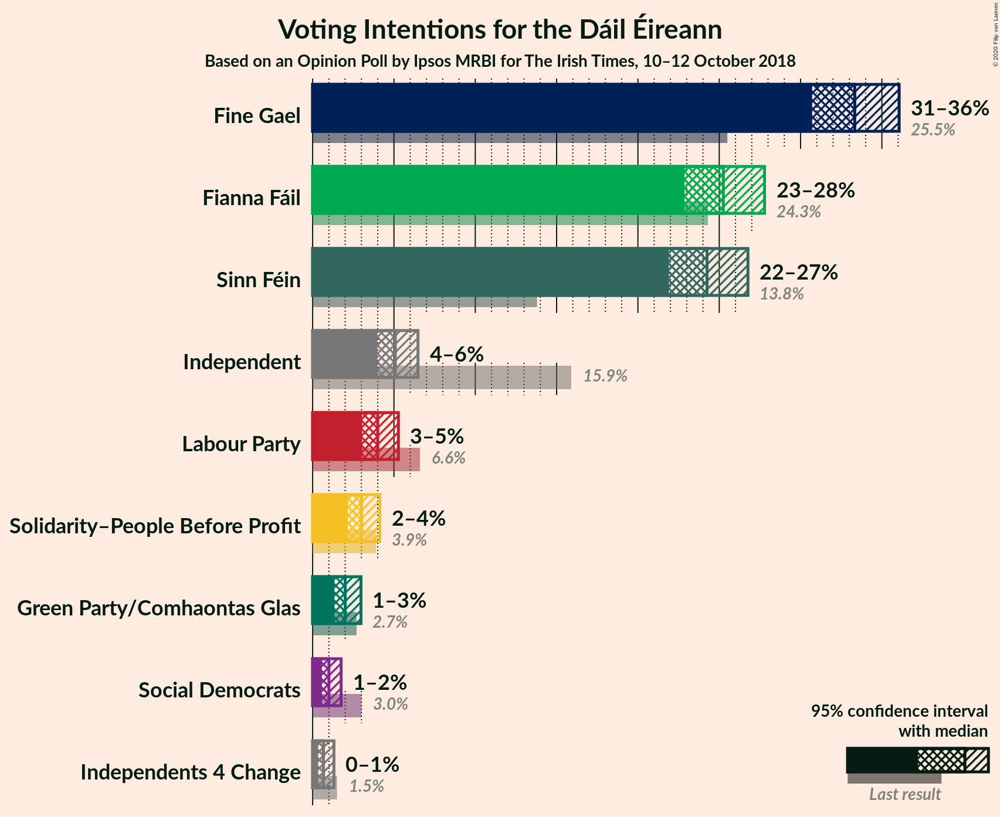
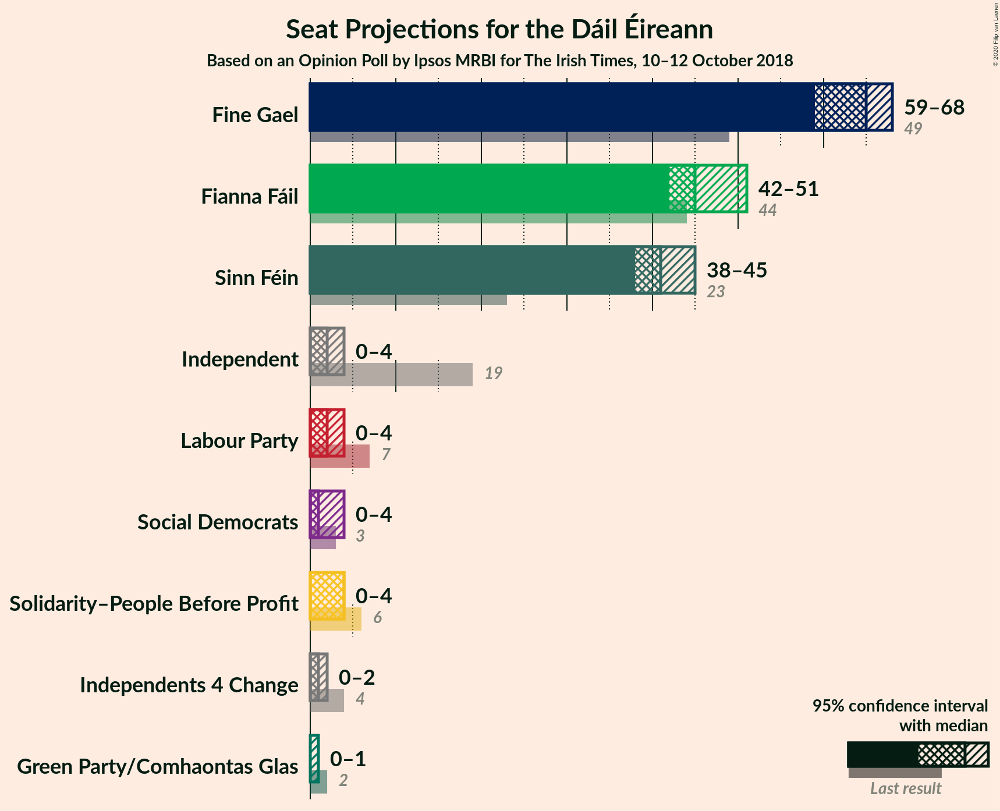
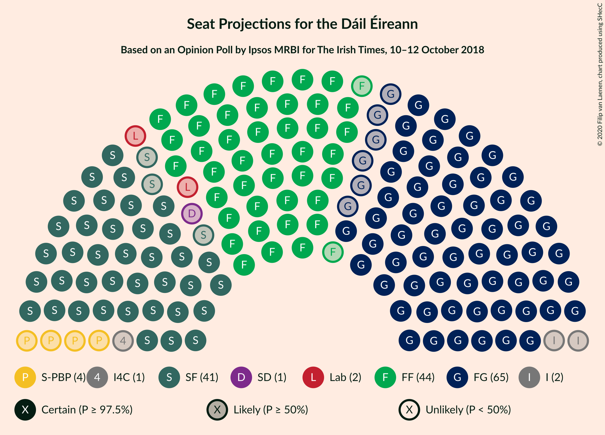

# Opinion Poll by Ipsos MRBI for The Irish Times, 10–12 October 2018

<a href="#voting-intentions">Voting Intentions</a> | <a href="#seats">Seats</a> | <a href="#coalitions">Coalitions</a> | <a href="#technical-information">Technical Information</a>

## Voting Intentions

### Confidence Intervals

| Party | Last Result | Poll Result | 80% Confidence Interval | 90% Confidence Interval | 95% Confidence Interval | 99% Confidence Interval |
|:-----:|:-----------:|:-----------:|:-----------------------:|:-----------------------:|:-----------------------:|:-----------------------:|
| Fine Gael | 25.5% | 33.3% | 31.6–35.1% |31.1–35.6% |30.7–36.1% |29.9–36.9% |
| Fianna Fáil | 24.3% | 25.2% | 23.7–26.9% |23.2–27.4% |22.9–27.8% |22.1–28.6% |
| Sinn Féin | 13.8% | 24.2% | 22.7–25.9% |22.3–26.4% |21.9–26.8% |21.2–27.6% |
| Independent | 15.9% | 5.1% | 4.3–6.0% |4.1–6.2% |4.0–6.5% |3.6–7.0% |
| Labour Party | 6.6% | 4.0% | 3.4–4.8% |3.2–5.1% |3.0–5.3% |2.7–5.7% |
| Solidarity–People Before Profit | 3.9% | 3.0% | 2.5–3.7% |2.3–3.9% |2.2–4.1% |1.9–4.5% |
| Green Party/Comhaontas Glas | 2.7% | 2.0% | 1.6–2.6% |1.4–2.8% |1.3–3.0% |1.2–3.3% |
| Social Democrats | 3.0% | 1.0% | 0.7–1.5% |0.6–1.6% |0.6–1.8% |0.5–2.0% |
| Independents 4 Change | 1.5% | 0.7% | 0.4–1.1% |0.4–1.2% |0.3–1.3% |0.3–1.6% |

*Note:* The poll result column reflects the actual value used in the calculations. Published results may vary slightly, and in addition be rounded to fewer digits.

## Seats

### Confidence Intervals

| Party | Last Result | Median | 80% Confidence Interval | 90% Confidence Interval | 95% Confidence Interval | 99% Confidence Interval |
|:-----:|:-----------:|:------:|:-----------------------:|:-----------------------:|:-----------------------:|:-----------------------:|
| <a href="#fine-gael">Fine Gael</a> | 49 | 65 | 61–67 |60–67 |59–68 |57–69 |
| <a href="#fianna-fáil">Fianna Fáil</a> | 44 | 45 | 44–47 |44–49 |42–51 |41–52 |
| <a href="#sinn-féin">Sinn Féin</a> | 23 | 41 | 39–45 |39–45 |38–45 |37–46 |
| <a href="#independent">Independent</a> | 19 | 2 | 1–2 |0–3 |0–4 |0–4 |
| <a href="#labour-party">Labour Party</a> | 7 | 2 | 0–3 |0–3 |0–4 |0–5 |
| <a href="#solidarity–people-before-profit">Solidarity–People Before Profit</a> | 6 | 4 | 2–4 |1–4 |0–4 |0–5 |
| <a href="#green-party/comhaontas-glas">Green Party/Comhaontas Glas</a> | 2 | 0 | 0 |0–1 |0–1 |0–2 |
| <a href="#social-democrats">Social Democrats</a> | 3 | 1 | 0–1 |0–4 |0–4 |0–4 |
| <a href="#independents-4-change">Independents 4 Change</a> | 4 | 1 | 0–1 |0–1 |0–2 |0–4 |

### Fine Gael

*For a full overview of the results for this party, see the [Fine Gael](party-finegael.html) page.*

| Number of Seats | Probability | Accumulated | Special Marks |
|:---------------:|:-----------:|:-----------:|:-------------:|
| 49 | 0% | 100% | Last Result |
| 50 | 0% | 100% |  |
| 51 | 0% | 100% |  |
| 52 | 0% | 100% |  |
| 53 | 0% | 100% |  |
| 54 | 0% | 100% |  |
| 55 | 0% | 100% |  |
| 56 | 0.2% | 99.9% |  |
| 57 | 0.5% | 99.7% |  |
| 58 | 1.1% | 99.2% |  |
| 59 | 1.2% | 98% |  |
| 60 | 5% | 97% |  |
| 61 | 2% | 92% |  |
| 62 | 3% | 90% |  |
| 63 | 7% | 86% |  |
| 64 | 6% | 80% |  |
| 65 | 40% | 74% | Median |
| 66 | 12% | 34% |  |
| 67 | 18% | 22% |  |
| 68 | 3% | 4% |  |
| 69 | 1.1% | 1.2% |  |
| 70 | 0% | 0% |  |

### Fianna Fáil

*For a full overview of the results for this party, see the [Fianna Fáil](party-fiannafáil.html) page.*

| Number of Seats | Probability | Accumulated | Special Marks |
|:---------------:|:-----------:|:-----------:|:-------------:|
| 39 | 0.1% | 100% |  |
| 40 | 0.2% | 99.9% |  |
| 41 | 0.3% | 99.7% |  |
| 42 | 3% | 99.4% |  |
| 43 | 1.1% | 97% |  |
| 44 | 43% | 96% | Last Result |
| 45 | 21% | 52% | Median |
| 46 | 16% | 31% |  |
| 47 | 7% | 15% |  |
| 48 | 0.5% | 8% |  |
| 49 | 2% | 7% |  |
| 50 | 1.1% | 5% |  |
| 51 | 2% | 4% |  |
| 52 | 2% | 2% |  |
| 53 | 0% | 0.2% |  |
| 54 | 0.2% | 0.2% |  |
| 55 | 0% | 0% |  |

### Sinn Féin

*For a full overview of the results for this party, see the [Sinn Féin](party-sinnféin.html) page.*

| Number of Seats | Probability | Accumulated | Special Marks |
|:---------------:|:-----------:|:-----------:|:-------------:|
| 23 | 0% | 100% | Last Result |
| 24 | 0% | 100% |  |
| 25 | 0% | 100% |  |
| 26 | 0% | 100% |  |
| 27 | 0% | 100% |  |
| 28 | 0% | 100% |  |
| 29 | 0% | 100% |  |
| 30 | 0% | 100% |  |
| 31 | 0% | 100% |  |
| 32 | 0% | 100% |  |
| 33 | 0% | 100% |  |
| 34 | 0% | 100% |  |
| 35 | 0.1% | 100% |  |
| 36 | 0.2% | 99.9% |  |
| 37 | 0.2% | 99.7% |  |
| 38 | 3% | 99.4% |  |
| 39 | 7% | 96% |  |
| 40 | 24% | 89% |  |
| 41 | 39% | 65% | Median |
| 42 | 3% | 26% |  |
| 43 | 1.1% | 23% |  |
| 44 | 8% | 22% |  |
| 45 | 13% | 15% |  |
| 46 | 2% | 2% |  |
| 47 | 0% | 0% |  |

### Independent

*For a full overview of the results for this party, see the [Independent](party-independent.html) page.*

| Number of Seats | Probability | Accumulated | Special Marks |
|:---------------:|:-----------:|:-----------:|:-------------:|
| 0 | 9% | 100% |  |
| 1 | 21% | 91% |  |
| 2 | 60% | 70% | Median |
| 3 | 6% | 9% |  |
| 4 | 3% | 3% |  |
| 5 | 0% | 0% |  |
| 6 | 0% | 0% |  |
| 7 | 0% | 0% |  |
| 8 | 0% | 0% |  |
| 9 | 0% | 0% |  |
| 10 | 0% | 0% |  |
| 11 | 0% | 0% |  |
| 12 | 0% | 0% |  |
| 13 | 0% | 0% |  |
| 14 | 0% | 0% |  |
| 15 | 0% | 0% |  |
| 16 | 0% | 0% |  |
| 17 | 0% | 0% |  |
| 18 | 0% | 0% |  |
| 19 | 0% | 0% | Last Result |

### Labour Party

*For a full overview of the results for this party, see the [Labour Party](party-labourparty.html) page.*

| Number of Seats | Probability | Accumulated | Special Marks |
|:---------------:|:-----------:|:-----------:|:-------------:|
| 0 | 12% | 100% |  |
| 1 | 29% | 88% |  |
| 2 | 48% | 59% | Median |
| 3 | 8% | 11% |  |
| 4 | 2% | 3% |  |
| 5 | 0.8% | 1.0% |  |
| 6 | 0.2% | 0.2% |  |
| 7 | 0% | 0% | Last Result |

### Solidarity–People Before Profit

*For a full overview of the results for this party, see the [Solidarity–People Before Profit](party-solidarity–peoplebeforeprofit.html) page.*

| Number of Seats | Probability | Accumulated | Special Marks |
|:---------------:|:-----------:|:-----------:|:-------------:|
| 0 | 3% | 100% |  |
| 1 | 7% | 97% |  |
| 2 | 7% | 90% |  |
| 3 | 10% | 83% |  |
| 4 | 72% | 73% | Median |
| 5 | 1.2% | 1.4% |  |
| 6 | 0.1% | 0.1% | Last Result |
| 7 | 0% | 0% |  |

### Green Party/Comhaontas Glas

*For a full overview of the results for this party, see the [Green Party/Comhaontas Glas](party-greenpartycomhaontasglas.html) page.*

| Number of Seats | Probability | Accumulated | Special Marks |
|:---------------:|:-----------:|:-----------:|:-------------:|
| 0 | 94% | 100% | Median |
| 1 | 6% | 6% |  |
| 2 | 0.5% | 0.5% | Last Result |
| 3 | 0% | 0% |  |

### Social Democrats

*For a full overview of the results for this party, see the [Social Democrats](party-socialdemocrats.html) page.*

| Number of Seats | Probability | Accumulated | Special Marks |
|:---------------:|:-----------:|:-----------:|:-------------:|
| 0 | 37% | 100% |  |
| 1 | 54% | 63% | Median |
| 2 | 2% | 10% |  |
| 3 | 0.9% | 8% | Last Result |
| 4 | 7% | 7% |  |
| 5 | 0% | 0% |  |

### Independents 4 Change

*For a full overview of the results for this party, see the [Independents 4 Change](party-independents4change.html) page.*

| Number of Seats | Probability | Accumulated | Special Marks |
|:---------------:|:-----------:|:-----------:|:-------------:|
| 0 | 48% | 100% |  |
| 1 | 48% | 52% | Median |
| 2 | 2% | 4% |  |
| 3 | 0.4% | 2% |  |
| 4 | 1.4% | 1.4% | Last Result |
| 5 | 0% | 0% |  |

## Coalitions

### Confidence Intervals

| Coalition | Last Result | Median | Majority? | 80% Confidence Interval | 90% Confidence Interval | 95% Confidence Interval | 99% Confidence Interval |
|:---------:|:-----------:|:------:|:---------:|:-----------------------:|:-----------------------:|:-----------------------:|:-----------------------:|
| Fine Gael – Fianna Fáil | 93 | 109 | 100% | 107–113 | 106–114 | 105–114 | 104–115 |
| Fianna Fáil – Sinn Féin | 67 | 85 | 99.7% | 85–90 | 84–91 | 83–95 | 81–96 |
| Fine Gael – Labour Party – Green Party/Comhaontas Glas – Social Democrats | 61 | 68 | 0% | 65–69 | 62–70 | 61–71 | 59–73 |
| Fine Gael – Labour Party – Green Party/Comhaontas Glas | 58 | 67 | 0% | 63–69 | 61–69 | 61–70 | 58–73 |
| Fine Gael – Labour Party | 56 | 67 | 0% | 63–69 | 61–69 | 61–70 | 58–72 |
| Fine Gael | 49 | 65 | 0% | 61–67 | 60–67 | 59–68 | 57–69 |
| Fine Gael – Green Party/Comhaontas Glas | 51 | 65 | 0% | 62–67 | 60–68 | 59–68 | 57–69 |
| Fianna Fáil – Labour Party – Green Party/Comhaontas Glas – Social Democrats | 56 | 47 | 0% | 46–50 | 46–52 | 45–53 | 44–55 |
| Fianna Fáil – Labour Party – Green Party/Comhaontas Glas | 53 | 46 | 0% | 46–49 | 45–51 | 45–52 | 43–54 |
| Fianna Fáil – Labour Party | 51 | 46 | 0% | 46–49 | 45–51 | 45–52 | 43–54 |
| Fianna Fáil – Green Party/Comhaontas Glas | 46 | 45 | 0% | 44–47 | 44–49 | 43–51 | 42–52 |

### Fine Gael – Fianna Fáil

| Number of Seats | Probability | Accumulated | Special Marks |
|:---------------:|:-----------:|:-----------:|:-------------:|
| 93 | 0% | 100% | Last Result |
| 94 | 0% | 100% |  |
| 95 | 0% | 100% |  |
| 96 | 0% | 100% |  |
| 97 | 0% | 100% |  |
| 98 | 0% | 100% |  |
| 99 | 0% | 100% |  |
| 100 | 0% | 100% |  |
| 101 | 0% | 100% |  |
| 102 | 0.1% | 100% |  |
| 103 | 0.1% | 99.9% |  |
| 104 | 0.7% | 99.8% |  |
| 105 | 3% | 99.1% |  |
| 106 | 1.2% | 96% |  |
| 107 | 9% | 95% |  |
| 108 | 3% | 86% |  |
| 109 | 39% | 83% |  |
| 110 | 7% | 44% | Median |
| 111 | 3% | 37% |  |
| 112 | 23% | 33% |  |
| 113 | 2% | 10% |  |
| 114 | 7% | 8% |  |
| 115 | 2% | 2% |  |
| 116 | 0.1% | 0.1% |  |
| 117 | 0% | 0% |  |

### Fianna Fáil – Sinn Féin

| Number of Seats | Probability | Accumulated | Special Marks |
|:---------------:|:-----------:|:-----------:|:-------------:|
| 67 | 0% | 100% | Last Result |
| 68 | 0% | 100% |  |
| 69 | 0% | 100% |  |
| 70 | 0% | 100% |  |
| 71 | 0% | 100% |  |
| 72 | 0% | 100% |  |
| 73 | 0% | 100% |  |
| 74 | 0% | 100% |  |
| 75 | 0% | 100% |  |
| 76 | 0% | 100% |  |
| 77 | 0% | 100% |  |
| 78 | 0% | 100% |  |
| 79 | 0% | 100% |  |
| 80 | 0.3% | 100% |  |
| 81 | 0.4% | 99.7% | Majority |
| 82 | 1.1% | 99.3% |  |
| 83 | 0.7% | 98% |  |
| 84 | 5% | 97% |  |
| 85 | 48% | 93% |  |
| 86 | 17% | 45% | Median |
| 87 | 3% | 28% |  |
| 88 | 1.5% | 25% |  |
| 89 | 9% | 24% |  |
| 90 | 6% | 15% |  |
| 91 | 5% | 9% |  |
| 92 | 0.2% | 5% |  |
| 93 | 0.6% | 4% |  |
| 94 | 0.9% | 4% |  |
| 95 | 1.0% | 3% |  |
| 96 | 2% | 2% |  |
| 97 | 0% | 0% |  |

### Fine Gael – Labour Party – Green Party/Comhaontas Glas – Social Democrats

| Number of Seats | Probability | Accumulated | Special Marks |
|:---------------:|:-----------:|:-----------:|:-------------:|
| 58 | 0.1% | 100% |  |
| 59 | 1.2% | 99.8% |  |
| 60 | 0.7% | 98.6% |  |
| 61 | 1.0% | 98% | Last Result |
| 62 | 3% | 97% |  |
| 63 | 1.3% | 94% |  |
| 64 | 3% | 93% |  |
| 65 | 7% | 90% |  |
| 66 | 5% | 84% |  |
| 67 | 7% | 79% |  |
| 68 | 56% | 72% | Median |
| 69 | 9% | 16% |  |
| 70 | 4% | 7% |  |
| 71 | 2% | 3% |  |
| 72 | 0.3% | 2% |  |
| 73 | 1.3% | 1.4% |  |
| 74 | 0.1% | 0.1% |  |
| 75 | 0% | 0% |  |

### Fine Gael – Labour Party – Green Party/Comhaontas Glas

| Number of Seats | Probability | Accumulated | Special Marks |
|:---------------:|:-----------:|:-----------:|:-------------:|
| 56 | 0.1% | 100% |  |
| 57 | 0.2% | 99.9% |  |
| 58 | 0.3% | 99.7% | Last Result |
| 59 | 1.1% | 99.5% |  |
| 60 | 0.8% | 98% |  |
| 61 | 6% | 98% |  |
| 62 | 0.3% | 92% |  |
| 63 | 3% | 92% |  |
| 64 | 2% | 89% |  |
| 65 | 7% | 87% |  |
| 66 | 10% | 80% |  |
| 67 | 47% | 70% | Median |
| 68 | 12% | 24% |  |
| 69 | 9% | 12% |  |
| 70 | 0.9% | 3% |  |
| 71 | 1.3% | 2% |  |
| 72 | 0.1% | 0.8% |  |
| 73 | 0.7% | 0.7% |  |
| 74 | 0% | 0% |  |

### Fine Gael – Labour Party

| Number of Seats | Probability | Accumulated | Special Marks |
|:---------------:|:-----------:|:-----------:|:-------------:|
| 56 | 0.1% | 100% | Last Result |
| 57 | 0.2% | 99.9% |  |
| 58 | 0.3% | 99.7% |  |
| 59 | 1.1% | 99.4% |  |
| 60 | 0.8% | 98% |  |
| 61 | 6% | 98% |  |
| 62 | 0.3% | 92% |  |
| 63 | 3% | 92% |  |
| 64 | 4% | 89% |  |
| 65 | 5% | 85% |  |
| 66 | 10% | 80% |  |
| 67 | 47% | 70% | Median |
| 68 | 11% | 22% |  |
| 69 | 9% | 11% |  |
| 70 | 0.6% | 3% |  |
| 71 | 1.2% | 2% |  |
| 72 | 0.7% | 0.7% |  |
| 73 | 0% | 0% |  |

### Fine Gael

| Number of Seats | Probability | Accumulated | Special Marks |
|:---------------:|:-----------:|:-----------:|:-------------:|
| 49 | 0% | 100% | Last Result |
| 50 | 0% | 100% |  |
| 51 | 0% | 100% |  |
| 52 | 0% | 100% |  |
| 53 | 0% | 100% |  |
| 54 | 0% | 100% |  |
| 55 | 0% | 100% |  |
| 56 | 0.2% | 99.9% |  |
| 57 | 0.5% | 99.7% |  |
| 58 | 1.1% | 99.2% |  |
| 59 | 1.2% | 98% |  |
| 60 | 5% | 97% |  |
| 61 | 2% | 92% |  |
| 62 | 3% | 90% |  |
| 63 | 7% | 86% |  |
| 64 | 6% | 80% |  |
| 65 | 40% | 74% | Median |
| 66 | 12% | 34% |  |
| 67 | 18% | 22% |  |
| 68 | 3% | 4% |  |
| 69 | 1.1% | 1.2% |  |
| 70 | 0% | 0% |  |

### Fine Gael – Green Party/Comhaontas Glas

| Number of Seats | Probability | Accumulated | Special Marks |
|:---------------:|:-----------:|:-----------:|:-------------:|
| 51 | 0% | 100% | Last Result |
| 52 | 0% | 100% |  |
| 53 | 0% | 100% |  |
| 54 | 0% | 100% |  |
| 55 | 0% | 100% |  |
| 56 | 0.2% | 100% |  |
| 57 | 0.5% | 99.7% |  |
| 58 | 1.1% | 99.3% |  |
| 59 | 1.2% | 98% |  |
| 60 | 5% | 97% |  |
| 61 | 2% | 92% |  |
| 62 | 2% | 90% |  |
| 63 | 7% | 88% |  |
| 64 | 4% | 80% |  |
| 65 | 42% | 77% | Median |
| 66 | 12% | 35% |  |
| 67 | 17% | 22% |  |
| 68 | 4% | 5% |  |
| 69 | 1.3% | 1.3% |  |
| 70 | 0% | 0.1% |  |
| 71 | 0% | 0% |  |

### Fianna Fáil – Labour Party – Green Party/Comhaontas Glas – Social Democrats

| Number of Seats | Probability | Accumulated | Special Marks |
|:---------------:|:-----------:|:-----------:|:-------------:|
| 41 | 0.1% | 100% |  |
| 42 | 0.1% | 99.9% |  |
| 43 | 0.2% | 99.8% |  |
| 44 | 1.2% | 99.5% |  |
| 45 | 2% | 98% |  |
| 46 | 15% | 96% |  |
| 47 | 41% | 81% |  |
| 48 | 15% | 40% | Median |
| 49 | 10% | 25% |  |
| 50 | 8% | 15% |  |
| 51 | 2% | 7% |  |
| 52 | 2% | 5% |  |
| 53 | 0.6% | 3% |  |
| 54 | 2% | 2% |  |
| 55 | 0.4% | 0.6% |  |
| 56 | 0.1% | 0.2% | Last Result |
| 57 | 0% | 0.1% |  |
| 58 | 0.1% | 0.1% |  |
| 59 | 0% | 0% |  |

### Fianna Fáil – Labour Party – Green Party/Comhaontas Glas

| Number of Seats | Probability | Accumulated | Special Marks |
|:---------------:|:-----------:|:-----------:|:-------------:|
| 41 | 0.1% | 100% |  |
| 42 | 0.3% | 99.8% |  |
| 43 | 0.3% | 99.5% |  |
| 44 | 1.2% | 99.2% |  |
| 45 | 4% | 98% |  |
| 46 | 57% | 94% |  |
| 47 | 17% | 37% | Median |
| 48 | 4% | 20% |  |
| 49 | 8% | 16% |  |
| 50 | 3% | 8% |  |
| 51 | 1.3% | 5% |  |
| 52 | 2% | 4% |  |
| 53 | 2% | 2% | Last Result |
| 54 | 0.2% | 0.7% |  |
| 55 | 0.3% | 0.4% |  |
| 56 | 0% | 0.1% |  |
| 57 | 0% | 0.1% |  |
| 58 | 0.1% | 0.1% |  |
| 59 | 0% | 0% |  |

### Fianna Fáil – Labour Party

| Number of Seats | Probability | Accumulated | Special Marks |
|:---------------:|:-----------:|:-----------:|:-------------:|
| 41 | 0.1% | 100% |  |
| 42 | 0.3% | 99.8% |  |
| 43 | 0.4% | 99.5% |  |
| 44 | 1.3% | 99.1% |  |
| 45 | 6% | 98% |  |
| 46 | 56% | 92% |  |
| 47 | 17% | 36% | Median |
| 48 | 4% | 19% |  |
| 49 | 8% | 15% |  |
| 50 | 2% | 7% |  |
| 51 | 1.2% | 5% | Last Result |
| 52 | 2% | 4% |  |
| 53 | 2% | 2% |  |
| 54 | 0.2% | 0.6% |  |
| 55 | 0.3% | 0.4% |  |
| 56 | 0% | 0.1% |  |
| 57 | 0% | 0.1% |  |
| 58 | 0.1% | 0.1% |  |
| 59 | 0% | 0% |  |

### Fianna Fáil – Green Party/Comhaontas Glas

| Number of Seats | Probability | Accumulated | Special Marks |
|:---------------:|:-----------:|:-----------:|:-------------:|
| 39 | 0.1% | 100% |  |
| 40 | 0.2% | 99.9% |  |
| 41 | 0.1% | 99.7% |  |
| 42 | 2% | 99.6% |  |
| 43 | 2% | 98% |  |
| 44 | 43% | 96% |  |
| 45 | 20% | 53% | Median |
| 46 | 17% | 33% | Last Result |
| 47 | 8% | 16% |  |
| 48 | 0.8% | 8% |  |
| 49 | 2% | 7% |  |
| 50 | 1.1% | 5% |  |
| 51 | 2% | 4% |  |
| 52 | 2% | 2% |  |
| 53 | 0.1% | 0.3% |  |
| 54 | 0.2% | 0.2% |  |
| 55 | 0% | 0% |  |

## Technical Information

### Opinion Poll

+ **Polling firm:** Ipsos MRBI
+ **Commissioner(s):** The Irish Times
+ **Fieldwork period:** 10–12 October 2018

### Calculations

+ **Sample size:** 1200
+ **Simulations done:** 131,072
+ **Error estimate:** 1.30%

