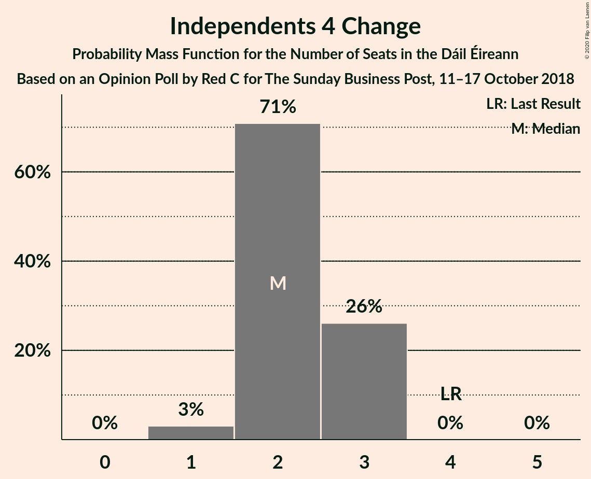

# Opinion Poll by Red C for The Sunday Business Post, 11–17 October 2018

<a href="#voting-intentions">Voting Intentions</a> | <a href="#seats">Seats</a> | <a href="#coalitions">Coalitions</a> | <a href="#technical-information">Technical Information</a>

## Voting Intentions

### Confidence Intervals

| Party | Last Result | Poll Result | 80% Confidence Interval | 90% Confidence Interval | 95% Confidence Interval | 99% Confidence Interval |
|:-----:|:-----------:|:-----------:|:-----------------------:|:-----------------------:|:-----------------------:|:-----------------------:|
| Fine Gael | 25.5% | 32.9% | 31.0–34.9% |30.5–35.4% |30.1–35.9% |29.2–36.8% |
| Fianna Fáil | 24.3% | 24.9% | 23.2–26.7% |22.7–27.2% |22.3–27.7% |21.5–28.6% |
| Sinn Féin | 13.8% | 15.0% | 13.6–16.5% |13.2–17.0% |12.9–17.4% |12.3–18.1% |
| Independent | 15.9% | 10.1% | 9.0–11.4% |8.6–11.8% |8.4–12.1% |7.9–12.8% |
| Labour Party | 6.6% | 5.0% | 4.2–6.0% |4.0–6.3% |3.8–6.5% |3.5–7.1% |
| Green Party/Comhaontas Glas | 2.7% | 4.0% | 3.3–4.9% |3.1–5.2% |2.9–5.4% |2.7–5.9% |
| Social Democrats | 3.0% | 2.0% | 1.5–2.7% |1.4–2.9% |1.3–3.1% |1.1–3.4% |
| Independents 4 Change | 1.5% | 1.3% | 0.9–1.9% |0.8–2.1% |0.8–2.2% |0.6–2.5% |
| Solidarity–People Before Profit | 3.9% | 0.2% | 0.1–0.5% |0.1–0.6% |0.1–0.7% |0.0–0.9% |

*Note:* The poll result column reflects the actual value used in the calculations. Published results may vary slightly, and in addition be rounded to fewer digits.

## Seats

### Confidence Intervals

| Party | Last Result | Median | 80% Confidence Interval | 90% Confidence Interval | 95% Confidence Interval | 99% Confidence Interval |
|:-----:|:-----------:|:------:|:-----------------------:|:-----------------------:|:-----------------------:|:-----------------------:|
| <a href="#fine-gael">Fine Gael</a> | 49 | 65 | 61–69 |59–70 |58–70 |56–72 |
| <a href="#fianna-fáil">Fianna Fáil</a> | 44 | 46 | 41–51 |40–51 |38–52 |36–54 |
| <a href="#sinn-féin">Sinn Féin</a> | 23 | 30 | 24–32 |22–33 |22–34 |20–36 |
| <a href="#independent">Independent</a> | 19 | 7 | 4–12 |4–14 |4–16 |3–16 |
| <a href="#labour-party">Labour Party</a> | 7 | 5 | 1–9 |0–10 |0–11 |0–14 |
| <a href="#green-party/comhaontas-glas">Green Party/Comhaontas Glas</a> | 2 | 3 | 1–3 |1–5 |1–5 |1–5 |
| <a href="#social-democrats">Social Democrats</a> | 3 | 3 | 1–3 |1–3 |1–3 |1–4 |
| <a href="#independents-4-change">Independents 4 Change</a> | 4 | 2 | 2–3 |2–3 |1–3 |1–3 |
| <a href="#solidarity–people-before-profit">Solidarity–People Before Profit</a> | 6 | 0 | 0 |0 |0 |0 |

### Fine Gael

*For a full overview of the results for this party, see the [Fine Gael](party-finegael.html) page.*

| Number of Seats | Probability | Accumulated | Special Marks |
|:---------------:|:-----------:|:-----------:|:-------------:|
| 49 | 0% | 100% | Last Result |
| 50 | 0% | 100% |  |
| 51 | 0% | 100% |  |
| 52 | 0% | 100% |  |
| 53 | 0.1% | 100% |  |
| 54 | 0.1% | 99.8% |  |
| 55 | 0.2% | 99.8% |  |
| 56 | 0.5% | 99.6% |  |
| 57 | 0.4% | 99.1% |  |
| 58 | 3% | 98.7% |  |
| 59 | 3% | 96% |  |
| 60 | 2% | 93% |  |
| 61 | 4% | 91% |  |
| 62 | 11% | 87% |  |
| 63 | 10% | 77% |  |
| 64 | 16% | 67% |  |
| 65 | 12% | 50% | Median |
| 66 | 6% | 38% |  |
| 67 | 9% | 32% |  |
| 68 | 3% | 23% |  |
| 69 | 12% | 19% |  |
| 70 | 5% | 8% |  |
| 71 | 1.2% | 2% |  |
| 72 | 1.2% | 1.3% |  |
| 73 | 0% | 0% |  |

### Fianna Fáil

*For a full overview of the results for this party, see the [Fianna Fáil](party-fiannafáil.html) page.*

| Number of Seats | Probability | Accumulated | Special Marks |
|:---------------:|:-----------:|:-----------:|:-------------:|
| 33 | 0% | 100% |  |
| 34 | 0.1% | 99.9% |  |
| 35 | 0.3% | 99.9% |  |
| 36 | 1.0% | 99.6% |  |
| 37 | 0.6% | 98.6% |  |
| 38 | 1.0% | 98% |  |
| 39 | 2% | 97% |  |
| 40 | 3% | 95% |  |
| 41 | 7% | 92% |  |
| 42 | 6% | 85% |  |
| 43 | 7% | 79% |  |
| 44 | 4% | 72% | Last Result |
| 45 | 10% | 68% |  |
| 46 | 13% | 58% | Median |
| 47 | 10% | 45% |  |
| 48 | 11% | 35% |  |
| 49 | 5% | 24% |  |
| 50 | 8% | 19% |  |
| 51 | 6% | 11% |  |
| 52 | 2% | 4% |  |
| 53 | 2% | 2% |  |
| 54 | 0.4% | 0.5% |  |
| 55 | 0.1% | 0.1% |  |
| 56 | 0% | 0.1% |  |
| 57 | 0% | 0% |  |

### Sinn Féin

*For a full overview of the results for this party, see the [Sinn Féin](party-sinnféin.html) page.*

| Number of Seats | Probability | Accumulated | Special Marks |
|:---------------:|:-----------:|:-----------:|:-------------:|
| 19 | 0.2% | 100% |  |
| 20 | 1.0% | 99.8% |  |
| 21 | 0.9% | 98.8% |  |
| 22 | 4% | 98% |  |
| 23 | 3% | 94% | Last Result |
| 24 | 6% | 91% |  |
| 25 | 1.0% | 85% |  |
| 26 | 7% | 84% |  |
| 27 | 8% | 77% |  |
| 28 | 7% | 70% |  |
| 29 | 9% | 63% |  |
| 30 | 18% | 54% | Median |
| 31 | 13% | 36% |  |
| 32 | 14% | 23% |  |
| 33 | 6% | 9% |  |
| 34 | 1.4% | 3% |  |
| 35 | 0.8% | 2% |  |
| 36 | 1.2% | 1.3% |  |
| 37 | 0% | 0% |  |

### Independent

*For a full overview of the results for this party, see the [Independent](party-independent.html) page.*

| Number of Seats | Probability | Accumulated | Special Marks |
|:---------------:|:-----------:|:-----------:|:-------------:|
| 3 | 2% | 100% |  |
| 4 | 12% | 98% |  |
| 5 | 13% | 86% |  |
| 6 | 18% | 74% |  |
| 7 | 9% | 56% | Median |
| 8 | 9% | 47% |  |
| 9 | 4% | 38% |  |
| 10 | 11% | 33% |  |
| 11 | 10% | 23% |  |
| 12 | 6% | 13% |  |
| 13 | 1.4% | 7% |  |
| 14 | 2% | 6% |  |
| 15 | 1.1% | 4% |  |
| 16 | 2% | 3% |  |
| 17 | 0.3% | 0.3% |  |
| 18 | 0% | 0% |  |
| 19 | 0% | 0% | Last Result |

### Labour Party

*For a full overview of the results for this party, see the [Labour Party](party-labourparty.html) page.*

| Number of Seats | Probability | Accumulated | Special Marks |
|:---------------:|:-----------:|:-----------:|:-------------:|
| 0 | 6% | 100% |  |
| 1 | 7% | 94% |  |
| 2 | 13% | 87% |  |
| 3 | 8% | 75% |  |
| 4 | 9% | 67% |  |
| 5 | 18% | 57% | Median |
| 6 | 10% | 39% |  |
| 7 | 10% | 29% | Last Result |
| 8 | 6% | 19% |  |
| 9 | 6% | 13% |  |
| 10 | 5% | 7% |  |
| 11 | 1.2% | 3% |  |
| 12 | 0.5% | 1.4% |  |
| 13 | 0.4% | 1.0% |  |
| 14 | 0.3% | 0.6% |  |
| 15 | 0.2% | 0.3% |  |
| 16 | 0.1% | 0.1% |  |
| 17 | 0% | 0% |  |

### Green Party/Comhaontas Glas

*For a full overview of the results for this party, see the [Green Party/Comhaontas Glas](party-greenpartycomhaontasglas.html) page.*

| Number of Seats | Probability | Accumulated | Special Marks |
|:---------------:|:-----------:|:-----------:|:-------------:|
| 0 | 0.4% | 100% |  |
| 1 | 11% | 99.6% |  |
| 2 | 18% | 89% | Last Result |
| 3 | 61% | 70% | Median |
| 4 | 3% | 10% |  |
| 5 | 7% | 7% |  |
| 6 | 0% | 0% |  |

### Social Democrats

*For a full overview of the results for this party, see the [Social Democrats](party-socialdemocrats.html) page.*

| Number of Seats | Probability | Accumulated | Special Marks |
|:---------------:|:-----------:|:-----------:|:-------------:|
| 0 | 0.1% | 100% |  |
| 1 | 15% | 99.9% |  |
| 2 | 6% | 85% |  |
| 3 | 77% | 79% | Last Result, Median |
| 4 | 1.0% | 1.5% |  |
| 5 | 0.3% | 0.5% |  |
| 6 | 0.1% | 0.1% |  |
| 7 | 0% | 0% |  |

### Independents 4 Change

*For a full overview of the results for this party, see the [Independents 4 Change](party-independents4change.html) page.*

| Number of Seats | Probability | Accumulated | Special Marks |
|:---------------:|:-----------:|:-----------:|:-------------:|
| 1 | 3% | 100% |  |
| 2 | 71% | 97% | Median |
| 3 | 26% | 26% |  |
| 4 | 0% | 0% | Last Result |

### Solidarity–People Before Profit

*For a full overview of the results for this party, see the [Solidarity–People Before Profit](party-solidarity–peoplebeforeprofit.html) page.*

| Number of Seats | Probability | Accumulated | Special Marks |
|:---------------:|:-----------:|:-----------:|:-------------:|
| 0 | 100% | 100% | Median |
| 1 | 0% | 0% |  |
| 2 | 0% | 0% |  |
| 3 | 0% | 0% |  |
| 4 | 0% | 0% |  |
| 5 | 0% | 0% |  |
| 6 | 0% | 0% | Last Result |

## Coalitions

### Confidence Intervals

| Coalition | Last Result | Median | Majority? | 80% Confidence Interval | 90% Confidence Interval | 95% Confidence Interval | 99% Confidence Interval |
|:---------:|:-----------:|:------:|:---------:|:-----------------------:|:-----------------------:|:-----------------------:|:-----------------------:|
| Fine Gael – Fianna Fáil | 93 | 111 | 100% | 105–116 | 104–117 | 102–119 | 96–120 |
| Fine Gael – Labour Party – Green Party/Comhaontas Glas – Social Democrats | 61 | 75 | 5% | 71–80 | 69–80 | 68–82 | 65–84 |
| Fianna Fáil – Sinn Féin | 67 | 75 | 6% | 69–80 | 68–81 | 67–82 | 64–83 |
| Fine Gael – Labour Party – Green Party/Comhaontas Glas | 58 | 73 | 1.0% | 68–77 | 67–78 | 66–79 | 63–81 |
| Fine Gael – Labour Party | 56 | 70 | 0.1% | 65–74 | 64–75 | 63–76 | 60–79 |
| Fine Gael – Green Party/Comhaontas Glas | 51 | 67 | 0% | 64–72 | 62–72 | 61–73 | 58–75 |
| Fine Gael | 49 | 65 | 0% | 61–69 | 59–70 | 58–70 | 56–72 |
| Fianna Fáil – Labour Party – Green Party/Comhaontas Glas – Social Democrats | 56 | 57 | 0% | 50–62 | 48–64 | 48–66 | 44–67 |
| Fianna Fáil – Labour Party – Green Party/Comhaontas Glas | 53 | 54 | 0% | 47–60 | 45–62 | 45–63 | 41–64 |
| Fianna Fáil – Labour Party | 51 | 51 | 0% | 44–57 | 44–59 | 42–60 | 39–61 |
| Fianna Fáil – Green Party/Comhaontas Glas | 46 | 49 | 0% | 43–53 | 42–54 | 40–56 | 38–57 |

### Fine Gael – Fianna Fáil

| Number of Seats | Probability | Accumulated | Special Marks |
|:---------------:|:-----------:|:-----------:|:-------------:|
| 93 | 0% | 100% | Last Result |
| 94 | 0% | 100% |  |
| 95 | 0.4% | 99.9% |  |
| 96 | 0.1% | 99.5% |  |
| 97 | 0.2% | 99.4% |  |
| 98 | 0.2% | 99.2% |  |
| 99 | 0.3% | 99.1% |  |
| 100 | 0.4% | 98.7% |  |
| 101 | 0.7% | 98% |  |
| 102 | 1.3% | 98% |  |
| 103 | 1.3% | 96% |  |
| 104 | 3% | 95% |  |
| 105 | 4% | 92% |  |
| 106 | 3% | 88% |  |
| 107 | 7% | 85% |  |
| 108 | 3% | 78% |  |
| 109 | 6% | 76% |  |
| 110 | 18% | 70% |  |
| 111 | 11% | 52% | Median |
| 112 | 11% | 41% |  |
| 113 | 7% | 31% |  |
| 114 | 9% | 24% |  |
| 115 | 4% | 15% |  |
| 116 | 3% | 11% |  |
| 117 | 3% | 8% |  |
| 118 | 2% | 5% |  |
| 119 | 2% | 3% |  |
| 120 | 0.7% | 0.9% |  |
| 121 | 0.2% | 0.2% |  |
| 122 | 0% | 0.1% |  |
| 123 | 0% | 0% |  |

### Fine Gael – Labour Party – Green Party/Comhaontas Glas – Social Democrats

| Number of Seats | Probability | Accumulated | Special Marks |
|:---------------:|:-----------:|:-----------:|:-------------:|
| 61 | 0% | 100% | Last Result |
| 62 | 0% | 100% |  |
| 63 | 0.1% | 100% |  |
| 64 | 0.1% | 99.9% |  |
| 65 | 0.4% | 99.9% |  |
| 66 | 0.6% | 99.5% |  |
| 67 | 0.3% | 98.9% |  |
| 68 | 2% | 98.6% |  |
| 69 | 3% | 97% |  |
| 70 | 3% | 94% |  |
| 71 | 7% | 91% |  |
| 72 | 10% | 84% |  |
| 73 | 10% | 75% |  |
| 74 | 10% | 64% |  |
| 75 | 8% | 55% |  |
| 76 | 9% | 47% | Median |
| 77 | 8% | 38% |  |
| 78 | 11% | 30% |  |
| 79 | 7% | 19% |  |
| 80 | 8% | 13% |  |
| 81 | 2% | 5% | Majority |
| 82 | 2% | 3% |  |
| 83 | 0.3% | 1.3% |  |
| 84 | 0.6% | 0.9% |  |
| 85 | 0.1% | 0.3% |  |
| 86 | 0.1% | 0.1% |  |
| 87 | 0% | 0.1% |  |
| 88 | 0% | 0% |  |

### Fianna Fáil – Sinn Féin

| Number of Seats | Probability | Accumulated | Special Marks |
|:---------------:|:-----------:|:-----------:|:-------------:|
| 61 | 0.2% | 100% |  |
| 62 | 0.1% | 99.8% |  |
| 63 | 0.2% | 99.8% |  |
| 64 | 0.6% | 99.6% |  |
| 65 | 0.3% | 99.0% |  |
| 66 | 0.9% | 98.7% |  |
| 67 | 1.3% | 98% | Last Result |
| 68 | 6% | 97% |  |
| 69 | 2% | 91% |  |
| 70 | 5% | 89% |  |
| 71 | 7% | 84% |  |
| 72 | 5% | 77% |  |
| 73 | 9% | 72% |  |
| 74 | 7% | 63% |  |
| 75 | 11% | 56% |  |
| 76 | 12% | 45% | Median |
| 77 | 5% | 33% |  |
| 78 | 7% | 27% |  |
| 79 | 8% | 21% |  |
| 80 | 7% | 13% |  |
| 81 | 3% | 6% | Majority |
| 82 | 3% | 3% |  |
| 83 | 0.4% | 0.7% |  |
| 84 | 0.2% | 0.3% |  |
| 85 | 0.1% | 0.1% |  |
| 86 | 0% | 0% |  |

### Fine Gael – Labour Party – Green Party/Comhaontas Glas

| Number of Seats | Probability | Accumulated | Special Marks |
|:---------------:|:-----------:|:-----------:|:-------------:|
| 58 | 0% | 100% | Last Result |
| 59 | 0% | 100% |  |
| 60 | 0% | 100% |  |
| 61 | 0% | 99.9% |  |
| 62 | 0.4% | 99.9% |  |
| 63 | 0.6% | 99.5% |  |
| 64 | 0.2% | 99.0% |  |
| 65 | 0.9% | 98.8% |  |
| 66 | 2% | 98% |  |
| 67 | 4% | 96% |  |
| 68 | 6% | 92% |  |
| 69 | 9% | 86% |  |
| 70 | 10% | 77% |  |
| 71 | 7% | 67% |  |
| 72 | 8% | 60% |  |
| 73 | 10% | 52% | Median |
| 74 | 11% | 43% |  |
| 75 | 10% | 32% |  |
| 76 | 9% | 22% |  |
| 77 | 8% | 14% |  |
| 78 | 2% | 6% |  |
| 79 | 2% | 4% |  |
| 80 | 0.7% | 2% |  |
| 81 | 0.6% | 1.0% | Majority |
| 82 | 0.2% | 0.3% |  |
| 83 | 0.1% | 0.2% |  |
| 84 | 0% | 0.1% |  |
| 85 | 0% | 0.1% |  |
| 86 | 0% | 0% |  |

### Fine Gael – Labour Party

| Number of Seats | Probability | Accumulated | Special Marks |
|:---------------:|:-----------:|:-----------:|:-------------:|
| 56 | 0% | 100% | Last Result |
| 57 | 0% | 100% |  |
| 58 | 0.3% | 99.9% |  |
| 59 | 0.1% | 99.6% |  |
| 60 | 0.4% | 99.6% |  |
| 61 | 0.8% | 99.2% |  |
| 62 | 0.7% | 98% |  |
| 63 | 2% | 98% |  |
| 64 | 3% | 95% |  |
| 65 | 4% | 92% |  |
| 66 | 9% | 88% |  |
| 67 | 10% | 78% |  |
| 68 | 7% | 68% |  |
| 69 | 6% | 61% |  |
| 70 | 10% | 56% | Median |
| 71 | 8% | 45% |  |
| 72 | 13% | 37% |  |
| 73 | 7% | 25% |  |
| 74 | 10% | 17% |  |
| 75 | 3% | 7% |  |
| 76 | 2% | 4% |  |
| 77 | 0.9% | 2% |  |
| 78 | 0.7% | 2% |  |
| 79 | 0.5% | 0.8% |  |
| 80 | 0.2% | 0.3% |  |
| 81 | 0.1% | 0.1% | Majority |
| 82 | 0% | 0.1% |  |
| 83 | 0% | 0% |  |

### Fine Gael – Green Party/Comhaontas Glas

| Number of Seats | Probability | Accumulated | Special Marks |
|:---------------:|:-----------:|:-----------:|:-------------:|
| 51 | 0% | 100% | Last Result |
| 52 | 0% | 100% |  |
| 53 | 0% | 100% |  |
| 54 | 0% | 100% |  |
| 55 | 0.1% | 100% |  |
| 56 | 0.1% | 99.9% |  |
| 57 | 0.1% | 99.8% |  |
| 58 | 0.2% | 99.7% |  |
| 59 | 0.3% | 99.5% |  |
| 60 | 0.8% | 99.2% |  |
| 61 | 3% | 98% |  |
| 62 | 3% | 96% |  |
| 63 | 3% | 93% |  |
| 64 | 6% | 90% |  |
| 65 | 10% | 84% |  |
| 66 | 13% | 74% |  |
| 67 | 12% | 61% |  |
| 68 | 10% | 49% | Median |
| 69 | 5% | 39% |  |
| 70 | 12% | 33% |  |
| 71 | 9% | 21% |  |
| 72 | 8% | 13% |  |
| 73 | 3% | 4% |  |
| 74 | 0.6% | 2% |  |
| 75 | 1.0% | 1.2% |  |
| 76 | 0.2% | 0.2% |  |
| 77 | 0% | 0% |  |

### Fine Gael

| Number of Seats | Probability | Accumulated | Special Marks |
|:---------------:|:-----------:|:-----------:|:-------------:|
| 49 | 0% | 100% | Last Result |
| 50 | 0% | 100% |  |
| 51 | 0% | 100% |  |
| 52 | 0% | 100% |  |
| 53 | 0.1% | 100% |  |
| 54 | 0.1% | 99.8% |  |
| 55 | 0.2% | 99.8% |  |
| 56 | 0.5% | 99.6% |  |
| 57 | 0.4% | 99.1% |  |
| 58 | 3% | 98.7% |  |
| 59 | 3% | 96% |  |
| 60 | 2% | 93% |  |
| 61 | 4% | 91% |  |
| 62 | 11% | 87% |  |
| 63 | 10% | 77% |  |
| 64 | 16% | 67% |  |
| 65 | 12% | 50% | Median |
| 66 | 6% | 38% |  |
| 67 | 9% | 32% |  |
| 68 | 3% | 23% |  |
| 69 | 12% | 19% |  |
| 70 | 5% | 8% |  |
| 71 | 1.2% | 2% |  |
| 72 | 1.2% | 1.3% |  |
| 73 | 0% | 0% |  |

### Fianna Fáil – Labour Party – Green Party/Comhaontas Glas – Social Democrats

| Number of Seats | Probability | Accumulated | Special Marks |
|:---------------:|:-----------:|:-----------:|:-------------:|
| 41 | 0.3% | 100% |  |
| 42 | 0% | 99.7% |  |
| 43 | 0.2% | 99.7% |  |
| 44 | 0.1% | 99.5% |  |
| 45 | 0.4% | 99.4% |  |
| 46 | 0.9% | 99.1% |  |
| 47 | 0.6% | 98% |  |
| 48 | 3% | 98% |  |
| 49 | 1.1% | 94% |  |
| 50 | 5% | 93% |  |
| 51 | 4% | 88% |  |
| 52 | 8% | 84% |  |
| 53 | 8% | 76% |  |
| 54 | 6% | 68% |  |
| 55 | 4% | 62% |  |
| 56 | 6% | 58% | Last Result |
| 57 | 8% | 52% | Median |
| 58 | 11% | 44% |  |
| 59 | 8% | 33% |  |
| 60 | 10% | 24% |  |
| 61 | 4% | 15% |  |
| 62 | 2% | 10% |  |
| 63 | 3% | 8% |  |
| 64 | 1.1% | 6% |  |
| 65 | 1.2% | 5% |  |
| 66 | 3% | 3% |  |
| 67 | 0.5% | 0.7% |  |
| 68 | 0.1% | 0.2% |  |
| 69 | 0.1% | 0.1% |  |
| 70 | 0% | 0% |  |

### Fianna Fáil – Labour Party – Green Party/Comhaontas Glas

| Number of Seats | Probability | Accumulated | Special Marks |
|:---------------:|:-----------:|:-----------:|:-------------:|
| 38 | 0.3% | 100% |  |
| 39 | 0% | 99.7% |  |
| 40 | 0.2% | 99.7% |  |
| 41 | 0.1% | 99.5% |  |
| 42 | 0.4% | 99.4% |  |
| 43 | 0.9% | 99.1% |  |
| 44 | 0.5% | 98% |  |
| 45 | 3% | 98% |  |
| 46 | 0.9% | 94% |  |
| 47 | 5% | 94% |  |
| 48 | 4% | 89% |  |
| 49 | 8% | 85% |  |
| 50 | 7% | 77% |  |
| 51 | 5% | 69% |  |
| 52 | 4% | 64% |  |
| 53 | 5% | 60% | Last Result |
| 54 | 7% | 56% | Median |
| 55 | 13% | 49% |  |
| 56 | 7% | 36% |  |
| 57 | 12% | 28% |  |
| 58 | 4% | 17% |  |
| 59 | 3% | 13% |  |
| 60 | 3% | 10% |  |
| 61 | 1.5% | 7% |  |
| 62 | 2% | 5% |  |
| 63 | 3% | 4% |  |
| 64 | 0.5% | 0.8% |  |
| 65 | 0.2% | 0.3% |  |
| 66 | 0.1% | 0.1% |  |
| 67 | 0% | 0.1% |  |
| 68 | 0% | 0% |  |

### Fianna Fáil – Labour Party

| Number of Seats | Probability | Accumulated | Special Marks |
|:---------------:|:-----------:|:-----------:|:-------------:|
| 36 | 0.3% | 100% |  |
| 37 | 0.1% | 99.7% |  |
| 38 | 0.1% | 99.6% |  |
| 39 | 0.4% | 99.5% |  |
| 40 | 0.8% | 99.2% |  |
| 41 | 0.5% | 98% |  |
| 42 | 0.5% | 98% |  |
| 43 | 1.1% | 97% |  |
| 44 | 7% | 96% |  |
| 45 | 3% | 89% |  |
| 46 | 7% | 86% |  |
| 47 | 4% | 78% |  |
| 48 | 9% | 74% |  |
| 49 | 4% | 65% |  |
| 50 | 6% | 62% |  |
| 51 | 7% | 56% | Last Result, Median |
| 52 | 12% | 49% |  |
| 53 | 10% | 37% |  |
| 54 | 8% | 27% |  |
| 55 | 5% | 20% |  |
| 56 | 4% | 14% |  |
| 57 | 3% | 10% |  |
| 58 | 0.8% | 7% |  |
| 59 | 1.3% | 6% |  |
| 60 | 4% | 5% |  |
| 61 | 0.7% | 1.0% |  |
| 62 | 0.1% | 0.4% |  |
| 63 | 0.2% | 0.3% |  |
| 64 | 0.1% | 0.1% |  |
| 65 | 0% | 0% |  |

### Fianna Fáil – Green Party/Comhaontas Glas

| Number of Seats | Probability | Accumulated | Special Marks |
|:---------------:|:-----------:|:-----------:|:-------------:|
| 35 | 0% | 100% |  |
| 36 | 0.1% | 99.9% |  |
| 37 | 0.1% | 99.9% |  |
| 38 | 0.7% | 99.7% |  |
| 39 | 0.8% | 99.0% |  |
| 40 | 0.8% | 98% |  |
| 41 | 1.4% | 97% |  |
| 42 | 2% | 96% |  |
| 43 | 5% | 94% |  |
| 44 | 7% | 89% |  |
| 45 | 6% | 82% |  |
| 46 | 5% | 76% | Last Result |
| 47 | 9% | 71% |  |
| 48 | 10% | 62% |  |
| 49 | 10% | 52% | Median |
| 50 | 7% | 42% |  |
| 51 | 8% | 35% |  |
| 52 | 7% | 27% |  |
| 53 | 11% | 20% |  |
| 54 | 5% | 10% |  |
| 55 | 1.5% | 4% |  |
| 56 | 2% | 3% |  |
| 57 | 0.5% | 0.7% |  |
| 58 | 0.1% | 0.2% |  |
| 59 | 0% | 0.1% |  |
| 60 | 0% | 0% |  |

## Technical Information

### Opinion Poll

+ **Polling firm:** Red C
+ **Commissioner(s):** The Sunday Business Post
+ **Fieldwork period:** 11–17 October 2018

### Calculations

+ **Sample size:** 1000
+ **Simulations done:** 1,048,575
+ **Error estimate:** 2.18%

