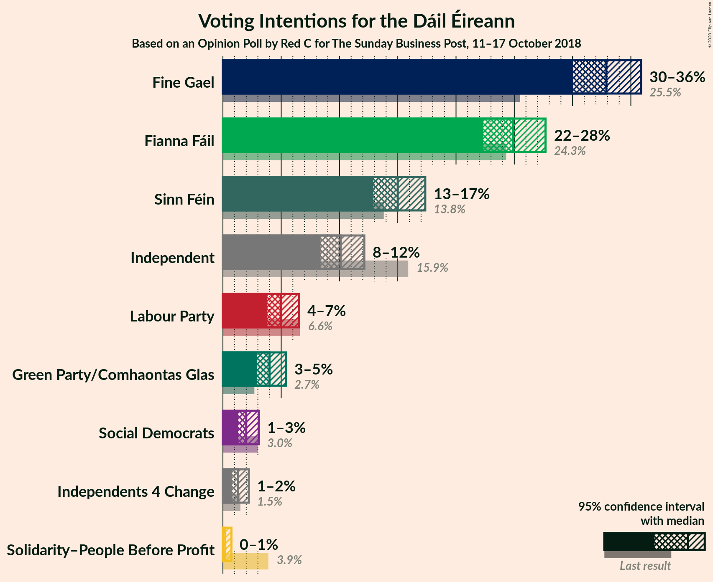
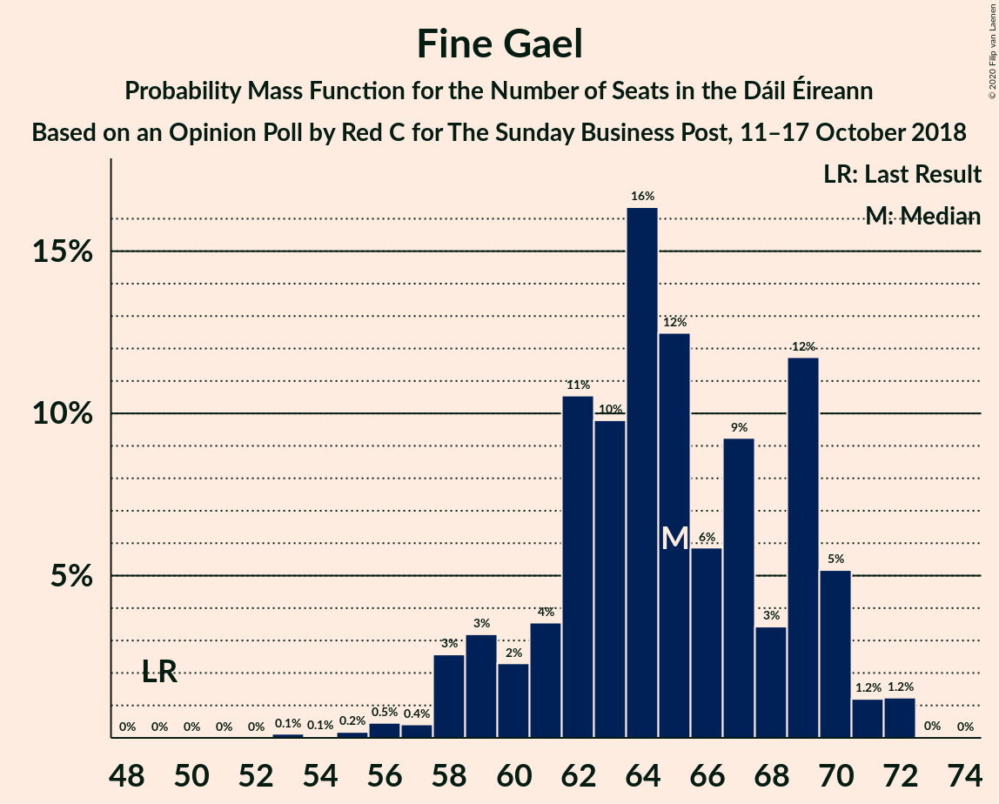
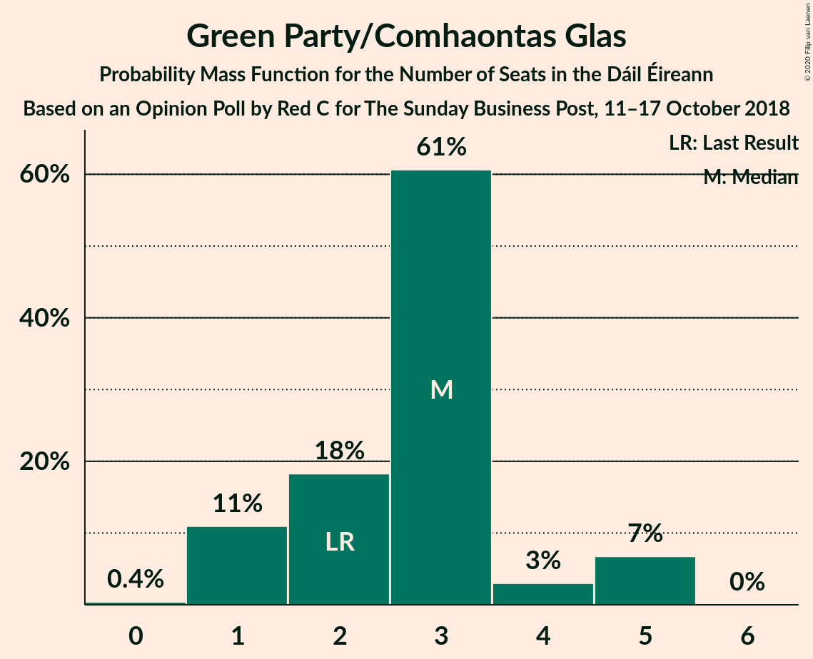
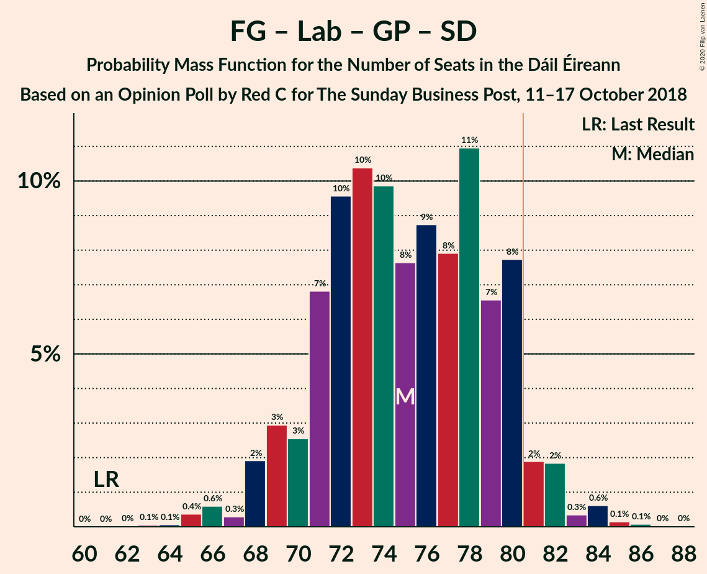
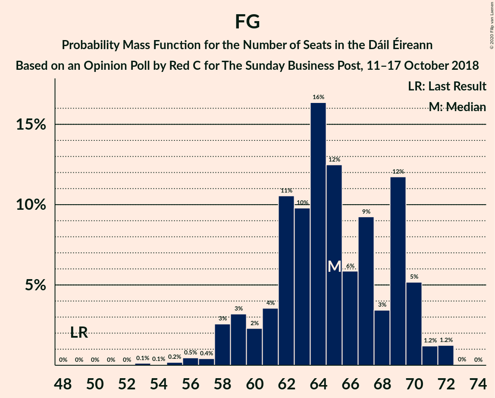
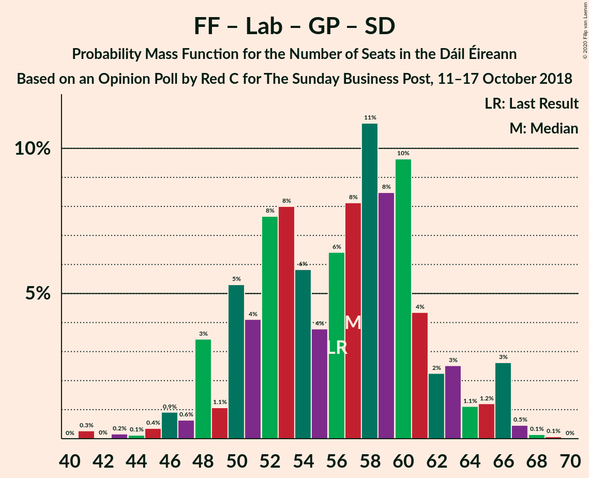
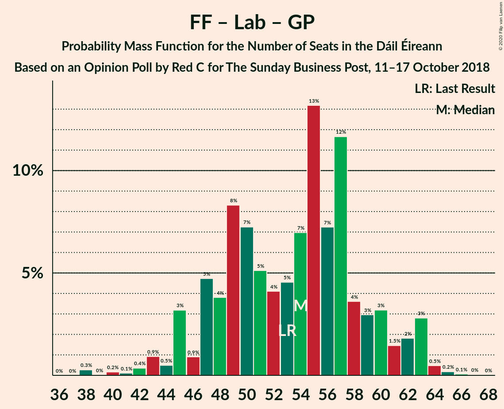

# Opinion Poll by Red C for The Sunday Business Post, 11–17 October 2018

<a href="#voting-intentions">Voting Intentions</a> | <a href="#seats">Seats</a> | <a href="#coalitions">Coalitions</a> | <a href="#technical-information">Technical Information</a>

## Voting Intentions

### Confidence Intervals

| Party | Last Result | Poll Result | 80% Confidence Interval | 90% Confidence Interval | 95% Confidence Interval | 99% Confidence Interval |
|:-----:|:-----------:|:-----------:|:-----------------------:|:-----------------------:|:-----------------------:|:-----------------------:|
| Fine Gael | 25.5% | 32.9% | 31.0–34.9% |30.5–35.4% |30.1–35.9% |29.2–36.8% |
| Fianna Fáil | 24.3% | 24.9% | 23.2–26.7% |22.7–27.2% |22.3–27.7% |21.5–28.6% |
| Sinn Féin | 13.8% | 15.0% | 13.6–16.5% |13.2–17.0% |12.9–17.4% |12.3–18.1% |
| Independent | 15.9% | 10.1% | 9.0–11.4% |8.6–11.8% |8.4–12.1% |7.9–12.8% |
| Labour Party | 6.6% | 5.0% | 4.2–6.0% |4.0–6.3% |3.8–6.5% |3.5–7.1% |
| Green Party/Comhaontas Glas | 2.7% | 4.0% | 3.3–4.9% |3.1–5.2% |2.9–5.4% |2.7–5.9% |
| Social Democrats | 3.0% | 2.0% | 1.5–2.7% |1.4–2.9% |1.3–3.1% |1.1–3.4% |
| Independents 4 Change | 1.5% | 1.3% | 0.9–1.9% |0.8–2.1% |0.8–2.2% |0.6–2.5% |
| Solidarity–People Before Profit | 3.9% | 0.2% | 0.1–0.5% |0.1–0.6% |0.1–0.7% |0.0–0.9% |

*Note:* The poll result column reflects the actual value used in the calculations. Published results may vary slightly, and in addition be rounded to fewer digits.

## Seats

### Confidence Intervals

| Party | Last Result | Median | 80% Confidence Interval | 90% Confidence Interval | 95% Confidence Interval | 99% Confidence Interval |
|:-----:|:-----------:|:------:|:-----------------------:|:-----------------------:|:-----------------------:|:-----------------------:|
| <a href="#fine-gael">Fine Gael</a> | 49 | 66 | 62–69 |62–70 |60–71 |58–73 |
| <a href="#fianna-fáil">Fianna Fáil</a> | 44 | 45 | 42–49 |41–50 |41–51 |38–54 |
| <a href="#sinn-féin">Sinn Féin</a> | 23 | 28 | 23–34 |23–35 |21–35 |20–36 |
| <a href="#independent">Independent</a> | 19 | 7 | 4–10 |3–11 |3–12 |3–14 |
| <a href="#labour-party">Labour Party</a> | 7 | 3 | 0–6 |0–6 |0–7 |0–8 |
| <a href="#green-party/comhaontas-glas">Green Party/Comhaontas Glas</a> | 2 | 3 | 3 |2–4 |2–5 |1–5 |
| <a href="#social-democrats">Social Democrats</a> | 3 | 3 | 3–4 |3–4 |2–4 |1–5 |
| <a href="#independents-4-change">Independents 4 Change</a> | 4 | 4 | 1–5 |0–5 |0–5 |0–5 |
| <a href="#solidarity–people-before-profit">Solidarity–People Before Profit</a> | 6 | 0 | 0 |0 |0 |0 |

### Fine Gael

*For a full overview of the results for this party, see the [Fine Gael](party-finegael.html) page.*

| Number of Seats | Probability | Accumulated | Special Marks |
|:---------------:|:-----------:|:-----------:|:-------------:|
| 49 | 0% | 100% | Last Result |
| 50 | 0% | 100% |  |
| 51 | 0% | 100% |  |
| 52 | 0% | 100% |  |
| 53 | 0% | 100% |  |
| 54 | 0.1% | 100% |  |
| 55 | 0% | 99.9% |  |
| 56 | 0.2% | 99.9% |  |
| 57 | 0.1% | 99.7% |  |
| 58 | 0.5% | 99.6% |  |
| 59 | 0.4% | 99.1% |  |
| 60 | 2% | 98.8% |  |
| 61 | 0.5% | 97% |  |
| 62 | 14% | 96% |  |
| 63 | 6% | 83% |  |
| 64 | 2% | 77% |  |
| 65 | 7% | 75% |  |
| 66 | 19% | 68% | Median |
| 67 | 22% | 49% |  |
| 68 | 7% | 27% |  |
| 69 | 12% | 19% |  |
| 70 | 3% | 7% |  |
| 71 | 2% | 4% |  |
| 72 | 2% | 2% |  |
| 73 | 0.5% | 0.5% |  |
| 74 | 0% | 0% |  |

### Fianna Fáil

*For a full overview of the results for this party, see the [Fianna Fáil](party-fiannafáil.html) page.*

| Number of Seats | Probability | Accumulated | Special Marks |
|:---------------:|:-----------:|:-----------:|:-------------:|
| 37 | 0.1% | 100% |  |
| 38 | 0.5% | 99.9% |  |
| 39 | 0.6% | 99.4% |  |
| 40 | 0.9% | 98.8% |  |
| 41 | 5% | 98% |  |
| 42 | 3% | 92% |  |
| 43 | 5% | 89% |  |
| 44 | 25% | 84% | Last Result |
| 45 | 10% | 58% | Median |
| 46 | 5% | 49% |  |
| 47 | 7% | 44% |  |
| 48 | 16% | 37% |  |
| 49 | 13% | 21% |  |
| 50 | 4% | 8% |  |
| 51 | 3% | 5% |  |
| 52 | 0.4% | 2% |  |
| 53 | 0.2% | 2% |  |
| 54 | 1.0% | 1.4% |  |
| 55 | 0.3% | 0.3% |  |
| 56 | 0% | 0% |  |

### Sinn Féin

*For a full overview of the results for this party, see the [Sinn Féin](party-sinnféin.html) page.*

| Number of Seats | Probability | Accumulated | Special Marks |
|:---------------:|:-----------:|:-----------:|:-------------:|
| 17 | 0.2% | 100% |  |
| 18 | 0% | 99.8% |  |
| 19 | 0.2% | 99.8% |  |
| 20 | 1.2% | 99.6% |  |
| 21 | 1.3% | 98% |  |
| 22 | 1.0% | 97% |  |
| 23 | 11% | 96% | Last Result |
| 24 | 3% | 85% |  |
| 25 | 2% | 82% |  |
| 26 | 1.4% | 80% |  |
| 27 | 14% | 79% |  |
| 28 | 25% | 65% | Median |
| 29 | 2% | 40% |  |
| 30 | 7% | 38% |  |
| 31 | 5% | 30% |  |
| 32 | 2% | 25% |  |
| 33 | 4% | 23% |  |
| 34 | 14% | 19% |  |
| 35 | 4% | 5% |  |
| 36 | 0.6% | 0.7% |  |
| 37 | 0.1% | 0.1% |  |
| 38 | 0% | 0% |  |

### Independent

*For a full overview of the results for this party, see the [Independent](party-independent.html) page.*

| Number of Seats | Probability | Accumulated | Special Marks |
|:---------------:|:-----------:|:-----------:|:-------------:|
| 3 | 6% | 100% |  |
| 4 | 6% | 94% |  |
| 5 | 26% | 88% |  |
| 6 | 6% | 62% |  |
| 7 | 22% | 56% | Median |
| 8 | 15% | 34% |  |
| 9 | 8% | 19% |  |
| 10 | 6% | 11% |  |
| 11 | 0.7% | 5% |  |
| 12 | 3% | 4% |  |
| 13 | 1.2% | 2% |  |
| 14 | 0.4% | 0.5% |  |
| 15 | 0% | 0.1% |  |
| 16 | 0.1% | 0.1% |  |
| 17 | 0% | 0% |  |
| 18 | 0% | 0% |  |
| 19 | 0% | 0% | Last Result |

### Labour Party

*For a full overview of the results for this party, see the [Labour Party](party-labourparty.html) page.*

| Number of Seats | Probability | Accumulated | Special Marks |
|:---------------:|:-----------:|:-----------:|:-------------:|
| 0 | 18% | 100% |  |
| 1 | 2% | 82% |  |
| 2 | 28% | 80% |  |
| 3 | 6% | 52% | Median |
| 4 | 7% | 46% |  |
| 5 | 14% | 39% |  |
| 6 | 20% | 25% |  |
| 7 | 4% | 5% | Last Result |
| 8 | 0.9% | 1.1% |  |
| 9 | 0% | 0.2% |  |
| 10 | 0% | 0.2% |  |
| 11 | 0.1% | 0.2% |  |
| 12 | 0% | 0.1% |  |
| 13 | 0% | 0.1% |  |
| 14 | 0% | 0% |  |

### Green Party/Comhaontas Glas

*For a full overview of the results for this party, see the [Green Party/Comhaontas Glas](party-greenpartycomhaontasglas.html) page.*

| Number of Seats | Probability | Accumulated | Special Marks |
|:---------------:|:-----------:|:-----------:|:-------------:|
| 0 | 0.3% | 100% |  |
| 1 | 1.5% | 99.7% |  |
| 2 | 6% | 98% | Last Result |
| 3 | 86% | 92% | Median |
| 4 | 2% | 6% |  |
| 5 | 4% | 4% |  |
| 6 | 0.1% | 0.1% |  |
| 7 | 0% | 0% |  |

### Social Democrats

*For a full overview of the results for this party, see the [Social Democrats](party-socialdemocrats.html) page.*

| Number of Seats | Probability | Accumulated | Special Marks |
|:---------------:|:-----------:|:-----------:|:-------------:|
| 0 | 0.5% | 100% |  |
| 1 | 2% | 99.5% |  |
| 2 | 0.8% | 98% |  |
| 3 | 70% | 97% | Last Result, Median |
| 4 | 26% | 27% |  |
| 5 | 0.5% | 0.5% |  |
| 6 | 0% | 0% |  |

### Independents 4 Change

*For a full overview of the results for this party, see the [Independents 4 Change](party-independents4change.html) page.*

| Number of Seats | Probability | Accumulated | Special Marks |
|:---------------:|:-----------:|:-----------:|:-------------:|
| 0 | 9% | 100% |  |
| 1 | 5% | 91% |  |
| 2 | 22% | 86% |  |
| 3 | 7% | 64% |  |
| 4 | 39% | 57% | Last Result, Median |
| 5 | 19% | 19% |  |
| 6 | 0% | 0% |  |

### Solidarity–People Before Profit

*For a full overview of the results for this party, see the [Solidarity–People Before Profit](party-solidarity–peoplebeforeprofit.html) page.*

| Number of Seats | Probability | Accumulated | Special Marks |
|:---------------:|:-----------:|:-----------:|:-------------:|
| 0 | 100% | 100% | Median |
| 1 | 0% | 0% |  |
| 2 | 0% | 0% |  |
| 3 | 0% | 0% |  |
| 4 | 0% | 0% |  |
| 5 | 0% | 0% |  |
| 6 | 0% | 0% | Last Result |

## Coalitions

### Confidence Intervals

| Coalition | Last Result | Median | Majority? | 80% Confidence Interval | 90% Confidence Interval | 95% Confidence Interval | 99% Confidence Interval |
|:---------:|:-----------:|:------:|:---------:|:-----------------------:|:-----------------------:|:-----------------------:|:-----------------------:|
| Fine Gael – Fianna Fáil | 93 | 111 | 100% | 108–116 | 107–118 | 106–119 | 102–120 |
| Fianna Fáil – Sinn Féin | 67 | 75 | 12% | 68–82 | 68–83 | 68–83 | 65–84 |
| Fine Gael – Labour Party – Green Party/Comhaontas Glas – Social Democrats | 61 | 76 | 3% | 69–80 | 68–80 | 68–81 | 67–83 |
| Fine Gael – Labour Party – Green Party/Comhaontas Glas | 58 | 73 | 0.2% | 65–77 | 65–77 | 65–78 | 64–80 |
| Fine Gael – Labour Party | 56 | 70 | 0% | 62–74 | 62–74 | 62–75 | 60–77 |
| Fine Gael – Green Party/Comhaontas Glas | 51 | 69 | 0% | 65–72 | 65–73 | 63–74 | 61–76 |
| Fine Gael | 49 | 66 | 0% | 62–69 | 62–70 | 60–71 | 58–73 |
| Fianna Fáil – Labour Party – Green Party/Comhaontas Glas – Social Democrats | 56 | 56 | 0% | 52–58 | 50–59 | 49–61 | 46–63 |
| Fianna Fáil – Labour Party – Green Party/Comhaontas Glas | 53 | 53 | 0% | 48–54 | 46–55 | 46–58 | 43–60 |
| Fianna Fáil – Labour Party | 51 | 50 | 0% | 45–51 | 43–52 | 43–55 | 40–58 |
| Fianna Fáil – Green Party/Comhaontas Glas | 46 | 48 | 0% | 45–52 | 44–53 | 43–54 | 41–57 |

### Fine Gael – Fianna Fáil

| Number of Seats | Probability | Accumulated | Special Marks |
|:---------------:|:-----------:|:-----------:|:-------------:|
| 93 | 0% | 100% | Last Result |
| 94 | 0% | 100% |  |
| 95 | 0% | 100% |  |
| 96 | 0% | 100% |  |
| 97 | 0% | 100% |  |
| 98 | 0% | 100% |  |
| 99 | 0% | 100% |  |
| 100 | 0.1% | 100% |  |
| 101 | 0% | 99.9% |  |
| 102 | 0.4% | 99.9% |  |
| 103 | 0.4% | 99.4% |  |
| 104 | 0.4% | 99.1% |  |
| 105 | 0.4% | 98.7% |  |
| 106 | 3% | 98% |  |
| 107 | 4% | 95% |  |
| 108 | 5% | 92% |  |
| 109 | 5% | 86% |  |
| 110 | 6% | 82% |  |
| 111 | 31% | 75% | Median |
| 112 | 2% | 44% |  |
| 113 | 8% | 42% |  |
| 114 | 21% | 34% |  |
| 115 | 2% | 13% |  |
| 116 | 3% | 11% |  |
| 117 | 2% | 8% |  |
| 118 | 2% | 6% |  |
| 119 | 2% | 4% |  |
| 120 | 2% | 2% |  |
| 121 | 0.2% | 0.4% |  |
| 122 | 0% | 0.2% |  |
| 123 | 0% | 0.2% |  |
| 124 | 0% | 0.2% |  |
| 125 | 0.1% | 0.1% |  |
| 126 | 0% | 0% |  |

### Fianna Fáil – Sinn Féin

| Number of Seats | Probability | Accumulated | Special Marks |
|:---------------:|:-----------:|:-----------:|:-------------:|
| 64 | 0.4% | 100% |  |
| 65 | 0.4% | 99.6% |  |
| 66 | 0.7% | 99.2% |  |
| 67 | 0.6% | 98% | Last Result |
| 68 | 10% | 98% |  |
| 69 | 0.3% | 88% |  |
| 70 | 5% | 87% |  |
| 71 | 3% | 83% |  |
| 72 | 20% | 80% |  |
| 73 | 2% | 60% | Median |
| 74 | 4% | 58% |  |
| 75 | 20% | 54% |  |
| 76 | 2% | 34% |  |
| 77 | 11% | 32% |  |
| 78 | 6% | 20% |  |
| 79 | 1.2% | 14% |  |
| 80 | 0.9% | 13% |  |
| 81 | 2% | 12% | Majority |
| 82 | 0.9% | 10% |  |
| 83 | 9% | 9% |  |
| 84 | 0.2% | 0.6% |  |
| 85 | 0.3% | 0.5% |  |
| 86 | 0% | 0.2% |  |
| 87 | 0.1% | 0.2% |  |
| 88 | 0% | 0% |  |

### Fine Gael – Labour Party – Green Party/Comhaontas Glas – Social Democrats

| Number of Seats | Probability | Accumulated | Special Marks |
|:---------------:|:-----------:|:-----------:|:-------------:|
| 61 | 0% | 100% | Last Result |
| 62 | 0% | 100% |  |
| 63 | 0% | 99.9% |  |
| 64 | 0.1% | 99.9% |  |
| 65 | 0% | 99.9% |  |
| 66 | 0.2% | 99.8% |  |
| 67 | 0.4% | 99.6% |  |
| 68 | 9% | 99.2% |  |
| 69 | 4% | 90% |  |
| 70 | 0.2% | 87% |  |
| 71 | 4% | 86% |  |
| 72 | 4% | 82% |  |
| 73 | 7% | 78% |  |
| 74 | 3% | 71% |  |
| 75 | 15% | 68% | Median |
| 76 | 5% | 53% |  |
| 77 | 7% | 47% |  |
| 78 | 6% | 40% |  |
| 79 | 23% | 34% |  |
| 80 | 8% | 12% |  |
| 81 | 2% | 3% | Majority |
| 82 | 0.6% | 1.4% |  |
| 83 | 0.6% | 0.8% |  |
| 84 | 0.1% | 0.2% |  |
| 85 | 0.1% | 0.1% |  |
| 86 | 0% | 0% |  |

### Fine Gael – Labour Party – Green Party/Comhaontas Glas

| Number of Seats | Probability | Accumulated | Special Marks |
|:---------------:|:-----------:|:-----------:|:-------------:|
| 58 | 0% | 100% | Last Result |
| 59 | 0% | 100% |  |
| 60 | 0% | 99.9% |  |
| 61 | 0.1% | 99.9% |  |
| 62 | 0.1% | 99.9% |  |
| 63 | 0.1% | 99.7% |  |
| 64 | 0.4% | 99.6% |  |
| 65 | 9% | 99.3% |  |
| 66 | 3% | 90% |  |
| 67 | 4% | 87% |  |
| 68 | 2% | 83% |  |
| 69 | 4% | 81% |  |
| 70 | 5% | 78% |  |
| 71 | 17% | 72% |  |
| 72 | 4% | 55% | Median |
| 73 | 6% | 51% |  |
| 74 | 5% | 45% |  |
| 75 | 6% | 40% |  |
| 76 | 21% | 33% |  |
| 77 | 9% | 12% |  |
| 78 | 2% | 3% |  |
| 79 | 0.7% | 1.4% |  |
| 80 | 0.4% | 0.6% |  |
| 81 | 0.1% | 0.2% | Majority |
| 82 | 0.1% | 0.1% |  |
| 83 | 0% | 0% |  |

### Fine Gael – Labour Party

| Number of Seats | Probability | Accumulated | Special Marks |
|:---------------:|:-----------:|:-----------:|:-------------:|
| 56 | 0% | 100% | Last Result |
| 57 | 0% | 99.9% |  |
| 58 | 0.1% | 99.9% |  |
| 59 | 0.1% | 99.9% |  |
| 60 | 0.4% | 99.7% |  |
| 61 | 0.2% | 99.4% |  |
| 62 | 9% | 99.2% |  |
| 63 | 3% | 90% |  |
| 64 | 6% | 87% |  |
| 65 | 2% | 81% |  |
| 66 | 2% | 79% |  |
| 67 | 6% | 78% |  |
| 68 | 16% | 72% |  |
| 69 | 4% | 56% | Median |
| 70 | 4% | 51% |  |
| 71 | 6% | 47% |  |
| 72 | 7% | 41% |  |
| 73 | 22% | 34% |  |
| 74 | 9% | 12% |  |
| 75 | 1.1% | 3% |  |
| 76 | 1.1% | 2% |  |
| 77 | 0.4% | 0.7% |  |
| 78 | 0.2% | 0.3% |  |
| 79 | 0% | 0.1% |  |
| 80 | 0.1% | 0.1% |  |
| 81 | 0% | 0% | Majority |

### Fine Gael – Green Party/Comhaontas Glas

| Number of Seats | Probability | Accumulated | Special Marks |
|:---------------:|:-----------:|:-----------:|:-------------:|
| 51 | 0% | 100% | Last Result |
| 52 | 0% | 100% |  |
| 53 | 0% | 100% |  |
| 54 | 0% | 100% |  |
| 55 | 0% | 100% |  |
| 56 | 0% | 100% |  |
| 57 | 0% | 100% |  |
| 58 | 0% | 99.9% |  |
| 59 | 0.2% | 99.9% |  |
| 60 | 0.1% | 99.7% |  |
| 61 | 0.3% | 99.5% |  |
| 62 | 0.4% | 99.2% |  |
| 63 | 2% | 98.8% |  |
| 64 | 0.8% | 97% |  |
| 65 | 12% | 96% |  |
| 66 | 6% | 84% |  |
| 67 | 4% | 78% |  |
| 68 | 8% | 75% |  |
| 69 | 17% | 67% | Median |
| 70 | 23% | 50% |  |
| 71 | 8% | 26% |  |
| 72 | 11% | 18% |  |
| 73 | 3% | 7% |  |
| 74 | 3% | 4% |  |
| 75 | 0.4% | 1.2% |  |
| 76 | 0.6% | 0.8% |  |
| 77 | 0.2% | 0.2% |  |
| 78 | 0% | 0% |  |

### Fine Gael

| Number of Seats | Probability | Accumulated | Special Marks |
|:---------------:|:-----------:|:-----------:|:-------------:|
| 49 | 0% | 100% | Last Result |
| 50 | 0% | 100% |  |
| 51 | 0% | 100% |  |
| 52 | 0% | 100% |  |
| 53 | 0% | 100% |  |
| 54 | 0.1% | 100% |  |
| 55 | 0% | 99.9% |  |
| 56 | 0.2% | 99.9% |  |
| 57 | 0.1% | 99.7% |  |
| 58 | 0.5% | 99.6% |  |
| 59 | 0.4% | 99.1% |  |
| 60 | 2% | 98.8% |  |
| 61 | 0.5% | 97% |  |
| 62 | 14% | 96% |  |
| 63 | 6% | 83% |  |
| 64 | 2% | 77% |  |
| 65 | 7% | 75% |  |
| 66 | 19% | 68% | Median |
| 67 | 22% | 49% |  |
| 68 | 7% | 27% |  |
| 69 | 12% | 19% |  |
| 70 | 3% | 7% |  |
| 71 | 2% | 4% |  |
| 72 | 2% | 2% |  |
| 73 | 0.5% | 0.5% |  |
| 74 | 0% | 0% |  |

### Fianna Fáil – Labour Party – Green Party/Comhaontas Glas – Social Democrats

| Number of Seats | Probability | Accumulated | Special Marks |
|:---------------:|:-----------:|:-----------:|:-------------:|
| 44 | 0.1% | 100% |  |
| 45 | 0.2% | 99.9% |  |
| 46 | 0.3% | 99.7% |  |
| 47 | 0.4% | 99.4% |  |
| 48 | 1.0% | 99.0% |  |
| 49 | 3% | 98% |  |
| 50 | 4% | 95% |  |
| 51 | 0.7% | 91% |  |
| 52 | 5% | 91% |  |
| 53 | 4% | 86% |  |
| 54 | 3% | 82% | Median |
| 55 | 16% | 78% |  |
| 56 | 33% | 63% | Last Result |
| 57 | 19% | 30% |  |
| 58 | 5% | 11% |  |
| 59 | 1.5% | 6% |  |
| 60 | 2% | 4% |  |
| 61 | 0.3% | 3% |  |
| 62 | 1.2% | 2% |  |
| 63 | 0.7% | 1.0% |  |
| 64 | 0.3% | 0.4% |  |
| 65 | 0.1% | 0.1% |  |
| 66 | 0% | 0.1% |  |
| 67 | 0% | 0% |  |

### Fianna Fáil – Labour Party – Green Party/Comhaontas Glas

| Number of Seats | Probability | Accumulated | Special Marks |
|:---------------:|:-----------:|:-----------:|:-------------:|
| 41 | 0.1% | 100% |  |
| 42 | 0.2% | 99.9% |  |
| 43 | 0.3% | 99.7% |  |
| 44 | 0.5% | 99.4% |  |
| 45 | 1.1% | 99.0% |  |
| 46 | 3% | 98% |  |
| 47 | 4% | 95% |  |
| 48 | 2% | 91% |  |
| 49 | 5% | 89% |  |
| 50 | 3% | 84% |  |
| 51 | 4% | 81% | Median |
| 52 | 13% | 77% |  |
| 53 | 46% | 64% | Last Result |
| 54 | 11% | 18% |  |
| 55 | 2% | 7% |  |
| 56 | 1.1% | 5% |  |
| 57 | 1.0% | 4% |  |
| 58 | 0.5% | 3% |  |
| 59 | 1.3% | 2% |  |
| 60 | 0.4% | 0.9% |  |
| 61 | 0.4% | 0.5% |  |
| 62 | 0% | 0.1% |  |
| 63 | 0% | 0.1% |  |
| 64 | 0% | 0% |  |

### Fianna Fáil – Labour Party

| Number of Seats | Probability | Accumulated | Special Marks |
|:---------------:|:-----------:|:-----------:|:-------------:|
| 38 | 0.1% | 100% |  |
| 39 | 0.2% | 99.9% |  |
| 40 | 0.3% | 99.7% |  |
| 41 | 0.3% | 99.4% |  |
| 42 | 0.9% | 99.1% |  |
| 43 | 4% | 98% |  |
| 44 | 3% | 95% |  |
| 45 | 1.4% | 91% |  |
| 46 | 4% | 90% |  |
| 47 | 5% | 86% |  |
| 48 | 4% | 81% | Median |
| 49 | 15% | 77% |  |
| 50 | 45% | 62% |  |
| 51 | 10% | 17% | Last Result |
| 52 | 2% | 7% |  |
| 53 | 0.9% | 5% |  |
| 54 | 1.0% | 4% |  |
| 55 | 0.7% | 3% |  |
| 56 | 1.1% | 2% |  |
| 57 | 0.4% | 1.1% |  |
| 58 | 0.6% | 0.7% |  |
| 59 | 0.1% | 0.1% |  |
| 60 | 0% | 0.1% |  |
| 61 | 0% | 0% |  |

### Fianna Fáil – Green Party/Comhaontas Glas

| Number of Seats | Probability | Accumulated | Special Marks |
|:---------------:|:-----------:|:-----------:|:-------------:|
| 39 | 0.2% | 100% |  |
| 40 | 0.1% | 99.8% |  |
| 41 | 0.4% | 99.6% |  |
| 42 | 0.8% | 99.3% |  |
| 43 | 2% | 98% |  |
| 44 | 4% | 96% |  |
| 45 | 3% | 92% |  |
| 46 | 5% | 89% | Last Result |
| 47 | 25% | 84% |  |
| 48 | 10% | 58% | Median |
| 49 | 6% | 48% |  |
| 50 | 3% | 43% |  |
| 51 | 17% | 40% |  |
| 52 | 15% | 23% |  |
| 53 | 4% | 8% |  |
| 54 | 2% | 4% |  |
| 55 | 0.6% | 2% |  |
| 56 | 0.3% | 2% |  |
| 57 | 1.0% | 1.2% |  |
| 58 | 0.1% | 0.1% |  |
| 59 | 0% | 0% |  |

## Technical Information

### Opinion Poll

+ **Polling firm:** Red C
+ **Commissioner(s):** The Sunday Business Post
+ **Fieldwork period:** 11–17 October 2018

### Calculations

+ **Sample size:** 1000
+ **Simulations done:** 131,072
+ **Error estimate:** 1.87%

