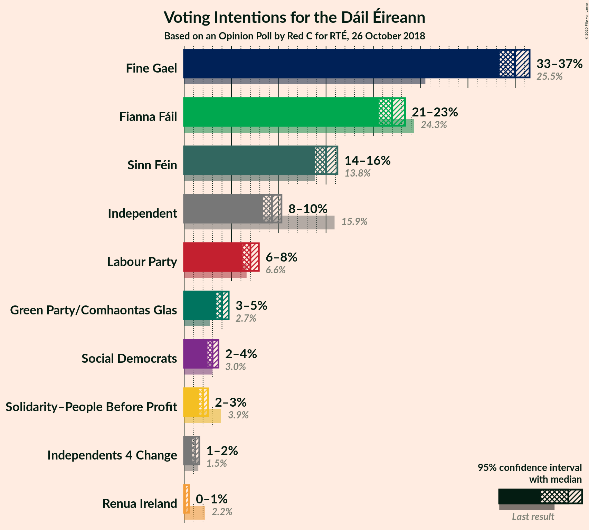
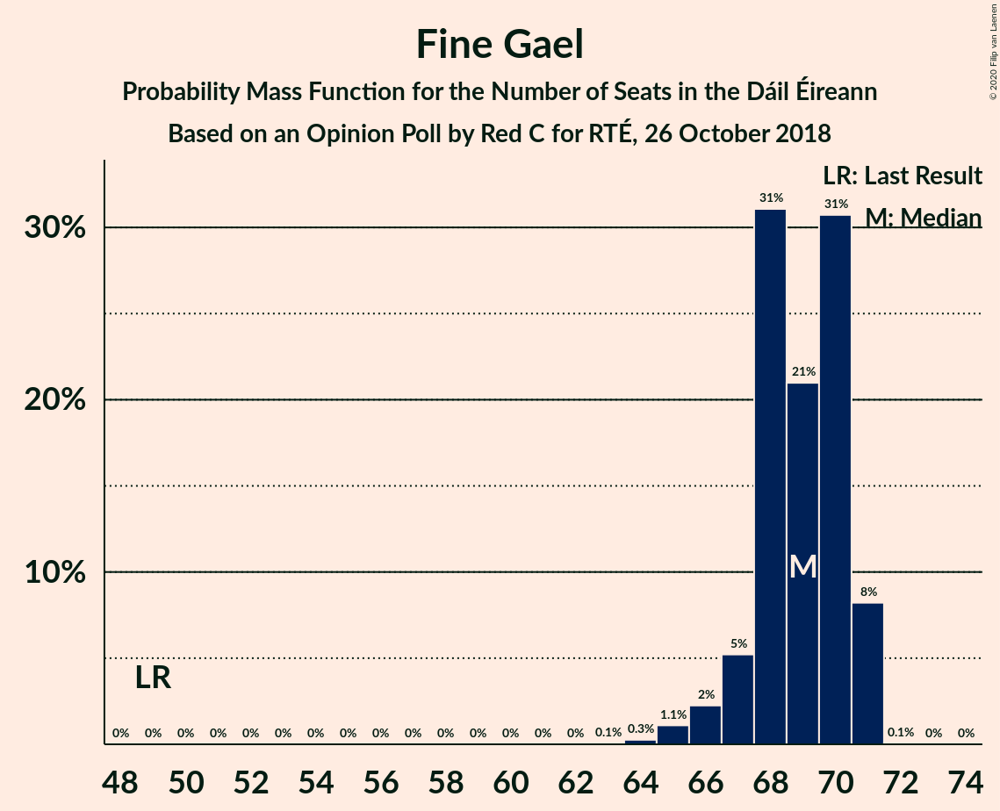
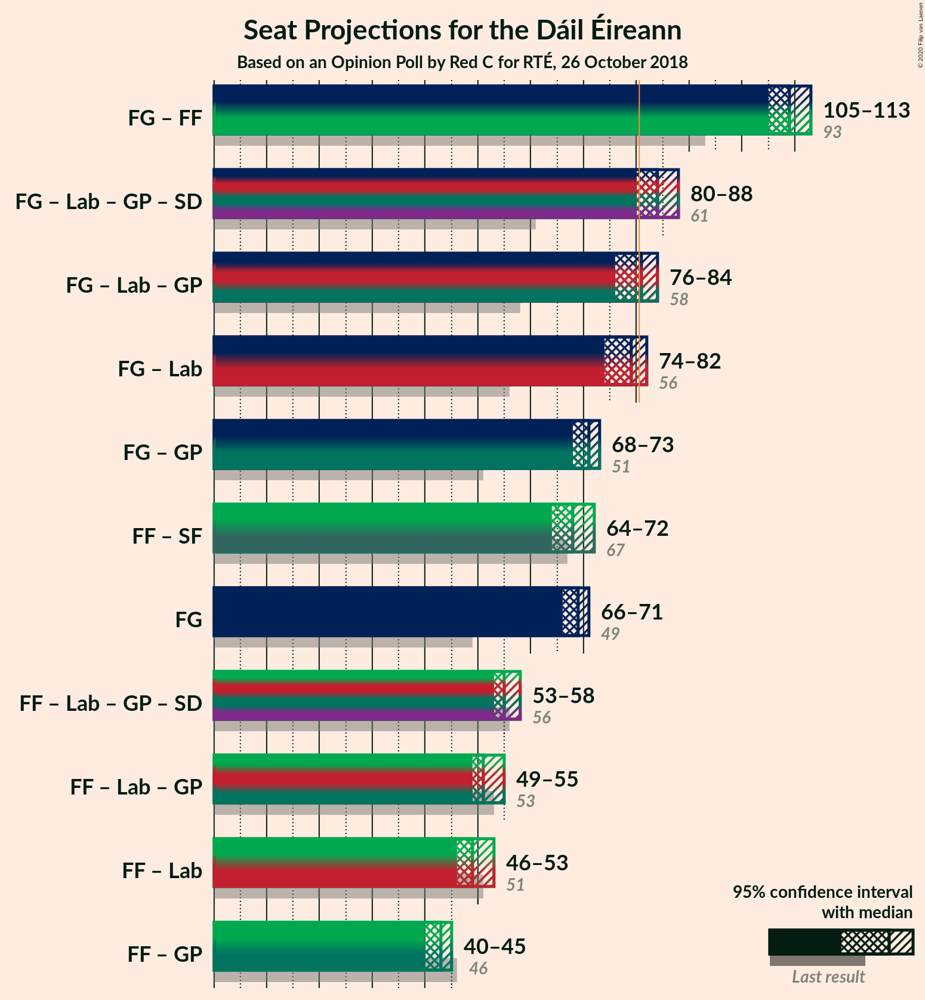
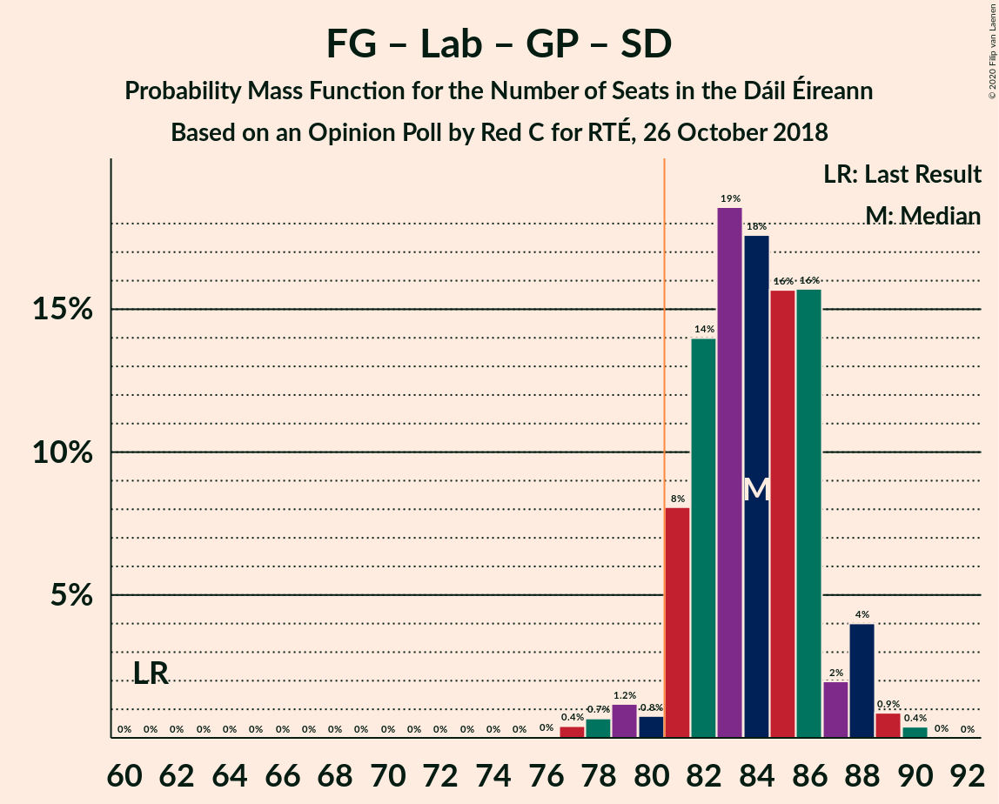

# Opinion Poll by Red C for RTÉ, 26 October 2018

<a href="#voting-intentions">Voting Intentions</a> | <a href="#seats">Seats</a> | <a href="#coalitions">Coalitions</a> | <a href="#technical-information">Technical Information</a>

## Voting Intentions

### Confidence Intervals

| Party | Last Result | Poll Result | 80% Confidence Interval | 90% Confidence Interval | 95% Confidence Interval | 99% Confidence Interval |
|:-----:|:-----------:|:-----------:|:-----------------------:|:-----------------------:|:-----------------------:|:-----------------------:|
| Fine Gael | 25.5% | 34.9% | 33.9–36.0% |33.6–36.3% |33.3–36.5% |32.9–37.0% |
| Fianna Fáil | 24.3% | 21.9% | 21.0–22.9% |20.8–23.1% |20.6–23.4% |20.2–23.8% |
| Sinn Féin | 13.8% | 15.0% | 14.2–15.8% |14.0–16.0% |13.8–16.2% |13.5–16.6% |
| Independent | 15.9% | 9.3% | 8.7–9.9% |8.5–10.1% |8.3–10.3% |8.1–10.6% |
| Labour Party | 6.6% | 7.0% | 6.5–7.6% |6.3–7.8% |6.2–7.9% |5.9–8.2% |
| Green Party/Comhaontas Glas | 2.7% | 4.0% | 3.6–4.5% |3.5–4.6% |3.4–4.7% |3.2–4.9% |
| Social Democrats | 3.0% | 3.0% | 2.7–3.4% |2.5–3.5% |2.5–3.6% |2.3–3.8% |
| Solidarity–People Before Profit | 3.9% | 2.0% | 1.7–2.3% |1.6–2.4% |1.6–2.5% |1.4–2.7% |
| Independents 4 Change | 1.5% | 1.2% | 1.0–1.5% |0.9–1.5% |0.9–1.6% |0.8–1.7% |
| Renua Ireland | 2.2% | 0.3% | 0.2–0.4% |0.2–0.5% |0.1–0.5% |0.1–0.6% |

*Note:* The poll result column reflects the actual value used in the calculations. Published results may vary slightly, and in addition be rounded to fewer digits.

## Seats

### Confidence Intervals

| Party | Last Result | Median | 80% Confidence Interval | 90% Confidence Interval | 95% Confidence Interval | 99% Confidence Interval |
|:-----:|:-----------:|:------:|:-----------------------:|:-----------------------:|:-----------------------:|:-----------------------:|
| <a href="#fine-gael">Fine Gael</a> | 49 | 69 | 68–70 |67–71 |66–71 |65–71 |
| <a href="#fianna-fáil">Fianna Fáil</a> | 44 | 41 | 38–42 |38–42 |38–43 |37–43 |
| <a href="#sinn-féin">Sinn Féin</a> | 23 | 28 | 26–30 |25–31 |24–31 |23–34 |
| <a href="#independent">Independent</a> | 19 | 4 | 4–5 |4–6 |4–6 |4–8 |
| <a href="#labour-party">Labour Party</a> | 7 | 9 | 6–11 |6–13 |5–13 |5–14 |
| <a href="#green-party/comhaontas-glas">Green Party/Comhaontas Glas</a> | 2 | 2 | 2–3 |2–3 |2–3 |2–3 |
| <a href="#social-democrats">Social Democrats</a> | 3 | 4 | 3–4 |3–4 |3–4 |3–4 |
| <a href="#solidarity–people-before-profit">Solidarity–People Before Profit</a> | 6 | 1 | 0–2 |0–3 |0–3 |0–3 |
| <a href="#independents-4-change">Independents 4 Change</a> | 4 | 2 | 1–3 |1–3 |1–4 |0–4 |
| <a href="#renua-ireland">Renua Ireland</a> | 0 | 0 | 0 |0 |0 |0 |

### Fine Gael

*For a full overview of the results for this party, see the [Fine Gael](party-finegael.html) page.*

| Number of Seats | Probability | Accumulated | Special Marks |
|:---------------:|:-----------:|:-----------:|:-------------:|
| 49 | 0% | 100% | Last Result |
| 50 | 0% | 100% |  |
| 51 | 0% | 100% |  |
| 52 | 0% | 100% |  |
| 53 | 0% | 100% |  |
| 54 | 0% | 100% |  |
| 55 | 0% | 100% |  |
| 56 | 0% | 100% |  |
| 57 | 0% | 100% |  |
| 58 | 0% | 100% |  |
| 59 | 0% | 100% |  |
| 60 | 0% | 100% |  |
| 61 | 0% | 100% |  |
| 62 | 0% | 100% |  |
| 63 | 0.1% | 100% |  |
| 64 | 0.3% | 99.9% |  |
| 65 | 1.1% | 99.7% |  |
| 66 | 2% | 98.6% |  |
| 67 | 5% | 96% |  |
| 68 | 31% | 91% |  |
| 69 | 21% | 60% | Median |
| 70 | 31% | 39% |  |
| 71 | 8% | 8% |  |
| 72 | 0.1% | 0.1% |  |
| 73 | 0% | 0% |  |

### Fianna Fáil

*For a full overview of the results for this party, see the [Fianna Fáil](party-fiannafáil.html) page.*

| Number of Seats | Probability | Accumulated | Special Marks |
|:---------------:|:-----------:|:-----------:|:-------------:|
| 37 | 0.5% | 100% |  |
| 38 | 13% | 99.4% |  |
| 39 | 17% | 87% |  |
| 40 | 10% | 69% |  |
| 41 | 45% | 59% | Median |
| 42 | 12% | 15% |  |
| 43 | 3% | 3% |  |
| 44 | 0.2% | 0.2% | Last Result |
| 45 | 0% | 0% |  |

### Sinn Féin

*For a full overview of the results for this party, see the [Sinn Féin](party-sinnféin.html) page.*

| Number of Seats | Probability | Accumulated | Special Marks |
|:---------------:|:-----------:|:-----------:|:-------------:|
| 22 | 0.2% | 100% |  |
| 23 | 1.4% | 99.7% | Last Result |
| 24 | 1.4% | 98% |  |
| 25 | 4% | 97% |  |
| 26 | 8% | 93% |  |
| 27 | 20% | 85% |  |
| 28 | 16% | 65% | Median |
| 29 | 19% | 49% |  |
| 30 | 22% | 29% |  |
| 31 | 5% | 7% |  |
| 32 | 1.1% | 2% |  |
| 33 | 0.3% | 0.8% |  |
| 34 | 0.4% | 0.5% |  |
| 35 | 0.1% | 0.1% |  |
| 36 | 0.1% | 0.1% |  |
| 37 | 0% | 0% |  |

### Independent

*For a full overview of the results for this party, see the [Independent](party-independent.html) page.*

| Number of Seats | Probability | Accumulated | Special Marks |
|:---------------:|:-----------:|:-----------:|:-------------:|
| 3 | 0.3% | 100% |  |
| 4 | 58% | 99.7% | Median |
| 5 | 33% | 42% |  |
| 6 | 7% | 8% |  |
| 7 | 0.7% | 1.2% |  |
| 8 | 0.2% | 0.5% |  |
| 9 | 0.1% | 0.3% |  |
| 10 | 0.2% | 0.2% |  |
| 11 | 0% | 0% |  |
| 12 | 0% | 0% |  |
| 13 | 0% | 0% |  |
| 14 | 0% | 0% |  |
| 15 | 0% | 0% |  |
| 16 | 0% | 0% |  |
| 17 | 0% | 0% |  |
| 18 | 0% | 0% |  |
| 19 | 0% | 0% | Last Result |

### Labour Party

*For a full overview of the results for this party, see the [Labour Party](party-labourparty.html) page.*

| Number of Seats | Probability | Accumulated | Special Marks |
|:---------------:|:-----------:|:-----------:|:-------------:|
| 4 | 0.2% | 100% |  |
| 5 | 3% | 99.7% |  |
| 6 | 13% | 97% |  |
| 7 | 9% | 84% | Last Result |
| 8 | 9% | 75% |  |
| 9 | 20% | 66% | Median |
| 10 | 18% | 46% |  |
| 11 | 20% | 28% |  |
| 12 | 2% | 8% |  |
| 13 | 5% | 6% |  |
| 14 | 1.1% | 1.3% |  |
| 15 | 0.3% | 0.3% |  |
| 16 | 0% | 0% |  |

### Green Party/Comhaontas Glas

*For a full overview of the results for this party, see the [Green Party/Comhaontas Glas](party-greenpartycomhaontasglas.html) page.*

| Number of Seats | Probability | Accumulated | Special Marks |
|:---------------:|:-----------:|:-----------:|:-------------:|
| 1 | 0.4% | 100% |  |
| 2 | 82% | 99.6% | Last Result, Median |
| 3 | 18% | 18% |  |
| 4 | 0% | 0% |  |

### Social Democrats

*For a full overview of the results for this party, see the [Social Democrats](party-socialdemocrats.html) page.*

| Number of Seats | Probability | Accumulated | Special Marks |
|:---------------:|:-----------:|:-----------:|:-------------:|
| 3 | 34% | 100% | Last Result |
| 4 | 66% | 66% | Median |
| 5 | 0% | 0% |  |

### Solidarity–People Before Profit

*For a full overview of the results for this party, see the [Solidarity–People Before Profit](party-solidarity–peoplebeforeprofit.html) page.*

| Number of Seats | Probability | Accumulated | Special Marks |
|:---------------:|:-----------:|:-----------:|:-------------:|
| 0 | 40% | 100% |  |
| 1 | 26% | 60% | Median |
| 2 | 25% | 34% |  |
| 3 | 9% | 9% |  |
| 4 | 0% | 0% |  |
| 5 | 0% | 0% |  |
| 6 | 0% | 0% | Last Result |

### Independents 4 Change

*For a full overview of the results for this party, see the [Independents 4 Change](party-independents4change.html) page.*

| Number of Seats | Probability | Accumulated | Special Marks |
|:---------------:|:-----------:|:-----------:|:-------------:|
| 0 | 2% | 100% |  |
| 1 | 20% | 98% |  |
| 2 | 59% | 77% | Median |
| 3 | 15% | 19% |  |
| 4 | 3% | 3% | Last Result |
| 5 | 0% | 0% |  |

### Renua Ireland

*For a full overview of the results for this party, see the [Renua Ireland](party-renuaireland.html) page.*

| Number of Seats | Probability | Accumulated | Special Marks |
|:---------------:|:-----------:|:-----------:|:-------------:|
| 0 | 100% | 100% | Last Result, Median |

## Coalitions

### Confidence Intervals

| Coalition | Last Result | Median | Majority? | 80% Confidence Interval | 90% Confidence Interval | 95% Confidence Interval | 99% Confidence Interval |
|:---------:|:-----------:|:------:|:---------:|:-----------------------:|:-----------------------:|:-----------------------:|:-----------------------:|
| Fine Gael – Fianna Fáil | 93 | 109 | 100% | 107–112 | 107–112 | 105–113 | 104–114 |
| Fine Gael – Labour Party – Green Party/Comhaontas Glas – Social Democrats | 61 | 84 | 97% | 81–86 | 81–88 | 80–88 | 78–89 |
| Fine Gael – Labour Party – Green Party/Comhaontas Glas | 58 | 81 | 52% | 77–82 | 77–84 | 76–84 | 74–86 |
| Fine Gael – Labour Party | 56 | 79 | 7% | 75–80 | 74–82 | 74–82 | 72–84 |
| Fine Gael – Green Party/Comhaontas Glas | 51 | 71 | 0% | 70–73 | 69–73 | 68–73 | 67–74 |
| Fianna Fáil – Sinn Féin | 67 | 68 | 0% | 67–71 | 65–72 | 64–72 | 62–74 |
| Fine Gael | 49 | 69 | 0% | 68–70 | 67–71 | 66–71 | 65–71 |
| Fianna Fáil – Labour Party – Green Party/Comhaontas Glas – Social Democrats | 56 | 55 | 0% | 54–57 | 54–58 | 53–58 | 51–59 |
| Fianna Fáil – Labour Party – Green Party/Comhaontas Glas | 53 | 51 | 0% | 50–54 | 50–54 | 49–55 | 47–56 |
| Fianna Fáil – Labour Party | 51 | 49 | 0% | 48–52 | 47–52 | 46–53 | 45–54 |
| Fianna Fáil – Green Party/Comhaontas Glas | 46 | 43 | 0% | 40–45 | 40–45 | 40–45 | 39–46 |

### Fine Gael – Fianna Fáil

| Number of Seats | Probability | Accumulated | Special Marks |
|:---------------:|:-----------:|:-----------:|:-------------:|
| 93 | 0% | 100% | Last Result |
| 94 | 0% | 100% |  |
| 95 | 0% | 100% |  |
| 96 | 0% | 100% |  |
| 97 | 0% | 100% |  |
| 98 | 0% | 100% |  |
| 99 | 0% | 100% |  |
| 100 | 0% | 100% |  |
| 101 | 0% | 100% |  |
| 102 | 0% | 100% |  |
| 103 | 0.1% | 100% |  |
| 104 | 0.7% | 99.8% |  |
| 105 | 2% | 99.1% |  |
| 106 | 0.8% | 97% |  |
| 107 | 10% | 96% |  |
| 108 | 19% | 86% |  |
| 109 | 29% | 67% |  |
| 110 | 16% | 38% | Median |
| 111 | 8% | 23% |  |
| 112 | 11% | 15% |  |
| 113 | 3% | 4% |  |
| 114 | 0.6% | 0.7% |  |
| 115 | 0.1% | 0.1% |  |
| 116 | 0% | 0% |  |

### Fine Gael – Labour Party – Green Party/Comhaontas Glas – Social Democrats

| Number of Seats | Probability | Accumulated | Special Marks |
|:---------------:|:-----------:|:-----------:|:-------------:|
| 61 | 0% | 100% | Last Result |
| 62 | 0% | 100% |  |
| 63 | 0% | 100% |  |
| 64 | 0% | 100% |  |
| 65 | 0% | 100% |  |
| 66 | 0% | 100% |  |
| 67 | 0% | 100% |  |
| 68 | 0% | 100% |  |
| 69 | 0% | 100% |  |
| 70 | 0% | 100% |  |
| 71 | 0% | 100% |  |
| 72 | 0% | 100% |  |
| 73 | 0% | 100% |  |
| 74 | 0% | 100% |  |
| 75 | 0% | 100% |  |
| 76 | 0% | 100% |  |
| 77 | 0.4% | 100% |  |
| 78 | 0.7% | 99.5% |  |
| 79 | 1.2% | 98.9% |  |
| 80 | 0.8% | 98% |  |
| 81 | 8% | 97% | Majority |
| 82 | 14% | 89% |  |
| 83 | 19% | 75% |  |
| 84 | 18% | 56% | Median |
| 85 | 16% | 39% |  |
| 86 | 16% | 23% |  |
| 87 | 2% | 7% |  |
| 88 | 4% | 5% |  |
| 89 | 0.9% | 1.3% |  |
| 90 | 0.4% | 0.4% |  |
| 91 | 0% | 0% |  |

### Fine Gael – Labour Party – Green Party/Comhaontas Glas

| Number of Seats | Probability | Accumulated | Special Marks |
|:---------------:|:-----------:|:-----------:|:-------------:|
| 58 | 0% | 100% | Last Result |
| 59 | 0% | 100% |  |
| 60 | 0% | 100% |  |
| 61 | 0% | 100% |  |
| 62 | 0% | 100% |  |
| 63 | 0% | 100% |  |
| 64 | 0% | 100% |  |
| 65 | 0% | 100% |  |
| 66 | 0% | 100% |  |
| 67 | 0% | 100% |  |
| 68 | 0% | 100% |  |
| 69 | 0% | 100% |  |
| 70 | 0% | 100% |  |
| 71 | 0% | 100% |  |
| 72 | 0% | 100% |  |
| 73 | 0.4% | 100% |  |
| 74 | 0.6% | 99.6% |  |
| 75 | 0.9% | 98.9% |  |
| 76 | 0.9% | 98% |  |
| 77 | 8% | 97% |  |
| 78 | 11% | 90% |  |
| 79 | 14% | 78% |  |
| 80 | 12% | 64% | Median |
| 81 | 23% | 52% | Majority |
| 82 | 21% | 28% |  |
| 83 | 1.0% | 8% |  |
| 84 | 4% | 7% |  |
| 85 | 2% | 2% |  |
| 86 | 0.5% | 0.5% |  |
| 87 | 0% | 0% |  |

### Fine Gael – Labour Party

| Number of Seats | Probability | Accumulated | Special Marks |
|:---------------:|:-----------:|:-----------:|:-------------:|
| 56 | 0% | 100% | Last Result |
| 57 | 0% | 100% |  |
| 58 | 0% | 100% |  |
| 59 | 0% | 100% |  |
| 60 | 0% | 100% |  |
| 61 | 0% | 100% |  |
| 62 | 0% | 100% |  |
| 63 | 0% | 100% |  |
| 64 | 0% | 100% |  |
| 65 | 0% | 100% |  |
| 66 | 0% | 100% |  |
| 67 | 0% | 100% |  |
| 68 | 0% | 100% |  |
| 69 | 0% | 100% |  |
| 70 | 0% | 100% |  |
| 71 | 0.4% | 100% |  |
| 72 | 0.8% | 99.5% |  |
| 73 | 0.9% | 98.7% |  |
| 74 | 3% | 98% |  |
| 75 | 8% | 95% |  |
| 76 | 16% | 86% |  |
| 77 | 9% | 70% |  |
| 78 | 10% | 62% | Median |
| 79 | 24% | 51% |  |
| 80 | 20% | 28% |  |
| 81 | 0.9% | 7% | Majority |
| 82 | 4% | 7% |  |
| 83 | 2% | 2% |  |
| 84 | 0.5% | 0.5% |  |
| 85 | 0% | 0% |  |

### Fine Gael – Green Party/Comhaontas Glas

| Number of Seats | Probability | Accumulated | Special Marks |
|:---------------:|:-----------:|:-----------:|:-------------:|
| 51 | 0% | 100% | Last Result |
| 52 | 0% | 100% |  |
| 53 | 0% | 100% |  |
| 54 | 0% | 100% |  |
| 55 | 0% | 100% |  |
| 56 | 0% | 100% |  |
| 57 | 0% | 100% |  |
| 58 | 0% | 100% |  |
| 59 | 0% | 100% |  |
| 60 | 0% | 100% |  |
| 61 | 0% | 100% |  |
| 62 | 0% | 100% |  |
| 63 | 0% | 100% |  |
| 64 | 0% | 100% |  |
| 65 | 0.1% | 100% |  |
| 66 | 0.3% | 99.9% |  |
| 67 | 1.1% | 99.7% |  |
| 68 | 2% | 98.6% |  |
| 69 | 5% | 96% |  |
| 70 | 27% | 91% |  |
| 71 | 20% | 64% | Median |
| 72 | 29% | 44% |  |
| 73 | 15% | 16% |  |
| 74 | 0.7% | 0.8% |  |
| 75 | 0% | 0% |  |

### Fianna Fáil – Sinn Féin

| Number of Seats | Probability | Accumulated | Special Marks |
|:---------------:|:-----------:|:-----------:|:-------------:|
| 61 | 0% | 100% |  |
| 62 | 0.9% | 99.9% |  |
| 63 | 1.0% | 99.1% |  |
| 64 | 3% | 98% |  |
| 65 | 4% | 95% |  |
| 66 | 1.1% | 91% |  |
| 67 | 13% | 90% | Last Result |
| 68 | 32% | 77% |  |
| 69 | 7% | 46% | Median |
| 70 | 24% | 39% |  |
| 71 | 8% | 15% |  |
| 72 | 5% | 6% |  |
| 73 | 0.8% | 1.5% |  |
| 74 | 0.4% | 0.6% |  |
| 75 | 0.1% | 0.2% |  |
| 76 | 0.1% | 0.1% |  |
| 77 | 0% | 0% |  |

### Fine Gael

| Number of Seats | Probability | Accumulated | Special Marks |
|:---------------:|:-----------:|:-----------:|:-------------:|
| 49 | 0% | 100% | Last Result |
| 50 | 0% | 100% |  |
| 51 | 0% | 100% |  |
| 52 | 0% | 100% |  |
| 53 | 0% | 100% |  |
| 54 | 0% | 100% |  |
| 55 | 0% | 100% |  |
| 56 | 0% | 100% |  |
| 57 | 0% | 100% |  |
| 58 | 0% | 100% |  |
| 59 | 0% | 100% |  |
| 60 | 0% | 100% |  |
| 61 | 0% | 100% |  |
| 62 | 0% | 100% |  |
| 63 | 0.1% | 100% |  |
| 64 | 0.3% | 99.9% |  |
| 65 | 1.1% | 99.7% |  |
| 66 | 2% | 98.6% |  |
| 67 | 5% | 96% |  |
| 68 | 31% | 91% |  |
| 69 | 21% | 60% | Median |
| 70 | 31% | 39% |  |
| 71 | 8% | 8% |  |
| 72 | 0.1% | 0.1% |  |
| 73 | 0% | 0% |  |

### Fianna Fáil – Labour Party – Green Party/Comhaontas Glas – Social Democrats

| Number of Seats | Probability | Accumulated | Special Marks |
|:---------------:|:-----------:|:-----------:|:-------------:|
| 49 | 0% | 100% |  |
| 50 | 0.1% | 99.9% |  |
| 51 | 0.4% | 99.8% |  |
| 52 | 1.2% | 99.4% |  |
| 53 | 2% | 98% |  |
| 54 | 26% | 96% |  |
| 55 | 32% | 70% |  |
| 56 | 18% | 38% | Last Result, Median |
| 57 | 14% | 20% |  |
| 58 | 5% | 6% |  |
| 59 | 1.1% | 1.4% |  |
| 60 | 0.3% | 0.3% |  |
| 61 | 0% | 0% |  |

### Fianna Fáil – Labour Party – Green Party/Comhaontas Glas

| Number of Seats | Probability | Accumulated | Special Marks |
|:---------------:|:-----------:|:-----------:|:-------------:|
| 46 | 0.1% | 100% |  |
| 47 | 0.4% | 99.8% |  |
| 48 | 1.2% | 99.5% |  |
| 49 | 2% | 98% |  |
| 50 | 21% | 96% |  |
| 51 | 26% | 75% |  |
| 52 | 24% | 48% | Median |
| 53 | 5% | 24% | Last Result |
| 54 | 16% | 19% |  |
| 55 | 2% | 3% |  |
| 56 | 0.5% | 0.6% |  |
| 57 | 0.1% | 0.1% |  |
| 58 | 0% | 0% |  |

### Fianna Fáil – Labour Party

| Number of Seats | Probability | Accumulated | Special Marks |
|:---------------:|:-----------:|:-----------:|:-------------:|
| 44 | 0.2% | 100% |  |
| 45 | 0.5% | 99.8% |  |
| 46 | 2% | 99.2% |  |
| 47 | 5% | 97% |  |
| 48 | 28% | 92% |  |
| 49 | 19% | 65% |  |
| 50 | 22% | 46% | Median |
| 51 | 5% | 24% | Last Result |
| 52 | 16% | 19% |  |
| 53 | 2% | 3% |  |
| 54 | 0.5% | 0.6% |  |
| 55 | 0.1% | 0.1% |  |
| 56 | 0% | 0% |  |

### Fianna Fáil – Green Party/Comhaontas Glas

| Number of Seats | Probability | Accumulated | Special Marks |
|:---------------:|:-----------:|:-----------:|:-------------:|
| 39 | 0.5% | 100% |  |
| 40 | 13% | 99.4% |  |
| 41 | 16% | 87% |  |
| 42 | 10% | 71% |  |
| 43 | 41% | 61% | Median |
| 44 | 8% | 20% |  |
| 45 | 11% | 12% |  |
| 46 | 0.6% | 0.7% | Last Result |
| 47 | 0.1% | 0.1% |  |
| 48 | 0% | 0% |  |

## Technical Information

### Opinion Poll

+ **Polling firm:** Red C
+ **Commissioner(s):** RTÉ
+ **Fieldwork period:** 26 October 2018

### Calculations

+ **Sample size:** 3474
+ **Simulations done:** 1,048,575
+ **Error estimate:** 1.33%

