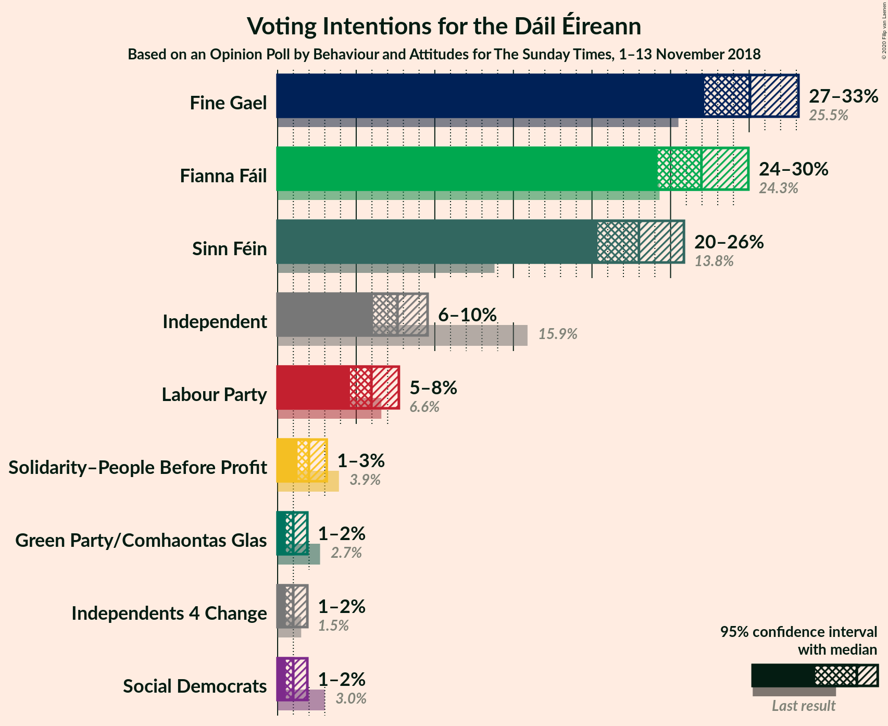
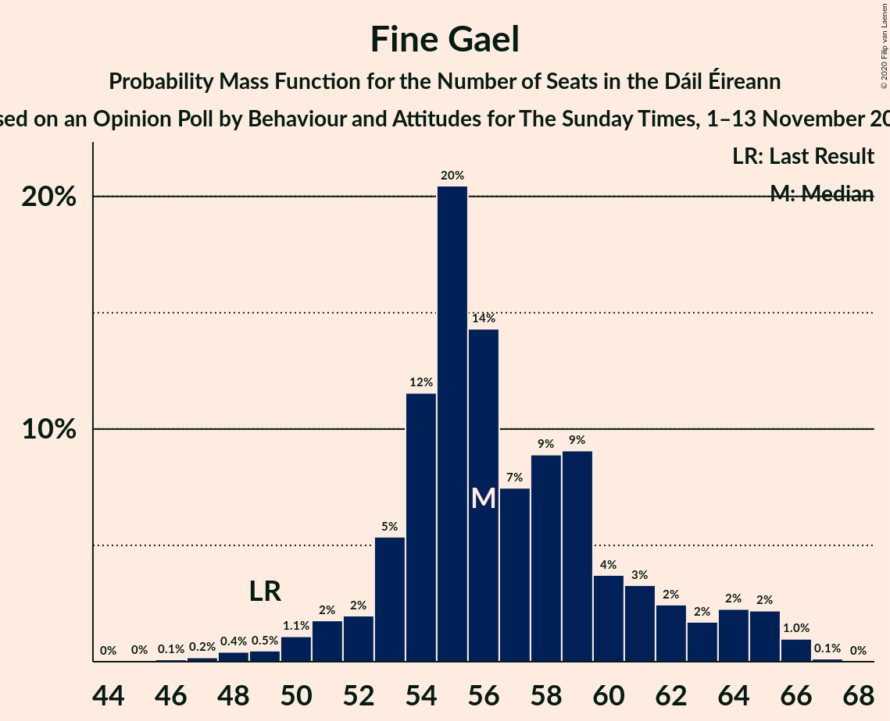
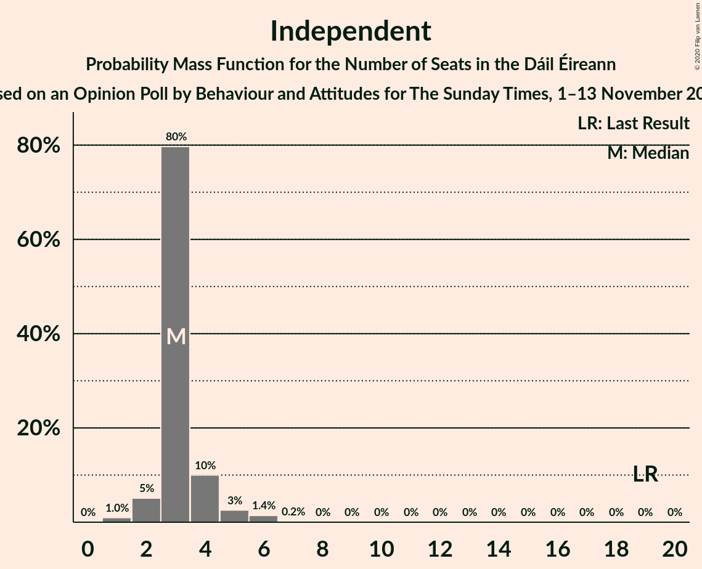
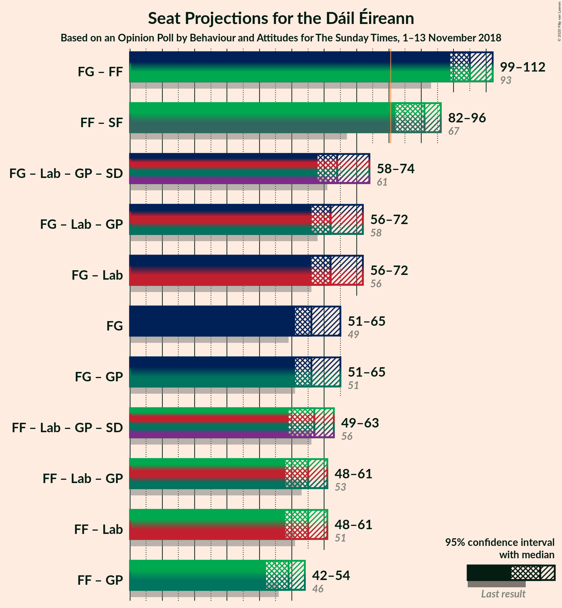

# Opinion Poll by Behaviour and Attitudes for The Sunday Times, 1–13 November 2018

<a href="#voting-intentions">Voting Intentions</a> | <a href="#seats">Seats</a> | <a href="#coalitions">Coalitions</a> | <a href="#technical-information">Technical Information</a>

## Voting Intentions

### Confidence Intervals

| Party | Last Result | Poll Result | 80% Confidence Interval | 90% Confidence Interval | 95% Confidence Interval | 99% Confidence Interval |
|:-----:|:-----------:|:-----------:|:-----------------------:|:-----------------------:|:-----------------------:|:-----------------------:|
| Fine Gael | 25.5% | 30.1% | 28.2–32.1% |27.6–32.6% |27.1–33.1% |26.3–34.1% |
| Fianna Fáil | 24.3% | 27.0% | 25.1–28.9% |24.6–29.5% |24.2–29.9% |23.3–30.9% |
| Sinn Féin | 13.8% | 23.0% | 21.3–24.9% |20.8–25.4% |20.3–25.8% |19.6–26.8% |
| Independent | 15.9% | 7.6% | 6.6–8.9% |6.3–9.2% |6.1–9.5% |5.6–10.2% |
| Labour Party | 6.6% | 6.0% | 5.1–7.1% |4.8–7.4% |4.6–7.7% |4.2–8.3% |
| Solidarity–People Before Profit | 3.9% | 2.0% | 1.5–2.7% |1.4–2.9% |1.3–3.1% |1.1–3.5% |
| Social Democrats | 3.0% | 1.0% | 0.7–1.6% |0.6–1.7% |0.5–1.9% |0.4–2.2% |
| Green Party/Comhaontas Glas | 2.7% | 1.0% | 0.7–1.6% |0.6–1.7% |0.5–1.9% |0.4–2.2% |
| Independents 4 Change | 1.5% | 1.0% | 0.7–1.6% |0.6–1.7% |0.5–1.9% |0.4–2.2% |

*Note:* The poll result column reflects the actual value used in the calculations. Published results may vary slightly, and in addition be rounded to fewer digits.

## Seats

### Confidence Intervals

| Party | Last Result | Median | 80% Confidence Interval | 90% Confidence Interval | 95% Confidence Interval | 99% Confidence Interval |
|:-----:|:-----------:|:------:|:-----------------------:|:-----------------------:|:-----------------------:|:-----------------------:|
| <a href="#fine-gael">Fine Gael</a> | 49 | 58 | 53–61 |53–63 |51–63 |48–65 |
| <a href="#fianna-fáil">Fianna Fáil</a> | 44 | 50 | 46–52 |43–52 |41–55 |41–57 |
| <a href="#sinn-féin">Sinn Féin</a> | 23 | 41 | 38–44 |37–45 |36–45 |35–47 |
| <a href="#independent">Independent</a> | 19 | 3 | 3–4 |3–4 |2–5 |2–6 |
| <a href="#labour-party">Labour Party</a> | 7 | 6 | 2–8 |2–8 |2–9 |1–14 |
| <a href="#solidarity–people-before-profit">Solidarity–People Before Profit</a> | 6 | 0 | 0–2 |0–3 |0–3 |0–4 |
| <a href="#social-democrats">Social Democrats</a> | 3 | 3 | 0–3 |0–3 |0–3 |0–4 |
| <a href="#green-party/comhaontas-glas">Green Party/Comhaontas Glas</a> | 2 | 0 | 0 |0 |0 |0 |
| <a href="#independents-4-change">Independents 4 Change</a> | 4 | 1 | 0–4 |0–4 |0–5 |0–5 |

### Fine Gael

*For a full overview of the results for this party, see the [Fine Gael](party-finegael.html) page.*

| Number of Seats | Probability | Accumulated | Special Marks |
|:---------------:|:-----------:|:-----------:|:-------------:|
| 45 | 0.1% | 100% |  |
| 46 | 0.1% | 99.9% |  |
| 47 | 0.2% | 99.8% |  |
| 48 | 0.7% | 99.7% |  |
| 49 | 0.5% | 98.9% | Last Result |
| 50 | 0.9% | 98% |  |
| 51 | 0.5% | 98% |  |
| 52 | 0.9% | 97% |  |
| 53 | 13% | 96% |  |
| 54 | 8% | 83% |  |
| 55 | 11% | 75% |  |
| 56 | 4% | 64% |  |
| 57 | 8% | 60% |  |
| 58 | 31% | 52% | Median |
| 59 | 3% | 21% |  |
| 60 | 7% | 18% |  |
| 61 | 4% | 11% |  |
| 62 | 0.6% | 7% |  |
| 63 | 5% | 7% |  |
| 64 | 0.2% | 2% |  |
| 65 | 1.2% | 2% |  |
| 66 | 0.2% | 0.3% |  |
| 67 | 0% | 0.1% |  |
| 68 | 0% | 0% |  |

### Fianna Fáil

*For a full overview of the results for this party, see the [Fianna Fáil](party-fiannafáil.html) page.*

| Number of Seats | Probability | Accumulated | Special Marks |
|:---------------:|:-----------:|:-----------:|:-------------:|
| 39 | 0.1% | 100% |  |
| 40 | 0.3% | 99.9% |  |
| 41 | 2% | 99.6% |  |
| 42 | 2% | 97% |  |
| 43 | 0.8% | 95% |  |
| 44 | 2% | 95% | Last Result |
| 45 | 3% | 93% |  |
| 46 | 4% | 90% |  |
| 47 | 3% | 86% |  |
| 48 | 12% | 83% |  |
| 49 | 18% | 71% |  |
| 50 | 15% | 53% | Median |
| 51 | 25% | 38% |  |
| 52 | 8% | 13% |  |
| 53 | 1.3% | 5% |  |
| 54 | 0.9% | 4% |  |
| 55 | 1.5% | 3% |  |
| 56 | 0.7% | 1.3% |  |
| 57 | 0.3% | 0.6% |  |
| 58 | 0.3% | 0.3% |  |
| 59 | 0% | 0% |  |

### Sinn Féin

*For a full overview of the results for this party, see the [Sinn Féin](party-sinnféin.html) page.*

| Number of Seats | Probability | Accumulated | Special Marks |
|:---------------:|:-----------:|:-----------:|:-------------:|
| 23 | 0% | 100% | Last Result |
| 24 | 0% | 100% |  |
| 25 | 0% | 100% |  |
| 26 | 0% | 100% |  |
| 27 | 0% | 100% |  |
| 28 | 0% | 100% |  |
| 29 | 0% | 100% |  |
| 30 | 0% | 100% |  |
| 31 | 0% | 100% |  |
| 32 | 0% | 100% |  |
| 33 | 0% | 100% |  |
| 34 | 0.5% | 100% |  |
| 35 | 2% | 99.5% |  |
| 36 | 2% | 98% |  |
| 37 | 5% | 96% |  |
| 38 | 20% | 91% |  |
| 39 | 6% | 70% |  |
| 40 | 15% | 65% |  |
| 41 | 8% | 50% | Median |
| 42 | 5% | 42% |  |
| 43 | 6% | 37% |  |
| 44 | 21% | 31% |  |
| 45 | 8% | 10% |  |
| 46 | 0.9% | 2% |  |
| 47 | 0.4% | 0.8% |  |
| 48 | 0.3% | 0.4% |  |
| 49 | 0.1% | 0.1% |  |
| 50 | 0% | 0% |  |

### Independent

*For a full overview of the results for this party, see the [Independent](party-independent.html) page.*

| Number of Seats | Probability | Accumulated | Special Marks |
|:---------------:|:-----------:|:-----------:|:-------------:|
| 1 | 0.4% | 100% |  |
| 2 | 4% | 99.6% |  |
| 3 | 69% | 95% | Median |
| 4 | 22% | 26% |  |
| 5 | 2% | 4% |  |
| 6 | 1.0% | 1.4% |  |
| 7 | 0.3% | 0.4% |  |
| 8 | 0% | 0.1% |  |
| 9 | 0% | 0% |  |
| 10 | 0% | 0% |  |
| 11 | 0% | 0% |  |
| 12 | 0% | 0% |  |
| 13 | 0% | 0% |  |
| 14 | 0% | 0% |  |
| 15 | 0% | 0% |  |
| 16 | 0% | 0% |  |
| 17 | 0% | 0% |  |
| 18 | 0% | 0% |  |
| 19 | 0% | 0% | Last Result |

### Labour Party

*For a full overview of the results for this party, see the [Labour Party](party-labourparty.html) page.*

| Number of Seats | Probability | Accumulated | Special Marks |
|:---------------:|:-----------:|:-----------:|:-------------:|
| 0 | 0.3% | 100% |  |
| 1 | 0.9% | 99.7% |  |
| 2 | 16% | 98.8% |  |
| 3 | 11% | 82% |  |
| 4 | 12% | 72% |  |
| 5 | 10% | 60% |  |
| 6 | 6% | 50% | Median |
| 7 | 24% | 44% | Last Result |
| 8 | 16% | 19% |  |
| 9 | 1.1% | 4% |  |
| 10 | 0.5% | 2% |  |
| 11 | 0.5% | 2% |  |
| 12 | 0.5% | 1.5% |  |
| 13 | 0.4% | 1.0% |  |
| 14 | 0.3% | 0.6% |  |
| 15 | 0.1% | 0.3% |  |
| 16 | 0% | 0.1% |  |
| 17 | 0.1% | 0.1% |  |
| 18 | 0% | 0% |  |

### Solidarity–People Before Profit

*For a full overview of the results for this party, see the [Solidarity–People Before Profit](party-solidarity–peoplebeforeprofit.html) page.*

| Number of Seats | Probability | Accumulated | Special Marks |
|:---------------:|:-----------:|:-----------:|:-------------:|
| 0 | 61% | 100% | Median |
| 1 | 25% | 39% |  |
| 2 | 6% | 14% |  |
| 3 | 7% | 8% |  |
| 4 | 0.9% | 1.0% |  |
| 5 | 0% | 0% |  |
| 6 | 0% | 0% | Last Result |

### Social Democrats

*For a full overview of the results for this party, see the [Social Democrats](party-socialdemocrats.html) page.*

| Number of Seats | Probability | Accumulated | Special Marks |
|:---------------:|:-----------:|:-----------:|:-------------:|
| 0 | 27% | 100% |  |
| 1 | 5% | 73% |  |
| 2 | 15% | 67% |  |
| 3 | 52% | 53% | Last Result, Median |
| 4 | 0.8% | 0.8% |  |
| 5 | 0% | 0% |  |

### Green Party/Comhaontas Glas

*For a full overview of the results for this party, see the [Green Party/Comhaontas Glas](party-greenpartycomhaontasglas.html) page.*

| Number of Seats | Probability | Accumulated | Special Marks |
|:---------------:|:-----------:|:-----------:|:-------------:|
| 0 | 99.9% | 100% | Median |
| 1 | 0.1% | 0.1% |  |
| 2 | 0% | 0% | Last Result |

### Independents 4 Change

*For a full overview of the results for this party, see the [Independents 4 Change](party-independents4change.html) page.*

| Number of Seats | Probability | Accumulated | Special Marks |
|:---------------:|:-----------:|:-----------:|:-------------:|
| 0 | 40% | 100% |  |
| 1 | 30% | 60% | Median |
| 2 | 1.5% | 30% |  |
| 3 | 7% | 28% |  |
| 4 | 18% | 22% | Last Result |
| 5 | 3% | 3% |  |
| 6 | 0% | 0% |  |

## Coalitions

### Confidence Intervals

| Coalition | Last Result | Median | Majority? | 80% Confidence Interval | 90% Confidence Interval | 95% Confidence Interval | 99% Confidence Interval |
|:---------:|:-----------:|:------:|:---------:|:-----------------------:|:-----------------------:|:-----------------------:|:-----------------------:|
| Fine Gael – Fianna Fáil | 93 | 107 | 100% | 101–111 | 101–112 | 100–112 | 97–113 |
| Fianna Fáil – Sinn Féin | 67 | 90 | 99.6% | 86–94 | 84–95 | 83–96 | 81–100 |
| Fine Gael – Labour Party – Green Party/Comhaontas Glas – Social Democrats | 61 | 64 | 0% | 61–68 | 60–69 | 58–72 | 55–74 |
| Fine Gael – Labour Party – Green Party/Comhaontas Glas | 58 | 61 | 0% | 58–65 | 58–67 | 56–69 | 53–71 |
| Fine Gael – Labour Party | 56 | 61 | 0% | 58–65 | 58–67 | 56–69 | 53–71 |
| Fine Gael | 49 | 58 | 0% | 53–61 | 53–63 | 51–63 | 48–65 |
| Fine Gael – Green Party/Comhaontas Glas | 51 | 58 | 0% | 53–61 | 53–63 | 51–63 | 48–65 |
| Fianna Fáil – Labour Party – Green Party/Comhaontas Glas – Social Democrats | 56 | 57 | 0% | 52–61 | 51–61 | 46–62 | 45–65 |
| Fianna Fáil – Labour Party – Green Party/Comhaontas Glas | 53 | 55 | 0% | 50–58 | 48–59 | 46–60 | 45–63 |
| Fianna Fáil – Labour Party | 51 | 55 | 0% | 50–58 | 48–59 | 46–60 | 45–63 |
| Fianna Fáil – Green Party/Comhaontas Glas | 46 | 50 | 0% | 46–52 | 43–52 | 41–55 | 41–57 |

### Fine Gael – Fianna Fáil

| Number of Seats | Probability | Accumulated | Special Marks |
|:---------------:|:-----------:|:-----------:|:-------------:|
| 93 | 0% | 100% | Last Result |
| 94 | 0.1% | 99.9% |  |
| 95 | 0% | 99.9% |  |
| 96 | 0.3% | 99.8% |  |
| 97 | 0.2% | 99.6% |  |
| 98 | 0.8% | 99.4% |  |
| 99 | 0.6% | 98.6% |  |
| 100 | 3% | 98% |  |
| 101 | 8% | 95% |  |
| 102 | 3% | 88% |  |
| 103 | 10% | 84% |  |
| 104 | 9% | 75% |  |
| 105 | 4% | 66% |  |
| 106 | 9% | 62% |  |
| 107 | 18% | 53% |  |
| 108 | 2% | 35% | Median |
| 109 | 18% | 32% |  |
| 110 | 2% | 15% |  |
| 111 | 6% | 12% |  |
| 112 | 5% | 6% |  |
| 113 | 1.4% | 2% |  |
| 114 | 0.1% | 0.1% |  |
| 115 | 0.1% | 0.1% |  |
| 116 | 0% | 0% |  |

### Fianna Fáil – Sinn Féin

| Number of Seats | Probability | Accumulated | Special Marks |
|:---------------:|:-----------:|:-----------:|:-------------:|
| 67 | 0% | 100% | Last Result |
| 68 | 0% | 100% |  |
| 69 | 0% | 100% |  |
| 70 | 0% | 100% |  |
| 71 | 0% | 100% |  |
| 72 | 0% | 100% |  |
| 73 | 0% | 100% |  |
| 74 | 0% | 100% |  |
| 75 | 0% | 100% |  |
| 76 | 0% | 100% |  |
| 77 | 0% | 100% |  |
| 78 | 0.1% | 100% |  |
| 79 | 0.1% | 99.9% |  |
| 80 | 0.2% | 99.8% |  |
| 81 | 1.1% | 99.6% | Majority |
| 82 | 0.8% | 98% |  |
| 83 | 0.4% | 98% |  |
| 84 | 4% | 97% |  |
| 85 | 2% | 93% |  |
| 86 | 4% | 91% |  |
| 87 | 7% | 87% |  |
| 88 | 5% | 80% |  |
| 89 | 19% | 75% |  |
| 90 | 9% | 56% |  |
| 91 | 8% | 47% | Median |
| 92 | 6% | 39% |  |
| 93 | 20% | 32% |  |
| 94 | 7% | 12% |  |
| 95 | 2% | 5% |  |
| 96 | 1.4% | 3% |  |
| 97 | 0.2% | 2% |  |
| 98 | 0.8% | 2% |  |
| 99 | 0.1% | 0.9% |  |
| 100 | 0.7% | 0.8% |  |
| 101 | 0% | 0.1% |  |
| 102 | 0% | 0.1% |  |
| 103 | 0% | 0% |  |

### Fine Gael – Labour Party – Green Party/Comhaontas Glas – Social Democrats

| Number of Seats | Probability | Accumulated | Special Marks |
|:---------------:|:-----------:|:-----------:|:-------------:|
| 51 | 0% | 100% |  |
| 52 | 0% | 99.9% |  |
| 53 | 0.1% | 99.9% |  |
| 54 | 0.2% | 99.8% |  |
| 55 | 0.5% | 99.6% |  |
| 56 | 0.6% | 99.1% |  |
| 57 | 0.3% | 98.5% |  |
| 58 | 2% | 98% |  |
| 59 | 0.6% | 96% |  |
| 60 | 3% | 96% |  |
| 61 | 20% | 93% | Last Result |
| 62 | 14% | 73% |  |
| 63 | 6% | 59% |  |
| 64 | 8% | 53% |  |
| 65 | 10% | 45% |  |
| 66 | 5% | 35% |  |
| 67 | 6% | 30% | Median |
| 68 | 17% | 24% |  |
| 69 | 4% | 7% |  |
| 70 | 0.6% | 4% |  |
| 71 | 0.7% | 3% |  |
| 72 | 1.1% | 3% |  |
| 73 | 0.1% | 1.4% |  |
| 74 | 0.9% | 1.3% |  |
| 75 | 0.1% | 0.4% |  |
| 76 | 0.2% | 0.3% |  |
| 77 | 0% | 0.1% |  |
| 78 | 0% | 0.1% |  |
| 79 | 0% | 0% |  |

### Fine Gael – Labour Party – Green Party/Comhaontas Glas

| Number of Seats | Probability | Accumulated | Special Marks |
|:---------------:|:-----------:|:-----------:|:-------------:|
| 49 | 0% | 100% |  |
| 50 | 0% | 99.9% |  |
| 51 | 0% | 99.9% |  |
| 52 | 0% | 99.9% |  |
| 53 | 0.4% | 99.9% |  |
| 54 | 0.4% | 99.5% |  |
| 55 | 1.0% | 99.1% |  |
| 56 | 0.6% | 98% |  |
| 57 | 2% | 97% |  |
| 58 | 6% | 95% | Last Result |
| 59 | 2% | 89% |  |
| 60 | 17% | 87% |  |
| 61 | 23% | 70% |  |
| 62 | 4% | 47% |  |
| 63 | 4% | 44% |  |
| 64 | 7% | 40% | Median |
| 65 | 24% | 33% |  |
| 66 | 4% | 9% |  |
| 67 | 1.0% | 5% |  |
| 68 | 1.0% | 4% |  |
| 69 | 0.8% | 3% |  |
| 70 | 0.6% | 2% |  |
| 71 | 1.2% | 2% |  |
| 72 | 0.2% | 0.5% |  |
| 73 | 0.2% | 0.3% |  |
| 74 | 0% | 0.2% |  |
| 75 | 0.1% | 0.2% |  |
| 76 | 0.1% | 0.1% |  |
| 77 | 0% | 0% |  |

### Fine Gael – Labour Party

| Number of Seats | Probability | Accumulated | Special Marks |
|:---------------:|:-----------:|:-----------:|:-------------:|
| 49 | 0% | 100% |  |
| 50 | 0% | 99.9% |  |
| 51 | 0% | 99.9% |  |
| 52 | 0% | 99.9% |  |
| 53 | 0.4% | 99.9% |  |
| 54 | 0.4% | 99.5% |  |
| 55 | 1.0% | 99.1% |  |
| 56 | 0.6% | 98% | Last Result |
| 57 | 2% | 97% |  |
| 58 | 6% | 95% |  |
| 59 | 2% | 89% |  |
| 60 | 17% | 87% |  |
| 61 | 23% | 70% |  |
| 62 | 4% | 47% |  |
| 63 | 4% | 44% |  |
| 64 | 7% | 40% | Median |
| 65 | 24% | 33% |  |
| 66 | 4% | 9% |  |
| 67 | 1.0% | 5% |  |
| 68 | 1.0% | 4% |  |
| 69 | 0.9% | 3% |  |
| 70 | 0.6% | 2% |  |
| 71 | 1.2% | 2% |  |
| 72 | 0.2% | 0.5% |  |
| 73 | 0.2% | 0.3% |  |
| 74 | 0% | 0.2% |  |
| 75 | 0.1% | 0.2% |  |
| 76 | 0.1% | 0.1% |  |
| 77 | 0% | 0% |  |

### Fine Gael

| Number of Seats | Probability | Accumulated | Special Marks |
|:---------------:|:-----------:|:-----------:|:-------------:|
| 45 | 0.1% | 100% |  |
| 46 | 0.1% | 99.9% |  |
| 47 | 0.2% | 99.8% |  |
| 48 | 0.7% | 99.7% |  |
| 49 | 0.5% | 98.9% | Last Result |
| 50 | 0.9% | 98% |  |
| 51 | 0.5% | 98% |  |
| 52 | 0.9% | 97% |  |
| 53 | 13% | 96% |  |
| 54 | 8% | 83% |  |
| 55 | 11% | 75% |  |
| 56 | 4% | 64% |  |
| 57 | 8% | 60% |  |
| 58 | 31% | 52% | Median |
| 59 | 3% | 21% |  |
| 60 | 7% | 18% |  |
| 61 | 4% | 11% |  |
| 62 | 0.6% | 7% |  |
| 63 | 5% | 7% |  |
| 64 | 0.2% | 2% |  |
| 65 | 1.2% | 2% |  |
| 66 | 0.2% | 0.3% |  |
| 67 | 0% | 0.1% |  |
| 68 | 0% | 0% |  |

### Fine Gael – Green Party/Comhaontas Glas

| Number of Seats | Probability | Accumulated | Special Marks |
|:---------------:|:-----------:|:-----------:|:-------------:|
| 45 | 0.1% | 100% |  |
| 46 | 0.1% | 99.9% |  |
| 47 | 0.2% | 99.8% |  |
| 48 | 0.7% | 99.7% |  |
| 49 | 0.5% | 98.9% |  |
| 50 | 0.9% | 98% |  |
| 51 | 0.5% | 98% | Last Result |
| 52 | 0.9% | 97% |  |
| 53 | 13% | 96% |  |
| 54 | 8% | 83% |  |
| 55 | 11% | 75% |  |
| 56 | 4% | 64% |  |
| 57 | 8% | 60% |  |
| 58 | 31% | 52% | Median |
| 59 | 3% | 21% |  |
| 60 | 7% | 18% |  |
| 61 | 4% | 11% |  |
| 62 | 0.6% | 7% |  |
| 63 | 5% | 7% |  |
| 64 | 0.2% | 2% |  |
| 65 | 1.2% | 2% |  |
| 66 | 0.2% | 0.3% |  |
| 67 | 0% | 0.1% |  |
| 68 | 0% | 0% |  |

### Fianna Fáil – Labour Party – Green Party/Comhaontas Glas – Social Democrats

| Number of Seats | Probability | Accumulated | Special Marks |
|:---------------:|:-----------:|:-----------:|:-------------:|
| 44 | 0% | 100% |  |
| 45 | 0.5% | 99.9% |  |
| 46 | 2% | 99.4% |  |
| 47 | 0.2% | 97% |  |
| 48 | 0.3% | 97% |  |
| 49 | 0.4% | 97% |  |
| 50 | 1.1% | 96% |  |
| 51 | 4% | 95% |  |
| 52 | 2% | 92% |  |
| 53 | 16% | 89% |  |
| 54 | 7% | 73% |  |
| 55 | 8% | 67% |  |
| 56 | 4% | 59% | Last Result |
| 57 | 5% | 55% |  |
| 58 | 11% | 50% |  |
| 59 | 16% | 39% | Median |
| 60 | 3% | 23% |  |
| 61 | 18% | 21% |  |
| 62 | 0.8% | 3% |  |
| 63 | 0.5% | 2% |  |
| 64 | 0.7% | 2% |  |
| 65 | 0.9% | 1.2% |  |
| 66 | 0% | 0.3% |  |
| 67 | 0.1% | 0.3% |  |
| 68 | 0% | 0.1% |  |
| 69 | 0.1% | 0.1% |  |
| 70 | 0% | 0% |  |

### Fianna Fáil – Labour Party – Green Party/Comhaontas Glas

| Number of Seats | Probability | Accumulated | Special Marks |
|:---------------:|:-----------:|:-----------:|:-------------:|
| 43 | 0.1% | 100% |  |
| 44 | 0.1% | 99.9% |  |
| 45 | 0.6% | 99.8% |  |
| 46 | 3% | 99.2% |  |
| 47 | 0.9% | 97% |  |
| 48 | 2% | 96% |  |
| 49 | 0.3% | 93% |  |
| 50 | 4% | 93% |  |
| 51 | 12% | 89% |  |
| 52 | 4% | 77% |  |
| 53 | 7% | 73% | Last Result |
| 54 | 12% | 66% |  |
| 55 | 5% | 54% |  |
| 56 | 15% | 49% | Median |
| 57 | 2% | 33% |  |
| 58 | 25% | 32% |  |
| 59 | 3% | 7% |  |
| 60 | 1.2% | 3% |  |
| 61 | 0.7% | 2% |  |
| 62 | 1.1% | 2% |  |
| 63 | 0.2% | 0.6% |  |
| 64 | 0.2% | 0.4% |  |
| 65 | 0% | 0.2% |  |
| 66 | 0.1% | 0.2% |  |
| 67 | 0% | 0% |  |

### Fianna Fáil – Labour Party

| Number of Seats | Probability | Accumulated | Special Marks |
|:---------------:|:-----------:|:-----------:|:-------------:|
| 43 | 0.1% | 100% |  |
| 44 | 0.1% | 99.9% |  |
| 45 | 0.6% | 99.8% |  |
| 46 | 3% | 99.2% |  |
| 47 | 0.9% | 97% |  |
| 48 | 2% | 96% |  |
| 49 | 0.3% | 93% |  |
| 50 | 4% | 93% |  |
| 51 | 12% | 89% | Last Result |
| 52 | 4% | 77% |  |
| 53 | 7% | 73% |  |
| 54 | 12% | 66% |  |
| 55 | 5% | 54% |  |
| 56 | 15% | 49% | Median |
| 57 | 2% | 33% |  |
| 58 | 25% | 32% |  |
| 59 | 3% | 7% |  |
| 60 | 1.2% | 3% |  |
| 61 | 0.7% | 2% |  |
| 62 | 1.1% | 2% |  |
| 63 | 0.2% | 0.6% |  |
| 64 | 0.2% | 0.4% |  |
| 65 | 0% | 0.2% |  |
| 66 | 0.1% | 0.2% |  |
| 67 | 0% | 0% |  |

### Fianna Fáil – Green Party/Comhaontas Glas

| Number of Seats | Probability | Accumulated | Special Marks |
|:---------------:|:-----------:|:-----------:|:-------------:|
| 39 | 0.1% | 100% |  |
| 40 | 0.3% | 99.9% |  |
| 41 | 2% | 99.6% |  |
| 42 | 2% | 97% |  |
| 43 | 0.8% | 95% |  |
| 44 | 2% | 95% |  |
| 45 | 3% | 93% |  |
| 46 | 4% | 90% | Last Result |
| 47 | 3% | 86% |  |
| 48 | 12% | 83% |  |
| 49 | 18% | 71% |  |
| 50 | 15% | 53% | Median |
| 51 | 25% | 38% |  |
| 52 | 8% | 13% |  |
| 53 | 1.3% | 5% |  |
| 54 | 0.9% | 4% |  |
| 55 | 1.5% | 3% |  |
| 56 | 0.7% | 1.3% |  |
| 57 | 0.3% | 0.6% |  |
| 58 | 0.3% | 0.3% |  |
| 59 | 0% | 0% |  |

## Technical Information

### Opinion Poll

+ **Polling firm:** Behaviour and Attitudes
+ **Commissioner(s):** The Sunday Times
+ **Fieldwork period:** 1–13 November 2018

### Calculations

+ **Sample size:** 905
+ **Simulations done:** 131,072
+ **Error estimate:** 3.87%

