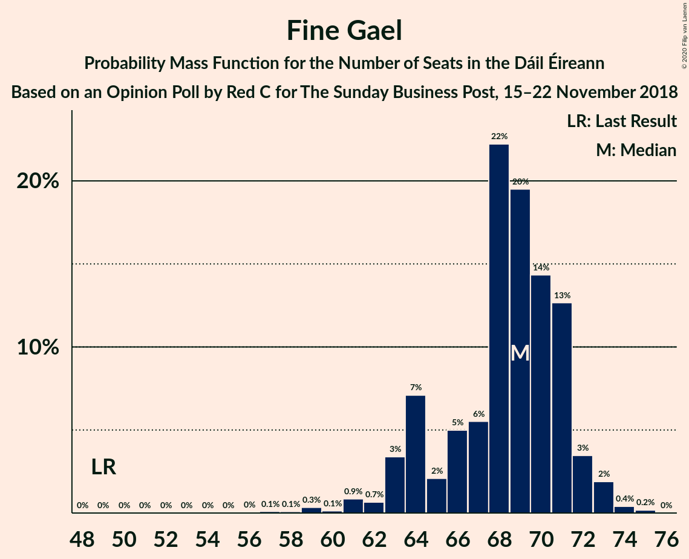
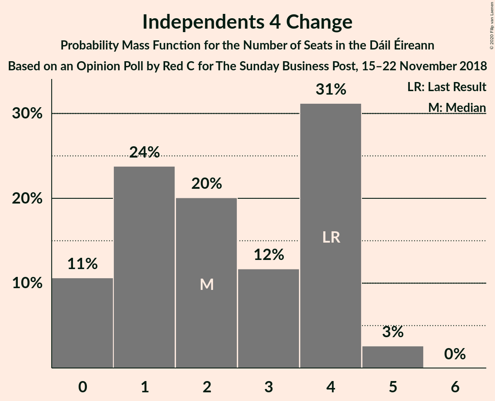
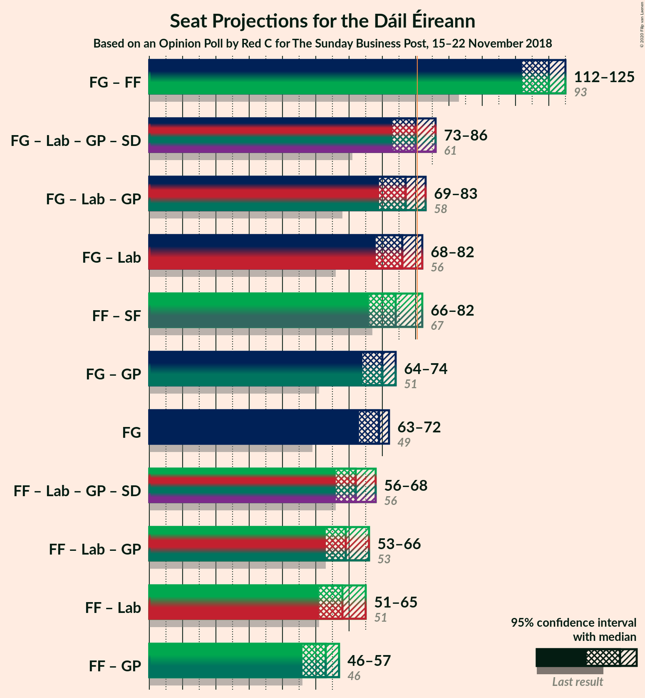
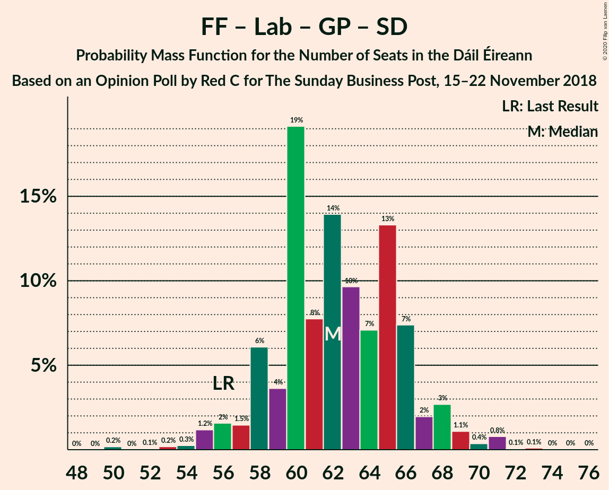
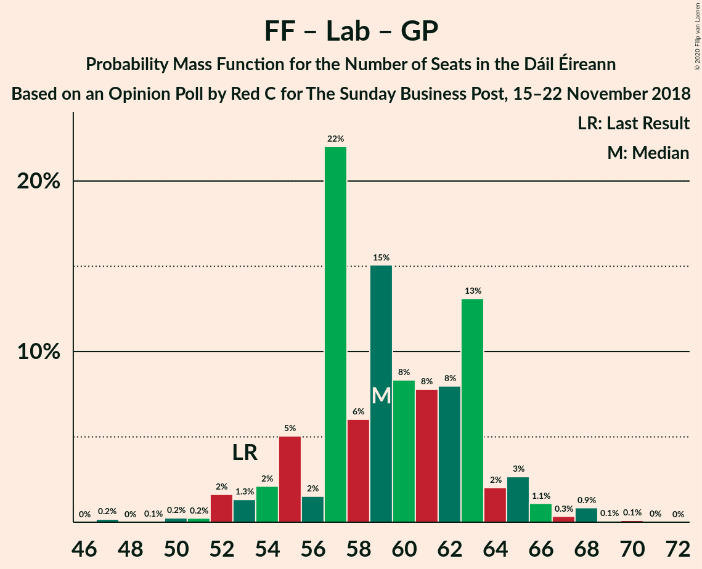

# Opinion Poll by Red C for The Sunday Business Post, 15–22 November 2018

<a href="#voting-intentions">Voting Intentions</a> | <a href="#seats">Seats</a> | <a href="#coalitions">Coalitions</a> | <a href="#technical-information">Technical Information</a>

## Voting Intentions

### Confidence Intervals

| Party | Last Result | Poll Result | 80% Confidence Interval | 90% Confidence Interval | 95% Confidence Interval | 99% Confidence Interval |
|:-----:|:-----------:|:-----------:|:-----------------------:|:-----------------------:|:-----------------------:|:-----------------------:|
| Fine Gael | 25.5% | 33.8% | 31.9–35.8% |31.4–36.3% |30.9–36.8% |30.0–37.7% |
| Fianna Fáil | 24.3% | 26.9% | 25.1–28.8% |24.7–29.3% |24.2–29.7% |23.4–30.7% |
| Sinn Féin | 13.8% | 12.9% | 11.6–14.4% |11.3–14.8% |11.0–15.1% |10.4–15.9% |
| Independent | 15.9% | 8.4% | 7.4–9.6% |7.1–10.0% |6.8–10.3% |6.4–10.9% |
| Labour Party | 6.6% | 6.0% | 5.1–7.1% |4.9–7.4% |4.7–7.7% |4.3–8.2% |
| Green Party/Comhaontas Glas | 2.7% | 3.0% | 2.4–3.8% |2.2–4.1% |2.1–4.3% |1.9–4.7% |
| Social Democrats | 3.0% | 2.0% | 1.5–2.7% |1.4–2.9% |1.3–3.1% |1.1–3.4% |
| Independents 4 Change | 1.5% | 1.1% | 0.8–1.7% |0.7–1.8% |0.6–2.0% |0.5–2.3% |
| Solidarity–People Before Profit | 3.9% | 0.2% | 0.1–0.5% |0.1–0.6% |0.1–0.7% |0.0–0.9% |
| Renua Ireland | 2.2% | 0.2% | 0.1–0.5% |0.1–0.6% |0.1–0.7% |0.0–0.9% |

*Note:* The poll result column reflects the actual value used in the calculations. Published results may vary slightly, and in addition be rounded to fewer digits.

## Seats

### Confidence Intervals

| Party | Last Result | Median | 80% Confidence Interval | 90% Confidence Interval | 95% Confidence Interval | 99% Confidence Interval |
|:-----:|:-----------:|:------:|:-----------------------:|:-----------------------:|:-----------------------:|:-----------------------:|
| <a href="#fine-gael">Fine Gael</a> | 49 | 69 | 66–71 |63–71 |61–71 |58–72 |
| <a href="#fianna-fáil">Fianna Fáil</a> | 44 | 53 | 48–55 |47–55 |46–56 |43–57 |
| <a href="#sinn-féin">Sinn Féin</a> | 23 | 22 | 16–26 |16–26 |16–29 |16–32 |
| <a href="#independent">Independent</a> | 19 | 3 | 3–7 |3–8 |3–8 |3–10 |
| <a href="#labour-party">Labour Party</a> | 7 | 8 | 5–10 |5–10 |3–10 |1–16 |
| <a href="#green-party/comhaontas-glas">Green Party/Comhaontas Glas</a> | 2 | 2 | 1–3 |0–3 |0–3 |0–3 |
| <a href="#social-democrats">Social Democrats</a> | 3 | 2 | 2–4 |1–4 |1–4 |1–4 |
| <a href="#independents-4-change">Independents 4 Change</a> | 4 | 1 | 1–4 |0–4 |0–4 |0–5 |
| <a href="#solidarity–people-before-profit">Solidarity–People Before Profit</a> | 6 | 0 | 0 |0 |0 |0 |
| <a href="#renua-ireland">Renua Ireland</a> | 0 | 0 | 0 |0 |0 |0 |

### Fine Gael

*For a full overview of the results for this party, see the [Fine Gael](party-finegael.html) page.*

| Number of Seats | Probability | Accumulated | Special Marks |
|:---------------:|:-----------:|:-----------:|:-------------:|
| 49 | 0% | 100% | Last Result |
| 50 | 0% | 100% |  |
| 51 | 0% | 100% |  |
| 52 | 0% | 100% |  |
| 53 | 0% | 100% |  |
| 54 | 0% | 100% |  |
| 55 | 0% | 100% |  |
| 56 | 0.3% | 100% |  |
| 57 | 0% | 99.7% |  |
| 58 | 0.4% | 99.7% |  |
| 59 | 1.5% | 99.3% |  |
| 60 | 0.2% | 98% |  |
| 61 | 0.4% | 98% |  |
| 62 | 0.2% | 97% |  |
| 63 | 2% | 97% |  |
| 64 | 2% | 95% |  |
| 65 | 0.5% | 93% |  |
| 66 | 11% | 92% |  |
| 67 | 4% | 81% |  |
| 68 | 6% | 77% |  |
| 69 | 47% | 70% | Median |
| 70 | 10% | 24% |  |
| 71 | 12% | 13% |  |
| 72 | 0.5% | 0.9% |  |
| 73 | 0.1% | 0.4% |  |
| 74 | 0.3% | 0.3% |  |
| 75 | 0% | 0% |  |

### Fianna Fáil

*For a full overview of the results for this party, see the [Fianna Fáil](party-fiannafáil.html) page.*

| Number of Seats | Probability | Accumulated | Special Marks |
|:---------------:|:-----------:|:-----------:|:-------------:|
| 42 | 0.1% | 100% |  |
| 43 | 0.4% | 99.9% |  |
| 44 | 0.3% | 99.5% | Last Result |
| 45 | 0.9% | 99.1% |  |
| 46 | 0.9% | 98% |  |
| 47 | 6% | 97% |  |
| 48 | 4% | 91% |  |
| 49 | 0.9% | 87% |  |
| 50 | 2% | 86% |  |
| 51 | 6% | 84% |  |
| 52 | 9% | 78% |  |
| 53 | 45% | 69% | Median |
| 54 | 4% | 25% |  |
| 55 | 15% | 20% |  |
| 56 | 3% | 5% |  |
| 57 | 2% | 2% |  |
| 58 | 0.2% | 0.3% |  |
| 59 | 0% | 0.1% |  |
| 60 | 0.1% | 0.1% |  |
| 61 | 0% | 0% |  |

### Sinn Féin

*For a full overview of the results for this party, see the [Sinn Féin](party-sinnféin.html) page.*

| Number of Seats | Probability | Accumulated | Special Marks |
|:---------------:|:-----------:|:-----------:|:-------------:|
| 14 | 0.1% | 100% |  |
| 15 | 0.3% | 99.8% |  |
| 16 | 10% | 99.6% |  |
| 17 | 0.9% | 89% |  |
| 18 | 9% | 89% |  |
| 19 | 9% | 79% |  |
| 20 | 4% | 70% |  |
| 21 | 5% | 67% |  |
| 22 | 47% | 62% | Median |
| 23 | 0.8% | 14% | Last Result |
| 24 | 2% | 14% |  |
| 25 | 1.4% | 12% |  |
| 26 | 7% | 11% |  |
| 27 | 0.5% | 4% |  |
| 28 | 0.1% | 3% |  |
| 29 | 0.7% | 3% |  |
| 30 | 0.8% | 2% |  |
| 31 | 0.2% | 2% |  |
| 32 | 1.3% | 1.5% |  |
| 33 | 0.1% | 0.2% |  |
| 34 | 0% | 0% |  |

### Independent

*For a full overview of the results for this party, see the [Independent](party-independent.html) page.*

| Number of Seats | Probability | Accumulated | Special Marks |
|:---------------:|:-----------:|:-----------:|:-------------:|
| 3 | 53% | 100% | Median |
| 4 | 18% | 47% |  |
| 5 | 6% | 29% |  |
| 6 | 12% | 23% |  |
| 7 | 6% | 12% |  |
| 8 | 4% | 5% |  |
| 9 | 0.6% | 1.3% |  |
| 10 | 0.3% | 0.7% |  |
| 11 | 0.2% | 0.4% |  |
| 12 | 0.1% | 0.2% |  |
| 13 | 0% | 0% |  |
| 14 | 0% | 0% |  |
| 15 | 0% | 0% |  |
| 16 | 0% | 0% |  |
| 17 | 0% | 0% |  |
| 18 | 0% | 0% |  |
| 19 | 0% | 0% | Last Result |

### Labour Party

*For a full overview of the results for this party, see the [Labour Party](party-labourparty.html) page.*

| Number of Seats | Probability | Accumulated | Special Marks |
|:---------------:|:-----------:|:-----------:|:-------------:|
| 0 | 0.3% | 100% |  |
| 1 | 0.2% | 99.7% |  |
| 2 | 2% | 99.5% |  |
| 3 | 0.4% | 98% |  |
| 4 | 0.9% | 97% |  |
| 5 | 12% | 96% |  |
| 6 | 3% | 84% |  |
| 7 | 6% | 81% | Last Result |
| 8 | 48% | 75% | Median |
| 9 | 16% | 28% |  |
| 10 | 9% | 11% |  |
| 11 | 0.6% | 2% |  |
| 12 | 0.1% | 2% |  |
| 13 | 0.3% | 2% |  |
| 14 | 0.2% | 1.4% |  |
| 15 | 0.5% | 1.2% |  |
| 16 | 0.4% | 0.7% |  |
| 17 | 0.1% | 0.3% |  |
| 18 | 0.1% | 0.2% |  |
| 19 | 0.1% | 0.1% |  |
| 20 | 0% | 0% |  |

### Green Party/Comhaontas Glas

*For a full overview of the results for this party, see the [Green Party/Comhaontas Glas](party-greenpartycomhaontasglas.html) page.*

| Number of Seats | Probability | Accumulated | Special Marks |
|:---------------:|:-----------:|:-----------:|:-------------:|
| 0 | 10% | 100% |  |
| 1 | 22% | 90% |  |
| 2 | 57% | 68% | Last Result, Median |
| 3 | 11% | 11% |  |
| 4 | 0% | 0.2% |  |
| 5 | 0.2% | 0.2% |  |
| 6 | 0% | 0% |  |

### Social Democrats

*For a full overview of the results for this party, see the [Social Democrats](party-socialdemocrats.html) page.*

| Number of Seats | Probability | Accumulated | Special Marks |
|:---------------:|:-----------:|:-----------:|:-------------:|
| 1 | 7% | 100% |  |
| 2 | 47% | 93% | Median |
| 3 | 35% | 46% | Last Result |
| 4 | 11% | 11% |  |
| 5 | 0% | 0% |  |

### Independents 4 Change

*For a full overview of the results for this party, see the [Independents 4 Change](party-independents4change.html) page.*

| Number of Seats | Probability | Accumulated | Special Marks |
|:---------------:|:-----------:|:-----------:|:-------------:|
| 0 | 5% | 100% |  |
| 1 | 57% | 95% | Median |
| 2 | 11% | 38% |  |
| 3 | 2% | 26% |  |
| 4 | 23% | 24% | Last Result |
| 5 | 1.2% | 1.2% |  |
| 6 | 0% | 0% |  |

### Solidarity–People Before Profit

*For a full overview of the results for this party, see the [Solidarity–People Before Profit](party-solidarity–peoplebeforeprofit.html) page.*

| Number of Seats | Probability | Accumulated | Special Marks |
|:---------------:|:-----------:|:-----------:|:-------------:|
| 0 | 100% | 100% | Median |
| 1 | 0% | 0% |  |
| 2 | 0% | 0% |  |
| 3 | 0% | 0% |  |
| 4 | 0% | 0% |  |
| 5 | 0% | 0% |  |
| 6 | 0% | 0% | Last Result |

### Renua Ireland

*For a full overview of the results for this party, see the [Renua Ireland](party-renuaireland.html) page.*

| Number of Seats | Probability | Accumulated | Special Marks |
|:---------------:|:-----------:|:-----------:|:-------------:|
| 0 | 100% | 100% | Last Result, Median |

## Coalitions

### Confidence Intervals

| Coalition | Last Result | Median | Majority? | 80% Confidence Interval | 90% Confidence Interval | 95% Confidence Interval | 99% Confidence Interval |
|:---------:|:-----------:|:------:|:---------:|:-----------------------:|:-----------------------:|:-----------------------:|:-----------------------:|
| Fine Gael – Fianna Fáil | 93 | 122 | 100% | 118–122 | 116–123 | 114–125 | 110–125 |
| Fine Gael – Labour Party – Green Party/Comhaontas Glas – Social Democrats | 61 | 81 | 70% | 78–83 | 75–84 | 71–84 | 66–86 |
| Fianna Fáil – Sinn Féin | 67 | 75 | 3% | 69–75 | 67–78 | 67–82 | 65–89 |
| Fine Gael – Labour Party – Green Party/Comhaontas Glas | 58 | 79 | 7% | 76–80 | 71–81 | 68–81 | 62–83 |
| Fine Gael – Labour Party | 56 | 77 | 1.2% | 75–78 | 70–79 | 66–80 | 61–81 |
| Fine Gael – Green Party/Comhaontas Glas | 51 | 71 | 0% | 66–73 | 65–74 | 62–74 | 60–74 |
| Fine Gael | 49 | 69 | 0% | 66–71 | 63–71 | 61–71 | 58–72 |
| Fianna Fáil – Labour Party – Green Party/Comhaontas Glas – Social Democrats | 56 | 65 | 0% | 60–68 | 58–68 | 58–68 | 54–71 |
| Fianna Fáil – Labour Party – Green Party/Comhaontas Glas | 53 | 63 | 0% | 57–65 | 54–65 | 54–66 | 51–68 |
| Fianna Fáil – Labour Party | 51 | 61 | 0% | 55–64 | 52–65 | 52–65 | 49–67 |
| Fianna Fáil – Green Party/Comhaontas Glas | 46 | 55 | 0% | 50–56 | 49–56 | 49–57 | 44–58 |

### Fine Gael – Fianna Fáil

| Number of Seats | Probability | Accumulated | Special Marks |
|:---------------:|:-----------:|:-----------:|:-------------:|
| 93 | 0% | 100% | Last Result |
| 94 | 0% | 100% |  |
| 95 | 0% | 100% |  |
| 96 | 0% | 100% |  |
| 97 | 0% | 100% |  |
| 98 | 0% | 100% |  |
| 99 | 0% | 100% |  |
| 100 | 0% | 100% |  |
| 101 | 0% | 100% |  |
| 102 | 0% | 100% |  |
| 103 | 0% | 100% |  |
| 104 | 0% | 100% |  |
| 105 | 0% | 100% |  |
| 106 | 0.3% | 100% |  |
| 107 | 0% | 99.7% |  |
| 108 | 0.1% | 99.7% |  |
| 109 | 0% | 99.6% |  |
| 110 | 0.1% | 99.6% |  |
| 111 | 0.2% | 99.5% |  |
| 112 | 0.5% | 99.3% |  |
| 113 | 0.7% | 98.8% |  |
| 114 | 1.2% | 98% |  |
| 115 | 1.5% | 97% |  |
| 116 | 2% | 95% |  |
| 117 | 2% | 94% |  |
| 118 | 7% | 91% |  |
| 119 | 6% | 85% |  |
| 120 | 6% | 79% |  |
| 121 | 18% | 73% |  |
| 122 | 48% | 55% | Median |
| 123 | 3% | 7% |  |
| 124 | 1.1% | 4% |  |
| 125 | 3% | 3% |  |
| 126 | 0.2% | 0.3% |  |
| 127 | 0.1% | 0.1% |  |
| 128 | 0% | 0% |  |

### Fine Gael – Labour Party – Green Party/Comhaontas Glas – Social Democrats

| Number of Seats | Probability | Accumulated | Special Marks |
|:---------------:|:-----------:|:-----------:|:-------------:|
| 61 | 0% | 100% | Last Result |
| 62 | 0% | 100% |  |
| 63 | 0% | 100% |  |
| 64 | 0% | 100% |  |
| 65 | 0% | 100% |  |
| 66 | 1.1% | 99.9% |  |
| 67 | 0% | 98.9% |  |
| 68 | 0.3% | 98.8% |  |
| 69 | 0.7% | 98.5% |  |
| 70 | 0.1% | 98% |  |
| 71 | 0.7% | 98% |  |
| 72 | 0.2% | 97% |  |
| 73 | 1.4% | 97% |  |
| 74 | 0.3% | 95% |  |
| 75 | 2% | 95% |  |
| 76 | 1.1% | 93% |  |
| 77 | 0.6% | 92% |  |
| 78 | 1.3% | 91% |  |
| 79 | 14% | 90% |  |
| 80 | 5% | 76% |  |
| 81 | 47% | 70% | Median, Majority |
| 82 | 12% | 24% |  |
| 83 | 5% | 12% |  |
| 84 | 5% | 7% |  |
| 85 | 1.2% | 2% |  |
| 86 | 0.6% | 0.7% |  |
| 87 | 0% | 0.1% |  |
| 88 | 0% | 0.1% |  |
| 89 | 0% | 0.1% |  |
| 90 | 0% | 0% |  |

### Fianna Fáil – Sinn Féin

| Number of Seats | Probability | Accumulated | Special Marks |
|:---------------:|:-----------:|:-----------:|:-------------:|
| 63 | 0.1% | 100% |  |
| 64 | 0.3% | 99.9% |  |
| 65 | 0.5% | 99.6% |  |
| 66 | 0.2% | 99.0% |  |
| 67 | 5% | 98.8% | Last Result |
| 68 | 0.2% | 94% |  |
| 69 | 6% | 94% |  |
| 70 | 4% | 88% |  |
| 71 | 12% | 85% |  |
| 72 | 1.2% | 72% |  |
| 73 | 13% | 71% |  |
| 74 | 0.7% | 58% |  |
| 75 | 49% | 57% | Median |
| 76 | 0.7% | 9% |  |
| 77 | 0.7% | 8% |  |
| 78 | 3% | 7% |  |
| 79 | 1.3% | 5% |  |
| 80 | 0.1% | 3% |  |
| 81 | 0.4% | 3% | Majority |
| 82 | 0.8% | 3% |  |
| 83 | 0% | 2% |  |
| 84 | 0.1% | 2% |  |
| 85 | 0.8% | 2% |  |
| 86 | 0% | 1.1% |  |
| 87 | 0% | 1.1% |  |
| 88 | 0% | 1.1% |  |
| 89 | 1.1% | 1.1% |  |
| 90 | 0% | 0% |  |

### Fine Gael – Labour Party – Green Party/Comhaontas Glas

| Number of Seats | Probability | Accumulated | Special Marks |
|:---------------:|:-----------:|:-----------:|:-------------:|
| 58 | 0% | 100% | Last Result |
| 59 | 0% | 100% |  |
| 60 | 0% | 100% |  |
| 61 | 0% | 100% |  |
| 62 | 1.1% | 100% |  |
| 63 | 0% | 98.9% |  |
| 64 | 0% | 98.9% |  |
| 65 | 0.7% | 98.8% |  |
| 66 | 0.1% | 98% |  |
| 67 | 0.5% | 98% |  |
| 68 | 0.4% | 98% |  |
| 69 | 0.5% | 97% |  |
| 70 | 0.7% | 97% |  |
| 71 | 2% | 96% |  |
| 72 | 0.5% | 94% |  |
| 73 | 2% | 93% |  |
| 74 | 0.5% | 92% |  |
| 75 | 0.2% | 91% |  |
| 76 | 11% | 91% |  |
| 77 | 5% | 80% |  |
| 78 | 10% | 75% |  |
| 79 | 53% | 65% | Median |
| 80 | 6% | 12% |  |
| 81 | 5% | 7% | Majority |
| 82 | 1.2% | 2% |  |
| 83 | 0.7% | 0.8% |  |
| 84 | 0% | 0.1% |  |
| 85 | 0% | 0.1% |  |
| 86 | 0% | 0.1% |  |
| 87 | 0% | 0% |  |

### Fine Gael – Labour Party

| Number of Seats | Probability | Accumulated | Special Marks |
|:---------------:|:-----------:|:-----------:|:-------------:|
| 56 | 0% | 100% | Last Result |
| 57 | 0% | 100% |  |
| 58 | 0% | 100% |  |
| 59 | 0% | 100% |  |
| 60 | 0% | 100% |  |
| 61 | 1.1% | 100% |  |
| 62 | 0.1% | 98.9% |  |
| 63 | 0.4% | 98.8% |  |
| 64 | 0.4% | 98% |  |
| 65 | 0.3% | 98% |  |
| 66 | 0.2% | 98% |  |
| 67 | 0.2% | 97% |  |
| 68 | 0.7% | 97% |  |
| 69 | 0.9% | 97% |  |
| 70 | 3% | 96% |  |
| 71 | 0.3% | 93% |  |
| 72 | 1.4% | 93% |  |
| 73 | 0.6% | 91% |  |
| 74 | 0.7% | 91% |  |
| 75 | 11% | 90% |  |
| 76 | 10% | 79% |  |
| 77 | 53% | 69% | Median |
| 78 | 9% | 16% |  |
| 79 | 5% | 8% |  |
| 80 | 1.3% | 3% |  |
| 81 | 0.7% | 1.2% | Majority |
| 82 | 0.2% | 0.5% |  |
| 83 | 0.3% | 0.3% |  |
| 84 | 0% | 0.1% |  |
| 85 | 0% | 0.1% |  |
| 86 | 0% | 0% |  |

### Fine Gael – Green Party/Comhaontas Glas

| Number of Seats | Probability | Accumulated | Special Marks |
|:---------------:|:-----------:|:-----------:|:-------------:|
| 51 | 0% | 100% | Last Result |
| 52 | 0% | 100% |  |
| 53 | 0% | 100% |  |
| 54 | 0% | 100% |  |
| 55 | 0% | 100% |  |
| 56 | 0% | 100% |  |
| 57 | 0.3% | 100% |  |
| 58 | 0% | 99.7% |  |
| 59 | 0% | 99.7% |  |
| 60 | 2% | 99.7% |  |
| 61 | 0.1% | 98% |  |
| 62 | 0.5% | 98% |  |
| 63 | 0.3% | 97% |  |
| 64 | 2% | 97% |  |
| 65 | 3% | 95% |  |
| 66 | 3% | 93% |  |
| 67 | 10% | 89% |  |
| 68 | 2% | 79% |  |
| 69 | 3% | 77% |  |
| 70 | 5% | 73% |  |
| 71 | 51% | 69% | Median |
| 72 | 2% | 18% |  |
| 73 | 10% | 16% |  |
| 74 | 6% | 6% |  |
| 75 | 0.1% | 0.5% |  |
| 76 | 0% | 0.3% |  |
| 77 | 0.3% | 0.3% |  |
| 78 | 0% | 0% |  |

### Fine Gael

| Number of Seats | Probability | Accumulated | Special Marks |
|:---------------:|:-----------:|:-----------:|:-------------:|
| 49 | 0% | 100% | Last Result |
| 50 | 0% | 100% |  |
| 51 | 0% | 100% |  |
| 52 | 0% | 100% |  |
| 53 | 0% | 100% |  |
| 54 | 0% | 100% |  |
| 55 | 0% | 100% |  |
| 56 | 0.3% | 100% |  |
| 57 | 0% | 99.7% |  |
| 58 | 0.4% | 99.7% |  |
| 59 | 1.5% | 99.3% |  |
| 60 | 0.2% | 98% |  |
| 61 | 0.4% | 98% |  |
| 62 | 0.2% | 97% |  |
| 63 | 2% | 97% |  |
| 64 | 2% | 95% |  |
| 65 | 0.5% | 93% |  |
| 66 | 11% | 92% |  |
| 67 | 4% | 81% |  |
| 68 | 6% | 77% |  |
| 69 | 47% | 70% | Median |
| 70 | 10% | 24% |  |
| 71 | 12% | 13% |  |
| 72 | 0.5% | 0.9% |  |
| 73 | 0.1% | 0.4% |  |
| 74 | 0.3% | 0.3% |  |
| 75 | 0% | 0% |  |

### Fianna Fáil – Labour Party – Green Party/Comhaontas Glas – Social Democrats

| Number of Seats | Probability | Accumulated | Special Marks |
|:---------------:|:-----------:|:-----------:|:-------------:|
| 52 | 0% | 100% |  |
| 53 | 0.3% | 99.9% |  |
| 54 | 0.1% | 99.6% |  |
| 55 | 0.6% | 99.5% |  |
| 56 | 0.1% | 98.8% | Last Result |
| 57 | 0.6% | 98.7% |  |
| 58 | 7% | 98% |  |
| 59 | 0.4% | 92% |  |
| 60 | 1.4% | 91% |  |
| 61 | 9% | 90% |  |
| 62 | 1.0% | 81% |  |
| 63 | 1.2% | 80% |  |
| 64 | 7% | 79% |  |
| 65 | 47% | 72% | Median |
| 66 | 5% | 25% |  |
| 67 | 5% | 19% |  |
| 68 | 12% | 14% |  |
| 69 | 0.4% | 2% |  |
| 70 | 0.5% | 1.5% |  |
| 71 | 0.8% | 1.0% |  |
| 72 | 0.1% | 0.2% |  |
| 73 | 0.1% | 0.1% |  |
| 74 | 0% | 0% |  |

### Fianna Fáil – Labour Party – Green Party/Comhaontas Glas

| Number of Seats | Probability | Accumulated | Special Marks |
|:---------------:|:-----------:|:-----------:|:-------------:|
| 49 | 0% | 100% |  |
| 50 | 0.3% | 99.9% |  |
| 51 | 0.4% | 99.6% |  |
| 52 | 0.4% | 99.2% |  |
| 53 | 0.2% | 98.8% | Last Result |
| 54 | 6% | 98.6% |  |
| 55 | 0.9% | 93% |  |
| 56 | 0.4% | 92% |  |
| 57 | 2% | 91% |  |
| 58 | 5% | 90% |  |
| 59 | 0.9% | 84% |  |
| 60 | 5% | 83% |  |
| 61 | 5% | 78% |  |
| 62 | 2% | 73% |  |
| 63 | 51% | 71% | Median |
| 64 | 6% | 20% |  |
| 65 | 11% | 14% |  |
| 66 | 2% | 4% |  |
| 67 | 0.3% | 1.4% |  |
| 68 | 0.8% | 1.1% |  |
| 69 | 0.2% | 0.3% |  |
| 70 | 0.1% | 0.1% |  |
| 71 | 0% | 0% |  |

### Fianna Fáil – Labour Party

| Number of Seats | Probability | Accumulated | Special Marks |
|:---------------:|:-----------:|:-----------:|:-------------:|
| 47 | 0.1% | 100% |  |
| 48 | 0.1% | 99.9% |  |
| 49 | 0.4% | 99.8% |  |
| 50 | 0.2% | 99.4% |  |
| 51 | 0.9% | 99.1% | Last Result |
| 52 | 6% | 98% |  |
| 53 | 0.1% | 92% |  |
| 54 | 0.6% | 92% |  |
| 55 | 6% | 91% |  |
| 56 | 0.7% | 85% |  |
| 57 | 4% | 85% |  |
| 58 | 0.3% | 80% |  |
| 59 | 2% | 80% |  |
| 60 | 6% | 78% |  |
| 61 | 49% | 72% | Median |
| 62 | 3% | 23% |  |
| 63 | 3% | 20% |  |
| 64 | 11% | 17% |  |
| 65 | 5% | 6% |  |
| 66 | 0.3% | 1.4% |  |
| 67 | 0.7% | 1.0% |  |
| 68 | 0.3% | 0.4% |  |
| 69 | 0% | 0% |  |

### Fianna Fáil – Green Party/Comhaontas Glas

| Number of Seats | Probability | Accumulated | Special Marks |
|:---------------:|:-----------:|:-----------:|:-------------:|
| 44 | 0.5% | 100% |  |
| 45 | 0.5% | 99.4% |  |
| 46 | 0.1% | 99.0% | Last Result |
| 47 | 0.9% | 98.9% |  |
| 48 | 0.3% | 98% |  |
| 49 | 6% | 98% |  |
| 50 | 2% | 91% |  |
| 51 | 5% | 90% |  |
| 52 | 5% | 85% |  |
| 53 | 2% | 80% |  |
| 54 | 8% | 78% |  |
| 55 | 52% | 70% | Median |
| 56 | 13% | 18% |  |
| 57 | 2% | 5% |  |
| 58 | 2% | 2% |  |
| 59 | 0.1% | 0.3% |  |
| 60 | 0% | 0.2% |  |
| 61 | 0% | 0.1% |  |
| 62 | 0.1% | 0.1% |  |
| 63 | 0% | 0% |  |

## Technical Information

### Opinion Poll

+ **Polling firm:** Red C
+ **Commissioner(s):** The Sunday Business Post
+ **Fieldwork period:** 15–22 November 2018

### Calculations

+ **Sample size:** 1000
+ **Simulations done:** 131,072
+ **Error estimate:** 2.53%

