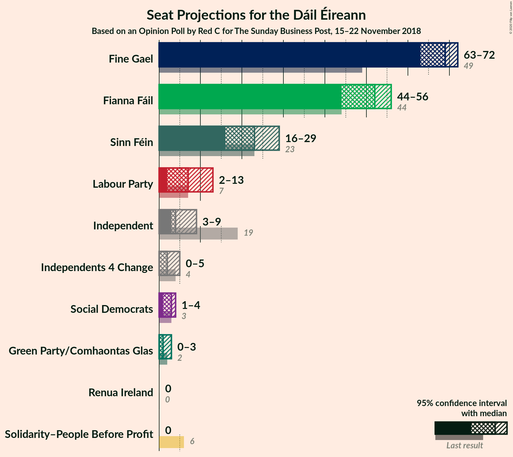
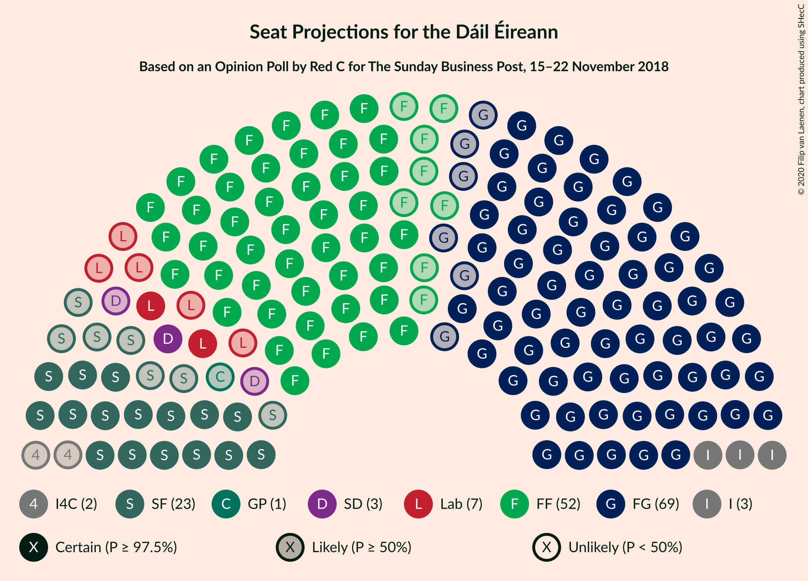
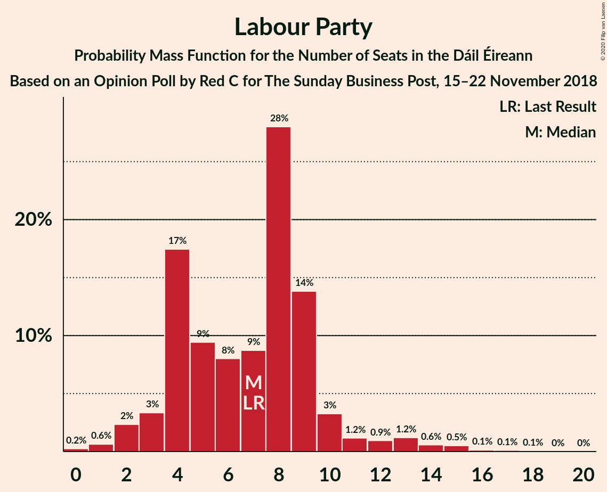
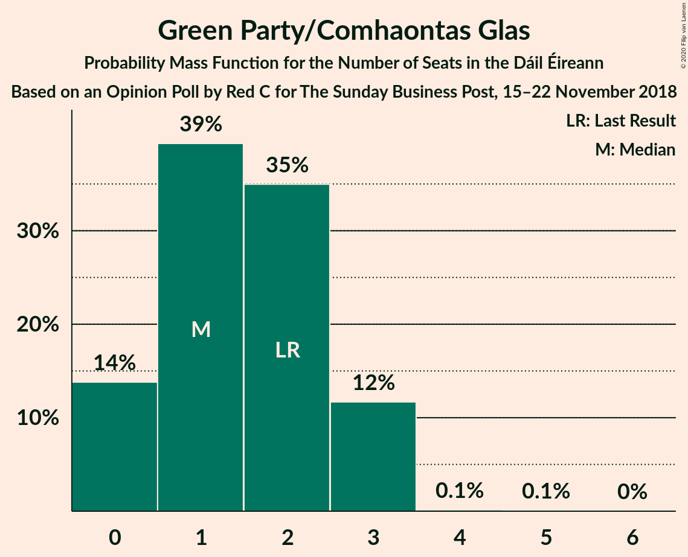
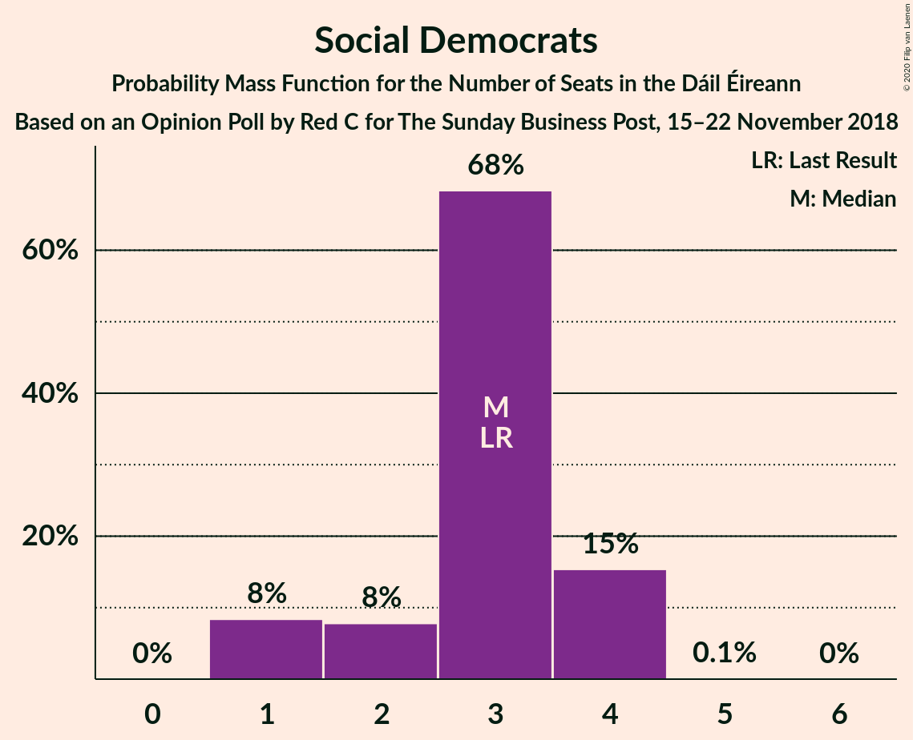
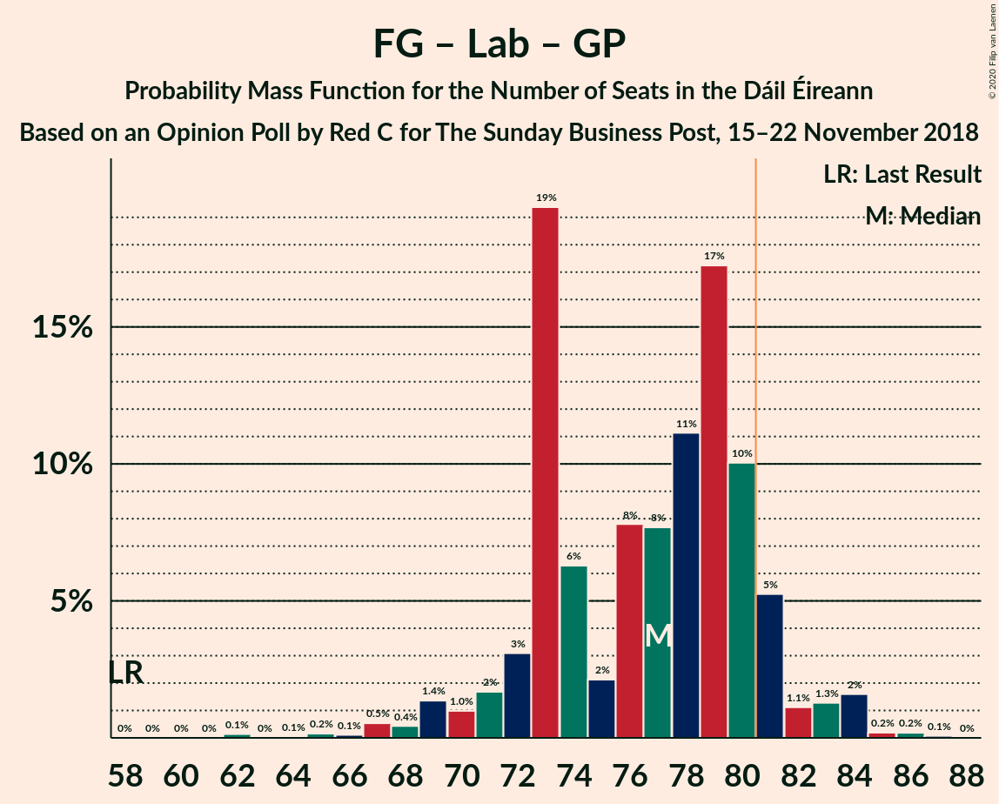
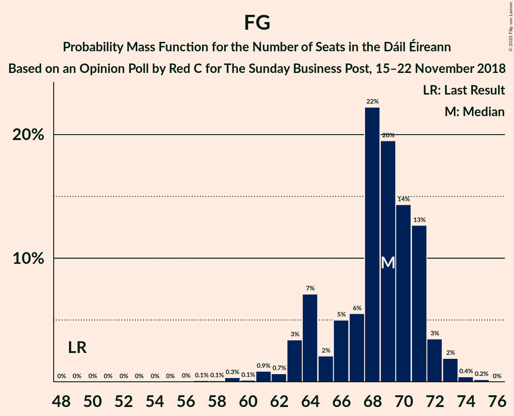

# Opinion Poll by Red C for The Sunday Business Post, 15–22 November 2018

<a href="#voting-intentions">Voting Intentions</a> | <a href="#seats">Seats</a> | <a href="#coalitions">Coalitions</a> | <a href="#technical-information">Technical Information</a>

## Voting Intentions

### Confidence Intervals

| Party | Last Result | Poll Result | 80% Confidence Interval | 90% Confidence Interval | 95% Confidence Interval | 99% Confidence Interval |
|:-----:|:-----------:|:-----------:|:-----------------------:|:-----------------------:|:-----------------------:|:-----------------------:|
| Fine Gael | 25.5% | 33.8% | 31.9–35.8% |31.4–36.3% |30.9–36.8% |30.0–37.7% |
| Fianna Fáil | 24.3% | 26.9% | 25.1–28.8% |24.7–29.3% |24.2–29.7% |23.4–30.7% |
| Sinn Féin | 13.8% | 12.9% | 11.6–14.4% |11.3–14.8% |11.0–15.1% |10.4–15.9% |
| Independent | 15.9% | 8.4% | 7.4–9.6% |7.1–10.0% |6.8–10.3% |6.4–10.9% |
| Labour Party | 6.6% | 6.0% | 5.1–7.1% |4.9–7.4% |4.7–7.7% |4.3–8.2% |
| Green Party/Comhaontas Glas | 2.7% | 3.0% | 2.4–3.8% |2.2–4.1% |2.1–4.3% |1.9–4.7% |
| Social Democrats | 3.0% | 2.0% | 1.5–2.7% |1.4–2.9% |1.3–3.1% |1.1–3.4% |
| Independents 4 Change | 1.5% | 1.1% | 0.8–1.7% |0.7–1.8% |0.6–2.0% |0.5–2.3% |
| Solidarity–People Before Profit | 3.9% | 0.2% | 0.1–0.5% |0.1–0.6% |0.1–0.7% |0.0–0.9% |
| Renua Ireland | 2.2% | 0.2% | 0.1–0.5% |0.1–0.6% |0.1–0.7% |0.0–0.9% |

*Note:* The poll result column reflects the actual value used in the calculations. Published results may vary slightly, and in addition be rounded to fewer digits.

## Seats

### Confidence Intervals

| Party | Last Result | Median | 80% Confidence Interval | 90% Confidence Interval | 95% Confidence Interval | 99% Confidence Interval |
|:-----:|:-----------:|:------:|:-----------------------:|:-----------------------:|:-----------------------:|:-----------------------:|
| <a href="#fine-gael">Fine Gael</a> | 49 | 69 | 64–71 |63–72 |63–72 |59–74 |
| <a href="#fianna-fáil">Fianna Fáil</a> | 44 | 52 | 47–55 |45–55 |44–56 |42–58 |
| <a href="#sinn-féin">Sinn Féin</a> | 23 | 23 | 18–26 |17–28 |16–29 |16–33 |
| <a href="#independent">Independent</a> | 19 | 4 | 3–7 |3–7 |3–9 |3–10 |
| <a href="#labour-party">Labour Party</a> | 7 | 7 | 4–9 |3–10 |2–13 |1–15 |
| <a href="#green-party/comhaontas-glas">Green Party/Comhaontas Glas</a> | 2 | 1 | 0–3 |0–3 |0–3 |0–3 |
| <a href="#social-democrats">Social Democrats</a> | 3 | 3 | 2–4 |1–4 |1–4 |1–4 |
| <a href="#independents-4-change">Independents 4 Change</a> | 4 | 2 | 0–4 |0–4 |0–5 |0–5 |
| <a href="#solidarity–people-before-profit">Solidarity–People Before Profit</a> | 6 | 0 | 0 |0 |0 |0 |
| <a href="#renua-ireland">Renua Ireland</a> | 0 | 0 | 0 |0 |0 |0 |

### Fine Gael

*For a full overview of the results for this party, see the [Fine Gael](party-finegael.html) page.*

| Number of Seats | Probability | Accumulated | Special Marks |
|:---------------:|:-----------:|:-----------:|:-------------:|
| 49 | 0% | 100% | Last Result |
| 50 | 0% | 100% |  |
| 51 | 0% | 100% |  |
| 52 | 0% | 100% |  |
| 53 | 0% | 100% |  |
| 54 | 0% | 100% |  |
| 55 | 0% | 100% |  |
| 56 | 0% | 100% |  |
| 57 | 0.1% | 99.9% |  |
| 58 | 0.1% | 99.8% |  |
| 59 | 0.3% | 99.7% |  |
| 60 | 0.1% | 99.4% |  |
| 61 | 0.9% | 99.3% |  |
| 62 | 0.7% | 98% |  |
| 63 | 3% | 98% |  |
| 64 | 7% | 94% |  |
| 65 | 2% | 87% |  |
| 66 | 5% | 85% |  |
| 67 | 6% | 80% |  |
| 68 | 22% | 75% |  |
| 69 | 20% | 52% | Median |
| 70 | 14% | 33% |  |
| 71 | 13% | 19% |  |
| 72 | 3% | 6% |  |
| 73 | 2% | 2% |  |
| 74 | 0.4% | 0.6% |  |
| 75 | 0.2% | 0.2% |  |
| 76 | 0% | 0% |  |

### Fianna Fáil

*For a full overview of the results for this party, see the [Fianna Fáil](party-fiannafáil.html) page.*

| Number of Seats | Probability | Accumulated | Special Marks |
|:---------------:|:-----------:|:-----------:|:-------------:|
| 41 | 0.3% | 100% |  |
| 42 | 0.3% | 99.7% |  |
| 43 | 0.5% | 99.3% |  |
| 44 | 2% | 98.8% | Last Result |
| 45 | 3% | 97% |  |
| 46 | 2% | 94% |  |
| 47 | 4% | 92% |  |
| 48 | 5% | 88% |  |
| 49 | 12% | 83% |  |
| 50 | 9% | 71% |  |
| 51 | 11% | 62% |  |
| 52 | 20% | 51% | Median |
| 53 | 9% | 31% |  |
| 54 | 9% | 22% |  |
| 55 | 8% | 13% |  |
| 56 | 3% | 5% |  |
| 57 | 1.0% | 1.5% |  |
| 58 | 0.3% | 0.5% |  |
| 59 | 0.2% | 0.2% |  |
| 60 | 0% | 0% |  |

### Sinn Féin

*For a full overview of the results for this party, see the [Sinn Féin](party-sinnféin.html) page.*

| Number of Seats | Probability | Accumulated | Special Marks |
|:---------------:|:-----------:|:-----------:|:-------------:|
| 14 | 0.3% | 100% |  |
| 15 | 0.2% | 99.7% |  |
| 16 | 2% | 99.5% |  |
| 17 | 7% | 97% |  |
| 18 | 3% | 90% |  |
| 19 | 7% | 87% |  |
| 20 | 6% | 80% |  |
| 21 | 5% | 75% |  |
| 22 | 14% | 69% |  |
| 23 | 22% | 55% | Last Result, Median |
| 24 | 6% | 34% |  |
| 25 | 9% | 27% |  |
| 26 | 8% | 18% |  |
| 27 | 2% | 9% |  |
| 28 | 3% | 7% |  |
| 29 | 2% | 4% |  |
| 30 | 0.4% | 2% |  |
| 31 | 0.6% | 2% |  |
| 32 | 0.6% | 1.2% |  |
| 33 | 0.3% | 0.6% |  |
| 34 | 0.2% | 0.3% |  |
| 35 | 0.1% | 0.1% |  |
| 36 | 0% | 0% |  |

### Independent

*For a full overview of the results for this party, see the [Independent](party-independent.html) page.*

| Number of Seats | Probability | Accumulated | Special Marks |
|:---------------:|:-----------:|:-----------:|:-------------:|
| 3 | 38% | 100% |  |
| 4 | 22% | 62% | Median |
| 5 | 17% | 40% |  |
| 6 | 9% | 22% |  |
| 7 | 9% | 13% |  |
| 8 | 1.3% | 5% |  |
| 9 | 1.2% | 3% |  |
| 10 | 2% | 2% |  |
| 11 | 0.3% | 0.3% |  |
| 12 | 0% | 0% |  |
| 13 | 0% | 0% |  |
| 14 | 0% | 0% |  |
| 15 | 0% | 0% |  |
| 16 | 0% | 0% |  |
| 17 | 0% | 0% |  |
| 18 | 0% | 0% |  |
| 19 | 0% | 0% | Last Result |

### Labour Party

*For a full overview of the results for this party, see the [Labour Party](party-labourparty.html) page.*

| Number of Seats | Probability | Accumulated | Special Marks |
|:---------------:|:-----------:|:-----------:|:-------------:|
| 0 | 0.2% | 100% |  |
| 1 | 0.6% | 99.8% |  |
| 2 | 2% | 99.1% |  |
| 3 | 3% | 97% |  |
| 4 | 17% | 93% |  |
| 5 | 9% | 76% |  |
| 6 | 8% | 67% |  |
| 7 | 9% | 59% | Last Result, Median |
| 8 | 28% | 50% |  |
| 9 | 14% | 22% |  |
| 10 | 3% | 8% |  |
| 11 | 1.2% | 5% |  |
| 12 | 0.9% | 4% |  |
| 13 | 1.2% | 3% |  |
| 14 | 0.6% | 1.4% |  |
| 15 | 0.5% | 0.8% |  |
| 16 | 0.1% | 0.3% |  |
| 17 | 0.1% | 0.2% |  |
| 18 | 0.1% | 0.1% |  |
| 19 | 0% | 0% |  |

### Green Party/Comhaontas Glas

*For a full overview of the results for this party, see the [Green Party/Comhaontas Glas](party-greenpartycomhaontasglas.html) page.*

| Number of Seats | Probability | Accumulated | Special Marks |
|:---------------:|:-----------:|:-----------:|:-------------:|
| 0 | 14% | 100% |  |
| 1 | 39% | 86% | Median |
| 2 | 35% | 47% | Last Result |
| 3 | 12% | 12% |  |
| 4 | 0.1% | 0.2% |  |
| 5 | 0.1% | 0.1% |  |
| 6 | 0% | 0% |  |

### Social Democrats

*For a full overview of the results for this party, see the [Social Democrats](party-socialdemocrats.html) page.*

| Number of Seats | Probability | Accumulated | Special Marks |
|:---------------:|:-----------:|:-----------:|:-------------:|
| 1 | 8% | 100% |  |
| 2 | 8% | 92% |  |
| 3 | 68% | 84% | Last Result, Median |
| 4 | 15% | 15% |  |
| 5 | 0.1% | 0.1% |  |
| 6 | 0% | 0% |  |

### Independents 4 Change

*For a full overview of the results for this party, see the [Independents 4 Change](party-independents4change.html) page.*

| Number of Seats | Probability | Accumulated | Special Marks |
|:---------------:|:-----------:|:-----------:|:-------------:|
| 0 | 11% | 100% |  |
| 1 | 24% | 89% |  |
| 2 | 20% | 66% | Median |
| 3 | 12% | 45% |  |
| 4 | 31% | 34% | Last Result |
| 5 | 3% | 3% |  |
| 6 | 0% | 0% |  |

### Solidarity–People Before Profit

*For a full overview of the results for this party, see the [Solidarity–People Before Profit](party-solidarity–peoplebeforeprofit.html) page.*

| Number of Seats | Probability | Accumulated | Special Marks |
|:---------------:|:-----------:|:-----------:|:-------------:|
| 0 | 100% | 100% | Median |
| 1 | 0% | 0% |  |
| 2 | 0% | 0% |  |
| 3 | 0% | 0% |  |
| 4 | 0% | 0% |  |
| 5 | 0% | 0% |  |
| 6 | 0% | 0% | Last Result |

### Renua Ireland

*For a full overview of the results for this party, see the [Renua Ireland](party-renuaireland.html) page.*

| Number of Seats | Probability | Accumulated | Special Marks |
|:---------------:|:-----------:|:-----------:|:-------------:|
| 0 | 100% | 100% | Last Result, Median |

## Coalitions

### Confidence Intervals

| Coalition | Last Result | Median | Majority? | 80% Confidence Interval | 90% Confidence Interval | 95% Confidence Interval | 99% Confidence Interval |
|:---------:|:-----------:|:------:|:---------:|:-----------------------:|:-----------------------:|:-----------------------:|:-----------------------:|
| Fine Gael – Fianna Fáil | 93 | 120 | 100% | 115–123 | 114–124 | 112–125 | 108–127 |
| Fine Gael – Labour Party – Green Party/Comhaontas Glas – Social Democrats | 61 | 80 | 50% | 76–83 | 74–84 | 73–86 | 69–87 |
| Fine Gael – Labour Party – Green Party/Comhaontas Glas | 58 | 77 | 10% | 73–80 | 71–81 | 69–83 | 67–84 |
| Fine Gael – Labour Party | 56 | 76 | 4% | 72–79 | 70–80 | 68–82 | 65–84 |
| Fianna Fáil – Sinn Féin | 67 | 74 | 4% | 69–77 | 68–80 | 66–82 | 65–85 |
| Fine Gael – Green Party/Comhaontas Glas | 51 | 70 | 0% | 65–73 | 64–74 | 64–74 | 60–75 |
| Fine Gael | 49 | 69 | 0% | 64–71 | 63–72 | 63–72 | 59–74 |
| Fianna Fáil – Labour Party – Green Party/Comhaontas Glas – Social Democrats | 56 | 62 | 0% | 58–66 | 58–68 | 56–68 | 54–71 |
| Fianna Fáil – Labour Party – Green Party/Comhaontas Glas | 53 | 59 | 0% | 55–63 | 54–65 | 53–66 | 50–68 |
| Fianna Fáil – Labour Party | 51 | 58 | 0% | 54–63 | 52–64 | 51–65 | 49–68 |
| Fianna Fáil – Green Party/Comhaontas Glas | 46 | 53 | 0% | 49–56 | 47–57 | 46–57 | 43–59 |

### Fine Gael – Fianna Fáil

| Number of Seats | Probability | Accumulated | Special Marks |
|:---------------:|:-----------:|:-----------:|:-------------:|
| 93 | 0% | 100% | Last Result |
| 94 | 0% | 100% |  |
| 95 | 0% | 100% |  |
| 96 | 0% | 100% |  |
| 97 | 0% | 100% |  |
| 98 | 0% | 100% |  |
| 99 | 0% | 100% |  |
| 100 | 0% | 100% |  |
| 101 | 0% | 100% |  |
| 102 | 0% | 100% |  |
| 103 | 0% | 100% |  |
| 104 | 0% | 100% |  |
| 105 | 0% | 100% |  |
| 106 | 0% | 100% |  |
| 107 | 0.2% | 99.9% |  |
| 108 | 0.3% | 99.7% |  |
| 109 | 0.1% | 99.4% |  |
| 110 | 0.2% | 99.3% |  |
| 111 | 0.6% | 99.1% |  |
| 112 | 2% | 98% |  |
| 113 | 0.8% | 97% |  |
| 114 | 3% | 96% |  |
| 115 | 5% | 93% |  |
| 116 | 3% | 88% |  |
| 117 | 8% | 85% |  |
| 118 | 14% | 77% |  |
| 119 | 10% | 64% |  |
| 120 | 21% | 53% |  |
| 121 | 8% | 32% | Median |
| 122 | 10% | 25% |  |
| 123 | 6% | 15% |  |
| 124 | 5% | 9% |  |
| 125 | 2% | 4% |  |
| 126 | 0.8% | 1.3% |  |
| 127 | 0.3% | 0.6% |  |
| 128 | 0.3% | 0.3% |  |
| 129 | 0% | 0% |  |

### Fine Gael – Labour Party – Green Party/Comhaontas Glas – Social Democrats

| Number of Seats | Probability | Accumulated | Special Marks |
|:---------------:|:-----------:|:-----------:|:-------------:|
| 61 | 0% | 100% | Last Result |
| 62 | 0% | 100% |  |
| 63 | 0% | 100% |  |
| 64 | 0% | 100% |  |
| 65 | 0% | 100% |  |
| 66 | 0.2% | 100% |  |
| 67 | 0.1% | 99.8% |  |
| 68 | 0.2% | 99.8% |  |
| 69 | 0.1% | 99.6% |  |
| 70 | 0.3% | 99.5% |  |
| 71 | 0.4% | 99.2% |  |
| 72 | 0.4% | 98.7% |  |
| 73 | 2% | 98% |  |
| 74 | 2% | 96% |  |
| 75 | 2% | 94% |  |
| 76 | 20% | 92% |  |
| 77 | 7% | 72% |  |
| 78 | 4% | 65% |  |
| 79 | 6% | 61% |  |
| 80 | 5% | 54% | Median |
| 81 | 19% | 50% | Majority |
| 82 | 12% | 31% |  |
| 83 | 9% | 19% |  |
| 84 | 5% | 10% |  |
| 85 | 1.5% | 5% |  |
| 86 | 1.1% | 3% |  |
| 87 | 2% | 2% |  |
| 88 | 0.2% | 0.5% |  |
| 89 | 0.2% | 0.3% |  |
| 90 | 0.1% | 0.1% |  |
| 91 | 0% | 0% |  |

### Fine Gael – Labour Party – Green Party/Comhaontas Glas

| Number of Seats | Probability | Accumulated | Special Marks |
|:---------------:|:-----------:|:-----------:|:-------------:|
| 58 | 0% | 100% | Last Result |
| 59 | 0% | 100% |  |
| 60 | 0% | 100% |  |
| 61 | 0% | 100% |  |
| 62 | 0.1% | 100% |  |
| 63 | 0% | 99.9% |  |
| 64 | 0.1% | 99.8% |  |
| 65 | 0.2% | 99.8% |  |
| 66 | 0.1% | 99.6% |  |
| 67 | 0.5% | 99.5% |  |
| 68 | 0.4% | 99.0% |  |
| 69 | 1.4% | 98.5% |  |
| 70 | 1.0% | 97% |  |
| 71 | 2% | 96% |  |
| 72 | 3% | 95% |  |
| 73 | 19% | 91% |  |
| 74 | 6% | 72% |  |
| 75 | 2% | 66% |  |
| 76 | 8% | 64% |  |
| 77 | 8% | 56% | Median |
| 78 | 11% | 48% |  |
| 79 | 17% | 37% |  |
| 80 | 10% | 20% |  |
| 81 | 5% | 10% | Majority |
| 82 | 1.1% | 4% |  |
| 83 | 1.3% | 3% |  |
| 84 | 2% | 2% |  |
| 85 | 0.2% | 0.5% |  |
| 86 | 0.2% | 0.3% |  |
| 87 | 0.1% | 0.1% |  |
| 88 | 0% | 0% |  |

### Fine Gael – Labour Party

| Number of Seats | Probability | Accumulated | Special Marks |
|:---------------:|:-----------:|:-----------:|:-------------:|
| 56 | 0% | 100% | Last Result |
| 57 | 0% | 100% |  |
| 58 | 0% | 100% |  |
| 59 | 0% | 100% |  |
| 60 | 0% | 100% |  |
| 61 | 0.1% | 100% |  |
| 62 | 0% | 99.9% |  |
| 63 | 0.1% | 99.8% |  |
| 64 | 0.1% | 99.7% |  |
| 65 | 0.4% | 99.6% |  |
| 66 | 0.4% | 99.3% |  |
| 67 | 0.8% | 98.9% |  |
| 68 | 2% | 98% |  |
| 69 | 0.7% | 97% |  |
| 70 | 2% | 96% |  |
| 71 | 3% | 94% |  |
| 72 | 19% | 91% |  |
| 73 | 9% | 72% |  |
| 74 | 6% | 63% |  |
| 75 | 4% | 57% |  |
| 76 | 9% | 52% | Median |
| 77 | 21% | 44% |  |
| 78 | 9% | 23% |  |
| 79 | 8% | 14% |  |
| 80 | 2% | 7% |  |
| 81 | 1.2% | 4% | Majority |
| 82 | 2% | 3% |  |
| 83 | 0.5% | 1.1% |  |
| 84 | 0.3% | 0.6% |  |
| 85 | 0.2% | 0.3% |  |
| 86 | 0% | 0.1% |  |
| 87 | 0% | 0% |  |

### Fianna Fáil – Sinn Féin

| Number of Seats | Probability | Accumulated | Special Marks |
|:---------------:|:-----------:|:-----------:|:-------------:|
| 62 | 0% | 100% |  |
| 63 | 0.1% | 99.9% |  |
| 64 | 0.2% | 99.8% |  |
| 65 | 1.1% | 99.6% |  |
| 66 | 1.5% | 98% |  |
| 67 | 2% | 97% | Last Result |
| 68 | 3% | 95% |  |
| 69 | 3% | 92% |  |
| 70 | 7% | 89% |  |
| 71 | 9% | 82% |  |
| 72 | 9% | 73% |  |
| 73 | 7% | 64% |  |
| 74 | 10% | 57% |  |
| 75 | 27% | 47% | Median |
| 76 | 3% | 21% |  |
| 77 | 9% | 18% |  |
| 78 | 2% | 10% |  |
| 79 | 2% | 7% |  |
| 80 | 2% | 6% |  |
| 81 | 1.5% | 4% | Majority |
| 82 | 1.0% | 3% |  |
| 83 | 0.9% | 2% |  |
| 84 | 0.1% | 0.7% |  |
| 85 | 0.2% | 0.6% |  |
| 86 | 0.2% | 0.4% |  |
| 87 | 0.1% | 0.2% |  |
| 88 | 0% | 0.2% |  |
| 89 | 0.1% | 0.1% |  |
| 90 | 0% | 0% |  |

### Fine Gael – Green Party/Comhaontas Glas

| Number of Seats | Probability | Accumulated | Special Marks |
|:---------------:|:-----------:|:-----------:|:-------------:|
| 51 | 0% | 100% | Last Result |
| 52 | 0% | 100% |  |
| 53 | 0% | 100% |  |
| 54 | 0% | 100% |  |
| 55 | 0% | 100% |  |
| 56 | 0% | 100% |  |
| 57 | 0.1% | 100% |  |
| 58 | 0% | 99.9% |  |
| 59 | 0.1% | 99.8% |  |
| 60 | 0.3% | 99.8% |  |
| 61 | 0.2% | 99.4% |  |
| 62 | 0.3% | 99.2% |  |
| 63 | 0.9% | 98.9% |  |
| 64 | 6% | 98% |  |
| 65 | 4% | 92% |  |
| 66 | 3% | 88% |  |
| 67 | 4% | 85% |  |
| 68 | 6% | 81% |  |
| 69 | 16% | 75% |  |
| 70 | 10% | 59% | Median |
| 71 | 23% | 49% |  |
| 72 | 13% | 26% |  |
| 73 | 7% | 14% |  |
| 74 | 5% | 7% |  |
| 75 | 2% | 2% |  |
| 76 | 0.2% | 0.4% |  |
| 77 | 0.2% | 0.2% |  |
| 78 | 0% | 0% |  |

### Fine Gael

| Number of Seats | Probability | Accumulated | Special Marks |
|:---------------:|:-----------:|:-----------:|:-------------:|
| 49 | 0% | 100% | Last Result |
| 50 | 0% | 100% |  |
| 51 | 0% | 100% |  |
| 52 | 0% | 100% |  |
| 53 | 0% | 100% |  |
| 54 | 0% | 100% |  |
| 55 | 0% | 100% |  |
| 56 | 0% | 100% |  |
| 57 | 0.1% | 99.9% |  |
| 58 | 0.1% | 99.8% |  |
| 59 | 0.3% | 99.7% |  |
| 60 | 0.1% | 99.4% |  |
| 61 | 0.9% | 99.3% |  |
| 62 | 0.7% | 98% |  |
| 63 | 3% | 98% |  |
| 64 | 7% | 94% |  |
| 65 | 2% | 87% |  |
| 66 | 5% | 85% |  |
| 67 | 6% | 80% |  |
| 68 | 22% | 75% |  |
| 69 | 20% | 52% | Median |
| 70 | 14% | 33% |  |
| 71 | 13% | 19% |  |
| 72 | 3% | 6% |  |
| 73 | 2% | 2% |  |
| 74 | 0.4% | 0.6% |  |
| 75 | 0.2% | 0.2% |  |
| 76 | 0% | 0% |  |

### Fianna Fáil – Labour Party – Green Party/Comhaontas Glas – Social Democrats

| Number of Seats | Probability | Accumulated | Special Marks |
|:---------------:|:-----------:|:-----------:|:-------------:|
| 50 | 0.2% | 100% |  |
| 51 | 0% | 99.8% |  |
| 52 | 0.1% | 99.8% |  |
| 53 | 0.2% | 99.8% |  |
| 54 | 0.3% | 99.6% |  |
| 55 | 1.2% | 99.3% |  |
| 56 | 2% | 98% | Last Result |
| 57 | 1.5% | 97% |  |
| 58 | 6% | 95% |  |
| 59 | 4% | 89% |  |
| 60 | 19% | 85% |  |
| 61 | 8% | 66% |  |
| 62 | 14% | 58% |  |
| 63 | 10% | 45% | Median |
| 64 | 7% | 35% |  |
| 65 | 13% | 28% |  |
| 66 | 7% | 15% |  |
| 67 | 2% | 7% |  |
| 68 | 3% | 5% |  |
| 69 | 1.1% | 2% |  |
| 70 | 0.4% | 1.4% |  |
| 71 | 0.8% | 1.0% |  |
| 72 | 0.1% | 0.2% |  |
| 73 | 0.1% | 0.2% |  |
| 74 | 0% | 0.1% |  |
| 75 | 0% | 0% |  |

### Fianna Fáil – Labour Party – Green Party/Comhaontas Glas

| Number of Seats | Probability | Accumulated | Special Marks |
|:---------------:|:-----------:|:-----------:|:-------------:|
| 47 | 0.2% | 100% |  |
| 48 | 0% | 99.8% |  |
| 49 | 0.1% | 99.8% |  |
| 50 | 0.2% | 99.7% |  |
| 51 | 0.2% | 99.5% |  |
| 52 | 2% | 99.3% |  |
| 53 | 1.3% | 98% | Last Result |
| 54 | 2% | 96% |  |
| 55 | 5% | 94% |  |
| 56 | 2% | 89% |  |
| 57 | 22% | 88% |  |
| 58 | 6% | 66% |  |
| 59 | 15% | 60% |  |
| 60 | 8% | 44% | Median |
| 61 | 8% | 36% |  |
| 62 | 8% | 28% |  |
| 63 | 13% | 20% |  |
| 64 | 2% | 7% |  |
| 65 | 3% | 5% |  |
| 66 | 1.1% | 3% |  |
| 67 | 0.3% | 1.5% |  |
| 68 | 0.9% | 1.1% |  |
| 69 | 0.1% | 0.3% |  |
| 70 | 0.1% | 0.2% |  |
| 71 | 0% | 0.1% |  |
| 72 | 0% | 0% |  |

### Fianna Fáil – Labour Party

| Number of Seats | Probability | Accumulated | Special Marks |
|:---------------:|:-----------:|:-----------:|:-------------:|
| 46 | 0.1% | 100% |  |
| 47 | 0.1% | 99.9% |  |
| 48 | 0.2% | 99.8% |  |
| 49 | 0.2% | 99.5% |  |
| 50 | 1.0% | 99.3% |  |
| 51 | 2% | 98% | Last Result |
| 52 | 2% | 96% |  |
| 53 | 3% | 94% |  |
| 54 | 5% | 91% |  |
| 55 | 5% | 86% |  |
| 56 | 18% | 81% |  |
| 57 | 13% | 63% |  |
| 58 | 12% | 50% |  |
| 59 | 6% | 38% | Median |
| 60 | 10% | 32% |  |
| 61 | 9% | 23% |  |
| 62 | 2% | 13% |  |
| 63 | 6% | 12% |  |
| 64 | 2% | 6% |  |
| 65 | 1.3% | 3% |  |
| 66 | 0.8% | 2% |  |
| 67 | 0.4% | 1.1% |  |
| 68 | 0.5% | 0.7% |  |
| 69 | 0% | 0.2% |  |
| 70 | 0.1% | 0.1% |  |
| 71 | 0% | 0.1% |  |
| 72 | 0% | 0% |  |

### Fianna Fáil – Green Party/Comhaontas Glas

| Number of Seats | Probability | Accumulated | Special Marks |
|:---------------:|:-----------:|:-----------:|:-------------:|
| 42 | 0.3% | 100% |  |
| 43 | 0.3% | 99.7% |  |
| 44 | 0.4% | 99.4% |  |
| 45 | 1.2% | 99.0% |  |
| 46 | 1.3% | 98% | Last Result |
| 47 | 4% | 97% |  |
| 48 | 1.2% | 93% |  |
| 49 | 5% | 92% |  |
| 50 | 5% | 87% |  |
| 51 | 18% | 82% |  |
| 52 | 7% | 64% |  |
| 53 | 21% | 56% | Median |
| 54 | 10% | 35% |  |
| 55 | 11% | 26% |  |
| 56 | 6% | 14% |  |
| 57 | 6% | 8% |  |
| 58 | 1.4% | 2% |  |
| 59 | 0.4% | 0.6% |  |
| 60 | 0.1% | 0.2% |  |
| 61 | 0.1% | 0.2% |  |
| 62 | 0% | 0% |  |

## Technical Information

### Opinion Poll

+ **Polling firm:** Red C
+ **Commissioner(s):** The Sunday Business Post
+ **Fieldwork period:** 15–22 November 2018

### Calculations

+ **Sample size:** 1000
+ **Simulations done:** 1,048,576
+ **Error estimate:** 2.23%

