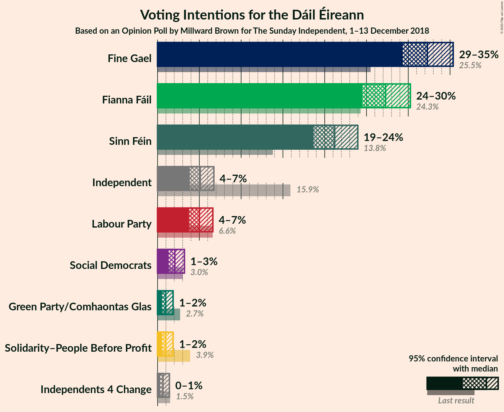
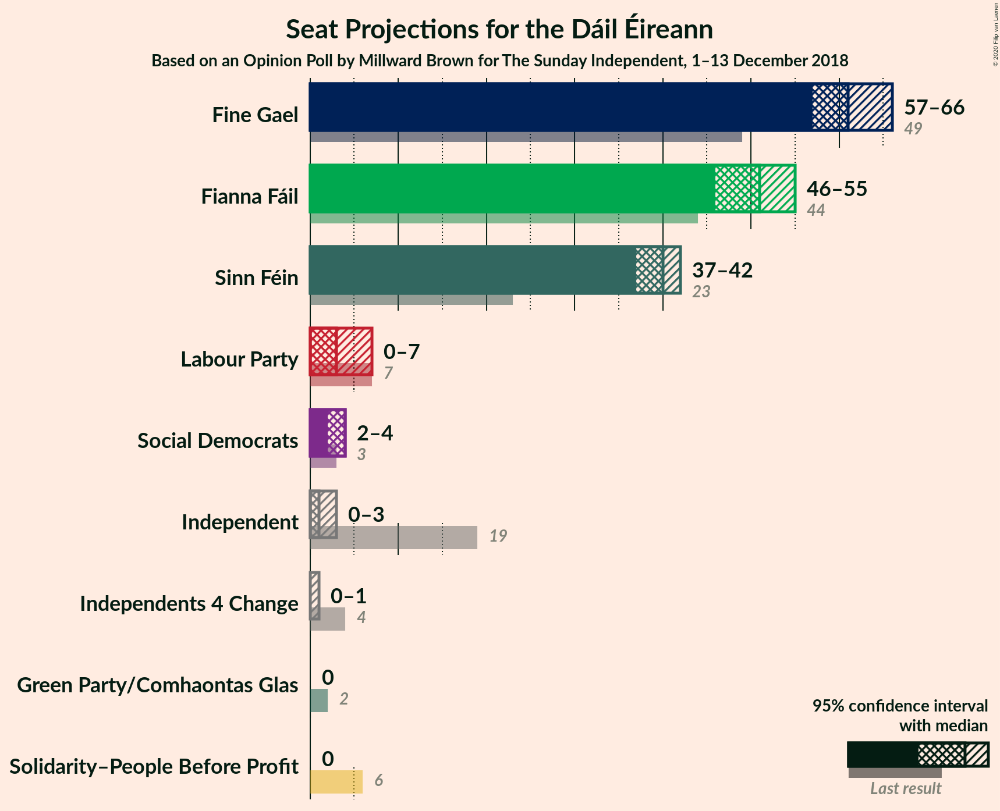
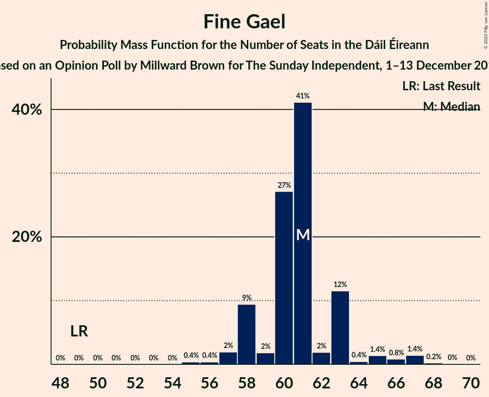
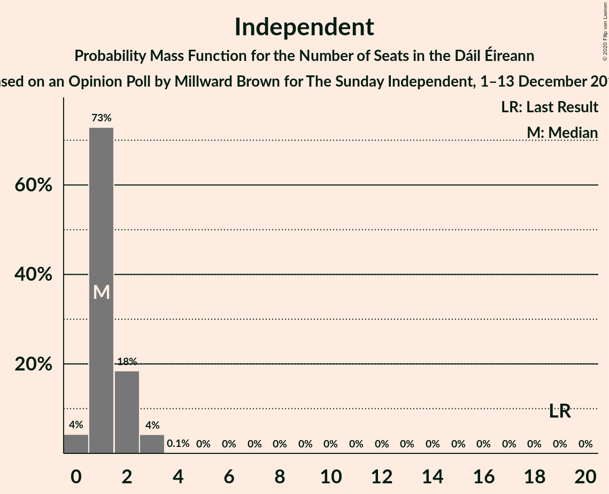
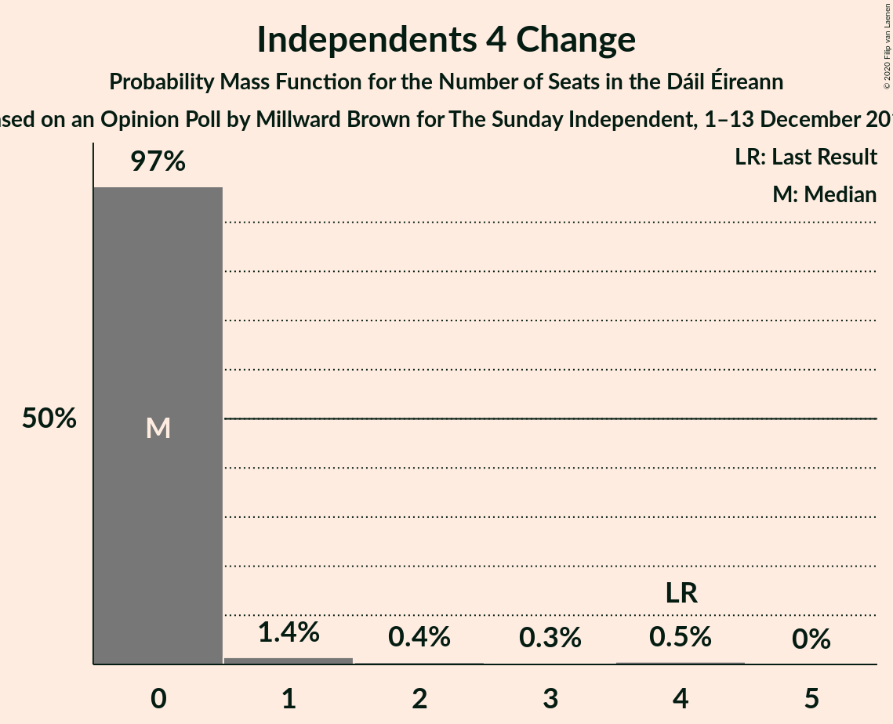
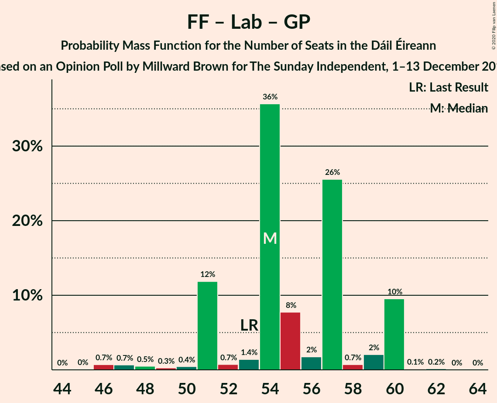

# Opinion Poll by Millward Brown for The Sunday Independent, 1–13 December 2018

<a href="#voting-intentions">Voting Intentions</a> | <a href="#seats">Seats</a> | <a href="#coalitions">Coalitions</a> | <a href="#technical-information">Technical Information</a>

## Voting Intentions

### Confidence Intervals

| Party | Last Result | Poll Result | 80% Confidence Interval | 90% Confidence Interval | 95% Confidence Interval | 99% Confidence Interval |
|:-----:|:-----------:|:-----------:|:-----------------------:|:-----------------------:|:-----------------------:|:-----------------------:|
| Fine Gael | 25.5% | 32.3% | 30.3–34.3% |29.8–34.9% |29.3–35.4% |28.4–36.4% |
| Fianna Fáil | 24.3% | 27.3% | 25.5–29.2% |24.9–29.8% |24.5–30.3% |23.6–31.2% |
| Sinn Féin | 13.8% | 21.2% | 19.5–23.0% |19.1–23.5% |18.7–24.0% |17.9–24.8% |
| Independent | 15.9% | 5.1% | 4.3–6.2% |4.1–6.5% |3.9–6.7% |3.5–7.3% |
| Labour Party | 6.6% | 5.0% | 4.2–6.1% |4.0–6.4% |3.8–6.6% |3.4–7.1% |
| Social Democrats | 3.0% | 2.1% | 1.6–2.8% |1.4–3.0% |1.3–3.2% |1.1–3.6% |
| Solidarity–People Before Profit | 3.9% | 1.0% | 0.7–1.5% |0.6–1.7% |0.5–1.9% |0.4–2.2% |
| Green Party/Comhaontas Glas | 2.7% | 1.0% | 0.7–1.5% |0.6–1.7% |0.5–1.9% |0.4–2.2% |
| Independents 4 Change | 1.5% | 0.7% | 0.4–1.1% |0.4–1.3% |0.3–1.4% |0.2–1.7% |

*Note:* The poll result column reflects the actual value used in the calculations. Published results may vary slightly, and in addition be rounded to fewer digits.

## Seats

### Confidence Intervals

| Party | Last Result | Median | 80% Confidence Interval | 90% Confidence Interval | 95% Confidence Interval | 99% Confidence Interval |
|:-----:|:-----------:|:------:|:-----------------------:|:-----------------------:|:-----------------------:|:-----------------------:|
| <a href="#fine-gael">Fine Gael</a> | 49 | 61 | 58–63 |58–63 |57–66 |56–67 |
| <a href="#fianna-fáil">Fianna Fáil</a> | 44 | 51 | 50–53 |50–54 |46–55 |43–58 |
| <a href="#sinn-féin">Sinn Féin</a> | 23 | 40 | 38–40 |38–40 |37–42 |36–45 |
| <a href="#independent">Independent</a> | 19 | 1 | 1–2 |1–2 |0–3 |0–3 |
| <a href="#labour-party">Labour Party</a> | 7 | 3 | 0–7 |0–7 |0–7 |0–8 |
| <a href="#social-democrats">Social Democrats</a> | 3 | 4 | 2–4 |2–4 |2–4 |1–4 |
| <a href="#solidarity–people-before-profit">Solidarity–People Before Profit</a> | 6 | 0 | 0 |0 |0 |0 |
| <a href="#green-party/comhaontas-glas">Green Party/Comhaontas Glas</a> | 2 | 0 | 0 |0 |0 |0 |
| <a href="#independents-4-change">Independents 4 Change</a> | 4 | 0 | 0 |0 |0–1 |0–4 |

### Fine Gael

*For a full overview of the results for this party, see the [Fine Gael](party-finegael.html) page.*

| Number of Seats | Probability | Accumulated | Special Marks |
|:---------------:|:-----------:|:-----------:|:-------------:|
| 49 | 0% | 100% | Last Result |
| 50 | 0% | 100% |  |
| 51 | 0% | 100% |  |
| 52 | 0% | 100% |  |
| 53 | 0% | 100% |  |
| 54 | 0% | 100% |  |
| 55 | 0.4% | 99.9% |  |
| 56 | 0.4% | 99.6% |  |
| 57 | 2% | 99.2% |  |
| 58 | 9% | 97% |  |
| 59 | 2% | 88% |  |
| 60 | 27% | 86% |  |
| 61 | 41% | 59% | Median |
| 62 | 2% | 18% |  |
| 63 | 12% | 16% |  |
| 64 | 0.4% | 4% |  |
| 65 | 1.4% | 4% |  |
| 66 | 0.8% | 3% |  |
| 67 | 1.4% | 2% |  |
| 68 | 0.2% | 0.3% |  |
| 69 | 0% | 0.1% |  |
| 70 | 0% | 0% |  |

### Fianna Fáil

*For a full overview of the results for this party, see the [Fianna Fáil](party-fiannafáil.html) page.*

| Number of Seats | Probability | Accumulated | Special Marks |
|:---------------:|:-----------:|:-----------:|:-------------:|
| 42 | 0.3% | 100% |  |
| 43 | 0.3% | 99.7% |  |
| 44 | 0.8% | 99.4% | Last Result |
| 45 | 0.7% | 98.7% |  |
| 46 | 0.8% | 98% |  |
| 47 | 1.3% | 97% |  |
| 48 | 0.3% | 96% |  |
| 49 | 0.4% | 96% |  |
| 50 | 25% | 95% |  |
| 51 | 53% | 70% | Median |
| 52 | 3% | 17% |  |
| 53 | 9% | 14% |  |
| 54 | 2% | 5% |  |
| 55 | 1.4% | 3% |  |
| 56 | 0.4% | 2% |  |
| 57 | 0.1% | 1.3% |  |
| 58 | 1.2% | 1.2% |  |
| 59 | 0% | 0% |  |

### Sinn Féin

*For a full overview of the results for this party, see the [Sinn Féin](party-sinnféin.html) page.*

| Number of Seats | Probability | Accumulated | Special Marks |
|:---------------:|:-----------:|:-----------:|:-------------:|
| 23 | 0% | 100% | Last Result |
| 24 | 0% | 100% |  |
| 25 | 0% | 100% |  |
| 26 | 0% | 100% |  |
| 27 | 0% | 100% |  |
| 28 | 0% | 100% |  |
| 29 | 0% | 100% |  |
| 30 | 0% | 100% |  |
| 31 | 0% | 100% |  |
| 32 | 0% | 100% |  |
| 33 | 0% | 100% |  |
| 34 | 0% | 100% |  |
| 35 | 0.2% | 100% |  |
| 36 | 0.6% | 99.7% |  |
| 37 | 3% | 99.2% |  |
| 38 | 9% | 96% |  |
| 39 | 33% | 87% |  |
| 40 | 49% | 54% | Median |
| 41 | 1.2% | 5% |  |
| 42 | 2% | 4% |  |
| 43 | 0.9% | 2% |  |
| 44 | 0.3% | 0.8% |  |
| 45 | 0.3% | 0.5% |  |
| 46 | 0.2% | 0.2% |  |
| 47 | 0% | 0% |  |

### Independent

*For a full overview of the results for this party, see the [Independent](party-independent.html) page.*

| Number of Seats | Probability | Accumulated | Special Marks |
|:---------------:|:-----------:|:-----------:|:-------------:|
| 0 | 4% | 100% |  |
| 1 | 73% | 96% | Median |
| 2 | 18% | 23% |  |
| 3 | 4% | 4% |  |
| 4 | 0.1% | 0.1% |  |
| 5 | 0% | 0% |  |
| 6 | 0% | 0% |  |
| 7 | 0% | 0% |  |
| 8 | 0% | 0% |  |
| 9 | 0% | 0% |  |
| 10 | 0% | 0% |  |
| 11 | 0% | 0% |  |
| 12 | 0% | 0% |  |
| 13 | 0% | 0% |  |
| 14 | 0% | 0% |  |
| 15 | 0% | 0% |  |
| 16 | 0% | 0% |  |
| 17 | 0% | 0% |  |
| 18 | 0% | 0% |  |
| 19 | 0% | 0% | Last Result |

### Labour Party

*For a full overview of the results for this party, see the [Labour Party](party-labourparty.html) page.*

| Number of Seats | Probability | Accumulated | Special Marks |
|:---------------:|:-----------:|:-----------:|:-------------:|
| 0 | 12% | 100% |  |
| 1 | 0.7% | 88% |  |
| 2 | 4% | 87% |  |
| 3 | 37% | 84% | Median |
| 4 | 10% | 46% |  |
| 5 | 2% | 36% |  |
| 6 | 0.7% | 34% |  |
| 7 | 31% | 33% | Last Result |
| 8 | 2% | 2% |  |
| 9 | 0.1% | 0.2% |  |
| 10 | 0.1% | 0.1% |  |
| 11 | 0% | 0% |  |

### Social Democrats

*For a full overview of the results for this party, see the [Social Democrats](party-socialdemocrats.html) page.*

| Number of Seats | Probability | Accumulated | Special Marks |
|:---------------:|:-----------:|:-----------:|:-------------:|
| 0 | 0.3% | 100% |  |
| 1 | 0.6% | 99.7% |  |
| 2 | 11% | 99.0% |  |
| 3 | 32% | 88% | Last Result |
| 4 | 56% | 57% | Median |
| 5 | 0.1% | 0.1% |  |
| 6 | 0% | 0% |  |

### Solidarity–People Before Profit

*For a full overview of the results for this party, see the [Solidarity–People Before Profit](party-solidarity–peoplebeforeprofit.html) page.*

| Number of Seats | Probability | Accumulated | Special Marks |
|:---------------:|:-----------:|:-----------:|:-------------:|
| 0 | 99.6% | 100% | Median |
| 1 | 0.3% | 0.4% |  |
| 2 | 0% | 0.1% |  |
| 3 | 0% | 0% |  |
| 4 | 0% | 0% |  |
| 5 | 0% | 0% |  |
| 6 | 0% | 0% | Last Result |

### Green Party/Comhaontas Glas

*For a full overview of the results for this party, see the [Green Party/Comhaontas Glas](party-greenpartycomhaontasglas.html) page.*

| Number of Seats | Probability | Accumulated | Special Marks |
|:---------------:|:-----------:|:-----------:|:-------------:|
| 0 | 100% | 100% | Median |
| 1 | 0% | 0% |  |
| 2 | 0% | 0% | Last Result |

### Independents 4 Change

*For a full overview of the results for this party, see the [Independents 4 Change](party-independents4change.html) page.*

| Number of Seats | Probability | Accumulated | Special Marks |
|:---------------:|:-----------:|:-----------:|:-------------:|
| 0 | 97% | 100% | Median |
| 1 | 1.4% | 3% |  |
| 2 | 0.4% | 1.3% |  |
| 3 | 0.3% | 0.8% |  |
| 4 | 0.5% | 0.5% | Last Result |
| 5 | 0% | 0% |  |

## Coalitions

### Confidence Intervals

| Coalition | Last Result | Median | Majority? | 80% Confidence Interval | 90% Confidence Interval | 95% Confidence Interval | 99% Confidence Interval |
|:---------:|:-----------:|:------:|:---------:|:-----------------------:|:-----------------------:|:-----------------------:|:-----------------------:|
| Fine Gael – Fianna Fáil | 93 | 112 | 100% | 110–114 | 110–114 | 110–115 | 108–116 |
| Fianna Fáil – Sinn Féin | 67 | 91 | 99.9% | 89–92 | 88–93 | 85–96 | 82–96 |
| Fine Gael – Labour Party – Social Democrats – Green Party/Comhaontas Glas | 61 | 68 | 0% | 67–70 | 66–70 | 64–72 | 63–74 |
| Fine Gael – Labour Party – Green Party/Comhaontas Glas | 58 | 64 | 0% | 63–67 | 62–67 | 60–69 | 59–72 |
| Fine Gael – Labour Party | 56 | 64 | 0% | 63–67 | 62–67 | 60–69 | 59–72 |
| Fine Gael | 49 | 61 | 0% | 58–63 | 58–63 | 57–66 | 56–67 |
| Fine Gael – Green Party/Comhaontas Glas | 51 | 61 | 0% | 58–63 | 58–63 | 57–66 | 56–67 |
| Fianna Fáil – Labour Party – Social Democrats – Green Party/Comhaontas Glas | 56 | 58 | 0% | 55–62 | 55–62 | 53–63 | 49–64 |
| Fianna Fáil – Labour Party – Green Party/Comhaontas Glas | 53 | 54 | 0% | 51–59 | 51–60 | 50–60 | 46–60 |
| Fianna Fáil – Labour Party | 51 | 54 | 0% | 51–59 | 51–60 | 50–60 | 46–60 |
| Fianna Fáil – Green Party/Comhaontas Glas | 46 | 51 | 0% | 50–53 | 50–54 | 46–55 | 43–58 |

### Fine Gael – Fianna Fáil

| Number of Seats | Probability | Accumulated | Special Marks |
|:---------------:|:-----------:|:-----------:|:-------------:|
| 93 | 0% | 100% | Last Result |
| 94 | 0% | 100% |  |
| 95 | 0% | 100% |  |
| 96 | 0% | 100% |  |
| 97 | 0% | 100% |  |
| 98 | 0% | 100% |  |
| 99 | 0% | 100% |  |
| 100 | 0% | 100% |  |
| 101 | 0% | 100% |  |
| 102 | 0% | 100% |  |
| 103 | 0.1% | 100% |  |
| 104 | 0.1% | 99.9% |  |
| 105 | 0.1% | 99.8% |  |
| 106 | 0% | 99.7% |  |
| 107 | 0.1% | 99.7% |  |
| 108 | 0.5% | 99.6% |  |
| 109 | 0.9% | 99.1% |  |
| 110 | 25% | 98% |  |
| 111 | 12% | 73% |  |
| 112 | 43% | 61% | Median |
| 113 | 1.4% | 18% |  |
| 114 | 14% | 17% |  |
| 115 | 2% | 3% |  |
| 116 | 0.7% | 0.9% |  |
| 117 | 0% | 0.2% |  |
| 118 | 0.1% | 0.1% |  |
| 119 | 0% | 0% |  |

### Fianna Fáil – Sinn Féin

| Number of Seats | Probability | Accumulated | Special Marks |
|:---------------:|:-----------:|:-----------:|:-------------:|
| 67 | 0% | 100% | Last Result |
| 68 | 0% | 100% |  |
| 69 | 0% | 100% |  |
| 70 | 0% | 100% |  |
| 71 | 0% | 100% |  |
| 72 | 0% | 100% |  |
| 73 | 0% | 100% |  |
| 74 | 0% | 100% |  |
| 75 | 0% | 100% |  |
| 76 | 0% | 100% |  |
| 77 | 0% | 100% |  |
| 78 | 0% | 100% |  |
| 79 | 0% | 100% |  |
| 80 | 0.1% | 100% |  |
| 81 | 0.1% | 99.9% | Majority |
| 82 | 0.6% | 99.8% |  |
| 83 | 0.1% | 99.2% |  |
| 84 | 0.4% | 99.2% |  |
| 85 | 1.5% | 98.8% |  |
| 86 | 0.9% | 97% |  |
| 87 | 0.8% | 96% |  |
| 88 | 0.9% | 96% |  |
| 89 | 30% | 95% |  |
| 90 | 0.6% | 65% |  |
| 91 | 49% | 64% | Median |
| 92 | 10% | 16% |  |
| 93 | 2% | 6% |  |
| 94 | 0.6% | 3% |  |
| 95 | 0.3% | 3% |  |
| 96 | 2% | 3% |  |
| 97 | 0.2% | 0.2% |  |
| 98 | 0% | 0% |  |

### Fine Gael – Labour Party – Social Democrats – Green Party/Comhaontas Glas

| Number of Seats | Probability | Accumulated | Special Marks |
|:---------------:|:-----------:|:-----------:|:-------------:|
| 61 | 0.2% | 100% | Last Result |
| 62 | 0% | 99.8% |  |
| 63 | 2% | 99.7% |  |
| 64 | 1.0% | 98% |  |
| 65 | 2% | 97% |  |
| 66 | 2% | 95% |  |
| 67 | 20% | 93% |  |
| 68 | 39% | 74% | Median |
| 69 | 6% | 35% |  |
| 70 | 25% | 29% |  |
| 71 | 0.7% | 4% |  |
| 72 | 2% | 3% |  |
| 73 | 0.4% | 2% |  |
| 74 | 0.8% | 1.3% |  |
| 75 | 0.4% | 0.5% |  |
| 76 | 0% | 0.1% |  |
| 77 | 0% | 0% |  |

### Fine Gael – Labour Party – Green Party/Comhaontas Glas

| Number of Seats | Probability | Accumulated | Special Marks |
|:---------------:|:-----------:|:-----------:|:-------------:|
| 57 | 0.2% | 100% |  |
| 58 | 0% | 99.8% | Last Result |
| 59 | 2% | 99.8% |  |
| 60 | 1.1% | 98% |  |
| 61 | 0.7% | 97% |  |
| 62 | 2% | 96% |  |
| 63 | 12% | 95% |  |
| 64 | 35% | 82% | Median |
| 65 | 17% | 48% |  |
| 66 | 2% | 31% |  |
| 67 | 25% | 29% |  |
| 68 | 0.4% | 4% |  |
| 69 | 1.3% | 3% |  |
| 70 | 0.8% | 2% |  |
| 71 | 0.6% | 1.3% |  |
| 72 | 0.4% | 0.7% |  |
| 73 | 0.2% | 0.3% |  |
| 74 | 0% | 0% |  |

### Fine Gael – Labour Party

| Number of Seats | Probability | Accumulated | Special Marks |
|:---------------:|:-----------:|:-----------:|:-------------:|
| 56 | 0% | 100% | Last Result |
| 57 | 0.2% | 100% |  |
| 58 | 0% | 99.8% |  |
| 59 | 2% | 99.8% |  |
| 60 | 1.1% | 98% |  |
| 61 | 0.7% | 97% |  |
| 62 | 2% | 96% |  |
| 63 | 12% | 95% |  |
| 64 | 35% | 82% | Median |
| 65 | 17% | 48% |  |
| 66 | 2% | 31% |  |
| 67 | 25% | 29% |  |
| 68 | 0.4% | 4% |  |
| 69 | 1.3% | 3% |  |
| 70 | 0.8% | 2% |  |
| 71 | 0.6% | 1.3% |  |
| 72 | 0.4% | 0.7% |  |
| 73 | 0.2% | 0.3% |  |
| 74 | 0% | 0% |  |

### Fine Gael

| Number of Seats | Probability | Accumulated | Special Marks |
|:---------------:|:-----------:|:-----------:|:-------------:|
| 49 | 0% | 100% | Last Result |
| 50 | 0% | 100% |  |
| 51 | 0% | 100% |  |
| 52 | 0% | 100% |  |
| 53 | 0% | 100% |  |
| 54 | 0% | 100% |  |
| 55 | 0.4% | 99.9% |  |
| 56 | 0.4% | 99.6% |  |
| 57 | 2% | 99.2% |  |
| 58 | 9% | 97% |  |
| 59 | 2% | 88% |  |
| 60 | 27% | 86% |  |
| 61 | 41% | 59% | Median |
| 62 | 2% | 18% |  |
| 63 | 12% | 16% |  |
| 64 | 0.4% | 4% |  |
| 65 | 1.4% | 4% |  |
| 66 | 0.8% | 3% |  |
| 67 | 1.4% | 2% |  |
| 68 | 0.2% | 0.3% |  |
| 69 | 0% | 0.1% |  |
| 70 | 0% | 0% |  |

### Fine Gael – Green Party/Comhaontas Glas

| Number of Seats | Probability | Accumulated | Special Marks |
|:---------------:|:-----------:|:-----------:|:-------------:|
| 51 | 0% | 100% | Last Result |
| 52 | 0% | 100% |  |
| 53 | 0% | 100% |  |
| 54 | 0% | 100% |  |
| 55 | 0.4% | 99.9% |  |
| 56 | 0.4% | 99.6% |  |
| 57 | 2% | 99.2% |  |
| 58 | 9% | 97% |  |
| 59 | 2% | 88% |  |
| 60 | 27% | 86% |  |
| 61 | 41% | 59% | Median |
| 62 | 2% | 18% |  |
| 63 | 12% | 16% |  |
| 64 | 0.4% | 4% |  |
| 65 | 1.4% | 4% |  |
| 66 | 0.8% | 3% |  |
| 67 | 1.4% | 2% |  |
| 68 | 0.2% | 0.3% |  |
| 69 | 0% | 0.1% |  |
| 70 | 0% | 0% |  |

### Fianna Fáil – Labour Party – Social Democrats – Green Party/Comhaontas Glas

| Number of Seats | Probability | Accumulated | Special Marks |
|:---------------:|:-----------:|:-----------:|:-------------:|
| 47 | 0.1% | 100% |  |
| 48 | 0% | 99.9% |  |
| 49 | 0.8% | 99.8% |  |
| 50 | 0.6% | 99.1% |  |
| 51 | 0.4% | 98% |  |
| 52 | 0.4% | 98% |  |
| 53 | 0.6% | 98% |  |
| 54 | 1.2% | 97% |  |
| 55 | 11% | 96% |  |
| 56 | 1.2% | 85% | Last Result |
| 57 | 1.3% | 83% |  |
| 58 | 39% | 82% | Median |
| 59 | 5% | 44% |  |
| 60 | 25% | 39% |  |
| 61 | 1.1% | 13% |  |
| 62 | 9% | 12% |  |
| 63 | 2% | 3% |  |
| 64 | 1.2% | 1.4% |  |
| 65 | 0.2% | 0.2% |  |
| 66 | 0% | 0% |  |

### Fianna Fáil – Labour Party – Green Party/Comhaontas Glas

| Number of Seats | Probability | Accumulated | Special Marks |
|:---------------:|:-----------:|:-----------:|:-------------:|
| 45 | 0% | 100% |  |
| 46 | 0.7% | 99.9% |  |
| 47 | 0.7% | 99.2% |  |
| 48 | 0.5% | 98.5% |  |
| 49 | 0.3% | 98% |  |
| 50 | 0.4% | 98% |  |
| 51 | 12% | 97% |  |
| 52 | 0.7% | 85% |  |
| 53 | 1.4% | 85% | Last Result |
| 54 | 36% | 83% | Median |
| 55 | 8% | 48% |  |
| 56 | 2% | 40% |  |
| 57 | 26% | 38% |  |
| 58 | 0.7% | 13% |  |
| 59 | 2% | 12% |  |
| 60 | 10% | 10% |  |
| 61 | 0.1% | 0.3% |  |
| 62 | 0.2% | 0.2% |  |
| 63 | 0% | 0% |  |

### Fianna Fáil – Labour Party

| Number of Seats | Probability | Accumulated | Special Marks |
|:---------------:|:-----------:|:-----------:|:-------------:|
| 45 | 0% | 100% |  |
| 46 | 0.7% | 99.9% |  |
| 47 | 0.7% | 99.2% |  |
| 48 | 0.5% | 98.5% |  |
| 49 | 0.3% | 98% |  |
| 50 | 0.4% | 98% |  |
| 51 | 12% | 97% | Last Result |
| 52 | 0.7% | 85% |  |
| 53 | 1.4% | 85% |  |
| 54 | 36% | 83% | Median |
| 55 | 8% | 48% |  |
| 56 | 2% | 40% |  |
| 57 | 26% | 38% |  |
| 58 | 0.7% | 13% |  |
| 59 | 2% | 12% |  |
| 60 | 10% | 10% |  |
| 61 | 0.1% | 0.3% |  |
| 62 | 0.2% | 0.2% |  |
| 63 | 0% | 0% |  |

### Fianna Fáil – Green Party/Comhaontas Glas

| Number of Seats | Probability | Accumulated | Special Marks |
|:---------------:|:-----------:|:-----------:|:-------------:|
| 42 | 0.3% | 100% |  |
| 43 | 0.3% | 99.7% |  |
| 44 | 0.8% | 99.4% |  |
| 45 | 0.7% | 98.7% |  |
| 46 | 0.8% | 98% | Last Result |
| 47 | 1.3% | 97% |  |
| 48 | 0.3% | 96% |  |
| 49 | 0.4% | 96% |  |
| 50 | 25% | 95% |  |
| 51 | 53% | 70% | Median |
| 52 | 3% | 17% |  |
| 53 | 9% | 14% |  |
| 54 | 2% | 5% |  |
| 55 | 1.4% | 3% |  |
| 56 | 0.4% | 2% |  |
| 57 | 0.1% | 1.3% |  |
| 58 | 1.2% | 1.2% |  |
| 59 | 0% | 0% |  |

## Technical Information

### Opinion Poll

+ **Polling firm:** Millward Brown
+ **Commissioner(s):** The Sunday Independent
+ **Fieldwork period:** 1–13 December 2018

### Calculations

+ **Sample size:** 920
+ **Simulations done:** 131,072
+ **Error estimate:** 0.93%

