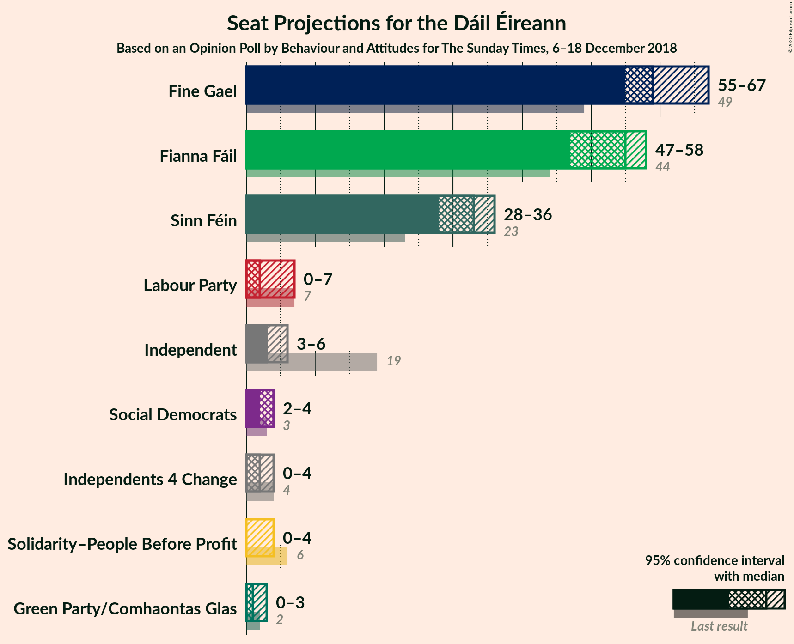
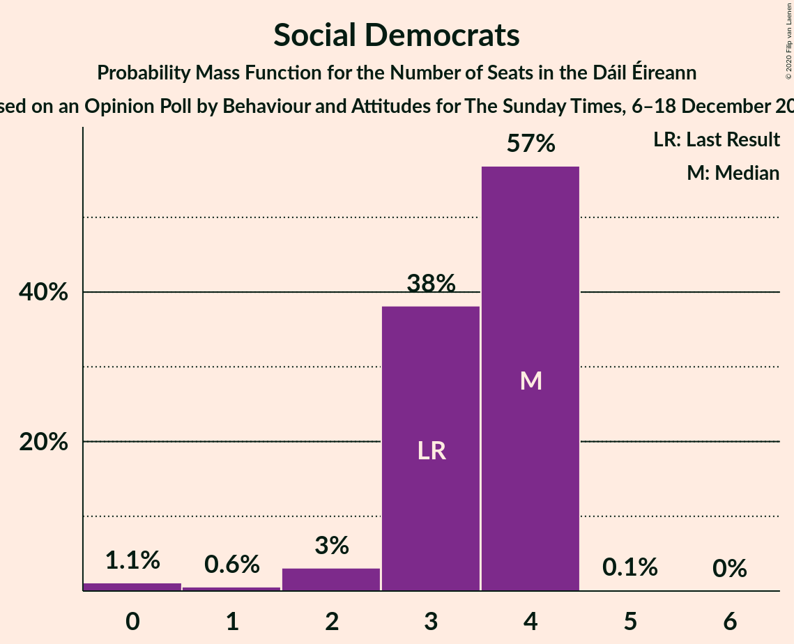
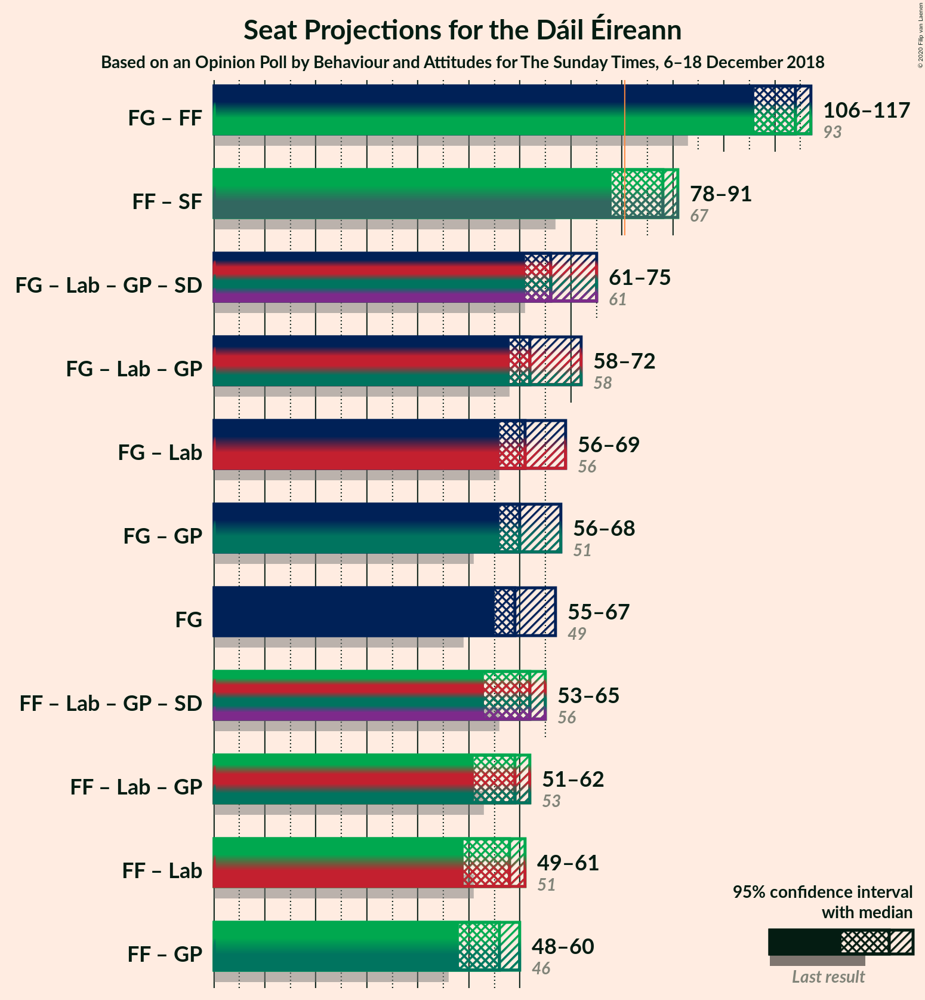
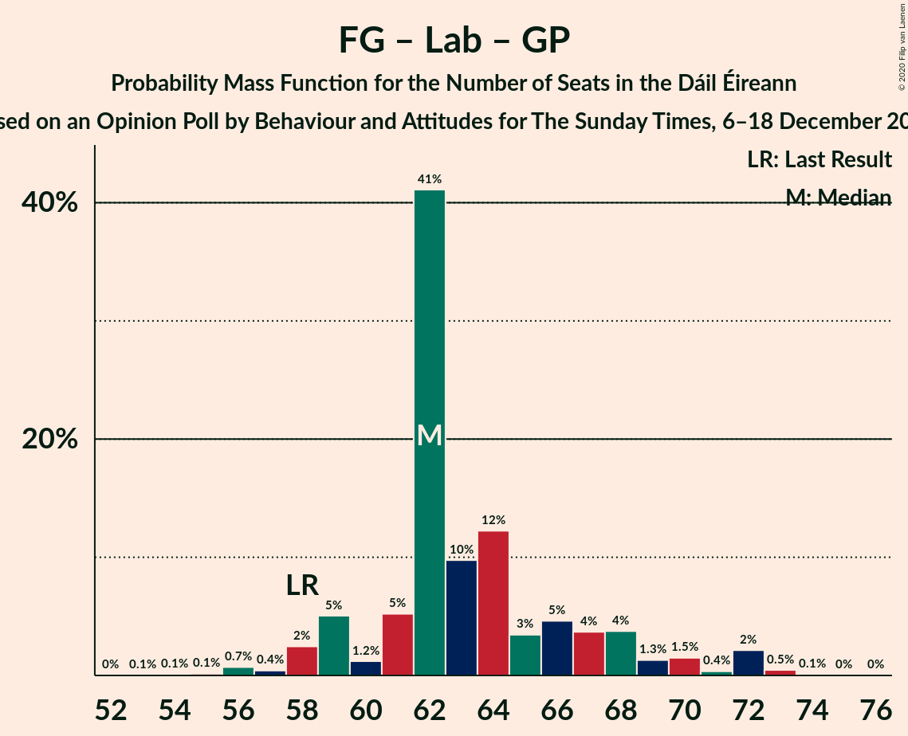

# Opinion Poll by Behaviour and Attitudes for The Sunday Times, 6–18 December 2018

<a href="#voting-intentions">Voting Intentions</a> | <a href="#seats">Seats</a> | <a href="#coalitions">Coalitions</a> | <a href="#technical-information">Technical Information</a>

## Voting Intentions

### Confidence Intervals

| Party | Last Result | Poll Result | 80% Confidence Interval | 90% Confidence Interval | 95% Confidence Interval | 99% Confidence Interval |
|:-----:|:-----------:|:-----------:|:-----------------------:|:-----------------------:|:-----------------------:|:-----------------------:|
| Fine Gael | 25.5% | 30.7% | 28.8–32.8% |28.3–33.3% |27.8–33.8% |26.9–34.8% |
| Fianna Fáil | 24.3% | 28.8% | 26.9–30.7% |26.4–31.3% |25.9–31.8% |25.0–32.8% |
| Sinn Féin | 13.8% | 16.8% | 15.3–18.5% |14.9–18.9% |14.5–19.4% |13.8–20.2% |
| Independent | 15.9% | 8.3% | 7.3–9.6% |7.0–10.0% |6.7–10.3% |6.2–11.0% |
| Labour Party | 6.6% | 4.9% | 4.1–6.0% |3.9–6.3% |3.7–6.6% |3.4–7.1% |
| Green Party/Comhaontas Glas | 2.7% | 3.0% | 2.3–3.8% |2.2–4.1% |2.0–4.3% |1.8–4.7% |
| Solidarity–People Before Profit | 3.9% | 2.0% | 1.5–2.7% |1.4–2.9% |1.2–3.1% |1.1–3.5% |
| Social Democrats | 3.0% | 2.0% | 1.5–2.7% |1.4–2.9% |1.2–3.1% |1.1–3.5% |
| Independents 4 Change | 1.5% | 1.1% | 0.8–1.7% |0.7–1.9% |0.6–2.0% |0.5–2.3% |

*Note:* The poll result column reflects the actual value used in the calculations. Published results may vary slightly, and in addition be rounded to fewer digits.

## Seats

### Confidence Intervals

| Party | Last Result | Median | 80% Confidence Interval | 90% Confidence Interval | 95% Confidence Interval | 99% Confidence Interval |
|:-----:|:-----------:|:------:|:-----------------------:|:-----------------------:|:-----------------------:|:-----------------------:|
| <a href="#fine-gael">Fine Gael</a> | 49 | 60 | 57–64 |57–67 |55–67 |51–67 |
| <a href="#fianna-fáil">Fianna Fáil</a> | 44 | 53 | 48–57 |47–58 |47–58 |44–60 |
| <a href="#sinn-féin">Sinn Féin</a> | 23 | 32 | 28–36 |28–36 |27–37 |25–39 |
| <a href="#independent">Independent</a> | 19 | 3 | 3–5 |3–5 |3–6 |3–8 |
| <a href="#labour-party">Labour Party</a> | 7 | 2 | 0–6 |0–7 |0–8 |0–8 |
| <a href="#green-party/comhaontas-glas">Green Party/Comhaontas Glas</a> | 2 | 1 | 0–2 |0–3 |0–3 |0–3 |
| <a href="#solidarity–people-before-profit">Solidarity–People Before Profit</a> | 6 | 3 | 0–3 |0–3 |0–4 |0–4 |
| <a href="#social-democrats">Social Democrats</a> | 3 | 3 | 2–4 |2–4 |0–4 |0–4 |
| <a href="#independents-4-change">Independents 4 Change</a> | 4 | 4 | 0–4 |0–4 |0–4 |0–5 |

### Fine Gael

*For a full overview of the results for this party, see the [Fine Gael](party-finegael.html) page.*

| Number of Seats | Probability | Accumulated | Special Marks |
|:---------------:|:-----------:|:-----------:|:-------------:|
| 49 | 0% | 100% | Last Result |
| 50 | 0.3% | 100% |  |
| 51 | 0.3% | 99.7% |  |
| 52 | 0.5% | 99.4% |  |
| 53 | 0.4% | 98.9% |  |
| 54 | 0.8% | 98% |  |
| 55 | 1.4% | 98% |  |
| 56 | 0.8% | 96% |  |
| 57 | 25% | 95% |  |
| 58 | 2% | 70% |  |
| 59 | 11% | 69% |  |
| 60 | 17% | 58% | Median |
| 61 | 21% | 41% |  |
| 62 | 0.9% | 20% |  |
| 63 | 6% | 19% |  |
| 64 | 5% | 13% |  |
| 65 | 0.9% | 8% |  |
| 66 | 0.6% | 7% |  |
| 67 | 6% | 7% |  |
| 68 | 0.4% | 0.4% |  |
| 69 | 0% | 0% |  |

### Fianna Fáil

*For a full overview of the results for this party, see the [Fianna Fáil](party-fiannafáil.html) page.*

| Number of Seats | Probability | Accumulated | Special Marks |
|:---------------:|:-----------:|:-----------:|:-------------:|
| 42 | 0.2% | 100% |  |
| 43 | 0.3% | 99.8% |  |
| 44 | 0.1% | 99.5% | Last Result |
| 45 | 0.1% | 99.5% |  |
| 46 | 0.7% | 99.3% |  |
| 47 | 5% | 98.7% |  |
| 48 | 14% | 94% |  |
| 49 | 5% | 80% |  |
| 50 | 16% | 74% |  |
| 51 | 1.4% | 58% |  |
| 52 | 6% | 57% |  |
| 53 | 7% | 51% | Median |
| 54 | 7% | 44% |  |
| 55 | 7% | 37% |  |
| 56 | 7% | 30% |  |
| 57 | 14% | 23% |  |
| 58 | 6% | 8% |  |
| 59 | 1.4% | 2% |  |
| 60 | 0.5% | 0.7% |  |
| 61 | 0.2% | 0.2% |  |
| 62 | 0% | 0% |  |

### Sinn Féin

*For a full overview of the results for this party, see the [Sinn Féin](party-sinnféin.html) page.*

| Number of Seats | Probability | Accumulated | Special Marks |
|:---------------:|:-----------:|:-----------:|:-------------:|
| 22 | 0% | 100% |  |
| 23 | 0% | 99.9% | Last Result |
| 24 | 0.3% | 99.9% |  |
| 25 | 0.3% | 99.6% |  |
| 26 | 1.3% | 99.3% |  |
| 27 | 1.0% | 98% |  |
| 28 | 9% | 97% |  |
| 29 | 2% | 88% |  |
| 30 | 12% | 86% |  |
| 31 | 18% | 74% |  |
| 32 | 12% | 56% | Median |
| 33 | 16% | 44% |  |
| 34 | 6% | 28% |  |
| 35 | 11% | 22% |  |
| 36 | 9% | 11% |  |
| 37 | 2% | 3% |  |
| 38 | 0.2% | 0.8% |  |
| 39 | 0.5% | 0.6% |  |
| 40 | 0% | 0.1% |  |
| 41 | 0% | 0.1% |  |
| 42 | 0% | 0% |  |

### Independent

*For a full overview of the results for this party, see the [Independent](party-independent.html) page.*

| Number of Seats | Probability | Accumulated | Special Marks |
|:---------------:|:-----------:|:-----------:|:-------------:|
| 2 | 0.1% | 100% |  |
| 3 | 66% | 99.9% | Median |
| 4 | 22% | 34% |  |
| 5 | 6% | 11% |  |
| 6 | 3% | 5% |  |
| 7 | 0.7% | 2% |  |
| 8 | 0.8% | 1.1% |  |
| 9 | 0.1% | 0.2% |  |
| 10 | 0.1% | 0.2% |  |
| 11 | 0% | 0% |  |
| 12 | 0% | 0% |  |
| 13 | 0% | 0% |  |
| 14 | 0% | 0% |  |
| 15 | 0% | 0% |  |
| 16 | 0% | 0% |  |
| 17 | 0% | 0% |  |
| 18 | 0% | 0% |  |
| 19 | 0% | 0% | Last Result |

### Labour Party

*For a full overview of the results for this party, see the [Labour Party](party-labourparty.html) page.*

| Number of Seats | Probability | Accumulated | Special Marks |
|:---------------:|:-----------:|:-----------:|:-------------:|
| 0 | 12% | 100% |  |
| 1 | 14% | 88% |  |
| 2 | 25% | 74% | Median |
| 3 | 28% | 48% |  |
| 4 | 1.4% | 20% |  |
| 5 | 4% | 19% |  |
| 6 | 8% | 15% |  |
| 7 | 2% | 7% | Last Result |
| 8 | 4% | 4% |  |
| 9 | 0.1% | 0.4% |  |
| 10 | 0.1% | 0.3% |  |
| 11 | 0.1% | 0.2% |  |
| 12 | 0.1% | 0.1% |  |
| 13 | 0% | 0% |  |

### Green Party/Comhaontas Glas

*For a full overview of the results for this party, see the [Green Party/Comhaontas Glas](party-greenpartycomhaontasglas.html) page.*

| Number of Seats | Probability | Accumulated | Special Marks |
|:---------------:|:-----------:|:-----------:|:-------------:|
| 0 | 28% | 100% |  |
| 1 | 31% | 72% | Median |
| 2 | 32% | 41% | Last Result |
| 3 | 8% | 8% |  |
| 4 | 0.3% | 0.4% |  |
| 5 | 0.1% | 0.1% |  |
| 6 | 0% | 0% |  |

### Solidarity–People Before Profit

*For a full overview of the results for this party, see the [Solidarity–People Before Profit](party-solidarity–peoplebeforeprofit.html) page.*

| Number of Seats | Probability | Accumulated | Special Marks |
|:---------------:|:-----------:|:-----------:|:-------------:|
| 0 | 24% | 100% |  |
| 1 | 12% | 76% |  |
| 2 | 12% | 64% |  |
| 3 | 49% | 51% | Median |
| 4 | 3% | 3% |  |
| 5 | 0.1% | 0.2% |  |
| 6 | 0% | 0% | Last Result |

### Social Democrats

*For a full overview of the results for this party, see the [Social Democrats](party-socialdemocrats.html) page.*

| Number of Seats | Probability | Accumulated | Special Marks |
|:---------------:|:-----------:|:-----------:|:-------------:|
| 0 | 3% | 100% |  |
| 1 | 0.7% | 97% |  |
| 2 | 7% | 97% |  |
| 3 | 64% | 89% | Last Result, Median |
| 4 | 25% | 25% |  |
| 5 | 0.3% | 0.3% |  |
| 6 | 0% | 0% |  |

### Independents 4 Change

*For a full overview of the results for this party, see the [Independents 4 Change](party-independents4change.html) page.*

| Number of Seats | Probability | Accumulated | Special Marks |
|:---------------:|:-----------:|:-----------:|:-------------:|
| 0 | 17% | 100% |  |
| 1 | 4% | 83% |  |
| 2 | 18% | 79% |  |
| 3 | 8% | 62% |  |
| 4 | 53% | 54% | Last Result, Median |
| 5 | 1.5% | 1.5% |  |
| 6 | 0% | 0% |  |

## Coalitions

### Confidence Intervals

| Coalition | Last Result | Median | Majority? | 80% Confidence Interval | 90% Confidence Interval | 95% Confidence Interval | 99% Confidence Interval |
|:---------:|:-----------:|:------:|:---------:|:-----------------------:|:-----------------------:|:-----------------------:|:-----------------------:|
| Fine Gael – Fianna Fáil | 93 | 113 | 100% | 108–116 | 108–117 | 108–117 | 104–120 |
| Fianna Fáil – Sinn Féin | 67 | 84 | 82% | 80–89 | 79–91 | 79–93 | 76–95 |
| Fine Gael – Labour Party – Green Party/Comhaontas Glas – Social Democrats | 61 | 67 | 0% | 62–73 | 62–74 | 60–76 | 58–76 |
| Fine Gael – Labour Party – Green Party/Comhaontas Glas | 58 | 64 | 0% | 59–70 | 59–72 | 58–72 | 55–72 |
| Fine Gael – Green Party/Comhaontas Glas | 51 | 61 | 0% | 58–66 | 57–68 | 55–70 | 52–70 |
| Fine Gael – Labour Party | 56 | 63 | 0% | 58–68 | 58–69 | 57–69 | 53–71 |
| Fine Gael | 49 | 60 | 0% | 57–64 | 57–67 | 55–67 | 51–67 |
| Fianna Fáil – Labour Party – Green Party/Comhaontas Glas – Social Democrats | 56 | 60 | 0% | 55–63 | 55–64 | 53–65 | 51–68 |
| Fianna Fáil – Labour Party – Green Party/Comhaontas Glas | 53 | 56 | 0% | 52–61 | 51–62 | 50–62 | 49–65 |
| Fianna Fáil – Labour Party | 51 | 55 | 0% | 50–60 | 49–60 | 49–61 | 48–64 |
| Fianna Fáil – Green Party/Comhaontas Glas | 46 | 54 | 0% | 50–58 | 49–60 | 48–60 | 45–61 |

### Fine Gael – Fianna Fáil

| Number of Seats | Probability | Accumulated | Special Marks |
|:---------------:|:-----------:|:-----------:|:-------------:|
| 93 | 0% | 100% | Last Result |
| 94 | 0% | 100% |  |
| 95 | 0% | 100% |  |
| 96 | 0% | 100% |  |
| 97 | 0% | 100% |  |
| 98 | 0% | 100% |  |
| 99 | 0% | 100% |  |
| 100 | 0% | 100% |  |
| 101 | 0% | 100% |  |
| 102 | 0% | 100% |  |
| 103 | 0% | 100% |  |
| 104 | 0.7% | 100% |  |
| 105 | 0.2% | 99.3% |  |
| 106 | 0.3% | 99.2% |  |
| 107 | 1.1% | 98.8% |  |
| 108 | 11% | 98% |  |
| 109 | 7% | 86% |  |
| 110 | 1.4% | 79% |  |
| 111 | 17% | 78% |  |
| 112 | 4% | 61% |  |
| 113 | 9% | 57% | Median |
| 114 | 24% | 48% |  |
| 115 | 8% | 24% |  |
| 116 | 8% | 16% |  |
| 117 | 6% | 8% |  |
| 118 | 0.7% | 2% |  |
| 119 | 0.4% | 1.1% |  |
| 120 | 0.4% | 0.6% |  |
| 121 | 0.2% | 0.2% |  |
| 122 | 0% | 0% |  |

### Fianna Fáil – Sinn Féin

| Number of Seats | Probability | Accumulated | Special Marks |
|:---------------:|:-----------:|:-----------:|:-------------:|
| 67 | 0% | 100% | Last Result |
| 68 | 0% | 100% |  |
| 69 | 0% | 100% |  |
| 70 | 0% | 100% |  |
| 71 | 0% | 100% |  |
| 72 | 0% | 100% |  |
| 73 | 0% | 100% |  |
| 74 | 0% | 100% |  |
| 75 | 0% | 99.9% |  |
| 76 | 1.0% | 99.9% |  |
| 77 | 0.3% | 98.9% |  |
| 78 | 0.7% | 98.6% |  |
| 79 | 5% | 98% |  |
| 80 | 11% | 93% |  |
| 81 | 3% | 82% | Majority |
| 82 | 9% | 79% |  |
| 83 | 12% | 70% |  |
| 84 | 10% | 58% |  |
| 85 | 11% | 49% | Median |
| 86 | 6% | 38% |  |
| 87 | 4% | 32% |  |
| 88 | 13% | 28% |  |
| 89 | 7% | 15% |  |
| 90 | 3% | 8% |  |
| 91 | 2% | 5% |  |
| 92 | 0.9% | 4% |  |
| 93 | 0.7% | 3% |  |
| 94 | 0.3% | 2% |  |
| 95 | 1.4% | 2% |  |
| 96 | 0.2% | 0.3% |  |
| 97 | 0.1% | 0.1% |  |
| 98 | 0% | 0% |  |

### Fine Gael – Labour Party – Green Party/Comhaontas Glas – Social Democrats

| Number of Seats | Probability | Accumulated | Special Marks |
|:---------------:|:-----------:|:-----------:|:-------------:|
| 56 | 0.1% | 100% |  |
| 57 | 0.2% | 99.9% |  |
| 58 | 0.4% | 99.7% |  |
| 59 | 2% | 99.3% |  |
| 60 | 1.0% | 98% |  |
| 61 | 1.4% | 97% | Last Result |
| 62 | 12% | 95% |  |
| 63 | 5% | 83% |  |
| 64 | 9% | 78% |  |
| 65 | 1.4% | 69% |  |
| 66 | 4% | 68% | Median |
| 67 | 26% | 64% |  |
| 68 | 10% | 38% |  |
| 69 | 2% | 28% |  |
| 70 | 5% | 26% |  |
| 71 | 8% | 21% |  |
| 72 | 2% | 14% |  |
| 73 | 5% | 11% |  |
| 74 | 1.5% | 6% |  |
| 75 | 0.1% | 5% |  |
| 76 | 4% | 5% |  |
| 77 | 0.2% | 0.4% |  |
| 78 | 0.1% | 0.1% |  |
| 79 | 0% | 0% |  |

### Fine Gael – Labour Party – Green Party/Comhaontas Glas

| Number of Seats | Probability | Accumulated | Special Marks |
|:---------------:|:-----------:|:-----------:|:-------------:|
| 53 | 0.2% | 100% |  |
| 54 | 0.2% | 99.8% |  |
| 55 | 0.3% | 99.6% |  |
| 56 | 0.9% | 99.3% |  |
| 57 | 0.5% | 98% |  |
| 58 | 0.7% | 98% | Last Result |
| 59 | 15% | 97% |  |
| 60 | 2% | 82% |  |
| 61 | 11% | 81% |  |
| 62 | 2% | 70% |  |
| 63 | 5% | 68% | Median |
| 64 | 32% | 63% |  |
| 65 | 4% | 32% |  |
| 66 | 5% | 28% |  |
| 67 | 1.5% | 23% |  |
| 68 | 8% | 22% |  |
| 69 | 3% | 13% |  |
| 70 | 4% | 10% |  |
| 71 | 0.4% | 6% |  |
| 72 | 5% | 5% |  |
| 73 | 0.1% | 0.4% |  |
| 74 | 0.2% | 0.3% |  |
| 75 | 0.1% | 0.1% |  |
| 76 | 0% | 0% |  |

### Fine Gael – Green Party/Comhaontas Glas

| Number of Seats | Probability | Accumulated | Special Marks |
|:---------------:|:-----------:|:-----------:|:-------------:|
| 50 | 0.1% | 100% |  |
| 51 | 0% | 99.9% | Last Result |
| 52 | 0.5% | 99.9% |  |
| 53 | 0.4% | 99.4% |  |
| 54 | 0.5% | 99.0% |  |
| 55 | 1.2% | 98% |  |
| 56 | 0.9% | 97% |  |
| 57 | 3% | 96% |  |
| 58 | 19% | 93% |  |
| 59 | 6% | 74% |  |
| 60 | 3% | 68% |  |
| 61 | 24% | 65% | Median |
| 62 | 19% | 41% |  |
| 63 | 2% | 22% |  |
| 64 | 7% | 20% |  |
| 65 | 0.6% | 13% |  |
| 66 | 5% | 13% |  |
| 67 | 2% | 8% |  |
| 68 | 1.2% | 6% |  |
| 69 | 0.1% | 4% |  |
| 70 | 4% | 4% |  |
| 71 | 0.1% | 0.1% |  |
| 72 | 0% | 0% |  |

### Fine Gael – Labour Party

| Number of Seats | Probability | Accumulated | Special Marks |
|:---------------:|:-----------:|:-----------:|:-------------:|
| 52 | 0.3% | 100% |  |
| 53 | 0.3% | 99.7% |  |
| 54 | 0.2% | 99.5% |  |
| 55 | 0.3% | 99.2% |  |
| 56 | 0.7% | 98.9% | Last Result |
| 57 | 1.4% | 98% |  |
| 58 | 13% | 97% |  |
| 59 | 7% | 84% |  |
| 60 | 6% | 77% |  |
| 61 | 4% | 71% |  |
| 62 | 13% | 66% | Median |
| 63 | 8% | 54% |  |
| 64 | 20% | 46% |  |
| 65 | 3% | 25% |  |
| 66 | 9% | 23% |  |
| 67 | 1.0% | 14% |  |
| 68 | 5% | 13% |  |
| 69 | 6% | 8% |  |
| 70 | 1.1% | 2% |  |
| 71 | 0.1% | 0.5% |  |
| 72 | 0.3% | 0.4% |  |
| 73 | 0.1% | 0.2% |  |
| 74 | 0% | 0.1% |  |
| 75 | 0% | 0% |  |

### Fine Gael

| Number of Seats | Probability | Accumulated | Special Marks |
|:---------------:|:-----------:|:-----------:|:-------------:|
| 49 | 0% | 100% | Last Result |
| 50 | 0.3% | 100% |  |
| 51 | 0.3% | 99.7% |  |
| 52 | 0.5% | 99.4% |  |
| 53 | 0.4% | 98.9% |  |
| 54 | 0.8% | 98% |  |
| 55 | 1.4% | 98% |  |
| 56 | 0.8% | 96% |  |
| 57 | 25% | 95% |  |
| 58 | 2% | 70% |  |
| 59 | 11% | 69% |  |
| 60 | 17% | 58% | Median |
| 61 | 21% | 41% |  |
| 62 | 0.9% | 20% |  |
| 63 | 6% | 19% |  |
| 64 | 5% | 13% |  |
| 65 | 0.9% | 8% |  |
| 66 | 0.6% | 7% |  |
| 67 | 6% | 7% |  |
| 68 | 0.4% | 0.4% |  |
| 69 | 0% | 0% |  |

### Fianna Fáil – Labour Party – Green Party/Comhaontas Glas – Social Democrats

| Number of Seats | Probability | Accumulated | Special Marks |
|:---------------:|:-----------:|:-----------:|:-------------:|
| 49 | 0.2% | 100% |  |
| 50 | 0.3% | 99.8% |  |
| 51 | 0.2% | 99.5% |  |
| 52 | 0.1% | 99.4% |  |
| 53 | 3% | 99.3% |  |
| 54 | 0.4% | 96% |  |
| 55 | 6% | 96% |  |
| 56 | 19% | 89% | Last Result |
| 57 | 2% | 70% |  |
| 58 | 5% | 68% |  |
| 59 | 13% | 63% | Median |
| 60 | 3% | 50% |  |
| 61 | 5% | 47% |  |
| 62 | 19% | 42% |  |
| 63 | 13% | 23% |  |
| 64 | 5% | 10% |  |
| 65 | 3% | 4% |  |
| 66 | 0.7% | 2% |  |
| 67 | 0.3% | 1.1% |  |
| 68 | 0.3% | 0.8% |  |
| 69 | 0.2% | 0.5% |  |
| 70 | 0% | 0.3% |  |
| 71 | 0.2% | 0.3% |  |
| 72 | 0% | 0% |  |

### Fianna Fáil – Labour Party – Green Party/Comhaontas Glas

| Number of Seats | Probability | Accumulated | Special Marks |
|:---------------:|:-----------:|:-----------:|:-------------:|
| 46 | 0.2% | 100% |  |
| 47 | 0.2% | 99.8% |  |
| 48 | 0% | 99.6% |  |
| 49 | 0.7% | 99.6% |  |
| 50 | 3% | 98.8% |  |
| 51 | 2% | 96% |  |
| 52 | 10% | 95% |  |
| 53 | 16% | 85% | Last Result |
| 54 | 5% | 69% |  |
| 55 | 6% | 64% |  |
| 56 | 8% | 58% | Median |
| 57 | 3% | 50% |  |
| 58 | 4% | 47% |  |
| 59 | 18% | 43% |  |
| 60 | 14% | 25% |  |
| 61 | 4% | 11% |  |
| 62 | 5% | 7% |  |
| 63 | 0.6% | 2% |  |
| 64 | 0.3% | 1.0% |  |
| 65 | 0.2% | 0.7% |  |
| 66 | 0.2% | 0.5% |  |
| 67 | 0.1% | 0.3% |  |
| 68 | 0.2% | 0.3% |  |
| 69 | 0.1% | 0.1% |  |
| 70 | 0% | 0% |  |

### Fianna Fáil – Labour Party

| Number of Seats | Probability | Accumulated | Special Marks |
|:---------------:|:-----------:|:-----------:|:-------------:|
| 45 | 0% | 100% |  |
| 46 | 0.2% | 99.9% |  |
| 47 | 0.2% | 99.7% |  |
| 48 | 0.6% | 99.6% |  |
| 49 | 5% | 98.9% |  |
| 50 | 7% | 94% |  |
| 51 | 2% | 87% | Last Result |
| 52 | 5% | 85% |  |
| 53 | 17% | 80% |  |
| 54 | 13% | 63% |  |
| 55 | 3% | 51% | Median |
| 56 | 3% | 48% |  |
| 57 | 5% | 45% |  |
| 58 | 20% | 40% |  |
| 59 | 9% | 20% |  |
| 60 | 7% | 11% |  |
| 61 | 3% | 4% |  |
| 62 | 0.6% | 2% |  |
| 63 | 0.4% | 1.0% |  |
| 64 | 0.1% | 0.5% |  |
| 65 | 0.1% | 0.5% |  |
| 66 | 0.1% | 0.3% |  |
| 67 | 0.2% | 0.2% |  |
| 68 | 0.1% | 0.1% |  |
| 69 | 0% | 0% |  |

### Fianna Fáil – Green Party/Comhaontas Glas

| Number of Seats | Probability | Accumulated | Special Marks |
|:---------------:|:-----------:|:-----------:|:-------------:|
| 42 | 0.2% | 100% |  |
| 43 | 0% | 99.8% |  |
| 44 | 0.1% | 99.8% |  |
| 45 | 0.3% | 99.7% |  |
| 46 | 0.1% | 99.4% | Last Result |
| 47 | 0.8% | 99.4% |  |
| 48 | 2% | 98.6% |  |
| 49 | 2% | 96% |  |
| 50 | 31% | 95% |  |
| 51 | 5% | 64% |  |
| 52 | 0.9% | 58% |  |
| 53 | 4% | 57% |  |
| 54 | 6% | 53% | Median |
| 55 | 10% | 47% |  |
| 56 | 3% | 38% |  |
| 57 | 11% | 35% |  |
| 58 | 15% | 23% |  |
| 59 | 3% | 8% |  |
| 60 | 5% | 5% |  |
| 61 | 0.3% | 0.7% |  |
| 62 | 0.4% | 0.5% |  |
| 63 | 0.1% | 0.1% |  |
| 64 | 0% | 0% |  |

## Technical Information

### Opinion Poll

+ **Polling firm:** Behaviour and Attitudes
+ **Commissioner(s):** The Sunday Times
+ **Fieldwork period:** 6–18 December 2018

### Calculations

+ **Sample size:** 911
+ **Simulations done:** 131,072
+ **Error estimate:** 2.58%

