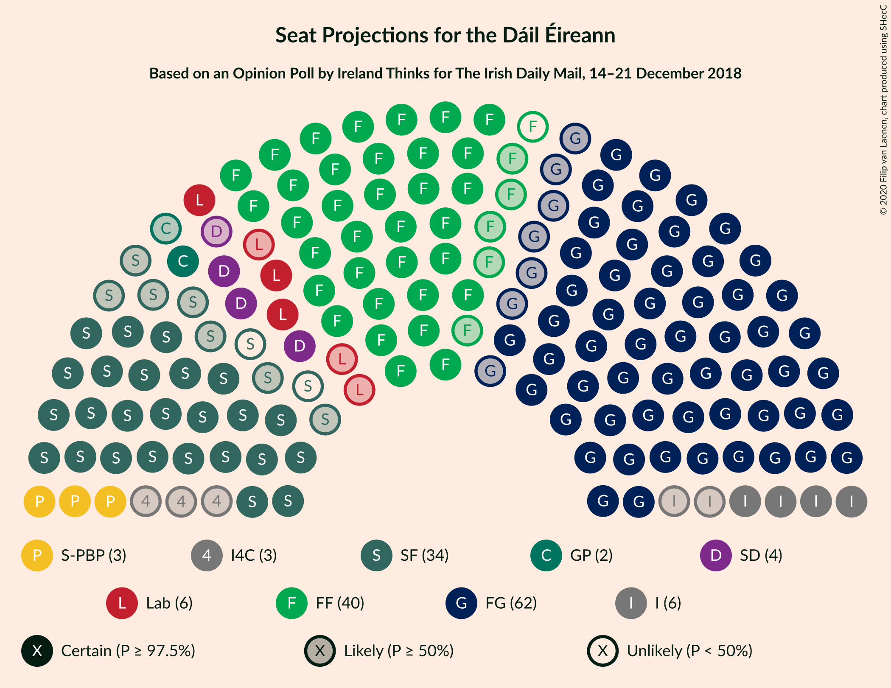
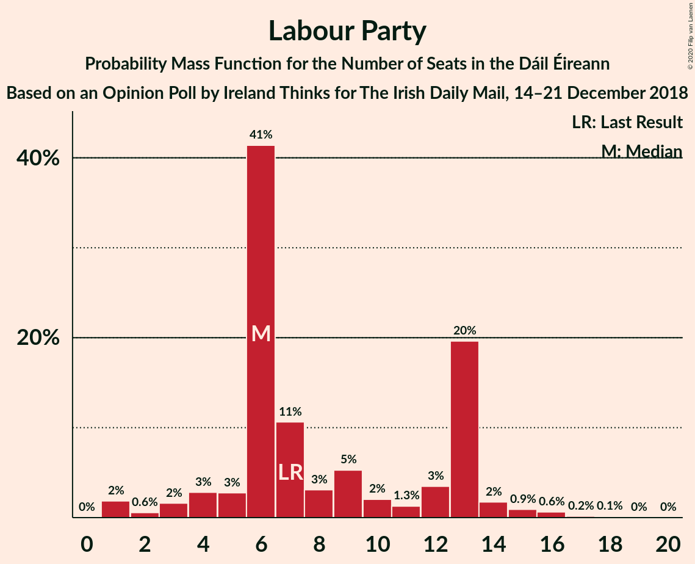
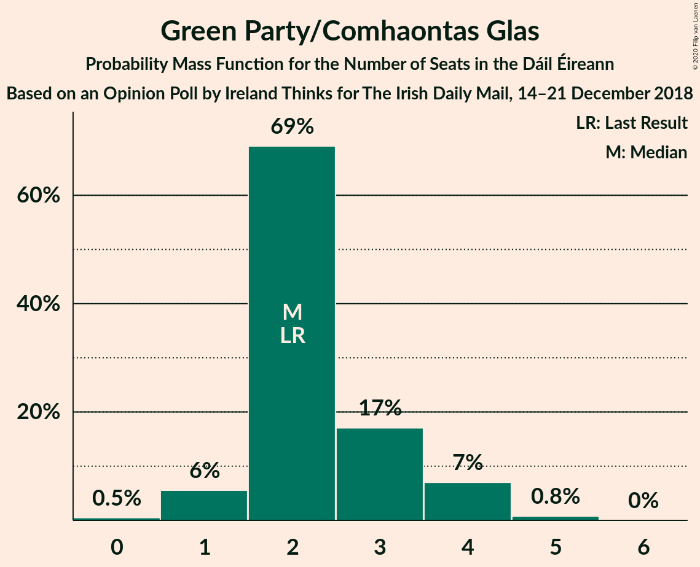
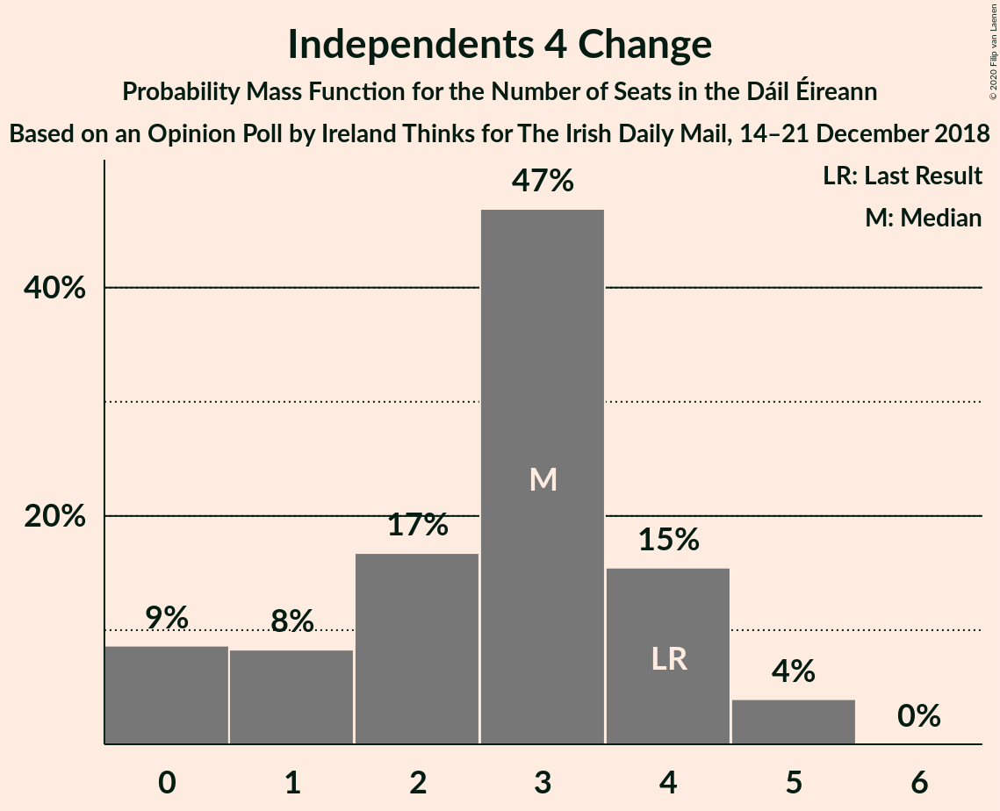
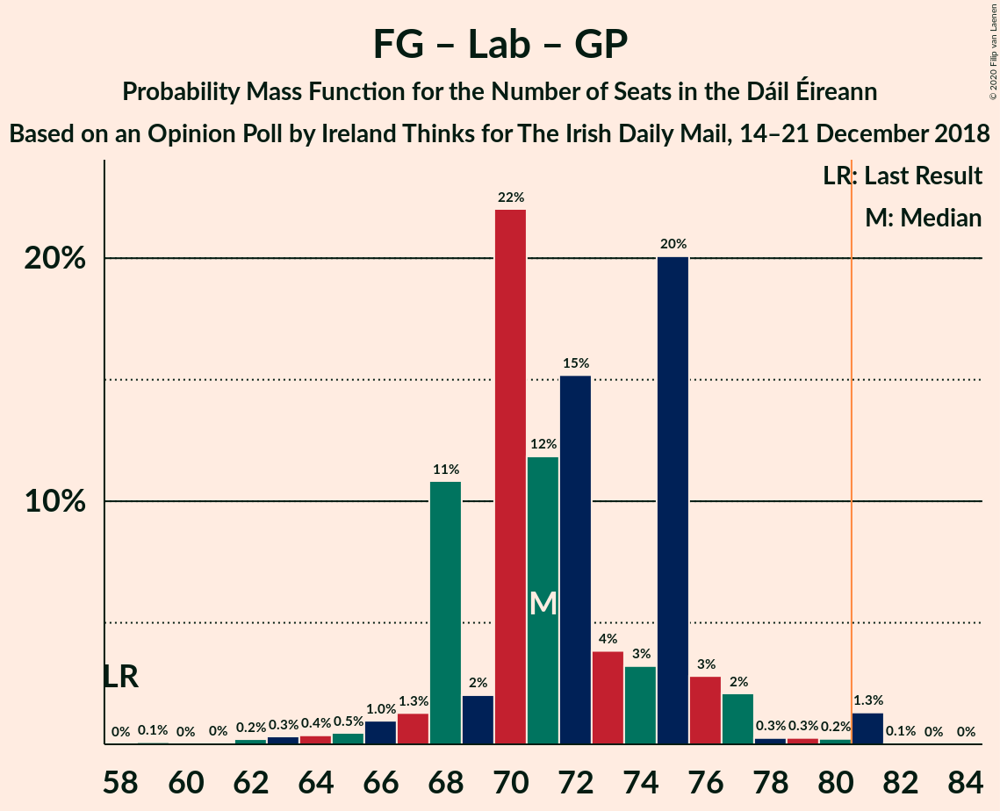
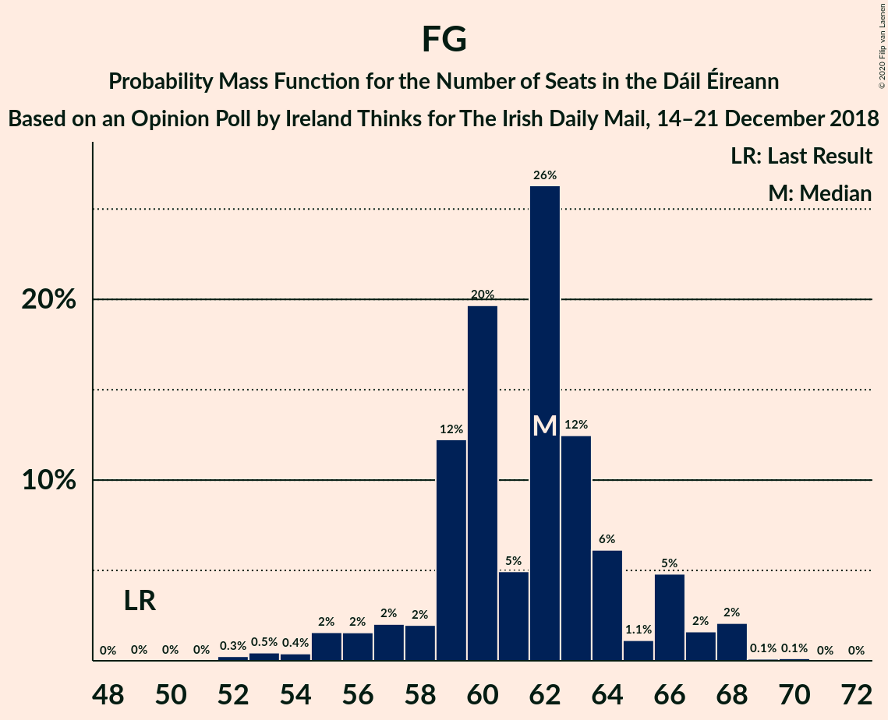

# Opinion Poll by Ireland Thinks for The Irish Daily Mail, 14–21 December 2018

<a href="#voting-intentions">Voting Intentions</a> | <a href="#seats">Seats</a> | <a href="#coalitions">Coalitions</a> | <a href="#technical-information">Technical Information</a>

## Voting Intentions

### Confidence Intervals

| Party | Last Result | Poll Result | 80% Confidence Interval | 90% Confidence Interval | 95% Confidence Interval | 99% Confidence Interval |
|:-----:|:-----------:|:-----------:|:-----------------------:|:-----------------------:|:-----------------------:|:-----------------------:|
| Fine Gael | 25.5% | 31.4% | 29.9–32.9% |29.5–33.3% |29.1–33.7% |28.4–34.5% |
| Fianna Fáil | 24.3% | 22.6% | 21.2–24.0% |20.9–24.4% |20.6–24.7% |19.9–25.4% |
| Sinn Féin | 13.8% | 15.7% | 14.6–17.0% |14.3–17.3% |14.0–17.6% |13.5–18.2% |
| Independent | 15.9% | 10.8% | 9.8–11.9% |9.6–12.2% |9.3–12.5% |8.9–13.0% |
| Labour Party | 6.6% | 6.9% | 6.1–7.8% |5.9–8.0% |5.7–8.2% |5.3–8.7% |
| Solidarity–People Before Profit | 3.9% | 3.9% | 3.4–4.7% |3.2–4.9% |3.1–5.0% |2.8–5.4% |
| Green Party/Comhaontas Glas | 2.7% | 3.9% | 3.4–4.7% |3.2–4.9% |3.1–5.0% |2.8–5.4% |
| Social Democrats | 3.0% | 2.9% | 2.4–3.5% |2.3–3.7% |2.2–3.9% |2.0–4.2% |
| Independents 4 Change | 1.5% | 1.4% | 1.1–1.8% |1.0–2.0% |0.9–2.1% |0.8–2.3% |

*Note:* The poll result column reflects the actual value used in the calculations. Published results may vary slightly, and in addition be rounded to fewer digits.

## Seats

### Confidence Intervals

| Party | Last Result | Median | 80% Confidence Interval | 90% Confidence Interval | 95% Confidence Interval | 99% Confidence Interval |
|:-----:|:-----------:|:------:|:-----------------------:|:-----------------------:|:-----------------------:|:-----------------------:|
| <a href="#fine-gael">Fine Gael</a> | 49 | 62 | 59–64 |57–66 |55–67 |53–68 |
| <a href="#fianna-fáil">Fianna Fáil</a> | 44 | 39 | 36–44 |35–44 |34–44 |34–47 |
| <a href="#sinn-féin">Sinn Féin</a> | 23 | 32 | 29–34 |27–34 |25–34 |22–34 |
| <a href="#independent">Independent</a> | 19 | 6 | 4–10 |4–11 |4–12 |4–15 |
| <a href="#labour-party">Labour Party</a> | 7 | 6 | 6–13 |4–13 |3–14 |1–16 |
| <a href="#solidarity–people-before-profit">Solidarity–People Before Profit</a> | 6 | 3 | 3–6 |3–6 |3–7 |3–9 |
| <a href="#green-party/comhaontas-glas">Green Party/Comhaontas Glas</a> | 2 | 2 | 2–3 |1–4 |1–4 |0–5 |
| <a href="#social-democrats">Social Democrats</a> | 3 | 4 | 3–4 |3–4 |3–4 |3–5 |
| <a href="#independents-4-change">Independents 4 Change</a> | 4 | 3 | 1–4 |0–4 |0–5 |0–5 |

### Fine Gael

*For a full overview of the results for this party, see the [Fine Gael](party-finegael.html) page.*

| Number of Seats | Probability | Accumulated | Special Marks |
|:---------------:|:-----------:|:-----------:|:-------------:|
| 49 | 0% | 100% | Last Result |
| 50 | 0% | 100% |  |
| 51 | 0% | 100% |  |
| 52 | 0.3% | 99.9% |  |
| 53 | 0.5% | 99.7% |  |
| 54 | 0.4% | 99.2% |  |
| 55 | 2% | 98.8% |  |
| 56 | 2% | 97% |  |
| 57 | 2% | 96% |  |
| 58 | 2% | 94% |  |
| 59 | 12% | 92% |  |
| 60 | 20% | 79% |  |
| 61 | 5% | 60% |  |
| 62 | 26% | 55% | Median |
| 63 | 12% | 29% |  |
| 64 | 6% | 16% |  |
| 65 | 1.1% | 10% |  |
| 66 | 5% | 9% |  |
| 67 | 2% | 4% |  |
| 68 | 2% | 2% |  |
| 69 | 0.1% | 0.2% |  |
| 70 | 0.1% | 0.1% |  |
| 71 | 0% | 0% |  |

### Fianna Fáil

*For a full overview of the results for this party, see the [Fianna Fáil](party-fiannafáil.html) page.*

| Number of Seats | Probability | Accumulated | Special Marks |
|:---------------:|:-----------:|:-----------:|:-------------:|
| 33 | 0.2% | 100% |  |
| 34 | 4% | 99.8% |  |
| 35 | 5% | 96% |  |
| 36 | 10% | 91% |  |
| 37 | 18% | 81% |  |
| 38 | 11% | 63% |  |
| 39 | 18% | 52% | Median |
| 40 | 17% | 34% |  |
| 41 | 2% | 17% |  |
| 42 | 1.3% | 15% |  |
| 43 | 2% | 14% |  |
| 44 | 10% | 12% | Last Result |
| 45 | 1.1% | 2% |  |
| 46 | 0.1% | 0.7% |  |
| 47 | 0.3% | 0.6% |  |
| 48 | 0.1% | 0.2% |  |
| 49 | 0% | 0.1% |  |
| 50 | 0.1% | 0.1% |  |
| 51 | 0% | 0% |  |

### Sinn Féin

*For a full overview of the results for this party, see the [Sinn Féin](party-sinnféin.html) page.*

| Number of Seats | Probability | Accumulated | Special Marks |
|:---------------:|:-----------:|:-----------:|:-------------:|
| 20 | 0.1% | 100% |  |
| 21 | 0.1% | 99.8% |  |
| 22 | 1.4% | 99.8% |  |
| 23 | 0.2% | 98% | Last Result |
| 24 | 0.4% | 98% |  |
| 25 | 0.6% | 98% |  |
| 26 | 0.4% | 97% |  |
| 27 | 2% | 97% |  |
| 28 | 3% | 95% |  |
| 29 | 2% | 92% |  |
| 30 | 5% | 89% |  |
| 31 | 26% | 84% |  |
| 32 | 23% | 59% | Median |
| 33 | 11% | 36% |  |
| 34 | 24% | 24% |  |
| 35 | 0.2% | 0.2% |  |
| 36 | 0% | 0% |  |

### Independent

*For a full overview of the results for this party, see the [Independent](party-independent.html) page.*

| Number of Seats | Probability | Accumulated | Special Marks |
|:---------------:|:-----------:|:-----------:|:-------------:|
| 4 | 25% | 100% |  |
| 5 | 8% | 75% |  |
| 6 | 29% | 67% | Median |
| 7 | 3% | 37% |  |
| 8 | 5% | 34% |  |
| 9 | 3% | 29% |  |
| 10 | 18% | 27% |  |
| 11 | 5% | 9% |  |
| 12 | 2% | 4% |  |
| 13 | 0.4% | 2% |  |
| 14 | 0.5% | 2% |  |
| 15 | 0.7% | 1.0% |  |
| 16 | 0.3% | 0.3% |  |
| 17 | 0% | 0% |  |
| 18 | 0% | 0% |  |
| 19 | 0% | 0% | Last Result |

### Labour Party

*For a full overview of the results for this party, see the [Labour Party](party-labourparty.html) page.*

| Number of Seats | Probability | Accumulated | Special Marks |
|:---------------:|:-----------:|:-----------:|:-------------:|
| 1 | 2% | 100% |  |
| 2 | 0.6% | 98% |  |
| 3 | 2% | 98% |  |
| 4 | 3% | 96% |  |
| 5 | 3% | 93% |  |
| 6 | 41% | 90% | Median |
| 7 | 11% | 49% | Last Result |
| 8 | 3% | 38% |  |
| 9 | 5% | 35% |  |
| 10 | 2% | 30% |  |
| 11 | 1.3% | 28% |  |
| 12 | 3% | 27% |  |
| 13 | 20% | 23% |  |
| 14 | 2% | 4% |  |
| 15 | 0.9% | 2% |  |
| 16 | 0.6% | 0.9% |  |
| 17 | 0.2% | 0.3% |  |
| 18 | 0.1% | 0.1% |  |
| 19 | 0% | 0% |  |

### Solidarity–People Before Profit

*For a full overview of the results for this party, see the [Solidarity–People Before Profit](party-solidarity–peoplebeforeprofit.html) page.*

| Number of Seats | Probability | Accumulated | Special Marks |
|:---------------:|:-----------:|:-----------:|:-------------:|
| 3 | 58% | 100% | Median |
| 4 | 15% | 42% |  |
| 5 | 6% | 27% |  |
| 6 | 17% | 21% | Last Result |
| 7 | 2% | 4% |  |
| 8 | 1.2% | 2% |  |
| 9 | 0.6% | 0.6% |  |
| 10 | 0% | 0% |  |

### Green Party/Comhaontas Glas

*For a full overview of the results for this party, see the [Green Party/Comhaontas Glas](party-greenpartycomhaontasglas.html) page.*

| Number of Seats | Probability | Accumulated | Special Marks |
|:---------------:|:-----------:|:-----------:|:-------------:|
| 0 | 0.5% | 100% |  |
| 1 | 6% | 99.5% |  |
| 2 | 69% | 94% | Last Result, Median |
| 3 | 17% | 25% |  |
| 4 | 7% | 8% |  |
| 5 | 0.8% | 0.8% |  |
| 6 | 0% | 0% |  |

### Social Democrats

*For a full overview of the results for this party, see the [Social Democrats](party-socialdemocrats.html) page.*

| Number of Seats | Probability | Accumulated | Special Marks |
|:---------------:|:-----------:|:-----------:|:-------------:|
| 3 | 29% | 100% | Last Result |
| 4 | 69% | 71% | Median |
| 5 | 1.0% | 1.0% |  |
| 6 | 0% | 0% |  |

### Independents 4 Change

*For a full overview of the results for this party, see the [Independents 4 Change](party-independents4change.html) page.*

| Number of Seats | Probability | Accumulated | Special Marks |
|:---------------:|:-----------:|:-----------:|:-------------:|
| 0 | 9% | 100% |  |
| 1 | 8% | 91% |  |
| 2 | 17% | 83% |  |
| 3 | 47% | 66% | Median |
| 4 | 15% | 19% | Last Result |
| 5 | 4% | 4% |  |
| 6 | 0% | 0% |  |

## Coalitions

### Confidence Intervals

| Coalition | Last Result | Median | Majority? | 80% Confidence Interval | 90% Confidence Interval | 95% Confidence Interval | 99% Confidence Interval |
|:---------:|:-----------:|:------:|:---------:|:-----------------------:|:-----------------------:|:-----------------------:|:-----------------------:|
| Fine Gael – Fianna Fáil | 93 | 101 | 100% | 95–104 | 93–105 | 92–108 | 90–110 |
| Fine Gael – Labour Party – Green Party/Comhaontas Glas – Social Democrats | 61 | 75 | 3% | 71–79 | 71–80 | 70–81 | 67–84 |
| Fine Gael – Labour Party – Green Party/Comhaontas Glas | 58 | 71 | 1.4% | 68–75 | 68–76 | 66–77 | 63–81 |
| Fianna Fáil – Sinn Féin | 67 | 70 | 0.1% | 66–75 | 65–77 | 62–77 | 60–78 |
| Fine Gael – Labour Party | 56 | 69 | 0% | 65–73 | 65–74 | 64–75 | 61–79 |
| Fine Gael – Green Party/Comhaontas Glas | 51 | 64 | 0% | 61–67 | 60–69 | 58–70 | 56–70 |
| Fine Gael | 49 | 62 | 0% | 59–64 | 57–66 | 55–67 | 53–68 |
| Fianna Fáil – Labour Party – Green Party/Comhaontas Glas – Social Democrats | 56 | 53 | 0% | 48–56 | 47–56 | 46–59 | 45–62 |
| Fianna Fáil – Labour Party – Green Party/Comhaontas Glas | 53 | 49 | 0% | 44–53 | 44–53 | 43–56 | 41–59 |
| Fianna Fáil – Labour Party | 51 | 46 | 0% | 43–50 | 41–50 | 40–54 | 39–56 |
| Fianna Fáil – Green Party/Comhaontas Glas | 46 | 41 | 0% | 38–46 | 37–47 | 36–47 | 35–49 |

### Fine Gael – Fianna Fáil

| Number of Seats | Probability | Accumulated | Special Marks |
|:---------------:|:-----------:|:-----------:|:-------------:|
| 88 | 0.1% | 100% |  |
| 89 | 0.1% | 99.9% |  |
| 90 | 1.1% | 99.8% |  |
| 91 | 0.3% | 98.7% |  |
| 92 | 1.5% | 98% |  |
| 93 | 2% | 97% | Last Result |
| 94 | 2% | 95% |  |
| 95 | 3% | 93% |  |
| 96 | 5% | 90% |  |
| 97 | 17% | 84% |  |
| 98 | 3% | 67% |  |
| 99 | 1.3% | 64% |  |
| 100 | 1.4% | 63% |  |
| 101 | 20% | 61% | Median |
| 102 | 13% | 42% |  |
| 103 | 17% | 29% |  |
| 104 | 4% | 12% |  |
| 105 | 3% | 8% |  |
| 106 | 0.7% | 5% |  |
| 107 | 1.1% | 4% |  |
| 108 | 0.4% | 3% |  |
| 109 | 0.3% | 2% |  |
| 110 | 2% | 2% |  |
| 111 | 0.4% | 0.5% |  |
| 112 | 0% | 0.1% |  |
| 113 | 0% | 0.1% |  |
| 114 | 0% | 0% |  |

### Fine Gael – Labour Party – Green Party/Comhaontas Glas – Social Democrats

| Number of Seats | Probability | Accumulated | Special Marks |
|:---------------:|:-----------:|:-----------:|:-------------:|
| 61 | 0% | 100% | Last Result |
| 62 | 0.1% | 100% |  |
| 63 | 0% | 99.9% |  |
| 64 | 0% | 99.9% |  |
| 65 | 0.1% | 99.9% |  |
| 66 | 0.2% | 99.8% |  |
| 67 | 0.7% | 99.6% |  |
| 68 | 0.2% | 99.0% |  |
| 69 | 1.1% | 98.8% |  |
| 70 | 0.8% | 98% |  |
| 71 | 10% | 97% |  |
| 72 | 3% | 87% |  |
| 73 | 4% | 84% |  |
| 74 | 21% | 81% | Median |
| 75 | 19% | 60% |  |
| 76 | 8% | 41% |  |
| 77 | 3% | 34% |  |
| 78 | 4% | 30% |  |
| 79 | 20% | 26% |  |
| 80 | 3% | 6% |  |
| 81 | 1.2% | 3% | Majority |
| 82 | 0.4% | 2% |  |
| 83 | 0.1% | 2% |  |
| 84 | 1.4% | 2% |  |
| 85 | 0% | 0.2% |  |
| 86 | 0.1% | 0.2% |  |
| 87 | 0% | 0.1% |  |
| 88 | 0% | 0% |  |

### Fine Gael – Labour Party – Green Party/Comhaontas Glas

| Number of Seats | Probability | Accumulated | Special Marks |
|:---------------:|:-----------:|:-----------:|:-------------:|
| 58 | 0% | 100% | Last Result |
| 59 | 0.1% | 100% |  |
| 60 | 0% | 99.9% |  |
| 61 | 0% | 99.9% |  |
| 62 | 0.2% | 99.8% |  |
| 63 | 0.3% | 99.6% |  |
| 64 | 0.4% | 99.3% |  |
| 65 | 0.5% | 98.9% |  |
| 66 | 1.0% | 98% |  |
| 67 | 1.3% | 97% |  |
| 68 | 11% | 96% |  |
| 69 | 2% | 85% |  |
| 70 | 22% | 83% | Median |
| 71 | 12% | 61% |  |
| 72 | 15% | 49% |  |
| 73 | 4% | 34% |  |
| 74 | 3% | 30% |  |
| 75 | 20% | 27% |  |
| 76 | 3% | 7% |  |
| 77 | 2% | 4% |  |
| 78 | 0.3% | 2% |  |
| 79 | 0.3% | 2% |  |
| 80 | 0.2% | 2% |  |
| 81 | 1.3% | 1.4% | Majority |
| 82 | 0.1% | 0.1% |  |
| 83 | 0% | 0.1% |  |
| 84 | 0% | 0% |  |

### Fianna Fáil – Sinn Féin

| Number of Seats | Probability | Accumulated | Special Marks |
|:---------------:|:-----------:|:-----------:|:-------------:|
| 57 | 0% | 100% |  |
| 58 | 0% | 99.9% |  |
| 59 | 0.1% | 99.9% |  |
| 60 | 1.3% | 99.8% |  |
| 61 | 0.2% | 98.5% |  |
| 62 | 1.3% | 98% |  |
| 63 | 1.3% | 97% |  |
| 64 | 0.6% | 96% |  |
| 65 | 2% | 95% |  |
| 66 | 7% | 93% |  |
| 67 | 5% | 86% | Last Result |
| 68 | 3% | 81% |  |
| 69 | 20% | 78% |  |
| 70 | 17% | 58% |  |
| 71 | 4% | 41% | Median |
| 72 | 8% | 37% |  |
| 73 | 2% | 29% |  |
| 74 | 16% | 27% |  |
| 75 | 0.9% | 11% |  |
| 76 | 0.6% | 10% |  |
| 77 | 9% | 9% |  |
| 78 | 0.1% | 0.6% |  |
| 79 | 0.3% | 0.4% |  |
| 80 | 0.1% | 0.2% |  |
| 81 | 0.1% | 0.1% | Majority |
| 82 | 0% | 0% |  |

### Fine Gael – Labour Party

| Number of Seats | Probability | Accumulated | Special Marks |
|:---------------:|:-----------:|:-----------:|:-------------:|
| 56 | 0% | 100% | Last Result |
| 57 | 0.1% | 100% |  |
| 58 | 0% | 99.9% |  |
| 59 | 0% | 99.8% |  |
| 60 | 0.2% | 99.8% |  |
| 61 | 0.4% | 99.6% |  |
| 62 | 0.3% | 99.2% |  |
| 63 | 0.4% | 98.9% |  |
| 64 | 1.3% | 98% |  |
| 65 | 9% | 97% |  |
| 66 | 3% | 88% |  |
| 67 | 5% | 85% |  |
| 68 | 20% | 80% | Median |
| 69 | 19% | 60% |  |
| 70 | 10% | 41% |  |
| 71 | 3% | 31% |  |
| 72 | 1.2% | 28% |  |
| 73 | 19% | 27% |  |
| 74 | 4% | 8% |  |
| 75 | 2% | 4% |  |
| 76 | 0.4% | 2% |  |
| 77 | 0.2% | 2% |  |
| 78 | 0.1% | 2% |  |
| 79 | 1.4% | 1.5% |  |
| 80 | 0% | 0.1% |  |
| 81 | 0% | 0% | Majority |

### Fine Gael – Green Party/Comhaontas Glas

| Number of Seats | Probability | Accumulated | Special Marks |
|:---------------:|:-----------:|:-----------:|:-------------:|
| 51 | 0% | 100% | Last Result |
| 52 | 0% | 100% |  |
| 53 | 0% | 100% |  |
| 54 | 0.2% | 99.9% |  |
| 55 | 0.2% | 99.8% |  |
| 56 | 0.4% | 99.6% |  |
| 57 | 1.4% | 99.2% |  |
| 58 | 1.2% | 98% |  |
| 59 | 1.5% | 97% |  |
| 60 | 2% | 95% |  |
| 61 | 6% | 93% |  |
| 62 | 28% | 87% |  |
| 63 | 4% | 59% |  |
| 64 | 19% | 55% | Median |
| 65 | 18% | 36% |  |
| 66 | 6% | 18% |  |
| 67 | 3% | 12% |  |
| 68 | 3% | 9% |  |
| 69 | 2% | 6% |  |
| 70 | 3% | 4% |  |
| 71 | 0.1% | 0.3% |  |
| 72 | 0.2% | 0.2% |  |
| 73 | 0% | 0% |  |

### Fine Gael

| Number of Seats | Probability | Accumulated | Special Marks |
|:---------------:|:-----------:|:-----------:|:-------------:|
| 49 | 0% | 100% | Last Result |
| 50 | 0% | 100% |  |
| 51 | 0% | 100% |  |
| 52 | 0.3% | 99.9% |  |
| 53 | 0.5% | 99.7% |  |
| 54 | 0.4% | 99.2% |  |
| 55 | 2% | 98.8% |  |
| 56 | 2% | 97% |  |
| 57 | 2% | 96% |  |
| 58 | 2% | 94% |  |
| 59 | 12% | 92% |  |
| 60 | 20% | 79% |  |
| 61 | 5% | 60% |  |
| 62 | 26% | 55% | Median |
| 63 | 12% | 29% |  |
| 64 | 6% | 16% |  |
| 65 | 1.1% | 10% |  |
| 66 | 5% | 9% |  |
| 67 | 2% | 4% |  |
| 68 | 2% | 2% |  |
| 69 | 0.1% | 0.2% |  |
| 70 | 0.1% | 0.1% |  |
| 71 | 0% | 0% |  |

### Fianna Fáil – Labour Party – Green Party/Comhaontas Glas – Social Democrats

| Number of Seats | Probability | Accumulated | Special Marks |
|:---------------:|:-----------:|:-----------:|:-------------:|
| 43 | 0.1% | 100% |  |
| 44 | 0.2% | 99.8% |  |
| 45 | 0.5% | 99.7% |  |
| 46 | 3% | 99.2% |  |
| 47 | 3% | 97% |  |
| 48 | 4% | 94% |  |
| 49 | 1.0% | 90% |  |
| 50 | 6% | 89% |  |
| 51 | 19% | 83% | Median |
| 52 | 11% | 63% |  |
| 53 | 14% | 53% |  |
| 54 | 2% | 39% |  |
| 55 | 8% | 37% |  |
| 56 | 25% | 30% | Last Result |
| 57 | 1.1% | 5% |  |
| 58 | 0.9% | 4% |  |
| 59 | 1.1% | 3% |  |
| 60 | 0.4% | 2% |  |
| 61 | 0.2% | 1.3% |  |
| 62 | 0.7% | 1.1% |  |
| 63 | 0% | 0.4% |  |
| 64 | 0.1% | 0.4% |  |
| 65 | 0.2% | 0.3% |  |
| 66 | 0% | 0.1% |  |
| 67 | 0.1% | 0.1% |  |
| 68 | 0% | 0% |  |

### Fianna Fáil – Labour Party – Green Party/Comhaontas Glas

| Number of Seats | Probability | Accumulated | Special Marks |
|:---------------:|:-----------:|:-----------:|:-------------:|
| 39 | 0% | 100% |  |
| 40 | 0.2% | 99.9% |  |
| 41 | 0.4% | 99.8% |  |
| 42 | 2% | 99.3% |  |
| 43 | 1.3% | 98% |  |
| 44 | 6% | 96% |  |
| 45 | 0.6% | 90% |  |
| 46 | 6% | 89% |  |
| 47 | 19% | 83% | Median |
| 48 | 10% | 63% |  |
| 49 | 5% | 53% |  |
| 50 | 10% | 49% |  |
| 51 | 6% | 39% |  |
| 52 | 20% | 33% |  |
| 53 | 9% | 13% | Last Result |
| 54 | 0.6% | 3% |  |
| 55 | 0.2% | 3% |  |
| 56 | 1.2% | 3% |  |
| 57 | 0.1% | 1.4% |  |
| 58 | 0.7% | 1.3% |  |
| 59 | 0.2% | 0.5% |  |
| 60 | 0% | 0.4% |  |
| 61 | 0.2% | 0.4% |  |
| 62 | 0% | 0.1% |  |
| 63 | 0.1% | 0.1% |  |
| 64 | 0% | 0% |  |

### Fianna Fáil – Labour Party

| Number of Seats | Probability | Accumulated | Special Marks |
|:---------------:|:-----------:|:-----------:|:-------------:|
| 37 | 0.1% | 100% |  |
| 38 | 0.1% | 99.9% |  |
| 39 | 0.5% | 99.8% |  |
| 40 | 3% | 99.3% |  |
| 41 | 1.5% | 96% |  |
| 42 | 3% | 94% |  |
| 43 | 2% | 91% |  |
| 44 | 7% | 89% |  |
| 45 | 22% | 82% | Median |
| 46 | 11% | 61% |  |
| 47 | 10% | 50% |  |
| 48 | 2% | 40% |  |
| 49 | 6% | 38% |  |
| 50 | 28% | 33% |  |
| 51 | 1.2% | 5% | Last Result |
| 52 | 0.7% | 4% |  |
| 53 | 0.3% | 3% |  |
| 54 | 1.0% | 3% |  |
| 55 | 0.9% | 2% |  |
| 56 | 0.3% | 0.6% |  |
| 57 | 0% | 0.4% |  |
| 58 | 0.1% | 0.4% |  |
| 59 | 0.3% | 0.3% |  |
| 60 | 0% | 0% |  |

### Fianna Fáil – Green Party/Comhaontas Glas

| Number of Seats | Probability | Accumulated | Special Marks |
|:---------------:|:-----------:|:-----------:|:-------------:|
| 34 | 0.1% | 100% |  |
| 35 | 0.8% | 99.9% |  |
| 36 | 4% | 99.1% |  |
| 37 | 4% | 96% |  |
| 38 | 9% | 92% |  |
| 39 | 18% | 83% |  |
| 40 | 10% | 65% |  |
| 41 | 17% | 55% | Median |
| 42 | 12% | 38% |  |
| 43 | 11% | 26% |  |
| 44 | 1.1% | 15% |  |
| 45 | 2% | 14% |  |
| 46 | 2% | 12% | Last Result |
| 47 | 9% | 10% |  |
| 48 | 0.1% | 0.7% |  |
| 49 | 0.3% | 0.6% |  |
| 50 | 0.1% | 0.3% |  |
| 51 | 0% | 0.1% |  |
| 52 | 0% | 0.1% |  |
| 53 | 0% | 0.1% |  |
| 54 | 0.1% | 0.1% |  |
| 55 | 0% | 0% |  |

## Technical Information

### Opinion Poll

+ **Polling firm:** Ireland Thinks
+ **Commissioner(s):** The Irish Daily Mail
+ **Fieldwork period:** 14–21 December 2018

### Calculations

+ **Sample size:** 1546
+ **Simulations done:** 131,072
+ **Error estimate:** 1.40%

