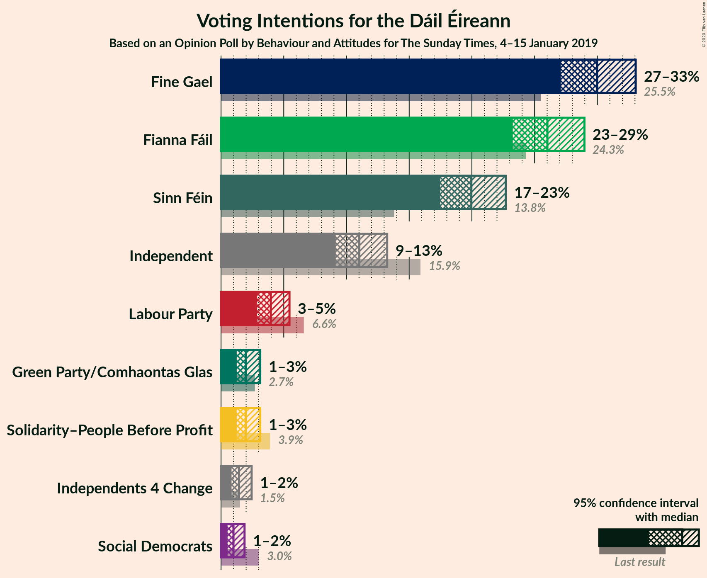
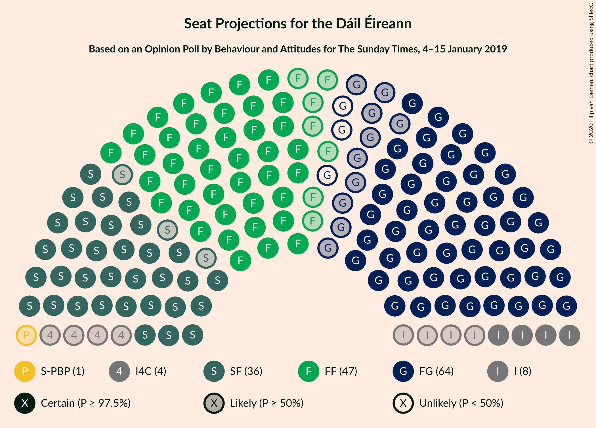
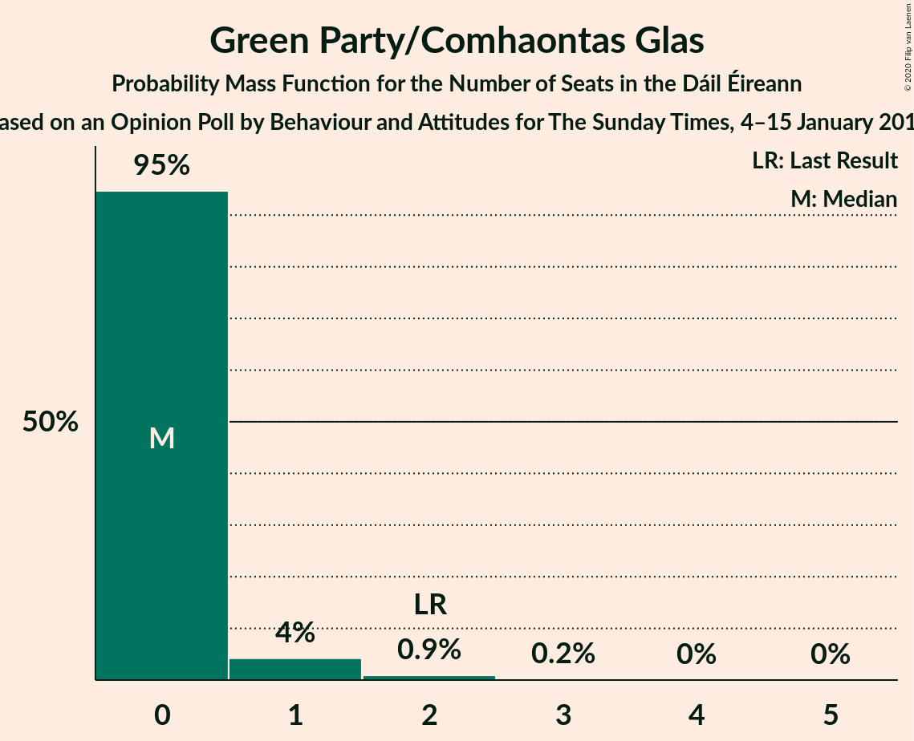
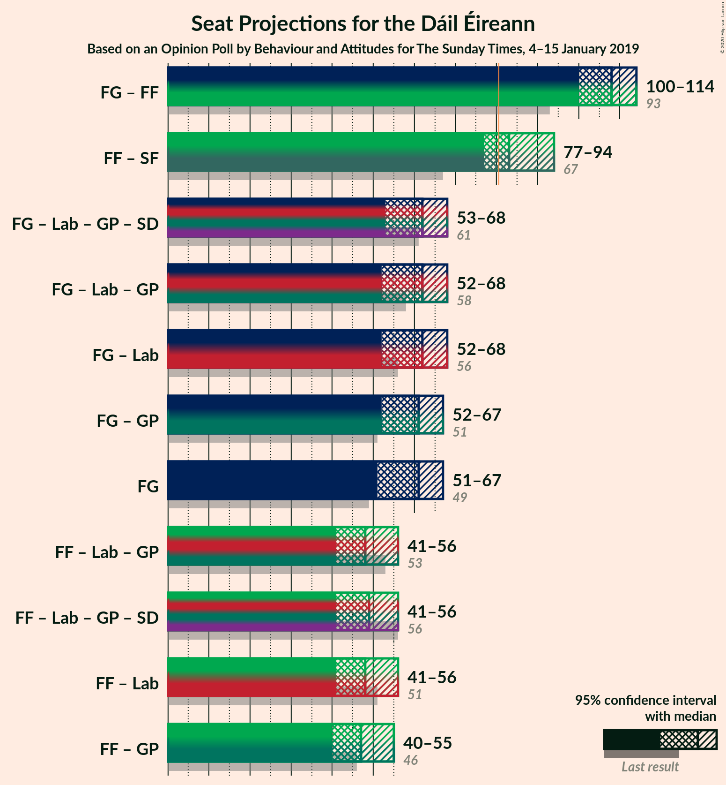
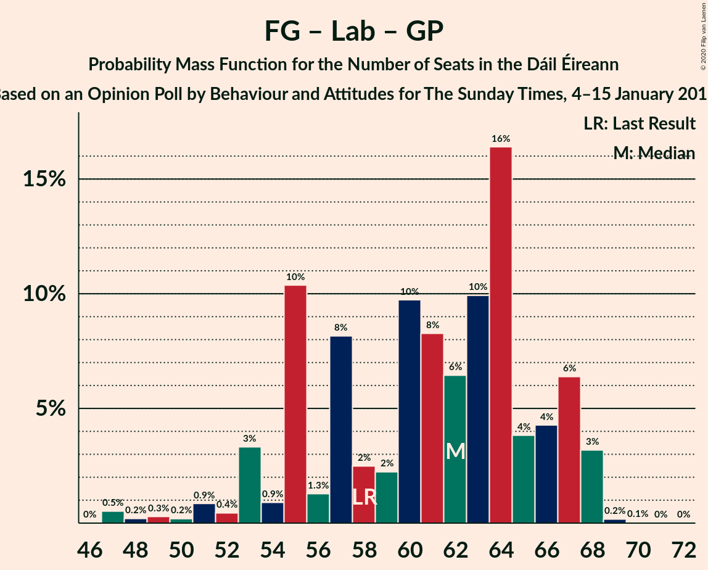

# Opinion Poll by Behaviour and Attitudes for The Sunday Times, 4–15 January 2019

<a href="#voting-intentions">Voting Intentions</a> | <a href="#seats">Seats</a> | <a href="#coalitions">Coalitions</a> | <a href="#technical-information">Technical Information</a>

## Voting Intentions

### Confidence Intervals

| Party | Last Result | Poll Result | 80% Confidence Interval | 90% Confidence Interval | 95% Confidence Interval | 99% Confidence Interval |
|:-----:|:-----------:|:-----------:|:-----------------------:|:-----------------------:|:-----------------------:|:-----------------------:|
| Fine Gael | 25.5% | 30.0% | 28.1–32.0% |27.6–32.6% |27.1–33.1% |26.2–34.0% |
| Fianna Fáil | 24.3% | 26.0% | 24.2–28.0% |23.7–28.5% |23.3–29.0% |22.4–29.9% |
| Sinn Féin | 13.8% | 20.0% | 18.3–21.7% |17.9–22.3% |17.5–22.7% |16.7–23.6% |
| Independent | 15.9% | 11.0% | 9.8–12.5% |9.4–12.9% |9.1–13.2% |8.6–14.0% |
| Labour Party | 6.6% | 4.0% | 3.2–4.9% |3.0–5.2% |2.9–5.5% |2.6–6.0% |
| Solidarity–People Before Profit | 3.9% | 2.0% | 1.5–2.7% |1.4–2.9% |1.2–3.1% |1.1–3.5% |
| Green Party/Comhaontas Glas | 2.7% | 2.0% | 1.5–2.7% |1.4–2.9% |1.2–3.1% |1.1–3.5% |
| Independents 4 Change | 1.5% | 1.4% | 1.0–2.1% |0.9–2.3% |0.8–2.4% |0.7–2.8% |
| Social Democrats | 3.0% | 1.0% | 0.7–1.6% |0.6–1.7% |0.5–1.9% |0.4–2.2% |

*Note:* The poll result column reflects the actual value used in the calculations. Published results may vary slightly, and in addition be rounded to fewer digits.

## Seats

### Confidence Intervals

| Party | Last Result | Median | 80% Confidence Interval | 90% Confidence Interval | 95% Confidence Interval | 99% Confidence Interval |
|:-----:|:-----------:|:------:|:-----------------------:|:-----------------------:|:-----------------------:|:-----------------------:|
| <a href="#fine-gael">Fine Gael</a> | 49 | 61 | 55–66 |52–67 |51–67 |47–68 |
| <a href="#fianna-fáil">Fianna Fáil</a> | 44 | 47 | 42–52 |41–54 |40–55 |38–57 |
| <a href="#sinn-féin">Sinn Féin</a> | 23 | 36 | 34–41 |33–42 |33–42 |33–43 |
| <a href="#independent">Independent</a> | 19 | 8 | 6–12 |6–14 |4–16 |4–16 |
| <a href="#labour-party">Labour Party</a> | 7 | 0 | 0–2 |0–2 |0–3 |0–6 |
| <a href="#solidarity–people-before-profit">Solidarity–People Before Profit</a> | 6 | 1 | 0–4 |0–4 |0–4 |0–4 |
| <a href="#green-party/comhaontas-glas">Green Party/Comhaontas Glas</a> | 2 | 0 | 0 |0–1 |0–1 |0–2 |
| <a href="#independents-4-change">Independents 4 Change</a> | 4 | 4 | 1–5 |0–5 |0–5 |0–5 |
| <a href="#social-democrats">Social Democrats</a> | 3 | 0 | 0–3 |0–3 |0–3 |0–3 |

### Fine Gael

*For a full overview of the results for this party, see the [Fine Gael](party-finegael.html) page.*

| Number of Seats | Probability | Accumulated | Special Marks |
|:---------------:|:-----------:|:-----------:|:-------------:|
| 45 | 0% | 100% |  |
| 46 | 0.1% | 99.9% |  |
| 47 | 0.7% | 99.9% |  |
| 48 | 0.3% | 99.2% |  |
| 49 | 0.1% | 98.9% | Last Result |
| 50 | 0.4% | 98.8% |  |
| 51 | 0.9% | 98% |  |
| 52 | 3% | 97% |  |
| 53 | 2% | 94% |  |
| 54 | 0.8% | 92% |  |
| 55 | 16% | 92% |  |
| 56 | 2% | 75% |  |
| 57 | 2% | 73% |  |
| 58 | 3% | 71% |  |
| 59 | 6% | 68% |  |
| 60 | 9% | 61% |  |
| 61 | 7% | 52% | Median |
| 62 | 8% | 45% |  |
| 63 | 7% | 37% |  |
| 64 | 16% | 30% |  |
| 65 | 4% | 14% |  |
| 66 | 3% | 11% |  |
| 67 | 7% | 8% |  |
| 68 | 0.7% | 0.7% |  |
| 69 | 0% | 0% |  |

### Fianna Fáil

*For a full overview of the results for this party, see the [Fianna Fáil](party-fiannafáil.html) page.*

| Number of Seats | Probability | Accumulated | Special Marks |
|:---------------:|:-----------:|:-----------:|:-------------:|
| 37 | 0.2% | 100% |  |
| 38 | 0.6% | 99.7% |  |
| 39 | 0.9% | 99.2% |  |
| 40 | 2% | 98% |  |
| 41 | 5% | 96% |  |
| 42 | 2% | 91% |  |
| 43 | 2% | 89% |  |
| 44 | 2% | 87% | Last Result |
| 45 | 6% | 84% |  |
| 46 | 15% | 78% |  |
| 47 | 16% | 63% | Median |
| 48 | 6% | 47% |  |
| 49 | 11% | 40% |  |
| 50 | 5% | 29% |  |
| 51 | 11% | 24% |  |
| 52 | 6% | 13% |  |
| 53 | 0.7% | 7% |  |
| 54 | 2% | 7% |  |
| 55 | 3% | 4% |  |
| 56 | 0.3% | 1.2% |  |
| 57 | 0.7% | 0.9% |  |
| 58 | 0.2% | 0.2% |  |
| 59 | 0% | 0% |  |

### Sinn Féin

*For a full overview of the results for this party, see the [Sinn Féin](party-sinnféin.html) page.*

| Number of Seats | Probability | Accumulated | Special Marks |
|:---------------:|:-----------:|:-----------:|:-------------:|
| 23 | 0% | 100% | Last Result |
| 24 | 0% | 100% |  |
| 25 | 0% | 100% |  |
| 26 | 0% | 100% |  |
| 27 | 0% | 100% |  |
| 28 | 0% | 100% |  |
| 29 | 0% | 100% |  |
| 30 | 0% | 100% |  |
| 31 | 0.1% | 99.9% |  |
| 32 | 0.2% | 99.8% |  |
| 33 | 6% | 99.6% |  |
| 34 | 13% | 94% |  |
| 35 | 12% | 80% |  |
| 36 | 22% | 68% | Median |
| 37 | 18% | 46% |  |
| 38 | 4% | 28% |  |
| 39 | 8% | 24% |  |
| 40 | 3% | 16% |  |
| 41 | 5% | 12% |  |
| 42 | 6% | 7% |  |
| 43 | 0.9% | 1.4% |  |
| 44 | 0.3% | 0.4% |  |
| 45 | 0.1% | 0.1% |  |
| 46 | 0% | 0% |  |

### Independent

*For a full overview of the results for this party, see the [Independent](party-independent.html) page.*

| Number of Seats | Probability | Accumulated | Special Marks |
|:---------------:|:-----------:|:-----------:|:-------------:|
| 3 | 0.1% | 100% |  |
| 4 | 2% | 99.9% |  |
| 5 | 1.5% | 97% |  |
| 6 | 12% | 96% |  |
| 7 | 34% | 84% |  |
| 8 | 11% | 50% | Median |
| 9 | 14% | 39% |  |
| 10 | 3% | 25% |  |
| 11 | 5% | 22% |  |
| 12 | 8% | 17% |  |
| 13 | 4% | 9% |  |
| 14 | 1.1% | 6% |  |
| 15 | 2% | 5% |  |
| 16 | 3% | 3% |  |
| 17 | 0% | 0% |  |
| 18 | 0% | 0% |  |
| 19 | 0% | 0% | Last Result |

### Labour Party

*For a full overview of the results for this party, see the [Labour Party](party-labourparty.html) page.*

| Number of Seats | Probability | Accumulated | Special Marks |
|:---------------:|:-----------:|:-----------:|:-------------:|
| 0 | 64% | 100% | Median |
| 1 | 12% | 36% |  |
| 2 | 20% | 23% |  |
| 3 | 2% | 4% |  |
| 4 | 0.7% | 2% |  |
| 5 | 0.7% | 1.2% |  |
| 6 | 0.3% | 0.5% |  |
| 7 | 0.1% | 0.2% | Last Result |
| 8 | 0% | 0% |  |

### Solidarity–People Before Profit

*For a full overview of the results for this party, see the [Solidarity–People Before Profit](party-solidarity–peoplebeforeprofit.html) page.*

| Number of Seats | Probability | Accumulated | Special Marks |
|:---------------:|:-----------:|:-----------:|:-------------:|
| 0 | 27% | 100% |  |
| 1 | 44% | 73% | Median |
| 2 | 4% | 29% |  |
| 3 | 7% | 24% |  |
| 4 | 17% | 17% |  |
| 5 | 0.1% | 0.1% |  |
| 6 | 0% | 0% | Last Result |

### Green Party/Comhaontas Glas

*For a full overview of the results for this party, see the [Green Party/Comhaontas Glas](party-greenpartycomhaontasglas.html) page.*

| Number of Seats | Probability | Accumulated | Special Marks |
|:---------------:|:-----------:|:-----------:|:-------------:|
| 0 | 95% | 100% | Median |
| 1 | 4% | 5% |  |
| 2 | 0.9% | 1.1% | Last Result |
| 3 | 0.2% | 0.2% |  |
| 4 | 0% | 0% |  |

### Independents 4 Change

*For a full overview of the results for this party, see the [Independents 4 Change](party-independents4change.html) page.*

| Number of Seats | Probability | Accumulated | Special Marks |
|:---------------:|:-----------:|:-----------:|:-------------:|
| 0 | 5% | 100% |  |
| 1 | 10% | 95% |  |
| 2 | 9% | 85% |  |
| 3 | 8% | 76% |  |
| 4 | 48% | 68% | Last Result, Median |
| 5 | 20% | 20% |  |
| 6 | 0% | 0% |  |

### Social Democrats

*For a full overview of the results for this party, see the [Social Democrats](party-socialdemocrats.html) page.*

| Number of Seats | Probability | Accumulated | Special Marks |
|:---------------:|:-----------:|:-----------:|:-------------:|
| 0 | 71% | 100% | Median |
| 1 | 7% | 29% |  |
| 2 | 10% | 22% |  |
| 3 | 11% | 11% | Last Result |
| 4 | 0% | 0% |  |

## Coalitions

### Confidence Intervals

| Coalition | Last Result | Median | Majority? | 80% Confidence Interval | 90% Confidence Interval | 95% Confidence Interval | 99% Confidence Interval |
|:---------:|:-----------:|:------:|:---------:|:-----------------------:|:-----------------------:|:-----------------------:|:-----------------------:|
| Fine Gael – Fianna Fáil | 93 | 108 | 100% | 104–111 | 102–112 | 100–114 | 97–115 |
| Fianna Fáil – Sinn Féin | 67 | 83 | 82% | 78–90 | 77–94 | 77–94 | 75–97 |
| Fine Gael – Labour Party – Green Party/Comhaontas Glas – Social Democrats | 61 | 62 | 0% | 55–67 | 53–68 | 53–68 | 47–71 |
| Fine Gael – Labour Party – Green Party/Comhaontas Glas | 58 | 62 | 0% | 55–66 | 53–67 | 52–68 | 47–68 |
| Fine Gael – Labour Party | 56 | 62 | 0% | 55–66 | 53–67 | 52–68 | 47–68 |
| Fine Gael – Green Party/Comhaontas Glas | 51 | 61 | 0% | 55–66 | 52–67 | 52–67 | 47–68 |
| Fine Gael | 49 | 61 | 0% | 55–66 | 52–67 | 51–67 | 47–68 |
| Fianna Fáil – Labour Party – Green Party/Comhaontas Glas | 53 | 48 | 0% | 43–54 | 41–56 | 41–56 | 38–58 |
| Fianna Fáil – Labour Party – Green Party/Comhaontas Glas – Social Democrats | 56 | 49 | 0% | 44–54 | 42–56 | 41–56 | 39–59 |
| Fianna Fáil – Labour Party | 51 | 48 | 0% | 43–54 | 41–56 | 41–56 | 38–58 |
| Fianna Fáil – Green Party/Comhaontas Glas | 46 | 47 | 0% | 42–52 | 41–54 | 40–55 | 38–57 |

### Fine Gael – Fianna Fáil

| Number of Seats | Probability | Accumulated | Special Marks |
|:---------------:|:-----------:|:-----------:|:-------------:|
| 93 | 0% | 100% | Last Result |
| 94 | 0.2% | 100% |  |
| 95 | 0.1% | 99.7% |  |
| 96 | 0.1% | 99.7% |  |
| 97 | 0.3% | 99.5% |  |
| 98 | 0.3% | 99.2% |  |
| 99 | 1.2% | 99.0% |  |
| 100 | 0.9% | 98% |  |
| 101 | 1.5% | 97% |  |
| 102 | 3% | 95% |  |
| 103 | 1.3% | 93% |  |
| 104 | 6% | 91% |  |
| 105 | 4% | 85% |  |
| 106 | 12% | 81% |  |
| 107 | 13% | 69% |  |
| 108 | 11% | 56% | Median |
| 109 | 8% | 45% |  |
| 110 | 21% | 38% |  |
| 111 | 9% | 17% |  |
| 112 | 4% | 7% |  |
| 113 | 1.0% | 4% |  |
| 114 | 1.2% | 3% |  |
| 115 | 1.3% | 1.4% |  |
| 116 | 0% | 0.1% |  |
| 117 | 0.1% | 0.1% |  |
| 118 | 0% | 0% |  |

### Fianna Fáil – Sinn Féin

| Number of Seats | Probability | Accumulated | Special Marks |
|:---------------:|:-----------:|:-----------:|:-------------:|
| 67 | 0% | 100% | Last Result |
| 68 | 0% | 100% |  |
| 69 | 0% | 100% |  |
| 70 | 0% | 100% |  |
| 71 | 0.1% | 100% |  |
| 72 | 0% | 99.9% |  |
| 73 | 0% | 99.9% |  |
| 74 | 0.2% | 99.8% |  |
| 75 | 0.9% | 99.6% |  |
| 76 | 0.8% | 98.7% |  |
| 77 | 4% | 98% |  |
| 78 | 4% | 94% |  |
| 79 | 5% | 90% |  |
| 80 | 2% | 85% |  |
| 81 | 7% | 82% | Majority |
| 82 | 5% | 75% |  |
| 83 | 21% | 70% | Median |
| 84 | 8% | 49% |  |
| 85 | 5% | 41% |  |
| 86 | 6% | 37% |  |
| 87 | 11% | 30% |  |
| 88 | 3% | 20% |  |
| 89 | 1.4% | 16% |  |
| 90 | 5% | 15% |  |
| 91 | 1.1% | 9% |  |
| 92 | 1.2% | 8% |  |
| 93 | 1.1% | 7% |  |
| 94 | 5% | 6% |  |
| 95 | 0.2% | 1.3% |  |
| 96 | 0.4% | 1.1% |  |
| 97 | 0.4% | 0.7% |  |
| 98 | 0.3% | 0.4% |  |
| 99 | 0% | 0% |  |

### Fine Gael – Labour Party – Green Party/Comhaontas Glas – Social Democrats

| Number of Seats | Probability | Accumulated | Special Marks |
|:---------------:|:-----------:|:-----------:|:-------------:|
| 47 | 0.5% | 100% |  |
| 48 | 0.2% | 99.5% |  |
| 49 | 0.3% | 99.3% |  |
| 50 | 0.1% | 99.0% |  |
| 51 | 0.7% | 98.9% |  |
| 52 | 0.2% | 98% |  |
| 53 | 3% | 98% |  |
| 54 | 0.6% | 95% |  |
| 55 | 8% | 94% |  |
| 56 | 1.1% | 86% |  |
| 57 | 9% | 85% |  |
| 58 | 1.5% | 75% |  |
| 59 | 2% | 74% |  |
| 60 | 8% | 72% |  |
| 61 | 6% | 64% | Last Result, Median |
| 62 | 9% | 58% |  |
| 63 | 6% | 50% |  |
| 64 | 18% | 43% |  |
| 65 | 8% | 25% |  |
| 66 | 5% | 17% |  |
| 67 | 6% | 12% |  |
| 68 | 3% | 6% |  |
| 69 | 0.5% | 2% |  |
| 70 | 1.0% | 2% |  |
| 71 | 0.6% | 0.6% |  |
| 72 | 0% | 0.1% |  |
| 73 | 0% | 0% |  |

### Fine Gael – Labour Party – Green Party/Comhaontas Glas

| Number of Seats | Probability | Accumulated | Special Marks |
|:---------------:|:-----------:|:-----------:|:-------------:|
| 47 | 0.5% | 100% |  |
| 48 | 0.2% | 99.4% |  |
| 49 | 0.3% | 99.2% |  |
| 50 | 0.2% | 98.9% |  |
| 51 | 0.9% | 98.8% |  |
| 52 | 0.4% | 98% |  |
| 53 | 3% | 97% |  |
| 54 | 0.9% | 94% |  |
| 55 | 10% | 93% |  |
| 56 | 1.3% | 83% |  |
| 57 | 8% | 82% |  |
| 58 | 2% | 73% | Last Result |
| 59 | 2% | 71% |  |
| 60 | 10% | 69% |  |
| 61 | 8% | 59% | Median |
| 62 | 6% | 51% |  |
| 63 | 10% | 44% |  |
| 64 | 16% | 34% |  |
| 65 | 4% | 18% |  |
| 66 | 4% | 14% |  |
| 67 | 6% | 10% |  |
| 68 | 3% | 3% |  |
| 69 | 0.2% | 0.2% |  |
| 70 | 0.1% | 0.1% |  |
| 71 | 0% | 0% |  |

### Fine Gael – Labour Party

| Number of Seats | Probability | Accumulated | Special Marks |
|:---------------:|:-----------:|:-----------:|:-------------:|
| 46 | 0.1% | 100% |  |
| 47 | 0.5% | 99.9% |  |
| 48 | 0.2% | 99.4% |  |
| 49 | 0.3% | 99.2% |  |
| 50 | 0.2% | 98.9% |  |
| 51 | 0.8% | 98.7% |  |
| 52 | 0.5% | 98% |  |
| 53 | 3% | 97% |  |
| 54 | 0.9% | 94% |  |
| 55 | 10% | 93% |  |
| 56 | 3% | 83% | Last Result |
| 57 | 6% | 80% |  |
| 58 | 3% | 73% |  |
| 59 | 2% | 71% |  |
| 60 | 9% | 68% |  |
| 61 | 8% | 59% | Median |
| 62 | 6% | 50% |  |
| 63 | 10% | 44% |  |
| 64 | 16% | 34% |  |
| 65 | 4% | 18% |  |
| 66 | 4% | 14% |  |
| 67 | 6% | 10% |  |
| 68 | 3% | 3% |  |
| 69 | 0.1% | 0.1% |  |
| 70 | 0% | 0% |  |

### Fine Gael – Green Party/Comhaontas Glas

| Number of Seats | Probability | Accumulated | Special Marks |
|:---------------:|:-----------:|:-----------:|:-------------:|
| 46 | 0.1% | 100% |  |
| 47 | 0.6% | 99.9% |  |
| 48 | 0.3% | 99.3% |  |
| 49 | 0.1% | 98.9% |  |
| 50 | 0.3% | 98.8% |  |
| 51 | 0.9% | 98% | Last Result |
| 52 | 3% | 98% |  |
| 53 | 2% | 95% |  |
| 54 | 0.7% | 93% |  |
| 55 | 15% | 92% |  |
| 56 | 3% | 77% |  |
| 57 | 2% | 74% |  |
| 58 | 3% | 71% |  |
| 59 | 6% | 68% |  |
| 60 | 9% | 62% |  |
| 61 | 7% | 53% | Median |
| 62 | 8% | 45% |  |
| 63 | 7% | 38% |  |
| 64 | 16% | 30% |  |
| 65 | 4% | 15% |  |
| 66 | 3% | 11% |  |
| 67 | 7% | 8% |  |
| 68 | 0.9% | 0.9% |  |
| 69 | 0.1% | 0.1% |  |
| 70 | 0% | 0% |  |

### Fine Gael

| Number of Seats | Probability | Accumulated | Special Marks |
|:---------------:|:-----------:|:-----------:|:-------------:|
| 45 | 0% | 100% |  |
| 46 | 0.1% | 99.9% |  |
| 47 | 0.7% | 99.9% |  |
| 48 | 0.3% | 99.2% |  |
| 49 | 0.1% | 98.9% | Last Result |
| 50 | 0.4% | 98.8% |  |
| 51 | 0.9% | 98% |  |
| 52 | 3% | 97% |  |
| 53 | 2% | 94% |  |
| 54 | 0.8% | 92% |  |
| 55 | 16% | 92% |  |
| 56 | 2% | 75% |  |
| 57 | 2% | 73% |  |
| 58 | 3% | 71% |  |
| 59 | 6% | 68% |  |
| 60 | 9% | 61% |  |
| 61 | 7% | 52% | Median |
| 62 | 8% | 45% |  |
| 63 | 7% | 37% |  |
| 64 | 16% | 30% |  |
| 65 | 4% | 14% |  |
| 66 | 3% | 11% |  |
| 67 | 7% | 8% |  |
| 68 | 0.7% | 0.7% |  |
| 69 | 0% | 0% |  |

### Fianna Fáil – Labour Party – Green Party/Comhaontas Glas

| Number of Seats | Probability | Accumulated | Special Marks |
|:---------------:|:-----------:|:-----------:|:-------------:|
| 37 | 0.1% | 100% |  |
| 38 | 0.4% | 99.9% |  |
| 39 | 0.6% | 99.5% |  |
| 40 | 0.6% | 98.8% |  |
| 41 | 5% | 98% |  |
| 42 | 3% | 94% |  |
| 43 | 2% | 91% |  |
| 44 | 2% | 89% |  |
| 45 | 6% | 87% |  |
| 46 | 14% | 80% |  |
| 47 | 14% | 66% | Median |
| 48 | 5% | 53% |  |
| 49 | 10% | 48% |  |
| 50 | 5% | 38% |  |
| 51 | 16% | 33% |  |
| 52 | 3% | 17% |  |
| 53 | 1.2% | 14% | Last Result |
| 54 | 7% | 13% |  |
| 55 | 0.9% | 6% |  |
| 56 | 4% | 5% |  |
| 57 | 0.7% | 1.4% |  |
| 58 | 0.4% | 0.7% |  |
| 59 | 0.2% | 0.3% |  |
| 60 | 0% | 0.1% |  |
| 61 | 0% | 0% |  |

### Fianna Fáil – Labour Party – Green Party/Comhaontas Glas – Social Democrats

| Number of Seats | Probability | Accumulated | Special Marks |
|:---------------:|:-----------:|:-----------:|:-------------:|
| 38 | 0.2% | 100% |  |
| 39 | 0.4% | 99.7% |  |
| 40 | 0.5% | 99.3% |  |
| 41 | 4% | 98.8% |  |
| 42 | 3% | 95% |  |
| 43 | 1.0% | 92% |  |
| 44 | 3% | 91% |  |
| 45 | 4% | 88% |  |
| 46 | 16% | 84% |  |
| 47 | 8% | 68% | Median |
| 48 | 3% | 60% |  |
| 49 | 12% | 57% |  |
| 50 | 5% | 46% |  |
| 51 | 17% | 40% |  |
| 52 | 4% | 23% |  |
| 53 | 4% | 19% |  |
| 54 | 8% | 15% |  |
| 55 | 1.1% | 7% |  |
| 56 | 4% | 6% | Last Result |
| 57 | 0.8% | 2% |  |
| 58 | 0.5% | 1.2% |  |
| 59 | 0.4% | 0.7% |  |
| 60 | 0.1% | 0.3% |  |
| 61 | 0.2% | 0.2% |  |
| 62 | 0% | 0% |  |

### Fianna Fáil – Labour Party

| Number of Seats | Probability | Accumulated | Special Marks |
|:---------------:|:-----------:|:-----------:|:-------------:|
| 37 | 0.1% | 100% |  |
| 38 | 0.5% | 99.9% |  |
| 39 | 0.8% | 99.4% |  |
| 40 | 0.4% | 98.5% |  |
| 41 | 4% | 98% |  |
| 42 | 3% | 94% |  |
| 43 | 2% | 90% |  |
| 44 | 2% | 89% |  |
| 45 | 6% | 86% |  |
| 46 | 14% | 80% |  |
| 47 | 14% | 66% | Median |
| 48 | 5% | 52% |  |
| 49 | 10% | 47% |  |
| 50 | 7% | 38% |  |
| 51 | 15% | 31% | Last Result |
| 52 | 3% | 17% |  |
| 53 | 1.2% | 13% |  |
| 54 | 6% | 12% |  |
| 55 | 0.9% | 6% |  |
| 56 | 4% | 5% |  |
| 57 | 0.6% | 1.3% |  |
| 58 | 0.4% | 0.7% |  |
| 59 | 0.2% | 0.3% |  |
| 60 | 0% | 0% |  |

### Fianna Fáil – Green Party/Comhaontas Glas

| Number of Seats | Probability | Accumulated | Special Marks |
|:---------------:|:-----------:|:-----------:|:-------------:|
| 37 | 0.2% | 100% |  |
| 38 | 0.5% | 99.7% |  |
| 39 | 0.7% | 99.3% |  |
| 40 | 2% | 98.5% |  |
| 41 | 5% | 96% |  |
| 42 | 2% | 91% |  |
| 43 | 2% | 89% |  |
| 44 | 3% | 87% |  |
| 45 | 6% | 85% |  |
| 46 | 15% | 78% | Last Result |
| 47 | 16% | 63% | Median |
| 48 | 6% | 47% |  |
| 49 | 10% | 41% |  |
| 50 | 6% | 31% |  |
| 51 | 11% | 25% |  |
| 52 | 6% | 13% |  |
| 53 | 0.8% | 8% |  |
| 54 | 2% | 7% |  |
| 55 | 3% | 4% |  |
| 56 | 0.4% | 1.3% |  |
| 57 | 0.7% | 0.9% |  |
| 58 | 0.2% | 0.2% |  |
| 59 | 0% | 0% |  |

## Technical Information

### Opinion Poll

+ **Polling firm:** Behaviour and Attitudes
+ **Commissioner(s):** The Sunday Times
+ **Fieldwork period:** 4–15 January 2019

### Calculations

+ **Sample size:** 907
+ **Simulations done:** 524,288
+ **Error estimate:** 2.24%

