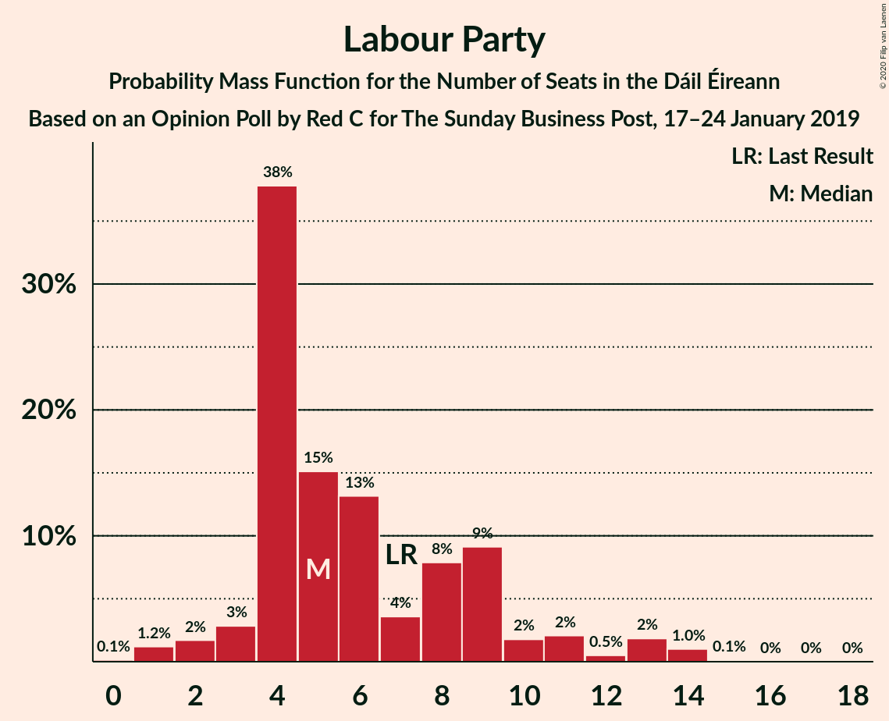
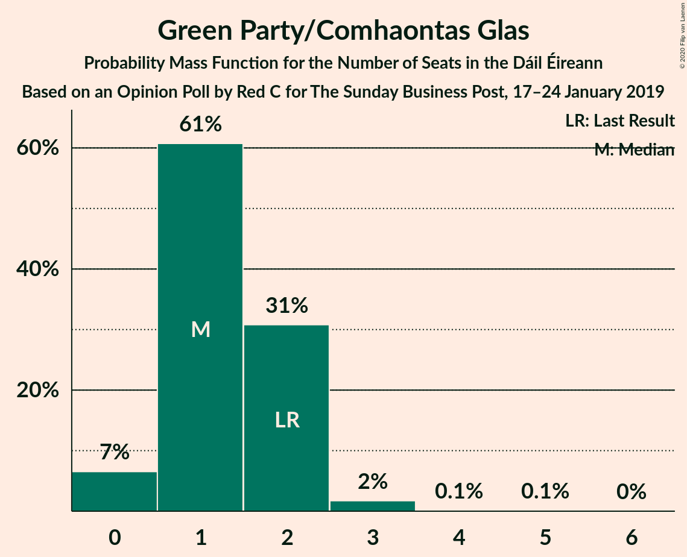
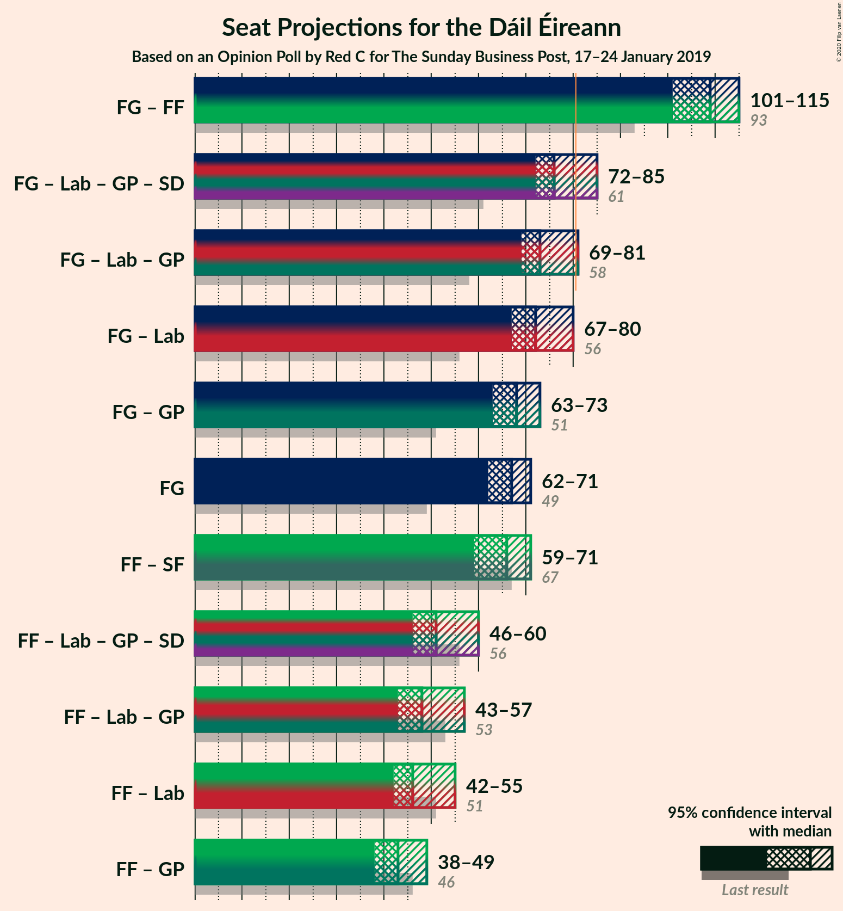
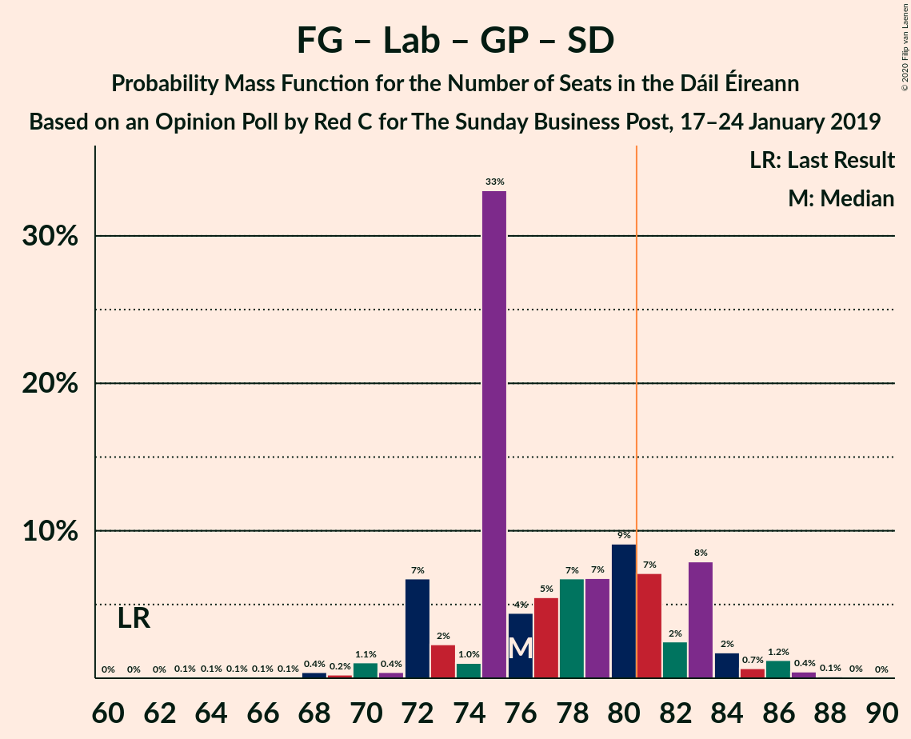
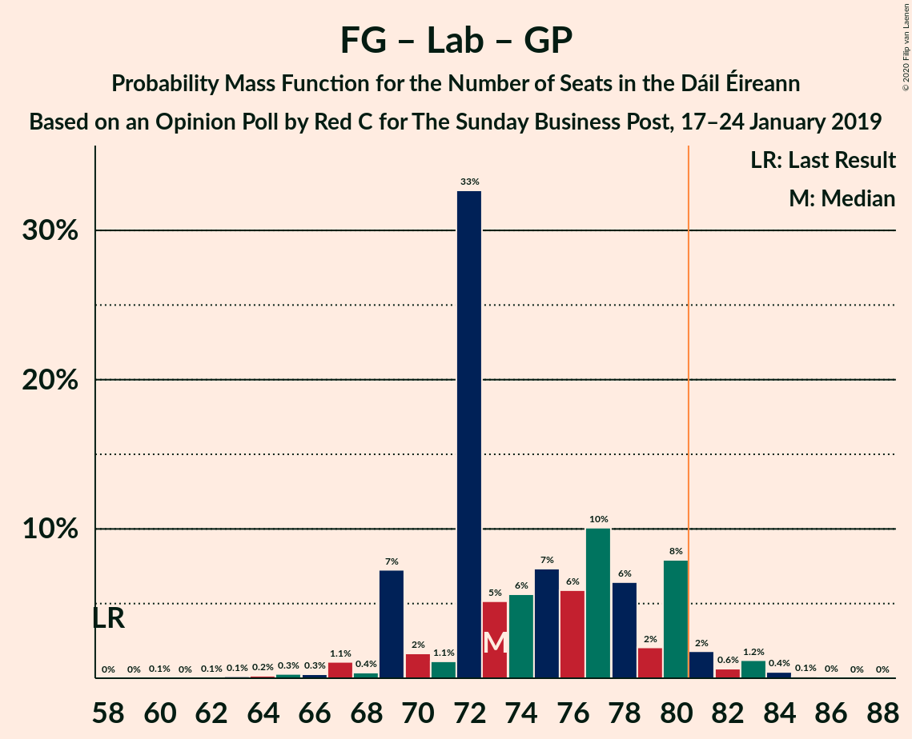

# Opinion Poll by Red C for The Sunday Business Post, 17–24 January 2019

<a href="#voting-intentions">Voting Intentions</a> | <a href="#seats">Seats</a> | <a href="#coalitions">Coalitions</a> | <a href="#technical-information">Technical Information</a>

## Voting Intentions

### Confidence Intervals

| Party | Last Result | Poll Result | 80% Confidence Interval | 90% Confidence Interval | 95% Confidence Interval | 99% Confidence Interval |
|:-----:|:-----------:|:-----------:|:-----------------------:|:-----------------------:|:-----------------------:|:-----------------------:|
| Fine Gael | 25.5% | 32.2% | 30.3–34.1% |29.8–34.7% |29.4–35.2% |28.5–36.1% |
| Fianna Fáil | 24.3% | 22.2% | 20.6–24.0% |20.1–24.4% |19.7–24.9% |19.0–25.7% |
| Sinn Féin | 13.8% | 13.1% | 11.8–14.6% |11.4–15.0% |11.1–15.3% |10.6–16.1% |
| Independent | 15.9% | 11.9% | 10.7–13.3% |10.3–13.7% |10.0–14.1% |9.5–14.8% |
| Labour Party | 6.6% | 6.0% | 5.1–7.1% |4.9–7.4% |4.7–7.7% |4.3–8.2% |
| Green Party/Comhaontas Glas | 2.7% | 3.0% | 2.4–3.8% |2.2–4.1% |2.1–4.3% |1.9–4.7% |
| Solidarity–People Before Profit | 3.9% | 2.0% | 1.5–2.7% |1.4–2.9% |1.3–3.1% |1.1–3.4% |
| Social Democrats | 3.0% | 2.0% | 1.5–2.7% |1.4–2.9% |1.3–3.1% |1.1–3.4% |
| Independents 4 Change | 1.5% | 1.5% | 1.1–2.1% |1.0–2.3% |0.9–2.5% |0.7–2.8% |
| Renua Ireland | 2.2% | 0.3% | 0.2–0.7% |0.1–0.8% |0.1–0.9% |0.1–1.1% |

*Note:* The poll result column reflects the actual value used in the calculations. Published results may vary slightly, and in addition be rounded to fewer digits.

## Seats

### Confidence Intervals

| Party | Last Result | Median | 80% Confidence Interval | 90% Confidence Interval | 95% Confidence Interval | 99% Confidence Interval |
|:-----:|:-----------:|:------:|:-----------------------:|:-----------------------:|:-----------------------:|:-----------------------:|
| <a href="#fine-gael">Fine Gael</a> | 49 | 67 | 63–70 |62–71 |62–71 |57–71 |
| <a href="#fianna-fáil">Fianna Fáil</a> | 44 | 42 | 39–46 |38–46 |37–47 |35–50 |
| <a href="#sinn-féin">Sinn Féin</a> | 23 | 25 | 20–28 |19–29 |18–30 |16–33 |
| <a href="#independent">Independent</a> | 19 | 9 | 8–14 |8–15 |7–16 |5–16 |
| <a href="#labour-party">Labour Party</a> | 7 | 5 | 4–9 |3–11 |2–13 |1–14 |
| <a href="#green-party/comhaontas-glas">Green Party/Comhaontas Glas</a> | 2 | 1 | 1–2 |0–2 |0–2 |0–3 |
| <a href="#solidarity–people-before-profit">Solidarity–People Before Profit</a> | 6 | 2 | 0–3 |0–3 |0–3 |0–4 |
| <a href="#social-democrats">Social Democrats</a> | 3 | 3 | 3 |3–4 |3–4 |1–4 |
| <a href="#independents-4-change">Independents 4 Change</a> | 4 | 4 | 3–5 |2–5 |2–5 |1–5 |
| <a href="#renua-ireland">Renua Ireland</a> | 0 | 0 | 0 |0 |0 |0 |

### Fine Gael

*For a full overview of the results for this party, see the [Fine Gael](party-finegael.html) page.*

| Number of Seats | Probability | Accumulated | Special Marks |
|:---------------:|:-----------:|:-----------:|:-------------:|
| 49 | 0% | 100% | Last Result |
| 50 | 0% | 100% |  |
| 51 | 0% | 100% |  |
| 52 | 0.1% | 100% |  |
| 53 | 0% | 99.9% |  |
| 54 | 0.1% | 99.9% |  |
| 55 | 0.1% | 99.8% |  |
| 56 | 0.1% | 99.8% |  |
| 57 | 0.2% | 99.7% |  |
| 58 | 0.1% | 99.4% |  |
| 59 | 0.4% | 99.3% |  |
| 60 | 0.5% | 98.9% |  |
| 61 | 0.5% | 98% |  |
| 62 | 6% | 98% |  |
| 63 | 4% | 91% |  |
| 64 | 2% | 87% |  |
| 65 | 2% | 85% |  |
| 66 | 5% | 83% |  |
| 67 | 35% | 78% | Median |
| 68 | 6% | 43% |  |
| 69 | 16% | 37% |  |
| 70 | 14% | 21% |  |
| 71 | 7% | 7% |  |
| 72 | 0.2% | 0.4% |  |
| 73 | 0.2% | 0.2% |  |
| 74 | 0% | 0% |  |

### Fianna Fáil

*For a full overview of the results for this party, see the [Fianna Fáil](party-fiannafáil.html) page.*

| Number of Seats | Probability | Accumulated | Special Marks |
|:---------------:|:-----------:|:-----------:|:-------------:|
| 34 | 0.3% | 100% |  |
| 35 | 0.8% | 99.7% |  |
| 36 | 0.2% | 98.9% |  |
| 37 | 3% | 98.7% |  |
| 38 | 4% | 96% |  |
| 39 | 7% | 92% |  |
| 40 | 8% | 86% |  |
| 41 | 12% | 78% |  |
| 42 | 36% | 66% | Median |
| 43 | 5% | 30% |  |
| 44 | 4% | 25% | Last Result |
| 45 | 9% | 21% |  |
| 46 | 8% | 12% |  |
| 47 | 2% | 4% |  |
| 48 | 0.7% | 2% |  |
| 49 | 0.3% | 1.1% |  |
| 50 | 0.5% | 0.7% |  |
| 51 | 0.2% | 0.3% |  |
| 52 | 0.1% | 0.1% |  |
| 53 | 0% | 0% |  |

### Sinn Féin

*For a full overview of the results for this party, see the [Sinn Féin](party-sinnféin.html) page.*

| Number of Seats | Probability | Accumulated | Special Marks |
|:---------------:|:-----------:|:-----------:|:-------------:|
| 15 | 0.2% | 100% |  |
| 16 | 0.5% | 99.8% |  |
| 17 | 0.9% | 99.3% |  |
| 18 | 2% | 98% |  |
| 19 | 3% | 96% |  |
| 20 | 17% | 93% |  |
| 21 | 5% | 76% |  |
| 22 | 5% | 71% |  |
| 23 | 3% | 65% | Last Result |
| 24 | 10% | 62% |  |
| 25 | 10% | 52% | Median |
| 26 | 2% | 43% |  |
| 27 | 5% | 41% |  |
| 28 | 30% | 36% |  |
| 29 | 2% | 6% |  |
| 30 | 2% | 4% |  |
| 31 | 0.7% | 2% |  |
| 32 | 0.8% | 1.4% |  |
| 33 | 0.4% | 0.6% |  |
| 34 | 0.1% | 0.2% |  |
| 35 | 0.1% | 0.1% |  |
| 36 | 0% | 0% |  |

### Independent

*For a full overview of the results for this party, see the [Independent](party-independent.html) page.*

| Number of Seats | Probability | Accumulated | Special Marks |
|:---------------:|:-----------:|:-----------:|:-------------:|
| 4 | 0.3% | 100% |  |
| 5 | 1.0% | 99.7% |  |
| 6 | 1.1% | 98.7% |  |
| 7 | 2% | 98% |  |
| 8 | 16% | 96% |  |
| 9 | 30% | 80% | Median |
| 10 | 4% | 50% |  |
| 11 | 7% | 46% |  |
| 12 | 13% | 39% |  |
| 13 | 11% | 27% |  |
| 14 | 7% | 16% |  |
| 15 | 6% | 9% |  |
| 16 | 3% | 3% |  |
| 17 | 0% | 0% |  |
| 18 | 0% | 0% |  |
| 19 | 0% | 0% | Last Result |

### Labour Party

*For a full overview of the results for this party, see the [Labour Party](party-labourparty.html) page.*

| Number of Seats | Probability | Accumulated | Special Marks |
|:---------------:|:-----------:|:-----------:|:-------------:|
| 0 | 0.1% | 100% |  |
| 1 | 1.2% | 99.9% |  |
| 2 | 2% | 98.7% |  |
| 3 | 3% | 97% |  |
| 4 | 38% | 94% |  |
| 5 | 15% | 56% | Median |
| 6 | 13% | 41% |  |
| 7 | 4% | 28% | Last Result |
| 8 | 8% | 24% |  |
| 9 | 9% | 17% |  |
| 10 | 2% | 7% |  |
| 11 | 2% | 6% |  |
| 12 | 0.5% | 4% |  |
| 13 | 2% | 3% |  |
| 14 | 1.0% | 1.2% |  |
| 15 | 0.1% | 0.2% |  |
| 16 | 0% | 0.1% |  |
| 17 | 0% | 0% |  |

### Green Party/Comhaontas Glas

*For a full overview of the results for this party, see the [Green Party/Comhaontas Glas](party-greenpartycomhaontasglas.html) page.*

| Number of Seats | Probability | Accumulated | Special Marks |
|:---------------:|:-----------:|:-----------:|:-------------:|
| 0 | 7% | 100% |  |
| 1 | 61% | 93% | Median |
| 2 | 31% | 33% | Last Result |
| 3 | 2% | 2% |  |
| 4 | 0.1% | 0.2% |  |
| 5 | 0.1% | 0.1% |  |
| 6 | 0% | 0% |  |

### Solidarity–People Before Profit

*For a full overview of the results for this party, see the [Solidarity–People Before Profit](party-solidarity–peoplebeforeprofit.html) page.*

| Number of Seats | Probability | Accumulated | Special Marks |
|:---------------:|:-----------:|:-----------:|:-------------:|
| 0 | 32% | 100% |  |
| 1 | 4% | 68% |  |
| 2 | 42% | 64% | Median |
| 3 | 21% | 22% |  |
| 4 | 1.3% | 1.4% |  |
| 5 | 0% | 0% |  |
| 6 | 0% | 0% | Last Result |

### Social Democrats

*For a full overview of the results for this party, see the [Social Democrats](party-socialdemocrats.html) page.*

| Number of Seats | Probability | Accumulated | Special Marks |
|:---------------:|:-----------:|:-----------:|:-------------:|
| 1 | 0.8% | 100% |  |
| 2 | 0.4% | 99.2% |  |
| 3 | 93% | 98.8% | Last Result, Median |
| 4 | 5% | 5% |  |
| 5 | 0% | 0% |  |

### Independents 4 Change

*For a full overview of the results for this party, see the [Independents 4 Change](party-independents4change.html) page.*

| Number of Seats | Probability | Accumulated | Special Marks |
|:---------------:|:-----------:|:-----------:|:-------------:|
| 0 | 0.4% | 100% |  |
| 1 | 1.1% | 99.6% |  |
| 2 | 8% | 98.5% |  |
| 3 | 12% | 91% |  |
| 4 | 56% | 78% | Last Result, Median |
| 5 | 22% | 22% |  |
| 6 | 0% | 0% |  |

### Renua Ireland

*For a full overview of the results for this party, see the [Renua Ireland](party-renuaireland.html) page.*

| Number of Seats | Probability | Accumulated | Special Marks |
|:---------------:|:-----------:|:-----------:|:-------------:|
| 0 | 100% | 100% | Last Result, Median |

## Coalitions

### Confidence Intervals

| Coalition | Last Result | Median | Majority? | 80% Confidence Interval | 90% Confidence Interval | 95% Confidence Interval | 99% Confidence Interval |
|:---------:|:-----------:|:------:|:---------:|:-----------------------:|:-----------------------:|:-----------------------:|:-----------------------:|
| Fine Gael – Fianna Fáil | 93 | 109 | 100% | 104–115 | 103–115 | 101–115 | 99–117 |
| Fine Gael – Labour Party – Green Party/Comhaontas Glas – Social Democrats | 61 | 76 | 22% | 73–83 | 72–83 | 72–85 | 68–87 |
| Fine Gael – Labour Party – Green Party/Comhaontas Glas | 58 | 73 | 4% | 70–80 | 69–80 | 69–81 | 65–84 |
| Fine Gael – Labour Party | 56 | 72 | 2% | 68–78 | 67–79 | 67–80 | 63–83 |
| Fine Gael – Green Party/Comhaontas Glas | 51 | 68 | 0% | 65–71 | 64–72 | 63–73 | 59–73 |
| Fine Gael | 49 | 67 | 0% | 63–70 | 62–71 | 62–71 | 57–71 |
| Fianna Fáil – Sinn Féin | 67 | 66 | 0% | 62–70 | 60–70 | 59–71 | 57–75 |
| Fianna Fáil – Labour Party – Green Party/Comhaontas Glas – Social Democrats | 56 | 51 | 0% | 49–58 | 47–60 | 46–60 | 44–62 |
| Fianna Fáil – Labour Party – Green Party/Comhaontas Glas | 53 | 48 | 0% | 46–55 | 44–57 | 43–57 | 41–59 |
| Fianna Fáil – Labour Party | 51 | 46 | 0% | 45–53 | 42–55 | 42–55 | 40–58 |
| Fianna Fáil – Green Party/Comhaontas Glas | 46 | 43 | 0% | 40–48 | 39–48 | 38–49 | 36–53 |

### Fine Gael – Fianna Fáil

| Number of Seats | Probability | Accumulated | Special Marks |
|:---------------:|:-----------:|:-----------:|:-------------:|
| 93 | 0% | 100% | Last Result |
| 94 | 0% | 100% |  |
| 95 | 0% | 100% |  |
| 96 | 0.1% | 99.9% |  |
| 97 | 0.2% | 99.9% |  |
| 98 | 0.1% | 99.7% |  |
| 99 | 0.4% | 99.6% |  |
| 100 | 0.9% | 99.2% |  |
| 101 | 1.1% | 98% |  |
| 102 | 1.0% | 97% |  |
| 103 | 3% | 96% |  |
| 104 | 6% | 93% |  |
| 105 | 3% | 87% |  |
| 106 | 5% | 84% |  |
| 107 | 2% | 79% |  |
| 108 | 8% | 77% |  |
| 109 | 33% | 68% | Median |
| 110 | 3% | 35% |  |
| 111 | 5% | 32% |  |
| 112 | 6% | 27% |  |
| 113 | 2% | 21% |  |
| 114 | 1.0% | 20% |  |
| 115 | 17% | 19% |  |
| 116 | 0.9% | 2% |  |
| 117 | 0.3% | 0.8% |  |
| 118 | 0.4% | 0.5% |  |
| 119 | 0.1% | 0.1% |  |
| 120 | 0% | 0% |  |

### Fine Gael – Labour Party – Green Party/Comhaontas Glas – Social Democrats

| Number of Seats | Probability | Accumulated | Special Marks |
|:---------------:|:-----------:|:-----------:|:-------------:|
| 61 | 0% | 100% | Last Result |
| 62 | 0% | 100% |  |
| 63 | 0.1% | 100% |  |
| 64 | 0.1% | 99.9% |  |
| 65 | 0.1% | 99.9% |  |
| 66 | 0.1% | 99.8% |  |
| 67 | 0.1% | 99.7% |  |
| 68 | 0.4% | 99.7% |  |
| 69 | 0.2% | 99.3% |  |
| 70 | 1.1% | 99.0% |  |
| 71 | 0.4% | 98% |  |
| 72 | 7% | 98% |  |
| 73 | 2% | 91% |  |
| 74 | 1.0% | 88% |  |
| 75 | 33% | 87% |  |
| 76 | 4% | 54% | Median |
| 77 | 5% | 50% |  |
| 78 | 7% | 44% |  |
| 79 | 7% | 38% |  |
| 80 | 9% | 31% |  |
| 81 | 7% | 22% | Majority |
| 82 | 2% | 15% |  |
| 83 | 8% | 12% |  |
| 84 | 2% | 4% |  |
| 85 | 0.7% | 3% |  |
| 86 | 1.2% | 2% |  |
| 87 | 0.4% | 0.6% |  |
| 88 | 0.1% | 0.2% |  |
| 89 | 0% | 0.1% |  |
| 90 | 0% | 0% |  |

### Fine Gael – Labour Party – Green Party/Comhaontas Glas

| Number of Seats | Probability | Accumulated | Special Marks |
|:---------------:|:-----------:|:-----------:|:-------------:|
| 58 | 0% | 100% | Last Result |
| 59 | 0% | 100% |  |
| 60 | 0.1% | 100% |  |
| 61 | 0% | 99.9% |  |
| 62 | 0.1% | 99.9% |  |
| 63 | 0.1% | 99.9% |  |
| 64 | 0.2% | 99.7% |  |
| 65 | 0.3% | 99.6% |  |
| 66 | 0.3% | 99.3% |  |
| 67 | 1.1% | 99.0% |  |
| 68 | 0.4% | 98% |  |
| 69 | 7% | 98% |  |
| 70 | 2% | 90% |  |
| 71 | 1.1% | 89% |  |
| 72 | 33% | 87% |  |
| 73 | 5% | 55% | Median |
| 74 | 6% | 50% |  |
| 75 | 7% | 44% |  |
| 76 | 6% | 37% |  |
| 77 | 10% | 31% |  |
| 78 | 6% | 21% |  |
| 79 | 2% | 14% |  |
| 80 | 8% | 12% |  |
| 81 | 2% | 4% | Majority |
| 82 | 0.6% | 2% |  |
| 83 | 1.2% | 2% |  |
| 84 | 0.4% | 0.6% |  |
| 85 | 0.1% | 0.2% |  |
| 86 | 0% | 0.1% |  |
| 87 | 0% | 0% |  |

### Fine Gael – Labour Party

| Number of Seats | Probability | Accumulated | Special Marks |
|:---------------:|:-----------:|:-----------:|:-------------:|
| 56 | 0% | 100% | Last Result |
| 57 | 0% | 100% |  |
| 58 | 0% | 100% |  |
| 59 | 0% | 100% |  |
| 60 | 0% | 99.9% |  |
| 61 | 0% | 99.9% |  |
| 62 | 0.2% | 99.8% |  |
| 63 | 0.2% | 99.6% |  |
| 64 | 0.1% | 99.4% |  |
| 65 | 0.5% | 99.3% |  |
| 66 | 1.0% | 98.8% |  |
| 67 | 7% | 98% |  |
| 68 | 0.9% | 91% |  |
| 69 | 2% | 90% |  |
| 70 | 1.0% | 88% |  |
| 71 | 35% | 87% |  |
| 72 | 5% | 52% | Median |
| 73 | 4% | 47% |  |
| 74 | 9% | 43% |  |
| 75 | 3% | 34% |  |
| 76 | 14% | 31% |  |
| 77 | 4% | 18% |  |
| 78 | 8% | 13% |  |
| 79 | 2% | 5% |  |
| 80 | 0.7% | 3% |  |
| 81 | 0.6% | 2% | Majority |
| 82 | 1.2% | 2% |  |
| 83 | 0.5% | 0.6% |  |
| 84 | 0.1% | 0.1% |  |
| 85 | 0.1% | 0.1% |  |
| 86 | 0% | 0% |  |

### Fine Gael – Green Party/Comhaontas Glas

| Number of Seats | Probability | Accumulated | Special Marks |
|:---------------:|:-----------:|:-----------:|:-------------:|
| 51 | 0% | 100% | Last Result |
| 52 | 0% | 100% |  |
| 53 | 0% | 100% |  |
| 54 | 0.1% | 100% |  |
| 55 | 0% | 99.9% |  |
| 56 | 0.1% | 99.8% |  |
| 57 | 0% | 99.8% |  |
| 58 | 0.2% | 99.7% |  |
| 59 | 0.2% | 99.5% |  |
| 60 | 0.2% | 99.4% |  |
| 61 | 0.6% | 99.2% |  |
| 62 | 0.6% | 98.6% |  |
| 63 | 1.0% | 98% |  |
| 64 | 7% | 97% |  |
| 65 | 5% | 90% |  |
| 66 | 3% | 85% |  |
| 67 | 3% | 82% |  |
| 68 | 37% | 79% | Median |
| 69 | 2% | 42% |  |
| 70 | 9% | 40% |  |
| 71 | 24% | 32% |  |
| 72 | 5% | 8% |  |
| 73 | 3% | 3% |  |
| 74 | 0.1% | 0.3% |  |
| 75 | 0.2% | 0.2% |  |
| 76 | 0% | 0% |  |

### Fine Gael

| Number of Seats | Probability | Accumulated | Special Marks |
|:---------------:|:-----------:|:-----------:|:-------------:|
| 49 | 0% | 100% | Last Result |
| 50 | 0% | 100% |  |
| 51 | 0% | 100% |  |
| 52 | 0.1% | 100% |  |
| 53 | 0% | 99.9% |  |
| 54 | 0.1% | 99.9% |  |
| 55 | 0.1% | 99.8% |  |
| 56 | 0.1% | 99.8% |  |
| 57 | 0.2% | 99.7% |  |
| 58 | 0.1% | 99.4% |  |
| 59 | 0.4% | 99.3% |  |
| 60 | 0.5% | 98.9% |  |
| 61 | 0.5% | 98% |  |
| 62 | 6% | 98% |  |
| 63 | 4% | 91% |  |
| 64 | 2% | 87% |  |
| 65 | 2% | 85% |  |
| 66 | 5% | 83% |  |
| 67 | 35% | 78% | Median |
| 68 | 6% | 43% |  |
| 69 | 16% | 37% |  |
| 70 | 14% | 21% |  |
| 71 | 7% | 7% |  |
| 72 | 0.2% | 0.4% |  |
| 73 | 0.2% | 0.2% |  |
| 74 | 0% | 0% |  |

### Fianna Fáil – Sinn Féin

| Number of Seats | Probability | Accumulated | Special Marks |
|:---------------:|:-----------:|:-----------:|:-------------:|
| 56 | 0.1% | 100% |  |
| 57 | 0.4% | 99.8% |  |
| 58 | 0.9% | 99.4% |  |
| 59 | 3% | 98.5% |  |
| 60 | 2% | 95% |  |
| 61 | 3% | 94% |  |
| 62 | 7% | 91% |  |
| 63 | 3% | 85% |  |
| 64 | 4% | 82% |  |
| 65 | 14% | 77% |  |
| 66 | 19% | 63% |  |
| 67 | 3% | 44% | Last Result, Median |
| 68 | 3% | 42% |  |
| 69 | 2% | 39% |  |
| 70 | 33% | 37% |  |
| 71 | 1.3% | 4% |  |
| 72 | 0.9% | 2% |  |
| 73 | 0.6% | 2% |  |
| 74 | 0.2% | 0.9% |  |
| 75 | 0.3% | 0.7% |  |
| 76 | 0.3% | 0.4% |  |
| 77 | 0% | 0.1% |  |
| 78 | 0.1% | 0.1% |  |
| 79 | 0% | 0% |  |

### Fianna Fáil – Labour Party – Green Party/Comhaontas Glas – Social Democrats

| Number of Seats | Probability | Accumulated | Special Marks |
|:---------------:|:-----------:|:-----------:|:-------------:|
| 42 | 0.1% | 100% |  |
| 43 | 0.2% | 99.9% |  |
| 44 | 0.4% | 99.7% |  |
| 45 | 1.1% | 99.3% |  |
| 46 | 1.0% | 98% |  |
| 47 | 3% | 97% |  |
| 48 | 1.1% | 94% |  |
| 49 | 10% | 93% |  |
| 50 | 30% | 83% |  |
| 51 | 7% | 52% | Median |
| 52 | 9% | 45% |  |
| 53 | 5% | 36% |  |
| 54 | 3% | 32% |  |
| 55 | 11% | 29% |  |
| 56 | 5% | 18% | Last Result |
| 57 | 2% | 13% |  |
| 58 | 1.3% | 11% |  |
| 59 | 1.4% | 10% |  |
| 60 | 8% | 8% |  |
| 61 | 0.1% | 0.6% |  |
| 62 | 0.2% | 0.5% |  |
| 63 | 0.1% | 0.3% |  |
| 64 | 0% | 0.2% |  |
| 65 | 0% | 0.1% |  |
| 66 | 0% | 0.1% |  |
| 67 | 0% | 0% |  |

### Fianna Fáil – Labour Party – Green Party/Comhaontas Glas

| Number of Seats | Probability | Accumulated | Special Marks |
|:---------------:|:-----------:|:-----------:|:-------------:|
| 39 | 0.1% | 100% |  |
| 40 | 0.2% | 99.9% |  |
| 41 | 0.4% | 99.7% |  |
| 42 | 2% | 99.3% |  |
| 43 | 0.4% | 98% |  |
| 44 | 4% | 97% |  |
| 45 | 0.6% | 93% |  |
| 46 | 10% | 93% |  |
| 47 | 31% | 83% |  |
| 48 | 7% | 52% | Median |
| 49 | 9% | 45% |  |
| 50 | 4% | 36% |  |
| 51 | 3% | 32% |  |
| 52 | 11% | 29% |  |
| 53 | 5% | 18% | Last Result |
| 54 | 2% | 13% |  |
| 55 | 2% | 11% |  |
| 56 | 1.2% | 9% |  |
| 57 | 8% | 8% |  |
| 58 | 0.1% | 0.6% |  |
| 59 | 0.2% | 0.5% |  |
| 60 | 0.1% | 0.3% |  |
| 61 | 0% | 0.1% |  |
| 62 | 0% | 0.1% |  |
| 63 | 0.1% | 0.1% |  |
| 64 | 0% | 0% |  |

### Fianna Fáil – Labour Party

| Number of Seats | Probability | Accumulated | Special Marks |
|:---------------:|:-----------:|:-----------:|:-------------:|
| 38 | 0.1% | 100% |  |
| 39 | 0.1% | 99.8% |  |
| 40 | 0.5% | 99.7% |  |
| 41 | 2% | 99.2% |  |
| 42 | 3% | 98% |  |
| 43 | 1.2% | 94% |  |
| 44 | 1.2% | 93% |  |
| 45 | 10% | 92% |  |
| 46 | 33% | 82% |  |
| 47 | 9% | 49% | Median |
| 48 | 6% | 40% |  |
| 49 | 3% | 34% |  |
| 50 | 3% | 31% |  |
| 51 | 13% | 28% | Last Result |
| 52 | 3% | 15% |  |
| 53 | 2% | 12% |  |
| 54 | 2% | 10% |  |
| 55 | 8% | 8% |  |
| 56 | 0.1% | 0.8% |  |
| 57 | 0.1% | 0.7% |  |
| 58 | 0.2% | 0.5% |  |
| 59 | 0.1% | 0.3% |  |
| 60 | 0% | 0.1% |  |
| 61 | 0% | 0.1% |  |
| 62 | 0% | 0.1% |  |
| 63 | 0% | 0% |  |

### Fianna Fáil – Green Party/Comhaontas Glas

| Number of Seats | Probability | Accumulated | Special Marks |
|:---------------:|:-----------:|:-----------:|:-------------:|
| 35 | 0.3% | 100% |  |
| 36 | 0.7% | 99.7% |  |
| 37 | 0.3% | 98.9% |  |
| 38 | 2% | 98.6% |  |
| 39 | 4% | 97% |  |
| 40 | 5% | 93% |  |
| 41 | 9% | 88% |  |
| 42 | 9% | 79% |  |
| 43 | 33% | 70% | Median |
| 44 | 9% | 36% |  |
| 45 | 4% | 27% |  |
| 46 | 10% | 22% | Last Result |
| 47 | 1.5% | 13% |  |
| 48 | 8% | 11% |  |
| 49 | 2% | 3% |  |
| 50 | 0.3% | 1.1% |  |
| 51 | 0.1% | 0.8% |  |
| 52 | 0.2% | 0.7% |  |
| 53 | 0.5% | 0.5% |  |
| 54 | 0.1% | 0.1% |  |
| 55 | 0% | 0% |  |

## Technical Information

### Opinion Poll

+ **Polling firm:** Red C
+ **Commissioner(s):** The Sunday Business Post
+ **Fieldwork period:** 17–24 January 2019

### Calculations

+ **Sample size:** 1000
+ **Simulations done:** 524,288
+ **Error estimate:** 2.10%

