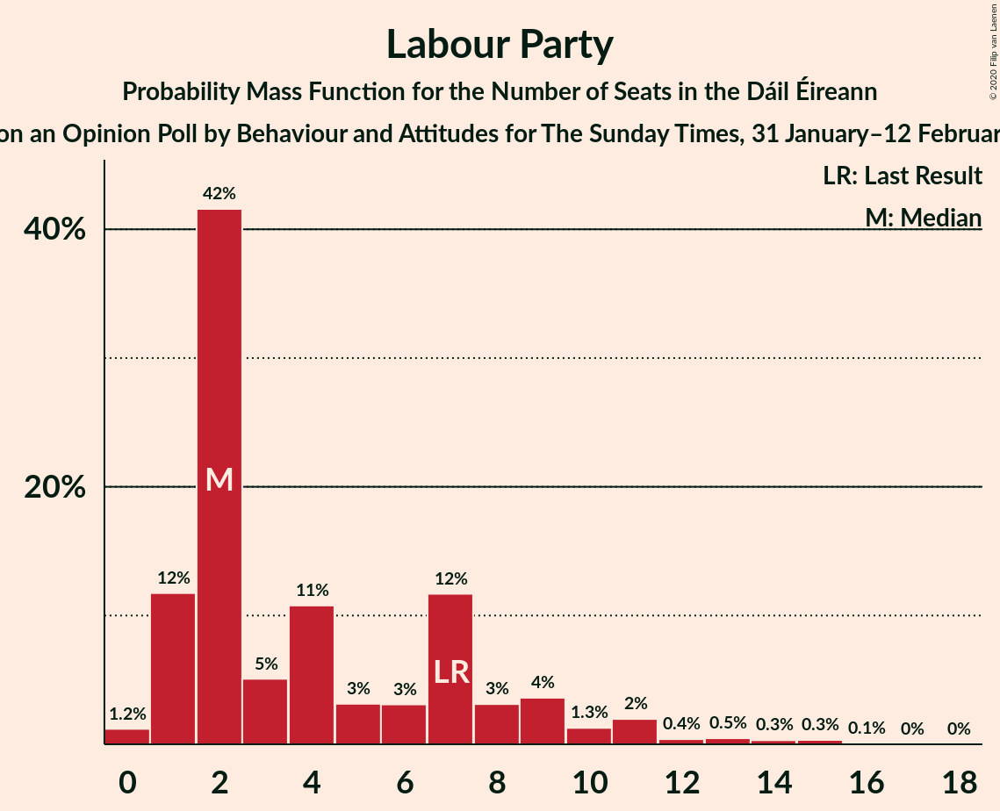
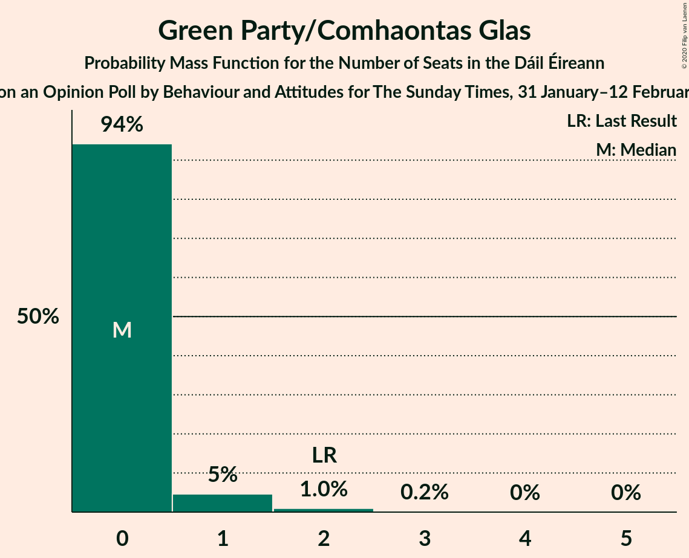
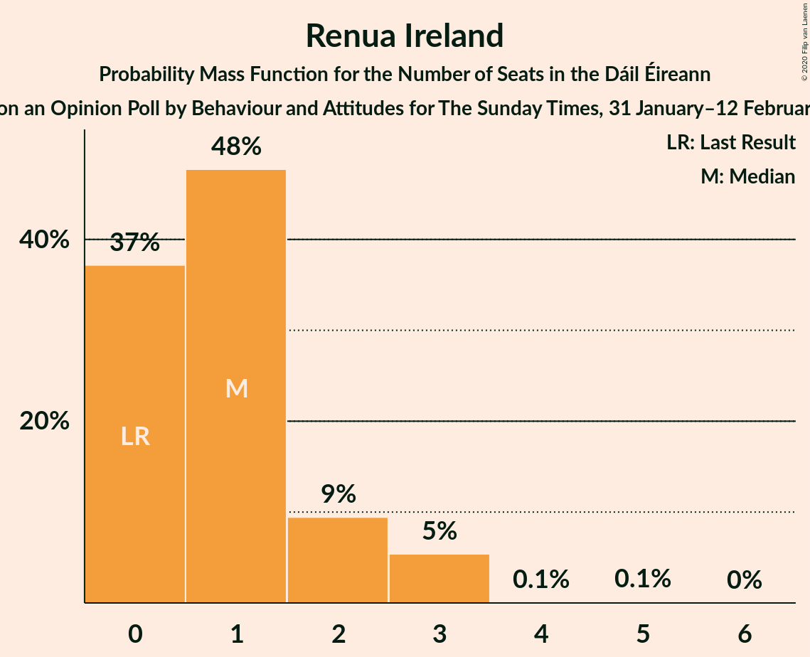
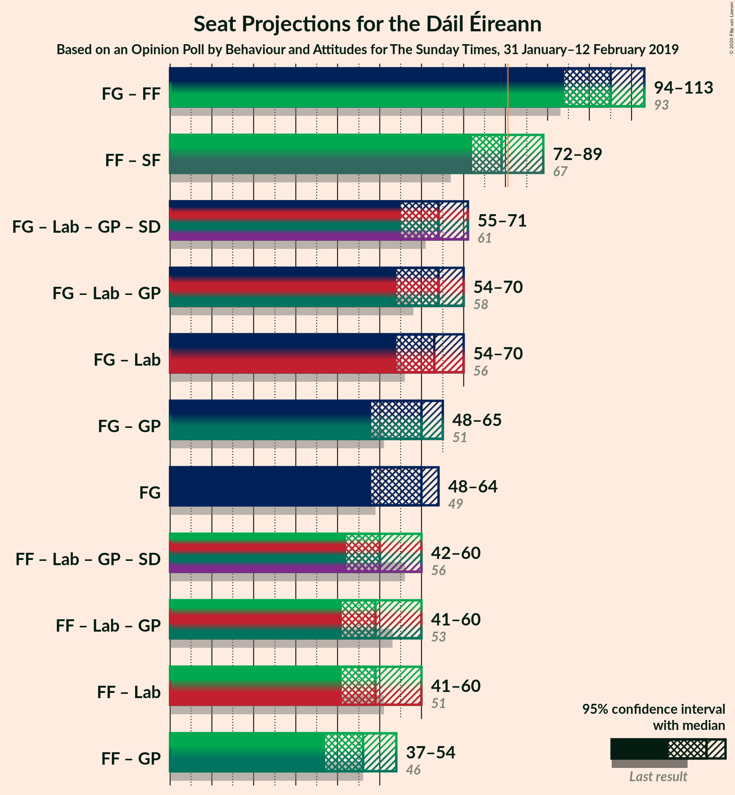
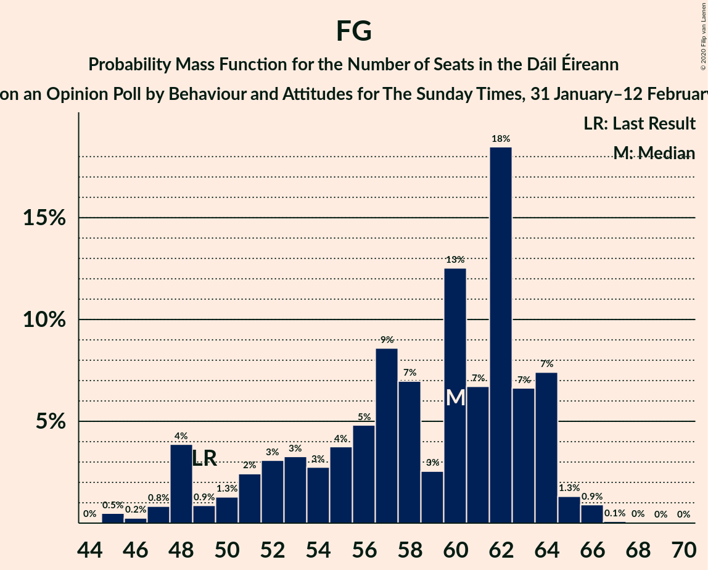
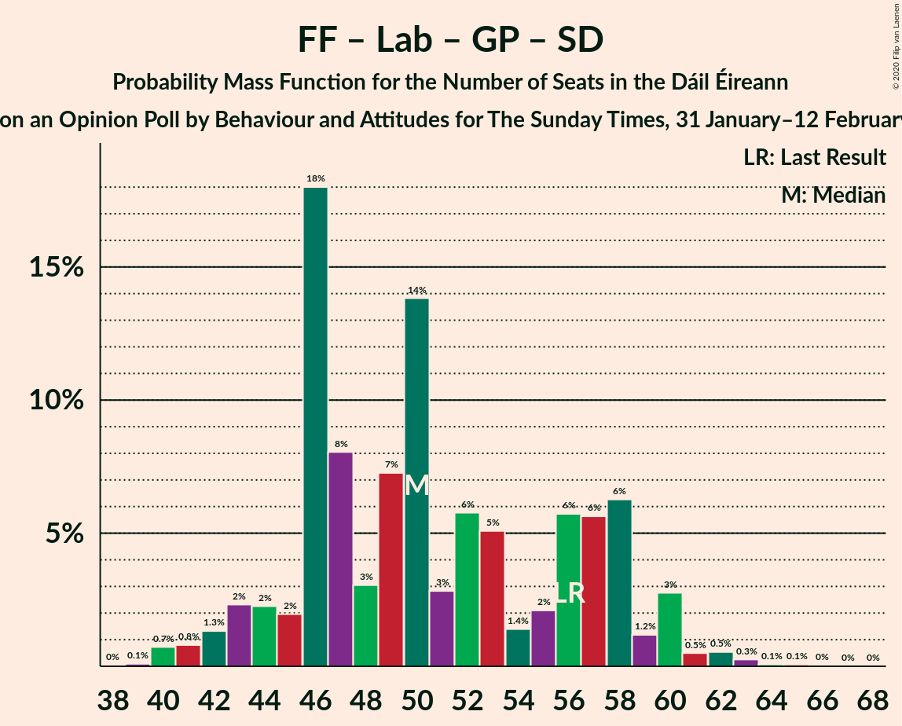

# Opinion Poll by Behaviour and Attitudes for The Sunday Times, 31 January–12 February 2019

<a href="#voting-intentions">Voting Intentions</a> | <a href="#seats">Seats</a> | <a href="#coalitions">Coalitions</a> | <a href="#technical-information">Technical Information</a>

## Voting Intentions

### Confidence Intervals

| Party | Last Result | Poll Result | 80% Confidence Interval | 90% Confidence Interval | 95% Confidence Interval | 99% Confidence Interval |
|:-----:|:-----------:|:-----------:|:-----------------------:|:-----------------------:|:-----------------------:|:-----------------------:|
| Fine Gael | 25.5% | 29.7% | 27.8–31.7% |27.3–32.2% |26.8–32.7% |25.9–33.7% |
| Fianna Fáil | 24.3% | 25.7% | 23.9–27.6% |23.4–28.2% |23.0–28.7% |22.1–29.6% |
| Sinn Féin | 13.8% | 17.8% | 16.3–19.5% |15.8–20.0% |15.5–20.4% |14.7–21.3% |
| Independent | 15.9% | 11.8% | 10.5–13.2% |10.1–13.7% |9.8–14.0% |9.2–14.8% |
| Labour Party | 6.6% | 4.9% | 4.1–6.0% |3.9–6.3% |3.7–6.6% |3.4–7.1% |
| Solidarity–People Before Profit | 3.9% | 2.0% | 1.5–2.7% |1.4–2.9% |1.2–3.1% |1.1–3.5% |
| Green Party/Comhaontas Glas | 2.7% | 2.0% | 1.5–2.7% |1.4–2.9% |1.2–3.1% |1.1–3.5% |
| Independents 4 Change | 1.5% | 1.4% | 1.0–2.1% |0.9–2.3% |0.8–2.4% |0.7–2.8% |
| Social Democrats | 3.0% | 1.0% | 0.7–1.6% |0.6–1.7% |0.5–1.9% |0.4–2.2% |
| Renua Ireland | 2.2% | 1.0% | 0.7–1.6% |0.6–1.7% |0.5–1.9% |0.4–2.2% |

*Note:* The poll result column reflects the actual value used in the calculations. Published results may vary slightly, and in addition be rounded to fewer digits.

## Seats

### Confidence Intervals

| Party | Last Result | Median | 80% Confidence Interval | 90% Confidence Interval | 95% Confidence Interval | 99% Confidence Interval |
|:-----:|:-----------:|:------:|:-----------------------:|:-----------------------:|:-----------------------:|:-----------------------:|
| <a href="#fine-gael">Fine Gael</a> | 49 | 58 | 55–64 |54–65 |50–67 |48–67 |
| <a href="#fianna-fáil">Fianna Fáil</a> | 44 | 49 | 42–49 |40–51 |40–51 |38–54 |
| <a href="#sinn-féin">Sinn Féin</a> | 23 | 34 | 33–37 |32–38 |30–40 |29–41 |
| <a href="#independent">Independent</a> | 19 | 8 | 6–15 |6–16 |6–16 |5–16 |
| <a href="#labour-party">Labour Party</a> | 7 | 3 | 0–5 |0–5 |0–8 |0–8 |
| <a href="#solidarity–people-before-profit">Solidarity–People Before Profit</a> | 6 | 2 | 0–3 |0–4 |0–4 |0–4 |
| <a href="#green-party/comhaontas-glas">Green Party/Comhaontas Glas</a> | 2 | 0 | 0 |0–1 |0–1 |0–2 |
| <a href="#independents-4-change">Independents 4 Change</a> | 4 | 3 | 2–5 |1–5 |1–5 |0–5 |
| <a href="#social-democrats">Social Democrats</a> | 3 | 1 | 1–3 |0–3 |0–3 |0–3 |
| <a href="#renua-ireland">Renua Ireland</a> | 0 | 0 | 0 |0 |0 |0–1 |

### Fine Gael

*For a full overview of the results for this party, see the [Fine Gael](party-finegael.html) page.*

| Number of Seats | Probability | Accumulated | Special Marks |
|:---------------:|:-----------:|:-----------:|:-------------:|
| 46 | 0% | 100% |  |
| 47 | 0.1% | 99.9% |  |
| 48 | 1.5% | 99.8% |  |
| 49 | 0.6% | 98% | Last Result |
| 50 | 0.4% | 98% |  |
| 51 | 0.2% | 97% |  |
| 52 | 0.5% | 97% |  |
| 53 | 1.0% | 97% |  |
| 54 | 4% | 96% |  |
| 55 | 4% | 91% |  |
| 56 | 0.9% | 87% |  |
| 57 | 4% | 86% |  |
| 58 | 39% | 82% | Median |
| 59 | 0.3% | 43% |  |
| 60 | 22% | 42% |  |
| 61 | 3% | 21% |  |
| 62 | 2% | 17% |  |
| 63 | 0.2% | 16% |  |
| 64 | 7% | 15% |  |
| 65 | 5% | 9% |  |
| 66 | 0.4% | 4% |  |
| 67 | 4% | 4% |  |
| 68 | 0.1% | 0.2% |  |
| 69 | 0% | 0% |  |

### Fianna Fáil

*For a full overview of the results for this party, see the [Fianna Fáil](party-fiannafáil.html) page.*

| Number of Seats | Probability | Accumulated | Special Marks |
|:---------------:|:-----------:|:-----------:|:-------------:|
| 38 | 1.0% | 100% |  |
| 39 | 0.3% | 99.0% |  |
| 40 | 7% | 98.7% |  |
| 41 | 0.3% | 92% |  |
| 42 | 3% | 92% |  |
| 43 | 0.3% | 88% |  |
| 44 | 0.7% | 88% | Last Result |
| 45 | 5% | 87% |  |
| 46 | 5% | 82% |  |
| 47 | 9% | 78% |  |
| 48 | 6% | 69% |  |
| 49 | 56% | 64% | Median |
| 50 | 1.2% | 8% |  |
| 51 | 5% | 7% |  |
| 52 | 0.7% | 2% |  |
| 53 | 0.1% | 0.9% |  |
| 54 | 0.3% | 0.8% |  |
| 55 | 0.1% | 0.5% |  |
| 56 | 0.1% | 0.4% |  |
| 57 | 0% | 0.3% |  |
| 58 | 0.3% | 0.3% |  |
| 59 | 0% | 0% |  |

### Sinn Féin

*For a full overview of the results for this party, see the [Sinn Féin](party-sinnféin.html) page.*

| Number of Seats | Probability | Accumulated | Special Marks |
|:---------------:|:-----------:|:-----------:|:-------------:|
| 23 | 0% | 100% | Last Result |
| 24 | 0% | 100% |  |
| 25 | 0.1% | 100% |  |
| 26 | 0.1% | 99.9% |  |
| 27 | 0.1% | 99.8% |  |
| 28 | 0.2% | 99.7% |  |
| 29 | 2% | 99.6% |  |
| 30 | 1.1% | 98% |  |
| 31 | 0.3% | 97% |  |
| 32 | 5% | 96% |  |
| 33 | 10% | 91% |  |
| 34 | 54% | 81% | Median |
| 35 | 10% | 27% |  |
| 36 | 4% | 17% |  |
| 37 | 5% | 13% |  |
| 38 | 5% | 8% |  |
| 39 | 0.3% | 4% |  |
| 40 | 2% | 3% |  |
| 41 | 0.8% | 0.8% |  |
| 42 | 0.1% | 0.1% |  |
| 43 | 0% | 0% |  |

### Independent

*For a full overview of the results for this party, see the [Independent](party-independent.html) page.*

| Number of Seats | Probability | Accumulated | Special Marks |
|:---------------:|:-----------:|:-----------:|:-------------:|
| 3 | 0.1% | 100% |  |
| 4 | 0.4% | 99.9% |  |
| 5 | 1.3% | 99.5% |  |
| 6 | 39% | 98% |  |
| 7 | 6% | 60% |  |
| 8 | 4% | 53% | Median |
| 9 | 6% | 49% |  |
| 10 | 17% | 43% |  |
| 11 | 0.6% | 26% |  |
| 12 | 1.1% | 25% |  |
| 13 | 3% | 24% |  |
| 14 | 8% | 21% |  |
| 15 | 4% | 13% |  |
| 16 | 9% | 9% |  |
| 17 | 0% | 0% |  |
| 18 | 0% | 0% |  |
| 19 | 0% | 0% | Last Result |

### Labour Party

*For a full overview of the results for this party, see the [Labour Party](party-labourparty.html) page.*

| Number of Seats | Probability | Accumulated | Special Marks |
|:---------------:|:-----------:|:-----------:|:-------------:|
| 0 | 24% | 100% |  |
| 1 | 11% | 76% |  |
| 2 | 13% | 65% |  |
| 3 | 6% | 52% | Median |
| 4 | 3% | 46% |  |
| 5 | 39% | 43% |  |
| 6 | 2% | 5% |  |
| 7 | 0.2% | 3% | Last Result |
| 8 | 3% | 3% |  |
| 9 | 0.1% | 0.3% |  |
| 10 | 0% | 0.1% |  |
| 11 | 0% | 0.1% |  |
| 12 | 0% | 0.1% |  |
| 13 | 0% | 0.1% |  |
| 14 | 0% | 0% |  |

### Solidarity–People Before Profit

*For a full overview of the results for this party, see the [Solidarity–People Before Profit](party-solidarity–peoplebeforeprofit.html) page.*

| Number of Seats | Probability | Accumulated | Special Marks |
|:---------------:|:-----------:|:-----------:|:-------------:|
| 0 | 15% | 100% |  |
| 1 | 31% | 85% |  |
| 2 | 10% | 53% | Median |
| 3 | 38% | 44% |  |
| 4 | 6% | 6% |  |
| 5 | 0.1% | 0.1% |  |
| 6 | 0% | 0% | Last Result |

### Green Party/Comhaontas Glas

*For a full overview of the results for this party, see the [Green Party/Comhaontas Glas](party-greenpartycomhaontasglas.html) page.*

| Number of Seats | Probability | Accumulated | Special Marks |
|:---------------:|:-----------:|:-----------:|:-------------:|
| 0 | 93% | 100% | Median |
| 1 | 5% | 7% |  |
| 2 | 2% | 2% | Last Result |
| 3 | 0.3% | 0.3% |  |
| 4 | 0% | 0% |  |

### Independents 4 Change

*For a full overview of the results for this party, see the [Independents 4 Change](party-independents4change.html) page.*

| Number of Seats | Probability | Accumulated | Special Marks |
|:---------------:|:-----------:|:-----------:|:-------------:|
| 0 | 2% | 100% |  |
| 1 | 7% | 98% |  |
| 2 | 38% | 91% |  |
| 3 | 8% | 54% | Median |
| 4 | 20% | 45% | Last Result |
| 5 | 26% | 26% |  |
| 6 | 0% | 0% |  |

### Social Democrats

*For a full overview of the results for this party, see the [Social Democrats](party-socialdemocrats.html) page.*

| Number of Seats | Probability | Accumulated | Special Marks |
|:---------------:|:-----------:|:-----------:|:-------------:|
| 0 | 8% | 100% |  |
| 1 | 47% | 92% | Median |
| 2 | 5% | 45% |  |
| 3 | 40% | 40% | Last Result |
| 4 | 0% | 0% |  |

### Renua Ireland

*For a full overview of the results for this party, see the [Renua Ireland](party-renuaireland.html) page.*

| Number of Seats | Probability | Accumulated | Special Marks |
|:---------------:|:-----------:|:-----------:|:-------------:|
| 0 | 98% | 100% | Last Result, Median |
| 1 | 2% | 2% |  |
| 2 | 0.1% | 0.1% |  |
| 3 | 0% | 0% |  |

## Coalitions

### Confidence Intervals

| Coalition | Last Result | Median | Majority? | 80% Confidence Interval | 90% Confidence Interval | 95% Confidence Interval | 99% Confidence Interval |
|:---------:|:-----------:|:------:|:---------:|:-----------------------:|:-----------------------:|:-----------------------:|:-----------------------:|
| Fine Gael – Fianna Fáil | 93 | 107 | 100% | 102–109 | 100–113 | 99–113 | 97–113 |
| Fianna Fáil – Sinn Féin | 67 | 83 | 73% | 77–85 | 77–86 | 75–87 | 73–92 |
| Fine Gael – Labour Party – Green Party/Comhaontas Glas – Social Democrats | 61 | 66 | 0% | 58–67 | 57–68 | 55–68 | 54–72 |
| Fine Gael – Labour Party – Green Party/Comhaontas Glas | 58 | 63 | 0% | 56–66 | 55–67 | 53–67 | 52–70 |
| Fine Gael – Labour Party | 56 | 63 | 0% | 56–66 | 55–67 | 53–67 | 51–70 |
| Fine Gael – Green Party/Comhaontas Glas | 51 | 58 | 0% | 55–64 | 54–65 | 51–67 | 49–67 |
| Fine Gael | 49 | 58 | 0% | 55–64 | 54–65 | 50–67 | 48–67 |
| Fianna Fáil – Labour Party – Green Party/Comhaontas Glas – Social Democrats | 56 | 52 | 0% | 44–57 | 43–57 | 42–57 | 42–59 |
| Fianna Fáil – Labour Party – Green Party/Comhaontas Glas | 53 | 51 | 0% | 43–54 | 42–55 | 41–55 | 41–58 |
| Fianna Fáil – Labour Party | 51 | 51 | 0% | 43–54 | 42–54 | 41–55 | 41–58 |
| Fianna Fáil – Green Party/Comhaontas Glas | 46 | 49 | 0% | 42–49 | 40–52 | 40–52 | 38–55 |

### Fine Gael – Fianna Fáil

| Number of Seats | Probability | Accumulated | Special Marks |
|:---------------:|:-----------:|:-----------:|:-------------:|
| 93 | 0% | 100% | Last Result |
| 94 | 0.1% | 99.9% |  |
| 95 | 0% | 99.8% |  |
| 96 | 0% | 99.8% |  |
| 97 | 1.0% | 99.7% |  |
| 98 | 0.9% | 98.7% |  |
| 99 | 2% | 98% |  |
| 100 | 2% | 96% |  |
| 101 | 3% | 94% |  |
| 102 | 5% | 91% |  |
| 103 | 4% | 85% |  |
| 104 | 6% | 82% |  |
| 105 | 2% | 76% |  |
| 106 | 5% | 74% |  |
| 107 | 35% | 69% | Median |
| 108 | 1.0% | 34% |  |
| 109 | 25% | 33% |  |
| 110 | 2% | 9% |  |
| 111 | 0.3% | 7% |  |
| 112 | 0.6% | 6% |  |
| 113 | 5% | 6% |  |
| 114 | 0.2% | 0.4% |  |
| 115 | 0.1% | 0.2% |  |
| 116 | 0.1% | 0.1% |  |
| 117 | 0% | 0.1% |  |
| 118 | 0% | 0% |  |

### Fianna Fáil – Sinn Féin

| Number of Seats | Probability | Accumulated | Special Marks |
|:---------------:|:-----------:|:-----------:|:-------------:|
| 67 | 0% | 100% | Last Result |
| 68 | 0% | 100% |  |
| 69 | 0% | 100% |  |
| 70 | 0.2% | 100% |  |
| 71 | 0.1% | 99.8% |  |
| 72 | 0.1% | 99.7% |  |
| 73 | 0.2% | 99.6% |  |
| 74 | 0.8% | 99.4% |  |
| 75 | 1.4% | 98.6% |  |
| 76 | 1.2% | 97% |  |
| 77 | 7% | 96% |  |
| 78 | 3% | 89% |  |
| 79 | 5% | 86% |  |
| 80 | 9% | 81% |  |
| 81 | 4% | 73% | Majority |
| 82 | 3% | 68% |  |
| 83 | 52% | 65% | Median |
| 84 | 2% | 13% |  |
| 85 | 5% | 10% |  |
| 86 | 1.0% | 6% |  |
| 87 | 3% | 5% |  |
| 88 | 0.1% | 1.2% |  |
| 89 | 0.2% | 1.0% |  |
| 90 | 0% | 0.8% |  |
| 91 | 0.1% | 0.8% |  |
| 92 | 0.3% | 0.7% |  |
| 93 | 0.4% | 0.4% |  |
| 94 | 0% | 0.1% |  |
| 95 | 0% | 0% |  |

### Fine Gael – Labour Party – Green Party/Comhaontas Glas – Social Democrats

| Number of Seats | Probability | Accumulated | Special Marks |
|:---------------:|:-----------:|:-----------:|:-------------:|
| 50 | 0% | 100% |  |
| 51 | 0% | 99.9% |  |
| 52 | 0% | 99.9% |  |
| 53 | 0.2% | 99.9% |  |
| 54 | 2% | 99.7% |  |
| 55 | 0.5% | 98% |  |
| 56 | 0.6% | 97% |  |
| 57 | 5% | 96% |  |
| 58 | 2% | 91% |  |
| 59 | 0.7% | 89% |  |
| 60 | 2% | 89% |  |
| 61 | 18% | 87% | Last Result |
| 62 | 2% | 69% | Median |
| 63 | 3% | 67% |  |
| 64 | 6% | 65% |  |
| 65 | 8% | 59% |  |
| 66 | 40% | 51% |  |
| 67 | 3% | 11% |  |
| 68 | 6% | 8% |  |
| 69 | 0.3% | 2% |  |
| 70 | 0.1% | 1.4% |  |
| 71 | 0.7% | 1.3% |  |
| 72 | 0.1% | 0.6% |  |
| 73 | 0.3% | 0.5% |  |
| 74 | 0.2% | 0.2% |  |
| 75 | 0% | 0% |  |

### Fine Gael – Labour Party – Green Party/Comhaontas Glas

| Number of Seats | Probability | Accumulated | Special Marks |
|:---------------:|:-----------:|:-----------:|:-------------:|
| 49 | 0% | 100% |  |
| 50 | 0% | 99.9% |  |
| 51 | 0% | 99.9% |  |
| 52 | 2% | 99.9% |  |
| 53 | 1.1% | 98% |  |
| 54 | 0.7% | 97% |  |
| 55 | 2% | 97% |  |
| 56 | 5% | 95% |  |
| 57 | 0.5% | 90% |  |
| 58 | 0.3% | 89% | Last Result |
| 59 | 2% | 89% |  |
| 60 | 19% | 87% |  |
| 61 | 3% | 68% | Median |
| 62 | 2% | 65% |  |
| 63 | 40% | 63% |  |
| 64 | 2% | 23% |  |
| 65 | 10% | 20% |  |
| 66 | 0.6% | 11% |  |
| 67 | 8% | 10% |  |
| 68 | 0.2% | 1.5% |  |
| 69 | 0.1% | 1.2% |  |
| 70 | 0.7% | 1.1% |  |
| 71 | 0.3% | 0.4% |  |
| 72 | 0.1% | 0.2% |  |
| 73 | 0% | 0.1% |  |
| 74 | 0.1% | 0.1% |  |
| 75 | 0% | 0% |  |

### Fine Gael – Labour Party

| Number of Seats | Probability | Accumulated | Special Marks |
|:---------------:|:-----------:|:-----------:|:-------------:|
| 49 | 0% | 100% |  |
| 50 | 0% | 99.9% |  |
| 51 | 2% | 99.9% |  |
| 52 | 0.3% | 98% |  |
| 53 | 0.7% | 98% |  |
| 54 | 0.6% | 97% |  |
| 55 | 2% | 97% |  |
| 56 | 5% | 95% | Last Result |
| 57 | 0.4% | 89% |  |
| 58 | 2% | 89% |  |
| 59 | 2% | 87% |  |
| 60 | 19% | 85% |  |
| 61 | 1.3% | 66% | Median |
| 62 | 2% | 65% |  |
| 63 | 41% | 63% |  |
| 64 | 2% | 22% |  |
| 65 | 10% | 20% |  |
| 66 | 0.5% | 10% |  |
| 67 | 8% | 10% |  |
| 68 | 0.3% | 1.4% |  |
| 69 | 0.3% | 1.2% |  |
| 70 | 0.6% | 0.8% |  |
| 71 | 0.2% | 0.3% |  |
| 72 | 0.1% | 0.1% |  |
| 73 | 0% | 0.1% |  |
| 74 | 0% | 0% |  |

### Fine Gael – Green Party/Comhaontas Glas

| Number of Seats | Probability | Accumulated | Special Marks |
|:---------------:|:-----------:|:-----------:|:-------------:|
| 46 | 0% | 100% |  |
| 47 | 0.1% | 99.9% |  |
| 48 | 0% | 99.8% |  |
| 49 | 2% | 99.8% |  |
| 50 | 0.4% | 98% |  |
| 51 | 0.6% | 98% | Last Result |
| 52 | 0.5% | 97% |  |
| 53 | 0.9% | 97% |  |
| 54 | 4% | 96% |  |
| 55 | 4% | 91% |  |
| 56 | 0.2% | 87% |  |
| 57 | 4% | 87% |  |
| 58 | 38% | 84% | Median |
| 59 | 3% | 46% |  |
| 60 | 21% | 42% |  |
| 61 | 3% | 21% |  |
| 62 | 2% | 18% |  |
| 63 | 0.4% | 16% |  |
| 64 | 6% | 16% |  |
| 65 | 5% | 9% |  |
| 66 | 0.5% | 4% |  |
| 67 | 3% | 4% |  |
| 68 | 0.4% | 0.4% |  |
| 69 | 0% | 0% |  |

### Fine Gael

| Number of Seats | Probability | Accumulated | Special Marks |
|:---------------:|:-----------:|:-----------:|:-------------:|
| 46 | 0% | 100% |  |
| 47 | 0.1% | 99.9% |  |
| 48 | 1.5% | 99.8% |  |
| 49 | 0.6% | 98% | Last Result |
| 50 | 0.4% | 98% |  |
| 51 | 0.2% | 97% |  |
| 52 | 0.5% | 97% |  |
| 53 | 1.0% | 97% |  |
| 54 | 4% | 96% |  |
| 55 | 4% | 91% |  |
| 56 | 0.9% | 87% |  |
| 57 | 4% | 86% |  |
| 58 | 39% | 82% | Median |
| 59 | 0.3% | 43% |  |
| 60 | 22% | 42% |  |
| 61 | 3% | 21% |  |
| 62 | 2% | 17% |  |
| 63 | 0.2% | 16% |  |
| 64 | 7% | 15% |  |
| 65 | 5% | 9% |  |
| 66 | 0.4% | 4% |  |
| 67 | 4% | 4% |  |
| 68 | 0.1% | 0.2% |  |
| 69 | 0% | 0% |  |

### Fianna Fáil – Labour Party – Green Party/Comhaontas Glas – Social Democrats

| Number of Seats | Probability | Accumulated | Special Marks |
|:---------------:|:-----------:|:-----------:|:-------------:|
| 41 | 0.1% | 100% |  |
| 42 | 4% | 99.9% |  |
| 43 | 4% | 95% |  |
| 44 | 2% | 92% |  |
| 45 | 0.5% | 89% |  |
| 46 | 2% | 89% |  |
| 47 | 0.3% | 86% |  |
| 48 | 1.0% | 86% |  |
| 49 | 3% | 85% |  |
| 50 | 22% | 82% |  |
| 51 | 7% | 61% |  |
| 52 | 4% | 54% |  |
| 53 | 2% | 49% | Median |
| 54 | 5% | 47% |  |
| 55 | 2% | 43% |  |
| 56 | 4% | 40% | Last Result |
| 57 | 35% | 36% |  |
| 58 | 0.4% | 1.1% |  |
| 59 | 0.4% | 0.7% |  |
| 60 | 0.1% | 0.3% |  |
| 61 | 0.1% | 0.2% |  |
| 62 | 0% | 0.2% |  |
| 63 | 0.1% | 0.1% |  |
| 64 | 0% | 0.1% |  |
| 65 | 0% | 0% |  |

### Fianna Fáil – Labour Party – Green Party/Comhaontas Glas

| Number of Seats | Probability | Accumulated | Special Marks |
|:---------------:|:-----------:|:-----------:|:-------------:|
| 40 | 0.1% | 100% |  |
| 41 | 5% | 99.9% |  |
| 42 | 4% | 95% |  |
| 43 | 2% | 92% |  |
| 44 | 0.8% | 89% |  |
| 45 | 0.4% | 89% |  |
| 46 | 3% | 88% |  |
| 47 | 2% | 86% |  |
| 48 | 3% | 84% |  |
| 49 | 20% | 80% |  |
| 50 | 8% | 60% |  |
| 51 | 4% | 52% |  |
| 52 | 4% | 48% | Median |
| 53 | 3% | 45% | Last Result |
| 54 | 35% | 42% |  |
| 55 | 5% | 6% |  |
| 56 | 0.7% | 2% |  |
| 57 | 0.4% | 1.1% |  |
| 58 | 0.2% | 0.7% |  |
| 59 | 0.3% | 0.5% |  |
| 60 | 0.1% | 0.2% |  |
| 61 | 0.1% | 0.1% |  |
| 62 | 0% | 0.1% |  |
| 63 | 0% | 0.1% |  |
| 64 | 0% | 0% |  |

### Fianna Fáil – Labour Party

| Number of Seats | Probability | Accumulated | Special Marks |
|:---------------:|:-----------:|:-----------:|:-------------:|
| 40 | 0% | 100% |  |
| 41 | 5% | 99.9% |  |
| 42 | 4% | 95% |  |
| 43 | 2% | 91% |  |
| 44 | 0.9% | 89% |  |
| 45 | 0.2% | 88% |  |
| 46 | 3% | 88% |  |
| 47 | 2% | 85% |  |
| 48 | 3% | 84% |  |
| 49 | 20% | 80% |  |
| 50 | 8% | 60% |  |
| 51 | 6% | 52% | Last Result |
| 52 | 2% | 45% | Median |
| 53 | 2% | 43% |  |
| 54 | 37% | 41% |  |
| 55 | 3% | 4% |  |
| 56 | 0.3% | 1.2% |  |
| 57 | 0.3% | 1.0% |  |
| 58 | 0.2% | 0.6% |  |
| 59 | 0.3% | 0.5% |  |
| 60 | 0% | 0.2% |  |
| 61 | 0.1% | 0.1% |  |
| 62 | 0% | 0.1% |  |
| 63 | 0% | 0% |  |

### Fianna Fáil – Green Party/Comhaontas Glas

| Number of Seats | Probability | Accumulated | Special Marks |
|:---------------:|:-----------:|:-----------:|:-------------:|
| 38 | 0.8% | 100% |  |
| 39 | 0.5% | 99.2% |  |
| 40 | 7% | 98.8% |  |
| 41 | 0.4% | 92% |  |
| 42 | 3% | 92% |  |
| 43 | 0.3% | 88% |  |
| 44 | 0.7% | 88% |  |
| 45 | 5% | 87% |  |
| 46 | 5% | 82% | Last Result |
| 47 | 8% | 78% |  |
| 48 | 5% | 70% |  |
| 49 | 55% | 64% | Median |
| 50 | 2% | 9% |  |
| 51 | 2% | 8% |  |
| 52 | 4% | 6% |  |
| 53 | 1.0% | 2% |  |
| 54 | 0.3% | 0.8% |  |
| 55 | 0.1% | 0.5% |  |
| 56 | 0.1% | 0.4% |  |
| 57 | 0% | 0.3% |  |
| 58 | 0.3% | 0.3% |  |
| 59 | 0% | 0% |  |

## Technical Information

### Opinion Poll

+ **Polling firm:** Behaviour and Attitudes
+ **Commissioner(s):** The Sunday Times
+ **Fieldwork period:** 31 January–12 February 2019

### Calculations

+ **Sample size:** 910
+ **Simulations done:** 131,072
+ **Error estimate:** 1.89%

