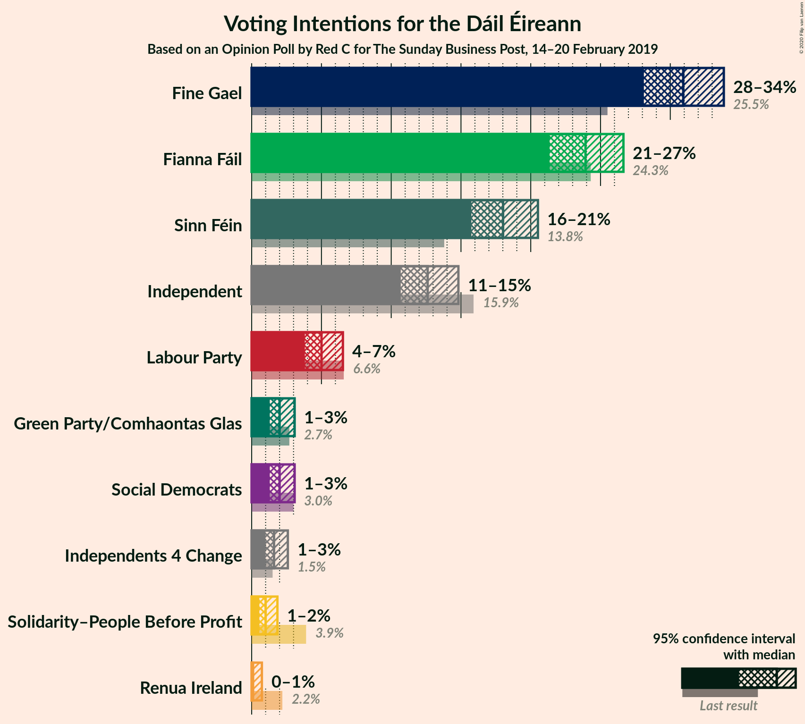
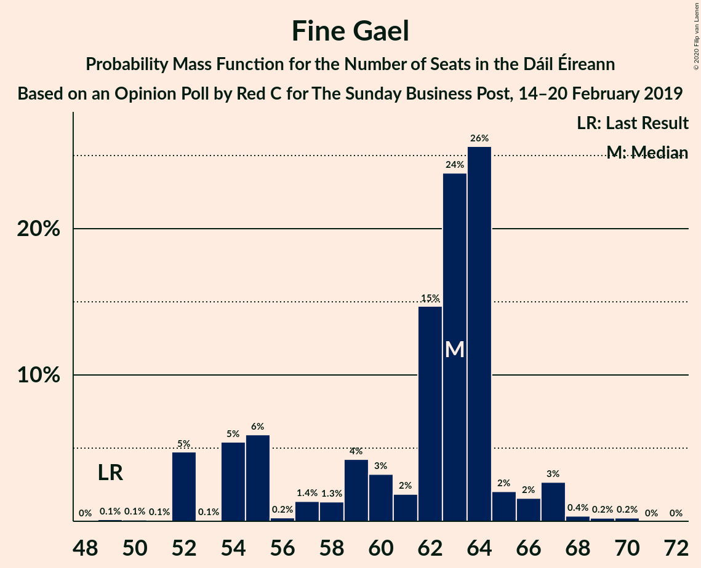
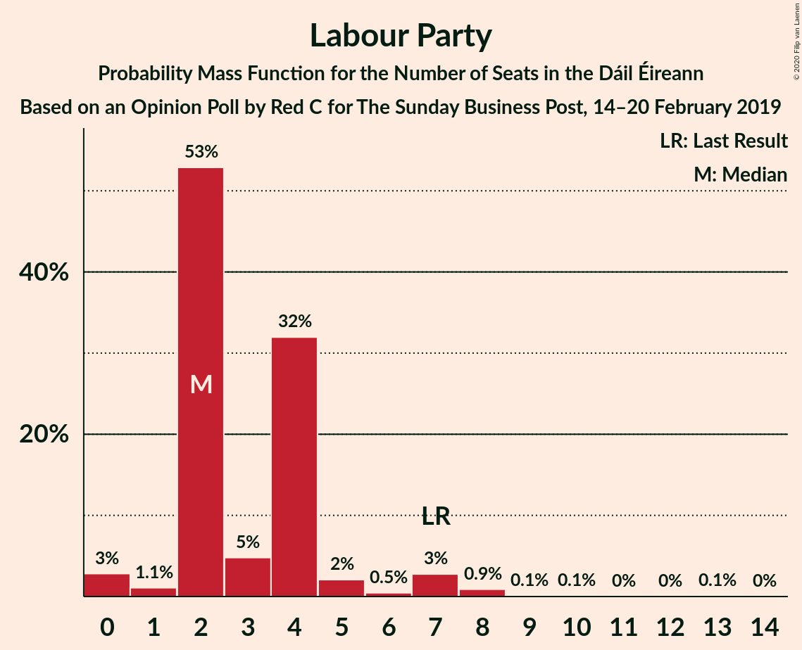
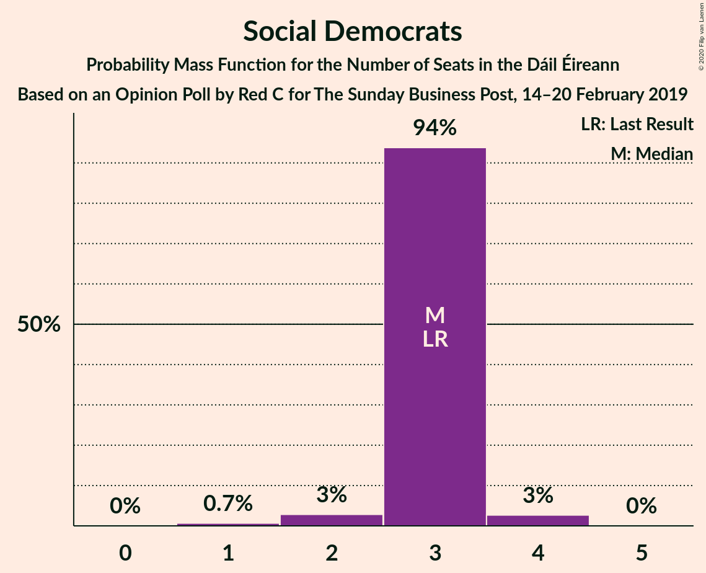
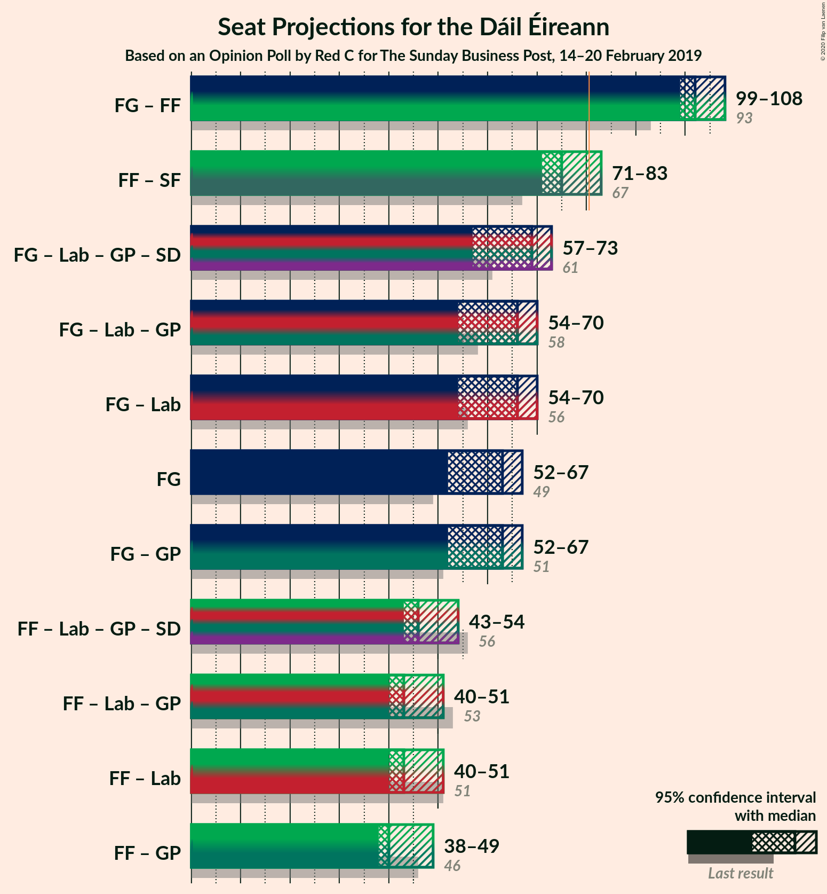
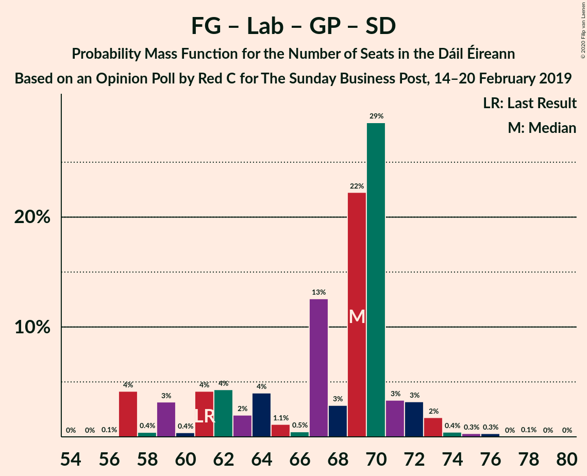
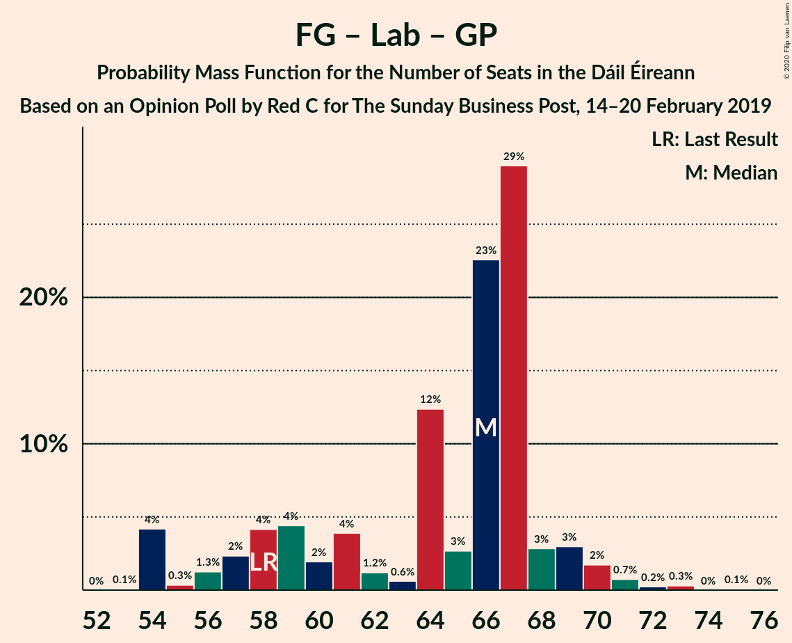

# Opinion Poll by Red C for The Sunday Business Post, 14–20 February 2019

<a href="#voting-intentions">Voting Intentions</a> | <a href="#seats">Seats</a> | <a href="#coalitions">Coalitions</a> | <a href="#technical-information">Technical Information</a>

## Voting Intentions

### Confidence Intervals

| Party | Last Result | Poll Result | 80% Confidence Interval | 90% Confidence Interval | 95% Confidence Interval | 99% Confidence Interval |
|:-----:|:-----------:|:-----------:|:-----------------------:|:-----------------------:|:-----------------------:|:-----------------------:|
| Fine Gael | 25.5% | 30.9% | 29.1–32.8% |28.5–33.4% |28.1–33.8% |27.3–34.8% |
| Fianna Fáil | 24.3% | 23.9% | 22.2–25.7% |21.8–26.2% |21.4–26.6% |20.6–27.5% |
| Sinn Féin | 13.8% | 18.0% | 16.5–19.6% |16.1–20.1% |15.7–20.5% |15.0–21.3% |
| Independent | 15.9% | 12.6% | 11.3–14.0% |11.0–14.4% |10.7–14.8% |10.1–15.5% |
| Labour Party | 6.6% | 5.0% | 4.2–6.0% |4.0–6.3% |3.8–6.5% |3.5–7.1% |
| Social Democrats | 3.0% | 2.0% | 1.5–2.7% |1.4–2.9% |1.3–3.1% |1.1–3.4% |
| Green Party/Comhaontas Glas | 2.7% | 2.0% | 1.5–2.7% |1.4–2.9% |1.3–3.1% |1.1–3.4% |
| Independents 4 Change | 1.5% | 1.6% | 1.2–2.2% |1.1–2.4% |1.0–2.6% |0.8–2.9% |
| Solidarity–People Before Profit | 3.9% | 1.0% | 0.7–1.5% |0.6–1.7% |0.5–1.8% |0.4–2.1% |
| Renua Ireland | 2.2% | 0.2% | 0.1–0.5% |0.1–0.6% |0.1–0.7% |0.0–0.9% |

*Note:* The poll result column reflects the actual value used in the calculations. Published results may vary slightly, and in addition be rounded to fewer digits.

## Seats

### Confidence Intervals

| Party | Last Result | Median | 80% Confidence Interval | 90% Confidence Interval | 95% Confidence Interval | 99% Confidence Interval |
|:-----:|:-----------:|:------:|:-----------------------:|:-----------------------:|:-----------------------:|:-----------------------:|
| <a href="#fine-gael">Fine Gael</a> | 49 | 63 | 54–64 |52–66 |52–67 |52–68 |
| <a href="#fianna-fáil">Fianna Fáil</a> | 44 | 39 | 38–46 |38–49 |38–49 |37–50 |
| <a href="#sinn-féin">Sinn Féin</a> | 23 | 36 | 33–37 |32–37 |31–38 |30–39 |
| <a href="#independent">Independent</a> | 19 | 14 | 9–16 |9–16 |8–16 |6–16 |
| <a href="#labour-party">Labour Party</a> | 7 | 2 | 2–4 |2–5 |0–7 |0–8 |
| <a href="#social-democrats">Social Democrats</a> | 3 | 3 | 3 |3 |2–4 |1–4 |
| <a href="#green-party/comhaontas-glas">Green Party/Comhaontas Glas</a> | 2 | 0 | 0–1 |0–1 |0–2 |0–2 |
| <a href="#independents-4-change">Independents 4 Change</a> | 4 | 4 | 2–5 |2–5 |1–5 |0–5 |
| <a href="#solidarity–people-before-profit">Solidarity–People Before Profit</a> | 6 | 0 | 0 |0 |0–1 |0–2 |
| <a href="#renua-ireland">Renua Ireland</a> | 0 | 0 | 0 |0 |0 |0 |

### Fine Gael

*For a full overview of the results for this party, see the [Fine Gael](party-finegael.html) page.*

| Number of Seats | Probability | Accumulated | Special Marks |
|:---------------:|:-----------:|:-----------:|:-------------:|
| 49 | 0.1% | 100% | Last Result |
| 50 | 0.1% | 99.9% |  |
| 51 | 0.1% | 99.8% |  |
| 52 | 5% | 99.7% |  |
| 53 | 0.1% | 95% |  |
| 54 | 5% | 95% |  |
| 55 | 6% | 89% |  |
| 56 | 0.2% | 84% |  |
| 57 | 1.4% | 83% |  |
| 58 | 1.3% | 82% |  |
| 59 | 4% | 81% |  |
| 60 | 3% | 76% |  |
| 61 | 2% | 73% |  |
| 62 | 15% | 71% |  |
| 63 | 24% | 57% | Median |
| 64 | 26% | 33% |  |
| 65 | 2% | 7% |  |
| 66 | 2% | 5% |  |
| 67 | 3% | 3% |  |
| 68 | 0.4% | 0.8% |  |
| 69 | 0.2% | 0.5% |  |
| 70 | 0.2% | 0.2% |  |
| 71 | 0% | 0% |  |

### Fianna Fáil

*For a full overview of the results for this party, see the [Fianna Fáil](party-fiannafáil.html) page.*

| Number of Seats | Probability | Accumulated | Special Marks |
|:---------------:|:-----------:|:-----------:|:-------------:|
| 36 | 0% | 100% |  |
| 37 | 0.8% | 99.9% |  |
| 38 | 23% | 99.1% |  |
| 39 | 30% | 76% | Median |
| 40 | 4% | 46% |  |
| 41 | 15% | 42% |  |
| 42 | 4% | 26% |  |
| 43 | 2% | 23% |  |
| 44 | 2% | 21% | Last Result |
| 45 | 1.4% | 19% |  |
| 46 | 8% | 18% |  |
| 47 | 3% | 9% |  |
| 48 | 0.7% | 7% |  |
| 49 | 4% | 6% |  |
| 50 | 1.3% | 1.5% |  |
| 51 | 0.1% | 0.2% |  |
| 52 | 0% | 0.1% |  |
| 53 | 0% | 0.1% |  |
| 54 | 0.1% | 0.1% |  |
| 55 | 0% | 0% |  |

### Sinn Féin

*For a full overview of the results for this party, see the [Sinn Féin](party-sinnféin.html) page.*

| Number of Seats | Probability | Accumulated | Special Marks |
|:---------------:|:-----------:|:-----------:|:-------------:|
| 23 | 0% | 100% | Last Result |
| 24 | 0% | 100% |  |
| 25 | 0% | 100% |  |
| 26 | 0% | 100% |  |
| 27 | 0.2% | 100% |  |
| 28 | 0% | 99.7% |  |
| 29 | 0.1% | 99.7% |  |
| 30 | 0.2% | 99.6% |  |
| 31 | 3% | 99.4% |  |
| 32 | 2% | 96% |  |
| 33 | 27% | 95% |  |
| 34 | 7% | 68% |  |
| 35 | 3% | 60% |  |
| 36 | 12% | 58% | Median |
| 37 | 44% | 46% |  |
| 38 | 2% | 3% |  |
| 39 | 1.0% | 1.1% |  |
| 40 | 0% | 0.1% |  |
| 41 | 0% | 0.1% |  |
| 42 | 0% | 0.1% |  |
| 43 | 0% | 0% |  |

### Independent

*For a full overview of the results for this party, see the [Independent](party-independent.html) page.*

| Number of Seats | Probability | Accumulated | Special Marks |
|:---------------:|:-----------:|:-----------:|:-------------:|
| 5 | 0.3% | 100% |  |
| 6 | 0.4% | 99.6% |  |
| 7 | 1.1% | 99.2% |  |
| 8 | 2% | 98% |  |
| 9 | 22% | 96% |  |
| 10 | 6% | 74% |  |
| 11 | 6% | 68% |  |
| 12 | 2% | 62% |  |
| 13 | 9% | 61% |  |
| 14 | 20% | 52% | Median |
| 15 | 1.0% | 32% |  |
| 16 | 31% | 31% |  |
| 17 | 0% | 0% |  |
| 18 | 0% | 0% |  |
| 19 | 0% | 0% | Last Result |

### Labour Party

*For a full overview of the results for this party, see the [Labour Party](party-labourparty.html) page.*

| Number of Seats | Probability | Accumulated | Special Marks |
|:---------------:|:-----------:|:-----------:|:-------------:|
| 0 | 3% | 100% |  |
| 1 | 1.1% | 97% |  |
| 2 | 53% | 96% | Median |
| 3 | 5% | 43% |  |
| 4 | 32% | 38% |  |
| 5 | 2% | 6% |  |
| 6 | 0.5% | 4% |  |
| 7 | 3% | 4% | Last Result |
| 8 | 0.9% | 1.1% |  |
| 9 | 0.1% | 0.2% |  |
| 10 | 0.1% | 0.2% |  |
| 11 | 0% | 0.1% |  |
| 12 | 0% | 0.1% |  |
| 13 | 0.1% | 0.1% |  |
| 14 | 0% | 0% |  |

### Social Democrats

*For a full overview of the results for this party, see the [Social Democrats](party-socialdemocrats.html) page.*

| Number of Seats | Probability | Accumulated | Special Marks |
|:---------------:|:-----------:|:-----------:|:-------------:|
| 1 | 0.7% | 100% |  |
| 2 | 3% | 99.3% |  |
| 3 | 94% | 96% | Last Result, Median |
| 4 | 3% | 3% |  |
| 5 | 0% | 0% |  |

### Green Party/Comhaontas Glas

*For a full overview of the results for this party, see the [Green Party/Comhaontas Glas](party-greenpartycomhaontasglas.html) page.*

| Number of Seats | Probability | Accumulated | Special Marks |
|:---------------:|:-----------:|:-----------:|:-------------:|
| 0 | 89% | 100% | Median |
| 1 | 8% | 11% |  |
| 2 | 3% | 3% | Last Result |
| 3 | 0.1% | 0.1% |  |
| 4 | 0% | 0% |  |

### Independents 4 Change

*For a full overview of the results for this party, see the [Independents 4 Change](party-independents4change.html) page.*

| Number of Seats | Probability | Accumulated | Special Marks |
|:---------------:|:-----------:|:-----------:|:-------------:|
| 0 | 1.0% | 100% |  |
| 1 | 3% | 99.0% |  |
| 2 | 19% | 96% |  |
| 3 | 20% | 76% |  |
| 4 | 16% | 56% | Last Result, Median |
| 5 | 40% | 40% |  |
| 6 | 0% | 0% |  |

### Solidarity–People Before Profit

*For a full overview of the results for this party, see the [Solidarity–People Before Profit](party-solidarity–peoplebeforeprofit.html) page.*

| Number of Seats | Probability | Accumulated | Special Marks |
|:---------------:|:-----------:|:-----------:|:-------------:|
| 0 | 97% | 100% | Median |
| 1 | 2% | 3% |  |
| 2 | 0.7% | 0.7% |  |
| 3 | 0% | 0% |  |
| 4 | 0% | 0% |  |
| 5 | 0% | 0% |  |
| 6 | 0% | 0% | Last Result |

### Renua Ireland

*For a full overview of the results for this party, see the [Renua Ireland](party-renuaireland.html) page.*

| Number of Seats | Probability | Accumulated | Special Marks |
|:---------------:|:-----------:|:-----------:|:-------------:|
| 0 | 100% | 100% | Last Result, Median |

## Coalitions

### Confidence Intervals

| Coalition | Last Result | Median | Majority? | 80% Confidence Interval | 90% Confidence Interval | 95% Confidence Interval | 99% Confidence Interval |
|:---------:|:-----------:|:------:|:---------:|:-----------------------:|:-----------------------:|:-----------------------:|:-----------------------:|
| Fine Gael – Fianna Fáil | 93 | 102 | 100% | 101–104 | 99–107 | 99–108 | 97–112 |
| Fianna Fáil – Sinn Féin | 67 | 75 | 9% | 74–80 | 72–83 | 71–83 | 70–85 |
| Fine Gael – Labour Party – Green Party/Comhaontas Glas – Social Democrats | 61 | 69 | 0% | 61–70 | 59–72 | 57–73 | 57–75 |
| Fine Gael – Labour Party – Green Party/Comhaontas Glas | 58 | 66 | 0% | 58–67 | 56–69 | 54–70 | 54–72 |
| Fine Gael – Labour Party | 56 | 66 | 0% | 58–67 | 56–69 | 54–70 | 54–72 |
| Fine Gael | 49 | 63 | 0% | 54–64 | 52–66 | 52–67 | 52–68 |
| Fine Gael – Green Party/Comhaontas Glas | 51 | 63 | 0% | 54–65 | 52–66 | 52–67 | 52–69 |
| Fianna Fáil – Labour Party – Green Party/Comhaontas Glas – Social Democrats | 56 | 46 | 0% | 43–53 | 43–54 | 43–54 | 43–60 |
| Fianna Fáil – Labour Party – Green Party/Comhaontas Glas | 53 | 43 | 0% | 40–50 | 40–51 | 40–51 | 40–57 |
| Fianna Fáil – Labour Party | 51 | 43 | 0% | 40–50 | 40–51 | 40–51 | 39–57 |
| Fianna Fáil – Green Party/Comhaontas Glas | 46 | 40 | 0% | 38–46 | 38–49 | 38–49 | 37–50 |

### Fine Gael – Fianna Fáil

| Number of Seats | Probability | Accumulated | Special Marks |
|:---------------:|:-----------:|:-----------:|:-------------:|
| 92 | 0% | 100% |  |
| 93 | 0% | 99.9% | Last Result |
| 94 | 0% | 99.9% |  |
| 95 | 0.1% | 99.9% |  |
| 96 | 0.1% | 99.8% |  |
| 97 | 0.6% | 99.6% |  |
| 98 | 1.5% | 99.1% |  |
| 99 | 3% | 98% |  |
| 100 | 4% | 94% |  |
| 101 | 13% | 90% |  |
| 102 | 47% | 77% | Median |
| 103 | 19% | 30% |  |
| 104 | 1.2% | 10% |  |
| 105 | 3% | 9% |  |
| 106 | 0.8% | 6% |  |
| 107 | 3% | 6% |  |
| 108 | 0.6% | 3% |  |
| 109 | 0.8% | 2% |  |
| 110 | 0.6% | 1.4% |  |
| 111 | 0.3% | 0.9% |  |
| 112 | 0.2% | 0.5% |  |
| 113 | 0.2% | 0.3% |  |
| 114 | 0% | 0.1% |  |
| 115 | 0% | 0% |  |

### Fianna Fáil – Sinn Féin

| Number of Seats | Probability | Accumulated | Special Marks |
|:---------------:|:-----------:|:-----------:|:-------------:|
| 67 | 0% | 100% | Last Result |
| 68 | 0.1% | 100% |  |
| 69 | 0% | 99.9% |  |
| 70 | 0.5% | 99.8% |  |
| 71 | 3% | 99.4% |  |
| 72 | 3% | 96% |  |
| 73 | 0.9% | 94% |  |
| 74 | 17% | 93% |  |
| 75 | 28% | 76% | Median |
| 76 | 22% | 48% |  |
| 77 | 1.0% | 26% |  |
| 78 | 5% | 25% |  |
| 79 | 9% | 20% |  |
| 80 | 2% | 11% |  |
| 81 | 0.6% | 9% | Majority |
| 82 | 0.7% | 8% |  |
| 83 | 5% | 7% |  |
| 84 | 0.7% | 2% |  |
| 85 | 1.4% | 1.5% |  |
| 86 | 0.1% | 0.1% |  |
| 87 | 0% | 0.1% |  |
| 88 | 0% | 0% |  |

### Fine Gael – Labour Party – Green Party/Comhaontas Glas – Social Democrats

| Number of Seats | Probability | Accumulated | Special Marks |
|:---------------:|:-----------:|:-----------:|:-------------:|
| 56 | 0.1% | 100% |  |
| 57 | 4% | 99.9% |  |
| 58 | 0.4% | 96% |  |
| 59 | 3% | 95% |  |
| 60 | 0.4% | 92% |  |
| 61 | 4% | 92% | Last Result |
| 62 | 4% | 88% |  |
| 63 | 2% | 83% |  |
| 64 | 4% | 81% |  |
| 65 | 1.1% | 77% |  |
| 66 | 0.5% | 76% |  |
| 67 | 13% | 76% |  |
| 68 | 3% | 63% | Median |
| 69 | 22% | 60% |  |
| 70 | 29% | 38% |  |
| 71 | 3% | 9% |  |
| 72 | 3% | 6% |  |
| 73 | 2% | 3% |  |
| 74 | 0.4% | 1.1% |  |
| 75 | 0.3% | 0.7% |  |
| 76 | 0.3% | 0.4% |  |
| 77 | 0% | 0.1% |  |
| 78 | 0.1% | 0.1% |  |
| 79 | 0% | 0% |  |

### Fine Gael – Labour Party – Green Party/Comhaontas Glas

| Number of Seats | Probability | Accumulated | Special Marks |
|:---------------:|:-----------:|:-----------:|:-------------:|
| 53 | 0.1% | 100% |  |
| 54 | 4% | 99.9% |  |
| 55 | 0.3% | 96% |  |
| 56 | 1.3% | 95% |  |
| 57 | 2% | 94% |  |
| 58 | 4% | 92% | Last Result |
| 59 | 4% | 88% |  |
| 60 | 2% | 83% |  |
| 61 | 4% | 81% |  |
| 62 | 1.2% | 77% |  |
| 63 | 0.6% | 76% |  |
| 64 | 12% | 76% |  |
| 65 | 3% | 63% | Median |
| 66 | 23% | 60% |  |
| 67 | 29% | 38% |  |
| 68 | 3% | 9% |  |
| 69 | 3% | 6% |  |
| 70 | 2% | 3% |  |
| 71 | 0.7% | 1.3% |  |
| 72 | 0.2% | 0.6% |  |
| 73 | 0.3% | 0.4% |  |
| 74 | 0% | 0.1% |  |
| 75 | 0.1% | 0.1% |  |
| 76 | 0% | 0% |  |

### Fine Gael – Labour Party

| Number of Seats | Probability | Accumulated | Special Marks |
|:---------------:|:-----------:|:-----------:|:-------------:|
| 52 | 0% | 100% |  |
| 53 | 0.1% | 99.9% |  |
| 54 | 4% | 99.8% |  |
| 55 | 0.3% | 96% |  |
| 56 | 1.3% | 95% | Last Result |
| 57 | 2% | 94% |  |
| 58 | 4% | 92% |  |
| 59 | 5% | 88% |  |
| 60 | 2% | 83% |  |
| 61 | 4% | 81% |  |
| 62 | 1.2% | 77% |  |
| 63 | 3% | 76% |  |
| 64 | 12% | 73% |  |
| 65 | 2% | 61% | Median |
| 66 | 26% | 59% |  |
| 67 | 25% | 33% |  |
| 68 | 2% | 8% |  |
| 69 | 2% | 5% |  |
| 70 | 2% | 3% |  |
| 71 | 0.5% | 1.1% |  |
| 72 | 0.2% | 0.6% |  |
| 73 | 0.3% | 0.4% |  |
| 74 | 0% | 0.1% |  |
| 75 | 0.1% | 0.1% |  |
| 76 | 0% | 0% |  |

### Fine Gael

| Number of Seats | Probability | Accumulated | Special Marks |
|:---------------:|:-----------:|:-----------:|:-------------:|
| 49 | 0.1% | 100% | Last Result |
| 50 | 0.1% | 99.9% |  |
| 51 | 0.1% | 99.8% |  |
| 52 | 5% | 99.7% |  |
| 53 | 0.1% | 95% |  |
| 54 | 5% | 95% |  |
| 55 | 6% | 89% |  |
| 56 | 0.2% | 84% |  |
| 57 | 1.4% | 83% |  |
| 58 | 1.3% | 82% |  |
| 59 | 4% | 81% |  |
| 60 | 3% | 76% |  |
| 61 | 2% | 73% |  |
| 62 | 15% | 71% |  |
| 63 | 24% | 57% | Median |
| 64 | 26% | 33% |  |
| 65 | 2% | 7% |  |
| 66 | 2% | 5% |  |
| 67 | 3% | 3% |  |
| 68 | 0.4% | 0.8% |  |
| 69 | 0.2% | 0.5% |  |
| 70 | 0.2% | 0.2% |  |
| 71 | 0% | 0% |  |

### Fine Gael – Green Party/Comhaontas Glas

| Number of Seats | Probability | Accumulated | Special Marks |
|:---------------:|:-----------:|:-----------:|:-------------:|
| 49 | 0.1% | 100% |  |
| 50 | 0% | 99.9% |  |
| 51 | 0.1% | 99.8% | Last Result |
| 52 | 5% | 99.7% |  |
| 53 | 0% | 95% |  |
| 54 | 5% | 95% |  |
| 55 | 6% | 89% |  |
| 56 | 0.3% | 84% |  |
| 57 | 1.1% | 83% |  |
| 58 | 2% | 82% |  |
| 59 | 4% | 81% |  |
| 60 | 0.9% | 76% |  |
| 61 | 1.0% | 75% |  |
| 62 | 18% | 75% |  |
| 63 | 23% | 57% | Median |
| 64 | 23% | 34% |  |
| 65 | 5% | 11% |  |
| 66 | 3% | 6% |  |
| 67 | 3% | 4% |  |
| 68 | 0.3% | 0.9% |  |
| 69 | 0.3% | 0.6% |  |
| 70 | 0.3% | 0.3% |  |
| 71 | 0% | 0% |  |

### Fianna Fáil – Labour Party – Green Party/Comhaontas Glas – Social Democrats

| Number of Seats | Probability | Accumulated | Special Marks |
|:---------------:|:-----------:|:-----------:|:-------------:|
| 39 | 0.1% | 100% |  |
| 40 | 0% | 99.9% |  |
| 41 | 0% | 99.9% |  |
| 42 | 0.2% | 99.8% |  |
| 43 | 22% | 99.7% |  |
| 44 | 2% | 78% | Median |
| 45 | 7% | 76% |  |
| 46 | 36% | 69% |  |
| 47 | 6% | 33% |  |
| 48 | 2% | 27% |  |
| 49 | 2% | 25% |  |
| 50 | 2% | 23% |  |
| 51 | 4% | 20% |  |
| 52 | 0.5% | 16% |  |
| 53 | 8% | 16% |  |
| 54 | 5% | 7% |  |
| 55 | 0.7% | 2% |  |
| 56 | 0.6% | 1.4% | Last Result |
| 57 | 0.1% | 0.8% |  |
| 58 | 0.1% | 0.7% |  |
| 59 | 0.1% | 0.6% |  |
| 60 | 0% | 0.5% |  |
| 61 | 0.5% | 0.5% |  |
| 62 | 0% | 0% |  |

### Fianna Fáil – Labour Party – Green Party/Comhaontas Glas

| Number of Seats | Probability | Accumulated | Special Marks |
|:---------------:|:-----------:|:-----------:|:-------------:|
| 38 | 0.2% | 100% |  |
| 39 | 0.1% | 99.8% |  |
| 40 | 22% | 99.7% |  |
| 41 | 3% | 78% | Median |
| 42 | 6% | 75% |  |
| 43 | 36% | 69% |  |
| 44 | 6% | 33% |  |
| 45 | 2% | 27% |  |
| 46 | 2% | 25% |  |
| 47 | 2% | 23% |  |
| 48 | 3% | 21% |  |
| 49 | 3% | 18% |  |
| 50 | 8% | 16% |  |
| 51 | 5% | 7% |  |
| 52 | 0.6% | 2% |  |
| 53 | 0.6% | 1.3% | Last Result |
| 54 | 0.1% | 0.8% |  |
| 55 | 0.1% | 0.7% |  |
| 56 | 0.1% | 0.6% |  |
| 57 | 0% | 0.5% |  |
| 58 | 0.5% | 0.5% |  |
| 59 | 0% | 0% |  |

### Fianna Fáil – Labour Party

| Number of Seats | Probability | Accumulated | Special Marks |
|:---------------:|:-----------:|:-----------:|:-------------:|
| 38 | 0.3% | 100% |  |
| 39 | 0.3% | 99.7% |  |
| 40 | 24% | 99.4% |  |
| 41 | 5% | 76% | Median |
| 42 | 3% | 71% |  |
| 43 | 37% | 67% |  |
| 44 | 4% | 31% |  |
| 45 | 3% | 27% |  |
| 46 | 1.4% | 24% |  |
| 47 | 2% | 23% |  |
| 48 | 3% | 21% |  |
| 49 | 2% | 18% |  |
| 50 | 8% | 15% |  |
| 51 | 6% | 7% | Last Result |
| 52 | 0.4% | 2% |  |
| 53 | 0.4% | 1.2% |  |
| 54 | 0.1% | 0.7% |  |
| 55 | 0.1% | 0.7% |  |
| 56 | 0.1% | 0.6% |  |
| 57 | 0.1% | 0.5% |  |
| 58 | 0.4% | 0.4% |  |
| 59 | 0% | 0% |  |

### Fianna Fáil – Green Party/Comhaontas Glas

| Number of Seats | Probability | Accumulated | Special Marks |
|:---------------:|:-----------:|:-----------:|:-------------:|
| 37 | 0.8% | 100% |  |
| 38 | 21% | 99.2% |  |
| 39 | 26% | 78% | Median |
| 40 | 7% | 52% |  |
| 41 | 18% | 45% |  |
| 42 | 4% | 27% |  |
| 43 | 2% | 23% |  |
| 44 | 1.1% | 21% |  |
| 45 | 2% | 20% |  |
| 46 | 8% | 18% | Last Result |
| 47 | 3% | 10% |  |
| 48 | 0.8% | 7% |  |
| 49 | 4% | 6% |  |
| 50 | 1.3% | 2% |  |
| 51 | 0.1% | 0.2% |  |
| 52 | 0% | 0.1% |  |
| 53 | 0% | 0.1% |  |
| 54 | 0% | 0.1% |  |
| 55 | 0.1% | 0.1% |  |
| 56 | 0% | 0% |  |

## Technical Information

### Opinion Poll

+ **Polling firm:** Red C
+ **Commissioner(s):** The Sunday Business Post
+ **Fieldwork period:** 14–20 February 2019

### Calculations

+ **Sample size:** 1000
+ **Simulations done:** 131,072
+ **Error estimate:** 1.65%

