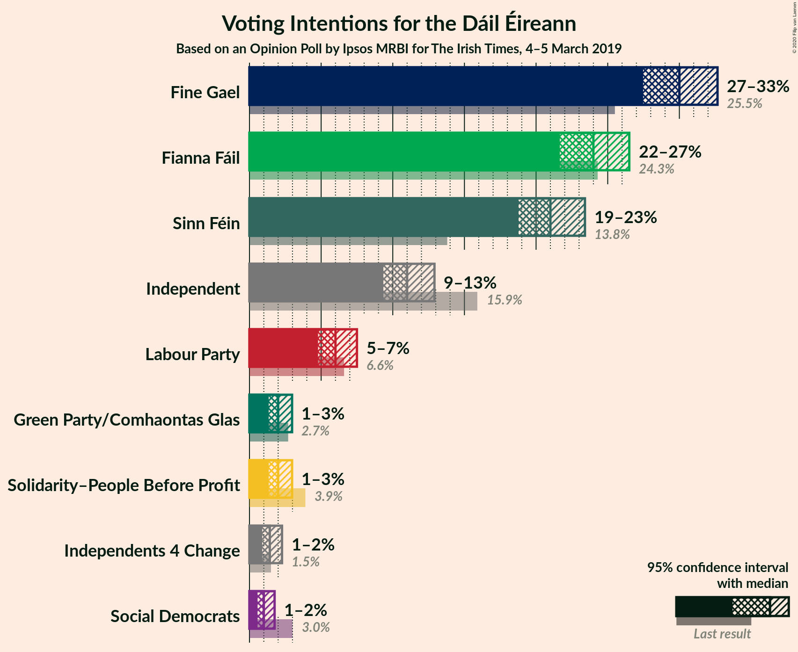
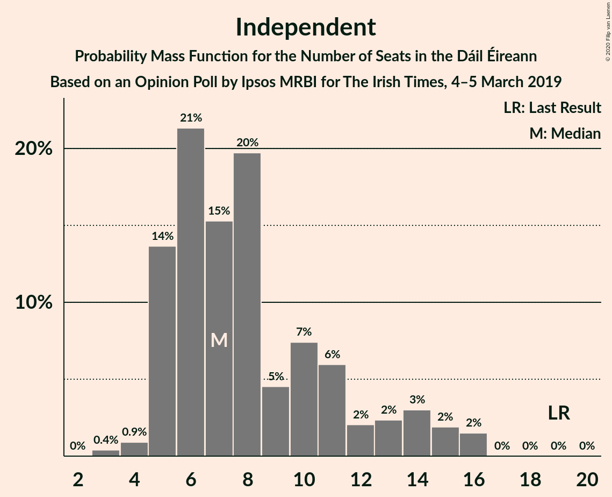
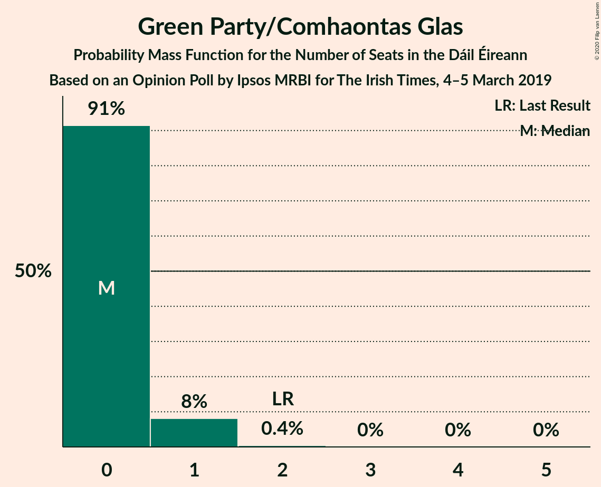
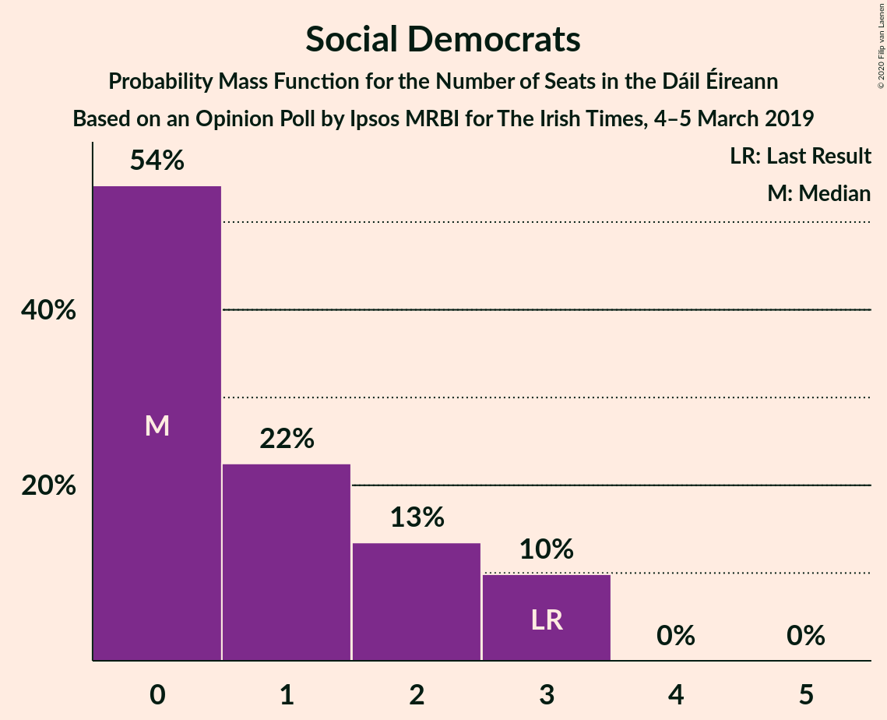
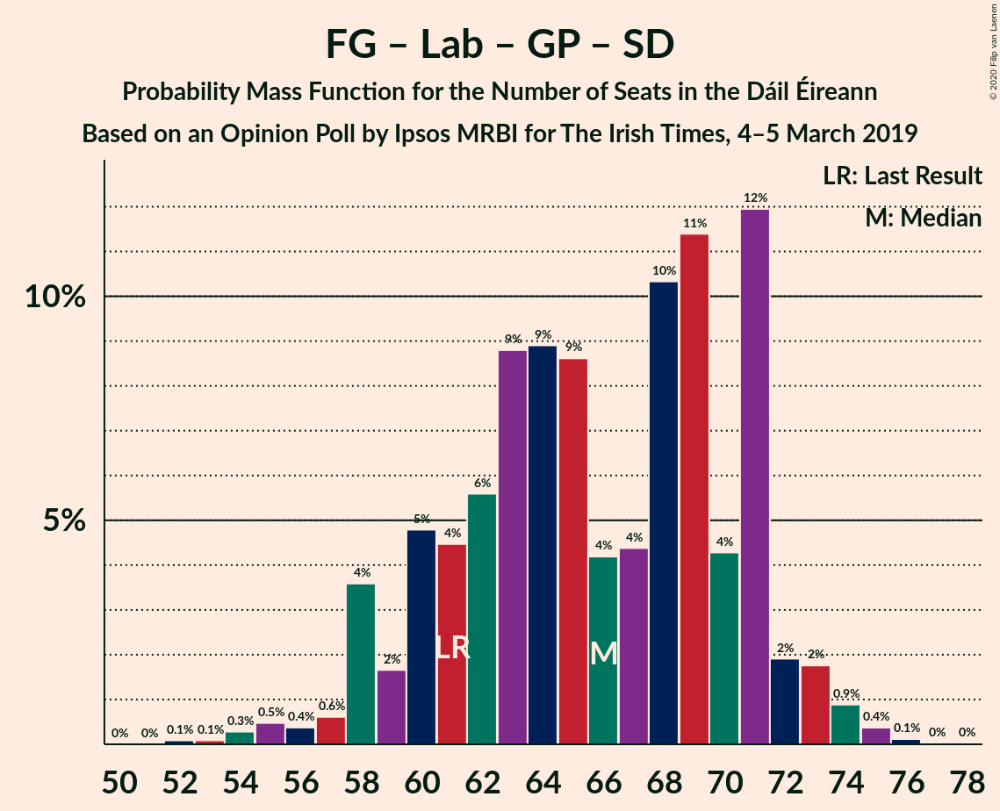
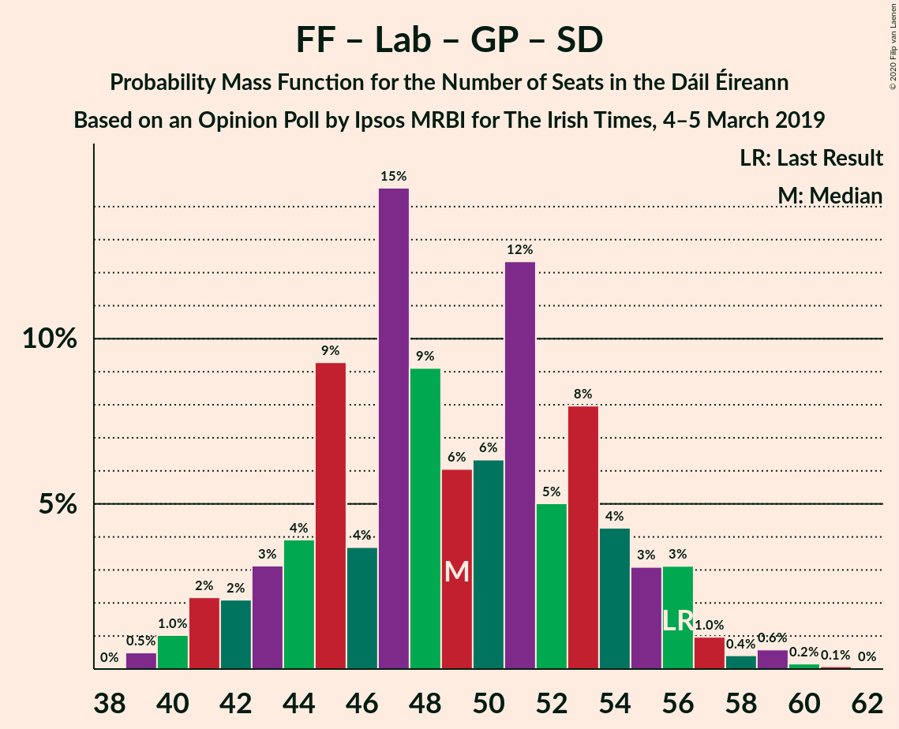

# Opinion Poll by Ipsos MRBI for The Irish Times, 4–5 March 2019

<a href="#voting-intentions">Voting Intentions</a> | <a href="#seats">Seats</a> | <a href="#coalitions">Coalitions</a> | <a href="#technical-information">Technical Information</a>

## Voting Intentions

### Confidence Intervals

| Party | Last Result | Poll Result | 80% Confidence Interval | 90% Confidence Interval | 95% Confidence Interval | 99% Confidence Interval |
|:-----:|:-----------:|:-----------:|:-----------------------:|:-----------------------:|:-----------------------:|:-----------------------:|
| Fine Gael | 25.5% | 30.0% | 28.3–31.7% |27.9–32.2% |27.5–32.7% |26.7–33.5% |
| Fianna Fáil | 24.3% | 24.0% | 22.5–25.6% |22.0–26.1% |21.7–26.5% |20.9–27.3% |
| Sinn Féin | 13.8% | 21.0% | 19.5–22.6% |19.1–23.0% |18.8–23.4% |18.1–24.2% |
| Independent | 15.9% | 11.0% | 9.9–12.2% |9.6–12.6% |9.3–12.9% |8.9–13.5% |
| Labour Party | 6.6% | 6.0% | 5.2–7.0% |5.0–7.3% |4.8–7.5% |4.4–8.0% |
| Solidarity–People Before Profit | 3.9% | 2.0% | 1.6–2.6% |1.4–2.8% |1.3–3.0% |1.2–3.3% |
| Green Party/Comhaontas Glas | 2.7% | 2.0% | 1.6–2.6% |1.4–2.8% |1.3–3.0% |1.2–3.3% |
| Independents 4 Change | 1.5% | 1.4% | 1.1–2.0% |1.0–2.1% |0.9–2.3% |0.7–2.6% |
| Social Democrats | 3.0% | 1.0% | 0.7–1.5% |0.6–1.6% |0.6–1.8% |0.5–2.0% |

*Note:* The poll result column reflects the actual value used in the calculations. Published results may vary slightly, and in addition be rounded to fewer digits.

## Seats

### Confidence Intervals

| Party | Last Result | Median | 80% Confidence Interval | 90% Confidence Interval | 95% Confidence Interval | 99% Confidence Interval |
|:-----:|:-----------:|:------:|:-----------------------:|:-----------------------:|:-----------------------:|:-----------------------:|
| <a href="#fine-gael">Fine Gael</a> | 49 | 63 | 54–64 |54–64 |54–64 |49–66 |
| <a href="#fianna-fáil">Fianna Fáil</a> | 44 | 41 | 38–48 |37–49 |36–49 |36–50 |
| <a href="#sinn-féin">Sinn Féin</a> | 23 | 39 | 35–41 |35–42 |35–43 |34–46 |
| <a href="#independent">Independent</a> | 19 | 7 | 6–10 |5–12 |5–14 |4–16 |
| <a href="#labour-party">Labour Party</a> | 7 | 6 | 3–8 |3–9 |2–10 |2–12 |
| <a href="#solidarity–people-before-profit">Solidarity–People Before Profit</a> | 6 | 0 | 0–3 |0–3 |0–3 |0–3 |
| <a href="#green-party/comhaontas-glas">Green Party/Comhaontas Glas</a> | 2 | 0 | 0 |0–1 |0–1 |0–1 |
| <a href="#independents-4-change">Independents 4 Change</a> | 4 | 4 | 1–4 |1–4 |0–5 |0–5 |
| <a href="#social-democrats">Social Democrats</a> | 3 | 0 | 0–2 |0–3 |0–3 |0–3 |

### Fine Gael

*For a full overview of the results for this party, see the [Fine Gael](party-finegael.html) page.*

| Number of Seats | Probability | Accumulated | Special Marks |
|:---------------:|:-----------:|:-----------:|:-------------:|
| 47 | 0% | 100% |  |
| 48 | 0.1% | 99.9% |  |
| 49 | 0.5% | 99.9% | Last Result |
| 50 | 0.2% | 99.4% |  |
| 51 | 0.3% | 99.2% |  |
| 52 | 0.5% | 99.0% |  |
| 53 | 0.3% | 98% |  |
| 54 | 10% | 98% |  |
| 55 | 7% | 88% |  |
| 56 | 4% | 81% |  |
| 57 | 3% | 78% |  |
| 58 | 7% | 74% |  |
| 59 | 3% | 67% |  |
| 60 | 3% | 65% |  |
| 61 | 4% | 62% |  |
| 62 | 4% | 58% |  |
| 63 | 31% | 54% | Median |
| 64 | 21% | 23% |  |
| 65 | 1.2% | 2% |  |
| 66 | 0.9% | 1.1% |  |
| 67 | 0.2% | 0.2% |  |
| 68 | 0% | 0% |  |

### Fianna Fáil

*For a full overview of the results for this party, see the [Fianna Fáil](party-fiannafáil.html) page.*

| Number of Seats | Probability | Accumulated | Special Marks |
|:---------------:|:-----------:|:-----------:|:-------------:|
| 36 | 3% | 100% |  |
| 37 | 2% | 97% |  |
| 38 | 5% | 94% |  |
| 39 | 2% | 90% |  |
| 40 | 19% | 88% |  |
| 41 | 29% | 69% | Median |
| 42 | 11% | 40% |  |
| 43 | 1.5% | 29% |  |
| 44 | 6% | 27% | Last Result |
| 45 | 4% | 21% |  |
| 46 | 2% | 16% |  |
| 47 | 3% | 15% |  |
| 48 | 4% | 12% |  |
| 49 | 7% | 8% |  |
| 50 | 0.4% | 0.8% |  |
| 51 | 0.2% | 0.4% |  |
| 52 | 0.2% | 0.2% |  |
| 53 | 0% | 0% |  |

### Sinn Féin

*For a full overview of the results for this party, see the [Sinn Féin](party-sinnféin.html) page.*

| Number of Seats | Probability | Accumulated | Special Marks |
|:---------------:|:-----------:|:-----------:|:-------------:|
| 23 | 0% | 100% | Last Result |
| 24 | 0% | 100% |  |
| 25 | 0% | 100% |  |
| 26 | 0% | 100% |  |
| 27 | 0% | 100% |  |
| 28 | 0% | 100% |  |
| 29 | 0% | 100% |  |
| 30 | 0% | 100% |  |
| 31 | 0% | 100% |  |
| 32 | 0% | 100% |  |
| 33 | 0.2% | 100% |  |
| 34 | 2% | 99.8% |  |
| 35 | 10% | 98% |  |
| 36 | 3% | 88% |  |
| 37 | 4% | 86% |  |
| 38 | 30% | 82% |  |
| 39 | 20% | 53% | Median |
| 40 | 11% | 32% |  |
| 41 | 12% | 21% |  |
| 42 | 6% | 10% |  |
| 43 | 2% | 4% |  |
| 44 | 0.5% | 2% |  |
| 45 | 0% | 1.4% |  |
| 46 | 1.4% | 1.4% |  |
| 47 | 0% | 0% |  |

### Independent

*For a full overview of the results for this party, see the [Independent](party-independent.html) page.*

| Number of Seats | Probability | Accumulated | Special Marks |
|:---------------:|:-----------:|:-----------:|:-------------:|
| 3 | 0.2% | 100% |  |
| 4 | 0.3% | 99.8% |  |
| 5 | 9% | 99.5% |  |
| 6 | 12% | 91% |  |
| 7 | 29% | 79% | Median |
| 8 | 29% | 50% |  |
| 9 | 0.6% | 21% |  |
| 10 | 10% | 20% |  |
| 11 | 4% | 10% |  |
| 12 | 1.2% | 5% |  |
| 13 | 0.4% | 4% |  |
| 14 | 2% | 4% |  |
| 15 | 1.0% | 2% |  |
| 16 | 1.1% | 1.1% |  |
| 17 | 0% | 0% |  |
| 18 | 0% | 0% |  |
| 19 | 0% | 0% | Last Result |

### Labour Party

*For a full overview of the results for this party, see the [Labour Party](party-labourparty.html) page.*

| Number of Seats | Probability | Accumulated | Special Marks |
|:---------------:|:-----------:|:-----------:|:-------------:|
| 1 | 0.3% | 100% |  |
| 2 | 3% | 99.7% |  |
| 3 | 14% | 97% |  |
| 4 | 4% | 83% |  |
| 5 | 8% | 78% |  |
| 6 | 57% | 70% | Median |
| 7 | 3% | 13% | Last Result |
| 8 | 0.5% | 10% |  |
| 9 | 7% | 10% |  |
| 10 | 2% | 3% |  |
| 11 | 0.4% | 1.1% |  |
| 12 | 0.5% | 0.7% |  |
| 13 | 0% | 0.2% |  |
| 14 | 0.1% | 0.2% |  |
| 15 | 0% | 0.1% |  |
| 16 | 0% | 0.1% |  |
| 17 | 0% | 0% |  |

### Solidarity–People Before Profit

*For a full overview of the results for this party, see the [Solidarity–People Before Profit](party-solidarity–peoplebeforeprofit.html) page.*

| Number of Seats | Probability | Accumulated | Special Marks |
|:---------------:|:-----------:|:-----------:|:-------------:|
| 0 | 54% | 100% | Median |
| 1 | 32% | 46% |  |
| 2 | 1.1% | 14% |  |
| 3 | 13% | 13% |  |
| 4 | 0.3% | 0.3% |  |
| 5 | 0% | 0% |  |
| 6 | 0% | 0% | Last Result |

### Green Party/Comhaontas Glas

*For a full overview of the results for this party, see the [Green Party/Comhaontas Glas](party-greenpartycomhaontasglas.html) page.*

| Number of Seats | Probability | Accumulated | Special Marks |
|:---------------:|:-----------:|:-----------:|:-------------:|
| 0 | 93% | 100% | Median |
| 1 | 7% | 7% |  |
| 2 | 0.2% | 0.2% | Last Result |
| 3 | 0% | 0% |  |

### Independents 4 Change

*For a full overview of the results for this party, see the [Independents 4 Change](party-independents4change.html) page.*

| Number of Seats | Probability | Accumulated | Special Marks |
|:---------------:|:-----------:|:-----------:|:-------------:|
| 0 | 5% | 100% |  |
| 1 | 19% | 95% |  |
| 2 | 8% | 76% |  |
| 3 | 8% | 68% |  |
| 4 | 55% | 60% | Last Result, Median |
| 5 | 5% | 5% |  |
| 6 | 0% | 0% |  |

### Social Democrats

*For a full overview of the results for this party, see the [Social Democrats](party-socialdemocrats.html) page.*

| Number of Seats | Probability | Accumulated | Special Marks |
|:---------------:|:-----------:|:-----------:|:-------------:|
| 0 | 64% | 100% | Median |
| 1 | 23% | 36% |  |
| 2 | 8% | 13% |  |
| 3 | 6% | 6% | Last Result |
| 4 | 0% | 0% |  |

## Coalitions

### Confidence Intervals

| Coalition | Last Result | Median | Majority? | 80% Confidence Interval | 90% Confidence Interval | 95% Confidence Interval | 99% Confidence Interval |
|:---------:|:-----------:|:------:|:---------:|:-----------------------:|:-----------------------:|:-----------------------:|:-----------------------:|
| Fine Gael – Fianna Fáil | 93 | 104 | 100% | 96–107 | 96–107 | 95–107 | 92–109 |
| Fianna Fáil – Sinn Féin | 67 | 79 | 37% | 77–86 | 76–89 | 76–90 | 74–90 |
| Fine Gael – Labour Party – Green Party/Comhaontas Glas – Social Democrats | 61 | 69 | 0% | 60–71 | 59–71 | 59–72 | 56–75 |
| Fine Gael – Labour Party – Green Party/Comhaontas Glas | 58 | 68 | 0% | 60–70 | 59–70 | 59–70 | 54–74 |
| Fine Gael – Labour Party | 56 | 68 | 0% | 60–70 | 59–70 | 59–70 | 54–74 |
| Fine Gael | 49 | 63 | 0% | 54–64 | 54–64 | 54–64 | 49–66 |
| Fine Gael – Green Party/Comhaontas Glas | 51 | 63 | 0% | 54–64 | 54–64 | 54–64 | 49–67 |
| Fianna Fáil – Labour Party – Green Party/Comhaontas Glas – Social Democrats | 56 | 47 | 0% | 46–54 | 41–55 | 40–56 | 40–59 |
| Fianna Fáil – Labour Party – Green Party/Comhaontas Glas | 53 | 47 | 0% | 45–54 | 41–55 | 39–55 | 39–58 |
| Fianna Fáil – Labour Party | 51 | 47 | 0% | 45–54 | 41–55 | 39–55 | 39–58 |
| Fianna Fáil – Green Party/Comhaontas Glas | 46 | 41 | 0% | 39–48 | 38–49 | 36–49 | 36–50 |

### Fine Gael – Fianna Fáil

| Number of Seats | Probability | Accumulated | Special Marks |
|:---------------:|:-----------:|:-----------:|:-------------:|
| 88 | 0% | 100% |  |
| 89 | 0% | 99.9% |  |
| 90 | 0.1% | 99.9% |  |
| 91 | 0.2% | 99.8% |  |
| 92 | 0.2% | 99.6% |  |
| 93 | 0.9% | 99.4% | Last Result |
| 94 | 0.6% | 98.6% |  |
| 95 | 2% | 98% |  |
| 96 | 9% | 96% |  |
| 97 | 1.5% | 88% |  |
| 98 | 4% | 86% |  |
| 99 | 0.8% | 82% |  |
| 100 | 8% | 81% |  |
| 101 | 1.2% | 73% |  |
| 102 | 4% | 72% |  |
| 103 | 1.3% | 68% |  |
| 104 | 48% | 66% | Median |
| 105 | 4% | 19% |  |
| 106 | 5% | 15% |  |
| 107 | 9% | 10% |  |
| 108 | 0.9% | 1.4% |  |
| 109 | 0.2% | 0.5% |  |
| 110 | 0.2% | 0.3% |  |
| 111 | 0.1% | 0.1% |  |
| 112 | 0% | 0% |  |

### Fianna Fáil – Sinn Féin

| Number of Seats | Probability | Accumulated | Special Marks |
|:---------------:|:-----------:|:-----------:|:-------------:|
| 67 | 0% | 100% | Last Result |
| 68 | 0% | 100% |  |
| 69 | 0% | 100% |  |
| 70 | 0% | 100% |  |
| 71 | 0% | 100% |  |
| 72 | 0% | 100% |  |
| 73 | 0.1% | 100% |  |
| 74 | 0.7% | 99.8% |  |
| 75 | 0.6% | 99.2% |  |
| 76 | 4% | 98.6% |  |
| 77 | 5% | 95% |  |
| 78 | 3% | 90% |  |
| 79 | 46% | 87% |  |
| 80 | 4% | 41% | Median |
| 81 | 2% | 37% | Majority |
| 82 | 11% | 35% |  |
| 83 | 0.6% | 24% |  |
| 84 | 8% | 24% |  |
| 85 | 3% | 16% |  |
| 86 | 4% | 13% |  |
| 87 | 0.9% | 8% |  |
| 88 | 2% | 7% |  |
| 89 | 0.8% | 5% |  |
| 90 | 4% | 4% |  |
| 91 | 0% | 0.3% |  |
| 92 | 0.1% | 0.3% |  |
| 93 | 0.2% | 0.2% |  |
| 94 | 0% | 0% |  |

### Fine Gael – Labour Party – Green Party/Comhaontas Glas – Social Democrats

| Number of Seats | Probability | Accumulated | Special Marks |
|:---------------:|:-----------:|:-----------:|:-------------:|
| 53 | 0.3% | 100% |  |
| 54 | 0.1% | 99.7% |  |
| 55 | 0% | 99.6% |  |
| 56 | 0.4% | 99.5% |  |
| 57 | 0.1% | 99.2% |  |
| 58 | 0.5% | 99.0% |  |
| 59 | 4% | 98.5% |  |
| 60 | 10% | 94% |  |
| 61 | 1.0% | 84% | Last Result |
| 62 | 0.9% | 83% |  |
| 63 | 2% | 82% |  |
| 64 | 11% | 80% |  |
| 65 | 6% | 69% |  |
| 66 | 4% | 63% |  |
| 67 | 1.3% | 59% |  |
| 68 | 3% | 58% |  |
| 69 | 27% | 54% | Median |
| 70 | 6% | 27% |  |
| 71 | 18% | 21% |  |
| 72 | 1.0% | 3% |  |
| 73 | 0.4% | 2% |  |
| 74 | 0.5% | 1.2% |  |
| 75 | 0.7% | 0.8% |  |
| 76 | 0% | 0% |  |

### Fine Gael – Labour Party – Green Party/Comhaontas Glas

| Number of Seats | Probability | Accumulated | Special Marks |
|:---------------:|:-----------:|:-----------:|:-------------:|
| 53 | 0.3% | 100% |  |
| 54 | 0.2% | 99.7% |  |
| 55 | 0% | 99.5% |  |
| 56 | 0.4% | 99.5% |  |
| 57 | 0.3% | 99.0% |  |
| 58 | 0.5% | 98.7% | Last Result |
| 59 | 4% | 98% |  |
| 60 | 11% | 94% |  |
| 61 | 0.7% | 83% |  |
| 62 | 0.8% | 82% |  |
| 63 | 5% | 82% |  |
| 64 | 11% | 77% |  |
| 65 | 7% | 66% |  |
| 66 | 0.8% | 59% |  |
| 67 | 6% | 58% |  |
| 68 | 6% | 52% |  |
| 69 | 25% | 46% | Median |
| 70 | 20% | 22% |  |
| 71 | 0.7% | 2% |  |
| 72 | 0.3% | 1.5% |  |
| 73 | 0.3% | 1.1% |  |
| 74 | 0.8% | 0.8% |  |
| 75 | 0% | 0% |  |

### Fine Gael – Labour Party

| Number of Seats | Probability | Accumulated | Special Marks |
|:---------------:|:-----------:|:-----------:|:-------------:|
| 53 | 0.3% | 100% |  |
| 54 | 0.2% | 99.6% |  |
| 55 | 0% | 99.5% |  |
| 56 | 0.4% | 99.4% | Last Result |
| 57 | 0.3% | 99.0% |  |
| 58 | 0.6% | 98.7% |  |
| 59 | 4% | 98% |  |
| 60 | 11% | 94% |  |
| 61 | 0.7% | 83% |  |
| 62 | 2% | 82% |  |
| 63 | 4% | 81% |  |
| 64 | 12% | 77% |  |
| 65 | 6% | 65% |  |
| 66 | 0.8% | 59% |  |
| 67 | 8% | 58% |  |
| 68 | 5% | 51% |  |
| 69 | 27% | 46% | Median |
| 70 | 18% | 19% |  |
| 71 | 0.5% | 2% |  |
| 72 | 0.1% | 1.2% |  |
| 73 | 0.3% | 1.1% |  |
| 74 | 0.8% | 0.8% |  |
| 75 | 0% | 0% |  |

### Fine Gael

| Number of Seats | Probability | Accumulated | Special Marks |
|:---------------:|:-----------:|:-----------:|:-------------:|
| 47 | 0% | 100% |  |
| 48 | 0.1% | 99.9% |  |
| 49 | 0.5% | 99.9% | Last Result |
| 50 | 0.2% | 99.4% |  |
| 51 | 0.3% | 99.2% |  |
| 52 | 0.5% | 99.0% |  |
| 53 | 0.3% | 98% |  |
| 54 | 10% | 98% |  |
| 55 | 7% | 88% |  |
| 56 | 4% | 81% |  |
| 57 | 3% | 78% |  |
| 58 | 7% | 74% |  |
| 59 | 3% | 67% |  |
| 60 | 3% | 65% |  |
| 61 | 4% | 62% |  |
| 62 | 4% | 58% |  |
| 63 | 31% | 54% | Median |
| 64 | 21% | 23% |  |
| 65 | 1.2% | 2% |  |
| 66 | 0.9% | 1.1% |  |
| 67 | 0.2% | 0.2% |  |
| 68 | 0% | 0% |  |

### Fine Gael – Green Party/Comhaontas Glas

| Number of Seats | Probability | Accumulated | Special Marks |
|:---------------:|:-----------:|:-----------:|:-------------:|
| 48 | 0.1% | 100% |  |
| 49 | 0.5% | 99.9% |  |
| 50 | 0.1% | 99.4% |  |
| 51 | 0.3% | 99.3% | Last Result |
| 52 | 0.3% | 99.0% |  |
| 53 | 0.5% | 98.7% |  |
| 54 | 10% | 98% |  |
| 55 | 7% | 88% |  |
| 56 | 4% | 81% |  |
| 57 | 3% | 78% |  |
| 58 | 7% | 74% |  |
| 59 | 2% | 68% |  |
| 60 | 2% | 66% |  |
| 61 | 4% | 63% |  |
| 62 | 5% | 59% |  |
| 63 | 29% | 54% | Median |
| 64 | 23% | 25% |  |
| 65 | 1.1% | 2% |  |
| 66 | 0.6% | 1.2% |  |
| 67 | 0.4% | 0.6% |  |
| 68 | 0.2% | 0.2% |  |
| 69 | 0% | 0% |  |

### Fianna Fáil – Labour Party – Green Party/Comhaontas Glas – Social Democrats

| Number of Seats | Probability | Accumulated | Special Marks |
|:---------------:|:-----------:|:-----------:|:-------------:|
| 39 | 0% | 100% |  |
| 40 | 3% | 99.9% |  |
| 41 | 2% | 97% |  |
| 42 | 0.3% | 95% |  |
| 43 | 2% | 95% |  |
| 44 | 0.3% | 93% |  |
| 45 | 1.4% | 92% |  |
| 46 | 2% | 91% |  |
| 47 | 45% | 88% | Median |
| 48 | 12% | 43% |  |
| 49 | 4% | 31% |  |
| 50 | 4% | 27% |  |
| 51 | 6% | 23% |  |
| 52 | 2% | 17% |  |
| 53 | 0.9% | 14% |  |
| 54 | 4% | 14% |  |
| 55 | 6% | 10% |  |
| 56 | 2% | 3% | Last Result |
| 57 | 0.4% | 1.2% |  |
| 58 | 0.2% | 0.8% |  |
| 59 | 0.6% | 0.6% |  |
| 60 | 0% | 0.1% |  |
| 61 | 0% | 0% |  |

### Fianna Fáil – Labour Party – Green Party/Comhaontas Glas

| Number of Seats | Probability | Accumulated | Special Marks |
|:---------------:|:-----------:|:-----------:|:-------------:|
| 38 | 0.1% | 100% |  |
| 39 | 3% | 99.9% |  |
| 40 | 0.7% | 97% |  |
| 41 | 2% | 97% |  |
| 42 | 0.7% | 95% |  |
| 43 | 3% | 94% |  |
| 44 | 0.4% | 91% |  |
| 45 | 3% | 91% |  |
| 46 | 19% | 88% |  |
| 47 | 31% | 69% | Median |
| 48 | 14% | 38% |  |
| 49 | 1.0% | 24% |  |
| 50 | 3% | 23% |  |
| 51 | 4% | 20% |  |
| 52 | 2% | 16% |  |
| 53 | 3% | 14% | Last Result |
| 54 | 4% | 11% |  |
| 55 | 7% | 8% |  |
| 56 | 0.4% | 1.2% |  |
| 57 | 0.2% | 0.8% |  |
| 58 | 0.3% | 0.6% |  |
| 59 | 0.3% | 0.3% |  |
| 60 | 0% | 0% |  |

### Fianna Fáil – Labour Party

| Number of Seats | Probability | Accumulated | Special Marks |
|:---------------:|:-----------:|:-----------:|:-------------:|
| 38 | 0.1% | 100% |  |
| 39 | 3% | 99.9% |  |
| 40 | 1.4% | 97% |  |
| 41 | 2% | 96% |  |
| 42 | 0.4% | 94% |  |
| 43 | 3% | 94% |  |
| 44 | 0.6% | 91% |  |
| 45 | 4% | 90% |  |
| 46 | 18% | 87% |  |
| 47 | 33% | 69% | Median |
| 48 | 12% | 36% |  |
| 49 | 2% | 24% |  |
| 50 | 2% | 22% |  |
| 51 | 4% | 20% | Last Result |
| 52 | 2% | 16% |  |
| 53 | 3% | 14% |  |
| 54 | 4% | 11% |  |
| 55 | 7% | 8% |  |
| 56 | 0.4% | 1.2% |  |
| 57 | 0.2% | 0.8% |  |
| 58 | 0.3% | 0.6% |  |
| 59 | 0.3% | 0.3% |  |
| 60 | 0% | 0% |  |

### Fianna Fáil – Green Party/Comhaontas Glas

| Number of Seats | Probability | Accumulated | Special Marks |
|:---------------:|:-----------:|:-----------:|:-------------:|
| 36 | 3% | 100% |  |
| 37 | 2% | 97% |  |
| 38 | 4% | 95% |  |
| 39 | 4% | 92% |  |
| 40 | 19% | 88% |  |
| 41 | 27% | 69% | Median |
| 42 | 13% | 42% |  |
| 43 | 2% | 29% |  |
| 44 | 6% | 27% |  |
| 45 | 4% | 21% |  |
| 46 | 0.9% | 17% | Last Result |
| 47 | 4% | 16% |  |
| 48 | 4% | 12% |  |
| 49 | 7% | 8% |  |
| 50 | 0.4% | 0.8% |  |
| 51 | 0.2% | 0.4% |  |
| 52 | 0.2% | 0.2% |  |
| 53 | 0% | 0% |  |

## Technical Information

### Opinion Poll

+ **Polling firm:** Ipsos MRBI
+ **Commissioner(s):** The Irish Times
+ **Fieldwork period:** 4–5 March 2019

### Calculations

+ **Sample size:** 1200
+ **Simulations done:** 131,072
+ **Error estimate:** 2.09%

