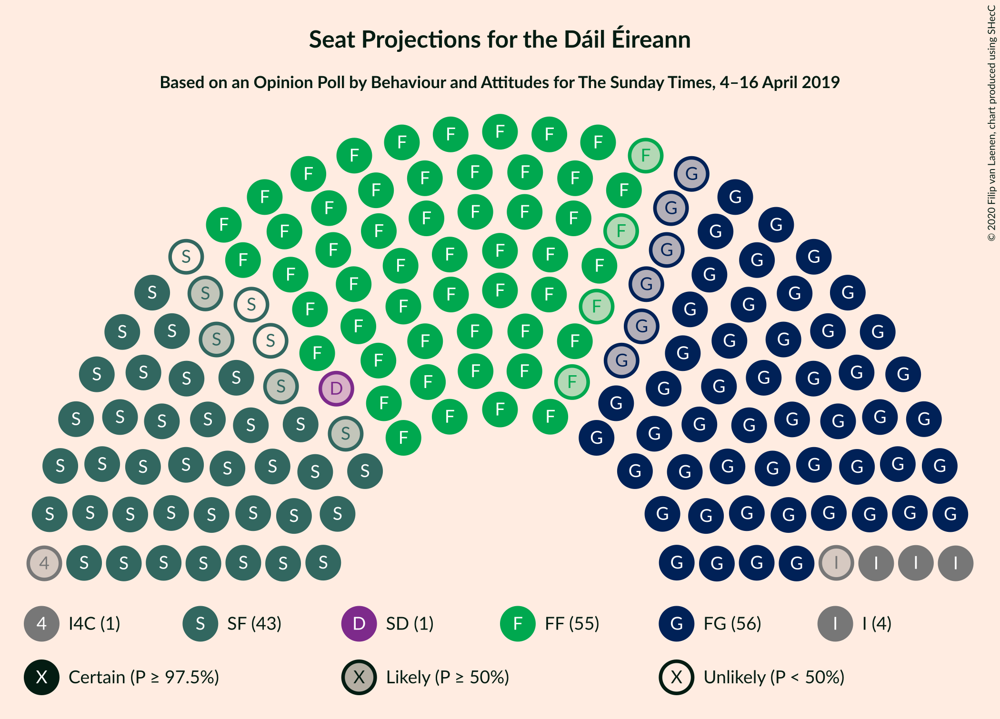
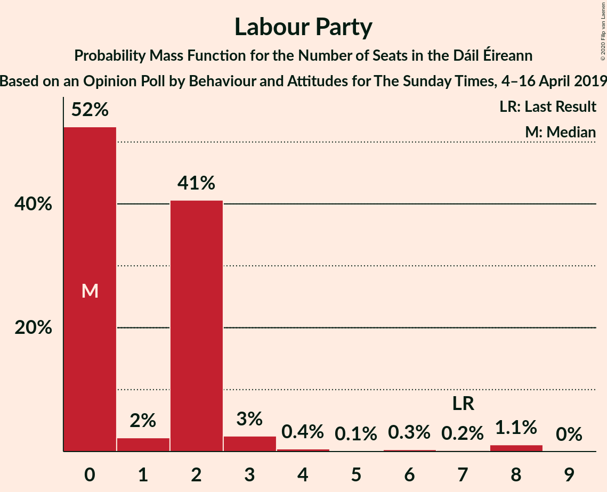
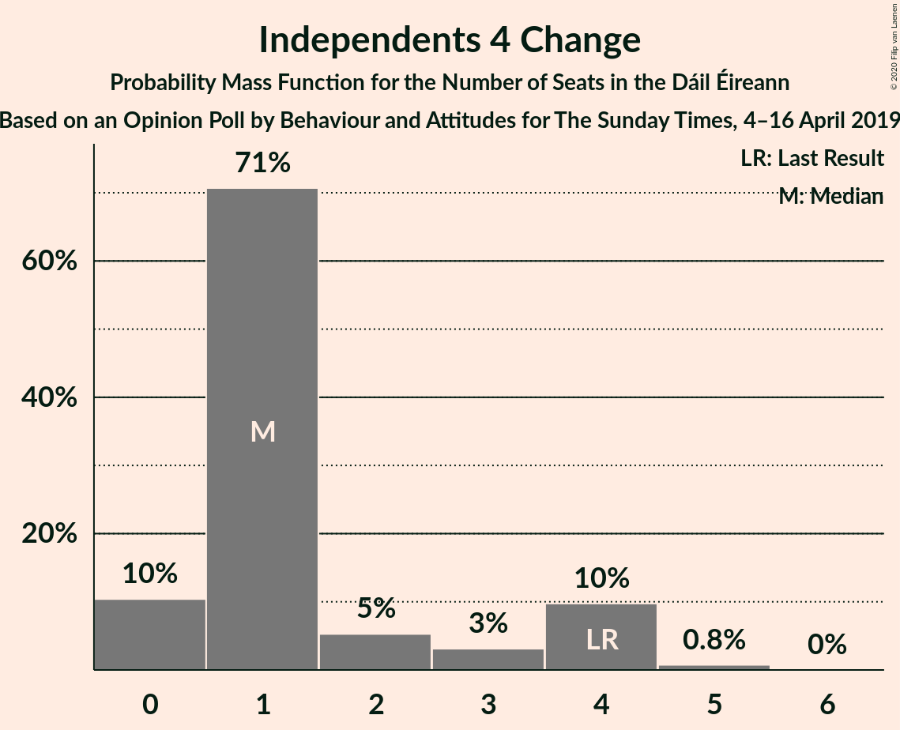
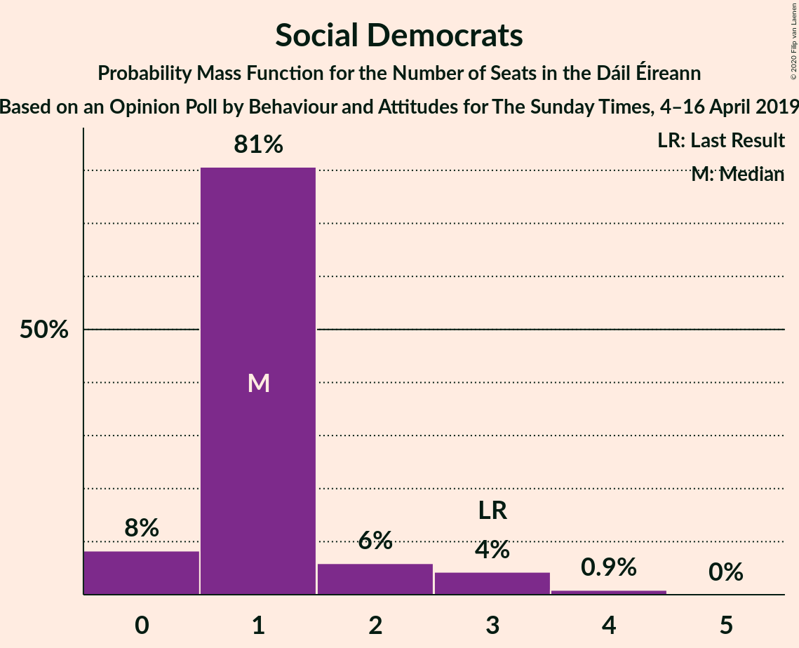
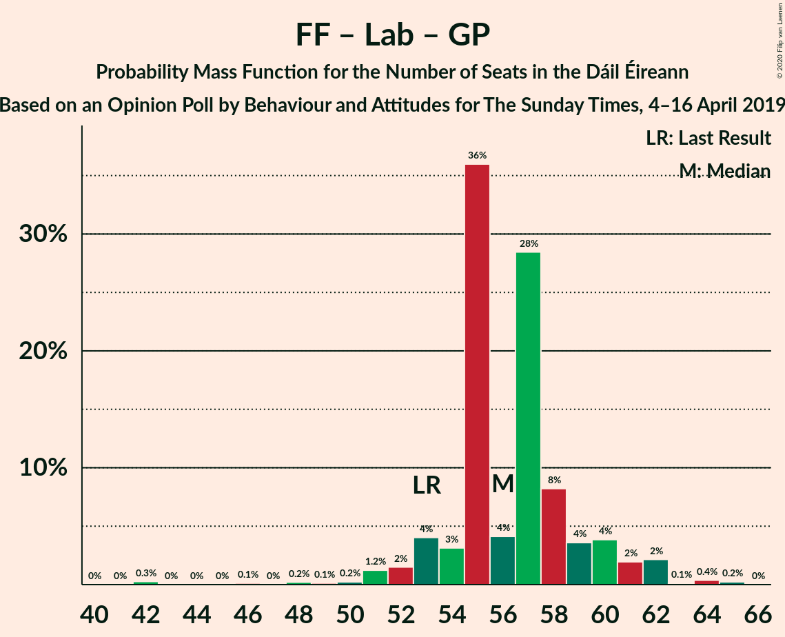

# Opinion Poll by Behaviour and Attitudes for The Sunday Times, 4–16 April 2019

<a href="#voting-intentions">Voting Intentions</a> | <a href="#seats">Seats</a> | <a href="#coalitions">Coalitions</a> | <a href="#technical-information">Technical Information</a>

## Voting Intentions

### Confidence Intervals

| Party | Last Result | Poll Result | 80% Confidence Interval | 90% Confidence Interval | 95% Confidence Interval | 99% Confidence Interval |
|:-----:|:-----------:|:-----------:|:-----------------------:|:-----------------------:|:-----------------------:|:-----------------------:|
| Fianna Fáil | 24.3% | 29.3% | 27.4–31.2% |26.9–31.8% |26.4–32.3% |25.6–33.2% |
| Fine Gael | 25.5% | 28.2% | 26.4–30.1% |25.8–30.7% |25.4–31.2% |24.5–32.1% |
| Sinn Féin | 13.8% | 21.1% | 19.5–22.9% |19.0–23.4% |18.6–23.9% |17.8–24.7% |
| Independent | 15.9% | 8.5% | 7.4–9.8% |7.1–10.1% |6.8–10.4% |6.4–11.1% |
| Labour Party | 6.6% | 4.1% | 3.4–5.0% |3.1–5.3% |3.0–5.5% |2.7–6.0% |
| Independents 4 Change | 1.5% | 1.1% | 0.7–1.6% |0.7–1.8% |0.6–2.0% |0.5–2.3% |
| Solidarity–People Before Profit | 3.9% | 1.0% | 0.7–1.5% |0.6–1.7% |0.5–1.8% |0.4–2.1% |
| Social Democrats | 3.0% | 1.0% | 0.7–1.5% |0.6–1.7% |0.5–1.8% |0.4–2.1% |
| Green Party/Comhaontas Glas | 2.7% | 1.0% | 0.7–1.5% |0.6–1.7% |0.5–1.8% |0.4–2.1% |
| Renua Ireland | 2.2% | 0.2% | 0.1–0.6% |0.1–0.7% |0.1–0.8% |0.0–1.0% |

*Note:* The poll result column reflects the actual value used in the calculations. Published results may vary slightly, and in addition be rounded to fewer digits.

## Seats

### Confidence Intervals

| Party | Last Result | Median | 80% Confidence Interval | 90% Confidence Interval | 95% Confidence Interval | 99% Confidence Interval |
|:-----:|:-----------:|:------:|:-----------------------:|:-----------------------:|:-----------------------:|:-----------------------:|
| <a href="#fianna-fáil">Fianna Fáil</a> | 44 | 55 | 53–58 |51–59 |51–60 |47–61 |
| <a href="#fine-gael">Fine Gael</a> | 49 | 56 | 52–60 |52–61 |50–61 |48–64 |
| <a href="#sinn-féin">Sinn Féin</a> | 23 | 40 | 37–43 |37–43 |36–43 |36–44 |
| <a href="#independent">Independent</a> | 19 | 4 | 4–6 |4–6 |3–6 |3–7 |
| <a href="#labour-party">Labour Party</a> | 7 | 0 | 0–2 |0–2 |0–3 |0–8 |
| <a href="#independents-4-change">Independents 4 Change</a> | 4 | 1 | 0–4 |0–4 |0–4 |0–5 |
| <a href="#solidarity–people-before-profit">Solidarity–People Before Profit</a> | 6 | 0 | 0 |0 |0 |0 |
| <a href="#social-democrats">Social Democrats</a> | 3 | 1 | 1–2 |0–3 |0–3 |0–4 |
| <a href="#green-party/comhaontas-glas">Green Party/Comhaontas Glas</a> | 2 | 0 | 0 |0 |0 |0 |
| <a href="#renua-ireland">Renua Ireland</a> | 0 | 0 | 0 |0 |0 |0 |

### Fianna Fáil

*For a full overview of the results for this party, see the [Fianna Fáil](party-fiannafáil.html) page.*

| Number of Seats | Probability | Accumulated | Special Marks |
|:---------------:|:-----------:|:-----------:|:-------------:|
| 42 | 0.3% | 100% |  |
| 43 | 0% | 99.7% |  |
| 44 | 0.1% | 99.7% | Last Result |
| 45 | 0% | 99.6% |  |
| 46 | 0% | 99.6% |  |
| 47 | 0.1% | 99.5% |  |
| 48 | 0.3% | 99.4% |  |
| 49 | 0.2% | 99.2% |  |
| 50 | 1.1% | 99.0% |  |
| 51 | 3% | 98% |  |
| 52 | 2% | 95% |  |
| 53 | 3% | 93% |  |
| 54 | 4% | 90% |  |
| 55 | 63% | 86% | Median |
| 56 | 10% | 23% |  |
| 57 | 0.7% | 13% |  |
| 58 | 2% | 12% |  |
| 59 | 6% | 10% |  |
| 60 | 3% | 4% |  |
| 61 | 0.6% | 0.6% |  |
| 62 | 0% | 0.1% |  |
| 63 | 0% | 0% |  |

### Fine Gael

*For a full overview of the results for this party, see the [Fine Gael](party-finegael.html) page.*

| Number of Seats | Probability | Accumulated | Special Marks |
|:---------------:|:-----------:|:-----------:|:-------------:|
| 47 | 0.1% | 100% |  |
| 48 | 2% | 99.8% |  |
| 49 | 0.1% | 98% | Last Result |
| 50 | 1.1% | 98% |  |
| 51 | 2% | 97% |  |
| 52 | 9% | 95% |  |
| 53 | 1.4% | 86% |  |
| 54 | 2% | 85% |  |
| 55 | 0.9% | 83% |  |
| 56 | 34% | 83% | Median |
| 57 | 5% | 49% |  |
| 58 | 4% | 43% |  |
| 59 | 2% | 40% |  |
| 60 | 30% | 38% |  |
| 61 | 6% | 8% |  |
| 62 | 1.3% | 2% |  |
| 63 | 0.1% | 0.7% |  |
| 64 | 0.2% | 0.6% |  |
| 65 | 0% | 0.4% |  |
| 66 | 0% | 0.3% |  |
| 67 | 0.3% | 0.3% |  |
| 68 | 0% | 0% |  |

### Sinn Féin

*For a full overview of the results for this party, see the [Sinn Féin](party-sinnféin.html) page.*

| Number of Seats | Probability | Accumulated | Special Marks |
|:---------------:|:-----------:|:-----------:|:-------------:|
| 23 | 0% | 100% | Last Result |
| 24 | 0% | 100% |  |
| 25 | 0% | 100% |  |
| 26 | 0% | 100% |  |
| 27 | 0% | 100% |  |
| 28 | 0% | 100% |  |
| 29 | 0% | 100% |  |
| 30 | 0% | 100% |  |
| 31 | 0% | 100% |  |
| 32 | 0% | 100% |  |
| 33 | 0.1% | 100% |  |
| 34 | 0% | 99.9% |  |
| 35 | 0% | 99.9% |  |
| 36 | 4% | 99.9% |  |
| 37 | 36% | 96% |  |
| 38 | 5% | 60% |  |
| 39 | 3% | 55% |  |
| 40 | 4% | 52% | Median |
| 41 | 3% | 49% |  |
| 42 | 9% | 46% |  |
| 43 | 35% | 36% |  |
| 44 | 0.7% | 1.1% |  |
| 45 | 0.4% | 0.4% |  |
| 46 | 0% | 0% |  |

### Independent

*For a full overview of the results for this party, see the [Independent](party-independent.html) page.*

| Number of Seats | Probability | Accumulated | Special Marks |
|:---------------:|:-----------:|:-----------:|:-------------:|
| 3 | 3% | 100% |  |
| 4 | 79% | 97% | Median |
| 5 | 4% | 18% |  |
| 6 | 13% | 14% |  |
| 7 | 0.2% | 0.7% |  |
| 8 | 0.2% | 0.5% |  |
| 9 | 0.2% | 0.3% |  |
| 10 | 0.1% | 0.1% |  |
| 11 | 0% | 0% |  |
| 12 | 0% | 0% |  |
| 13 | 0% | 0% |  |
| 14 | 0% | 0% |  |
| 15 | 0% | 0% |  |
| 16 | 0% | 0% |  |
| 17 | 0% | 0% |  |
| 18 | 0% | 0% |  |
| 19 | 0% | 0% | Last Result |

### Labour Party

*For a full overview of the results for this party, see the [Labour Party](party-labourparty.html) page.*

| Number of Seats | Probability | Accumulated | Special Marks |
|:---------------:|:-----------:|:-----------:|:-------------:|
| 0 | 52% | 100% | Median |
| 1 | 2% | 48% |  |
| 2 | 41% | 45% |  |
| 3 | 3% | 5% |  |
| 4 | 0.4% | 2% |  |
| 5 | 0.1% | 2% |  |
| 6 | 0.3% | 2% |  |
| 7 | 0.2% | 1.3% | Last Result |
| 8 | 1.1% | 1.1% |  |
| 9 | 0% | 0% |  |

### Independents 4 Change

*For a full overview of the results for this party, see the [Independents 4 Change](party-independents4change.html) page.*

| Number of Seats | Probability | Accumulated | Special Marks |
|:---------------:|:-----------:|:-----------:|:-------------:|
| 0 | 10% | 100% |  |
| 1 | 71% | 90% | Median |
| 2 | 5% | 19% |  |
| 3 | 3% | 14% |  |
| 4 | 10% | 11% | Last Result |
| 5 | 0.8% | 0.8% |  |
| 6 | 0% | 0% |  |

### Solidarity–People Before Profit

*For a full overview of the results for this party, see the [Solidarity–People Before Profit](party-solidarity–peoplebeforeprofit.html) page.*

| Number of Seats | Probability | Accumulated | Special Marks |
|:---------------:|:-----------:|:-----------:|:-------------:|
| 0 | 99.8% | 100% | Median |
| 1 | 0.2% | 0.2% |  |
| 2 | 0% | 0% |  |
| 3 | 0% | 0% |  |
| 4 | 0% | 0% |  |
| 5 | 0% | 0% |  |
| 6 | 0% | 0% | Last Result |

### Social Democrats

*For a full overview of the results for this party, see the [Social Democrats](party-socialdemocrats.html) page.*

| Number of Seats | Probability | Accumulated | Special Marks |
|:---------------:|:-----------:|:-----------:|:-------------:|
| 0 | 8% | 100% |  |
| 1 | 81% | 92% | Median |
| 2 | 6% | 11% |  |
| 3 | 4% | 5% | Last Result |
| 4 | 0.9% | 0.9% |  |
| 5 | 0% | 0% |  |

### Green Party/Comhaontas Glas

*For a full overview of the results for this party, see the [Green Party/Comhaontas Glas](party-greenpartycomhaontasglas.html) page.*

| Number of Seats | Probability | Accumulated | Special Marks |
|:---------------:|:-----------:|:-----------:|:-------------:|
| 0 | 100% | 100% | Median |
| 1 | 0% | 0% |  |
| 2 | 0% | 0% | Last Result |

### Renua Ireland

*For a full overview of the results for this party, see the [Renua Ireland](party-renuaireland.html) page.*

| Number of Seats | Probability | Accumulated | Special Marks |
|:---------------:|:-----------:|:-----------:|:-------------:|
| 0 | 100% | 100% | Last Result, Median |

## Coalitions

### Confidence Intervals

| Coalition | Last Result | Median | Majority? | 80% Confidence Interval | 90% Confidence Interval | 95% Confidence Interval | 99% Confidence Interval |
|:---------:|:-----------:|:------:|:---------:|:-----------------------:|:-----------------------:|:-----------------------:|:-----------------------:|
| Fianna Fáil – Fine Gael | 93 | 111 | 100% | 108–115 | 108–116 | 108–117 | 105–118 |
| Fianna Fáil – Sinn Féin | 67 | 96 | 100% | 92–98 | 91–99 | 90–101 | 87–102 |
| Fianna Fáil – Labour Party – Green Party/Comhaontas Glas – Social Democrats | 56 | 58 | 0% | 56–60 | 54–61 | 53–64 | 50–64 |
| Fine Gael – Labour Party – Green Party/Comhaontas Glas – Social Democrats | 61 | 58 | 0% | 55–63 | 54–63 | 52–64 | 50–67 |
| Fianna Fáil – Labour Party – Green Party/Comhaontas Glas | 53 | 56 | 0% | 54–59 | 53–60 | 52–62 | 48–64 |
| Fianna Fáil – Labour Party | 51 | 56 | 0% | 54–59 | 53–60 | 52–62 | 48–64 |
| Fine Gael – Labour Party – Green Party/Comhaontas Glas | 58 | 56 | 0% | 54–62 | 53–62 | 51–62 | 49–66 |
| Fine Gael – Labour Party | 56 | 56 | 0% | 54–62 | 53–62 | 51–62 | 49–66 |
| Fine Gael | 49 | 56 | 0% | 52–60 | 52–61 | 50–61 | 48–64 |
| Fine Gael – Green Party/Comhaontas Glas | 51 | 56 | 0% | 52–60 | 52–61 | 50–61 | 48–64 |
| Fianna Fáil – Green Party/Comhaontas Glas | 46 | 55 | 0% | 53–58 | 51–59 | 51–60 | 47–61 |

### Fianna Fáil – Fine Gael

| Number of Seats | Probability | Accumulated | Special Marks |
|:---------------:|:-----------:|:-----------:|:-------------:|
| 93 | 0% | 100% | Last Result |
| 94 | 0% | 100% |  |
| 95 | 0% | 100% |  |
| 96 | 0% | 100% |  |
| 97 | 0% | 100% |  |
| 98 | 0% | 100% |  |
| 99 | 0% | 100% |  |
| 100 | 0% | 100% |  |
| 101 | 0% | 100% |  |
| 102 | 0% | 100% |  |
| 103 | 0.1% | 99.9% |  |
| 104 | 0.2% | 99.9% |  |
| 105 | 0.3% | 99.7% |  |
| 106 | 0.6% | 99.3% |  |
| 107 | 0.7% | 98.7% |  |
| 108 | 8% | 98% |  |
| 109 | 5% | 90% |  |
| 110 | 3% | 85% |  |
| 111 | 40% | 81% | Median |
| 112 | 1.2% | 42% |  |
| 113 | 0.5% | 40% |  |
| 114 | 1.1% | 40% |  |
| 115 | 31% | 39% |  |
| 116 | 4% | 8% |  |
| 117 | 3% | 5% |  |
| 118 | 1.2% | 1.3% |  |
| 119 | 0.1% | 0.1% |  |
| 120 | 0% | 0% |  |

### Fianna Fáil – Sinn Féin

| Number of Seats | Probability | Accumulated | Special Marks |
|:---------------:|:-----------:|:-----------:|:-------------:|
| 67 | 0% | 100% | Last Result |
| 68 | 0% | 100% |  |
| 69 | 0% | 100% |  |
| 70 | 0% | 100% |  |
| 71 | 0% | 100% |  |
| 72 | 0% | 100% |  |
| 73 | 0% | 100% |  |
| 74 | 0% | 100% |  |
| 75 | 0% | 100% |  |
| 76 | 0% | 100% |  |
| 77 | 0% | 100% |  |
| 78 | 0% | 100% |  |
| 79 | 0% | 100% |  |
| 80 | 0% | 100% |  |
| 81 | 0% | 100% | Majority |
| 82 | 0% | 100% |  |
| 83 | 0.3% | 100% |  |
| 84 | 0.2% | 99.7% |  |
| 85 | 0% | 99.6% |  |
| 86 | 0% | 99.6% |  |
| 87 | 0.1% | 99.5% |  |
| 88 | 1.0% | 99.4% |  |
| 89 | 0.8% | 98% |  |
| 90 | 2% | 98% |  |
| 91 | 5% | 96% |  |
| 92 | 31% | 91% |  |
| 93 | 4% | 61% |  |
| 94 | 1.4% | 57% |  |
| 95 | 3% | 55% | Median |
| 96 | 3% | 52% |  |
| 97 | 3% | 49% |  |
| 98 | 41% | 46% |  |
| 99 | 1.2% | 5% |  |
| 100 | 1.4% | 4% |  |
| 101 | 2% | 3% |  |
| 102 | 0.7% | 0.9% |  |
| 103 | 0.1% | 0.2% |  |
| 104 | 0.1% | 0.1% |  |
| 105 | 0% | 0% |  |

### Fianna Fáil – Labour Party – Green Party/Comhaontas Glas – Social Democrats

| Number of Seats | Probability | Accumulated | Special Marks |
|:---------------:|:-----------:|:-----------:|:-------------:|
| 43 | 0.3% | 100% |  |
| 44 | 0% | 99.7% |  |
| 45 | 0% | 99.7% |  |
| 46 | 0.2% | 99.7% |  |
| 47 | 0% | 99.6% |  |
| 48 | 0% | 99.6% |  |
| 49 | 0% | 99.5% |  |
| 50 | 0.3% | 99.5% |  |
| 51 | 0.2% | 99.3% |  |
| 52 | 0.3% | 99.1% |  |
| 53 | 3% | 98.8% |  |
| 54 | 2% | 96% |  |
| 55 | 3% | 93% |  |
| 56 | 38% | 91% | Last Result, Median |
| 57 | 3% | 53% |  |
| 58 | 30% | 50% |  |
| 59 | 8% | 21% |  |
| 60 | 3% | 12% |  |
| 61 | 5% | 10% |  |
| 62 | 1.4% | 5% |  |
| 63 | 0.5% | 3% |  |
| 64 | 2% | 3% |  |
| 65 | 0.1% | 0.5% |  |
| 66 | 0.3% | 0.3% |  |
| 67 | 0% | 0% |  |

### Fine Gael – Labour Party – Green Party/Comhaontas Glas – Social Democrats

| Number of Seats | Probability | Accumulated | Special Marks |
|:---------------:|:-----------:|:-----------:|:-------------:|
| 49 | 0% | 100% |  |
| 50 | 1.3% | 99.9% |  |
| 51 | 0.2% | 98.6% |  |
| 52 | 2% | 98% |  |
| 53 | 0.4% | 96% |  |
| 54 | 1.4% | 96% |  |
| 55 | 6% | 94% |  |
| 56 | 2% | 88% |  |
| 57 | 36% | 87% | Median |
| 58 | 4% | 51% |  |
| 59 | 2% | 46% |  |
| 60 | 0.3% | 44% |  |
| 61 | 7% | 44% | Last Result |
| 62 | 4% | 37% |  |
| 63 | 29% | 33% |  |
| 64 | 1.0% | 4% |  |
| 65 | 0.1% | 2% |  |
| 66 | 2% | 2% |  |
| 67 | 0.1% | 0.5% |  |
| 68 | 0.4% | 0.4% |  |
| 69 | 0% | 0% |  |

### Fianna Fáil – Labour Party – Green Party/Comhaontas Glas

| Number of Seats | Probability | Accumulated | Special Marks |
|:---------------:|:-----------:|:-----------:|:-------------:|
| 42 | 0.3% | 100% |  |
| 43 | 0% | 99.7% |  |
| 44 | 0% | 99.7% |  |
| 45 | 0% | 99.7% |  |
| 46 | 0.1% | 99.7% |  |
| 47 | 0% | 99.6% |  |
| 48 | 0.2% | 99.6% |  |
| 49 | 0.1% | 99.4% |  |
| 50 | 0.2% | 99.2% |  |
| 51 | 1.2% | 99.0% |  |
| 52 | 2% | 98% |  |
| 53 | 4% | 96% | Last Result |
| 54 | 3% | 92% |  |
| 55 | 36% | 89% | Median |
| 56 | 4% | 53% |  |
| 57 | 28% | 49% |  |
| 58 | 8% | 21% |  |
| 59 | 4% | 12% |  |
| 60 | 4% | 9% |  |
| 61 | 2% | 5% |  |
| 62 | 2% | 3% |  |
| 63 | 0.1% | 0.8% |  |
| 64 | 0.4% | 0.6% |  |
| 65 | 0.2% | 0.3% |  |
| 66 | 0% | 0% |  |

### Fianna Fáil – Labour Party

| Number of Seats | Probability | Accumulated | Special Marks |
|:---------------:|:-----------:|:-----------:|:-------------:|
| 42 | 0.3% | 100% |  |
| 43 | 0% | 99.7% |  |
| 44 | 0% | 99.7% |  |
| 45 | 0% | 99.7% |  |
| 46 | 0.1% | 99.7% |  |
| 47 | 0% | 99.6% |  |
| 48 | 0.2% | 99.6% |  |
| 49 | 0.1% | 99.4% |  |
| 50 | 0.2% | 99.2% |  |
| 51 | 1.2% | 99.0% | Last Result |
| 52 | 2% | 98% |  |
| 53 | 4% | 96% |  |
| 54 | 3% | 92% |  |
| 55 | 36% | 89% | Median |
| 56 | 4% | 53% |  |
| 57 | 28% | 49% |  |
| 58 | 8% | 21% |  |
| 59 | 4% | 12% |  |
| 60 | 4% | 9% |  |
| 61 | 2% | 5% |  |
| 62 | 2% | 3% |  |
| 63 | 0.1% | 0.8% |  |
| 64 | 0.4% | 0.6% |  |
| 65 | 0.2% | 0.3% |  |
| 66 | 0% | 0% |  |

### Fine Gael – Labour Party – Green Party/Comhaontas Glas

| Number of Seats | Probability | Accumulated | Special Marks |
|:---------------:|:-----------:|:-----------:|:-------------:|
| 48 | 0% | 100% |  |
| 49 | 1.3% | 99.9% |  |
| 50 | 0.4% | 98.7% |  |
| 51 | 2% | 98% |  |
| 52 | 1.1% | 96% |  |
| 53 | 1.0% | 95% |  |
| 54 | 7% | 94% |  |
| 55 | 3% | 87% |  |
| 56 | 35% | 84% | Median |
| 57 | 3% | 50% |  |
| 58 | 2% | 47% | Last Result |
| 59 | 3% | 45% |  |
| 60 | 4% | 42% |  |
| 61 | 6% | 38% |  |
| 62 | 29% | 31% |  |
| 63 | 0.2% | 2% |  |
| 64 | 0.1% | 2% |  |
| 65 | 1.0% | 2% |  |
| 66 | 0.2% | 0.6% |  |
| 67 | 0.4% | 0.4% |  |
| 68 | 0% | 0% |  |

### Fine Gael – Labour Party

| Number of Seats | Probability | Accumulated | Special Marks |
|:---------------:|:-----------:|:-----------:|:-------------:|
| 48 | 0% | 100% |  |
| 49 | 1.3% | 99.9% |  |
| 50 | 0.4% | 98.7% |  |
| 51 | 2% | 98% |  |
| 52 | 1.1% | 96% |  |
| 53 | 1.0% | 95% |  |
| 54 | 7% | 94% |  |
| 55 | 3% | 87% |  |
| 56 | 35% | 84% | Last Result, Median |
| 57 | 3% | 50% |  |
| 58 | 2% | 47% |  |
| 59 | 3% | 45% |  |
| 60 | 4% | 42% |  |
| 61 | 6% | 38% |  |
| 62 | 29% | 31% |  |
| 63 | 0.2% | 2% |  |
| 64 | 0.1% | 2% |  |
| 65 | 1.0% | 2% |  |
| 66 | 0.2% | 0.6% |  |
| 67 | 0.4% | 0.4% |  |
| 68 | 0% | 0% |  |

### Fine Gael

| Number of Seats | Probability | Accumulated | Special Marks |
|:---------------:|:-----------:|:-----------:|:-------------:|
| 47 | 0.1% | 100% |  |
| 48 | 2% | 99.8% |  |
| 49 | 0.1% | 98% | Last Result |
| 50 | 1.1% | 98% |  |
| 51 | 2% | 97% |  |
| 52 | 9% | 95% |  |
| 53 | 1.4% | 86% |  |
| 54 | 2% | 85% |  |
| 55 | 0.9% | 83% |  |
| 56 | 34% | 83% | Median |
| 57 | 5% | 49% |  |
| 58 | 4% | 43% |  |
| 59 | 2% | 40% |  |
| 60 | 30% | 38% |  |
| 61 | 6% | 8% |  |
| 62 | 1.3% | 2% |  |
| 63 | 0.1% | 0.7% |  |
| 64 | 0.2% | 0.6% |  |
| 65 | 0% | 0.4% |  |
| 66 | 0% | 0.3% |  |
| 67 | 0.3% | 0.3% |  |
| 68 | 0% | 0% |  |

### Fine Gael – Green Party/Comhaontas Glas

| Number of Seats | Probability | Accumulated | Special Marks |
|:---------------:|:-----------:|:-----------:|:-------------:|
| 47 | 0.1% | 100% |  |
| 48 | 2% | 99.8% |  |
| 49 | 0.1% | 98% |  |
| 50 | 1.1% | 98% |  |
| 51 | 2% | 97% | Last Result |
| 52 | 9% | 95% |  |
| 53 | 1.4% | 86% |  |
| 54 | 2% | 85% |  |
| 55 | 0.9% | 83% |  |
| 56 | 34% | 83% | Median |
| 57 | 5% | 49% |  |
| 58 | 4% | 43% |  |
| 59 | 2% | 40% |  |
| 60 | 30% | 38% |  |
| 61 | 6% | 8% |  |
| 62 | 1.3% | 2% |  |
| 63 | 0.1% | 0.7% |  |
| 64 | 0.2% | 0.6% |  |
| 65 | 0% | 0.4% |  |
| 66 | 0% | 0.3% |  |
| 67 | 0.3% | 0.3% |  |
| 68 | 0% | 0% |  |

### Fianna Fáil – Green Party/Comhaontas Glas

| Number of Seats | Probability | Accumulated | Special Marks |
|:---------------:|:-----------:|:-----------:|:-------------:|
| 42 | 0.3% | 100% |  |
| 43 | 0% | 99.7% |  |
| 44 | 0.1% | 99.7% |  |
| 45 | 0% | 99.6% |  |
| 46 | 0% | 99.6% | Last Result |
| 47 | 0.1% | 99.5% |  |
| 48 | 0.3% | 99.4% |  |
| 49 | 0.2% | 99.2% |  |
| 50 | 1.1% | 99.0% |  |
| 51 | 3% | 98% |  |
| 52 | 2% | 95% |  |
| 53 | 3% | 93% |  |
| 54 | 4% | 90% |  |
| 55 | 63% | 86% | Median |
| 56 | 10% | 23% |  |
| 57 | 0.7% | 13% |  |
| 58 | 2% | 12% |  |
| 59 | 6% | 10% |  |
| 60 | 3% | 4% |  |
| 61 | 0.6% | 0.6% |  |
| 62 | 0.1% | 0.1% |  |
| 63 | 0% | 0% |  |

## Technical Information

### Opinion Poll

+ **Polling firm:** Behaviour and Attitudes
+ **Commissioner(s):** The Sunday Times
+ **Fieldwork period:** 4–16 April 2019

### Calculations

+ **Sample size:** 933
+ **Simulations done:** 131,072
+ **Error estimate:** 1.11%

