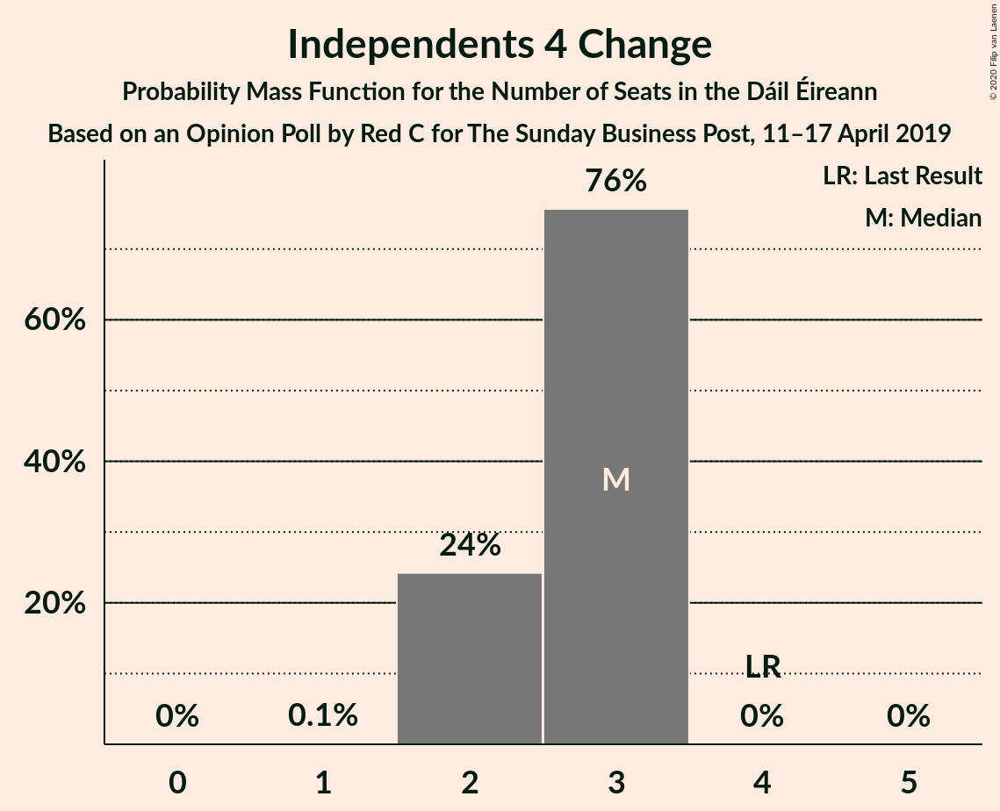

# Opinion Poll by Red C for The Sunday Business Post, 11–17 April 2019

<a href="#voting-intentions">Voting Intentions</a> | <a href="#seats">Seats</a> | <a href="#coalitions">Coalitions</a> | <a href="#technical-information">Technical Information</a>

## Voting Intentions

### Confidence Intervals

| Party | Last Result | Poll Result | 80% Confidence Interval | 90% Confidence Interval | 95% Confidence Interval | 99% Confidence Interval |
|:-----:|:-----------:|:-----------:|:-----------------------:|:-----------------------:|:-----------------------:|:-----------------------:|
| Fine Gael | 25.5% | 32.9% | 31.0–34.9% |30.5–35.4% |30.1–35.9% |29.2–36.8% |
| Fianna Fáil | 24.3% | 22.9% | 21.3–24.7% |20.8–25.2% |20.4–25.6% |19.6–26.5% |
| Independent | 15.9% | 14.3% | 13.0–15.8% |12.6–16.2% |12.3–16.6% |11.6–17.4% |
| Sinn Féin | 13.8% | 14.0% | 12.7–15.5% |12.3–15.9% |12.0–16.3% |11.4–17.0% |
| Labour Party | 6.6% | 5.0% | 4.2–6.0% |4.0–6.3% |3.8–6.5% |3.5–7.1% |
| Green Party/Comhaontas Glas | 2.7% | 3.0% | 2.4–3.8% |2.2–4.1% |2.1–4.3% |1.9–4.7% |
| Social Democrats | 3.0% | 2.0% | 1.5–2.7% |1.4–2.9% |1.3–3.1% |1.1–3.4% |
| Independents 4 Change | 1.5% | 1.8% | 1.4–2.5% |1.2–2.7% |1.1–2.8% |1.0–3.2% |
| Solidarity–People Before Profit | 3.9% | 1.0% | 0.7–1.5% |0.6–1.7% |0.5–1.8% |0.4–2.1% |
| Renua Ireland | 2.2% | 0.2% | 0.1–0.5% |0.1–0.6% |0.1–0.7% |0.0–0.9% |

*Note:* The poll result column reflects the actual value used in the calculations. Published results may vary slightly, and in addition be rounded to fewer digits.

## Seats

### Confidence Intervals

| Party | Last Result | Median | 80% Confidence Interval | 90% Confidence Interval | 95% Confidence Interval | 99% Confidence Interval |
|:-----:|:-----------:|:------:|:-----------------------:|:-----------------------:|:-----------------------:|:-----------------------:|
| <a href="#fine-gael">Fine Gael</a> | 49 | 68 | 63–71 |59–71 |58–72 |55–72 |
| <a href="#fianna-fáil">Fianna Fáil</a> | 44 | 40 | 38–44 |38–45 |38–45 |37–49 |
| <a href="#independent">Independent</a> | 19 | 15 | 13–16 |13–16 |13–16 |11–16 |
| <a href="#sinn-féin">Sinn Féin</a> | 23 | 24 | 20–33 |18–33 |18–33 |18–34 |
| <a href="#labour-party">Labour Party</a> | 7 | 2 | 1–4 |0–5 |0–6 |0–9 |
| <a href="#green-party/comhaontas-glas">Green Party/Comhaontas Glas</a> | 2 | 2 | 1–3 |0–3 |0–3 |0–3 |
| <a href="#social-democrats">Social Democrats</a> | 3 | 3 | 3 |1–3 |1–3 |1–4 |
| <a href="#independents-4-change">Independents 4 Change</a> | 4 | 4 | 3–5 |3–5 |2–5 |1–5 |
| <a href="#solidarity–people-before-profit">Solidarity–People Before Profit</a> | 6 | 0 | 0 |0 |0 |0–1 |
| <a href="#renua-ireland">Renua Ireland</a> | 0 | 0 | 0 |0 |0 |0 |

### Fine Gael

*For a full overview of the results for this party, see the [Fine Gael](party-finegael.html) page.*

| Number of Seats | Probability | Accumulated | Special Marks |
|:---------------:|:-----------:|:-----------:|:-------------:|
| 49 | 0% | 100% | Last Result |
| 50 | 0% | 100% |  |
| 51 | 0% | 100% |  |
| 52 | 0% | 100% |  |
| 53 | 0% | 100% |  |
| 54 | 0% | 100% |  |
| 55 | 1.4% | 99.9% |  |
| 56 | 0.1% | 98.6% |  |
| 57 | 0.1% | 98.5% |  |
| 58 | 3% | 98% |  |
| 59 | 0.2% | 95% |  |
| 60 | 0.9% | 95% |  |
| 61 | 0.4% | 94% |  |
| 62 | 0.7% | 94% |  |
| 63 | 6% | 93% |  |
| 64 | 0.6% | 87% |  |
| 65 | 8% | 86% |  |
| 66 | 15% | 78% |  |
| 67 | 7% | 63% |  |
| 68 | 8% | 57% | Median |
| 69 | 2% | 48% |  |
| 70 | 3% | 46% |  |
| 71 | 41% | 43% |  |
| 72 | 2% | 3% |  |
| 73 | 0.3% | 0.3% |  |
| 74 | 0% | 0% |  |

### Fianna Fáil

*For a full overview of the results for this party, see the [Fianna Fáil](party-fiannafáil.html) page.*

| Number of Seats | Probability | Accumulated | Special Marks |
|:---------------:|:-----------:|:-----------:|:-------------:|
| 33 | 0.1% | 100% |  |
| 34 | 0% | 99.9% |  |
| 35 | 0% | 99.9% |  |
| 36 | 0.1% | 99.9% |  |
| 37 | 1.3% | 99.8% |  |
| 38 | 15% | 98.5% |  |
| 39 | 5% | 83% |  |
| 40 | 39% | 78% | Median |
| 41 | 7% | 39% |  |
| 42 | 14% | 32% |  |
| 43 | 8% | 18% |  |
| 44 | 2% | 10% | Last Result |
| 45 | 6% | 8% |  |
| 46 | 0.3% | 2% |  |
| 47 | 0.3% | 2% |  |
| 48 | 0% | 2% |  |
| 49 | 1.3% | 2% |  |
| 50 | 0.2% | 0.4% |  |
| 51 | 0.2% | 0.2% |  |
| 52 | 0% | 0% |  |

### Independent

*For a full overview of the results for this party, see the [Independent](party-independent.html) page.*

| Number of Seats | Probability | Accumulated | Special Marks |
|:---------------:|:-----------:|:-----------:|:-------------:|
| 8 | 0.1% | 100% |  |
| 9 | 0.1% | 99.9% |  |
| 10 | 0.2% | 99.8% |  |
| 11 | 0.2% | 99.6% |  |
| 12 | 1.4% | 99.4% |  |
| 13 | 22% | 98% |  |
| 14 | 5% | 76% |  |
| 15 | 37% | 71% | Median |
| 16 | 34% | 34% |  |
| 17 | 0% | 0% |  |
| 18 | 0% | 0% |  |
| 19 | 0% | 0% | Last Result |

### Sinn Féin

*For a full overview of the results for this party, see the [Sinn Féin](party-sinnféin.html) page.*

| Number of Seats | Probability | Accumulated | Special Marks |
|:---------------:|:-----------:|:-----------:|:-------------:|
| 17 | 0% | 100% |  |
| 18 | 6% | 99.9% |  |
| 19 | 0.2% | 94% |  |
| 20 | 12% | 94% |  |
| 21 | 0.3% | 82% |  |
| 22 | 6% | 82% |  |
| 23 | 2% | 76% | Last Result |
| 24 | 35% | 74% | Median |
| 25 | 3% | 39% |  |
| 26 | 5% | 37% |  |
| 27 | 2% | 32% |  |
| 28 | 0.9% | 30% |  |
| 29 | 3% | 29% |  |
| 30 | 0.3% | 26% |  |
| 31 | 1.3% | 26% |  |
| 32 | 9% | 24% |  |
| 33 | 15% | 16% |  |
| 34 | 0.6% | 0.7% |  |
| 35 | 0.1% | 0.2% |  |
| 36 | 0% | 0% |  |

### Labour Party

*For a full overview of the results for this party, see the [Labour Party](party-labourparty.html) page.*

| Number of Seats | Probability | Accumulated | Special Marks |
|:---------------:|:-----------:|:-----------:|:-------------:|
| 0 | 9% | 100% |  |
| 1 | 37% | 91% |  |
| 2 | 9% | 54% | Median |
| 3 | 19% | 45% |  |
| 4 | 16% | 26% |  |
| 5 | 7% | 10% |  |
| 6 | 2% | 3% |  |
| 7 | 0.3% | 1.0% | Last Result |
| 8 | 0.1% | 0.7% |  |
| 9 | 0.2% | 0.7% |  |
| 10 | 0% | 0.5% |  |
| 11 | 0.3% | 0.5% |  |
| 12 | 0% | 0.2% |  |
| 13 | 0.2% | 0.2% |  |
| 14 | 0% | 0% |  |

### Green Party/Comhaontas Glas

*For a full overview of the results for this party, see the [Green Party/Comhaontas Glas](party-greenpartycomhaontasglas.html) page.*

| Number of Seats | Probability | Accumulated | Special Marks |
|:---------------:|:-----------:|:-----------:|:-------------:|
| 0 | 6% | 100% |  |
| 1 | 24% | 94% |  |
| 2 | 55% | 70% | Last Result, Median |
| 3 | 15% | 15% |  |
| 4 | 0.1% | 0.1% |  |
| 5 | 0% | 0% |  |

### Social Democrats

*For a full overview of the results for this party, see the [Social Democrats](party-socialdemocrats.html) page.*

| Number of Seats | Probability | Accumulated | Special Marks |
|:---------------:|:-----------:|:-----------:|:-------------:|
| 1 | 5% | 100% |  |
| 2 | 0.1% | 95% |  |
| 3 | 94% | 95% | Last Result, Median |
| 4 | 1.1% | 1.1% |  |
| 5 | 0% | 0% |  |

### Independents 4 Change

*For a full overview of the results for this party, see the [Independents 4 Change](party-independents4change.html) page.*

| Number of Seats | Probability | Accumulated | Special Marks |
|:---------------:|:-----------:|:-----------:|:-------------:|
| 0 | 0.3% | 100% |  |
| 1 | 0.3% | 99.7% |  |
| 2 | 3% | 99.4% |  |
| 3 | 21% | 96% |  |
| 4 | 44% | 75% | Last Result, Median |
| 5 | 32% | 32% |  |
| 6 | 0% | 0% |  |

### Solidarity–People Before Profit

*For a full overview of the results for this party, see the [Solidarity–People Before Profit](party-solidarity–peoplebeforeprofit.html) page.*

| Number of Seats | Probability | Accumulated | Special Marks |
|:---------------:|:-----------:|:-----------:|:-------------:|
| 0 | 98.7% | 100% | Median |
| 1 | 0.8% | 1.3% |  |
| 2 | 0.4% | 0.5% |  |
| 3 | 0.1% | 0.1% |  |
| 4 | 0% | 0% |  |
| 5 | 0% | 0% |  |
| 6 | 0% | 0% | Last Result |

### Renua Ireland

*For a full overview of the results for this party, see the [Renua Ireland](party-renuaireland.html) page.*

| Number of Seats | Probability | Accumulated | Special Marks |
|:---------------:|:-----------:|:-----------:|:-------------:|
| 0 | 100% | 100% | Last Result, Median |

## Coalitions

### Confidence Intervals

| Coalition | Last Result | Median | Majority? | 80% Confidence Interval | 90% Confidence Interval | 95% Confidence Interval | 99% Confidence Interval |
|:---------:|:-----------:|:------:|:---------:|:-----------------------:|:-----------------------:|:-----------------------:|:-----------------------:|
| Fine Gael – Fianna Fáil | 93 | 111 | 100% | 104–112 | 99–113 | 99–114 | 97–114 |
| Fine Gael – Labour Party – Green Party/Comhaontas Glas – Social Democrats | 61 | 77 | 0.2% | 68–79 | 67–80 | 66–80 | 63–80 |
| Fine Gael – Labour Party – Green Party/Comhaontas Glas | 58 | 74 | 0% | 66–76 | 64–77 | 63–77 | 60–77 |
| Fine Gael – Labour Party | 56 | 72 | 0% | 65–73 | 63–75 | 60–75 | 57–75 |
| Fianna Fáil – Sinn Féin | 67 | 64 | 0% | 62–72 | 62–74 | 61–74 | 61–76 |
| Fine Gael – Green Party/Comhaontas Glas | 51 | 70 | 0% | 63–73 | 61–73 | 60–74 | 58–75 |
| Fine Gael | 49 | 68 | 0% | 63–71 | 59–71 | 58–72 | 55–72 |
| Fianna Fáil – Labour Party – Green Party/Comhaontas Glas – Social Democrats | 56 | 46 | 0% | 45–52 | 45–54 | 45–54 | 43–56 |
| Fianna Fáil – Labour Party – Green Party/Comhaontas Glas | 53 | 43 | 0% | 42–49 | 42–51 | 42–51 | 39–53 |
| Fianna Fáil – Labour Party | 51 | 41 | 0% | 41–47 | 41–50 | 40–50 | 38–53 |
| Fianna Fáil – Green Party/Comhaontas Glas | 46 | 42 | 0% | 39–46 | 39–46 | 39–47 | 38–51 |

### Fine Gael – Fianna Fáil

| Number of Seats | Probability | Accumulated | Special Marks |
|:---------------:|:-----------:|:-----------:|:-------------:|
| 93 | 0% | 100% | Last Result |
| 94 | 0% | 100% |  |
| 95 | 0% | 100% |  |
| 96 | 0% | 100% |  |
| 97 | 0.9% | 100% |  |
| 98 | 0.9% | 99.0% |  |
| 99 | 4% | 98% |  |
| 100 | 0.1% | 94% |  |
| 101 | 0.2% | 94% |  |
| 102 | 0.2% | 94% |  |
| 103 | 0.4% | 94% |  |
| 104 | 14% | 93% |  |
| 105 | 5% | 79% |  |
| 106 | 3% | 74% |  |
| 107 | 1.4% | 70% |  |
| 108 | 6% | 69% | Median |
| 109 | 4% | 63% |  |
| 110 | 8% | 59% |  |
| 111 | 36% | 51% |  |
| 112 | 9% | 15% |  |
| 113 | 3% | 6% |  |
| 114 | 3% | 3% |  |
| 115 | 0.1% | 0.3% |  |
| 116 | 0.1% | 0.2% |  |
| 117 | 0% | 0.1% |  |
| 118 | 0% | 0.1% |  |
| 119 | 0% | 0% |  |

### Fine Gael – Labour Party – Green Party/Comhaontas Glas – Social Democrats

| Number of Seats | Probability | Accumulated | Special Marks |
|:---------------:|:-----------:|:-----------:|:-------------:|
| 61 | 0% | 100% | Last Result |
| 62 | 0% | 100% |  |
| 63 | 1.3% | 99.9% |  |
| 64 | 0.1% | 98.6% |  |
| 65 | 0.2% | 98.5% |  |
| 66 | 3% | 98% |  |
| 67 | 5% | 96% |  |
| 68 | 0.4% | 90% |  |
| 69 | 1.2% | 90% |  |
| 70 | 1.4% | 89% |  |
| 71 | 5% | 87% |  |
| 72 | 3% | 82% |  |
| 73 | 15% | 79% |  |
| 74 | 2% | 64% |  |
| 75 | 0.6% | 62% | Median |
| 76 | 6% | 61% |  |
| 77 | 43% | 55% |  |
| 78 | 0.6% | 12% |  |
| 79 | 6% | 12% |  |
| 80 | 5% | 5% |  |
| 81 | 0.1% | 0.2% | Majority |
| 82 | 0.1% | 0.1% |  |
| 83 | 0% | 0% |  |

### Fine Gael – Labour Party – Green Party/Comhaontas Glas

| Number of Seats | Probability | Accumulated | Special Marks |
|:---------------:|:-----------:|:-----------:|:-------------:|
| 58 | 0% | 100% | Last Result |
| 59 | 0% | 100% |  |
| 60 | 1.3% | 99.9% |  |
| 61 | 0% | 98.6% |  |
| 62 | 0.2% | 98.6% |  |
| 63 | 3% | 98% |  |
| 64 | 1.2% | 96% |  |
| 65 | 0.5% | 95% |  |
| 66 | 5% | 94% |  |
| 67 | 0.7% | 89% |  |
| 68 | 5% | 88% |  |
| 69 | 4% | 83% |  |
| 70 | 15% | 79% |  |
| 71 | 2% | 64% |  |
| 72 | 0.4% | 62% | Median |
| 73 | 6% | 61% |  |
| 74 | 43% | 55% |  |
| 75 | 0.6% | 12% |  |
| 76 | 6% | 12% |  |
| 77 | 5% | 5% |  |
| 78 | 0.1% | 0.2% |  |
| 79 | 0.1% | 0.1% |  |
| 80 | 0% | 0% |  |

### Fine Gael – Labour Party

| Number of Seats | Probability | Accumulated | Special Marks |
|:---------------:|:-----------:|:-----------:|:-------------:|
| 56 | 0% | 100% | Last Result |
| 57 | 1.3% | 100% |  |
| 58 | 0% | 98.7% |  |
| 59 | 0% | 98.7% |  |
| 60 | 2% | 98.6% |  |
| 61 | 0.2% | 96% |  |
| 62 | 0.7% | 96% |  |
| 63 | 1.3% | 95% |  |
| 64 | 1.1% | 94% |  |
| 65 | 6% | 93% |  |
| 66 | 4% | 87% |  |
| 67 | 4% | 83% |  |
| 68 | 1.1% | 79% |  |
| 69 | 15% | 78% |  |
| 70 | 0.5% | 63% | Median |
| 71 | 3% | 62% |  |
| 72 | 47% | 59% |  |
| 73 | 3% | 13% |  |
| 74 | 4% | 9% |  |
| 75 | 5% | 6% |  |
| 76 | 0.1% | 0.4% |  |
| 77 | 0.2% | 0.3% |  |
| 78 | 0.1% | 0.1% |  |
| 79 | 0% | 0% |  |

### Fianna Fáil – Sinn Féin

| Number of Seats | Probability | Accumulated | Special Marks |
|:---------------:|:-----------:|:-----------:|:-------------:|
| 60 | 0% | 100% |  |
| 61 | 3% | 99.9% |  |
| 62 | 13% | 97% |  |
| 63 | 9% | 84% |  |
| 64 | 35% | 75% | Median |
| 65 | 0.6% | 41% |  |
| 66 | 0.6% | 40% |  |
| 67 | 2% | 39% | Last Result |
| 68 | 1.2% | 38% |  |
| 69 | 6% | 36% |  |
| 70 | 4% | 31% |  |
| 71 | 15% | 27% |  |
| 72 | 3% | 12% |  |
| 73 | 3% | 9% |  |
| 74 | 4% | 6% |  |
| 75 | 0.2% | 2% |  |
| 76 | 1.3% | 2% |  |
| 77 | 0% | 0.2% |  |
| 78 | 0.1% | 0.2% |  |
| 79 | 0% | 0% |  |

### Fine Gael – Green Party/Comhaontas Glas

| Number of Seats | Probability | Accumulated | Special Marks |
|:---------------:|:-----------:|:-----------:|:-------------:|
| 51 | 0% | 100% | Last Result |
| 52 | 0% | 100% |  |
| 53 | 0% | 100% |  |
| 54 | 0% | 100% |  |
| 55 | 0% | 100% |  |
| 56 | 0.2% | 100% |  |
| 57 | 0.1% | 99.8% |  |
| 58 | 1.3% | 99.8% |  |
| 59 | 0% | 98% |  |
| 60 | 1.0% | 98% |  |
| 61 | 3% | 97% |  |
| 62 | 0.7% | 95% |  |
| 63 | 5% | 94% |  |
| 64 | 0.9% | 89% |  |
| 65 | 1.1% | 88% |  |
| 66 | 1.1% | 87% |  |
| 67 | 18% | 86% |  |
| 68 | 11% | 68% |  |
| 69 | 1.2% | 57% |  |
| 70 | 8% | 56% | Median |
| 71 | 1.0% | 48% |  |
| 72 | 4% | 47% |  |
| 73 | 39% | 43% |  |
| 74 | 2% | 4% |  |
| 75 | 2% | 2% |  |
| 76 | 0% | 0% |  |

### Fine Gael

| Number of Seats | Probability | Accumulated | Special Marks |
|:---------------:|:-----------:|:-----------:|:-------------:|
| 49 | 0% | 100% | Last Result |
| 50 | 0% | 100% |  |
| 51 | 0% | 100% |  |
| 52 | 0% | 100% |  |
| 53 | 0% | 100% |  |
| 54 | 0% | 100% |  |
| 55 | 1.4% | 99.9% |  |
| 56 | 0.1% | 98.6% |  |
| 57 | 0.1% | 98.5% |  |
| 58 | 3% | 98% |  |
| 59 | 0.2% | 95% |  |
| 60 | 0.9% | 95% |  |
| 61 | 0.4% | 94% |  |
| 62 | 0.7% | 94% |  |
| 63 | 6% | 93% |  |
| 64 | 0.6% | 87% |  |
| 65 | 8% | 86% |  |
| 66 | 15% | 78% |  |
| 67 | 7% | 63% |  |
| 68 | 8% | 57% | Median |
| 69 | 2% | 48% |  |
| 70 | 3% | 46% |  |
| 71 | 41% | 43% |  |
| 72 | 2% | 3% |  |
| 73 | 0.3% | 0.3% |  |
| 74 | 0% | 0% |  |

### Fianna Fáil – Labour Party – Green Party/Comhaontas Glas – Social Democrats

| Number of Seats | Probability | Accumulated | Special Marks |
|:---------------:|:-----------:|:-----------:|:-------------:|
| 39 | 0% | 100% |  |
| 40 | 0% | 99.9% |  |
| 41 | 0.1% | 99.9% |  |
| 42 | 0.1% | 99.9% |  |
| 43 | 0.6% | 99.7% |  |
| 44 | 0.7% | 99.1% |  |
| 45 | 15% | 98% |  |
| 46 | 40% | 83% |  |
| 47 | 4% | 43% | Median |
| 48 | 6% | 39% |  |
| 49 | 8% | 33% |  |
| 50 | 1.5% | 25% |  |
| 51 | 9% | 23% |  |
| 52 | 4% | 14% |  |
| 53 | 2% | 9% |  |
| 54 | 6% | 8% |  |
| 55 | 0.5% | 2% |  |
| 56 | 0.7% | 1.2% | Last Result |
| 57 | 0.2% | 0.5% |  |
| 58 | 0.2% | 0.3% |  |
| 59 | 0% | 0.1% |  |
| 60 | 0% | 0% |  |

### Fianna Fáil – Labour Party – Green Party/Comhaontas Glas

| Number of Seats | Probability | Accumulated | Special Marks |
|:---------------:|:-----------:|:-----------:|:-------------:|
| 35 | 0.1% | 100% |  |
| 36 | 0% | 99.9% |  |
| 37 | 0% | 99.9% |  |
| 38 | 0.1% | 99.9% |  |
| 39 | 0.5% | 99.9% |  |
| 40 | 0.4% | 99.3% |  |
| 41 | 0.5% | 98.9% |  |
| 42 | 14% | 98% |  |
| 43 | 36% | 84% |  |
| 44 | 5% | 48% | Median |
| 45 | 10% | 43% |  |
| 46 | 8% | 33% |  |
| 47 | 2% | 25% |  |
| 48 | 9% | 23% |  |
| 49 | 4% | 14% |  |
| 50 | 2% | 10% |  |
| 51 | 6% | 8% |  |
| 52 | 0.5% | 2% |  |
| 53 | 0.7% | 1.2% | Last Result |
| 54 | 0.2% | 0.5% |  |
| 55 | 0.1% | 0.3% |  |
| 56 | 0.2% | 0.2% |  |
| 57 | 0% | 0% |  |

### Fianna Fáil – Labour Party

| Number of Seats | Probability | Accumulated | Special Marks |
|:---------------:|:-----------:|:-----------:|:-------------:|
| 34 | 0% | 100% |  |
| 35 | 0% | 99.9% |  |
| 36 | 0.1% | 99.9% |  |
| 37 | 0.1% | 99.9% |  |
| 38 | 0.4% | 99.8% |  |
| 39 | 0.6% | 99.3% |  |
| 40 | 3% | 98.7% |  |
| 41 | 51% | 96% |  |
| 42 | 1.1% | 45% | Median |
| 43 | 14% | 44% |  |
| 44 | 1.1% | 30% |  |
| 45 | 5% | 29% |  |
| 46 | 11% | 24% |  |
| 47 | 3% | 12% |  |
| 48 | 0.4% | 9% |  |
| 49 | 1.5% | 9% |  |
| 50 | 6% | 7% |  |
| 51 | 0.9% | 2% | Last Result |
| 52 | 0.1% | 0.6% |  |
| 53 | 0.4% | 0.6% |  |
| 54 | 0.1% | 0.1% |  |
| 55 | 0% | 0% |  |

### Fianna Fáil – Green Party/Comhaontas Glas

| Number of Seats | Probability | Accumulated | Special Marks |
|:---------------:|:-----------:|:-----------:|:-------------:|
| 35 | 0% | 100% |  |
| 36 | 0% | 99.9% |  |
| 37 | 0% | 99.9% |  |
| 38 | 0.5% | 99.9% |  |
| 39 | 15% | 99.4% |  |
| 40 | 2% | 85% |  |
| 41 | 5% | 83% |  |
| 42 | 40% | 77% | Median |
| 43 | 7% | 38% |  |
| 44 | 12% | 31% |  |
| 45 | 4% | 18% |  |
| 46 | 11% | 15% | Last Result |
| 47 | 1.5% | 4% |  |
| 48 | 0.2% | 2% |  |
| 49 | 0.2% | 2% |  |
| 50 | 0.9% | 2% |  |
| 51 | 0.7% | 0.9% |  |
| 52 | 0.1% | 0.3% |  |
| 53 | 0.1% | 0.2% |  |
| 54 | 0.1% | 0.1% |  |
| 55 | 0% | 0% |  |

## Technical Information

### Opinion Poll

+ **Polling firm:** Red C
+ **Commissioner(s):** The Sunday Business Post
+ **Fieldwork period:** 11–17 April 2019

### Calculations

+ **Sample size:** 1000
+ **Simulations done:** 131,072
+ **Error estimate:** 1.95%

