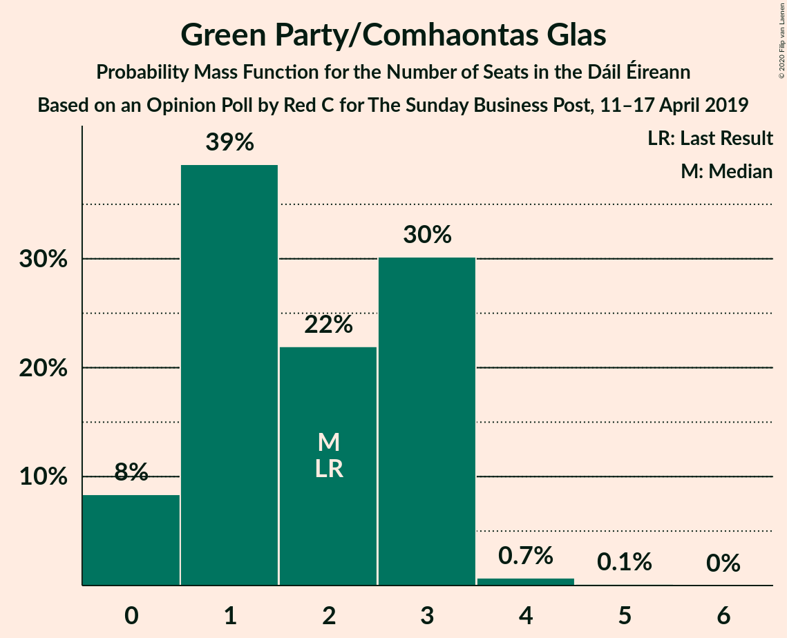
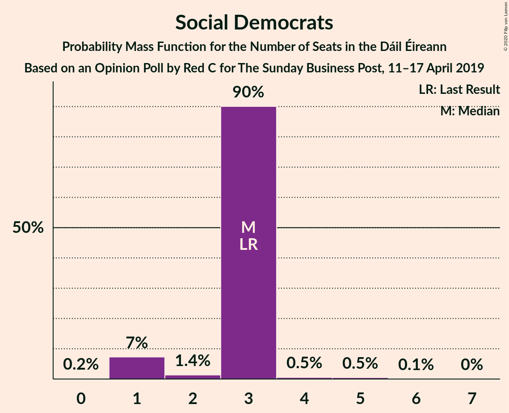
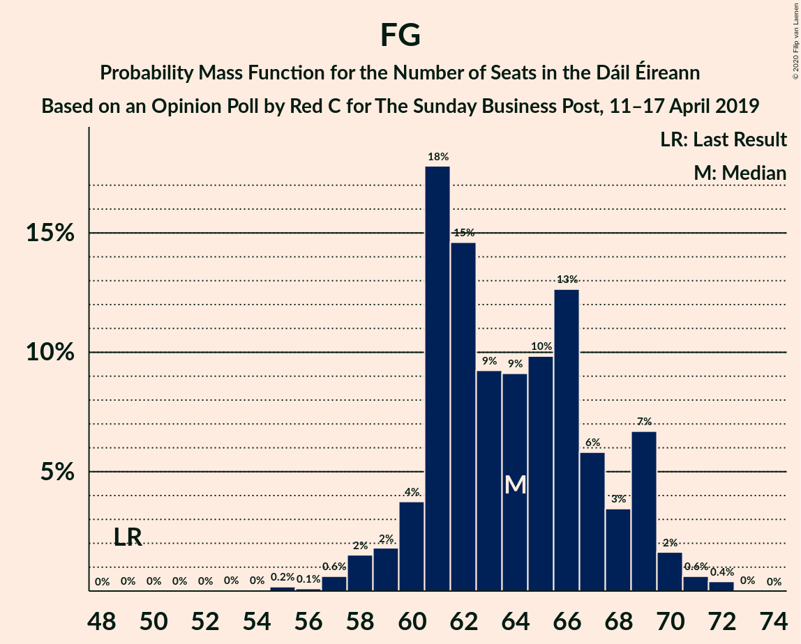
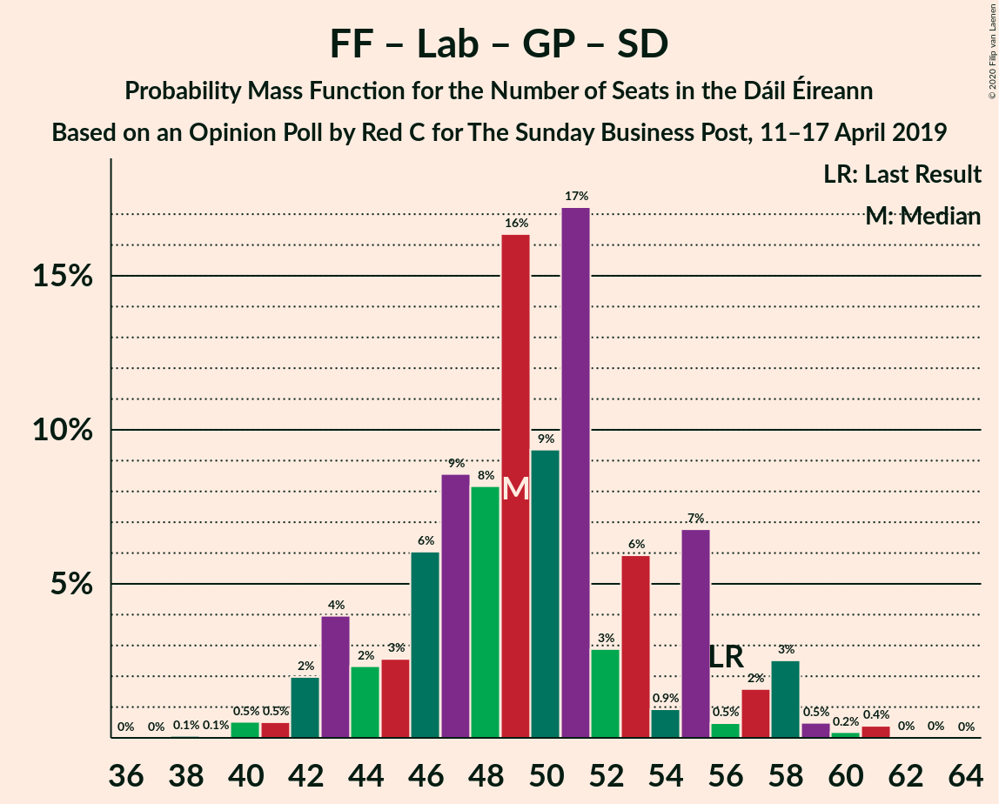

# Opinion Poll by Red C for The Sunday Business Post, 11–17 April 2019

<a href="#voting-intentions">Voting Intentions</a> | <a href="#seats">Seats</a> | <a href="#coalitions">Coalitions</a> | <a href="#technical-information">Technical Information</a>

## Voting Intentions

### Confidence Intervals

| Party | Last Result | Poll Result | 80% Confidence Interval | 90% Confidence Interval | 95% Confidence Interval | 99% Confidence Interval |
|:-----:|:-----------:|:-----------:|:-----------------------:|:-----------------------:|:-----------------------:|:-----------------------:|
| Fine Gael | 25.5% | 32.9% | 31.0–34.9% |30.5–35.4% |30.1–35.9% |29.2–36.8% |
| Fianna Fáil | 24.3% | 22.9% | 21.3–24.7% |20.8–25.2% |20.4–25.6% |19.6–26.5% |
| Independent | 15.9% | 14.3% | 13.0–15.8% |12.6–16.2% |12.3–16.6% |11.6–17.4% |
| Sinn Féin | 13.8% | 14.0% | 12.7–15.5% |12.3–15.9% |12.0–16.3% |11.4–17.0% |
| Labour Party | 6.6% | 5.0% | 4.2–6.0% |4.0–6.3% |3.8–6.5% |3.5–7.1% |
| Green Party/Comhaontas Glas | 2.7% | 3.0% | 2.4–3.8% |2.2–4.1% |2.1–4.3% |1.9–4.7% |
| Social Democrats | 3.0% | 2.0% | 1.5–2.7% |1.4–2.9% |1.3–3.1% |1.1–3.4% |
| Independents 4 Change | 1.5% | 1.8% | 1.4–2.5% |1.2–2.7% |1.1–2.8% |1.0–3.2% |
| Solidarity–People Before Profit | 3.9% | 1.0% | 0.7–1.5% |0.6–1.7% |0.5–1.8% |0.4–2.1% |
| Renua Ireland | 2.2% | 0.1% | 0.1–0.5% |0.1–0.6% |0.1–0.7% |0.0–0.9% |

*Note:* The poll result column reflects the actual value used in the calculations. Published results may vary slightly, and in addition be rounded to fewer digits.

## Seats

### Confidence Intervals

| Party | Last Result | Median | 80% Confidence Interval | 90% Confidence Interval | 95% Confidence Interval | 99% Confidence Interval |
|:-----:|:-----------:|:------:|:-----------------------:|:-----------------------:|:-----------------------:|:-----------------------:|
| <a href="#fine-gael">Fine Gael</a> | 49 | 64 | 61–68 |60–69 |58–70 |57–71 |
| <a href="#fianna-fáil">Fianna Fáil</a> | 44 | 40 | 37–44 |34–45 |34–46 |31–49 |
| <a href="#independent">Independent</a> | 19 | 17 | 16–18 |16–19 |15–20 |14–21 |
| <a href="#sinn-féin">Sinn Féin</a> | 23 | 28 | 21–32 |20–34 |20–34 |18–35 |
| <a href="#labour-party">Labour Party</a> | 7 | 5 | 2–9 |0–10 |0–12 |0–15 |
| <a href="#green-party/comhaontas-glas">Green Party/Comhaontas Glas</a> | 2 | 2 | 1–3 |0–3 |0–3 |0–4 |
| <a href="#social-democrats">Social Democrats</a> | 3 | 3 | 3 |1–3 |1–3 |1–5 |
| <a href="#independents-4-change">Independents 4 Change</a> | 4 | 3 | 2–3 |2–3 |2–3 |2–3 |
| <a href="#solidarity–people-before-profit">Solidarity–People Before Profit</a> | 6 | 0 | 0 |0 |0–1 |0–2 |
| <a href="#renua-ireland">Renua Ireland</a> | 0 | 0 | 0 |0 |0 |0–1 |

### Fine Gael

*For a full overview of the results for this party, see the [Fine Gael](party-finegael.html) page.*

| Number of Seats | Probability | Accumulated | Special Marks |
|:---------------:|:-----------:|:-----------:|:-------------:|
| 49 | 0% | 100% | Last Result |
| 50 | 0% | 100% |  |
| 51 | 0% | 100% |  |
| 52 | 0% | 100% |  |
| 53 | 0% | 100% |  |
| 54 | 0% | 99.9% |  |
| 55 | 0.2% | 99.9% |  |
| 56 | 0.1% | 99.7% |  |
| 57 | 0.6% | 99.6% |  |
| 58 | 2% | 99.0% |  |
| 59 | 2% | 97% |  |
| 60 | 4% | 96% |  |
| 61 | 18% | 92% |  |
| 62 | 15% | 74% |  |
| 63 | 9% | 60% |  |
| 64 | 9% | 50% | Median |
| 65 | 10% | 41% |  |
| 66 | 13% | 31% |  |
| 67 | 6% | 19% |  |
| 68 | 3% | 13% |  |
| 69 | 7% | 9% |  |
| 70 | 2% | 3% |  |
| 71 | 0.6% | 1.1% |  |
| 72 | 0.4% | 0.4% |  |
| 73 | 0% | 0% |  |

### Fianna Fáil

*For a full overview of the results for this party, see the [Fianna Fáil](party-fiannafáil.html) page.*

| Number of Seats | Probability | Accumulated | Special Marks |
|:---------------:|:-----------:|:-----------:|:-------------:|
| 28 | 0% | 100% |  |
| 29 | 0% | 99.9% |  |
| 30 | 0.1% | 99.9% |  |
| 31 | 0.4% | 99.8% |  |
| 32 | 0.4% | 99.4% |  |
| 33 | 0.9% | 99.0% |  |
| 34 | 3% | 98% |  |
| 35 | 3% | 95% |  |
| 36 | 1.4% | 92% |  |
| 37 | 8% | 90% |  |
| 38 | 4% | 82% |  |
| 39 | 14% | 78% |  |
| 40 | 36% | 63% | Median |
| 41 | 5% | 27% |  |
| 42 | 5% | 22% |  |
| 43 | 5% | 18% |  |
| 44 | 3% | 13% | Last Result |
| 45 | 6% | 10% |  |
| 46 | 1.1% | 3% |  |
| 47 | 0.6% | 2% |  |
| 48 | 0.8% | 2% |  |
| 49 | 0.6% | 0.9% |  |
| 50 | 0.1% | 0.4% |  |
| 51 | 0.2% | 0.2% |  |
| 52 | 0% | 0% |  |

### Independent

*For a full overview of the results for this party, see the [Independent](party-independent.html) page.*

| Number of Seats | Probability | Accumulated | Special Marks |
|:---------------:|:-----------:|:-----------:|:-------------:|
| 10 | 0.1% | 100% |  |
| 11 | 0.1% | 99.9% |  |
| 12 | 0.1% | 99.9% |  |
| 13 | 0.2% | 99.8% |  |
| 14 | 0.4% | 99.6% |  |
| 15 | 2% | 99.2% |  |
| 16 | 27% | 97% |  |
| 17 | 60% | 70% | Median |
| 18 | 5% | 10% |  |
| 19 | 3% | 5% | Last Result |
| 20 | 2% | 3% |  |
| 21 | 0.5% | 0.6% |  |
| 22 | 0.1% | 0.1% |  |
| 23 | 0% | 0% |  |

### Sinn Féin

*For a full overview of the results for this party, see the [Sinn Féin](party-sinnféin.html) page.*

| Number of Seats | Probability | Accumulated | Special Marks |
|:---------------:|:-----------:|:-----------:|:-------------:|
| 17 | 0.1% | 100% |  |
| 18 | 0.8% | 99.9% |  |
| 19 | 0.9% | 99.1% |  |
| 20 | 4% | 98% |  |
| 21 | 8% | 95% |  |
| 22 | 3% | 86% |  |
| 23 | 2% | 83% | Last Result |
| 24 | 10% | 81% |  |
| 25 | 6% | 71% |  |
| 26 | 8% | 65% |  |
| 27 | 4% | 56% |  |
| 28 | 20% | 52% | Median |
| 29 | 5% | 33% |  |
| 30 | 12% | 28% |  |
| 31 | 4% | 16% |  |
| 32 | 5% | 12% |  |
| 33 | 0.8% | 7% |  |
| 34 | 4% | 6% |  |
| 35 | 2% | 2% |  |
| 36 | 0.1% | 0.1% |  |
| 37 | 0% | 0% |  |

### Labour Party

*For a full overview of the results for this party, see the [Labour Party](party-labourparty.html) page.*

| Number of Seats | Probability | Accumulated | Special Marks |
|:---------------:|:-----------:|:-----------:|:-------------:|
| 0 | 6% | 100% |  |
| 1 | 2% | 94% |  |
| 2 | 7% | 92% |  |
| 3 | 13% | 85% |  |
| 4 | 11% | 71% |  |
| 5 | 29% | 60% | Median |
| 6 | 7% | 31% |  |
| 7 | 8% | 24% | Last Result |
| 8 | 5% | 17% |  |
| 9 | 6% | 12% |  |
| 10 | 1.3% | 5% |  |
| 11 | 0.3% | 4% |  |
| 12 | 2% | 4% |  |
| 13 | 0.4% | 2% |  |
| 14 | 0.6% | 1.3% |  |
| 15 | 0.4% | 0.7% |  |
| 16 | 0.2% | 0.2% |  |
| 17 | 0% | 0% |  |

### Green Party/Comhaontas Glas

*For a full overview of the results for this party, see the [Green Party/Comhaontas Glas](party-greenpartycomhaontasglas.html) page.*

| Number of Seats | Probability | Accumulated | Special Marks |
|:---------------:|:-----------:|:-----------:|:-------------:|
| 0 | 8% | 100% |  |
| 1 | 39% | 92% |  |
| 2 | 22% | 53% | Last Result, Median |
| 3 | 30% | 31% |  |
| 4 | 0.7% | 0.8% |  |
| 5 | 0.1% | 0.1% |  |
| 6 | 0% | 0% |  |

### Social Democrats

*For a full overview of the results for this party, see the [Social Democrats](party-socialdemocrats.html) page.*

| Number of Seats | Probability | Accumulated | Special Marks |
|:---------------:|:-----------:|:-----------:|:-------------:|
| 0 | 0.2% | 100% |  |
| 1 | 7% | 99.8% |  |
| 2 | 1.4% | 93% |  |
| 3 | 90% | 91% | Last Result, Median |
| 4 | 0.5% | 1.1% |  |
| 5 | 0.5% | 0.6% |  |
| 6 | 0.1% | 0.1% |  |
| 7 | 0% | 0% |  |

### Independents 4 Change

*For a full overview of the results for this party, see the [Independents 4 Change](party-independents4change.html) page.*

| Number of Seats | Probability | Accumulated | Special Marks |
|:---------------:|:-----------:|:-----------:|:-------------:|
| 1 | 0.1% | 100% |  |
| 2 | 24% | 99.9% |  |
| 3 | 76% | 76% | Median |
| 4 | 0% | 0% | Last Result |

### Solidarity–People Before Profit

*For a full overview of the results for this party, see the [Solidarity–People Before Profit](party-solidarity–peoplebeforeprofit.html) page.*

| Number of Seats | Probability | Accumulated | Special Marks |
|:---------------:|:-----------:|:-----------:|:-------------:|
| 0 | 95% | 100% | Median |
| 1 | 4% | 5% |  |
| 2 | 0.5% | 0.7% |  |
| 3 | 0.2% | 0.2% |  |
| 4 | 0% | 0% |  |
| 5 | 0% | 0% |  |
| 6 | 0% | 0% | Last Result |

### Renua Ireland

*For a full overview of the results for this party, see the [Renua Ireland](party-renuaireland.html) page.*

| Number of Seats | Probability | Accumulated | Special Marks |
|:---------------:|:-----------:|:-----------:|:-------------:|
| 0 | 99.4% | 100% | Last Result, Median |
| 1 | 0.6% | 0.6% |  |
| 2 | 0% | 0% |  |

## Coalitions

### Confidence Intervals

| Coalition | Last Result | Median | Majority? | 80% Confidence Interval | 90% Confidence Interval | 95% Confidence Interval | 99% Confidence Interval |
|:---------:|:-----------:|:------:|:---------:|:-----------------------:|:-----------------------:|:-----------------------:|:-----------------------:|
| Fine Gael – Fianna Fáil | 93 | 103 | 100% | 99–109 | 97–110 | 96–111 | 93–113 |
| Fine Gael – Labour Party – Green Party/Comhaontas Glas – Social Democrats | 61 | 73 | 3% | 69–77 | 68–79 | 67–82 | 65–83 |
| Fine Gael – Labour Party – Green Party/Comhaontas Glas | 58 | 70 | 0.3% | 67–74 | 66–76 | 64–79 | 62–80 |
| Fine Gael – Labour Party | 56 | 69 | 0.1% | 65–73 | 64–75 | 62–78 | 60–79 |
| Fianna Fáil – Sinn Féin | 67 | 67 | 0% | 63–71 | 61–72 | 58–73 | 58–75 |
| Fine Gael – Green Party/Comhaontas Glas | 51 | 65 | 0% | 63–70 | 61–71 | 60–71 | 58–73 |
| Fine Gael | 49 | 64 | 0% | 61–68 | 60–69 | 58–70 | 57–71 |
| Fianna Fáil – Labour Party – Green Party/Comhaontas Glas – Social Democrats | 56 | 49 | 0% | 45–55 | 43–57 | 42–58 | 40–60 |
| Fianna Fáil – Labour Party – Green Party/Comhaontas Glas | 53 | 46 | 0% | 42–52 | 41–54 | 39–55 | 37–58 |
| Fianna Fáil – Labour Party | 51 | 45 | 0% | 41–50 | 39–53 | 38–54 | 36–57 |
| Fianna Fáil – Green Party/Comhaontas Glas | 46 | 42 | 0% | 38–46 | 36–47 | 35–48 | 32–50 |

### Fine Gael – Fianna Fáil

| Number of Seats | Probability | Accumulated | Special Marks |
|:---------------:|:-----------:|:-----------:|:-------------:|
| 91 | 0.1% | 100% |  |
| 92 | 0.1% | 99.8% |  |
| 93 | 0.5% | 99.7% | Last Result |
| 94 | 0.6% | 99.2% |  |
| 95 | 0.3% | 98.6% |  |
| 96 | 0.9% | 98% |  |
| 97 | 4% | 97% |  |
| 98 | 2% | 93% |  |
| 99 | 2% | 92% |  |
| 100 | 3% | 90% |  |
| 101 | 19% | 87% |  |
| 102 | 14% | 68% |  |
| 103 | 6% | 54% |  |
| 104 | 7% | 48% | Median |
| 105 | 9% | 41% |  |
| 106 | 5% | 32% |  |
| 107 | 5% | 27% |  |
| 108 | 3% | 22% |  |
| 109 | 11% | 19% |  |
| 110 | 5% | 8% |  |
| 111 | 2% | 3% |  |
| 112 | 0.5% | 1.0% |  |
| 113 | 0.3% | 0.5% |  |
| 114 | 0.2% | 0.2% |  |
| 115 | 0% | 0.1% |  |
| 116 | 0% | 0% |  |

### Fine Gael – Labour Party – Green Party/Comhaontas Glas – Social Democrats

| Number of Seats | Probability | Accumulated | Special Marks |
|:---------------:|:-----------:|:-----------:|:-------------:|
| 61 | 0% | 100% | Last Result |
| 62 | 0% | 100% |  |
| 63 | 0% | 100% |  |
| 64 | 0.2% | 100% |  |
| 65 | 1.1% | 99.8% |  |
| 66 | 0.7% | 98.7% |  |
| 67 | 0.8% | 98% |  |
| 68 | 4% | 97% |  |
| 69 | 5% | 94% |  |
| 70 | 5% | 89% |  |
| 71 | 13% | 84% |  |
| 72 | 20% | 72% |  |
| 73 | 7% | 52% |  |
| 74 | 6% | 45% | Median |
| 75 | 7% | 40% |  |
| 76 | 11% | 33% |  |
| 77 | 12% | 22% |  |
| 78 | 4% | 10% |  |
| 79 | 1.3% | 5% |  |
| 80 | 0.7% | 4% |  |
| 81 | 0.5% | 3% | Majority |
| 82 | 2% | 3% |  |
| 83 | 0.6% | 0.9% |  |
| 84 | 0.2% | 0.3% |  |
| 85 | 0.1% | 0.1% |  |
| 86 | 0% | 0% |  |

### Fine Gael – Labour Party – Green Party/Comhaontas Glas

| Number of Seats | Probability | Accumulated | Special Marks |
|:---------------:|:-----------:|:-----------:|:-------------:|
| 58 | 0% | 100% | Last Result |
| 59 | 0% | 100% |  |
| 60 | 0% | 100% |  |
| 61 | 0.2% | 100% |  |
| 62 | 0.7% | 99.8% |  |
| 63 | 0.8% | 99.2% |  |
| 64 | 1.0% | 98% |  |
| 65 | 2% | 97% |  |
| 66 | 5% | 95% |  |
| 67 | 5% | 91% |  |
| 68 | 11% | 85% |  |
| 69 | 20% | 75% |  |
| 70 | 8% | 54% |  |
| 71 | 6% | 46% | Median |
| 72 | 8% | 41% |  |
| 73 | 11% | 33% |  |
| 74 | 13% | 22% |  |
| 75 | 4% | 10% |  |
| 76 | 1.4% | 5% |  |
| 77 | 0.6% | 4% |  |
| 78 | 0.5% | 3% |  |
| 79 | 2% | 3% |  |
| 80 | 0.7% | 1.0% |  |
| 81 | 0.2% | 0.3% | Majority |
| 82 | 0.1% | 0.1% |  |
| 83 | 0% | 0% |  |

### Fine Gael – Labour Party

| Number of Seats | Probability | Accumulated | Special Marks |
|:---------------:|:-----------:|:-----------:|:-------------:|
| 56 | 0% | 100% | Last Result |
| 57 | 0% | 100% |  |
| 58 | 0% | 100% |  |
| 59 | 0.4% | 100% |  |
| 60 | 0.2% | 99.5% |  |
| 61 | 1.0% | 99.3% |  |
| 62 | 0.8% | 98% |  |
| 63 | 2% | 97% |  |
| 64 | 2% | 96% |  |
| 65 | 10% | 94% |  |
| 66 | 20% | 83% |  |
| 67 | 4% | 64% |  |
| 68 | 6% | 59% |  |
| 69 | 12% | 53% | Median |
| 70 | 3% | 40% |  |
| 71 | 11% | 37% |  |
| 72 | 12% | 26% |  |
| 73 | 5% | 14% |  |
| 74 | 4% | 9% |  |
| 75 | 1.3% | 5% |  |
| 76 | 0.3% | 4% |  |
| 77 | 0.5% | 3% |  |
| 78 | 2% | 3% |  |
| 79 | 0.6% | 0.9% |  |
| 80 | 0.2% | 0.3% |  |
| 81 | 0.1% | 0.1% | Majority |
| 82 | 0% | 0% |  |

### Fianna Fáil – Sinn Féin

| Number of Seats | Probability | Accumulated | Special Marks |
|:---------------:|:-----------:|:-----------:|:-------------:|
| 55 | 0.1% | 100% |  |
| 56 | 0.2% | 99.9% |  |
| 57 | 0.2% | 99.7% |  |
| 58 | 2% | 99.5% |  |
| 59 | 0.5% | 97% |  |
| 60 | 0.5% | 97% |  |
| 61 | 2% | 96% |  |
| 62 | 3% | 94% |  |
| 63 | 4% | 91% |  |
| 64 | 13% | 87% |  |
| 65 | 11% | 74% |  |
| 66 | 7% | 62% |  |
| 67 | 6% | 56% | Last Result |
| 68 | 19% | 49% | Median |
| 69 | 6% | 30% |  |
| 70 | 10% | 24% |  |
| 71 | 7% | 14% |  |
| 72 | 2% | 7% |  |
| 73 | 2% | 4% |  |
| 74 | 1.0% | 2% |  |
| 75 | 0.8% | 1.1% |  |
| 76 | 0.2% | 0.2% |  |
| 77 | 0% | 0.1% |  |
| 78 | 0% | 0% |  |

### Fine Gael – Green Party/Comhaontas Glas

| Number of Seats | Probability | Accumulated | Special Marks |
|:---------------:|:-----------:|:-----------:|:-------------:|
| 51 | 0% | 100% | Last Result |
| 52 | 0% | 100% |  |
| 53 | 0% | 100% |  |
| 54 | 0% | 100% |  |
| 55 | 0% | 100% |  |
| 56 | 0.1% | 99.9% |  |
| 57 | 0.1% | 99.8% |  |
| 58 | 0.3% | 99.7% |  |
| 59 | 1.4% | 99.4% |  |
| 60 | 2% | 98% |  |
| 61 | 3% | 96% |  |
| 62 | 3% | 93% |  |
| 63 | 11% | 90% |  |
| 64 | 22% | 79% |  |
| 65 | 10% | 58% |  |
| 66 | 15% | 47% | Median |
| 67 | 6% | 33% |  |
| 68 | 9% | 27% |  |
| 69 | 7% | 18% |  |
| 70 | 3% | 11% |  |
| 71 | 6% | 8% |  |
| 72 | 0.9% | 2% |  |
| 73 | 0.5% | 0.8% |  |
| 74 | 0.3% | 0.3% |  |
| 75 | 0% | 0% |  |

### Fine Gael

| Number of Seats | Probability | Accumulated | Special Marks |
|:---------------:|:-----------:|:-----------:|:-------------:|
| 49 | 0% | 100% | Last Result |
| 50 | 0% | 100% |  |
| 51 | 0% | 100% |  |
| 52 | 0% | 100% |  |
| 53 | 0% | 100% |  |
| 54 | 0% | 99.9% |  |
| 55 | 0.2% | 99.9% |  |
| 56 | 0.1% | 99.7% |  |
| 57 | 0.6% | 99.6% |  |
| 58 | 2% | 99.0% |  |
| 59 | 2% | 97% |  |
| 60 | 4% | 96% |  |
| 61 | 18% | 92% |  |
| 62 | 15% | 74% |  |
| 63 | 9% | 60% |  |
| 64 | 9% | 50% | Median |
| 65 | 10% | 41% |  |
| 66 | 13% | 31% |  |
| 67 | 6% | 19% |  |
| 68 | 3% | 13% |  |
| 69 | 7% | 9% |  |
| 70 | 2% | 3% |  |
| 71 | 0.6% | 1.1% |  |
| 72 | 0.4% | 0.4% |  |
| 73 | 0% | 0% |  |

### Fianna Fáil – Labour Party – Green Party/Comhaontas Glas – Social Democrats

| Number of Seats | Probability | Accumulated | Special Marks |
|:---------------:|:-----------:|:-----------:|:-------------:|
| 38 | 0.1% | 100% |  |
| 39 | 0.1% | 99.9% |  |
| 40 | 0.5% | 99.8% |  |
| 41 | 0.5% | 99.3% |  |
| 42 | 2% | 98.8% |  |
| 43 | 4% | 97% |  |
| 44 | 2% | 93% |  |
| 45 | 3% | 91% |  |
| 46 | 6% | 88% |  |
| 47 | 9% | 82% |  |
| 48 | 8% | 73% |  |
| 49 | 16% | 65% |  |
| 50 | 9% | 49% | Median |
| 51 | 17% | 39% |  |
| 52 | 3% | 22% |  |
| 53 | 6% | 19% |  |
| 54 | 0.9% | 13% |  |
| 55 | 7% | 12% |  |
| 56 | 0.5% | 6% | Last Result |
| 57 | 2% | 5% |  |
| 58 | 3% | 4% |  |
| 59 | 0.5% | 1.1% |  |
| 60 | 0.2% | 0.6% |  |
| 61 | 0.4% | 0.5% |  |
| 62 | 0% | 0.1% |  |
| 63 | 0% | 0% |  |

### Fianna Fáil – Labour Party – Green Party/Comhaontas Glas

| Number of Seats | Probability | Accumulated | Special Marks |
|:---------------:|:-----------:|:-----------:|:-------------:|
| 35 | 0.1% | 100% |  |
| 36 | 0.1% | 99.9% |  |
| 37 | 0.4% | 99.9% |  |
| 38 | 0.6% | 99.5% |  |
| 39 | 2% | 98.8% |  |
| 40 | 2% | 97% |  |
| 41 | 2% | 95% |  |
| 42 | 5% | 93% |  |
| 43 | 6% | 88% |  |
| 44 | 8% | 82% |  |
| 45 | 8% | 75% |  |
| 46 | 17% | 66% |  |
| 47 | 9% | 49% | Median |
| 48 | 17% | 40% |  |
| 49 | 3% | 23% |  |
| 50 | 7% | 20% |  |
| 51 | 1.3% | 14% |  |
| 52 | 6% | 13% |  |
| 53 | 1.1% | 6% | Last Result |
| 54 | 1.0% | 5% |  |
| 55 | 3% | 4% |  |
| 56 | 0.9% | 2% |  |
| 57 | 0.1% | 0.8% |  |
| 58 | 0.5% | 0.7% |  |
| 59 | 0.1% | 0.2% |  |
| 60 | 0% | 0.1% |  |
| 61 | 0% | 0% |  |

### Fianna Fáil – Labour Party

| Number of Seats | Probability | Accumulated | Special Marks |
|:---------------:|:-----------:|:-----------:|:-------------:|
| 34 | 0.1% | 100% |  |
| 35 | 0.1% | 99.9% |  |
| 36 | 0.4% | 99.8% |  |
| 37 | 1.1% | 99.4% |  |
| 38 | 2% | 98% |  |
| 39 | 2% | 96% |  |
| 40 | 4% | 95% |  |
| 41 | 6% | 91% |  |
| 42 | 5% | 85% |  |
| 43 | 16% | 80% |  |
| 44 | 11% | 64% |  |
| 45 | 20% | 53% | Median |
| 46 | 8% | 33% |  |
| 47 | 4% | 25% |  |
| 48 | 4% | 21% |  |
| 49 | 2% | 16% |  |
| 50 | 5% | 14% |  |
| 51 | 3% | 9% | Last Result |
| 52 | 1.1% | 6% |  |
| 53 | 0.9% | 5% |  |
| 54 | 3% | 4% |  |
| 55 | 1.0% | 2% |  |
| 56 | 0.1% | 0.7% |  |
| 57 | 0.4% | 0.6% |  |
| 58 | 0.2% | 0.3% |  |
| 59 | 0% | 0% |  |

### Fianna Fáil – Green Party/Comhaontas Glas

| Number of Seats | Probability | Accumulated | Special Marks |
|:---------------:|:-----------:|:-----------:|:-------------:|
| 29 | 0% | 100% |  |
| 30 | 0% | 99.9% |  |
| 31 | 0.1% | 99.9% |  |
| 32 | 0.3% | 99.8% |  |
| 33 | 0.5% | 99.5% |  |
| 34 | 0.8% | 99.0% |  |
| 35 | 3% | 98% |  |
| 36 | 3% | 95% |  |
| 37 | 1.3% | 93% |  |
| 38 | 9% | 91% |  |
| 39 | 3% | 82% |  |
| 40 | 10% | 79% |  |
| 41 | 13% | 69% |  |
| 42 | 9% | 56% | Median |
| 43 | 26% | 46% |  |
| 44 | 2% | 20% |  |
| 45 | 6% | 18% |  |
| 46 | 4% | 12% | Last Result |
| 47 | 5% | 7% |  |
| 48 | 0.8% | 3% |  |
| 49 | 0.8% | 2% |  |
| 50 | 0.7% | 1.1% |  |
| 51 | 0.1% | 0.4% |  |
| 52 | 0.3% | 0.3% |  |
| 53 | 0.1% | 0.1% |  |
| 54 | 0% | 0% |  |

## Technical Information

### Opinion Poll

+ **Polling firm:** Red C
+ **Commissioner(s):** The Sunday Business Post
+ **Fieldwork period:** 11–17 April 2019

### Calculations

+ **Sample size:** 999
+ **Simulations done:** 1,048,575
+ **Error estimate:** 2.21%

