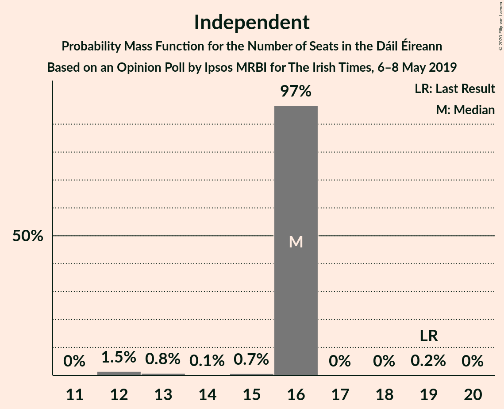
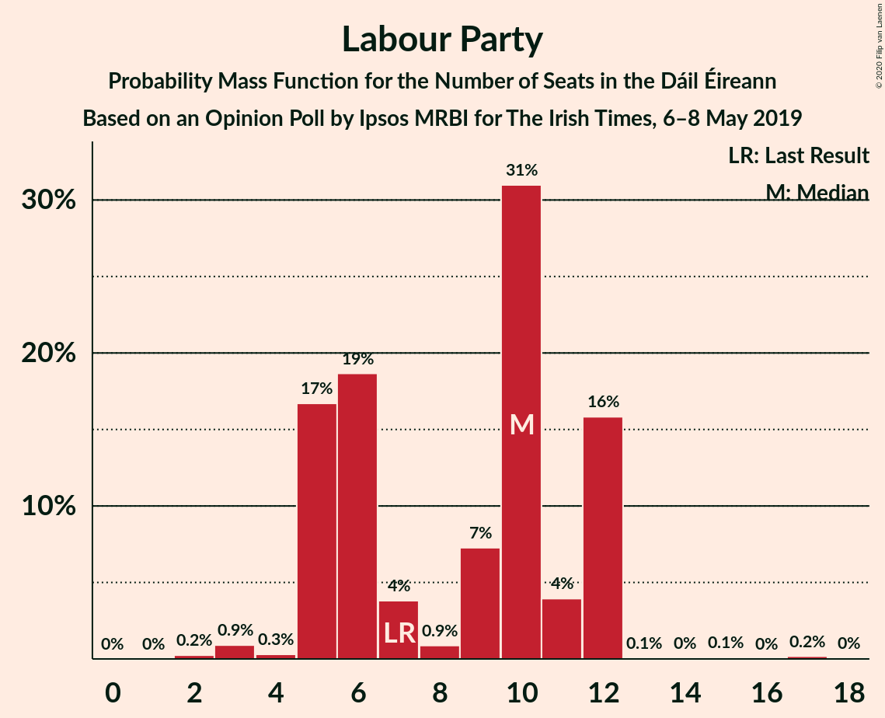
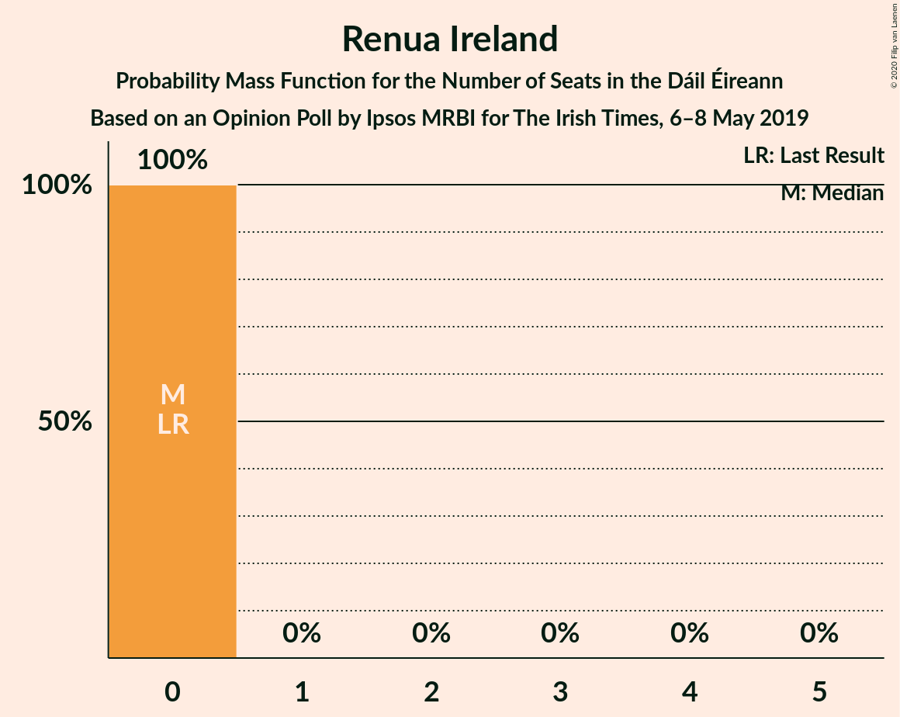
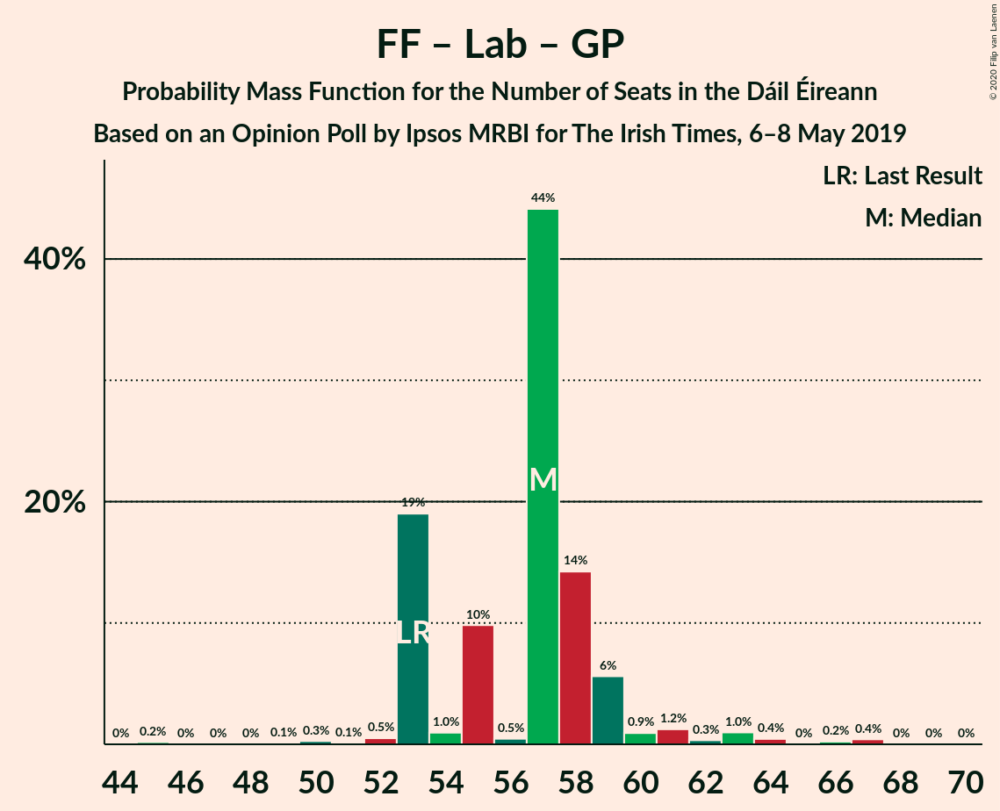
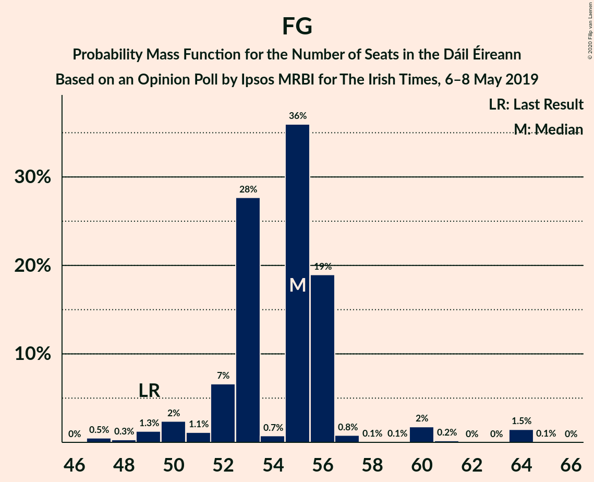

# Opinion Poll by Ipsos MRBI for The Irish Times, 6–8 May 2019

<a href="#voting-intentions">Voting Intentions</a> | <a href="#seats">Seats</a> | <a href="#coalitions">Coalitions</a> | <a href="#technical-information">Technical Information</a>

## Voting Intentions

### Confidence Intervals

| Party | Last Result | Poll Result | 80% Confidence Interval | 90% Confidence Interval | 95% Confidence Interval | 99% Confidence Interval |
|:-----:|:-----------:|:-----------:|:-----------------------:|:-----------------------:|:-----------------------:|:-----------------------:|
| Fine Gael | 25.5% | 28.9% | 27.3–30.3% |26.9–30.8% |26.6–31.2% |25.9–31.9% |
| Fianna Fáil | 24.3% | 25.9% | 24.4–27.3% |24.0–27.7% |23.6–28.1% |23.0–28.8% |
| Sinn Féin | 13.8% | 15.9% | 14.7–17.1% |14.4–17.5% |14.1–17.8% |13.6–18.4% |
| Independent | 15.9% | 15.1% | 13.9–16.3% |13.6–16.7% |13.3–17.0% |12.8–17.6% |
| Labour Party | 6.6% | 6.9% | 6.2–7.8% |5.9–8.1% |5.7–8.3% |5.4–8.8% |
| Green Party/Comhaontas Glas | 2.7% | 4.0% | 3.4–4.7% |3.2–4.9% |3.1–5.1% |2.9–5.5% |
| Independents 4 Change | 1.5% | 1.9% | 1.5–2.4% |1.4–2.6% |1.3–2.7% |1.1–3.0% |
| Solidarity–People Before Profit | 3.9% | 0.3% | 0.2–0.5% |0.1–0.6% |0.1–0.7% |0.1–0.8% |
| Social Democrats | 3.0% | 0.3% | 0.2–0.5% |0.1–0.6% |0.1–0.7% |0.1–0.8% |
| Renua Ireland | 2.2% | 0.1% | 0.2–0.5% |0.1–0.6% |0.1–0.7% |0.1–0.8% |

*Note:* The poll result column reflects the actual value used in the calculations. Published results may vary slightly, and in addition be rounded to fewer digits.

## Seats

### Confidence Intervals

| Party | Last Result | Median | 80% Confidence Interval | 90% Confidence Interval | 95% Confidence Interval | 99% Confidence Interval |
|:-----:|:-----------:|:------:|:-----------------------:|:-----------------------:|:-----------------------:|:-----------------------:|
| <a href="#fine-gael">Fine Gael</a> | 49 | 55 | 52–56 |51–56 |50–60 |47–64 |
| <a href="#fianna-fáil">Fianna Fáil</a> | 44 | 45 | 44–48 |44–51 |42–51 |41–54 |
| <a href="#sinn-féin">Sinn Féin</a> | 23 | 29 | 27–31 |26–31 |26–32 |23–34 |
| <a href="#independent">Independent</a> | 19 | 16 | 16 |16 |15–16 |12–16 |
| <a href="#labour-party">Labour Party</a> | 7 | 10 | 5–12 |5–12 |5–12 |3–12 |
| <a href="#green-party/comhaontas-glas">Green Party/Comhaontas Glas</a> | 2 | 2 | 2–4 |1–4 |1–4 |0–4 |
| <a href="#independents-4-change">Independents 4 Change</a> | 4 | 4 | 4–5 |4–5 |3–5 |3–5 |
| <a href="#solidarity–people-before-profit">Solidarity–People Before Profit</a> | 6 | 0 | 0 |0 |0 |0 |
| <a href="#social-democrats">Social Democrats</a> | 3 | 0 | 0 |0 |0 |0–1 |
| <a href="#renua-ireland">Renua Ireland</a> | 0 | 0 | 0 |0 |0 |0 |

### Fine Gael

*For a full overview of the results for this party, see the [Fine Gael](party-finegael.html) page.*

| Number of Seats | Probability | Accumulated | Special Marks |
|:---------------:|:-----------:|:-----------:|:-------------:|
| 47 | 0.5% | 100% |  |
| 48 | 0.3% | 99.5% |  |
| 49 | 1.3% | 99.2% | Last Result |
| 50 | 2% | 98% |  |
| 51 | 1.1% | 96% |  |
| 52 | 7% | 94% |  |
| 53 | 28% | 88% |  |
| 54 | 0.7% | 60% |  |
| 55 | 36% | 59% | Median |
| 56 | 19% | 23% |  |
| 57 | 0.8% | 4% |  |
| 58 | 0.1% | 4% |  |
| 59 | 0.1% | 4% |  |
| 60 | 2% | 3% |  |
| 61 | 0.2% | 2% |  |
| 62 | 0% | 2% |  |
| 63 | 0% | 2% |  |
| 64 | 1.5% | 2% |  |
| 65 | 0.1% | 0.1% |  |
| 66 | 0% | 0% |  |

### Fianna Fáil

*For a full overview of the results for this party, see the [Fianna Fáil](party-fiannafáil.html) page.*

| Number of Seats | Probability | Accumulated | Special Marks |
|:---------------:|:-----------:|:-----------:|:-------------:|
| 39 | 0.1% | 100% |  |
| 40 | 0% | 99.9% |  |
| 41 | 2% | 99.9% |  |
| 42 | 2% | 98% |  |
| 43 | 0.6% | 96% |  |
| 44 | 21% | 96% | Last Result |
| 45 | 48% | 75% | Median |
| 46 | 11% | 27% |  |
| 47 | 2% | 16% |  |
| 48 | 5% | 15% |  |
| 49 | 2% | 10% |  |
| 50 | 1.2% | 8% |  |
| 51 | 6% | 7% |  |
| 52 | 0.4% | 1.2% |  |
| 53 | 0.3% | 0.8% |  |
| 54 | 0.4% | 0.5% |  |
| 55 | 0.1% | 0.1% |  |
| 56 | 0% | 0% |  |

### Sinn Féin

*For a full overview of the results for this party, see the [Sinn Féin](party-sinnféin.html) page.*

| Number of Seats | Probability | Accumulated | Special Marks |
|:---------------:|:-----------:|:-----------:|:-------------:|
| 22 | 0.1% | 100% |  |
| 23 | 1.0% | 99.8% | Last Result |
| 24 | 0.5% | 98.8% |  |
| 25 | 0.3% | 98% |  |
| 26 | 5% | 98% |  |
| 27 | 3% | 93% |  |
| 28 | 30% | 90% |  |
| 29 | 15% | 59% | Median |
| 30 | 26% | 44% |  |
| 31 | 15% | 17% |  |
| 32 | 1.1% | 3% |  |
| 33 | 0.7% | 2% |  |
| 34 | 0.8% | 0.9% |  |
| 35 | 0% | 0.1% |  |
| 36 | 0.1% | 0.1% |  |
| 37 | 0% | 0% |  |

### Independent

*For a full overview of the results for this party, see the [Independent](party-independent.html) page.*

| Number of Seats | Probability | Accumulated | Special Marks |
|:---------------:|:-----------:|:-----------:|:-------------:|
| 12 | 1.5% | 100% |  |
| 13 | 0.8% | 98.5% |  |
| 14 | 0.1% | 98% |  |
| 15 | 0.7% | 98% |  |
| 16 | 97% | 97% | Median |
| 17 | 0% | 0.2% |  |
| 18 | 0% | 0.2% |  |
| 19 | 0.2% | 0.2% | Last Result |
| 20 | 0% | 0% |  |

### Labour Party

*For a full overview of the results for this party, see the [Labour Party](party-labourparty.html) page.*

| Number of Seats | Probability | Accumulated | Special Marks |
|:---------------:|:-----------:|:-----------:|:-------------:|
| 2 | 0.2% | 100% |  |
| 3 | 0.9% | 99.8% |  |
| 4 | 0.3% | 98.8% |  |
| 5 | 17% | 98.5% |  |
| 6 | 19% | 82% |  |
| 7 | 4% | 63% | Last Result |
| 8 | 0.9% | 59% |  |
| 9 | 7% | 58% |  |
| 10 | 31% | 51% | Median |
| 11 | 4% | 20% |  |
| 12 | 16% | 16% |  |
| 13 | 0.1% | 0.5% |  |
| 14 | 0% | 0.4% |  |
| 15 | 0.1% | 0.3% |  |
| 16 | 0% | 0.3% |  |
| 17 | 0.2% | 0.2% |  |
| 18 | 0% | 0% |  |

### Green Party/Comhaontas Glas

*For a full overview of the results for this party, see the [Green Party/Comhaontas Glas](party-greenpartycomhaontasglas.html) page.*

| Number of Seats | Probability | Accumulated | Special Marks |
|:---------------:|:-----------:|:-----------:|:-------------:|
| 0 | 1.0% | 100% |  |
| 1 | 4% | 99.0% |  |
| 2 | 66% | 95% | Last Result, Median |
| 3 | 8% | 29% |  |
| 4 | 21% | 21% |  |
| 5 | 0.1% | 0.1% |  |
| 6 | 0% | 0% |  |

### Independents 4 Change

*For a full overview of the results for this party, see the [Independents 4 Change](party-independents4change.html) page.*

| Number of Seats | Probability | Accumulated | Special Marks |
|:---------------:|:-----------:|:-----------:|:-------------:|
| 1 | 0.3% | 100% |  |
| 2 | 0.1% | 99.7% |  |
| 3 | 4% | 99.6% |  |
| 4 | 68% | 95% | Last Result, Median |
| 5 | 28% | 28% |  |
| 6 | 0% | 0% |  |

### Solidarity–People Before Profit

*For a full overview of the results for this party, see the [Solidarity–People Before Profit](party-solidarity–peoplebeforeprofit.html) page.*

| Number of Seats | Probability | Accumulated | Special Marks |
|:---------------:|:-----------:|:-----------:|:-------------:|
| 0 | 100% | 100% | Median |
| 1 | 0% | 0% |  |
| 2 | 0% | 0% |  |
| 3 | 0% | 0% |  |
| 4 | 0% | 0% |  |
| 5 | 0% | 0% |  |
| 6 | 0% | 0% | Last Result |

### Social Democrats

*For a full overview of the results for this party, see the [Social Democrats](party-socialdemocrats.html) page.*

| Number of Seats | Probability | Accumulated | Special Marks |
|:---------------:|:-----------:|:-----------:|:-------------:|
| 0 | 99.5% | 100% | Median |
| 1 | 0.5% | 0.5% |  |
| 2 | 0% | 0% |  |
| 3 | 0% | 0% | Last Result |

### Renua Ireland

*For a full overview of the results for this party, see the [Renua Ireland](party-renuaireland.html) page.*

| Number of Seats | Probability | Accumulated | Special Marks |
|:---------------:|:-----------:|:-----------:|:-------------:|
| 0 | 100% | 100% | Last Result, Median |

## Coalitions

### Confidence Intervals

| Coalition | Last Result | Median | Majority? | 80% Confidence Interval | 90% Confidence Interval | 95% Confidence Interval | 99% Confidence Interval |
|:---------:|:-----------:|:------:|:---------:|:-----------------------:|:-----------------------:|:-----------------------:|:-----------------------:|
| Fine Gael – Fianna Fáil | 93 | 100 | 100% | 97–102 | 96–106 | 96–106 | 95–110 |
| Fianna Fáil – Sinn Féin | 67 | 74 | 2% | 73–77 | 73–78 | 72–79 | 68–82 |
| Fine Gael – Labour Party – Green Party/Comhaontas Glas | 58 | 67 | 0% | 62–67 | 62–68 | 60–69 | 57–76 |
| Fine Gael – Labour Party – Green Party/Comhaontas Glas – Social Democrats | 61 | 67 | 0% | 62–67 | 62–68 | 60–69 | 57–76 |
| Fine Gael – Labour Party | 56 | 65 | 0% | 58–65 | 58–66 | 58–67 | 54–75 |
| Fine Gael – Green Party/Comhaontas Glas | 51 | 57 | 0% | 55–58 | 54–58 | 52–62 | 50–65 |
| Fianna Fáil – Labour Party – Green Party/Comhaontas Glas | 53 | 57 | 0% | 53–59 | 53–59 | 53–61 | 50–66 |
| Fianna Fáil – Labour Party – Green Party/Comhaontas Glas – Social Democrats | 56 | 57 | 0% | 53–59 | 53–59 | 53–61 | 50–66 |
| Fianna Fáil – Labour Party | 51 | 55 | 0% | 51–56 | 51–56 | 51–60 | 47–62 |
| Fine Gael | 49 | 55 | 0% | 52–56 | 51–56 | 50–60 | 47–64 |
| Fianna Fáil – Green Party/Comhaontas Glas | 46 | 47 | 0% | 46–52 | 46–54 | 44–54 | 42–56 |

### Fine Gael – Fianna Fáil

| Number of Seats | Probability | Accumulated | Special Marks |
|:---------------:|:-----------:|:-----------:|:-------------:|
| 92 | 0% | 100% |  |
| 93 | 0% | 99.9% | Last Result |
| 94 | 0.2% | 99.9% |  |
| 95 | 0.3% | 99.7% |  |
| 96 | 7% | 99.3% |  |
| 97 | 15% | 92% |  |
| 98 | 3% | 78% |  |
| 99 | 11% | 75% |  |
| 100 | 32% | 64% | Median |
| 101 | 21% | 32% |  |
| 102 | 1.3% | 11% |  |
| 103 | 0.2% | 9% |  |
| 104 | 0.4% | 9% |  |
| 105 | 2% | 9% |  |
| 106 | 5% | 7% |  |
| 107 | 0.3% | 2% |  |
| 108 | 0.1% | 2% |  |
| 109 | 0.6% | 2% |  |
| 110 | 1.0% | 1.0% |  |
| 111 | 0% | 0% |  |

### Fianna Fáil – Sinn Féin

| Number of Seats | Probability | Accumulated | Special Marks |
|:---------------:|:-----------:|:-----------:|:-------------:|
| 65 | 0.1% | 100% |  |
| 66 | 0% | 99.9% |  |
| 67 | 0% | 99.9% | Last Result |
| 68 | 1.5% | 99.9% |  |
| 69 | 0.1% | 98% |  |
| 70 | 0.2% | 98% |  |
| 71 | 0.3% | 98% |  |
| 72 | 2% | 98% |  |
| 73 | 45% | 95% |  |
| 74 | 0.4% | 50% | Median |
| 75 | 24% | 50% |  |
| 76 | 5% | 26% |  |
| 77 | 13% | 21% |  |
| 78 | 5% | 8% |  |
| 79 | 1.0% | 3% |  |
| 80 | 0.4% | 2% |  |
| 81 | 0.5% | 2% | Majority |
| 82 | 1.0% | 2% |  |
| 83 | 0.4% | 0.5% |  |
| 84 | 0.1% | 0.1% |  |
| 85 | 0% | 0% |  |

### Fine Gael – Labour Party – Green Party/Comhaontas Glas

| Number of Seats | Probability | Accumulated | Special Marks |
|:---------------:|:-----------:|:-----------:|:-------------:|
| 56 | 0% | 100% |  |
| 57 | 0.5% | 99.9% |  |
| 58 | 0.6% | 99.4% | Last Result |
| 59 | 0.2% | 98.8% |  |
| 60 | 1.1% | 98.5% |  |
| 61 | 1.2% | 97% |  |
| 62 | 11% | 96% |  |
| 63 | 7% | 85% |  |
| 64 | 21% | 79% |  |
| 65 | 7% | 58% |  |
| 66 | 0.1% | 50% |  |
| 67 | 45% | 50% | Median |
| 68 | 1.2% | 5% |  |
| 69 | 2% | 4% |  |
| 70 | 0.1% | 2% |  |
| 71 | 0% | 2% |  |
| 72 | 0.1% | 2% |  |
| 73 | 0% | 2% |  |
| 74 | 0.1% | 1.5% |  |
| 75 | 0% | 1.4% |  |
| 76 | 1.4% | 1.4% |  |
| 77 | 0% | 0% |  |

### Fine Gael – Labour Party – Green Party/Comhaontas Glas – Social Democrats

| Number of Seats | Probability | Accumulated | Special Marks |
|:---------------:|:-----------:|:-----------:|:-------------:|
| 56 | 0% | 100% |  |
| 57 | 0.5% | 99.9% |  |
| 58 | 0.6% | 99.4% |  |
| 59 | 0.2% | 98.8% |  |
| 60 | 1.1% | 98.5% |  |
| 61 | 1.2% | 97% | Last Result |
| 62 | 11% | 96% |  |
| 63 | 6% | 85% |  |
| 64 | 21% | 79% |  |
| 65 | 7% | 58% |  |
| 66 | 0.1% | 50% |  |
| 67 | 45% | 50% | Median |
| 68 | 1.2% | 5% |  |
| 69 | 2% | 4% |  |
| 70 | 0.1% | 2% |  |
| 71 | 0% | 2% |  |
| 72 | 0.1% | 2% |  |
| 73 | 0% | 2% |  |
| 74 | 0.1% | 1.5% |  |
| 75 | 0% | 1.4% |  |
| 76 | 1.4% | 1.4% |  |
| 77 | 0% | 0% |  |

### Fine Gael – Labour Party

| Number of Seats | Probability | Accumulated | Special Marks |
|:---------------:|:-----------:|:-----------:|:-------------:|
| 53 | 0% | 100% |  |
| 54 | 0.4% | 99.9% |  |
| 55 | 0.3% | 99.5% |  |
| 56 | 1.0% | 99.2% | Last Result |
| 57 | 0.4% | 98% |  |
| 58 | 11% | 98% |  |
| 59 | 0.9% | 87% |  |
| 60 | 9% | 86% |  |
| 61 | 7% | 77% |  |
| 62 | 19% | 70% |  |
| 63 | 0.6% | 51% |  |
| 64 | 0.2% | 50% |  |
| 65 | 45% | 50% | Median |
| 66 | 1.0% | 5% |  |
| 67 | 2% | 4% |  |
| 68 | 0.6% | 2% |  |
| 69 | 0% | 2% |  |
| 70 | 0% | 2% |  |
| 71 | 0.1% | 2% |  |
| 72 | 0% | 1.4% |  |
| 73 | 0% | 1.4% |  |
| 74 | 0% | 1.4% |  |
| 75 | 1.4% | 1.4% |  |
| 76 | 0% | 0% |  |

### Fine Gael – Green Party/Comhaontas Glas

| Number of Seats | Probability | Accumulated | Special Marks |
|:---------------:|:-----------:|:-----------:|:-------------:|
| 49 | 0.5% | 100% |  |
| 50 | 0.1% | 99.5% |  |
| 51 | 2% | 99.4% | Last Result |
| 52 | 1.3% | 98% |  |
| 53 | 1.0% | 96% |  |
| 54 | 1.0% | 95% |  |
| 55 | 15% | 94% |  |
| 56 | 7% | 79% |  |
| 57 | 44% | 72% | Median |
| 58 | 24% | 28% |  |
| 59 | 0.6% | 4% |  |
| 60 | 0% | 4% |  |
| 61 | 1.0% | 4% |  |
| 62 | 0.1% | 3% |  |
| 63 | 1.0% | 2% |  |
| 64 | 0% | 2% |  |
| 65 | 1.5% | 2% |  |
| 66 | 0.1% | 0.1% |  |
| 67 | 0% | 0% |  |

### Fianna Fáil – Labour Party – Green Party/Comhaontas Glas

| Number of Seats | Probability | Accumulated | Special Marks |
|:---------------:|:-----------:|:-----------:|:-------------:|
| 45 | 0.2% | 100% |  |
| 46 | 0% | 99.8% |  |
| 47 | 0% | 99.8% |  |
| 48 | 0% | 99.8% |  |
| 49 | 0.1% | 99.8% |  |
| 50 | 0.3% | 99.7% |  |
| 51 | 0.1% | 99.4% |  |
| 52 | 0.5% | 99.4% |  |
| 53 | 19% | 98.9% | Last Result |
| 54 | 1.0% | 80% |  |
| 55 | 10% | 79% |  |
| 56 | 0.5% | 69% |  |
| 57 | 44% | 69% | Median |
| 58 | 14% | 24% |  |
| 59 | 6% | 10% |  |
| 60 | 0.9% | 5% |  |
| 61 | 1.2% | 4% |  |
| 62 | 0.3% | 2% |  |
| 63 | 1.0% | 2% |  |
| 64 | 0.4% | 1.2% |  |
| 65 | 0% | 0.7% |  |
| 66 | 0.2% | 0.7% |  |
| 67 | 0.4% | 0.5% |  |
| 68 | 0% | 0.1% |  |
| 69 | 0% | 0% |  |

### Fianna Fáil – Labour Party – Green Party/Comhaontas Glas – Social Democrats

| Number of Seats | Probability | Accumulated | Special Marks |
|:---------------:|:-----------:|:-----------:|:-------------:|
| 45 | 0.2% | 100% |  |
| 46 | 0% | 99.8% |  |
| 47 | 0% | 99.8% |  |
| 48 | 0% | 99.8% |  |
| 49 | 0.1% | 99.8% |  |
| 50 | 0.3% | 99.7% |  |
| 51 | 0.1% | 99.4% |  |
| 52 | 0.5% | 99.4% |  |
| 53 | 19% | 98.9% |  |
| 54 | 1.1% | 80% |  |
| 55 | 10% | 79% |  |
| 56 | 0.5% | 69% | Last Result |
| 57 | 44% | 69% | Median |
| 58 | 14% | 24% |  |
| 59 | 6% | 10% |  |
| 60 | 0.9% | 5% |  |
| 61 | 1.2% | 4% |  |
| 62 | 0.3% | 2% |  |
| 63 | 1.0% | 2% |  |
| 64 | 0.5% | 1.2% |  |
| 65 | 0% | 0.7% |  |
| 66 | 0.2% | 0.7% |  |
| 67 | 0.4% | 0.5% |  |
| 68 | 0% | 0.1% |  |
| 69 | 0% | 0% |  |

### Fianna Fáil – Labour Party

| Number of Seats | Probability | Accumulated | Special Marks |
|:---------------:|:-----------:|:-----------:|:-------------:|
| 43 | 0.2% | 100% |  |
| 44 | 0% | 99.8% |  |
| 45 | 0% | 99.8% |  |
| 46 | 0% | 99.8% |  |
| 47 | 0.3% | 99.7% |  |
| 48 | 0% | 99.5% |  |
| 49 | 0% | 99.4% |  |
| 50 | 0.6% | 99.4% |  |
| 51 | 25% | 98.8% | Last Result |
| 52 | 3% | 74% |  |
| 53 | 14% | 72% |  |
| 54 | 1.4% | 57% |  |
| 55 | 31% | 56% | Median |
| 56 | 20% | 25% |  |
| 57 | 0.5% | 5% |  |
| 58 | 0.6% | 4% |  |
| 59 | 0.2% | 4% |  |
| 60 | 1.4% | 3% |  |
| 61 | 1.0% | 2% |  |
| 62 | 0.6% | 1.1% |  |
| 63 | 0% | 0.5% |  |
| 64 | 0.3% | 0.5% |  |
| 65 | 0.1% | 0.1% |  |
| 66 | 0% | 0% |  |

### Fine Gael

| Number of Seats | Probability | Accumulated | Special Marks |
|:---------------:|:-----------:|:-----------:|:-------------:|
| 47 | 0.5% | 100% |  |
| 48 | 0.3% | 99.5% |  |
| 49 | 1.3% | 99.2% | Last Result |
| 50 | 2% | 98% |  |
| 51 | 1.1% | 96% |  |
| 52 | 7% | 94% |  |
| 53 | 28% | 88% |  |
| 54 | 0.7% | 60% |  |
| 55 | 36% | 59% | Median |
| 56 | 19% | 23% |  |
| 57 | 0.8% | 4% |  |
| 58 | 0.1% | 4% |  |
| 59 | 0.1% | 4% |  |
| 60 | 2% | 3% |  |
| 61 | 0.2% | 2% |  |
| 62 | 0% | 2% |  |
| 63 | 0% | 2% |  |
| 64 | 1.5% | 2% |  |
| 65 | 0.1% | 0.1% |  |
| 66 | 0% | 0% |  |

### Fianna Fáil – Green Party/Comhaontas Glas

| Number of Seats | Probability | Accumulated | Special Marks |
|:---------------:|:-----------:|:-----------:|:-------------:|
| 42 | 2% | 100% |  |
| 43 | 0.6% | 98% |  |
| 44 | 2% | 98% |  |
| 45 | 0.3% | 96% |  |
| 46 | 14% | 96% | Last Result |
| 47 | 48% | 81% | Median |
| 48 | 7% | 34% |  |
| 49 | 2% | 26% |  |
| 50 | 11% | 25% |  |
| 51 | 3% | 14% |  |
| 52 | 4% | 11% |  |
| 53 | 0.6% | 7% |  |
| 54 | 5% | 6% |  |
| 55 | 0.4% | 1.2% |  |
| 56 | 0.4% | 0.8% |  |
| 57 | 0.4% | 0.4% |  |
| 58 | 0% | 0% |  |

## Technical Information

### Opinion Poll

+ **Polling firm:** Ipsos MRBI
+ **Commissioner(s):** The Irish Times
+ **Fieldwork period:** 6–8 May 2019

### Calculations

+ **Sample size:** 1497
+ **Simulations done:** 131,072
+ **Error estimate:** 0.69%

