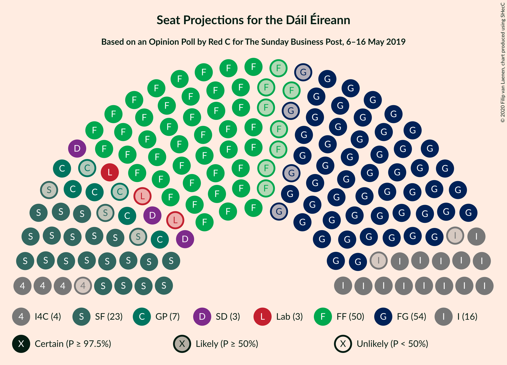
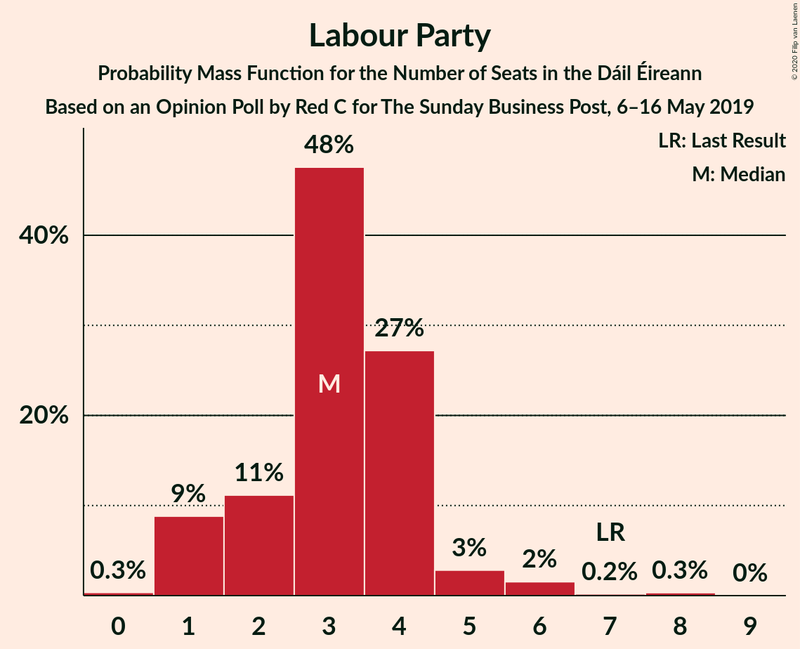
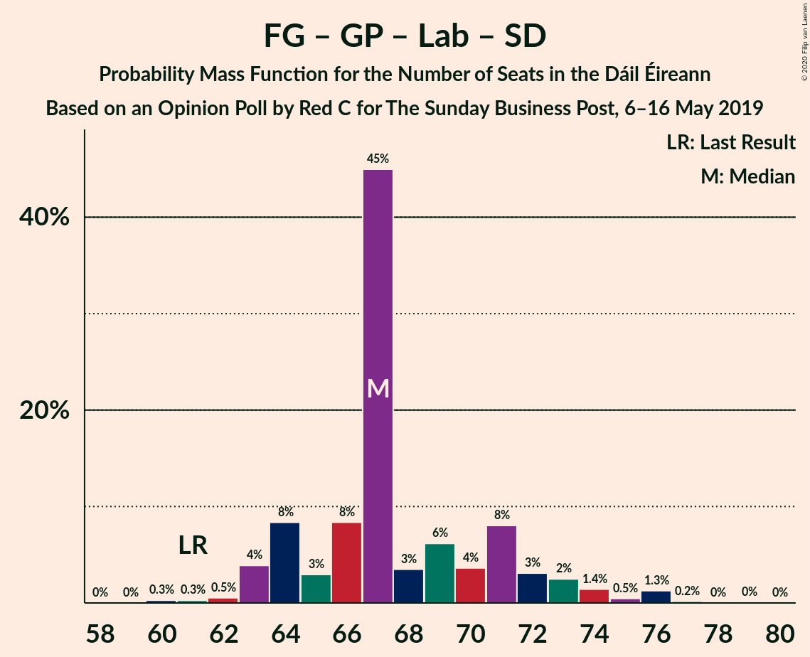
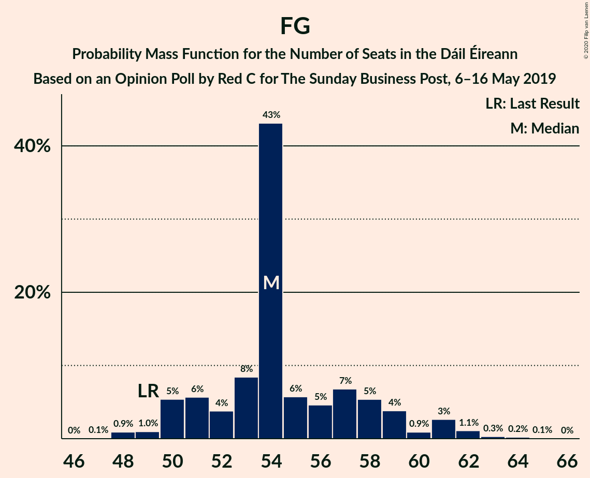

# Opinion Poll by Red C for The Sunday Business Post, 6–16 May 2019

<a href="#voting-intentions">Voting Intentions</a> | <a href="#seats">Seats</a> | <a href="#coalitions">Coalitions</a> | <a href="#technical-information">Technical Information</a>

## Voting Intentions

### Confidence Intervals

| Party | Last Result | Poll Result | 80% Confidence Interval | 90% Confidence Interval | 95% Confidence Interval | 99% Confidence Interval |
|:-----:|:-----------:|:-----------:|:-----------------------:|:-----------------------:|:-----------------------:|:-----------------------:|
| Fine Gael | 25.5% | 28.0% | 26.7–29.3% |26.4–29.7% |26.1–30.0% |25.5–30.7% |
| Fianna Fáil | 24.3% | 24.0% | 22.8–25.3% |22.5–25.6% |22.2–25.9% |21.6–26.5% |
| Independent | 15.9% | 13.5% | 12.6–14.5% |12.3–14.8% |12.1–15.1% |11.6–15.6% |
| Sinn Féin | 13.8% | 13.0% | 12.1–14.0% |11.8–14.3% |11.6–14.6% |11.2–15.0% |
| Green Party/Comhaontas Glas | 2.7% | 7.0% | 6.3–7.8% |6.1–8.0% |6.0–8.2% |5.6–8.6% |
| Labour Party | 6.6% | 5.0% | 4.4–5.7% |4.3–5.9% |4.1–6.1% |3.9–6.4% |
| Solidarity–People Before Profit | 3.9% | 2.0% | 1.6–2.5% |1.6–2.6% |1.5–2.7% |1.3–3.0% |
| Social Democrats | 3.0% | 2.0% | 1.6–2.5% |1.6–2.6% |1.5–2.7% |1.3–3.0% |
| Independents 4 Change | 1.5% | 1.7% | 1.4–2.1% |1.3–2.3% |1.2–2.4% |1.1–2.6% |
| Renua Ireland | 2.2% | 1.0% | 0.8–1.4% |0.7–1.5% |0.6–1.5% |0.5–1.7% |

*Note:* The poll result column reflects the actual value used in the calculations. Published results may vary slightly, and in addition be rounded to fewer digits.

## Seats

### Confidence Intervals

| Party | Last Result | Median | 80% Confidence Interval | 90% Confidence Interval | 95% Confidence Interval | 99% Confidence Interval |
|:-----:|:-----------:|:------:|:-----------------------:|:-----------------------:|:-----------------------:|:-----------------------:|
| <a href="#fine-gael">Fine Gael</a> | 49 | 54 | 51–58 |50–60 |50–61 |48–63 |
| <a href="#fianna-fáil">Fianna Fáil</a> | 44 | 50 | 43–50 |42–51 |42–52 |41–53 |
| <a href="#independent">Independent</a> | 19 | 16 | 15–16 |15–16 |14–16 |13–16 |
| <a href="#sinn-féin">Sinn Féin</a> | 23 | 23 | 22–29 |21–30 |20–30 |18–31 |
| <a href="#green-party/comhaontas-glas">Green Party/Comhaontas Glas</a> | 2 | 7 | 5–8 |5–9 |5–9 |5–10 |
| <a href="#labour-party">Labour Party</a> | 7 | 3 | 2–4 |1–4 |1–5 |1–7 |
| <a href="#solidarity–people-before-profit">Solidarity–People Before Profit</a> | 6 | 0 | 0–1 |0–2 |0–2 |0–3 |
| <a href="#social-democrats">Social Democrats</a> | 3 | 3 | 3 |3 |3 |3 |
| <a href="#independents-4-change">Independents 4 Change</a> | 4 | 4 | 4–5 |3–5 |3–5 |2–5 |
| <a href="#renua-ireland">Renua Ireland</a> | 0 | 0 | 0 |0 |0 |0 |

### Fine Gael

*For a full overview of the results for this party, see the [Fine Gael](party-finegael.html) page.*

| Number of Seats | Probability | Accumulated | Special Marks |
|:---------------:|:-----------:|:-----------:|:-------------:|
| 47 | 0.1% | 100% |  |
| 48 | 0.9% | 99.9% |  |
| 49 | 1.0% | 99.0% | Last Result |
| 50 | 5% | 98% |  |
| 51 | 6% | 93% |  |
| 52 | 4% | 87% |  |
| 53 | 8% | 83% |  |
| 54 | 43% | 75% | Median |
| 55 | 6% | 32% |  |
| 56 | 5% | 26% |  |
| 57 | 7% | 21% |  |
| 58 | 5% | 14% |  |
| 59 | 4% | 9% |  |
| 60 | 0.9% | 5% |  |
| 61 | 3% | 4% |  |
| 62 | 1.1% | 2% |  |
| 63 | 0.3% | 0.6% |  |
| 64 | 0.2% | 0.3% |  |
| 65 | 0.1% | 0.1% |  |
| 66 | 0% | 0% |  |

### Fianna Fáil

*For a full overview of the results for this party, see the [Fianna Fáil](party-fiannafáil.html) page.*

| Number of Seats | Probability | Accumulated | Special Marks |
|:---------------:|:-----------:|:-----------:|:-------------:|
| 39 | 0.2% | 100% |  |
| 40 | 0.3% | 99.8% |  |
| 41 | 2% | 99.5% |  |
| 42 | 5% | 98% |  |
| 43 | 4% | 92% |  |
| 44 | 7% | 88% | Last Result |
| 45 | 3% | 81% |  |
| 46 | 4% | 78% |  |
| 47 | 7% | 74% |  |
| 48 | 12% | 67% |  |
| 49 | 5% | 55% |  |
| 50 | 44% | 50% | Median |
| 51 | 3% | 6% |  |
| 52 | 2% | 3% |  |
| 53 | 0.8% | 0.9% |  |
| 54 | 0.1% | 0.1% |  |
| 55 | 0% | 0% |  |

### Independent

*For a full overview of the results for this party, see the [Independent](party-independent.html) page.*

| Number of Seats | Probability | Accumulated | Special Marks |
|:---------------:|:-----------:|:-----------:|:-------------:|
| 11 | 0.1% | 100% |  |
| 12 | 0.2% | 99.9% |  |
| 13 | 2% | 99.7% |  |
| 14 | 2% | 98% |  |
| 15 | 8% | 95% |  |
| 16 | 87% | 87% | Median |
| 17 | 0% | 0% |  |
| 18 | 0% | 0% |  |
| 19 | 0% | 0% | Last Result |

### Sinn Féin

*For a full overview of the results for this party, see the [Sinn Féin](party-sinnféin.html) page.*

| Number of Seats | Probability | Accumulated | Special Marks |
|:---------------:|:-----------:|:-----------:|:-------------:|
| 16 | 0% | 100% |  |
| 17 | 0.2% | 99.9% |  |
| 18 | 0.8% | 99.8% |  |
| 19 | 1.0% | 99.0% |  |
| 20 | 2% | 98% |  |
| 21 | 3% | 96% |  |
| 22 | 8% | 93% |  |
| 23 | 49% | 85% | Last Result, Median |
| 24 | 5% | 35% |  |
| 25 | 9% | 30% |  |
| 26 | 3% | 21% |  |
| 27 | 3% | 17% |  |
| 28 | 3% | 15% |  |
| 29 | 3% | 11% |  |
| 30 | 6% | 8% |  |
| 31 | 2% | 2% |  |
| 32 | 0.1% | 0.1% |  |
| 33 | 0% | 0% |  |

### Green Party/Comhaontas Glas

*For a full overview of the results for this party, see the [Green Party/Comhaontas Glas](party-greenpartycomhaontasglas.html) page.*

| Number of Seats | Probability | Accumulated | Special Marks |
|:---------------:|:-----------:|:-----------:|:-------------:|
| 2 | 0% | 100% | Last Result |
| 3 | 0% | 100% |  |
| 4 | 0% | 100% |  |
| 5 | 12% | 100% |  |
| 6 | 16% | 88% |  |
| 7 | 45% | 72% | Median |
| 8 | 17% | 26% |  |
| 9 | 8% | 9% |  |
| 10 | 0.9% | 1.4% |  |
| 11 | 0.2% | 0.5% |  |
| 12 | 0.2% | 0.2% |  |
| 13 | 0.1% | 0.1% |  |
| 14 | 0% | 0% |  |

### Labour Party

*For a full overview of the results for this party, see the [Labour Party](party-labourparty.html) page.*

| Number of Seats | Probability | Accumulated | Special Marks |
|:---------------:|:-----------:|:-----------:|:-------------:|
| 0 | 0.3% | 100% |  |
| 1 | 9% | 99.7% |  |
| 2 | 11% | 91% |  |
| 3 | 48% | 80% | Median |
| 4 | 27% | 32% |  |
| 5 | 3% | 5% |  |
| 6 | 2% | 2% |  |
| 7 | 0.2% | 0.5% | Last Result |
| 8 | 0.3% | 0.4% |  |
| 9 | 0% | 0% |  |

### Solidarity–People Before Profit

*For a full overview of the results for this party, see the [Solidarity–People Before Profit](party-solidarity–peoplebeforeprofit.html) page.*

| Number of Seats | Probability | Accumulated | Special Marks |
|:---------------:|:-----------:|:-----------:|:-------------:|
| 0 | 73% | 100% | Median |
| 1 | 17% | 27% |  |
| 2 | 9% | 10% |  |
| 3 | 0.4% | 0.7% |  |
| 4 | 0.4% | 0.4% |  |
| 5 | 0% | 0% |  |
| 6 | 0% | 0% | Last Result |

### Social Democrats

*For a full overview of the results for this party, see the [Social Democrats](party-socialdemocrats.html) page.*

| Number of Seats | Probability | Accumulated | Special Marks |
|:---------------:|:-----------:|:-----------:|:-------------:|
| 1 | 0.1% | 100% |  |
| 2 | 0.4% | 99.9% |  |
| 3 | 99.3% | 99.5% | Last Result, Median |
| 4 | 0.2% | 0.2% |  |
| 5 | 0% | 0% |  |

### Independents 4 Change

*For a full overview of the results for this party, see the [Independents 4 Change](party-independents4change.html) page.*

| Number of Seats | Probability | Accumulated | Special Marks |
|:---------------:|:-----------:|:-----------:|:-------------:|
| 1 | 0% | 100% |  |
| 2 | 0.5% | 99.9% |  |
| 3 | 5% | 99.4% |  |
| 4 | 65% | 94% | Last Result, Median |
| 5 | 29% | 29% |  |
| 6 | 0% | 0% |  |

### Renua Ireland

*For a full overview of the results for this party, see the [Renua Ireland](party-renuaireland.html) page.*

| Number of Seats | Probability | Accumulated | Special Marks |
|:---------------:|:-----------:|:-----------:|:-------------:|
| 0 | 100% | 100% | Last Result, Median |

## Coalitions

### Confidence Intervals

| Coalition | Last Result | Median | Majority? | 80% Confidence Interval | 90% Confidence Interval | 95% Confidence Interval | 99% Confidence Interval |
|:---------:|:-----------:|:------:|:---------:|:-----------------------:|:-----------------------:|:-----------------------:|:-----------------------:|
| Fine Gael – Fianna Fáil | 93 | 104 | 100% | 98–105 | 96–106 | 95–107 | 95–109 |
| Fianna Fáil – Sinn Féin | 67 | 73 | 0% | 68–74 | 67–75 | 66–76 | 65–78 |
| Fine Gael – Green Party/Comhaontas Glas – Labour Party – Social Democrats | 61 | 67 | 0% | 64–71 | 63–73 | 63–74 | 61–76 |
| Fine Gael – Green Party/Comhaontas Glas – Labour Party | 58 | 64 | 0% | 61–68 | 61–70 | 60–71 | 58–73 |
| Fine Gael – Green Party/Comhaontas Glas | 51 | 61 | 0% | 58–65 | 57–67 | 56–68 | 56–70 |
| Fianna Fáil – Green Party/Comhaontas Glas – Labour Party – Social Democrats | 56 | 63 | 0% | 56–64 | 54–64 | 53–65 | 52–67 |
| Fine Gael – Labour Party | 56 | 57 | 0% | 54–62 | 53–63 | 52–65 | 51–67 |
| Fianna Fáil – Green Party/Comhaontas Glas – Labour Party | 53 | 60 | 0% | 53–61 | 51–61 | 50–62 | 49–64 |
| Fine Gael | 49 | 54 | 0% | 51–58 | 50–60 | 50–61 | 48–63 |
| Fianna Fáil – Green Party/Comhaontas Glas | 46 | 57 | 0% | 50–57 | 48–58 | 48–60 | 46–61 |
| Fianna Fáil – Labour Party | 51 | 53 | 0% | 46–53 | 45–54 | 44–55 | 43–56 |

### Fine Gael – Fianna Fáil

| Number of Seats | Probability | Accumulated | Special Marks |
|:---------------:|:-----------:|:-----------:|:-------------:|
| 93 | 0.1% | 100% | Last Result |
| 94 | 0.2% | 99.9% |  |
| 95 | 3% | 99.7% |  |
| 96 | 2% | 96% |  |
| 97 | 4% | 95% |  |
| 98 | 2% | 91% |  |
| 99 | 5% | 88% |  |
| 100 | 9% | 84% |  |
| 101 | 5% | 75% |  |
| 102 | 6% | 70% |  |
| 103 | 9% | 63% |  |
| 104 | 43% | 54% | Median |
| 105 | 3% | 11% |  |
| 106 | 5% | 8% |  |
| 107 | 1.3% | 3% |  |
| 108 | 0.9% | 2% |  |
| 109 | 0.9% | 1.3% |  |
| 110 | 0.1% | 0.4% |  |
| 111 | 0.2% | 0.3% |  |
| 112 | 0.1% | 0.1% |  |
| 113 | 0% | 0% |  |

### Fianna Fáil – Sinn Féin

| Number of Seats | Probability | Accumulated | Special Marks |
|:---------------:|:-----------:|:-----------:|:-------------:|
| 62 | 0% | 100% |  |
| 63 | 0.1% | 99.9% |  |
| 64 | 0.2% | 99.8% |  |
| 65 | 0.8% | 99.7% |  |
| 66 | 3% | 98.9% |  |
| 67 | 3% | 96% | Last Result |
| 68 | 4% | 93% |  |
| 69 | 4% | 89% |  |
| 70 | 12% | 85% |  |
| 71 | 4% | 74% |  |
| 72 | 4% | 70% |  |
| 73 | 50% | 65% | Median |
| 74 | 6% | 16% |  |
| 75 | 5% | 10% |  |
| 76 | 3% | 5% |  |
| 77 | 1.4% | 2% |  |
| 78 | 0.5% | 0.8% |  |
| 79 | 0.2% | 0.2% |  |
| 80 | 0% | 0% |  |

### Fine Gael – Green Party/Comhaontas Glas – Labour Party – Social Democrats

| Number of Seats | Probability | Accumulated | Special Marks |
|:---------------:|:-----------:|:-----------:|:-------------:|
| 60 | 0.3% | 100% |  |
| 61 | 0.3% | 99.7% | Last Result |
| 62 | 0.5% | 99.4% |  |
| 63 | 4% | 98.9% |  |
| 64 | 8% | 95% |  |
| 65 | 3% | 87% |  |
| 66 | 8% | 84% |  |
| 67 | 45% | 75% | Median |
| 68 | 3% | 30% |  |
| 69 | 6% | 27% |  |
| 70 | 4% | 21% |  |
| 71 | 8% | 17% |  |
| 72 | 3% | 9% |  |
| 73 | 2% | 6% |  |
| 74 | 1.4% | 3% |  |
| 75 | 0.5% | 2% |  |
| 76 | 1.3% | 2% |  |
| 77 | 0.2% | 0.3% |  |
| 78 | 0% | 0.1% |  |
| 79 | 0% | 0.1% |  |
| 80 | 0% | 0% |  |

### Fine Gael – Green Party/Comhaontas Glas – Labour Party

| Number of Seats | Probability | Accumulated | Special Marks |
|:---------------:|:-----------:|:-----------:|:-------------:|
| 57 | 0.3% | 100% |  |
| 58 | 0.3% | 99.7% | Last Result |
| 59 | 0.5% | 99.4% |  |
| 60 | 4% | 98.9% |  |
| 61 | 8% | 95% |  |
| 62 | 3% | 87% |  |
| 63 | 8% | 84% |  |
| 64 | 45% | 75% | Median |
| 65 | 3% | 30% |  |
| 66 | 6% | 27% |  |
| 67 | 4% | 21% |  |
| 68 | 8% | 17% |  |
| 69 | 3% | 9% |  |
| 70 | 2% | 6% |  |
| 71 | 1.5% | 3% |  |
| 72 | 0.4% | 2% |  |
| 73 | 1.3% | 2% |  |
| 74 | 0.2% | 0.3% |  |
| 75 | 0% | 0.1% |  |
| 76 | 0% | 0.1% |  |
| 77 | 0% | 0% |  |

### Fine Gael – Green Party/Comhaontas Glas

| Number of Seats | Probability | Accumulated | Special Marks |
|:---------------:|:-----------:|:-----------:|:-------------:|
| 51 | 0% | 100% | Last Result |
| 52 | 0% | 100% |  |
| 53 | 0% | 100% |  |
| 54 | 0.1% | 100% |  |
| 55 | 0.3% | 99.9% |  |
| 56 | 3% | 99.5% |  |
| 57 | 5% | 97% |  |
| 58 | 2% | 92% |  |
| 59 | 8% | 90% |  |
| 60 | 5% | 81% |  |
| 61 | 43% | 77% | Median |
| 62 | 9% | 34% |  |
| 63 | 5% | 25% |  |
| 64 | 7% | 20% |  |
| 65 | 5% | 12% |  |
| 66 | 3% | 8% |  |
| 67 | 2% | 5% |  |
| 68 | 1.2% | 3% |  |
| 69 | 1.5% | 2% |  |
| 70 | 0.4% | 0.6% |  |
| 71 | 0.1% | 0.2% |  |
| 72 | 0% | 0% |  |

### Fianna Fáil – Green Party/Comhaontas Glas – Labour Party – Social Democrats

| Number of Seats | Probability | Accumulated | Special Marks |
|:---------------:|:-----------:|:-----------:|:-------------:|
| 50 | 0.1% | 100% |  |
| 51 | 0.1% | 99.9% |  |
| 52 | 0.4% | 99.8% |  |
| 53 | 4% | 99.4% |  |
| 54 | 1.4% | 96% |  |
| 55 | 3% | 94% |  |
| 56 | 2% | 91% | Last Result |
| 57 | 7% | 89% |  |
| 58 | 3% | 83% |  |
| 59 | 6% | 80% |  |
| 60 | 9% | 74% |  |
| 61 | 8% | 65% |  |
| 62 | 3% | 57% |  |
| 63 | 41% | 54% | Median |
| 64 | 8% | 12% |  |
| 65 | 2% | 4% |  |
| 66 | 0.8% | 2% |  |
| 67 | 1.0% | 1.2% |  |
| 68 | 0.1% | 0.3% |  |
| 69 | 0.2% | 0.2% |  |
| 70 | 0% | 0% |  |

### Fine Gael – Labour Party

| Number of Seats | Probability | Accumulated | Special Marks |
|:---------------:|:-----------:|:-----------:|:-------------:|
| 49 | 0.1% | 100% |  |
| 50 | 0.2% | 99.9% |  |
| 51 | 0.6% | 99.7% |  |
| 52 | 2% | 99.1% |  |
| 53 | 3% | 97% |  |
| 54 | 5% | 94% |  |
| 55 | 9% | 89% |  |
| 56 | 6% | 80% | Last Result |
| 57 | 41% | 74% | Median |
| 58 | 6% | 33% |  |
| 59 | 5% | 27% |  |
| 60 | 4% | 22% |  |
| 61 | 3% | 18% |  |
| 62 | 9% | 15% |  |
| 63 | 2% | 6% |  |
| 64 | 1.3% | 4% |  |
| 65 | 2% | 3% |  |
| 66 | 0.4% | 1.0% |  |
| 67 | 0.3% | 0.5% |  |
| 68 | 0.2% | 0.3% |  |
| 69 | 0.1% | 0.1% |  |
| 70 | 0% | 0.1% |  |
| 71 | 0% | 0% |  |

### Fianna Fáil – Green Party/Comhaontas Glas – Labour Party

| Number of Seats | Probability | Accumulated | Special Marks |
|:---------------:|:-----------:|:-----------:|:-------------:|
| 47 | 0.1% | 100% |  |
| 48 | 0.1% | 99.9% |  |
| 49 | 0.4% | 99.8% |  |
| 50 | 4% | 99.4% |  |
| 51 | 1.4% | 96% |  |
| 52 | 3% | 94% |  |
| 53 | 2% | 91% | Last Result |
| 54 | 7% | 89% |  |
| 55 | 3% | 83% |  |
| 56 | 6% | 80% |  |
| 57 | 9% | 74% |  |
| 58 | 8% | 65% |  |
| 59 | 3% | 57% |  |
| 60 | 41% | 54% | Median |
| 61 | 8% | 12% |  |
| 62 | 2% | 4% |  |
| 63 | 0.8% | 2% |  |
| 64 | 1.0% | 1.3% |  |
| 65 | 0.1% | 0.3% |  |
| 66 | 0.2% | 0.2% |  |
| 67 | 0% | 0% |  |

### Fine Gael

| Number of Seats | Probability | Accumulated | Special Marks |
|:---------------:|:-----------:|:-----------:|:-------------:|
| 47 | 0.1% | 100% |  |
| 48 | 0.9% | 99.9% |  |
| 49 | 1.0% | 99.0% | Last Result |
| 50 | 5% | 98% |  |
| 51 | 6% | 93% |  |
| 52 | 4% | 87% |  |
| 53 | 8% | 83% |  |
| 54 | 43% | 75% | Median |
| 55 | 6% | 32% |  |
| 56 | 5% | 26% |  |
| 57 | 7% | 21% |  |
| 58 | 5% | 14% |  |
| 59 | 4% | 9% |  |
| 60 | 0.9% | 5% |  |
| 61 | 3% | 4% |  |
| 62 | 1.1% | 2% |  |
| 63 | 0.3% | 0.6% |  |
| 64 | 0.2% | 0.3% |  |
| 65 | 0.1% | 0.1% |  |
| 66 | 0% | 0% |  |

### Fianna Fáil – Green Party/Comhaontas Glas

| Number of Seats | Probability | Accumulated | Special Marks |
|:---------------:|:-----------:|:-----------:|:-------------:|
| 45 | 0.2% | 100% |  |
| 46 | 0.5% | 99.8% | Last Result |
| 47 | 1.3% | 99.3% |  |
| 48 | 3% | 98% |  |
| 49 | 3% | 95% |  |
| 50 | 6% | 91% |  |
| 51 | 2% | 85% |  |
| 52 | 5% | 83% |  |
| 53 | 7% | 78% |  |
| 54 | 8% | 71% |  |
| 55 | 4% | 63% |  |
| 56 | 7% | 59% |  |
| 57 | 42% | 52% | Median |
| 58 | 5% | 10% |  |
| 59 | 2% | 4% |  |
| 60 | 2% | 3% |  |
| 61 | 0.7% | 0.9% |  |
| 62 | 0.1% | 0.2% |  |
| 63 | 0.1% | 0.1% |  |
| 64 | 0% | 0% |  |

### Fianna Fáil – Labour Party

| Number of Seats | Probability | Accumulated | Special Marks |
|:---------------:|:-----------:|:-----------:|:-------------:|
| 40 | 0.1% | 100% |  |
| 41 | 0.1% | 99.9% |  |
| 42 | 0.2% | 99.8% |  |
| 43 | 0.2% | 99.6% |  |
| 44 | 3% | 99.4% |  |
| 45 | 3% | 96% |  |
| 46 | 6% | 94% |  |
| 47 | 4% | 87% |  |
| 48 | 6% | 84% |  |
| 49 | 6% | 77% |  |
| 50 | 4% | 71% |  |
| 51 | 7% | 68% | Last Result |
| 52 | 8% | 61% |  |
| 53 | 43% | 52% | Median |
| 54 | 5% | 10% |  |
| 55 | 4% | 5% |  |
| 56 | 0.4% | 0.8% |  |
| 57 | 0.1% | 0.3% |  |
| 58 | 0.2% | 0.2% |  |
| 59 | 0% | 0% |  |

## Technical Information

### Opinion Poll

+ **Polling firm:** Red C
+ **Commissioner(s):** The Sunday Business Post
+ **Fieldwork period:** 6–16 May 2019

### Calculations

+ **Sample size:** 2000
+ **Simulations done:** 1,048,576
+ **Error estimate:** 0.90%

