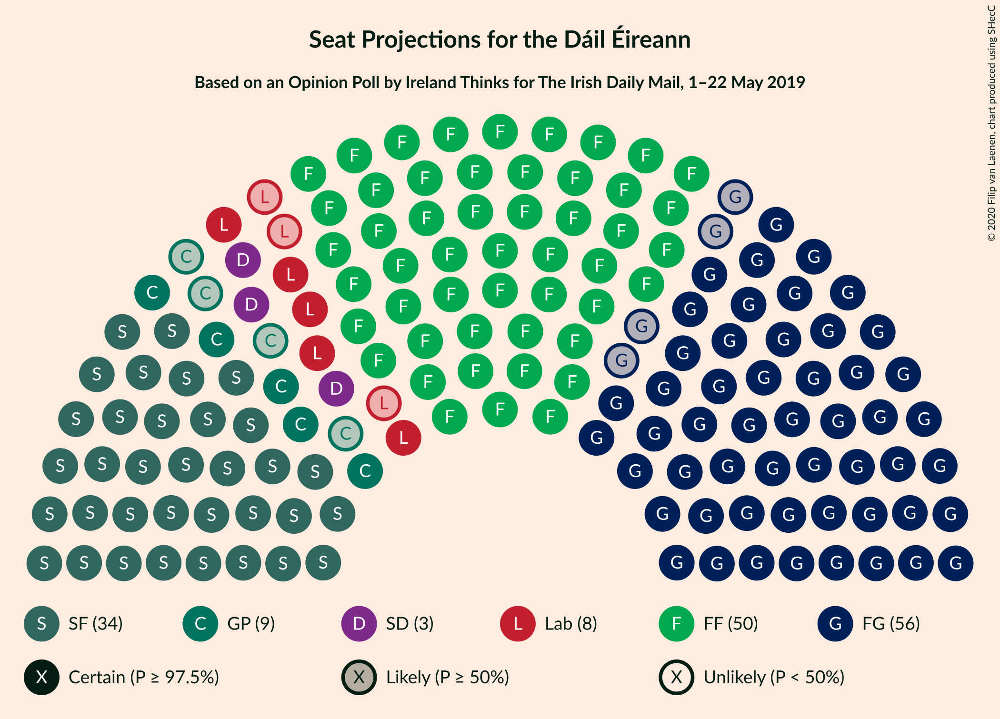
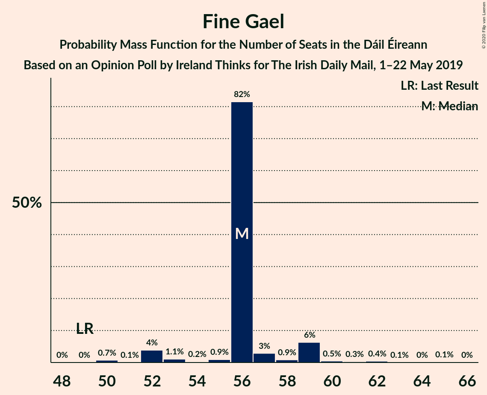
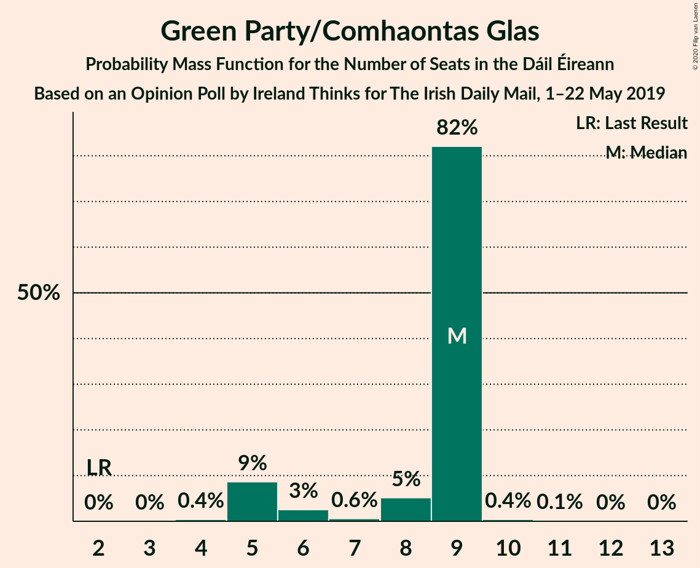
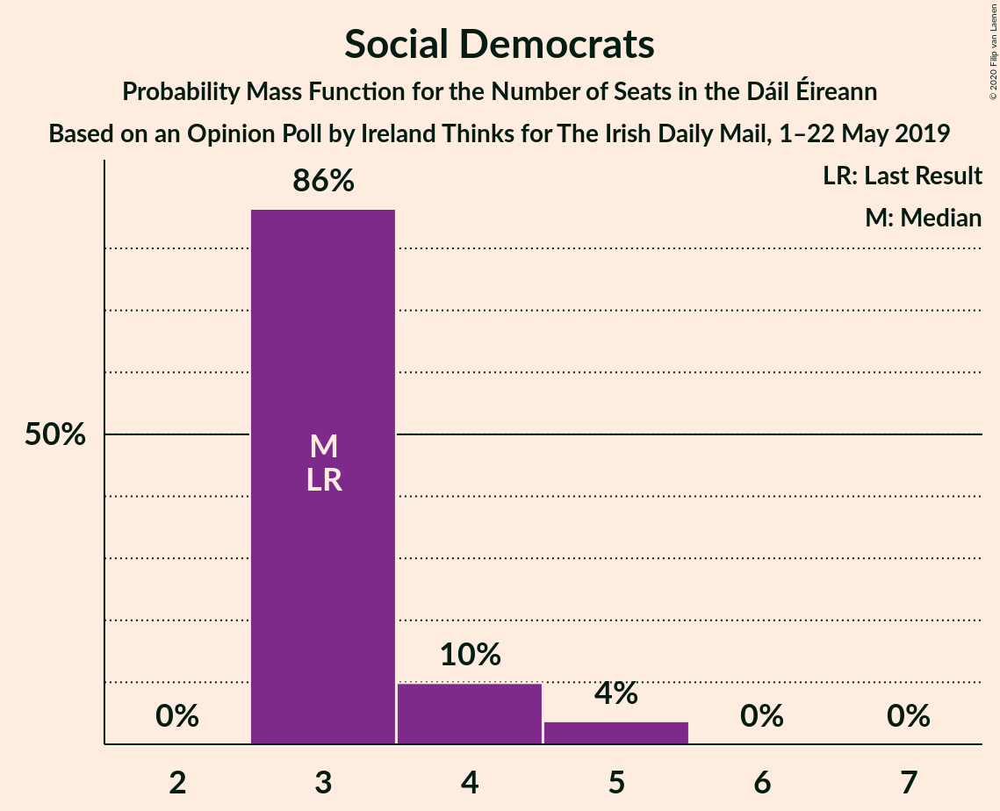
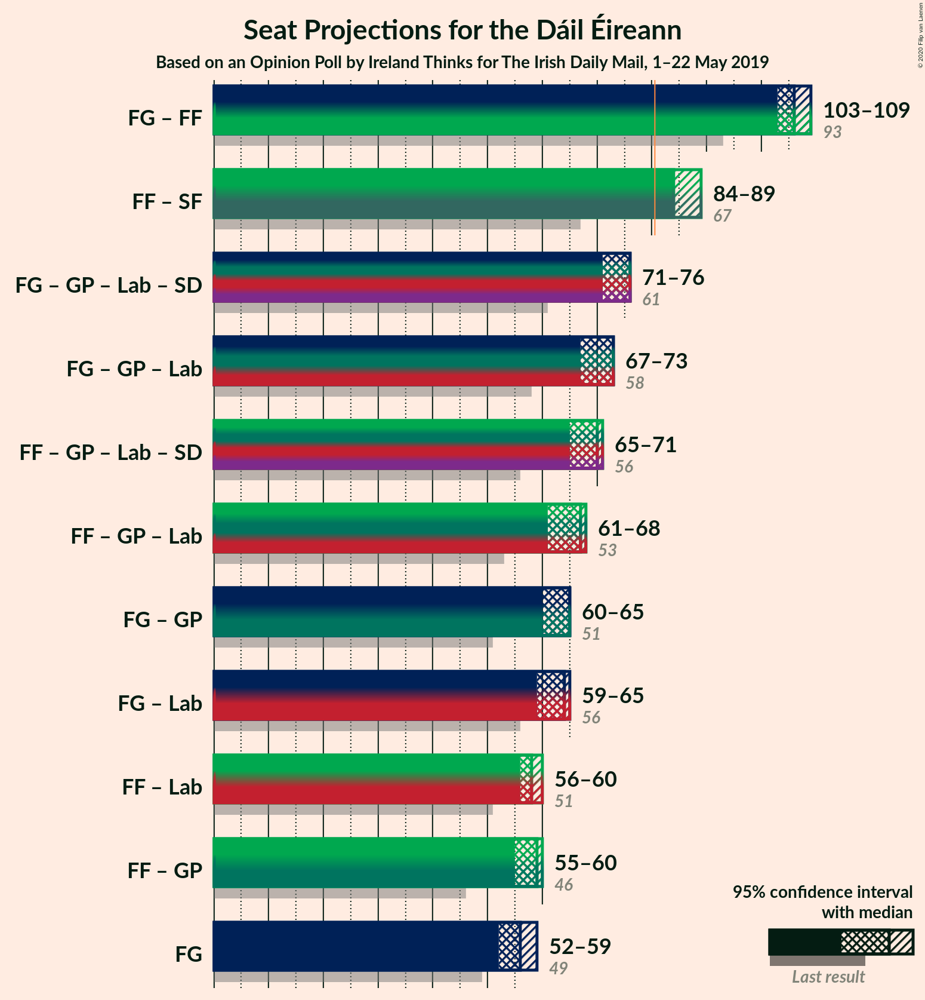
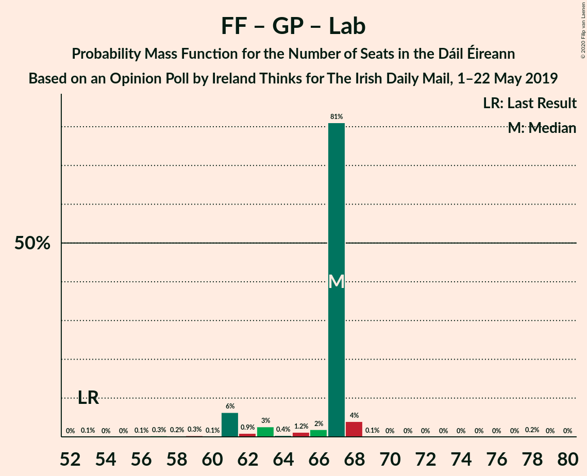

# Opinion Poll by Ireland Thinks for The Irish Daily Mail, 1–22 May 2019

<a href="#voting-intentions">Voting Intentions</a> | <a href="#seats">Seats</a> | <a href="#coalitions">Coalitions</a> | <a href="#technical-information">Technical Information</a>

## Voting Intentions

### Confidence Intervals

| Party | Last Result | Poll Result | 80% Confidence Interval | 90% Confidence Interval | 95% Confidence Interval | 99% Confidence Interval |
|:-----:|:-----------:|:-----------:|:-----------------------:|:-----------------------:|:-----------------------:|:-----------------------:|
| Fine Gael | 25.5% | 28.0% | 26.6–29.5% |26.2–29.9% |25.8–30.3% |25.2–31.0% |
| Fianna Fáil | 24.3% | 25.0% | 23.6–26.4% |23.2–26.8% |22.9–27.2% |22.3–27.9% |
| Sinn Féin | 13.8% | 16.0% | 14.8–17.2% |14.5–17.6% |14.3–17.9% |13.7–18.5% |
| Green Party/Comhaontas Glas | 2.7% | 7.0% | 6.2–7.9% |6.0–8.1% |5.8–8.4% |5.5–8.8% |
| Labour Party | 6.6% | 6.0% | 5.3–6.8% |5.1–7.1% |4.9–7.3% |4.6–7.7% |
| Social Democrats | 3.0% | 3.0% | 2.5–3.7% |2.4–3.8% |2.3–4.0% |2.1–4.3% |
| Solidarity–People Before Profit | 3.9% | 2.0% | 1.6–2.5% |1.5–2.7% |1.4–2.8% |1.3–3.1% |
| Independents 4 Change | 1.5% | -0.1% | 0.0–0.2% |0.0–0.2% |0.0–0.2% |0.0–0.3% |
| Independent | 15.9% | -0.8% | 0.0–0.2% |0.0–0.2% |0.0–0.2% |0.0–0.3% |

*Note:* The poll result column reflects the actual value used in the calculations. Published results may vary slightly, and in addition be rounded to fewer digits.

## Seats

### Confidence Intervals

| Party | Last Result | Median | 80% Confidence Interval | 90% Confidence Interval | 95% Confidence Interval | 99% Confidence Interval |
|:-----:|:-----------:|:------:|:-----------------------:|:-----------------------:|:-----------------------:|:-----------------------:|
| <a href="#fine-gael">Fine Gael</a> | 49 | 56 | 56–57 |53–59 |52–59 |50–62 |
| <a href="#fianna-fáil">Fianna Fáil</a> | 44 | 50 | 50–51 |50–51 |50–53 |43–57 |
| <a href="#sinn-féin">Sinn Féin</a> | 23 | 34 | 34–36 |34–37 |34–37 |30–38 |
| <a href="#green-party/comhaontas-glas">Green Party/Comhaontas Glas</a> | 2 | 9 | 6–9 |5–9 |5–9 |5–10 |
| <a href="#labour-party">Labour Party</a> | 7 | 8 | 6–8 |6–8 |5–9 |3–14 |
| <a href="#social-democrats">Social Democrats</a> | 3 | 3 | 3–4 |3–4 |3–5 |3–5 |
| <a href="#solidarity–people-before-profit">Solidarity–People Before Profit</a> | 6 | 0 | 0 |0 |0–1 |0–2 |
| <a href="#independents-4-change">Independents 4 Change</a> | 4 | 0 | 0 |0 |0 |0 |
| <a href="#independent">Independent</a> | 19 | 0 | 0 |0 |0 |0 |

### Fine Gael

*For a full overview of the results for this party, see the [Fine Gael](party-finegael.html) page.*

| Number of Seats | Probability | Accumulated | Special Marks |
|:---------------:|:-----------:|:-----------:|:-------------:|
| 49 | 0% | 100% | Last Result |
| 50 | 0.7% | 100% |  |
| 51 | 0.1% | 99.2% |  |
| 52 | 4% | 99.2% |  |
| 53 | 1.1% | 95% |  |
| 54 | 0.2% | 94% |  |
| 55 | 0.9% | 94% |  |
| 56 | 82% | 93% | Median |
| 57 | 3% | 12% |  |
| 58 | 0.9% | 9% |  |
| 59 | 6% | 8% |  |
| 60 | 0.5% | 1.4% |  |
| 61 | 0.3% | 1.0% |  |
| 62 | 0.4% | 0.7% |  |
| 63 | 0.1% | 0.2% |  |
| 64 | 0% | 0.2% |  |
| 65 | 0.1% | 0.1% |  |
| 66 | 0% | 0% |  |

### Fianna Fáil

*For a full overview of the results for this party, see the [Fianna Fáil](party-fiannafáil.html) page.*

| Number of Seats | Probability | Accumulated | Special Marks |
|:---------------:|:-----------:|:-----------:|:-------------:|
| 41 | 0% | 100% |  |
| 42 | 0.3% | 99.9% |  |
| 43 | 0.5% | 99.6% |  |
| 44 | 0.4% | 99.2% | Last Result |
| 45 | 0.1% | 98.8% |  |
| 46 | 0.1% | 98.7% |  |
| 47 | 0.1% | 98.5% |  |
| 48 | 0.4% | 98% |  |
| 49 | 0.4% | 98% |  |
| 50 | 88% | 98% | Median |
| 51 | 6% | 10% |  |
| 52 | 0.9% | 4% |  |
| 53 | 1.3% | 3% |  |
| 54 | 0.7% | 1.5% |  |
| 55 | 0.2% | 0.8% |  |
| 56 | 0% | 0.6% |  |
| 57 | 0.5% | 0.6% |  |
| 58 | 0% | 0% |  |

### Sinn Féin

*For a full overview of the results for this party, see the [Sinn Féin](party-sinnféin.html) page.*

| Number of Seats | Probability | Accumulated | Special Marks |
|:---------------:|:-----------:|:-----------:|:-------------:|
| 23 | 0% | 100% | Last Result |
| 24 | 0% | 100% |  |
| 25 | 0% | 100% |  |
| 26 | 0% | 100% |  |
| 27 | 0% | 100% |  |
| 28 | 0.2% | 100% |  |
| 29 | 0.2% | 99.7% |  |
| 30 | 0.1% | 99.5% |  |
| 31 | 0.1% | 99.5% |  |
| 32 | 0.3% | 99.4% |  |
| 33 | 0.6% | 99.1% |  |
| 34 | 82% | 98.5% | Median |
| 35 | 4% | 16% |  |
| 36 | 8% | 13% |  |
| 37 | 4% | 5% |  |
| 38 | 0.7% | 1.2% |  |
| 39 | 0% | 0.5% |  |
| 40 | 0% | 0.4% |  |
| 41 | 0.4% | 0.4% |  |
| 42 | 0% | 0% |  |

### Green Party/Comhaontas Glas

*For a full overview of the results for this party, see the [Green Party/Comhaontas Glas](party-greenpartycomhaontasglas.html) page.*

| Number of Seats | Probability | Accumulated | Special Marks |
|:---------------:|:-----------:|:-----------:|:-------------:|
| 2 | 0% | 100% | Last Result |
| 3 | 0% | 100% |  |
| 4 | 0.4% | 100% |  |
| 5 | 9% | 99.6% |  |
| 6 | 3% | 91% |  |
| 7 | 0.6% | 88% |  |
| 8 | 5% | 88% |  |
| 9 | 82% | 83% | Median |
| 10 | 0.4% | 0.6% |  |
| 11 | 0.1% | 0.1% |  |
| 12 | 0% | 0.1% |  |
| 13 | 0% | 0% |  |

### Labour Party

*For a full overview of the results for this party, see the [Labour Party](party-labourparty.html) page.*

| Number of Seats | Probability | Accumulated | Special Marks |
|:---------------:|:-----------:|:-----------:|:-------------:|
| 2 | 0.1% | 100% |  |
| 3 | 1.0% | 99.9% |  |
| 4 | 0.5% | 98.8% |  |
| 5 | 1.4% | 98% |  |
| 6 | 9% | 97% |  |
| 7 | 0.8% | 88% | Last Result |
| 8 | 82% | 87% | Median |
| 9 | 4% | 5% |  |
| 10 | 0.1% | 1.0% |  |
| 11 | 0.1% | 0.9% |  |
| 12 | 0.2% | 0.9% |  |
| 13 | 0% | 0.6% |  |
| 14 | 0.4% | 0.6% |  |
| 15 | 0% | 0.2% |  |
| 16 | 0% | 0.2% |  |
| 17 | 0.1% | 0.1% |  |
| 18 | 0% | 0% |  |

### Social Democrats

*For a full overview of the results for this party, see the [Social Democrats](party-socialdemocrats.html) page.*

| Number of Seats | Probability | Accumulated | Special Marks |
|:---------------:|:-----------:|:-----------:|:-------------:|
| 3 | 86% | 100% | Last Result, Median |
| 4 | 10% | 14% |  |
| 5 | 4% | 4% |  |
| 6 | 0% | 0.1% |  |
| 7 | 0% | 0% |  |

### Solidarity–People Before Profit

*For a full overview of the results for this party, see the [Solidarity–People Before Profit](party-solidarity–peoplebeforeprofit.html) page.*

| Number of Seats | Probability | Accumulated | Special Marks |
|:---------------:|:-----------:|:-----------:|:-------------:|
| 0 | 96% | 100% | Median |
| 1 | 2% | 4% |  |
| 2 | 2% | 2% |  |
| 3 | 0.1% | 0.1% |  |
| 4 | 0% | 0% |  |
| 5 | 0% | 0% |  |
| 6 | 0% | 0% | Last Result |

### Independents 4 Change

*For a full overview of the results for this party, see the [Independents 4 Change](party-independents4change.html) page.*

| Number of Seats | Probability | Accumulated | Special Marks |
|:---------------:|:-----------:|:-----------:|:-------------:|
| 0 | 100% | 100% | Median |
| 1 | 0% | 0% |  |
| 2 | 0% | 0% |  |
| 3 | 0% | 0% |  |
| 4 | 0% | 0% | Last Result |

### Independent

*For a full overview of the results for this party, see the [Independent](party-independent.html) page.*

| Number of Seats | Probability | Accumulated | Special Marks |
|:---------------:|:-----------:|:-----------:|:-------------:|
| 0 | 100% | 100% | Median |
| 1 | 0% | 0% |  |
| 2 | 0% | 0% |  |
| 3 | 0% | 0% |  |
| 4 | 0% | 0% |  |
| 5 | 0% | 0% |  |
| 6 | 0% | 0% |  |
| 7 | 0% | 0% |  |
| 8 | 0% | 0% |  |
| 9 | 0% | 0% |  |
| 10 | 0% | 0% |  |
| 11 | 0% | 0% |  |
| 12 | 0% | 0% |  |
| 13 | 0% | 0% |  |
| 14 | 0% | 0% |  |
| 15 | 0% | 0% |  |
| 16 | 0% | 0% |  |
| 17 | 0% | 0% |  |
| 18 | 0% | 0% |  |
| 19 | 0% | 0% | Last Result |

## Coalitions

### Confidence Intervals

| Coalition | Last Result | Median | Majority? | 80% Confidence Interval | 90% Confidence Interval | 95% Confidence Interval | 99% Confidence Interval |
|:---------:|:-----------:|:------:|:---------:|:-----------------------:|:-----------------------:|:-----------------------:|:-----------------------:|
| Fine Gael – Fianna Fáil | 93 | 106 | 100% | 106–108 | 103–109 | 103–109 | 100–113 |
| Fianna Fáil – Sinn Féin | 67 | 84 | 99.0% | 84–86 | 84–88 | 84–89 | 77–91 |
| Fine Gael – Green Party/Comhaontas Glas – Labour Party – Social Democrats | 61 | 76 | 0.8% | 74–76 | 72–76 | 71–76 | 69–82 |
| Fine Gael – Green Party/Comhaontas Glas – Labour Party | 58 | 73 | 0% | 69–73 | 69–73 | 67–73 | 65–78 |
| Fianna Fáil – Green Party/Comhaontas Glas – Labour Party – Social Democrats | 56 | 70 | 0.2% | 68–70 | 65–70 | 65–71 | 60–72 |
| Fianna Fáil – Green Party/Comhaontas Glas – Labour Party | 53 | 67 | 0% | 63–67 | 61–67 | 61–68 | 57–68 |
| Fine Gael – Green Party/Comhaontas Glas | 51 | 65 | 0% | 64–65 | 60–65 | 60–65 | 57–69 |
| Fine Gael – Labour Party | 56 | 64 | 0% | 63–64 | 61–65 | 59–65 | 58–71 |
| Fianna Fáil – Labour Party | 51 | 58 | 0% | 57–58 | 56–59 | 56–60 | 51–61 |
| Fianna Fáil – Green Party/Comhaontas Glas | 46 | 59 | 0% | 57–59 | 55–59 | 55–60 | 49–63 |
| Fine Gael | 49 | 56 | 0% | 56–57 | 53–59 | 52–59 | 50–62 |

### Fine Gael – Fianna Fáil

| Number of Seats | Probability | Accumulated | Special Marks |
|:---------------:|:-----------:|:-----------:|:-------------:|
| 93 | 0% | 100% | Last Result |
| 94 | 0% | 100% |  |
| 95 | 0% | 100% |  |
| 96 | 0% | 100% |  |
| 97 | 0% | 100% |  |
| 98 | 0% | 100% |  |
| 99 | 0.1% | 100% |  |
| 100 | 0.5% | 99.8% |  |
| 101 | 0.1% | 99.3% |  |
| 102 | 0.1% | 99.2% |  |
| 103 | 4% | 99.2% |  |
| 104 | 0.1% | 95% |  |
| 105 | 0.5% | 95% |  |
| 106 | 82% | 94% | Median |
| 107 | 0.9% | 12% |  |
| 108 | 3% | 11% |  |
| 109 | 7% | 8% |  |
| 110 | 0.9% | 2% |  |
| 111 | 0.1% | 0.6% |  |
| 112 | 0% | 0.6% |  |
| 113 | 0.4% | 0.5% |  |
| 114 | 0% | 0.1% |  |
| 115 | 0% | 0.1% |  |
| 116 | 0.1% | 0.1% |  |
| 117 | 0% | 0% |  |

### Fianna Fáil – Sinn Féin

| Number of Seats | Probability | Accumulated | Special Marks |
|:---------------:|:-----------:|:-----------:|:-------------:|
| 67 | 0% | 100% | Last Result |
| 68 | 0% | 100% |  |
| 69 | 0% | 100% |  |
| 70 | 0% | 100% |  |
| 71 | 0% | 100% |  |
| 72 | 0% | 100% |  |
| 73 | 0% | 100% |  |
| 74 | 0% | 100% |  |
| 75 | 0% | 100% |  |
| 76 | 0% | 100% |  |
| 77 | 0.8% | 99.9% |  |
| 78 | 0.1% | 99.2% |  |
| 79 | 0.1% | 99.1% |  |
| 80 | 0% | 99.1% |  |
| 81 | 0.2% | 99.0% | Majority |
| 82 | 0.7% | 98.8% |  |
| 83 | 0.4% | 98% |  |
| 84 | 81% | 98% | Median |
| 85 | 0.5% | 17% |  |
| 86 | 9% | 16% |  |
| 87 | 0.4% | 7% |  |
| 88 | 4% | 7% |  |
| 89 | 2% | 3% |  |
| 90 | 0.1% | 0.8% |  |
| 91 | 0.6% | 0.7% |  |
| 92 | 0% | 0.1% |  |
| 93 | 0% | 0% |  |

### Fine Gael – Green Party/Comhaontas Glas – Labour Party – Social Democrats

| Number of Seats | Probability | Accumulated | Special Marks |
|:---------------:|:-----------:|:-----------:|:-------------:|
| 61 | 0% | 100% | Last Result |
| 62 | 0% | 100% |  |
| 63 | 0% | 100% |  |
| 64 | 0% | 100% |  |
| 65 | 0% | 100% |  |
| 66 | 0% | 100% |  |
| 67 | 0% | 100% |  |
| 68 | 0.1% | 100% |  |
| 69 | 1.0% | 99.9% |  |
| 70 | 1.0% | 98.9% |  |
| 71 | 0.9% | 98% |  |
| 72 | 4% | 97% |  |
| 73 | 0.3% | 93% |  |
| 74 | 9% | 92% |  |
| 75 | 0.4% | 83% |  |
| 76 | 81% | 83% | Median |
| 77 | 0.4% | 2% |  |
| 78 | 0.5% | 2% |  |
| 79 | 0.2% | 1.1% |  |
| 80 | 0.1% | 0.9% |  |
| 81 | 0.1% | 0.8% | Majority |
| 82 | 0.7% | 0.8% |  |
| 83 | 0% | 0% |  |

### Fine Gael – Green Party/Comhaontas Glas – Labour Party

| Number of Seats | Probability | Accumulated | Special Marks |
|:---------------:|:-----------:|:-----------:|:-------------:|
| 58 | 0% | 100% | Last Result |
| 59 | 0% | 100% |  |
| 60 | 0% | 100% |  |
| 61 | 0% | 100% |  |
| 62 | 0% | 100% |  |
| 63 | 0% | 100% |  |
| 64 | 0.4% | 99.9% |  |
| 65 | 0.7% | 99.5% |  |
| 66 | 0.9% | 98.8% |  |
| 67 | 0.9% | 98% |  |
| 68 | 0.7% | 97% |  |
| 69 | 7% | 96% |  |
| 70 | 6% | 90% |  |
| 71 | 0.4% | 84% |  |
| 72 | 0.4% | 83% |  |
| 73 | 81% | 83% | Median |
| 74 | 0.1% | 1.5% |  |
| 75 | 0.5% | 1.4% |  |
| 76 | 0.1% | 0.9% |  |
| 77 | 0.1% | 0.8% |  |
| 78 | 0.3% | 0.8% |  |
| 79 | 0.5% | 0.5% |  |
| 80 | 0% | 0% |  |

### Fianna Fáil – Green Party/Comhaontas Glas – Labour Party – Social Democrats

| Number of Seats | Probability | Accumulated | Special Marks |
|:---------------:|:-----------:|:-----------:|:-------------:|
| 56 | 0% | 100% | Last Result |
| 57 | 0% | 100% |  |
| 58 | 0.1% | 100% |  |
| 59 | 0% | 99.9% |  |
| 60 | 0.3% | 99.8% |  |
| 61 | 0% | 99.5% |  |
| 62 | 0% | 99.5% |  |
| 63 | 0.5% | 99.4% |  |
| 64 | 0.1% | 98.9% |  |
| 65 | 7% | 98.8% |  |
| 66 | 0.7% | 92% |  |
| 67 | 0.4% | 92% |  |
| 68 | 3% | 91% |  |
| 69 | 0.7% | 88% |  |
| 70 | 83% | 88% | Median |
| 71 | 4% | 5% |  |
| 72 | 0.4% | 0.8% |  |
| 73 | 0% | 0.4% |  |
| 74 | 0% | 0.4% |  |
| 75 | 0% | 0.3% |  |
| 76 | 0% | 0.3% |  |
| 77 | 0% | 0.3% |  |
| 78 | 0% | 0.3% |  |
| 79 | 0% | 0.3% |  |
| 80 | 0% | 0.2% |  |
| 81 | 0.2% | 0.2% | Majority |
| 82 | 0% | 0% |  |

### Fianna Fáil – Green Party/Comhaontas Glas – Labour Party

| Number of Seats | Probability | Accumulated | Special Marks |
|:---------------:|:-----------:|:-----------:|:-------------:|
| 53 | 0.1% | 100% | Last Result |
| 54 | 0% | 99.9% |  |
| 55 | 0% | 99.8% |  |
| 56 | 0.1% | 99.8% |  |
| 57 | 0.3% | 99.8% |  |
| 58 | 0.2% | 99.5% |  |
| 59 | 0.3% | 99.2% |  |
| 60 | 0.1% | 98.9% |  |
| 61 | 6% | 98.8% |  |
| 62 | 0.9% | 93% |  |
| 63 | 3% | 92% |  |
| 64 | 0.4% | 89% |  |
| 65 | 1.2% | 89% |  |
| 66 | 2% | 87% |  |
| 67 | 81% | 85% | Median |
| 68 | 4% | 4% |  |
| 69 | 0.1% | 0.4% |  |
| 70 | 0% | 0.3% |  |
| 71 | 0% | 0.3% |  |
| 72 | 0% | 0.3% |  |
| 73 | 0% | 0.3% |  |
| 74 | 0% | 0.3% |  |
| 75 | 0% | 0.3% |  |
| 76 | 0% | 0.2% |  |
| 77 | 0% | 0.2% |  |
| 78 | 0.2% | 0.2% |  |
| 79 | 0% | 0% |  |

### Fine Gael – Green Party/Comhaontas Glas

| Number of Seats | Probability | Accumulated | Special Marks |
|:---------------:|:-----------:|:-----------:|:-------------:|
| 51 | 0% | 100% | Last Result |
| 52 | 0% | 100% |  |
| 53 | 0% | 100% |  |
| 54 | 0% | 100% |  |
| 55 | 0% | 100% |  |
| 56 | 0% | 100% |  |
| 57 | 0.6% | 100% |  |
| 58 | 0.2% | 99.3% |  |
| 59 | 0.6% | 99.2% |  |
| 60 | 4% | 98.5% |  |
| 61 | 1.2% | 95% |  |
| 62 | 0.5% | 94% |  |
| 63 | 3% | 93% |  |
| 64 | 7% | 90% |  |
| 65 | 82% | 83% | Median |
| 66 | 0.3% | 1.5% |  |
| 67 | 0.5% | 1.2% |  |
| 68 | 0.2% | 0.7% |  |
| 69 | 0.1% | 0.6% |  |
| 70 | 0.1% | 0.5% |  |
| 71 | 0.3% | 0.3% |  |
| 72 | 0% | 0% |  |

### Fine Gael – Labour Party

| Number of Seats | Probability | Accumulated | Special Marks |
|:---------------:|:-----------:|:-----------:|:-------------:|
| 55 | 0.1% | 100% |  |
| 56 | 0.1% | 99.9% | Last Result |
| 57 | 0% | 99.9% |  |
| 58 | 2% | 99.8% |  |
| 59 | 0.5% | 98% |  |
| 60 | 0.1% | 97% |  |
| 61 | 4% | 97% |  |
| 62 | 0.6% | 93% |  |
| 63 | 3% | 93% |  |
| 64 | 82% | 90% | Median |
| 65 | 6% | 8% |  |
| 66 | 0.2% | 2% |  |
| 67 | 0.1% | 2% |  |
| 68 | 0.4% | 1.5% |  |
| 69 | 0.1% | 1.1% |  |
| 70 | 0.4% | 1.0% |  |
| 71 | 0% | 0.5% |  |
| 72 | 0% | 0.5% |  |
| 73 | 0% | 0.4% |  |
| 74 | 0.4% | 0.4% |  |
| 75 | 0% | 0% |  |

### Fianna Fáil – Labour Party

| Number of Seats | Probability | Accumulated | Special Marks |
|:---------------:|:-----------:|:-----------:|:-------------:|
| 48 | 0.1% | 100% |  |
| 49 | 0.3% | 99.8% |  |
| 50 | 0% | 99.5% |  |
| 51 | 0.1% | 99.5% | Last Result |
| 52 | 0.3% | 99.4% |  |
| 53 | 0.2% | 99.1% |  |
| 54 | 0.1% | 98.9% |  |
| 55 | 0.2% | 98.8% |  |
| 56 | 7% | 98.6% |  |
| 57 | 4% | 92% |  |
| 58 | 83% | 88% | Median |
| 59 | 0.4% | 5% |  |
| 60 | 4% | 5% |  |
| 61 | 0.1% | 0.6% |  |
| 62 | 0% | 0.5% |  |
| 63 | 0.1% | 0.4% |  |
| 64 | 0% | 0.3% |  |
| 65 | 0% | 0.3% |  |
| 66 | 0% | 0.3% |  |
| 67 | 0% | 0.3% |  |
| 68 | 0% | 0.2% |  |
| 69 | 0.2% | 0.2% |  |
| 70 | 0% | 0% |  |

### Fianna Fáil – Green Party/Comhaontas Glas

| Number of Seats | Probability | Accumulated | Special Marks |
|:---------------:|:-----------:|:-----------:|:-------------:|
| 46 | 0% | 100% | Last Result |
| 47 | 0% | 100% |  |
| 48 | 0.4% | 99.9% |  |
| 49 | 0.3% | 99.5% |  |
| 50 | 0.2% | 99.2% |  |
| 51 | 0.1% | 99.0% |  |
| 52 | 0.3% | 98.9% |  |
| 53 | 0.3% | 98.6% |  |
| 54 | 0.1% | 98% |  |
| 55 | 6% | 98% |  |
| 56 | 0.5% | 92% |  |
| 57 | 3% | 92% |  |
| 58 | 0.5% | 88% |  |
| 59 | 85% | 88% | Median |
| 60 | 0.4% | 3% |  |
| 61 | 1.0% | 2% |  |
| 62 | 0.3% | 1.4% |  |
| 63 | 0.7% | 1.1% |  |
| 64 | 0% | 0.4% |  |
| 65 | 0.1% | 0.3% |  |
| 66 | 0.2% | 0.2% |  |
| 67 | 0% | 0% |  |

### Fine Gael

| Number of Seats | Probability | Accumulated | Special Marks |
|:---------------:|:-----------:|:-----------:|:-------------:|
| 49 | 0% | 100% | Last Result |
| 50 | 0.7% | 100% |  |
| 51 | 0.1% | 99.2% |  |
| 52 | 4% | 99.2% |  |
| 53 | 1.1% | 95% |  |
| 54 | 0.2% | 94% |  |
| 55 | 0.9% | 94% |  |
| 56 | 82% | 93% | Median |
| 57 | 3% | 12% |  |
| 58 | 0.9% | 9% |  |
| 59 | 6% | 8% |  |
| 60 | 0.5% | 1.4% |  |
| 61 | 0.3% | 1.0% |  |
| 62 | 0.4% | 0.7% |  |
| 63 | 0.1% | 0.2% |  |
| 64 | 0% | 0.2% |  |
| 65 | 0.1% | 0.1% |  |
| 66 | 0% | 0% |  |

## Technical Information

### Opinion Poll

+ **Polling firm:** Ireland Thinks
+ **Commissioner(s):** The Irish Daily Mail
+ **Fieldwork period:** 1–22 May 2019

### Calculations

+ **Sample size:** 1589
+ **Simulations done:** 131,072
+ **Error estimate:** 1.57%

