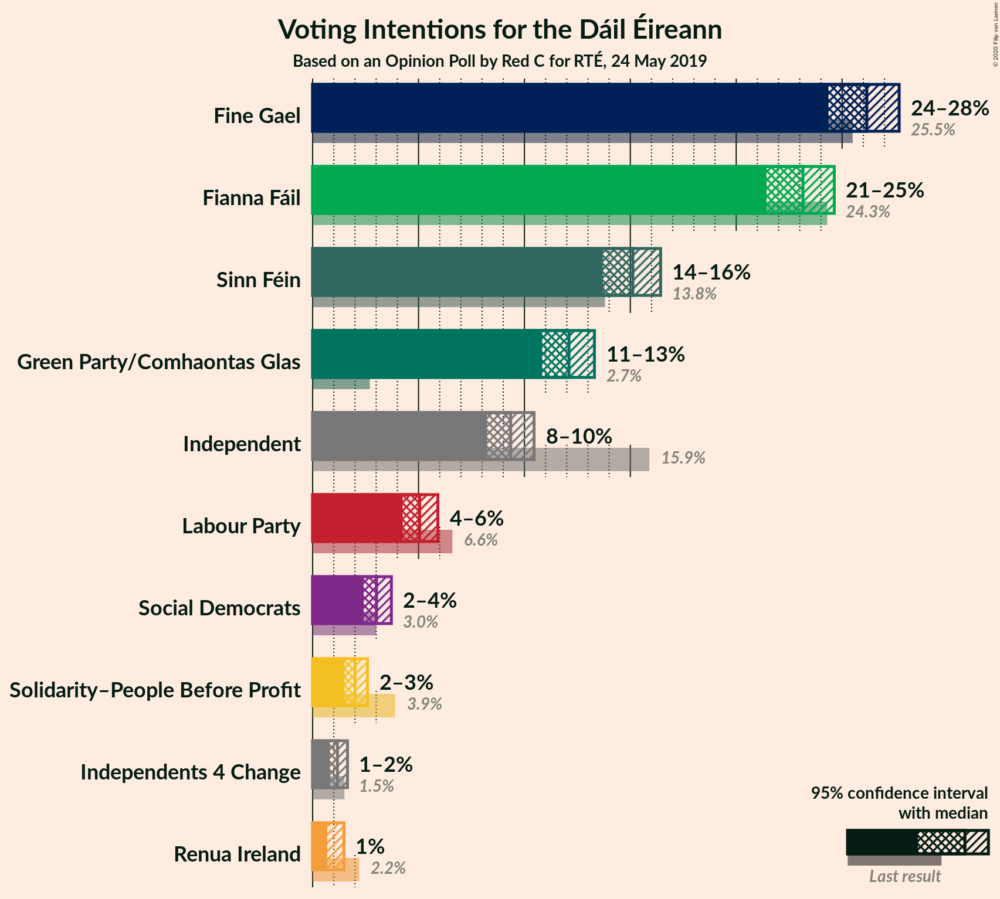
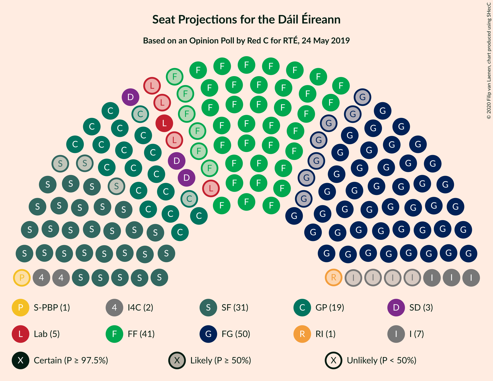
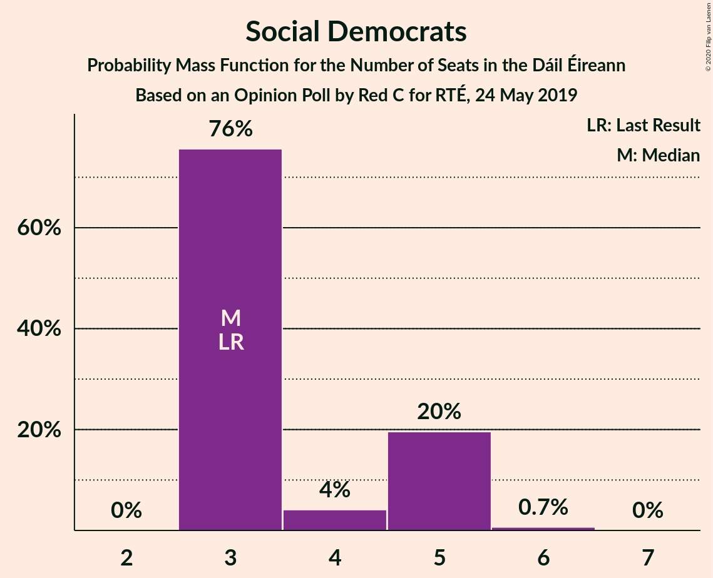
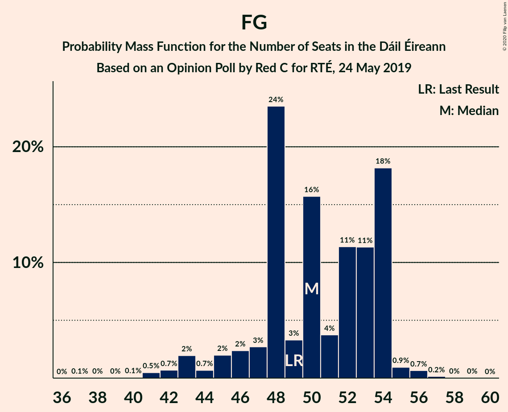

# Opinion Poll by Red C for RTÉ, 24 May 2019

<a href="#voting-intentions">Voting Intentions</a> | <a href="#seats">Seats</a> | <a href="#coalitions">Coalitions</a> | <a href="#technical-information">Technical Information</a>

## Voting Intentions

### Confidence Intervals

| Party | Last Result | Poll Result | 80% Confidence Interval | 90% Confidence Interval | 95% Confidence Interval | 99% Confidence Interval |
|:-----:|:-----------:|:-----------:|:-----------------------:|:-----------------------:|:-----------------------:|:-----------------------:|
| Fine Gael | 25.5% | 26.0% | 24.9–27.1% |24.6–27.4% |24.4–27.7% |23.8–28.2% |
| Fianna Fáil | 24.3% | 23.0% | 22.0–24.1% |21.7–24.4% |21.4–24.6% |20.9–25.1% |
| Sinn Féin | 13.8% | 15.0% | 14.2–15.9% |13.9–16.2% |13.7–16.4% |13.3–16.9% |
| Green Party/Comhaontas Glas | 2.7% | 12.0% | 11.2–12.9% |11.0–13.1% |10.8–13.3% |10.5–13.7% |
| Independent | 15.9% | 9.3% | 8.6–10.0% |8.4–10.3% |8.2–10.5% |7.9–10.8% |
| Labour Party | 6.6% | 5.0% | 4.5–5.6% |4.4–5.8% |4.3–5.9% |4.0–6.2% |
| Social Democrats | 3.0% | 3.0% | 2.6–3.5% |2.5–3.6% |2.4–3.7% |2.2–4.0% |
| Solidarity–People Before Profit | 3.9% | 2.0% | 1.7–2.4% |1.6–2.5% |1.5–2.6% |1.4–2.8% |
| Independents 4 Change | 1.5% | 1.2% | 0.9–1.5% |0.9–1.6% |0.8–1.6% |0.7–1.8% |
| Renua Ireland | 2.2% | 1.0% | 0.8–1.3% |0.7–1.4% |0.7–1.5% |0.6–1.6% |

*Note:* The poll result column reflects the actual value used in the calculations. Published results may vary slightly, and in addition be rounded to fewer digits.

## Seats

### Confidence Intervals

| Party | Last Result | Median | 80% Confidence Interval | 90% Confidence Interval | 95% Confidence Interval | 99% Confidence Interval |
|:-----:|:-----------:|:------:|:-----------------------:|:-----------------------:|:-----------------------:|:-----------------------:|
| <a href="#fine-gael">Fine Gael</a> | 49 | 50 | 47–54 |45–54 |43–54 |41–56 |
| <a href="#fianna-fáil">Fianna Fáil</a> | 44 | 41 | 35–45 |35–45 |35–47 |34–48 |
| <a href="#sinn-féin">Sinn Féin</a> | 23 | 31 | 31–32 |28–33 |28–34 |25–35 |
| <a href="#green-party/comhaontas-glas">Green Party/Comhaontas Glas</a> | 2 | 19 | 17–23 |17–23 |17–23 |17–25 |
| <a href="#independent">Independent</a> | 19 | 7 | 3–9 |3–11 |3–11 |3–14 |
| <a href="#labour-party">Labour Party</a> | 7 | 5 | 3–7 |1–8 |1–9 |1–10 |
| <a href="#social-democrats">Social Democrats</a> | 3 | 3 | 3–5 |3–5 |3–5 |3–6 |
| <a href="#solidarity–people-before-profit">Solidarity–People Before Profit</a> | 6 | 1 | 0–1 |0–1 |0–1 |0–1 |
| <a href="#independents-4-change">Independents 4 Change</a> | 4 | 3 | 2–3 |2–3 |2–3 |2–3 |
| <a href="#renua-ireland">Renua Ireland</a> | 0 | 1 | 0–1 |0–1 |0–1 |0–3 |

### Fine Gael

*For a full overview of the results for this party, see the [Fine Gael](party-finegael.html) page.*

| Number of Seats | Probability | Accumulated | Special Marks |
|:---------------:|:-----------:|:-----------:|:-------------:|
| 37 | 0.1% | 100% |  |
| 38 | 0% | 99.9% |  |
| 39 | 0% | 99.9% |  |
| 40 | 0.1% | 99.9% |  |
| 41 | 0.5% | 99.8% |  |
| 42 | 0.7% | 99.4% |  |
| 43 | 2% | 98.7% |  |
| 44 | 0.7% | 97% |  |
| 45 | 2% | 96% |  |
| 46 | 2% | 94% |  |
| 47 | 3% | 92% |  |
| 48 | 24% | 89% |  |
| 49 | 3% | 65% | Last Result |
| 50 | 16% | 62% | Median |
| 51 | 4% | 46% |  |
| 52 | 11% | 43% |  |
| 53 | 11% | 31% |  |
| 54 | 18% | 20% |  |
| 55 | 0.9% | 2% |  |
| 56 | 0.7% | 0.9% |  |
| 57 | 0.2% | 0.2% |  |
| 58 | 0% | 0.1% |  |
| 59 | 0% | 0% |  |

### Fianna Fáil

*For a full overview of the results for this party, see the [Fianna Fáil](party-fiannafáil.html) page.*

| Number of Seats | Probability | Accumulated | Special Marks |
|:---------------:|:-----------:|:-----------:|:-------------:|
| 32 | 0.4% | 100% |  |
| 33 | 0.1% | 99.6% |  |
| 34 | 0.1% | 99.5% |  |
| 35 | 12% | 99.4% |  |
| 36 | 3% | 88% |  |
| 37 | 15% | 85% |  |
| 38 | 2% | 70% |  |
| 39 | 11% | 68% |  |
| 40 | 7% | 57% |  |
| 41 | 23% | 50% | Median |
| 42 | 2% | 27% |  |
| 43 | 1.3% | 25% |  |
| 44 | 2% | 24% | Last Result |
| 45 | 20% | 22% |  |
| 46 | 0.3% | 3% |  |
| 47 | 1.0% | 3% |  |
| 48 | 1.3% | 1.5% |  |
| 49 | 0% | 0.2% |  |
| 50 | 0.1% | 0.1% |  |
| 51 | 0% | 0.1% |  |
| 52 | 0% | 0% |  |

### Sinn Féin

*For a full overview of the results for this party, see the [Sinn Féin](party-sinnféin.html) page.*

| Number of Seats | Probability | Accumulated | Special Marks |
|:---------------:|:-----------:|:-----------:|:-------------:|
| 23 | 0% | 100% | Last Result |
| 24 | 0.1% | 100% |  |
| 25 | 0.4% | 99.8% |  |
| 26 | 0.4% | 99.5% |  |
| 27 | 0.4% | 99.1% |  |
| 28 | 4% | 98.7% |  |
| 29 | 0.9% | 95% |  |
| 30 | 0.7% | 94% |  |
| 31 | 56% | 93% | Median |
| 32 | 29% | 37% |  |
| 33 | 4% | 8% |  |
| 34 | 3% | 4% |  |
| 35 | 0.5% | 0.5% |  |
| 36 | 0% | 0% |  |

### Green Party/Comhaontas Glas

*For a full overview of the results for this party, see the [Green Party/Comhaontas Glas](party-greenpartycomhaontasglas.html) page.*

| Number of Seats | Probability | Accumulated | Special Marks |
|:---------------:|:-----------:|:-----------:|:-------------:|
| 2 | 0% | 100% | Last Result |
| 3 | 0% | 100% |  |
| 4 | 0% | 100% |  |
| 5 | 0% | 100% |  |
| 6 | 0% | 100% |  |
| 7 | 0% | 100% |  |
| 8 | 0% | 100% |  |
| 9 | 0% | 100% |  |
| 10 | 0% | 100% |  |
| 11 | 0% | 100% |  |
| 12 | 0% | 100% |  |
| 13 | 0% | 100% |  |
| 14 | 0% | 100% |  |
| 15 | 0.1% | 100% |  |
| 16 | 0.1% | 99.9% |  |
| 17 | 24% | 99.8% |  |
| 18 | 14% | 76% |  |
| 19 | 37% | 61% | Median |
| 20 | 2% | 24% |  |
| 21 | 3% | 22% |  |
| 22 | 5% | 20% |  |
| 23 | 13% | 14% |  |
| 24 | 0.4% | 2% |  |
| 25 | 1.0% | 1.4% |  |
| 26 | 0.3% | 0.5% |  |
| 27 | 0.2% | 0.2% |  |
| 28 | 0% | 0% |  |

### Independent

*For a full overview of the results for this party, see the [Independent](party-independent.html) page.*

| Number of Seats | Probability | Accumulated | Special Marks |
|:---------------:|:-----------:|:-----------:|:-------------:|
| 3 | 31% | 100% |  |
| 4 | 1.0% | 69% |  |
| 5 | 0.4% | 68% |  |
| 6 | 5% | 68% |  |
| 7 | 19% | 63% | Median |
| 8 | 24% | 44% |  |
| 9 | 13% | 20% |  |
| 10 | 1.1% | 7% |  |
| 11 | 4% | 6% |  |
| 12 | 1.2% | 2% |  |
| 13 | 0.2% | 0.8% |  |
| 14 | 0.2% | 0.6% |  |
| 15 | 0.1% | 0.4% |  |
| 16 | 0.2% | 0.3% |  |
| 17 | 0% | 0% |  |
| 18 | 0% | 0% |  |
| 19 | 0% | 0% | Last Result |

### Labour Party

*For a full overview of the results for this party, see the [Labour Party](party-labourparty.html) page.*

| Number of Seats | Probability | Accumulated | Special Marks |
|:---------------:|:-----------:|:-----------:|:-------------:|
| 1 | 5% | 100% |  |
| 2 | 4% | 95% |  |
| 3 | 12% | 91% |  |
| 4 | 21% | 79% |  |
| 5 | 37% | 57% | Median |
| 6 | 2% | 20% |  |
| 7 | 13% | 18% | Last Result |
| 8 | 2% | 5% |  |
| 9 | 2% | 3% |  |
| 10 | 0.4% | 0.7% |  |
| 11 | 0.1% | 0.2% |  |
| 12 | 0.1% | 0.1% |  |
| 13 | 0% | 0% |  |

### Social Democrats

*For a full overview of the results for this party, see the [Social Democrats](party-socialdemocrats.html) page.*

| Number of Seats | Probability | Accumulated | Special Marks |
|:---------------:|:-----------:|:-----------:|:-------------:|
| 3 | 76% | 100% | Last Result, Median |
| 4 | 4% | 24% |  |
| 5 | 20% | 20% |  |
| 6 | 0.7% | 0.7% |  |
| 7 | 0% | 0% |  |

### Solidarity–People Before Profit

*For a full overview of the results for this party, see the [Solidarity–People Before Profit](party-solidarity–peoplebeforeprofit.html) page.*

| Number of Seats | Probability | Accumulated | Special Marks |
|:---------------:|:-----------:|:-----------:|:-------------:|
| 0 | 14% | 100% |  |
| 1 | 86% | 86% | Median |
| 2 | 0% | 0% |  |
| 3 | 0% | 0% |  |
| 4 | 0% | 0% |  |
| 5 | 0% | 0% |  |
| 6 | 0% | 0% | Last Result |

### Independents 4 Change

*For a full overview of the results for this party, see the [Independents 4 Change](party-independents4change.html) page.*

| Number of Seats | Probability | Accumulated | Special Marks |
|:---------------:|:-----------:|:-----------:|:-------------:|
| 0 | 0.1% | 100% |  |
| 1 | 0.1% | 99.9% |  |
| 2 | 48% | 99.8% |  |
| 3 | 52% | 52% | Median |
| 4 | 0% | 0% | Last Result |

### Renua Ireland

*For a full overview of the results for this party, see the [Renua Ireland](party-renuaireland.html) page.*

| Number of Seats | Probability | Accumulated | Special Marks |
|:---------------:|:-----------:|:-----------:|:-------------:|
| 0 | 11% | 100% | Last Result |
| 1 | 89% | 89% | Median |
| 2 | 0.3% | 0.8% |  |
| 3 | 0.6% | 0.6% |  |
| 4 | 0% | 0% |  |

## Coalitions

### Confidence Intervals

| Coalition | Last Result | Median | Majority? | 80% Confidence Interval | 90% Confidence Interval | 95% Confidence Interval | 99% Confidence Interval |
|:---------:|:-----------:|:------:|:---------:|:-----------------------:|:-----------------------:|:-----------------------:|:-----------------------:|
| Fine Gael – Fianna Fáil | 93 | 92 | 98.9% | 87–95 | 85–95 | 83–95 | 80–98 |
| Fine Gael – Green Party/Comhaontas Glas – Labour Party – Social Democrats | 61 | 79 | 45% | 72–82 | 71–82 | 71–84 | 67–85 |
| Fine Gael – Green Party/Comhaontas Glas – Labour Party | 58 | 75 | 2% | 69–78 | 68–79 | 67–79 | 64–82 |
| Fianna Fáil – Sinn Féin | 67 | 72 | 0.1% | 67–76 | 67–76 | 65–78 | 64–79 |
| Fine Gael – Green Party/Comhaontas Glas | 51 | 69 | 0% | 65–75 | 64–75 | 63–75 | 60–77 |
| Fianna Fáil – Green Party/Comhaontas Glas – Labour Party – Social Democrats | 56 | 68 | 0% | 64–70 | 64–72 | 64–73 | 63–76 |
| Fianna Fáil – Green Party/Comhaontas Glas – Labour Party | 53 | 64 | 0% | 61–66 | 61–69 | 60–70 | 58–73 |
| Fianna Fáil – Green Party/Comhaontas Glas | 46 | 60 | 0% | 55–62 | 55–64 | 55–65 | 54–70 |
| Fine Gael – Labour Party | 56 | 55 | 0% | 50–59 | 49–59 | 49–59 | 44–62 |
| Fine Gael | 49 | 50 | 0% | 47–54 | 45–54 | 43–54 | 41–56 |
| Fianna Fáil – Labour Party | 51 | 45 | 0% | 38–49 | 38–49 | 38–51 | 38–54 |

### Fine Gael – Fianna Fáil

| Number of Seats | Probability | Accumulated | Special Marks |
|:---------------:|:-----------:|:-----------:|:-------------:|
| 78 | 0% | 100% |  |
| 79 | 0% | 99.9% |  |
| 80 | 1.0% | 99.9% |  |
| 81 | 0.4% | 98.9% | Majority |
| 82 | 0.9% | 98.5% |  |
| 83 | 0.9% | 98% |  |
| 84 | 1.1% | 97% |  |
| 85 | 2% | 96% |  |
| 86 | 3% | 94% |  |
| 87 | 24% | 91% |  |
| 88 | 1.0% | 67% |  |
| 89 | 6% | 66% |  |
| 90 | 5% | 61% |  |
| 91 | 4% | 56% | Median |
| 92 | 11% | 52% |  |
| 93 | 20% | 42% | Last Result |
| 94 | 4% | 22% |  |
| 95 | 16% | 18% |  |
| 96 | 0.7% | 2% |  |
| 97 | 0.4% | 0.9% |  |
| 98 | 0.3% | 0.5% |  |
| 99 | 0.1% | 0.2% |  |
| 100 | 0.1% | 0.1% |  |
| 101 | 0% | 0% |  |

### Fine Gael – Green Party/Comhaontas Glas – Labour Party – Social Democrats

| Number of Seats | Probability | Accumulated | Special Marks |
|:---------------:|:-----------:|:-----------:|:-------------:|
| 61 | 0% | 100% | Last Result |
| 62 | 0% | 100% |  |
| 63 | 0% | 100% |  |
| 64 | 0% | 100% |  |
| 65 | 0% | 100% |  |
| 66 | 0.4% | 100% |  |
| 67 | 0.2% | 99.6% |  |
| 68 | 0.1% | 99.4% |  |
| 69 | 0.1% | 99.3% |  |
| 70 | 1.0% | 99.1% |  |
| 71 | 6% | 98% |  |
| 72 | 18% | 92% |  |
| 73 | 0.7% | 74% |  |
| 74 | 2% | 73% |  |
| 75 | 4% | 71% |  |
| 76 | 2% | 67% |  |
| 77 | 2% | 65% | Median |
| 78 | 11% | 63% |  |
| 79 | 6% | 53% |  |
| 80 | 1.3% | 46% |  |
| 81 | 26% | 45% | Majority |
| 82 | 15% | 19% |  |
| 83 | 0.9% | 4% |  |
| 84 | 2% | 3% |  |
| 85 | 0.4% | 0.9% |  |
| 86 | 0.2% | 0.5% |  |
| 87 | 0.3% | 0.3% |  |
| 88 | 0% | 0% |  |

### Fine Gael – Green Party/Comhaontas Glas – Labour Party

| Number of Seats | Probability | Accumulated | Special Marks |
|:---------------:|:-----------:|:-----------:|:-------------:|
| 58 | 0% | 100% | Last Result |
| 59 | 0% | 100% |  |
| 60 | 0% | 100% |  |
| 61 | 0% | 100% |  |
| 62 | 0% | 100% |  |
| 63 | 0.4% | 100% |  |
| 64 | 0.3% | 99.6% |  |
| 65 | 0.1% | 99.3% |  |
| 66 | 0.1% | 99.2% |  |
| 67 | 3% | 99.1% |  |
| 68 | 5% | 97% |  |
| 69 | 18% | 92% |  |
| 70 | 0.6% | 73% |  |
| 71 | 3% | 73% |  |
| 72 | 4% | 70% |  |
| 73 | 3% | 66% |  |
| 74 | 6% | 64% | Median |
| 75 | 9% | 57% |  |
| 76 | 3% | 48% |  |
| 77 | 13% | 45% |  |
| 78 | 26% | 32% |  |
| 79 | 4% | 6% |  |
| 80 | 0.3% | 2% |  |
| 81 | 1.0% | 2% | Majority |
| 82 | 0.5% | 0.8% |  |
| 83 | 0.1% | 0.3% |  |
| 84 | 0.1% | 0.1% |  |
| 85 | 0% | 0% |  |

### Fianna Fáil – Sinn Féin

| Number of Seats | Probability | Accumulated | Special Marks |
|:---------------:|:-----------:|:-----------:|:-------------:|
| 60 | 0.1% | 100% |  |
| 61 | 0% | 99.9% |  |
| 62 | 0.1% | 99.8% |  |
| 63 | 0.1% | 99.8% |  |
| 64 | 1.1% | 99.6% |  |
| 65 | 3% | 98.5% |  |
| 66 | 0.2% | 95% |  |
| 67 | 12% | 95% | Last Result |
| 68 | 2% | 83% |  |
| 69 | 9% | 81% |  |
| 70 | 11% | 72% |  |
| 71 | 10% | 61% |  |
| 72 | 17% | 51% | Median |
| 73 | 7% | 34% |  |
| 74 | 2% | 26% |  |
| 75 | 2% | 24% |  |
| 76 | 19% | 23% |  |
| 77 | 0.4% | 3% |  |
| 78 | 1.4% | 3% |  |
| 79 | 1.2% | 2% |  |
| 80 | 0.3% | 0.4% |  |
| 81 | 0% | 0.1% | Majority |
| 82 | 0% | 0% |  |

### Fine Gael – Green Party/Comhaontas Glas

| Number of Seats | Probability | Accumulated | Special Marks |
|:---------------:|:-----------:|:-----------:|:-------------:|
| 51 | 0% | 100% | Last Result |
| 52 | 0% | 100% |  |
| 53 | 0% | 100% |  |
| 54 | 0% | 100% |  |
| 55 | 0% | 100% |  |
| 56 | 0% | 100% |  |
| 57 | 0% | 100% |  |
| 58 | 0% | 99.9% |  |
| 59 | 0.1% | 99.9% |  |
| 60 | 0.4% | 99.8% |  |
| 61 | 0.6% | 99.4% |  |
| 62 | 0.3% | 98.7% |  |
| 63 | 2% | 98% |  |
| 64 | 1.2% | 96% |  |
| 65 | 21% | 95% |  |
| 66 | 3% | 74% |  |
| 67 | 7% | 72% |  |
| 68 | 9% | 64% |  |
| 69 | 6% | 55% | Median |
| 70 | 0.8% | 49% |  |
| 71 | 2% | 49% |  |
| 72 | 16% | 47% |  |
| 73 | 16% | 31% |  |
| 74 | 2% | 14% |  |
| 75 | 10% | 12% |  |
| 76 | 0.7% | 2% |  |
| 77 | 0.5% | 0.9% |  |
| 78 | 0.2% | 0.5% |  |
| 79 | 0.1% | 0.2% |  |
| 80 | 0.1% | 0.1% |  |
| 81 | 0% | 0% | Majority |

### Fianna Fáil – Green Party/Comhaontas Glas – Labour Party – Social Democrats

| Number of Seats | Probability | Accumulated | Special Marks |
|:---------------:|:-----------:|:-----------:|:-------------:|
| 56 | 0% | 100% | Last Result |
| 57 | 0% | 100% |  |
| 58 | 0% | 100% |  |
| 59 | 0.1% | 100% |  |
| 60 | 0% | 99.8% |  |
| 61 | 0.1% | 99.8% |  |
| 62 | 0.2% | 99.7% |  |
| 63 | 0.8% | 99.5% |  |
| 64 | 15% | 98.7% |  |
| 65 | 10% | 83% |  |
| 66 | 4% | 73% |  |
| 67 | 4% | 69% |  |
| 68 | 29% | 65% | Median |
| 69 | 25% | 36% |  |
| 70 | 2% | 11% |  |
| 71 | 3% | 8% |  |
| 72 | 2% | 6% |  |
| 73 | 1.3% | 3% |  |
| 74 | 0.4% | 2% |  |
| 75 | 0.9% | 2% |  |
| 76 | 0.5% | 0.8% |  |
| 77 | 0.2% | 0.3% |  |
| 78 | 0.1% | 0.1% |  |
| 79 | 0% | 0% |  |

### Fianna Fáil – Green Party/Comhaontas Glas – Labour Party

| Number of Seats | Probability | Accumulated | Special Marks |
|:---------------:|:-----------:|:-----------:|:-------------:|
| 53 | 0% | 100% | Last Result |
| 54 | 0% | 100% |  |
| 55 | 0% | 100% |  |
| 56 | 0.2% | 99.9% |  |
| 57 | 0.1% | 99.8% |  |
| 58 | 0.3% | 99.7% |  |
| 59 | 1.5% | 99.4% |  |
| 60 | 1.4% | 98% |  |
| 61 | 15% | 97% |  |
| 62 | 10% | 82% |  |
| 63 | 15% | 72% |  |
| 64 | 8% | 56% |  |
| 65 | 17% | 49% | Median |
| 66 | 22% | 31% |  |
| 67 | 2% | 9% |  |
| 68 | 2% | 8% |  |
| 69 | 3% | 6% |  |
| 70 | 0.8% | 3% |  |
| 71 | 0.4% | 2% |  |
| 72 | 0.8% | 2% |  |
| 73 | 0.6% | 0.7% |  |
| 74 | 0.1% | 0.1% |  |
| 75 | 0% | 0.1% |  |
| 76 | 0% | 0% |  |

### Fianna Fáil – Green Party/Comhaontas Glas

| Number of Seats | Probability | Accumulated | Special Marks |
|:---------------:|:-----------:|:-----------:|:-------------:|
| 46 | 0% | 100% | Last Result |
| 47 | 0% | 100% |  |
| 48 | 0% | 100% |  |
| 49 | 0% | 100% |  |
| 50 | 0% | 100% |  |
| 51 | 0.1% | 100% |  |
| 52 | 0.2% | 99.9% |  |
| 53 | 0.1% | 99.7% |  |
| 54 | 1.4% | 99.5% |  |
| 55 | 9% | 98% |  |
| 56 | 1.1% | 89% |  |
| 57 | 3% | 88% |  |
| 58 | 27% | 85% |  |
| 59 | 8% | 58% |  |
| 60 | 23% | 50% | Median |
| 61 | 2% | 28% |  |
| 62 | 19% | 26% |  |
| 63 | 1.4% | 7% |  |
| 64 | 1.5% | 6% |  |
| 65 | 2% | 4% |  |
| 66 | 0.8% | 2% |  |
| 67 | 0.3% | 2% |  |
| 68 | 0.4% | 1.3% |  |
| 69 | 0.2% | 1.0% |  |
| 70 | 0.8% | 0.8% |  |
| 71 | 0% | 0% |  |

### Fine Gael – Labour Party

| Number of Seats | Probability | Accumulated | Special Marks |
|:---------------:|:-----------:|:-----------:|:-------------:|
| 44 | 0.5% | 100% |  |
| 45 | 0.5% | 99.5% |  |
| 46 | 0.5% | 99.0% |  |
| 47 | 0.1% | 98% |  |
| 48 | 0.4% | 98% |  |
| 49 | 4% | 98% |  |
| 50 | 4% | 94% |  |
| 51 | 1.1% | 90% |  |
| 52 | 20% | 88% |  |
| 53 | 5% | 69% |  |
| 54 | 2% | 64% |  |
| 55 | 16% | 62% | Median |
| 56 | 3% | 46% | Last Result |
| 57 | 11% | 43% |  |
| 58 | 12% | 33% |  |
| 59 | 19% | 21% |  |
| 60 | 0.7% | 2% |  |
| 61 | 0.4% | 0.9% |  |
| 62 | 0.4% | 0.5% |  |
| 63 | 0% | 0.1% |  |
| 64 | 0% | 0% |  |

### Fine Gael

| Number of Seats | Probability | Accumulated | Special Marks |
|:---------------:|:-----------:|:-----------:|:-------------:|
| 37 | 0.1% | 100% |  |
| 38 | 0% | 99.9% |  |
| 39 | 0% | 99.9% |  |
| 40 | 0.1% | 99.9% |  |
| 41 | 0.5% | 99.8% |  |
| 42 | 0.7% | 99.4% |  |
| 43 | 2% | 98.7% |  |
| 44 | 0.7% | 97% |  |
| 45 | 2% | 96% |  |
| 46 | 2% | 94% |  |
| 47 | 3% | 92% |  |
| 48 | 24% | 89% |  |
| 49 | 3% | 65% | Last Result |
| 50 | 16% | 62% | Median |
| 51 | 4% | 46% |  |
| 52 | 11% | 43% |  |
| 53 | 11% | 31% |  |
| 54 | 18% | 20% |  |
| 55 | 0.9% | 2% |  |
| 56 | 0.7% | 0.9% |  |
| 57 | 0.2% | 0.2% |  |
| 58 | 0% | 0.1% |  |
| 59 | 0% | 0% |  |

### Fianna Fáil – Labour Party

| Number of Seats | Probability | Accumulated | Special Marks |
|:---------------:|:-----------:|:-----------:|:-------------:|
| 36 | 0.2% | 100% |  |
| 37 | 0.3% | 99.8% |  |
| 38 | 11% | 99.5% |  |
| 39 | 0.9% | 89% |  |
| 40 | 0.5% | 88% |  |
| 41 | 3% | 88% |  |
| 42 | 6% | 84% |  |
| 43 | 2% | 79% |  |
| 44 | 23% | 77% |  |
| 45 | 6% | 54% |  |
| 46 | 20% | 48% | Median |
| 47 | 4% | 28% |  |
| 48 | 1.5% | 24% |  |
| 49 | 18% | 23% |  |
| 50 | 1.4% | 5% |  |
| 51 | 1.2% | 3% | Last Result |
| 52 | 1.3% | 2% |  |
| 53 | 0.1% | 0.6% |  |
| 54 | 0.4% | 0.5% |  |
| 55 | 0.1% | 0.2% |  |
| 56 | 0.1% | 0.1% |  |
| 57 | 0% | 0% |  |

## Technical Information

### Opinion Poll

+ **Polling firm:** Red C
+ **Commissioner(s):** RTÉ
+ **Fieldwork period:** 24 May 2019

### Calculations

+ **Sample size:** 2671
+ **Simulations done:** 524,288
+ **Error estimate:** 1.04%

