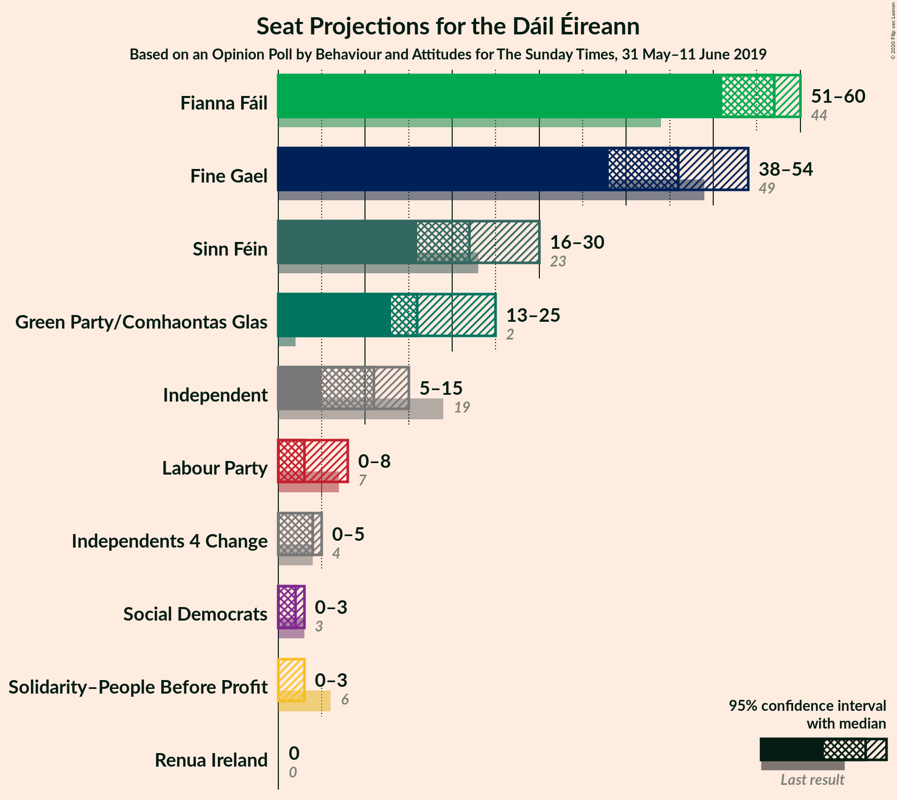
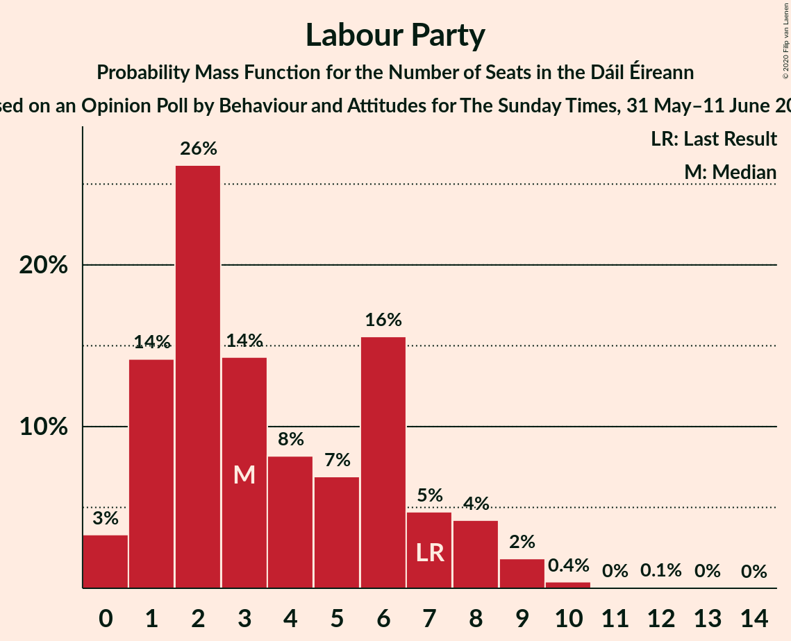
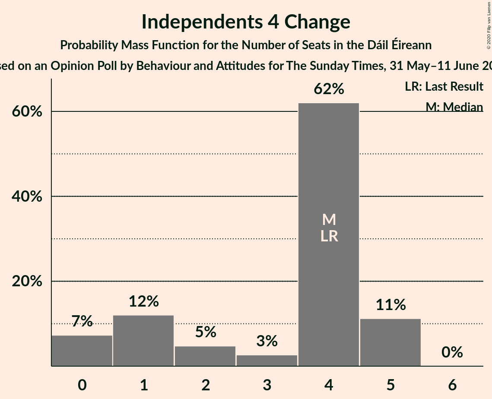
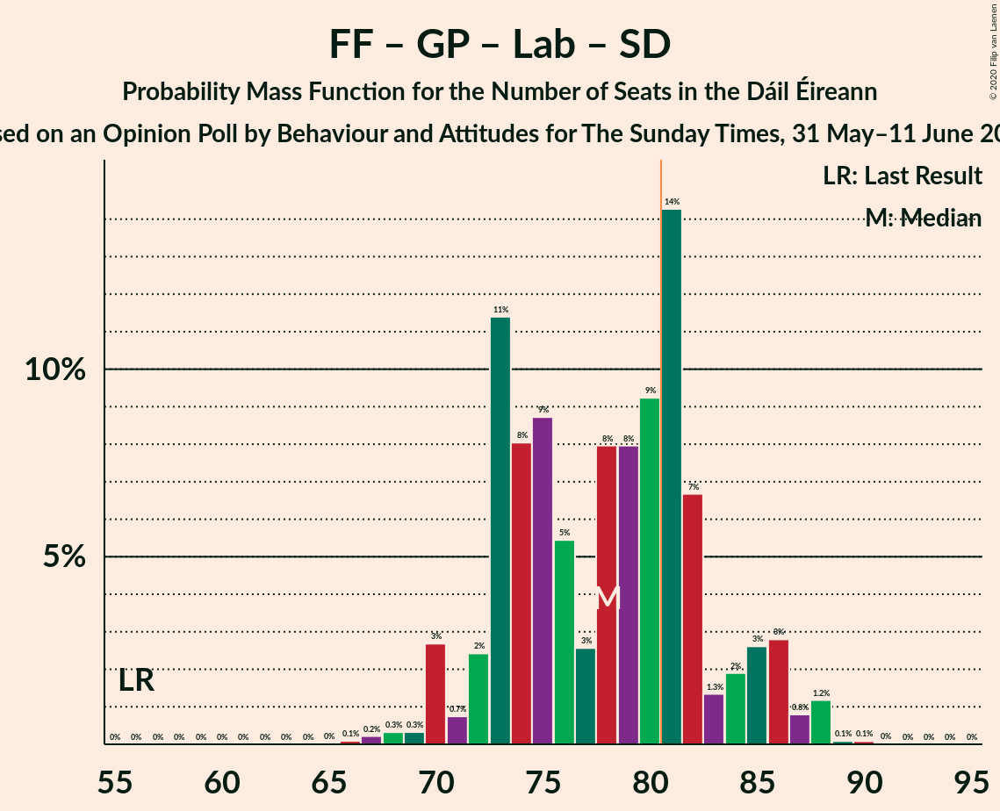

# Opinion Poll by Behaviour and Attitudes for The Sunday Times, 31 May–11 June 2019

<a href="#voting-intentions">Voting Intentions</a> | <a href="#seats">Seats</a> | <a href="#coalitions">Coalitions</a> | <a href="#technical-information">Technical Information</a>

## Voting Intentions

### Confidence Intervals

| Party | Last Result | Poll Result | 80% Confidence Interval | 90% Confidence Interval | 95% Confidence Interval | 99% Confidence Interval |
|:-----:|:-----------:|:-----------:|:-----------------------:|:-----------------------:|:-----------------------:|:-----------------------:|
| Fianna Fáil | 24.3% | 28.3% | 26.5–30.3% |25.9–30.9% |25.5–31.4% |24.6–32.3% |
| Fine Gael | 25.5% | 23.2% | 21.5–25.1% |21.0–25.6% |20.6–26.1% |19.8–27.0% |
| Sinn Féin | 13.8% | 12.1% | 10.8–13.6% |10.4–14.0% |10.1–14.4% |9.5–15.2% |
| Green Party/Comhaontas Glas | 2.7% | 11.1% | 9.9–12.6% |9.5–13.0% |9.2–13.3% |8.7–14.1% |
| Independent | 15.9% | 11.1% | 9.9–12.6% |9.5–13.0% |9.2–13.3% |8.7–14.1% |
| Labour Party | 6.6% | 5.0% | 4.2–6.1% |3.9–6.4% |3.7–6.6% |3.4–7.2% |
| Solidarity–People Before Profit | 3.9% | 2.0% | 1.5–2.7% |1.4–3.0% |1.3–3.1% |1.1–3.5% |
| Independents 4 Change | 1.5% | 1.4% | 1.1–2.1% |0.9–2.3% |0.8–2.5% |0.7–2.8% |
| Social Democrats | 3.0% | 1.0% | 0.7–1.6% |0.6–1.7% |0.5–1.9% |0.4–2.2% |
| Renua Ireland | 2.2% | 1.0% | 0.7–1.6% |0.6–1.7% |0.5–1.9% |0.4–2.2% |

*Note:* The poll result column reflects the actual value used in the calculations. Published results may vary slightly, and in addition be rounded to fewer digits.

## Seats

### Confidence Intervals

| Party | Last Result | Median | 80% Confidence Interval | 90% Confidence Interval | 95% Confidence Interval | 99% Confidence Interval |
|:-----:|:-----------:|:------:|:-----------------------:|:-----------------------:|:-----------------------:|:-----------------------:|
| <a href="#fianna-fáil">Fianna Fáil</a> | 44 | 57 | 53–59 |53–59 |51–60 |47–61 |
| <a href="#fine-gael">Fine Gael</a> | 49 | 46 | 41–50 |40–51 |38–54 |36–56 |
| <a href="#sinn-féin">Sinn Féin</a> | 23 | 22 | 18–28 |16–28 |16–30 |13–31 |
| <a href="#green-party/comhaontas-glas">Green Party/Comhaontas Glas</a> | 2 | 16 | 14–20 |14–23 |13–25 |11–26 |
| <a href="#independent">Independent</a> | 19 | 11 | 6–14 |6–15 |5–15 |3–16 |
| <a href="#labour-party">Labour Party</a> | 7 | 3 | 1–7 |1–8 |0–8 |0–10 |
| <a href="#solidarity–people-before-profit">Solidarity–People Before Profit</a> | 6 | 0 | 0–2 |0–3 |0–3 |0–5 |
| <a href="#independents-4-change">Independents 4 Change</a> | 4 | 4 | 1–5 |0–5 |0–5 |0–5 |
| <a href="#social-democrats">Social Democrats</a> | 3 | 2 | 0–2 |0–3 |0–3 |0–3 |
| <a href="#renua-ireland">Renua Ireland</a> | 0 | 0 | 0 |0 |0 |0–2 |

### Fianna Fáil

*For a full overview of the results for this party, see the [Fianna Fáil](party-fiannafáil.html) page.*

| Number of Seats | Probability | Accumulated | Special Marks |
|:---------------:|:-----------:|:-----------:|:-------------:|
| 44 | 0% | 100% | Last Result |
| 45 | 0.1% | 100% |  |
| 46 | 0.1% | 99.9% |  |
| 47 | 0.4% | 99.8% |  |
| 48 | 0.1% | 99.4% |  |
| 49 | 0.6% | 99.3% |  |
| 50 | 0.6% | 98.7% |  |
| 51 | 0.8% | 98% |  |
| 52 | 2% | 97% |  |
| 53 | 10% | 95% |  |
| 54 | 9% | 85% |  |
| 55 | 12% | 76% |  |
| 56 | 10% | 64% |  |
| 57 | 23% | 54% | Median |
| 58 | 11% | 32% |  |
| 59 | 16% | 20% |  |
| 60 | 3% | 4% |  |
| 61 | 0.7% | 0.7% |  |
| 62 | 0% | 0% |  |

### Fine Gael

*For a full overview of the results for this party, see the [Fine Gael](party-finegael.html) page.*

| Number of Seats | Probability | Accumulated | Special Marks |
|:---------------:|:-----------:|:-----------:|:-------------:|
| 33 | 0% | 100% |  |
| 34 | 0.1% | 99.9% |  |
| 35 | 0.2% | 99.9% |  |
| 36 | 0.2% | 99.7% |  |
| 37 | 1.3% | 99.4% |  |
| 38 | 1.0% | 98% |  |
| 39 | 0.7% | 97% |  |
| 40 | 3% | 96% |  |
| 41 | 4% | 93% |  |
| 42 | 5% | 89% |  |
| 43 | 3% | 84% |  |
| 44 | 8% | 81% |  |
| 45 | 16% | 74% |  |
| 46 | 25% | 58% | Median |
| 47 | 7% | 33% |  |
| 48 | 4% | 26% |  |
| 49 | 7% | 22% | Last Result |
| 50 | 9% | 15% |  |
| 51 | 1.1% | 6% |  |
| 52 | 1.1% | 5% |  |
| 53 | 0.5% | 4% |  |
| 54 | 0.8% | 3% |  |
| 55 | 2% | 2% |  |
| 56 | 0.5% | 0.7% |  |
| 57 | 0.1% | 0.2% |  |
| 58 | 0.1% | 0.1% |  |
| 59 | 0% | 0% |  |

### Sinn Féin

*For a full overview of the results for this party, see the [Sinn Féin](party-sinnféin.html) page.*

| Number of Seats | Probability | Accumulated | Special Marks |
|:---------------:|:-----------:|:-----------:|:-------------:|
| 10 | 0.1% | 100% |  |
| 11 | 0.1% | 99.9% |  |
| 12 | 0.2% | 99.8% |  |
| 13 | 0.2% | 99.6% |  |
| 14 | 0.4% | 99.4% |  |
| 15 | 0.9% | 98.9% |  |
| 16 | 3% | 98% |  |
| 17 | 3% | 95% |  |
| 18 | 6% | 92% |  |
| 19 | 12% | 86% |  |
| 20 | 7% | 74% |  |
| 21 | 8% | 67% |  |
| 22 | 26% | 59% | Median |
| 23 | 9% | 33% | Last Result |
| 24 | 4% | 24% |  |
| 25 | 6% | 20% |  |
| 26 | 2% | 14% |  |
| 27 | 1.2% | 12% |  |
| 28 | 7% | 11% |  |
| 29 | 0.6% | 3% |  |
| 30 | 2% | 3% |  |
| 31 | 0.3% | 0.5% |  |
| 32 | 0.1% | 0.2% |  |
| 33 | 0.1% | 0.1% |  |
| 34 | 0% | 0% |  |

### Green Party/Comhaontas Glas

*For a full overview of the results for this party, see the [Green Party/Comhaontas Glas](party-greenpartycomhaontasglas.html) page.*

| Number of Seats | Probability | Accumulated | Special Marks |
|:---------------:|:-----------:|:-----------:|:-------------:|
| 2 | 0% | 100% | Last Result |
| 3 | 0% | 100% |  |
| 4 | 0% | 100% |  |
| 5 | 0% | 100% |  |
| 6 | 0% | 100% |  |
| 7 | 0% | 100% |  |
| 8 | 0% | 100% |  |
| 9 | 0.1% | 100% |  |
| 10 | 0.3% | 99.9% |  |
| 11 | 0.6% | 99.6% |  |
| 12 | 0.7% | 99.0% |  |
| 13 | 3% | 98% |  |
| 14 | 8% | 96% |  |
| 15 | 13% | 88% |  |
| 16 | 30% | 75% | Median |
| 17 | 15% | 45% |  |
| 18 | 12% | 30% |  |
| 19 | 2% | 18% |  |
| 20 | 7% | 16% |  |
| 21 | 2% | 9% |  |
| 22 | 2% | 7% |  |
| 23 | 1.0% | 6% |  |
| 24 | 2% | 5% |  |
| 25 | 2% | 3% |  |
| 26 | 0.9% | 1.1% |  |
| 27 | 0.2% | 0.3% |  |
| 28 | 0% | 0% |  |

### Independent

*For a full overview of the results for this party, see the [Independent](party-independent.html) page.*

| Number of Seats | Probability | Accumulated | Special Marks |
|:---------------:|:-----------:|:-----------:|:-------------:|
| 3 | 0.8% | 100% |  |
| 4 | 0.2% | 99.2% |  |
| 5 | 3% | 99.0% |  |
| 6 | 13% | 96% |  |
| 7 | 11% | 84% |  |
| 8 | 2% | 72% |  |
| 9 | 4% | 70% |  |
| 10 | 13% | 66% |  |
| 11 | 7% | 53% | Median |
| 12 | 18% | 46% |  |
| 13 | 12% | 28% |  |
| 14 | 8% | 16% |  |
| 15 | 6% | 8% |  |
| 16 | 2% | 2% |  |
| 17 | 0% | 0% |  |
| 18 | 0% | 0% |  |
| 19 | 0% | 0% | Last Result |

### Labour Party

*For a full overview of the results for this party, see the [Labour Party](party-labourparty.html) page.*

| Number of Seats | Probability | Accumulated | Special Marks |
|:---------------:|:-----------:|:-----------:|:-------------:|
| 0 | 3% | 100% |  |
| 1 | 14% | 97% |  |
| 2 | 26% | 83% |  |
| 3 | 14% | 56% | Median |
| 4 | 8% | 42% |  |
| 5 | 7% | 34% |  |
| 6 | 16% | 27% |  |
| 7 | 5% | 11% | Last Result |
| 8 | 4% | 7% |  |
| 9 | 2% | 2% |  |
| 10 | 0.4% | 0.6% |  |
| 11 | 0% | 0.2% |  |
| 12 | 0.1% | 0.1% |  |
| 13 | 0% | 0.1% |  |
| 14 | 0% | 0% |  |

### Solidarity–People Before Profit

*For a full overview of the results for this party, see the [Solidarity–People Before Profit](party-solidarity–peoplebeforeprofit.html) page.*

| Number of Seats | Probability | Accumulated | Special Marks |
|:---------------:|:-----------:|:-----------:|:-------------:|
| 0 | 76% | 100% | Median |
| 1 | 10% | 24% |  |
| 2 | 4% | 14% |  |
| 3 | 7% | 10% |  |
| 4 | 0.9% | 2% |  |
| 5 | 1.5% | 2% |  |
| 6 | 0.1% | 0.1% | Last Result |
| 7 | 0% | 0% |  |

### Independents 4 Change

*For a full overview of the results for this party, see the [Independents 4 Change](party-independents4change.html) page.*

| Number of Seats | Probability | Accumulated | Special Marks |
|:---------------:|:-----------:|:-----------:|:-------------:|
| 0 | 7% | 100% |  |
| 1 | 12% | 93% |  |
| 2 | 5% | 81% |  |
| 3 | 3% | 76% |  |
| 4 | 62% | 73% | Last Result, Median |
| 5 | 11% | 11% |  |
| 6 | 0% | 0% |  |

### Social Democrats

*For a full overview of the results for this party, see the [Social Democrats](party-socialdemocrats.html) page.*

| Number of Seats | Probability | Accumulated | Special Marks |
|:---------------:|:-----------:|:-----------:|:-------------:|
| 0 | 41% | 100% |  |
| 1 | 8% | 59% |  |
| 2 | 43% | 51% | Median |
| 3 | 8% | 8% | Last Result |
| 4 | 0% | 0% |  |

### Renua Ireland

*For a full overview of the results for this party, see the [Renua Ireland](party-renuaireland.html) page.*

| Number of Seats | Probability | Accumulated | Special Marks |
|:---------------:|:-----------:|:-----------:|:-------------:|
| 0 | 98% | 100% | Last Result, Median |
| 1 | 0.9% | 2% |  |
| 2 | 1.0% | 1.1% |  |
| 3 | 0% | 0% |  |

## Coalitions

### Confidence Intervals

| Coalition | Last Result | Median | Majority? | 80% Confidence Interval | 90% Confidence Interval | 95% Confidence Interval | 99% Confidence Interval |
|:---------:|:-----------:|:------:|:---------:|:-----------------------:|:-----------------------:|:-----------------------:|:-----------------------:|
| Fianna Fáil – Fine Gael | 93 | 103 | 100% | 96–108 | 94–109 | 93–111 | 88–113 |
| Fianna Fáil – Green Party/Comhaontas Glas – Labour Party – Social Democrats | 56 | 78 | 32% | 73–83 | 72–85 | 70–86 | 68–88 |
| Fianna Fáil – Green Party/Comhaontas Glas – Labour Party | 53 | 77 | 19% | 71–82 | 70–84 | 68–85 | 66–88 |
| Fianna Fáil – Sinn Féin | 67 | 79 | 28% | 74–81 | 72–83 | 71–84 | 68–87 |
| Fianna Fáil – Green Party/Comhaontas Glas | 46 | 73 | 3% | 69–78 | 68–79 | 67–81 | 64–83 |
| Fine Gael – Green Party/Comhaontas Glas – Labour Party – Social Democrats | 61 | 68 | 0.1% | 63–72 | 62–73 | 59–74 | 58–77 |
| Fine Gael – Green Party/Comhaontas Glas – Labour Party | 58 | 67 | 0.1% | 61–71 | 60–72 | 59–73 | 56–77 |
| Fine Gael – Green Party/Comhaontas Glas | 51 | 62 | 0% | 59–67 | 58–69 | 56–71 | 53–73 |
| Fianna Fáil – Labour Party | 51 | 60 | 0% | 55–64 | 55–65 | 54–66 | 51–68 |
| Fine Gael – Labour Party | 56 | 50 | 0% | 44–54 | 43–55 | 41–56 | 38–58 |
| Fine Gael | 49 | 46 | 0% | 41–50 | 40–51 | 38–54 | 36–56 |

### Fianna Fáil – Fine Gael

| Number of Seats | Probability | Accumulated | Special Marks |
|:---------------:|:-----------:|:-----------:|:-------------:|
| 85 | 0% | 100% |  |
| 86 | 0.2% | 99.9% |  |
| 87 | 0.1% | 99.8% |  |
| 88 | 0.2% | 99.7% |  |
| 89 | 0.2% | 99.5% |  |
| 90 | 0.3% | 99.3% |  |
| 91 | 0.4% | 99.0% |  |
| 92 | 0.9% | 98.7% |  |
| 93 | 1.1% | 98% | Last Result |
| 94 | 4% | 97% |  |
| 95 | 2% | 93% |  |
| 96 | 3% | 91% |  |
| 97 | 1.4% | 88% |  |
| 98 | 9% | 87% |  |
| 99 | 8% | 78% |  |
| 100 | 5% | 70% |  |
| 101 | 4% | 65% |  |
| 102 | 6% | 61% |  |
| 103 | 10% | 54% | Median |
| 104 | 17% | 45% |  |
| 105 | 8% | 28% |  |
| 106 | 8% | 19% |  |
| 107 | 1.0% | 11% |  |
| 108 | 0.6% | 10% |  |
| 109 | 7% | 10% |  |
| 110 | 0.2% | 3% |  |
| 111 | 0.8% | 3% |  |
| 112 | 2% | 2% |  |
| 113 | 0.4% | 0.5% |  |
| 114 | 0% | 0.2% |  |
| 115 | 0.1% | 0.1% |  |
| 116 | 0% | 0% |  |

### Fianna Fáil – Green Party/Comhaontas Glas – Labour Party – Social Democrats

| Number of Seats | Probability | Accumulated | Special Marks |
|:---------------:|:-----------:|:-----------:|:-------------:|
| 56 | 0% | 100% | Last Result |
| 57 | 0% | 100% |  |
| 58 | 0% | 100% |  |
| 59 | 0% | 100% |  |
| 60 | 0% | 100% |  |
| 61 | 0% | 100% |  |
| 62 | 0% | 100% |  |
| 63 | 0% | 100% |  |
| 64 | 0% | 100% |  |
| 65 | 0% | 100% |  |
| 66 | 0.1% | 100% |  |
| 67 | 0.2% | 99.9% |  |
| 68 | 0.3% | 99.6% |  |
| 69 | 0.3% | 99.3% |  |
| 70 | 3% | 99.0% |  |
| 71 | 0.7% | 96% |  |
| 72 | 2% | 96% |  |
| 73 | 11% | 93% |  |
| 74 | 8% | 82% |  |
| 75 | 9% | 74% |  |
| 76 | 5% | 65% |  |
| 77 | 3% | 60% |  |
| 78 | 8% | 57% | Median |
| 79 | 8% | 49% |  |
| 80 | 9% | 41% |  |
| 81 | 14% | 32% | Majority |
| 82 | 7% | 18% |  |
| 83 | 1.3% | 11% |  |
| 84 | 2% | 9% |  |
| 85 | 3% | 8% |  |
| 86 | 3% | 5% |  |
| 87 | 0.8% | 2% |  |
| 88 | 1.2% | 1.4% |  |
| 89 | 0.1% | 0.2% |  |
| 90 | 0.1% | 0.1% |  |
| 91 | 0% | 0% |  |

### Fianna Fáil – Green Party/Comhaontas Glas – Labour Party

| Number of Seats | Probability | Accumulated | Special Marks |
|:---------------:|:-----------:|:-----------:|:-------------:|
| 53 | 0% | 100% | Last Result |
| 54 | 0% | 100% |  |
| 55 | 0% | 100% |  |
| 56 | 0% | 100% |  |
| 57 | 0% | 100% |  |
| 58 | 0% | 100% |  |
| 59 | 0% | 100% |  |
| 60 | 0% | 100% |  |
| 61 | 0% | 100% |  |
| 62 | 0% | 100% |  |
| 63 | 0% | 100% |  |
| 64 | 0% | 100% |  |
| 65 | 0.3% | 100% |  |
| 66 | 0.1% | 99.6% |  |
| 67 | 0.3% | 99.5% |  |
| 68 | 2% | 99.2% |  |
| 69 | 1.1% | 97% |  |
| 70 | 1.5% | 96% |  |
| 71 | 7% | 94% |  |
| 72 | 1.2% | 87% |  |
| 73 | 11% | 86% |  |
| 74 | 10% | 75% |  |
| 75 | 4% | 65% |  |
| 76 | 6% | 61% | Median |
| 77 | 8% | 55% |  |
| 78 | 9% | 47% |  |
| 79 | 16% | 38% |  |
| 80 | 4% | 22% |  |
| 81 | 3% | 19% | Majority |
| 82 | 7% | 15% |  |
| 83 | 2% | 8% |  |
| 84 | 3% | 6% |  |
| 85 | 1.1% | 3% |  |
| 86 | 0.7% | 2% |  |
| 87 | 0.6% | 1.2% |  |
| 88 | 0.5% | 0.6% |  |
| 89 | 0% | 0.1% |  |
| 90 | 0% | 0% |  |

### Fianna Fáil – Sinn Féin

| Number of Seats | Probability | Accumulated | Special Marks |
|:---------------:|:-----------:|:-----------:|:-------------:|
| 63 | 0% | 100% |  |
| 64 | 0% | 99.9% |  |
| 65 | 0.1% | 99.9% |  |
| 66 | 0.2% | 99.9% |  |
| 67 | 0.1% | 99.7% | Last Result |
| 68 | 0.2% | 99.6% |  |
| 69 | 0.6% | 99.4% |  |
| 70 | 1.0% | 98.8% |  |
| 71 | 1.3% | 98% |  |
| 72 | 2% | 97% |  |
| 73 | 4% | 95% |  |
| 74 | 8% | 91% |  |
| 75 | 4% | 82% |  |
| 76 | 12% | 78% |  |
| 77 | 4% | 66% |  |
| 78 | 10% | 62% |  |
| 79 | 9% | 52% | Median |
| 80 | 16% | 43% |  |
| 81 | 18% | 28% | Majority |
| 82 | 2% | 10% |  |
| 83 | 4% | 8% |  |
| 84 | 2% | 4% |  |
| 85 | 0.7% | 2% |  |
| 86 | 0.3% | 0.9% |  |
| 87 | 0.1% | 0.5% |  |
| 88 | 0.1% | 0.4% |  |
| 89 | 0.1% | 0.3% |  |
| 90 | 0.2% | 0.2% |  |
| 91 | 0% | 0% |  |

### Fianna Fáil – Green Party/Comhaontas Glas

| Number of Seats | Probability | Accumulated | Special Marks |
|:---------------:|:-----------:|:-----------:|:-------------:|
| 46 | 0% | 100% | Last Result |
| 47 | 0% | 100% |  |
| 48 | 0% | 100% |  |
| 49 | 0% | 100% |  |
| 50 | 0% | 100% |  |
| 51 | 0% | 100% |  |
| 52 | 0% | 100% |  |
| 53 | 0% | 100% |  |
| 54 | 0% | 100% |  |
| 55 | 0% | 100% |  |
| 56 | 0% | 100% |  |
| 57 | 0% | 100% |  |
| 58 | 0% | 100% |  |
| 59 | 0% | 100% |  |
| 60 | 0% | 100% |  |
| 61 | 0.1% | 100% |  |
| 62 | 0.1% | 99.9% |  |
| 63 | 0.3% | 99.8% |  |
| 64 | 0.4% | 99.5% |  |
| 65 | 0.2% | 99.1% |  |
| 66 | 1.2% | 98.9% |  |
| 67 | 2% | 98% |  |
| 68 | 3% | 96% |  |
| 69 | 9% | 93% |  |
| 70 | 4% | 83% |  |
| 71 | 10% | 80% |  |
| 72 | 7% | 69% |  |
| 73 | 26% | 62% | Median |
| 74 | 5% | 36% |  |
| 75 | 7% | 31% |  |
| 76 | 4% | 24% |  |
| 77 | 9% | 20% |  |
| 78 | 3% | 11% |  |
| 79 | 3% | 8% |  |
| 80 | 2% | 5% |  |
| 81 | 2% | 3% | Majority |
| 82 | 0.4% | 2% |  |
| 83 | 0.9% | 1.2% |  |
| 84 | 0.1% | 0.3% |  |
| 85 | 0.2% | 0.2% |  |
| 86 | 0% | 0% |  |

### Fine Gael – Green Party/Comhaontas Glas – Labour Party – Social Democrats

| Number of Seats | Probability | Accumulated | Special Marks |
|:---------------:|:-----------:|:-----------:|:-------------:|
| 55 | 0% | 100% |  |
| 56 | 0.2% | 99.9% |  |
| 57 | 0% | 99.8% |  |
| 58 | 0.9% | 99.7% |  |
| 59 | 2% | 98.9% |  |
| 60 | 0.6% | 97% |  |
| 61 | 0.9% | 96% | Last Result |
| 62 | 1.4% | 96% |  |
| 63 | 6% | 94% |  |
| 64 | 6% | 88% |  |
| 65 | 10% | 82% |  |
| 66 | 11% | 72% |  |
| 67 | 2% | 61% | Median |
| 68 | 14% | 59% |  |
| 69 | 24% | 45% |  |
| 70 | 4% | 21% |  |
| 71 | 3% | 17% |  |
| 72 | 5% | 15% |  |
| 73 | 7% | 10% |  |
| 74 | 2% | 3% |  |
| 75 | 0.5% | 1.5% |  |
| 76 | 0.3% | 1.0% |  |
| 77 | 0.3% | 0.7% |  |
| 78 | 0.2% | 0.5% |  |
| 79 | 0% | 0.3% |  |
| 80 | 0.1% | 0.2% |  |
| 81 | 0% | 0.1% | Majority |
| 82 | 0% | 0.1% |  |
| 83 | 0% | 0% |  |

### Fine Gael – Green Party/Comhaontas Glas – Labour Party

| Number of Seats | Probability | Accumulated | Special Marks |
|:---------------:|:-----------:|:-----------:|:-------------:|
| 54 | 0% | 100% |  |
| 55 | 0.1% | 99.9% |  |
| 56 | 0.9% | 99.8% |  |
| 57 | 0.5% | 98.9% |  |
| 58 | 0.3% | 98% | Last Result |
| 59 | 2% | 98% |  |
| 60 | 1.4% | 96% |  |
| 61 | 6% | 95% |  |
| 62 | 2% | 89% |  |
| 63 | 8% | 87% |  |
| 64 | 9% | 78% |  |
| 65 | 5% | 70% | Median |
| 66 | 15% | 65% |  |
| 67 | 15% | 50% |  |
| 68 | 4% | 36% |  |
| 69 | 13% | 31% |  |
| 70 | 5% | 19% |  |
| 71 | 7% | 14% |  |
| 72 | 3% | 7% |  |
| 73 | 2% | 4% |  |
| 74 | 1.0% | 2% |  |
| 75 | 0.4% | 1.1% |  |
| 76 | 0.1% | 0.6% |  |
| 77 | 0.2% | 0.5% |  |
| 78 | 0.2% | 0.3% |  |
| 79 | 0% | 0.1% |  |
| 80 | 0% | 0.1% |  |
| 81 | 0% | 0.1% | Majority |
| 82 | 0% | 0.1% |  |
| 83 | 0% | 0% |  |

### Fine Gael – Green Party/Comhaontas Glas

| Number of Seats | Probability | Accumulated | Special Marks |
|:---------------:|:-----------:|:-----------:|:-------------:|
| 50 | 0% | 100% |  |
| 51 | 0% | 99.9% | Last Result |
| 52 | 0.3% | 99.9% |  |
| 53 | 0.3% | 99.6% |  |
| 54 | 0.7% | 99.3% |  |
| 55 | 0.8% | 98.6% |  |
| 56 | 0.8% | 98% |  |
| 57 | 0.8% | 97% |  |
| 58 | 4% | 96% |  |
| 59 | 9% | 92% |  |
| 60 | 4% | 83% |  |
| 61 | 20% | 79% |  |
| 62 | 10% | 59% | Median |
| 63 | 8% | 48% |  |
| 64 | 8% | 40% |  |
| 65 | 9% | 32% |  |
| 66 | 11% | 24% |  |
| 67 | 5% | 12% |  |
| 68 | 2% | 7% |  |
| 69 | 1.2% | 5% |  |
| 70 | 1.1% | 4% |  |
| 71 | 2% | 3% |  |
| 72 | 0.2% | 1.0% |  |
| 73 | 0.5% | 0.8% |  |
| 74 | 0.1% | 0.3% |  |
| 75 | 0.1% | 0.2% |  |
| 76 | 0.1% | 0.1% |  |
| 77 | 0% | 0.1% |  |
| 78 | 0% | 0.1% |  |
| 79 | 0% | 0.1% |  |
| 80 | 0% | 0% |  |

### Fianna Fáil – Labour Party

| Number of Seats | Probability | Accumulated | Special Marks |
|:---------------:|:-----------:|:-----------:|:-------------:|
| 47 | 0.1% | 100% |  |
| 48 | 0% | 99.9% |  |
| 49 | 0.1% | 99.9% |  |
| 50 | 0.1% | 99.8% |  |
| 51 | 0.2% | 99.7% | Last Result |
| 52 | 0.4% | 99.5% |  |
| 53 | 0.8% | 99.1% |  |
| 54 | 3% | 98% |  |
| 55 | 11% | 96% |  |
| 56 | 6% | 85% |  |
| 57 | 6% | 79% |  |
| 58 | 11% | 73% |  |
| 59 | 11% | 62% |  |
| 60 | 4% | 51% | Median |
| 61 | 9% | 47% |  |
| 62 | 11% | 37% |  |
| 63 | 8% | 27% |  |
| 64 | 13% | 19% |  |
| 65 | 1.4% | 6% |  |
| 66 | 3% | 5% |  |
| 67 | 0.9% | 2% |  |
| 68 | 0.6% | 0.7% |  |
| 69 | 0.1% | 0.2% |  |
| 70 | 0% | 0% |  |

### Fine Gael – Labour Party

| Number of Seats | Probability | Accumulated | Special Marks |
|:---------------:|:-----------:|:-----------:|:-------------:|
| 35 | 0% | 100% |  |
| 36 | 0.1% | 99.9% |  |
| 37 | 0.3% | 99.9% |  |
| 38 | 0.4% | 99.6% |  |
| 39 | 0.4% | 99.2% |  |
| 40 | 0.7% | 98.8% |  |
| 41 | 2% | 98% |  |
| 42 | 0.5% | 96% |  |
| 43 | 2% | 96% |  |
| 44 | 4% | 93% |  |
| 45 | 1.5% | 89% |  |
| 46 | 5% | 88% |  |
| 47 | 16% | 83% |  |
| 48 | 8% | 67% |  |
| 49 | 8% | 59% | Median |
| 50 | 9% | 51% |  |
| 51 | 4% | 42% |  |
| 52 | 16% | 38% |  |
| 53 | 10% | 22% |  |
| 54 | 3% | 11% |  |
| 55 | 5% | 9% |  |
| 56 | 2% | 4% | Last Result |
| 57 | 0.9% | 2% |  |
| 58 | 0.3% | 0.8% |  |
| 59 | 0.2% | 0.5% |  |
| 60 | 0.1% | 0.3% |  |
| 61 | 0.1% | 0.2% |  |
| 62 | 0% | 0.1% |  |
| 63 | 0% | 0% |  |

### Fine Gael

| Number of Seats | Probability | Accumulated | Special Marks |
|:---------------:|:-----------:|:-----------:|:-------------:|
| 33 | 0% | 100% |  |
| 34 | 0.1% | 99.9% |  |
| 35 | 0.2% | 99.9% |  |
| 36 | 0.2% | 99.7% |  |
| 37 | 1.3% | 99.4% |  |
| 38 | 1.0% | 98% |  |
| 39 | 0.7% | 97% |  |
| 40 | 3% | 96% |  |
| 41 | 4% | 93% |  |
| 42 | 5% | 89% |  |
| 43 | 3% | 84% |  |
| 44 | 8% | 81% |  |
| 45 | 16% | 74% |  |
| 46 | 25% | 58% | Median |
| 47 | 7% | 33% |  |
| 48 | 4% | 26% |  |
| 49 | 7% | 22% | Last Result |
| 50 | 9% | 15% |  |
| 51 | 1.1% | 6% |  |
| 52 | 1.1% | 5% |  |
| 53 | 0.5% | 4% |  |
| 54 | 0.8% | 3% |  |
| 55 | 2% | 2% |  |
| 56 | 0.5% | 0.7% |  |
| 57 | 0.1% | 0.2% |  |
| 58 | 0.1% | 0.1% |  |
| 59 | 0% | 0% |  |

## Technical Information

### Opinion Poll

+ **Polling firm:** Behaviour and Attitudes
+ **Commissioner(s):** The Sunday Times
+ **Fieldwork period:** 31 May–11 June 2019

### Calculations

+ **Sample size:** 900
+ **Simulations done:** 1,048,576
+ **Error estimate:** 0.93%

