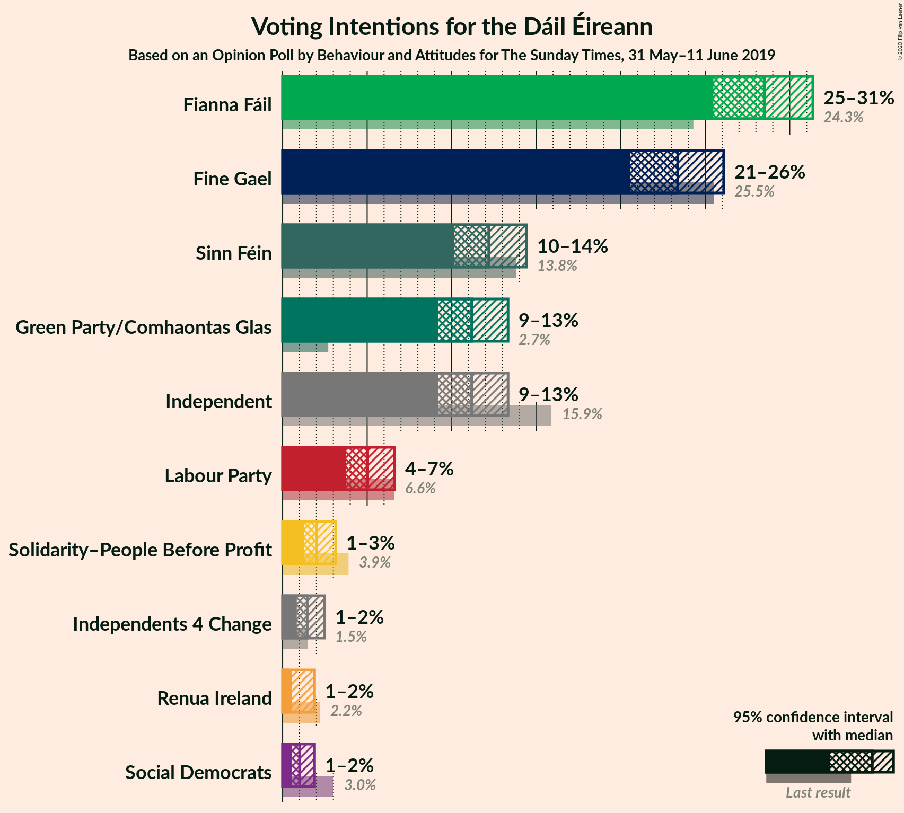
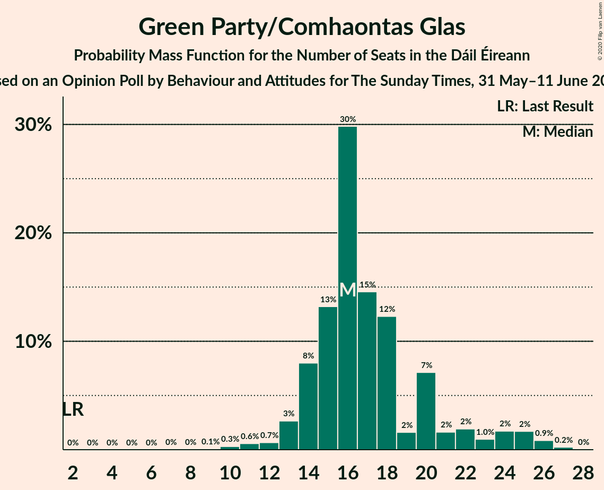
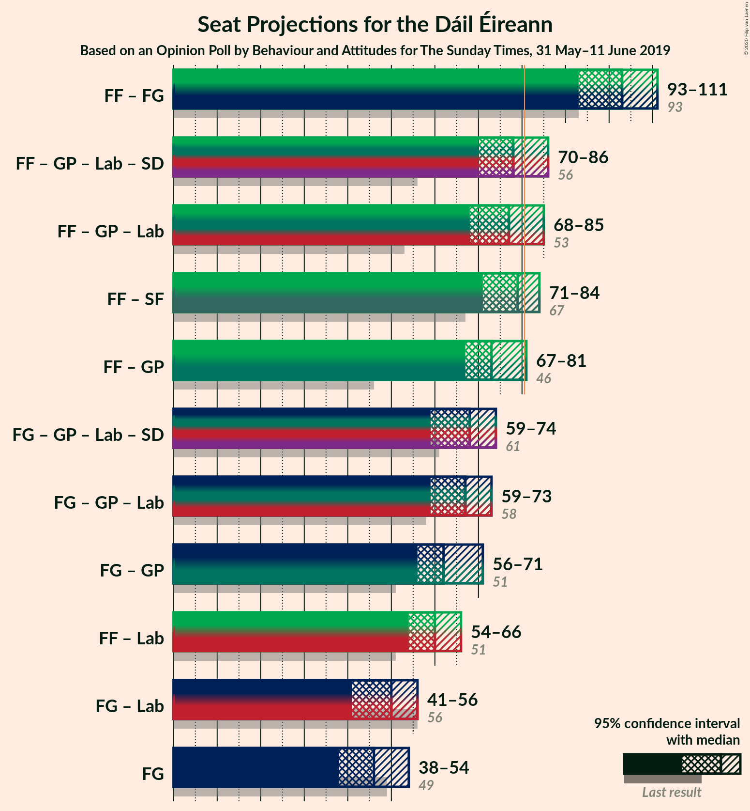

# Opinion Poll by Behaviour and Attitudes for The Sunday Times, 31 May–11 June 2019

<a href="#voting-intentions">Voting Intentions</a> | <a href="#seats">Seats</a> | <a href="#coalitions">Coalitions</a> | <a href="#technical-information">Technical Information</a>

## Voting Intentions

### Confidence Intervals

| Party | Last Result | Poll Result | 80% Confidence Interval | 90% Confidence Interval | 95% Confidence Interval | 99% Confidence Interval |
|:-----:|:-----------:|:-----------:|:-----------------------:|:-----------------------:|:-----------------------:|:-----------------------:|
| Fianna Fáil | 24.3% | 28.3% | 26.5–30.3% |25.9–30.9% |25.5–31.4% |24.6–32.3% |
| Fine Gael | 25.5% | 23.2% | 21.5–25.1% |21.0–25.6% |20.6–26.1% |19.8–27.0% |
| Sinn Féin | 13.8% | 12.1% | 10.8–13.6% |10.4–14.0% |10.1–14.4% |9.5–15.2% |
| Green Party/Comhaontas Glas | 2.7% | 11.1% | 9.9–12.6% |9.5–13.0% |9.2–13.3% |8.7–14.1% |
| Independent | 15.9% | 11.1% | 9.9–12.6% |9.5–13.0% |9.2–13.3% |8.7–14.1% |
| Labour Party | 6.6% | 5.0% | 4.2–6.1% |3.9–6.4% |3.7–6.6% |3.4–7.2% |
| Solidarity–People Before Profit | 3.9% | 2.0% | 1.5–2.7% |1.4–3.0% |1.3–3.1% |1.1–3.5% |
| Independents 4 Change | 1.5% | 1.4% | 1.1–2.1% |0.9–2.3% |0.8–2.5% |0.7–2.8% |
| Social Democrats | 3.0% | 1.0% | 0.7–1.6% |0.6–1.7% |0.5–1.9% |0.4–2.2% |
| Renua Ireland | 2.2% | 1.0% | 0.7–1.6% |0.6–1.7% |0.5–1.9% |0.4–2.2% |

*Note:* The poll result column reflects the actual value used in the calculations. Published results may vary slightly, and in addition be rounded to fewer digits.

## Seats

### Confidence Intervals

| Party | Last Result | Median | 80% Confidence Interval | 90% Confidence Interval | 95% Confidence Interval | 99% Confidence Interval |
|:-----:|:-----------:|:------:|:-----------------------:|:-----------------------:|:-----------------------:|:-----------------------:|
| <a href="#fianna-fáil">Fianna Fáil</a> | 44 | 55 | 54–59 |53–59 |50–59 |48–61 |
| <a href="#fine-gael">Fine Gael</a> | 49 | 46 | 41–50 |38–52 |37–52 |35–56 |
| <a href="#sinn-féin">Sinn Féin</a> | 23 | 21 | 18–26 |17–28 |15–30 |12–32 |
| <a href="#green-party/comhaontas-glas">Green Party/Comhaontas Glas</a> | 2 | 17 | 14–19 |13–23 |13–26 |11–27 |
| <a href="#independent">Independent</a> | 19 | 12 | 6–14 |5–15 |5–15 |3–16 |
| <a href="#labour-party">Labour Party</a> | 7 | 5 | 1–8 |0–9 |0–9 |0–12 |
| <a href="#solidarity–people-before-profit">Solidarity–People Before Profit</a> | 6 | 1 | 0–3 |0–4 |0–5 |0–5 |
| <a href="#independents-4-change">Independents 4 Change</a> | 4 | 4 | 0–5 |0–5 |0–5 |0–5 |
| <a href="#social-democrats">Social Democrats</a> | 3 | 0 | 0–2 |0–3 |0–3 |0–3 |
| <a href="#renua-ireland">Renua Ireland</a> | 0 | 0 | 0 |0 |0–1 |0–2 |

### Fianna Fáil

*For a full overview of the results for this party, see the [Fianna Fáil](party-fiannafáil.html) page.*

| Number of Seats | Probability | Accumulated | Special Marks |
|:---------------:|:-----------:|:-----------:|:-------------:|
| 44 | 0% | 100% | Last Result |
| 45 | 0.1% | 100% |  |
| 46 | 0.2% | 99.9% |  |
| 47 | 0.1% | 99.7% |  |
| 48 | 0.1% | 99.6% |  |
| 49 | 2% | 99.5% |  |
| 50 | 0.3% | 98% |  |
| 51 | 1.2% | 97% |  |
| 52 | 1.0% | 96% |  |
| 53 | 1.4% | 95% |  |
| 54 | 28% | 94% |  |
| 55 | 22% | 65% | Median |
| 56 | 5% | 43% |  |
| 57 | 7% | 39% |  |
| 58 | 2% | 32% |  |
| 59 | 29% | 30% |  |
| 60 | 0.3% | 2% |  |
| 61 | 1.3% | 1.3% |  |
| 62 | 0% | 0% |  |

### Fine Gael

*For a full overview of the results for this party, see the [Fine Gael](party-finegael.html) page.*

| Number of Seats | Probability | Accumulated | Special Marks |
|:---------------:|:-----------:|:-----------:|:-------------:|
| 33 | 0% | 100% |  |
| 34 | 0% | 99.9% |  |
| 35 | 0.5% | 99.9% |  |
| 36 | 0.1% | 99.4% |  |
| 37 | 4% | 99.3% |  |
| 38 | 1.4% | 96% |  |
| 39 | 0.8% | 94% |  |
| 40 | 1.4% | 93% |  |
| 41 | 3% | 92% |  |
| 42 | 4% | 89% |  |
| 43 | 2% | 85% |  |
| 44 | 5% | 83% |  |
| 45 | 16% | 78% |  |
| 46 | 20% | 62% | Median |
| 47 | 20% | 42% |  |
| 48 | 1.5% | 21% |  |
| 49 | 4% | 20% | Last Result |
| 50 | 10% | 16% |  |
| 51 | 0.4% | 6% |  |
| 52 | 4% | 6% |  |
| 53 | 0.1% | 1.5% |  |
| 54 | 0.1% | 1.4% |  |
| 55 | 0.5% | 1.3% |  |
| 56 | 0.7% | 0.8% |  |
| 57 | 0% | 0.1% |  |
| 58 | 0% | 0% |  |

### Sinn Féin

*For a full overview of the results for this party, see the [Sinn Féin](party-sinnféin.html) page.*

| Number of Seats | Probability | Accumulated | Special Marks |
|:---------------:|:-----------:|:-----------:|:-------------:|
| 10 | 0.1% | 100% |  |
| 11 | 0% | 99.9% |  |
| 12 | 0.8% | 99.9% |  |
| 13 | 0.2% | 99.1% |  |
| 14 | 0.4% | 98.8% |  |
| 15 | 1.3% | 98% |  |
| 16 | 1.4% | 97% |  |
| 17 | 3% | 96% |  |
| 18 | 8% | 93% |  |
| 19 | 5% | 84% |  |
| 20 | 28% | 79% |  |
| 21 | 4% | 52% | Median |
| 22 | 2% | 47% |  |
| 23 | 4% | 46% | Last Result |
| 24 | 23% | 42% |  |
| 25 | 1.0% | 19% |  |
| 26 | 8% | 18% |  |
| 27 | 4% | 10% |  |
| 28 | 1.3% | 6% |  |
| 29 | 0.3% | 4% |  |
| 30 | 3% | 4% |  |
| 31 | 0.5% | 1.3% |  |
| 32 | 0.7% | 0.8% |  |
| 33 | 0% | 0.1% |  |
| 34 | 0% | 0.1% |  |
| 35 | 0.1% | 0.1% |  |
| 36 | 0% | 0% |  |

### Green Party/Comhaontas Glas

*For a full overview of the results for this party, see the [Green Party/Comhaontas Glas](party-greenpartycomhaontasglas.html) page.*

| Number of Seats | Probability | Accumulated | Special Marks |
|:---------------:|:-----------:|:-----------:|:-------------:|
| 2 | 0% | 100% | Last Result |
| 3 | 0% | 100% |  |
| 4 | 0% | 100% |  |
| 5 | 0% | 100% |  |
| 6 | 0% | 100% |  |
| 7 | 0% | 100% |  |
| 8 | 0% | 100% |  |
| 9 | 0.4% | 100% |  |
| 10 | 0.1% | 99.6% |  |
| 11 | 0.4% | 99.6% |  |
| 12 | 0.1% | 99.1% |  |
| 13 | 6% | 99.0% |  |
| 14 | 30% | 93% |  |
| 15 | 5% | 63% |  |
| 16 | 8% | 58% |  |
| 17 | 28% | 50% | Median |
| 18 | 5% | 22% |  |
| 19 | 9% | 17% |  |
| 20 | 0.4% | 8% |  |
| 21 | 1.0% | 7% |  |
| 22 | 0.4% | 6% |  |
| 23 | 3% | 6% |  |
| 24 | 0.1% | 3% |  |
| 25 | 0.3% | 3% |  |
| 26 | 0.7% | 3% |  |
| 27 | 2% | 2% |  |
| 28 | 0.1% | 0.1% |  |
| 29 | 0% | 0% |  |

### Independent

*For a full overview of the results for this party, see the [Independent](party-independent.html) page.*

| Number of Seats | Probability | Accumulated | Special Marks |
|:---------------:|:-----------:|:-----------:|:-------------:|
| 3 | 0.8% | 100% |  |
| 4 | 0.2% | 99.2% |  |
| 5 | 7% | 99.0% |  |
| 6 | 25% | 92% |  |
| 7 | 1.0% | 67% |  |
| 8 | 2% | 66% |  |
| 9 | 3% | 64% |  |
| 10 | 4% | 61% |  |
| 11 | 5% | 57% |  |
| 12 | 10% | 52% | Median |
| 13 | 3% | 42% |  |
| 14 | 29% | 39% |  |
| 15 | 7% | 9% |  |
| 16 | 2% | 2% |  |
| 17 | 0.2% | 0.2% |  |
| 18 | 0% | 0% |  |
| 19 | 0% | 0% | Last Result |

### Labour Party

*For a full overview of the results for this party, see the [Labour Party](party-labourparty.html) page.*

| Number of Seats | Probability | Accumulated | Special Marks |
|:---------------:|:-----------:|:-----------:|:-------------:|
| 0 | 8% | 100% |  |
| 1 | 16% | 92% |  |
| 2 | 3% | 76% |  |
| 3 | 0.8% | 73% |  |
| 4 | 3% | 72% |  |
| 5 | 29% | 68% | Median |
| 6 | 20% | 39% |  |
| 7 | 3% | 19% | Last Result |
| 8 | 10% | 16% |  |
| 9 | 5% | 6% |  |
| 10 | 0.3% | 1.0% |  |
| 11 | 0% | 0.7% |  |
| 12 | 0.6% | 0.6% |  |
| 13 | 0% | 0% |  |

### Solidarity–People Before Profit

*For a full overview of the results for this party, see the [Solidarity–People Before Profit](party-solidarity–peoplebeforeprofit.html) page.*

| Number of Seats | Probability | Accumulated | Special Marks |
|:---------------:|:-----------:|:-----------:|:-------------:|
| 0 | 39% | 100% |  |
| 1 | 45% | 61% | Median |
| 2 | 1.2% | 16% |  |
| 3 | 9% | 15% |  |
| 4 | 2% | 6% |  |
| 5 | 4% | 4% |  |
| 6 | 0.2% | 0.2% | Last Result |
| 7 | 0% | 0% |  |

### Independents 4 Change

*For a full overview of the results for this party, see the [Independents 4 Change](party-independents4change.html) page.*

| Number of Seats | Probability | Accumulated | Special Marks |
|:---------------:|:-----------:|:-----------:|:-------------:|
| 0 | 13% | 100% |  |
| 1 | 23% | 87% |  |
| 2 | 8% | 64% |  |
| 3 | 2% | 56% |  |
| 4 | 26% | 54% | Last Result, Median |
| 5 | 28% | 28% |  |
| 6 | 0% | 0% |  |

### Social Democrats

*For a full overview of the results for this party, see the [Social Democrats](party-socialdemocrats.html) page.*

| Number of Seats | Probability | Accumulated | Special Marks |
|:---------------:|:-----------:|:-----------:|:-------------:|
| 0 | 61% | 100% | Median |
| 1 | 6% | 39% |  |
| 2 | 24% | 33% |  |
| 3 | 9% | 9% | Last Result |
| 4 | 0% | 0% |  |

### Renua Ireland

*For a full overview of the results for this party, see the [Renua Ireland](party-renuaireland.html) page.*

| Number of Seats | Probability | Accumulated | Special Marks |
|:---------------:|:-----------:|:-----------:|:-------------:|
| 0 | 97% | 100% | Last Result, Median |
| 1 | 0.5% | 3% |  |
| 2 | 2% | 2% |  |
| 3 | 0% | 0% |  |

## Coalitions

### Confidence Intervals

| Coalition | Last Result | Median | Majority? | 80% Confidence Interval | 90% Confidence Interval | 95% Confidence Interval | 99% Confidence Interval |
|:---------:|:-----------:|:------:|:---------:|:-----------------------:|:-----------------------:|:-----------------------:|:-----------------------:|
| Fianna Fáil – Fine Gael | 93 | 100 | 100% | 96–106 | 93–107 | 92–107 | 88–110 |
| Fianna Fáil – Green Party/Comhaontas Glas – Labour Party – Social Democrats | 56 | 77 | 41% | 72–85 | 71–88 | 70–88 | 69–88 |
| Fianna Fáil – Green Party/Comhaontas Glas – Labour Party | 53 | 75 | 37% | 70–84 | 69–86 | 69–86 | 67–87 |
| Fianna Fáil – Sinn Féin | 67 | 78 | 38% | 73–83 | 72–83 | 69–86 | 66–89 |
| Fianna Fáil – Green Party/Comhaontas Glas | 46 | 72 | 3% | 68–78 | 68–78 | 66–81 | 64–82 |
| Fine Gael – Green Party/Comhaontas Glas – Labour Party – Social Democrats | 61 | 68 | 0.1% | 62–74 | 62–74 | 58–75 | 58–78 |
| Fine Gael – Green Party/Comhaontas Glas – Labour Party | 58 | 67 | 0% | 60–72 | 60–74 | 57–74 | 56–78 |
| Fine Gael – Green Party/Comhaontas Glas | 51 | 63 | 0% | 58–67 | 56–68 | 55–69 | 54–73 |
| Fianna Fáil – Labour Party | 51 | 60 | 0% | 56–65 | 54–67 | 54–67 | 52–69 |
| Fine Gael – Labour Party | 56 | 52 | 0% | 43–55 | 41–55 | 39–57 | 38–58 |
| Fine Gael | 49 | 46 | 0% | 41–50 | 38–52 | 37–52 | 35–56 |

### Fianna Fáil – Fine Gael

| Number of Seats | Probability | Accumulated | Special Marks |
|:---------------:|:-----------:|:-----------:|:-------------:|
| 86 | 0.1% | 100% |  |
| 87 | 0.1% | 99.8% |  |
| 88 | 0.7% | 99.8% |  |
| 89 | 0.4% | 99.1% |  |
| 90 | 0.6% | 98.8% |  |
| 91 | 0.5% | 98% |  |
| 92 | 1.2% | 98% |  |
| 93 | 2% | 97% | Last Result |
| 94 | 1.3% | 94% |  |
| 95 | 3% | 93% |  |
| 96 | 2% | 91% |  |
| 97 | 3% | 88% |  |
| 98 | 2% | 85% |  |
| 99 | 7% | 84% |  |
| 100 | 28% | 77% |  |
| 101 | 0.8% | 50% | Median |
| 102 | 1.3% | 49% |  |
| 103 | 2% | 47% |  |
| 104 | 7% | 46% |  |
| 105 | 7% | 39% |  |
| 106 | 26% | 32% |  |
| 107 | 4% | 6% |  |
| 108 | 0.2% | 2% |  |
| 109 | 0.7% | 2% |  |
| 110 | 0.9% | 1.2% |  |
| 111 | 0.2% | 0.4% |  |
| 112 | 0.1% | 0.2% |  |
| 113 | 0% | 0.1% |  |
| 114 | 0% | 0% |  |

### Fianna Fáil – Green Party/Comhaontas Glas – Labour Party – Social Democrats

| Number of Seats | Probability | Accumulated | Special Marks |
|:---------------:|:-----------:|:-----------:|:-------------:|
| 56 | 0% | 100% | Last Result |
| 57 | 0% | 100% |  |
| 58 | 0% | 100% |  |
| 59 | 0% | 100% |  |
| 60 | 0% | 100% |  |
| 61 | 0% | 100% |  |
| 62 | 0% | 100% |  |
| 63 | 0% | 100% |  |
| 64 | 0% | 100% |  |
| 65 | 0% | 100% |  |
| 66 | 0% | 100% |  |
| 67 | 0.1% | 99.9% |  |
| 68 | 0.2% | 99.8% |  |
| 69 | 0.4% | 99.7% |  |
| 70 | 4% | 99.3% |  |
| 71 | 1.2% | 95% |  |
| 72 | 8% | 94% |  |
| 73 | 9% | 86% |  |
| 74 | 19% | 77% |  |
| 75 | 2% | 58% |  |
| 76 | 2% | 56% |  |
| 77 | 5% | 53% | Median |
| 78 | 6% | 49% |  |
| 79 | 0.7% | 43% |  |
| 80 | 1.4% | 42% |  |
| 81 | 24% | 41% | Majority |
| 82 | 1.5% | 17% |  |
| 83 | 2% | 16% |  |
| 84 | 2% | 13% |  |
| 85 | 2% | 11% |  |
| 86 | 0.7% | 10% |  |
| 87 | 1.1% | 9% |  |
| 88 | 7% | 8% |  |
| 89 | 0.3% | 0.4% |  |
| 90 | 0% | 0.1% |  |
| 91 | 0% | 0% |  |

### Fianna Fáil – Green Party/Comhaontas Glas – Labour Party

| Number of Seats | Probability | Accumulated | Special Marks |
|:---------------:|:-----------:|:-----------:|:-------------:|
| 53 | 0% | 100% | Last Result |
| 54 | 0% | 100% |  |
| 55 | 0% | 100% |  |
| 56 | 0% | 100% |  |
| 57 | 0% | 100% |  |
| 58 | 0% | 100% |  |
| 59 | 0% | 100% |  |
| 60 | 0% | 100% |  |
| 61 | 0% | 100% |  |
| 62 | 0% | 100% |  |
| 63 | 0% | 100% |  |
| 64 | 0% | 100% |  |
| 65 | 0.1% | 100% |  |
| 66 | 0.3% | 99.8% |  |
| 67 | 0.1% | 99.6% |  |
| 68 | 0.3% | 99.5% |  |
| 69 | 4% | 99.2% |  |
| 70 | 8% | 95% |  |
| 71 | 0.8% | 87% |  |
| 72 | 0.9% | 86% |  |
| 73 | 9% | 85% |  |
| 74 | 21% | 76% |  |
| 75 | 5% | 55% |  |
| 76 | 2% | 49% |  |
| 77 | 1.3% | 47% | Median |
| 78 | 8% | 46% |  |
| 79 | 0.4% | 38% |  |
| 80 | 0.6% | 37% |  |
| 81 | 21% | 37% | Majority |
| 82 | 2% | 15% |  |
| 83 | 2% | 13% |  |
| 84 | 2% | 11% |  |
| 85 | 0.9% | 10% |  |
| 86 | 8% | 9% |  |
| 87 | 0.8% | 1.0% |  |
| 88 | 0% | 0.2% |  |
| 89 | 0.1% | 0.2% |  |
| 90 | 0% | 0.1% |  |
| 91 | 0% | 0% |  |

### Fianna Fáil – Sinn Féin

| Number of Seats | Probability | Accumulated | Special Marks |
|:---------------:|:-----------:|:-----------:|:-------------:|
| 62 | 0% | 100% |  |
| 63 | 0% | 99.9% |  |
| 64 | 0% | 99.9% |  |
| 65 | 0% | 99.9% |  |
| 66 | 0.6% | 99.9% |  |
| 67 | 0.1% | 99.3% | Last Result |
| 68 | 0.3% | 99.3% |  |
| 69 | 2% | 99.0% |  |
| 70 | 0.4% | 97% |  |
| 71 | 1.0% | 97% |  |
| 72 | 1.5% | 96% |  |
| 73 | 9% | 95% |  |
| 74 | 26% | 86% |  |
| 75 | 2% | 59% |  |
| 76 | 2% | 57% | Median |
| 77 | 1.1% | 55% |  |
| 78 | 6% | 54% |  |
| 79 | 7% | 48% |  |
| 80 | 3% | 41% |  |
| 81 | 12% | 38% | Majority |
| 82 | 1.2% | 26% |  |
| 83 | 22% | 25% |  |
| 84 | 0.1% | 4% |  |
| 85 | 0.5% | 4% |  |
| 86 | 2% | 3% |  |
| 87 | 0% | 1.1% |  |
| 88 | 0.1% | 1.1% |  |
| 89 | 0.8% | 1.0% |  |
| 90 | 0% | 0.1% |  |
| 91 | 0.1% | 0.1% |  |
| 92 | 0% | 0% |  |

### Fianna Fáil – Green Party/Comhaontas Glas

| Number of Seats | Probability | Accumulated | Special Marks |
|:---------------:|:-----------:|:-----------:|:-------------:|
| 46 | 0% | 100% | Last Result |
| 47 | 0% | 100% |  |
| 48 | 0% | 100% |  |
| 49 | 0% | 100% |  |
| 50 | 0% | 100% |  |
| 51 | 0% | 100% |  |
| 52 | 0% | 100% |  |
| 53 | 0% | 100% |  |
| 54 | 0% | 100% |  |
| 55 | 0% | 100% |  |
| 56 | 0% | 100% |  |
| 57 | 0% | 100% |  |
| 58 | 0% | 100% |  |
| 59 | 0% | 100% |  |
| 60 | 0% | 100% |  |
| 61 | 0% | 100% |  |
| 62 | 0% | 100% |  |
| 63 | 0.4% | 99.9% |  |
| 64 | 0.2% | 99.6% |  |
| 65 | 0.7% | 99.4% |  |
| 66 | 2% | 98.7% |  |
| 67 | 0.2% | 97% |  |
| 68 | 26% | 97% |  |
| 69 | 16% | 71% |  |
| 70 | 2% | 55% |  |
| 71 | 1.0% | 53% |  |
| 72 | 3% | 52% | Median |
| 73 | 5% | 49% |  |
| 74 | 6% | 44% |  |
| 75 | 4% | 39% |  |
| 76 | 20% | 35% |  |
| 77 | 1.1% | 15% |  |
| 78 | 10% | 14% |  |
| 79 | 0.5% | 4% |  |
| 80 | 1.1% | 4% |  |
| 81 | 2% | 3% | Majority |
| 82 | 0.7% | 1.0% |  |
| 83 | 0.2% | 0.3% |  |
| 84 | 0.1% | 0.1% |  |
| 85 | 0.1% | 0.1% |  |
| 86 | 0% | 0% |  |

### Fine Gael – Green Party/Comhaontas Glas – Labour Party – Social Democrats

| Number of Seats | Probability | Accumulated | Special Marks |
|:---------------:|:-----------:|:-----------:|:-------------:|
| 54 | 0% | 100% |  |
| 55 | 0% | 99.9% |  |
| 56 | 0.3% | 99.9% |  |
| 57 | 0.1% | 99.6% |  |
| 58 | 2% | 99.6% |  |
| 59 | 0.8% | 97% |  |
| 60 | 1.3% | 97% |  |
| 61 | 0.3% | 95% | Last Result |
| 62 | 10% | 95% |  |
| 63 | 0.9% | 85% |  |
| 64 | 3% | 84% |  |
| 65 | 1.0% | 81% |  |
| 66 | 20% | 80% |  |
| 67 | 0.8% | 60% |  |
| 68 | 11% | 59% | Median |
| 69 | 22% | 48% |  |
| 70 | 10% | 26% |  |
| 71 | 3% | 17% |  |
| 72 | 0.4% | 13% |  |
| 73 | 1.3% | 13% |  |
| 74 | 9% | 12% |  |
| 75 | 1.0% | 3% |  |
| 76 | 0.3% | 2% |  |
| 77 | 0.3% | 2% |  |
| 78 | 1.1% | 1.3% |  |
| 79 | 0.1% | 0.2% |  |
| 80 | 0% | 0.1% |  |
| 81 | 0% | 0.1% | Majority |
| 82 | 0% | 0% |  |

### Fine Gael – Green Party/Comhaontas Glas – Labour Party

| Number of Seats | Probability | Accumulated | Special Marks |
|:---------------:|:-----------:|:-----------:|:-------------:|
| 53 | 0% | 100% |  |
| 54 | 0.3% | 99.9% |  |
| 55 | 0% | 99.6% |  |
| 56 | 2% | 99.6% |  |
| 57 | 1.1% | 98% |  |
| 58 | 0.3% | 96% | Last Result |
| 59 | 0.1% | 96% |  |
| 60 | 9% | 96% |  |
| 61 | 0.3% | 87% |  |
| 62 | 4% | 87% |  |
| 63 | 2% | 83% |  |
| 64 | 3% | 81% |  |
| 65 | 0.5% | 78% |  |
| 66 | 20% | 78% |  |
| 67 | 11% | 58% |  |
| 68 | 7% | 47% | Median |
| 69 | 21% | 41% |  |
| 70 | 4% | 19% |  |
| 71 | 2% | 15% |  |
| 72 | 7% | 13% |  |
| 73 | 0.6% | 6% |  |
| 74 | 3% | 5% |  |
| 75 | 1.0% | 2% |  |
| 76 | 0.3% | 1.0% |  |
| 77 | 0.1% | 0.8% |  |
| 78 | 0.5% | 0.6% |  |
| 79 | 0% | 0.1% |  |
| 80 | 0% | 0% |  |

### Fine Gael – Green Party/Comhaontas Glas

| Number of Seats | Probability | Accumulated | Special Marks |
|:---------------:|:-----------:|:-----------:|:-------------:|
| 50 | 0% | 100% |  |
| 51 | 0% | 99.9% | Last Result |
| 52 | 0.1% | 99.9% |  |
| 53 | 0.3% | 99.8% |  |
| 54 | 0.5% | 99.5% |  |
| 55 | 3% | 99.0% |  |
| 56 | 2% | 96% |  |
| 57 | 0.7% | 94% |  |
| 58 | 4% | 93% |  |
| 59 | 11% | 89% |  |
| 60 | 18% | 78% |  |
| 61 | 3% | 60% |  |
| 62 | 2% | 56% |  |
| 63 | 7% | 54% | Median |
| 64 | 29% | 47% |  |
| 65 | 2% | 18% |  |
| 66 | 6% | 17% |  |
| 67 | 6% | 11% |  |
| 68 | 2% | 5% |  |
| 69 | 1.0% | 3% |  |
| 70 | 0.8% | 2% |  |
| 71 | 0.1% | 2% |  |
| 72 | 0.9% | 1.5% |  |
| 73 | 0.3% | 0.5% |  |
| 74 | 0.1% | 0.2% |  |
| 75 | 0% | 0.1% |  |
| 76 | 0% | 0.1% |  |
| 77 | 0% | 0.1% |  |
| 78 | 0% | 0% |  |

### Fianna Fáil – Labour Party

| Number of Seats | Probability | Accumulated | Special Marks |
|:---------------:|:-----------:|:-----------:|:-------------:|
| 46 | 0.1% | 100% |  |
| 47 | 0% | 99.9% |  |
| 48 | 0.1% | 99.9% |  |
| 49 | 0% | 99.8% |  |
| 50 | 0% | 99.8% |  |
| 51 | 0.2% | 99.7% | Last Result |
| 52 | 0.1% | 99.5% |  |
| 53 | 0.3% | 99.4% |  |
| 54 | 5% | 99.0% |  |
| 55 | 3% | 94% |  |
| 56 | 14% | 91% |  |
| 57 | 3% | 77% |  |
| 58 | 3% | 74% |  |
| 59 | 3% | 71% |  |
| 60 | 27% | 68% | Median |
| 61 | 3% | 41% |  |
| 62 | 2% | 38% |  |
| 63 | 2% | 37% |  |
| 64 | 24% | 35% |  |
| 65 | 1.4% | 11% |  |
| 66 | 0.8% | 9% |  |
| 67 | 7% | 9% |  |
| 68 | 0.2% | 1.4% |  |
| 69 | 1.1% | 1.1% |  |
| 70 | 0% | 0.1% |  |
| 71 | 0% | 0% |  |

### Fine Gael – Labour Party

| Number of Seats | Probability | Accumulated | Special Marks |
|:---------------:|:-----------:|:-----------:|:-------------:|
| 35 | 0.3% | 100% |  |
| 36 | 0.1% | 99.7% |  |
| 37 | 0% | 99.5% |  |
| 38 | 2% | 99.5% |  |
| 39 | 0.9% | 98% |  |
| 40 | 0.1% | 97% |  |
| 41 | 2% | 97% |  |
| 42 | 0.2% | 94% |  |
| 43 | 5% | 94% |  |
| 44 | 0.3% | 90% |  |
| 45 | 0.8% | 89% |  |
| 46 | 11% | 89% |  |
| 47 | 2% | 78% |  |
| 48 | 2% | 76% |  |
| 49 | 0.7% | 74% |  |
| 50 | 2% | 74% |  |
| 51 | 2% | 71% | Median |
| 52 | 43% | 69% |  |
| 53 | 13% | 26% |  |
| 54 | 0.6% | 13% |  |
| 55 | 7% | 12% |  |
| 56 | 1.2% | 5% | Last Result |
| 57 | 2% | 4% |  |
| 58 | 1.2% | 2% |  |
| 59 | 0.3% | 0.4% |  |
| 60 | 0.1% | 0.2% |  |
| 61 | 0% | 0% |  |

### Fine Gael

| Number of Seats | Probability | Accumulated | Special Marks |
|:---------------:|:-----------:|:-----------:|:-------------:|
| 33 | 0% | 100% |  |
| 34 | 0% | 99.9% |  |
| 35 | 0.5% | 99.9% |  |
| 36 | 0.1% | 99.4% |  |
| 37 | 4% | 99.3% |  |
| 38 | 1.4% | 96% |  |
| 39 | 0.8% | 94% |  |
| 40 | 1.4% | 93% |  |
| 41 | 3% | 92% |  |
| 42 | 4% | 89% |  |
| 43 | 2% | 85% |  |
| 44 | 5% | 83% |  |
| 45 | 16% | 78% |  |
| 46 | 20% | 62% | Median |
| 47 | 20% | 42% |  |
| 48 | 1.5% | 21% |  |
| 49 | 4% | 20% | Last Result |
| 50 | 10% | 16% |  |
| 51 | 0.4% | 6% |  |
| 52 | 4% | 6% |  |
| 53 | 0.1% | 1.5% |  |
| 54 | 0.1% | 1.4% |  |
| 55 | 0.5% | 1.3% |  |
| 56 | 0.7% | 0.8% |  |
| 57 | 0% | 0.1% |  |
| 58 | 0% | 0% |  |

## Technical Information

### Opinion Poll

+ **Polling firm:** Behaviour and Attitudes
+ **Commissioner(s):** The Sunday Times
+ **Fieldwork period:** 31 May–11 June 2019

### Calculations

+ **Sample size:** 900
+ **Simulations done:** 131,072
+ **Error estimate:** 2.10%

