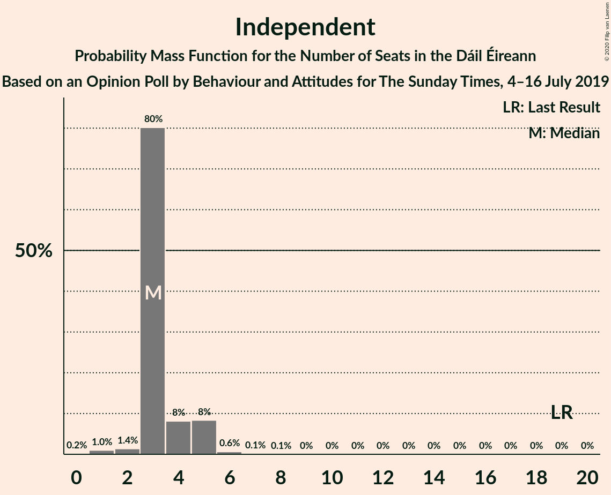
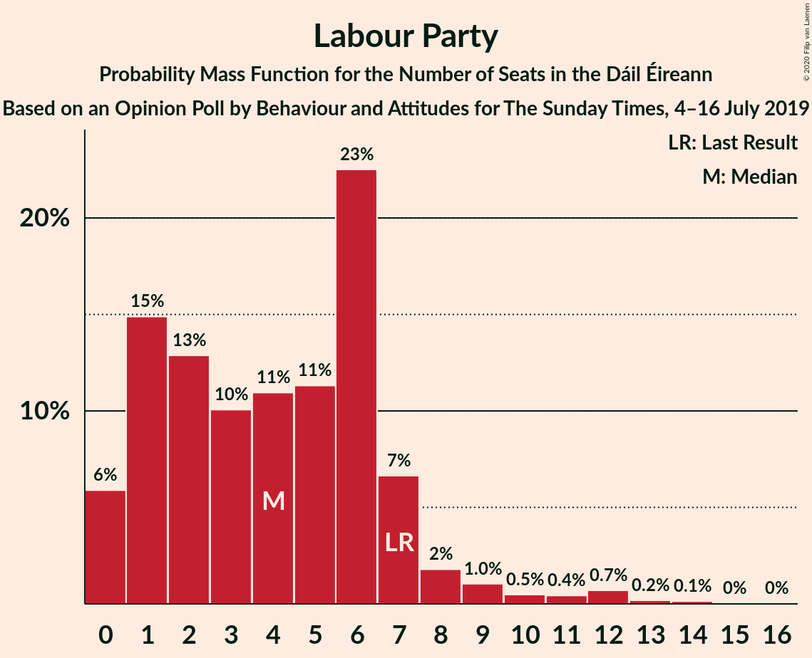
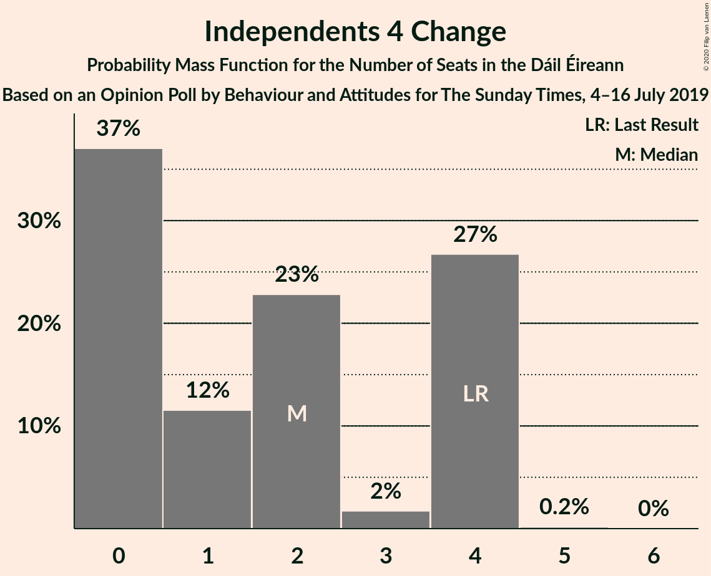
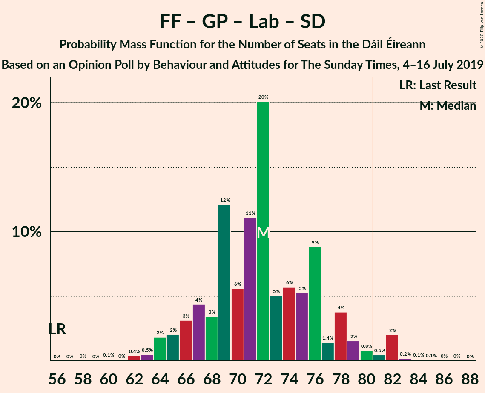
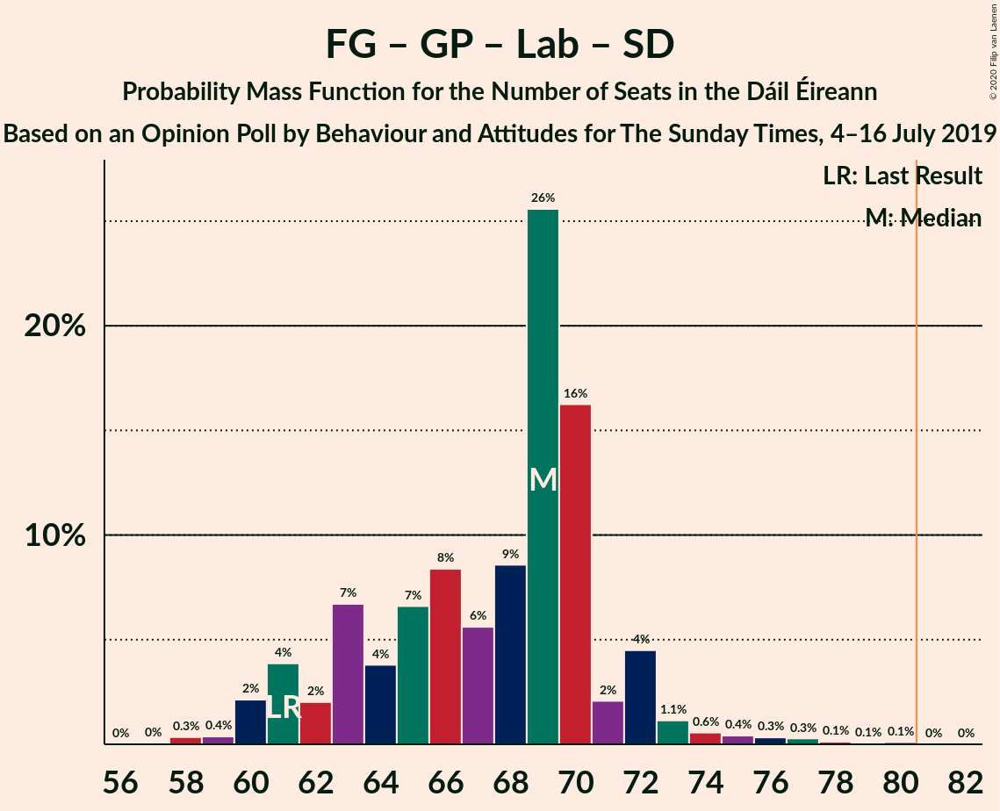

# Opinion Poll by Behaviour and Attitudes for The Sunday Times, 4–16 July 2019

<a href="#voting-intentions">Voting Intentions</a> | <a href="#seats">Seats</a> | <a href="#coalitions">Coalitions</a> | <a href="#technical-information">Technical Information</a>

## Voting Intentions

### Confidence Intervals

| Party | Last Result | Poll Result | 80% Confidence Interval | 90% Confidence Interval | 95% Confidence Interval | 99% Confidence Interval |
|:-----:|:-----------:|:-----------:|:-----------------------:|:-----------------------:|:-----------------------:|:-----------------------:|
| Fianna Fáil | 24.3% | 30.6% | 28.7–32.7% |28.2–33.2% |27.7–33.7% |26.8–34.7% |
| Fine Gael | 25.5% | 26.5% | 24.7–28.5% |24.2–29.1% |23.8–29.5% |22.9–30.5% |
| Sinn Féin | 13.8% | 14.3% | 12.9–15.9% |12.5–16.3% |12.1–16.7% |11.5–17.5% |
| Green Party/Comhaontas Glas | 2.7% | 7.2% | 6.2–8.4% |5.9–8.8% |5.7–9.1% |5.2–9.7% |
| Independent | 15.9% | 6.9% | 5.9–8.1% |5.6–8.4% |5.4–8.7% |5.0–9.3% |
| Labour Party | 6.6% | 5.1% | 4.3–6.2% |4.0–6.5% |3.8–6.7% |3.5–7.3% |
| Solidarity–People Before Profit | 3.9% | 2.0% | 1.5–2.7% |1.4–2.9% |1.3–3.1% |1.1–3.5% |
| Social Democrats | 3.0% | 1.0% | 0.7–1.6% |0.6–1.7% |0.5–1.9% |0.4–2.2% |
| Renua Ireland | 2.2% | 1.0% | 0.7–1.6% |0.6–1.7% |0.5–1.9% |0.4–2.2% |
| Independents 4 Change | 1.5% | 0.9% | 0.6–1.4% |0.5–1.6% |0.4–1.7% |0.3–2.0% |

*Note:* The poll result column reflects the actual value used in the calculations. Published results may vary slightly, and in addition be rounded to fewer digits.

## Seats

### Confidence Intervals

| Party | Last Result | Median | 80% Confidence Interval | 90% Confidence Interval | 95% Confidence Interval | 99% Confidence Interval |
|:-----:|:-----------:|:------:|:-----------------------:|:-----------------------:|:-----------------------:|:-----------------------:|
| <a href="#fianna-fáil">Fianna Fáil</a> | 44 | 58 | 55–60 |53–60 |53–61 |51–61 |
| <a href="#fine-gael">Fine Gael</a> | 49 | 54 | 48–59 |48–60 |47–60 |45–63 |
| <a href="#sinn-féin">Sinn Féin</a> | 23 | 29 | 26–32 |24–34 |23–34 |19–36 |
| <a href="#green-party/comhaontas-glas">Green Party/Comhaontas Glas</a> | 2 | 6 | 5–16 |5–16 |4–16 |3–17 |
| <a href="#independent">Independent</a> | 19 | 3 | 3–4 |3–4 |2–5 |1–6 |
| <a href="#labour-party">Labour Party</a> | 7 | 2 | 1–7 |0–8 |0–10 |0–12 |
| <a href="#solidarity–people-before-profit">Solidarity–People Before Profit</a> | 6 | 1 | 0–3 |0–3 |0–3 |0–5 |
| <a href="#social-democrats">Social Democrats</a> | 3 | 1 | 0–3 |0–3 |0–3 |0–3 |
| <a href="#renua-ireland">Renua Ireland</a> | 0 | 0 | 0 |0 |0–1 |0–1 |
| <a href="#independents-4-change">Independents 4 Change</a> | 4 | 2 | 0–4 |0–4 |0–4 |0–4 |

### Fianna Fáil

*For a full overview of the results for this party, see the [Fianna Fáil](party-fiannafáil.html) page.*

| Number of Seats | Probability | Accumulated | Special Marks |
|:---------------:|:-----------:|:-----------:|:-------------:|
| 44 | 0% | 100% | Last Result |
| 45 | 0% | 100% |  |
| 46 | 0% | 100% |  |
| 47 | 0% | 100% |  |
| 48 | 0% | 100% |  |
| 49 | 0.2% | 100% |  |
| 50 | 0.2% | 99.8% |  |
| 51 | 0.1% | 99.6% |  |
| 52 | 0.8% | 99.5% |  |
| 53 | 6% | 98.6% |  |
| 54 | 2% | 93% |  |
| 55 | 3% | 91% |  |
| 56 | 6% | 88% |  |
| 57 | 9% | 82% |  |
| 58 | 41% | 72% | Median |
| 59 | 19% | 31% |  |
| 60 | 8% | 11% |  |
| 61 | 3% | 4% |  |
| 62 | 0.4% | 0.5% |  |
| 63 | 0% | 0% |  |

### Fine Gael

*For a full overview of the results for this party, see the [Fine Gael](party-finegael.html) page.*

| Number of Seats | Probability | Accumulated | Special Marks |
|:---------------:|:-----------:|:-----------:|:-------------:|
| 41 | 0.1% | 100% |  |
| 42 | 0% | 99.9% |  |
| 43 | 0.1% | 99.8% |  |
| 44 | 0.1% | 99.8% |  |
| 45 | 1.5% | 99.7% |  |
| 46 | 0.4% | 98% |  |
| 47 | 1.0% | 98% |  |
| 48 | 8% | 97% |  |
| 49 | 3% | 88% | Last Result |
| 50 | 2% | 85% |  |
| 51 | 14% | 84% |  |
| 52 | 9% | 70% |  |
| 53 | 5% | 60% |  |
| 54 | 6% | 55% | Median |
| 55 | 3% | 49% |  |
| 56 | 23% | 47% |  |
| 57 | 11% | 23% |  |
| 58 | 1.2% | 12% |  |
| 59 | 2% | 11% |  |
| 60 | 7% | 9% |  |
| 61 | 0.3% | 1.4% |  |
| 62 | 0.4% | 1.1% |  |
| 63 | 0.4% | 0.7% |  |
| 64 | 0.2% | 0.3% |  |
| 65 | 0% | 0.1% |  |
| 66 | 0% | 0.1% |  |
| 67 | 0.1% | 0.1% |  |
| 68 | 0% | 0% |  |

### Sinn Féin

*For a full overview of the results for this party, see the [Sinn Féin](party-sinnféin.html) page.*

| Number of Seats | Probability | Accumulated | Special Marks |
|:---------------:|:-----------:|:-----------:|:-------------:|
| 17 | 0.2% | 100% |  |
| 18 | 0% | 99.8% |  |
| 19 | 0.7% | 99.7% |  |
| 20 | 0.1% | 99.0% |  |
| 21 | 0.1% | 98.9% |  |
| 22 | 0.9% | 98.8% |  |
| 23 | 2% | 98% | Last Result |
| 24 | 0.8% | 96% |  |
| 25 | 3% | 95% |  |
| 26 | 12% | 91% |  |
| 27 | 26% | 79% |  |
| 28 | 2% | 53% |  |
| 29 | 5% | 51% | Median |
| 30 | 15% | 46% |  |
| 31 | 17% | 31% |  |
| 32 | 6% | 15% |  |
| 33 | 3% | 8% |  |
| 34 | 3% | 5% |  |
| 35 | 0.6% | 2% |  |
| 36 | 1.0% | 1.5% |  |
| 37 | 0.4% | 0.5% |  |
| 38 | 0% | 0.1% |  |
| 39 | 0% | 0.1% |  |
| 40 | 0% | 0% |  |

### Green Party/Comhaontas Glas

*For a full overview of the results for this party, see the [Green Party/Comhaontas Glas](party-greenpartycomhaontasglas.html) page.*

| Number of Seats | Probability | Accumulated | Special Marks |
|:---------------:|:-----------:|:-----------:|:-------------:|
| 2 | 0% | 100% | Last Result |
| 3 | 0.5% | 100% |  |
| 4 | 3% | 99.5% |  |
| 5 | 23% | 97% |  |
| 6 | 25% | 73% | Median |
| 7 | 2% | 49% |  |
| 8 | 3% | 47% |  |
| 9 | 8% | 43% |  |
| 10 | 5% | 35% |  |
| 11 | 4% | 30% |  |
| 12 | 2% | 26% |  |
| 13 | 10% | 24% |  |
| 14 | 1.1% | 14% |  |
| 15 | 2% | 13% |  |
| 16 | 10% | 11% |  |
| 17 | 0.7% | 0.7% |  |
| 18 | 0% | 0% |  |

### Independent

*For a full overview of the results for this party, see the [Independent](party-independent.html) page.*

| Number of Seats | Probability | Accumulated | Special Marks |
|:---------------:|:-----------:|:-----------:|:-------------:|
| 0 | 0.5% | 100% |  |
| 1 | 0.5% | 99.5% |  |
| 2 | 2% | 99.1% |  |
| 3 | 83% | 97% | Median |
| 4 | 10% | 14% |  |
| 5 | 3% | 4% |  |
| 6 | 1.3% | 2% |  |
| 7 | 0.1% | 0.3% |  |
| 8 | 0.2% | 0.2% |  |
| 9 | 0% | 0% |  |
| 10 | 0% | 0% |  |
| 11 | 0% | 0% |  |
| 12 | 0% | 0% |  |
| 13 | 0% | 0% |  |
| 14 | 0% | 0% |  |
| 15 | 0% | 0% |  |
| 16 | 0% | 0% |  |
| 17 | 0% | 0% |  |
| 18 | 0% | 0% |  |
| 19 | 0% | 0% | Last Result |

### Labour Party

*For a full overview of the results for this party, see the [Labour Party](party-labourparty.html) page.*

| Number of Seats | Probability | Accumulated | Special Marks |
|:---------------:|:-----------:|:-----------:|:-------------:|
| 0 | 6% | 100% |  |
| 1 | 21% | 94% |  |
| 2 | 24% | 72% | Median |
| 3 | 4% | 48% |  |
| 4 | 6% | 44% |  |
| 5 | 24% | 38% |  |
| 6 | 3% | 14% |  |
| 7 | 4% | 11% | Last Result |
| 8 | 3% | 7% |  |
| 9 | 0.6% | 5% |  |
| 10 | 3% | 4% |  |
| 11 | 0.2% | 0.9% |  |
| 12 | 0.3% | 0.7% |  |
| 13 | 0.4% | 0.5% |  |
| 14 | 0% | 0.1% |  |
| 15 | 0% | 0.1% |  |
| 16 | 0% | 0% |  |

### Solidarity–People Before Profit

*For a full overview of the results for this party, see the [Solidarity–People Before Profit](party-solidarity–peoplebeforeprofit.html) page.*

| Number of Seats | Probability | Accumulated | Special Marks |
|:---------------:|:-----------:|:-----------:|:-------------:|
| 0 | 45% | 100% |  |
| 1 | 13% | 55% | Median |
| 2 | 25% | 42% |  |
| 3 | 16% | 17% |  |
| 4 | 0.6% | 1.1% |  |
| 5 | 0.4% | 0.5% |  |
| 6 | 0% | 0.1% | Last Result |
| 7 | 0.1% | 0.1% |  |
| 8 | 0% | 0% |  |

### Social Democrats

*For a full overview of the results for this party, see the [Social Democrats](party-socialdemocrats.html) page.*

| Number of Seats | Probability | Accumulated | Special Marks |
|:---------------:|:-----------:|:-----------:|:-------------:|
| 0 | 20% | 100% |  |
| 1 | 35% | 80% | Median |
| 2 | 7% | 45% |  |
| 3 | 38% | 38% | Last Result |
| 4 | 0.5% | 0.5% |  |
| 5 | 0% | 0% |  |

### Renua Ireland

*For a full overview of the results for this party, see the [Renua Ireland](party-renuaireland.html) page.*

| Number of Seats | Probability | Accumulated | Special Marks |
|:---------------:|:-----------:|:-----------:|:-------------:|
| 0 | 97% | 100% | Last Result, Median |
| 1 | 2% | 3% |  |
| 2 | 0.4% | 0.5% |  |
| 3 | 0% | 0.1% |  |
| 4 | 0% | 0% |  |

### Independents 4 Change

*For a full overview of the results for this party, see the [Independents 4 Change](party-independents4change.html) page.*

| Number of Seats | Probability | Accumulated | Special Marks |
|:---------------:|:-----------:|:-----------:|:-------------:|
| 0 | 43% | 100% |  |
| 1 | 2% | 57% |  |
| 2 | 24% | 54% | Median |
| 3 | 0.7% | 30% |  |
| 4 | 29% | 29% | Last Result |
| 5 | 0.2% | 0.2% |  |
| 6 | 0% | 0% |  |

## Coalitions

### Confidence Intervals

| Coalition | Last Result | Median | Majority? | 80% Confidence Interval | 90% Confidence Interval | 95% Confidence Interval | 99% Confidence Interval |
|:---------:|:-----------:|:------:|:---------:|:-----------------------:|:-----------------------:|:-----------------------:|:-----------------------:|
| Fianna Fáil – Fine Gael | 93 | 112 | 100% | 106–115 | 106–116 | 105–116 | 103–120 |
| Fianna Fáil – Sinn Féin | 67 | 85 | 96% | 82–90 | 81–91 | 80–93 | 76–94 |
| Fianna Fáil – Green Party/Comhaontas Glas – Labour Party – Social Democrats | 56 | 72 | 3% | 64–76 | 64–78 | 63–82 | 62–83 |
| Fianna Fáil – Green Party/Comhaontas Glas – Labour Party | 53 | 69 | 3% | 63–76 | 62–78 | 62–81 | 60–81 |
| Fianna Fáil – Green Party/Comhaontas Glas | 46 | 64 | 0% | 61–75 | 60–75 | 60–75 | 58–76 |
| Fine Gael – Green Party/Comhaontas Glas – Labour Party – Social Democrats | 61 | 68 | 0% | 63–72 | 62–73 | 59–74 | 59–79 |
| Fine Gael – Green Party/Comhaontas Glas – Labour Party | 58 | 67 | 0% | 61–70 | 60–72 | 58–74 | 57–78 |
| Fine Gael – Green Party/Comhaontas Glas | 51 | 62 | 0% | 58–67 | 56–67 | 55–70 | 54–76 |
| Fianna Fáil – Labour Party | 51 | 61 | 0% | 58–65 | 54–67 | 53–68 | 53–71 |
| Fine Gael – Labour Party | 56 | 58 | 0% | 51–62 | 49–62 | 49–65 | 49–69 |
| Fine Gael | 49 | 54 | 0% | 48–59 | 48–60 | 47–60 | 45–63 |

### Fianna Fáil – Fine Gael

| Number of Seats | Probability | Accumulated | Special Marks |
|:---------------:|:-----------:|:-----------:|:-------------:|
| 93 | 0% | 100% | Last Result |
| 94 | 0% | 100% |  |
| 95 | 0% | 100% |  |
| 96 | 0% | 100% |  |
| 97 | 0% | 100% |  |
| 98 | 0% | 100% |  |
| 99 | 0.1% | 100% |  |
| 100 | 0% | 99.9% |  |
| 101 | 0% | 99.9% |  |
| 102 | 0.2% | 99.8% |  |
| 103 | 0.5% | 99.6% |  |
| 104 | 0.5% | 99.1% |  |
| 105 | 2% | 98.6% |  |
| 106 | 9% | 97% |  |
| 107 | 6% | 88% |  |
| 108 | 2% | 82% |  |
| 109 | 5% | 80% |  |
| 110 | 14% | 74% |  |
| 111 | 6% | 60% |  |
| 112 | 4% | 54% | Median |
| 113 | 7% | 50% |  |
| 114 | 22% | 43% |  |
| 115 | 12% | 21% |  |
| 116 | 7% | 9% |  |
| 117 | 0.3% | 2% |  |
| 118 | 0.7% | 1.5% |  |
| 119 | 0.1% | 0.8% |  |
| 120 | 0.2% | 0.6% |  |
| 121 | 0.3% | 0.4% |  |
| 122 | 0.1% | 0.1% |  |
| 123 | 0% | 0% |  |

### Fianna Fáil – Sinn Féin

| Number of Seats | Probability | Accumulated | Special Marks |
|:---------------:|:-----------:|:-----------:|:-------------:|
| 67 | 0% | 100% | Last Result |
| 68 | 0% | 100% |  |
| 69 | 0% | 100% |  |
| 70 | 0% | 100% |  |
| 71 | 0% | 100% |  |
| 72 | 0% | 100% |  |
| 73 | 0% | 100% |  |
| 74 | 0.1% | 100% |  |
| 75 | 0.2% | 99.8% |  |
| 76 | 0.1% | 99.6% |  |
| 77 | 0.2% | 99.5% |  |
| 78 | 0.8% | 99.3% |  |
| 79 | 0.6% | 98.5% |  |
| 80 | 2% | 98% |  |
| 81 | 1.0% | 96% | Majority |
| 82 | 8% | 95% |  |
| 83 | 2% | 87% |  |
| 84 | 1.2% | 84% |  |
| 85 | 33% | 83% |  |
| 86 | 5% | 50% |  |
| 87 | 5% | 45% | Median |
| 88 | 4% | 40% |  |
| 89 | 25% | 36% |  |
| 90 | 2% | 12% |  |
| 91 | 6% | 10% |  |
| 92 | 1.0% | 4% |  |
| 93 | 2% | 3% |  |
| 94 | 0.7% | 1.1% |  |
| 95 | 0.2% | 0.4% |  |
| 96 | 0.1% | 0.2% |  |
| 97 | 0.1% | 0.1% |  |
| 98 | 0% | 0% |  |

### Fianna Fáil – Green Party/Comhaontas Glas – Labour Party – Social Democrats

| Number of Seats | Probability | Accumulated | Special Marks |
|:---------------:|:-----------:|:-----------:|:-------------:|
| 56 | 0% | 100% | Last Result |
| 57 | 0% | 100% |  |
| 58 | 0.2% | 100% |  |
| 59 | 0% | 99.8% |  |
| 60 | 0% | 99.8% |  |
| 61 | 0.1% | 99.8% |  |
| 62 | 2% | 99.7% |  |
| 63 | 0.5% | 98% |  |
| 64 | 8% | 97% |  |
| 65 | 5% | 90% |  |
| 66 | 11% | 85% |  |
| 67 | 0.8% | 74% | Median |
| 68 | 3% | 74% |  |
| 69 | 5% | 71% |  |
| 70 | 0.7% | 66% |  |
| 71 | 3% | 65% |  |
| 72 | 22% | 62% |  |
| 73 | 9% | 40% |  |
| 74 | 3% | 31% |  |
| 75 | 5% | 28% |  |
| 76 | 12% | 22% |  |
| 77 | 2% | 10% |  |
| 78 | 3% | 8% |  |
| 79 | 1.2% | 5% |  |
| 80 | 0.5% | 4% |  |
| 81 | 0.1% | 3% | Majority |
| 82 | 3% | 3% |  |
| 83 | 0.1% | 0.5% |  |
| 84 | 0.1% | 0.4% |  |
| 85 | 0.2% | 0.4% |  |
| 86 | 0.1% | 0.1% |  |
| 87 | 0% | 0% |  |

### Fianna Fáil – Green Party/Comhaontas Glas – Labour Party

| Number of Seats | Probability | Accumulated | Special Marks |
|:---------------:|:-----------:|:-----------:|:-------------:|
| 53 | 0% | 100% | Last Result |
| 54 | 0% | 100% |  |
| 55 | 0% | 100% |  |
| 56 | 0% | 100% |  |
| 57 | 0% | 100% |  |
| 58 | 0.2% | 100% |  |
| 59 | 0% | 99.8% |  |
| 60 | 0.3% | 99.8% |  |
| 61 | 2% | 99.5% |  |
| 62 | 5% | 98% |  |
| 63 | 8% | 93% |  |
| 64 | 0.3% | 85% |  |
| 65 | 11% | 85% |  |
| 66 | 5% | 74% | Median |
| 67 | 1.1% | 69% |  |
| 68 | 3% | 68% |  |
| 69 | 21% | 65% |  |
| 70 | 4% | 43% |  |
| 71 | 1.2% | 39% |  |
| 72 | 8% | 38% |  |
| 73 | 5% | 30% |  |
| 74 | 2% | 25% |  |
| 75 | 5% | 23% |  |
| 76 | 11% | 17% |  |
| 77 | 2% | 7% |  |
| 78 | 1.3% | 5% |  |
| 79 | 0.2% | 4% |  |
| 80 | 0.5% | 4% |  |
| 81 | 3% | 3% | Majority |
| 82 | 0.3% | 0.5% |  |
| 83 | 0% | 0.2% |  |
| 84 | 0% | 0.1% |  |
| 85 | 0.1% | 0.1% |  |
| 86 | 0% | 0% |  |

### Fianna Fáil – Green Party/Comhaontas Glas

| Number of Seats | Probability | Accumulated | Special Marks |
|:---------------:|:-----------:|:-----------:|:-------------:|
| 46 | 0% | 100% | Last Result |
| 47 | 0% | 100% |  |
| 48 | 0% | 100% |  |
| 49 | 0% | 100% |  |
| 50 | 0% | 100% |  |
| 51 | 0% | 100% |  |
| 52 | 0% | 100% |  |
| 53 | 0% | 100% |  |
| 54 | 0% | 100% |  |
| 55 | 0.3% | 100% |  |
| 56 | 0% | 99.6% |  |
| 57 | 0.1% | 99.6% |  |
| 58 | 0.8% | 99.5% |  |
| 59 | 1.2% | 98.8% |  |
| 60 | 4% | 98% |  |
| 61 | 8% | 94% |  |
| 62 | 7% | 86% |  |
| 63 | 11% | 80% |  |
| 64 | 21% | 68% | Median |
| 65 | 3% | 47% |  |
| 66 | 4% | 44% |  |
| 67 | 3% | 40% |  |
| 68 | 3% | 37% |  |
| 69 | 2% | 34% |  |
| 70 | 9% | 32% |  |
| 71 | 9% | 24% |  |
| 72 | 1.4% | 15% |  |
| 73 | 2% | 13% |  |
| 74 | 2% | 12% |  |
| 75 | 8% | 10% |  |
| 76 | 2% | 2% |  |
| 77 | 0% | 0% |  |

### Fine Gael – Green Party/Comhaontas Glas – Labour Party – Social Democrats

| Number of Seats | Probability | Accumulated | Special Marks |
|:---------------:|:-----------:|:-----------:|:-------------:|
| 56 | 0% | 100% |  |
| 57 | 0% | 99.9% |  |
| 58 | 0.2% | 99.9% |  |
| 59 | 2% | 99.7% |  |
| 60 | 0.6% | 97% |  |
| 61 | 2% | 97% | Last Result |
| 62 | 0.7% | 95% |  |
| 63 | 8% | 94% | Median |
| 64 | 4% | 86% |  |
| 65 | 12% | 82% |  |
| 66 | 7% | 70% |  |
| 67 | 7% | 62% |  |
| 68 | 17% | 56% |  |
| 69 | 3% | 39% |  |
| 70 | 23% | 36% |  |
| 71 | 3% | 13% |  |
| 72 | 4% | 10% |  |
| 73 | 2% | 6% |  |
| 74 | 2% | 4% |  |
| 75 | 0.4% | 2% |  |
| 76 | 0% | 1.4% |  |
| 77 | 0.1% | 1.3% |  |
| 78 | 0.7% | 1.2% |  |
| 79 | 0.2% | 0.5% |  |
| 80 | 0.3% | 0.3% |  |
| 81 | 0% | 0% | Majority |

### Fine Gael – Green Party/Comhaontas Glas – Labour Party

| Number of Seats | Probability | Accumulated | Special Marks |
|:---------------:|:-----------:|:-----------:|:-------------:|
| 55 | 0.2% | 100% |  |
| 56 | 0.1% | 99.8% |  |
| 57 | 0.4% | 99.7% |  |
| 58 | 2% | 99.3% | Last Result |
| 59 | 2% | 97% |  |
| 60 | 4% | 95% |  |
| 61 | 3% | 91% |  |
| 62 | 6% | 88% | Median |
| 63 | 6% | 83% |  |
| 64 | 12% | 77% |  |
| 65 | 7% | 65% |  |
| 66 | 3% | 58% |  |
| 67 | 30% | 56% |  |
| 68 | 10% | 25% |  |
| 69 | 3% | 15% |  |
| 70 | 4% | 13% |  |
| 71 | 4% | 9% |  |
| 72 | 1.4% | 6% |  |
| 73 | 0.7% | 4% |  |
| 74 | 2% | 4% |  |
| 75 | 0.1% | 1.4% |  |
| 76 | 0.1% | 1.3% |  |
| 77 | 0.3% | 1.1% |  |
| 78 | 0.7% | 0.9% |  |
| 79 | 0.1% | 0.2% |  |
| 80 | 0.1% | 0.1% |  |
| 81 | 0% | 0% | Majority |

### Fine Gael – Green Party/Comhaontas Glas

| Number of Seats | Probability | Accumulated | Special Marks |
|:---------------:|:-----------:|:-----------:|:-------------:|
| 50 | 0% | 100% |  |
| 51 | 0% | 99.9% | Last Result |
| 52 | 0.1% | 99.9% |  |
| 53 | 0.2% | 99.8% |  |
| 54 | 0.4% | 99.6% |  |
| 55 | 2% | 99.2% |  |
| 56 | 3% | 97% |  |
| 57 | 3% | 94% |  |
| 58 | 3% | 91% |  |
| 59 | 3% | 88% |  |
| 60 | 2% | 85% | Median |
| 61 | 12% | 83% |  |
| 62 | 35% | 71% |  |
| 63 | 6% | 35% |  |
| 64 | 3% | 30% |  |
| 65 | 9% | 27% |  |
| 66 | 3% | 18% |  |
| 67 | 11% | 15% |  |
| 68 | 0.6% | 4% |  |
| 69 | 0.8% | 4% |  |
| 70 | 0.5% | 3% |  |
| 71 | 0.2% | 2% |  |
| 72 | 1.3% | 2% |  |
| 73 | 0.1% | 0.9% |  |
| 74 | 0% | 0.8% |  |
| 75 | 0.1% | 0.7% |  |
| 76 | 0.7% | 0.7% |  |
| 77 | 0% | 0% |  |

### Fianna Fáil – Labour Party

| Number of Seats | Probability | Accumulated | Special Marks |
|:---------------:|:-----------:|:-----------:|:-------------:|
| 51 | 0% | 100% | Last Result |
| 52 | 0% | 100% |  |
| 53 | 5% | 99.9% |  |
| 54 | 0.1% | 95% |  |
| 55 | 2% | 95% |  |
| 56 | 0.8% | 93% |  |
| 57 | 0.8% | 93% |  |
| 58 | 7% | 92% |  |
| 59 | 11% | 85% |  |
| 60 | 23% | 74% | Median |
| 61 | 7% | 51% |  |
| 62 | 7% | 44% |  |
| 63 | 22% | 38% |  |
| 64 | 3% | 16% |  |
| 65 | 5% | 13% |  |
| 66 | 1.2% | 8% |  |
| 67 | 2% | 7% |  |
| 68 | 4% | 5% |  |
| 69 | 0.1% | 0.9% |  |
| 70 | 0.3% | 0.8% |  |
| 71 | 0.1% | 0.5% |  |
| 72 | 0.4% | 0.4% |  |
| 73 | 0% | 0% |  |

### Fine Gael – Labour Party

| Number of Seats | Probability | Accumulated | Special Marks |
|:---------------:|:-----------:|:-----------:|:-------------:|
| 46 | 0.1% | 100% |  |
| 47 | 0.1% | 99.9% |  |
| 48 | 0.1% | 99.8% |  |
| 49 | 6% | 99.6% |  |
| 50 | 2% | 94% |  |
| 51 | 2% | 92% |  |
| 52 | 9% | 90% |  |
| 53 | 3% | 80% |  |
| 54 | 11% | 77% |  |
| 55 | 3% | 67% |  |
| 56 | 5% | 64% | Last Result, Median |
| 57 | 4% | 59% |  |
| 58 | 5% | 54% |  |
| 59 | 11% | 49% |  |
| 60 | 3% | 38% |  |
| 61 | 22% | 35% |  |
| 62 | 9% | 13% |  |
| 63 | 0.3% | 4% |  |
| 64 | 0.9% | 4% |  |
| 65 | 0.8% | 3% |  |
| 66 | 0.1% | 2% |  |
| 67 | 1.2% | 2% |  |
| 68 | 0.3% | 0.8% |  |
| 69 | 0.2% | 0.5% |  |
| 70 | 0% | 0.3% |  |
| 71 | 0.2% | 0.3% |  |
| 72 | 0% | 0.1% |  |
| 73 | 0% | 0.1% |  |
| 74 | 0% | 0% |  |

### Fine Gael

| Number of Seats | Probability | Accumulated | Special Marks |
|:---------------:|:-----------:|:-----------:|:-------------:|
| 41 | 0.1% | 100% |  |
| 42 | 0% | 99.9% |  |
| 43 | 0.1% | 99.8% |  |
| 44 | 0.1% | 99.8% |  |
| 45 | 1.5% | 99.7% |  |
| 46 | 0.4% | 98% |  |
| 47 | 1.0% | 98% |  |
| 48 | 8% | 97% |  |
| 49 | 3% | 88% | Last Result |
| 50 | 2% | 85% |  |
| 51 | 14% | 84% |  |
| 52 | 9% | 70% |  |
| 53 | 5% | 60% |  |
| 54 | 6% | 55% | Median |
| 55 | 3% | 49% |  |
| 56 | 23% | 47% |  |
| 57 | 11% | 23% |  |
| 58 | 1.2% | 12% |  |
| 59 | 2% | 11% |  |
| 60 | 7% | 9% |  |
| 61 | 0.3% | 1.4% |  |
| 62 | 0.4% | 1.1% |  |
| 63 | 0.4% | 0.7% |  |
| 64 | 0.2% | 0.3% |  |
| 65 | 0% | 0.1% |  |
| 66 | 0% | 0.1% |  |
| 67 | 0.1% | 0.1% |  |
| 68 | 0% | 0% |  |

## Technical Information

### Opinion Poll

+ **Polling firm:** Behaviour and Attitudes
+ **Commissioner(s):** The Sunday Times
+ **Fieldwork period:** 4–16 July 2019

### Calculations

+ **Sample size:** 904
+ **Simulations done:** 131,072
+ **Error estimate:** 2.88%

