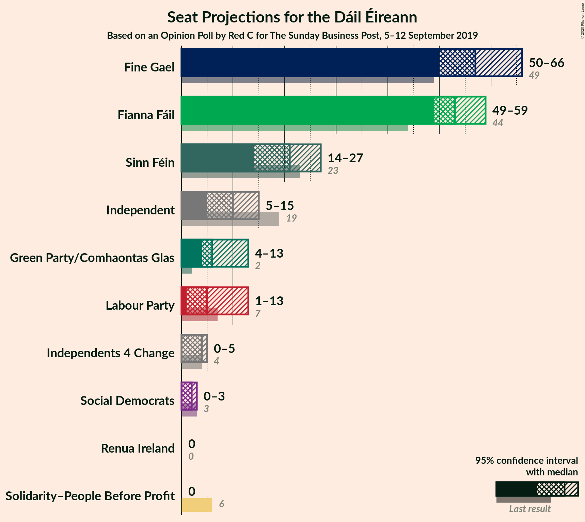
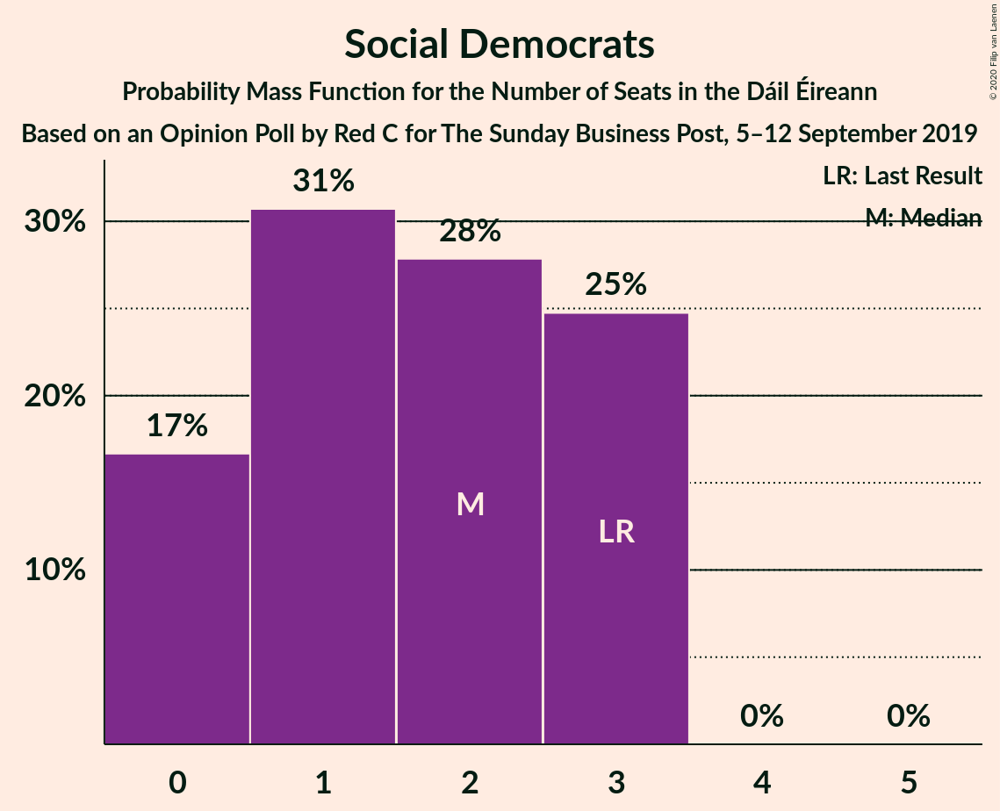
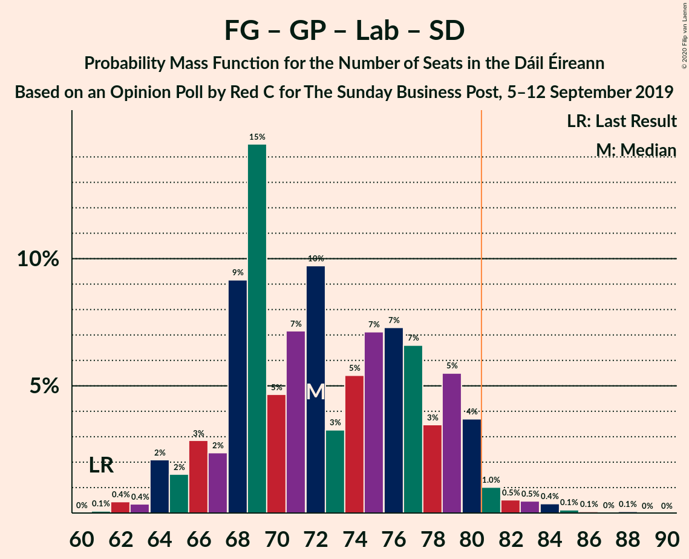
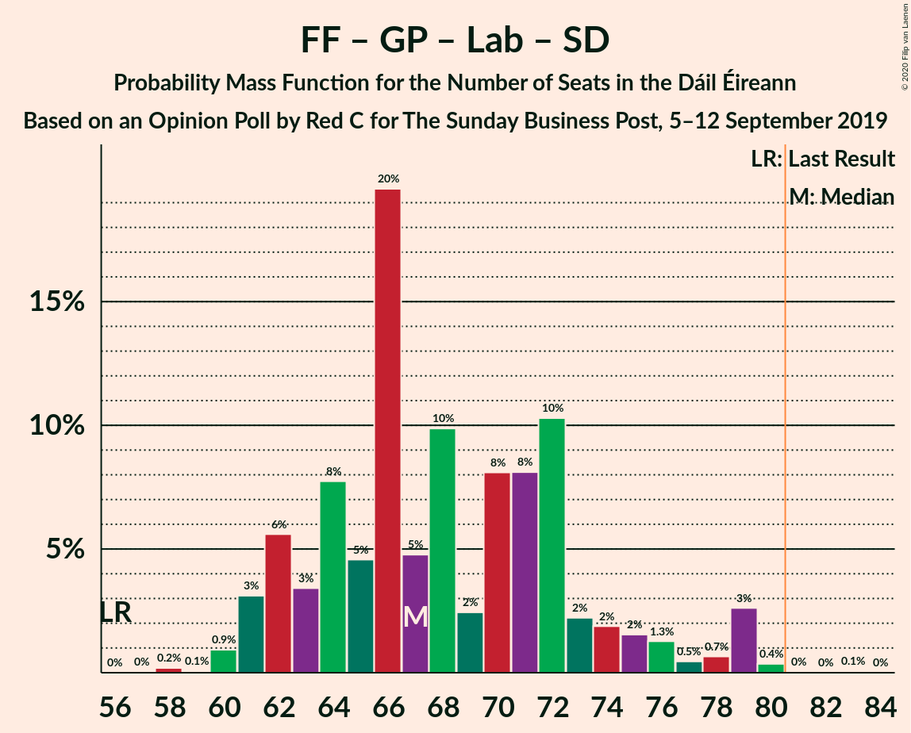

# Opinion Poll by Red C for The Sunday Business Post, 5–12 September 2019

<a href="#voting-intentions">Voting Intentions</a> | <a href="#seats">Seats</a> | <a href="#coalitions">Coalitions</a> | <a href="#technical-information">Technical Information</a>

## Voting Intentions

### Confidence Intervals

| Party | Last Result | Poll Result | 80% Confidence Interval | 90% Confidence Interval | 95% Confidence Interval | 99% Confidence Interval |
|:-----:|:-----------:|:-----------:|:-----------------------:|:-----------------------:|:-----------------------:|:-----------------------:|
| Fine Gael | 25.5% | 28.9% | 27.1–30.8% |26.6–31.3% |26.2–31.8% |25.3–32.7% |
| Fianna Fáil | 24.3% | 27.9% | 26.1–29.8% |25.6–30.3% |25.2–30.8% |24.4–31.7% |
| Sinn Féin | 13.8% | 12.0% | 10.8–13.4% |10.4–13.8% |10.1–14.2% |9.6–14.9% |
| Independent | 15.9% | 11.0% | 9.8–12.4% |9.5–12.8% |9.2–13.1% |8.7–13.8% |
| Green Party/Comhaontas Glas | 2.7% | 7.0% | 6.1–8.2% |5.8–8.5% |5.6–8.8% |5.2–9.3% |
| Labour Party | 6.6% | 6.0% | 5.1–7.1% |4.9–7.4% |4.7–7.7% |4.3–8.2% |
| Independents 4 Change | 1.5% | 1.4% | 1.0–2.0% |0.9–2.2% |0.8–2.3% |0.7–2.7% |
| Solidarity–People Before Profit | 3.9% | 1.0% | 0.7–1.5% |0.6–1.7% |0.5–1.8% |0.4–2.1% |
| Social Democrats | 3.0% | 1.0% | 0.7–1.5% |0.6–1.7% |0.5–1.8% |0.4–2.1% |
| Renua Ireland | 2.2% | 0.2% | 0.1–0.5% |0.1–0.6% |0.1–0.7% |0.0–0.9% |

*Note:* The poll result column reflects the actual value used in the calculations. Published results may vary slightly, and in addition be rounded to fewer digits.

## Seats

### Confidence Intervals

| Party | Last Result | Median | 80% Confidence Interval | 90% Confidence Interval | 95% Confidence Interval | 99% Confidence Interval |
|:-----:|:-----------:|:------:|:-----------------------:|:-----------------------:|:-----------------------:|:-----------------------:|
| <a href="#fine-gael">Fine Gael</a> | 49 | 61 | 52–65 |52–66 |50–66 |47–67 |
| <a href="#fianna-fáil">Fianna Fáil</a> | 44 | 52 | 51–58 |50–58 |49–58 |47–59 |
| <a href="#sinn-féin">Sinn Féin</a> | 23 | 17 | 17–24 |16–25 |16–28 |14–29 |
| <a href="#independent">Independent</a> | 19 | 11 | 7–14 |6–14 |6–15 |4–16 |
| <a href="#green-party/comhaontas-glas">Green Party/Comhaontas Glas</a> | 2 | 6 | 5–14 |4–14 |4–14 |4–15 |
| <a href="#labour-party">Labour Party</a> | 7 | 5 | 2–8 |2–9 |2–10 |1–15 |
| <a href="#independents-4-change">Independents 4 Change</a> | 4 | 3 | 2–4 |2–5 |0–5 |0–5 |
| <a href="#solidarity–people-before-profit">Solidarity–People Before Profit</a> | 6 | 0 | 0 |0 |0 |0 |
| <a href="#social-democrats">Social Democrats</a> | 3 | 1 | 0–2 |0–3 |0–3 |0–3 |
| <a href="#renua-ireland">Renua Ireland</a> | 0 | 0 | 0 |0 |0 |0 |

### Fine Gael

*For a full overview of the results for this party, see the [Fine Gael](party-finegael.html) page.*

| Number of Seats | Probability | Accumulated | Special Marks |
|:---------------:|:-----------:|:-----------:|:-------------:|
| 47 | 0.6% | 100% |  |
| 48 | 0.7% | 99.4% |  |
| 49 | 0.7% | 98.7% | Last Result |
| 50 | 0.7% | 98% |  |
| 51 | 2% | 97% |  |
| 52 | 9% | 95% |  |
| 53 | 2% | 86% |  |
| 54 | 8% | 84% |  |
| 55 | 1.1% | 76% |  |
| 56 | 0.7% | 75% |  |
| 57 | 12% | 74% |  |
| 58 | 3% | 63% |  |
| 59 | 4% | 60% |  |
| 60 | 3% | 55% |  |
| 61 | 7% | 52% | Median |
| 62 | 0.5% | 45% |  |
| 63 | 0.4% | 45% |  |
| 64 | 6% | 44% |  |
| 65 | 32% | 38% |  |
| 66 | 6% | 7% |  |
| 67 | 0.2% | 0.7% |  |
| 68 | 0% | 0.5% |  |
| 69 | 0.2% | 0.4% |  |
| 70 | 0.3% | 0.3% |  |
| 71 | 0% | 0% |  |

### Fianna Fáil

*For a full overview of the results for this party, see the [Fianna Fáil](party-fiannafáil.html) page.*

| Number of Seats | Probability | Accumulated | Special Marks |
|:---------------:|:-----------:|:-----------:|:-------------:|
| 43 | 0.1% | 100% |  |
| 44 | 0% | 99.9% | Last Result |
| 45 | 0.1% | 99.9% |  |
| 46 | 0.2% | 99.8% |  |
| 47 | 0.4% | 99.6% |  |
| 48 | 0.4% | 99.2% |  |
| 49 | 3% | 98.8% |  |
| 50 | 5% | 95% |  |
| 51 | 8% | 90% |  |
| 52 | 34% | 82% | Median |
| 53 | 7% | 47% |  |
| 54 | 4% | 40% |  |
| 55 | 6% | 36% |  |
| 56 | 15% | 30% |  |
| 57 | 3% | 15% |  |
| 58 | 11% | 12% |  |
| 59 | 0.7% | 0.8% |  |
| 60 | 0.1% | 0.1% |  |
| 61 | 0% | 0% |  |

### Sinn Féin

*For a full overview of the results for this party, see the [Sinn Féin](party-sinnféin.html) page.*

| Number of Seats | Probability | Accumulated | Special Marks |
|:---------------:|:-----------:|:-----------:|:-------------:|
| 13 | 0.1% | 100% |  |
| 14 | 0.9% | 99.8% |  |
| 15 | 0.3% | 99.0% |  |
| 16 | 8% | 98.6% |  |
| 17 | 43% | 90% | Median |
| 18 | 0.8% | 47% |  |
| 19 | 5% | 46% |  |
| 20 | 7% | 42% |  |
| 21 | 1.4% | 34% |  |
| 22 | 1.3% | 33% |  |
| 23 | 10% | 32% | Last Result |
| 24 | 16% | 22% |  |
| 25 | 2% | 6% |  |
| 26 | 0.8% | 5% |  |
| 27 | 0.2% | 4% |  |
| 28 | 3% | 4% |  |
| 29 | 0.4% | 0.7% |  |
| 30 | 0.1% | 0.4% |  |
| 31 | 0.2% | 0.2% |  |
| 32 | 0% | 0% |  |

### Independent

*For a full overview of the results for this party, see the [Independent](party-independent.html) page.*

| Number of Seats | Probability | Accumulated | Special Marks |
|:---------------:|:-----------:|:-----------:|:-------------:|
| 3 | 0.2% | 100% |  |
| 4 | 1.4% | 99.8% |  |
| 5 | 0.9% | 98% |  |
| 6 | 4% | 98% |  |
| 7 | 11% | 94% |  |
| 8 | 2% | 83% |  |
| 9 | 0.6% | 81% |  |
| 10 | 23% | 80% |  |
| 11 | 32% | 57% | Median |
| 12 | 6% | 25% |  |
| 13 | 3% | 19% |  |
| 14 | 12% | 17% |  |
| 15 | 4% | 5% |  |
| 16 | 0.9% | 0.9% |  |
| 17 | 0% | 0% |  |
| 18 | 0% | 0% |  |
| 19 | 0% | 0% | Last Result |

### Green Party/Comhaontas Glas

*For a full overview of the results for this party, see the [Green Party/Comhaontas Glas](party-greenpartycomhaontasglas.html) page.*

| Number of Seats | Probability | Accumulated | Special Marks |
|:---------------:|:-----------:|:-----------:|:-------------:|
| 2 | 0% | 100% | Last Result |
| 3 | 0% | 100% |  |
| 4 | 7% | 100% |  |
| 5 | 5% | 93% |  |
| 6 | 58% | 88% | Median |
| 7 | 1.1% | 30% |  |
| 8 | 8% | 29% |  |
| 9 | 5% | 22% |  |
| 10 | 2% | 17% |  |
| 11 | 0.6% | 15% |  |
| 12 | 0.2% | 14% |  |
| 13 | 4% | 14% |  |
| 14 | 9% | 10% |  |
| 15 | 1.0% | 1.2% |  |
| 16 | 0.1% | 0.2% |  |
| 17 | 0.1% | 0.1% |  |
| 18 | 0% | 0% |  |

### Labour Party

*For a full overview of the results for this party, see the [Labour Party](party-labourparty.html) page.*

| Number of Seats | Probability | Accumulated | Special Marks |
|:---------------:|:-----------:|:-----------:|:-------------:|
| 0 | 0.3% | 100% |  |
| 1 | 1.1% | 99.7% |  |
| 2 | 15% | 98.6% |  |
| 3 | 16% | 84% |  |
| 4 | 10% | 68% |  |
| 5 | 31% | 58% | Median |
| 6 | 8% | 27% |  |
| 7 | 7% | 19% | Last Result |
| 8 | 7% | 13% |  |
| 9 | 1.4% | 6% |  |
| 10 | 2% | 4% |  |
| 11 | 0.5% | 2% |  |
| 12 | 0.5% | 2% |  |
| 13 | 0.1% | 1.1% |  |
| 14 | 0.1% | 1.0% |  |
| 15 | 0.5% | 0.9% |  |
| 16 | 0.2% | 0.4% |  |
| 17 | 0.2% | 0.2% |  |
| 18 | 0% | 0% |  |

### Independents 4 Change

*For a full overview of the results for this party, see the [Independents 4 Change](party-independents4change.html) page.*

| Number of Seats | Probability | Accumulated | Special Marks |
|:---------------:|:-----------:|:-----------:|:-------------:|
| 0 | 3% | 100% |  |
| 1 | 2% | 97% |  |
| 2 | 16% | 95% |  |
| 3 | 36% | 79% | Median |
| 4 | 37% | 44% | Last Result |
| 5 | 7% | 7% |  |
| 6 | 0% | 0% |  |

### Solidarity–People Before Profit

*For a full overview of the results for this party, see the [Solidarity–People Before Profit](party-solidarity–peoplebeforeprofit.html) page.*

| Number of Seats | Probability | Accumulated | Special Marks |
|:---------------:|:-----------:|:-----------:|:-------------:|
| 0 | 99.5% | 100% | Median |
| 1 | 0.3% | 0.5% |  |
| 2 | 0.2% | 0.2% |  |
| 3 | 0% | 0% |  |
| 4 | 0% | 0% |  |
| 5 | 0% | 0% |  |
| 6 | 0% | 0% | Last Result |

### Social Democrats

*For a full overview of the results for this party, see the [Social Democrats](party-socialdemocrats.html) page.*

| Number of Seats | Probability | Accumulated | Special Marks |
|:---------------:|:-----------:|:-----------:|:-------------:|
| 0 | 23% | 100% |  |
| 1 | 61% | 77% | Median |
| 2 | 10% | 15% |  |
| 3 | 6% | 6% | Last Result |
| 4 | 0% | 0% |  |

### Renua Ireland

*For a full overview of the results for this party, see the [Renua Ireland](party-renuaireland.html) page.*

| Number of Seats | Probability | Accumulated | Special Marks |
|:---------------:|:-----------:|:-----------:|:-------------:|
| 0 | 100% | 100% | Last Result, Median |

## Coalitions

### Confidence Intervals

| Coalition | Last Result | Median | Majority? | 80% Confidence Interval | 90% Confidence Interval | 95% Confidence Interval | 99% Confidence Interval |
|:---------:|:-----------:|:------:|:---------:|:-----------------------:|:-----------------------:|:-----------------------:|:-----------------------:|
| Fine Gael – Fianna Fáil | 93 | 115 | 100% | 108–117 | 106–120 | 104–121 | 101–122 |
| Fianna Fáil – Sinn Féin | 67 | 72 | 2% | 69–80 | 68–80 | 67–80 | 66–82 |
| Fine Gael – Green Party/Comhaontas Glas – Labour Party – Social Democrats | 61 | 74 | 1.4% | 67–77 | 67–79 | 66–80 | 63–83 |
| Fine Gael – Green Party/Comhaontas Glas – Labour Party | 58 | 73 | 1.0% | 66–76 | 66–77 | 65–79 | 62–82 |
| Fianna Fáil – Green Party/Comhaontas Glas – Labour Party – Social Democrats | 56 | 65 | 0.1% | 62–72 | 61–76 | 60–76 | 58–80 |
| Fianna Fáil – Green Party/Comhaontas Glas – Labour Party | 53 | 63 | 0.1% | 61–72 | 60–74 | 59–75 | 57–80 |
| Fine Gael – Labour Party | 56 | 67 | 0% | 54–70 | 54–71 | 54–73 | 53–74 |
| Fine Gael – Green Party/Comhaontas Glas | 51 | 68 | 0% | 62–71 | 60–72 | 57–72 | 55–75 |
| Fianna Fáil – Green Party/Comhaontas Glas | 46 | 59 | 0% | 55–70 | 55–70 | 55–70 | 53–72 |
| Fianna Fáil – Labour Party | 51 | 57 | 0% | 55–64 | 53–66 | 53–66 | 51–69 |
| Fine Gael | 49 | 61 | 0% | 52–65 | 52–66 | 50–66 | 47–67 |

### Fine Gael – Fianna Fáil

| Number of Seats | Probability | Accumulated | Special Marks |
|:---------------:|:-----------:|:-----------:|:-------------:|
| 93 | 0% | 100% | Last Result |
| 94 | 0% | 100% |  |
| 95 | 0% | 100% |  |
| 96 | 0% | 100% |  |
| 97 | 0% | 100% |  |
| 98 | 0% | 100% |  |
| 99 | 0.2% | 100% |  |
| 100 | 0.2% | 99.8% |  |
| 101 | 0.3% | 99.6% |  |
| 102 | 0.6% | 99.3% |  |
| 103 | 0.8% | 98.7% |  |
| 104 | 0.8% | 98% |  |
| 105 | 0.4% | 97% |  |
| 106 | 4% | 97% |  |
| 107 | 1.0% | 93% |  |
| 108 | 13% | 92% |  |
| 109 | 3% | 79% |  |
| 110 | 6% | 76% |  |
| 111 | 2% | 70% |  |
| 112 | 13% | 68% |  |
| 113 | 1.3% | 56% | Median |
| 114 | 3% | 54% |  |
| 115 | 9% | 51% |  |
| 116 | 1.5% | 42% |  |
| 117 | 31% | 41% |  |
| 118 | 3% | 10% |  |
| 119 | 0.4% | 7% |  |
| 120 | 3% | 6% |  |
| 121 | 3% | 4% |  |
| 122 | 0.7% | 0.8% |  |
| 123 | 0.1% | 0.1% |  |
| 124 | 0% | 0% |  |

### Fianna Fáil – Sinn Féin

| Number of Seats | Probability | Accumulated | Special Marks |
|:---------------:|:-----------:|:-----------:|:-------------:|
| 62 | 0.1% | 100% |  |
| 63 | 0.1% | 99.9% |  |
| 64 | 0.1% | 99.8% |  |
| 65 | 0.1% | 99.7% |  |
| 66 | 0.4% | 99.5% |  |
| 67 | 4% | 99.1% | Last Result |
| 68 | 4% | 96% |  |
| 69 | 31% | 92% | Median |
| 70 | 4% | 62% |  |
| 71 | 0.8% | 58% |  |
| 72 | 9% | 57% |  |
| 73 | 3% | 48% |  |
| 74 | 7% | 45% |  |
| 75 | 4% | 38% |  |
| 76 | 1.0% | 33% |  |
| 77 | 13% | 32% |  |
| 78 | 4% | 19% |  |
| 79 | 2% | 15% |  |
| 80 | 11% | 13% |  |
| 81 | 0.7% | 2% | Majority |
| 82 | 1.3% | 1.5% |  |
| 83 | 0.1% | 0.2% |  |
| 84 | 0% | 0.1% |  |
| 85 | 0% | 0.1% |  |
| 86 | 0.1% | 0.1% |  |
| 87 | 0% | 0% |  |

### Fine Gael – Green Party/Comhaontas Glas – Labour Party – Social Democrats

| Number of Seats | Probability | Accumulated | Special Marks |
|:---------------:|:-----------:|:-----------:|:-------------:|
| 61 | 0.2% | 100% | Last Result |
| 62 | 0.1% | 99.8% |  |
| 63 | 0.4% | 99.6% |  |
| 64 | 0.1% | 99.2% |  |
| 65 | 0.2% | 99.0% |  |
| 66 | 2% | 98.8% |  |
| 67 | 9% | 97% |  |
| 68 | 15% | 88% |  |
| 69 | 6% | 73% |  |
| 70 | 1.1% | 68% |  |
| 71 | 0.7% | 67% |  |
| 72 | 10% | 66% |  |
| 73 | 5% | 56% | Median |
| 74 | 6% | 50% |  |
| 75 | 3% | 44% |  |
| 76 | 0.4% | 42% |  |
| 77 | 33% | 41% |  |
| 78 | 0.4% | 8% |  |
| 79 | 4% | 8% |  |
| 80 | 3% | 4% |  |
| 81 | 0.5% | 1.4% | Majority |
| 82 | 0.4% | 0.9% |  |
| 83 | 0.2% | 0.5% |  |
| 84 | 0.2% | 0.3% |  |
| 85 | 0.1% | 0.1% |  |
| 86 | 0% | 0% |  |

### Fine Gael – Green Party/Comhaontas Glas – Labour Party

| Number of Seats | Probability | Accumulated | Special Marks |
|:---------------:|:-----------:|:-----------:|:-------------:|
| 58 | 0% | 100% | Last Result |
| 59 | 0.1% | 100% |  |
| 60 | 0% | 99.9% |  |
| 61 | 0.2% | 99.8% |  |
| 62 | 0.5% | 99.6% |  |
| 63 | 0.8% | 99.2% |  |
| 64 | 0.8% | 98% |  |
| 65 | 0.7% | 98% |  |
| 66 | 9% | 97% |  |
| 67 | 5% | 88% |  |
| 68 | 14% | 83% |  |
| 69 | 4% | 70% |  |
| 70 | 5% | 66% |  |
| 71 | 6% | 61% |  |
| 72 | 3% | 54% | Median |
| 73 | 5% | 51% |  |
| 74 | 3% | 46% |  |
| 75 | 0.8% | 42% |  |
| 76 | 33% | 42% |  |
| 77 | 4% | 8% |  |
| 78 | 1.0% | 5% |  |
| 79 | 2% | 4% |  |
| 80 | 0.3% | 1.3% |  |
| 81 | 0.5% | 1.0% | Majority |
| 82 | 0.2% | 0.5% |  |
| 83 | 0.2% | 0.4% |  |
| 84 | 0.1% | 0.1% |  |
| 85 | 0.1% | 0.1% |  |
| 86 | 0% | 0% |  |

### Fianna Fáil – Green Party/Comhaontas Glas – Labour Party – Social Democrats

| Number of Seats | Probability | Accumulated | Special Marks |
|:---------------:|:-----------:|:-----------:|:-------------:|
| 56 | 0.1% | 100% | Last Result |
| 57 | 0.1% | 99.9% |  |
| 58 | 2% | 99.8% |  |
| 59 | 0% | 98% |  |
| 60 | 3% | 98% |  |
| 61 | 3% | 95% |  |
| 62 | 5% | 92% |  |
| 63 | 6% | 87% |  |
| 64 | 30% | 81% | Median |
| 65 | 4% | 51% |  |
| 66 | 10% | 47% |  |
| 67 | 2% | 37% |  |
| 68 | 7% | 35% |  |
| 69 | 2% | 29% |  |
| 70 | 1.2% | 26% |  |
| 71 | 6% | 25% |  |
| 72 | 11% | 19% |  |
| 73 | 0.2% | 9% |  |
| 74 | 0.9% | 9% |  |
| 75 | 0.2% | 8% |  |
| 76 | 5% | 8% |  |
| 77 | 0.3% | 2% |  |
| 78 | 0.3% | 2% |  |
| 79 | 0.6% | 2% |  |
| 80 | 0.9% | 1.0% |  |
| 81 | 0% | 0.1% | Majority |
| 82 | 0% | 0.1% |  |
| 83 | 0% | 0.1% |  |
| 84 | 0% | 0% |  |

### Fianna Fáil – Green Party/Comhaontas Glas – Labour Party

| Number of Seats | Probability | Accumulated | Special Marks |
|:---------------:|:-----------:|:-----------:|:-------------:|
| 53 | 0% | 100% | Last Result |
| 54 | 0% | 100% |  |
| 55 | 0% | 100% |  |
| 56 | 0.1% | 99.9% |  |
| 57 | 2% | 99.8% |  |
| 58 | 0.1% | 98% |  |
| 59 | 3% | 98% |  |
| 60 | 3% | 95% |  |
| 61 | 5% | 92% |  |
| 62 | 6% | 87% |  |
| 63 | 33% | 81% | Median |
| 64 | 2% | 48% |  |
| 65 | 4% | 46% |  |
| 66 | 7% | 42% |  |
| 67 | 5% | 35% |  |
| 68 | 3% | 30% |  |
| 69 | 3% | 27% |  |
| 70 | 4% | 23% |  |
| 71 | 1.1% | 19% |  |
| 72 | 10% | 18% |  |
| 73 | 0.8% | 8% |  |
| 74 | 5% | 8% |  |
| 75 | 0.4% | 3% |  |
| 76 | 1.0% | 2% |  |
| 77 | 0.1% | 1.3% |  |
| 78 | 0% | 1.2% |  |
| 79 | 0.1% | 1.1% |  |
| 80 | 0.9% | 1.0% |  |
| 81 | 0% | 0.1% | Majority |
| 82 | 0% | 0% |  |

### Fine Gael – Labour Party

| Number of Seats | Probability | Accumulated | Special Marks |
|:---------------:|:-----------:|:-----------:|:-------------:|
| 50 | 0.1% | 100% |  |
| 51 | 0% | 99.8% |  |
| 52 | 0% | 99.8% |  |
| 53 | 1.1% | 99.8% |  |
| 54 | 9% | 98.7% |  |
| 55 | 0.7% | 89% |  |
| 56 | 0.4% | 89% | Last Result |
| 57 | 4% | 88% |  |
| 58 | 1.2% | 85% |  |
| 59 | 1.5% | 84% |  |
| 60 | 8% | 82% |  |
| 61 | 4% | 74% |  |
| 62 | 9% | 70% |  |
| 63 | 5% | 61% |  |
| 64 | 2% | 56% |  |
| 65 | 0.8% | 54% |  |
| 66 | 0.8% | 53% | Median |
| 67 | 10% | 53% |  |
| 68 | 1.2% | 43% |  |
| 69 | 0.5% | 41% |  |
| 70 | 33% | 41% |  |
| 71 | 3% | 8% |  |
| 72 | 1.1% | 4% |  |
| 73 | 2% | 3% |  |
| 74 | 0.2% | 0.7% |  |
| 75 | 0.1% | 0.5% |  |
| 76 | 0.3% | 0.4% |  |
| 77 | 0.1% | 0.1% |  |
| 78 | 0% | 0% |  |

### Fine Gael – Green Party/Comhaontas Glas

| Number of Seats | Probability | Accumulated | Special Marks |
|:---------------:|:-----------:|:-----------:|:-------------:|
| 51 | 0% | 100% | Last Result |
| 52 | 0% | 100% |  |
| 53 | 0% | 100% |  |
| 54 | 0.2% | 100% |  |
| 55 | 0.7% | 99.8% |  |
| 56 | 0.9% | 99.1% |  |
| 57 | 2% | 98% |  |
| 58 | 0.6% | 96% |  |
| 59 | 0.8% | 96% |  |
| 60 | 0.9% | 95% |  |
| 61 | 0.7% | 94% |  |
| 62 | 4% | 93% |  |
| 63 | 12% | 89% |  |
| 64 | 2% | 77% |  |
| 65 | 9% | 75% |  |
| 66 | 14% | 66% |  |
| 67 | 1.3% | 52% | Median |
| 68 | 2% | 51% |  |
| 69 | 0.7% | 49% |  |
| 70 | 10% | 48% |  |
| 71 | 31% | 38% |  |
| 72 | 6% | 8% |  |
| 73 | 0.2% | 1.2% |  |
| 74 | 0.2% | 1.0% |  |
| 75 | 0.4% | 0.8% |  |
| 76 | 0.2% | 0.3% |  |
| 77 | 0% | 0.2% |  |
| 78 | 0.1% | 0.1% |  |
| 79 | 0% | 0% |  |

### Fianna Fáil – Green Party/Comhaontas Glas

| Number of Seats | Probability | Accumulated | Special Marks |
|:---------------:|:-----------:|:-----------:|:-------------:|
| 46 | 0% | 100% | Last Result |
| 47 | 0% | 100% |  |
| 48 | 0.1% | 100% |  |
| 49 | 0% | 99.9% |  |
| 50 | 0.1% | 99.9% |  |
| 51 | 0% | 99.9% |  |
| 52 | 0.2% | 99.9% |  |
| 53 | 0.4% | 99.7% |  |
| 54 | 0.2% | 99.3% |  |
| 55 | 10% | 99.1% |  |
| 56 | 4% | 89% |  |
| 57 | 3% | 85% |  |
| 58 | 31% | 82% | Median |
| 59 | 7% | 51% |  |
| 60 | 4% | 44% |  |
| 61 | 4% | 40% |  |
| 62 | 4% | 36% |  |
| 63 | 3% | 32% |  |
| 64 | 4% | 28% |  |
| 65 | 4% | 25% |  |
| 66 | 5% | 20% |  |
| 67 | 4% | 15% |  |
| 68 | 0.2% | 11% |  |
| 69 | 0.1% | 11% |  |
| 70 | 10% | 11% |  |
| 71 | 0.1% | 1.1% |  |
| 72 | 0.9% | 1.0% |  |
| 73 | 0.1% | 0.1% |  |
| 74 | 0% | 0% |  |

### Fianna Fáil – Labour Party

| Number of Seats | Probability | Accumulated | Special Marks |
|:---------------:|:-----------:|:-----------:|:-------------:|
| 48 | 0% | 100% |  |
| 49 | 0.1% | 99.9% |  |
| 50 | 0.3% | 99.9% |  |
| 51 | 0.2% | 99.6% | Last Result |
| 52 | 2% | 99.4% |  |
| 53 | 3% | 98% |  |
| 54 | 3% | 95% |  |
| 55 | 3% | 92% |  |
| 56 | 6% | 88% |  |
| 57 | 40% | 82% | Median |
| 58 | 10% | 43% |  |
| 59 | 6% | 33% |  |
| 60 | 7% | 27% |  |
| 61 | 8% | 20% |  |
| 62 | 0.8% | 12% |  |
| 63 | 0.6% | 11% |  |
| 64 | 1.5% | 11% |  |
| 65 | 3% | 9% |  |
| 66 | 5% | 6% |  |
| 67 | 0.4% | 2% |  |
| 68 | 0.2% | 1.3% |  |
| 69 | 0.6% | 1.1% |  |
| 70 | 0.3% | 0.5% |  |
| 71 | 0% | 0.1% |  |
| 72 | 0.1% | 0.1% |  |
| 73 | 0% | 0% |  |

### Fine Gael

| Number of Seats | Probability | Accumulated | Special Marks |
|:---------------:|:-----------:|:-----------:|:-------------:|
| 47 | 0.6% | 100% |  |
| 48 | 0.7% | 99.4% |  |
| 49 | 0.7% | 98.7% | Last Result |
| 50 | 0.7% | 98% |  |
| 51 | 2% | 97% |  |
| 52 | 9% | 95% |  |
| 53 | 2% | 86% |  |
| 54 | 8% | 84% |  |
| 55 | 1.1% | 76% |  |
| 56 | 0.7% | 75% |  |
| 57 | 12% | 74% |  |
| 58 | 3% | 63% |  |
| 59 | 4% | 60% |  |
| 60 | 3% | 55% |  |
| 61 | 7% | 52% | Median |
| 62 | 0.5% | 45% |  |
| 63 | 0.4% | 45% |  |
| 64 | 6% | 44% |  |
| 65 | 32% | 38% |  |
| 66 | 6% | 7% |  |
| 67 | 0.2% | 0.7% |  |
| 68 | 0% | 0.5% |  |
| 69 | 0.2% | 0.4% |  |
| 70 | 0.3% | 0.3% |  |
| 71 | 0% | 0% |  |

## Technical Information

### Opinion Poll

+ **Polling firm:** Red C
+ **Commissioner(s):** The Sunday Business Post
+ **Fieldwork period:** 5–12 September 2019

### Calculations

+ **Sample size:** 1000
+ **Simulations done:** 131,072
+ **Error estimate:** 2.73%

