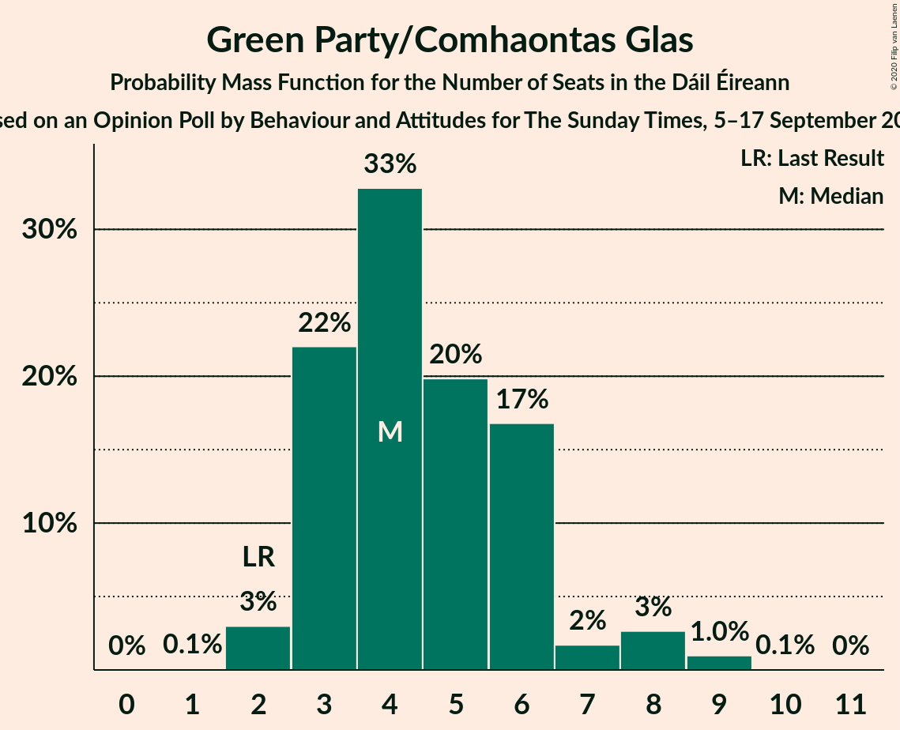
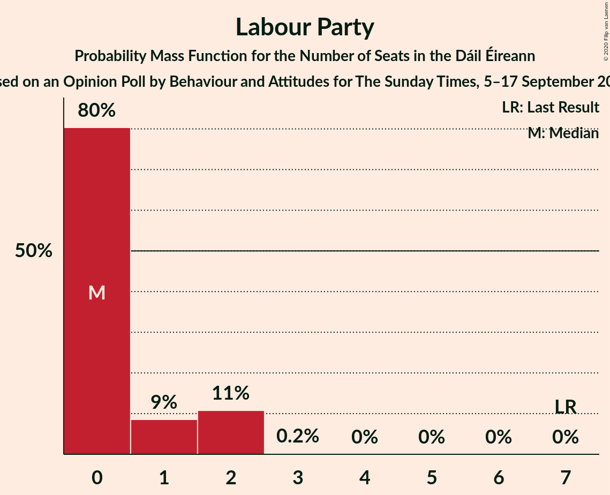
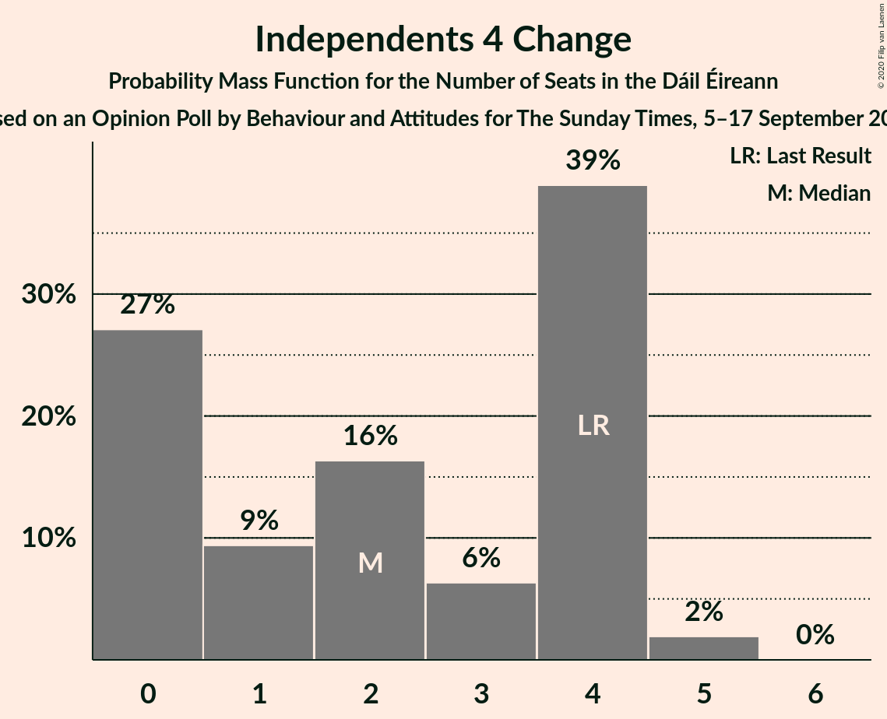

# Opinion Poll by Behaviour and Attitudes for The Sunday Times, 5–17 September 2019

<a href="#voting-intentions">Voting Intentions</a> | <a href="#seats">Seats</a> | <a href="#coalitions">Coalitions</a> | <a href="#technical-information">Technical Information</a>

## Voting Intentions

### Confidence Intervals

| Party | Last Result | Poll Result | 80% Confidence Interval | 90% Confidence Interval | 95% Confidence Interval | 99% Confidence Interval |
|:-----:|:-----------:|:-----------:|:-----------------------:|:-----------------------:|:-----------------------:|:-----------------------:|
| Fianna Fáil | 24.3% | 29.0% | 27.1–31.0% |26.6–31.6% |26.1–32.1% |25.2–33.0% |
| Fine Gael | 25.5% | 26.0% | 24.2–27.9% |23.7–28.5% |23.2–29.0% |22.4–29.9% |
| Sinn Féin | 13.8% | 20.0% | 18.4–21.8% |17.9–22.3% |17.5–22.7% |16.8–23.6% |
| Independent | 15.9% | 8.4% | 7.4–9.8% |7.1–10.1% |6.8–10.5% |6.3–11.1% |
| Green Party/Comhaontas Glas | 2.7% | 5.0% | 4.2–6.1% |3.9–6.4% |3.7–6.6% |3.4–7.2% |
| Labour Party | 6.6% | 3.0% | 2.4–3.9% |2.2–4.1% |2.1–4.3% |1.8–4.8% |
| Independents 4 Change | 1.5% | 1.1% | 0.8–1.7% |0.7–1.9% |0.6–2.0% |0.5–2.4% |
| Solidarity–People Before Profit | 3.9% | 1.0% | 0.7–1.6% |0.6–1.7% |0.5–1.9% |0.4–2.2% |
| Social Democrats | 3.0% | 1.0% | 0.7–1.6% |0.6–1.7% |0.5–1.9% |0.4–2.2% |
| Renua Ireland | 2.2% | 1.0% | 0.7–1.6% |0.6–1.7% |0.5–1.9% |0.4–2.2% |

*Note:* The poll result column reflects the actual value used in the calculations. Published results may vary slightly, and in addition be rounded to fewer digits.

## Seats

### Confidence Intervals

| Party | Last Result | Median | 80% Confidence Interval | 90% Confidence Interval | 95% Confidence Interval | 99% Confidence Interval |
|:-----:|:-----------:|:------:|:-----------------------:|:-----------------------:|:-----------------------:|:-----------------------:|
| <a href="#fianna-fáil">Fianna Fáil</a> | 44 | 56 | 54–59 |53–59 |52–61 |50–61 |
| <a href="#fine-gael">Fine Gael</a> | 49 | 51 | 47–55 |46–57 |45–59 |44–60 |
| <a href="#sinn-féin">Sinn Féin</a> | 23 | 39 | 37–40 |37–41 |36–42 |34–43 |
| <a href="#independent">Independent</a> | 19 | 4 | 4–5 |4–6 |4–9 |3–11 |
| <a href="#green-party/comhaontas-glas">Green Party/Comhaontas Glas</a> | 2 | 4 | 3–6 |3–6 |3–8 |2–9 |
| <a href="#labour-party">Labour Party</a> | 7 | 0 | 0–1 |0–1 |0–2 |0–2 |
| <a href="#independents-4-change">Independents 4 Change</a> | 4 | 3 | 0–4 |0–4 |0–4 |0–5 |
| <a href="#solidarity–people-before-profit">Solidarity–People Before Profit</a> | 6 | 0 | 0 |0 |0 |0–3 |
| <a href="#social-democrats">Social Democrats</a> | 3 | 2 | 1–3 |0–3 |0–3 |0–3 |
| <a href="#renua-ireland">Renua Ireland</a> | 0 | 0 | 0 |0 |0 |0–1 |

### Fianna Fáil

*For a full overview of the results for this party, see the [Fianna Fáil](party-fiannafáil.html) page.*

| Number of Seats | Probability | Accumulated | Special Marks |
|:---------------:|:-----------:|:-----------:|:-------------:|
| 44 | 0% | 100% | Last Result |
| 45 | 0% | 100% |  |
| 46 | 0% | 100% |  |
| 47 | 0.1% | 100% |  |
| 48 | 0.2% | 99.9% |  |
| 49 | 0% | 99.6% |  |
| 50 | 0.5% | 99.6% |  |
| 51 | 0.9% | 99.1% |  |
| 52 | 2% | 98% |  |
| 53 | 5% | 96% |  |
| 54 | 4% | 91% |  |
| 55 | 4% | 87% |  |
| 56 | 42% | 82% | Median |
| 57 | 5% | 41% |  |
| 58 | 4% | 36% |  |
| 59 | 28% | 32% |  |
| 60 | 0.3% | 4% |  |
| 61 | 4% | 4% |  |
| 62 | 0% | 0.1% |  |
| 63 | 0% | 0% |  |

### Fine Gael

*For a full overview of the results for this party, see the [Fine Gael](party-finegael.html) page.*

| Number of Seats | Probability | Accumulated | Special Marks |
|:---------------:|:-----------:|:-----------:|:-------------:|
| 42 | 0% | 100% |  |
| 43 | 0% | 99.9% |  |
| 44 | 2% | 99.9% |  |
| 45 | 2% | 98% |  |
| 46 | 2% | 97% |  |
| 47 | 5% | 94% |  |
| 48 | 1.1% | 89% |  |
| 49 | 29% | 88% | Last Result |
| 50 | 3% | 59% |  |
| 51 | 39% | 56% | Median |
| 52 | 1.4% | 17% |  |
| 53 | 4% | 16% |  |
| 54 | 0.6% | 12% |  |
| 55 | 2% | 11% |  |
| 56 | 3% | 9% |  |
| 57 | 3% | 6% |  |
| 58 | 0.8% | 4% |  |
| 59 | 1.4% | 3% |  |
| 60 | 1.0% | 1.4% |  |
| 61 | 0.1% | 0.4% |  |
| 62 | 0.2% | 0.3% |  |
| 63 | 0% | 0% |  |

### Sinn Féin

*For a full overview of the results for this party, see the [Sinn Féin](party-sinnféin.html) page.*

| Number of Seats | Probability | Accumulated | Special Marks |
|:---------------:|:-----------:|:-----------:|:-------------:|
| 23 | 0% | 100% | Last Result |
| 24 | 0% | 100% |  |
| 25 | 0% | 100% |  |
| 26 | 0% | 100% |  |
| 27 | 0% | 100% |  |
| 28 | 0% | 100% |  |
| 29 | 0% | 100% |  |
| 30 | 0% | 100% |  |
| 31 | 0.1% | 100% |  |
| 32 | 0% | 99.9% |  |
| 33 | 0% | 99.9% |  |
| 34 | 0.4% | 99.8% |  |
| 35 | 0.3% | 99.5% |  |
| 36 | 4% | 99.2% |  |
| 37 | 8% | 96% |  |
| 38 | 5% | 87% |  |
| 39 | 65% | 83% | Median |
| 40 | 12% | 18% |  |
| 41 | 1.1% | 6% |  |
| 42 | 3% | 5% |  |
| 43 | 1.2% | 2% |  |
| 44 | 0.2% | 0.4% |  |
| 45 | 0.1% | 0.1% |  |
| 46 | 0% | 0.1% |  |
| 47 | 0% | 0% |  |

### Independent

*For a full overview of the results for this party, see the [Independent](party-independent.html) page.*

| Number of Seats | Probability | Accumulated | Special Marks |
|:---------------:|:-----------:|:-----------:|:-------------:|
| 2 | 0.1% | 100% |  |
| 3 | 1.0% | 99.9% |  |
| 4 | 51% | 99.0% | Median |
| 5 | 42% | 48% |  |
| 6 | 0.8% | 5% |  |
| 7 | 0.2% | 5% |  |
| 8 | 0.3% | 4% |  |
| 9 | 3% | 4% |  |
| 10 | 0.3% | 0.8% |  |
| 11 | 0.2% | 0.5% |  |
| 12 | 0.3% | 0.3% |  |
| 13 | 0% | 0% |  |
| 14 | 0% | 0% |  |
| 15 | 0% | 0% |  |
| 16 | 0% | 0% |  |
| 17 | 0% | 0% |  |
| 18 | 0% | 0% |  |
| 19 | 0% | 0% | Last Result |

### Green Party/Comhaontas Glas

*For a full overview of the results for this party, see the [Green Party/Comhaontas Glas](party-greenpartycomhaontasglas.html) page.*

| Number of Seats | Probability | Accumulated | Special Marks |
|:---------------:|:-----------:|:-----------:|:-------------:|
| 1 | 0.1% | 100% |  |
| 2 | 1.0% | 99.9% | Last Result |
| 3 | 37% | 99.0% |  |
| 4 | 45% | 62% | Median |
| 5 | 5% | 17% |  |
| 6 | 7% | 12% |  |
| 7 | 0.8% | 5% |  |
| 8 | 3% | 4% |  |
| 9 | 1.1% | 1.2% |  |
| 10 | 0.1% | 0.1% |  |
| 11 | 0% | 0% |  |

### Labour Party

*For a full overview of the results for this party, see the [Labour Party](party-labourparty.html) page.*

| Number of Seats | Probability | Accumulated | Special Marks |
|:---------------:|:-----------:|:-----------:|:-------------:|
| 0 | 88% | 100% | Median |
| 1 | 8% | 12% |  |
| 2 | 3% | 4% |  |
| 3 | 0.1% | 0.2% |  |
| 4 | 0% | 0.1% |  |
| 5 | 0% | 0% |  |
| 6 | 0% | 0% |  |
| 7 | 0% | 0% | Last Result |

### Independents 4 Change

*For a full overview of the results for this party, see the [Independents 4 Change](party-independents4change.html) page.*

| Number of Seats | Probability | Accumulated | Special Marks |
|:---------------:|:-----------:|:-----------:|:-------------:|
| 0 | 12% | 100% |  |
| 1 | 5% | 88% |  |
| 2 | 29% | 83% |  |
| 3 | 5% | 55% | Median |
| 4 | 48% | 50% | Last Result |
| 5 | 2% | 2% |  |
| 6 | 0% | 0% |  |

### Solidarity–People Before Profit

*For a full overview of the results for this party, see the [Solidarity–People Before Profit](party-solidarity–peoplebeforeprofit.html) page.*

| Number of Seats | Probability | Accumulated | Special Marks |
|:---------------:|:-----------:|:-----------:|:-------------:|
| 0 | 99.2% | 100% | Median |
| 1 | 0.3% | 0.8% |  |
| 2 | 0% | 0.6% |  |
| 3 | 0.4% | 0.5% |  |
| 4 | 0.1% | 0.1% |  |
| 5 | 0% | 0% |  |
| 6 | 0% | 0% | Last Result |

### Social Democrats

*For a full overview of the results for this party, see the [Social Democrats](party-socialdemocrats.html) page.*

| Number of Seats | Probability | Accumulated | Special Marks |
|:---------------:|:-----------:|:-----------:|:-------------:|
| 0 | 9% | 100% |  |
| 1 | 10% | 91% |  |
| 2 | 41% | 81% | Median |
| 3 | 40% | 40% | Last Result |
| 4 | 0.2% | 0.2% |  |
| 5 | 0% | 0% |  |

### Renua Ireland

*For a full overview of the results for this party, see the [Renua Ireland](party-renuaireland.html) page.*

| Number of Seats | Probability | Accumulated | Special Marks |
|:---------------:|:-----------:|:-----------:|:-------------:|
| 0 | 98% | 100% | Last Result, Median |
| 1 | 2% | 2% |  |
| 2 | 0% | 0% |  |

## Coalitions

### Confidence Intervals

| Coalition | Last Result | Median | Majority? | 80% Confidence Interval | 90% Confidence Interval | 95% Confidence Interval | 99% Confidence Interval |
|:---------:|:-----------:|:------:|:---------:|:-----------------------:|:-----------------------:|:-----------------------:|:-----------------------:|
| Fianna Fáil – Fine Gael | 93 | 107 | 100% | 105–109 | 103–111 | 100–113 | 98–113 |
| Fianna Fáil – Sinn Féin | 67 | 95 | 100% | 92–98 | 90–100 | 89–101 | 87–101 |
| Fianna Fáil – Green Party/Comhaontas Glas – Labour Party – Social Democrats | 56 | 62 | 0% | 60–65 | 59–66 | 58–67 | 55–68 |
| Fianna Fáil – Green Party/Comhaontas Glas – Labour Party | 53 | 60 | 0% | 59–63 | 57–65 | 56–65 | 55–67 |
| Fianna Fáil – Green Party/Comhaontas Glas | 46 | 60 | 0% | 59–63 | 57–64 | 55–64 | 54–66 |
| Fine Gael – Green Party/Comhaontas Glas – Labour Party – Social Democrats | 61 | 57 | 0% | 55–62 | 52–64 | 51–64 | 51–67 |
| Fine Gael – Green Party/Comhaontas Glas – Labour Party | 58 | 55 | 0% | 52–60 | 51–62 | 51–63 | 50–64 |
| Fianna Fáil – Labour Party | 51 | 56 | 0% | 54–59 | 53–59 | 52–62 | 50–62 |
| Fine Gael – Green Party/Comhaontas Glas | 51 | 55 | 0% | 52–59 | 50–60 | 50–62 | 50–64 |
| Fine Gael | 49 | 51 | 0% | 47–55 | 46–57 | 45–59 | 44–60 |
| Fine Gael – Labour Party | 56 | 51 | 0% | 48–55 | 47–58 | 45–59 | 45–60 |

### Fianna Fáil – Fine Gael

| Number of Seats | Probability | Accumulated | Special Marks |
|:---------------:|:-----------:|:-----------:|:-------------:|
| 93 | 0% | 100% | Last Result |
| 94 | 0% | 100% |  |
| 95 | 0% | 100% |  |
| 96 | 0% | 100% |  |
| 97 | 0.3% | 100% |  |
| 98 | 0.4% | 99.7% |  |
| 99 | 0.2% | 99.3% |  |
| 100 | 2% | 99.1% |  |
| 101 | 1.4% | 97% |  |
| 102 | 0.5% | 96% |  |
| 103 | 1.1% | 95% |  |
| 104 | 4% | 94% |  |
| 105 | 2% | 91% |  |
| 106 | 4% | 89% |  |
| 107 | 37% | 84% | Median |
| 108 | 34% | 47% |  |
| 109 | 4% | 14% |  |
| 110 | 4% | 10% |  |
| 111 | 2% | 6% |  |
| 112 | 2% | 4% |  |
| 113 | 2% | 3% |  |
| 114 | 0.1% | 0.3% |  |
| 115 | 0.1% | 0.2% |  |
| 116 | 0% | 0.1% |  |
| 117 | 0% | 0% |  |

### Fianna Fáil – Sinn Féin

| Number of Seats | Probability | Accumulated | Special Marks |
|:---------------:|:-----------:|:-----------:|:-------------:|
| 67 | 0% | 100% | Last Result |
| 68 | 0% | 100% |  |
| 69 | 0% | 100% |  |
| 70 | 0% | 100% |  |
| 71 | 0% | 100% |  |
| 72 | 0% | 100% |  |
| 73 | 0% | 100% |  |
| 74 | 0% | 100% |  |
| 75 | 0% | 100% |  |
| 76 | 0% | 100% |  |
| 77 | 0% | 100% |  |
| 78 | 0% | 100% |  |
| 79 | 0% | 100% |  |
| 80 | 0% | 100% |  |
| 81 | 0% | 100% | Majority |
| 82 | 0% | 100% |  |
| 83 | 0% | 100% |  |
| 84 | 0% | 100% |  |
| 85 | 0.3% | 100% |  |
| 86 | 0.1% | 99.6% |  |
| 87 | 0.4% | 99.5% |  |
| 88 | 1.1% | 99.1% |  |
| 89 | 2% | 98% |  |
| 90 | 3% | 96% |  |
| 91 | 2% | 93% |  |
| 92 | 4% | 91% |  |
| 93 | 3% | 88% |  |
| 94 | 4% | 85% |  |
| 95 | 41% | 81% | Median |
| 96 | 1.3% | 40% |  |
| 97 | 3% | 39% |  |
| 98 | 30% | 36% |  |
| 99 | 0.8% | 6% |  |
| 100 | 0.4% | 5% |  |
| 101 | 5% | 5% |  |
| 102 | 0.1% | 0.1% |  |
| 103 | 0% | 0.1% |  |
| 104 | 0% | 0% |  |

### Fianna Fáil – Green Party/Comhaontas Glas – Labour Party – Social Democrats

| Number of Seats | Probability | Accumulated | Special Marks |
|:---------------:|:-----------:|:-----------:|:-------------:|
| 53 | 0.2% | 100% |  |
| 54 | 0.1% | 99.8% |  |
| 55 | 0.5% | 99.7% |  |
| 56 | 1.2% | 99.2% | Last Result |
| 57 | 0.3% | 98% |  |
| 58 | 2% | 98% |  |
| 59 | 2% | 96% |  |
| 60 | 5% | 94% |  |
| 61 | 5% | 89% |  |
| 62 | 39% | 84% | Median |
| 63 | 5% | 45% |  |
| 64 | 1.1% | 40% |  |
| 65 | 31% | 39% |  |
| 66 | 4% | 8% |  |
| 67 | 1.1% | 4% |  |
| 68 | 2% | 2% |  |
| 69 | 0.1% | 0.4% |  |
| 70 | 0.2% | 0.3% |  |
| 71 | 0.1% | 0.1% |  |
| 72 | 0% | 0% |  |

### Fianna Fáil – Green Party/Comhaontas Glas – Labour Party

| Number of Seats | Probability | Accumulated | Special Marks |
|:---------------:|:-----------:|:-----------:|:-------------:|
| 51 | 0.2% | 100% |  |
| 52 | 0% | 99.7% |  |
| 53 | 0.1% | 99.7% | Last Result |
| 54 | 0.1% | 99.6% |  |
| 55 | 2% | 99.5% |  |
| 56 | 1.5% | 98% |  |
| 57 | 2% | 96% |  |
| 58 | 1.2% | 94% |  |
| 59 | 8% | 93% |  |
| 60 | 41% | 85% | Median |
| 61 | 3% | 44% |  |
| 62 | 29% | 42% |  |
| 63 | 3% | 12% |  |
| 64 | 0.9% | 9% |  |
| 65 | 7% | 8% |  |
| 66 | 1.0% | 2% |  |
| 67 | 0.3% | 0.6% |  |
| 68 | 0.3% | 0.4% |  |
| 69 | 0% | 0% |  |

### Fianna Fáil – Green Party/Comhaontas Glas

| Number of Seats | Probability | Accumulated | Special Marks |
|:---------------:|:-----------:|:-----------:|:-------------:|
| 46 | 0% | 100% | Last Result |
| 47 | 0% | 100% |  |
| 48 | 0% | 100% |  |
| 49 | 0% | 100% |  |
| 50 | 0% | 100% |  |
| 51 | 0.2% | 100% |  |
| 52 | 0% | 99.7% |  |
| 53 | 0.1% | 99.7% |  |
| 54 | 0.3% | 99.6% |  |
| 55 | 2% | 99.3% |  |
| 56 | 1.2% | 97% |  |
| 57 | 5% | 96% |  |
| 58 | 1.2% | 92% |  |
| 59 | 6% | 91% |  |
| 60 | 41% | 84% | Median |
| 61 | 2% | 44% |  |
| 62 | 30% | 41% |  |
| 63 | 3% | 11% |  |
| 64 | 6% | 9% |  |
| 65 | 0.7% | 2% |  |
| 66 | 1.0% | 1.4% |  |
| 67 | 0.1% | 0.5% |  |
| 68 | 0.3% | 0.3% |  |
| 69 | 0% | 0% |  |

### Fine Gael – Green Party/Comhaontas Glas – Labour Party – Social Democrats

| Number of Seats | Probability | Accumulated | Special Marks |
|:---------------:|:-----------:|:-----------:|:-------------:|
| 48 | 0% | 100% |  |
| 49 | 0% | 99.9% |  |
| 50 | 0.3% | 99.9% |  |
| 51 | 4% | 99.6% |  |
| 52 | 2% | 95% |  |
| 53 | 1.0% | 94% |  |
| 54 | 2% | 93% |  |
| 55 | 27% | 91% |  |
| 56 | 5% | 63% |  |
| 57 | 36% | 58% | Median |
| 58 | 4% | 22% |  |
| 59 | 4% | 17% |  |
| 60 | 1.1% | 14% |  |
| 61 | 0.7% | 13% | Last Result |
| 62 | 3% | 12% |  |
| 63 | 2% | 9% |  |
| 64 | 5% | 6% |  |
| 65 | 0.5% | 2% |  |
| 66 | 0.2% | 1.2% |  |
| 67 | 0.9% | 1.0% |  |
| 68 | 0.1% | 0.1% |  |
| 69 | 0% | 0% |  |

### Fine Gael – Green Party/Comhaontas Glas – Labour Party

| Number of Seats | Probability | Accumulated | Special Marks |
|:---------------:|:-----------:|:-----------:|:-------------:|
| 47 | 0% | 100% |  |
| 48 | 0% | 99.9% |  |
| 49 | 0% | 99.9% |  |
| 50 | 0.7% | 99.9% |  |
| 51 | 6% | 99.1% |  |
| 52 | 28% | 93% |  |
| 53 | 3% | 66% |  |
| 54 | 2% | 63% |  |
| 55 | 39% | 60% | Median |
| 56 | 4% | 22% |  |
| 57 | 3% | 18% |  |
| 58 | 2% | 15% | Last Result |
| 59 | 3% | 13% |  |
| 60 | 3% | 10% |  |
| 61 | 0.7% | 7% |  |
| 62 | 4% | 6% |  |
| 63 | 1.3% | 3% |  |
| 64 | 1.0% | 1.4% |  |
| 65 | 0.3% | 0.4% |  |
| 66 | 0% | 0.1% |  |
| 67 | 0.1% | 0.1% |  |
| 68 | 0% | 0% |  |

### Fianna Fáil – Labour Party

| Number of Seats | Probability | Accumulated | Special Marks |
|:---------------:|:-----------:|:-----------:|:-------------:|
| 47 | 0.1% | 100% |  |
| 48 | 0.2% | 99.9% |  |
| 49 | 0% | 99.6% |  |
| 50 | 0.5% | 99.6% |  |
| 51 | 0.7% | 99.1% | Last Result |
| 52 | 2% | 98% |  |
| 53 | 3% | 96% |  |
| 54 | 4% | 93% |  |
| 55 | 6% | 89% |  |
| 56 | 40% | 83% | Median |
| 57 | 7% | 43% |  |
| 58 | 3% | 36% |  |
| 59 | 29% | 33% |  |
| 60 | 0.7% | 5% |  |
| 61 | 0.2% | 4% |  |
| 62 | 4% | 4% |  |
| 63 | 0% | 0.1% |  |
| 64 | 0% | 0% |  |

### Fine Gael – Green Party/Comhaontas Glas

| Number of Seats | Probability | Accumulated | Special Marks |
|:---------------:|:-----------:|:-----------:|:-------------:|
| 46 | 0% | 100% |  |
| 47 | 0% | 99.9% |  |
| 48 | 0% | 99.9% |  |
| 49 | 0.1% | 99.9% |  |
| 50 | 5% | 99.8% |  |
| 51 | 1.4% | 94% | Last Result |
| 52 | 29% | 93% |  |
| 53 | 2% | 64% |  |
| 54 | 1.4% | 62% |  |
| 55 | 39% | 60% | Median |
| 56 | 4% | 21% |  |
| 57 | 3% | 17% |  |
| 58 | 1.3% | 15% |  |
| 59 | 3% | 13% |  |
| 60 | 5% | 10% |  |
| 61 | 0.7% | 4% |  |
| 62 | 1.3% | 4% |  |
| 63 | 1.1% | 2% |  |
| 64 | 0.9% | 1.3% |  |
| 65 | 0.3% | 0.4% |  |
| 66 | 0% | 0.1% |  |
| 67 | 0% | 0.1% |  |
| 68 | 0% | 0% |  |

### Fine Gael

| Number of Seats | Probability | Accumulated | Special Marks |
|:---------------:|:-----------:|:-----------:|:-------------:|
| 42 | 0% | 100% |  |
| 43 | 0% | 99.9% |  |
| 44 | 2% | 99.9% |  |
| 45 | 2% | 98% |  |
| 46 | 2% | 97% |  |
| 47 | 5% | 94% |  |
| 48 | 1.1% | 89% |  |
| 49 | 29% | 88% | Last Result |
| 50 | 3% | 59% |  |
| 51 | 39% | 56% | Median |
| 52 | 1.4% | 17% |  |
| 53 | 4% | 16% |  |
| 54 | 0.6% | 12% |  |
| 55 | 2% | 11% |  |
| 56 | 3% | 9% |  |
| 57 | 3% | 6% |  |
| 58 | 0.8% | 4% |  |
| 59 | 1.4% | 3% |  |
| 60 | 1.0% | 1.4% |  |
| 61 | 0.1% | 0.4% |  |
| 62 | 0.2% | 0.3% |  |
| 63 | 0% | 0% |  |

### Fine Gael – Labour Party

| Number of Seats | Probability | Accumulated | Special Marks |
|:---------------:|:-----------:|:-----------:|:-------------:|
| 43 | 0% | 100% |  |
| 44 | 0.1% | 99.9% |  |
| 45 | 3% | 99.9% |  |
| 46 | 1.2% | 97% |  |
| 47 | 2% | 96% |  |
| 48 | 5% | 93% |  |
| 49 | 28% | 89% |  |
| 50 | 5% | 61% |  |
| 51 | 39% | 56% | Median |
| 52 | 1.4% | 17% |  |
| 53 | 4% | 16% |  |
| 54 | 0.4% | 12% |  |
| 55 | 2% | 11% |  |
| 56 | 0.5% | 9% | Last Result |
| 57 | 3% | 9% |  |
| 58 | 3% | 6% |  |
| 59 | 2% | 3% |  |
| 60 | 1.0% | 1.4% |  |
| 61 | 0.1% | 0.4% |  |
| 62 | 0.3% | 0.3% |  |
| 63 | 0% | 0% |  |

## Technical Information

### Opinion Poll

+ **Polling firm:** Behaviour and Attitudes
+ **Commissioner(s):** The Sunday Times
+ **Fieldwork period:** 5–17 September 2019

### Calculations

+ **Sample size:** 900
+ **Simulations done:** 131,072
+ **Error estimate:** 2.85%

