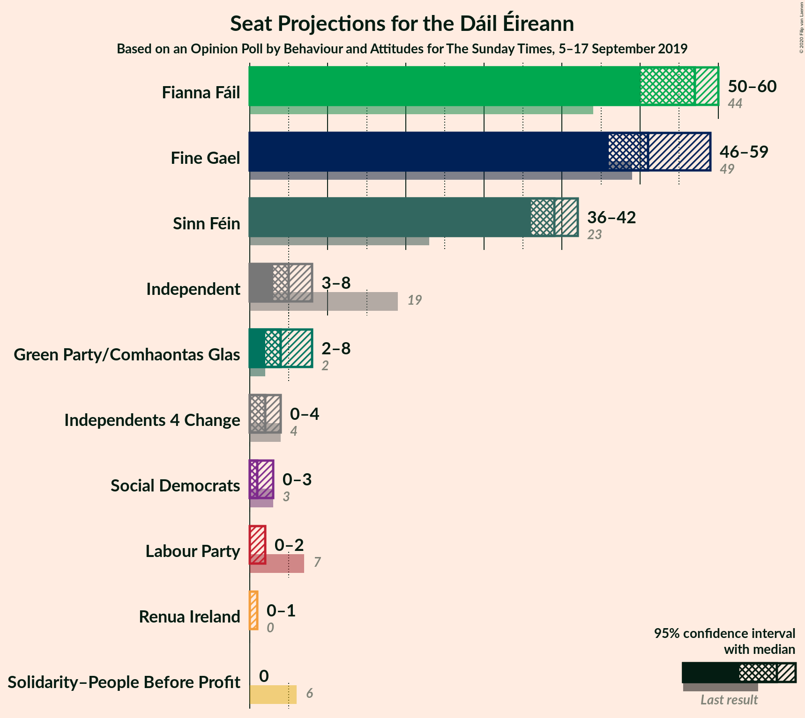
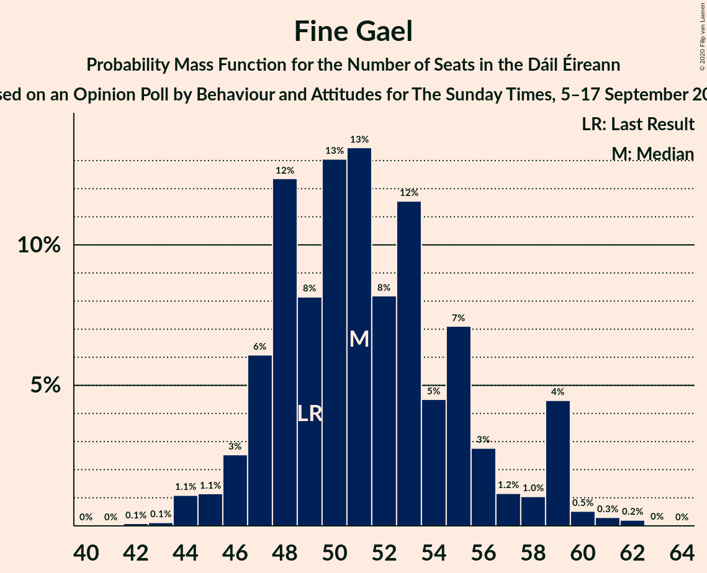
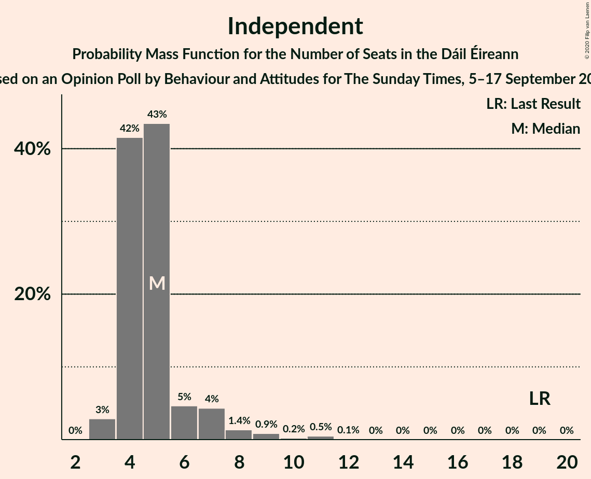
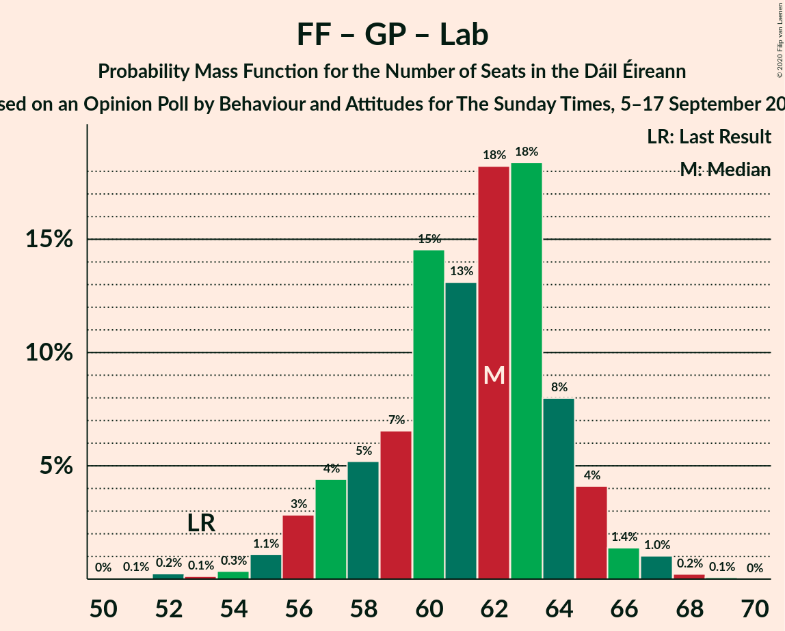
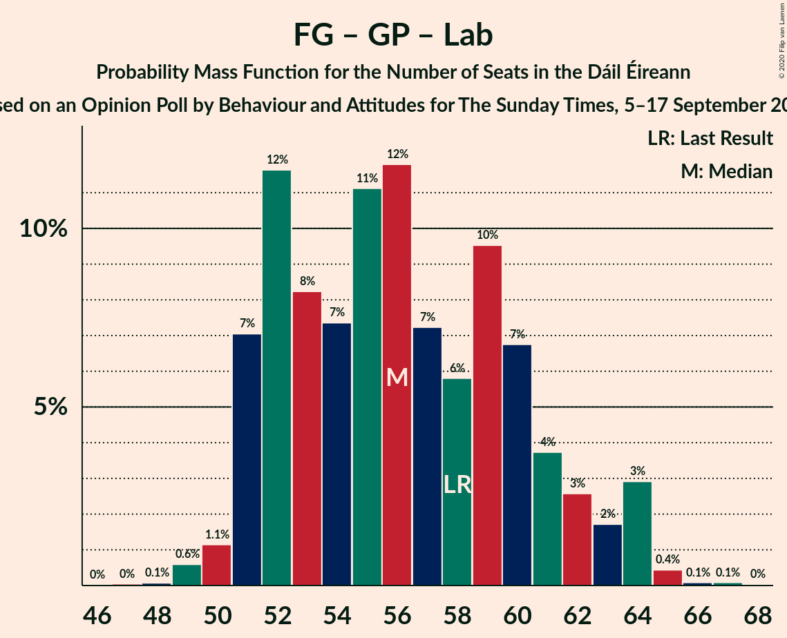

# Opinion Poll by Behaviour and Attitudes for The Sunday Times, 5–17 September 2019

<a href="#voting-intentions">Voting Intentions</a> | <a href="#seats">Seats</a> | <a href="#coalitions">Coalitions</a> | <a href="#technical-information">Technical Information</a>

## Voting Intentions

### Confidence Intervals

| Party | Last Result | Poll Result | 80% Confidence Interval | 90% Confidence Interval | 95% Confidence Interval | 99% Confidence Interval |
|:-----:|:-----------:|:-----------:|:-----------------------:|:-----------------------:|:-----------------------:|:-----------------------:|
| Fianna Fáil | 24.3% | 29.2% | 27.1–31.0% |26.6–31.6% |26.1–32.1% |25.2–33.0% |
| Fine Gael | 25.5% | 26.2% | 24.2–27.9% |23.7–28.5% |23.2–29.0% |22.4–29.9% |
| Sinn Féin | 13.8% | 20.1% | 18.4–21.8% |17.9–22.3% |17.5–22.7% |16.8–23.6% |
| Independent | 15.9% | 8.5% | 7.4–9.8% |7.1–10.1% |6.8–10.5% |6.3–11.1% |
| Green Party/Comhaontas Glas | 2.7% | 5.0% | 4.2–6.1% |3.9–6.4% |3.7–6.6% |3.4–7.2% |
| Labour Party | 6.6% | 3.0% | 2.4–3.9% |2.2–4.1% |2.1–4.3% |1.8–4.8% |
| Independents 4 Change | 1.5% | 1.1% | 0.8–1.7% |0.7–1.9% |0.6–2.0% |0.5–2.4% |
| Solidarity–People Before Profit | 3.9% | 1.0% | 0.7–1.6% |0.6–1.7% |0.5–1.9% |0.4–2.2% |
| Social Democrats | 3.0% | 1.0% | 0.7–1.6% |0.6–1.7% |0.5–1.9% |0.4–2.2% |
| Renua Ireland | 2.2% | 0.3% | 0.7–1.6% |0.6–1.7% |0.5–1.9% |0.4–2.2% |

*Note:* The poll result column reflects the actual value used in the calculations. Published results may vary slightly, and in addition be rounded to fewer digits.

## Seats

### Confidence Intervals

| Party | Last Result | Median | 80% Confidence Interval | 90% Confidence Interval | 95% Confidence Interval | 99% Confidence Interval |
|:-----:|:-----------:|:------:|:-----------------------:|:-----------------------:|:-----------------------:|:-----------------------:|
| <a href="#fianna-fáil">Fianna Fáil</a> | 44 | 57 | 53–59 |52–59 |50–60 |49–61 |
| <a href="#fine-gael">Fine Gael</a> | 49 | 51 | 47–56 |47–59 |46–59 |44–61 |
| <a href="#sinn-féin">Sinn Féin</a> | 23 | 39 | 36–41 |36–42 |36–42 |34–44 |
| <a href="#independent">Independent</a> | 19 | 5 | 4–6 |4–7 |3–8 |3–11 |
| <a href="#green-party/comhaontas-glas">Green Party/Comhaontas Glas</a> | 2 | 4 | 3–6 |3–7 |2–8 |2–9 |
| <a href="#labour-party">Labour Party</a> | 7 | 0 | 0–2 |0–2 |0–2 |0–2 |
| <a href="#independents-4-change">Independents 4 Change</a> | 4 | 2 | 0–4 |0–4 |0–4 |0–5 |
| <a href="#solidarity–people-before-profit">Solidarity–People Before Profit</a> | 6 | 0 | 0 |0 |0 |0–1 |
| <a href="#social-democrats">Social Democrats</a> | 3 | 1 | 0–3 |0–3 |0–3 |0–4 |
| <a href="#renua-ireland">Renua Ireland</a> | 0 | 0 | 0 |0 |0–1 |0–1 |

### Fianna Fáil

*For a full overview of the results for this party, see the [Fianna Fáil](party-fiannafáil.html) page.*

| Number of Seats | Probability | Accumulated | Special Marks |
|:---------------:|:-----------:|:-----------:|:-------------:|
| 44 | 0% | 100% | Last Result |
| 45 | 0% | 100% |  |
| 46 | 0% | 100% |  |
| 47 | 0.1% | 99.9% |  |
| 48 | 0.1% | 99.9% |  |
| 49 | 0.3% | 99.7% |  |
| 50 | 2% | 99.5% |  |
| 51 | 1.2% | 97% |  |
| 52 | 2% | 96% |  |
| 53 | 7% | 94% |  |
| 54 | 8% | 87% |  |
| 55 | 4% | 79% |  |
| 56 | 18% | 74% |  |
| 57 | 20% | 56% | Median |
| 58 | 15% | 36% |  |
| 59 | 17% | 21% |  |
| 60 | 3% | 4% |  |
| 61 | 0.8% | 1.0% |  |
| 62 | 0.2% | 0.2% |  |
| 63 | 0% | 0% |  |

### Fine Gael

*For a full overview of the results for this party, see the [Fine Gael](party-finegael.html) page.*

| Number of Seats | Probability | Accumulated | Special Marks |
|:---------------:|:-----------:|:-----------:|:-------------:|
| 42 | 0.1% | 100% |  |
| 43 | 0.1% | 99.9% |  |
| 44 | 1.1% | 99.8% |  |
| 45 | 1.1% | 98.7% |  |
| 46 | 3% | 98% |  |
| 47 | 6% | 95% |  |
| 48 | 12% | 89% |  |
| 49 | 8% | 77% | Last Result |
| 50 | 13% | 68% |  |
| 51 | 13% | 55% | Median |
| 52 | 8% | 42% |  |
| 53 | 12% | 34% |  |
| 54 | 5% | 22% |  |
| 55 | 7% | 18% |  |
| 56 | 3% | 11% |  |
| 57 | 1.2% | 8% |  |
| 58 | 1.0% | 7% |  |
| 59 | 4% | 6% |  |
| 60 | 0.5% | 1.1% |  |
| 61 | 0.3% | 0.6% |  |
| 62 | 0.2% | 0.3% |  |
| 63 | 0% | 0.1% |  |
| 64 | 0% | 0% |  |

### Sinn Féin

*For a full overview of the results for this party, see the [Sinn Féin](party-sinnféin.html) page.*

| Number of Seats | Probability | Accumulated | Special Marks |
|:---------------:|:-----------:|:-----------:|:-------------:|
| 23 | 0% | 100% | Last Result |
| 24 | 0% | 100% |  |
| 25 | 0% | 100% |  |
| 26 | 0% | 100% |  |
| 27 | 0% | 100% |  |
| 28 | 0% | 100% |  |
| 29 | 0% | 100% |  |
| 30 | 0% | 100% |  |
| 31 | 0% | 100% |  |
| 32 | 0% | 100% |  |
| 33 | 0.1% | 99.9% |  |
| 34 | 0.5% | 99.9% |  |
| 35 | 1.2% | 99.4% |  |
| 36 | 11% | 98% |  |
| 37 | 14% | 88% |  |
| 38 | 12% | 74% |  |
| 39 | 22% | 61% | Median |
| 40 | 20% | 40% |  |
| 41 | 14% | 20% |  |
| 42 | 4% | 6% |  |
| 43 | 1.1% | 2% |  |
| 44 | 0.4% | 0.5% |  |
| 45 | 0.1% | 0.1% |  |
| 46 | 0% | 0% |  |

### Independent

*For a full overview of the results for this party, see the [Independent](party-independent.html) page.*

| Number of Seats | Probability | Accumulated | Special Marks |
|:---------------:|:-----------:|:-----------:|:-------------:|
| 3 | 3% | 100% |  |
| 4 | 42% | 97% |  |
| 5 | 43% | 56% | Median |
| 6 | 5% | 12% |  |
| 7 | 4% | 7% |  |
| 8 | 1.4% | 3% |  |
| 9 | 0.9% | 2% |  |
| 10 | 0.2% | 0.9% |  |
| 11 | 0.5% | 0.7% |  |
| 12 | 0.1% | 0.2% |  |
| 13 | 0% | 0.1% |  |
| 14 | 0% | 0% |  |
| 15 | 0% | 0% |  |
| 16 | 0% | 0% |  |
| 17 | 0% | 0% |  |
| 18 | 0% | 0% |  |
| 19 | 0% | 0% | Last Result |

### Green Party/Comhaontas Glas

*For a full overview of the results for this party, see the [Green Party/Comhaontas Glas](party-greenpartycomhaontasglas.html) page.*

| Number of Seats | Probability | Accumulated | Special Marks |
|:---------------:|:-----------:|:-----------:|:-------------:|
| 1 | 0.1% | 100% |  |
| 2 | 3% | 99.9% | Last Result |
| 3 | 22% | 97% |  |
| 4 | 33% | 75% | Median |
| 5 | 20% | 42% |  |
| 6 | 17% | 22% |  |
| 7 | 2% | 5% |  |
| 8 | 3% | 4% |  |
| 9 | 1.0% | 1.1% |  |
| 10 | 0.1% | 0.1% |  |
| 11 | 0% | 0% |  |

### Labour Party

*For a full overview of the results for this party, see the [Labour Party](party-labourparty.html) page.*

| Number of Seats | Probability | Accumulated | Special Marks |
|:---------------:|:-----------:|:-----------:|:-------------:|
| 0 | 80% | 100% | Median |
| 1 | 9% | 20% |  |
| 2 | 11% | 11% |  |
| 3 | 0.2% | 0.3% |  |
| 4 | 0% | 0.1% |  |
| 5 | 0% | 0% |  |
| 6 | 0% | 0% |  |
| 7 | 0% | 0% | Last Result |

### Independents 4 Change

*For a full overview of the results for this party, see the [Independents 4 Change](party-independents4change.html) page.*

| Number of Seats | Probability | Accumulated | Special Marks |
|:---------------:|:-----------:|:-----------:|:-------------:|
| 0 | 27% | 100% |  |
| 1 | 9% | 73% |  |
| 2 | 16% | 64% | Median |
| 3 | 6% | 47% |  |
| 4 | 39% | 41% | Last Result |
| 5 | 2% | 2% |  |
| 6 | 0% | 0% |  |

### Solidarity–People Before Profit

*For a full overview of the results for this party, see the [Solidarity–People Before Profit](party-solidarity–peoplebeforeprofit.html) page.*

| Number of Seats | Probability | Accumulated | Special Marks |
|:---------------:|:-----------:|:-----------:|:-------------:|
| 0 | 99.4% | 100% | Median |
| 1 | 0.2% | 0.6% |  |
| 2 | 0.1% | 0.5% |  |
| 3 | 0.3% | 0.4% |  |
| 4 | 0.1% | 0.1% |  |
| 5 | 0% | 0% |  |
| 6 | 0% | 0% | Last Result |

### Social Democrats

*For a full overview of the results for this party, see the [Social Democrats](party-socialdemocrats.html) page.*

| Number of Seats | Probability | Accumulated | Special Marks |
|:---------------:|:-----------:|:-----------:|:-------------:|
| 0 | 25% | 100% |  |
| 1 | 26% | 75% | Median |
| 2 | 22% | 49% |  |
| 3 | 26% | 26% | Last Result |
| 4 | 0.5% | 0.5% |  |
| 5 | 0% | 0% |  |

### Renua Ireland

*For a full overview of the results for this party, see the [Renua Ireland](party-renuaireland.html) page.*

| Number of Seats | Probability | Accumulated | Special Marks |
|:---------------:|:-----------:|:-----------:|:-------------:|
| 0 | 96% | 100% | Last Result, Median |
| 1 | 4% | 4% |  |
| 2 | 0% | 0% |  |

## Coalitions

### Confidence Intervals

| Coalition | Last Result | Median | Majority? | 80% Confidence Interval | 90% Confidence Interval | 95% Confidence Interval | 99% Confidence Interval |
|:---------:|:-----------:|:------:|:---------:|:-----------------------:|:-----------------------:|:-----------------------:|:-----------------------:|
| Fianna Fáil – Fine Gael | 93 | 108 | 100% | 104–111 | 103–112 | 101–114 | 100–116 |
| Fianna Fáil – Sinn Féin | 67 | 95 | 100% | 90–99 | 90–100 | 89–101 | 86–102 |
| Fianna Fáil – Green Party/Comhaontas Glas – Labour Party – Social Democrats | 56 | 63 | 0% | 59–66 | 58–67 | 57–67 | 55–69 |
| Fianna Fáil – Green Party/Comhaontas Glas – Labour Party | 53 | 62 | 0% | 58–64 | 57–65 | 56–66 | 54–67 |
| Fianna Fáil – Green Party/Comhaontas Glas | 46 | 61 | 0% | 57–63 | 56–64 | 56–65 | 53–67 |
| Fine Gael – Green Party/Comhaontas Glas – Labour Party – Social Democrats | 61 | 57 | 0% | 53–63 | 52–64 | 52–65 | 50–66 |
| Fine Gael – Green Party/Comhaontas Glas – Labour Party | 58 | 56 | 0% | 52–61 | 51–63 | 51–64 | 49–65 |
| Fine Gael – Green Party/Comhaontas Glas | 51 | 55 | 0% | 51–60 | 51–63 | 50–64 | 49–65 |
| Fianna Fáil – Labour Party | 51 | 57 | 0% | 53–59 | 52–60 | 50–60 | 50–62 |
| Fine Gael | 49 | 51 | 0% | 47–56 | 47–59 | 46–59 | 44–61 |
| Fine Gael – Labour Party | 56 | 51 | 0% | 48–57 | 47–59 | 46–59 | 44–61 |

### Fianna Fáil – Fine Gael

| Number of Seats | Probability | Accumulated | Special Marks |
|:---------------:|:-----------:|:-----------:|:-------------:|
| 93 | 0% | 100% | Last Result |
| 94 | 0% | 100% |  |
| 95 | 0% | 100% |  |
| 96 | 0% | 100% |  |
| 97 | 0.1% | 100% |  |
| 98 | 0.1% | 99.8% |  |
| 99 | 0.2% | 99.7% |  |
| 100 | 0.8% | 99.5% |  |
| 101 | 1.2% | 98.7% |  |
| 102 | 0.9% | 97% |  |
| 103 | 4% | 97% |  |
| 104 | 4% | 93% |  |
| 105 | 6% | 89% |  |
| 106 | 6% | 82% |  |
| 107 | 22% | 76% |  |
| 108 | 18% | 54% | Median |
| 109 | 15% | 36% |  |
| 110 | 11% | 22% |  |
| 111 | 2% | 11% |  |
| 112 | 5% | 9% |  |
| 113 | 1.2% | 4% |  |
| 114 | 0.6% | 3% |  |
| 115 | 1.0% | 2% |  |
| 116 | 1.0% | 1.1% |  |
| 117 | 0% | 0% |  |

### Fianna Fáil – Sinn Féin

| Number of Seats | Probability | Accumulated | Special Marks |
|:---------------:|:-----------:|:-----------:|:-------------:|
| 67 | 0% | 100% | Last Result |
| 68 | 0% | 100% |  |
| 69 | 0% | 100% |  |
| 70 | 0% | 100% |  |
| 71 | 0% | 100% |  |
| 72 | 0% | 100% |  |
| 73 | 0% | 100% |  |
| 74 | 0% | 100% |  |
| 75 | 0% | 100% |  |
| 76 | 0% | 100% |  |
| 77 | 0% | 100% |  |
| 78 | 0% | 100% |  |
| 79 | 0% | 100% |  |
| 80 | 0% | 100% |  |
| 81 | 0% | 100% | Majority |
| 82 | 0% | 100% |  |
| 83 | 0% | 100% |  |
| 84 | 0% | 100% |  |
| 85 | 0.1% | 99.9% |  |
| 86 | 0.4% | 99.8% |  |
| 87 | 0.4% | 99.4% |  |
| 88 | 1.1% | 99.0% |  |
| 89 | 2% | 98% |  |
| 90 | 7% | 96% |  |
| 91 | 4% | 89% |  |
| 92 | 3% | 85% |  |
| 93 | 7% | 82% |  |
| 94 | 9% | 75% |  |
| 95 | 19% | 66% |  |
| 96 | 4% | 47% | Median |
| 97 | 12% | 43% |  |
| 98 | 17% | 31% |  |
| 99 | 7% | 13% |  |
| 100 | 4% | 7% |  |
| 101 | 2% | 3% |  |
| 102 | 0.5% | 0.7% |  |
| 103 | 0.2% | 0.2% |  |
| 104 | 0% | 0% |  |

### Fianna Fáil – Green Party/Comhaontas Glas – Labour Party – Social Democrats

| Number of Seats | Probability | Accumulated | Special Marks |
|:---------------:|:-----------:|:-----------:|:-------------:|
| 52 | 0% | 100% |  |
| 53 | 0.1% | 99.9% |  |
| 54 | 0.1% | 99.9% |  |
| 55 | 0.7% | 99.8% |  |
| 56 | 1.3% | 99.1% | Last Result |
| 57 | 0.9% | 98% |  |
| 58 | 2% | 97% |  |
| 59 | 7% | 95% |  |
| 60 | 6% | 87% |  |
| 61 | 9% | 81% |  |
| 62 | 14% | 72% | Median |
| 63 | 16% | 58% |  |
| 64 | 19% | 41% |  |
| 65 | 11% | 22% |  |
| 66 | 3% | 12% |  |
| 67 | 7% | 9% |  |
| 68 | 1.1% | 2% |  |
| 69 | 0.6% | 0.8% |  |
| 70 | 0.2% | 0.2% |  |
| 71 | 0.1% | 0.1% |  |
| 72 | 0% | 0% |  |

### Fianna Fáil – Green Party/Comhaontas Glas – Labour Party

| Number of Seats | Probability | Accumulated | Special Marks |
|:---------------:|:-----------:|:-----------:|:-------------:|
| 50 | 0% | 100% |  |
| 51 | 0.1% | 99.9% |  |
| 52 | 0.2% | 99.9% |  |
| 53 | 0.1% | 99.6% | Last Result |
| 54 | 0.3% | 99.5% |  |
| 55 | 1.1% | 99.2% |  |
| 56 | 3% | 98% |  |
| 57 | 4% | 95% |  |
| 58 | 5% | 91% |  |
| 59 | 7% | 86% |  |
| 60 | 15% | 79% |  |
| 61 | 13% | 65% | Median |
| 62 | 18% | 51% |  |
| 63 | 18% | 33% |  |
| 64 | 8% | 15% |  |
| 65 | 4% | 7% |  |
| 66 | 1.4% | 3% |  |
| 67 | 1.0% | 1.3% |  |
| 68 | 0.2% | 0.3% |  |
| 69 | 0.1% | 0.1% |  |
| 70 | 0% | 0% |  |

### Fianna Fáil – Green Party/Comhaontas Glas

| Number of Seats | Probability | Accumulated | Special Marks |
|:---------------:|:-----------:|:-----------:|:-------------:|
| 46 | 0% | 100% | Last Result |
| 47 | 0% | 100% |  |
| 48 | 0% | 100% |  |
| 49 | 0% | 100% |  |
| 50 | 0% | 100% |  |
| 51 | 0.1% | 99.9% |  |
| 52 | 0.3% | 99.9% |  |
| 53 | 0.2% | 99.6% |  |
| 54 | 0.5% | 99.5% |  |
| 55 | 1.2% | 98.9% |  |
| 56 | 3% | 98% |  |
| 57 | 5% | 95% |  |
| 58 | 7% | 90% |  |
| 59 | 7% | 83% |  |
| 60 | 14% | 76% |  |
| 61 | 14% | 62% | Median |
| 62 | 22% | 48% |  |
| 63 | 16% | 25% |  |
| 64 | 5% | 10% |  |
| 65 | 2% | 4% |  |
| 66 | 1.2% | 2% |  |
| 67 | 0.7% | 0.9% |  |
| 68 | 0.2% | 0.2% |  |
| 69 | 0% | 0% |  |

### Fine Gael – Green Party/Comhaontas Glas – Labour Party – Social Democrats

| Number of Seats | Probability | Accumulated | Special Marks |
|:---------------:|:-----------:|:-----------:|:-------------:|
| 48 | 0% | 100% |  |
| 49 | 0.2% | 99.9% |  |
| 50 | 0.3% | 99.8% |  |
| 51 | 2% | 99.4% |  |
| 52 | 4% | 98% |  |
| 53 | 8% | 94% |  |
| 54 | 10% | 86% |  |
| 55 | 9% | 76% |  |
| 56 | 7% | 66% | Median |
| 57 | 13% | 60% |  |
| 58 | 5% | 46% |  |
| 59 | 11% | 41% |  |
| 60 | 10% | 30% |  |
| 61 | 5% | 21% | Last Result |
| 62 | 4% | 15% |  |
| 63 | 4% | 11% |  |
| 64 | 4% | 7% |  |
| 65 | 3% | 4% |  |
| 66 | 0.5% | 0.9% |  |
| 67 | 0.2% | 0.4% |  |
| 68 | 0.1% | 0.2% |  |
| 69 | 0% | 0.1% |  |
| 70 | 0% | 0% |  |

### Fine Gael – Green Party/Comhaontas Glas – Labour Party

| Number of Seats | Probability | Accumulated | Special Marks |
|:---------------:|:-----------:|:-----------:|:-------------:|
| 47 | 0% | 100% |  |
| 48 | 0.1% | 99.9% |  |
| 49 | 0.6% | 99.9% |  |
| 50 | 1.1% | 99.3% |  |
| 51 | 7% | 98% |  |
| 52 | 12% | 91% |  |
| 53 | 8% | 79% |  |
| 54 | 7% | 71% |  |
| 55 | 11% | 64% | Median |
| 56 | 12% | 53% |  |
| 57 | 7% | 41% |  |
| 58 | 6% | 34% | Last Result |
| 59 | 10% | 28% |  |
| 60 | 7% | 18% |  |
| 61 | 4% | 12% |  |
| 62 | 3% | 8% |  |
| 63 | 2% | 5% |  |
| 64 | 3% | 4% |  |
| 65 | 0.4% | 0.7% |  |
| 66 | 0.1% | 0.2% |  |
| 67 | 0.1% | 0.1% |  |
| 68 | 0% | 0% |  |

### Fine Gael – Green Party/Comhaontas Glas

| Number of Seats | Probability | Accumulated | Special Marks |
|:---------------:|:-----------:|:-----------:|:-------------:|
| 47 | 0.1% | 100% |  |
| 48 | 0.2% | 99.9% |  |
| 49 | 0.6% | 99.7% |  |
| 50 | 2% | 99.1% |  |
| 51 | 10% | 97% | Last Result |
| 52 | 9% | 87% |  |
| 53 | 9% | 78% |  |
| 54 | 11% | 69% |  |
| 55 | 12% | 59% | Median |
| 56 | 7% | 47% |  |
| 57 | 8% | 40% |  |
| 58 | 6% | 33% |  |
| 59 | 12% | 27% |  |
| 60 | 6% | 14% |  |
| 61 | 0.7% | 8% |  |
| 62 | 2% | 7% |  |
| 63 | 2% | 5% |  |
| 64 | 3% | 3% |  |
| 65 | 0.4% | 0.5% |  |
| 66 | 0.1% | 0.2% |  |
| 67 | 0% | 0.1% |  |
| 68 | 0% | 0% |  |

### Fianna Fáil – Labour Party

| Number of Seats | Probability | Accumulated | Special Marks |
|:---------------:|:-----------:|:-----------:|:-------------:|
| 46 | 0% | 100% |  |
| 47 | 0.1% | 99.9% |  |
| 48 | 0.1% | 99.9% |  |
| 49 | 0.2% | 99.8% |  |
| 50 | 2% | 99.6% |  |
| 51 | 1.1% | 97% | Last Result |
| 52 | 2% | 96% |  |
| 53 | 6% | 94% |  |
| 54 | 6% | 88% |  |
| 55 | 4% | 82% |  |
| 56 | 17% | 78% |  |
| 57 | 21% | 61% | Median |
| 58 | 12% | 40% |  |
| 59 | 19% | 28% |  |
| 60 | 8% | 9% |  |
| 61 | 1.0% | 2% |  |
| 62 | 0.8% | 1.0% |  |
| 63 | 0.2% | 0.2% |  |
| 64 | 0% | 0% |  |

### Fine Gael

| Number of Seats | Probability | Accumulated | Special Marks |
|:---------------:|:-----------:|:-----------:|:-------------:|
| 42 | 0.1% | 100% |  |
| 43 | 0.1% | 99.9% |  |
| 44 | 1.1% | 99.8% |  |
| 45 | 1.1% | 98.7% |  |
| 46 | 3% | 98% |  |
| 47 | 6% | 95% |  |
| 48 | 12% | 89% |  |
| 49 | 8% | 77% | Last Result |
| 50 | 13% | 68% |  |
| 51 | 13% | 55% | Median |
| 52 | 8% | 42% |  |
| 53 | 12% | 34% |  |
| 54 | 5% | 22% |  |
| 55 | 7% | 18% |  |
| 56 | 3% | 11% |  |
| 57 | 1.2% | 8% |  |
| 58 | 1.0% | 7% |  |
| 59 | 4% | 6% |  |
| 60 | 0.5% | 1.1% |  |
| 61 | 0.3% | 0.6% |  |
| 62 | 0.2% | 0.3% |  |
| 63 | 0% | 0.1% |  |
| 64 | 0% | 0% |  |

### Fine Gael – Labour Party

| Number of Seats | Probability | Accumulated | Special Marks |
|:---------------:|:-----------:|:-----------:|:-------------:|
| 42 | 0.1% | 100% |  |
| 43 | 0.1% | 99.9% |  |
| 44 | 0.8% | 99.8% |  |
| 45 | 1.2% | 99.1% |  |
| 46 | 2% | 98% |  |
| 47 | 2% | 96% |  |
| 48 | 15% | 93% |  |
| 49 | 7% | 78% |  |
| 50 | 10% | 71% |  |
| 51 | 13% | 60% | Median |
| 52 | 12% | 47% |  |
| 53 | 11% | 35% |  |
| 54 | 4% | 24% |  |
| 55 | 5% | 19% |  |
| 56 | 4% | 14% | Last Result |
| 57 | 3% | 10% |  |
| 58 | 1.4% | 7% |  |
| 59 | 5% | 6% |  |
| 60 | 0.5% | 1.2% |  |
| 61 | 0.4% | 0.7% |  |
| 62 | 0.3% | 0.3% |  |
| 63 | 0% | 0.1% |  |
| 64 | 0% | 0% |  |

## Technical Information

### Opinion Poll

+ **Polling firm:** Behaviour and Attitudes
+ **Commissioner(s):** The Sunday Times
+ **Fieldwork period:** 5–17 September 2019

### Calculations

+ **Sample size:** 894
+ **Simulations done:** 1,048,575
+ **Error estimate:** 1.69%

