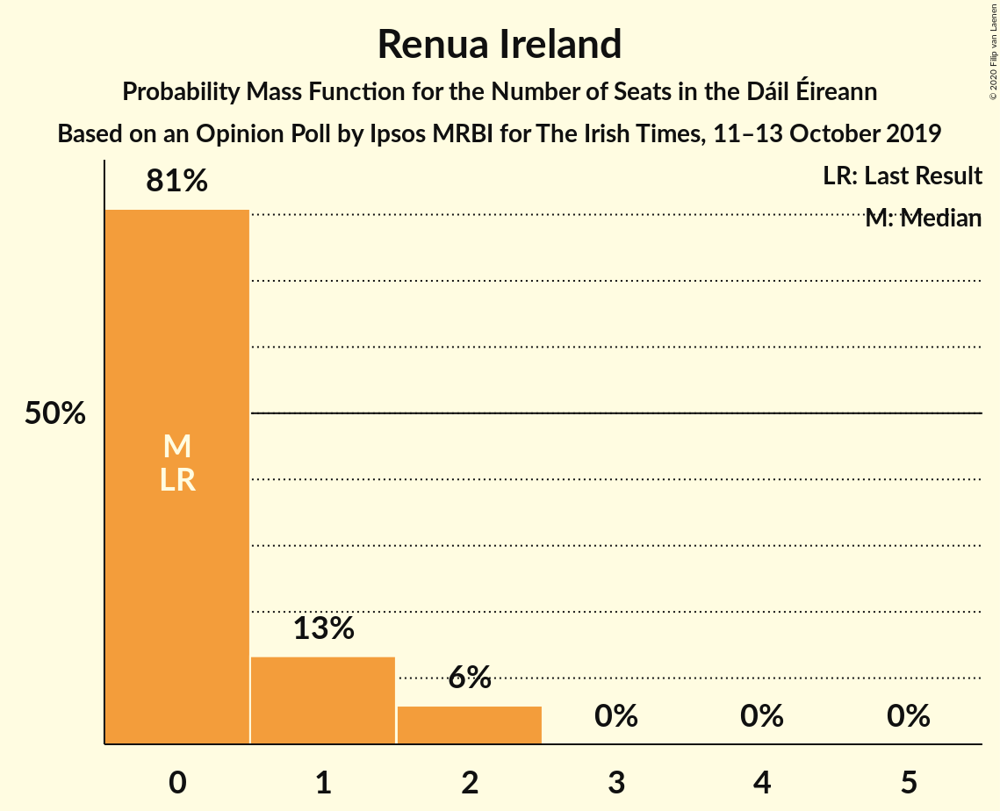

# Opinion Poll by Ipsos MRBI for The Irish Times, 11–13 October 2019

<a href="#voting-intentions">Voting Intentions</a> | <a href="#seats">Seats</a> | <a href="#coalitions">Coalitions</a> | <a href="#technical-information">Technical Information</a>

## Voting Intentions

### Confidence Intervals

| Party | Last Result | Poll Result | 80% Confidence Interval | 90% Confidence Interval | 95% Confidence Interval | 99% Confidence Interval |
|:-----:|:-----------:|:-----------:|:-----------------------:|:-----------------------:|:-----------------------:|:-----------------------:|
| Fine Gael | 25.5% | 32.6% | 30.9–34.4% |30.4–34.9% |30.0–35.3% |29.2–36.2% |
| Fianna Fáil | 24.3% | 28.1% | 26.5–29.8% |26.0–30.3% |25.6–30.7% |24.8–31.5% |
| Sinn Féin | 13.8% | 15.8% | 14.5–17.2% |14.1–17.6% |13.8–17.9% |13.2–18.6% |
| Green Party/Comhaontas Glas | 2.7% | 9.0% | 8.0–10.2% |7.7–10.5% |7.5–10.8% |7.1–11.3% |
| Labour Party | 6.6% | 6.8% | 5.9–7.8% |5.7–8.1% |5.5–8.3% |5.1–8.8% |
| Renua Ireland | 2.2% | 2.2% | 1.8–2.9% |1.7–3.1% |1.6–3.3% |1.4–3.6% |
| Independent | 15.9% | 2.0% | 1.6–2.6% |1.4–2.8% |1.3–3.0% |1.2–3.3% |
| Solidarity–People Before Profit | 3.9% | 1.1% | 0.8–1.6% |0.7–1.7% |0.6–1.8% |0.5–2.1% |
| Social Democrats | 3.0% | 1.1% | 0.8–1.6% |0.7–1.7% |0.6–1.8% |0.5–2.1% |
| Independents 4 Change | 1.5% | 0.2% | 0.1–0.6% |0.1–0.7% |0.1–0.7% |0.0–0.9% |

*Note:* The poll result column reflects the actual value used in the calculations. Published results may vary slightly, and in addition be rounded to fewer digits.

## Seats

### Confidence Intervals

| Party | Last Result | Median | 80% Confidence Interval | 90% Confidence Interval | 95% Confidence Interval | 99% Confidence Interval |
|:-----:|:-----------:|:------:|:-----------------------:|:-----------------------:|:-----------------------:|:-----------------------:|
| <a href="#fine-gael">Fine Gael</a> | 49 | 72 | 69–77 |66–77 |66–77 |63–78 |
| <a href="#fianna-fáil">Fianna Fáil</a> | 44 | 55 | 49–59 |49–61 |49–61 |49–62 |
| <a href="#sinn-féin">Sinn Féin</a> | 23 | 21 | 18–26 |18–31 |17–31 |16–31 |
| <a href="#green-party/comhaontas-glas">Green Party/Comhaontas Glas</a> | 2 | 6 | 5–9 |4–9 |4–9 |3–10 |
| <a href="#labour-party">Labour Party</a> | 7 | 4 | 1–5 |1–7 |1–7 |0–9 |
| <a href="#renua-ireland">Renua Ireland</a> | 0 | 0 | 0–1 |0–2 |0–2 |0–2 |
| <a href="#independent">Independent</a> | 19 | 0 | 0 |0 |0 |0–1 |
| <a href="#solidarity–people-before-profit">Solidarity–People Before Profit</a> | 6 | 0 | 0 |0 |0–1 |0–1 |
| <a href="#social-democrats">Social Democrats</a> | 3 | 0 | 0 |0–2 |0–3 |0–3 |
| <a href="#independents-4-change">Independents 4 Change</a> | 4 | 0 | 0 |0 |0 |0–1 |

### Fine Gael

*For a full overview of the results for this party, see the [Fine Gael](party-finegael.html) page.*

| Number of Seats | Probability | Accumulated | Special Marks |
|:---------------:|:-----------:|:-----------:|:-------------:|
| 49 | 0% | 100% | Last Result |
| 50 | 0% | 100% |  |
| 51 | 0% | 100% |  |
| 52 | 0% | 100% |  |
| 53 | 0% | 100% |  |
| 54 | 0% | 100% |  |
| 55 | 0% | 100% |  |
| 56 | 0% | 100% |  |
| 57 | 0% | 100% |  |
| 58 | 0% | 100% |  |
| 59 | 0% | 100% |  |
| 60 | 0% | 100% |  |
| 61 | 0% | 100% |  |
| 62 | 0% | 99.9% |  |
| 63 | 0.6% | 99.9% |  |
| 64 | 0.2% | 99.3% |  |
| 65 | 0.9% | 99.2% |  |
| 66 | 5% | 98% |  |
| 67 | 2% | 94% |  |
| 68 | 0.6% | 92% |  |
| 69 | 8% | 91% |  |
| 70 | 8% | 83% |  |
| 71 | 12% | 75% |  |
| 72 | 14% | 63% | Median |
| 73 | 4% | 50% |  |
| 74 | 6% | 45% |  |
| 75 | 15% | 40% |  |
| 76 | 2% | 25% |  |
| 77 | 22% | 23% |  |
| 78 | 1.2% | 1.3% |  |
| 79 | 0.1% | 0.1% |  |
| 80 | 0% | 0% |  |

### Fianna Fáil

*For a full overview of the results for this party, see the [Fianna Fáil](party-fiannafáil.html) page.*

| Number of Seats | Probability | Accumulated | Special Marks |
|:---------------:|:-----------:|:-----------:|:-------------:|
| 44 | 0% | 100% | Last Result |
| 45 | 0% | 100% |  |
| 46 | 0% | 100% |  |
| 47 | 0.1% | 100% |  |
| 48 | 0.2% | 99.9% |  |
| 49 | 10% | 99.7% |  |
| 50 | 6% | 90% |  |
| 51 | 2% | 84% |  |
| 52 | 2% | 82% |  |
| 53 | 19% | 81% |  |
| 54 | 7% | 62% |  |
| 55 | 7% | 55% | Median |
| 56 | 11% | 48% |  |
| 57 | 9% | 37% |  |
| 58 | 12% | 28% |  |
| 59 | 7% | 16% |  |
| 60 | 3% | 9% |  |
| 61 | 4% | 5% |  |
| 62 | 2% | 2% |  |
| 63 | 0% | 0% |  |

### Sinn Féin

*For a full overview of the results for this party, see the [Sinn Féin](party-sinnféin.html) page.*

| Number of Seats | Probability | Accumulated | Special Marks |
|:---------------:|:-----------:|:-----------:|:-------------:|
| 15 | 0.1% | 100% |  |
| 16 | 0.5% | 99.9% |  |
| 17 | 4% | 99.4% |  |
| 18 | 6% | 95% |  |
| 19 | 3% | 89% |  |
| 20 | 23% | 87% |  |
| 21 | 25% | 64% | Median |
| 22 | 3% | 39% |  |
| 23 | 3% | 36% | Last Result |
| 24 | 10% | 33% |  |
| 25 | 4% | 23% |  |
| 26 | 9% | 19% |  |
| 27 | 0.4% | 9% |  |
| 28 | 1.0% | 9% |  |
| 29 | 0% | 8% |  |
| 30 | 1.3% | 8% |  |
| 31 | 6% | 7% |  |
| 32 | 0.2% | 0.2% |  |
| 33 | 0% | 0% |  |

### Green Party/Comhaontas Glas

*For a full overview of the results for this party, see the [Green Party/Comhaontas Glas](party-greenpartycomhaontasglas.html) page.*

| Number of Seats | Probability | Accumulated | Special Marks |
|:---------------:|:-----------:|:-----------:|:-------------:|
| 2 | 0% | 100% | Last Result |
| 3 | 1.1% | 100% |  |
| 4 | 7% | 98.9% |  |
| 5 | 36% | 92% |  |
| 6 | 36% | 57% | Median |
| 7 | 4% | 20% |  |
| 8 | 6% | 17% |  |
| 9 | 9% | 10% |  |
| 10 | 0.6% | 1.0% |  |
| 11 | 0.1% | 0.4% |  |
| 12 | 0.1% | 0.3% |  |
| 13 | 0.2% | 0.2% |  |
| 14 | 0% | 0% |  |

### Labour Party

*For a full overview of the results for this party, see the [Labour Party](party-labourparty.html) page.*

| Number of Seats | Probability | Accumulated | Special Marks |
|:---------------:|:-----------:|:-----------:|:-------------:|
| 0 | 2% | 100% |  |
| 1 | 22% | 98% |  |
| 2 | 16% | 76% |  |
| 3 | 6% | 61% |  |
| 4 | 14% | 55% | Median |
| 5 | 31% | 41% |  |
| 6 | 3% | 9% |  |
| 7 | 4% | 7% | Last Result |
| 8 | 1.4% | 2% |  |
| 9 | 0.9% | 1.0% |  |
| 10 | 0.1% | 0.1% |  |
| 11 | 0% | 0% |  |

### Renua Ireland

*For a full overview of the results for this party, see the [Renua Ireland](party-renuaireland.html) page.*

| Number of Seats | Probability | Accumulated | Special Marks |
|:---------------:|:-----------:|:-----------:|:-------------:|
| 0 | 81% | 100% | Last Result, Median |
| 1 | 13% | 19% |  |
| 2 | 6% | 6% |  |
| 3 | 0% | 0% |  |

### Independent

*For a full overview of the results for this party, see the [Independent](party-independent.html) page.*

| Number of Seats | Probability | Accumulated | Special Marks |
|:---------------:|:-----------:|:-----------:|:-------------:|
| 0 | 98% | 100% | Median |
| 1 | 1.3% | 2% |  |
| 2 | 0.4% | 0.4% |  |
| 3 | 0% | 0% |  |
| 4 | 0% | 0% |  |
| 5 | 0% | 0% |  |
| 6 | 0% | 0% |  |
| 7 | 0% | 0% |  |
| 8 | 0% | 0% |  |
| 9 | 0% | 0% |  |
| 10 | 0% | 0% |  |
| 11 | 0% | 0% |  |
| 12 | 0% | 0% |  |
| 13 | 0% | 0% |  |
| 14 | 0% | 0% |  |
| 15 | 0% | 0% |  |
| 16 | 0% | 0% |  |
| 17 | 0% | 0% |  |
| 18 | 0% | 0% |  |
| 19 | 0% | 0% | Last Result |

### Solidarity–People Before Profit

*For a full overview of the results for this party, see the [Solidarity–People Before Profit](party-solidarity–peoplebeforeprofit.html) page.*

| Number of Seats | Probability | Accumulated | Special Marks |
|:---------------:|:-----------:|:-----------:|:-------------:|
| 0 | 95% | 100% | Median |
| 1 | 5% | 5% |  |
| 2 | 0% | 0% |  |
| 3 | 0% | 0% |  |
| 4 | 0% | 0% |  |
| 5 | 0% | 0% |  |
| 6 | 0% | 0% | Last Result |

### Social Democrats

*For a full overview of the results for this party, see the [Social Democrats](party-socialdemocrats.html) page.*

| Number of Seats | Probability | Accumulated | Special Marks |
|:---------------:|:-----------:|:-----------:|:-------------:|
| 0 | 90% | 100% | Median |
| 1 | 3% | 10% |  |
| 2 | 4% | 7% |  |
| 3 | 3% | 3% | Last Result |
| 4 | 0% | 0% |  |

### Independents 4 Change

*For a full overview of the results for this party, see the [Independents 4 Change](party-independents4change.html) page.*

| Number of Seats | Probability | Accumulated | Special Marks |
|:---------------:|:-----------:|:-----------:|:-------------:|
| 0 | 98.7% | 100% | Median |
| 1 | 1.1% | 1.3% |  |
| 2 | 0.2% | 0.2% |  |
| 3 | 0% | 0% |  |
| 4 | 0% | 0% | Last Result |

## Coalitions

### Confidence Intervals

| Coalition | Last Result | Median | Majority? | 80% Confidence Interval | 90% Confidence Interval | 95% Confidence Interval | 99% Confidence Interval |
|:---------:|:-----------:|:------:|:---------:|:-----------------------:|:-----------------------:|:-----------------------:|:-----------------------:|
| Fine Gael – Fianna Fáil | 93 | 129 | 100% | 121–133 | 121–133 | 120–133 | 118–133 |
| Fine Gael – Green Party/Comhaontas Glas – Labour Party | 58 | 83 | 62% | 78–87 | 75–87 | 75–89 | 74–89 |
| Fine Gael – Green Party/Comhaontas Glas – Labour Party – Social Democrats | 61 | 83 | 64% | 78–87 | 75–88 | 75–89 | 74–89 |
| Fianna Fáil – Sinn Féin | 67 | 76 | 17% | 73–82 | 72–84 | 70–85 | 70–86 |
| Fine Gael – Green Party/Comhaontas Glas | 51 | 78 | 35% | 74–83 | 73–84 | 72–84 | 68–84 |
| Fine Gael – Labour Party | 56 | 76 | 16% | 71–82 | 69–82 | 68–82 | 68–83 |
| Fine Gael | 49 | 72 | 0% | 69–77 | 66–77 | 66–77 | 63–78 |
| Fianna Fáil – Green Party/Comhaontas Glas – Labour Party | 53 | 64 | 0% | 59–69 | 57–70 | 57–70 | 57–72 |
| Fianna Fáil – Green Party/Comhaontas Glas – Labour Party – Social Democrats | 56 | 64 | 0% | 59–70 | 57–70 | 57–70 | 57–72 |
| Fianna Fáil – Green Party/Comhaontas Glas | 46 | 62 | 0% | 55–66 | 55–67 | 54–68 | 54–69 |
| Fianna Fáil – Labour Party | 51 | 58 | 0% | 54–62 | 51–64 | 51–64 | 51–66 |

### Fine Gael – Fianna Fáil

| Number of Seats | Probability | Accumulated | Special Marks |
|:---------------:|:-----------:|:-----------:|:-------------:|
| 93 | 0% | 100% | Last Result |
| 94 | 0% | 100% |  |
| 95 | 0% | 100% |  |
| 96 | 0% | 100% |  |
| 97 | 0% | 100% |  |
| 98 | 0% | 100% |  |
| 99 | 0% | 100% |  |
| 100 | 0% | 100% |  |
| 101 | 0% | 100% |  |
| 102 | 0% | 100% |  |
| 103 | 0% | 100% |  |
| 104 | 0% | 100% |  |
| 105 | 0% | 100% |  |
| 106 | 0% | 100% |  |
| 107 | 0% | 100% |  |
| 108 | 0% | 100% |  |
| 109 | 0% | 100% |  |
| 110 | 0% | 100% |  |
| 111 | 0% | 100% |  |
| 112 | 0% | 100% |  |
| 113 | 0% | 100% |  |
| 114 | 0% | 100% |  |
| 115 | 0% | 100% |  |
| 116 | 0% | 100% |  |
| 117 | 0.1% | 100% |  |
| 118 | 0.6% | 99.9% |  |
| 119 | 2% | 99.3% |  |
| 120 | 0.3% | 98% |  |
| 121 | 9% | 97% |  |
| 122 | 0.7% | 89% |  |
| 123 | 4% | 88% |  |
| 124 | 7% | 84% |  |
| 125 | 7% | 77% |  |
| 126 | 4% | 70% |  |
| 127 | 3% | 66% | Median |
| 128 | 13% | 64% |  |
| 129 | 6% | 51% |  |
| 130 | 25% | 45% |  |
| 131 | 0.9% | 20% |  |
| 132 | 9% | 19% |  |
| 133 | 10% | 10% |  |
| 134 | 0% | 0% |  |

### Fine Gael – Green Party/Comhaontas Glas – Labour Party

| Number of Seats | Probability | Accumulated | Special Marks |
|:---------------:|:-----------:|:-----------:|:-------------:|
| 58 | 0% | 100% | Last Result |
| 59 | 0% | 100% |  |
| 60 | 0% | 100% |  |
| 61 | 0% | 100% |  |
| 62 | 0% | 100% |  |
| 63 | 0% | 100% |  |
| 64 | 0% | 100% |  |
| 65 | 0% | 100% |  |
| 66 | 0% | 100% |  |
| 67 | 0% | 100% |  |
| 68 | 0% | 100% |  |
| 69 | 0% | 100% |  |
| 70 | 0% | 100% |  |
| 71 | 0% | 99.9% |  |
| 72 | 0.1% | 99.9% |  |
| 73 | 0.1% | 99.8% |  |
| 74 | 2% | 99.8% |  |
| 75 | 3% | 98% |  |
| 76 | 2% | 95% |  |
| 77 | 1.2% | 93% |  |
| 78 | 7% | 92% |  |
| 79 | 8% | 84% |  |
| 80 | 14% | 76% |  |
| 81 | 8% | 62% | Majority |
| 82 | 3% | 54% | Median |
| 83 | 4% | 51% |  |
| 84 | 18% | 47% |  |
| 85 | 9% | 29% |  |
| 86 | 1.2% | 20% |  |
| 87 | 14% | 18% |  |
| 88 | 1.1% | 5% |  |
| 89 | 3% | 3% |  |
| 90 | 0% | 0.1% |  |
| 91 | 0% | 0.1% |  |
| 92 | 0.1% | 0.1% |  |
| 93 | 0% | 0% |  |

### Fine Gael – Green Party/Comhaontas Glas – Labour Party – Social Democrats

| Number of Seats | Probability | Accumulated | Special Marks |
|:---------------:|:-----------:|:-----------:|:-------------:|
| 61 | 0% | 100% | Last Result |
| 62 | 0% | 100% |  |
| 63 | 0% | 100% |  |
| 64 | 0% | 100% |  |
| 65 | 0% | 100% |  |
| 66 | 0% | 100% |  |
| 67 | 0% | 100% |  |
| 68 | 0% | 100% |  |
| 69 | 0% | 100% |  |
| 70 | 0% | 100% |  |
| 71 | 0% | 99.9% |  |
| 72 | 0.1% | 99.9% |  |
| 73 | 0% | 99.8% |  |
| 74 | 2% | 99.8% |  |
| 75 | 3% | 98% |  |
| 76 | 0.9% | 95% |  |
| 77 | 2% | 94% |  |
| 78 | 8% | 92% |  |
| 79 | 6% | 85% |  |
| 80 | 15% | 79% |  |
| 81 | 9% | 64% | Majority |
| 82 | 3% | 55% | Median |
| 83 | 4% | 52% |  |
| 84 | 20% | 49% |  |
| 85 | 7% | 29% |  |
| 86 | 2% | 22% |  |
| 87 | 14% | 20% |  |
| 88 | 2% | 6% |  |
| 89 | 4% | 4% |  |
| 90 | 0% | 0.1% |  |
| 91 | 0% | 0.1% |  |
| 92 | 0.1% | 0.1% |  |
| 93 | 0% | 0% |  |

### Fianna Fáil – Sinn Féin

| Number of Seats | Probability | Accumulated | Special Marks |
|:---------------:|:-----------:|:-----------:|:-------------:|
| 67 | 0% | 100% | Last Result |
| 68 | 0.1% | 100% |  |
| 69 | 0.1% | 99.9% |  |
| 70 | 3% | 99.9% |  |
| 71 | 0.4% | 97% |  |
| 72 | 3% | 96% |  |
| 73 | 15% | 93% |  |
| 74 | 2% | 79% |  |
| 75 | 11% | 76% |  |
| 76 | 18% | 66% | Median |
| 77 | 2% | 48% |  |
| 78 | 6% | 46% |  |
| 79 | 10% | 41% |  |
| 80 | 14% | 30% |  |
| 81 | 2% | 17% | Majority |
| 82 | 8% | 14% |  |
| 83 | 1.2% | 6% |  |
| 84 | 0.4% | 5% |  |
| 85 | 3% | 5% |  |
| 86 | 2% | 2% |  |
| 87 | 0% | 0.1% |  |
| 88 | 0% | 0.1% |  |
| 89 | 0% | 0.1% |  |
| 90 | 0% | 0.1% |  |
| 91 | 0% | 0% |  |

### Fine Gael – Green Party/Comhaontas Glas

| Number of Seats | Probability | Accumulated | Special Marks |
|:---------------:|:-----------:|:-----------:|:-------------:|
| 51 | 0% | 100% | Last Result |
| 52 | 0% | 100% |  |
| 53 | 0% | 100% |  |
| 54 | 0% | 100% |  |
| 55 | 0% | 100% |  |
| 56 | 0% | 100% |  |
| 57 | 0% | 100% |  |
| 58 | 0% | 100% |  |
| 59 | 0% | 100% |  |
| 60 | 0% | 100% |  |
| 61 | 0% | 100% |  |
| 62 | 0% | 100% |  |
| 63 | 0% | 100% |  |
| 64 | 0% | 100% |  |
| 65 | 0% | 100% |  |
| 66 | 0% | 100% |  |
| 67 | 0.1% | 100% |  |
| 68 | 0.6% | 99.9% |  |
| 69 | 0.1% | 99.4% |  |
| 70 | 0.5% | 99.2% |  |
| 71 | 0.7% | 98.7% |  |
| 72 | 2% | 98% |  |
| 73 | 3% | 96% |  |
| 74 | 4% | 93% |  |
| 75 | 9% | 89% |  |
| 76 | 8% | 80% |  |
| 77 | 11% | 73% |  |
| 78 | 12% | 62% | Median |
| 79 | 11% | 50% |  |
| 80 | 4% | 39% |  |
| 81 | 2% | 35% | Majority |
| 82 | 14% | 33% |  |
| 83 | 9% | 19% |  |
| 84 | 9% | 10% |  |
| 85 | 0.3% | 0.3% |  |
| 86 | 0% | 0% |  |

### Fine Gael – Labour Party

| Number of Seats | Probability | Accumulated | Special Marks |
|:---------------:|:-----------:|:-----------:|:-------------:|
| 56 | 0% | 100% | Last Result |
| 57 | 0% | 100% |  |
| 58 | 0% | 100% |  |
| 59 | 0% | 100% |  |
| 60 | 0% | 100% |  |
| 61 | 0% | 100% |  |
| 62 | 0% | 100% |  |
| 63 | 0% | 100% |  |
| 64 | 0.1% | 100% |  |
| 65 | 0.1% | 99.9% |  |
| 66 | 0% | 99.8% |  |
| 67 | 0.2% | 99.8% |  |
| 68 | 3% | 99.7% |  |
| 69 | 4% | 97% |  |
| 70 | 2% | 93% |  |
| 71 | 3% | 91% |  |
| 72 | 4% | 88% |  |
| 73 | 4% | 83% |  |
| 74 | 18% | 79% |  |
| 75 | 3% | 62% |  |
| 76 | 12% | 59% | Median |
| 77 | 2% | 47% |  |
| 78 | 14% | 45% |  |
| 79 | 6% | 31% |  |
| 80 | 9% | 25% |  |
| 81 | 1.4% | 16% | Majority |
| 82 | 13% | 14% |  |
| 83 | 1.1% | 1.2% |  |
| 84 | 0% | 0.1% |  |
| 85 | 0% | 0.1% |  |
| 86 | 0.1% | 0.1% |  |
| 87 | 0% | 0% |  |

### Fine Gael

| Number of Seats | Probability | Accumulated | Special Marks |
|:---------------:|:-----------:|:-----------:|:-------------:|
| 49 | 0% | 100% | Last Result |
| 50 | 0% | 100% |  |
| 51 | 0% | 100% |  |
| 52 | 0% | 100% |  |
| 53 | 0% | 100% |  |
| 54 | 0% | 100% |  |
| 55 | 0% | 100% |  |
| 56 | 0% | 100% |  |
| 57 | 0% | 100% |  |
| 58 | 0% | 100% |  |
| 59 | 0% | 100% |  |
| 60 | 0% | 100% |  |
| 61 | 0% | 100% |  |
| 62 | 0% | 99.9% |  |
| 63 | 0.6% | 99.9% |  |
| 64 | 0.2% | 99.3% |  |
| 65 | 0.9% | 99.2% |  |
| 66 | 5% | 98% |  |
| 67 | 2% | 94% |  |
| 68 | 0.6% | 92% |  |
| 69 | 8% | 91% |  |
| 70 | 8% | 83% |  |
| 71 | 12% | 75% |  |
| 72 | 14% | 63% | Median |
| 73 | 4% | 50% |  |
| 74 | 6% | 45% |  |
| 75 | 15% | 40% |  |
| 76 | 2% | 25% |  |
| 77 | 22% | 23% |  |
| 78 | 1.2% | 1.3% |  |
| 79 | 0.1% | 0.1% |  |
| 80 | 0% | 0% |  |

### Fianna Fáil – Green Party/Comhaontas Glas – Labour Party

| Number of Seats | Probability | Accumulated | Special Marks |
|:---------------:|:-----------:|:-----------:|:-------------:|
| 53 | 0% | 100% | Last Result |
| 54 | 0% | 100% |  |
| 55 | 0.1% | 100% |  |
| 56 | 0.1% | 99.9% |  |
| 57 | 6% | 99.9% |  |
| 58 | 0.2% | 94% |  |
| 59 | 4% | 93% |  |
| 60 | 2% | 90% |  |
| 61 | 4% | 88% |  |
| 62 | 3% | 84% |  |
| 63 | 29% | 81% |  |
| 64 | 6% | 52% |  |
| 65 | 5% | 46% | Median |
| 66 | 4% | 41% |  |
| 67 | 19% | 37% |  |
| 68 | 7% | 18% |  |
| 69 | 2% | 11% |  |
| 70 | 8% | 9% |  |
| 71 | 0.4% | 1.2% |  |
| 72 | 0.6% | 0.8% |  |
| 73 | 0.1% | 0.2% |  |
| 74 | 0.1% | 0.2% |  |
| 75 | 0% | 0.1% |  |
| 76 | 0% | 0% |  |

### Fianna Fáil – Green Party/Comhaontas Glas – Labour Party – Social Democrats

| Number of Seats | Probability | Accumulated | Special Marks |
|:---------------:|:-----------:|:-----------:|:-------------:|
| 55 | 0.1% | 100% |  |
| 56 | 0.1% | 99.9% | Last Result |
| 57 | 6% | 99.9% |  |
| 58 | 0.2% | 94% |  |
| 59 | 4% | 93% |  |
| 60 | 1.4% | 90% |  |
| 61 | 4% | 88% |  |
| 62 | 3% | 85% |  |
| 63 | 26% | 82% |  |
| 64 | 7% | 56% |  |
| 65 | 8% | 49% | Median |
| 66 | 3% | 41% |  |
| 67 | 19% | 38% |  |
| 68 | 5% | 20% |  |
| 69 | 4% | 15% |  |
| 70 | 9% | 11% |  |
| 71 | 1.2% | 2% |  |
| 72 | 0.6% | 0.9% |  |
| 73 | 0.1% | 0.3% |  |
| 74 | 0% | 0.2% |  |
| 75 | 0% | 0.2% |  |
| 76 | 0.1% | 0.1% |  |
| 77 | 0% | 0.1% |  |
| 78 | 0% | 0% |  |

### Fianna Fáil – Green Party/Comhaontas Glas

| Number of Seats | Probability | Accumulated | Special Marks |
|:---------------:|:-----------:|:-----------:|:-------------:|
| 46 | 0% | 100% | Last Result |
| 47 | 0% | 100% |  |
| 48 | 0% | 100% |  |
| 49 | 0% | 100% |  |
| 50 | 0% | 100% |  |
| 51 | 0% | 100% |  |
| 52 | 0.1% | 100% |  |
| 53 | 0.1% | 99.9% |  |
| 54 | 4% | 99.8% |  |
| 55 | 10% | 96% |  |
| 56 | 2% | 86% |  |
| 57 | 3% | 84% |  |
| 58 | 14% | 81% |  |
| 59 | 9% | 67% |  |
| 60 | 3% | 58% |  |
| 61 | 4% | 55% | Median |
| 62 | 14% | 50% |  |
| 63 | 9% | 37% |  |
| 64 | 3% | 28% |  |
| 65 | 7% | 25% |  |
| 66 | 12% | 18% |  |
| 67 | 2% | 6% |  |
| 68 | 2% | 4% |  |
| 69 | 1.2% | 2% |  |
| 70 | 0.1% | 0.4% |  |
| 71 | 0.3% | 0.3% |  |
| 72 | 0% | 0% |  |

### Fianna Fáil – Labour Party

| Number of Seats | Probability | Accumulated | Special Marks |
|:---------------:|:-----------:|:-----------:|:-------------:|
| 49 | 0.1% | 100% |  |
| 50 | 0.1% | 99.9% |  |
| 51 | 6% | 99.8% | Last Result |
| 52 | 0.2% | 93% |  |
| 53 | 0.4% | 93% |  |
| 54 | 6% | 93% |  |
| 55 | 0.8% | 87% |  |
| 56 | 3% | 86% |  |
| 57 | 15% | 83% |  |
| 58 | 26% | 69% |  |
| 59 | 7% | 42% | Median |
| 60 | 11% | 35% |  |
| 61 | 2% | 24% |  |
| 62 | 13% | 23% |  |
| 63 | 1.2% | 10% |  |
| 64 | 8% | 8% |  |
| 65 | 0.2% | 0.8% |  |
| 66 | 0.5% | 0.6% |  |
| 67 | 0.1% | 0.1% |  |
| 68 | 0% | 0% |  |

## Technical Information

### Opinion Poll

+ **Polling firm:** Ipsos MRBI
+ **Commissioner(s):** The Irish Times
+ **Fieldwork period:** 11–13 October 2019

### Calculations

+ **Sample size:** 1200
+ **Simulations done:** 131,072
+ **Error estimate:** 1.48%

