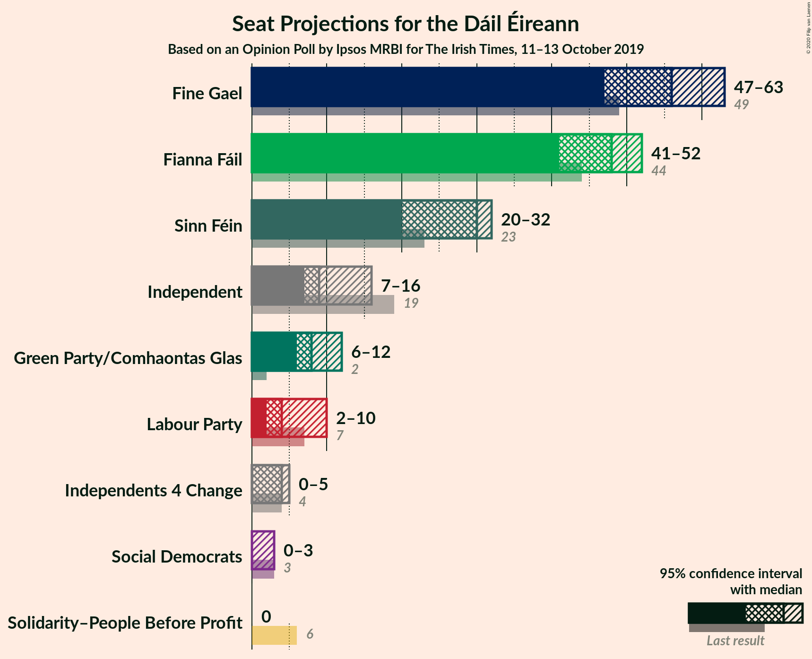
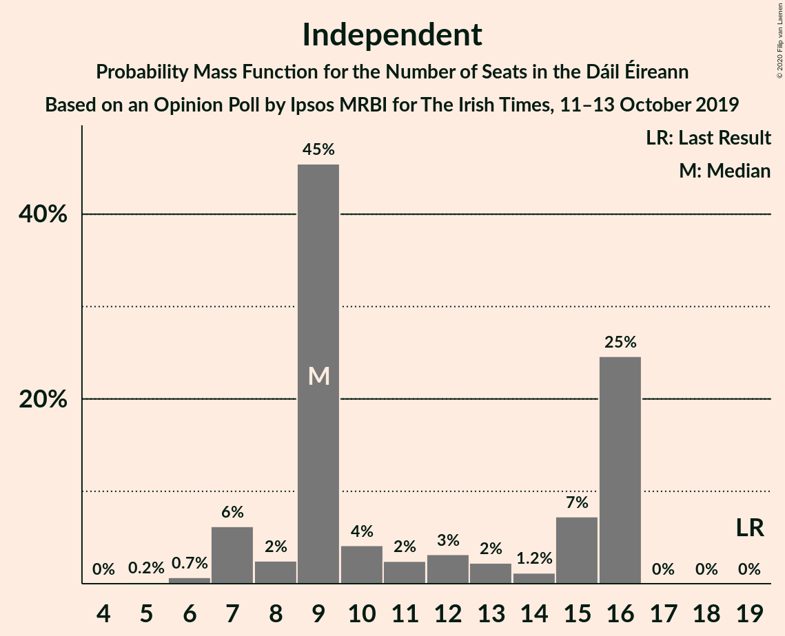
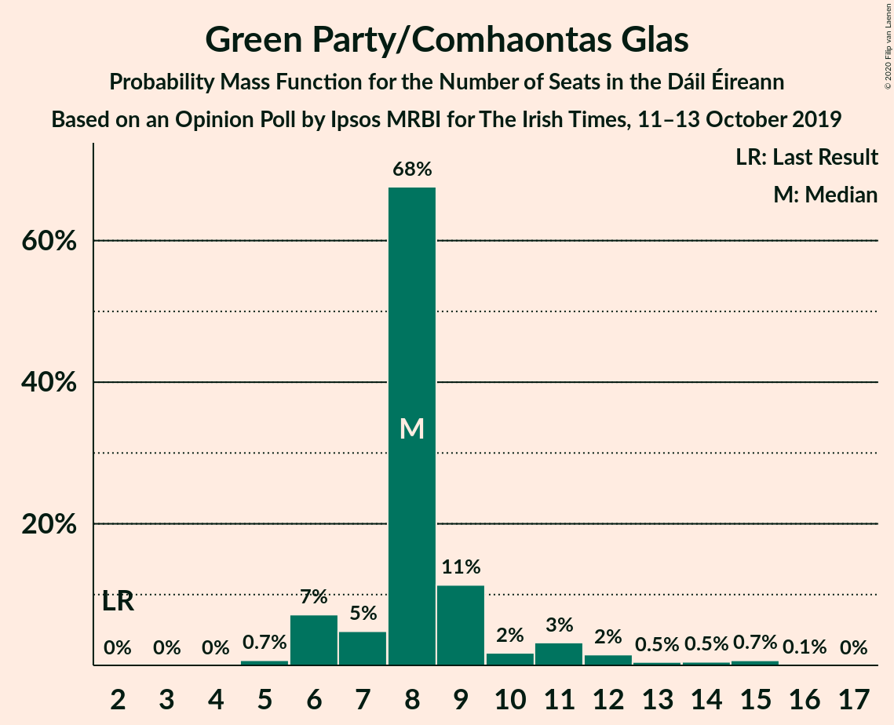
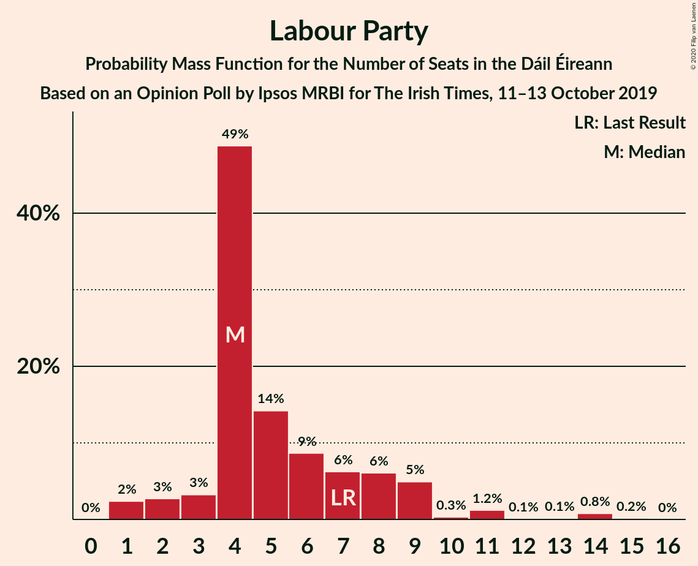
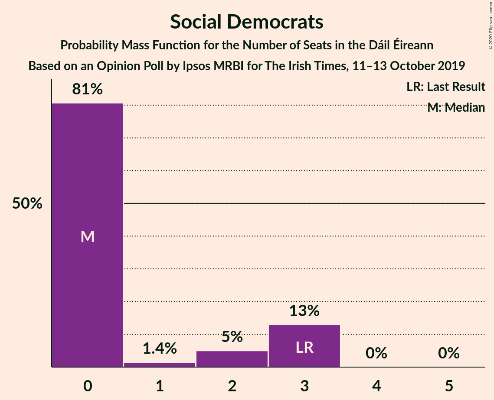
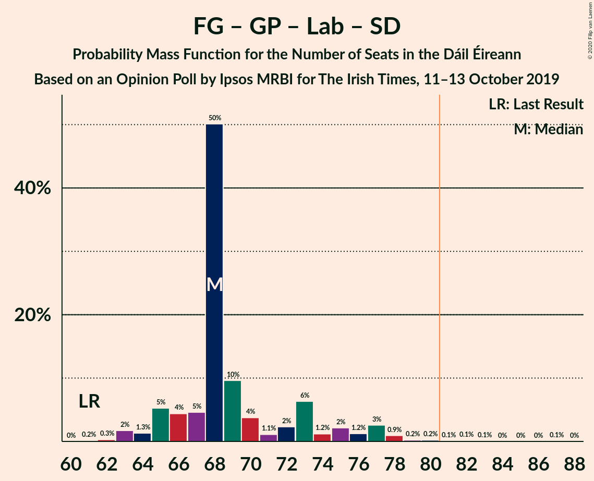

# Opinion Poll by Ipsos MRBI for The Irish Times, 11–13 October 2019

<a href="#voting-intentions">Voting Intentions</a> | <a href="#seats">Seats</a> | <a href="#coalitions">Coalitions</a> | <a href="#technical-information">Technical Information</a>

## Voting Intentions

### Confidence Intervals

| Party | Last Result | Poll Result | 80% Confidence Interval | 90% Confidence Interval | 95% Confidence Interval | 99% Confidence Interval |
|:-----:|:-----------:|:-----------:|:-----------------------:|:-----------------------:|:-----------------------:|:-----------------------:|
| Fine Gael | 25.5% | 29.3% | 27.7–31.1% |27.2–31.6% |26.8–32.0% |26.0–32.8% |
| Fianna Fáil | 24.3% | 25.2% | 23.7–26.9% |23.2–27.4% |22.9–27.8% |22.1–28.6% |
| Sinn Féin | 13.8% | 14.2% | 12.9–15.5% |12.6–15.9% |12.3–16.3% |11.7–16.9% |
| Independent | 15.9% | 12.6% | 11.4–13.9% |11.1–14.3% |10.8–14.6% |10.3–15.2% |
| Green Party/Comhaontas Glas | 2.7% | 8.1% | 7.1–9.2% |6.9–9.5% |6.7–9.8% |6.2–10.3% |
| Labour Party | 6.6% | 6.1% | 5.3–7.1% |5.0–7.3% |4.9–7.6% |4.5–8.1% |
| Independents 4 Change | 1.5% | 1.6% | 1.2–2.2% |1.1–2.3% |1.0–2.5% |0.9–2.8% |
| Solidarity–People Before Profit | 3.9% | 1.0% | 0.7–1.5% |0.6–1.6% |0.6–1.8% |0.5–2.0% |
| Social Democrats | 3.0% | 1.0% | 0.7–1.5% |0.6–1.6% |0.6–1.8% |0.5–2.0% |

*Note:* The poll result column reflects the actual value used in the calculations. Published results may vary slightly, and in addition be rounded to fewer digits.

## Seats

### Confidence Intervals

| Party | Last Result | Median | 80% Confidence Interval | 90% Confidence Interval | 95% Confidence Interval | 99% Confidence Interval |
|:-----:|:-----------:|:------:|:-----------------------:|:-----------------------:|:-----------------------:|:-----------------------:|
| <a href="#fine-gael">Fine Gael</a> | 49 | 62 | 59–68 |57–70 |56–70 |55–72 |
| <a href="#fianna-fáil">Fianna Fáil</a> | 44 | 54 | 46–55 |44–55 |43–56 |39–56 |
| <a href="#sinn-féin">Sinn Féin</a> | 23 | 21 | 18–22 |16–25 |16–26 |15–27 |
| <a href="#independent">Independent</a> | 19 | 15 | 15–16 |15–18 |15–20 |13–22 |
| <a href="#green-party/comhaontas-glas">Green Party/Comhaontas Glas</a> | 2 | 5 | 5–7 |4–7 |4–7 |3–9 |
| <a href="#labour-party">Labour Party</a> | 7 | 1 | 0–3 |0–3 |0–4 |0–7 |
| <a href="#independents-4-change">Independents 4 Change</a> | 4 | 3 | 2–4 |1–4 |1–5 |0–5 |
| <a href="#solidarity–people-before-profit">Solidarity–People Before Profit</a> | 6 | 0 | 0 |0 |0 |0 |
| <a href="#social-democrats">Social Democrats</a> | 3 | 0 | 0 |0–2 |0–2 |0–3 |

### Fine Gael

*For a full overview of the results for this party, see the [Fine Gael](party-finegael.html) page.*

| Number of Seats | Probability | Accumulated | Special Marks |
|:---------------:|:-----------:|:-----------:|:-------------:|
| 49 | 0% | 100% | Last Result |
| 50 | 0% | 100% |  |
| 51 | 0% | 100% |  |
| 52 | 0% | 100% |  |
| 53 | 0% | 100% |  |
| 54 | 0.3% | 99.9% |  |
| 55 | 0.8% | 99.6% |  |
| 56 | 4% | 98.8% |  |
| 57 | 1.2% | 95% |  |
| 58 | 3% | 94% |  |
| 59 | 4% | 91% |  |
| 60 | 4% | 87% |  |
| 61 | 31% | 83% |  |
| 62 | 14% | 51% | Median |
| 63 | 6% | 37% |  |
| 64 | 14% | 32% |  |
| 65 | 0.7% | 18% |  |
| 66 | 3% | 17% |  |
| 67 | 3% | 14% |  |
| 68 | 1.2% | 11% |  |
| 69 | 3% | 10% |  |
| 70 | 5% | 7% |  |
| 71 | 0.3% | 2% |  |
| 72 | 2% | 2% |  |
| 73 | 0.1% | 0.1% |  |
| 74 | 0% | 0% |  |

### Fianna Fáil

*For a full overview of the results for this party, see the [Fianna Fáil](party-fiannafáil.html) page.*

| Number of Seats | Probability | Accumulated | Special Marks |
|:---------------:|:-----------:|:-----------:|:-------------:|
| 37 | 0.1% | 100% |  |
| 38 | 0.4% | 99.9% |  |
| 39 | 0.1% | 99.6% |  |
| 40 | 0.1% | 99.4% |  |
| 41 | 0.4% | 99.3% |  |
| 42 | 0.3% | 98.9% |  |
| 43 | 2% | 98.6% |  |
| 44 | 5% | 96% | Last Result |
| 45 | 0.8% | 91% |  |
| 46 | 3% | 91% |  |
| 47 | 0.4% | 88% |  |
| 48 | 3% | 87% |  |
| 49 | 5% | 84% |  |
| 50 | 2% | 79% |  |
| 51 | 2% | 77% |  |
| 52 | 12% | 75% |  |
| 53 | 8% | 62% |  |
| 54 | 43% | 54% | Median |
| 55 | 8% | 11% |  |
| 56 | 3% | 3% |  |
| 57 | 0.1% | 0.1% |  |
| 58 | 0% | 0% |  |

### Sinn Féin

*For a full overview of the results for this party, see the [Sinn Féin](party-sinnféin.html) page.*

| Number of Seats | Probability | Accumulated | Special Marks |
|:---------------:|:-----------:|:-----------:|:-------------:|
| 13 | 0.1% | 100% |  |
| 14 | 0.2% | 99.9% |  |
| 15 | 1.3% | 99.7% |  |
| 16 | 5% | 98% |  |
| 17 | 2% | 94% |  |
| 18 | 30% | 91% |  |
| 19 | 8% | 61% |  |
| 20 | 3% | 54% |  |
| 21 | 30% | 51% | Median |
| 22 | 11% | 21% |  |
| 23 | 4% | 10% | Last Result |
| 24 | 0.9% | 6% |  |
| 25 | 2% | 5% |  |
| 26 | 2% | 3% |  |
| 27 | 0.7% | 1.0% |  |
| 28 | 0.2% | 0.3% |  |
| 29 | 0.1% | 0.1% |  |
| 30 | 0% | 0% |  |

### Independent

*For a full overview of the results for this party, see the [Independent](party-independent.html) page.*

| Number of Seats | Probability | Accumulated | Special Marks |
|:---------------:|:-----------:|:-----------:|:-------------:|
| 12 | 0.2% | 100% |  |
| 13 | 0.4% | 99.8% |  |
| 14 | 0.6% | 99.4% |  |
| 15 | 52% | 98.8% | Median |
| 16 | 37% | 46% |  |
| 17 | 2% | 9% |  |
| 18 | 4% | 7% |  |
| 19 | 1.1% | 4% | Last Result |
| 20 | 1.0% | 3% |  |
| 21 | 0.3% | 2% |  |
| 22 | 1.3% | 1.4% |  |
| 23 | 0% | 0.1% |  |
| 24 | 0% | 0% |  |

### Green Party/Comhaontas Glas

*For a full overview of the results for this party, see the [Green Party/Comhaontas Glas](party-greenpartycomhaontasglas.html) page.*

| Number of Seats | Probability | Accumulated | Special Marks |
|:---------------:|:-----------:|:-----------:|:-------------:|
| 2 | 0% | 100% | Last Result |
| 3 | 2% | 100% |  |
| 4 | 4% | 98% |  |
| 5 | 71% | 94% | Median |
| 6 | 7% | 23% |  |
| 7 | 15% | 16% |  |
| 8 | 0.4% | 1.0% |  |
| 9 | 0.3% | 0.5% |  |
| 10 | 0.1% | 0.2% |  |
| 11 | 0% | 0.1% |  |
| 12 | 0% | 0% |  |

### Labour Party

*For a full overview of the results for this party, see the [Labour Party](party-labourparty.html) page.*

| Number of Seats | Probability | Accumulated | Special Marks |
|:---------------:|:-----------:|:-----------:|:-------------:|
| 0 | 15% | 100% |  |
| 1 | 38% | 85% | Median |
| 2 | 18% | 47% |  |
| 3 | 25% | 29% |  |
| 4 | 2% | 4% |  |
| 5 | 2% | 2% |  |
| 6 | 0.1% | 0.8% |  |
| 7 | 0.2% | 0.7% | Last Result |
| 8 | 0.4% | 0.5% |  |
| 9 | 0% | 0% |  |

### Independents 4 Change

*For a full overview of the results for this party, see the [Independents 4 Change](party-independents4change.html) page.*

| Number of Seats | Probability | Accumulated | Special Marks |
|:---------------:|:-----------:|:-----------:|:-------------:|
| 0 | 0.8% | 100% |  |
| 1 | 9% | 99.2% |  |
| 2 | 37% | 90% |  |
| 3 | 29% | 53% | Median |
| 4 | 20% | 24% | Last Result |
| 5 | 5% | 5% |  |
| 6 | 0% | 0% |  |

### Solidarity–People Before Profit

*For a full overview of the results for this party, see the [Solidarity–People Before Profit](party-solidarity–peoplebeforeprofit.html) page.*

| Number of Seats | Probability | Accumulated | Special Marks |
|:---------------:|:-----------:|:-----------:|:-------------:|
| 0 | 100% | 100% | Median |
| 1 | 0% | 0% |  |
| 2 | 0% | 0% |  |
| 3 | 0% | 0% |  |
| 4 | 0% | 0% |  |
| 5 | 0% | 0% |  |
| 6 | 0% | 0% | Last Result |

### Social Democrats

*For a full overview of the results for this party, see the [Social Democrats](party-socialdemocrats.html) page.*

| Number of Seats | Probability | Accumulated | Special Marks |
|:---------------:|:-----------:|:-----------:|:-------------:|
| 0 | 92% | 100% | Median |
| 1 | 1.0% | 8% |  |
| 2 | 5% | 7% |  |
| 3 | 2% | 2% | Last Result |
| 4 | 0% | 0% |  |

## Coalitions

### Confidence Intervals

| Coalition | Last Result | Median | Majority? | 80% Confidence Interval | 90% Confidence Interval | 95% Confidence Interval | 99% Confidence Interval |
|:---------:|:-----------:|:------:|:---------:|:-----------------------:|:-----------------------:|:-----------------------:|:-----------------------:|
| Fine Gael – Fianna Fáil | 93 | 115 | 100% | 109–118 | 107–118 | 107–119 | 103–121 |
| Fine Gael – Green Party/Comhaontas Glas – Labour Party | 58 | 69 | 0.1% | 66–75 | 65–76 | 64–78 | 62–78 |
| Fine Gael – Green Party/Comhaontas Glas – Labour Party – Social Democrats | 61 | 69 | 0.2% | 67–76 | 65–76 | 64–78 | 63–78 |
| Fianna Fáil – Sinn Féin | 67 | 72 | 0% | 66–75 | 65–76 | 65–76 | 62–78 |
| Fine Gael – Green Party/Comhaontas Glas | 51 | 67 | 0% | 64–74 | 62–75 | 61–76 | 60–77 |
| Fine Gael – Labour Party | 56 | 64 | 0% | 61–70 | 59–71 | 59–73 | 57–73 |
| Fine Gael | 49 | 62 | 0% | 59–68 | 57–70 | 56–70 | 55–72 |
| Fianna Fáil – Green Party/Comhaontas Glas – Labour Party – Social Democrats | 56 | 60 | 0% | 52–62 | 50–63 | 50–64 | 47–65 |
| Fianna Fáil – Green Party/Comhaontas Glas – Labour Party | 53 | 60 | 0% | 52–62 | 50–63 | 50–63 | 47–64 |
| Fianna Fáil – Green Party/Comhaontas Glas | 46 | 59 | 0% | 51–61 | 49–61 | 48–61 | 44–62 |
| Fianna Fáil – Labour Party | 51 | 55 | 0% | 47–57 | 45–57 | 45–58 | 42–58 |

### Fine Gael – Fianna Fáil

| Number of Seats | Probability | Accumulated | Special Marks |
|:---------------:|:-----------:|:-----------:|:-------------:|
| 93 | 0% | 100% | Last Result |
| 94 | 0% | 100% |  |
| 95 | 0% | 100% |  |
| 96 | 0% | 100% |  |
| 97 | 0% | 100% |  |
| 98 | 0% | 100% |  |
| 99 | 0% | 100% |  |
| 100 | 0% | 100% |  |
| 101 | 0.1% | 100% |  |
| 102 | 0.1% | 99.8% |  |
| 103 | 0.3% | 99.8% |  |
| 104 | 0.3% | 99.5% |  |
| 105 | 0.9% | 99.2% |  |
| 106 | 0.5% | 98% |  |
| 107 | 3% | 98% |  |
| 108 | 1.5% | 95% |  |
| 109 | 4% | 93% |  |
| 110 | 2% | 90% |  |
| 111 | 4% | 87% |  |
| 112 | 2% | 83% |  |
| 113 | 10% | 81% |  |
| 114 | 12% | 71% |  |
| 115 | 21% | 59% |  |
| 116 | 13% | 38% | Median |
| 117 | 3% | 25% |  |
| 118 | 18% | 21% |  |
| 119 | 1.0% | 3% |  |
| 120 | 1.3% | 2% |  |
| 121 | 0.9% | 1.0% |  |
| 122 | 0.1% | 0.1% |  |
| 123 | 0% | 0% |  |

### Fine Gael – Green Party/Comhaontas Glas – Labour Party

| Number of Seats | Probability | Accumulated | Special Marks |
|:---------------:|:-----------:|:-----------:|:-------------:|
| 58 | 0% | 100% | Last Result |
| 59 | 0% | 100% |  |
| 60 | 0% | 100% |  |
| 61 | 0.2% | 99.9% |  |
| 62 | 0.3% | 99.7% |  |
| 63 | 1.1% | 99.4% |  |
| 64 | 3% | 98% |  |
| 65 | 4% | 95% |  |
| 66 | 1.1% | 91% |  |
| 67 | 21% | 90% |  |
| 68 | 7% | 69% | Median |
| 69 | 21% | 62% |  |
| 70 | 16% | 40% |  |
| 71 | 3% | 24% |  |
| 72 | 2% | 22% |  |
| 73 | 5% | 20% |  |
| 74 | 3% | 14% |  |
| 75 | 1.2% | 11% |  |
| 76 | 6% | 10% |  |
| 77 | 0.9% | 4% |  |
| 78 | 2% | 3% |  |
| 79 | 0.2% | 0.3% |  |
| 80 | 0.1% | 0.2% |  |
| 81 | 0% | 0.1% | Majority |
| 82 | 0% | 0% |  |

### Fine Gael – Green Party/Comhaontas Glas – Labour Party – Social Democrats

| Number of Seats | Probability | Accumulated | Special Marks |
|:---------------:|:-----------:|:-----------:|:-------------:|
| 61 | 0.1% | 100% | Last Result |
| 62 | 0.2% | 99.9% |  |
| 63 | 0.6% | 99.7% |  |
| 64 | 3% | 99.1% |  |
| 65 | 4% | 96% |  |
| 66 | 1.1% | 92% |  |
| 67 | 20% | 91% |  |
| 68 | 8% | 71% | Median |
| 69 | 22% | 63% |  |
| 70 | 15% | 41% |  |
| 71 | 3% | 26% |  |
| 72 | 4% | 24% |  |
| 73 | 4% | 20% |  |
| 74 | 4% | 16% |  |
| 75 | 2% | 12% |  |
| 76 | 6% | 10% |  |
| 77 | 0.6% | 4% |  |
| 78 | 3% | 3% |  |
| 79 | 0.2% | 0.4% |  |
| 80 | 0.1% | 0.2% |  |
| 81 | 0.1% | 0.2% | Majority |
| 82 | 0% | 0.1% |  |
| 83 | 0% | 0% |  |

### Fianna Fáil – Sinn Féin

| Number of Seats | Probability | Accumulated | Special Marks |
|:---------------:|:-----------:|:-----------:|:-------------:|
| 58 | 0% | 100% |  |
| 59 | 0.1% | 99.9% |  |
| 60 | 0% | 99.9% |  |
| 61 | 0.3% | 99.8% |  |
| 62 | 0.2% | 99.6% |  |
| 63 | 0.6% | 99.4% |  |
| 64 | 0.9% | 98.8% |  |
| 65 | 3% | 98% |  |
| 66 | 6% | 95% |  |
| 67 | 5% | 89% | Last Result |
| 68 | 4% | 85% |  |
| 69 | 1.5% | 81% |  |
| 70 | 8% | 79% |  |
| 71 | 2% | 71% |  |
| 72 | 20% | 70% |  |
| 73 | 14% | 49% |  |
| 74 | 4% | 35% |  |
| 75 | 25% | 31% | Median |
| 76 | 3% | 6% |  |
| 77 | 2% | 2% |  |
| 78 | 0.3% | 0.6% |  |
| 79 | 0.3% | 0.3% |  |
| 80 | 0.1% | 0.1% |  |
| 81 | 0% | 0% | Majority |

### Fine Gael – Green Party/Comhaontas Glas

| Number of Seats | Probability | Accumulated | Special Marks |
|:---------------:|:-----------:|:-----------:|:-------------:|
| 51 | 0% | 100% | Last Result |
| 52 | 0% | 100% |  |
| 53 | 0% | 100% |  |
| 54 | 0% | 100% |  |
| 55 | 0% | 100% |  |
| 56 | 0% | 100% |  |
| 57 | 0% | 100% |  |
| 58 | 0% | 100% |  |
| 59 | 0.3% | 99.9% |  |
| 60 | 0.6% | 99.7% |  |
| 61 | 3% | 99.0% |  |
| 62 | 2% | 96% |  |
| 63 | 3% | 94% |  |
| 64 | 3% | 92% |  |
| 65 | 4% | 88% |  |
| 66 | 33% | 85% |  |
| 67 | 6% | 52% | Median |
| 68 | 6% | 46% |  |
| 69 | 18% | 41% |  |
| 70 | 3% | 22% |  |
| 71 | 6% | 20% |  |
| 72 | 3% | 13% |  |
| 73 | 0.5% | 11% |  |
| 74 | 3% | 10% |  |
| 75 | 5% | 7% |  |
| 76 | 0.5% | 3% |  |
| 77 | 2% | 2% |  |
| 78 | 0.1% | 0.1% |  |
| 79 | 0% | 0% |  |

### Fine Gael – Labour Party

| Number of Seats | Probability | Accumulated | Special Marks |
|:---------------:|:-----------:|:-----------:|:-------------:|
| 55 | 0.1% | 100% |  |
| 56 | 0.3% | 99.9% | Last Result |
| 57 | 0.5% | 99.6% |  |
| 58 | 1.1% | 99.1% |  |
| 59 | 5% | 98% |  |
| 60 | 2% | 93% |  |
| 61 | 3% | 91% |  |
| 62 | 21% | 88% |  |
| 63 | 15% | 67% | Median |
| 64 | 21% | 52% |  |
| 65 | 7% | 31% |  |
| 66 | 3% | 24% |  |
| 67 | 3% | 20% |  |
| 68 | 3% | 17% |  |
| 69 | 3% | 13% |  |
| 70 | 0.7% | 10% |  |
| 71 | 6% | 9% |  |
| 72 | 0.6% | 3% |  |
| 73 | 2% | 3% |  |
| 74 | 0.1% | 0.2% |  |
| 75 | 0.1% | 0.1% |  |
| 76 | 0% | 0% |  |

### Fine Gael

| Number of Seats | Probability | Accumulated | Special Marks |
|:---------------:|:-----------:|:-----------:|:-------------:|
| 49 | 0% | 100% | Last Result |
| 50 | 0% | 100% |  |
| 51 | 0% | 100% |  |
| 52 | 0% | 100% |  |
| 53 | 0% | 100% |  |
| 54 | 0.3% | 99.9% |  |
| 55 | 0.8% | 99.6% |  |
| 56 | 4% | 98.8% |  |
| 57 | 1.2% | 95% |  |
| 58 | 3% | 94% |  |
| 59 | 4% | 91% |  |
| 60 | 4% | 87% |  |
| 61 | 31% | 83% |  |
| 62 | 14% | 51% | Median |
| 63 | 6% | 37% |  |
| 64 | 14% | 32% |  |
| 65 | 0.7% | 18% |  |
| 66 | 3% | 17% |  |
| 67 | 3% | 14% |  |
| 68 | 1.2% | 11% |  |
| 69 | 3% | 10% |  |
| 70 | 5% | 7% |  |
| 71 | 0.3% | 2% |  |
| 72 | 2% | 2% |  |
| 73 | 0.1% | 0.1% |  |
| 74 | 0% | 0% |  |

### Fianna Fáil – Green Party/Comhaontas Glas – Labour Party – Social Democrats

| Number of Seats | Probability | Accumulated | Special Marks |
|:---------------:|:-----------:|:-----------:|:-------------:|
| 45 | 0.1% | 100% |  |
| 46 | 0.3% | 99.9% |  |
| 47 | 0.4% | 99.7% |  |
| 48 | 0.2% | 99.3% |  |
| 49 | 0.6% | 99.1% |  |
| 50 | 5% | 98.6% |  |
| 51 | 1.4% | 94% |  |
| 52 | 2% | 92% |  |
| 53 | 3% | 90% |  |
| 54 | 0.7% | 87% |  |
| 55 | 1.1% | 86% |  |
| 56 | 1.2% | 85% | Last Result |
| 57 | 4% | 84% |  |
| 58 | 2% | 80% |  |
| 59 | 10% | 77% |  |
| 60 | 33% | 68% | Median |
| 61 | 9% | 35% |  |
| 62 | 18% | 27% |  |
| 63 | 5% | 8% |  |
| 64 | 2% | 3% |  |
| 65 | 0.5% | 0.8% |  |
| 66 | 0.1% | 0.3% |  |
| 67 | 0.2% | 0.2% |  |
| 68 | 0% | 0% |  |

### Fianna Fáil – Green Party/Comhaontas Glas – Labour Party

| Number of Seats | Probability | Accumulated | Special Marks |
|:---------------:|:-----------:|:-----------:|:-------------:|
| 45 | 0% | 100% |  |
| 46 | 0.3% | 99.9% |  |
| 47 | 0.4% | 99.7% |  |
| 48 | 0.2% | 99.3% |  |
| 49 | 0.6% | 99.1% |  |
| 50 | 5% | 98.5% |  |
| 51 | 2% | 94% |  |
| 52 | 3% | 92% |  |
| 53 | 3% | 89% | Last Result |
| 54 | 1.1% | 87% |  |
| 55 | 1.5% | 86% |  |
| 56 | 2% | 84% |  |
| 57 | 3% | 82% |  |
| 58 | 3% | 79% |  |
| 59 | 9% | 76% |  |
| 60 | 34% | 67% | Median |
| 61 | 9% | 32% |  |
| 62 | 16% | 23% |  |
| 63 | 5% | 7% |  |
| 64 | 2% | 2% |  |
| 65 | 0.4% | 0.4% |  |
| 66 | 0.1% | 0.1% |  |
| 67 | 0% | 0% |  |

### Fianna Fáil – Green Party/Comhaontas Glas

| Number of Seats | Probability | Accumulated | Special Marks |
|:---------------:|:-----------:|:-----------:|:-------------:|
| 42 | 0% | 100% |  |
| 43 | 0.4% | 99.9% |  |
| 44 | 0.1% | 99.6% |  |
| 45 | 0.1% | 99.4% |  |
| 46 | 0.6% | 99.4% | Last Result |
| 47 | 0.7% | 98.8% |  |
| 48 | 2% | 98% |  |
| 49 | 5% | 97% |  |
| 50 | 0.9% | 92% |  |
| 51 | 2% | 91% |  |
| 52 | 0.6% | 89% |  |
| 53 | 4% | 88% |  |
| 54 | 3% | 84% |  |
| 55 | 4% | 81% |  |
| 56 | 2% | 78% |  |
| 57 | 13% | 75% |  |
| 58 | 8% | 62% |  |
| 59 | 32% | 54% | Median |
| 60 | 6% | 23% |  |
| 61 | 16% | 17% |  |
| 62 | 0.7% | 1.1% |  |
| 63 | 0.4% | 0.4% |  |
| 64 | 0% | 0.1% |  |
| 65 | 0% | 0% |  |

### Fianna Fáil – Labour Party

| Number of Seats | Probability | Accumulated | Special Marks |
|:---------------:|:-----------:|:-----------:|:-------------:|
| 40 | 0.1% | 100% |  |
| 41 | 0.1% | 99.9% |  |
| 42 | 0.6% | 99.8% |  |
| 43 | 0.4% | 99.3% |  |
| 44 | 0.4% | 98.9% |  |
| 45 | 5% | 98% |  |
| 46 | 3% | 94% |  |
| 47 | 2% | 91% |  |
| 48 | 2% | 89% |  |
| 49 | 1.2% | 86% |  |
| 50 | 2% | 85% |  |
| 51 | 0.5% | 83% | Last Result |
| 52 | 4% | 83% |  |
| 53 | 2% | 79% |  |
| 54 | 12% | 76% |  |
| 55 | 44% | 65% | Median |
| 56 | 9% | 21% |  |
| 57 | 8% | 12% |  |
| 58 | 4% | 4% |  |
| 59 | 0.4% | 0.4% |  |
| 60 | 0% | 0% |  |

## Technical Information

### Opinion Poll

+ **Polling firm:** Ipsos MRBI
+ **Commissioner(s):** The Irish Times
+ **Fieldwork period:** 11–13 October 2019

### Calculations

+ **Sample size:** 1200
+ **Simulations done:** 262,144
+ **Error estimate:** 1.43%

